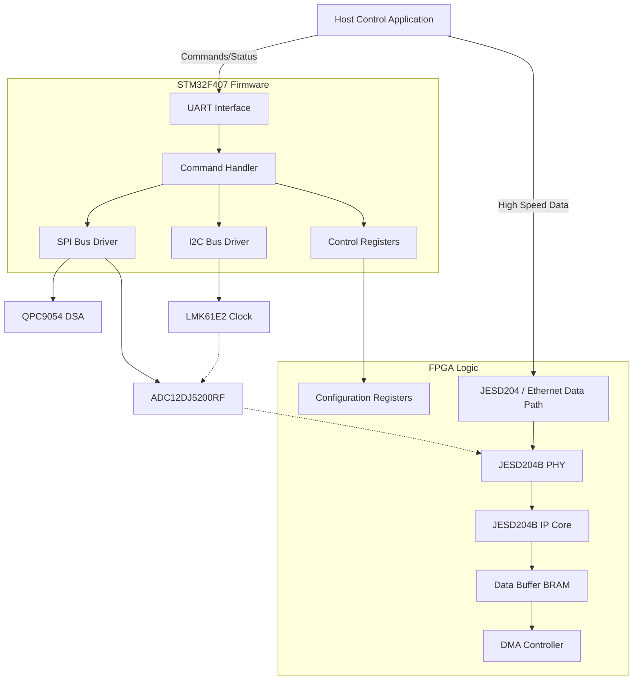
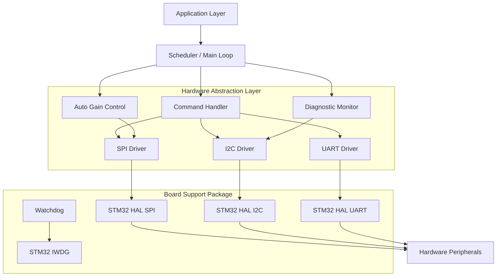
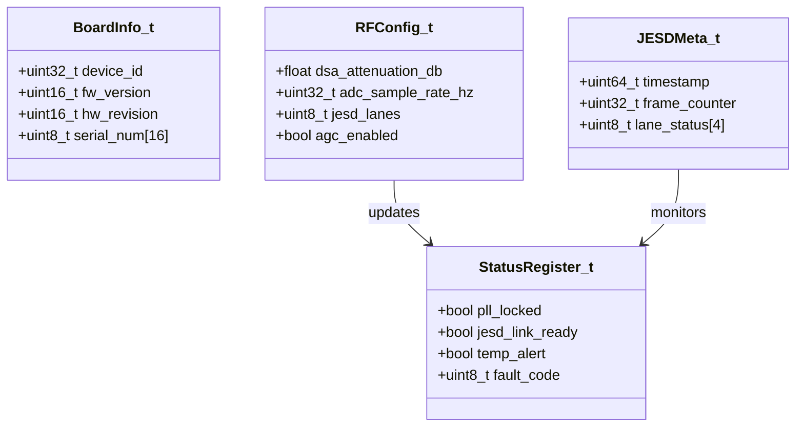
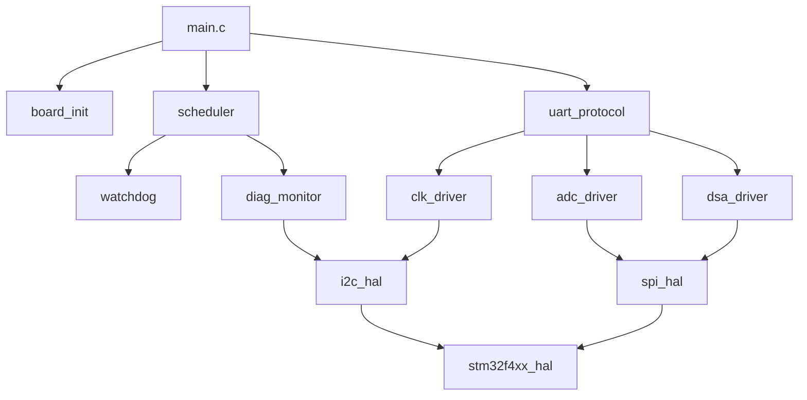
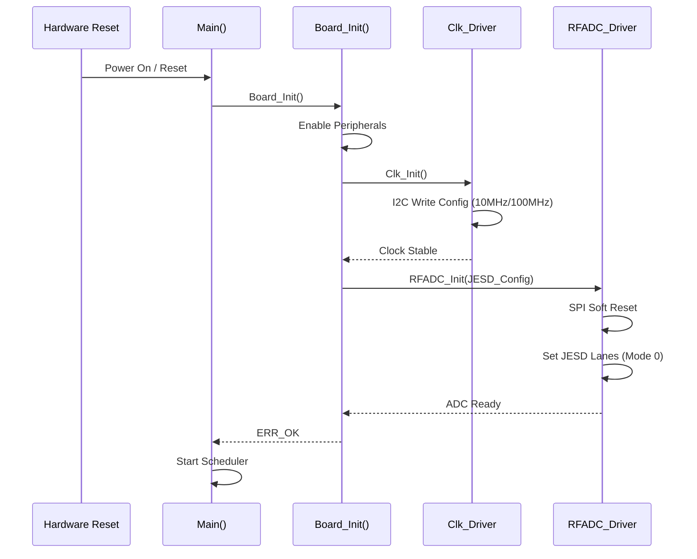
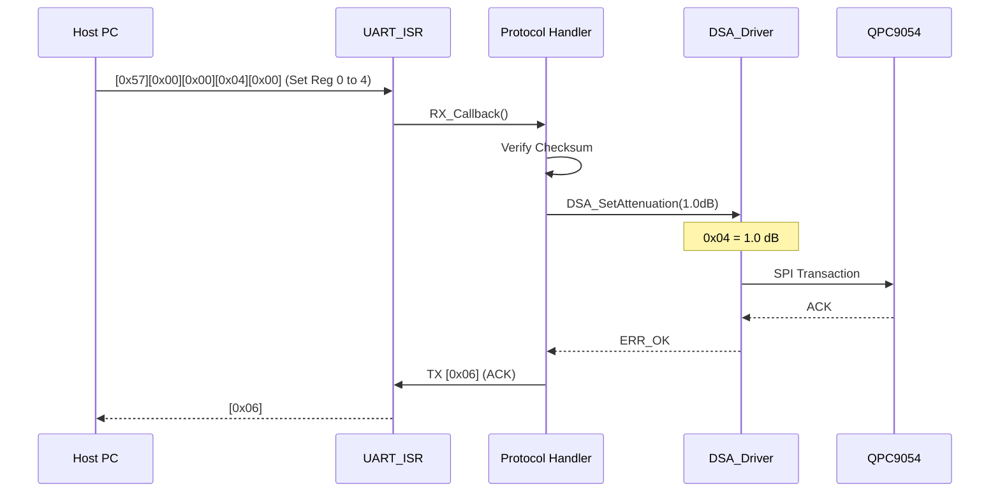
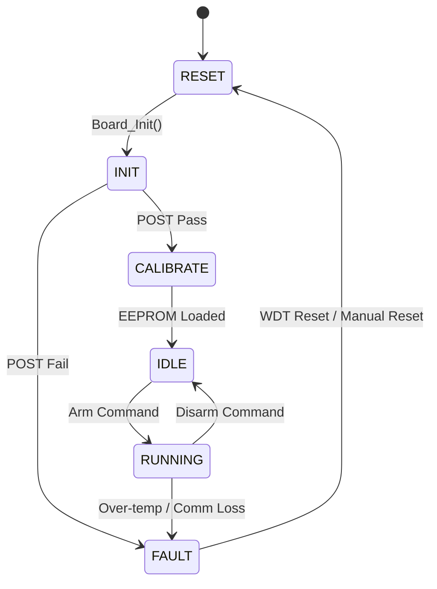
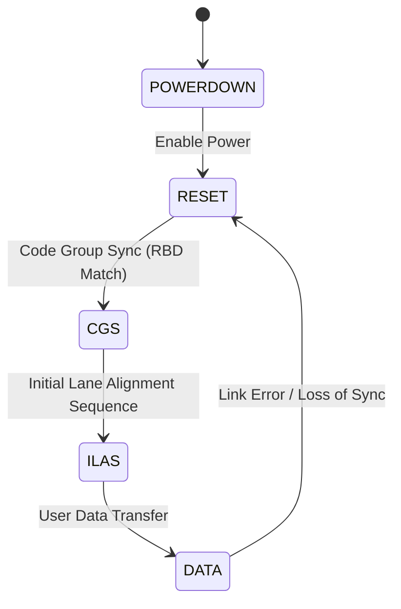

```markdown
# Software Design Document (SDD)

**Project:** Wideband RF Receiver System (Test)  
**Version:** 1.0  
**Date:** 17 April 2026  

## Document Control
| Version | Date | Author | Description |
|---------|------|--------|-------------|
| 1.0 | 17 April 2026 | Lead SW Architect | Initial design compliant with IEEE 1016-2009 |

---

# 1. Introduction

## 1.1 Purpose
This Software Design Document (SDD) provides the comprehensive structural design for the firmware and logic operating on the **Wideband RF Receiver System**. It describes the decomposition of the system into hardware-dependent and hardware-independent layers, the interfaces between the **STM32F407VGT6** MCU and the **FPGA**, and the detailed logic implementation for the **JESD204B/C** data path.

This document serves as the blueprint for:
1.  **Firmware Engineers** developing the C-based control code for the STM32.
2.  **FPGA Engineers** implementing the RTL for data capture and interface bridging.
3.  **Verification Engineers** developing test benches and integration test plans.

## 1.2 Scope
The design covers the software elements required to operate the RF receiver module defined in the SRS.
*   **Included:** Board Support Package (BSP) for STM32F407, HAL drivers for SPI/I2C/UART, logic design for JESD204B PHY and Transport layers, RF Control logic (DSA/AGC), and power management monitoring.
*   **Excluded:** High-level application DSP algorithms (e.g., FFT, demodulation) running on the Host PC, although data structures required to transport this data are defined.

**Target Hardware:**
*   **MCU:** STM32F407VGT6 (168 MHz, 1MB Flash, 192KB SRAM).
*   **FPGA:** Xilinx Kintex-7 (or equivalent) logic fabric for high-speed data handling.
*   **Compiler:** ARM GCC 10.3 (arm-none-eabi).
*   **Language:** C99 for firmware, VHDL-2008 / Verilog-2001 for FPGA.

## 1.3 Definitions, Acronyms
| Term | Definition |
| :--- | :--- |
| **ADC** | Analog-to-Digital Converter (ADC12DJ5200RF). |
| **AGC** | Automatic Gain Control. |
| **BRAM** | Block RAM (FPGA internal memory). |
| **DSA** | Digital Step Attenuator (QPC9054). |
| **FSM** | Finite State Machine. |
| **HAL** | Hardware Abstraction Layer. |
| **ISR** | Interrupt Service Routine. |
| **JESD** | JESD204B/C High-Speed Data Converter Interface. |
| **LMK** | LMK61E2 Clock Generator. |
| **MISRA** | Motor Industry Software Reliability Association C:2012. |
| **PCB** | Printed Circuit Board. |
| **PLL** | Phase-Locked Loop. |
| **POST** | Power-On Self Test. |
| **RTL** | Register Transfer Level. |
| **RX** | Receive / Receiver. |
| **SFDR** | Spurious-Free Dynamic Range. |
| **SNR** | Signal-to-Noise Ratio. |
| **SPI** | Serial Peripheral Interface. |
| **UART** | Universal Asynchronous Receiver-Transmitter. |
| **WDT** | Watchdog Timer. |

## 1.4 References
1.  IEEE 1016-2009: Standard for Information Technology — Systems Design — Software Design Descriptions.
2.  **SRS:** Wideband RF Receiver System Software Requirements Specification (v1.0, 17 April 2026).
3.  **GLR:** Glue Logic Requirements (v0V01, 17 April 2026).
4.  **HRS:** Hardware Requirements Specification (v1.0, 17 April 2026).
5.  **MISRA-C:** Guidelines for the Use of the C Language in Critical Systems (2012).
6.  STM32F407 Reference Manual (RM0090).
7.  JESD204B Standard (JEDEC Std 204B).

---

# 2. Design Viewpoints

## 2.1 Context Viewpoint — System Boundaries

The software system acts as the bridge between the Host PC (Controller) and the RF Analog Front End.



**External Interfaces:**
1.  **Host Command Interface:** UART @ 115200 baud (configurable up to 921600). Protocol defined in GLR.
2.  **RF Interface:** Analog 5–18 GHz input, amplified by LNA, attenuated by DSA.
3.  **Data Interface:** High-speed LVDS lanes (JESD204B) to FPGA.

## 2.2 Composition Viewpoint — Software Architecture

The software is organized into a strict layered architecture to ensure portability and testability.



### Module List with Responsibilities

**Module: board_init** (board_init.c / board_init.h)
*   **Responsibility:** Handles system clock configuration (168MHz PLL), enables GPIO peripherals, initializes the watchdog, and triggers the POST sequence.
*   **API:**
    *   `int32_t Board_Init(void);`
    *   `int32_t Board_GetInfo(BoardInfo_t *info);`
    *   `int32_t Board_RunPOST(uint32_t *error_mask);`

**Module: dsa_driver** (dsa_driver.c / dsa_driver.h)
*   **Responsibility:** Interface for the QPC9054 Digital Step Attenuator. Converts floating-point dB values to 7-bit latch commands.
*   **API:**
    *   `int32_t DSA_Init(void);`
    *   `int32_t DSA_SetAttenuation(float attenuation_db);` (0.0 to 31.75 dB)
    *   `int32_t DSA_GetAttenuation(float *current_db);`

**Module: adc_driver** (adc_driver.c / adc_driver.h)
*   **Responsibility:** Configuration of the ADC12DJ5200RF via SPI. Sets JESD204B link parameters (K, L, M, F), test patterns, and power-down modes.
*   **API:**
    *   `int32_t RFADC_Init(const RFADC_Config_t *cfg);`
    *   `int32_t RFADC_SetJESDMode(JESD_Mode_e mode);`
    *   `int32_t RFADC_SoftSync(void);`
    *   `int32_t RFADC_ReadStatus(uint8_t *status_bytes);`

**Module: clk_driver** (clk_driver.c / clk_driver.h)
*   **Responsibility:** Configuration of the LMK61E2 clock generator via I2C. Sets the output frequency to drive the ADC and FPGA.
*   **API:**
    *   `int32_t Clk_Init(void);`
    *   `int32_t Clk_SetFrequency(uint32_t freq_hz);`
    *   `int32_t Clk_EnableOutput(bool enable);`

**Module: uart_protocol** (uart_protocol.c / uart_protocol.h)
*   **Responsibility:** Implements the GLR defined packet protocol. Handles framing, checksums, and dispatching read/write commands to the register map.
*   **API:**
    *   `void UART_Task(void);` (Polling or ISR driven)
    *   `int32_t UART_ProcessPacket(const uint8_t *buf, uint16_t len);`

## 2.3 Logical Viewpoint — Data Model

Key data structures exchanged between the MCU and Host/FPGA.



**Struct Definitions (MISRA C):**

```c
/* Register Map Representation (Derived from GLR) */
typedef struct {
    uint8_t  dsa_latch;     /* 0x00: QPC9054 Attenuation Latch */
    uint8_t  adc_gain_0;    /* 0x01: ADC Gain Correction 0 */
    uint8_t  adc_gain_1;    /* 0x02: ADC Gain Correction 1 */
    uint16_t clk_freq_hi;   /* 0x03: Clock Freq High Word */
    uint16_t clk_freq_lo;   /* 0x05: Clock Freq Low Word */
    uint8_t  sys_ctrl;      /* 0x07: System Control Bits */
    uint8_t  sys_status;    /* 0x08: System Status Flags (RO) */
} RegMap_t;

typedef enum {
    SYS_STATE_INIT = 0,
    SYS_STATE_IDLE,
    SYS_STATE_ARMED,
    SYS_STATE_ACQUIRE,
    SYS_STATE_FAULT
} SystemState_e;
```

## 2.4 Dependency Viewpoint — Module Dependencies



**Build Order:**
1.  **BSP/HAL:** STM32 HAL Drivers (Static Lib).
2.  **Driver Layer:** SPI, I2C, UART wrappers.
3.  **Service Layer:** DSA, ADC, CLK, Protocol.
4.  **Application:** Main, Scheduler, Monitor.

## 2.5 Interface Viewpoint — Complete API Specification

**Function: DSA_SetAttenuation**
*   **Signature:** `int32_t DSA_SetAttenuation(float attenuation_db);`
*   **Parameters:**
    *   `attenuation_db`: Desired attenuation in dB. Valid range: 0.0 to 31.75. Step size: 0.25.
*   **Returns:**
    *   `ERR_OK` (0) on success.
    *   `ERR_PARAM` if value outside range.
    *   `ERR_SPI` if communication fails.
*   **Description:** Converts float dB to 7-bit integer. The QPC9054 expects:
    *   Bit 6: MSB of attenuation.
    *   Bit 0-5: LSBs.
    *   Formula: `Code = (int32_t)(attenuation_db / 0.25f);`
*   **Pre-condition:** `DSA_Init()` must have been called.
*   **Thread Safety:** No. Caller must ensure mutual exclusion if called from multiple contexts (though typically single-threaded main loop).

**Function: RFADC_Init**
*   **Signature:** `int32_t RFADC_Init(const RFADC_Config_t *cfg);`
*   **Parameters:**
    *   `cfg`: Pointer to struct defining JESD204B parameters (L, M, F, S, CS).
*   **Returns:** Error code.
*   **Description:** Programs the SPI registers of ADC12DJ5200RF to enable the JESD204B PHY.

## 2.6 Interaction Viewpoint — Sequence Diagrams

**System Startup Sequence (MCU):**



**Host Write DSA Sequence:**



## 2.7 State Viewpoint — State Machines

**MCU System State Machine:**



**JESD204B Link State Machine (FPGA):**



## 2.8 Algorithm Viewpoint — Key Algorithms

### 2.8.1 DSA Gain Calculation
The QPC9054 provides 31.75 dB range in 0.25 dB steps (7-bit control).
```c
/* MISRA C:2012 Compliant */
int32_t DSA_SetAttenuation(float attenuation_db)
{
    int32_t ret_val = ERR_OK;
    
    /* Input Validation */
    if ((attenuation_db < 0.0f) || (attenuation_db > 31.75f))
    {
        return ERR_PARAM;
    }

    /* Convert float to 7-bit integer code */
    /* 0.25 dB step -> Multiply by 4 */
    uint8_t code = (uint8_t)(attenuation_db * 4.0f);
    
    /* SPI Transaction */
    uint8_t tx_buf[2] = {0x00, code}; /* Addr 0x00 is Latch */
    
    if (SPI_Write(QPC9054_CS_PIN, tx_buf, 2) != 0)
    {
        ret_val = ERR_SPI;
    }
    
    return ret_val;
}
```

### 2.8.2 Temperature to ADC Conversion (I2C Sensor)
Reading from the on-board temp sensor (assume standard I2C format):
```c
float TempMon_ConvertC(int16_t raw_temp)
{
    /* Standard conversion: 0.0625 degrees per LSB */
    return ((float)raw_temp * 0.0625f);
}
```

## 2.9 Resource Viewpoint — Real-Time Constraints

### 2.9.1 Task Scheduling Table
The firmware uses a non-preemptive super-loop scheduler with time-slicing.

| Task Name | Period (ms) | Exec Time (us) | Priority | Deadline | Action |
|-----------|-------------|----------------|----------|----------|--------|
| UART_Task | 1 | 50 | High | 1 ms | Check RX buffer, parse packets |
| WDT_Task | 100 | 10 | Highest | 100 ms | Kick watchdog |
| Mon_Task | 500 | 200 | Low | 500 ms | Read Temp, Voltage |
| LED_Task | 1000 | 5 | Low | 1000 ms | Blink Status LED |

### 2.9.2 ISR Latency Budget
| Interrupt Source | Max Latency | Context | Action |
|-----------------|-------------|---------|--------|
| UART RX (USART2) | < 10 us | DMA/ISR | Receive byte from Host |
| SPI DMA TX/RX | < 50 us | DMA | Complete ADC/DSA transaction |
| I2C Event | < 100 us | ISR | Alert from Temp Sensor |

### 2.9.3 Memory Budget (STM32F407VGT6)
| Region | Size | Usage |
|--------|------|-------|
| Flash (Code) | 256 KB | Firmware, Drivers, Constants |
| Flash (NVM) | 16 KB | Calibration Data EEPROM Emulation |
| SRAM1 (Main) | 80 KB | Heap, Stack, Global Structs |
| SRAM2 (DMA) | 16 KB | UART Buffers, SPI FIFOs |

## 2.10 Build System Viewpoint

**CMakeLists.txt Structure:**

```cmake
cmake_minimum_required(VERSION 3.20)
project(RF_Receiver_Firmware C ASM)

set(CMAKE_C_STANDARD 11)
set(MCU_FLAGS "-mcpu=cortex-m4 -mthumb -mfloat-abi=hard -mfpu=fpv4-sp-d16")
set(CFLAGS_COMMON "-Wall -Wextra -pedantic -specs=nano.specs")

# Drivers
add_library(drv STATIC
    src/drivers/uart_driver.c
    src/drivers/spi_driver.c
    src/drivers/i2c_driver.c
)

# Application
add_executable(firmware.elf
    src/main.c
    src/board/board_init.c
    src/app/dsa_driver.c
    src/app/adc_driver.c
)

target_link_libraries(firmware.elf PRIVATE drv)
target_compile_options(firmware.elf PRIVATE ${MCU_FLAGS} ${CFLAGS_COMMON})

# Unit Tests
enable_testing()
add_subdirectory(tests)
```

---

# 3. Design Rationale

## 3.1 Architecture Choices
*   **Bare-Metal vs RTOS:** Chose Bare-Metal (Super-loop). The system has deterministic, low-complexity control requirements. An RTOS adds unnecessary stack overhead and complexity for a single-loop control task.
*   **SPI over GPIO:** The STM32 hardware SPI is used to ensure high clock speeds (up to 20 MHz) required for fast ADC configuration updates. Bit-banging is too slow.
*   **MISRA Compliance:** Enforced to ensure high reliability and safety for the RF interface, preventing corruption of the JESD link configuration.

## 3.2 Safety & Security
*   **Watchdog:** The Independent Watchdog (IWDG) is configured for a 100ms timeout. If the UART processing loop hangs, the system resets automatically to restore the RF link.
*   **Register Locking:** Critical control registers (e.g., DSA attenuation) are not locked in hardware but are validated by software range checks to prevent accidental attenuation spikes.

---

# 4. Design Traceability Matrix

| SDD Component | Implements REQ-SW-xxx | Rationale |
|--------------|----------------------|-----------|
| dsa_driver.c | REQ-SW-004 (Gain Control) | Directly sets attenuation. |
| uart_protocol.c | REQ-SW-012 (Comms) | Implements the GLR packet structure. |
| RFADC_Init | REQ-SW-008 (ADC Config) | Sets sampling rate and format. |
| Clk_Driver | REQ-SW-010 (Clock Mgmt) | Manages LMK61E2. |
| POST | REQ-SW-002 (Self Test) | Verifies hardware on boot. |

---

# 5. Appendices

## Appendix A — Register Map Summary (Derived from GLR)
Base Address: `0x40000000` (AHB Bus)

| Offset | Name | Bit Width | Access | Reset | Description |
|--------|------|-----------|--------|-------|-------------|
| 0x00 | DSA_LATCH | 8 | RW | 0x00 | QPC9054 Attenuation Value |
| 0x04 | ADC_CTRL | 16 | RW | 0x0010 | ADC Power Down / Standby |
| 0x08 | CLK_DIV | 32 | RW | 0x0A | LMK61E2 Divider Value |
| 0x10 | STATUS | 8 | RO | 0x00 | PLL Lock (Bit 0), Temp Alert (Bit 1) |
| 0x20 | FW_VER | 32 | RO | 0x01041726 | Firmware Version (YY.MM.DD.V) |

## Appendix B — File Structure
```
/project_root
  /doc
    sdd.md
  /src
    /board
      board_init.c
    /drivers
      uart.c
      spi.c
    /app
      main.c
      dsa.c
```
```