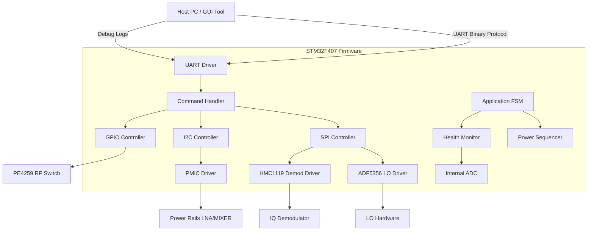
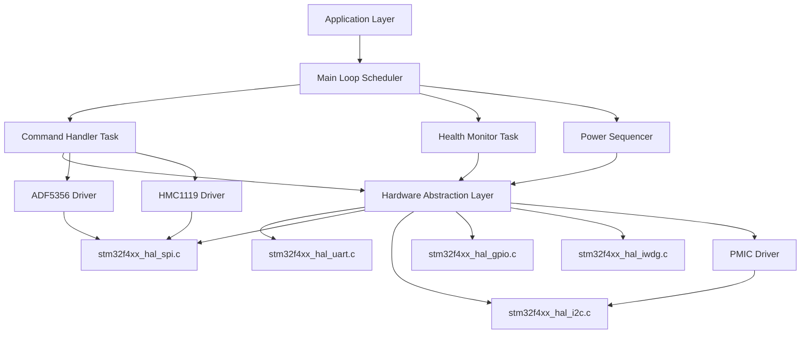
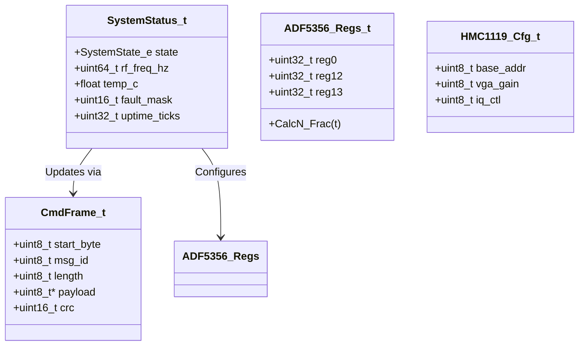
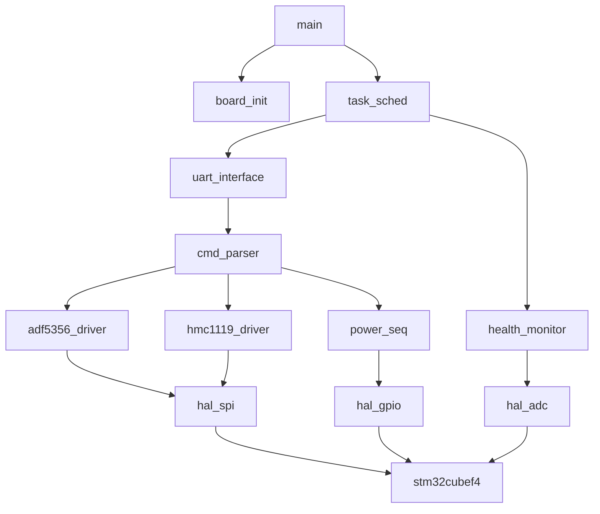
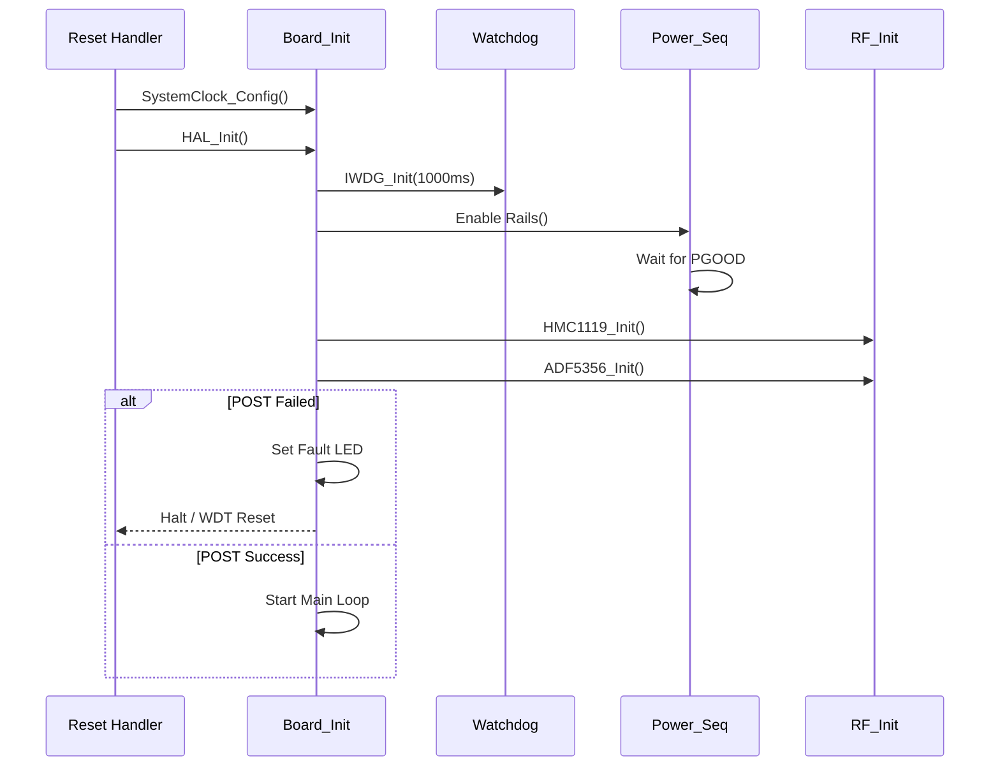
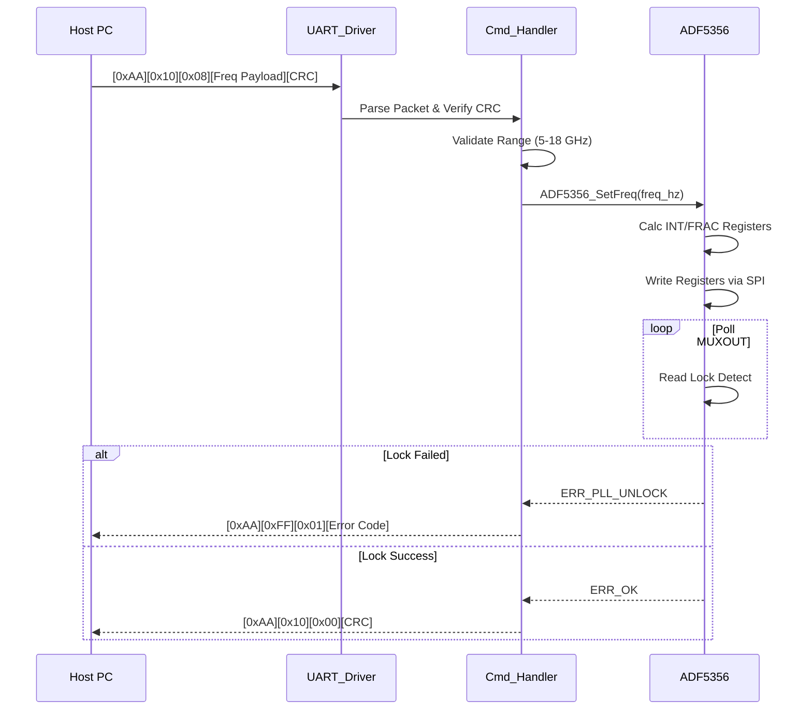
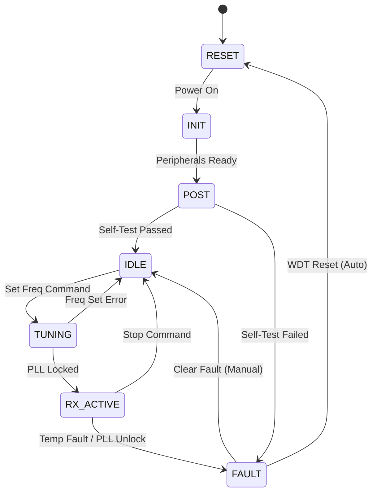
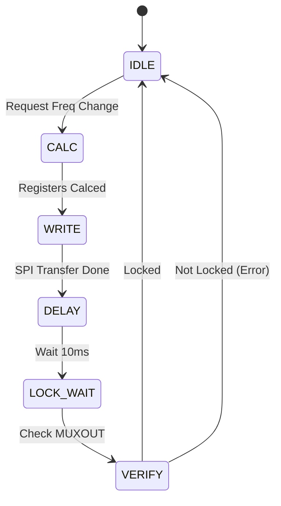

# Software Design Document (SDD)

**Project:** ajsfdvhjs Wideband RF Receiver Firmware  
**Version:** 1.0  
**Date:** 15 April 2026  
**Author:** Senior Embedded Software Architect

---

## Document Control
| Version | Date | Author | Description |
|---------|------|--------|-------------|
| 1.0 | 15 April 2026 | Senior Arch | Initial design release for STM32F407 Firmware |

---

# 1. Introduction

## 1.1 Purpose
This Software Design Document (SDD) provides the comprehensive architectural design and implementation details for the **SW-RF-CTRL-FW** firmware running on the STM32F407VGT6 microcontroller within the ajsfdvhjs Wideband RF Receiver. This document serves as the authoritative technical guide for firmware engineers implementing the code, test engineers developing verification suites, and maintenance personnel supporting the product. It translates the requirements specified in the SRS (Ref: IEEE 1016-2009) into concrete software structures, data models, and algorithms.

## 1.2 Scope
The design encompasses the complete embedded software stack, including:
*   **Hardware Abstraction Layer (HAL):** Drivers for STM32F4 peripherals (SPI, I2C, UART, GPIO, DMA, Timers).
*   **Device Drivers:** Specific control logic for the RF chain (ADF5356 Synthesizer, HMC1119 Demodulator, PE4259 Switch) and Power Management (ADP5071, LT3045).
*   **Application Layer:** State machine management, power-up sequencing, command parsing, and fault handling.
*   **Communication:** Binary protocol implementation over UART at 115200 baud.
*   **Safety:** MISRA-C:2012 compliance strategies and Watchdog Timer (IWDG) integration.

**Explicitly Out of Scope:**
*   FPGA JESD204B link training logic (managed externally, though GPIO status is monitored).
*   RF DSP algorithms.
*   PC Host GUI implementation.

## 1.3 Definitions and Acronyms
| Term | Definition |
| :--- | :--- |
| **API** | Application Programming Interface |
| **BIT** | Built-In Test |
| **BSP** | Board Support Package |
| **CRC** | Cyclic Redundancy Check |
| **DAC** | Digital-to-Analog Converter |
| **EOF** | End of Frame |
| **EOF** | End of File (Flash context) |
| **FIFO** | First-In, First-Out buffer |
| **FSM** | Finite State Machine |
| **GLR** | Glue Logic Requirements |
| **HAL** | Hardware Abstraction Layer |
| **HRS** | Hardware Requirements Specification |
| **I2C** | Inter-Integrated Circuit |
| **INT** | Interrupt |
| **IRQ** | Interrupt Request |
| **ISR** | Interrupt Service Routine |
| **JESD** | JESD204B High-Speed Data Interface Standard |
| **LO** | Local Oscillator |
| **LNA** | Low Noise Amplifier |
| **MCU** | Microcontroller Unit (STM32F407) |
| **MISRA** | Motor Industry Software Reliability Association |
| **MMIC** | Monolithic Microwave Integrated Circuit |
| **NVMEM** | Non-Volatile Memory (EEPROM/Flash) |
| **PCB** | Printed Circuit Board |
| **PLL** | Phase-Locked Loop |
| **POST** | Power-On Self Test |
| **RF** | Radio Frequency |
| **RX** | Receive |
| **SDD** | Software Design Document |
| **SRS** | Software Requirements Specification |
| **SPI** | Serial Peripheral Interface |
| **TRP** | Transmit/Receive Pulse |
| **UART** | Universal Asynchronous Receiver/Transmitter |
| **WDT** | Watchdog Timer |

## 1.4 References
1.  **IEEE Std 1016-2009**: Standard for Information Technology—Systems Design—Software Design Descriptions.
2.  **SRS (ajsfdvhjs)**: Software Requirements Specification, Rev 1.0, 15 April 2026.
3.  **GLR (ajsfdvhjs)**: Glue Logic Requirements, Rev 0V01, 15 April 2026.
4.  **HRS (ajsfdvhjs)**: Hardware Requirements Specification, Rev 1.0, 15 April 2026.
5.  **MISRA-C:2012**: Guidelines for the use of the C language in critical systems.
6.  **STMicroelectronics**: RM0090 Reference Manual STM32F405/07, Datasheet.
7.  **Analog Devices**: ADF5356 Datasheet; HMC1119 Datasheet.

---

# 2. Design Viewpoints

## 2.1 Context Viewpoint — System Boundaries

The software operates within the STM32F407VGT6, acting as the controller for the analog front end and the communication bridge to the Host PC.



**External Interfaces:**
*   **Host PC:** Connected via UART (RX/TX). Protocol defined in Section 2.5.
*   **RF Hardware:** SPI lines to ADF5356/HMC1119, GPIO to PE4259.
*   **Power Hardware:** I2C/GPIO to ADP5071, LT3045.
*   **FPGA:** GPIO status lines for SYSREF and JESD Link status.

## 2.2 Composition Viewpoint — Software Architecture

The software is architected as a layered stack to ensure portability and testability.



### Module List with Responsibilities

**Module: board_init** (board_init.c / board_init.h)
*   **Responsibility:** Handles system startup, clock initialization (168 MHz), and peripheral HAL initialization. Coordinates the Power-On Self Test (POST).
*   **Public API:**
    *   `int32_t Board_Init(void);`
    *   `int32_t Board_RunPOST(uint32_t *err_mask);`
    *   `void Board_GetInfo(BoardInfo_t *info);`
*   **Internal State:** System clock status, peripheral initialization flags.
*   **Configuration:** HSE_VALUE = 25MHz (from GLR).

**Module: uart_interface** (uart_interface.c / uart_interface.h)
*   **Responsibility:** Manages asynchronous communication via UART2. Implements DMA-based RX/TX and the binary framing protocol.
*   **Public API:**
    *   `int32_t UART_Init(void);`
    *   `void UART_ProcessIRQ(void);`
    *   `int32_t UART_SendPacket(uint8_t *data, uint16_t len);`
    *   `bool UART_IsCommandReady(void);`
    *   `int32_t UART_GetCommand(CmdFrame_t *frame);`
*   **Internal State:** RX/TX state machine flags, DMA transfer handles.

**Module: adf5356_driver** (adf5356.c / adf5356.h)
*   **Responsibility:** Configures the ADF5356 wideband synthesizer. Calculates PLL divisors (INT, FRAC, MOD) based on target frequency and PFD frequency.
*   **Public API:**
    *   `int32_t ADF5356_Init(uint32_t pfd_freq_hz);`
    *   `int32_t ADF5356_SetFreq(uint64_t target_hz);`
    *   `int32_t ADF5356_Mute(bool mute);`
*   **Internal State:** Current frequency, lock status history.

**Module: hmc1119_driver** (hmc1119.c / hmc1119.h)
*   **Responsibility:** Controls the HMC1119 IQ demodulator (VGA gain, quadrature accuracy).
*   **Public API:**
    *   `int32_t HMC1119_Init(void);`
    *   `int32_t HMC1119_SetGain(float gain_db);`
*   **Internal State:** Current gain setting.

**Module: power_seq** (power_seq.c / power_seq.h)
*   **Responsibility:** Executes the strict power-up sequence defined in HRS (Enable LNA -> Wait -> Enable Mixer).
*   **Public API:**
    *   `int32_t PWR_SeqUp(void);`
    *   `int32_t PWR_SeqDown(void);`
    *   `bool PWR_IsGood(void);`

**Module: health_monitor** (health_monitor.c / health_monitor.h)
*   **Responsibility:** Periodically polls internal temperature sensor and external supply monitors via ADC. Implements fault logging.
*   **Public API:**
    *   `void Health_Init(void);`
    *   `void Health_UpdateTask(void);`
    *   `bool Health_IsTempSafe(float *temp_c);`

## 2.3 Logical Viewpoint — Data Model



**Data Structures (C Headers):**

```c
/* System State Enumeration */
typedef enum {
    SYS_STATE_BOOT = 0,
    SYS_STATE_INIT,
    SYS_STATE_IDLE,
    SYS_STATE_RX_ACTIVE,
    SYS_STATE_FAULT,
    SYS_STATE_SHUTDOWN
} SystemState_e;

/* Command Frame Structure (Little Endian) */
typedef struct {
    uint8_t  SOP;        /* 0xAA, 0x55 pattern */
    uint8_t  MsgID;      /* Command ID */
    uint8_t  Len;        /* Payload length */
    uint8_t  Payload[64];/* Max payload size */
    uint16_t CRC;        /* CRC16-CCITT */
} __attribute__((packed)) CmdFrame_t;

/* ADF5356 Configuration */
typedef struct {
    uint32_t pfd_freq_hz;
    uint32_t ref_divider;
    uint16_t int_value;
    uint32_t frac_value;
    uint32_t mod_value;
} ADF5356_Calc_t;

/* Error Codes */
typedef enum {
    ERR_OK = 0x00,
    ERR_UART Framing = 0x01,
    ERR_CRC_FAIL = 0x02,
    ERR_SPI_TIMEOUT = 0x03,
    ERR_I2C_NACK = 0x04,
    ERR_PLL_UNLOCK = 0x05,
    ERR_TEMP_HIGH = 0x06,
} ErrorCode_e;
```

## 2.4 Dependency Viewpoint — Module Dependencies



**Dependency Rules:**
1.  **No Circular Dependencies:** Drivers cannot depend on Application tasks.
2.  **HAL Isolation:** Application layer uses pointer-based access to HAL to allow Mocking during Unit Testing.
3.  **Build Order:** STM32Cube HAL → Board BSP → Device Drivers → Application Logic.

## 2.5 Interface Viewpoint — Complete API Specification

### UART Command Protocol Specification

**Physical Layer:**
*   Baud Rate: 115200
*   Data Bits: 8
*   Parity: None
*   Stop Bits: 1

**Link Layer Frame Format:**
| Offset | Size | Description |
|--------|------|-------------|
| 0 | 1 Byte | Start of Packet (SOP) = 0xAA |
| 1 | 1 Byte | Message ID (MID) |
| 2 | 1 Byte | Payload Length (0-64) |
| 3 | N Bytes | Payload Data |
| 3+N | 2 Bytes | CRC16-CCITT (Polynomial 0x1021) |

**Message IDs (MID):**
*   `0x10`: Set Frequency (Payload: uint64_t Hz)
*   `0x11`: Set Gain (Payload: float dB)
*   `0x20`: Get Status (Request)
*   `0x21`: Get Status (Response - sent by MCU)

**API Function Signature:**

```c
/**
 * @brief Set the RF frequency using the ADF5356.
 * 
 * @param freq_hz Target frequency in Hz (5e9 to 18e9).
 * @return int32_t ERR_OK on success, ERR_PARAM if out of bounds, 
 *         ERR_PLL_UNLOCK if PLL fails to lock within timeout.
 * 
 * @pre System must be in SYS_STATE_IDLE or SYS_STATE_RX_ACTIVE.
 * @post ADF5356 registers updated, state transitions to RX_ACTIVE.
 * 
 * Thread Safety: Must be called from main loop context only.
 */
int32_t RF_SetFrequency(uint64_t freq_hz);
```

## 2.6 Interaction Viewpoint — Sequence Diagrams

### Startup Sequence


### Frequency Change Command


## 2.7 State Viewpoint — State Machines

### System Master State Machine


### ADF5356 Calibration State Machine


## 2.8 Algorithm Viewpoint — Key Algorithms

### 2.8.1 ADF5356 Frequency Calculation
To generate a frequency `RFout` with a Phase Detector Frequency `PFD`:
1.  Calculate `N = floor(RFout / PFD)`
2.  Calculate `FRAC = (RFout - N*PFD) * MOD / PFD`
3.  The driver uses a fixed `MOD = 2^25` for fine resolution.
4.  **Algorithm Implementation:**
    ```c
    uint64_t rem = (target_freq % pfd_freq) * MOD;
    uint32_t frac_val = (uint32_t)(rem / pfd_freq);
    uint16_t int_val  = (uint16_t)(target_freq / pfd_freq);
    ```

### 2.8.2 Power Sequencing (HRS Requirement)
1.  Enable `EN_LNA_5V` (GPIO PA0).
2.  Wait 2ms (Timer based delay).
3.  Enable `EN_MIXER_3V` (GPIO PA1).
4.  Monitor `PGOOD` (Input PB0). Must be high within 50ms.
5.  If timeout, trigger FAULT state.

---

# 3. Design Rationale

## 3.1 Architecture Choices
1.  **Super Loop vs RTOS:** A Super Loop architecture with interrupt-driven background data transfer was chosen.
    *   *Rationale:* The system workload is deterministic (commands at ~10Hz max, periodic monitoring at 10Hz). An RTOS adds unnecessary complexity and stack overhead for a single-threaded control flow application.
2.  **Static Allocation:**
    *   *Rationale:* MISRA-C compliance forbids dynamic memory allocation (malloc) to prevent heap fragmentation and deterministic execution failures. All buffers are fixed-size arrays.

## 3.2 MISRA-C:2012 Compliance Strategy
*   **Rule 13.5 (Loop Counters): Loop counters are declared in the smallest scope possible (C99 for-loop initializer `for(int i=0;...)`).
*   **Rule 11.4 (Casts):** No implicit conversions between integers and pointers. All SPI/I2C data transfers use explicit `uint8_t` buffers.
*   **Tooling:** PC-Lint Plus will be integrated into the build process.

---

# 4. Design Traceability Matrix

| SDD Component / Function | Implements SRS Requirement | Design Element |
|--------------------------|---------------------------|----------------|
| `Board_Init()` | REQ-SW-001 (System Init) | Main entry point |
| `ADF5356_SetFreq()` | REQ-SW-010 (LO Tuning) | PLL Driver |
| `Power_SeqUp()` | REQ-SW-020 (Power Seq) | GPIO/Timer Control |
| `UART_ProcessIRQ()` | REQ-SW-030 (Comms) | UART ISR |
| `Health_UpdateTask()` | REQ-SW-040 (Monitor) | ADC Sampling |
| `HMC1119_SetGain()` | REQ-SW-011 (IF Gain) | SPI Write |
| `WDT_Init()` | REQ-SW-050 (Safety) | IWDG Peripheral |
| `CRC16_CCITT()` | REQ-SW-031 (Data Integrity) | Utility Function |

---

# 5. Appendices

## Appendix A — File Structure
```
project_ajsfdvhjs/
├── src/
│   ├── main.c
│   ├── system_stm32f4xx.c
│   ├── bsp/
│   │   ├── board_init.c
│   │   └── board_config.h
│   ├── drivers/
│   │   ├── stm32f4xx_hal_spi.c
│   │   ├── stm32f4xx_hal_i2c.c
│   │   ├── stm32f4xx_hal_uart.c
│   │   └── stm32f4xx_hal_iwdg.c
│   ├── application/
│   │   ├── task_scheduler.c
│   │   ├── cmd_parser.c
│   │   └── power_seq.c
│   └── devices/
│       ├── adf5356.c
│       └── hmc1119.c
└── test/
    ├── unit/
    │   └── test_adf5356_calc.c
    └── integration/
        └── test_uart_loopback.c
```

## Appendix B — Register Map Summary (STM32F407)
| Peripheral | Base Address | Usage |
|------------|--------------|-------|
| GPIOA | 0x40020000 | RF Switch Ctrl, UART TX |
| GPIOB | 0x40020400 | Fault Flags, LED Status |
| SPI1 | 0x40013000 | ADF5356 / HMC1119 Control |
| I2C1 | 0x40005400 | PMIC Control |
| USART2 | 0x40004400 | Host Interface |
| IWDG | 0x40003000 | Independent Watchdog |

## Appendix C — Memory Map
| Region | Start | End | Size | Usage |
|--------|-------|-----|------|-------|
| FLASH | 0x08000000 | 0x08100000 | 1MB | Firmware Code |
| RAM | 0x20000000 | 0x20020000 | 128KB | Data, Stack, Heap |

## Appendix D — Coding Standards Checklist
*   [ ] No `malloc`/`free` used.
*   [ ] All functions return `ErrorCode_e` (except void setters).
*   [ ] All functions commented with Doxygen style `/** ... */`.
*   [ ] Magic numbers replaced by `#define` constants.
*   [ ] Cyclomatic complexity < 15 per function.
*   [ ] No VLA (Variable Length Arrays).