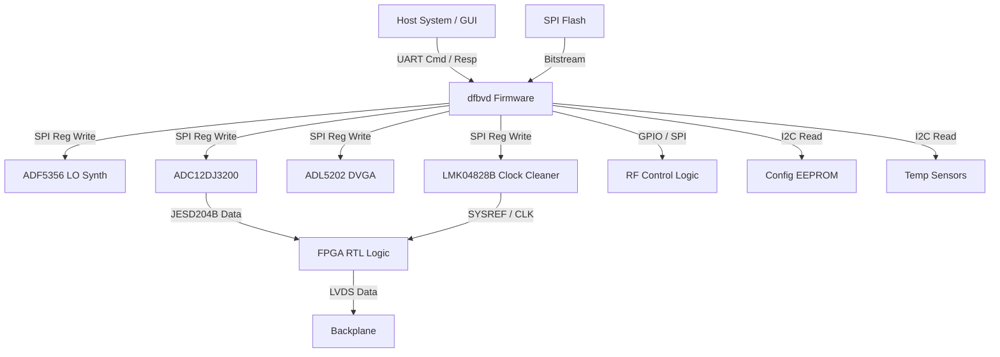
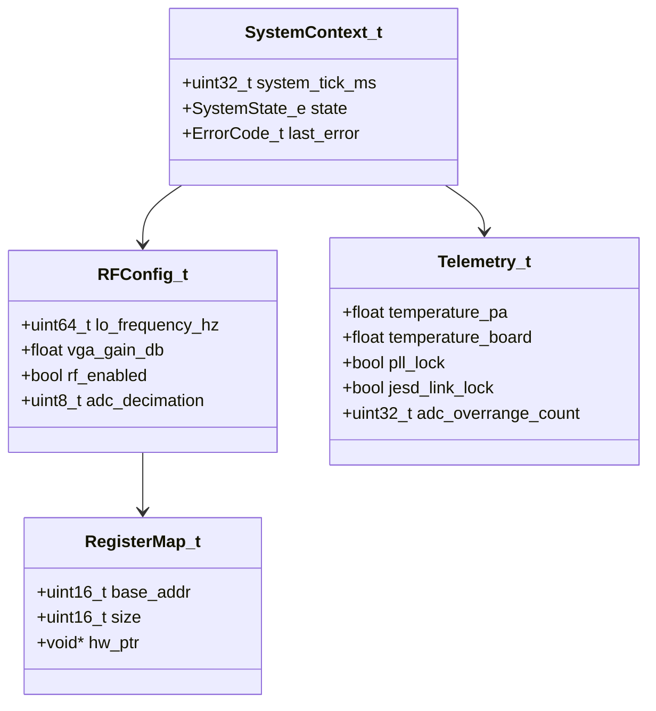
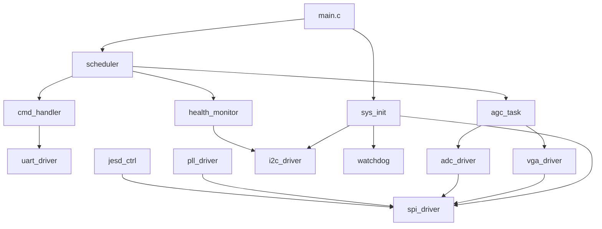
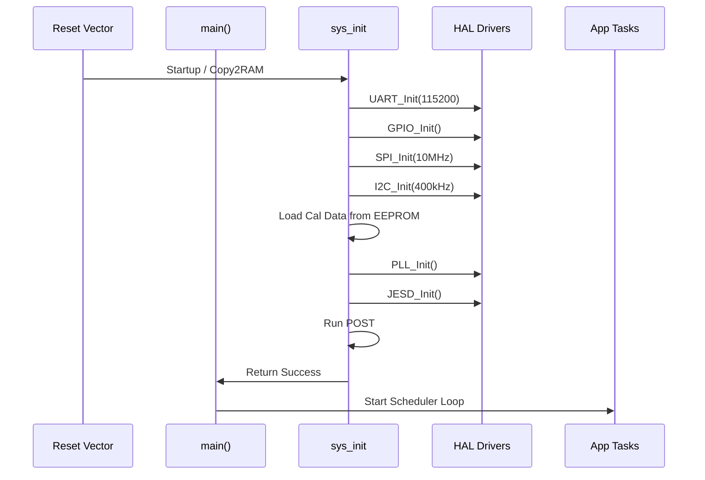
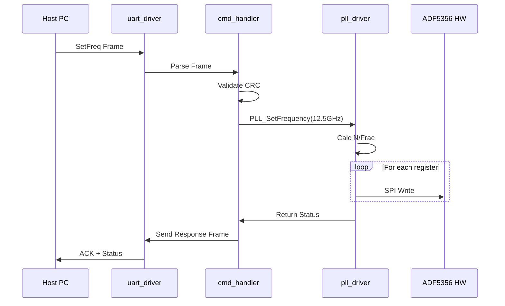
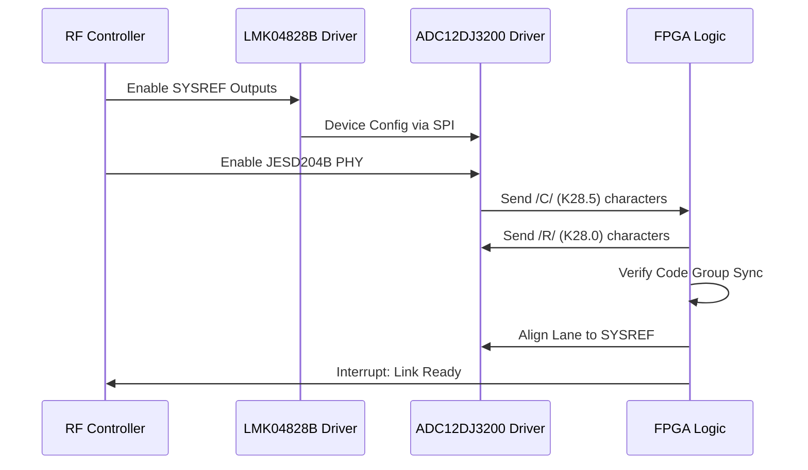
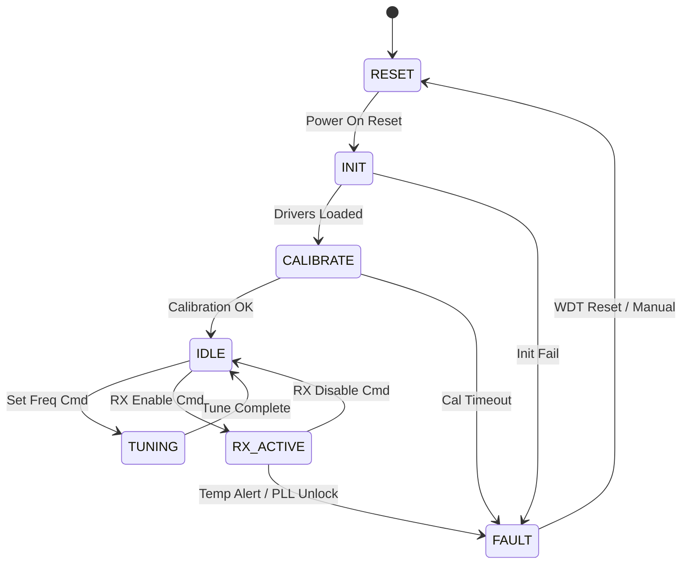
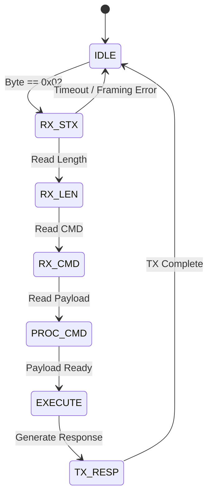

# Software Design Document (SDD)

**Project:** dfbvd Wideband RF Receiver Module  
**Document Version:** 1.0  
**Date:** 16 April 2026  
**Author:** Senior Software Architect  

---

## Document Control
| Version | Date | Author | Description |
|---------|------|--------|-------------|
| 1.0 | 16 April 2026 | Senior Software Architect | Initial design release for dfbvd Embedded Control Software |

---

# 1. Introduction

## 1.1 Purpose
This Software Design Document (SDD) describes the software architecture and detailed design of the **dfbvd** Wideband RF Receiver Module firmware. This firmware is responsible for the initialization, control, and health monitoring of the RF chain (LNA, Mixer, PLL, VGA) and the high-speed data path (ADC, JESD204B Clock Cleaner).

The design is intended for firmware engineers implementing the system, verification engineers validating the design, and system integrators integrating the module onto the host platform. This document adheres to the IEEE 1016-2009 standard for Software Design Descriptions.

## 1.2 Scope
The software design covers the embedded firmware running on the Artix-7 FPGA MicroBlaze soft-core processor. It encompasses:
*   **Hardware Abstraction Layer (HAL):** Drivers for SPI (ADF5356, ADL5202, LMK04828B, ADC12DJ3200), I2C (EEPROM, Temp Sensors), UART, and GPIO.
*   **Application Layer:** RF control algorithms, JESD204B link training, Automatic Gain Control (AGC) loops, and power management sequences.
*   **Communication Protocol:** Implementation of the register-based UART command interface defined in the GLR.

**Exclusions:** The high-speed JESD204B data path is implemented in RTL (VHDL/Verilog) within the FPGA fabric and is not part of the C/MicroBlaze software design, though this software configures and monitors it.

## 1.3 Definitions and Acronyms

| Term | Definition |
| :--- | :--- |
| **ADC** | Analog-to-Digital Converter (ADC12DJ3200). |
| **AGC** | Automatic Gain Control (firmware loop adjusting ADL5202). |
| **BIST** | Built-In Self-Test. |
| **FSM** | Finite State Machine. |
| **HAL** | Hardware Abstraction Layer. |
| **HRS** | Hardware Requirements Specification. |
| **I2C** | Inter-Integrated Circuit serial bus. |
| **JESD** | JESD204B high-speed data converter interface standard. |
| **LNA** | Low Noise Amplifier. |
| **LO** | Local Oscillator (ADF5356 Synthesizer). |
| **MISRAC** | MISRA C:2012 coding standard. |
| **PLL** | Phase-Locked Loop. |
| **RF** | Radio Frequency. |
| **SPI** | Serial Peripheral Interface. |
| **TCXO** | Temperature Compensated Crystal Oscillator. |
| **UART** | Universal Asynchronous Receiver/Transmitter. |
| **VGA** | Variable Gain Amplifier (ADL5202). |
| **WDT** | Watchdog Timer. |

## 1.4 References
1.  **IEEE 1016-2009:** Standard for Information Technology — Systems Design — Software Design Descriptions.
2.  **dfbvd SRS:** Software Requirements Specification, Rev 1.0, 16 April 2026.
3.  **dfbvd HRS:** Hardware Requirements Specification, Rev 1.0, 16 April 2026.
4.  **dfbvd GLR:** Glue Logic Requirements, Rev 0V01, 16 April 2026.
5.  **MISRA C:2012:** Guidelines for the use of the C language in critical systems.
6.  **ADF5356 Datasheet:** Wideband Synthesizer with Integrated VCO.
7.  **ADC12DJ3200 Datasheet:** 12-Bit, 6.4 GSPS RF Sampling ADC.
8.  **LMK04828B Datasheet:** JESD204B Clock Jitter Cleaner.

---

# 2. Design Viewpoints

## 2.1 Context Viewpoint — System Boundaries

The dfbvd firmware acts as the control plane between the Host System (via UART) and the various RF and Digital subsystems.



**External Interfaces:**
*   **Host Interface:** UART (115200 baud, 8N1). Command/Response packets.
*   **JTAG:** For FPGA debug and firmware download (Xilinx MicroBlaze Debug Module).
*   **RF Hardware:** SPI buses for configuration; GPIO for power enables and TRP (Transmit/Receive Point) control.

## 2.2 Composition Viewpoint — Software Architecture

The software is organized into a layered architecture: Application Tasks, HAL/Drivers, and OS/Platform abstraction.

```mermaid
graph TD
    APP[Application Layer]
    SCHED[Scheduler / Main Loop]
    
    APP --> RF_CTRL[RF Controller Task]
    APP --> AGC_TASK[AGC Task]
    APP --> HEALTH[Health Monitor Task]
    APP --> CMD_PARSER[UART Command Handler]
    
    RF_CTRL --> HAL[Hardware Abstraction Layer]
    AGC_TASK --> HAL
    HEALTH --> HAL
    CMD_PARSER --> HAL
    
    HAL --> DRV_SPI[SPI Driver]
    HAL --> DRV_I2C[I2C Driver]
    HAL --> DRV_UART[UART Driver]
    HAL --> DRV_GPIO[GPIO Driver]
    HAL --> DRV_WDT[WDT Driver]
    
    DRV_SPI --> PLIB[Platform Lib (Xilinx BSP)]
    DRV_I2C --> PLIB
    DRV_UART --> PLIB
```

### Module List with Responsibilities

**Module: sys_init** (sys_init.c / sys_init.h)
*   **Responsibilities:** System startup, vector table setup, clock initialization, BSS clearing, and C-Runtime environment setup. Calls all other driver initializations.
*   **API:**
    *   `int32_t SYS_Init(void)`
    *   `int32_t SYS_Post(void)` (Power-On Self-Test)
    *   `void SYS_Reboot(void)`

**Module: uart_driver** (uart_driver.c / uart_driver.h)
*   **Responsibilities:** Configures UART1 for 115200 8N1. Implements non-blocking transmit/receive ring buffers. Handles the binary protocol framing defined in GLR.
*   **API:**
    *   `int32_t UART_Init(uint32_t baud_rate)`
    *   `int32_t UART_ReadByte(uint8_t *data)`
    *   `int32_t UART_WriteByte(uint8_t data)`
    *   `void UART_ISR(void)`
*   **Internal State:**
    *   `static uint8_t uart_rx_buffer[256]`
    *   `static uint8_t uart_tx_buffer[256]`

**Module: cmd_handler** (cmd_handler.c / cmd_handler.h)
*   **Responsibilities:** Parses incoming UART frames, validates CRC16, executes register read/write commands, and formulates responses.
*   **API:**
    *   `void CMD_Init(void)`
    *   `void CMD_Task(void)` (Polls UART buffer for complete frames)
    *   `int32_t CMD_Dispatch(uint8_t *payload, uint16_t len)`
*   **Protocol:** `[STX][ADDR_H][ADDR_L][DATA_H][DATA_L][CRC_L][CRC_H][ETX]`

**Module: pll_driver** (pll_driver.c / pll_driver.h)
*   **Responsibilities:** Configures the ADF5356 PLL via SPI. Calculates Integer-N and Fractional registers based on target frequency.
*   **API:**
    *   `int32_t PLL_Init(const PLL_Config_t *cfg)`
    *   `int32_t PLL_SetFrequency(uint64_t freq_hz)`
    *   `int32_t PLL_EnableRF(bool enable)`
    *   `bool PLL_IsLocked(void)`

**Module: vga_driver** (vga_driver.c / vga_driver.h)
*   **Responsibilities:** Controls the ADL5202 VGA gain (0 to 31.5 dB in 0.5 dB steps).
*   **API:**
    *   `int32_t VGA_Init(void)`
    *   `int32_t VGA_SetGain(float gain_db)`
    *   `float VGA_GetGain(void)`

**Module: jesd_ctrl** (jesd_ctrl.c / jesd_ctrl.h)
*   **Responsibilities:** Configures the LMK04828B clock cleaner and the ADC12DJ3200 JESD204B link settings. Submits SYSREF requests and monitors link status.
*   **API:**
    *   `int32_t JESD_Init(const JESD_Config_t *cfg)`
    *   `int32_t JESD_Training(void)`
    *   `bool JESD_IsLinkUp(void)`

**Module: health_monitor** (health_monitor.c / health_monitor.h)
*   **Responsibilities:** Polls temperature sensors and ADC internal diagnostics. Manages fault LED and system shutdown signals.
*   **API:**
    *   `void HEALTH_Init(void)`
    *   `void HEALTH_Task(void)` (Called every 1s)

**Module: wdt** (watchdog.c / watchdog.h)
*   **Responsibilities:** Manages the watchdog timer (WDT) to recover from firmware hangs.
*   **API:**
    *   `void WDT_Init(uint32_t timeout_ms)`
    *   `void WDT_Refresh(void)`

## 2.3 Logical Viewpoint — Data Model



**Key Data Structures:**
```c
typedef enum {
    SYS_STATE_BOOT = 0,
    SYS_STATE_INIT,
    SYS_STATE_IDLE,
    SYS_STATE_RX_ACTIVE,
    SYS_STATE_FAULT,
    SYS_STATE_CALIBRATING
} SystemState_e;

typedef struct {
    uint64_t target_freq_hz;
    uint8_t  vga_gain_index; // 0-63
    bool     rx_path_enabled;
} RFSettings_t;

typedef struct {
    float    temp_die_c;
    float    temp_pa_c;
    uint16_t vcc_3v3_mv;
    uint16_t vcc_1v8_mv;
    bool     pll_locked;
    bool     adc_synced;
} SystemStatus_t;
```

## 2.4 Dependency Viewpoint



## 2.5 Interface Viewpoint — Complete API Specification

**Function:** `PLL_SetFrequency`
```c
/**
 * @brief Programs the ADF5356 to the specified frequency.
 * 
 * Calculates the INT, FRAC, and MOD registers based on the PFD frequency
 * defined in the initialization structure.
 *
 * @param freq_hz Target LO frequency in Hz (Range: 5e9 to 18e9).
 * 
 * @return ERR_OK on success.
 * @return ERR_PARAM if frequency is out of bounds.
 * @return_ERR_HW if SPI write fails.
 *
 * @pre PLL_Init() must have been called successfully.
 * @post PLL begins locking sequence. User must poll PLL_IsLocked().
 */
int32_t PLL_SetFrequency(uint64_t freq_hz);
```

**Function:** `UART_WriteReg`
```c
/**
 * @brief Writes a 16-bit value to a memory-mapped register via UART protocol.
 *
 * @param addr 16-bit register address.
 * @param data 16-bit data to write.
 *
 * @return ERR_OK if frame sent successfully.
 * @return ERR_BUSY if TX buffer full.
 *
 * @note This function formats the frame [STX][W][Addr][Data][CRC][ETX]
 *       and places it in the TX FIFO. Transmission is interrupt driven.
 */
int32_t UART_WriteReg(uint16_t addr, uint16_t data);
```

## 2.6 Interaction Viewpoint — Sequence Diagrams

**System Initialization Sequence:**


**Frequency Change (Host Initiated):**


**JESD204B Link Training:**


## 2.7 State Viewpoint — State Machines

**Main System State Machine:**


**Command Handler State Machine (UART Parser):**


## 2.8 Algorithm Viewpoint

### 2.8.1 ADF5356 Frequency Calculation
The ADF5356 requires calculation of INT, FRAC, and MOD registers.
```c
// PFD freq is fixed (e.g. 25MHz from LMK04828B)
// Formula: f_VCO = (INT + FRAC/MOD) * f_PFD
void PLL_CalcRegisters(uint64_t target_freq_hz, uint32_t pfd_freq, PLL_Regs_t *regs) {
    uint64_t f_vco = target_freq_hz;
    if (f_vco < 3400000000ULL) {
        // Enable VCO Doubler
        f_vco *= 2;
    }
    
    // Calculate Divider N
    // N_prescaler = 4 if f_VCO < 6GHz else 8
    
    // Simplified Logic:
    // 1. Calculate FRAC/MOD for finest resolution
    // 2. Calculate INT based on MOD
    // 3. Update register struct
}
```

### 2.8.2 CRC-16 (CCITT) Implementation
Used for UART packet integrity.
```c
uint16_t CRC16_CCITT(const uint8_t *data, uint32_t len) {
    uint16_t crc = 0xFFFF; // Initial value
    uint16_t poly = 0x1021; // Polynomial
    
    for (uint32_t i = 0; i < len; i++) {
        crc ^= (uint16_t)data[i] << 8;
        for (uint8_t j = 0; j < 8; j++) {
            if (crc & 0x8000) {
                crc = (crc << 1) ^ poly;
            } else {
                crc <<= 1;
            }
        }
    }
    return crc;
}
```

## 2.9 Resource Viewpoint — Real-Time Constraints

### 2.9.1 Task Scheduling Table
The system uses a non-preemptive loop scheduler (Bare Metal).

| Task Name | Period (ms) | Worst-Case Exec Time (us) | Priority | Deadline |
|-----------|-------------|--------------------------|----------|----------|
| CMD_Task | 10 (Poll) | 150 | High | 20ms |
| AGC_Task | 100 | 200 | Medium | 100ms |
| Health_Task | 1000 | 350 | Low | 1000ms |
| WDT_Refresh | 500 | 10 | Critical | 500ms |

### 2.9.2 ISR Latency Budget
| Interrupt Source | Max Latency | Context Save/Restore | Processing Time |
|------------------|-------------|----------------------|-----------------|
| UART RX | 50 us | 10 us | 20 us (FIFO fill) |
| SPI TX Complete | 100 us | 10 us | 5 us |
| ADC Fault (GPIO) | 10 us | 10 us | 50 us (Emergency Shdn) |

### 2.9.3 Memory Budget
| Region | Size | Usage |
|--------|------|-------|
| MicroBlaze BRAM (Code) | 64 KB | Firmware Code |
| MicroBlaze BRAM (Data) | 16 KB | Stack, Heap, Globals |
| DDR3 (Shared) | 128 MB | JESD204B Buffers (Not used by FW) |

## 2.10 Build System Viewpoint

### 2.10.1 CMakeLists.txt Structure
```cmake
cmake_minimum_required(VERSION 3.20)
project(dfbvd_firmware C ASM)

set(CMAKE_SYSTEM_NAME Generic)
set(CMAKE_C_COMPILER mb-gcc)
set(CMAKE_OBJCOPY mb-objcopy)

# Source Files
set(SOURCES
    src/main.c
    src/sys_init.c
    src/drivers/uart.c
    src/drivers/spi.c
    src/drivers/i2c.c
    src/app/pll.c
    src/app/agc.c
)

add_executable(firmware.elf ${SOURCES})
target_compile_options(firmware.elf PRIVATE
    -Wall -Wextra -Werror -Wstrict-prototypes
    -mmultiply-enabled -mbarrel-shift-enabled
)

# Create Hex/Bin for flashing
set(HEX_FILE firmware.hex)
set(BIN_FILE firmware.bin)
add_custom_command(TARGET firmware.elf POST_BUILD
    COMMAND ${CMAKE_OBJCOPY} -O ihex $<TARGET_FILE:firmware.elf> ${HEX_FILE}
    COMMAND ${CMAKE_OBJCOPY} -O binary $<TARGET_FILE:firmware.elf> ${BIN_FILE}
)
```

### 2.10.2 Unit Test Infrastructure
Uses Google Test framework with hardware mocks for host-based testing.
```cmake
# tests/CMakeLists.txt
add_executable(test_firmware
    test/test_pll.cpp
    test/test_crc.cpp
    mock/mock_spi.cpp
)
target_link_libraries(test_firmware PRIVATE GTest::gtest_main)
```

---

# 3. Design Rationale

## 3.1 Architecture Choices
*   **Bare Metal vs RTOS:** Chose Bare Metal (Super Loop) to minimize complexity and context switch overhead on the MicroBlaze soft-core, which has limited clock speed/BRAM compared to hard-core processors.
*   **Memory Management:** Static allocation only (MISRA compliance). No heap usage to prevent fragmentation in long-running RF applications.
*   **SPI Speed:** SPI limited to 10 MHz due to PCB trace lengths matching 50 Ohm impedance for high-speed signals, reducing risk of signal integrity issues with the ADC/PLL.
*   **UART Protocol:** Binary framing chosen over ASCII for speed and determinism in packet parsing.

## 3.2 MISRA-C:2012 Compliance Strategy
*   All code scanned by Coverity or PC-lint.
*   Deviations reviewed and documented in `deviations.yaml`.
*   Use of `stdint.h` types exclusively.
*   No recursion, no dynamic memory allocation.

---

# 4. Design Traceability Matrix

| SDD Component | Source ID | Requirement Description |
|--------------|-----------|------------------------|
| sys_init.SYS_Init | SRS-3.1 | System Initialization & Boot |
| uart_driver.UART_Init | SRS-4.1 | UART Interface Initialization |
| pll_driver.PLL_SetFrequency | SRS-3.2.1 | LO Frequency Configuration |
| vga_driver.VGA_SetGain | SRS-3.2.3 | Variable Gain Control |
| jesd_ctrl.JESD_Init | SRS-3.4 | JESD204B Link Setup |
| health_monitor.HEALTH_Task | SRS-3.5 | Temperature & Power Monitoring |
| cmd_handler.CMD_Task | SRS-4.2 | Host Command Processing |

---

# 5. Appendices

## Appendix A — File Structure
```
firmware/
├── inc/
│   ├── sys_init.h
│   ├── drivers/
│   │   ├── uart.h
│   │   ├── spi.h
│   │   └── i2c.h
│   └── app/
│       ├── pll.h
│       └── agc.h
├── src/
│   ├── main.c
│   ├── sys_init.c
│   ├── ...
└── tests/
    ├── test_pll.cpp
    └── mocks/
```

## Appendix B — Register Map Summary (Derived from GLR)

| Register Name | Address Offset | Access | Description |
|---------------|----------------|--------|-------------|
| **SCRATCHPAD** | 0x0000 | R/W | Test Register |
| **FREQ_LO_MSB** | 0x0001 | W | LO Frequency High 16-bits |
| **FREQ_LO_LSB** | 0x0002 | W | LO Frequency Low 32-bits |
| **GAIN_IDX** | 0x0003 | R/W | VGA Gain Index (0-63) |
| **RF_ENABLE** | 0x0004 | R/W | Bit 0: RX Enable (1=On) |
| **PLL_LOCK** | 0x0010 | R | 1=Locked, 0=Unlocked |
| **ADC_STATUS** | 0x0011 | R | Bit 0: JESD Link Up |
| **TEMP_BOARD** | 0x0020 | R | Board Temp (deg C) |
| **ERR_CODE** | 0x00FF | R | Last Fault Code |

## Appendix C — Memory Map
| Region | Start Address | End Address | Size | Attributes |
|--------|---------------|-------------|------|------------|
| Code (BRAM) | 0x00000000 | 0x0000FFFF | 64 KB | Executable |
| Data (BRAM) | 0x20000000 | 0x20003FFF | 16 KB | R/W |
| FPGA Slaves | 0x40000000 | 0x4FFFFFFF | N/A | Peripherals |
| Flash (SPI) | 0x80000000 | 0x800FFFFF | N/A | Mapped via XIP |

## Appendix D — Coding Standards Checklist
*   [ ] Indent: Spaces (4)
*   [ ] Braces: K&R style
*   [ ] Functions: `Snake_Case`, static where possible
*   [ ] Types: Explicit `stdint.h` types (e.g., `uint32_t`)
*   [ ] Comments: Doxygen style for public APIs
*   [ ] Checks: All return values checked (no ignored errors)