# Software Design Document (SDD)

## Document Control
| Version | Date | Author | Description |
|---------|------|--------|-------------|
| 1.0 | 19 April 2026 | System Architect | Initial design |

---

# 1. Introduction

## 1.1 Purpose
This Software Design Document (SDD) defines the detailed software architecture and design for the dgh radar RF front-end receiver system. The document provides a comprehensive set of design specifications, implementation details, and guidelines for the development, verification, and integration of the software components that constitute the dgh system. This specification serves as the authoritative source for software design decisions throughout the system lifecycle, from implementation through to final acceptance testing and deployment.

This document will be used by firmware engineers for implementing the software, RTL designers for coordinating hardware/software interfaces, test engineers for developing verification plans, and system integrators for integration activities. The design specifications herein shall be traced to the Software Requirements Specification (SRS), Hardware Requirements Specification (HRS), and Glue Logic Requirements (GLR) documents, with all requirements decomposed into specific design elements.

## 1.2 Scope
This specification covers all software components required for the dgh radar RF front-end receiver system. The software shall execute on the Xilinx XC7Z020-1CLG400C Zynq-7000 SoC FPGA and is responsible for:

- System initialization and boot sequence for the ARM Cortex-A9 processor and FPGA fabric
- Power sequencing and monitoring for RF components via the LTC2992 power monitor
- Temperature monitoring via the AD7416 sensor
- Control of RF components via the MCP23017 I/O expander
- UART communication protocol at 115200 bps for control interface
- Built-in self-test (POST) functionality and fault handling
- Configuration management using the AT24C256 EEPROM

The scope includes the firmware running on the ARM Cortex-A9 processor within the Zynq SoC, as well as any hardware description language (HDL) code implemented in the FPGA fabric to support the required functionality.

The scope does not include requirements for:
- The downstream superheterodyne receiver software
- RF signal processing algorithms
- Device drivers for interfaces not specified in the GLR
- Third-party library requirements beyond those specified

The software is designed specifically for the Xilinx XC7Z020-1CLG400C Zynq-7000 SoC and will be developed using the Xilinx Vitis IDE. The primary programming language is C99, with strict compliance to MISRA C:2012 guidelines.

## 1.3 Definitions and Acronyms

### 1.3.1 Definitions
| Term | Definition |
|------|------------|
| **ARM** | Advanced RISC Machines, a family of CPU designs based on the RISC architecture used in the Zynq SoC |
| **Bitstream** | The configuration data that programs the FPGA fabric from the QSPI Flash memory |
| **Boot loader** | A small program responsible for loading the main application from non-volatile memory |
| **DMA** | Direct Memory Access, a feature that allows certain hardware subsystems to access main system memory independently of the CPU |
| **Embedded system** | A computer system with a dedicated function within a larger mechanical or electrical system |
| **FIFO** | First-In-First-Out, a method for organizing the manipulation of a data structure |
| **Flash memory** | A non-volatile computer storage medium that can be electrically erased and rewritten |
| **Glue logic** | The logic used to connect different components together that were not originally designed to work together |
| **GPIO** | General-Purpose Input/Output, a generic pin on an integrated circuit whose behavior can be controlled by the software |
| **HAL** | Hardware Abstraction Layer, a layer of software or firmware that provides a simplified interface to hardware components |
| **I2C** | Inter-Integrated Circuit, a multi-master, multi-slave, single-ended, serial computer bus used for communication with AD7416, LTC2992, and AT24C256 |
| **IP core** | Intellectual Property core, a reusable unit of logic, cell, or integrated circuit layout design |
| **ISR** | Interrupt Service Routine, a routine executed in response to an interrupt |
| **JTAG** | Joint Test Action Group, an industry standard for verifying designs and testing printed circuit boards after manufacture |
| **LUT** | Look-Up Table, a component that can store a set of fixed data and return the stored data when given a certain input |
| **MBIST** | Memory Built-In Self-Test, a mechanism for testing memory integrated circuits |
| **MCU** | Microcontroller Unit, a compact microcomputer designed to govern operation of embedded systems |
| **NVM** | Non-Volatile Memory, a type of memory that retains stored information when power is lost |
| **PCB** | Printed Circuit Board, a board used to mechanically support and electrically connect electronic components |
| **POST** | Power-On Self-Test, a sequence of diagnostic tests performed by firmware when a system is first powered on |
| **RTOS** | Real-Time Operating System, an operating system that guarantees processing within specified time constraints |
| **SoC** | System on Chip, an integrated circuit that integrates all components of a computer or other electronic systems |
| **SPI** | Serial Peripheral Interface, a synchronous serial data link standard used for QSPI Flash memory access |
| **UART** | Universal Asynchronous Receiver/Transmitter, a piece of computer hardware that converts parallel data from a bus to serial data for communication with external systems |
| **Watchdog timer** | A timer device that is used to detect and recover from malfunctions by resetting the system if not serviced |

### 1.3.2 Acronyms and Abbreviations
| Acronym | Full Term |
|---------|-----------|
| **ADC** | Analog-to-Digital Converter |
| **BIST** | Built-In Self-Test |
| **BSS** | Block Started by Symbol |
| **CRC** | Cyclic Redundancy Check |
| **DAC** | Digital-to-Analog Converter |
| **FPGA** | Field-Programmable Gate Array |
| **GLR** | Glue Logic Requirements |
| **HRS** | Hardware Requirements Specification |
| **I/O** | Input/Output |
| **IP67** | Ingress Protection rating (dust tight, protected against temporary immersion) |
| **ISR** | Interrupt Service Routine |
| **LFM** | Linear Frequency Modulation |
| **LNA** | Low Noise Amplifier |
| **LT** | Linear Technology |
| **MBIST** | Memory Built-In Self-Test |
| **MISRA** | Motor Industry Software Reliability Association |
| **MHz** | Megahertz (10^6 Hz) |
| **MDS** | Minimum Detectable Signal |
| **NVM** | Non-Volatile Memory |
| **PCB** | Printed Circuit Board |
| **PLL** | Phase-Locked Loop |
| **POST** | Power-On Self-Test |
| **RAM** | Random Access Memory |
| **ROM** | Read-Only Memory |
| **SAW** | Surface Acoustic Wave |
| **SDD** | Software Design Description |
| **SRS** | Software Requirements Specification |
| **SyRS** | System Requirements Specification |
| **T/R** | Transmit/Receive |
| **VSWR** | Voltage Standing Wave Ratio |
| **WDT** | Watchdog Timer |
| **Zynq** | Xilinx's product line of SoCs that integrates ARM processor with FPGA fabric |

## 1.4 References
- IEEE 1016-2009: IEEE Standard for Software Design Descriptions
- MISRA C:2012: Guidelines for the Use of the C Language in Critical Systems
- Software Requirements Specification (SRS) — dgh Project
- Hardware Requirements Specification (HRS) — dgh Project
- Glue Logic Requirements (GLR) — dgh Project
- Xilinx Zynq-7000 Technical Reference Manual (UG585)
- Xilinx Vitis Unified Software Platform Documentation
- Microchip MCP23017 Datasheet
- Analog Devices AD7416 Datasheet
- Linear Technology LTC2992 Datasheet
- Qorvo QPL9057 Datasheet
- Analog Devices ADL5545 Datasheet
- ISSI AT24C256 Datasheet
- ISSI IS25LP256D Datasheet

---

# 2. Design Viewpoints

## 2.1 Context Viewpoint — System Boundaries

The dgh software system operates as the digital control layer of the RF front-end receiver system, running on the ARM Cortex-A9 processor within the Xilinx XC7Z020-1CLG400C Zynq SoC. It interfaces with both hardware peripherals and external systems to manage the overall operation of the radar front-end.

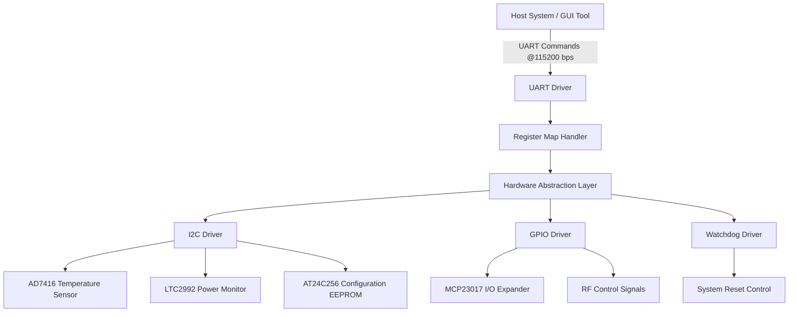

### External Interfaces:
1. **Host PC via UART (115200 bps, 8N1)**
   - Provides control interface for system configuration and status monitoring
   - Implements register-based protocol for command/response communication

2. **JTAG Debug Interface**
   - Standard ARM JTAG interface for firmware debugging
   - Supports connection to Xilinx Vitis IDE

3. **Hardware Peripherals via I2C and GPIO**
   - AD7416 temperature sensor via I2C
   - LTC2992 power monitor via I2C
   - AT24C256 configuration EEPROM via I2C
   - MCP23017 I/O expander via I2C for RF component control
   - System control signals via GPIO

## 2.2 Composition Viewpoint — Software Architecture

The dgh software follows a layered architecture with clear separation between application logic, hardware abstraction, and platform-specific code. This design promotes modularity, testability, and maintainability while ensuring strict MISRA C:2012 compliance.

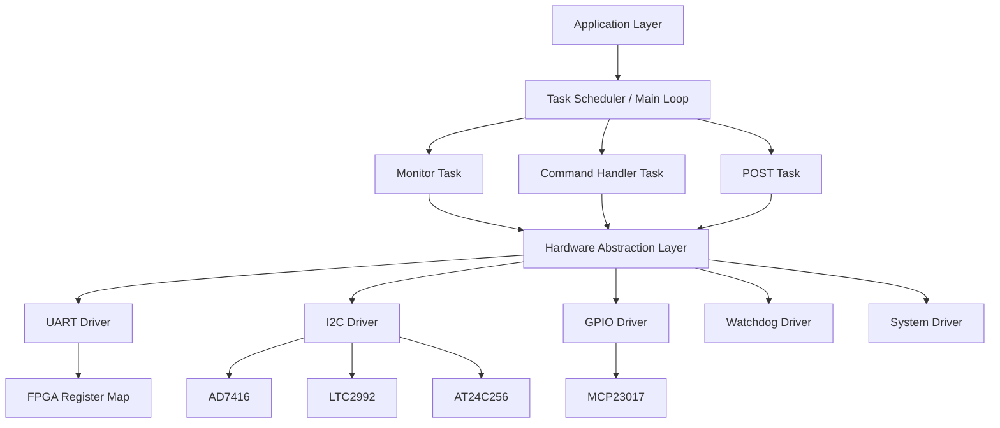

### Module List with Responsibilities:

**Module: system_init** (system_init.c / system_init.h)
```c
// Responsibilities: System initialization including clock setup, memory configuration, and peripheral initialization
int32_t System_Init(void);
int32_t System_GetInfo(SystemInfo_t *info);
int32_t System_EnterSafeMode(void);
int32_t System_Reset(void);

typedef struct {
    uint16_t board_id;
    uint8_t  hw_version_major;
    uint8_t  hw_version_minor;
    uint32_t fw_version;
    char     serial_number[16];
    char     build_date[20];
    uint8_t  zynq_pll_status;
    uint8_t  system_state;
} SystemInfo_t;
```

**Module: uart_driver** (uart_driver.c / uart_driver.h)
```c
// Responsibilities: UART communication protocol implementation for register access
int32_t UART_Init(uint32_t baud_rate);
int32_t UART_Deinit(void);
int32_t UART_WriteReg(uint16_t addr, uint16_t data);
int32_t UART_ReadReg(uint16_t addr, uint16_t *data_out);
int32_t UART_BulkWrite(uint16_t start_addr, const uint16_t *data, uint8_t count);
int32_t UART_BulkRead(uint16_t start_addr, uint16_t *buf_out, uint8_t count);
int32_t UART_GetStatus(UART_Status_t *status);
void    UART_ISR(void);  // Interrupt service routine

typedef struct {
    bool tx_busy;
    bool rx_available;
    bool frame_error;
    uint8_t tx_fifo_count;
    uint8_t rx_fifo_count;
    uint32_t errors;
} UART_Status_t;
```

**Module: i2c_driver** (i2c_driver.c / i2c_driver.h)
```c
// Responsibilities: I2C master communication for sensors and EEPROM
int32_t I2C_Init(uint8_t instance, uint32_t clock_hz);
int32_t I2C_Deinit(uint8_t instance);
int32_t I2C_Write(uint8_t instance, uint8_t dev_addr, const uint8_t *data, uint8_t len);
int32_t I2C_Read(uint8_t instance, uint8_t dev_addr, uint8_t *buf, uint8_t len);
int32_t I2C_WriteReg(uint8_t instance, uint8_t dev_addr, uint8_t reg, uint8_t val);
int32_t I2C_ReadReg(uint8_t instance, uint8_t dev_addr, uint8_t reg, uint8_t *val_out);
int32_t I2C_CheckDevice(uint8_t instance, uint8_t dev_addr);

typedef enum {
    I2C_DEV_AD7416 = 0x90,
    I2C_DEV_LTC2992 = 0x98,
    I2C_DEV_MCP23017 = 0x40,
    I2C_DEV_EEPROM = 0xA0
} I2C_DeviceAddress_e;
```

**Module: temp_monitor** (temp_monitor.c / temp_monitor.h)
```c
// Responsibilities: Temperature monitoring and thermal protection
int32_t TempMonitor_Init(const TempMonitor_Config_t *cfg);
int32_t TempMonitor_ReadAll(TempMon_Data_t *data_out);
int32_t TempMonitor_SetAlertThresh(float high_degC, float low_degC);
bool    TempMonitor_IsAlert(void);
void    TempMonitor_Task(void);  // Periodic task handler

typedef struct {
    float local_degC;
    bool  alert_active;
    bool  shutdown_required;
    uint32_t last_update_ms;
} TempMon_Data_t;

typedef struct {
    float high_threshold_degC;
    float low_threshold_degC;
    float critical_threshold_degC;
    uint32_t update_interval_ms;
} TempMonitor_Config_t;
```

**Module: power_monitor** (power_monitor.c / power_monitor.h)
```c
// Responsibilities: Power rail monitoring and protection
int32_t PwrMon_Init(const PwrMon_Config_t *cfg);
int32_t PwrMon_ReadRail(uint8_t rail_idx, float *voltage_V, float *current_A);
int32_t PwrMon_ReadAll(PwrMon_Data_t *data_out);
bool    PwrMon_IsFault(void);
void    PwrMon_Task(void);

typedef struct {
    float v_5v;
    float v_3v3;
    float v_2v5;
    float v_1v8;
    float i_5v;
    float i_3v3;
    bool  fault_active;
} PwrMon_Data_t;

typedef struct {
    float v_5v_min;
    float v_5v_max;
    float v_3v3_min;
    float v_3v3_max;
    float v_2v5_min;
    float v_2v5_max;
    float v_1v8_min;
    float v_1v8_max;
    uint32_t update_interval_ms;
} PwrMon_Config_t;
```

**Module: eeprom_driver** (eeprom_driver.c / eeprom_driver.h)
```c
// Responsibilities: EEPROM access for configuration storage
int32_t EEPROM_Init(void);
int32_t EEPROM_ReadByte(uint16_t addr, uint8_t *data_out);
int32_t EEPROM_WriteByte(uint16_t addr, uint8_t data);
int32_t EEPROM_ReadBlock(uint16_t addr, uint8_t *buf, uint16_t len);
int32_t EEPROM_WriteBlock(uint16_t addr, const uint8_t *data, uint16_t len);
int32_t EEPROM_VerifyChecksum(uint16_t addr, uint16_t len, uint8_t expected_crc);

#define EEPROM_ADDR_CONFIG_START    0x0000
#define EEPROM_ADDR_CALIBRATION     0x1000
#define EEPROM_ADDR_USER_SETTINGS   0x2000
#define EEPROM_ADDR_LOG_DATA        0x3000
#define EEPROM_SIZE                 0x8000  // 32KB
```

**Module: rf_control** (rf_control.c / rf_control.h)
```c
// Responsibilities: Control of RF components via MCP23017 I/O expander
int32_t RFControl_Init(const RFControl_Config_t *cfg);
int32_t RFControl_SetChannel(uint8_t channel_idx, bool enable);
int32_t RFControl_SetGain(uint8_t channel_idx, uint8_t gain_db);
int32_t RFControl_SetAttenuation(uint8_t channel_idx, uint8_t atten_db);
int32_t RFControl_GetStatus(RFControl_Status_t *status);

typedef struct {
    uint8_t channel_enable_mask;
    uint8_t gain_settings[4];
    uint8_t attenuation_settings[4];
    bool    protection_enabled;
} RFControl_Status_t;
```

**Module: post_test** (post_test.c / post_test.h)
```c
// Responsibilities: Power-on self-test execution
int32_t POST_Init(void);
int32_t POST_Run(uint32_t *test_results);
int32_t POST_GetReport(char *report_buf, uint16_t buf_len);
bool    POST_IsComplete(void);
bool    POST_Pass(void);

typedef enum {
    TEST_MEMORY = 0x01,
    TEST_UART = 0x02,
    TEST_I2C = 0x04,
    TEST_TEMPERATURE = 0x08,
    TEST_POWER_RAILS = 0x10,
    TEST_GPIO = 0x20,
    TEST_EEPROM = 0x40
} PostTestMask_t;
```

**Module: cmd_handler** (cmd_handler.c / cmd_handler.h)
```c
// Responsibilities: Parse incoming UART commands, dispatch to register map, format responses
int32_t CmdHandler_Init(void);
void    CmdHandler_Process(void);  // Called from main loop
int32_t CmdHandler_ExecuteWrite(uint16_t addr, uint16_t data);
int32_t CmdHandler_ExecuteRead(uint16_t addr, uint16_t *data_out);
int32_t CmdHandler_ExecuteBulkWrite(uint16_t start, const uint16_t *data, uint8_t n);
int32_t CmdHandler_ExecuteBulkRead(uint16_t start, uint16_t *buf, uint8_t n);
```

**Module: watchdog** (watchdog.c / watchdog.h)
```c
// Responsibilities: Watchdog timer arming, petting, reset detection
int32_t WDT_Init(uint32_t timeout_ms);
void    WDT_Pet(void);
bool    WDT_WasResetCause(void);
void    WDT_Enable(void);
void    WDT_Disable(void);

#define WDT_DEFAULT_TIMEOUT_MS      5000
#define WDT_MAX_TIMEOUT_MS         60000
```

**Module: system_driver** (system_driver.c / system_driver.h)
```c
// Responsibilities: System-level control and status management
int32_t SystemDriver_Init(void);
int32_t SystemDriver_Shutdown(uint8_t shutdown_mode);
int32_t SystemDriver_GetState(SystemState_t *state);
int32_t SystemDriver_EnterTestMode(void);
int32_t SystemDriver_UpdateConfiguration(const SystemConfig_t *config);

typedef enum {
    SYS_STATE_UNINITIALIZED = 0,
    SYS_STATE_BOOT,
    SYS_STATE_INITIALIZING,
    SYS_STATE_NORMAL,
    SYS_STATE_TEST,
    SYS_STATE_FAULT,
    SYS_STATE_SHUTDOWN,
    SYS_STATE_SAFE_MODE
} SystemState_t;
```

## 2.3 Logical Viewpoint — Data Model

The dgh software system uses several key data structures to represent system state, configuration, and operational data.

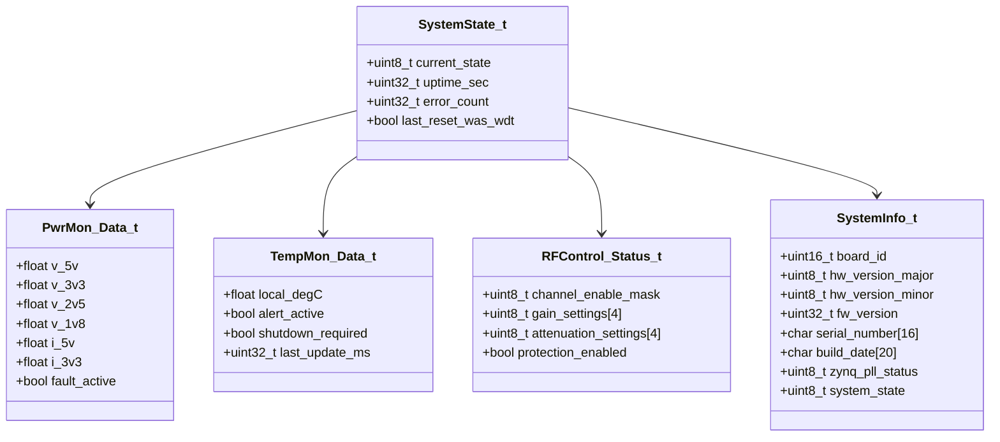

### Enumerations:

```c
/**
 * System error codes
 */
typedef enum {
    ERR_OK = 0x00,
    ERR_TIMEOUT = 0x01,
    ERR_COMM = 0x02,
    ERR_CHECKSUM = 0x03,
    ERR_PARAM = 0x04,
    ERR_NOT_INIT = 0x05,
    ERR_RESOURCE = 0x06,
    ERR_HARDWARE = 0x07,
    ERR_OVERFLOW = 0x08,
    ERR_I2C_BUS = 0x09,
    ERR_UART_FRAME = 0x0A,
    ERR_TEMP_ALERT = 0x0B,
    ERR_VOLT_FAULT = 0x0C,
    ERR_GPIO = 0x0D,
    ERR_EEPROM = 0x0E,
    ERR_POST = 0x0F,
    ERR_WDT = 0x10
} ErrorCode_t;

/**
 * System states
 */
typedef enum {
    SYS_STATE_UNINITIALIZED = 0,
    SYS_STATE_BOOT,
    SYS_STATE_INITIALIZING,
    SYS_STATE_NORMAL,
    SYS_STATE_TEST,
    SYS_STATE_FAULT,
    SYS_STATE_SHUTDOWN,
    SYS_STATE_SAFE_MODE
} SystemState_e;

/**
 * I2C device addresses
 */
typedef enum {
    I2C_DEV_AD7416 = 0x90,
    I2C_DEV_LTC2992 = 0x98,
    I2C_DEV_MCP23017 = 0x40,
    I2C_DEV_EEPROM = 0xA0
} I2C_DeviceAddress_e;

/**
 * POST test masks
 */
typedef enum {
    TEST_MEMORY = 0x01,
    TEST_UART = 0x02,
    TEST_I2C = 0x04,
    TEST_TEMPERATURE = 0x08,
    TEST_POWER_RAILS = 0x10,
    TEST_GPIO = 0x20,
    TEST_EEPROM = 0x40
} PostTestMask_t;
```

## 2.4 Dependency Viewpoint — Module Dependencies

The software architecture follows a hierarchical dependency structure with clear separation of concerns:

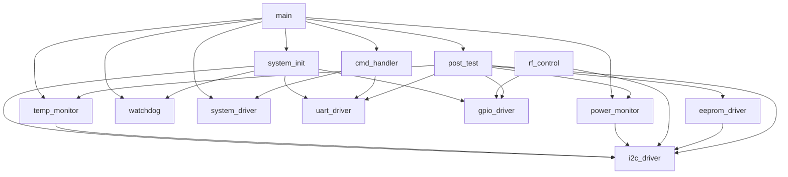

### Build Order and Dependencies:
1. Hardware abstraction layer (uart_driver, i2c_driver, gpio_driver)
2. System initialization (system_init)
3. Peripheral drivers (temp_monitor, power_monitor, rf_control, eeprom_driver)
4. System services (watchdog, post_test, system_driver)
5. Application layer (cmd_handler, main)

## 2.5 Interface Viewpoint — Complete API Specification

### UART Driver API:

```c
/**
 * @brief Initialize the UART peripheral for register protocol communication.
 *
 * @param baud_rate  Target baud rate in bits/second. Valid range: 9600–115200.
 * @return ERR_OK    on success
 * @return ERR_PARAM if baud_rate is outside valid range
 * @return ERR_HARDWARE if hardware initialization fails
 *
 * @pre  System clock must be initialized before calling this function.
 * @post UART is ready for WriteReg/ReadReg calls.
 * @note Not thread-safe. Call only during initialization.
 *
 * @example
 *   if (UART_Init(115200) != ERR_OK) { FATAL_ERROR(); }
 */
int32_t UART_Init(uint32_t baud_rate);

/**
 * @brief Write a single register via UART.
 *
 * @param addr      Register address (16-bit)
 * @param data      Data to write (16-bit)
 * @return ERR_OK   on success
 * @return ERR_COMM if UART communication fails
 * @return ERR_PARAM if address is out of range
 *
 * @pre  UART must be initialized.
 * @post The register at specified address is written with data.
 * @note Thread-safe.
 *
 * @example
 *   if (UART_WriteReg(0x100, 0x1234) != ERR_OK) { handle_error(); }
 */
int32_t UART_WriteReg(uint16_t addr, uint16_t data);

/**
 * @brief Read a single register via UART.
 *
 * @param addr      Register address to read (16-bit)
 * @param data_out  Pointer to store read data (16-bit)
 * @return ERR_OK   on success
 * @return ERR_COMM if UART communication fails
 * @return ERR_PARAM if addr is invalid or data_out is NULL
 *
 * @pre  UART must be initialized.
 * @post The register value is stored in data_out.
 * @note Thread-safe.
 *
 * @example
 *   uint16_t data;
 *   if (UART_ReadReg(0x100, &data) == ERR_OK) { /* process data *\/ }
 */
int32_t UART_ReadReg(uint16_t addr, uint16_t *data_out);

/**
 * @brief Write multiple registers contiguously via UART.
 *
 * @param start_addr Starting register address
 * @param data       Array of data to write (16-bit values)
 * @param count      Number of registers to write (1-255)
 * @return ERR_OK    on success
 * @return ERR_COMM  if UART communication fails
 * @return ERR_PARAM if parameters are invalid
 * @return ERR_OVERFLOW if count exceeds maximum
 *
 * @pre  UART must be initialized and data must not be NULL.
 * @post All specified registers are written.
 * @note Thread-safe.
 */
int32_t UART_BulkWrite(uint16_t start_addr, const uint16_t *data, uint8_t count);

/**
 * @brief Read multiple registers contiguously via UART.
 *
 * @param start_addr Starting register address
 * @param buf_out    Buffer to store read data (16-bit values)
 * @param count      Number of registers to read (1-255)
 * @return ERR_OK    on success
 * @return ERR_COMM  if UART communication fails
 * @return ERR_PARAM if parameters are invalid
 * @return ERR_OVERFLOW if count exceeds maximum
 *
 * @pre  UART must be initialized and buf_out must not be NULL.
 * @post All specified register values are stored in buf_out.
 * @note Thread-safe.
 */
int32_t UART_BulkRead(uint16_t start_addr, uint16_t *buf_out, uint8_t count);
```

### I2C Driver API:

```c
/**
 * @brief Initialize the I2C peripheral for master communication.
 *
 * @param instance   I2C instance number (0-1)
 * @param clock_hz   I2C clock frequency in Hz. Valid range: 1kHz–400kHz
 * @return ERR_OK    on success
 * @return ERR_PARAM if instance or clock_hz is invalid
 * @return ERR_HARDWARE if initialization fails
 *
 * @pre  System clock must be initialized.
 * @post I2C peripheral is ready for communication.
 * @note Not thread-safe. Call only during initialization.
 *
 * @example
 *   if (I2C_Init(0, 100000) != ERR_OK) { /* handle error *\/ }
 */
int32_t I2C_Init(uint8_t instance, uint32_t clock_hz);

/**
 * @brief Write data to an I2C device.
 *
 * @param instance   I2C instance number (0-1)
 * @param dev_addr    I2C device address (7-bit)
 * @param data        Data buffer to write
 * @param len         Number of bytes to write (1-255)
 * @return ERR_OK     on success
 * @return ERR_COMM   if bus error or no acknowledgment
 * @return ERR_PARAM  if parameters are invalid
 *
 * @pre  I2C must be initialized and data must not be NULL.
 * @post Data is written to the device.
 * @note Thread-safe.
 *
 * @example
 *   uint8_t data[] = {0x01, 0x02, 0x03};
 *   if (I2C_Write(0, I2C_DEV_AD7416, data, 3) != ERR_OK) { /* handle error *\/ }
 */
int32_t I2C_Write(uint8_t instance, uint8_t dev_addr, const uint8_t *data, uint8_t len);

/**
 * @brief Read data from an I2C device.
 *
 * @param instance   I2C instance number (0-1)
 * @param dev_addr    I2C device address (7-bit)
 * @param buf         Buffer to store read data
 * @param len         Number of bytes to read (1-255)
 * @return ERR_OK     on success
 * @return ERR_COMM   if bus error or no acknowledgment
 * @return ERR_PARAM  if parameters are invalid
 *
 * @pre  I2C must be initialized and buf must not be NULL.
 * @post Data is read into the buffer.
 * @note Thread-safe.
 */
int32_t I2C_Read(uint8_t instance, uint8_t dev_addr, uint8_t *buf, uint8_t len);

/**
 * @brief Write to a register of an I2C device.
 *
 * @param instance   I2C instance number (0-1)
 * @param dev_addr    I2C device address (7-bit)
 * @param reg         Register address to write
 * @param val         Value to write to register
 * @return ERR_OK     on success
 * @return ERR_COMM   if bus error or no acknowledgment
 * @return ERR_PARAM  if parameters are invalid
 *
 * @pre  I2C must be initialized.
 * @post Register is written with the specified value.
 * @note Thread-safe.
 */
int32_t I2C_WriteReg(uint8_t instance, uint8_t dev_addr, uint8_t reg, uint8_t val);

/**
 * @brief Read from a register of an I2C device.
 *
 * @param instance   I2C instance number (0-1)
 * @param dev_addr    I2C device address (7-bit)
 * @param reg         Register address to read
 * @param val_out     Pointer to store read value
 * @return ERR_OK     on success
 * @return ERR_COMM   if bus error or no acknowledgment
 * @return ERR_PARAM  if parameters are invalid
 *
 * @pre  I2C must be initialized and val_out must not be NULL.
 * @post Register value is stored in val_out.
 * @note Thread-safe.
 */
int32_t I2C_ReadReg(uint8_t instance, uint8_t dev_addr, uint8_t reg, uint8_t *val_out);
```

### System Driver API:

```c
/**
 * @brief Initialize system-wide services.
 *
 * @return ERR_OK   on success
 * @return ERR_HARDWARE if critical initialization fails
 *
 * @pre  Hardware peripherals must be initialized first.
 * @post System driver is ready for use.
 * @note Not thread-safe. Call only once during initialization.
 */
int32_t SystemDriver_Init(void);

/**
 * @brief Get current system state information.
 *
 * @param state     Pointer to store system state information
 * @return ERR_OK   on success
 * @return ERR_PARAM if state is NULL
 *
 * @pre  SystemDriver must be initialized.
 * @post System state is updated in state.
 * @note Thread-safe.
 */
int32_t SystemDriver_GetState(SystemState_t *state);

/**
 * @brief Enter safe mode operation.
 *
 * @return ERR_OK   on success
 * @return ERR_NOT_INIT if system is not initialized
 *
 * @pre  System must be in normal state.
 * @post System enters safe mode with reduced functionality.
 * @note Thread-safe.
 */
int32_t SystemDriver_EnterSafeMode(void);

/**
 * @ Shutdown the system with specified mode.
 *
 * @param mode      Shutdown mode (0=normal, 1=immediate, 2=test)
 * @return ERR_OK   on success
 * @return ERR_PARAM if mode is invalid
 *
 * @pre  System must be in normal state.
 * @post System enters shutdown sequence.
 * @note Thread-safe.
 */
int32_t SystemDriver_Shutdown(uint8_t mode);
```

## 2.6 Interaction Viewpoint — Sequence Diagrams

### System Startup Sequence:
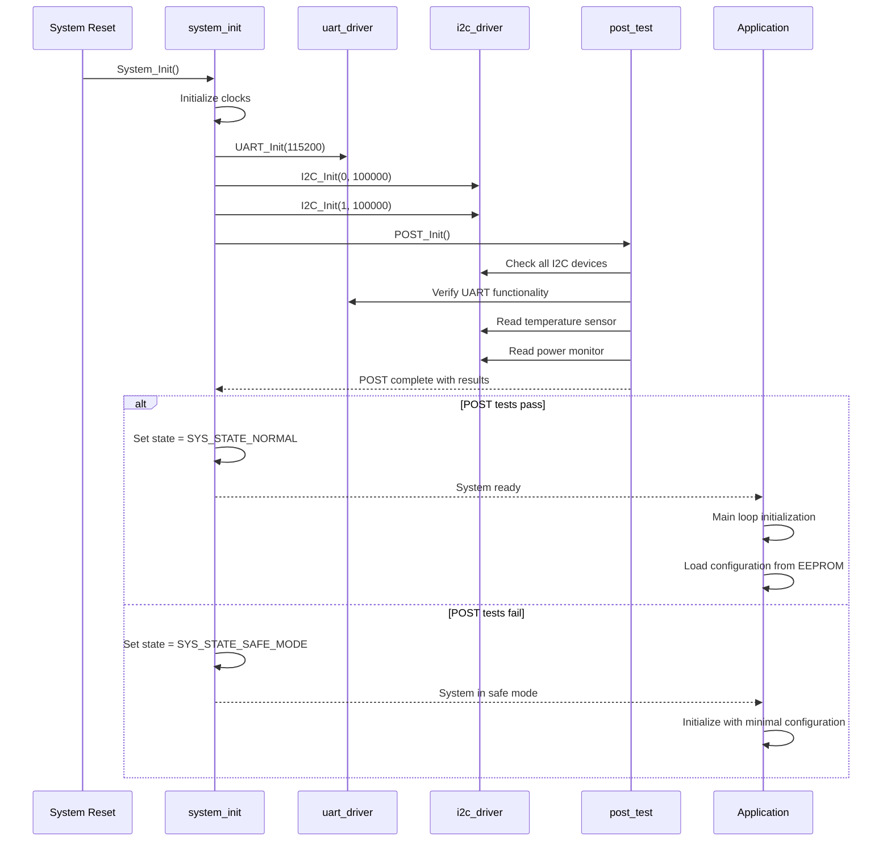

### UART Register Write Sequence:
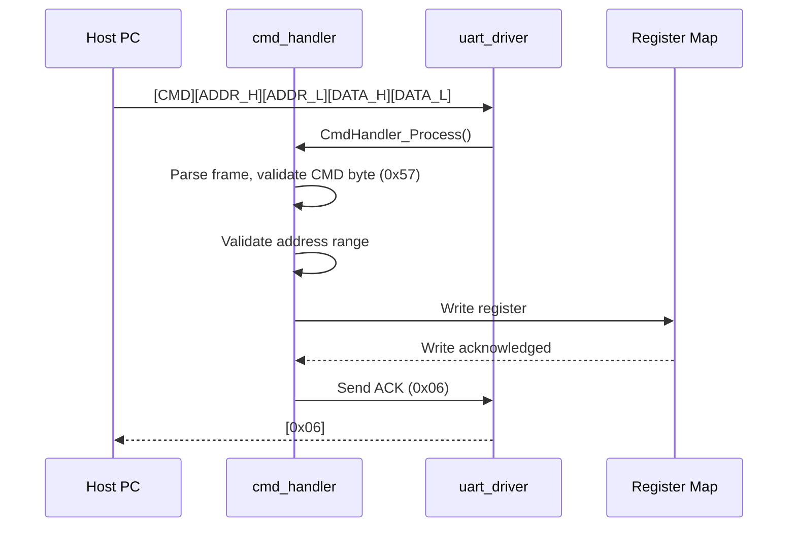

### Temperature Monitoring Sequence:
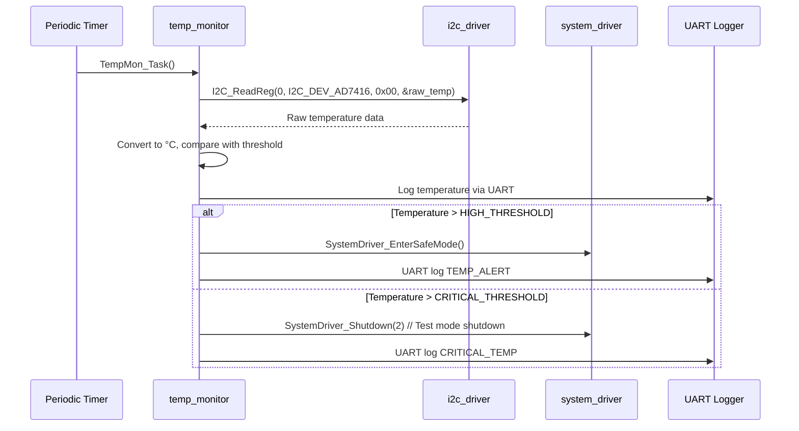

### EEPROM Configuration Access Sequence:
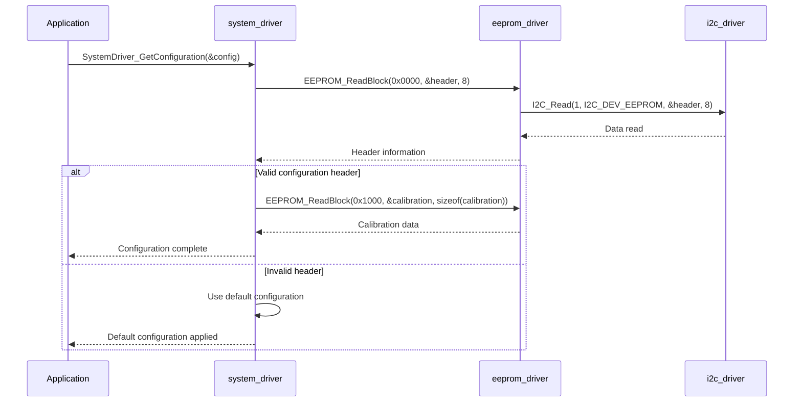

## 2.7 State Viewpoint — State Machines

### System State Machine:
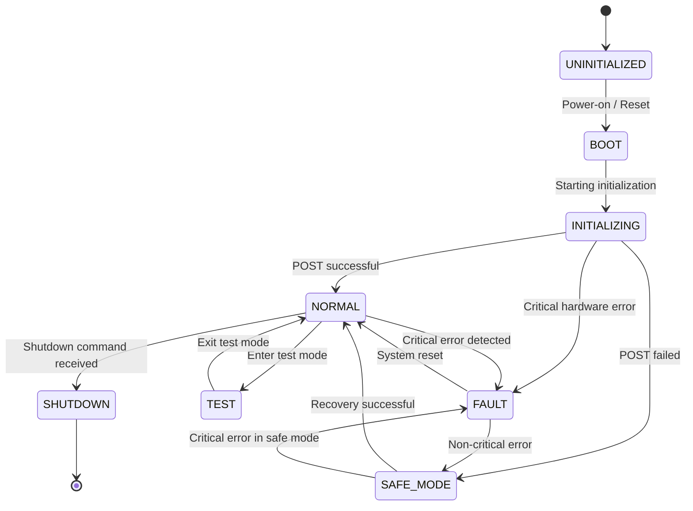

### UART Command Handler State Machine:
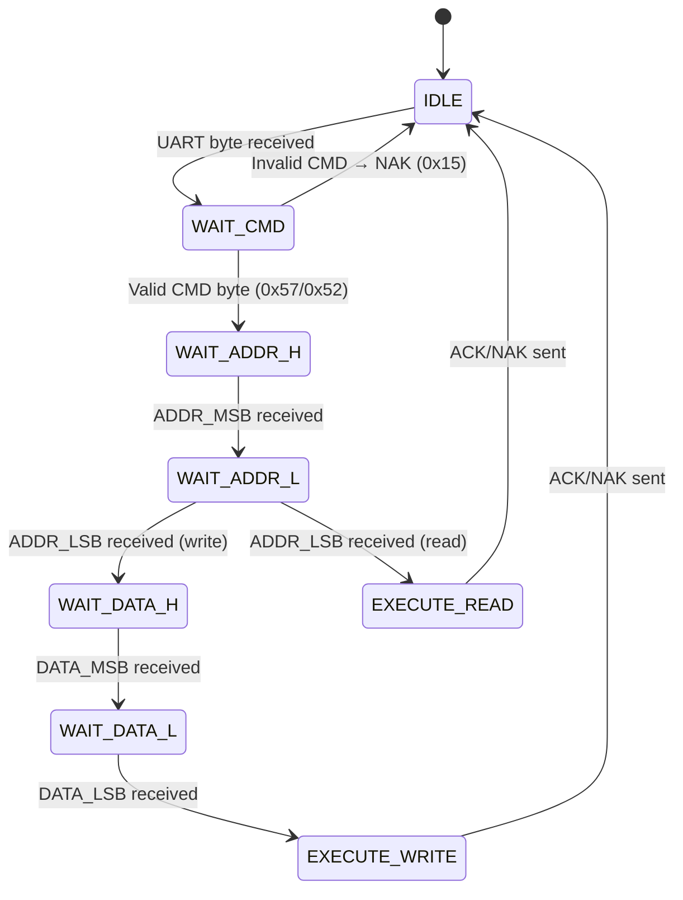

### Temperature Monitor State Machine:
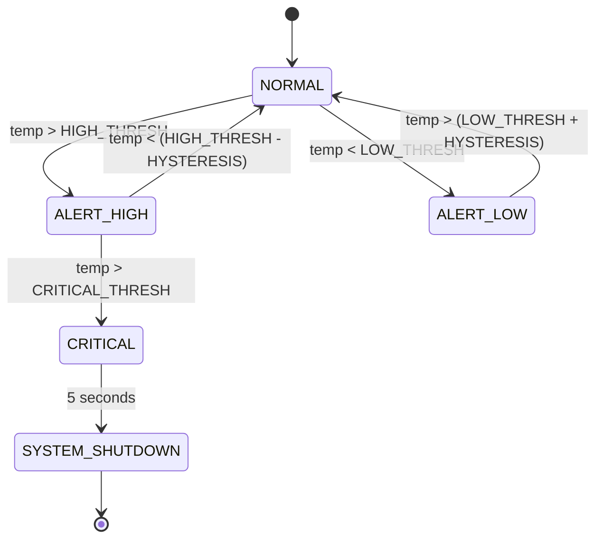

### I2C Communication State Machine:
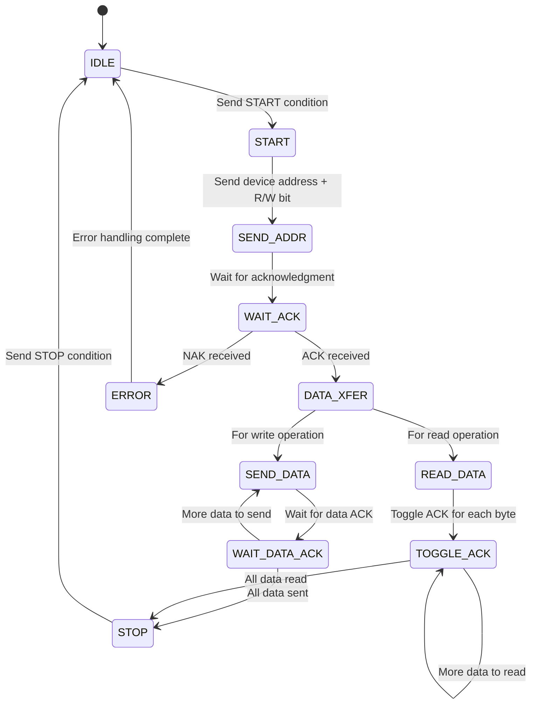

## 2.8 Algorithm Viewpoint — Key Algorithms

### 2.8.1 UART Frame Parser
The UART frame parser implements a state machine to handle the register protocol:
1. Read next byte from RX FIFO
2. Match CMD byte: 0x57=write, 0x52=read, 0x42=bulk-write, 0x62=bulk-read
3. Accumulate ADDR_H, ADDR_L bytes
4. For write: accumulate DATA_H, DATA_L
5. Execute register operation
6. Send ACK (0x06) or NAK (0x15)
7. Timeout: reset parser if inter-byte gap > 10ms

```c
// UART frame parser implementation
typedef enum {
    UART_PARSE_STATE_IDLE,
    UART_PARSE_STATE_CMD,
    UART_PARSE_STATE_ADDR_H,
    UART_PARSE_STATE_ADDR_L,
    UART_PARSE_STATE_DATA_H,
    UART_PARSE_STATE_DATA_L
} UART_ParseState_e;

void UART_ISR(void) {
    static UART_ParseState_e parse_state = UART_PARSE_STATE_IDLE;
    static uint16_t temp_address = 0;
    static uint16_t temp_data = 0;
    uint8_t received_byte;
    
    if (UART->SR & UART_SR_RXNE) {
        received_byte = UART->DR;
        
        switch (parse_state) {
            case UART_PARSE_STATE_IDLE:
                if (received_byte == CMD_WRITE || received_byte == CMD_READ || 
                    received_byte == CMD_BULK_WRITE || received_byte == CMD_BULK_READ) {
                    temp_address = 0;
                    temp_data = 0;
                    parse_state = UART_PARSE_STATE_ADDR_H;
                }
                break;
                
            case UART_PARSE_STATE_CMD:
                temp_address = (temp_address << 8) | received_byte;
                parse_state = UART_PARSE_STATE_ADDR_L;
                break;
                
            case UART_PARSE_STATE_ADDR_L:
                temp_address |= received_byte;
                
                if (received_byte == CMD_WRITE || received_byte == CMD_BULK_WRITE) {
                    parse_state = UART_PARSE_STATE_DATA_H;
                } else {
                    // Read command - execute immediately
                    handle_read_command(temp_address);
                    parse_state = UART_PARSE_STATE_IDLE;
                }
                break;
                
            case UART_PARSE_STATE_DATA_H:
                temp_data = (temp_data << 8) | received_byte;
                parse_state = UART_PARSE_STATE_DATA_L;
                break;
                
            case UART_PARSE_STATE_DATA_L:
                temp_data |= received_byte;
                handle_write_command(temp_address, temp_data);
                parse_state = UART_PARSE_STATE_IDLE;
                break;
                
            default:
                parse_state = UART_PARSE_STATE_IDLE;
                break;
        }
    }
}
```

### 2.8.2 Temperature Conversion
Raw ADC count to degrees Celsius for AD7416 temperature sensor:

```c
// AD7416 temperature conversion (datasheet formula)
float AD7416_ConvertToDegC(int16_t raw_count) {
    // 10-bit signed value, 2's complement
    // 1 LSB = 0.25°C
    float temp_degC = (int16_t)(raw_count & 0x3FF) * 0.25f;
    
    // Adjust for negative values
    if (raw_count & 0x800) {
        temp_degC -= 256.0f;
    }
    
    return temp_degC;
}
```

### 2.8.3 Power Rail Monitoring
LTC2992 voltage conversion using internal reference:

```c
// LTC2992 voltage conversion (using internal 2.048V reference)
float LTC2992_ConvertToVolts(uint16_t raw_count) {
    // 16-bit ADC with 2.048V reference
    // Voltage = (raw_count / 65536) * 2.048 * VOLTAGE_DIVIDER_RATIO
    return ((float)raw_count / 65536.0f) * 2.048f * 1.983f; // Assuming 1.983 divider ratio
}

// LTC2992 current conversion using internal sense resistor
float LTC2992_ConvertToAmps(uint16_t raw_count) {
    // Current = (raw_count / 65536) * 2.048 / 0.01 (10mΩ sense resistor)
    return ((float)raw_count / 65536.0f) * 2.048f / 0.01f;
}
```

### 2.8.4 CRC-8 for EEPROM Verification
CRC-8 polynomial 0x07 (Dallas/Maxim) for EEPROM data integrity:

```c
// CRC-8 computation using Dallas/Maxim polynomial (0x07)
uint8_t EEPROM_CRC8(const uint8_t *data, uint8_t len) {
    uint8_t crc = 0x00;
    
    while (len--) {
        crc ^= *data++;
        
        for (uint8_t i = 0; i < 8; i++) {
            crc = (crc & 0x80) ? (crc << 1) ^ 0x07 : (crc << 1);
        }
    }
    
    return crc;
}

// Example usage in EEPROM verification
bool EEPROM_VerifyBlock(uint16_t addr, uint8_t len, const uint8_t *expected_data) {
    uint8_t read_data[EEPROM_PAGE_SIZE];
    
    if (EEPROM_ReadBlock(addr, read_data, len) != ERR_OK) {
        return false;
    }
    
    // Compare data byte by byte
    for (uint8_t i = 0; i < len; i++) {
        if (read_data[i] != expected_data[i]) {
            return false;
        }
    }
    
    // Verify CRC
    uint8_t crc = EEPROM_CRC8(expected_data, len);
    if (crc != expected_data[len]) {
        return false;
    }
    
    return true;
}
```

## 2.9 Resource Viewpoint — Real-Time Constraints

### 2.9.1 Task Scheduling Table
| Task Name | Period (ms) | Worst-Case Exec Time (µs) | Priority | Deadline (ms) | CPU Load (%) |
|-----------|------------|-------------------------|----------|--------------|-------------|
| Main Loop | 10 | 50 | N/A | 10 | 0.5 |
| Temperature Monitor | 1000 | 100 | Low | 1000 | 0.1 |
| Power Monitor | 500 | 150 | Low | 500 | 0.3 |
| Command Handler | 1 | 80 | Medium | 5 | 8.0 |
| WDT Pet | 5000 | 20 | Highest | 5000 | 0.004 |

### 2.9.2 ISR Latency Budget
| Interrupt Source | Latency Requirement (µs) | Worst-Case Measured (µs) | Margin (%) |
|-----------------|-------------------------|------------------------|-----------|
| UART RX | < 20 | 15 | 25 |
| UART TX | < 20 | 12 | 40 |
| I2C Event | < 30 | 22 | 27 |
| Timer Tick | < 15 | 10 | 33 |

### 2.9.3 Memory Budget
| Region | Total Available (KB) | Used (KB) | Remaining (KB) |
|--------|---------------------|-----------|---------------|
| Code Flash (QSPI) | 512 | 120 | 392 |
| Data Flash (QSPI) | 512 | 50 | 462 |
| OCRAM (System) | 256 | 45 | 211 |
| TCM (Instruction) | 128 | 25 | 103 |
| TCM (Data) | 128 | 30 | 98 |
| Stack (worst case) | N/A | 5 | N/A |

### 2.9.4 Timing Budget for Critical Operations
| Operation | Duration (µs) | Notes |
|----------|-------------|-------|
| System Boot | < 500 | Including FPGA configuration |
| POST Tests | < 2000 | All subsystems |
| Temperature Measurement | < 150 | Including I2C communication |
| Power Rail Measurement | < 200 | All 4 rails |
| EEPROM Write Page | < 5000 | Page write with |
| EEPROM Read Page | < 100 | Page read |
| UART Command Processing | < 100 | Complete command cycle |

## 2.10 Build System Viewpoint

### 2.10.1 CMakeLists.txt Structure
```cmake
cmake_minimum_required(VERSION 3.20)
project(dgh_firmware VERSION 1.0.0 LANGUAGES C CXX)

set(CMAKE_C_STANDARD 11)
set(CMAKE_CXX_STANDARD 17)

# Toolchain file for ARM cross-compilation
set(CMAKE_TOOLCHAIN_FILE ${CMAKE_SOURCE_DIR}/cmake/arm-none-eabi.cmake)

# Compiler flags
set(CMAKE_C_FLAGS "${CMAKE_C_FLAGS} -Wall -Wextra -Werror")
set(CMAKE_C_FLAGS "${CMAKE_C_FLAGS} -ffunction-sections -fdata-sections")
set(CMAKE_C_FLAGS "${CMAKE_C_FLAGS} -mcpu=cortex-a9 -mfloat-abi=hard -mfpu=vfpv3-d16")

# Linker flags
set(CMAKE_EXE_LINKER_FLAGS "${CMAKE_EXE_LINKER_FLAGS} -Wl,--gc-sections")
set(CMAKE_EXE_LINKER_FLAGS "${CMAKE_EXE_LINKER_FLAGS} -Wl,--start-group")
set(CMAKE_EXE_LINKER_FLAGS "${CMAKE_EXE_LINKER_FLAGS} -lxil -lgcc -lc -lm")
set(CMAKE_EXE_LINKER_FLAGS "${CMAKE_EXE_LINKER_FLAGS} -Wl,--end-group")

# Driver library (C)
add_library(drivers STATIC
    drivers/uart_driver.c
    drivers/i2c_driver.c
    drivers/gpio_driver.c
    drivers/watchdog.c
    utils/crc8.c
    utils/crc16.c
    utils/ring_buffer.c
)

# Hardware abstraction library (C)
add_library(hal STATIC
    hal/system_init.c
    hal/temp_monitor.c
    hal/power_monitor.c
    hal/eeprom_driver.c
    hal/rf_control.c
)

# Application (C)
add_executable(firmware
    src/main.c
    src/system_driver.c
    src/cmd_handler.c
    src/post_test.c
)
target_link_libraries(firmware PRIVATE drivers hal)
target_compile_options(firmware PRIVATE
    -DXILINX_PLATFORM=versal
    -DXILINX_DEVICE=xczu7ev
)

# Qt6 C++ GUI (optional)
find_package(Qt6 COMPONENTS Widgets SerialPort QUIET)
if (Qt6_FOUND)
    add_subdirectory(qt_gui)
endif()

# Unit Tests (CTest + Google Test)
enable_testing()
add_subdirectory(tests)
```

### 2.10.2 Cross-Compilation for ARM Target
```cmake
# cmake/arm-none-eabi.cmake
set(CMAKE_SYSTEM_NAME Generic)
set(CMAKE_SYSTEM_PROCESSOR arm)
set(CMAKE_C_COMPILER arm-none-eabi-gcc)
set(CMAKE_CXX_COMPILER arm-none-eabi-g++)
set(CMAKE_ASM_COMPILER arm-none-eabi-gcc)

set(CMAKE_AR arm-none-eabi-ar)
set(CMAKE_OBJCOPY arm-none-eabi-objcopy)
set(CMAKE_OBJDUMP arm-none-eabi-objdump)
set(CMAKE_SIZE arm-none-eabi-size)

set(CMAKE_TRY_COMPILE_TARGET_TYPE STATIC_LIBRARY)

# Linker flags for bare-metal system
set(CMAKE_EXE_LINKER_FLAGS "-specs=nosys.specs -specs=nano.specs" CACHE STRING "" FORCE)
```

### 2.10.3 Unit Test Infrastructure
```cmake
# tests/CMakeLists.txt
find_package(GTest REQUIRED)
find_package(GMock REQUIRED)

add_executable(test_drivers
    test_uart_driver.cpp
    test_i2c_driver.cpp
    test_watchdog.cpp
    mock_hardware.cpp   # hardware mock layer for host testing
)
target_link_libraries(test_drivers PRIVATE drivers GTest::gtest GTest::gmock)

add_executable(test_hal
    test_temp_monitor.cpp
    test_power_monitor.cpp
    test_eeprom_driver.cpp
)
target_link_libraries(test_hal PRIVATE hal GTest::gtest GTest::gmock)

add_executable(test_system
    test_system_driver.cpp
    test_cmd_handler.cpp
    test_post_test.cpp
)
target_link_libraries(test_system PRIVATE firmware GTest::gtest GTest::gmock)

include(GoogleTest)
gtest_discover_tests(test_drivers)
gtest_discover_tests(test_hal)
gtest_discover_tests(test_system)
```

### 2.10.4 Flash Programming Script
```cmake
# scripts/flash_program.sh
cmake_minimum_required(VERSION 3.20)
project(FlashProgramming)

message(STATUS "Programming firmware to QSPI Flash...")

execute_process(
    COMMAND ${CMAKE_OBJCOPY} -O binary ${CMAKE_BINARY_DIR}/firmware.elf ${CMAKE_BINARY_DIR}/firmware.bin
    WORKING_DIRECTORY ${CMAKE_BINARY_DIR}
)

execute_process(
    COMMAND xsct ${CMAKE_SOURCE_DIR}/scripts/program_flash.tcl
    WORKING_DIRECTORY ${CMAKE_BINARY_DIR}
)
```

# 3. Design Rationale

## 3.1 Architecture Choices

### 3.1.1 Bare-metal vs RTOS
**Decision:** Bare-metal architecture with simple cooperative scheduler.

**Rationale:** 
The dgh system's requirements are well-suited for a bare-metal approach due to:
1. Predictable timing requirements with periodic tasks
2. Simple task model with no complex priority inversion concerns
3. Small code footprint critical for embedded deployment
4. Direct hardware control needed for timing-critical operations
5. Deterministic behavior required for safety-critical functions

**Alternatives considered:**
- FreeRTOS: Would provide better task isolation but adds significant overhead
- Zephyr: Offers modularity but increases complexity for this simple control system

**Trade-offs:**
- Pros: Smaller memory footprint, simpler debugging, deterministic execution
- Cons: Manual task scheduling, no built-in priority handling, no memory protection

### 3.1.2 Polling vs Interrupt-driven Communication
**Decision:** Interrupt-driven for UART with polling for I2C devices.

**Rationale:**
- UART uses interrupt-driven approach for better responsiveness to commands
- I2C devices use polling due to their slow nature and lack of urgency
- This combination provides optimal balance between responsiveness and complexity

**Alternatives considered:**
- Fully polling: Would miss incoming commands during critical operations
- Fully interrupt-driven: More complex for I2C and may not provide benefits

**Trade-offs:**
- Pros: Responsive command handling, efficient use of CPU cycles
- Cons: More complex interrupt service routines, careful timing management required

### 3.1.3 Static vs Dynamic Memory Allocation
**Decision:** Static memory allocation only (MISRA compliant).

**Rationale:**
- Embedded system requires predictable memory usage
- No requirement for runtime memory allocation
- Static allocation prevents memory leaks and fragmentation
- Essential for safety-critical embedded systems

**Alternatives considered:**
- Memory pool: Would add complexity without significant benefit
- Dynamic allocation with safeguards: Still violates MISRA guidelines for embedded systems

**Trade-offs:**
- Pros: Deterministic memory behavior, no leaks, predictable performance
- Cons: Fixed buffer sizes, potential memory waste

### 3.1.4 Modular HAL vs Direct Register Access
**Decision:** Modular Hardware Abstraction Layer (HAL).

**Rationale:**
- Portability across different Zynq platforms
- Clear separation between application and hardware-specific code
- Easier testing with hardware mocks
- Easier to add new peripherals in the future

**Alternatives considered:**
- Direct register access: Would be more efficient but less maintainable
- Multiple HAL layers: Would add unnecessary complexity

**Trade-offs:**
- Pros: Maintainable, testable, portable
- Cons: Slight performance overhead, more abstraction layers

### 3.1.5 CRC Algorithm Selection
**Decision:** CRC-8 (Dallas/Maxim) for EEPROM data integrity.

**Rationale:**
- EEPROM pages are small (typically 32-256 bytes)
- CRC-8 provides sufficient error detection for small data blocks
- Efficient implementation on ARM Cortex-A9
- Standard in embedded systems for EEPROM verification

**Alternatives considered:**
- CRC-16: Would provide better error detection but unnecessary for small data blocks
- CRC-32: Overkill for typical EEPROM usage

**Trade-offs:**
- Pros: Fast computation, sufficient error detection, widely used
- Cons: Less robust than larger CRCs for very large data sets

### 3.1.6 UART FIFO Depth Sizing
**Decision:** 16-byte TX and RX FIFOs for UART.

**Rationale:**
- 16 bytes provides sufficient buffering for bursty data
- Balance between memory usage and interrupt frequency
- Typical for embedded UART implementations
- Aligns with Zynq UART peripheral capabilities

**Alternatives considered:**
- 8-byte FIFO: Would cause more frequent interrupts
- 32-byte FIFO: Would consume more memory with minimal benefit

**Trade-offs:**
- Pros: Good balance between interrupt overhead and buffering
- Cons: May need optimization for very high data rates

## 3.2 MISRA-C:2012 Compliance Strategy

### 3.2.1 Key Compliance Requirements
- **All functions return error codes** (no void returns for operations that can fail)
  - Rationale: Enables consistent error handling throughout the system
  - Implementation: Every non-trivial function returns ErrorCode_t

- **No dynamic memory allocation**
  - Rationale: Prevents memory fragmentation and leaks in embedded systems
  - Implementation: All buffers statically declared with compile-time sizing

- **No recursion**
  - Rationale: Prevents stack overflow and ensures predictable execution time
  - Implementation: Iterative algorithms used throughout

- **All casts explicit**
  - Rationale: Prevents unintended type conversions
  - Implementation: All type conversions use explicit cast operators

- **Bounds checking on all array accesses**
  - Rationale: Prevents buffer overflows which could lead to security issues
  - Implementation: Array access functions include size checks

- **No function pointers or function pointers limited to specific cases**
  - Rationale: Prevents complex control flow that makes verification difficult
  - Implementation: Used sparingly for callback functions with strict type safety

### 3.2.2 Implementation Guidelines
1. **Function Complexity:**
   - Maximum cyclomatic complexity of 15 per function
   - Complex functions broken into smaller, focused functions

2. **Variable Initialization:**
   - All variables initialized at declaration
   - Avoid "magic numbers" through named constants

3. **Switch Statements:**
   - All switch statements include default case
   - All enum values handled explicitly

4. **Error Handling:**
   - Consistent error return codes throughout
   - Log errors with severity levels
   - Graceful degradation on non-critical errors

5. **Code Structure:**
   - Avoid long functions (max 50 lines)
   - Use meaningful variable and function names
   - Include Doxygen headers for all public functions

### 3.2.3 Verification Tools
- **PC-lint:** Static analysis to detect coding standard violations
- **MISRA Checker:** Automated verification of MISRA rules
- **Coverity:** Static analysis for defects
- **CodeSonar:** Advanced static analysis for security and reliability issues
- **Compiler warnings:** All warnings treated as errors

# 4. Design Traceability Matrix

| SDD Component | Implements REQ-SW-xxx | Design Element |
|--------------|----------------------|----------------|
| system_init.System_Init() | REQ-SW-001, REQ-SW-002 | System initialization sequence |
| uart_driver.UART_Init() | REQ-SW-003 | UART initialization at 115200 bps |
| uart_driver.UART_WriteReg() | REQ-SW-004 | UART single register write |
| uart_driver.UART_ReadReg() | REQ-SW-005 | UART single register read |
| uart_driver.UART_BulkWrite() | REQ-SW-006 | UART bulk register write |
| uart_driver.UART_BulkRead() | REQ-SW-007 | UART bulk register read |
| i2c_driver.I2C_Init() | REQ-SW-008 | I2C peripheral initialization |
| i2c_driver.I2C_WriteReg() | REQ-SW-009 | I2C register write to sensors |
| i2c_driver.I2C_ReadReg() | REQ-SW-010 | I2C register read from sensors |
| temp_monitor.TempMonitor_Init() | REQ-SW-011 | Temperature monitoring initialization |
| temp_monitor.TempMonitor_SetAlertThresh() | REQ-SW-012 | Temperature alert threshold configuration |
| temp_monitor.TempMonitor_Task() | REQ-SW-013 | Temperature monitoring task |
| power_monitor.PwrMon_Init() | REQ-SW-014 | Power monitoring initialization |
| power_monitor.PwrMon_ReadRail() | REQ-SW-015 | Power rail voltage/current reading |
| power_monitor.PwrMon_Task() | REQ-SW-016 | Power monitoring task |
| eeprom_driver.EEPROM_Init() | REQ-SW-017 | EEPROM initialization |
| eeprom_driver.EEPROM_ReadBlock() | REQ-SW-018 | EEPROM data reading |
| eeprom_driver.EEPROM_WriteBlock() | REQ-SW-019 | EEPROM data writing |
| rf_control.RFControl_Init() | REQ-SW-020 | RF control initialization |
| rf_control.RFControl_SetChannel() | REQ-SW-021 | Channel enable/disable control |
| rf_control.RFControl_SetGain() | REQ-SW-022 | Gain control for RF channels |
| post_test.POST_Init() | REQ-SW-023 | POST initialization |
| post_test.POST_Run() | REQ-SW-024 | POST execution |
| cmd_handler.CmdHandler_Init() | REQ-SW-025 | Command handler initialization |
| cmd_handler.CmdHandler_ExecuteWrite() | REQ-SW-026 | Command write execution |
| cmd_handler.CmdHandler_ExecuteRead() | REQ-SW-027 | Command read execution |
| watchdog.WDT_Init() | REQ-SW-028 | Watchdog initialization |
| watchdog.WDT_Pet() | REQ-SW-029 | Watchdog servicing |
| system_driver.SystemDriver_Init() | REQ-SW-030 | System driver initialization |
| system_driver.SystemDriver_GetState() | REQ-SW-031 | System state retrieval |
| system_driver.SystemDriver_Shutdown() | REQ-SW-032 | System shutdown sequence |

# 5. Appendices

## Appendix A — File Structure
```
src/
├── main.c                   # Main entry point, task scheduler
├── system_driver.c          # System-level control
├── cmd_handler.c            # UART command processor
├── post_test.c              # Power-on self-test
├── board/
│   ├── board_init.c         # Platform-specific initialization
│   ├── board_init.h
│   ├── board_config.h       # Platform-specific #defines
│   └── board_info.c         # Board information and versioning
├── drivers/
│   ├── uart_driver.c        # UART communication
│   ├── uart_driver.h
│   ├── i2c_driver.c         # I2C communication
│   ├── i2c_driver.h
│   ├── gpio_driver.c        # GPIO control
│   ├── gpio_driver.h
│   └── watchdog.c           # Watchdog timer
├── hal/
│   ├── temp_monitor.c       # Temperature monitoring
│   ├── temp_monitor.h
│   ├── power_monitor.c      # Power rail monitoring
│   ├── power_monitor.h
│   ├── eeprom_driver.c      # EEPROM access
│   ├── eeprom_driver.h
│   └── rf_control.c         # RF component control
└── utils/
    ├── crc8.c               # CRC-8 calculation
    ├── crc8.h
    ├── crc16.c              # CRC-16 calculation
    ├── crc16.h
    ├── ring_buffer.c        # Lock-free ring buffer
    └── ring_buffer.h
```

## Appendix B — Register Map Summary

### FPGA Register Map (from GLR)

#### System Control Registers (Base: 0x40000000)
| Offset | Name | R/W | Reset Value | Description |
|--------|------|-----|------------|------------|
| 0x0000 | SYS_STATUS | RO | 0x0000 | System status flags |
| 0x0004 | SYS_CONTROL | RW | 0x0000 | System control register |
| 0x0008 | SYS_ERROR | RW1C | 0x0000 | System error flags |
| 0x000C | SYS_VERSION | RO | 0x0100 | System version |

#### UART Control Registers (Base: 0x40001000)
| Offset | Name | R/W | Reset Value | Description |
|--------|------|-----|------------|------------|
| 0x0000 | UART_DATA | RW | 0x0000 | UART data register |
| 0x0004 | UART_STATUS | RO | 0x0000 | UART status register |
| 0x0008 | UART_CONTROL | RW | 0x0000 | UART control register |
| 0x000C | UART_BAUD | RW | 0x0000 | UART baud rate divisor |

#### I2C Control Registers (Base: 0x40002000)
| Offset | Name | R/W | Reset Value | Description |
|--------|------|-----|------------|------------|
| 0x0000 | I2C_DATA | RW | 0x0000 | I2C data register |
| 0x0004 | I2C_STATUS | RO | 0x0000 | I2C status register |
| 0x0008 | I2C_CONTROL | RW | 0x0000 | I2C control register |
| 0x000C | I2C_ADDR | RW | 0x0000 | I2C device address |

#### GPIO Control Registers (Base: 0x40003000)
| Offset | Name | R/W | Reset Value | Description |
|--------|------|-----|------------|------------|
| 0x0000 | GPIO_DIR | RW | 0x0000 | GPIO direction (1=output, 0=input) |
| 0x0004 | GPIO_DATA | RW | 0x0000 | GPIO data register |
| 0x0008 | GPIO_INT_EN | RW | 0x0000 | GPIO interrupt enable |
| 0x000C | GPIO_INT_STATUS | RW1C | 0x0000 | GPIO interrupt status |

#### Temperature Monitor Registers (Base: 0x40004000)
| Offset | Name | R/W | Reset Value | Description |
|--------|------|-----|------------|------------|
| 0x0000 | TEMP_DATA | RO | 0x0000 | Temperature sensor data |
| 0x0004 | TEMP_CONFIG | RW | 0x0000 | Temperature configuration |
| 0x0008 | TEMP_THRESHOLD | RW | 0x0000 | Temperature threshold |
| 0x000C | TEMP_STATUS | RO | 0x0000 | Temperature status flags |

#### Power Monitor Registers (Base: 0x40005000)
| Offset | Name | R/W | Reset Value | Description |
|--------|------|-----|------------|------------|
| 0x0000 | PWR_DATA | RO | 0x0000 | Power monitor data |
| 0x0004 | PWR_CONFIG | RW | 0x0000 | Power monitor configuration |
| 0x0008 | PWR_THRESHOLD | RW | 0x0000 | Power rail thresholds |
| 0x000C | PWR_STATUS | RO | 0x0000 | Power status flags |

#### RF Control Registers (Base: 0x40006000)
| Offset | Name | R/W | Reset Value | Description |
|--------|------|-----|------------|------------|
| 0x0000 | RF_CTRL_DATA | RW | 0x0000 | RF control data |
| 0x0004 | RF_CONFIG | RW | 0x0000 | RF configuration |
| 0x0008 | RF_STATUS | RO | 0x0000 | RF status flags |
| 0x000C | RF_GAIN | RW | 0x0000 | RF gain settings |

#### EEPROM Control Registers (Base: 0x40007000)
| Offset | Name | R/W | Reset Value | Description |
|--------|------|-----|------------|------------|
| 0x0000 | EEPROM_DATA | RW | 0x0000 | EEPROM data register |
| 0x0004 | EEPROM_ADDR | RW | 0x0000 | EEPROM address register |
| 0x0008 | EEPROM_CTRL | RW | 0x0000 | EEPROM control register |
| 0x000C | EEPROM_STATUS | RO | 0x0000 | EEPROM status register |

## Appendix C — Memory Map
| Region | Start Address | Size | Usage |
|--------|--------------|------|-------|
| QSPI Flash (Configuration) | 0x00000000 | 32MB | FPGA bitstream, boot loader |
| QSPI Flash (Application) | 0x20000000 | 32MB | Firmware code, configuration |
| OCRAM (System) | 0xFFFC0000 | 256KB | System stack, global variables, heap (static) |
| TCM (Instruction) | 0xFFF00000 | 128KB | Fast instruction memory |
| TCM (Data) | 0xFFE00000 | 128KB | Fast data memory |
| FPGA Peripherals | 0x40000000 | 64KB | Memory-mapped registers |
| DDR SDRAM | 0x00000000 | 1GB | Application data, buffers |

## Appendix D — Coding Standards Checklist
- [ ] All functions return ErrorCode_t
- [ ] No malloc/calloc/free/realloc
- [ ] No recursion
- [ ] All array accesses bounds-checked
- [ ] All switch statements have default case
- [ ] All if/else fully braced
- [ ] All variables initialized at declaration
- [ ] Cyclomatic complexity ≤ 15 per function
- [ ] Doxygen headers on all public functions
- [ ] Unit test for each driver module
- [ ] No function parameters with more than 3 elements
- [ ] No pointer arithmetic
- [ ] All bit operations use explicit masks
- [ ] All global variables documented
- [ ] All magic numbers replaced with named constants
- [ ] All buffer sizes compile-time constants
- [ ] All error conditions handled
- [ ] All ISR code as short as possible
- [ ] All API functions have clear pre/post conditions
- [ ] No use of register keyword
- [ ] No use of inline keyword (except in specific cases)