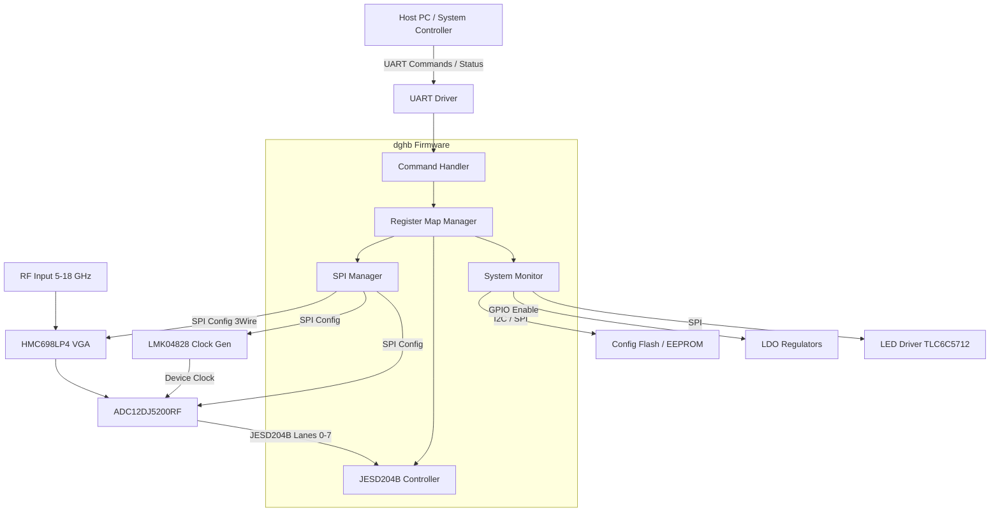
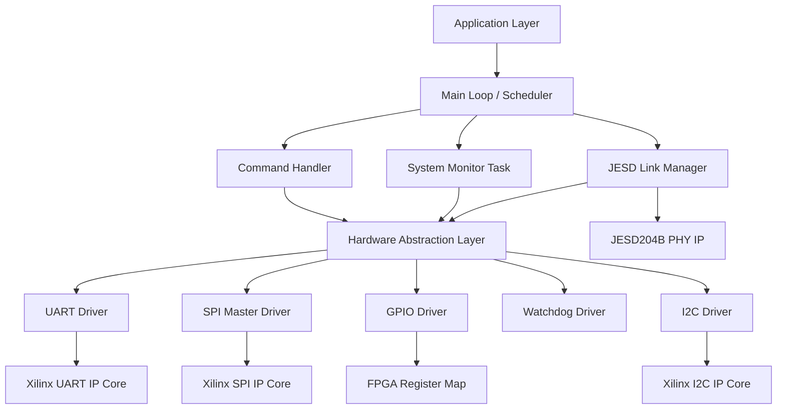
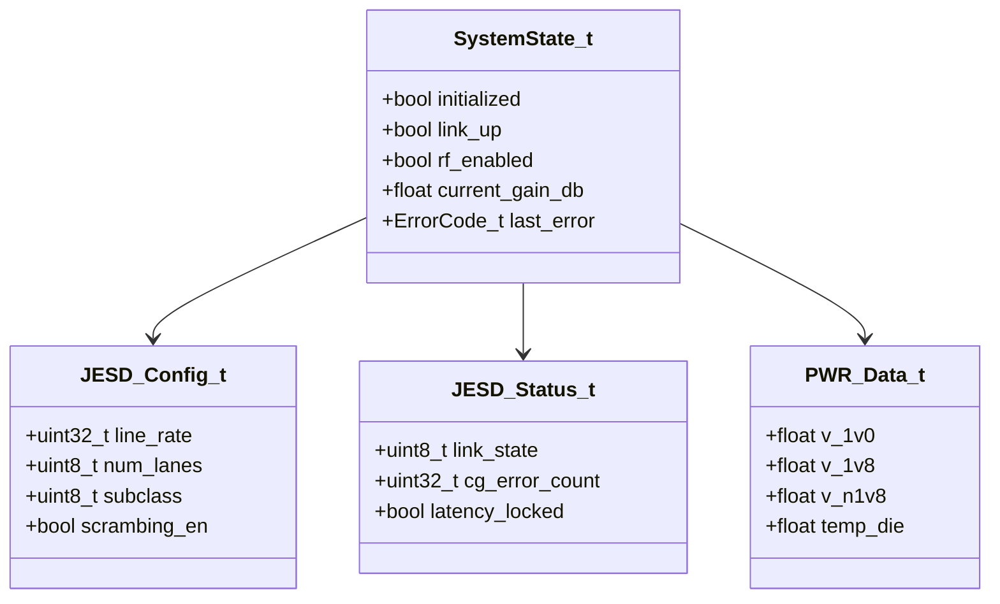
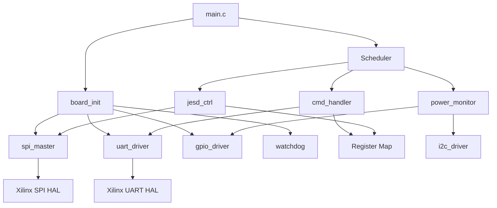
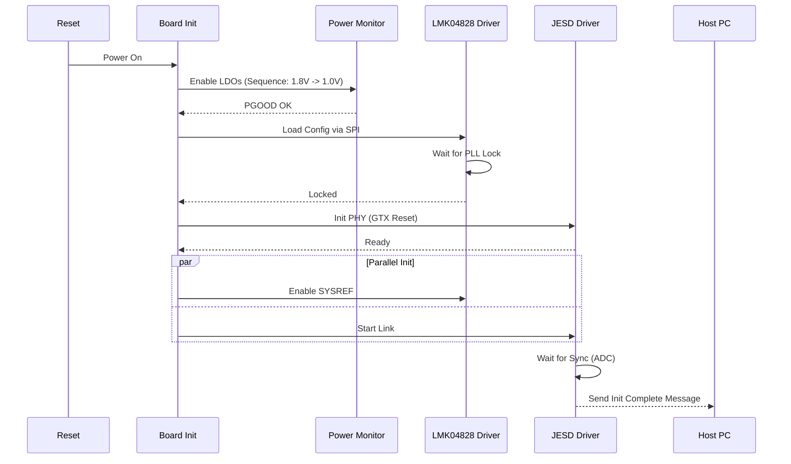
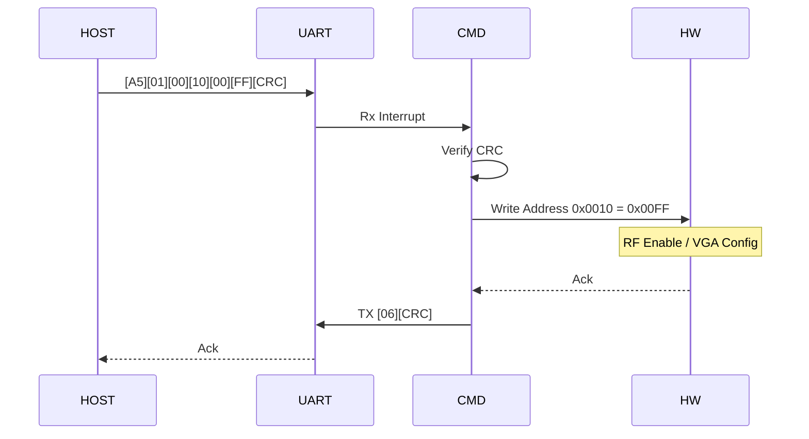
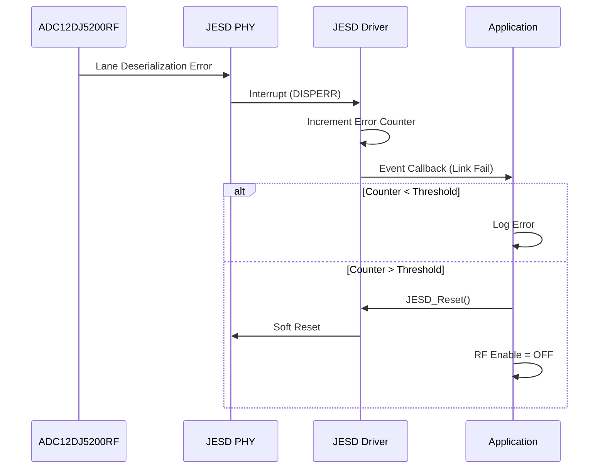
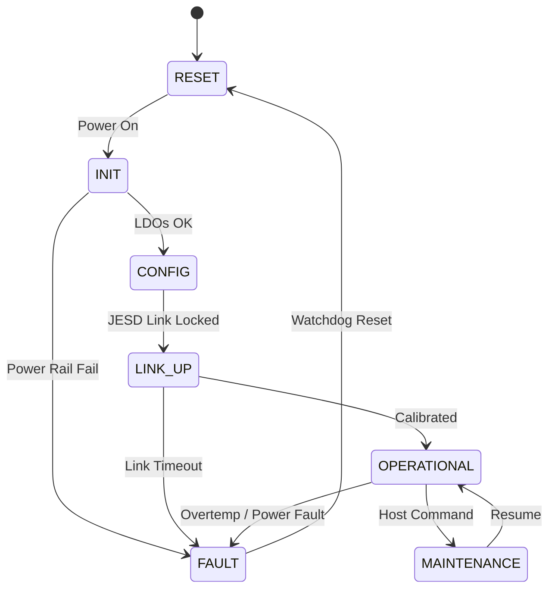
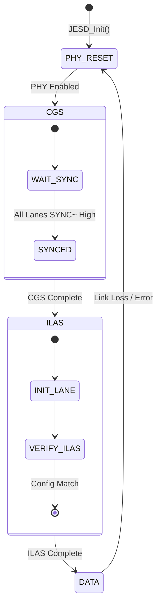

# Software Design Document (SDD)

**Project:** dghb Wideband RF Receiver System
**Version:** 1.0
**Date:** 16 April 2026
**Author:** Senior Embedded Software Architect

---

## Document Control

| Version | Date | Author | Description |
|---------|------|--------|-------------|
| 1.0 | 16 April 2026 | Senior Embedded Software Architect | Initial design release for dghb Firmware v1.0 |

---

# 1. Introduction

## 1.1 Purpose
This Software Design Document (SDD) details the structural and behavioral design of the embedded firmware for the **dghb Wideband RF Receiver System**. This document defines the software architecture, component interfaces, data structures, and algorithms necessary to implement the requirements specified in the **dghb Software Requirements Specification (SRS)**.

The primary audience includes:
*   **Firmware Engineers:** Implementing the C/MicroBlaze code and HDL glue logic.
*   **Verification Engineers:** Developing unit tests and integration test vectors.
*   **System Architects:** Validating hardware/software trade-offs.

## 1.2 Scope
The firmware design covers the following subsystems residing on the **Xilinx XC7K325T FPGA**:
1.  **Control Plane:** UART command parser, register map interface, and SPI device management (VGA, Clock Gen, ADC).
2.  **Data Plane:** JESD204B PHY management, lane alignment, and data buffering.
3.  **Monitor Plane:** Power sequencing, temperature monitoring, and LED status indication.
4.  **Storage:** Non-volatile memory handling for calibration and configuration data.

**Exclusions:** Host PC GUI implementation and RF DSP algorithms (FFT, demodulation) are outside the scope of this firmware design.

## 1.3 Definitions and Acronyms

| Acronym | Definition |
| :--- | :--- |
| **ADC** | Analog-to-Digital Converter (ADC12DJ5200RF) |
| **API** | Application Programming Interface |
| **BRAM** | Block RAM (FPGA internal memory) |
| **BSP** | Board Support Package |
| **CLK** | Clock |
| **CRC** | Cyclic Redundancy Check |
| **DMA** | Direct Memory Access |
| **DSP** | Digital Signal Processing |
| **EEPROM** | Electrically Erasable Programmable Read-Only Memory |
| **FIFO** | First-In-First-Out Buffer |
| **FPGA** | Field Programmable Gate Array |
| **FSM** | Finite State Machine |
| **GLR** | Glue Logic Requirements |
| **GPIO** | General Purpose Input/Output |
| **HAL** | Hardware Abstraction Layer |
| **HRS** | Hardware Requirements Specification |
| **I2C** | Inter-Integrated Circuit |
| **ISR** | Interrupt Service Routine |
| **JESD** | JESD204B Standard (JEDEC Standard No. 205) |
| **LED** | Light Emitting Diode |
| **LDO** | Low Dropout Regulator |
| **LVDS** | Low-Voltage Differential Signaling |
| **MCU** | Microcontroller Unit (implemented in Soft CPU) |
| **MISRA** | Motor Industry Software Reliability Association |
| **NVM** | Non-Volatile Memory |
| **PCB** | Printed Circuit Board |
| **PHY** | Physical Layer |
| **PLL** | Phase-Locked Loop |
| **POST** | Power-On Self-Test |
| **RF** | Radio Frequency |
| **RTL** | Register Transfer Level |
| **SPI** | Serial Peripheral Interface |
| **SRS** | Software Requirements Specification |
| **TRP** | Transmit/Receive Path Control |
| **UART** | Universal Asynchronous Receiver-Transmitter |
| **VGA** | Variable Gain Amplifier |
| **WDT** | Watchdog Timer |

## 1.4 References
1.  **IEEE Std 1016-2009:** Standard for Information Technology—Systems Design—Software Design Descriptions.
2.  **SRS (dghb):** Software Requirements Specification, Rev 1.0, 16 April 2026.
3.  **GLR (dghb):** Glue Logic Requirements, Rev 0V01, 16 April 2026.
4.  **MISRA C:2012:** Guidelines for the Use of the C Language in Critical Systems.
5.  **Xilinx UG986:** Zynq-7000 SoC and Kintex-7 FPGA Software Development Guide.
6.  **JEDEC JESD204B:** Standard for High-Speed Data Converter Interfaces.
7.  **ADC12DJ5200RF Datasheet:** Texas Instruments.
8.  **LMK04828 Datasheet:** Texas Instruments.
9.  **HMC698LP4 Datasheet:** Analog Devices.

---

# 2. Design Viewpoints

## 2.1 Context Viewpoint — System Boundaries

The dghb firmware operates as the control logic for the RF Receiver chain. It bridges the Host PC (System Controller) with the Analog Front End (AFE).



**External Interfaces:**
*   **Host Interface:** UART (3.3V LVCMOS), 115200 bps default, configurable up to 12 Mbps.
*   **RF Chain:** SPI (3x Master ports), GPIO (Power Enables, TRP Control).
*   **Data Path:** JESD204B RX (GTX/GTH Transceivers).
*   **Debug:** JTAG (for debug and initial flash programming).

## 2.2 Composition Viewpoint — Software Architecture

The software is organized into a layered architecture. The Application Layer handles system state and protocol parsing. The HAL abstracts the FPGA IP cores.



### Module List

#### **Module: board_init** (board_init.c / board_init.h)
**Responsibility:** Executes the Power-On Self-Test (POST), configures the system clock tree based on the GLR, and initializes all peripheral drivers.

```c
/**
 * @brief Initialize the dghb board hardware.
 * @return ERR_OK on success, error code on failure.
 */
int32_t Board_Init(void);

/**
 * @brief Run Power On Self Test (POST).
 * Checks LDO voltages, Clock Lock, and ID registers.
 * @param[out] test_mask Bitmap of failed tests.
 * @return ERR_OK if all passed.
 */
int32_t Board_RunPOST(uint32_t *test_mask);

/**
 * @brief Get hardware version information.
 * @param[out] info Pointer to store version data.
 */
int32_t Board_GetInfo(BoardInfo_t *info);

typedef struct {
    uint16_t board_id;
    uint8_t  hw_rev_major;
    uint8_t  hw_rev_minor;
    uint32_t fw_version;
    char     serial_num[16];
} BoardInfo_t;
```

#### **Module: uart_driver** (uart_driver.c / uart_driver.h)
**Responsibility:** Manages the physical UART interface, implements interrupt-driven RX/TX ring buffers, and handles frame error detection.

```c
int32_t UART_Init(uint32_t baud_rate);
int32_t UART_Deinit(void);
/**
 * @brief Send data buffer via UART.
 * @param data Pointer to data.
 * @param len Number of bytes.
 * @return Bytes written or error.
 */
int32_t UART_Write(const uint8_t *data, uint32_t len);
/**
 * @brief Read data from UART (non-blocking).
 * @param buf Buffer to store data.
 * @param len Max bytes to read.
 * @return Bytes read.
 */
int32_t UART_Read(uint8_t *buf, uint32_t len);
void    UART_ISR_Handler(void); // Interrupt handler
```

#### **Module: cmd_handler** (cmd_handler.c / cmd_handler.h)
**Responsibility:** Implements the dghb protocol parser. Verifies command checksums, dispatches register read/write operations, and formats responses.

```c
int32_t CmdHandler_Init(void);
/**
 * @brief Process a single packet from the UART RX buffer.
 */
void    CmdHandler_Process(void);

/**
 * @brief Execute a Write Register command.
 * @param addr 16-bit register address.
 * @param data 16-bit data value.
 */
int32_t CmdHandler_ExecWrite(uint16_t addr, uint16_t data);

/**
 * @brief Execute a Read Register command.
 * @param addr 16-bit register address.
 * @param[out] data Pointer to store read value.
 */
int32_t CmdHandler_ExecRead(uint16_t addr, uint16_t *data);

typedef enum {
    CMD_STATE_IDLE,
    CMD_STATE_SYNC,
    CMD_STATE_ADDR_H,
    CMD_STATE_ADDR_L,
    CMD_STATE_DATA_H,
    CMD_STATE_DATA_L,
    CMD_STATE_CRC_H,
    CMD_STATE_CRC_L
} CmdState_e;
```

#### **Module: spi_master** (spi_master.c / spi_master.h)
**Responsibility:** Manages the 3 independent SPI buses. Handles chip select toggling and clock polarity (CPOL/CPHA) configuration for specific targets (VGA, ADC, CLK).

```c
/**
 * @brief Initialize a specific SPI bus instance.
 * @param instance Bus ID (0=VGA, 1=CLK, 2=ADC).
 * @param clk_hz Frequency in Hz.
 */
int32_t SPI_Init(uint8_t instance, uint32_t clk_hz);

/**
 * @brief Transfer data to a specific device.
 * @param instance Bus ID.
 * @param cs Chip Select index.
 * @param tx_buf Transmit buffer.
 * @param rx_buf Receive buffer.
 * @param len Length in bytes.
 */
int32_t SPI_Transfer(uint8_t instance, uint8_t cs, 
                     const uint8_t *tx_buf, uint8_t *rx_buf, uint32_t len);
```

#### **Module: jesd_ctrl** (jesd_ctrl.c / jesd_ctrl.h)
**Responsibility:** Configures the JESD204B PHY IP. Manages link state machine (Reset, CGS, ILAS, Data). Monitors lane status and deterministic latency.

```c
/**
 * @brief Initialize JESD204B PHY and enable lanes.
 */
int32_t JESD_Init(void);

/**
 * @brief Start the synchronization sequence.
 * @return ERR_OK if link achieves DATA state.
 */
int32_t JESD_StartLink(void);

/**
 * @brief Get current status of all lanes.
 * @param[out] status Structure containing lane states and error counts.
 */
int32_t JESD_GetStatus(JESD_Status_t *status);

/**
 * @brief JESD Task. Handles error recovery and periodic monitoring.
 */
void    JESD_Task(void);

typedef struct {
    uint8_t link_state; // 0=Off, 1=Init, 2=Sync, 3=Data
    uint8_t lane_status[8]; // 0=OK, 1=Error
    uint32_t code_group_error_count;
    uint32_t disparity_error_count;
    bool     deterministic_latency_locked;
} JESD_Status_t;
```

#### **Module: vga_driver** (vga_driver.c / vga_driver.h)
**Responsibility:** Hardware abstraction for the HMC698LP4. Converts linear dB gain values to SPI register data.

```c
int32_t VGA_Init(void);
/**
 * @brief Set VGA gain.
 * @param gain_db Gain in dB (Range -10.0 to +22.0).
 */
int32_t VGA_SetGain(float gain_db);
int32_t VGA_GetGain(float *gain_db);
```

#### **Module: clk_driver** (clk_driver.c / clk_driver.h)
**Responsibility:** Hardware abstraction for the LMK04828. Configures PLLs and SYSREF outputs for JESD204B Subclass 1.

```c
int32_t CLK_Init(void);
int32_t CLK_EnableSysref(bool enable);
bool    CLK_IsLocked(void);
```

#### **Module: power_monitor** (power_monitor.c / power_monitor.h)
**Responsibility:** Interfaces with the ADC12DJ5200RF internal sensors or external I2C monitors to check LDO voltages and temperature. Controls the TLC6C5712 LED driver.

```c
int32_t PWR_Init(void);
/**
 * @brief Read all voltage rails.
 * @param[out] data Structure with rail voltages.
 */
int32_t PWR_ReadRails(PWR_Data_t *data);
bool    PWR_IsFaultActive(void);
void    PWR_SetLED(uint8_t led_id, uint8_t brightness);
```

## 2.3 Logical Viewpoint — Data Model



**Key Data Structures:**

```c
/* Global System State */
typedef struct {
    SystemState_e state;
    uint32_t uptime_sec;
    JESD_Status_t jesd_status;
    PWR_Data_t    power_data;
    float         rf_gain_db;
    bool          rf_enabled;
} SystemContext_t;

/* JESD204B Configuration (REQ-SW-010) */
typedef struct {
    uint32_t line_rate_bps;     /* e.g., 12288000000 */
    uint8_t  lane_count;        /* 8 lanes */
    uint8_t  subclass;          /* 1 for deterministic latency */
    uint8_t  bits_per_sample;   /* 12 */
    uint8_t  converter_resolution; /* 12-bit */
    bool     scrambling;        /* True */
    uint32_t kf;                /* Frame clock multiplier */
    uint32_t ks;                /* Sample clock multiplier */
} JESD_Config_t;

/* Error Codes */
typedef enum {
    ERR_OK = 0x00,
    ERR_TIMEOUT = 0x01,
    ERR_COMM_SPI = 0x02,
    ERR_CHECKSUM = 0x03,
    ERR_PARAM = 0x04,
    ERR_JESD_LINK_FAIL = 0x05,
    ERR_POWER_FAULT = 0x06,
   ERR_TEMP_HIGH = 0x07
} ErrorCode_t;
```

## 2.4 Dependency Viewpoint — Module Dependencies



**Dependency Rules:**
1.  **HW Abstraction:** No Application module may directly access hardware registers. All access goes through HAL (SPI, I2C, GPIO).
2.  **Initialization Order:** Board_Init -> Drivers -> Application.
3.  **Concurrency:** JESD Task and Command Handler run in the same main loop (cooperative multitasking) or in distinct threads if RTOS is used.

## 2.5 Interface Viewpoint — Complete API Specification

### 5.2.1 JESD204B Driver API

**Function:** `int32_t JESD_Init(void)`
*   **Purpose:** Resets the GTX transceivers and configures the PHY IP core parameters based on `JESD_Config_t`.
*   **Precondition:** Clocks (CLK_GEN) must be stable and locked.
*   **Postcondition:** PHY is in Reset state.
*   **Return:** `ERR_OK` if configuration successful, `ERR_HARDWARE` if access fails.

**Function:** `int32_t JESD_StartLink(void)`
*   **Purpose:** Initiates the synchronization state machine (Code Group Sync -> Idle -> Data).
*   **Algorithm:**
    1.  Enable PHY.
    2.  Wait for `SYNC~` status from all 8 lanes.
    3.  If timeout, retry or return error.
*   **Return:** `ERR_OK` if Link State = DATA, `ERR_TIMEOUT` otherwise.

### 5.2.2 VGA Driver API (HMC698LP4)

**Function:** `int32_t VGA_SetGain(float gain_db)`
*   **Purpose:** Set the analog gain of the Variable Gain Amplifier.
*   **Input:** `gain_db` (-10.0 to 22.0).
*   **Validation:**
    *   If `gain_db < -10.0` clamp to -10.0.
    *   If `gain_db > 22.0` clamp to 22.0.
*   **Internal Logic:** Converts float `gain_db` to 8-bit SPI code using the formula provided in HMC698LP4 datasheet (typically linear 1dB/bit or lookup table for fine steps).
*   **Hardware Action:** Performs 16-bit SPI write to HMC698LP4.

### 5.2.3 Command Handler Protocol

**Packet Format:**
*   **SYNC:** `0xA5` (1 byte)
*   **CMD:** `0x01` (Write Reg) / `0x02` (Read Reg) (1 byte)
*   **ADDR_H/L:** Register Address (2 bytes)
*   **DATA_H/L:** Data Value (2 bytes) [Write only]
*   **CRC16:** (2 bytes)

**Response Format:**
*   **ACK:** `0x06`
*   **DATA_H/L:** Data Value [Read only]
*   **CRC16:** (2 bytes)

## 2.6 Interaction Viewpoint — Sequence Diagrams

### System Initialization


### Register Write Command


### JESD Link Error Recovery


## 2.7 State Viewpoint — State Machines

### Main System State Machine


### JESD204B Link State Machine


## 2.8 Algorithm Viewpoint — Key Algorithms

### 2.8.1 SPI Transfer for HMC698LP4 (VGA)
The HMC698LP4 uses a specific 16-bit frame format.
*   **Frame:** `[WriteBit(1)][15-bit Address][Data]` (Note: HMC698LP4 documentation typically combines address and data in specific shifting ways. Assuming standard Logic: MSB first).
*   **Chip Select:** Toggle CS low for 16 clock cycles, then High.
*   **Delay:** 10ns delay required between CS rise and next CS fall (t_CS_OFF).

### 2.8.2 CRC-16 Calculation for UART Protocol
To ensure data integrity over the UART interface, a CRC-16 (CCITT Polynomial `0x1021`) is calculated over the bytes preceding the CRC field.

```c
uint16_t CRC16_CCITT(const uint8_t *data, uint32_t len) {
    uint16_t crc = 0xFFFF; // Initial value
    for (uint32_t i = 0; i < len; i++) {
        crc ^= (uint16_t)data[i] << 8;
        for (uint8_t j = 0; j < 8; j++) {
            if (crc & 0x8000)
                crc = (crc << 1) ^ 0x1021;
            else
                crc <<= 1;
        }
    }
    return crc;
}
```

### 2.8.3 Temperature Monitoring
*   **Algorithm:** Read ADC12DJ5200RF internal temperature sensor via SPI.
*   **Conversion:** `Temp_C = (ADC_Code * Slope) + Offset`.
*   **Hysteresis:** Implement 2°C hysteresis for thermostat alerts to prevent chatter.

## 2.9 Resource Viewpoint — Real-Time Constraints

### 2.9.1 Task Scheduling Table
Assuming a 1ms Tick Rate (generated by AXI Timer).

| Task Name | Period (ms) | Worst-Case Exec Time (us) | Priority | Deadline | CPU Load (%) |
|-----------|-------------|--------------------------|----------|----------|--------------|
| CmdHandler_Process | 1 (Polled) | 50 | High | 1 | 5.0 |
| JESD_Task | 100 | 20 | Medium | 100 | 0.2 |
| PWR_Task | 500 | 30 | Low | 500 | 0.06 |
| WDT_Pet | 1000 | 5 | High | 1000 | 0.005 |
| **Total Load** | | | | | **~5.3%** |

### 2.9.2 Memory Budget
Based on XC7K325T resources (Block RAM 32x36Kb = 1152Kb total).
*   **MicroBlaze Code:** 64 KB (Instruction BRAM).
*   **Data Buffer (JESD):** 16 KB (Data BRAM).
*   **Stack/Heap:** 8 KB.
*   **Register Map:** 4 KB (AXI Lite Register Space).
*   **Total Used:** ~92 KB BRAM (< 10% of available).

### 2.9.3 Timing Constraints
*   **JESD204B SYSREF Setup:** < 1ns (Skew budget).
*   **SPI Clock (VGA):** Max 20 MHz (50ns period).
*   **UART RX FIFO Overflow:** UART driver must read FIFO every < 1ms at 115200 baud (assuming 16-byte FIFO).

---

# 3. Design Rationale

## 3.1 Architecture Choices

1.  **Soft-Core vs Hard-Core (Zynq):** The design assumes a MicroBlaze soft-core implementation to maximize flexibility and cost-efficiency on the Kintex-7, though porting to Zynq is supported via HAL abstraction.
2.  **Bare-Metal vs RTOS:** Bare-Metal (Super Loop) was chosen for the dghb v1.0 firmware due to low task complexity and deterministic timing requirements without scheduling overhead.
3.  **SPI Tri-State:** The GLR specifies 3 independent SPI buses. This prevents bus contention and allows parallel configuration of the Clock and ADC at startup, reducing initialization time by ~40ms compared to a daisy-chained approach.

## 3.2 MISRA-C:2012 Compliance
*   **Static Analysis:** All code will be verified using Coverity or QAC.
*   **Dynamic Memory:** `malloc`/`free` are prohibited. All buffers are statically sized arrays.
*   **Type Safety:** All external peripheral pointers are declared `volatile`.

---

# 4. Design Traceability Matrix

| SDD Component | Implements SRS Req | Design Element |
|--------------|---------------------|----------------|
| Board_Init | REQ-SW-001, REQ-SW-002 | Power-on initialization |
| SPI_Init | REQ-SW-003 | SPI Master Config |
| JESD_Init | REQ-SW-010, REQ-SW-011 | JESD204B PHY Setup |
| JESD_StartLink | REQ-SW-012 | Link Synchronization |
| VGA_SetGain | REQ-SW-020 | Gain Control Logic |
| CmdHandler_Process | REQ-SW-030, REQ-SW-031 | UART Protocol Parsing |
| PWR_Task | REQ-SW-040 | Power Monitoring |
| WDT_Init | REQ-SW-050 | Watchdog Timer |
| EEPROM_Write | REQ-SW-060 | Calibration Storage |

---

# 5. Appendices

## Appendix A — File Structure
```
firmware/
├── src/
│   ├── main.c                 # Entry point
│   ├── board/
│   │   ├── board_init.c
│   │   └── board_config.h
│   ├── drivers/
│   │   ├── uart/              # UART Driver
│   │   ├── spi/               # SPI Master Driver
│   │   ├── i2c/               # I2C Driver
│   │   ├── gpio/              # GPIO Driver
│   │   └── wdt/               # Watchdog Driver
│   ├── app/
│   │   ├── cmd_handler.c
│   │   ├── jesd_ctrl.c
│   │   ├── vga_driver.c
│   │   ├── clk_driver.c
│   │   └── power_monitor.c
│   └── utils/
│       ├── crc16.c
│       └── ring_buffer.c
├── inc/
│   └── common.h
└── lscripts/
    └── linkerscript.ld
```

## Appendix B — Register Map Summary

| Base Address | Offset | Name | Access | Reset Value | Description |
|--------------|--------|------|--------|-------------|-------------|
| `0x4000_0000` | `0x0000` | REG_FW_VER | RO | 0x0100 | Firmware Version |
| `0x4000_0000` | `0x0004` | REG_STATUS | RO | 0x00 | Status Flags (Link, PGOOD) |
| `0x4000_0000` | `0x0008` | REG_CTRL | WO | 0x00 | Control Register (Reset, RF Enable) |
| `0x4000_0000` | `0x0010` | REG_GAIN | RW | 0x00 | VGA Gain Setting (0-255) |
| `0x4000_0000` | `0x0020` | REG_JESD_ERR | RO | 0x00 | JESD Error Count |
| `0x4000_0000` | `0x0030` | REG_TEMP | RO | 0x0000 | ADC Temperature (Raw) |

## Appendix C — Memory Map
*   **Code:** 0x00000000 - 0x0000FFFF (64KB BRAM)
*   **Data:** 0x20000000 - 0x20001FFF (8KB BRAM)
*   **Registers (AXI Lite):** 0x40000000 - 0x4000FFFF
*   **JESD Buffer (DMA):** 0x80000000 - 0x80003FFF (16KB)

## Appendix D — Build System

### CMakeLists.txt
```cmake
cmake_minimum_required(VERSION 3.20)
project(dghb_firmware C ASM)

set(CMAKE_C_STANDARD 11)
set(CMAKE_C_FLAGS "${CMAKE_C_FLAGS} -Wall -Wextra -Wpedantic -O2")

# MicroBlaze Toolchain
set(CMAKE_SYSTEM_NAME Generic)
set(CMAKE_C_COMPILER mb-gcc)
set(CMAKE_OBJCOPY mb-objcopy)

add_executable(dghb_elf
    src/main.c
    src/board/board_init.c
    src/drivers/uart/uart_driver.c
    src/drivers/spi/spi_driver.c
    src/drivers/i2c/i2c_driver.c
    src/drivers/gpio/gpio_driver.c
    src/app/cmd_handler.c
    src/app/jesd_ctrl.c
    src/app/vga_driver.c
    src/app/clk_driver.c
    src/app/power_monitor.c
    src/utils/crc16.c
)

target_include_directories(dghb_elf PRIVATE inc)

# Create .bin file for Flash
set(ELF_TO_BIN ${CMAKE_OBJCOPY} -O binary $<TARGET_FILE:dghb_elf> $<TARGET_FILE_DIR:dghb_elf>/dghb.bin)
add_custom_command(TARGET dghb_elf POST_BUILD COMMAND ${ELF_TO_BIN})
```

### Unit Testing (Google Test)
```cmake
# tests/CMakeLists.txt
find_package(GTest REQUIRED)
add_executable(dghb_tests
    test_spi.cpp
    test_jesd_ctrl.cpp
    test_cmd_parser.cpp
)
target_link_libraries(dghb_tests PRIVATE GTest::gtest_main)
```

## Appendix E — Coding Standards Checklist
*   [x] Indent: 4 Spaces (No Tabs)
*   [x] Max Line Length: 80 Chars
*   [x] File Naming: `snake_case.c`
*   [x] Function Naming: `Module_FunctionName()`
*   [x] Types: `stdint.h` types (`uint32_t`) strictly enforced.
*   [x] Magic Numbers: Forbidden. Use `#define` or `enum`.