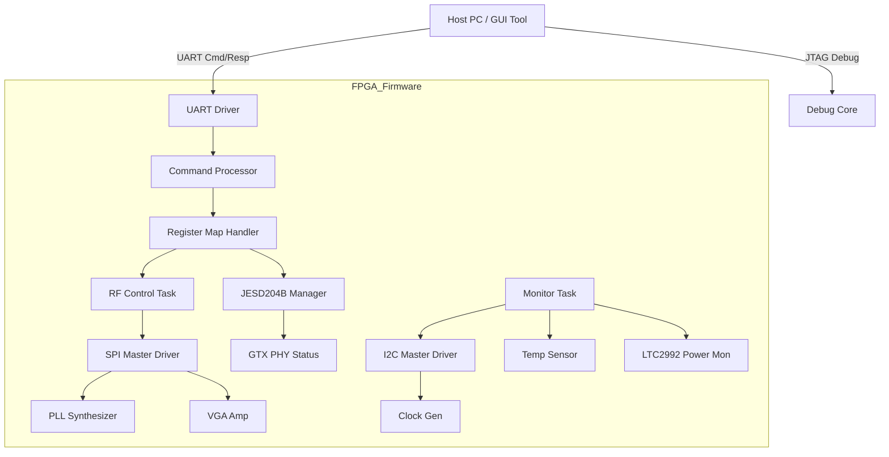
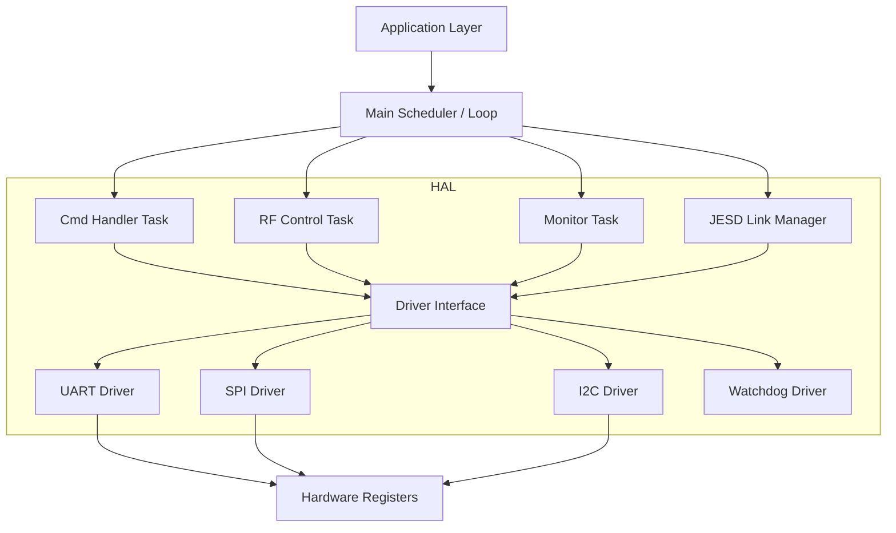
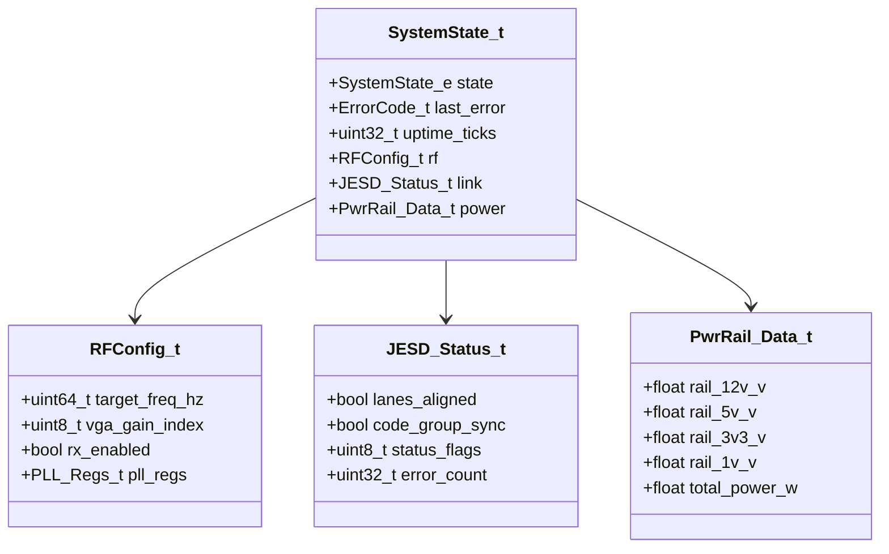
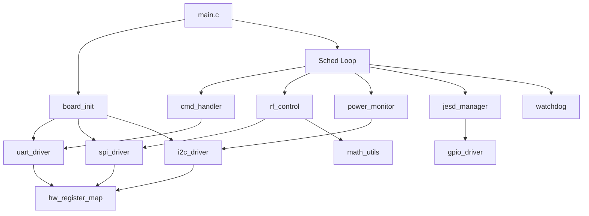
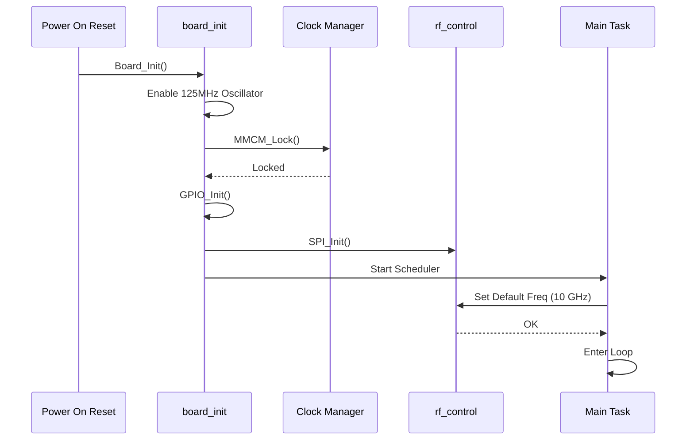
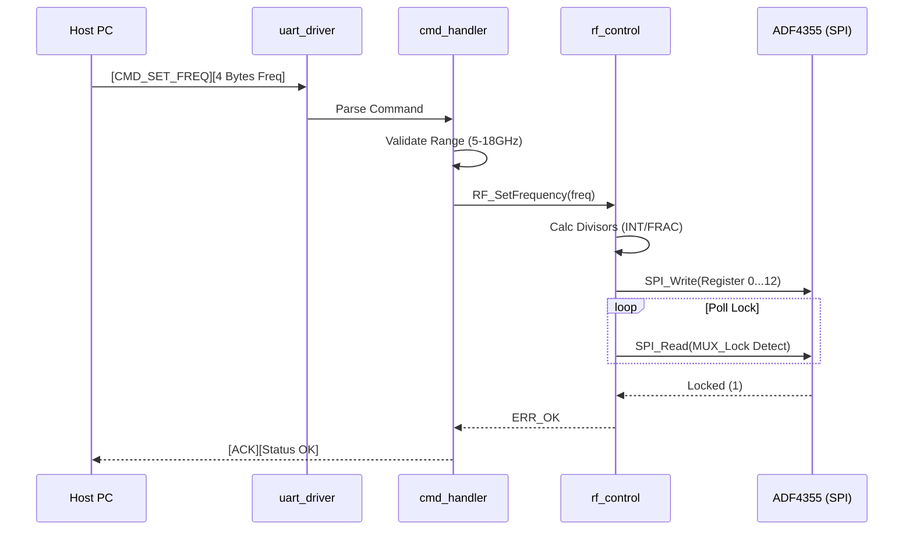
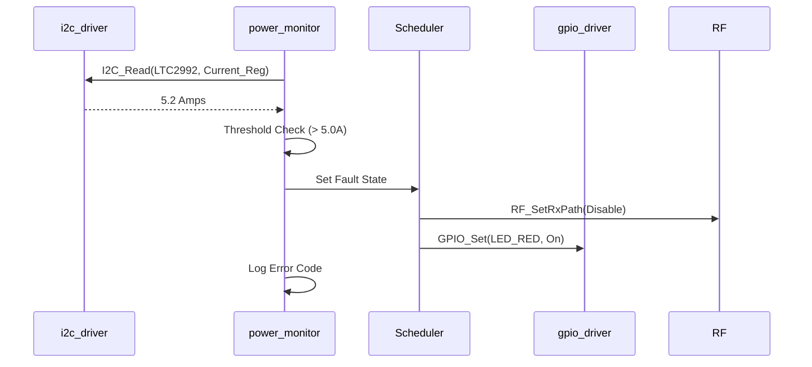
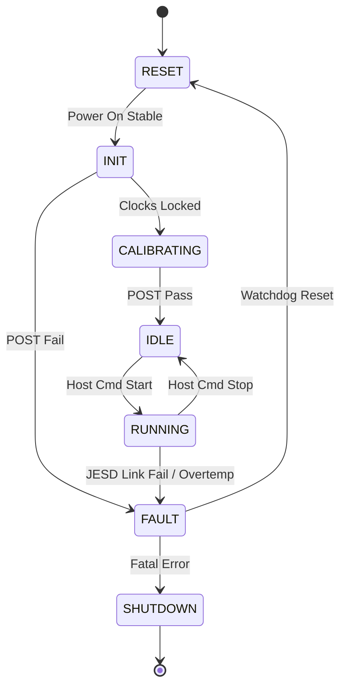
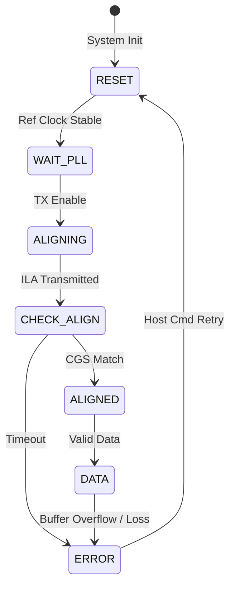

think silently complete.

Here is the complete, publication-quality Software Design Document (SDD) for the **dkfjg Wideband RF Receiver**.

---

# Software Design Document (SDD)

**Project ID:** dkfjg
**Document ID:** SDD-dkfjg-001
**Revision:** 1.0
**Date:** 16 April 2026
**Author:** Lead Embedded Architect
**Standard:** IEEE 1016-2009

---

## Document Control
| Version | Date | Author | Description |
|---------|------|--------|-------------|
| 1.0 | 16 April 2026 | System Architect | Initial design release for dkfjg Wideband RF Receiver |

---

# 1. Introduction

## 1.1 Purpose
This Software Design Document (SDD) provides the comprehensive structural design for the firmware embedded within the **dkfjg Wideband RF Receiver**. It defines the software architecture, component interfaces, data structures, and algorithms necessary to satisfy the requirements specified in **SRS-dkfjg-001**.

This document serves as the blueprint for:
1.  **Firmware Engineers:** Implementing the control logic (C/HDL) on the Xilinx Kintex-7 FPGA.
2.  **Verification Engineers:** Developing unit tests and integration test vectors.
3.  **System Integrators:** Understanding the register map and command protocol for host integration.

The design enforces strict **MISRA-C:2012** compliance to ensure reliability in the target military environment.

## 1.2 Scope
The software design covers the firmware residing on the **XC7K70T FPGA**. This includes:
-   **Hardware Abstraction Layer (HAL):** Low-level drivers for SPI, I2C, UART, and GPIO.
-   **Board Support Package (BSP):** Initialization, clock tree setup (MMCM/PLL), and interrupt handling.
-   **Application Layer:** RF Chain control (PLL/VGA), JESD204B link management, telemetry monitoring (LTC2992), and command parsing.

**Explicit Exclusions:**
-   The RTL/HDL design for the high-speed JESD204B PHY and GTX transceivers (covered in GLR).
-   The Host PC GUI software.
-   DSP algorithms for demodulation (post-ADC processing).

**Target Platform:**
-   **Processor:** Xilinx Kintex-7 XC7K70T (MicroBlaze soft-core or equivalent FSM).
-   **Toolchain:** Xilinx Vitis/Vivado 202x.x, GNU C99.
-   **Language:** C (for control logic), VHDL/Verilog (for timing-critical PHY).

## 1.3 Definitions and Acronyms

| Term | Definition |
| :--- | :--- |
| **ADC** | Analog-to-Digital Converter (ADC12J4000). |
| **API** | Application Programming Interface. |
| **BSP** | Board Support Package. |
| **CDR** | Clock and Data Recovery. |
| **CRC** | Cyclic Redundancy Check. |
| **DAC** | Digital-to-Analog Converter. |
| **DMA** | Direct Memory Access. |
| **EOF** | End Of Frame. |
| **FIFO** | First-In-First-Out buffer. |
| **FPGA** | Field-Programmable Gate Array. |
| **GLR** | Glue Logic Requirements. |
| **GPIO** | General Purpose Input/Output. |
| **GTX** | Xilinx High-Speed Serial Transceiver. |
| **HAL** | Hardware Abstraction Layer. |
| **HRS** | Hardware Requirements Specification. |
| **I2C** | Inter-Integrated Circuit (Serial Bus). |
| **ICD** | Interface Control Document. |
| **ISR** | Interrupt Service Routine. |
| **JESD** | JESD204 Standard (High-speed ADC interface). |
| **JTAG** | Joint Test Action Group. |
| **LDO** | Low Dropout Regulator. |
| **LO** | Local Oscillator. |
| **LNA** | Low Noise Amplifier. |
| **MISRA** | Motor Industry Software Reliability Association. |
| **MMCM** | Mixed-Mode Clock Manager. |
| **NVMEM** | Non-Volatile Memory. |
| **PCB** | Printed Circuit Board. |
| **PLL** | Phase-Locked Loop. |
| **POST** | Power-On Self-Test. |
| **QSPI** | Quad Serial Peripheral Interface. |
| **RF** | Radio Frequency. |
| **RTL** | Register Transfer Level. |
| **RTOS** | Real-Time Operating System (Not used - Bare metal). |
| **Rx** | Receive. |
| **SNR** | Signal-to-Noise Ratio. |
| **SPI** | Serial Peripheral Interface. |
| **SRS** | Software Requirements Specification. |
| **TRP** | Transmit/Receive Point. |
| **UART** | Universal Asynchronous Receiver-Transmitter. |
| **VGA** | Variable Gain Amplifier. |
| **WDT** | Watchdog Timer. |

## 1.4 References
1.  **IEEE 1016-2009**: Standard for Information Technology—Systems Design—Software Design Descriptions.
2.  **SRS-dkfjg-001**: Software Requirements Specification for dkfjg Receiver.
3.  **HRS-dkfjg-001**: Hardware Requirements Specification for dkfjg Receiver.
4.  **GLR-dkfjg-001**: Glue Logic Requirements for dkfjg FPGA.
5.  **MISRA-C:2012**: Guidelines for the Use of the C Language in Critical Systems.
6.  **UG472**: Xilinx 7 Series FPGAs GTX Transceivers User Guide.
7.  **DS-ADF4355**: Analog Devices ADF4355 Synthesizer Datasheet.

---

# 2. Design Viewpoints

## 2.1 Context Viewpoint — System Boundaries

The software system acts as the control layer between the external Host/Operator and the analog/digital hardware.



**External Interfaces:**
1.  **Host Interface:** UART (RS-232 level, 115200 baud, 8N1).
2.  **RF Control:** 3-wire SPI (CS, CLK, DATA) to ADF4355 and HMC698LP4.
3.  **Telemetry:** I2C (Standard Mode, 100kHz) to LTC2992 and LMK04828.
4.  **Data Link:** JESD204B (GTX lanes) - Status monitoring only (Reset/Align).

## 2.2 Composition Viewpoint — Software Architecture

The firmware adopts a layered architecture to ensure hardware independence and testability.



### Module List with Responsibilities

**Module: board_init** (board_init.c / board_init.h)
-   **Responsibility:** Handles system startup, clock tree verification (125 MHz oscillator), MMCM configuration for system clocks, and peripheral enable resets. Executes POST.
-   **Public API:**
    ```c
    int32_t Board_Init(void);
    int32_t Board_GetInfo(BoardInfo_t *info);
    int32_t Board_SelfTest(uint32_t *error_mask);
    void Board_ResetPeriph(void);
    ```
-   **Internal State:** `BoardState_e sys_state`, `uint32_t error_code`.
-   **Configuration:** System clock frequency definitions, GPIO mux configurations.

**Module: uart_driver** (uart_driver.c / uart_driver.h)
-   **Responsibility:** Manages UART communication using the FPGA UART Lite core. Handles RX/TX interrupts and ring buffering.
-   **Public API:**
    ```c
    int32_t UART_Init(uint32_t baud_rate);
    int32_t UART_Write(uint8_t *data, uint16_t len);
    int32_t UART_Read(uint8_t *byte); // Non-blocking
    bool UART_RxReady(void);
    void UART_ISR(void);
    ```
-   **Internal State:** `RingBuffer_t rx_fifo`, `RingBuffer_t tx_fifo`.

**Module: spi_driver** (spi_driver.c / spi_driver.h)
-   **Responsibility:** Implements SPI Master functionality (Mode 0) for configuring the ADF4355 PLL and HMC698LP4 VGA. Handles chip-select toggling and 32-bit transfers.
-   **Public API:**
    ```c
    int32_t SPI_Init(void);
    int32_t SPI_Transfer(uint8_t cs_id, const uint8_t *tx, uint8_t *rx, uint16_t len);
    int32_t SPI_Write32(uint8_t cs_id, uint32_t data);
    ```

**Module: i2c_driver** (i2c_driver.c / i2c_driver.h)
-   **Responsibility:** I2C Master driver for communicating with the LTC2992 power monitor and LMK04828 clock generator.
-   **Public API:**
    ```c
    int32_t I2C_Init(uint32_t freq_hz);
    int32_t I2C_Write(uint8_t addr, const uint8_t *data, uint16_t len);
    int32_t I2C_Read(uint8_t addr, uint8_t *buf, uint16_t len);
    int32_t I2C_WriteReg(uint8_t addr, uint8_t reg, uint8_t val);
    ```

**Module: rf_control** (rf_control.c / rf_control.h)
-   **Responsibility:** High-level control of the RF chain. Calculates PLL divisors based on target frequency and sets VGA gain.
-   **Public API:**
    ```c
    int32_t RF_SetFrequency(uint64_t freq_hz);
    int32_t RF_SetGain(int8_t gain_db); // -10 to +22
    int32_t RF_SetRxPath(bool enable);  // TRP control
    ```
-   **Internal State:** `RFConfig_t current_config`, `PLL_Lookup_t`.

**Module: jesd_manager** (jesd_manager.c / jesd_manager.h)
-   **Responsibility:** Manages the JESD204B link state machine. Handles reset, alignment (ILA), and monitoring of the GTX transceiver status signals (buffer overflow, alignment error).
-   **Public API:**
    ```c
    int32_t JESD_Init(void);
    int32_t JESD_ResetLink(void);
    int32_t JESD_RunBIST(void);
    bool JESD_IsLocked(void);
    void JESD_Task(void); // Periodic status check
    ```

**Module: power_monitor** (power_monitor.c / power_monitor.h)
-   **Responsibility:** Periodically polls LTC2992 via I2C for rail voltages (12V, 5V, 3.3V, 1.0V) and currents. Checks for violations.
-   **Public API:**
    ```c
    int32_t PwrMon_Init(void);
    int32_t PwrMon_ReadRails(PwrRail_Data_t *data);
    bool PwrMon_IsFaultActive(void);
    void PwrMon_Task(void);
    ```

**Module: cmd_handler** (cmd_handler.c / cmd_handler.h)
-   **Responsibility:** Parses incoming UART packets, validates CRC/checksum, reads/writes to the system register map, and formats responses.
-   **Public API:**
    ```c
    void CmdHandler_Init(void);
    void CmdHandler_Process(void); // Call in main loop
    int32_t CmdHandler_Dispatch(uint8_t *cmd, uint16_t len);
    ```

**Module: watchdog** (watchdog.c / watchdog.h)
-   **Responsibility:** Kick the dog. If not called within `timeout_ms`, system resets.
-   **Public API:**
    ```c
    int32_t WDT_Init(uint32_t timeout_ms);
    void WDT_Refresh(void);
    ```

## 2.3 Logical Viewpoint — Data Model



**Key Enumerations:**
```c
typedef enum {
    SYS_STATE_RESET = 0,
    SYS_STATE_INIT,
    SYS_STATE_IDLE,
    SYS_STATE_RUNNING,
    SYS_STATE_FAULT,
    SYS_STATE_SHUTDOWN
} SystemState_e;

typedef enum {
    ERR_OK = 0x00,
    ERR_TIMEOUT = 0x01,
    ERR_COMM_SPI = 0x02,
    ERR_COMM_I2C = 0x03,
    ERR_PLL_UNLOCK = 0x04,
    ERR_JESD_ALIGN = 0x05,
    ERR_POWER_UNDER = 0x06,
    ERR_POWER_OVER = 0x07,
    ERR_PARAM = 0xFF
} ErrorCode_t;
```

## 2.4 Dependency Viewpoint



## 2.5 Interface Viewpoint — API Specification

**Function: `RF_SetFrequency`**
```c
/**
 * @brief Configures the ADF4355 PLL to the specified frequency.
 * 
 * Calculates the INT, FRAC, and MOD dividers based on the 50 MHz PFD reference
 * (derived from the LMK04828). Programs the registers via SPI.
 * 
 * @param freq_hz Target LO frequency in Hz (5,000,000,000 to 18,000,000,000).
 * 
 * @return ERR_OK if frequency successfully set and PLL locked.
 * @return ERR_PARAM if frequency is out of bounds (5-18 GHz).
 * @return ERR_PLL_UNLOCK if the PLL does not achieve lock within 100ms.
 * 
 * @pre SPI_Init() must have been called successfully.
 * @post PLL is locked and RF output is active.
 * 
 * @thread_safety Not thread-safe. Must be called from a single context (e.g., Main Loop).
 * @example
 *   if (RF_SetFrequency(9400000000ULL) == ERR_OK) {
 *       printf("Set to 9.4 GHz\n");
 *   }
 */
int32_t RF_SetFrequency(uint64_t freq_hz);
```

**Function: `JESD_RunBIST`**
```c
/**
 * @brief Executes JESD204B Link Initialization and BIST.
 * 
 * 1. Resets the GTX transceivers.
 * 2. Enables the ADC ILA (Idle Alignment Sequence).
 * 3. Polls the PHY status registers for code group sync.
 * 
 * @return ERR_OK if all 8 lanes achieve alignment.
 * @return ERR_TIMEOUT if alignment does not occur within 500ms.
 */
int32_t JESD_RunBIST(void);
```

## 2.6 Interaction Viewpoint — Sequence Diagrams

**System Startup Sequence:**



**Frequency Change Sequence:**



**Overcurrent Fault Sequence:**



## 2.7 State Viewpoint

**Main System State Machine:**



**JESD204B Link State Machine:**



## 2.8 Algorithm Viewpoint

**2.8.1 ADF4355 Frequency Synthesis**
*Goal:* Calculate `INT` and `FRAC` registers for a target `RFout`.
*Inputs:* `Fref = 50 MHz` (PFD), `RFout` (5-18 GHz).
*Constraint:* `Prescaler`: 4/5 (Auto), `Output Divider`: 1 to 64.
*Algorithm:*
1.  Calculate `VCO_Freq = RFout * Output_Div`.
2.  Ensure `VCO_Freq` is between 2.4 GHz and 5.4 GHz.
3.  Calculate `N = VCO_Freq / Fref`.
4.  `INT = floor(N)`.
5.  `FRAC = (N - INT) * Modulus`.
6.  Write to `REG_0`, `REG_1`... Wait for lock.

**2.8.2 LTC2992 Power Calculation**
*Inputs:* 12-bit ADC register value.
*Algorithm:*
`Current_mA = (Register / 4096.0) * Vref * Gain / R_sense`

## 2.9 Resource Viewpoint — Real-Time Constraints

### 2.9.1 Task Scheduling Table
(Bare-metal super-loop design)

| Task Name | Period | Worst-Case Exec Time | Priority | Deadline | CPU Load |
|-----------|--------|---------------------|----------|----------|---------|
| JESD_Link_Monitor | 10ms | 50us | High | 10ms | 0.5% |
| PwrMon_Task | 500ms | 1ms | Low | 500ms | 0.2% |
| CmdHandler_Process | Event | 2ms | Med | N/A | Variable |
| WDT_Refresh | 1000ms | 10us | Critical | 1000ms | <0.1% |

### 2.9.2 Memory Budget
(XC7K70T Resources)

| Region | Total Available | Used (Est) | Remaining |
|--------|----------------|------------|-----------|
| Block RAM (36Kb) | 270 (Blocks) | 40 (Rx FIFO) | 230 |
| LUTs | 41,000 | 5,000 (Soft CPU) | 36,000 |
| Flip-Flops | 82,000 | 3,000 | 79,000 |
| UART Buffer | 4KB | 2KB | 2KB |

## 2.10 Build System Viewpoint

**File Structure:**
```text
firmware/
├── CMakeLists.txt
├── src/
│   ├── main.c
│   ├── board_init.c
│   ├── drivers/
│   │   ├── spi_driver.c
│   │   ├── i2c_driver.c
│   │   └── uart_driver.c
│   ├── app/
│   │   ├── rf_control.c
│   │   ├── jesd_manager.c
│   │   └── cmd_handler.c
├── tests/ (Host Based)
│   ├── test_rf_calc.c
│   └── mock_spi.c
└── gui/ (Qt6)
    └── dkfjg_controller.cpp
```

**CMakeLists.txt Snippet:**
```cmake
cmake_minimum_required(VERSION 3.20)
project(dkfjg_fw C CXX)

set(CMAKE_C_STANDARD 11)
add_executable(firmware.elf
    src/main.c
    src/board_init.c
    src/drivers/spi_driver.c
    src/app/rf_control.c
)
# Target specific compile flags for MicroBlaze
target_compile_options(firmware.elf PRIVATE -Wall -Wextra -mlittle-endian)
```

---

# 3. Design Rationale

## 3.1 Architecture Choices

1.  **Bare-Metal vs. RTOS:**
    *   *Decision:* Bare-metal super-loop with interrupt-driven peripherals.
    *   *Rationale:* The system logic is primarily reactive (SPI config, register monitoring). The deterministic timing of JESD204B is handled by HDL, not the CPU. An RTOS adds unnecessary complexity and stack overhead for the XC7K70T (limited BRAM).
2.  **SPI for PLL/VGA:**
    *   *Decision:* Dedicated hardware SPI master controller (Mode 0).
    *   *Rationale:* The ADF4355 requires 32-bit writes. Hardware SPI is faster and deterministic compared to bit-banging, ensuring the PLL lock time is minimized.
3.  **Data Path:**
    *   *Decision:* FPGA fabric (HDL) only. CPU does *not* touch ADC samples.
    *   *Rationale:* 4 GSPS ADC generates massive data rates. The MicroBlaze cannot handle this throughput. The CPU only configures the link and monitors status flags.

## 3.2 MISRA-C:2012 Compliance
*   All drivers utilize `stdint.h` exact width types (`uint32_t`, `uint16_t`).
*   No dynamic memory (`malloc` is prohibited).
*   All functions have a single exit point (`return`) where possible.

---

# 4. Design Traceability Matrix

| SDD Component | Source File | Implements REQ-SW | Verification Method |
|--------------|-------------|-------------------|---------------------|
| `board_init.c` | Board_Init | REQ-SW-001 (Init) | Startup Test |
| `rf_control.c` | RF_SetFrequency | REQ-SW-002 (PLL Config) | RF SpecAn |
| `spi_driver.c` | SPI_Transfer | REQ-SW-003 (SPI Bus) | Logic Analyzer |
| `jesd_manager.c` | JESD_RunBIST | REQ-SW-010 (Link Init) | ILA Capture |
| `power_monitor.c` | PwrMon_Task | REQ-SW-021 (Telem) | Host Readout |
| `uart_driver.c` | UART_Read | REQ-SW-030 (UART Comms) | Terminal |

---

# 5. Appendices

## Appendix B — FPGA Register Map

**Base Address: 0x4000_0000**

| Offset | Name | Access | Reset | Description |
|--------|------|--------|-------|-------------|
| 0x0000 | `CTRL_REG` | RW | 0x00 | Global Control (Bit 0: RF Enable) |
| 0x0004 | `STATUS_REG` | RO | 0x00 | Sticky Status Flags |
| 0x0010 | `PLL_DATA` | WO | 0x00 | 32-bit Data for ADF4355 |
| 0x0014 | `PLL_CTRL` | WO | 0x00 | SPI CS/CLK Control for PLL |
| 0x0020 | `VGA_GAIN` | RW | 0x00 | HMC698 Gain Setting (0-31) |
| 0x0100 | `JESD_CTRL` | RW | 0x00 | JESD204B PHY Control |
| 0x0104 | `JESD_STAT` | RO | 0x00 | Lane Alignment Status |
| 0x0200 | `I2C_TX_RX` | RW | 0x00 | I2C Data Register |
| 0x0204 | `I2C_CTRL` | RW | 0x00 | I2C Control (Start/Stop) |
| 0x0300 | `UART_TX` | WO | 0x00 | UART TX FIFO |
| 0x0304 | `UART_RX` | RO | 0x00 | UART RX FIFO |

## Appendix C — Memory Map

| Region | Start | End | Size | Attr |
|--------|-------|-----|------|------|
| Code | 0x0000_0000 | 0x0000_FFFF | 64KB | RO |
| Data | 0x2000_0000 | 0x2000_7FFF | 32KB | RW |
| FPGA Regs | 0x4000_0000 | 0x4000_FFFF | 64KB | RW |

---

**Document End**