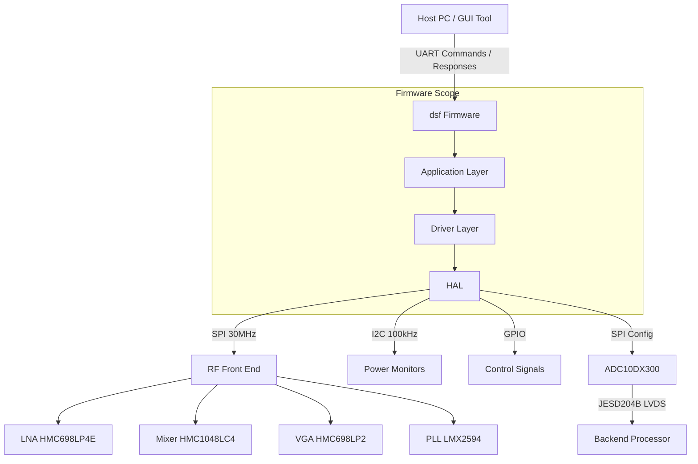
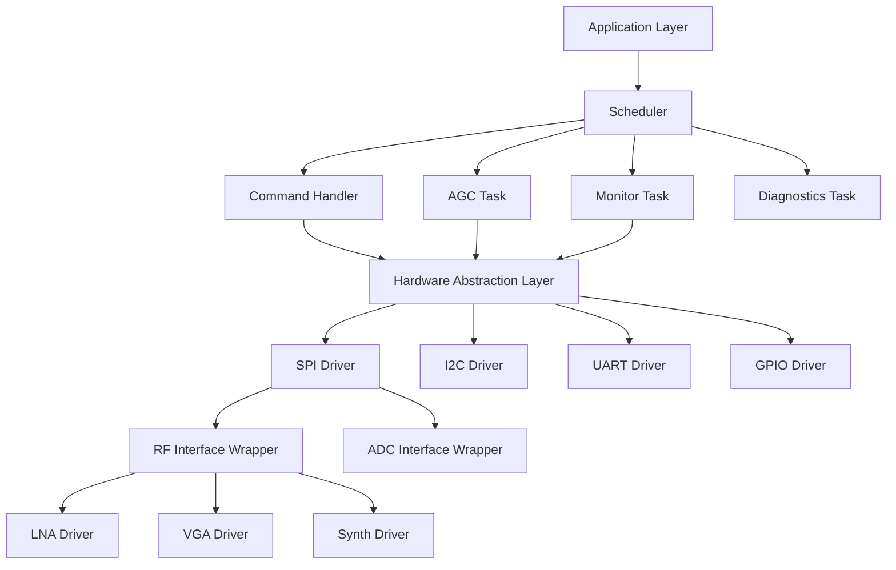
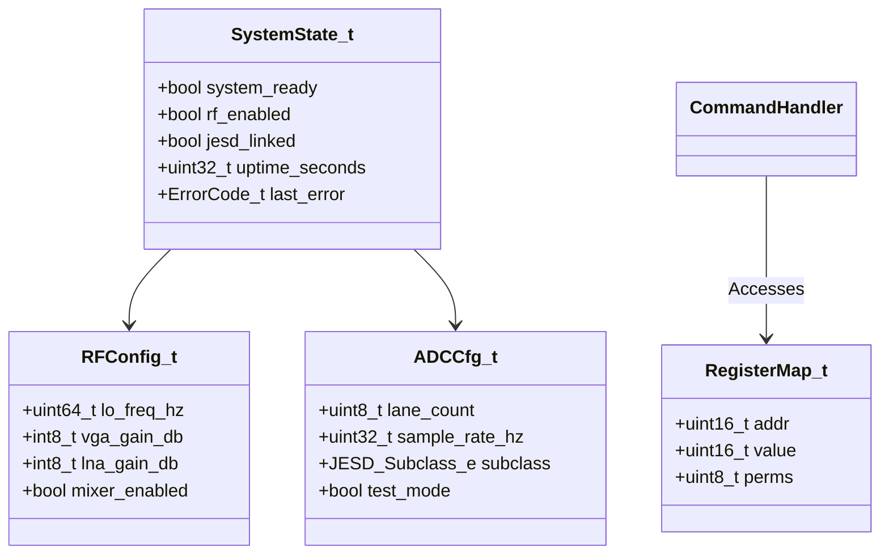
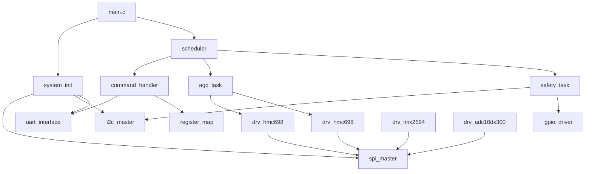
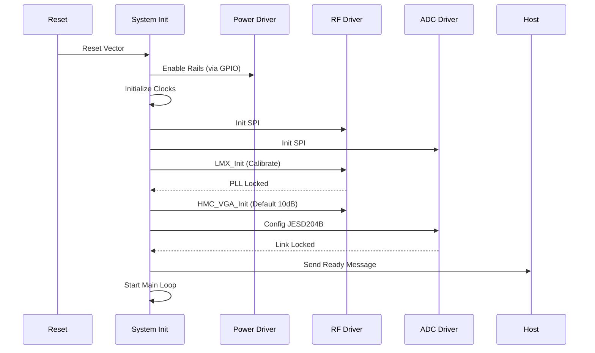
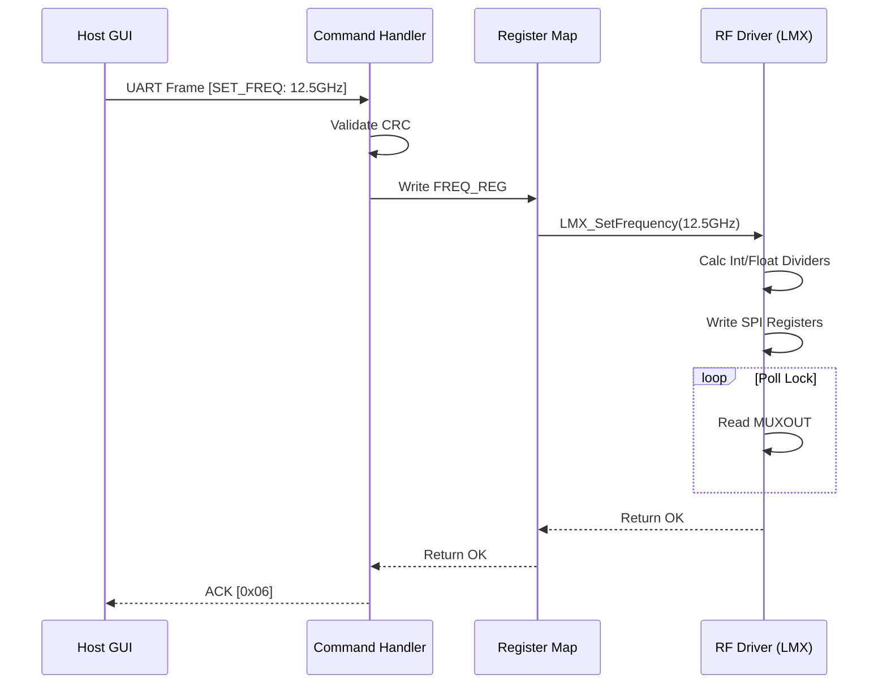
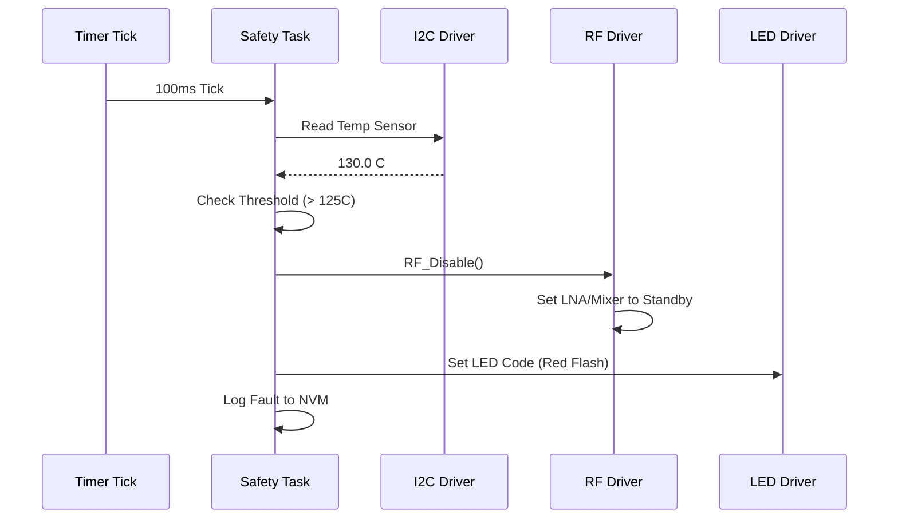
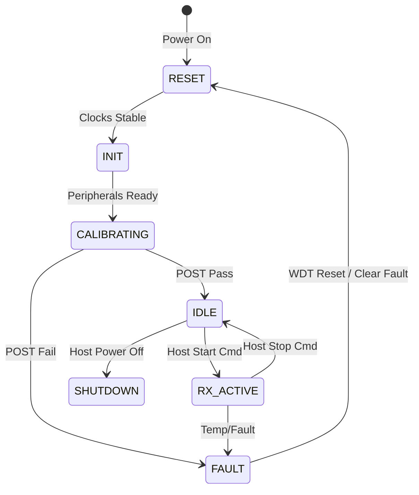
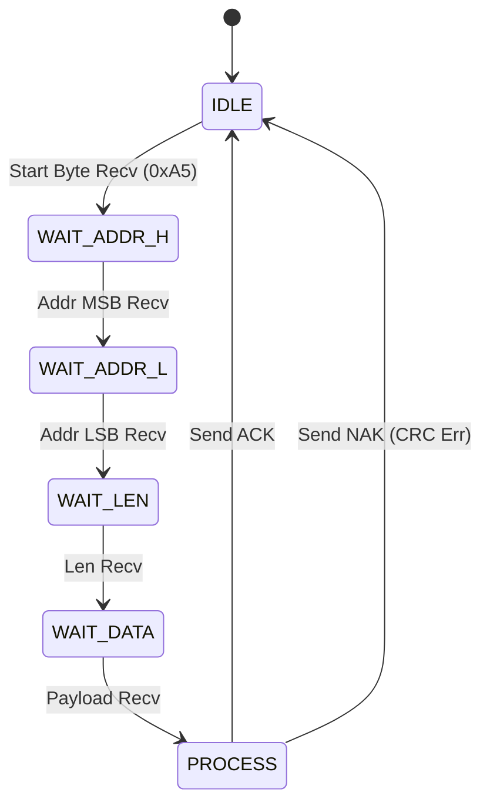

```markdown
# Software Design Document (SDD)

**Project:** dsf (5–18 GHz Wideband RF Receiver)
**Version:** 1.0
**Date:** 16 April 2026
**Author:** Senior Embedded Software Architect
**Standard:** IEEE 1016-2009

---

## Document Control
| Version | Date | Author | Description |
|---------|------|--------|-------------|
| 1.0 | 16 April 2026 | System Architect | Initial design release for dsf firmware |

---

# 1. Introduction

## 1.1 Purpose
The purpose of this Software Design Document (SDD) is to define the comprehensive software architecture, low-level driver design, and data structures for the **dsf** Wideband RF Receiver firmware. This document serves as the blueprint for the implementation of the Board Support Package (BSP), Hardware Abstraction Layer (HAL), and Application Logic running on the embedded microcontroller.

This SDD decomposes the system into modular components, detailing their interfaces, responsibilities, and interactions. It provides the necessary detail for firmware engineers to implement production-ready code that meets the requirements specified in the dsf Software Requirements Specification (SRS), Hardware Requirements Specification (HRS), and Glue Logic Requirements (GLR).

## 1.2 Scope
The scope of this design encompasses the complete embedded software stack residing on the dsf module's control processor (MCU).

**Inclusions:**
*   **Hardware Abstraction Layer (HAL):** Drivers for SPI (RFIC control), I2C (PMIC/Monitoring), UART (Host Comms), and GPIO.
*   **RF Control Logic:** State machines and drivers for the LMX2594 Synthesizer, HMC698 VGA, and HMC1048 Mixer.
*   **Data Path:** Configuration and monitoring of the ADC10DX300 JESD204B interface.
*   **System Services:** Watchdog Timer (WDT), Power-On Self-Test (POST), and Fault Management.
*   **Build System:** CMake configuration for ARM Cortex-M target, Unit Testing (Google Test), and Host Qt6 GUI.

**Exclusions:**
*   High-level signal processing algorithms (FFT, demodulation) performed by downstream host/FPGA logic.
*   Hardware logic design (VHDL/Verilog) for the FPGA or the internal MCU peripheral implementations (assumed provided by vendor HAL).

**Target Platform:**
*   **MCU:** ARM Cortex-M4 (e.g., STM32H7 series or equivalent soft-core).
*   **Toolchain:** ARM GCC (arm-none-eabi), CMake 3.20+, C99 Standard.
*   **Compliance:** MISRA-C:2012.

## 1.3 Definitions and Acronyms

| Acronym | Definition |
| :--- | :--- |
| **AGC** | Automatic Gain Control |
| **API** | Application Programming Interface |
| **BSP** | Board Support Package |
| **CRC** | Cyclic Redundancy Check |
| **DMA** | Direct Memory Access |
| **FIFO** | First-In-First-Out Buffer |
| **FSM** | Finite State Machine |
| **GPIO** | General Purpose Input/Output |
| **HAL** | Hardware Abstraction Layer |
| **HRS** | Hardware Requirements Specification |
| **I2C** | Inter-Integrated Circuit (Serial Bus) |
| **IPC** | Inter-Process Communication |
| **ISR** | Interrupt Service Routine |
| **JESD** | JESD204B High-Speed Data Interface Standard |
| **MISRA** | Motor Industry Software Reliability Association |
| **NVM** | Non-Volatile Memory |
| **PCB** | Printed Circuit Board |
| **PLL** | Phase-Locked Loop |
| **POST** | Power-On Self-Test |
| **RF** | Radio Frequency |
| **RTOS** | Real-Time Operating System (Bare-metal scheduler used) |
| **RX** | Receive |
| **SRS** | Software Requirements Specification |
| **SPI** | Serial Peripheral Interface |
| **UART** | Universal Asynchronous Receiver/Transmitter |
| **VGA** | Variable Gain Amplifier |

## 1.4 References
1.  **IEEE 1016-2009:** Standard for Information Technology — Systems Design — Software Design Descriptions.
2.  **ISO/IEC/IEEE 29148:2018:** Systems and Software Engineering — Life Cycle Processes — Requirements Engineering.
3.  **dsf SRS (Software Requirements Specification),** Rev 1.0, 16 April 2026.
4.  **dsf HRS (Hardware Requirements Specification),** Rev 1.0, 16 April 2026.
5.  **dsf GLR (Glue Logic Requirements),** Rev 0V01, 16 April 2026.
6.  **MISRA C:2012:** Guidelines for the Use of the C Language in Critical Systems.
7.  **JEDEC JESD204B Standard:** Standard for high-speed data converter interfaces.

---

# 2. Design Viewpoints

## 2.1 Context Viewpoint — System Boundaries

The dsf firmware operates as the control entity for the analog RF chain and the digital ADC interface. It acts as a bridge between the Host PC (operator) and the hardware components.



**External Interfaces:**
*   **UART Interface:** Asynchronous serial, 115200 baud, 8N1. Used for register read/write commands and status reporting.
*   **JTAG/SWD:** Debug interface for firmware development and flash programming.
*   **Hardware Peripherals:** SPI (3 instances: RF_Chain, Synth, ADC), I2C (1 instance: PMIC/Temp), GPIO (Enables, Resets, LEDs).

## 2.2 Composition Viewpoint — Software Architecture

The software is designed using a layered architecture to ensure portability and testability.



### Module List with Responsibilities

#### Module: `system_init` (system_init.c / system_init.h)
*   **Responsibilities:** System clock configuration (PLL), Vector table relocation, low-level initialization (HAL), and Power-On Self-Test (POST) orchestration.
*   **Public API:**
    ```c
    int32_t SYS_Init(void);
    int32_t SYS_RunPOST(uint32_t *error_mask);
    int32_t SYS_GetVersion(SysInfo_t *info);
    void    SYS_Reboot(void);
    ```

#### Module: `uart_interface` (uart_interface.c / uart_interface.h)
*   **Responsibilities:** Implements the frame-based protocol defined in the GLR. Handles interrupts, RX buffering, and CRC validation.
*   **Public API:**
    ```c
    int32_t UART_Init(uint32_t baudrate);
    int32_t UART_Transmit(const uint8_t *data, uint16_t len);
    int32_t UART_RegisterCallback(UART_Event_e evt, void (*cb)(void));
    bool    UART_IsTxIdle(void);
    ```

#### Module: `spi_master` (spi_master.c / spi_master.h)
*   **Responsibilities:** Low-level SPI control. Manages chip selects and DMA transfers for high throughput.
*   **Public API:**
    ```c
    int32_t SPI_Init(SPI_Port_e port, uint32_t hz);
    int32_t SPI_Transfer(SPI_Port_e port, const uint8_t *tx, uint8_t *rx, uint16_t len);
    int32_t SPI_WriteReg(SPI_Port_e port, uint8_t reg, uint8_t val);
    int32_t SPI_ReadReg(SPI_Port_e port, uint8_t reg, uint8_t *val);
    ```

#### Module: `drv_lmx2594` (drv_lmx2594.c / drv_lmx2594.h)
*   **Responsibilities:** Configuration of the LMX2594 PLL/Synthesizer. Calculates register values for frequency and enables the output.
*   **Public API:**
    ```c
    int32_t LMX_Init(void);
    int32_t LMX_SetFrequency(uint64_t freq_hz);
    int32_t LMX_EnableOutput(bool enable);
    bool    LMX_IsLocked(void);
    void    LMX_Reset(void);
    ```

#### Module: `drv_hmc698` (drv_hmc698.c / drv_hmc698.h)
*   **Responsibilities:** Control of the HMC698LP4 (LNA) and HMC698LP2 (VGA). Manages gain settings and attenuation tables.
*   **Public API:**
    ```c
    int32_t HMC_LNA_Init(void);
    int32_t HMC_LNA_SetGain(int8_t gain_db);
    
    int32_t HMC_VGA_Init(void);
    int32_t HMC_VGA_SetGain(int8_t gain_db); // 0 to 42dB range
    int32_t HMC_VGA_GetGain(int8_t *current_gain);
    ```

#### Module: `drv_adc10dx300` (drv_adc10dx300.c / drv_adc10dx300.h)
*   **Responsibilities:** Configuration of the ADC10DX300. Sets up JESD204B lanes (subclass, LMF, etc.) and test patterns.
*   **Public API:**
    ```c
    int32_t ADC_Init(void);
    int32_t ADC_ConfigureJESD(JESD_Config_t *cfg);
    int32_t ADC_EnableTestPattern(ADC_TestPattern_e pattern);
    bool    ADC_CheckLinkStatus(void);
    ```

#### Module: `i2c_monitor` (i2c_monitor.c / i2c_monitor.h)
*   **Responsibilities:** Reads temperature sensors and power monitor ICs via I2C. Implements safety shutdowns.
*   **Public API:**
    ```c
    int32_t I2C_Mon_Init(void);
    int32_t I2C_Mon_ReadTemp(float *temp_c);
    int32_t I2C_Mon_ReadRails(Power_Rail_t *rails);
    bool    I2C_Mon_IsFaultActive(void);
    ```

#### Module: `command_handler` (command_handler.c / command_handler.h)
*   **Responsibilities:** Parses UART packets, validates frame format/CRC, dispatches read/write operations to internal register map, formulates responses.
*   **Public API:**
    ```c
    void CMD_Task(void); // Called periodically
    int32_t CMD_ProcessFrame(const uint8_t *frame, uint16_t len);
    ```

## 2.3 Logical Viewpoint — Data Model

The system utilizes a shared register map and state structures to manage hardware settings.



**Key Data Structures:**

```c
/* RF Configuration State */
typedef struct {
    uint64_t target_lo_hz;
    uint64_t actual_lo_hz;
    int8_t   vga_gain_db;
    int8_t   lna_gain_index; // 0-15 mapped to dB
    bool     rf_path_enabled;
} RF_State_t;

/* System Status Register (Memory Mapped) */
typedef struct {
    uint32_t magic;             /* 0xDEADBEEF */
    uint32_t uptime;            /* Seconds since boot */
    int32_t  temp_die;          /* Millidegrees Celsius */
    uint16_t fault_flags;       /* Bitmask of faults */
    uint16_t board_rev;
    uint32_t fw_version;
} SystemStatus_t;
```

**Enumerations:**

```c
typedef enum {
    ERR_OK = 0x00,
    ERR_COMM_FAIL = 0x01,
    ERR_PARAM_RANGE = 0x02,
    ERR_PLL_UNLOCK = 0x03,
    ERR_TEMP_OVERLOAD = 0x04,
   _ERR_CRC_FAIL = 0x05,
    ERR_TIMEOUT = 0x06
} ErrorCode_t;

typedef enum {
    SYS_STATE_BOOT = 0,
    SYS_STATE_INIT,
    SYS_STATE_IDLE,
    SYS_STATE_RX_ACTIVE,
    SYS_STATE_FAULT,
    SYS_STATE_SHUTDOWN
} SystemState_e;
```

## 2.4 Dependency Viewpoint — Module Dependencies



**Build Order:**
1.  Hardware Drivers (SPI, I2C, GPIO, UART).
2.  Peripheral Logic Drivers (LMX, HMC, ADC).
3.  System Logic (Register Map, Safety, Command Handler).
4.  Application Layer (AGC, Diagnostics).

## 2.5 Interface Viewpoint — Complete API Specification

### Function: `LMX_SetFrequency`
```c
/**
 * @brief Configures the LMX2594 to the target frequency.
 * 
 * @param freq_hz Target frequency in Hz (Range: 5GHz to 18GHz).
 * @return int32_t ERR_OK on success, ERR_PARAM_RANGE if out of bounds,
 *                 ERR_PLL_UNLOCK if calibration fails.
 * 
 * @pre  LMX_Init() must have been called successfully.
 * @post The PLL output is enabled and locked to the new frequency.
 * @note This function blocks for up to 20ms waiting for lock.
 */
int32_t LMX_SetFrequency(uint64_t freq_hz);
```

### Function: `HMC_VGA_SetGain`
```c
/**
 * @brief Sets the VGA gain.
 * 
 * @param gain_db Desired gain in dB (Range: 0 to 42).
 * @return int32_t ERR_OK on success.
 * 
 * @pre  HMC_VGA_Init() called.
 * @post Gain register updated. SPI transaction queued.
 */
int32_t HMC_VGA_SetGain(int8_t gain_db);
```

## 2.6 Interaction Viewpoint — Sequence Diagrams

### System Startup Sequence


### Frequency Tuning Sequence


### Overload Shutdown Sequence


## 2.7 State Viewpoint — State Machines

### Top-Level System State Machine


### UART Protocol State Machine


## 2.8 Algorithm Viewpoint — Key Algorithms

### 2.8.1 LMX2594 Frequency Calculation
To generate frequencies between 5 GHz and 18 GHz, the integer-N and fractional-N dividers must be calculated. The algorithm uses the reference clock (Fosc = 100 MHz) and the PLL multiplier.

```c
/* Algorithm Overview */
// Inputs: Freq Desired (Fout), PFD Freq (Fpfd)
// 1. Calculate N = Fout / Fpfd (Integer part)
// 2. Calculate Fractional Denom (DEN) for desired resolution (< 1Hz)
// 3. Write registers 0 through 44.
// 4. Trigger Calibrate (Reset bit high then low).
// 5. Poll Lock Detect bit.
```

### 2.8.2 JESD204B Subclass 1 Setup
Deterministic latency is required for system synchronization.

```c
// 1. Configure SYSREF as input to ADC.
// 2. Set ADC to Subclass 1 mode.
// 3. Wait for SYNC~ signals to go low (indicating code group sync).
// 4. Verify ILAS (Initial Lane Alignment Sequence) completion.
// 5. Report link status.
```

---

# 3. Design Rationale

## 3.1 Architecture Choices

| Decision | Chosen Approach | Alternatives | Rationale |
| :--- | :--- | :--- | :--- |
| **Scheduling** | Bare-metal Super Loop | FreeRTOS | The system has low functional concurrency (mostly interrupt driven). An RTOS adds complexity and stack overhead without significant benefit for this single-purpose control firmware. |
| **SPI Implementation** | Polled for Init, DMA for Burst | Interrupt only | DMA offloads the CPU during bulk transfers (e.g., ADC config or long gain sweeps), ensuring the CPU is free for UART processing. |
| **MISRA Compliance** | Strict MISRA-C:2012 | None | Reliability and safety are critical for RF systems to prevent hardware damage (e.g., output power runaways). |
| **Floating Point** | Disabled (Software FP if needed) | Hardware FPU | To minimize code size and power consumption. Fixed-point math is sufficient for Gain control (0.5dB steps). |

## 3.2 MISRA-C:2012 Compliance Strategy
*   **Static Analysis:** Integration of PC-lint/FlexeLint into the CMake build process.
*   **Coding Style:** All variables initialized at declaration. No implicit type conversions.
*   **Safe Libraries:** Use of MISRA-compliant standard library replacements (e.g., checking bounds for string operations).
*   **Stack Safety:** High Watermark monitoring via a known pattern in the stack RAM.

---

# 4. Design Traceability Matrix

| SDD Component / Function | Implements SRS REQ | Traceability Notes |
| :--- | :--- | :--- |
| `system_init.c` | REQ-SW-001 (Power On), REQ-SW-010 (POST) | Initializes clocks, executes RAM tests. |
| `drv_lmx2594.c` | REQ-SW-020 (Freq Control) | Sets LO frequency 5-18GHz. |
| `drv_hmc698.c` | REQ-SW-021 (Gain Control) | Adjusts VGA/LNA gain. |
| `drv_adc10dx300.c` | REQ-SW-030 (Data Path) | Configures ADC, JESD204B link. |
| `command_handler.c` | REQ-SW-040 (Comms) | Parses UART frames. |
| `safety_task.c` | REQ-SW-050 (Protection) | Monitors Temp, shuts down RF if >125C. |
| `i2c_monitor.c` | REQ-SW-051 (Monitoring) | Reads PMIC rails. |

---

# 5. Appendices

## Appendix A — File Structure
```
src/
├── core/
│   ├── main.c
│   ├── stm32xxxx_it.c (ISRs)
├── drivers/
│   ├── stm32_hal_wrapper.c
│   ├── spi_driver.c
│   ├── i2c_driver.c
│   ├── uart_driver.c
│   └── gpio_driver.c
├── app/
│   ├── cmd_handler.c
│   ├── agc_algo.c
│   └── safety_monitor.c
├── device_drivers/
│   ├── drv_lmx2594.c
│   ├── drv_hmc698.c
│   └── drv_adc10dx300.c
└── tests/
    ├── test_main.cpp
    └── test_lmx_math.cpp
```

## Appendix B — FPGA Register Map Summary
*(Derived from GLR 0V01)*

| Base Address | Offset | Register Name | Access | Reset Value | Description |
| :--- | :--- | :--- | :--- | :--- | :--- |
| 0x40000000 | 0x00 | `RF_FREQ_LO` | RW | 0x00000000 | LO Frequency Control (Hz) |
| 0x40000000 | 0x04 | `RF_VGA_GAIN` | RW | 0x0A (10dB) | VGA Gain Setting |
| 0x40000000 | 0x08 | `RF_LNA_GAIN` | RW | 0x00 | LNA Gain Index |
| 0x40000000 | 0x10 | `ADC_CTRL` | RW | 0x01 | ADC Enable / Test Mode |
| 0x40000000 | 0x14 | `SYS_STATUS` | R | 0x00 | PLL Lock / Temp Fault Flags |

## Appendix C — Memory Map

| Region | Start | Size | Usage |
| :--- | :--- | :--- | :--- |
| FLASH | 0x08000000 | 1 MB | Firmware Code, Constants |
| RAM | 0x20000000 | 256 KB | Data, Heap, Stack |
| EXT_FLASH | 0x90000000 | 16 MB | Calibration Tables (via QSPI) |
| PERIPH | 0x40000000 | - | AHB/AHB Peripherals |

## Appendix D — Coding Standards Checklist
*   [x] Indentation: 4 Spaces (No Tabs)
*   [x] Max Line Length: 120 Chars
*   [x] Naming: `snake_case` for variables, `PascalCase` for types.
*   [x] Comments: Doxygen compliant (`/** ... */`)
*   [x] Casts: Explicit casts on all type conversions.

---

## 2.9 Resource Viewpoint — Real-Time Constraints

### 2.9.1 Task Scheduling Table

| Task Name | Period | WCET (Est.) | Priority | Deadline | CPU Load |
| :--- | :--- | :--- | :--- | :--- | :--- |
| Main Loop | 1 ms | 50 µs | Med | 1 ms | 5% |
| UART RX ISR | Event | 10 µs | High | Immediate | <1% |
| SPI Transfer DMA | Burst | N/A | High | End of Transfer | <2% |
| Safety Monitor | 100 ms | 200 µs | High | 100 ms | 0.2% |
| AGC Adjust | 10 ms | 100 µs | Med | 10 ms | 1% |

### 2.9.2 ISR Latency Budget
| Interrupt Source | Max Latency | Response Action |
| :--- | :--- | :--- |
| UART RX Byte | 50 µs | Store to Ring Buffer |
| SPI DMA TC | 100 µs | De-assert CS, Callback |
| JESD204B ALARM | 10 µs | Set Fault Flag |

### 2.9.3 Memory Budget
| Region | Total | Used | Avail |
| :--- | :--- | :--- | :--- |
| Code Flash | 1024 KB | 180 KB | 844 KB |
| SRAM | 256 KB | 40 KB | 216 KB |
| Stack (Main) | 8 KB | 2 KB | 6 KB |

## 2.10 Build System Viewpoint

### CMakeLists.txt Structure

```cmake
cmake_minimum_required(VERSION 3.20)
project(dsf_firmware C CXX ASM)

set(CMAKE_C_STANDARD 99)
set(CMAKE_CXX_STANDARD 17)

# Firmware Target (MCU)
add_executable(dsf_firmware.elf
    src/core/main.c
    src/drivers/spi_driver.c
    src/app/cmd_handler.c
    # ... add all sources
)

target_compile_options(dsf_firmware PRIVATE
    -Wall -Wextra -Wpedantic
    -Wno-unused-parameter
    -ffunction-sections -fdata-sections
)

# Qt6 GUI Target (Optional)
find_package(Qt6 QUIET)
if(Qt6_FOUND)
    add_subdirectory(gui)
    add_dependencies(dsf_gui dsf_firmware) # Ensure firmware builds first
endif()

# Unit Tests (Host)
enable_testing()
add_subdirectory(tests)

# Google Test Setup (tests/CMakeLists.txt)
if(BUILD_TESTING)
    find_package(GTest REQUIRED)
    add_executable(unit_tests
        test/test_lmx_math.cpp
        test/test_crc.cpp
    )
    target_link_libraries(unit_tests GTest::gtest_main)
    gtest_discover_tests(unit_tests)
endif()
```

---
**End of Document**
```