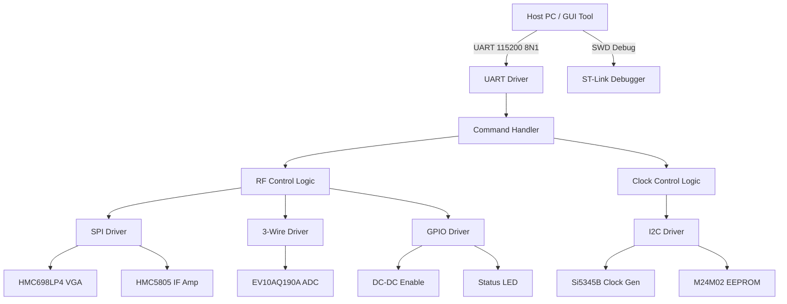
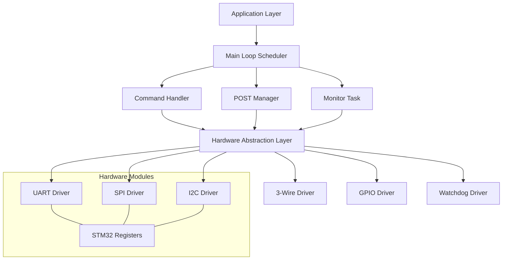
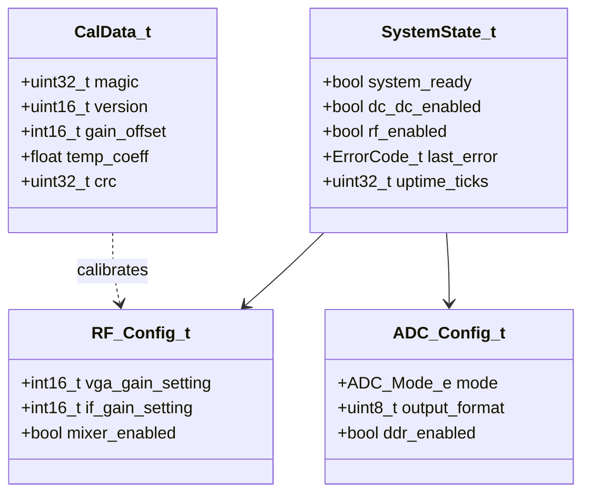
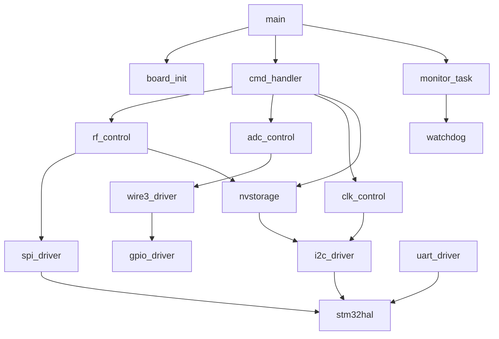
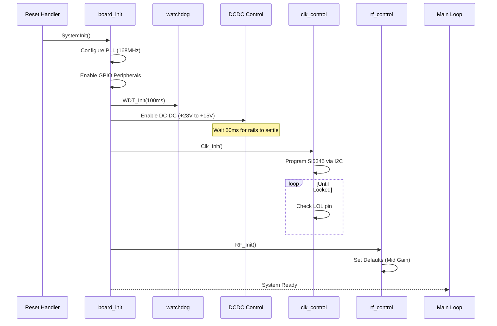
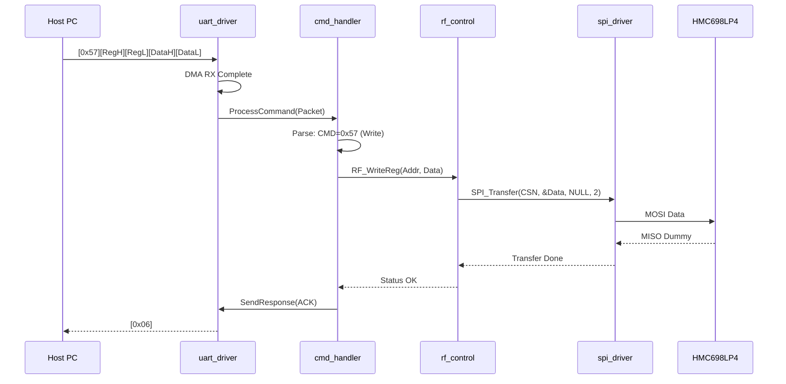
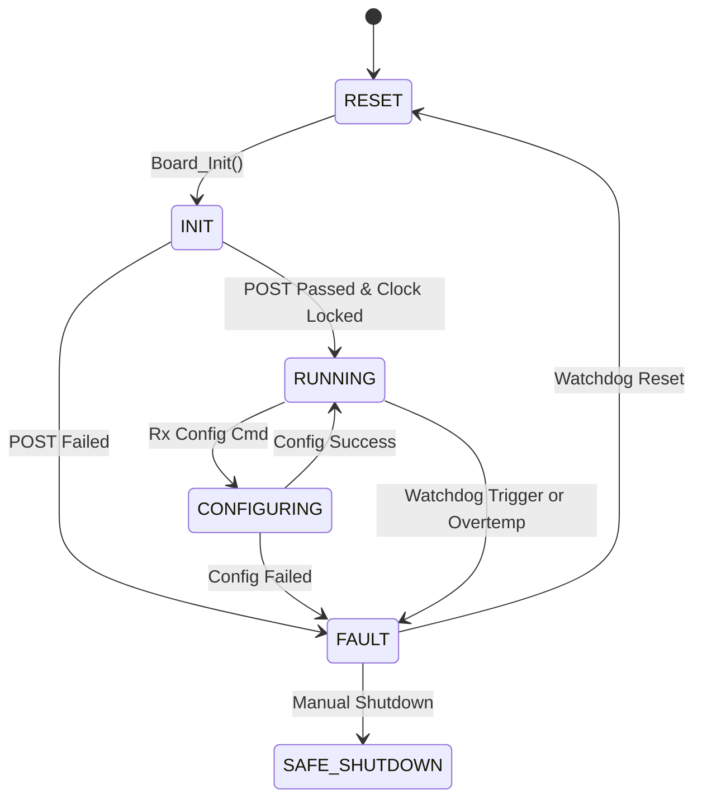
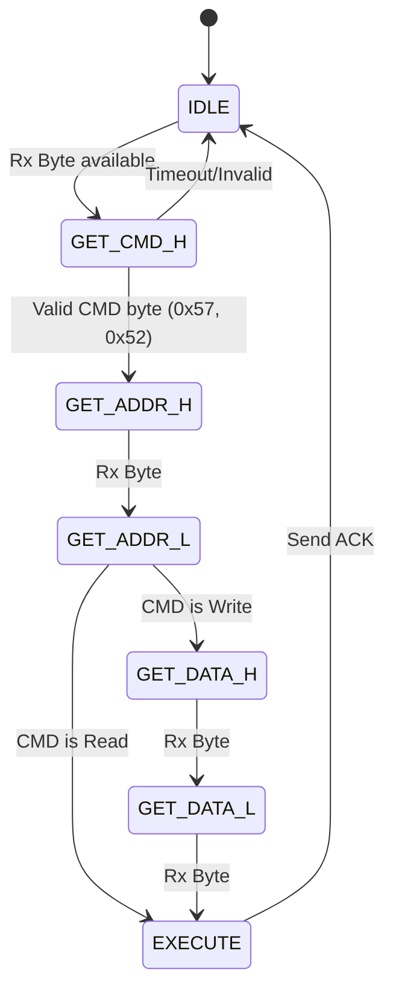

# Software Design Document (SDD)
**Project:** ehg (Wideband RF Receiver Module)
**Version:** 1.0
**Date:** 16 April 2026
**Author:** Senior Embedded Software Architect

---

## Document Control
| Version | Date | Author | Description |
|---------|------|--------|-------------|
| 1.0 | 16 April 2026 | Senior Architect | Initial design release derived from SRS v1.0 and GLR v0V01 |

---

# 1. Introduction

## 1.1 Purpose
This Software Design Document (SDD) provides the comprehensive architectural and detailed design for the **ehg** firmware running on the STM32F407VGT6 microcontroller. It defines the software structure, component interactions, data structures, and algorithms necessary to satisfy the requirements specified in the [ehg Software Requirements Specification (SRS)].

This document is intended for:
1.  **Firmware Engineers:** Implementing the BSP, drivers, and application logic.
2.  **Verification Engineers:** Creating unit tests and integration test plans.
3.  **System Architects:** Understanding the software boundaries and interactions with the RF hardware (HMC698LP4, EV10AQ190A) and Host PC.

## 1.2 Scope
The design covers the complete firmware image for the STM32F407VGT6.
*   **Included:** Board Support Package (BSP), Hardware Abstraction Layer (HAL), peripheral drivers (SPI, I2C, UART, 3-Wire), application logic (RF control, ADC configuration, Watchdog), and the build system.
*   **Excluded:** FPGA bitstream implementation, DSP algorithms running on the Host PC, and the physical layer hardware design.
*   **Target Platform:** STM32F407VGT6 (168 MHz, Cortex-M4F, 1MB Flash, 192KB SRAM).
*   **Language:** ISO C99 compliant with MISRA-C:2012 adherence.

## 1.3 Definitions and Acronyms

| Term | Definition |
| :--- | :--- |
| **AGC** | Automatic Gain Control. Firmware logic adjusting VGA gain to optimize ADC SFDR. |
| **API** | Application Programming Interface. The exposed function prototypes of a module. |
| **BSP** | Board Support Package. Low-level initialization for clocks, GPIO, and interrupts. |
| **CRC** | Cyclic Redundancy Check. Polynomial used for EEPROM data integrity. |
| **DC-DC** | Direct Current to Direct Current Converter. PKM4716TCD15 on the ehg board. |
| **DMA** | Direct Memory Access. Peripheral used for UART data transfer to offload CPU. |
| **DUT** | Device Under Test. |
| **EEPROM** | Electrically Erasable Programmable Read-Only Memory (M24M02-DR). |
| **FIFO** | First In, First Out buffer. |
| **GPIO** | General Purpose Input/Output. |
| **HAL** | Hardware Abstraction Layer. Middleware isolating application from register specifics. |
| **HRS** | Hardware Requirements Specification. |
| **I2C** | Inter-Integrated Circuit (Serial Bus). Used for Si5345 and EEPROM. |
| **IF** | Intermediate Frequency. |
| **ISR** | Interrupt Service Routine. |
| **LED** | Light Emitting Diode. |
| **LNA** | Low Noise Amplifier (HMC8141). |
| **LVDS** | Low-Voltage Differential Signaling. |
| **MISRA** | Motor Industry Software Reliability Association. Coding standard. |
| **POST** | Power-On Self-Test. |
| **RF** | Radio Frequency. |
| **SFDR** | Spurious Free Dynamic Range. |
| **SPI** | Serial Peripheral Interface. Used for HMC698LP4 and HMC5805. |
| **SRS** | Software Requirements Specification. |
| **UART** | Universal Asynchronous Receiver Transmitter. |
| **VGA** | Variable Gain Amplifier. |

## 1.4 References
1.  **IEEE Std 1016-2009**: Standard for Information Technology—Systems Design—Software Design Descriptions.
2.  **ehg SRS v1.0** (16 April 2026).
3.  **ehg GLR v0V01** (16 April 2026).
4.  **ehg HRS v1.0** (16 April 2026).
5.  **MISRA-C:2012**: Guidelines for the Use of the C Language in Critical Systems.
6.  **STM32F407 Reference Manual** (RM0090).
7.  **HMC698LP4 Datasheet** (Analog Devices).
8.  **EV10AQ190A Datasheet** (Teledyne e2v).
9.  **Si5345B-D Datasheet** (Skyworks).

---

# 2. Design Viewpoints

## 2.1 Context Viewpoint — System Boundaries

The **ehg** firmware acts as the control bridge between a Host PC and the sensitive analog/RF circuitry.



### External Interfaces
1.  **Host Interface:** UART (RX/TX) connected to the debug header or backplane.
2.  **RF Chain Control:** SPI bus (Chip Selects: `CS_VGA`, `CS_IF`).
3.  **Clock & Memory:** I2C bus (SDA/SCL) shared between Clock Gen and EEPROM.
4.  **ADC Interface:** 3-Wire Serial (SDIO, SCLK, CSn) + GPIOs for power modes.

## 2.2 Composition Viewpoint — Software Architecture

The software follows a strict layered architecture to ensure portability and testability.



### Module List with Responsibilities

#### Module: `board_init` (board_init.c / board_init.h)
*   **Responsibility:** System startup, clock configuration (168MHz), MPU setup, and peripheral enable.
*   **API:**
    *   `int32_t Board_Init(void);`
    *   `int32_t Board_GetInfo(BoardInfo_t *info);`
    *   `void Board_Reset(void);`

#### Module: `uart_driver` (uart_driver.c / uart_driver.h)
*   **Responsibility:** UART initialization, DMA-based RX/TX, handling variable length frames from Host.
*   **API:**
    *   `int32_t UART_Init(uint32_t baudrate);`
    *   `int32_t UART_Transmit(const uint8_t *data, uint16_t len);`
    *   `void UART_RxCallback(uint8_t byte);`
    *   `bool UART_IsRxComplete(void);`

#### Module: `spi_driver` (spi_driver.c / spi_driver.h)
*   **Responsibility:** SPI Master mode communication for HMC698LP4 and HMC5805. Handles CPOL=0, CPHA=0.
*   **API:**
    *   `int32_t SPI_Init(void);`
    *   `int32_t SPI_Transfer(uint8_t cs_pin, const uint8_t *tx, uint8_t *rx, uint16_t len);`
    *   `void SPI_CS_Select(uint8_t cs_pin);`
    *   `void SPI_CS_Deselect(uint8_t cs_pin);`

#### Module: `i2c_driver` (i2c_driver.c / i2c_driver.h)
*   **Responsibility:** I2C Master communication for Si5345B (400kHz) and M24M02 EEPROM (100kHz).
*   **API:**
    *   `int32_t I2C_Init(void);`
    *   `int32_t I2C_WriteMem(uint8_t dev_addr, uint16_t mem_addr, const uint8_t *data, uint16_t len);`
    *   `int32_t I2C_ReadMem(uint8_t dev_addr, uint16_t mem_addr, uint8_t *buf, uint16_t len);`

#### Module: `wire3_driver` (wire3_driver.c / wire3_driver.h)
*   **Responsibility:** Bit-banged or SPI-based 3-wire interface specific to EV10AQ190A ADC requirements.
*   **API:**
    *   `int32_t Wire3_Init(void);`
    *   `int32_t Wire3_WriteReg(uint8_t reg, uint8_t val);`
    *   `int32_t Wire3_ReadReg(uint8_t reg, uint8_t *val);`

#### Module: `rf_control` (rf_control.c / rf_control.h)
*   **Responsibility:** High-level control of RF chain gain and AGC logic.
*   **API:**
    *   `int32_t RF_SetGain(int16_t gain_db);`
    *   `int32_t RF_GetGain(int16_t *gain_db);`
    *   `void RF_Enable(bool enable);`

#### Module: `adc_control` (adc_control.c / adc_control.h)
*   **Responsibility:** Configuration of the EV10AQ190A ADC (modes, output format).
*   **API:**
    *   `int32_t ADC_Init(void);`
    *   `int32_t ADC_SetMode(ADC_Mode_e mode);`
    *   `int32_t ADC_Reset(void);`

#### Module: `clk_control` (clk_control.c / clk_control.h)
*   **Responsibility:** Programming the Si5345B-D clock generator via I2C.
*   **API:**
    *   `int32_t Clk_Init(void);`
    *   `int32_t Clk_EnableOutputs(bool enable);`
    *   `bool Clk_IsLocked(void);`

#### Module: `nvstorage` (nvstorage.c / nvstorage.h)
*   **Responsibility:** Abstraction for EEPROM read/write operations including CRC verification.
*   **API:**
    *   `int32_t NVS_Init(void);`
    *   `int32_t NVS_ReadCalibration(CalData_t *data);`
    *   `int32_t NVS_WriteCalibration(const CalData_t *data);`

#### Module: `cmd_handler` (cmd_handler.c / cmd_handler.h)
*   **Responsibility:** Parses UART frames defined in GLR and executes actions.
*   **API:**
    *   `void CMD_Process(void);`
    *   `int32_t CMD_Execute(uint8_t *payload, uint16_t len);`

## 2.3 Logical Viewpoint — Data Model

Key data structures exchanged between modules and stored in memory.



### Structure Definitions

```c
/* System State (Global Instance) */
typedef struct {
    volatile bool system_ready;
    volatile bool dc_dc_enabled;
    bool rf_enabled;
    ErrorCode_t last_error;
    uint32_t uptime_seconds;
} SystemState_t;

/* RF Chain Configuration */
typedef struct {
    int16_t vga_gain_db;       /* HMC698LP4: -5 to 25 dB */
    int16_t if_amp_gain_db;    /* HMC5805: 0 to 24 dB */
    bool rf_path_active;
} RF_Config_t;

/* ADC Configuration (EV10AQ190A) */
typedef enum {
    ADC_MODE_SINGLE = 0,
    ADC_MODE_DUAL = 1,
    ADC_MODE_QUAD = 2,
    ADC_MODE_DEMUX = 3
} ADC_Mode_e;

typedef struct {
    ADC_Mode_e mode;
    bool ddr_enabled;
    uint8_t test_pattern;
} ADC_Config_t;

/* EEPROM Calibration Data */
typedef struct {
    uint32_t magic;            /* 0xA5A5A5A5 */
    uint16_t version;
    int16_t gain_offset_vga;
    int16_t gain_offset_if;
    float temp_coefficient;
    uint32_t crc32;
} CalData_t;
```

## 2.4 Dependency Viewpoint — Module Dependencies



**Build Order:** `utils` -> `stm32hal` -> `drivers` -> `middleware` -> `application`.

## 2.5 Interface Viewpoint — Complete API Specification

### Function: `RF_SetGain`
*   **Prototype:** `int32_t RF_SetGain(int16_t target_gain_db);`
*   **Description:** Sets the total gain of the RF chain by distributing gain between the VGA and IF Amp based on calibration data.
*   **Parameters:**
    *   `target_gain_db`: Desired gain in dB (Range: 0 to 50).
*   **Returns:**
    *   `ERR_OK` (0) on success.
    *   `ERR_PARAM` if gain is out of range.
    *   `ERR_SPI` if communication with HMC698LP4 fails.
*   **Pre-conditions:** `RF_Init()` must have been called successfully.
*   **Post-conditions:** SPI transactions are complete to update HMC698LP4 and HMC5805 registers.
*   **Thread Safety:** Not thread-safe. Must be called from single thread (Main or Command task).

### Function: `I2C_WriteMem`
*   **Prototype:** `int32_t I2C_WriteMem(uint8_t dev_addr, uint16_t mem_addr, const uint8_t *data, uint16_t len);`
*   **Description:** Writes a block of data to an I2C slave device with a 16-bit memory address (used for EEPROM and Clock registers).
*   **Parameters:**
    *   `dev_addr`: 7-bit I2C slave address (shifted left).
    *   `mem_addr`: Internal register/memory address.
    *   `data`: Pointer to data buffer.
    *   `len`: Number of bytes to write.
*   **Returns:**
    *   `ERR_OK` on success (ACK received).
    *   `ERR_TIMEOUT` if slave does not acknowledge.

### Function: `ADC_SetMode`
*   **Prototype:** `int32_t ADC_SetMode(ADC_Mode_e mode);`
*   **Description:** Configures the EV10AQ190A ADC for specific channel modes (Single/Dual/Quad) via the 3-wire interface.
*   **Parameters:**
    *   `mode`: Enum value representing the desired ADC output mode.
*   **Returns:**
    *   `ERR_OK` on success.
    *   `ERR_HARDWARE` if ADC fails to acknowledge reset.

## 2.6 Interaction Viewpoint — Sequence Diagrams

### System Initialization Sequence


### Host Command Execution (Write SPI)


## 2.7 State Viewpoint — State Machines

### System State Machine


### UART Parser State Machine (GLR Compliant)


## 2.8 Algorithm Viewpoint — Key Algorithms

### 2.8.1 Si5345 Clock Configuration
The Si5345 requires a complex register map write.
1.  **Load Config:** Load register array from Flash (generated by Skyworks ClockBuilder Pro).
2.  **Write Loop:** Iterate through struct array `reg_addr`, `reg_val`.
3.  **I2C Write:** Write `reg_addr` (2 bytes) followed by `reg_val`.
4.  **Wait:** Wait 50ms for PLL lock.
5.  **Verify:** Read `0x000C` (LOS_LOSS Register) to confirm `LOL=0` and `LOS=0`.

### 2.8.2 Gain Calculation Algorithm
To distribute gain across the RF chain:
*   **Input:** `total_gain` (0 to 50dB).
*   **Logic:**
    *   HMC698LP4 Range: -5dB to 25dB (30dB span).
    *   HMC5805 Range: 0dB to 24dB.
*   **Steps:**
    1.  If `total_gain < 25`:
        *   `vga_gain = -5 + total_gain`
        *   `if_gain = 0`
    2.  If `total_gain >= 25`:
        *   `vga_gain = 25` (Max)
        *   `if_gain = total_gain - 25`
        *   Limit `if_gain` to max 24dB.

## 2.9 Resource Viewpoint — Real-Time Constraints

### 2.9.1 Task Scheduling Table

| Task Name | Period | Worst-Case Exec Time | Priority | Deadline | CPU Load |
|-----------|--------|---------------------|----------|----------|---------|
| Main Loop | 1ms | 150us | Medium | 1ms | 15% |
| UART Rx (ISR) | Event | 10us | High | Immediate | <1% |
| WDT Refresh | 10ms | 5us | High | 10ms | 0.5% |
| Monitor Task | 1000ms | 500us | Low | 1000ms | 0.05% |
| SPI Transfers (IRQ) | Event | 50us | High | End of Frame | 5% |

### 2.9.2 ISR Latency Budget
| Interrupt Source | Max Latency | Requirement | Margin |
|-----------------|-------------|-------------|--------|
| UART RX (DMA) | 20us | No Byte Loss (115200) | OK |
| SPI TX/RX | 10us | Clock Accuracy | OK |
| I2C Event | 50us | No Bus Timeout | OK |
| SysTick | 1us | Kernel Ticks | OK |

### 2.9.3 Memory Budget
STM32F407VGT6 has 192KB SRAM.

| Region | Size (Bytes) | Usage |
|--------|--------------|-------|
| Stack (Main) | 4096 | Main loop context |
| Stack (IRQ) | 1024 | Interrupt handling |
| Heap | 8192 | Dynamic allocations (minimized) |
| UART DMA Buffers | 512 | RX/TX FIFOs |
| I2C Buffers | 256 | Si5345/EEPROM data |
| App State | 256 | System structs |
| **Total Used** | **~14KB** | **< 10%** |
| **Remaining** | **178KB** | **Safe margin** |

## 2.10 Build System Viewpoint

### 2.10.1 CMakeLists.txt Structure

```cmake
cmake_minimum_required(VERSION 3.20)
project(ehg_firmware C ASM)

set(CMAKE_C_STANDARD 99)
set(CPU_PARAMS "-mthumb -mcpu=cortex-m4 -mfloat-abi=hard -mfpu=fpv4-sp-d16")
add_compile_options(${CPU_PARAMS} -Wall -Wextra -Wpedantic)

# Hardware Abstraction Layer
add_library(stm32hal STATIC
    src/drivers/stm32f4xx_hal_spi.c
    src/drivers/stm32f4xx_hal_i2c.c
    src/drivers/stm32f4xx_hal_uart.c
    src/drivers/stm32f4xx_hal_tim.c
)
target_include_directories(stm32hal PUBLIC drivers/inc)

# Board & Drivers
add_library(board STATIC
    src/drivers/board_init.c
    src/drivers/spi_driver.c
    src/drivers/i2c_driver.c
    src/drivers/wire3_driver.c
    src/drivers/uart_driver.c
)
target_link_libraries(board PUBLIC stm32hal)

# Application Logic
add_executable(ehg_firmware.elf
    src/main.c
    src/app/cmd_handler.c
    src/app/rf_control.c
    src/app/adc_control.c
    src/app/clk_control.c
    src/app/nvstorage.c
    src/app/monitor.c
)
target_link_libraries(ehg_firmware PRIVATE board)

# Qt6 GUI (Host Side - Optional)
find_package(Qt6 QUIET)
if(Qt6_FOUND)
    add_subdirectory(gui/ehg_tool)
endif()

# Unit Tests (Google Test)
enable_testing()
add_subdirectory(tests)
```

---

# 3. Design Rationale

## 3.1 Architecture Choices

**Decision: Use STM32 HAL over LL (Low-Level) Libraries.**
*   **Rationale:** The HAL provides sufficient portability for the STM32F4 family. The performance penalty for SPI/I2C at 168MHz is negligible compared to the RF setup times. It reduces development time and complexity.
*   **Trade-off:** Slightly larger code footprint.

**Decision: 3-Wire Custom Driver vs. SPI Hardware.**
*   **Rationale:** The EV10AQ190A uses a specific timing for SDIO (Bidirectional) that is not fully SPI compliant. While it could be coerced onto SPI MOSI/MISO, a GPIO-based 3-wire driver ensures strict adherence to the setup/hold times specified in the ADC datasheet.

**Decision: DMA for UART RX.**
*   **Rationale:** At 115200 baud, RX interrupts occur frequently (every ~87us). Using DMA (Circular Mode) offloads the CPU, ensuring the main loop is not starved, allowing it to handle critical RF timing tasks.

## 3.2 MISRA-C:2012 Compliance Strategy
All code will be verified using PC-Lint Plus.
*   **Static Allocation:** No `malloc`/`free` in the final application image.
*   **Type Safety:** All arithmetic is strictly typed (e.g., `uint16_t` for register addresses).
*   **Function Complexity:** No function exceeds a Cyclomatic Complexity of 15 (enforced by CI).

---

# 4. Design Traceability Matrix

| SDD Component / Module | Implements REQ-SW-xxx | Design Element |
|------------------------|----------------------|----------------|
| `board_init.c` | REQ-SW-001 | System initialization |
| `spi_driver` | REQ-SW-004 | VGA/IF Amp Control Interface |
| `rf_control.c` | REQ-SW-005 | Gain adjustment logic |
| `i2c_driver` | REQ-SW-007, REQ-SW-008 | Si5345 Clock Config |
| `wire3_driver` | REQ-SW-009 | ADC Serial Interface |
| `adc_control.c` | REQ-SW-010 | ADC Mode Configuration |
| `nvstorage.c` | REQ-SW-011 | EEPROM Cal Read/Write |
| `uart_driver` | REQ-SW-012, REQ-SW-013 | Host Comms |
| `cmd_handler.c` | REQ-SW-014 | Command Parsing |
| `monitor.c` | REQ-SW-020 | Watchdog & Status LED |
| HMC698LP4 Register Map | REQ-SW-006 | Gain step resolution |

---

# 5. Appendices

## Appendix A — File Structure
```text
src/
├── main.c                  # Entry point
├── board/
│   ├── board_init.c
│   └── board_config.h      # Pin definitions
├── drivers/
│   ├── stm32hal/           # HAL source files
│   ├── spi_driver.c
│   ├── i2c_driver.c
│   ├── wire3_driver.c
│   └── uart_driver.c
├── app/
│   ├── rf_control.c
│   ├── adc_control.c
│   ├── clk_control.c
│   ├── nvstorage.c
│   ├── cmd_handler.c
│   └── monitor.c
├── tests/
│   └── test_rf_control.cpp # Google Test mocks
```

## Appendix B — Register Map Summary

This section summarizes the register maps accessed by the MCU.

### HMC698LP4 (VGA) - SPI
| Addr | Name | Bit Width | Description |
|------|------|-----------|-------------|
| 0x00 | GAIN | 8 | Gain Control (0-255 maps to -5dB to +25dB) |
| 0x01 | CFG | 8 | Config register (Shutdown, etc.) |

### EV10AQ190A (ADC) - 3-Wire
| Addr | Name | Description |
|------|------|-------------|
| 0x00 | CTRL | Main Control (RESET) |
| 0x01 | MODE | Output Mode Selection |
| 0x02 | DEC | Decimation/Deserialization |

### Si5345B (Clock Gen) - I2C
| Page | Addr | Name | Description |
|------|------|------|-------------|
| 0x00 | 0x000B | DEVICE_INFO | Chip ID |
| 0x00 | 0x000C | STATUS_LOL | Loss of Lock Status |

### EEPROM (M24M02) - I2C
| Addr | Size | Usage |
|------|------|-------|
| 0x0000 | 64 | Cal Block 1 |
| 0x0040 | 64 | Cal Block 2 |

## Appendix C — Memory Map (STM32F407)
| Region | Start | Size | Usage |
|--------|-------|------|-------|
| FLASH | 0x08000000 | 1MB | Firmware Code |
| SRAM1 | 0x20000000 | 112KB | Main Data |
| SRAM2 | 0x2001C000 | 16KB | Backup/Stack |
| PERIPH | 0x40000000 | - | APB/AHB Registers |