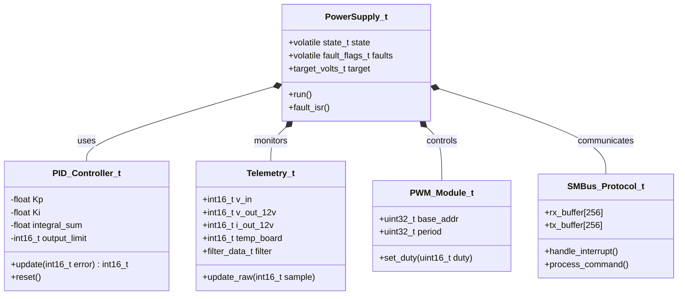
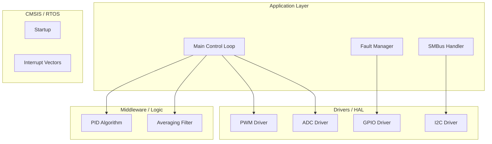
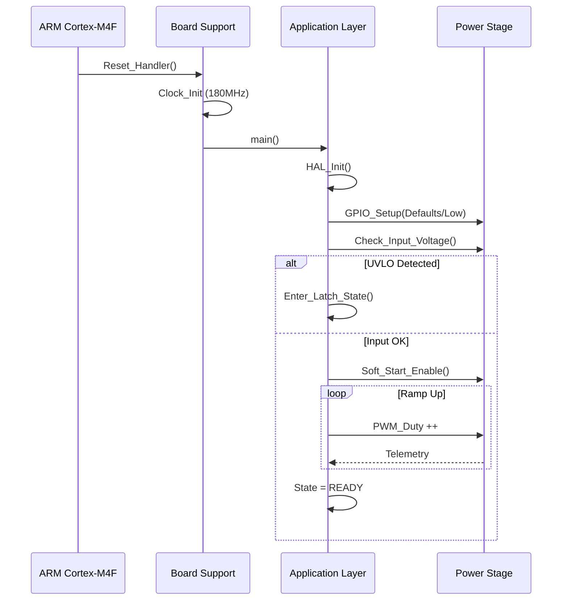
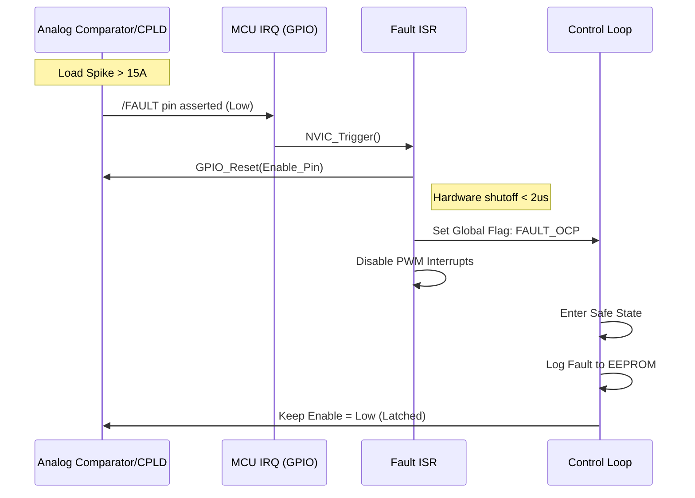
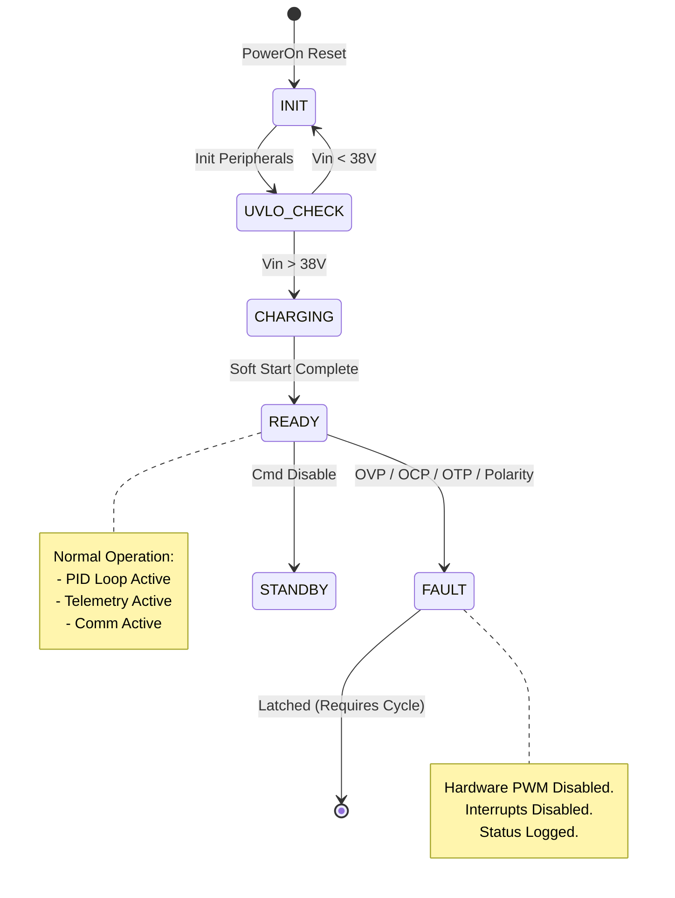

# Software Design Document (SDD)
**Project:** fjxm Multi-Output Power Supply
**Version:** 1.0
**Date:** 2026-04-04
**Status:** Design Baseline
**Standard:** IEEE 1016-2009

---

# 1. Introduction

## 1.1 Purpose
This Software Design Document (SDD) describes the software architecture and detailed design of the **fjxm** embedded firmware. It defines the structural decomposition, data structures, algorithms, and interfaces required to implement the requirements specified in the **fjxm Software Requirements Specification (SRS)**.

## 1.2 Scope
The design covers the firmware executing on the ARM Cortex-M4F Microcontroller Unit (MCU). It encompasses:
*   Deterministic control loops for Active Clamp Forward conversion.
*   State machine management for power sequencing and fault handling.
*   Telemetry acquisition and digital filtering.
*   Communication protocols (SMBus/I2C) for host interaction.
*   Hardware Abstraction Layer (HAL) implementation.

## 1.3 Definitions
*   **Duty Cycle (D):** The ratio of the pulse duration to the switching period (0.0 to 1.0).
*   **MagAmp:** Magnetic Amplifier used for secondary side post-regulation.
*   **PI Controller:** Proportional-Integral control loop algorithm.
*   **SMBus:** System Management Bus - a derivative of I2C.
*   **ISR:** Interrupt Service Routine.

## 1.4 References
1.  **fjxm Software Requirements Specification (SRS)**, Rev 1.0.
2.  **fjxm Hardware Requirements Specification (HRS)**, Rev 1.0.
3.  **fjxm Glue Logic Requirements (GLR)**, Rev 1.0.
4.  **MISRA-C:2012** Guidelines for the use of the C language in critical systems.
5.  **ARM Cortex-M4F Technical Reference Manual**.

---

# 2. Design Viewpoints

## 2.1 Context Viewpoint
The **fjxm** firmware acts as the central controller for the power supply. It interacts with the external Host System (commander), the Power Stage (actuator), and the Analog Front End (sensors).

```mermaid
C4Context
    title fjxm System Context
    Person(host, "Host System / Integrator")
    System_Boundary(fjxm, "fjxm Power Supply Unit") {
        System(mcu_fw, "Embedded Firmware", "Cortex-M4F")
    }
    SystemUi(power_hw, "Power Stage", "FETs, Transformers, MagAmps")
    SystemUi(sensors, "Sensors & AFE", "ADC, Op-Amps, Thermistors")
    
    Rel(host, mcu_fw, "SMBus Commands / Telemetry", "I2C/SMBus")
    Rel(mcu_fw, power_hw, "Gate Drive Signals", "PWM")
    Rel(mcu_fw, power_hw, "Enable/Reset", "GPIO")
    Rel(sensors, mcu_fw, "Analog Measurements", "ADC / IRQ")
```

## 2.2 Composition Viewpoint
The firmware is decomposed into layers to separate hardware concerns from application logic.

*   **Board Support Package (BSP):** Direct hardware register access (GPIO, EXTI, NVIC).
*   **Hardware Abstraction Layer (HAL):** Standardized drivers for peripherals (PWM, ADC, I2C).
*   **Middleware:** Signal processing (Filters) and Communication Protocol stacks.
*   **Application Layer:** State machines, Control loops (PID), and Business logic.

```mermaid
componentDiagram
    namespace Application {
        component "Power State Machine" as PSM
        component "Control Loop Manager" as CLM
        component "Fault Manager" as FM
        component "Telemetry Service" as TM
    }

    namespace Middleware {
        component "SMBus Protocol" as COMMS
        component "Digital Filters" as FILTER
        component "PID Algorithm" as PID
    }

    namespace HAL {
        component "PWM Driver" as PWM_DRV
        component "ADC Driver" as ADC_DRV
        component "GPIO Driver" as GPIO_DRV
        component "Timer Driver" as TIM_DRV
    }

    namespace Hardware {
        component "Cortex-M4F" as MCU
    }

    PSM --> FM : Trigger Fault
    PSM --> CLM : Enable Control
    CLM --> PID : Setpoint/Feedback
    PID --> PWM_DRV : Duty Demand
    FM --> GPIO_DRV : Fault Signals
    
    TM --> ADC_DRV : Request Sample
    ADC_DRV --> FILTER : Raw Samples
    
    COMMS --> TM : Read Status
    COMMS --> PSM : Control Cmds
```

## 2.3 Logical Viewpoint
This section details the static class structure. Key data structures are designed to be volatile-ready for ISR access.



## 2.4 Dependency Viewpoint
The build order and module dependencies. Critical safety modules (Fault Manager) must not depend on the communication stack.



## 2.5 Interface Viewpoint
Detailed definitions of data structures and registers.

### 2.5.1 Internal Data Structures
MISRA-C compliant structures for control and telemetry.

```c
#include <stdint.h>
#include <stdbool.h>

/**
 * @brief System Fault Flags Bitmap
 * Mapping to REQ-SW-020 (Fault Detection)
 */
typedef struct {
    uint32_t ovp_12v   : 1;  /* Bit 0: Over Voltage 12V */
    uint32_t ocp_12v   : 1;  /* Bit 1: Over Current 12V */
    uint32_t uvlo      : 1;  /* Bit 2: Under Voltage Lockout */
    uint32_t otp       : 1;  /* Bit 3: Over Temperature Protection */
    uint32_t polarity   : 1;  /* Bit 4: Reverse Polarity */
    uint32_t reserved  : 27; /* Bits 5-31: Reserved */
} FJXM_FaultFlags_t;

/**
 * @brief Real-time Telemetry Data Structure
 * Mapping to REQ-SW-010 (Telemetry)
 */
typedef struct {
    int16_t  v_in_mv;        /* Input Voltage in mV */
    int16_t  v_out_12_mv;    /* 12V Output in mV */
    int16_t  i_out_12_ma;    /* 12V Current in mA */
    int16_t  temp_board_dec; /* Board Temp in 0.1 C */
    uint16_t pwm_duty_permille; /* PWM Duty 0-1000 */
} FJXM_Telemetry_t;

/**
 * @brief PID Controller Context
 */
typedef struct {
    float kp;
    float ki;
    int32_t integral_term; /* Accumulated error */
    int16_t output_max;
    int16_t output_min;
} FJXM_PID_t;
```

### 2.5.2 Hardware Register Map (Memory Mapped)
Definitions based on GLR Specification and Cortex-M4 mapping. Assume Base Address `0x40000000`.

```c
/* Register Map Assumptions */
#define FJXM_PWM_BASE    (0x40015000UL)
#define FJXM_ADC_BASE    (0x40012000UL)
#define FJXM_GPIO_BASE   (0x40020000UL)

/**
 * @brief PWM Register Map
 */
typedef struct {
    __IO uint32_t CTRL;    /* Offset 0x00: Control Register (RW) */
    __IO uint32_t STATUS;  /* Offset 0x04: Status Register (R) */
    __IO uint32_t DUTY;    /* Offset 0x08: Duty Cycle Register (0-1000) */
    __IO uint32_t PERIOD;  /* Offset 0x0C: Period Register */
    __IO uint32_t IRQ_EN;  /* Offset 0x10: IRQ Enable Mask */
} FJXM_PWM_Regs_t;

#define FJXM_PWM ((FJXM_PWM_Regs_t*) FJXM_PWM_BASE)

/**
 * @brief ADC Register Map
 */
typedef struct {
    __IO uint32_t CTRL;    /* Offset 0x00: ADC Control */
    __IO uint32_t CH0_DATA;/* Offset 0x04: Channel 0 (Vin) */
    __IO uint32_t CH1_DATA;/* Offset 0x08: Channel 1 (Vout) */
    __IO uint32_t CH2_DATA;/* Offset 0x0C: Channel 2 (Iout) */
    __IO uint32_t CH3_DATA;/* Offset 0x10: Channel 3 (Temp) */
    __IO uint32_t EOC_IRQ; /* Offset 0x20: End of Conversion Flag */
} FJXM_ADC_Regs_t;

#define FJXM_ADC ((FJXM_ADC_Regs_t*) FJXM_ADC_BASE)
```

### 2.5.3 Function Prototypes

```c
/* Module: Power Control */
void FJXM_Power_Init(void);
void FJXM_Power_Enable(void);
void FJXM_Power_Disable(void);
void FJXM_Power_UpdateControl(void); /* Called in PID Loop */

/* Module: Protection */
void FJXM_Fault_Init(void);
void FJXM_Fault_Handler(void);       /* IRQ Handler */
bool FJXM_Fault_IsSafe(void);

/* Module: Telemetry */
void FJXM_Telemetry_Update(void);
FJXM_Telemetry_t* FJXM_Telemetry_GetSnapshot(void);

/* Module: Communication */
void FJXM_Comm_Init(void);
void FJXM_Comm_Task(void);           /* Polling handler */
```

## 2.6 Interaction Viewpoint
### 2.6.1 Startup Sequence
Initialization flow from Reset to Ready state.



### 2.6.2 Overcurrent Fault Response
Timing critical interaction showing the fast hardware shutdown vs software debouncing.



## 2.7 State Viewpoint
The top-level state machine for the Power Supply Management.



## 2.8 Algorithm Viewpoint
### 2.8.1 PID Control Loop (REQ-SW-005)
Executed every 5µs (200 kHz) inside the PWM Timer Interrupt.

**Pseudocode:**

```text
FUNCTION PID_Compute(SetPoint, Measurement)
    // Kp = 0.5, Ki = 0.1 (Example gains)
    // dt = 5us (fixed by timer)
    
    Error = SetPoint - Measurement
    
    // Integral Windup Prevention
    IF (Output NOT Saturated) THEN
        Integral_Sum = Integral_Sum + (Error * Ki)
    END IF

    // Calculate Duty Demand
    Duty_Out = (Error * Kp) + Integral_Sum + FeedForward_Term

    // Limit Duty Cycle (0% to 90% max)
    IF (Duty_Out > MAX_DUTY) THEN
        Duty_Out = MAX_DUTY
    ELSE IF (Duty_Out < MIN_DUTY) THEN
        Duty_Out = MIN_DUTY
    END IF

    RETURN Duty_Out
END FUNCTION
```

### 2.8.2 Moving Average Filter (Telemetry)
Used to smooth ADC readings for the SMBus interface (not for the fast PID loop).

**Pseudocode:**
```text
// Buffer size N=16
FUNCTION Filter_Update(NewSample)
    Index = (Index + 1) AND 0x0F // Mask for size 16
    Buffer[Index] = NewSample
    
    Sum = 0
    FOR i = 0 to 15
        Sum = Sum + Buffer[i]
    END FOR
    
    Average = Sum / 16
    RETURN Average
END FUNCTION
```

---

# 3. Design Rationale

## 3.1 Architecture Selection
*   **Super-Loop vs. RTOS:** A "Super-Loop" (While(1)) architecture with prioritized interrupts was chosen over a full RTOS.
    *   *Rationale:* The control loop requires deterministic 5µs timing. Complex OS scheduling jitter introduces risk in power supply stability. The simple interrupt-driven design meets all timing constraints with lower overhead and easier MISRA-C verification.

## 3.2 Trade-offs
*   **MagAmp Control:** The design uses a simplified lookup table for the MagAmp reset timing rather than a secondary full PID loop.
    *   *Trade-off:* Slightly less efficient load regulation on the 3.3V/5V rails in exchange for significantly reduced CPU utilization, ensuring the primary 12V loop (high power) remains stable.

---

# 4. Traceability

| Design Element | SRS Requirement ID | Description |
| :--- | :--- | :--- |
| `PID_Compute()` | REQ-SW-005 | 12V Output Voltage Regulation (±1%) |
| `Fault_Handler` (ISR) | REQ-SW-020 | Overcurrent Protection (OCP) < 10µs |
| `FJXM_Telemetry_t` | REQ-SW-010 | Voltage/Current Monitoring Accuracy |
| `SMBus_Protocol_t` | REQ-SW-015 | Host Interface (I2C) Command Processing |
| `FJXM_FaultFlags_t` | REQ-SW-022 | Fault Logging to Non-Volatile Memory |
| `Main_StateMachine` | REQ-SW-001 | Power Sequencing (Start-up/Shutdown) |
| `Filter_Update()` | REQ-SW-011 | Telemetry Noise Filtering |

### Traceability Matrix Summary
*   **REQ-SW-005 (Control):** Satisfied by Section 2.8.1 (Algorithm) and 2.6.1 (Startup).
*   **REQ-SW-020 (Safety):** Satisfied by Section 2.6.2 (Fault Sequence) and 2.7 (State Diagram).
*   **REQ-SW-015 (Interface):** Satisfied by Section 2.5.3 (Prototypes) and 2.3 (Logical Class).