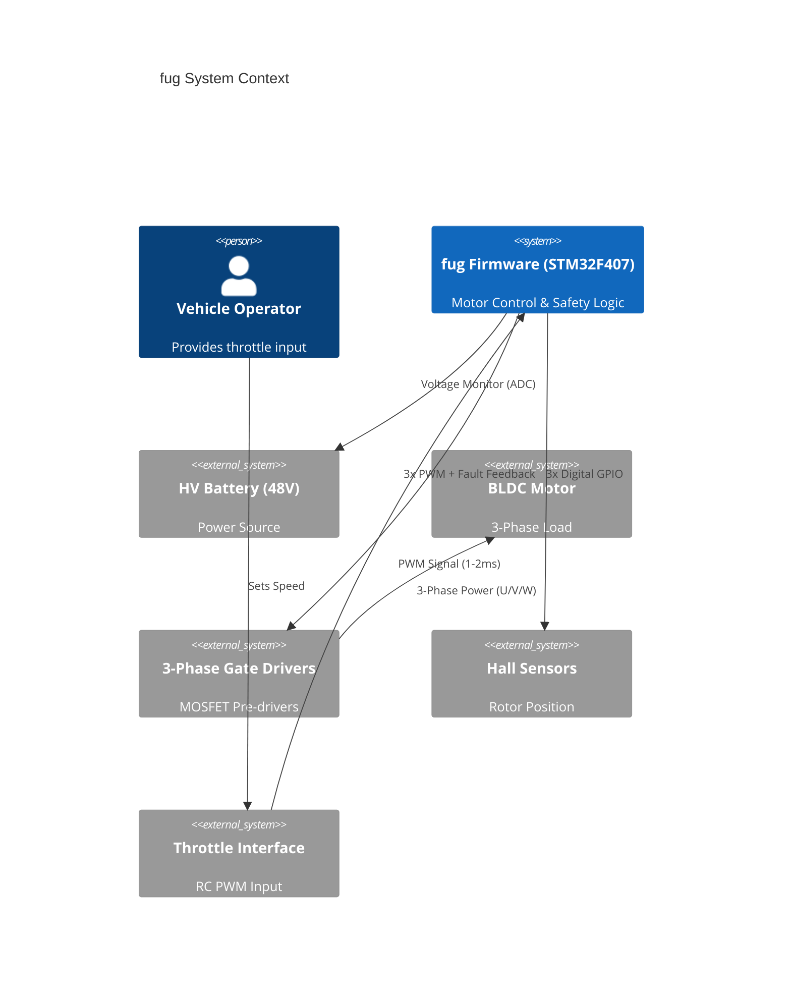
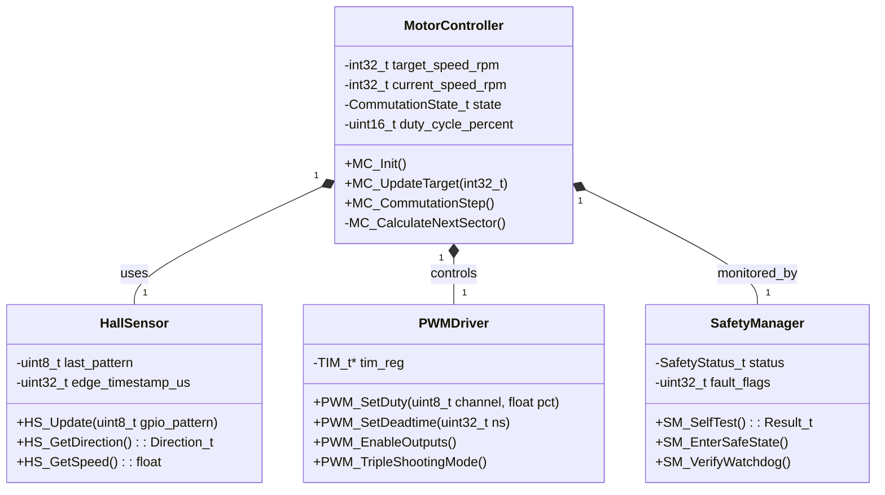
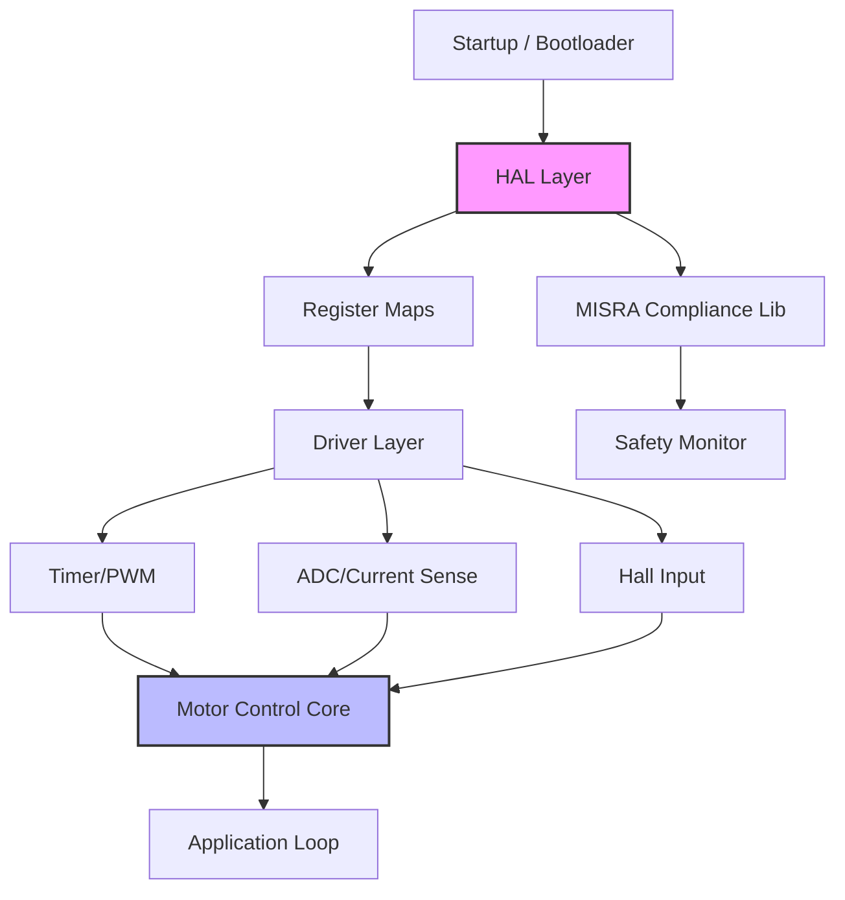
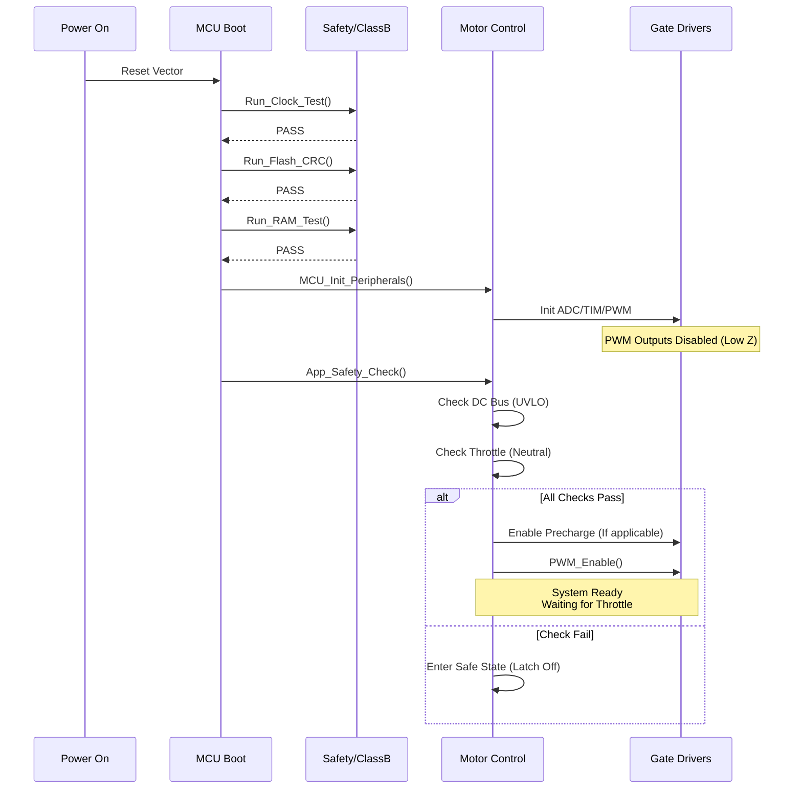
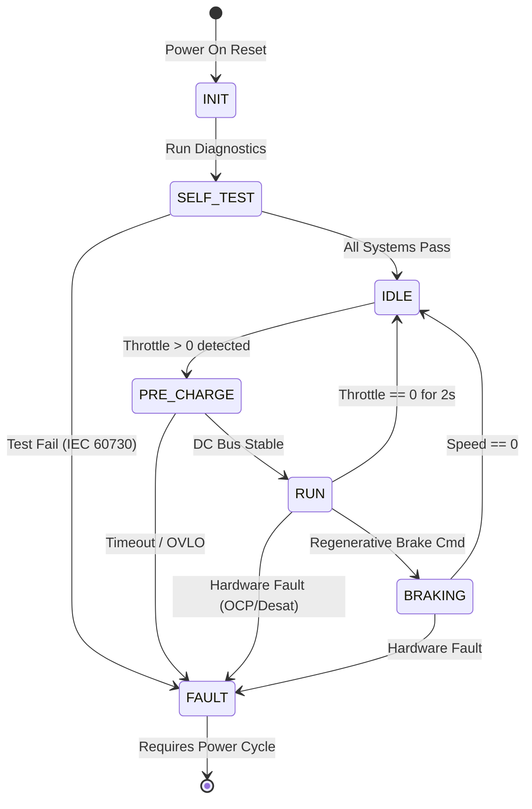

# Software Design Document (SDD)
**Project:** fug 10kW BLDC Motor Controller
**Version:** 1.0
**Date:** 2026-04-02
**Standard:** IEEE 1016-2009

---

# 1. Introduction

## 1.1 Purpose
This document describes the software architecture and detailed design of the **fug** firmware. It translates the **Software Requirements Specification (SRS)** into a structured blueprint for implementation. The design prioritizes safety-critical reliability (IEC 60730 Class B), real-time performance (20 kHz control loop), and modularity for future maintenance.

## 1.2 Scope
The design covers the firmware running on the STM32F407VGT6 microcontroller. This includes:
*   **Hardware Abstraction Layer (HAL):** Direct register access for timers, GPIO, and ADC.
*   **Control Logic:** 6-step commutation state machine and PID speed control.
*   **Safety Layer:** Fault detection, signal validation, and IEC 60730 self-tests.
*   **Communication:** Throttle decoding (RC PWM) and telemetry streaming.

## 1.3 Definitions
*   **Commutation Sector:** One of 6 electrical states (60-degree intervals) in a 3-phase motor rotation.
*   **Duty Cycle:** The percentage of time the PWM signal is active (0-100%).
*   **Class B:** Safety classification per IEC 60730 for automatic controls with protective features.

## 1.4 References
1.  **fug SRS (v1.0):** Software Requirements Specification.
2.  **STM32F407 Reference Manual (RM0090):** MCU Register definitions.
3.  **MISRA-C:2012:** Guidelines for the use of the C language in critical systems.

---

# 2. Design Viewpoints

## 2.1 Context Viewpoint
The **fug** software acts as the central processing unit for the motor controller. It interacts with the physical environment (Motor, Battery, User) and the supporting hardware (Gate Drivers, Sensors).



## 2.2 Composition Viewpoint
The software is decomposed into modular subsystems designed for portability and testability.

*   **Bootstrap:** Startup code, system init, and watchdog configuration.
*   **IO Abstraction:** Standardized interface for GPIO, ADC, and Timers.
*   **Motor Control:** The core algorithm (Commutation + PID).
*   **Safety Monitor:** Independent fault processing and Class B tests.
*   **Diagnostics:** Logging and status reporting.

```mermaid
componentDiagram
    namespace "Core Application" {
        component "Main Loop" {
            component "Diagnostics"
            component "CLI / Telemetry"
        }
        component "IRQ Handlers" {
            component "PWM_Commutation_ISR"
            component "ADC_Conv_Cplt"
            component "Fault_NMI"
        }
    }

    component "Safety Manager" {
        component "IEC60730_Tests"
        component "Fault_Locker"
    }

    component "Motor Control Layer" {
        component "6-Step Sequencer"
        component "Speed PID"
        component "Hall Decoder"
    }

    component "Hardware Abstraction (HAL)" {
        component "TIM1 Driver"
        component "ADC1 Driver"
        component "GPIO Driver"
    }

    MainLoop --> SafetyManager : "Heartbeat"
    MainLoop --> MotorControlLayer : "Set Target Speed"
    MotorControlLayer --> HAL : "Set Duty/Sector"
    
    Fault_NMI --> SafetyManager : "Critical Error"
    HallDecoder --> HallDecoder : "State Change"
    HallDecoder --> MotorControlLayer : "Update Rotor Pos"
    
    PWM_Commutation_ISR --> MotorControlLayer : "20kHz Trigger"
```

## 2.3 Logical Viewpoint
Class diagrams define the static structure of key objects. Data is strictly encapsulated to ensure MISRA-C compliance (avoiding global variable pollution where possible).



## 2.4 Dependency Viewpoint
The build order is strictly enforced.底层硬件驱动 must compile first, followed by the middleware (Safety/IO), and finally the application layer.



## 2.5 Interface Viewpoint

### A. Data Structures (Internal)
```c
#include <stdint.h>
#include <stdbool.h>

/**
 * @brief Hall Sensor State Mapping (Electrical Angle)
 */
typedef enum {
    SECTOR_1 = 0x05, /* 101: U-V- */
    SECTOR_2 = 0x01, /* 001: W-V- */
    SECTOR_3 = 0x03, /* 011: W-U- */
    SECTOR_4 = 0x02, /* 010: V-U- */
    SECTOR_5 = 0x06, /* 110: V-W- */
    SECTOR_6 = 0x04, /* 100: U-W- */
    SECTOR_ERR = 0x00, /* 000 or 111 is invalid */
    SECTOR_UNKNOWN = 0xFF
} HallSector_t;

/**
 * @brief Motor Control Configuration
 */
typedef struct {
    uint16_t max_duty_cycle;     // Limit to 95% to bootstrap charge
    uint16_t kp;                 // Proportional Gain (scaled x100)
    uint16_t ki;                 // Integral Gain (scaled x100)
    uint16_t start_ramp_time_ms; // Soft start duration
} MotorConfig_t;

/**
 * @brief System Status Flags
 */
typedef struct {
    bool ovlo_active : 1;    // Over Voltage
    bool uvlo_active : 1;    // Under Voltage
    bool ocp_active  : 1;    // Over Current
    bool desat_active: 1;    // Desaturation Fault
    bool hall_err    : 1;    // Loss of Commutation
    bool watchdog_reset : 1;
} SystemFaults_t;
```

### B. Register Access Macros
Direct pointer dereferencing for MISRA compliance where volatile access is required.
```c
#define TIM1_BASE  (0x40010000UL)
#define TIM1       ((TIM_TypeDef_t *) TIM1_BASE)

#define TIM1_ARR_VAL  4200U // 84MHz / (2 * 20kHz) - Center Aligned
```

### C. Function Prototypes (Public API)

```c
/**
 * @brief Initialize the motor control subsystem
 * @param config Pointer to configuration struct
 * @return 0 on success, -1 on param error
 */
int32_t MC_Init(MotorConfig_t* config);

/**
 * @brief Main Control Loop called by TIM1 Update Interrupt (20kHz)
 */
void MC_ControlLoop_ISR(void);

/**
 * @brief Decode Hall Sensors and update commutation state
 * @param hall_state 3-bit value from GPIO IDR
 */
void MC_ProcessHalls(uint8_t hall_state);

/**
 * @brief Safety Monitor: Check Voltages/Currents
 * @return True if system is healthy, False otherwise
 */
bool SM_PeriodicCheck(void);
```

## 2.6 Interaction Viewpoint
This sequence diagram illustrates the startup sequence, including the critical IEC 60730 Class B self-tests before enabling the power stage.



## 2.7 State Viewpoint
The top-level motor controller state machine. This ensures the system cannot transition directly from "IDLE" to "RUN" without passing through safety checks.



## 2.8 Algorithm Viewpoint

### A. Commutation Logic (Trapezoidal 6-Step)
**Inputs:** Hall State (1-6), Target Speed, Direction
**Output:** TIM1 CCR1, CCR2, CCR3 values (Duty), TIM1 CCER (Active Phases)

**Pseudocode:**
```text
FUNCTION Update_Commutation(hall_input):
    current_sector = Decode_Sector(hall_input)
    
    IF current_sector == INVALID:
        Increment_Error_Counter()
        RETURN FAULT
    
    IF current_sector != last_sector:
        last_sector = current_sector
        timer_ticks = Get_Elapsed_Time()
        speed_rpm = Calculate_Speed(timer_ticks)
        RESET_Integral_Error()
    
    error = Target_Speed - speed_rpm
    integral = integral + (error * Ki)
    duty = (error * Kp) + integral
    
    // Clamp Duty
    IF duty > MAX_DUTY: duty = MAX_DUTY
    IF duty < MIN_DUTY: duty = MIN_DUTY
    
    Apply_Step_Phases(current_sector, duty)
END FUNCTION
```

### B. Phase Application (LUT Logic)
This function maps the "Sector" to specific High/Low side MOSFET states.
*   **Active Phase:** PWM @ `duty`
*   **Low Side:** Ground (0)
*   **Floating:** High-Z (Outputs disabled via TIMx_CCER)

---

# 3. Design Rationale

## 3.1 Architecture Choices
1.  **Bare-Metal / Polling vs. RTOS:**
    *   *Decision:* Bare-metal architecture with a main loop and high-priority ISRs.
    *   *Rationale:* The 20 kHz control loop requirement (50 µs period) leaves significant overhead for context switching if a generic RTOS were used. Direct register manipulation and a deterministic "Super-Loop" ensure the worst-case execution time (WCET) is predictable, which is critical for safety certification (IEC 60730).

2.  **Center-Aligned PWM:**
    *   *Decision:* TIM1 configured in Center-Aligned Mode (Count Up/Down).
    *   *Rationale:* Center-aligned PWM generates symmetrical switching waveforms, reducing audible noise and EMI compared to edge-aligned modes. It also allows ADC triggering precisely in the center of the PWM pulse (where current is stable).

3.  **Separation of Safety and Control:**
    *   *Decision:* The `SafetyManager` module operates independently of the `MotorControl` logic.
    *   *Rationale:* To ensure that a software crash in the PID calculation or commutation logic cannot prevent the system from shutting down the PWM outputs in the event of a fault.

## 3.2 Trade-offs
*   **Memory vs. Speed:** Using Look-Up Tables (LUTs) for commutation maps consumes Flash memory but saves CPU cycles during the critical ISR. Chosen for speed.
*   **Software Filtering:** Relying on software median filters for ADC readings reduces BOM cost (no external active filters) but increases CPU load. Accepted as the STM32F4 has sufficient DSP capability.

---

# 4. Traceability

| SDD Element / ID | Description | Source Requirement |
| :--- | :--- | :--- |
| **2.5.A** | `MotorConfig_t` Struct | REQ-SW-001: Configurable Current Limits |
| **2.5.C** | `MC_ControlLoop_ISR` | REQ-SW-003: 20 kHz Update Rate |
| **2.2** | Safety Module | REQ-SW-004: IEC 60730 Class B Compliance |
| **2.7** | State Machine | REQ-SW-002: Start-up Procedure (Pre-charge) |
| **2.8.A** | Sector Decode Algorithm | REQ-SW-005: Hall Sensor Interface |
| **2.1** | Context Diagram | REQ-HW-010: Gate Driver Interface |
| **2.5.C** | `SM_PeriodicCheck` | REQ-SW-006: OVLO/UVLO Monitoring |
| **2.5.B** | `TIM1` Register Map | REQ-SW-001: 48V / 210A Capability (Control limit) |

---

*End of Document*