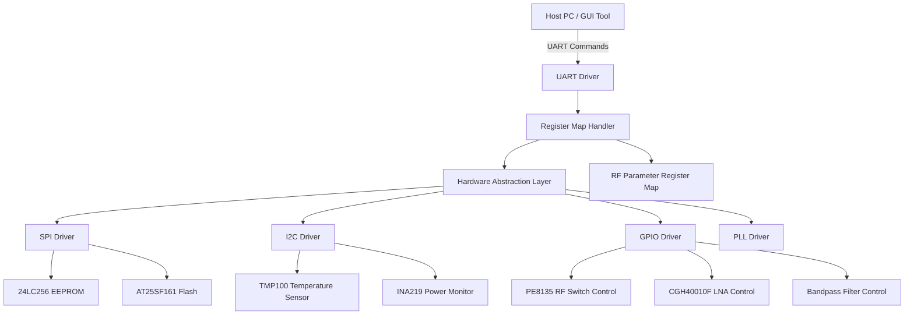
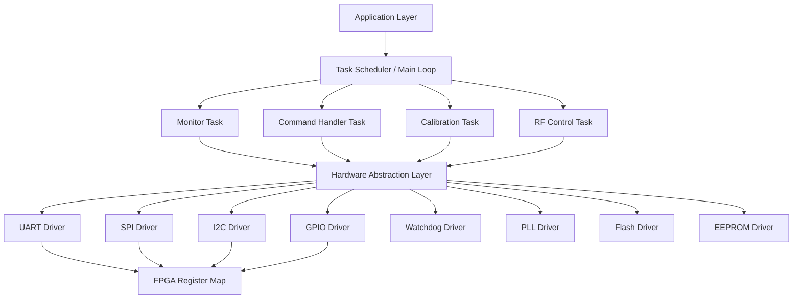
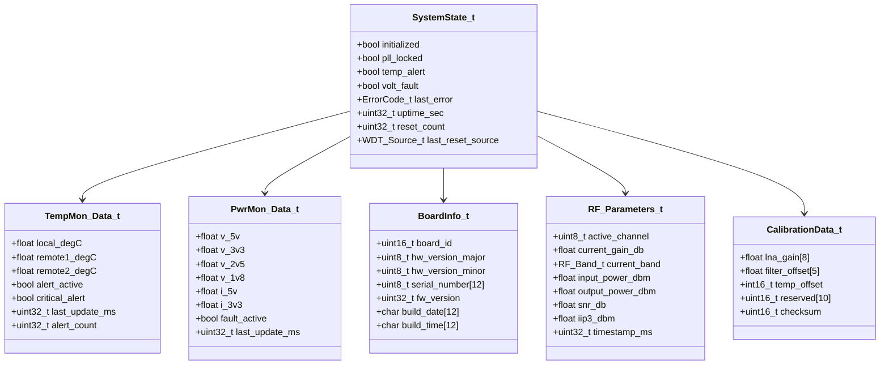
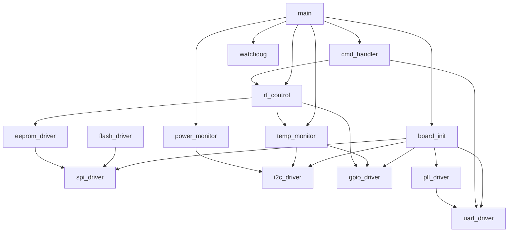

# Software Design Document (SDD)

## Document Control
| Version | Date | Author | Description |
|---------|------|--------|-------------|
| 1.0 | 19 April 2026 | gvng Team | Initial design |

---

# 1. Introduction

## 1.1 Purpose
This Software Design Document (SDD) defines the detailed software architecture, design, and implementation specifications for the gvng 8-channel RF front-end system. The document provides comprehensive design details for firmware engineers, RTL designers, test engineers, and system integrators to implement, test, and validate the control software for the gvng hardware platform.

This SDD directly implements the requirements specified in the Software Requirements Specification (SRS) and interfaces with the Hardware Requirements Specification (HRS) and Glue Logic Requirements (GLR) documents. It provides the necessary technical details for implementing the hardware abstraction layer (HAL), device drivers, application software, and communication protocols that will control the RF front-end hardware, monitor system parameters, and interface with external systems.

## 1.2 Scope
This document covers all software components required for the gvng 8-channel RF front-end control system, including:

- **Hardware Abstraction Layer (HAL)** and device drivers for all peripherals (UART, SPI, I2C, GPIO)
- **Board Support Package (BSP)** for system initialization and configuration
- **Application layer software** for RF front-end control, channel switching, gain adjustment, and filter band selection
- **System monitoring and protection** software for temperature, voltage, current monitoring, and watchdog management
- **Configuration management** for parameter storage in EEPROM and firmware updates from external flash
- **Communication protocols** for UART command/response interface and status reporting

The scope explicitly excludes:
- Downstream signal processing software
- External user interfaces (beyond the UART command interface)
- FPGA RTL design (covered in GLR)
- Mechanical packaging design

**Target hardware platform:**
- FPGA: XC7Z020-1CLG400C Zynq-7000 SoC
- Microcontroller: ARM Cortex-A9 (PS section of Zynq)
- Clock: 125 MHz primary system clock
- Memory: 256KB SRAM, 16MB QSPI Flash
- EEPROM: 24LC256 (256Kb)
- Peripherals: UART, SPI, I2C, GPIO

**Programming language and toolchain:**
- Primary language: C99 (MISRA-C:2012 compliant)
- Build system: CMake with GCC cross-compiler for ARM
- Debugger: JTAG via Xilinx SDK
- Static analysis: PC-lint, MISRA Checker, Polyspace
- Unit testing: Google Test framework

## 1.3 Definitions and Acronyms

| Term | Definition |
|------|------------|
| **HAL** | Hardware Abstraction Layer - software layer that provides standardized interfaces to hardware components |
| **BSP** | Board Support Package - minimal software layer to support hardware-specific functions |
| **ISR** | Interrupt Service Routine - special routine executed in response to hardware interrupts |
| **DMA** | Direct Memory Access - hardware feature that allows peripheral-to-memory transfers without CPU intervention |
| **FIFO** | First-In, First-Out - data structure that operates in a queue-like manner |
| **CRC** | Cyclic Redundancy Check - error-detecting code commonly used in digital networks |
| **WDT** | Watchdog Timer - hardware timer that resets the system if software fails to "pet" it |
| **PLL** | Phase-Locked Loop - control system that generates an output signal with fixed relation to input signal |
| **UART** | Universal Asynchronous Receiver/Transmitter - serial communication protocol |
| **SPI** | Serial Peripheral Interface - synchronous serial communication protocol |
| **I2C** | Inter-Integrated Circuit - synchronous serial communication protocol with two wires |
| **GPIO** | General Purpose Input/Output - programmable interface for digital signals |
| **MISRA** | Motor Industry Software Reliability Association - guidelines for developing safety-critical software |
| **RTOS** | Real-Time Operating System - operating system designed for real-time applications |
| **IPC** | Inter-Process Communication - mechanism for processes to communicate with each other |
| **API** | Application Programming Interface - set of definitions and protocols for building software |
| **NVMEM** | Non-Volatile Memory - memory that retains data even when powered off |
| **POST** | Power-On Self-Test - sequence of tests performed during system startup |
| **BIT** | Built-In Test - automated testing capabilities within a system |
| **FSM** | Finite State Machine - computational model used to design computer programs |
| **LNA** | Low-Noise Amplifier - electronic amplifier that amplifies signals with very low additional noise |
| **IIP3** | Third-Order Input Intercept Point - measure of linearity for devices such as amplifiers |
| **MDS** | Minimum Detectable Signal - lowest signal power that can be detected by the system |
| **SNR** | Signal-to-Noise Ratio - measure of signal strength relative to background noise |
| **RF** | Radio Frequency - rate of oscillation of electromagnetic fields |
| **EW** | Electronic Warfare - military action involving use of electromagnetic energy |
| **ESM** | Electronic Support Measures - actions to detect and identify electromagnetic emissions |
| **ELINT** | Electronic Intelligence - intelligence derived from non-communications EM emissions |
| **TRP** | Transmit/Receive Protection - circuit protection for RF transmit and receive functions |
| **SMP** | Subminiature version P (connector) - coaxial RF connector |
| **VSWR** | Voltage Standing Wave Ratio - measure of impedance matching in transmission lines |
| **PCB** | Printed Circuit Board - board used to mechanically support and electrically connect electronic components |
| **RMS** | Root Mean Square - statistical measure of magnitude of varying quantity |
| **TWT** | Traveling Wave Tube - vacuum device that amplifies microwave signals |
| **T/R** | Transmit/Receive - function of switching between transmission and reception modes |
| **TX** | Transmit - function of sending signals |
| **RX** | Receive - function of accepting signals |
| **GHz** | Gigahertz - unit of frequency equal to one billion hertz |
| **MHz** | Megahertz - unit of frequency equal to one million hertz |
| **dB** | Decibel - logarithmic unit used to express ratios |
| **dBm** | Decibel relative to one milliwatt - power unit expressed in decibels |
| **W** | Watt - unit of power |
| **V** | Volt - unit of electric potential |
| **A** | Ampere - unit of electric current |
| **Ω** | Ohm - unit of electrical resistance |
| **°C** | Degrees Celsius - unit of temperature |

## 1.4 References
1. IEEE 1016-2009, IEEE Standard for Software Design Descriptions
2. IEEE 29148:2018, Systems and software engineering — Life cycle processes — Requirements Engineering
3. SRS - Software Requirements Specification - gvng project (Version 1.0, 19 April 2026)
4. HRS - Hardware Requirements Specification - gvng project (Version 1.0, 19 April 2026)
5. GLR - Glue Logic Requirements - gvng project (Version 0V01, 19 April 2026)
6. MISRA C:2012, Guidelines for the Use of the C Language in Critical Systems
7. XC7Z020-1CLG400C Zynq-7000 SoC FPGA Datasheet
8. AT25SF161 Serial Configuration Flash Datasheet
9. 24LC256 Serial EEPROM Datasheet
10. PE8135 8:1 GaAs RF Switch Datasheet
11. CGH40010F GaN HEMT LNA Datasheet
12. TMP100 Digital Temperature Sensor Datasheet
13. INA219 Current/Voltage Monitoring IC Datasheet

---

# 2. Design Viewpoints

## 2.1 Context Viewpoint — System Boundaries

The gvng software system interfaces with both external systems and internal hardware components. The external interface consists of a UART communication link to a host PC or GUI tool, which provides control commands and receives status responses. Internally, the software system controls various hardware peripherals through the hardware abstraction layer.



**External Interfaces:**
- **Host PC/GUI Tool**: UART communication at 115200 bps, 8 data bits, no parity, 1 stop bit
- **Debug Interface**: JTAG for programming, debugging, and trace capabilities
- **Power Interface: +12V input with monitoring and protection**

**Internal Interfaces:**
- **RF Switching Matrix (PE8135)**: GPIO-controlled selection of 1 of 8 RF input channels
- **GaN LNA (CGH40010F)**: GPIO-controlled gain adjustment and bias control
- **Bandpass Filters**: GPIO-controlled band selection
- **Temperature Sensors (TMP100)**: I2C interface for temperature monitoring
- **Power Monitors (INA219)**: I2C interface for voltage and current monitoring
- **EEPROM (24LC256)**: SPI interface for calibration data and configuration storage
- **Flash (AT25SF161)**: SPI interface for firmware updates and data logging

## 2.2 Composition Viewpoint — Software Architecture

The gvng software architecture follows a layered approach with clear separation between hardware abstraction and application logic. This design promotes modularity, testability, and maintainability.



### Module List with Responsibilities:

**Module: board_init** (board_init.c / board_init.h)
```c
// Responsibilities: Power-on initialization, clock setup, PLL configuration, system health checks
int32_t Board_Init(void);
int32_t Board_GetVersion(BoardInfo_t *info);
int32_t Board_SelfTest(uint32_t *test_mask);
void    Board_EnterSafeMode(void);
void    Board_Reboot(void);

typedef struct {
    uint16_t board_id;
    uint8_t  hw_version_major;
    uint8_t  hw_version_minor;
    uint8_t  serial_number[12];
    uint32_t fw_version;
    char     build_date[12];
    char     build_time[12];
} BoardInfo_t;
```

**Module: uart_driver** (uart_driver.c / uart_driver.h)
```c
// Responsibilities: UART framing, register read/write protocol, FIFO management, interrupt handling
int32_t UART_Init(uint32_t baud_rate);
int32_t UART_Deinit(void);
int32_t UART_WriteReg(uint16_t addr, uint16_t data);
int32_t UART_ReadReg(uint16_t addr, uint16_t *data_out);
int32_t UART_BulkWrite(uint16_t start_addr, const uint16_t *data, uint8_t count);
int32_t UART_BulkRead(uint16_t start_addr, uint16_t *buf_out, uint8_t count);
int32_t UART_GetStatus(UART_Status_t *status);
void    UART_ISR(void);  // Interrupt service routine
void    UART_ProcessRx(void);  // Process received bytes in ring buffer

typedef struct {
    bool tx_busy;
    bool rx_available;
    bool frame_error;
    uint8_t tx_fifo_count;
    uint8_t rx_fifo_count;
    uint8_t rx_errors;
} UART_Status_t;
```

**Module: spi_driver** (spi_driver.c / spi_driver.h)
```c
// Responsibilities: SPI master for EEPROM and Flash communication, DMA transfer support
int32_t SPI_Init(uint8_t instance, uint32_t clock_hz, uint8_t cpol, uint8_t cpha);
int32_t SPI_Deinit(uint8_t instance);
int32_t SPI_Transfer(uint8_t instance, const uint8_t *tx, uint8_t *rx, uint16_t len);
int32_t SPI_TransferDMA(uint8_t instance, const uint8_t *tx, uint8_t *rx, uint16_t len, SPI_Callback_t callback);
int32_t SPI_ChipSelect(uint8_t instance, uint8_t cs_idx, bool active);
int32_t SPI_WaitTransferComplete(uint8_t instance, uint32_t timeout_ms);

typedef struct {
    bool transfer_in_progress;
    uint8_t tx_fifo_count;
    uint8_t rx_fifo_count;
    uint32_t error_count;
} SPI_Status_t;

typedef void (*SPI_Callback_t)(int32_t result);
```

**Module: i2c_driver** (i2c_driver.c / i2c_driver.h)
```c
// Responsibilities: I2C master for temperature sensor and power monitor communication
int32_t I2C_Init(uint8_t instance, uint32_t clock_hz);
int32_t I2C_Deinit(uint8_t instance);
int32_t I2C_Write(uint8_t instance, uint8_t dev_addr, const uint8_t *data, uint8_t len);
int32_t I2C_Read(uint8_t instance, uint8_t dev_addr, uint8_t *buf, uint8_t len);
int32_t I2C_WriteReg(uint8_t instance, uint8_t dev_addr, uint8_t reg, uint8_t val);
int32_t I2C_ReadReg(uint8_t instance, uint8_t dev_addr, uint8_t reg, uint8_t *val_out);
int32_t I2C_Scan(uint8_t instance, uint8_t *found_devices);

typedef struct {
    bool bus_busy;
    uint8_t error_count;
    uint32_t last_activity_ms;
} I2C_Status_t;
```

**Module: gpio_driver** (gpio_driver.c / gpio_driver.h)
```c
// Responsibilities: GPIO configuration, read/write operations, interrupt handling
int32_t GPIO_Init(const GPIO_Config_t *configs, uint8_t count);
int32_t GPIO_Write(uint8_t pin, bool value);
int32_t GPIO_Toggle(uint8_t pin);
bool    GPIO_Read(uint8_t pin);
int32_t GPIO_SetDirection(uint8_t pin, GPIO_Direction_t direction);
int32_t GPIO_EnableInterrupt(uint8_t pin, GPIO_InterruptEdge_t edge, GPIO_Callback_t callback);
void    GPIO_DisableInterrupt(uint8_t pin);
void    GPIO_IRQHandler(void);

typedef enum {
    GPIO_DIR_INPUT = 0,
    GPIO_DIR_OUTPUT
} GPIO_Direction_t;

typedef enum {
    GPIO_INT_EDGE_RISING = 0,
    GPIO_INT_EDGE_FALLING,
    GPIO_INT_EDGE_BOTH
} GPIO_InterruptEdge_t;

typedef void (*GPIO_Callback_t)(uint8_t pin, bool value);
```

**Module: temp_monitor** (temp_monitor.c / temp_monitor.h)
```c
// Responsibilities: Temperature reading, alert management, RF shutdown logic, calibration
int32_t TempMon_Init(const TempMon_Config_t *cfg);
int32_t TempMon_Deinit(void);
int32_t TempMon_ReadAll(TempMon_Data_t *data_out);
int32_t TempMon_SetAlertThresh(float high_degC, float low_degC);
int32_t TempMon_SetCriticalThresh(float critical_degC);
bool    TempMon_IsAlert(void);
bool    TempMon_IsCritical(void);
void    TempMon_Task(void);  // Periodic task handler
void    TempMon_Callback(float temp_degC);

typedef struct {
    float local_degC;
    float remote1_degC;
    float remote2_degC;
    bool  alert_active;
    bool  critical_alert;
    uint32_t last_update_ms;
    uint32_t alert_count;
} TempMon_Data_t;

typedef struct {
    uint8_t i2c_addr;
    float high_threshold;
    float low_threshold;
    float critical_threshold;
    uint16_t update_interval_ms;
    bool rf_shutdown_on_alert;
} TempMon_Config_t;
```

**Module: power_monitor** (power_monitor.c / power_monitor.h)
```c
// Responsibilities: Rail voltage/current monitoring, fault detection, power sequencing
int32_t PwrMon_Init(const PwrMon_Config_t *cfg);
int32_t PwrMon_Deinit(void);
int32_t PwrMon_ReadRail(uint8_t rail_idx, float *voltage_V, float *current_A);
int32_t PwrMon_ReadAll(PwrMon_Data_t *data_out);
bool    PwrMon_IsFault(void);
bool    PwrMon_IsVoltageRailOK(uint8_t rail_idx);
bool    PwrMon_IsCurrentRailOK(uint8_t rail_idx);
void    PwrMon_Task(void);
void    PwrMon_Callback(void);

typedef struct {
    float v_5v;
    float v_3v3;
    float v_2v5;
    float v_1v8;
    float i_5v;
    float i_3v3;
    bool  fault_active;
    uint32_t last_update_ms;
} PwrMon_Data_t;

typedef struct {
    uint8_t i2c_addr;
    struct {
        float min_voltage;
        float max_voltage;
        float max_current;
    } rails[4];
    uint16_t update_interval_ms;
    bool enable_protection;
} PwrMon_Config_t;
```

**Module: flash_driver** (flash_driver.c / flash_driver.h)
```c
// Responsibilities: Configuration flash read/write/erase, firmware updates, CRC verification
int32_t Flash_Init(void);
int32_t Flash_Deinit(void);
int32_t Flash_ReadID(uint32_t *id_out);
int32_t Flash_Read(uint32_t addr, uint8_t *buf, uint32_t len);
int32_t Flash_WritePage(uint32_t addr, const uint8_t *data, uint32_t len);
int32_t Flash_EraseSector(uint32_t sector_addr);
int32_t Flash_EraseChip(void);
int32_t Flash_WaitReady(uint32_t timeout_ms);
bool    Flash_IsBusy(void);
int32_t Flash_Verify(const uint8_t *expected, uint32_t len, uint32_t *crc_out);
int32_t Flash_FirmwareUpdate(const uint8_t *fw_data, uint32_t fw_size);

typedef struct {
    uint32_t device_id;
    uint32_t sector_size;
    uint32_t page_size;
    uint32_t total_size;
    bool     write_in_progress;
} Flash_Info_t;
```

**Module: eeprom_driver** (eeprom_driver.c / eeprom_driver.h)
```c
// Responsibilities: EEPROM calibration data read/write, wear leveling, block management
int32_t EEPROM_Init(void);
int32_t EEPROM_Deinit(void);
int32_t EEPROM_ReadByte(uint16_t addr, uint8_t *data_out);
int32_t EEPROM_WriteByte(uint16_t addr, uint8_t data);
int32_t EEPROM_ReadBlock(uint16_t addr, uint8_t *buf, uint16_t len);
int32_t EEPROM_WriteBlock(uint16_t addr, const uint8_t *data, uint16_t len);
int32_t EEPROM_EraseBlock(uint16_t addr);
int32_t EEPROM_CalibrationRead(CalibrationData_t *cal_data);
int32_t EEPROM_CalibrationWrite(const CalibrationData_t *cal_data);
int32_t EEPROM_VerifyChecksum(uint16_t block_addr, uint16_t expected_crc);

typedef struct {
    float lna_gain[8];          // Gain calibration for each channel
    float filter_offset[5];      // Filter center frequency offsets
    int16_t temp_offset;        // Temperature sensor offset
    uint16_t reserved[10];
    uint16_t checksum;
} CalibrationData_t;
```

**Module: pll_driver** (pll_driver.c / pll_driver.h)
```c
// Responsibilities: PLL configuration, lock monitoring, clock generation, jitter analysis
int32_t PLL_Init(const PLL_Config_t *cfg);
int32_t PLL_Deinit(void);
int32_t PLL_SetFrequency(uint32_t freq_hz);
int32_t PLL_WaitLock(uint32_t timeout_ms);
bool    PLL_IsLocked(void);
int32_t PLL_Reset(void);
int32_t PLL_GetFrequency(uint32_t *freq_hz_out);
int32_t PLL_JitterTest(uint32_t *result_ppm);

typedef struct {
    uint32_t ref_freq_hz;
    uint32_t target_freq_hz;
    uint16_t n_divider;
    uint8_t  r_divider;
    uint8_t  clk_outputs_mask;
    uint32_t lock_timeout_ms;
} PLL_Config_t;
```

**Module: cmd_handler** (cmd_handler.c / cmd_handler.h)
```c
// Responsibilities: Parse incoming UART commands, dispatch to register map, format responses
int32_t CmdHandler_Init(void);
int32_t CmdHandler_Deinit(void);
void    CmdHandler_Process(void);  // Called from main loop
int32_t CmdHandler_ExecuteWrite(uint16_t addr, uint16_t data);
int32_t CmdHandler_ExecuteRead(uint16_t addr, uint16_t *data_out);
int32_t CmdHandler_ExecuteBulkWrite(uint16_t start, const uint16_t *data, uint8_t n);
int32_t CmdHandler_ExecuteBulkRead(uint16_t start, uint16_t *buf, uint8_t n);
int32_t CmdHandler_GetHelp(CmdHelp_t *help_data);

typedef struct {
    uint16_t command_code;
    uint8_t  param_count;
    uint16_t min_addr;
    uint16_t max_addr;
    const char *description;
} CmdHelp_t;
```

**Module: watchdog** (watchdog.c / watchdog.h)
```c
// Responsibilities: Watchdog timer arming, petting, reset detection, configuration
int32_t WDT_Init(uint32_t timeout_ms);
int32_t WDT_Deinit(void);
void    WDT_Pet(void);
bool    WDT_WasResetCause(void);
void    WDT_Enable(void);
void    WDT_Disable(void);
int32_t WDT_GetRemainingTime(uint32_t *remaining_ms);

typedef enum {
    WDT_SOURCE_NORMAL = 0,
    WDT_SOURCE_RESET,
    WDT_SOURCE_POWER_ON
} WDT_Source_t;
```

**Module: rf_control** (rf_control.c / rf_control.h)
```c
// Responsibilities: RF channel switching, gain control, filter selection, parameter monitoring
int32_t RF_Init(const RF_Config_t *cfg);
int32_t RF_Deinit(void);
int32_t RF_SetChannel(uint8_t channel);
int32_t RF_GetChannel(uint8_t *channel);
int32_t RF_SetGain(float gain_db);
int32_t RF_GetGain(float *gain_db);
int32_t RF_SetBand(RF_Band_t band);
int32_t RF_GetBand(RF_Band_t *band);
int32_t RF_GetParameters(RF_Parameters_t *params);
int32_t RF_Calibrate(void);
int32_t RF_SelfTest(uint32_t *test_mask);

typedef enum {
    RF_BAND_2_3 = 0,
    RF_BAND_3_4,
    RF_BAND_4_5,
    RF_BAND_5_6,
    RF_BAND_COUNT
} RF_Band_t;

typedef struct {
    uint8_t active_channel;
    float current_gain_db;
    RF_Band_t current_band;
    float input_power_dbm;
    float output_power_dbm;
    float snr_db;
    float iip3_dbm;
    uint32_t timestamp_ms;
} RF_Parameters_t;

typedef struct {
    uint8_t selected_channel;
    float gain_db;
    RF_Band_t band;
    bool enable_limiter;
    bool enable_preamp;
} RF_Config_t;
```

## 2.3 Logical Viewpoint — Data Model

The software system uses a structured data model to represent system state, hardware configuration, and operational parameters. Key data structures are defined below:



### Key Enumerations:

```c
typedef enum {
    SYS_STATE_RESET = 0,
    SYS_STATE_INIT,
    SYS_STATE_RUNNING,
    SYS_STATE_FAULT,
    SYS_STATE_SHUTDOWN,
    SYS_STATE_SAFE_MODE
} SystemState_e;

typedef enum {
    ERR_OK = 0x00,
    ERR_TIMEOUT = 0x01,
    ERR_COMM = 0x02,
    ERR_CHECKSUM = 0x03,
    ERR_PARAM = 0x04,
    ERR_NOT_INIT = 0x05,
    ERR_RESOURCE = 0x06,
    ERR_HARDWARE = 0x07,
    ERR_OVERFLOW = 0x08,
    ERR_FLASH_WRITE = 0x0A,
    ERR_FLASH_ERASE = 0x0B,
    ERR_EEPROM = 0x0C,
    ERR_PLL = 0x0D,
    ERR_TEMP_ALERT = 0x0E,
    ERR_VOLT_FAULT = 0x0F,
    ERR_RF_CHANNEL = 0x10,
    ERR_RF_GAIN = 0x11,
    ERR_RF_BAND = 0x12,
    ERR_SPI_TRANSFER = 0x13,
    ERR_I2C_TRANSFER = 0x14,
    ERR_WATCHDOG = 0x15,
    ERR_GPIO = 0x16,
    ERR_CALIBRATION = 0x17,
    ERR_SELF_TEST = 0x18
} ErrorCode_t;

typedef enum {
    RF_CHANNEL_1 = 0,
    RF_CHANNEL_2,
    RF_CHANNEL_3,
    RF_CHANNEL_4,
    RF_CHANNEL_5,
    RF_CHANNEL_6,
    RF_CHANNEL_7,
    RF_CHANNEL_8,
    RF_CHANNEL_COUNT
} RF_Channel_t;
```

## 2.4 Dependency Viewpoint — Module Dependencies

The software modules have a hierarchical dependency structure to ensure proper initialization and operation:



**Build Order:**
1. Hardware abstraction drivers (uart_driver, spi_driver, i2c_driver, gpio_driver)
2. Board support package (board_init, pll_driver)
3. Peripheral drivers (flash_driver, eeprom_driver, watchdog)
4. Application layer modules (temp_monitor, power_monitor, rf_control)
5. Interface and control modules (cmd_handler)

## 2.5 Interface Viewpoint — Complete API Specification

### board_init API

```c
/**
 * @brief Initialize the system hardware components.
 *
 * @return ERR_OK    on success
 * @return ERR_HARDWARE if hardware initialization fails
 *
 * @pre  System reset has occurred.
 * @post All hardware components are initialized and ready for use.
 * @note This function should be called only once during system startup.
 */
int32_t Board_Init(void);

/**
 * @brief Retrieve board version and identification information.
 *
 * @param info pointer to BoardInfo_t structure to populate
 * @return ERR_OK    on success
 * @return ERR_PARAM if info is NULL
 * @return ERR_NOT_INIT if Board_Init() has not been called
 *
 * @pre Board_Init() must have been called successfully.
 * @post info contains the board version and serial number data.
 */
int32_t Board_GetVersion(BoardInfo_t *info);

/**
 * @brief Perform power-on self-test (POST) of critical components.
 *
 * @param test_mask pointer to store test results bit mask
 * @return ERR_OK on success
 * @return ERR_HARDWARE if critical hardware failure detected
 *
 * @pre Board_Init() must have been called successfully.
 * @post test_mask contains bit flags indicating test results.
 * @note Each bit in test_mask corresponds to a specific component test:
 *       bit 0: UART communication
 *       bit 1: SPI EEPROM
 *       bit 2: SPI Flash
 *       bit 3: I2C temperature sensor
 *       bit 4: I2C power monitor
 *       bit 5: RF switching
 *       bit 6: RF gain control
 *       bit 7: PLL lock
 */
int32_t Board_SelfTest(uint32_t *test_mask);

/**
 * @brief Put the system in safe mode (reduced functionality).
 *
 * @return ERR_OK on success
 * @return ERR_NOT_INIT if Board_Init() has not been called
 *
 * @pre Board_Init() must have been called successfully.
 * @post System enters safe mode with limited functionality.
 * @note In safe mode, only critical monitoring functions remain active.
 */
void Board_EnterSafeMode(void);

/**
 * @brief Reboot the system.
 *
 * @return This function does not return on success.
 * @return Never returns under normal operation.
 *
 * @pre None
 * @post System resets and restarts from firmware entry point.
 */
void Board_Reboot(void);
```

### uart_driver API

```c
/**
 * @brief Initialize the UART peripheral for register protocol communication.
 *
 * @param baud_rate  Target baud rate in bits/second. Valid range: 9600–12000000.
 * @return ERR_OK    on success
 * @return ERR_PARAM if baud_rate is outside valid range
 * @return ERR_HARDWARE if hardware initialization fails
 *
 * @pre  System clock must be initialized before calling this function.
 * @post UART is ready for WriteReg/ReadReg calls.
 * @note Not thread-safe. Call only during initialization.
 */
int32_t UART_Init(uint32_t baud_rate);

/**
 * @brief Deinitialize the UART peripheral.
 *
 * @return ERR_OK on success
 * @return ERR_NOT_INIT if UART_Init() has not been called
 *
 * @pre UART_Init() must have been called successfully.
 * @post UART peripheral is disabled and GPIO pins released.
 */
int32_t UART_Deinit(void);

/**
 * @brief Write a 16-bit value to a register via UART protocol.
 *
 * @param addr  16-bit register address. Valid range: 0x0000–0xFFFF.
 * @param data  16-bit data value to write.
 * @return ERR_OK on success
 * @return ERR_PARAM if addr is outside valid range
 * @return ERR_COMM if communication error occurs
 * @return ERR_TIMEOUT if response not received within 100ms
 *
 * @pre UART_Init() must have been called successfully.
 * @post The register at addr is updated with the data value.
 */
int32_t UART_WriteReg(uint16_t addr, uint16_t data);

/**
 * @brief Read a 16-bit value from a register via UART protocol.
 *
 * @param addr  16-bit register address. Valid range: 0x0000–0xFFFF.
 * @param data_out pointer to store the read data
 * @return ERR_OK on success
 * @return ERR_PARAM if addr is invalid or data_out is NULL
 * @return ERR_COMM if communication error occurs
 * @return ERR_TIMEOUT if response not received within 100ms
 *
 * @pre UART_Init() must have been called successfully.
 * @post data_out contains the value from the register at addr.
 */
int32_t UART_ReadReg(uint16_t addr, uint16_t *data_out);

/**
 * @brief Write multiple 16-bit values to consecutive registers.
 *
 * @param start_addr  Starting register address. Valid range: 0x0000–0xFFFE.
 * @param data pointer to array of 16-bit values to write
 * @param count number of registers to write. Valid range: 1–255.
 * @return ERR_OK on success
 * @return ERR_PARAM if start_addr + count exceeds valid range
 * @return ERR_COMM if communication error occurs
 * @return ERR_TIMEOUT if response not received within 100ms
 *
 * @pre UART_Init() must have been called successfully.
 * @post count registers starting at start_addr are updated with data values.
 */
int32_t UART_BulkWrite(uint16_t start_addr, const uint16_t *data, uint8_t count);

/**
 * @brief Read multiple 16-bit values from consecutive registers.
 *
 * @param start_addr  Starting register address. Valid range: 0x0000–0xFFFE.
 * @param buf_out pointer to buffer to store the read data
 * @param count number of registers to read. Valid range: 1–255.
 * @return ERR_OK on success
 * @return ERR_PARAM if start_addr + count exceeds valid range or buf_out is NULL
 * @return ERR_COMM if communication error occurs
 * @return ERR_TIMEOUT if response not received within 100ms
 *
 * @pre UART_Init() must have been called successfully.
 * @post buf_out contains count values from registers starting at start_addr.
 */
int32_t UART_BulkRead(uint16_t start_addr, uint16_t *buf_out, uint8_t count);

/**
 * @brief Get UART status information.
 *
 * @param status pointer to UART_Status_t structure to populate
 * @return ERR_OK on success
 * @return ERR_PARAM if status is NULL
 * @return ERR_NOT_INIT if UART_Init() has not been called
 *
 * @pre UART_Init() must have been called successfully.
 * @post status contains current UART status information.
 * @note Thread-safe. Can be called from any context.
 */
int32_t UART_GetStatus(UART_Status_t *status);

/**
 * @brief UART interrupt service routine.
 *
 * @return None
 *
 * @pre Called from interrupt context only.
 * @post Processes incoming bytes and manages FIFO state.
 * @note This function should be connected to the UART interrupt vector.
 */
void UART_ISR(void);

/**
 * @brief Process received bytes in the UART ring buffer.
 *
 * @return None
 *
 * @pre UART_ISR() must have been called to fill the buffer.
 * @post Processes complete frames and dispatches commands.
 * @note This function should be called from the main loop.
 */
void UART_ProcessRx(void);
```

### spi_driver API

```c
/**
 * @brief Initialize the SPI peripheral for master operation.
 *
 * @param instance  SPI instance number (0 or 1). Valid range: 0–1.
 * @param clock_hz  Target clock frequency in Hz. Valid range: 1000–50000000.
 * @param cpol      Clock polarity (0 or 1). Valid range: 0–1.
 * @param cpha      Clock phase (0 or 1). Valid range: 0–1.
 * @return ERR_OK on success
 * @return ERR_PARAM if parameters are outside valid range
 * @return ERR_HARDWARE if hardware initialization fails
 *
 * @pre  System clock must be initialized before calling this function.
 * @post SPI peripheral is configured for master operation.
 * @note Not thread-safe. Call only during initialization.
 */
int32_t SPI_Init(uint8_t instance, uint32_t clock_hz, uint8_t cpol, uint8_t cpha);

/**
 * @brief Deinitialize the SPI peripheral.
 *
 * @param instance  SPI instance number (0 or 1). Valid range: 0–1.
 * @return ERR_OK on success
 * @return ERR_PARAM if instance is invalid
 * @return ERR_NOT_INIT if SPI_Init() has not been called for this instance
 *
 * @pre SPI_Init() must have been called successfully for the specified instance.
 * @post SPI peripheral is disabled and GPIO pins released.
 */
int32_t SPI_Deinit(uint8_t instance);

/**
 * @brief Perform a full-duplex SPI transfer.
 *
 * @param instance  SPI instance number (0 or 1). Valid range: 0–1.
 * @param tx        Pointer to data to transmit. If NULL, zeros are transmitted.
 * @param rx        Pointer to buffer for received data. If NULL, received data is discarded.
 * @param len       Number of bytes to transfer. Valid range: 1–65535.
 * @return ERR_OK on success
 * @return ERR_PARAM if instance is invalid or len is 0
 * @return ERR_NOT_INIT if SPI_Init() has not been called for this instance
 * @return ERR_COMM if SPI transfer error occurs
 *
 * @pre SPI_Init() must have been called successfully for the specified instance.
 * @post Data is transferred and received data (if rx provided) is populated.
 * @note Blocking function - waits for transfer completion.
 */
int32_t SPI_Transfer(uint8_t instance, const uint8_t *tx, uint8_t *rx, uint16_t len);

/**
 * @brief Perform a full-duplex SPI transfer using DMA.
 *
 * @param instance  SPI instance number (0 or 1). Valid range: 0–1.
 * @param tx        Pointer to data to transmit. If NULL, zeros are transmitted.
 * @param rx        Pointer to buffer for received data. If NULL, received data is discarded.
 * @param len       Number of bytes to transfer. Valid range: 1–65535.
 * @param callback  Function called when transfer completes or fails.
 * @return ERR_OK on success
 * @return ERR_PARAM if instance is invalid or len is 0
 * @return ERR_NOT_INIT if SPI_Init() has not been called for this instance
 * @return ERR_RESOURCE if DMA channel is busy
 *
 * @pre SPI_Init() must have been called successfully for the specified instance.
 * @post Transfer is initiated in background, callback will be called when done.
 * @note Non-blocking function. Callback function will be called with result code.
 */
int32_t SPI_TransferDMA(uint8_t instance, const uint8_t *tx, uint8_t *rx, uint16_t len, SPI_Callback_t callback);

/**
 * @brief Control the chip select signal for an SPI device.
 *
 * @param instance  SPI instance number (0 or 1). Valid range: 0–1.
 * @param cs_idx     Chip select index (0–3). Selects which CS pin to control.
 * @param active     true to assert CS (active low), false to deassert.
 * @return ERR_OK on success
 * @return ERR_PARAM if instance or cs_idx is invalid
 * @return ERR_NOT_INIT if SPI_Init() has not been called for this instance
 *
 * @pre SPI_Init() must have been called successfully for the specified instance.
 * @post Selected CS pin is set to specified state.
 */
int32_t SPI_ChipSelect(uint8_t instance, uint8_t cs_idx, bool active);

/**
 * @brief Wait for an SPI transfer to complete.
 *
 * @param instance  SPI instance number (0 or 1). Valid range: 0–1.
 * @param timeout_ms Maximum time to wait in milliseconds. Valid range: 1–10000.
 * @return ERR_OK on success
 * @return ERR_PARAM if instance is invalid
 * @return ERR_TIMEOUT if transfer not completed within timeout
 *
 * @pre SPI_Transfer() or SPI_TransferDMA() must have been called for this instance.
 * @post Waits for transfer to complete or timeout to occur.
 */
int32_t SPI_WaitTransferComplete(uint8_t instance, uint32_t timeout_ms);

/**
 * @brief Get SPI status information.
 *
 * @param instance  SPI instance number (0 or 1). Valid range: 0–1.
 * @param status    Pointer to SPI_Status_t structure to populate
 * @return ERR_OK on success
 * @return ERR_PARAM if instance is invalid or status is NULL
 * @return ERR_NOT_INIT if SPI_Init() has not been called for this instance
 *
 * @pre SPI_Init() must have been called successfully for the specified instance.
 * @post status contains current SPI status information.
 * @note Thread-safe. Can be called from any context.
 */
int32_t SPI_GetStatus(uint8_t instance, SPI_Status_t *status);
```

### i2c_driver API

```c
/**
 * @brief Initialize the I2C peripheral for master operation.
 *
 * @param instance  I2C instance number (0 or 1). Valid range: 0–1.
 * @param clock_hz  Target clock frequency in Hz. Valid range: 10000–400000.
 * @return ERR_OK on success
 * @return ERR_PARAM if clock_hz is outside valid range
 * @return ERR_HARDWARE if hardware initialization fails
 *
 * @pre  System clock must be initialized before calling this function.
 * @post I2C peripheral is configured for master operation.
 * @note Not thread-safe. Call only during initialization.
 */
int32_t I2C_Init(uint8_t instance, uint32_t clock_hz);

/**
 * @brief Deinitialize the I2C peripheral.
 *
 * @param instance  I2C instance number (0 or 1). Valid range: 0–1.
 * @return ERR_OK on success
 * @return ERR_PARAM if instance is invalid
 * @return ERR_NOT_INIT if I2C_Init() has not been called for this instance
 *
 * @pre I2C_Init() must have been called successfully for the specified instance.
 * @post I2C peripheral is disabled and GPIO pins released.
 */
int32_t I2C_Deinit(uint8_t instance);

/**
 * @brief Write data to an I2C device without a register address.
 *
 * @param instance  I2C instance number (0 or 1). Valid range: 0–1.
 * @param dev_addr  7-bit I2C device address. Valid range: 0x08–0x77.
 * @param data      Pointer to data to write.
 * @param len       Number of bytes to write. Valid range: 1–255.
 * @return ERR_OK on success
 * @return ERR_PARAM if instance, dev_addr, or len is invalid
 * @return ERR_NOT_INIT if I2C_Init() has not been called for this instance
 * @return ERR_COMM if I2C communication error occurs
 *
 * @pre I2C_Init() must have been called successfully for the specified instance.
 * @post Data is written to the specified I2C device.
 * @note Blocking function - waits for transfer completion.
 */
int32_t I2C_Write(uint8_t instance, uint8_t dev_addr, const uint8_t *data, uint8_t len);

/**
 * @brief Read data from an I2C device without a register address.
 *
 * @param instance  I2C instance number (0 or 1). Valid range: 0–1.
 * @param dev_addr  7-bit I2C device address. Valid range: 0x08–0x77.
 * @param buf       Pointer to buffer for received data.
 * @param len       Number of bytes to read. Valid range: 1–255.
 * @return ERR_OK on success
 * @return ERR_PARAM if instance, dev_addr, or len is invalid
 * @return ERR_NOT_INIT if I2C_Init() has not been called for this instance
 * @return ERR_COMM if I2C communication error occurs
 *
 * @pre I2C_Init() must have been called successfully for the specified instance.
 * @post buf contains data read from the specified I2C device.
 * @note Blocking function - waits for transfer completion.
 */
int32_t I2C_Read(uint8_t instance, uint8_t dev_addr, uint8_t *buf, uint8_t len);

/**
 * @brief Write a byte value to a register in an I2C device.
 *
 * @param instance  I2C instance number (0 or 1). Valid range: 0–1.
 * @param dev_addr  7-bit I2C device address. Valid range: 0x08–0x77.
 * @param reg       8-bit register address. Valid range: 0x00–0xFF.
 * @param val       8-bit value to write to the register.
 * @return ERR_OK on success
 * @return ERR_PARAM if instance or dev_addr is invalid
 * @return ERR_NOT_INIT if I2C_Init() has not been called for this instance
 * @return ERR_COMM if I2C communication error occurs
 *
 * @pre I2C_Init() must have been called successfully for the specified instance.
 * @post The register at the specified address is updated with the value.
 * @note Blocking function - waits for transfer completion.
 */
int32_t I2C_WriteReg(uint8_t instance, uint8_t dev_addr, uint8_t reg, uint8_t val);

/**
 * @brief Read a byte value from a register in an I2C device.
 *
 * @param instance  I2C instance number (0 or 1). Valid range: 0–1.
 * @param dev_addr  7-bit I2C device address. Valid range: 0x08–0x77.
 * @param reg       8-bit register address. Valid range: 0x00–0xFF.
 * @param val_out   Pointer to store the read value.
 * @return ERR_OK on success
 * @return ERR_PARAM if instance, dev_addr, or val_out is invalid
 * @return ERR_NOT_INIT if I2C_Init() has not been called for this instance
 * @return ERR_COMM if I2C communication error occurs
 *
 * @pre I2C_Init() must have been called successfully for the specified instance.
 * @post val_out contains the value from the specified register.
 * @note Blocking function - waits for transfer completion.
 */
int32_t I2C_ReadReg(uint8_t instance, uint8_t dev_addr, uint8_t reg, uint8_t *val_out);

/**
 * @brief Scan the I2C bus for connected devices.
 *
 * @param instance  I2C instance number (0 or 1). Valid range: 0–1.
 * @param found_devices Pointer to array to store found device addresses
 * @return ERR_OK on success
 * @return ERR_PARAM if instance is invalid
 * @return ERR_NOT_INIT if I2C_Init() has not been called for this instance
 *
 * @pre I2C_Init() must have been called successfully for the specified instance.
 * @post found_devices contains addresses of detected I2C devices.
 * @note This is a blocking function and may take several milliseconds.
 */
int32_t I2C_Scan(uint8_t instance, uint8_t *found_devices);

/**
 * @brief Get I2C status information.
 *
 * @param instance  I2C instance number (0 or 1). Valid range: 0–1.
 * @param status    Pointer to I2C_Status_t structure to populate
 * @return ERR_OK on success
 * @return ERR_PARAM if instance is invalid or status is NULL
 * @return ERR_NOT_INIT if I2C_Init() has not been called for this instance
 *
 * @pre I2C_Init() must have been called successfully for the specified instance.
 * @post status contains current I2C status information.
 * @note Thread-safe. Can be called from any context.
 */
int32_t I2C_GetStatus(uint8_t instance, I2C_Status_t *status);
```

### gpio_driver API

```c
/**
 * @brief Initialize multiple GPIO pins with specified configurations.
 *
 * @param configs   Pointer to array of GPIO configurations
 * @param count     Number of configurations. Valid range: 1–32.
 * @return ERR_OK on success
 * @return ERR_PARAM if configs is NULL or count is 0
 * @return ERR_HARDWARE if GPIO initialization fails
 *
 * @pre  System clock must be initialized before calling this function.
 * @post GPIO pins are configured according to the provided configurations.
 * @note Not thread-safe. Call only during initialization.
 */
int32_t GPIO_Init(const GPIO_Config_t *configs, uint8_t count);

/**
 * @brief Write a value to a GPIO pin.
 *
 * @param pin       GPIO pin number. Valid range: 0–31.
 * @param value     Value to write (true for high, false for low).
 * @return ERR_OK on success
 * @return ERR_PARAM if pin is invalid
 * @return ERR_NOT_INIT if GPIO_Init() has not been called
 * @return ERR_GPIO if pin is not configured as output
 *
 * @pre GPIO_Init() must have been called successfully.
 * @post The specified GPIO pin is set to the specified value.
 */
int32_t GPIO_Write(uint8_t pin, bool value);

/**
 * @brief Toggle the state of a GPIO pin.
 *
 * @param pin       GPIO pin number. Valid range: 0–31.
 * @return ERR_OK on success
 * @return ERR_PARAM if pin is invalid
 * @return ERR_NOT_INIT if GPIO_Init() has not been called
 * @return ERR_GPIO if pin is not configured as output
 *
 * @pre GPIO_Init() must have been called successfully.
 * @post The state of the specified GPIO pin is inverted.
 */
int32_t GPIO_Toggle(uint8_t pin);

/**
 * @brief Read the current value of a GPIO pin.
 *
 * @param pin       GPIO pin number. Valid range: 0–31.
 * @param value     Pointer to store the read value
 * @return ERR_OK on success
 * @return ERR_PARAM if pin is invalid or value is NULL
 * @return ERR_NOT_INIT if GPIO_Init() has not been called
 * @return ERR_GPIO if pin is not configured as input
 *
 * @pre GPIO_Init() must have been called successfully.
 * @post value contains the current state of the specified GPIO pin.
 */
int32_t GPIO_Read(uint8_t pin, bool *value);

/**
 * @brief Set the direction of a GPIO pin.
 *
 * @param pin       GPIO pin number. Valid range: 0–31.
 * @param direction GPIO direction (input or output).
 * @return ERR_OK on success
 * @return ERR_PARAM if pin or direction is invalid
 * @return ERR_NOT_INIT if GPIO_Init() has not been called
 *
 * @pre GPIO_Init() must have been called successfully.
 * @post The specified GPIO pin direction is updated.
 */
int32_t GPIO_SetDirection(uint8_t pin, GPIO_Direction_t direction);

/**
 * @brief Enable an interrupt for a GPIO pin.
 *
 * @param pin       GPIO pin number. Valid range: 0–31.
 * @param edge      Interrupt edge trigger configuration.
 * @param callback  Function called when interrupt occurs.
 * @return ERR_OK on success
 * @return ERR_PARAM if pin, edge, or callback is invalid
 * @return ERR_NOT_INIT if GPIO_Init() has not been called
 * @return ERR_RESOURCE if interrupt resource is already allocated
 *
 * @pre GPIO_Init() must have been called successfully.
 * @post Interrupt is enabled for the specified GPIO pin.
 * @note The callback function will be executed in interrupt context.
 */
int32_t GPIO_EnableInterrupt(uint8_t pin, GPIO_InterruptEdge_t edge, GPIO_Callback_t callback);

/**
 * @brief Disable an interrupt for a GPIO pin.
 *
 * @param pin       GPIO pin number. Valid range: 0–31.
 * @return ERR_OK on success
 * @return ERR_PARAM if pin is invalid
 * @return ERR_NOT_INIT if GPIO_Init() has not been called
 *
 * @pre GPIO_Init() must have been called successfully.
 * @post Interrupt is disabled for the specified GPIO pin.
 */
int32_t GPIO_DisableInterrupt(uint8_t pin);

/**
 * @brief GPIO interrupt service routine.
 *
 * @return None
 *
 * @pre Called from interrupt context only.
 * @post Processes GPIO interrupts and executes callbacks.
 * @note This function should be connected to the GPIO interrupt vector.
 */
void GPIO_IRQHandler(void);
```

### temp_monitor API

```c
/**
 * @brief Initialize the temperature monitoring system.
 *
 * @param cfg       Pointer to temperature monitor configuration
 * @return ERR_OK on success
 * @return ERR_PARAM if cfg is NULL or contains invalid parameters
 * @return ERR_HARDWARE if hardware initialization fails
 *
 * @pre  System clock and I2C must be initialized before calling this function.
 * @post Temperature monitoring system is configured and ready.
 * @note Not thread-safe. Call only during initialization.
 */
int32_t TempMon_Init(const TempMon_Config_t *cfg);

/**
 * @brief Deinitialize the temperature monitoring system.
 *
 * @return ERR_OK on success
 * @return ERR_NOT_INIT if TempMon_Init() has not been called
 *
 * @pre TempMon_Init() must have been called successfully.
 * @post Temperature monitoring system is disabled and resources released.
 */
int32_t TempMon_Deinit(void);

/**
 * @brief Read temperature data from all sensors.
 *
 * @param data_out  Pointer to store temperature data
 * @return ERR_OK on success
 * @return ERR_PARAM if data_out is NULL
 * @return ERR_NOT_INIT if TempMon_Init() has not been called
 * @return ERR_COMM if I2C communication error occurs
 *
 * @pre TempMon_Init() must have been called successfully.
 * @post data_out contains temperature readings from all sensors.
 * @note This is a blocking function that may take several milliseconds.
 */
int32_t TempMon_ReadAll(TempMon_Data_t *data_out);

/**
 * @brief Set temperature alert thresholds.
 *
 * @param high_degC High temperature threshold in degrees Celsius.
 * @param low_degC  Low temperature threshold in degrees Celsius.
 * @return ERR_OK on success
 * @return ERR_PARAM if thresholds are invalid (< -55 or > 125)
 * @return ERR_NOT_INIT if TempMon_Init() has not been called
 *
 * @pre TempMon_Init() must have been called successfully.
 * @post Temperature alert thresholds are updated.
 */
int32_t TempMon_SetAlertThresh(float high_degC, float low_degC);

/**
 * @brief Set critical temperature threshold.
 *
 * @param critical_degC Critical temperature threshold in degrees Celsius.
 * @return ERR_OK on success
 * @return ERR_PARAM if threshold is invalid (< -55 or > 125)
 * @return ERR_NOT_INIT if TempMon_Init() has not been called
 *
 * @pre TempMon_Init() must have been called successfully.
 * @post Critical temperature threshold is updated.
 */
int32_t TempMon_SetCriticalThresh(float critical_degC);

/**
 * @brief Check if temperature alert is active.
 *
 * @return true if temperature alert is active
 * @return false if no temperature alert
 * @return false if TempMon_Init() has not been called
 *
 * @pre TempMon_Init() must have been called successfully.
 * @post Returns current state of temperature alert.
 * @note Thread-safe. Can be called from any context.
 */
bool TempMon_IsAlert(void);

/**
 * @brief Check if critical temperature alert is active.
 *
 * @return true if critical temperature alert is active
 * @return false if no critical temperature alert
 * @return false if TempMon_Init() has not been called
 *
 * @pre TempMon_Init() must have been called successfully.
 * @post Returns current state of critical temperature alert.
 * @note Thread-safe. Can be called from any context.
 */
bool TempMon_IsCritical(void);

/**
 * @brief Temperature monitoring periodic task.
 *
 * @return None
 *
 * @pre TempMon_Init() must have been called successfully.
 * @post Performs periodic temperature monitoring and alert management.
 * @note This function should be called periodically from the main loop.
 */
void TempMon_Task(void);

/**
 * @brief Temperature change callback function.
 *
 * @param temp_degC Current temperature in degrees Celsius.
 * @return None
 *
 * @pre TempMon_Init() must have been called successfully.
 * @post Called when temperature changes significantly.
 * @note This function should be registered with TempMon_Init().
 */
void TempMon_Callback(float temp_degC);
```

### power_monitor API

```c
/**
 * @brief Initialize the power monitoring system.
 *
 * @param cfg       Pointer to power monitor configuration
 * @return ERR_OK on success
 * @return ERR_PARAM if cfg is NULL or contains invalid parameters
 * @return ERR_HARDWARE if hardware initialization fails
 *
 * @pre  System clock and I2C must be initialized before calling this function.
 * @post Power monitoring system is configured and ready.
 * @note Not thread-safe. Call only during initialization.
 */
int32_t PwrMon_Init(const PwrMon_Config_t *cfg);

/**
 * @brief Deinitialize the power monitoring system.
 *
 * @return ERR_OK on success
 * @return ERR_NOT_INIT if PwrMon_Init() has not been called
 *
 * @pre PwrMon_Init() must have been called successfully.
 * @post Power monitoring system is disabled and resources released.
 */
int32_t PwrMon_Deinit(void);

/**
 * @brief Read voltage and current for a specific power rail.
 *
 * @param rail_idx  Power rail index. Valid range: 0–3.
 * @param voltage_V Pointer to store voltage in volts.
 * @param current_A Pointer to store current in amperes.
 * @return ERR_OK on success
 * @return ERR_PARAM if rail_idx is invalid
 * @return ERR_NOT_INIT if PwrMon_Init() has not been called
 * @return ERR_COMM if I2C communication error occurs
 *
 * @pre PwrMon_Init() must have been called successfully.
 * @post voltage_V and current_A contain measurements for the specified rail.
 * @note This is a blocking function that may take several milliseconds.
 */
int32_t PwrMon_ReadRail(uint8_t rail_idx, float *voltage_V, float *current_A);

/**
 * @brief Read voltage and current for all power rails.
 *
 * @param data_out  Pointer to store power monitoring data
 * @return ERR_OK on success
 * @return ERR_PARAM if data_out is NULL
 * @return ERR_NOT_INIT if PwrMon_Init() has not been called
 * @return ERR_COMM if I2C communication error occurs
 *
 * @pre PwrMon_Init() must have been called successfully.
 * @post data_out contains voltage and current measurements for all rails.
 * @note This is a blocking function that may take several milliseconds.
 */
int32_t PwrMon_ReadAll(PwrMon_Data_t *data_out);

/**
 * @brief Check if any power fault is active.
 *
 * @return true if any power fault is active
 * @return false if no power faults
 * @return false if PwrMon_Init() has not been called
 *
 * @pre PwrMon_Init() must have been called successfully.
 * @post Returns current state of power fault detection.
 * @note Thread-safe. Can be called from any context.
 */
bool PwrMon_IsFault(void);

/**
 * @brief Check if a specific voltage rail is within acceptable range.
 *
 * @param rail_idx  Power rail index. Valid range: 0–3.
 * @return true if voltage rail is OK
 * @return false if voltage rail is out of range or fault detected
 * @return false if PwrMon_Init() has not been called or rail_idx is invalid
 *
 * @pre PwrMon_Init() must have been called successfully.
 * @post Returns status of the specified voltage rail.
 * @note Thread-safe. Can be called from any context.
 */
bool PwrMon_IsVoltageRailOK(uint8_t rail_idx);

/**
 * @brief Check if a specific current rail is within acceptable range.
 *
 * @param rail_idx  Power rail index. Valid range: 0–3.
 * @return true if current rail is OK
 * @return false if current rail is out of range or fault detected
 * @return false if PwrMon_Init() has not been called or rail_idx is invalid
 *
 * @pre PwrMon_Init() must have been called successfully.
 * @post Returns status of the specified current rail.
 * @note Thread-safe. Can be called from any context.
 */
bool PwrMon_IsCurrentRailOK(uint8_t rail_idx);

/**
 * @brief Power monitoring periodic task.
 *
 * @return None
 *
 * @pre PwrMon_Init() must have been called successfully.
 * @post Performs periodic power monitoring and fault detection.
 * @note This function should be called periodically from the main loop.
 */
void PwrMon_Task(void);

/**
 * @brief Power fault callback function.
 *
 * @return None
 *
 * @pre PwrMon_Init() must have been called successfully.
 * @post Called when power fault is detected or cleared.
 * @note This function should be registered with PwrMon_Init().
 */
void PwrMon_Callback(void);
```

### flash_driver API

```c
/**
 * @brief Initialize the SPI flash driver.
 *
 * @return ERR_OK on success
 * @return ERR_HARDWARE if SPI initialization fails
 *
 * @pre  System clock and SPI must be initialized before calling this function.
 * @post Flash driver is initialized and ready for operations.
 * @note Not thread-safe. Call only during initialization.
 */
int32_t Flash_Init(void);

/**
 * @brief Deinitialize the SPI flash driver.
 *
 * @return ERR_OK on success
 * @return ERR_NOT_INIT if Flash_Init() has not been called
 *
 * @pre Flash_Init() must have been called successfully.
 * @post Flash driver is disabled and resources released.
 */
int32_t Flash_Deinit(void);

/**
 * @brief Read the device ID from the flash.
 *
 * @param id_out    Pointer to store the device ID
 * @return ERR_OK on success
 * @return ERR_PARAM if id_out is NULL
 * @return ERR_NOT_INIT if Flash_Init() has not been called
 * @return ERR_COMM if SPI communication error occurs
 *
 * @pre Flash_Init() must have been called successfully.
 * @post id_out contains the device ID from the flash.
 * @note This is a blocking function that may take several milliseconds.
 */
int32_t Flash_ReadID(uint32_t *id_out);

/**
 * @brief Read data from the flash memory.
 *
 * @param addr      Starting address in flash. Valid range: 0x000000–0x7FFFFF.
 * @param buf       Pointer to buffer for read data.
 * @param len       Number of bytes to read. Valid range: 1–1048576.
 * @return ERR_OK on success
 * @return ERR_PARAM if addr, len, or buf is invalid
 * @return ERR_NOT_INIT if Flash_Init() has not been called
 * @return ERR_COMM if SPI communication error occurs
 *
 * @pre Flash_Init() must have been called successfully.
 * @post buf contains data read from the specified address.
 * @note This is a blocking function that may take several milliseconds.
 */
int32_t Flash_Read(uint32_t addr, uint8_t *buf, uint32_t len);

/**
 * @brief Write data to a flash page.
 *
 * @param addr      Starting address in flash. Must be aligned to page boundary.
 * @param data      Pointer to data to write.
 * @param len       Number of bytes to write. Valid range: 1–256.
 * @return ERR_OK on success
 * @return ERR_PARAM if addr, len, or data is invalid
 * @return ERR_NOT_INIT if Flash_Init() has not been called
 * @return ERR_COMM if SPI communication error occurs
 * @return ERR_FLASH_WRITE if write operation fails
 *
 * @pre Flash_Init() must have been called successfully.
 * @post Data is written to the specified flash page.
 * @note This is a blocking function that may take several milliseconds.
 */
int32_t Flash_WritePage(uint32_t addr, const uint8_t *data, uint32_t len);

/**
 * @brief Erase a flash sector.
 *
 * @param sector_addr Starting address of sector to erase. Must be aligned to sector boundary.
 * @return ERR_OK on success
 * @return ERR_PARAM if sector_addr is invalid
 * @return ERR_NOT_INIT if Flash_Init() has not been called
 * @return ERR_COMM if SPI communication error occurs
 * @return ERR_FLASH_ERASE if erase operation fails
 *
 * @pre Flash_Init() must have been called successfully.
 * @post The specified sector is erased (filled with 0xFF).
 * @note This is a blocking function that may take several seconds.
 */
int32_t Flash_EraseSector(uint32_t sector_addr);

/**
 * @brief Erase the entire flash chip.
 *
 * @return ERR_OK on success
 * @return ERR_NOT_INIT if Flash_Init() has not been called
 * @return ERR_COMM if SPI communication error occurs
 * @return ERR_FLASH_ERASE if erase operation fails
 *
 * @pre Flash_Init() must have been called successfully.
 * @post The entire flash chip is erased (filled with 0xFF).
 * @note This is a blocking function that may take several minutes.
 */
int32_t Flash_EraseChip(void);

/**
 * @brief Wait for the flash to become ready after an operation.
 *
 * @param timeout_ms Maximum time to wait in milliseconds. Valid range: 1–10000.
 * @return ERR_OK on success
 * @return ERR_PARAM if timeout_ms is 0
 * @return ERR_NOT_INIT if Flash_Init() has not been called
 * @return ERR_TIMEOUT if flash not ready within timeout period
 *
 * @pre Flash_Init() must have been called successfully.
 * @post Waits for flash to complete previous operation.
 */
int32_t Flash_WaitReady(uint32_t timeout_ms);

/**
 * @brief Check if flash is busy with an operation.
 *
 * @return true if flash is busy
 * @return false if flash is ready
 * @return false if Flash_Init() has not been called
 *
 * @pre Flash_Init() must have been called successfully.
 * @post Returns current state of flash busy flag.
 * @note Thread-safe. Can be called from any context.
 */
bool Flash_IsBusy(void);

/**
 * @brief Verify data in flash against expected data.
 *
 * @param expected  Pointer to expected data
 * @param len       Length of data to verify. Valid range: 1–1048576.
 * @param crc_out   Pointer to store CRC32 of verified data (optional).
 * @return ERR_OK on success
 * @return ERR_PARAM if expected is NULL or len is 0
 * @return ERR_NOT_INIT if Flash_Init() has not been called
 * @return ERR_COMM if SPI communication error occurs
 *
 * @pre Flash_Init() must have been called successfully.
 * @post Returns whether flash data matches expected data.
 * @note If crc_out is provided, it will contain the CRC32 of the verified data.
 */
int32_t Flash_Verify(const uint8_t *expected, uint32_t len, uint32_t *crc_out);

/**
 * @brief Perform firmware update from flash memory.
 *
 * @param fw_data   Pointer to firmware data
 * @param fw_size   Size of firmware data in bytes. Valid range: 1–1048576.
 * @return ERR_OK on success
 * @return ERR_PARAM if fw_data is NULL or fw_size is 0
 * @return ERR_NOT_INIT if Flash_Init() has not been called
 * @return ERR_FLASH_WRITE if write operation fails
 *
 * @pre Flash_Init() must have been called successfully.
 * @post Firmware is written to flash memory.
 * @note This is a blocking function that may take several seconds.
 */
int32_t Flash_FirmwareUpdate(const uint8_t *fw_data, uint32_t fw_size);
```

### eeprom_driver API

```c
/**
 * @brief Initialize the EEPROM driver.
 *
 * @return ERR_OK on success
 * @return ERR_HARDWARE if SPI initialization fails
 *
 * @pre  System clock and SPI must be initialized before calling this function.
 * @post EEPROM driver is initialized and ready for operations.
 * @note Not thread-safe. Call only during initialization.
 */
int32_t EEPROM_Init(void);

/**
 * @brief Deinitialize the EEPROM driver.
 *
 * @return ERR_OK on success
 * @return ERR_NOT_INIT if EEPROM_Init() has not been called
 *
 * @pre EEPROM_Init() must have been called successfully.
 * @post EEPROM driver is disabled and resources released.
 */
int32_t EEPROM_Deinit(void);

/**
 * @brief Read a byte from the EEPROM.
 *
 * @param addr      EEPROM address. Valid range: 0x0000–0xFFFF.
 * @param data_out  Pointer to store the read byte.
 * @return ERR_OK on success
 * @return ERR_PARAM if addr is invalid or data_out is NULL
 * @return ERR_NOT_INIT if EEPROM_Init() has not been called
 * @return ERR_COMM if SPI communication error occurs
 *
 * @pre EEPROM_Init() must have been called successfully.
 * @post data_out contains the byte read from the specified address.
 * @note This is a blocking function that may take several milliseconds.
 */
int32_t EEPROM_ReadByte(uint16_t addr, uint8_t *data_out);

/**
 * @brief Write a byte to the EEPROM.
 *
 * @param addr      EEPROM address. Valid range: 0x0000–0xFFFF.
 * @param data      Byte to write.
 * @return ERR_OK on success
 * @return ERR_PARAM if addr is invalid
 * @return ERR_NOT_INIT if EEPROM_Init() has not been called
 * @return ERR_COMM if SPI communication error occurs
 * @return ERR_EEPROM if write operation fails
 *
 * @pre EEPROM_Init() must have been called successfully.
 * @post The byte is written to the specified EEPROM address.
 * @note This is a blocking function that may take several milliseconds.
 * @note EEPROM writes require a write cycle time (typically 5ms).
 */
int32_t EEPROM_WriteByte(uint16_t addr, uint8_t data);

/**
 * @brief Read a block of data from the EEPROM.
 *
 * @param addr      Starting EEPROM address. Valid range: 0x0000–0xFFFE.
 * @param buf       Pointer to buffer for read data.
 * @param len       Number of bytes to read. Valid range: 1–256.
 * @return ERR_OK on success
 * @return ERR_PARAM if addr, len, or buf is invalid
 * @return ERR_NOT_INIT if EEPROM_Init() has not been called
 * @return ERR_COMM if SPI communication error occurs
 *
 * @pre EEPROM_Init() must have been called successfully.
 * @post buf contains data read from the specified address.
 * @note This is a blocking function that may take several milliseconds.
 */
int32_t EEPROM_ReadBlock(uint16_t addr, uint8_t *buf, uint16_t len);

/**
 * @brief Write a block of data to the EEPROM.
 *
 * @param addr      Starting EEPROM address. Valid range: 0x0000–0xFFFE.
 * @param data      Pointer to data to write.
 * @param len       Number of bytes to write. Valid range: 1–256.
 * @return ERR_OK on success
 * @return ERR_PARAM if addr, len, or data is invalid
 * @return ERR_NOT_INIT if EEPROM_Init() has not been called
 * @return ERR_COMM if SPI communication error occurs
 * @return ERR_EEPROM if write operation fails
 *
 * @pre EEPROM_Init() must have been called successfully.
 * @post Data is written to the specified EEPROM addresses.
 * @note This is a blocking function that may take several milliseconds.
 * @note EEPROM writes require a write cycle time (typically 5ms per byte).
 */
int32_t EEPROM_WriteBlock(uint16_t addr, const uint8_t *data, uint16_t len);

/**
 * @brief Erase a block of the EEPROM.
 *
 * @param addr      Starting EEPROM address. Valid range: 0x0000–0xFFFE.
 * @param len       Number of bytes to erase. Valid range: 1–256.
 * @return ERR_OK on success
 * @return ERR_PARAM if addr or len is invalid
 * @return ERR_NOT_INIT if EEPROM_Init() has not been called
 * @return ERR_COMM if SPI communication error occurs
 * @return ERR_EEPROM if erase operation fails
 *
 * @pre EEPROM_Init() must have been called successfully.
 * @post Data in the specified block is erased (filled with 0xFF).
 * @note This is a blocking function that may take several milliseconds.
 */
int32_t EEPROM_EraseBlock(uint16_t addr, uint16_t len);

/**
 * @brief Read calibration data from the EEPROM.
 *
 * @param cal_data  Pointer to CalibrationData_t structure to populate
 * @return ERR_OK on success
 * @return ERR_PARAM if cal_data is NULL
 * @return ERR_NOT_INIT if EEPROM_Init() has not been called
 * @return ERR_COMM if SPI communication error occurs
 * @return ERR_CHECKSUM if data integrity check fails
 *
 * @pre EEPROM_Init() must have been called successfully.
 * @post cal_data contains calibration data from EEPROM.
 * @note Performs CRC verification of the calibration data.
 */
int32_t EEPROM_CalibrationRead(CalibrationData_t *cal_data);

/**
 * @brief Write calibration data to the EEPROM.
 *
 * @param cal_data  Pointer to calibration data to write
 * @return ERR_OK on success
 * @return ERR_PARAM if cal_data is NULL
 * @return ERR_NOT_INIT if EEPROM_Init() has not been called
 * @return ERR_COMM if SPI