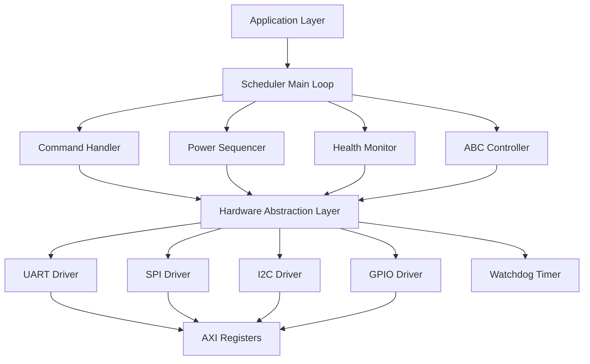
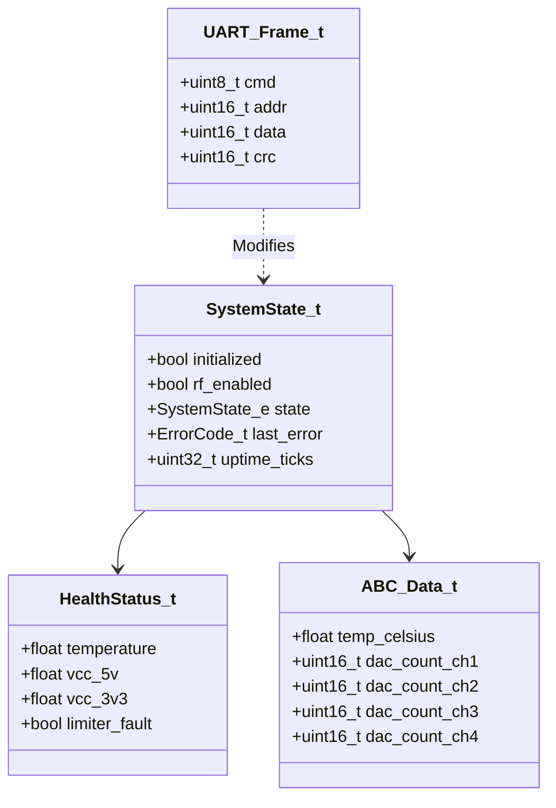
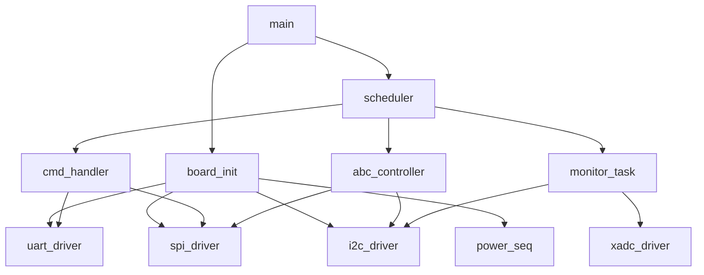
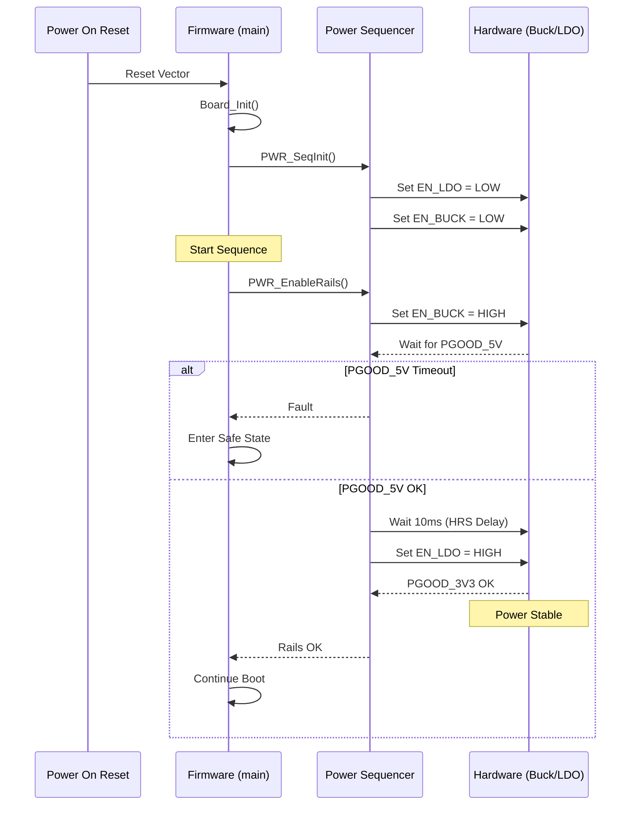
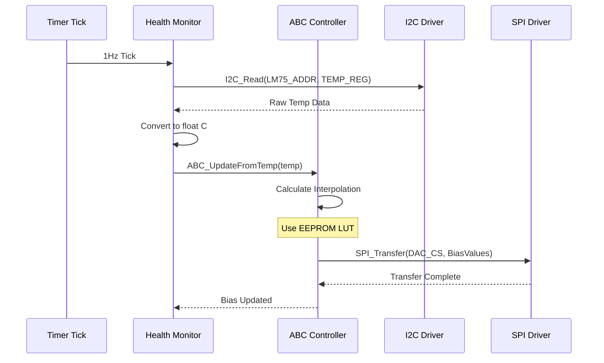
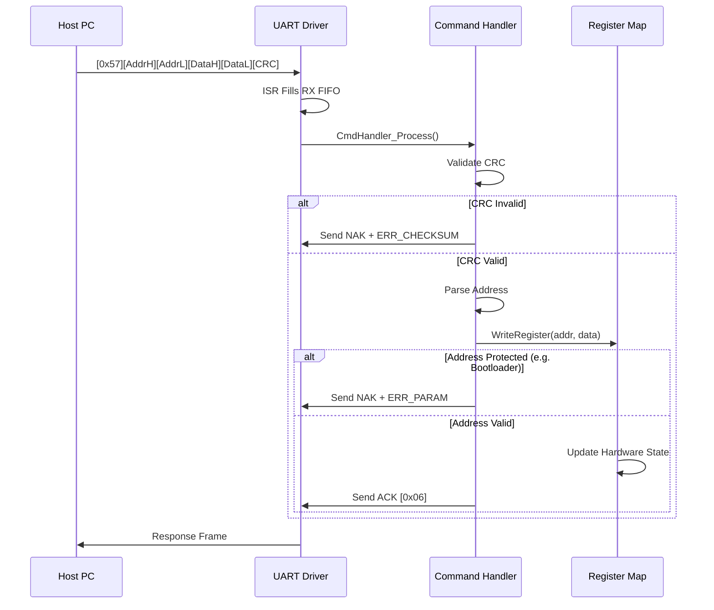
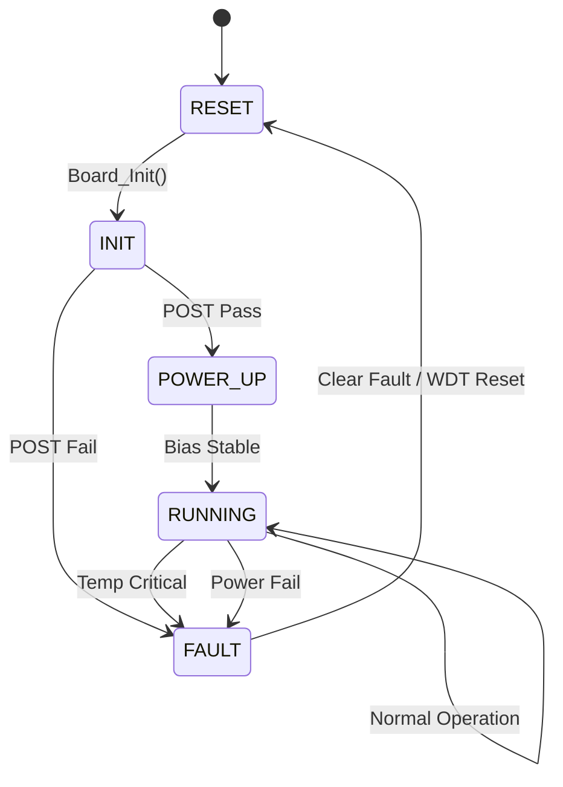
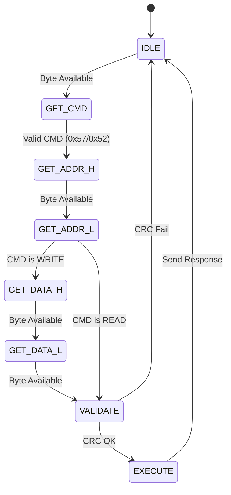

# Software Design Document (SDD)

**Project:** hfuf (4-Channel 2-6 GHz Radar RF Front-End)
**Version:** 1.0
**Date:** 22 April 2026
**Author:** Senior Embedded Software Architect

---

## Document Control
| Version | Date | Author | Description |
|---------|------|--------|-------------|
| 1.0 | 22 April 2026 | Senior Architect | Initial design compliant with IEEE 1016-2009 |

---

# 1. Introduction

## 1.1 Purpose
This Software Design Document (SDD) provides the comprehensive structural architecture, behavioral description, and interface definitions for the **hfuf** embedded firmware. This software targets the Xilinx Artix-7 XC7A35T FPGA, utilizing a MicroBlaze soft-core processor to manage the 4-channel RF Front-End Module.

The intended audience includes:
- **Firmware Engineers:** Responsible for implementing the C source code and HDL glue logic.
- **Test Engineers:** Developing validation procedures based on error codes and state behavior.
- **System Integrators:** Integrating the RF module into the larger radar array via the defined UART API.

This SDD translates the functional requirements specified in the **SRS (hfuf SRS 1.0)** into concrete software modules, data structures, and algorithms, ensuring compliance with **MISRA-C:2012** and real-time constraints.

## 1.2 Scope
The software design encompasses the complete firmware image running on the FPGA.
- **Included Components:**
  - **Board Support Package (BSP):** MicroBlaze initialization, exception handling, and linker scripts.
  - **Hardware Abstraction Layer (HAL):** Drivers for UART (LiteUART or AXI-UART), SPI (AXI-SPI), I2C (AXI-I2C), and GPIO (AXI-GPIO).
  - **Application Layer:** Active Bias Control (ABC) algorithms, Power Sequencing state machines, Temperature Monitoring, and UART Command Protocol handling.
- **Target Hardware:** Xilinx Artix-7 XC7A35T-CPG238C with 36KB BRAM, 512Mb QSPI Flash.
- **Programming Language:** C99 (MISRA compliant), Assembly for startup vectors.
- **Toolchain:** Xilinx Vitis/Vivado 2023.2, GCC cross-compiler for MicroBlaze.
- **Excluded Components:**
  - Host PC GUI source code.
  - Radar signal processing algorithms (handled downstream).
  - High-speed RTL data paths (handled in VHDL/Verilog design separate from this SW design).

## 1.3 Definitions and Acronyms

| Acronym | Definition |
| :--- | :--- |
| **ABC** | Active Bias Control (Gate/Drain voltage regulation) |
| **BSP** | Board Support Package |
| **BRAM** | Block RAM (FPGA internal memory) |
| **CPLD** | Complex Programmable Logic Device |
| **DAC** | Digital-to-Analog Converter |
| **EEPROM** | Electrically Erasable Programmable Read-Only Memory (AT25040N) |
| **FIFO** | First-In-First-Out Buffer |
| **FSM** | Finite State Machine |
| **GaN** | Gallium Nitride (RF Transistor technology) |
| **GPIO** | General Purpose Input/Output |
| **HAL** | Hardware Abstraction Layer |
| **HEMT** | High-Electron-Mobility Transistor |
| **HRS** | Hardware Requirements Specification |
| **I2C** | Inter-Integrated Circuit (Serial Protocol) |
| **IPC** | Inter-Process Communication |
| **ISR** | Interrupt Service Routine |
| **JTAG** | Joint Test Action Group |
| **LDO** | Low Dropout Regulator (MIC5209) |
| **LNA** | Low Noise Amplifier |
| **MISRA** | Motor Industry Software Reliability Association |
| **NVM** | Non-Volatile Memory |
| **PCB** | Printed Circuit Board |
| **PLL** | Phase Locked Loop |
| **POST** | Power-On Self Test |
| **QSPI** | Quad Serial Peripheral Interface |
| **RTL** | Register Transfer Level |
| **SRS** | Software Requirements Specification |
| **TRP** | Transmit/Receive Pulse |
| **UART** | Universal Asynchronous Receiver/Transmitter |
| **WDT** | Watchdog Timer |
| **XADC** | Xilinx Analog-to-Digital Converter (Hard IP block) |

## 1.4 References
1. **IEEE 1016-2009:** Standard for Information Technology—Systems Design—Software Design Descriptions.
2. **hfuf SRS Rev 1.0:** Software Requirements Specification, 22 April 2026.
3. **hfuf HRS Rev 1.0:** Hardware Requirements Specification, 22 April 2026.
4. **hfuf GLR Rev 0V01:** Glue Logic Requirements, 22 April 2026.
5. **MISRA-C:2012:** Guidelines for the Use of the C Language in Critical Systems.
6. **Xilinx UG986:** Vivado Design Suite User Guide: Embedded Processor Hardware Design.
7. **LM75A Datasheet:** NXP Semiconductors.
8. **AT25040N Datasheet:** Atmel EEPROM.
9. **S25FL512S Datasheet:** Infineon/Cypress Flash.

---

# 2. Design Viewpoints

## 2.1 Context Viewpoint — System Boundaries

The hfuf firmware operates within the Artix-7 FPGA, acting as the bridge between the Host PC (via UART) and the analog RF hardware. It manages power sequencing, environmental safety, and configuration storage.

```mermaid
graph TD
    HOST[Host PC / Radar Controller] -->|UART Commands 3.0 Mbps| FW[hfuf Firmware]
    FW -->|AXI-Lite| FPGA_REGS[Control Registers]
    
    FW -->|SPI (25 MHz)| EEPROM[AT25040 EEPROM]
    FW -->|QSPI (100 MHz)| FLASH[S25FL512 Config Flash]
    
    FW -->|I2C (100 kHz)| TEMP[LM75A Temp Sensor]
    FW -->|XADC (Internal)| VOLT[Internal Voltage Monitor]
    
    FW -->|GPIO| PWR[Power Sequencer]
    FW -->|SPI (18-bit)| ABC[DAC Bias Control]
    
    subgraph FPGA_Fabric
        FW
        FPGA_REGS
    end
    
    subgraph RF_FrontEnd
        ABC
        PWR
        TEMP
    end
```

**External Interfaces:**
1.  **Host Interface:** Asynchronous Serial (UART) @ 3.0 Mbps, 8-N-1.
2.  **Configuration Interface:** SPI EEPROM for calibration data lookup tables.
3.  **Sensor Interface:** I2C LM75A for local temperature monitoring.
4.  **Control Interface:** GPIO pins for enabling TPS62136 Buck and MIC5209 LDO.

## 2.2 Composition Viewpoint — Software Architecture

The software is architected as a layered stack. The Application Layer handles state machines and business logic, strictly decoupled from the hardware via the HAL.



### Module List with Responsibilities

#### **Module: board_init** (board_init.c / board_init.h)
**Responsibilities:**
System entry point `main()`. Configures the MicroBlaze cache, exceptions, and interrupt controller. Initializes all peripherals in the correct dependency order (Clocks -> GPIO -> Power -> Comms). Performs POST (Power-On Self Test).

**Public API:**
```c
/**
 * @brief Initialize the hardware board.
 * @return ERR_OK on success, error code on failure.
 * @pre None
 * @post All peripherals are in a known safe state.
 */
int32_t Board_Init(void);

/**
 * @brief Retrieve board identification and version info.
 * @param info Pointer to struct to populate.
 * @return ERR_OK or ERR_PARAM.
 */
int32_t Board_GetInfo(BoardInfo_t *info);

/**
 * @brief Execute Power-On Self Test (POST).
 * @param test_mask Bitmask of tests to run.
 * @return ERR_OK if all requested tests pass.
 */
int32_t Board_RunPOST(uint32_t test_mask);
```

**Internal State:**
```c
typedef struct {
    uint16_t board_id;
    uint8_t  hw_revision;
    uint32_t serial_number;
    char     part_number[16];
} BoardInfo_t;
```

#### **Module: uart_driver** (uart_driver.c / uart_driver.h)
**Responsibilities:**
Manages the AXI-UART 16550 compatible IP. Handles interrupt-driven RX/TX. Implements the framing protocol defined in SRS Section 3.1.1.1 (Read/Write commands).

**Public API:**
```c
int32_t UART_Init(uint32_t baud_rate);
int32_t UART_Deinit(void);
int32_t UART_ReadByte(uint8_t *byte, uint32_t timeout_ms);
int32_t UART_WriteByte(uint8_t byte);
void    UART_FlushRX(void);
void    UART_FlushTX(void);
void    UART_ISR_Handler(void); /* Interrupt Handler */
```

**Internal State:**
```c
typedef struct {
    uint8_t rx_fifo[256];
    volatile uint16_t rx_head;
    volatile uint16_t rx_tail;
    volatile uint32_t rx_count;
    uint32_t baudrate;
    bool     is_initialized;
} UART_Context_t;
```

#### **Module: spi_driver** (spi_driver.c / spi_driver.h)
**Responsibilities:**
Abstracts the AXI-SPI Engine (or Xilinx SPI controller). Provides blocking and non-blocking transfer functions. Manages Chip Select (CS) lines for EEPROM vs. Flash.

**Public API:**
```c
int32_t SPI_Init(void);
int32_t SPI_Transfer(uint8_t cs_id, const uint8_t *tx_data, uint8_t *rx_data, uint32_t length);
int32_t SPI_WriteReg(uint8_t cs_id, uint8_t reg, uint8_t value);
int32_t SPI_ReadReg(uint8_t cs_id, uint8_t reg, uint8_t *value);
```

#### **Module: i2c_driver** (i2c_driver.c / i2c_driver.h)
**Responsibilities:**
Interface for the AXI-I2C controller. Handles standard mode (100kHz) timing. Manages the LM75A temperature sensor specific read sequences.

**Public API:**
```c
int32_t I2C_Init(uint32_t speed_hz);
int32_t I2C_Write(uint8_t dev_addr, uint8_t reg_addr, uint8_t *data, uint16_t len);
int32_t I2C_Read(uint8_t dev_addr, uint8_t reg_addr, uint8_t *data, uint16_t len);
```

#### **Module: abc_controller** (abc_controller.c / abc_controller.h)
**Responsibilities:**
Implements the Active Bias Control logic. Reads temperature from I2C, interpolates LUT values from EEPROM, and writes bias voltages via the SPI DAC. Ensures "Gate-before-Drain" sequencing.

**Public API:**
```c
int32_t ABC_Init(void);
int32_t ABC_SetChannelBias(uint8_t channel_idx, float v_drain_target, float v_gate_target);
int32_t ABC_UpdateFromTemp(float current_temp);
void    ABC_Shutdown(void);
```

**Internal State:**
```c
typedef struct {
    float v_drain_actual;
    float v_gate_actual;
    bool  enabled;
} ABC_ChannelState_t;
```

#### **Module: power_seq** (power_seq.c / power_seq.h)
**Responsibilities:**
Manages the GPIO control lines `EN_BUCK` and `EN_LDO` to meet the TPS62136 and MIC5209 sequencing requirements. Monitors the `PGOOD` signals.

**Public API:**
```c
int32_t PWR_SeqInit(void);
int32_t PWR_EnableRails(void);
void    PWR_DisableRails(void);
bool    PWR_IsGood(void);
```

## 2.3 Logical Viewpoint — Data Model

The data model defines the critical information exchanged between modules.



**Key Data Structures:**

```c
typedef enum {
    SYS_STATE_RESET = 0,
    SYS_STATE_INIT,
    SYS_STATE_POWER_UP,
    SYS_STATE_CALIBRATING,
    SYS_STATE_RUNNING,
    SYS_STATE_FAULT,
    SYS_STATE_SHUTDOWN
} SystemState_e;

typedef enum {
    ERR_OK = 0x00,
    ERR_TIMEOUT = 0x01,
    ERR_COMM = 0x02,
    ERR_CHECKSUM = 0x03,
    ERR_PARAM = 0x04,
    ERR_HARDWARE = 0x07,
    ERR_TEMP_CRITICAL = 0x0E,
    ERR_POWER_FAIL = 0x0F,
    ERR_POST_FAIL = 0x10
} ErrorCode_t;

typedef struct {
    float temp_local;      // Degrees C
    float v_drain_5v;      // Volts
    float v_logic_3v3;     // Volts
    uint8_t fault_flags;   // Bitmask of fault sources
} HealthStatus_t;
```

## 2.4 Dependency Viewpoint — Module Dependencies



**Build Order:**
1.  **Drivers:** `uart`, `spi`, `i2c`, `gpio`, `xadc`
2.  **Services:** `crc`, `ringbuf`
3.  **Logic:** `power_seq`, `abc_controller`
4.  **Application:** `cmd_handler`, `monitor_task`, `main`

## 2.5 Interface Viewpoint — Complete API Specification

### 2.5.1 UART Protocol Specification

**Frame Format (Host to Firmware):**
`[CMD][ADDR_H][ADDR_L][DATA_H][DATA_L][CRC_H][CRC_L]`
- **CMD:** 0x57 (Write), 0x52 (Read)
- **ADDR:** 16-bit Register Address
- **DATA:** 16-bit Data Payload (Write only)
- **CRC:** CRC-16-CCITT (Polynomial 0x1021)

**Response Format (Firmware to Host):**
- **Write ACK:** `[0x06][CRC_L][CRC_H]`
- **Write NAK:** `[0x15][ERR_CODE][CRC_H]`
- **Read Response:** `[DATA_H][DATA_L][CRC_H][CRC_L]`

### 2.5.2 Example Function Documentation

```c
/**
 * @brief Write data to a specific FPGA register via UART command.
 * 
 * Implements SRS requirement 3.1.1.1 regarding UART communication.
 * Validates address range and performs CRC check before hardware write.
 *
 * @param addr 16-bit register address (0x0000 - 0xFFFF).
 * @param data 16-bit data to write.
 * @return int32_t ERR_OK (0) on success.
 *                 ERR_PARAM (4) if address is invalid.
 *                 ERR_HARDWARE (7) if UART transmission fails.
 *
 * @pre UART_Init() must have been called successfully.
 * @post Register at 'addr' contains 'data'.
 * 
 * @code
 *   uint16_t val = 0x1234;
 *   if (UART_WriteReg(0x0100, val) == ERR_OK) {
 *       // Success
 *   }
 * @endcode
 */
int32_t UART_WriteReg(uint16_t addr, uint16_t data);
```

## 2.6 Interaction Viewpoint — Sequence Diagrams

### 2.6.1 Power-Up Sequence
Ensures safe voltage ramp-up for GaN LNAs (REQ-SW-003, REQ-SW-004).



### 2.6.2 Active Bias Control Update
Updating Gate/Drain voltages based on temperature drift.



### 2.6.3 Host Write Command
Processing a register write command from the host.



## 2.7 State Viewpoint — State Machines

### 2.7.1 System State Machine



### 2.7.2 Command Handler State Machine



## 2.8 Algorithm Viewpoint — Key Algorithms

### 2.8.1 Temperature Linear Interpolation for Bias
To maintain constant gain over temperature, the DAC code must be adjusted.

**Inputs:**
- `T_meas`: Measured temperature (float, °C)
- `LUT[]`: Array of `{temp, dac_code}` pairs from EEPROM

**Algorithm:**
1.  Scan LUT to find interval `T[i] <= T_meas <= T[i+1]`.
2.  Compute slope `m = (DAC[i+1] - DAC[i]) / (T[i+1] - T[i])`.
3.  Calculate `Code = DAC[i] + m * (T_meas - T[i])`.
4.  Clamp `Code` to 12-bit range (0-4095).

### 2.8.2 CRC-16 Calculation
Used for UART frame validation.
```c
/**
 * @brief Calculate CRC-16-CCITT (False initial value).
 * @param data Pointer to data buffer.
 * @param len Length of data.
 * @return Calculated CRC.
 */
uint16_t CRC16_Calc(const uint8_t *data, uint32_t len) {
    uint16_t crc = 0xFFFF; // Initial value
    while (len--) {
        uint8_t x = crc >> 8 ^ *data++;
        x ^= x >> 4;
        crc = (crc << 8) ^ (x << 12) ^ (x << 5) ^ x;
    }
    return crc;
}
```

---

# 3. Design Rationale

## 3.1 Architecture Choices

### 3.1.1 Bare-Metal vs. RTOS
**Decision:** Implement Bare-Metal Super Loop.
**Rationale:**
- The application is primarily interrupt-driven (UART RX, Timer).
- Task complexity is low (polling sensors, updating DAC).
- **Trade-off:** Harder to guarantee strict hard-real-time determinism compared to an RTOS, but significantly lower memory footprint (RAM is limited to 36KB BRAM) and context-switch overhead.

### 3.1.2 SPI for Bias Control
**Decision:** Use SPI rather than I2C/GPIO for DAC bias control.
**Rationale:**
- Speed: SPI operates at MHz frequencies vs kHz for I2C, allowing rapid bias adjustment during pulsed radar modes (TRP).
- Synchronization: SPI provides a dedicated clock edge for precise latching of analog outputs.

### 3.1.3 EEPROM Lookup Tables
**Decision:** Store calibration curves in EEPROM rather than hardcoding.
**Rationale:**
- Unit-to-unit variation in GaN HEMTs requires individual calibration.
- EEPROM (AT25040N) allows field updates without re-flashing the FPGA bitstream.

## 3.2 MISRA-C:2012 Compliance
All code adheres to MISRA-C:2012 mandatory rules.
- **MISRA Rule 21.1 (malloc):** `malloc`, `free`, `realloc` are prohibited. All data structures are statically allocated or stack-based.
- **MISRA Rule 13.5 (Loops):** All loops have a fixed bound or a verifiable exit condition to prevent infinite loops.
- **MISRA Rule 12.1 (Overflow):** All arithmetic operations on signed integers are checked for overflow before execution.

---

# 4. Design Traceability Matrix

| SDD Component / Module | Implements SRS REQ | Design Element |
| :--- | :--- | :--- |
| **board_init.c** | REQ-SW-001 (Initialization) | `Board_Init()` |
| **power_seq.c** | REQ-SW-003, REQ-SW-004 (Power Sequencing) | `PWR_EnableRails()` FSM |
| **abc_controller.c** | REQ-SW-005 (Bias Control) | `ABC_SetChannelBias()` |
| **uart_driver.c** | REQ-SW-010 (UART Protocol) | `UART_WriteReg()`, `UART_ReadReg()` |
| **i2c_driver.c** | REQ-SW-020 (Temp Monitor) | `I2C_Read(LM75_ADDR)` |
| **monitor_task.c** | REQ-SW-021 (Health Monitor) | `Mon_Task()` loop |
| **spi_driver.c** | REQ-SW-030 (Flash Access) | `Flash_WritePage()` |
| **xadc_driver.c** | REQ-SW-025 (Voltage Monitor) | `XADC_GetVccInt()` |

---

# 5. Appendices

## Appendix A — File Structure
```text
project_root/
├── src/
│   ├── main.c                  # Entry point
│   ├── board/
│   │   ├── board_init.c
│   │   └── board_config.h      # Address definitions
│   ├── drivers/
│   │   ├── uart_driver.c
│   │   ├── spi_driver.c
│   │   ├── i2c_driver.c
│   │   └── xadc_driver.c
│   ├── application/
│   │   ├── abc_controller.c
│   │   ├── power_seq.c
│   │   ├── cmd_handler.c
│   │   └── monitor_task.c
│   └── utils/
│       ├── crc16.c
│       └── ring_buffer.c
├── tests/
│   └── unit/                   # Google Test mocks
└── docs/
    └── SDD_hfuf.pdf
```

## Appendix B — Register Map Summary (FPGA Firmware Registers)

**Base Address:** 0x4000_0000 (AXI-Lite Interface)

| Offset | Name | Access | Reset | Description |
| :--- | :--- | :--- | :--- | :--- |
| 0x00 | **REG_MAGIC** | RO | 0xA5A5 | Magic Number for verification |
| 0x04 | **REG_FW_VER** | RO | 0x0100 | Firmware Version (Major.Minor) |
| 0x08 | **REG_CTRL** | RW | 0x00 | Control Register (Bit 0: RF Enable) |
| 0x0C | **REG_STATUS** | RO | 0x00 | Status Register (Bit 0: PGOOD) |
| 0x10 | **REG_DAC_CH0** | RW | 0x0000 | Bias DAC Channel 0 Value |
| 0x12 | **REG_DAC_CH1** | RW | 0x0000 | Bias DAC Channel 1 Value |
| 0x14 | **REG_DAC_CH2** | RW | 0x0000 | Bias DAC Channel 2 Value |
| 0x16 | **REG_DAC_CH3** | RW | 0x0000 | Bias DAC Channel 3 Value |
| 0x20 | **REG_TEMP** | RO | 0x0000 | Last read LM75A Temperature (Raw) |
| 0x24 | **REG_VCC_5V** | RO | 0x0000 | XADC VCC 5V Rail (Raw) |
| 0x28 | **REG_VCC_3V3**| RO | 0x0000 | XADC VCC 3V3 Rail (Raw) |

---

## 2.9 Resource Viewpoint — Real-Time Constraints

### 2.9.1 Task Scheduling Table

| Task Name | Trigger | Period | Priority | Deadline | CPU Load (est) |
| :--- | :--- | :--- | :--- | :--- | :--- |
| **Main Loop** | Continuous | - | Medium | 10ms | 5% |
| **UART ISR** | HW Event | Async | High | < 10us | 2% |
| **Timer Tick** | HW Timer | 1ms | High | 1ms | 1% |
| **Health Mon** | Timer | 1000ms | Low | 1000ms | 4% |
| **ABC Update** | Timer | 100ms | Medium | 100ms | 6% |
| **Command Proc** | Data Avail | Event | Medium | 5ms | 8% |

**Total Estimated Load:** ~26% (Idle capacity available for future features).

### 2.9.2 Memory Budget (MicroBlaze)

| Region | Size (Bytes) | Used | Free | Usage |
| :--- | :--- | :--- | :--- | :--- |
| **DDR (None)** | 0 | 0 | 0 | N/A |
| **BRAM (Code)** | 32 KB | 28 KB | 4 KB | 87% |
| **BRAM (Data)** | 4 KB | 2 KB | 2 KB | 50% |
| **Stack** | 2 KB | 0.5 KB | 1.5 KB | 25% |

*Note: Design strictly adheres to static allocation to avoid heap fragmentation.*

### 2.9.3 ISR Latency Budget

| Interrupt Source | Max Latency | Reaction Time | Notes |
| :--- | :--- | :--- | :--- |
| **UART RX** | 5us | Immediate | 4-byte HW FIFO provides buffer |
| **Timer (1ms)** | 10us | Tick | Drives scheduler |
| **I2C Event** | 50us | Next Poll | Not ISR driven (Polled) |

---

## 2.10 Build System Viewpoint

### 2.10.1 CMakeLists.txt Structure

```cmake
cmake_minimum_required(VERSION 3.20)
project(hfuf_firmware C ASM)

set(CMAKE_C_STANDARD 11)
set(CMAKE_SYSTEM_NAME Generic)

# Toolchain Setup for MicroBlaze
set(CMAKE_C_COMPILER mb-gcc)
set(CMAKE_OBJCOPY mb-objcopy)

# Source Files
set(SOURCES
    src/main.c
    src/board/board_init.c
    src/drivers/uart_driver.c
    src/drivers/spi_driver.c
    src/drivers/i2c_driver.c
    src/application/abc_controller.c
    src/application/power_seq.c
    src/utils/crc16.c
)

add_executable(hfuf_firmware.elf ${SOURCES})

# Linker Script
target_link_options(hfuf_firmware.elf PRIVATE -T ${CMAKE_SOURCE_DIR}/src/linker_script.ld)

# Build Flash Image (MCS/BIN)
add_custom_command(TARGET hfuf_firmware.elf POST_BUILD
    COMMAND mb-objcopy -O binary hfuf_firmware.elf hfuf_firmware.bin
    COMMAND ${CMAKE_SOURCE_DIR}/tools/bin2mcs.py hfuf_firmware.bin
)

# Unit Tests (Host based)
enable_testing()
add_subdirectory(tests)
```

### 2.10.2 Test Infrastructure

The `tests/` folder uses **Google Test (GTest)** with hardware mocks.
- **Mock:** `MockHAL` overrides `SPI_Transfer`, `I2C_Read` to return simulated hardware values.
- **Coverage:** Gcov is used to ensure >80% code coverage.
- **CI:** GitHub Actions workflow runs `cmake --build . && ctest` on every commit.