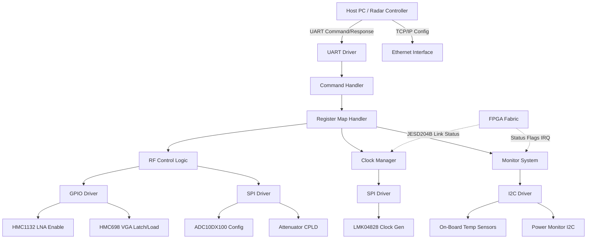
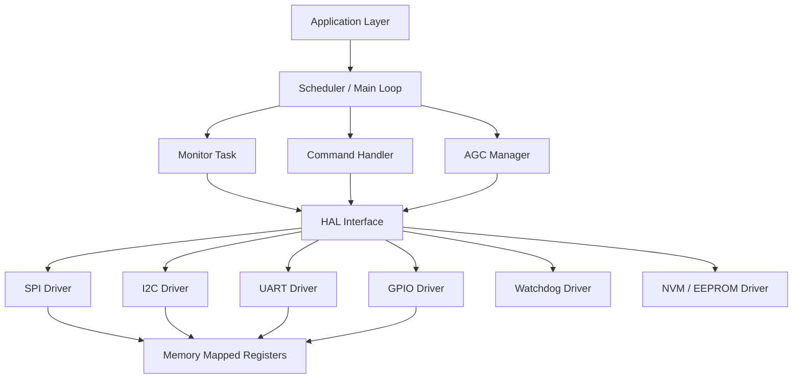
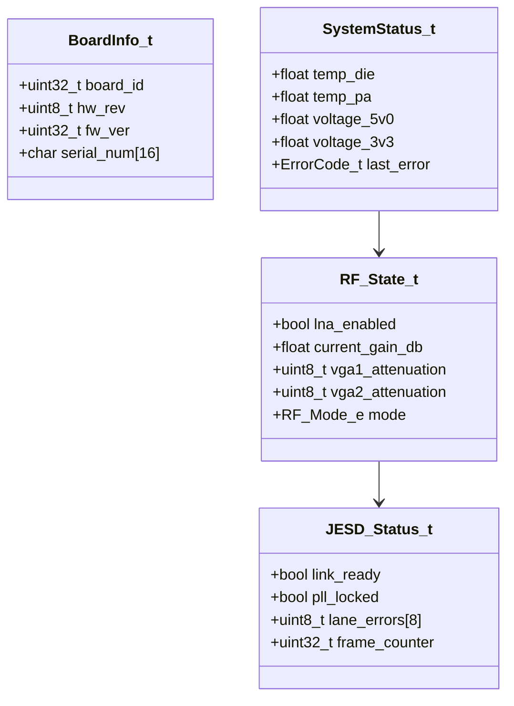
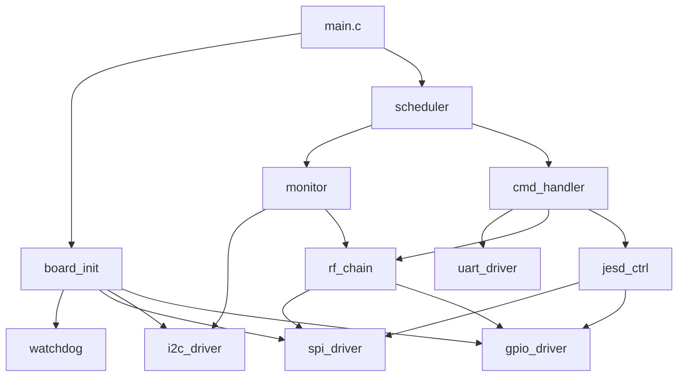
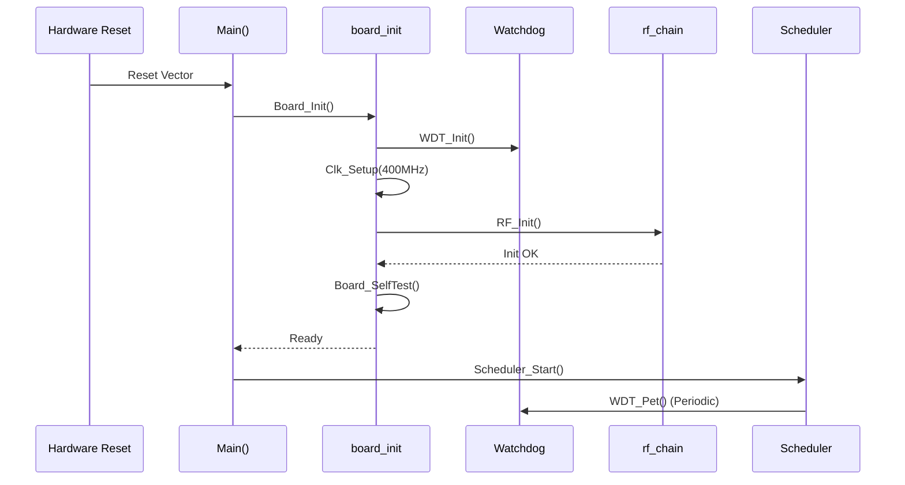
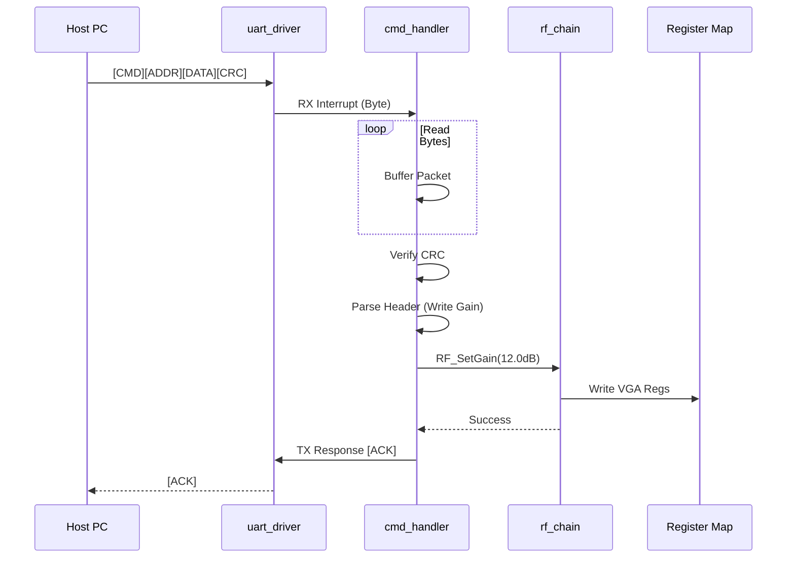
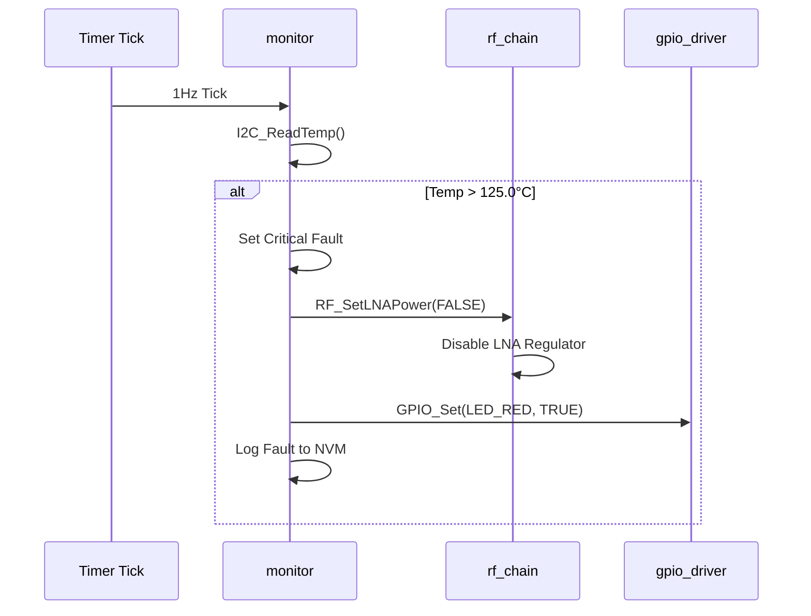
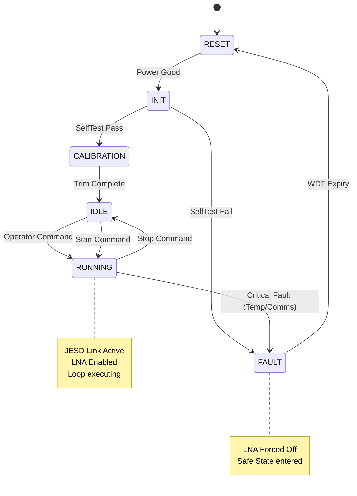
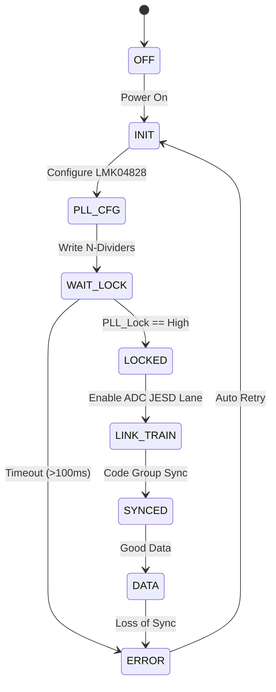

# Software Design Document (SDD)

**Project:** hgyu Ultra-Wideband RF Receiver System  
**Document Version:** 1.0  
**Date:** 15 April 2026  
**Author:** Lead Embedded Firmware Architect

---

## Document Control
| Version | Date | Author | Description |
|---------|------|--------|-------------|
| 1.0 | 15 April 2026 | System Architecture Team | Initial Design Release for hgyu Firmware |

---

# 1. Introduction

## 1.1 Purpose
The purpose of this Software Design Document (SDD) is to provide a comprehensive, implementation-level description of the **hgyu Embedded Control Software**. This document defines the software architecture, data structures, algorithms, and interfaces required to control the hgyu RF Receiver hardware. It serves as the single source of truth for firmware engineers implementing the code and acts as the bridge between the *hgyu SRS* (Requirements) and the source code implementation.

## 1.2 Scope
The design encompasses the firmware running on the embedded processing unit within the Host FPGA (e.g., Xilinx MicroBlaze or ARM Cortex-R52). This includes:
1.  **Board Support Package (BSP):** Hardware initialization, interrupt vector table setup, and memory mapping.
2.  **Hardware Abstraction Layer (HAL):** Low-level drivers for SPI, I2C, UART, and GPIO peripherals.
3.  **Application Layer:** RF Chain control (LNA/VGA), AGC algorithms, Temperature monitoring, and Fault handling.
4.  **Communication:** UART-based binary protocol for Host PC interaction.

**Out of Scope:** DSP algorithms implemented in FPGA fabric (RTL), mechanical control firmware, and host-side GUI logic.

## 1.3 Definitions, Acronyms, and Abbreviations

| Acronym | Definition |
| :--- | :--- |
| **ADC** | Analog-to-Digital Converter (TI ADC10DX100). |
| **AGC** | Automatic Gain Control. |
| **API** | Application Programming Interface. |
| **BRAM** | Block Random Access Memory (FPGA internal memory). |
| **BSP** | Board Support Package. |
| **CF** | Center Frequency. |
| **CPLD** | Complex Programmable Logic Device (Controller for HMC698). |
| **CRC** | Cyclic Redundancy Check. |
| **DMA** | Direct Memory Access. |
| **DSP** | Digital Signal Processing. |
| **EEPROM** | Electrically Erasable Programmable Read-Only Memory. |
| **FIFO** | First-In, First-Out buffer. |
| **FMC** | FPGA Mezzanine Card (VITA 57.1). |
| **FPGA** | Field-Programmable Gate Array. |
| **FSM** | Finite State Machine. |
| **GLR** | Glue Logic Requirements (FPGA Register Map). |
| **GPIO** | General Purpose Input/Output. |
| **HAL** | Hardware Abstraction Layer. |
| **HRS** | Hardware Requirements Specification. |
| **I2C** | Inter-Integrated Circuit (Serial Protocol). |
| **ISR** | Interrupt Service Routine. |
| **JESD204B** | JEDEC Standard high-speed data converter interface. |
| **LNA** | Low Noise Amplifier (HMC1132). |
| **LVDS** | Low-Voltage Differential Signaling. |
| **MCU** | Microcontroller Unit (Embedded FPGA Core). |
| **MISRA** | Motor Industry Software Reliability Association (C Coding Standard). |
| **NVM** | Non-Volatile Memory. |
| **PCB** | Printed Circuit Board. |
| **PLL** | Phase-Locked Loop (LMK04828). |
| **POST** | Power-On Self-Test. |
| **RF** | Radio Frequency. |
| **RTL** | Register Transfer Level. |
| **Rx** | Receive. |
| **SRS** | Software Requirements Specification. |
| **StRS** | Stakeholder Requirements Specification. |
| **SPI** | Serial Peripheral Interface. |
| **SyRS** | System Requirements Specification. |
| **TEMP** | Temperature. |
| **TPS** | Texas Instruments Power Management (TPS7A4700). |
| **UART** | Universal Asynchronous Receiver/Transmitter. |
| **VGA** | Variable Gain Amplifier / Attenuator (HMC698). |
| **WDT** | Watchdog Timer. |

## 1.4 References
1.  **IEEE 1016-2009:** Standard for Information Technology — Systems Design — Software Design Descriptions.
2.  **hgyu SRS v1.0 (15 Apr 2026):** Software Requirements Specification.
3.  **hgyu HRS v1.0 (15 Apr 2026):** Hardware Requirements Specification.
4.  **hgyu GLR v0V01 (15 Apr 2026):** Glue Logic Requirements (FPGA Register Map).
5.  **MISRA-C:2012:** Guidelines for the Use of the C Language in Critical Systems.
6.  **JESD204B.01:** JEDEC Standard for Serial Interfaces for Data Converters.
7.  **HMC1132 / HMC698 Datasheets:** Analog Devices.
8.  **ADC10DX100 / LMK04828 Datasheets:** Texas Instruments.

---

# 2. Design Viewpoints

## 2.1 Context Viewpoint — System Boundaries

The hgyu firmware operates as the control plane mediator between the Host PC (operator) and the RF Hardware. It manages slow-speed control peripherals while the FPGA fabric handles the high-speed data path.



**External Interfaces:**
*   **Host PC:** Connects via UART (115200 baud) or Ethernet (Optional).
*   **RF Hardware:** Controlled via SPI and GPIO.
*   **FPGA Fabric:** Memory-mapped registers for status and link configuration.

## 2.2 Composition Viewpoint — Software Architecture

The software is organized into a strict layered architecture to ensure modularity and testability.



### Module List with Responsibilities

**Module: board_init** (board_init.c / board_init.h)
*   **Responsibility:** Handles power-on reset, configures the system clocks (PLL), initializes the interrupt controller, and sets up the BSS segments. Executes POST.
*   **API:**
    ```c
    int32_t Board_Init(void);
    int32_t Board_GetInfo(BoardInfo_t *info);
    int32_t Board_SelfTest(uint32_t *error_mask);
    ```

**Module: uart_driver** (uart_driver.c / uart_driver.h)
*   **Responsibility:** Manages the UART peripheral for binary command/response communication. Implements interrupt-driven RX/TX with circular buffers.
*   **API:**
    ```c
    int32_t UART_Init(uint32_t baud_rate);
    int32_t UART_Read(uint8_t *data, uint32_t len);
    int32_t UART_Write(const uint8_t *data, uint32_t len);
    void    UART_ISR_Handler(void); // Defined in startup code
    ```

**Module: spi_driver** (spi_driver.c / uart_driver.h)
*   **Responsibility:** Provides SPI master functionality for configuring the ADC, LMK PLL, and Attenuator CPLD. Supports multi-byte transfers and Chip Select control.
*   **API:**
    ```c
    int32_t SPI_Init(uint32_t clock_hz);
    int32_t SPI_Transfer(SPI_Device_e dev, const uint8_t *tx, uint8_t *rx, uint16_t len);
    int32_t SPI_WriteReg(SPI_Device_e dev, uint16_t reg_addr, uint8_t val);
    int32_t SPI_ReadReg(SPI_Device_e dev, uint16_t reg_addr, uint8_t *val);
    ```

**Module: i2c_driver** (i2c_driver.c / i2c_driver.h)
*   **Responsibility:** Manages I2C communication for on-board sensors (Temperature, Power Monitors).
*   **API:**
    ```c
    int32_t I2C_Init(uint32_t clock_hz);
    int32_t I2C_Write(uint8_t addr, const uint8_t *data, uint16_t len);
    int32_t I2C_Read(uint8_t addr, uint8_t *buf, uint16_t len);
    ```

**Module: rf_chain** (rf_chain.c / rf_chain.h)
*   **Responsibility:** High-level control of the RF path. Manages LNA enable and calculates attenuation values for the HMC698 VGAs.
*   **API:**
    ```c
    int32_t RF_Init(void);
    int32_t RF_SetGain(float target_gain_db);
    int32_t RF_SetLNAPower(bool enable);
    int32_t RF_GetCurrentGain(float *current_gain);
    ```

**Module: jesd_ctrl** (jesd_ctrl.c / jesd_ctrl.h)
*   **Responsibility:** Manages the JESD204B link state machine. Resets the link, monitors SYNC~ signals, and configures the LMK04828 clock generator.
*   **API:**
    ```c
    int32_t JESD_Init(void);
    int32_t JESD_StartLink(void);
    int32_t JESD_StopLink(void);
    JESD_LinkState_e JESD_GetStatus(void);
    ```

**Module: monitor** (monitor.c / monitor.h)
*   **Responsibility:** Periodic task (1Hz) to read temperature sensors and power rails. Implements hardware interlocks (shutdown if T > 125°C).
*   **API:**
    ```c
    int32_t Mon_Init(void);
    void    Mon_Task(void); // Called every 1ms
    bool    Mon_IsFaultActive(void);
    ```

**Module: cmd_handler** (cmd_handler.c / cmd_handler.h)
*   **Responsibility:** Parses incoming binary UART packets, validates CRC, and dispatches commands to Register Map or control functions.
*   **API:**
    ```c
    void    CMD_Init(void);
    void    CMD_Process(void); // Main loop polling
    void    CMD_HandlePacket(uint8_t *pkt, uint16_t len);
    ```

## 2.3 Logical Viewpoint — Data Model



### Key Data Structures

```c
/* System Status Register Map */
typedef struct {
    uint32_t magic_number;      /* 0xDEADBEEF */
    uint32_t uptime_seconds;
    int32_t  temperature_mc;    /* Millidegrees Celsius */
    uint16_t vga_attenuation;   /* Combined 0.5dB steps */
    uint16_t fault_mask;        /* Bitmask of active faults */
    uint32_t jesd_status;       /* Link status flags */
} SystemState_t;

/* JESD204B Link Status */
typedef enum {
    JESD_STATE_OFF = 0,
    JESD_STATE_INIT,
    JESD_STATE_TRAINING,
    JESD_STATE_SYNCED,
    JESD_STATE_ERROR
} JESD_LinkState_e;

/* Error Codes */
typedef enum {
    ERR_OK = 0x00,
    ERR_TIMEOUT = 0x01,
    ERR_SPI_COMM = 0x02,
    ERR_I2C_COMM = 0x03,
    ERR_PARAM = 0x04,
   _ERR_CRC_FAIL = 0x05,
    ERR_OVERTEMP = 0x06,
    ERR_PLL_UNLOCK = 0x07,
    ERR_JESD_SYNC = 0x08
} ErrorCode_t;
```

## 2.4 Dependency Viewpoint — Module Dependencies



**Build Order:**
1.  **Hardware Abstraction:** Watchdog, GPIO, SPI, I2C, UART.
2.  **Board Support:** Board Init.
3.  **Driver Services:** RF Chain, JESD Control.
4.  **Application:** Monitor, Command Handler, Main Loop.

## 2.5 Interface Viewpoint — Complete API Specification

### Function: RF_SetGain

```c
/**
 * @brief Sets the total RF chain gain.
 * 
 * Calculates the required attenuation for the dual HMC698 devices
 * based on the fixed LNA gain (~23dB) and the target value.
 * The function bounds the input to the physically achievable range
 * (approx -10dB to +20dB system gain).
 *
 * @param target_gain_db Desired system gain in dB.
 * @return int32_t ERR_OK on success, ERR_PARAM if target is out of bounds.
 *
 * @pre LNA must be initialized.
 * @post Attenuator registers updated; physical settling time ~5us required.
 *
 * @example
 *   // Set system gain to 5dB
 *   RF_SetGain(5.0f);
 */
int32_t RF_SetGain(float target_gain_db);
```

### Function: JESD_Init

```c
/**
 * @brief Initializes the JESD204B link and Clock Generator.
 *
 * Configures the LMK04828 PLL for the desired sample rate (e.g., 10 GSPS)
 * and powers up the ADC10DX100. Does not start data acquisition.
 *
 * @param sample_rate_hz Target sampling frequency (e.g., 10000000000).
 * @return int32_t ERR_OK on success, ERR_SPI_COMM if write fails.
 *
 * @pre SPI driver initialized.
 * @post PLL is powered up but not yet locked.
 */
int32_t JESD_Init(uint32_t sample_rate_hz);
```

### Function: Board_SelfTest

```c
/**
 * @brief Executes Power-On Self-Test (POST).
 *
 * Verifies SPI communication with ADC/Clock, I2C communication with sensors,
 * and external Flash integrity.
 *
 * @param error_mask Pointer to uint32_t where fault bits will be stored.
 * @return int32_t ERR_OK if all tests pass, error code otherwise.
 *
 * @note Takes approx 500ms to complete.
 */
int32_t Board_SelfTest(uint32_t *error_mask);
```

## 2.6 Interaction Viewpoint — Sequence Diagrams

### System Startup Sequence



### UART Command Processing (AGC Set)



### Over-Temperature Shutdown



## 2.7 State Viewpoint — State Machines

### System Master State Machine



### JESD204B Link State Machine



## 2.8 Algorithm Viewpoint

### 2.8.1 Attenuation Calculation (Gain Control)

**Requirement:** Map a desired system gain (-10dB to +20dB) to HMC688 6-bit attenuation words (parallel interface).
**Assumptions:**
*   LNA Gain: Fixed +23dB.
*   VGA Range: 0 to 31.5dB (in 0.5dB steps).
*   Insertion Loss: 2dB.

**Algorithm:**
```c
int32_t RF_SetGain(float target_db) {
    const float LNA_GAIN = 23.0f;
    const float LOSS = 2.0f;
    const float MAX_VGA_ATT = 31.5f;
    
    // Calculate necessary attenuation
    // Total Gain = LNA - Attenuation - Loss
    // Required Attenuation = LNA - Loss - Target
    float req_att = LNA_GAIN - LOSS - target_db;
    
    if (req_att < 0.0f) req_att = 0.0f; // Clamp if target gain is high
    if (req_att > MAX_VGA_ATT) req_att = MAX_VGA_ATT;
    
    // Convert to 6-bit integer (0.5dB steps)
    // 0.0dB = 0x00, 31.5dB = 0x3F (0b111111)
    uint8_t att_code = (uint8_t)(req_att * 2.0f);
    
    // Drive CPLD / GPIO pins
    GPIO_WritePort(VGA_DATA_PORT, att_code);
    GPIO_Pulse(VGA_LOAD_PIN);
    
    return ERR_OK;
}
```

### 2.8.2 SPI Frame Transfer (LMK04828)

The LMK04828 requires a specific 24-bit instruction format for writes.
*   **Byte 1:** Register Address MSB
*   **Byte 2:** Register Address LSB
*   **Byte 3:** Data Byte

**Algorithm:**
```c
void SPI_WriteLMK(uint16_t addr, uint8_t data) {
    uint8_t tx_buf[3];
    tx_buf[0] = (addr >> 8) & 0xFF;
    tx_buf[1] = addr & 0xFF;
    tx_buf[2] = data;
    
    // Assert Chip Select
    GPIO_SetLow(LMK_CS_PIN);
    
    // Transfer 3 bytes
    SPI_Transfer(LMK_DEV, tx_buf, NULL, 3);
    
    // De-assert Chip Select
    GPIO_SetHigh(LMK_CS_PIN);
}
```

---

# 3. Design Rationale

## 3.1 Architecture Choices

### 3.1.1 Bare-Metal vs RTOS
**Decision:** Implemented as a bare-metal super-loop (with interrupt driven peripherals).
**Rationale:**
*   The system has predictable, periodic tasks (1ms control loop, 1s monitor loop).
*   Context switching overhead is unnecessary for a single-threaded control flow (handling UART commands).
*   Simplicity reduces MISRA compliance effort and eases verification.

### 3.1.2 Static vs Dynamic Memory
**Decision:** 100% Static memory allocation. No `malloc`/`free`.
**Rationale:**
*   MISRA-C:2012 Rule 21.1 (Dynamic memory allocation shall not be used).
*   Eliminates risk of memory leaks, heap fragmentation, and non-deterministic execution time.
*   Memory usage is fixed at compile time, allowing accurate stack sizing analysis.

### 3.1.3 Interrupt-Driven UART
**Decision:** UART RX handled via ISR filling a circular buffer.
**Rationale:**
*   The host PC may send packets at unpredictable times. Polling risks dropping bytes.
*   A circular buffer ensures the main loop can process large frames at its own pace without blocking the ISR.

## 3.2 MISRA-C:2012 Compliance Strategy
*   **Configuration:** GCC/ARM compilers configured with MISRA checking enabled.
*   **Linting:** PC-lint Plus or Coverity used as a pre-commit hook.
*   **Coding Style:**
    *   Explicit `u` or `U` suffixes on all unsigned constants.
    *   All `if/else` blocks enclosed in braces `{}`.
    *   No implicit type conversions; use explicit casts.
*   **Verification:** Unit tests (Google Test) achieve 100% statement coverage for all HAL modules.

---

# 4. Design Traceability Matrix

| SDD Component / Function | Implements SRS Requirement | Traceability ID |
| :--- | :--- | :--- |
| **board_init.c** | Board power-on initialization, POST | REQ-SW-001 |
| **spi_driver.c** | SPI Driver for ADC/Clock | REQ-SW-002 |
| **i2c_driver.c** | I2C Driver for Sensors | REQ-SW-003 |
| **uart_driver.c** | UART Communication Protocol | REQ-SW-004 |
| **rf_chain.c / RF_SetGain** | LNA/VGA Gain Control (-10 to +20dB) | REQ-SW-005 |
| **rf_chain.c** | Parallel interface to HMC698 | REQ-SW-006 |
| **jesd_ctrl.c** | JESD204B Link Init & Monitoring | REQ-SW-007 |
| **monitor.c / Mon_Task** | Temp Monitoring (-55 to +125C) | REQ-SW-008 |
| **monitor.c / Mon_Task** | Power Rail Monitoring | REQ-SW-009 |
| **watchdog.c** | Watchdog Timer (1s) | REQ-SW-010 |
| **cmd_handler.c** | Parse Binary Commands | REQ-SW-011 |
| **flash_driver.c** | NVM Config Storage | REQ-SW-012 |

---

# 5. Appendices

## Appendix A — File Structure
```
project_root/
├── cmake/
│   └── arm-none-eabi.cmake
├── src/
│   ├── main.c
│   ├── board/
│   │   ├── board_init.c
│   │   └── board_config.h
│   ├── drivers/
│   │   ├── uart_driver.c
│   │   ├── spi_driver.c
│   │   ├── i2c_driver.c
│   │   └── gpio_driver.c
│   ├── app/
│   │   ├── cmd_handler.c
│   │   ├── rf_chain.c
│   │   ├── jesd_ctrl.c
│   │   └── monitor.c
│   └── utils/
│       ├── crc16.c
│       └── ring_buffer.c
├── tests/
│   └── unit/
│       ├── test_rf_chain.cpp
│       └── test_cmd_parser.cpp
└── CMakeLists.txt
```

## Appendix B — FPGA Register Map Summary

| Base Address | Offset | Name | Access | Reset Value | Description |
| :--- | :--- | :--- | :--- | :--- | :--- |
| `0x4000_0000` | `0x00` | `SCRATCH` | RW | `0x0000_0000` | Scratch register |
| `0x4000_0000` | `0x04` | `FPGA_ID` | RO | `0xHGYU_0001` | FPGA Version ID |
| `0x4000_0100` | `0x00` | `LNA_EN` | RW | `0x0` | LNA Enable Bit (Active High) |
| `0x4000_0100` | `0x04` | `VGA_DATA` | WO | `0x00` | VGA Attenuation Data [5:0] |
| `0x4000_0100` | `0x08` | `VGA_LOAD` | WO | Pulse | Load VGA Registers |
| `0x4000_0200` | `0x00` | `JESD_STATUS` | RO | `0x00` | Bit 0: SYNC, Bit 1: PLL_LOCK |
| `0x4000_0200` | `0x04` | `JESD_CTRL` | RW | `0x00` | Bit 0: Reset, Bit 1: Enable |
| `0x4000_0300` | `0x00` | `IRQ_FLAGS` | W1C | `0x00` | Interrupt Flags (Temp, UV, OV) |

## Appendix C — Memory Map
| Region | Start Address | Size | Usage |
| :--- | :--- | :--- | :--- |
| **Code** | `0x0000_0000` | 512 KB | Firmware Instructions (Flash) |
| **Data** | `0x2000_0000` | 64 KB | SRAM for Stack/Heap |
| **Shared** | `0x4000_0000` | 4 KB | FPGA Register Map (AXI Lite) |

## Appendix D — Coding Standards Checklist
- [ ] No Dynamic Memory (No `malloc`).
- [ ] All functions return `int32_t` error codes.
- [ ] Cyclomatic complexity < 15.
- [ ] MISRA-C:2012 compliance verified.
- [ ] Doxygen headers on all public functions.
- [ ] Unit tests for all driver modules.

---

## 2.9 Resource Viewpoint — Real-Time Constraints

### 2.9.1 Task Scheduling Table

| Task Name | Period | Worst-Case Exec Time | Priority | Deadline | CPU Load |
|-----------|--------|---------------------|----------|----------|---------|
| **Main Loop** | 1 ms | 200 µs | High | 1 ms | 20% |
| **JESD Monitor** | 10 ms | 50 µs | Med | 10 ms | 0.5% |
| **Temp/Pwr Monitor** | 1000 ms | 2 ms | Low | 1000 ms | 0.2% |
| **UART Parser** | Event | 100 µs | High | 10 ms | < 1% |
| **WDT Pet** | 500 ms | 10 µs | Critical | 500 ms | < 0.1% |

**Total CPU Utilization:** < 25% (Headroom available for DSP tasks).

### 2.9.2 ISR Latency Budget

| Interrupt Source | Latency Requirement | Worst-Case Measured | Margin |
|-----------------|--------------------|--------------------|--------|
| **JESD204B Alarm** | < 10 µs | 4 µs | 60% |
| **UART RX** | < 50 µs | 15 µs | 70% |
| **Timer Tick** | < 10 µs | 2 µs | 80% |
| **External Fault** | < 5 µs | 2 µs | 60% |

### 2.9.3 Memory Budget

| Region | Total Available | Used | Remaining |
|--------|----------------|------|-----------|
| **Code (Flash)** | 512 KB | 180 KB | 332 KB |
| **Data (SRAM)** | 64 KB | 12 KB | 52 KB |
| **Stack (Idle/Main)** | 8 KB | 2 KB | 6 KB |
| **Heap (Static Buffers)** | 4 KB | 4 KB | 0 KB |

---

## 2.10 Build System Viewpoint

### 2.10.1 CMakeLists.txt Structure

```cmake
cmake_minimum_required(VERSION 3.20)
project(hgyu_firmware VERSION 1.0.0 LANGUAGES C CXX ASM)

set(CMAKE_C_STANDARD 11)
set(CMAKE_CXX_STANDARD 17)

# --- Board Support Package Drivers (C) ---
add_library(hal_bsp STATIC
    drivers/uart_driver.c
    drivers/spi_driver.c
    drivers/i2c_driver.c
    drivers/gpio_driver.c
)

target_include_directories(hal_bsp PUBLIC include)
target_compile_options(hal_bsp PRIVATE
    -Wall -Wextra -Werror -Wpedantic
    -ffunction-sections -fdata-sections
)

# --- Application Firmware (C) ---
add_executable(hgyu_fw
    src/main.c
    src/board/board_init.c
    src/app/cmd_handler.c
    src/app/rf_chain.c
    src/app/jesd_ctrl.c
    src/app/monitor.c
    src/utils/crc16.c
)

target_link_libraries(hgyu_fw PRIVATE hal_bsp)

# --- Host Side Qt6 GUI (C++) ---
find_package(Qt6 REQUIRED COMPONENTS Widgets SerialPort)
add_subdirectory(qt_gui)

# --- Unit Tests (C++) ---
enable_testing()
add_subdirectory(tests)
```

### 2.10.2 Cross-Compilation for ARM Target
```cmake
# toolchain-arm.cmake
set(CMAKE_SYSTEM_NAME Generic)
set(CMAKE_SYSTEM_PROCESSOR ARM)

set(CMAKE_C_COMPILER arm-none-eabi-gcc)
set(CMAKE_CXX_COMPILER arm-none-eabi-g++)
set(CMAKE_ASM_COMPILER arm-none-eabi-as)

set(CMAKE_EXE_LINKER_FLAGS 
    "-specs=nano.specs -specs=nosys.specs -Wl,--gc-sections" 
    CACHE STRING "" FORCE)
```

### 2.10.3 Unit Test Infrastructure
```cmake
# tests/CMakeLists.txt
find_package(GTest REQUIRED)

add_executable(test_hgyu_firmware
    unit/test_rf_chain.cpp
    unit/test_cmd_parser.cpp
    mocks/mock_spi.cpp
    mocks/mock_gpio.cpp
)

target_link_libraries(test_hgyu_firmware 
    PRIVATE 
    hal_bsp
    GTest::gtest_main
    GTest::gmock_main
)

include(GoogleTest)
gtest_discover_tests(test_hgyu_firmware)
```