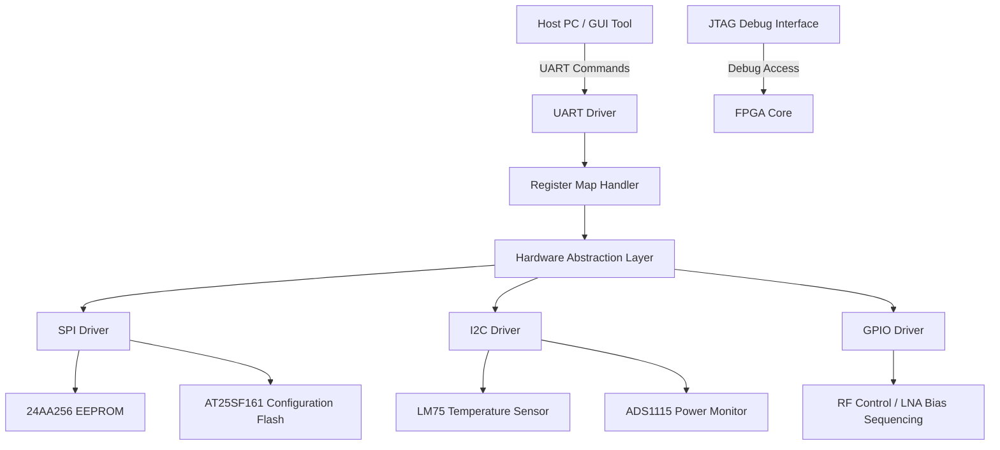
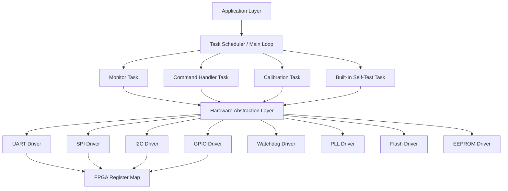
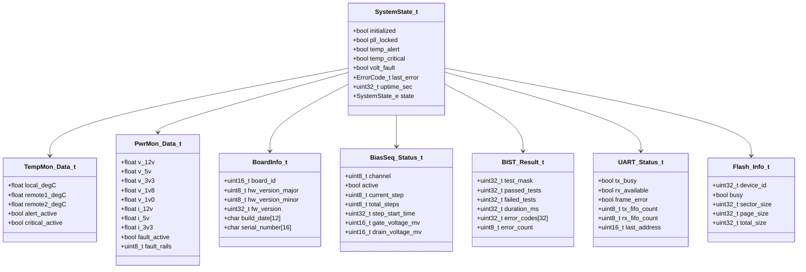
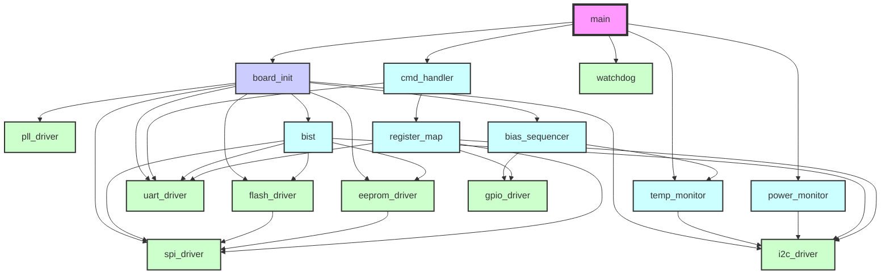

# Software Design Document (SDD)

## Document Control
| Version | Date | Author | Description |
|---------|------|--------|-------------|
| 1.0 | 19 April 2026 | AI-GENERATED | Initial design |

---

# 1. Introduction

## 1.1 Purpose
This Software Design Document (SDD) describes the software architecture, detailed design, and implementation specifications for the hh dual-channel EW/ELINT front-end receiver system firmware. The document serves as the authoritative technical reference for firmware engineers, test engineers, RTL designers, and system integrators involved in the development and verification of the hh system.

This SDD provides a comprehensive breakdown of the software system architecture, data structures, module interfaces, algorithms, and implementation details. It builds upon the requirements defined in the Software Requirements Specification (SRS) and aligns with the hardware specifications outlined in the Hardware Requirements Specification (HRS) and Glue Logic Requirements (GLR).

The firmware implements control logic for the dual-channel EW/ELINT receiver, including bias sequencing for GaAs pHEMT LNAs, power supply monitoring, temperature monitoring, configuration storage, and communication interfaces. This document ensures that the implementation adheres to the specified requirements while meeting functional, performance, safety, and reliability constraints.

## 1.2 Scope
The complete scope of this SDD encompasses the firmware for the hh dual-channel EW/ELINT front-end receiver system, running on the Xilinx XC7K70T-1FBG676C FPGA. The software architecture includes:

### Software Components Designed:
- Board Support Package (BSP) for hardware initialization
- Hardware Abstraction Layer (HAL) for peripheral access
- Device drivers for UART, SPI, I2C, GPIO, and other peripherals
- Application layer including bias sequencing, monitoring, and control
- Configuration management for EEPROM and Flash storage
- Built-in self-test (BIST) functionality
- Command handler for UART register protocol
- System health monitoring and watchdog management

### What is Explicitly NOT Covered:
- RF signal processing algorithms
- Digital signal processing (DSP) implementations
- RF front-end circuit design
- Mechanical design and thermal management
- Test procedures and test equipment specifications
- Installation and deployment procedures
- End-user documentation

### Target Hardware Platform:
- FPGA: Xilinx XC7K70T-1FBG676C (Kintex-7)
- Clock: 100 MHz primary oscillator
- Storage: 24AA256 EEPROM (256Kbit) for configuration, AT25SF161 Flash (16Mbit) for firmware updates
- Sensors: LM75 (temperature), ADS1115 (power monitoring via I2C)
- Communication: UART via RS-422 (ADM3251E transceiver), SPI for Flash/EEPROM, I2C for sensors

### Programming Language and Toolchain:
- Primary Language: C99 (MISRA-C:2012 compliant subset)
- Build System: CMake 3.20+
- Cross-compiler: arm-none-eabi-gcc (ARM Cortex-M architecture)
- Debugging: JTAG via Xilinx Vivado
- Static Analysis: PC-lint, MISRA Checker
- Unit Testing: Google Test framework

## 1.3 Definitions and Acronyms
| Term | Definition |
|------|------------|
| HAL | Hardware Abstraction Layer - Software layer providing interfaces to hardware resources |
| BSP | Board Support Package - Software layer that provides hardware-specific interfaces |
| ISR | Interrupt Service Routine - Routine executed in response to an interrupt |
| DMA | Direct Memory Access - Mechanism that allows hardware subsystems to access main memory independently of the CPU |
| FIFO | First-In-First-Out - Data structure that operates on a first-in-first-out basis |
| CRC | Cyclic Redundancy Check - Error-detecting code used in digital networks and storage |
| WDT | Watchdog Timer - Hardware or software timer that triggers system reset if main program fails to update it |
| PLL | Phase-Locked Loop - Control system that generates output signal with phase related to input signal |
| UART | Universal Asynchronous Receiver/Transmitter - Serial communication protocol |
| SPI | Serial Peripheral Interface - Serial communication protocol typically using four wires |
| I2C | Inter-Integrated Circuit - Serial communication protocol using two wires |
| GPIO | General Purpose Input/Output - Programmable pins on an integrated circuit |
| MISRA | MISRA C - Guidelines for the Use of the C Language in Critical Systems |
| RTOS | Real-Time Operating System - Operating system designed for real-time applications |
| IPC | Inter-Process Communication - Mechanisms for processes to communicate with each other |
| API | Application Programming Interface - Set of definitions and protocols for building software |
| NVMEM | Non-Volatile Memory - Memory that retains data when power is turned off |
| POST | Power-On Self-Test - Diagnostic routine performed by firmware at startup |
| BIT | Built-In Test - Diagnostic routines integrated into hardware and software |
| FSM | Finite State Machine - Mathematical model of computation used to design computer programs |
| LNA | Low-Noise Amplifier - Amplifier designed to amplify weak signals with minimal noise |
| BPF | Band-Pass Filter - Filter that permits signals within certain frequency range |
| SAW | Surface Acoustic Wave - Wave traveling along surface of piezoelectric material |
| pHEMT | Pseudomorphic High Electron Mobility Transistor - FET with enhanced electron mobility |
| IIP3 | Third-Order Input Intercept Point - Input power level where fundamental tone equals third-order intermodulation product |
| MDS | Minimum Detectable Signal - Lowest signal power level detectable by receiver |
| NF | Noise Figure - Measure of degradation of signal-to-noise ratio caused by components |
| VSWR | Voltage Standing Wave Ratio - Measure of efficiency of RF power transmission |
| EW/ELINT | Electronic Warfare/Electronic Intelligence - Military intelligence disciplines |
| FPGA | Field-Programmable Gate Array - Integrated circuit designed to be configured by customer |
| MCU | Microcontroller Unit - Small computer on single integrated circuit |
| JTAG | Joint Test Action Group - Standard for testing integrated circuits |
| TRP | Transmitter/Receiver Package - Component including transmitter and receiver functionality |
| BIST | Built-In Self-Test - Diagnostic routines integrated into hardware and software |
| ADC | Analog-to-Digital Converter - Electronic device that converts analog signals to digital |
| DAC | Digital-to-Analog Converter - Electronic device that converts digital signals to analog |
| PSRR | Power Supply Rejection Ratio - Ability of device to reject variations in power supply |
| SNR | Signal-to-Noise Ratio - Measure of signal strength relative to background noise |
| EMI/EMC | Electromagnetic Interference/Compatibility - Unwanted emissions and susceptibility to them |
| BSS | Block Start Symbol - Marker in compiled code indicating start of uninitialized static variables |
| RTM | Requirements Traceability Matrix - Document linking requirements throughout development lifecycle |
| ConOps | Concept of Operations - Document describing how system will be used in operation |
| ASIL | Automotive Safety Integrity Level - Risk classification system for automotive safety |
| SIL | Safety Integrity Level - Risk classification system for safety-related systems |
| RPC | Remote Procedure Call - Protocol allowing program to execute subroutine on another address space |
| DMA | Direct Memory Access - Mechanism allowing hardware subsystems to access main memory independently |
| FIFO | First-In-First-Out - Data structure that operates on a first-in-first-out basis |
| LDO | Low Dropout Regulator - Voltage regulator that can operate with small input-output differential voltage |
| DC | Direct Current - Type of electrical current that flows in one direction only |
| AC | Alternating Current - Type of electrical current that periodically reverses direction |
| VCC | Power Supply Voltage - Term used to refer to the power supply in electronic circuits |
| GND | Ground - Reference point in electrical circuits from which voltages are measured |
| RF | Radio Frequency - Oscillation rate of alternating current in the range of 3 kHz to 300 GHz |
| IF | Intermediate Frequency - Frequency to which a carrier wave is shifted as an intermediate step in transmission or reception |
| LO | Local Oscillator - Electronic signal generator used to provide a local signal for conversion to an intermediate frequency |
| DB | Decibel - Logarithmic unit used to express ratios of power, voltage, and other quantities |
| DBM | Decibel referenced to 1 milliwatt - Power ratio in decibels relative to one milliwatt |
| GHZ | Gigahertz - Unit of frequency equal to one billion hertz |
| MHZ | Megahertz - Unit of frequency equal to one million hertz |
| KHZ | Kilohertz - Unit of frequency equal to one thousand hertz |
| HZ | Hertz - Unit of frequency equal to one cycle per second |
| V | Volt - Unit of electric potential, potential difference, and electromotive force |
| MA | Milliampere - Unit of electric current equal to one thousandth of an ampere |
| A | Ampere - Unit of electric current equal to one coulomb per second |
| W | Watt - Unit of power equal to one joule per second |
| Ω | Ohm - Unit of electrical resistance equal to one volt per ampere |
| K | Kelvin - Unit of thermodynamic temperature |
| °C | Degrees Celsius - Unit of temperature equal to one kelvin with a different zero point |
| ΜS | Microsecond - Unit of time equal to one millionth of a second |
| NS | Nanosecond - Unit of time equal to one billionth of a second |
| MM | Millimeter - Unit of length equal to one thousandth of a meter |
| CM | Centimeter - Unit of length equal to one hundredth of a meter |

## 1.4 References
- IEEE 1016-2009 - Standard for Software Design Description
- SRS Document - Software Requirements Specification for hh dual-channel EW/ELINT receiver system
- HRS Document - Hardware Requirements Specification for hh dual-channel EW/ELINT receiver system
- GLR Document - Glue Logic Requirements for hh project
- MISRA C:2012 - Guidelines for the Use of the C Language in Critical Systems
- Xilinx XC7K70T-1FBG676C FPGA Documentation
- AT25SF161 SPI Flash Datasheet
- 24AA256 EEPROM Datasheet
- ADS1115 I2C ADC Datasheet
- LM75 I2C Temperature Sensor Datasheet
- ADM3251E RS-422/RS-485 Transceiver Datasheet
- TPS65263 Power Management IC Datasheet

---

# 2. Design Viewpoints

## 2.1 Context Viewpoint — System Boundaries

The hh system software architecture operates within the boundaries defined by the Xilinx XC7K70T-1FBG676C FPGA. The software interacts with external systems through the interfaces defined in the GLR specification.

### System Context Diagram:



### External Interfaces:

1. **Host PC Interface**
   - Protocol: UART (115200 bps, 8 data bits, no parity, 1 stop bit)
   - Physical: RS-422 via ADM3251E transceiver
   - Data Format: Register access protocol with header, address, data, and CRC
   - Function: Configuration, status monitoring, and control commands

2. **JTAG Debug Interface**
   - Protocol: IEEE 1149.1 JTAG
   - Physical: 4-pin standard JTAG interface
   - Function: Firmware debugging, boundary scan, configuration

3. **Hardware Peripheral Interfaces**
   - SPI (for Flash and EEPROM)
     - Master mode, up to 20 MHz clock
     - Chip select for each peripheral
   - I2C (for temperature and power monitoring)
     - Master mode, up to 400 kHz clock
     - Multiple device addressing
   - GPIO (for RF control signals)
     - Configurable output for LNA bias sequencing
     - Input for status monitoring

The software system boundary clearly separates the firmware implementation from external systems while providing well-defined interfaces for communication and control.

## 2.2 Composition Viewpoint — Software Architecture

The hh system firmware follows a layered architecture approach with clear separation of concerns between hardware abstraction, peripheral control, and application functionality.

### Software Architecture Diagram:



### Module List with Responsibilities:

**Module: board_init** (board_init.c / board_init.h)
```c
// Responsibilities: System power-on initialization, clock setup, PLL configuration, and hardware self-test
int32_t Board_Init(void);
int32_t Board_GetVersion(BoardInfo_t *info);
int32_t Board_SelfTest(uint32_t *test_mask);
int32_t Board_ResetSystem(void);

typedef struct {
    uint16_t board_id;
    uint8_t  hw_version_major;
    uint8_t  hw_version_minor;
    uint32_t fw_version;
    char     build_date[12];
    char     serial_number[16];
} BoardInfo_t;

// Internal state
static bool board_initialized = false;
static BoardInfo_t board_info = {
    .board_id = 0xHH55,
    .hw_version_major = 1,
    .hw_version_minor = 0,
    .fw_version = 0x00010000,
    .build_date = "Apr 26 2026",
    .serial_number = "HH20260001"
};

// Configuration constants
#define BOARD_ID_HH55          0xHH55
#define BOARD_HW_VERSION_MAJOR 1
#define BOARD_HW_VERSION_MINOR 0
#define BOARD_FW_VERSION       0x00010000
#define BOARD_CLOCK_FREQ       100000000  // 100 MHz
```

**Module: uart_driver** (uart_driver.c / uart_driver.h)
```c
// Responsibilities: UART framing, register read/write protocol implementation, FIFO management, and interrupt handling
int32_t UART_Init(uint32_t baud_rate);
int32_t UART_Deinit(void);
int32_t UART_WriteReg(uint16_t addr, uint16_t data);
int32_t UART_ReadReg(uint16_t addr, uint16_t *data_out);
int32_t UART_BulkWrite(uint16_t start_addr, const uint16_t *data, uint8_t count);
int32_t UART_BulkRead(uint16_t start_addr, uint16_t *buf_out, uint8_t count);
int32_t UART_GetStatus(UART_Status_t *status);
void    UART_ISR(void);  // Interrupt service routine

typedef struct {
    bool tx_busy;
    bool rx_available;
    bool frame_error;
    uint8_t tx_fifo_count;
    uint8_t rx_fifo_count;
    uint16_t last_address;
} UART_Status_t;

// Internal state
static volatile UART_Status_t uart_status = {0};
static uint8_t rx_buffer[256];
static uint8_t tx_buffer[256];
static uint8_t rx_index = 0;
static uint8_t tx_index = 0;

// Configuration constants
#define UART_BAUD_RATE          115200
#define UART_FIFO_SIZE          256
#define UART_CMD_WRITE          0x57  // 'W'
#define UART_CMD_READ           0x52  // 'R'
#define UART_CMD_BULK_WRITE     0x42  // 'B'
#define UART_CMD_BULK_READ      0x62  // 'b'
#define UART_ACK                0x06
#define UART_NAK                0x15
```

**Module: spi_driver** (spi_driver.c / spi_driver.h)
```c
// Responsibilities: SPI master interface for communication with external Flash and EEPROM devices
int32_t SPI_Init(uint8_t instance, uint32_t clock_hz, uint8_t cpol, uint8_t cpha);
int32_t SPI_Transfer(uint8_t instance, const uint8_t *tx, uint8_t *rx, uint16_t len);
int32_t SPI_ChipSelect(uint8_t instance, uint8_t cs_idx, bool active);
int32_t SPI_WaitTransferComplete(uint8_t instance, uint32_t timeout_ms);

// Internal state
typedef struct {
    bool initialized;
    uint32_t clock_hz;
    uint8_t mode;
    uint16_t transfer_count;
    uint16_t timeout_ms;
} SPI_Instance_t;

static SPI_Instance_t spi_instances[2] = {0};  // 2 SPI instances

// Configuration constants
#define SPI_INSTANCE_0          0
#define SPI_INSTANCE_1          1
#define SPI_FLASH_CS_IDX        0
#define SPI_EEPROM_CS_IDX       1
#define SPI_MAX_CLOCK_HZ        20000000  // 20 MHz
#define SPI_DEFAULT_MODE        0  // CPOL=0, CPHA=0
#define SPI_TIMEOUT_MS          100
```

**Module: i2c_driver** (i2c_driver.c / i2c_driver.h)
```c
// Responsibilities: I2C master interface for communication with temperature sensors and ADC devices
int32_t I2C_Init(uint8_t instance, uint32_t clock_hz);
int32_t I2C_Write(uint8_t instance, uint8_t dev_addr, const uint8_t *data, uint8_t len);
int32_t I2C_Read(uint8_t instance, uint8_t dev_addr, uint8_t *buf, uint8_t len);
int32_t I2C_WriteReg(uint8_t instance, uint8_t dev_addr, uint8_t reg, uint8_t val);
int32_t I2C_ReadReg(uint8_t instance, uint8_t dev_addr, uint8_t reg, uint8_t *val_out);
int32_t I2C_WaitBusIdle(uint8_t instance, uint32_t timeout_ms);

// Internal state
typedef struct {
    bool initialized;
    uint32_t clock_hz;
    uint8_t state;
    uint32_t timeout_ms;
} I2C_Instance_t;

static I2C_Instance_t i2c_instances[1] = {0};  // 1 I2C instance

// Configuration constants
#define I2C_INSTANCE_0          0
#define I2C_TEMP_ADDR          0x48  // LM75 default address
#define I2C_ADC_ADDR           0x48  // ADS1115 default address (A0=GND)
#define I2C_MAX_CLOCK_HZ       400000  // 400 kHz Fast Mode
#define I2C_TIMEOUT_MS         10
```

**Module: temp_monitor** (temp_monitor.c / temp_monitor.h)
```c
// Responsibilities: Temperature monitoring, alert management, thermal shutdown logic, and logging
int32_t TempMon_Init(const TempMon_Config_t *cfg);
int32_t TempMon_ReadAll(TempMon_Data_t *data_out);
int32_t TempMon_SetAlertThresh(float high_degC, float low_degC);
int32_t TempMon_SetCriticalThresh(float critical_degC);
bool    TempMon_IsAlert(void);
bool    TempMon_IsCritical(void);
void    TempMon_Task(void);  // Periodic task handler

typedef struct {
    float local_degC;
    float remote1_degC;
    float remote2_degC;
    bool  alert_active;
    bool  critical_active;
} TempMon_Data_t;

typedef struct {
    float high_threshold_degC;
    float low_threshold_degC;
    float critical_threshold_degC;
    uint32_t sample_interval_ms;
    uint8_t sensor_count;
} TempMon_Config_t;

// Internal state
static TempMon_Data_t temp_data = {0};
static TempMon_Config_t temp_config = {
    .high_threshold_degC = 85.0f,
    .low_threshold_degC = 75.0f,
    .critical_threshold_degC = 100.0f,
    .sample_interval_ms = 1000,
    .sensor_count = 1
};
static bool temp_alert_active = false;
static bool temp_critical_active = false;

// Configuration constants
#define TEMP_NORMAL_RANGE_MIN   0.0f
#define TEMP_NORMAL_RANGE_MAX   85.0f
#define TEMP_ALERT_THRESHOLD    85.0f
#define TEMP_CRITICAL_THRESHOLD 100.0f
#define TEMP_SAMPLE_INTERVAL_MS 1000
```

**Module: power_monitor** (power_monitor.c / power_monitor.h)
```c
// Responsibilities: Rail voltage/current monitoring, fault detection, and power management
int32_t PwrMon_Init(const PwrMon_Config_t *cfg);
int32_t PwrMon_ReadRail(uint8_t rail_idx, float *voltage_V, float *current_A);
int32_t PwrMon_ReadAll(PwrMon_Data_t *data_out);
bool    PwrMon_IsFault(void);
int32_t PwrMon_SetThreshold(uint8_t rail_idx, float min_V, float max_V);
void    PwrMon_Task(void);

typedef struct {
    float v_12v;
    float v_5v;
    float v_3v3;
    float v_1v8;
    float v_1v0;
    float i_12v;
    float i_5v;
    float i_3v3;
    bool  fault_active;
    uint8_t fault_rails;
} PwrMon_Data_t;

typedef struct {
    float v_min[5];
    float v_max[5];
    uint32_t sample_interval_ms;
} PwrMon_Config_t;

// Internal state
static PwrMon_Data_t pwr_data = {0};
static PwrMon_Config_t pwr_config = {
    .v_min = {10.5f, 4.5f, 3.0f, 1.6f, 0.9f},
    .v_max = {13.5f, 5.5f, 3.6f, 2.0f, 1.1f},
    .sample_interval_ms = 500
};
static bool pwr_fault_active = false;

// Configuration constants
#define PWR_RAIL_12V          0
#define PWR_RAIL_5V           1
#define PWR_RAIL_3V3          2
#define PWR_RAIL_1V8          3
#define PWR_RAIL_1V0          4
#define PWR_RAIL_COUNT        5
#define PWR_SAMPLE_INTERVAL_MS 500
```

**Module: flash_driver** (flash_driver.c / flash_driver.h)
```c
// Responsibilities: Configuration Flash read/write/erase operations with CRC verification
int32_t Flash_Init(void);
int32_t Flash_ReadID(uint32_t *id_out);
int32_t Flash_Read(uint32_t addr, uint8_t *buf, uint32_t len);
int32_t Flash_WritePage(uint32_t addr, const uint8_t *data, uint32_t len);
int32_t Flash_EraseSector(uint32_t sector_addr);
int32_t Flash_EraseChip(void);
int32_t Flash_WaitReady(uint32_t timeout_ms);
bool    Flash_IsBusy(void);
int32_t Flash_Verify(const uint8_t *expected, uint32_t addr, uint32_t len, uint32_t *crc_out);

// Internal state
typedef struct {
    uint32_t device_id;
    bool busy;
    uint32_t sector_size;
    uint32_t page_size;
    uint32_t total_size;
} Flash_Info_t;

static Flash_Info_t flash_info = {
    .device_id = 0,
    .busy = false,
    .sector_size = 65536,   // 64KB
    .page_size = 256,       // 256B
    .total_size = 2097152   // 2MB
};

// Configuration constants
#define FLASH_CMD_READ_ID      0x9F
#define FLASH_CMD_READ         0x03
#define FLASH_CMD_WRITE_ENABLE 0x06
#define FLASH_CMD_WRITE_PAGE   0x02
#define FLASH_CMD_SECTOR_ERASE 0x20
#define FLASH_CMD_CHIP_ERASE   0xC7
#define FLASH_CMD_READ_STATUS  0x05
#define FLASH_STATUS_BUSY      0x01
#define FLASH_TIMEOUT_MS      1000
```

**Module: eeprom_driver** (eeprom_driver.c / eeprom_driver.h)
```c
// Responsibilities: EEPROM calibration data read/write with sector protection
int32_t EEPROM_Init(void);
int32_t EEPROM_ReadByte(uint16_t addr, uint8_t *data_out);
int32_t EEPROM_WriteByte(uint16_t addr, uint8_t data);
int32_t EEPROM_ReadBlock(uint16_t addr, uint8_t *buf, uint16_t len);
int32_t EEPROM_WriteBlock(uint16_t addr, const uint8_t *data, uint16_t len);
int32_t EEPROM_EraseSector(uint16_t sector_addr);
int32_t EEPROM_Verify(const uint8_t *expected, uint16_t addr, uint16_t len);

// Internal state
typedef struct {
    uint16_t size;
    uint16_t page_size;
    bool write_in_progress;
} EEPROM_Info_t;

static EEPROM_Info_t eeprom_info = {
    .size = 32768,      // 32KB
    .page_size = 64,    // 64B
    .write_in_progress = false
};

// Configuration constants
#define EEPROM_CMD_READ         0x03
#define EEPROM_CMD_WRITE        0x02
#define EEPROM_CMD_WREN        0x06
#define EEPROM_CMD_WRDI        0x04
#define EEPROM_CMD_READ_STATUS 0x05
#define EEPROM_STATUS_WIP      0x01
#define EEPROM_TIMEOUT_MS      20
```

**Module: pll_driver** (pll_driver.c / pll_driver.h)
```c
// Responsibilities: PLL configuration, lock monitoring, and clock generation control
int32_t PLL_Init(const PLL_Config_t *cfg);
int32_t PLL_SetFrequency(uint32_t freq_hz);
int32_t PLL_WaitLock(uint32_t timeout_ms);
bool    PLL_IsLocked(void);
int32_t PLL_Reset(void);
int32_t PLL_GetOutputFrequency(uint8_t output_idx, uint32_t *freq_hz);

typedef struct {
    uint32_t ref_freq_hz;
    uint32_t target_freq_hz;
    uint16_t n_divider;
    uint8_t  r_divider;
    uint8_t  clk_outputs_mask;
    uint32_t lock_timeout_ms;
} PLL_Config_t;

// Internal state
static PLL_Config_t pll_config = {
    .ref_freq_hz = 100000000,     // 100 MHz
    .target_freq_hz = 100000000,  // 100 MHz default
    .n_divider = 50,
    .r_divider = 2,
    .clk_outputs_mask = 0x03,    // Enable outputs 0 and 1
    .lock_timeout_ms = 100        // 100ms lock timeout
};
static bool pll_locked = false;
static uint32_t pll_output_freq[4] = {0};

// Configuration constants
#define PLL_DEFAULT_FREQ_HZ    100000000  // 100 MHz
#define PLL_MIN_FREQ_HZ        1000000    // 1 MHz
#define PLL_MAX_FREQ_HZ        300000000  // 300 MHz
#define PLL_LOCK_TIMEOUT_MS    100
#define PLL_OUTPUT_COUNT       4
```

**Module: cmd_handler** (cmd_handler.c / cmd_handler.h)
```c
// Responsibilities: Parse incoming UART commands, validate, dispatch to register map, and format responses
int32_t CmdHandler_Init(void);
void    CmdHandler_Process(void);  // Called from main loop
int32_t CmdHandler_ExecuteWrite(uint16_t addr, uint16_t data);
int32_t CmdHandler_ExecuteRead(uint16_t addr, uint16_t *data_out);
int32_t CmdHandler_ExecuteBulkWrite(uint16_t start, const uint16_t *data, uint8_t n);
int32_t CmdHandler_ExecuteBulkRead(uint16_t start, uint16_t *buf, uint8_t n);
int32_t CmdHandler_ParseFrame(const uint8_t *frame, uint8_t len, uint8_t *cmd_type, 
                              uint16_t *addr, uint16_t *data, uint8_t *count);

// Internal state
typedef enum {
    CMD_STATE_IDLE,
    CMD_STATE_GOT_CMD,
    CMD_STATE_GOT_ADDR_H,
    CMD_STATE_GOT_ADDR_L,
    CMD_STATE_GOT_DATA_H,
    CMD_STATE_GOT_DATA_L,
    CMD_STATE_GOT_COUNT,
    CMD_STATE_PROCESSING
} CmdHandler_State_t;

static CmdHandler_State_t cmd_state = CMD_STATE_IDLE;
static uint8_t cmd_buffer[8];
static uint8_t cmd_index = 0;
static uint32_t cmd_timeout = 0;

// Configuration constants
#define CMD_HANDLER_TIMEOUT_MS  10
#define CMD_BUFFER_SIZE        8
#define MAX_BULK_COUNT         16
```

**Module: bias_sequencer** (bias_sequencer.c / bias_sequencer.h)
```c
// Responsibilities: GaAs pHEMT LNA bias sequencing with power sequencing and protection
int32_t BiasSeq_Init(const BiasSeq_Config_t *cfg);
int32_t BiasSeq_SetSequence(uint8_t channel, const BiasSeq_Step_t *steps, uint8_t count);
int32_t BiasSeq_Start(uint8_t channel);
int32_t BiasSeq_Stop(uint8_t channel);
int32_t BiasSeq_GetStatus(uint8_t channel, BiasSeq_Status_t *status);
bool    BiasSeq_IsComplete(uint8_t channel);

typedef struct {
    uint16_t gate_voltage_mv;    // Gate voltage in millivolts
    uint16_t drain_voltage_mv;   // Drain voltage in millivolts
    uint32_t duration_ms;        // Step duration in milliseconds
    uint8_t  state_flags;       // Bit flags for step state
} BiasSeq_Step_t;

typedef struct {
    uint8_t channel;
    bool active;
    uint8_t current_step;
    uint8_t total_steps;
    uint32_t step_start_time;
    uint16_t gate_voltage_mv;
    uint16_t drain_voltage_mv;
} BiasSeq_Status_t;

typedef struct {
    uint8_t channel_count;
    uint32_t inter_step_delay_ms;
    bool enable_temperature_protection;
    float temperature_threshold_degC;
} BiasSeq_Config_t;

// Internal state
static BiasSeq_Status_t bias_status[BiasSeq_ChannelCount] = {0};
static BiasSeq_Config_t bias_config = {
    .channel_count = 8,  // 4 channels × 2 polarizations
    .inter_step_delay_ms = 100,
    .enable_temperature_protection = true,
    .temperature_threshold_degC = 85.0f
};

// Configuration constants
#define BiasSeq_ChannelCount   8  // 4 channels × 2 polarizations
#define BiasSeq_MinGateVoltage  0   // 0V
#define BiasSeq_MaxGateVoltage  5000 // 5V
#define BiasSeq_MinDrainVoltage 0   // 0V
#define BiasSeq_MaxDrainVoltage 5000 // 5V
#define BiasSeq_DefaultInterStepDelay 100  // ms
```

**Module: watchdog** (watchdog.c / watchdog.h)
```c
// Responsibilities: Watchdog timer management, system reset detection, and timeout handling
int32_t WDT_Init(uint32_t timeout_ms);
void    WDT_Pet(void);
bool    WDT_WasResetCause(void);
void    WDT_Enable(void);
void    WDT_Disable(void);
uint32_t WDT_GetRemainingTime(void);

// Internal state
static uint32_t wdt_timeout = 0;
static bool wdt_enabled = false;
static bool wdt_reset_detected = false;
static uint32_t wdt_last_pet = 0;

// Configuration constants
#define WDT_DEFAULT_TIMEOUT_MS 5000  // 5 seconds
#define WDT_MIN_TIMEOUT_MS    100   // 100ms
#define WDT_MAX_TIMEOUT_MS    60000 // 60 seconds
```

**Module: bist** (bist.c / bist.h)
```c
// Responsibilities: Built-in self-test functionality including memory, peripheral, and system tests
int32_t BIST_Init(void);
int32_t BIST_RunTests(uint32_t test_mask, BIST_Result_t *results);
int32_t BIST_MemoryTest(void);
int32_t BIST_PeripheralTest(void);
int32_t BIST_RegisterMapTest(void);
int32_t BIST_RFPathTest(void);

typedef struct {
    uint32_t test_mask;
    uint32_t passed_tests;
    uint32_t failed_tests;
    uint32_t duration_ms;
    uint32_t error_codes[32];
    uint8_t error_count;
} BIST_Result_t;

// Internal state
static BIST_Result_t bist_results = {0};

// Configuration constants
#define BIST_TEST_MEMORY     0x0001
#define BIST_TEST_PERIPHERAL 0x0002
#define BIST_TEST_REGISTER   0x0004
#define BIST_TEST_RF_PATH     0x0008
#define BIST_TEST_ALL        0xFFFF
#define BIST_MAX_ERRORS      32
```

## 2.3 Logical Viewpoint — Data Model

The software system utilizes several key data structures to represent system state, configuration, and operational data.

### Key Data Structures:



### Key Enumerations:

```c
/**
 * @brief System state enumeration
 */
typedef enum {
    SYS_STATE_RESET = 0,    /* System in reset state */
    SYS_STATE_INIT,        /* System initializing */
    SYS_STATE_RUNNING,     /* System正常运行 */
    SYS_STATE_FAULT,       /* System fault detected */
    SYS_STATE_SHUTDOWN,    /* System shutting down */
    SYS_STATE_RECOVERY,    /* System recovering from fault */
    SYS_STATE_COUNT        /* Number of system states */
} SystemState_e;

/**
 * @brief Error code enumeration
 */
typedef enum {
    ERR_OK = 0x00,          /* Operation successful */
    ERR_TIMEOUT = 0x01,     /* Operation timed out */
    ERR_COMM = 0x02,        /* Communication error */
    ERR_CHECKSUM = 0x03,    /* Checksum/CRC error */
    ERR_PARAM = 0x04,       /* Invalid parameter */
    ERR_NOT_INIT = 0x05,    /* Component not initialized */
    ERR_RESOURCE = 0x06,    /* Resource unavailable */
    ERR_HARDWARE = 0x07,    /* Hardware error/fault */
    ERR_OVERFLOW = 0x08,    /* Buffer overflow */
    ERR_FLASH_WRITE = 0x0A,  /* Flash write error */
    ERR_FLASH_ERASE = 0x0B, /* Flash erase error */
    ERR_EEPROM = 0x0C,      /* EEPROM error */
    ERR_PLL = 0x0D,         /* PLL error */
    ERR_TEMP_ALERT = 0x0E,  /* Temperature alert */
    ERR_TEMP_CRITICAL = 0x0F,/* Temperature critical */
    ERR_VOLT_FAULT = 0x10,  /* Voltage fault */
    ERR_SEQUENCE = 0x11,    /* Sequence error */
    ERR_CALIBRATION = 0x12, /* Calibration error */
    ERR_RF_PATH = 0x13,     /* RF path error */
    ERR_MEMORY = 0x14,      /* Memory error */
    ERR_STACK_OVERFLOW = 0x15, /* Stack overflow */
    ERR_COUNT               /* Number of error codes */
} ErrorCode_t;

/**
 * @brief UART command type enumeration
 */
typedef enum {
    UART_CMD_NONE = 0,       /* No command */
    UART_CMD_WRITE,         /* Register write */
    UART_CMD_READ,          /* Register read */
    UART_CMD_BULK_WRITE,    /* Bulk register write */
    UART_CMD_BULK_READ      /* Bulk register read */
} UART_Cmd_e;

/**
 * @brief Bias sequencer state enumeration
 */
typedef enum {
    BIAS_STATE_IDLE = 0,    /* Sequencer idle */
    BIAS_STATE_RUNNING,     /* Sequencer running */
    BIAS_STATE_COMPLETE,    /* Sequencer complete */
    BIAS_STATE_ERROR,       /* Sequencer error */
    BIAS_STATE_COUNT        /* Number of bias sequencer states */
} BiasSeq_State_e;

/**
 * @ Watchdog state enumeration
 */
typedef enum {
    WDT_STATE_DISABLED = 0,  /* Watchdog disabled */
    WDT_STATE_ENABLED,      /* Watchdog enabled */
    WDT_STATE_EXPIRED,      /* Watchdog expired */
    WDT_STATE_COUNT         /* Number of watchdog states */
} WDT_State_e;
```

## 2.4 Dependency Viewpoint — Module Dependencies

The module dependency graph illustrates how software components interact and their dependencies on each other. The build order ensures proper initialization and avoids circular dependencies.

### Module Dependency Graph:



### Build Order:

The recommended build order is based on dependencies, ensuring that lower-level hardware abstraction layers are built before dependent application modules:

1. Hardware abstraction drivers (uart_driver, spi_driver, i2c_driver, gpio_driver)
2. Board initialization module (board_init)
3. Peripheral drivers (flash_driver, eeprom_driver, pll_driver)
4. Core application modules (cmd_handler, register_map)
5. System functionality modules (temp_monitor, power_monitor, bias_sequencer)
6. Diagnostics and monitoring (watchdog, bist)
7. Main application (main)

This dependency structure supports a clean separation of concerns and enables incremental testing and validation of components.

## 2.5 Interface Viewpoint — Complete API Specification

This section provides detailed specifications for all public functions across all modules, including function signatures, parameters, return values, pre/post conditions, and thread safety.

### Board Init Module

```c
/**
 * @brief Initialize the system hardware and peripherals.
 *
 * This function performs the complete initialization sequence including clock setup,
 * PLL configuration, peripheral initialization, and power-on self-test.
 *
 * @return ERR_OK    on success
 * @return ERR_HARDWARE if hardware initialization fails
 * @return ERR_PLL if PLL configuration fails
 * @return ERR_TIMEOUT if any timeout occurs during initialization
 *
 * @pre  System must be in reset state.
 * @post System is initialized and ready for operation. All peripherals are configured
 *       and functional. System state is set to SYS_STATE_RUNNING.
 * @note This function should only be called once at system startup. It is not thread-safe.
 *       Calling it multiple times may result in undefined behavior.
 *
 * @example
 *   if (Board_Init() != ERR_OK) {
 *       // Handle initialization failure
 *       Error_Handler();
 *   }
 */
int32_t Board_Init(void);

/**
 * @brief Get board information including version and serial number.
 *
 * @param info Pointer to BoardInfo_t structure to populate with board information.
 * @return ERR_OK    on success
 * @return ERR_PARAM if info is NULL
 *
 * @pre  Board_Init() must have been called successfully.
 * @post BoardInfo_t structure is populated with current board information.
 * @note Thread-safe. Can be called at any time after initialization.
 *
 * @example
 *   BoardInfo_t info;
 *   if (Board_GetVersion(&info) == ERR_OK) {
 *       printf("Board ID: 0x%04X, HW Ver: %d.%d\n", 
 *              info.board_id, info.hw_version_major, info.hw_version_minor);
 *   }
 */
int32_t Board_GetVersion(BoardInfo_t *info);

/**
 * @brief Perform power-on self-test (POST) to verify system functionality.
 *
 * @param test_mask Pointer to uint32_t where test results bit mask will be stored.
 * @return ERR_OK    on success
 * @return ERR_PARAM if test_mask is NULL
 * @return ERR_HARDWARE if hardware self-test fails
 *
 * @pre  Board_Init() must have been called successfully.
 * @post Bit mask is set with bits representing passed tests (1 = passed, 0 = failed).
 * @note Thread-safe. Can be called at any time after initialization.
 *       Results are cumulative with previous tests.
 *
 * @example
 *   uint32_t test_results;
 *   if (Board_SelfTest(&test_results) == ERR_OK) {
 *       printf("Test results: 0x%08X\n", test_results);
 *       if (test_results & (1 << TEST_MEMORY)) {
 *           printf("Memory test passed\n");
 *       }
 *   }
 */
int32_t Board_SelfTest(uint32_t *test_mask);
```

### UART Driver Module

```c
/**
 * @brief Initialize the UART peripheral for register protocol communication.
 *
 * @param baud_rate Target baud rate in bits/second. Valid range: 9600–115200.
 * @return ERR_OK    on success
 * @return ERR_PARAM if baud_rate is outside valid range
 * @return ERR_HARDWARE if hardware initialization fails
 *
 * @pre  System clock must be initialized before calling this function.
 * @post UART is ready for WriteReg/ReadReg calls. FIFOs are cleared.
 * @note Not thread-safe. Call only during initialization.
 *       UART interrupt is enabled for RX data.
 *
 * @example
 *   if (UART_Init(115200) != ERR_OK) {
 *       FATAL_ERROR();
 *   }
 */
int32_t UART_Init(uint32_t baud_rate);

/**
 * @brief Deinitialize the UART peripheral.
 *
 * @return ERR_OK    on success
 * @return ERR_NOT_INIT if UART is not initialized
 *
 * @pre  UART_Init() must have been called successfully.
 * @post UART is disabled and configured to default state.
 * @note Not thread-safe. Call only during system shutdown.
 *
 * @example
 *   UART_Deinit();
 */
int32_t UART_Deinit(void);

/**
 * @brief Write a 16-bit value to a register via UART protocol.
 *
 * @param addr Register address (16-bit).
 * @param data Data value to write (16-bit).
 * @return ERR_OK    on success
 * @return ERR_PARAM if addr is outside valid range
 * @return ERR_COMM if communication fails
 * @return ERR_TIMEOUT if ACK not received
 *
 * @pre  UART must be initialized and ready.
 * @post Register is written with the specified value. ACK/NAK response sent.
 * @note Thread-safe. Uses internal locking for protection.
 *
 * @example
 *   if (UART_WriteReg(REG_RF_CONTROL, 0x0001) != ERR_OK) {
 *       printf("Failed to write RF control register\n");
 *   }
 */
int32_t UART_WriteReg(uint16_t addr, uint16_t data);

/**
 * @brief Read a 16-bit value from a register via UART protocol.
 *
 * @param addr Register address (16-bit).
 * @param data_out Pointer to location where read data will be stored.
 * @return ERR_OK    on success
 * @return ERR_PARAM if addr is outside valid range or data_out is NULL
 * @return ERR_COMM if communication fails
 * @return ERR_TIMEOUT if response not received
 *
 * @pre  UART must be initialized and ready.
 * @post Read data is stored at *data_out. ACK/NAK response sent.
 * @note Thread-safe. Uses internal locking for protection.
 *
 * @example
 *   uint16_t reg_value;
 *   if (UART_ReadReg(REG_RF_STATUS, &reg_value) == ERR_OK) {
 *       printf("RF Status: 0x%04X\n", reg_value);
 *   }
 */
int32_t UART_ReadReg(uint16_t addr, uint16_t *data_out);

/**
 * @brief Write multiple 16-bit values to consecutive registers via UART protocol.
 *
 * @param start_addr Starting register address (16-bit).
 * @param data Pointer to array of data values to write.
 * @param count Number of registers to write (1-16).
 * @return ERR_OK    on success
 * @return ERR_PARAM if start_addr is invalid, count is 0 or >16, or data is NULL
 * @return ERR_COMM if communication fails
 * @return ERR_TIMEOUT if ACK not received
 *
 * @pre  UART must be initialized and ready.
 * @post Consecutive registers are written with specified values. ACK/NAK response sent.
 * @note Thread-safe. Uses internal locking for protection.
 *
 * @example
 *   uint16_t config_data[4] = {0x0001, 0x0002, 0x0003, 0x0004};
 *   if (UART_BulkWrite(REG_RF_CONFIG, config_data, 4) != ERR_OK) {
 *       printf("Bulk write failed\n");
 *   }
 */
int32_t UART_BulkWrite(uint16_t start_addr, const uint16_t *data, uint8_t count);

/**
 * @brief Read multiple 16-bit values from consecutive registers via UART protocol.
 *
 * @param start_addr Starting register address (16-bit).
 * @param buf_out Pointer to buffer where read data will be stored.
 * @param count Number of registers to read (1-16).
 * @return ERR_OK    on success
 * @return ERR_PARAM if start_addr is invalid, count is 0 or >16, or buf_out is NULL
 * @return ERR_COMM if communication fails
 * @return ERR_TIMEOUT if response not received
 *
 * @pre  UART must be initialized and ready.
 * @post Consecutive register values are stored in buf_out. ACK/NAK response sent.
 * @note Thread-safe. Uses internal locking for protection.
 *
 * @example
 *   uint16_t status_data[4];
 *   if (UART_BulkRead(REG_RF_STATUS, status_data, 4) == ERR_OK) {
 *       printf("Channel 0-3 Status: %04X %04X %04X %04X\n", 
 *              status_data[0], status_data[1], status_data[2], status_data[3]);
 *   }
 */
int32_t UART_BulkRead(uint16_t start_addr, uint16_t *buf_out, uint8_t count);

/**
 * @brief Get current UART status information.
 *
 * @param status Pointer to UART_Status_t structure to populate with status information.
 * @return ERR_OK    on success
 * @return ERR_PARAM if status is NULL
 * @return ERR_NOT_INIT if UART is not initialized
 *
 * @pre  UART must be initialized.
 * @post UART status is populated in the status structure.
 * @note Thread-safe. Uses internal locking for protection.
 *
 * @example
 *   UART_Status_t status;
 *   if (UART_GetStatus(&status) == ERR_OK) {
 *       printf("TX busy: %s, RX available: %s, FIFO count: %d\n",
 *              status.tx_busy ? "yes" : "no",
 *              status.rx_available ? "yes" : "no",
 *              status.rx_fifo_count);
 *   }
 */
int32_t UART_GetStatus(UART_Status_t *status);

/**
 * @brief UART interrupt service routine.
 *
 * This function should be called from the UART interrupt handler. It processes
 * incoming data and manages the RX/TX FIFOs.
 *
 * @pre  UART interrupt must be enabled in the hardware.
 * @post Incoming data is processed and available in the RX buffer.
 *       TX buffer is drained for outgoing data.
 * @note This function is called from an ISR context. It should be fast and
 *       avoid complex operations or function calls that may block.
 *       Not thread-safe (called from ISR).
 *
 * @example
 *   // In UART ISR:
 *   void UART_IRQHandler(void) {
 *       UART_ISR();
 *   }
 */
void UART_ISR(void);
```

### SPI Driver Module

```c
/**
 * @brief Initialize an SPI instance for master mode operation.
 *
 * @param instance SPI instance number (0 or 1).
 * @param clock_hz SPI clock frequency in Hz. Valid range: 100kHz-20MHz.
 * @param cpol SPI clock polarity (0 or 1).
 * @param cpha SPI clock phase (0 or 1).
 * @return ERR_OK    on success
 * @return ERR_PARAM if instance is invalid or parameters are out of range
 * @return ERR_HARDWARE if hardware initialization fails
 *
 * @pre  System clocks must be initialized before calling this function.
 * @post SPI instance is configured for master mode operation.
 * @note Not thread-safe. Call only during initialization.
 *       Default mode is CPOL=0, CPHA=0 (SPI Mode 0).
 *
 * @example
 *   if (SPI_Init(SPI_INSTANCE_0, 10000000, 0, 0) != ERR_OK) {
 *       printf("Failed to initialize SPI instance 0\n");
 *   }
 */
int32_t SPI_Init(uint8_t instance, uint32_t clock_hz, uint8_t cpol, uint8_t cpha);

/**
 * @brief Perform a full-duplex SPI transfer.
 *
 * @param instance SPI instance number (0 or 1).
 * @param tx Pointer to transmit data buffer. Can be NULL if no transmit data.
 * @param rx Pointer to receive data buffer. Can be NULL if no receive data.
 * @param len Number of bytes to transfer.
 * @return ERR_OK    on success
 * @return ERR_PARAM if instance is invalid or len is 0
 * @return ERR_NOT_INIT if SPI instance is not initialized
 * @return ERR_HARDWARE if transfer fails
 * @return ERR_TIMEOUT if transfer times out
 *
 * @pre  SPI instance must be initialized.
 * @post Data is transferred and received as specified.
 * @note Thread-safe. Uses internal locking for protection.
 *       Transfer is full-duplex: data is shifted out while data is shifted in.
 *
 * @example
 *   uint8_t tx_data[4] = {0x01, 0x02, 0x03, 0x04};
 *   uint8_t rx_data[4];
 *   if (SPI_Transfer(SPI_INSTANCE_0, tx_data, rx_data, 4) == ERR_OK) {
 *       printf("Transfer complete: %02X %02X %02X %02X\n",
 *              rx_data[0], rx_data[1], rx_data[2], rx_data[3]);
 *   }
 */
int32_t SPI_Transfer(uint8_t instance, const uint8_t *tx, uint8_t *rx, uint16_t len);

/**
 * @brief Control a chip select signal.
 *
 * @param instance SPI instance number (0 or 1).
 * @param cs_idx Chip select index (0-3).
 * @param active true to assert (active low), false to deassert.
 * @return ERR_OK    on success
 * @return ERR_PARAM if instance or cs_idx is invalid
 * @return ERR_NOT_INIT if SPI instance is not initialized
 *
 * @pre  SPI instance must be initialized.
 * @post Chip select signal is set to the specified state.
 * @note Thread-safe. Uses internal locking for protection.
 *       Chip select is active low by default.
 *
 * @example
 *   // Assert chip select 0
 *   SPI_ChipSelect(SPI_INSTANCE_0, SPI_FLASH_CS_IDX, true);
 *   // Perform transfers
 *   // Deassert chip select
 *   SPI_ChipSelect(SPI_INSTANCE_0, SPI_FLASH_CS_IDX, false);
 */
int32_t SPI_ChipSelect(uint8_t instance, uint8_t cs_idx, bool active);
```

### I2C Driver Module

```c
/**
 * @brief Initialize an I2C instance for master mode operation.
 *
 * @param instance I2C instance number (0).
 * @param clock_hz I2C clock frequency in Hz. Valid range: 10kHz-400kHz.
 * @return ERR_OK    on success
 * @return ERR_PARAM if instance is invalid or clock_hz is out of range
 * @return ERR_HARDWARE if hardware initialization fails
 *
 * @pre  System clocks must be initialized before calling this function.
 * @post I2C instance is configured for master mode operation.
 * @note Not thread-safe. Call only during initialization.
 *       Default speed is 100kHz (Standard Mode).
 *
 * @example
 *   if (I2C_Init(I2C_INSTANCE_0, 100000) != ERR_OK) {
 *       printf("Failed to initialize I2C instance 0\n");
 *   }
 */
int32_t I2C_Init(uint8_t instance, uint32_t clock_hz);

/**
 * @brief Write data to an I2C device.
 *
 * @param instance I2C instance number (0).
 * @param dev_addr I2C device address (7-bit).
 * @param data Pointer to data buffer to write.
 * @param len Number of bytes to write.
 * @return ERR_OK    on success
 * @return ERR_PARAM if instance is invalid, dev_addr is invalid, or len is 0
 * @return ERR_NOT_INIT if I2C instance is not initialized
 * @return ERR_COMM if communication fails
 * @return ERR_TIMEOUT if communication times out
 *
 * @pre  I2C instance must be initialized.
 * @post Data is written to the specified I2C device.
 * @note Thread-safe. Uses internal locking for protection.
 *
 * @example
 *   uint8_t config_data[3] = {0x01, 0x23, 0x45};
 *   if (I2C_Write(I2C_INSTANCE_0, I2C_TEMP_ADDR, config_data, 3) != ERR_OK) {
 *       printf("Failed to write to temperature sensor\n");
 *   }
 */
int32_t I2C_Write(uint8_t instance, uint8_t dev_addr, const uint8_t *data, uint8_t len);

/**
 * @brief Read data from an I2C device.
 *
 * @param instance I2C instance number (0).
 * @param dev_addr I2C device address (7-bit).
 * @param buf Pointer to buffer where read data will be stored.
 * @param len Number of bytes to read.
 * @return ERR_OK    on success
 * @return ERR_PARAM if instance is invalid, dev_addr is invalid, or len is 0
 * @return ERR_NOT_INIT if I2C instance is not initialized
 * @return ERR_COMM if communication fails
 * @return ERR_TIMEOUT if communication times out
 *
 * @pre  I2C instance must be initialized.
 * @post Data is read from the specified I2C device and stored in buf.
 * @note Thread-safe. Uses internal locking for protection.
 *
 * @example
 *   uint8_t temp_data[2];
 *   if (I2C_Read(I2C_INSTANCE_0, I2C_TEMP_ADDR, temp_data, 2) == ERR_OK) {
 *       printf("Temperature reading: %d\n", 
 *              (int16_t)((temp_data[0] << 8) | temp_data[1]) >> 5);
 *   }
 */
int32_t I2C_Read(uint8_t instance, uint8_t dev_addr, uint8_t *buf, uint8_t len);

/**
 * @brief Write a value to an I2C device register.
 *
 * This is a convenience function that combines I2C write operations to write
 * to a specific register address.
 *
 * @param instance I2C instance number (0).
 * @param dev_addr I2C device address (7-bit).
 * @param reg Register address (8-bit).
 * @param val Value to write (8-bit).
 * @return ERR_OK    on success
 * @return ERR_PARAM if instance is invalid or dev_addr is invalid
 * @return ERR_NOT_INIT if I2C instance is not initialized
 * @return ERR_COMM if communication fails
 * @return ERR_TIMEOUT if communication times out
 *
 * @pre  I2C instance must be initialized.
 * @post Register value is written to the specified I2C device.
 * @note Thread-safe. Uses internal locking for protection.
 *
 * @example
 *   if (I2C_WriteReg(I2C_INSTANCE_0, I2C_TEMP_ADDR, 0x01, 0x80) != ERR_OK) {
 *       printf("Failed to set temperature sensor configuration\n");
 *   }
 */
int32_t I2C_WriteReg(uint8_t instance, uint8_t dev_addr, uint8_t reg, uint8_t val);

/**
 * @brief Read a value from an I2C device register.
 *
 * This is a convenience function that combines I2C write and read operations to read
 * from a specific register address.
 *
 * @param instance I2C instance number (0).
 * @param dev_addr I2C device address (7-bit).
 * @param reg Register address (8-bit).
 * @param val_out Pointer to location where read value will be stored.
 * @return ERR_OK    on success
 * @return ERR_PARAM if instance is invalid, dev_addr is invalid, or val_out is NULL
 * @return ERR_NOT_INIT if I2C instance is not initialized
 * @return ERR_COMM if communication fails
 * @return ERR_TIMEOUT if communication times out
 *
 * @pre  I2C instance must be initialized.
 * @post Register value is read from the specified I2C device and stored in val_out.
 * @note Thread-safe. Uses internal locking for protection.
 *
 * @example
 *   uint8_t config_value;
 *   if (I2C_ReadReg(I2C_INSTANCE_0, I2C_TEMP_ADDR, 0x01, &config_value) == ERR_OK) {
 *       printf("Temperature sensor configuration: 0x%02X\n", config_value);
 *   }
 */
int32_t I2C_ReadReg(uint8_t instance, uint8_t dev_addr, uint8_t reg, uint8_t *val_out);
```

### Temperature Monitor Module

```c
/**
 * @brief Initialize the temperature monitoring system.
 *
 * @param cfg Pointer to temperature monitor configuration structure.
 * @return ERR_OK    on success
 * @return ERR_PARAM if cfg is NULL
 * @return ERR_NOT_INIT if I2C driver is not initialized
 * @return ERR_HARDWARE if initialization fails
 *
 * @pre  I2C driver must be initialized before calling this function.
 * @post Temperature monitoring system is configured and ready for operation.
 * @note Not thread-safe. Call only during initialization.
 *
 * @example
 *   TempMon_Config_t cfg = {
 *       .high_threshold_degC = 85.0f,
 *       .low_threshold_degC = 75.0f,
 *       .critical_threshold_degC = 100.0f,
 *       .sample_interval_ms = 1000,
 *       .sensor_count = 1
 *   };
 *   if (TempMon_Init(&cfg) != ERR_OK) {
 *       printf("Temperature monitor initialization failed\n");
 *   }
 */
int32_t TempMon_Init(const TempMon_Config_t *cfg);

/**
 * @brief Read temperature data from all configured sensors.
 *
 * @param data_out Pointer to TempMon_Data_t structure where data will be stored.
 * @return ERR_OK    on success
 * @return ERR_PARAM if data_out is NULL
 * @return ERR_NOT_INIT if temperature monitor is not initialized
 * @return ERR_COMM if I2C communication fails
 * @return ERR_HARDWARE if sensor read fails
 *
 * @pre  Temperature monitor must be initialized.
 * @post Temperature readings are updated in the data structure.
 * @note Thread-safe. Uses internal locking for protection.
 *
 * @example
 *   TempMon_Data_t temp_data;
 *   if (TempMon_ReadAll(&temp_data) == ERR_OK) {
 *       printf("Local temperature: %.1f°C\n", temp_data.local_degC);
 *       if (temp_data.alert_active) {
 *           printf("Temperature alert active!\n");
 *       }
 *   }
 */
int32_t TempMon_ReadAll(TempMon_Data_t *data_out);

/**
 * @brief Set temperature alert thresholds.
 *
 * @param high_degC High threshold temperature in degrees Celsius.
 * @param low_degC Low threshold temperature in degrees Celsius.
 * @return ERR_OK    on success
 * @return ERR_PARAM if thresholds are out of valid range
 * @return ERR_NOT_INIT if temperature monitor is not initialized
 *
 * @pre  Temperature monitor must be initialized.
 * @post Alert thresholds are updated.
 * @note Thread-safe. Uses internal locking for protection.
 *       Thresholds must be within sensor range (-55°C to +125°C).
 *
 * @example
 *   if (TempMon_SetAlertThresh(80.0f, 70.0f) != ERR_OK) {
 *       printf("Failed to set temperature thresholds\n");
 *   }
 */
int32_t TempMon_SetAlertThresh(float high_degC, float low_degC);

/**
 * @brief Set critical temperature threshold.
 *
 * @param critical_degC Critical threshold temperature in degrees Celsius.
 * @return ERR_OK    on success
 * @return ERR_PARAM if threshold is out of valid range
 * @return ERR_NOT_INIT if temperature monitor is not initialized
 *
 * @pre  Temperature monitor must be initialized.
 * @post Critical threshold is updated.
 * @note Thread-safe. Uses internal locking for protection.
 *       Critical threshold must be within sensor range (-55°C to +125°C).
 *
 * @example
 *   if (TempMon_SetCriticalThresh(95.0f) != ERR_OK) {
 *       printf("Failed to set critical temperature threshold\n");
 *   }
 */
int32_t TempMon_SetCriticalThresh(float critical_degC);

/**
 * @brief Check if temperature alert condition is active.
 *
 * @return true if temperature is above high threshold or below low threshold
 * @return false if temperature is within normal range
 *
 * @pre  Temperature monitor must be initialized.
 * @post No state change in the system.
 * @note Thread-safe. Uses internal locking for protection.
 *       Alert condition is based on configured thresholds and hysteresis.
 *
 * @example
 *   if (TempMon_IsAlert()) {
 *       printf("Temperature alert detected!\n");
 *   }
 */
bool TempMon_IsAlert(void);

/**
 * @brief Check if temperature critical condition is active.
 *
 * @return true if temperature is above critical threshold
 * @return false if temperature is below critical threshold
 *
 * @pre  Temperature monitor must be initialized.
 * @post No state change in the system.
 * @note Thread-safe. Uses internal locking for protection.
 *
 * @example
 *   if (TempMon_IsCritical()) {
 *       printf("CRITICAL: Temperature above critical threshold!\n");
 *       // Take emergency action
 *   }
 */
bool TempMon_IsCritical(void);

/**
 * @brief Temperature monitoring task function.
 *
 * This function should be called periodically in the main application loop.
 * It samples all temperature sensors, checks thresholds, and takes action
 * if necessary (e.g., logging, RF shutdown).
 *
 * @pre  Temperature monitor must be initialized.
 * @post Temperature sensors are sampled and thresholds checked.
 *       System actions are taken if critical conditions are detected.
 * @note Thread-safe. Uses internal locking for protection.
 *       Should be called at the configured sample interval.
 *
 * @example
 *   // In main loop:
 *   TempMon_Task();
 */
void TempMon_Task(void);
```

### Power Monitor Module

```c
/**
 * @brief Initialize the power monitoring system.
 *
 * @param cfg Pointer to power monitor configuration structure.
 * @return ERR_OK    on success
 * @return ERR_PARAM if cfg is NULL
 * @return ERR_NOT_INIT if I2C driver is not initialized
 * @return ERR_HARDWARE if initialization fails
 *
 * @pre  I2C driver must be initialized before calling this function.
 * @post Power monitoring system is configured and ready for operation.
 * @note Not thread-safe. Call only during initialization.
 *
 * @example
 *   PwrMon_Config_t cfg = {
 *       .v_min = {10.5f, 4.5f, 3.0f, 1.6f, 0.9f},
 *       .v_max = {13.5f, 5.5f, 3.6f, 2.0f, 1.1f},
 *       .sample_interval_ms = 500
 *   };
 *   if (PwrMon_Init(&cfg) != ERR_OK) {
 *       printf("Power monitor initialization failed\n");
 *   }
 */
int32_t PwrMon_Init(const PwrMon_Config_t *cfg);

/**
 * @brief Read voltage and current for a specific power rail.
 *
 * @param rail_idx Power rail index (0-4 for 12V, 5V, 3.3V, 1.8V, 1.0V).
 * @param voltage_V Pointer to location where voltage will be stored (in volts).
 * @param current_A Pointer to location where current will be stored (in amps).
 * @return ERR_OK    on success
 * @return ERR_PARAM if rail_idx is invalid or pointers are NULL
 * @return ERR_NOT_INIT if power monitor is not initialized
 * @return ERR_COMM if I2C communication fails
 * @return ERR_HARDWARE if ADC read fails
 *
 * @pre  Power monitor must be initialized.
 * @post Voltage and current readings for the specified rail are updated.
 * @note Thread-safe. Uses internal locking for protection.
 *
 * @example
 *   float voltage, current;
 *   if (PwrMon_ReadRail(PWR_RAIL_3V3, &voltage, &current) == ERR_OK) {
 *       printf("3.3V rail: %.2fV, %.2fA\n", voltage, current);
 *   }
 */
int32_t PwrMon_ReadRail(uint8_t rail_idx, float *voltage_V, float *current_A);

/**
 * @brief Read voltage and current for all power rails.
 *
 * @param data_out Pointer to PwrMon_Data_t structure where data will be stored.
 * @return ERR_OK    on success
 * @return ERR_PARAM if data_out is NULL
 * @return ERR_NOT_INIT if power monitor is not initialized
 * @return ERR_COMM if I2C communication fails
 * @return ERR_HARDWARE if ADC read fails
 *
 * @pre  Power monitor must be initialized.
 * @post Voltage and current readings for all rails are updated.
 * @note Thread-safe. Uses internal locking for protection.
 *
 * @example
 *   PwrMon_Data_t pwr_data;
 *   if (PwrMon_ReadAll(&pwr_data) == ERR_OK) {
 *       printf("Power rails:\n");
 *       printf("  12V: %.2fV, %.2fA\n", pwr_data.v_12v, pwr_data.i_12v);
 *       printf("  5V:  %.2fV, %.2fA\n", pwr_data.v_5v, pwr_data.i_5v);
 *       printf("  3.3V: %.2fV, %.2fA\n", pwr_data.v_3v3, pwr_data.i_3v3);
 *   }
 */
int32_t PwrMon_ReadAll(PwrMon_Data_t *data_out);

/**
 * @brief Check if any power rail fault condition is active.
 *
 * @return true if any power rail is outside configured voltage range
 * @return false if all power rails are within normal range
 *
 * @pre  Power monitor must be initialized.
 * @post No state change in the system.
 * @note Thread-safe. Uses internal locking for protection.
 *
 * @example
 *   if (PwrMon_IsFault()) {
 *       printf("Power fault detected!\n");
 *       // Take corrective action
 *   }
 */
bool PwrMon_IsFault(void);

/**
 * @brief Set voltage threshold for a specific power rail.
 *
 * @param rail_idx Power rail index (0-4).
 * @param min_V Minimum voltage threshold (in volts).
 * @param max_V Maximum voltage threshold (in volts).
 * @return ERR_OK    on success
 * @return ERR_PARAM if rail_idx is invalid or thresholds are out of range
 * @return ERR_NOT_INIT if power monitor is not initialized
 *
 * @pre  Power monitor must be initialized.
 * @post Voltage thresholds for the specified rail are updated.
 * @note Thread-safe. Uses internal locking for protection.
 *
 * @example
 *   if (PwrMon_SetThreshold(PWR_RAIL_3V3, 3.0f, 3.6f) != ERR_OK) {
 *       printf("Failed to set 3.3V rail thresholds\n");
 *   }
 */
int32_t PwrMon_SetThreshold(uint8_t rail_idx, float min_V, float max_V);

/**
 * @brief Power monitoring task function.
 *
 * This function should be called periodically in the main application loop.
 * It samples all power rails, checks thresholds, and takes action
 * if necessary (e.g., logging, system shutdown).
 *
 * @pre  Power monitor must be initialized.
 * @post Power rails are sampled and thresholds checked.
 *       System actions are taken if fault conditions are detected.
 * @note Thread-safe. Uses internal locking for protection.
 *       Should be called at the configured sample interval.
 *
 * @example
 *   // In main loop:
 *   PwrMon_Task();
 */
void PwrMon_Task(void);
```

### Flash Driver Module

```c
/**
 * @brief Initialize the Flash memory device.
 *
 * @return ERR_OK    on success
 * @return ERR_HARDWARE if device initialization fails
 * @return ERR_NOT_INIT if SPI driver is not initialized
 *
 * @pre  SPI driver must be initialized before calling this function.
 * @post Flash device is configured and ready for read/write operations.
 * @note Not thread-safe. Call only during initialization.
 *
 * @example
 *   if (Flash_Init() != ERR_OK) {
 *       printf("Flash initialization failed\n");
 *   }
 */
int32_t Flash_Init(void);

/**
 * @brief Read the Flash device ID.
 *
 * @param id_out Pointer to location where device ID will be stored.
 * @return ERR_OK    on success
 * @return ERR_PARAM if id_out is NULL
 * @return ERR_NOT_INIT if Flash is not initialized
 * @return ERR_COMM if SPI communication fails
 *
 * @pre  Flash must be initialized.
 * @post Device ID is read and stored in id_out.
 *