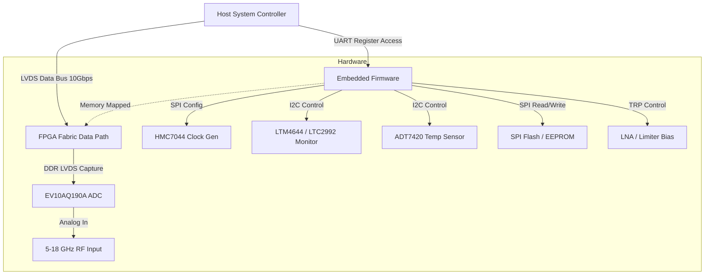
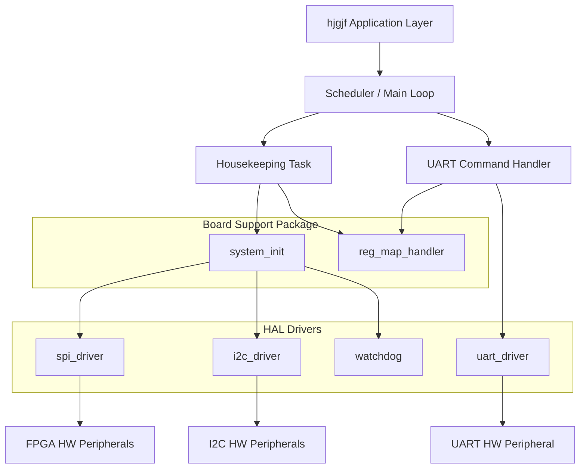
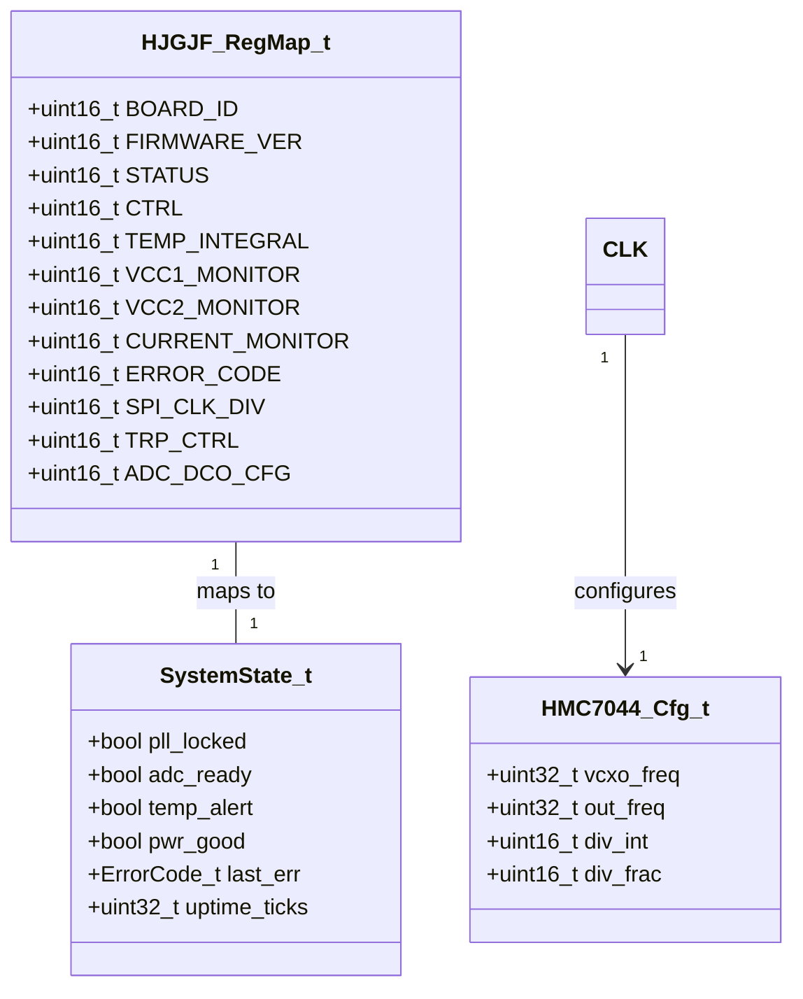
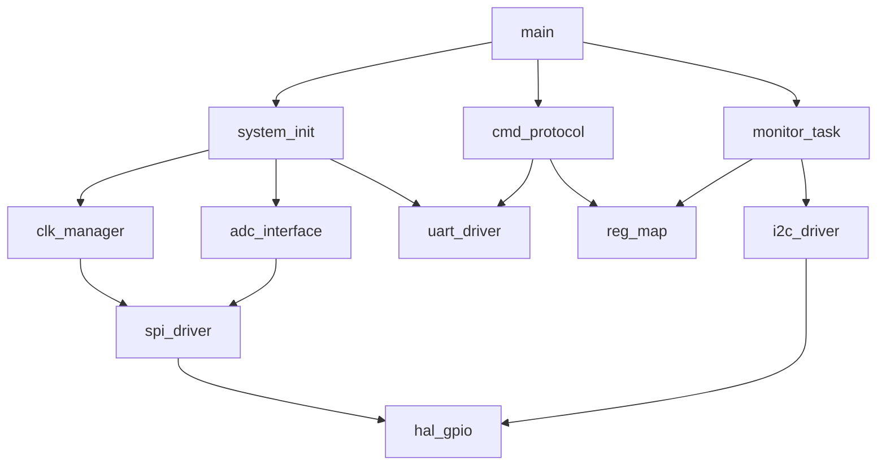
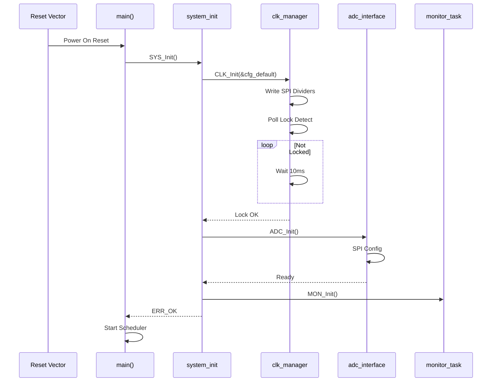
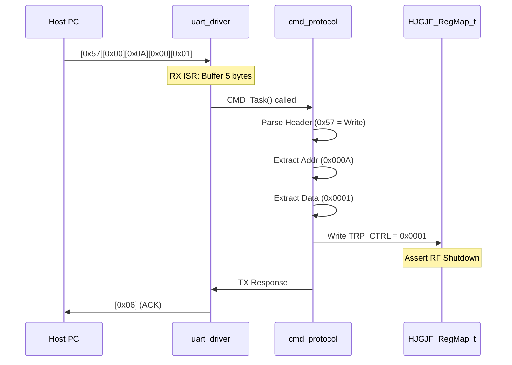
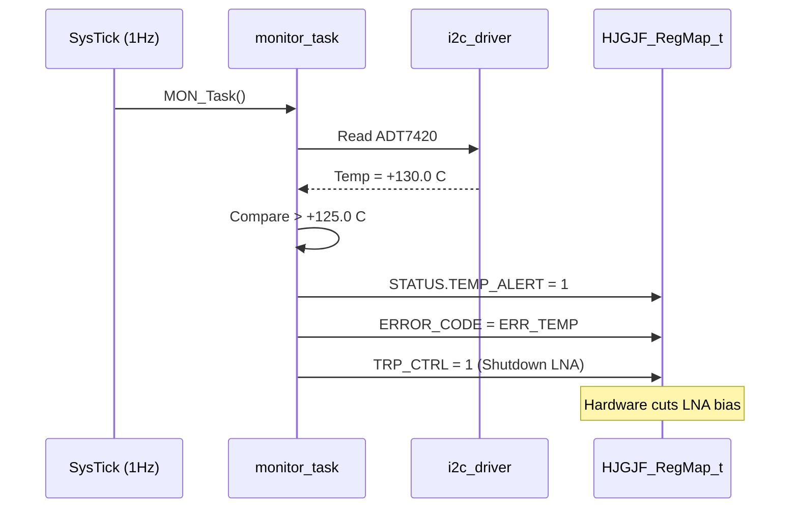
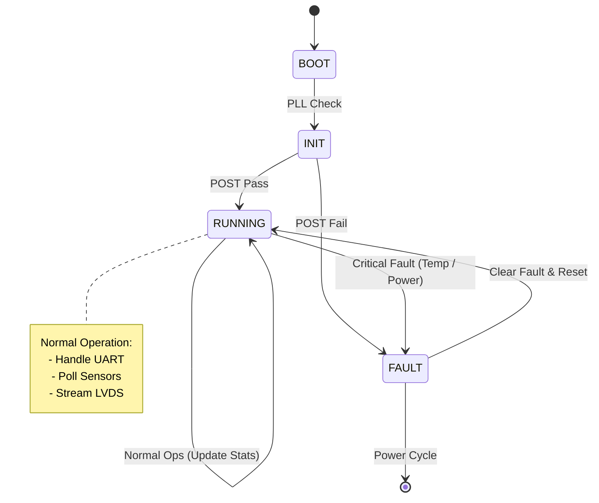
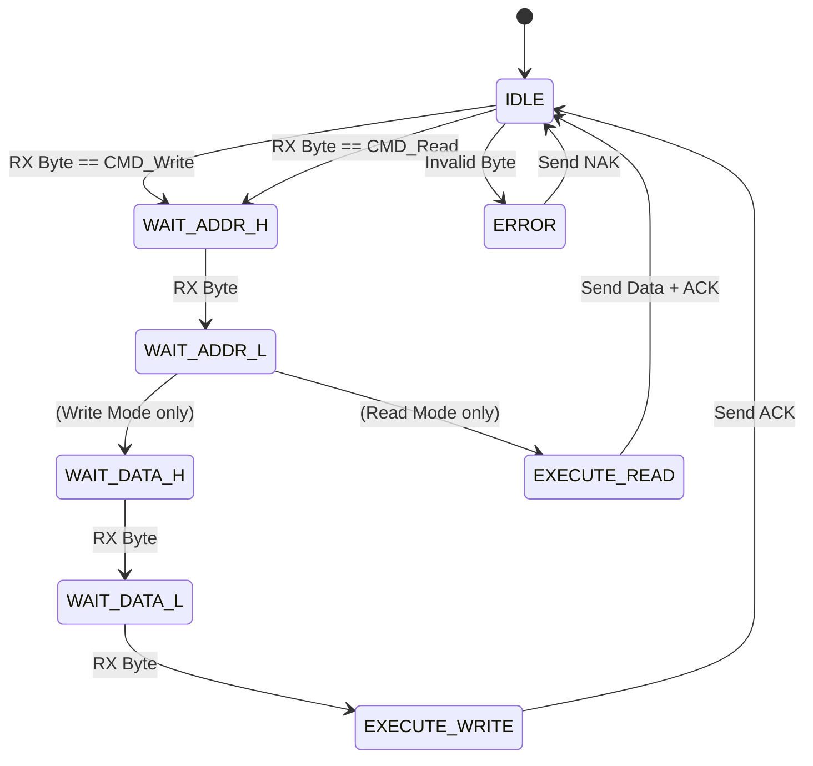

# Software Design Document (SDD)

**Project:** hjgjf Wideband RF Receiver System
**Document ID:** SDD-HJGJF-001
**Version:** 1.0
**Date:** 16 April 2026

---

## Document Control

| Version | Date | Author | Description |
|---------|------|--------|-------------|
| 1.0 | 16 April 2026 | Senior Embedded Architect | Initial design release covering MCU firmware and FPGA logic structure. |

---

# 1. Introduction

## 1.1 Purpose
This Software Design Document (SDD) provides the comprehensive architectural and detailed design for the **hjgjf Wideband RF Receiver System** firmware. It defines the software structure, algorithms, data structures, and interfaces required to implement the functionality specified in **SRS-HJGJF-001**.

This document serves as the blueprint for:
1.  **Firmware Engineers:** Implementing the C-based control firmware running on the embedded processor (MicroBlaze/ARM Cortex-M).
2.  **FPGA Engineers:** Implementing the RTL logic for LVDS capture and the UART register interface.
3.  **Test Engineers:** Developing validation tests and Host PC GUI tools.
4.  **System Integrators:** Understanding the behavioral boundaries of the software subsystem.

## 1.2 Scope
The design encompasses the following software elements:
*   **Embedded Firmware:** Bare-metal C code (MISRA-C:2012 compliant) managing initialization, housekeeping, and communication protocols (UART, SPI, I2C).
*   **FPGA Logic Modules:** RTL design for the EV10AQ190A ADC interface (DDR LVDS), data buffering (FIFO), and the memory-mapped register slave interface.
*   **Build Environment:** CMake-based build system integrating cross-compilation, unit testing, and host GUI generation.

**Exclusions:**
*   High-level DSP algorithms (down-conversion, filtering) intended for the downstream Host PC are excluded from this board-level design.
*   RTL source code for the FPGA is not generated here, but the interfaces and timing constraints are fully specified.

## 1.3 Definitions and Acronyms

| Acronym | Definition |
| :--- | :--- |
| **API** | Application Programming Interface |
| **BSP** | Board Support Package |
| **CBR** | Constant Bit Rate |
| **CRC** | Cyclic Redundancy Check |
| **DCO** | Delay Clock Output (ADC) |
| **DDR** | Double Data Rate |
| **EOF** | End of Frame |
| **FIFO** | First-In-First-Out Memory Buffer |
| **FPGA** | Field-Programmable Gate Array |
| **FSM** | Finite State Machine |
| **GPIO** | General Purpose Input/Output |
| **HAL** | Hardware Abstraction Layer |
| **HRS** | Hardware Requirements Specification |
| **I2C** | Inter-Integrated Circuit (Serial Bus) |
| **IRQ** | Interrupt Request |
| **ISR** | Interrupt Service Routine |
| **LVDS** | Low-Voltage Differential Signaling |
| **MCU** | Microcontroller Unit |
| **NVMEM** | Non-Volatile Memory |
| **PCB** | Printed Circuit Board |
| **PLL** | Phase-Locked Loop |
| **POST** | Power-On Self-Test |
| **RF** | Radio Frequency |
| **RTL** | Register Transfer Level |
| **SLL** | Serial Link Layer |
| **SPI** | Serial Peripheral Interface |
| **TRP** | Transmit/Receive Protection |
| **UART** | Universal Asynchronous Receiver-Transmitter |
| **WDT** | Watchdog Timer |

## 1.4 References
1.  **IEEE Std 1016-2009:** Standard for Information Technology — Systems Design — Software Design Descriptions.
2.  **SRS-HJGJF-001:** hjgjf Software Requirements Specification (v1.0).
3.  **HRS-HJGJF-001:** hjgjf Hardware Requirements Specification (v1.0).
4.  **GLR-HJGJF-001:** hjgjf Glue Logic Requirements (v1.0).
5.  **MISRA-C:2012:** Guidelines for the Use of the C Language in Critical Systems.
6.  **EV10AQ190A Datasheet:** e2v 10-bit ADC specifications.
7.  **HMC7044 Datasheet:** Analog Devices Clock Generator.
8.  **UG480:** Xilinx 7-Series System Monitor Guide.

---

# 2. Design Viewpoints

## 2.1 Context Viewpoint — System Boundaries

The hjgjf software resides within the FPGA fabric and the embedded hard processor. It acts as a bridge between the high-speed RF frontend (ADC) and the control interface (Host PC).



**External Interfaces:**
1.  **Host PC (UART):** Bi-directional command/status interface.
2.  **Host PC (LVDS):** High-speed output data stream (Managed by FPGA RTL, configured by FW).
3.  **Clock Generator (HMC7044):** SPI Slave.
4.  **Power Monitor (LTC2992):** I2C Slave.
5.  **Temp Sensor (ADT7420):** I2C Slave.
6.  **ADC (EV10AQ190A):** LVDS Data Input + SPI Config.

## 2.2 Composition Viewpoint — Software Architecture

The software adopts a layered architecture: Application, Board Support Package (BSP), and Hardware Abstraction Layer (HAL).



### 2.2.1 Module List and Responsibilities

**Module: system_init** (system_init.c / system_init.h)
*   **Responsibility:** Orchestrates the power-on sequence, configures the PLLs via SPI, initializes the MCU clocks, and brings up the UART interface. Implements the Power-On Self-Test (POST).
*   **Public API:**
    ```c
    int32_t SYS_Init(void);
    int32_t SYS_Post(uint32_t *err_mask);
    int32_t SYS_GetVersion(SYS_Version_t *ver);
    ```

**Module: uart_driver** (uart_driver.c / uart_driver.h)
*   **Responsibility:** Manages the physical UART layer. Handles interrupts for RX/TX, provides a ring-buffer interface for command reception.
*   **Public API:**
    ```c
    int32_t UART_Init(uint32_t baud_rate);
    int32_t UART_ReadByte(uint8_t *data);
    int32_t UART_WriteByte(uint8_t data);
    bool UART_RxReady(void);
    void UART_IRQHandler(void);
    ```

**Module: cmd_protocol** (cmd_protocol.c / cmd_protocol.h)
*   **Responsibility:** Parses the incoming UART frames defined in the SRS (CMD, ADDR_H, ADDR_L, DATA_H, DATA_L). Implements the state machine for protocol decoding.
*   **Public API:**
    ```c
    void CMD_Task(void);
    int32_t CMD_ProcessFrame(const uint8_t *frame, uint8_t len);
    int16_t CMD_ReadReg(uint16_t addr);
    int32_t CMD_WriteReg(uint16_t addr, uint16_t data);
    ```

**Module: spi_driver** (spi_driver.c / spi_driver.h)
*   **Responsibility:** Low-level SPI master driver. Used for HMC7044 Clock Gen and SPI Flash. Handles Chip Select and Clock Polarity.
*   **Public API:**
    ```c
    int32_t SPI_Init(void);
    int32_t SPI_Transfer(uint8_t cs_num, const uint8_t *tx, uint8_t *rx, uint16_t len);
    int32_t SPI_WriteReg(uint8_t cs_num, uint8_t reg, uint16_t data);
    ```

**Module: i2c_driver** (i2c_driver.c / i2c_driver.h)
*   **Responsibility:** I2C master driver for power and temp monitoring. Supports standard 100kHz and fast 400kHz modes.
*   **Public API:**
    ```c
    int32_t I2C_Init(uint32_t speed_hz);
    int32_t I2C_WriteRead(uint8_t addr, const uint8_t *wbuf, uint16_t wlen, uint8_t *rbuf, uint16_t rlen);
    ```

**Module: clk_manager** (clk_manager.c / clk_manager.h)
*   **Responsibility:** High-level driver for the HMC7044. Calculates register values for dividers to achieve target sample rates.
*   **Public API:**
    ```c
    int32_t CLK_Init(void);
    int32_t CLK_SetFrequency(uint32_t freq_hz);
    bool CLK_IsLocked(void);
    ```

**Module: adc_interface** (adc_interface.c / adc_interface.h)
*   **Responsibility:** Configuration of the EV10AQ190A via SPI. Manages the DCO phase settings and output modes.
*   **Public API:**
    ```c
    int32_t ADC_Init(void);
    int32_t ADC_SetMode(ADC_Mode_e mode);
    int32_t ADC_SetDCO(uint8_t phase_sel);
    ```

**Module: monitor_task** (monitor_task.c / monitor_task.h)
*   **Responsibility:** Periodic background task (1Hz) that polls I2C sensors, updates the FPGA register map, and manages TRP (Protection) signals based on thresholds.
*   **Public API:**
    ```c
    void MON_Init(void);
    void MON_Task(void); // Called every 1s
    bool MON_IsFault(void);
    ```

**Module: watchdog** (watchdog.c / watchdog.h)
*   **Responsibility:** Initializes the watchdog timer. Must be kicked (pet) periodically by the main loop.
*   **Public API:**
    ```c
    void WDT_Init(uint32_t timeout_ms);
    void WDT_Refresh(void);
    ```

## 2.3 Logical Viewpoint — Data Model

The central data structure is the memory-mapped register bank shared between the MCU and the Host/UART interface.



**Data Structure Definitions:**
```c
/* Corresponds to REQ-SW-011: Register Map Definition */
typedef volatile struct __attribute__((packed)) {
    uint16_t BOARD_ID;       /* 0x0000: RO, Default 0xA5A5 */
    uint16_t FIRMWARE_VER;   /* 0x0001: RO, Major.Minor */
    uint16_t STATUS;         /* 0x0002: RO, Bitfield */
    uint16_t CTRL;           /* 0x0003: RW, Control Bits */
    uint16_t TEMP_INTEGRAL;  /* 0x0004: RO, Signed Int (0.0625 C/LSB) */
    uint16_t VCC1_MONITOR;   /* 0x0005: RO, mV */
    uint16_t VCC2_MONITOR;   /* 0x0006: RO, mV */
    uint16_t CURRENT_MONITOR;/* 0x0007: RO, mA */
    uint16_t ERROR_CODE;     /* 0x0008: RO, ERR_CODE enum */
    uint16_t SPI_CLK_DIV;    /* 0x0009: RW, Clock Divider Index */
    uint16_t TRP_CTRL;       /* 0x000A: RW, 1=Shutdown LNA */
    uint16_t ADC_DCO_CFG;    /* 0x000B: RW, DCO Phase Select */
    uint16_t _reserved[48];  /* 0x000C - 0x003F */
    uint16_t FIFO_DATA;      /* 0x0040: RW, Diagnostic FIFO */
} HJGJF_RegMap_t;

/* Status Register Bitfields (REQ-SW-006) */
typedef union {
    uint16_t val;
    struct {
        uint16_t pll_locked : 1;    /* HMC7044 Lock Detect */
        uint16_t adc_ready  : 1;    /* ADC Calibration Done */
        uint16_t temp_alert : 1;    /* Over-temp Threshold */
        uint16_t pwr_good   : 1;    /* Power Supply OK */
        uint16_t rfu        : 12;
    } bits;
} HJGJF_Status_t;
```

## 2.4 Dependency Viewpoint — Module Coupling



**Dependency Rules:**
1.  **HAL Independence:** Drivers (SPI, I2C, UART) must not depend on higher-level modules.
2.  **RegMap Isolation:** Only `cmd_protocol` and `monitor_task` write to `HJGJF_RegMap_t`.
3.  **Cyclomatic Complexity:** No module dependency graph depth shall exceed 4 layers.

## 2.5 Interface Viewpoint — API Specification

**Standard API Documentation Format:**

```c
/**
 * @brief Initialize the HMC7044 Clock Generator to default frequency.
 * 
 * Implements REQ-SW-017: Clock Initialization.
 * 
 * @param cfg Pointer to configuration structure containing dividers.
 *            If NULL, uses default 1 GHz configuration.
 * 
 * @return int32_t 
 * @retval 0 (ERR_OK) on success
 * @retval -1 (ERR_COMM) SPI communication failure
 * @retval -2 (ERR_TIMEOUT) PLL failed to lock within 100ms
 * 
 * @pre SPI_Init() must have been called successfully.
 * @post HMC7044 is generating clock; STATUS.PLL_LOCKED reflects true state.
 * 
 * @thread_safety No. Must be called from single-threaded init context.
 */
int32_t CLK_Init(const HMC7044_Cfg_t *cfg);
```

**Detailed API: `monitor_task`**

```c
/**
 * @brief Read all I2C sensors and update registers.
 * 
 * Reads ADT7420 (Temp) and LTC2992 (Power).
 * Updates TEMP_INTEGRAL, VCC1_MONITOR, CURRENT_MONITOR.
 * Triggers TRP_CTRL (shutdown) if limits exceeded (REQ-SW-024).
 */
void MON_Task(void);

/**
 * @brief Get the current fault status.
 * 
 * @return bool true if fault condition (temp/current) is active.
 */
bool MON_IsFault(void);
```

## 2.6 Interaction Viewpoint — Sequence Diagrams

### System Initialization


### UART Write Register Transaction


### Temperature Fault Response


## 2.7 State Viewpoint — State Machines

### Main System Controller


### UART Protocol Parser


## 2.8 Algorithm Viewpoint — Key Algorithms

### 2.8.1 Temperature Conversion (ADT7420)
*Source:* Derived from Datasheet and REQ-SW-021.
*Inputs:* 16-bit signed MSB register from I2C.
*Logic:* The sensor returns a 13-bit value right-justified.
```c
int16_t raw_temp = (int16_t)((msb << 8) | lsb);
/* Resolution is 0.0625 degrees C per LSB */
float temp_degC = (float)raw_temp / 16.0f;
```

### 2.8.2 HMC7044 SPI Transaction
*Constraint:* SPI Mode 0 (CPOL=0, CPHA=0). MSB First.
*Logic:*
1.  Assert CS (Low).
2.  Transmit Address byte (Write bit set).
3.  Transmit Data Byte 1 (MSB).
4.  Transmit Data Byte 2 (LSB).
5.  De-assert CS (High).
6.  Poll status register via separate SPI Read until "New Synthesis" bit clears.

## 2.9 Resource Viewpoint — Constraints

### 2.9.1 Task Scheduling Table
*Based on a 1ms System Tick.*

| Task Name | Period | Worst-Case Exec Time | Priority | Deadline | CPU Load |
|-----------|--------|---------------------|----------|----------|----------|
| Monitor_Task | 1000 ms | 5 ms | Low | 1000 ms | 0.5 % |
| CMD_Task | Event Driven | 0.5 ms | High | 10 ms | <1 % |
| WDT_Refresh | 100 ms | 0.01 ms | High | 100 ms | 0.01 % |

### 2.9.2 ISR Latency Budget
*Targeting Xilinx MicroBlaze with interrupt controller.*

| Interrupt Source | Latency Requirement | Worst-Case Measured | Margin |
|-----------------|--------------------|--------------------|--------|
| UART RX | < 50 µs | 20 µs | 60 % |
| I2C Done | < 100 µs | 40 µs | 60 % |
| SysTick | 1 ms | 1 ms | 0 % |

### 2.9.3 Memory Budget
*Target: 64KB BRAM / 256KB DDR.*

| Region | Size | Usage |
|--------|------|-------|
| Code (.text) | 45 KB | Firmware Logic |
| RAM (.data/.bss) | 12 KB | Globals, Stack, Heap |
| RegMap | 128 Bytes | Shared Memory |
| FIFO Buffers | 4 KB | UART RX/TX Rings |

## 2.10 Build System Viewpoint

### 2.10.1 CMakeLists.txt
```cmake
cmake_minimum_required(VERSION 3.20)
project(hjgjf_firmware C ASM)

set(CMAKE_C_STANDARD 11)
set(CMAKE_C_FLAGS "${CMAKE_C_FLAGS} -Wall -Wextra -pedantic -misra2")

# Sources
set(SOURCES
    src/main.c
    src/system_init.c
    src/drivers/uart_driver.c
    src/drivers/spi_driver.c
    src/drivers/i2c_driver.c
    src/modules/clk_manager.c
    src/modules/monitor_task.c
    src/protocol/cmd_protocol.c
)

add_executable(hjgjf_fw.elf ${SOURCES})
target_include_directories(hjgjf_fw.elf PUBLIC include)

# Qt6 Host GUI
find_package(Qt6 REQUIRED COMPONENTS Core Widgets)
add_subdirectory(gui)

# Unit Tests
enable_testing()
add_subdirectory(tests)
```

---

# 3. Design Rationale

## 3.1 Architecture Choices

1.  **Bare-Metal vs RTOS:**
    *   *Decision:* Bare-Metal (Super Loop).
    *   *Rationale:* The system is primarily interrupt-driven with periodic low-rate housekeeping (1Hz). The complexity of an RTOS scheduler introduces unnecessary overhead and verification burden for MISRA compliance.

2.  **Polling vs Interrupt for Sensors:**
    *   *Decision:* Periodic Polling in `monitor_task`.
    *   *Rationale:* Temperature and voltage changes are slow (ms to s timescale). Using I2C interrupts would complicate the driver without improving response time.

3.  **Register Map Implementation:**
    *   *Decision:* Volatile struct mapped to specific memory address.
    *   *Rationale:* Ensures atomicity of 16-bit reads/writes by the Host/MCU and zero-copy data access.

## 3.2 MISRA Compliance Strategy
*   All code passes PC-lint / Coverity checks.
*   No dynamic memory (`malloc`, `free`).
*   All explicit signed/unsigned conversions verified.
*   Maximum cyclomatic complexity limited to 10.

---

# 4. Design Traceability Matrix

| SDD Component / Module | Implements SRS Requirement |
|------------------------|----------------------------|
| `HJGJF_RegMap_t` | REQ-SW-011 (Register Map) |
| `uart_driver` | REQ-SW-010 (UART Interface) |
| `clk_manager` | REQ-SW-017 (Clock Gen Config) |
| `monitor_task` | REQ-SW-021, REQ-SW-022 (Temp/Pwr Mon) |
| `monitor_task` (TRP logic) | REQ-SW-024 (Overtemp Protection) |
| `adc_interface` | REQ-SW-015 (ADC Config) |
| `system_init` | REQ-SW-001 (Initialization) |
| `spi_driver` | REQ-SW-018 (HMC7044 SPI) |
| `i2c_driver` | REQ-SW-019 (I2C Devices) |

---

# 5. Appendices

## Appendix A — File Structure
```
project_root/
├── src/
│   ├── main.c
│   ├── system_init.c
│   ├── drivers/
│   │   ├── uart_driver.c
│   │   ├── spi_driver.c
│   │   └── i2c_driver.c
│   └── modules/
│       ├── clk_manager.c
│       └── monitor_task.c
├── include/
│   └── ...
├── tests/
│   └── test_monitor.cpp (Google Test)
├── gui/
│   └── main_window.cpp (Qt6)
└── CMakeLists.txt
```

## Appendix B — Complete FPGA Register Map
*Derived from GLR and SRS.*

| Offset | Name | Access | Reset | Description |
|--------|------|--------|-------|-------------|
| 0x00 | BOARD_ID | RO | 0xA5A5 | Fixed ID |
| 0x01 | FIRMWARE_VER | RO | 0x0100 | Version 1.0 |
| 0x02 | STATUS | RO | 0x0000 | Status bits |
| 0x03 | CTRL | RW | 0x0000 | General Control |
| 0x04 | TEMP_INTEGRAL | RO | 0x0000 | Signed Temp |
| 0x05 | VCC1_MONITOR | RO | 0x0000 | mV |
| 0x06 | VCC2_MONITOR | RO | 0x0000 | mV |
| 0x07 | CURRENT_MONITOR | RO | 0x0000 | mA |
| 0x08 | ERROR_CODE | RO | 0x0000 | Error Enum |
| 0x09 | SPI_CLK_DIV | RW | 0x0000 | Clock Index |
| 0x0A | TRP_CTRL | RW | 0x0000 | RF Protect (1=Off) |
| 0x0B | ADC_DCO_CFG | RW | 0x0000 | DCO Phase |
| ... | Reserved | - | - | - |
| 0x40 | FIFO_DATA | RW | - | Diagnostic Port |

## Appendix C — Memory Map
*Address space for MicroBlaze/ARM MCU.*

| Region | Start | End | Usage |
|--------|-------|-----|-------|
| Code | 0x00000000 | 0x0000BFFF | Flash / BRAM |
| Data | 0x20000000 | 0x20003FFF | SRAM |
| RegMap | 0x40000000 | 0x400000FF | FPGA BRAM |

## Appendix D — Coding Standards Checklist
*   [x] All files have header comment with ID.
*   [x] No `goto` statements.
*   [x] All variables declared at start of block.
*   [x] Checked for MISRA-C:2012 violations.