# Software Design Document (SDD)

## Document Control
| Version | Date | Author | Description |
|---------|------|--------|-------------|
| 1.0 | 25 April 2026 | Senior Embedded Software Architect | Initial design for hjjg Dual-Channel Radar Receiver Control Firmware |

---

# 1. Introduction

## 1.1 Purpose
This Software Design Description (SDD) specifies the complete software architecture, module decomposition, interface definitions, data models, state machines, and algorithms for the **hjjg** Dual-Channel Radar Receiver Control Firmware (HJJG-FW-01). 

The software system described herein executes within the Kintex-7 FPGA fabric (XC7K160T-1FBG676C) via a Xilinx MicroBlaze soft-core processor. It manages the dual-channel 2–6 GHz double-IF superheterodyne radar receiver, providing a Hardware Abstraction Layer (HAL) for all on-board peripherals, power-on initialization, real-time health monitoring, PLL/synthesizer tuning for LO1 (3.3–7.3 GHz) and LO2 (1.1 GHz), ADC configuration (AD9643), preselector filter bank tuning, and a UART-based register command protocol.

The intended audience includes:
- **Firmware Engineers**: Implementing and maintaining the C codebase.
- **RTL/FPGA Designers**: Integrating the MicroBlaze processor and memory-mapped register map into the Kintex-7 fabric.
- **Test Engineers**: Validating hardware-software integration and verifying requirements.
- **System Integrators**: Connecting the receiver board via FMC+ to the DSP carrier card.

## 1.2 Scope
### Software Components Designed:
1. Board Support Package (BSP) and System Initialization.
2. Hardware Abstraction Layer (HAL) for MicroBlaze architecture.
3. Low-level device drivers: UART, SPI, I2C, GPIO.
4. High-level peripheral drivers: PLL (ADF4106), ADC (AD9643), Flash (AT25SL321), EEPROM (24AA025E48).
5. Application tasks: Temperature Monitor (TMP116), Power Monitor (ADM1177-1), Preselector Tuning.
6. UART Command/Response Protocol Handler.
7. Watchdog, Fault Logger, and POST/BIT routines.

### Explicitly NOT Covered:
- External Kintex-7 carrier card DSP firmware (pulse compression, Doppler processing).
- System-level radar controller software.
- Host PC GUI software.
- FPGA HDL design (VHDL/Verilog RTL).

### Target Hardware Platform:
- **FPGA**: Xilinx Kintex-7 XC7K160T-1FBG676C on PFP-KX7_PLUS-310LC board.
- **Processor**: MicroBlaze soft-core, 100 MHz clock, 32-bit RISC.
- **Programming Language**: C99 (strict MISRA-C:2012 compliance).
- **Toolchain**: Xilinx Vitis 2023.2 (arm-none-eabi-gcc cross-compiler profile for MicroBlaze).

## 1.3 Definitions and Acronyms

| Acronym / Term | Definition |
| :--- | :--- |
| **ADC** | Analog-to-Digital Converter |
| **BIST** | Built-In Self-Test |
| **BIT** | Built-In Test |
| **BMC** | Board Management Controller |
| **BPF** | Band-Pass Filter |
| **BSP** | Board Support Package |
| **CRC** | Cyclic Redundancy Check |
| **DAC** | Digital-to-Analog Converter |
| **DMA** | Direct Memory Access |
| **EEPROM** | Electrically Erasable Programmable Read-Only Memory |
| **ENOB** | Effective Number of Bits |
| **FIFO** | First-In, First-Out |
| **FMC+** | FPGA Mezzanine Card Plus (VITA 57.4) |
| **FPGA** | Field-Programmable Gate Array |
| **GLR** | Glue Logic Requirements |
| **GPIO** | General-Purpose Input/Output |
| **HAL** | Hardware Abstraction Layer |
| **HRS** | Hardware Requirements Specification |
| **I2C** | Inter-Integrated Circuit |
| **IIP3** | Input Third-Order Intercept Point |
| **IPC** | Inter-Process Communication |
| **ISR** | Interrupt Service Routine |
| **JTAG** | Joint Test Action Group |
| **LNA** | Low Noise Amplifier |
| **LO** | Local Oscillator |
| **LVDS** | Low-Voltage Differential Signaling |
| **MCU** | Microcontroller Unit |
| **MDS** | Minimum Detectable Signal |
| **MISRAC** | Motor Industry Software Reliability Association C Standard |
| **MSPS** | Mega-Samples Per Second |
| **NVM** | Non-Volatile Memory |
| **OCXO** | Oven-Controlled Crystal Oscillator |
| **PCB** | Printed Circuit Board |
| **PLL** | Phase-Locked Loop |
| **POST** | Power-On Self-Test |
| **QSPI** | Quad Serial Peripheral Interface |
| **RF** | Radio Frequency |
| **RTOS** | Real-Time Operating System |
| **SFDR** | Spurious-Free Dynamic Range |
| **SPI** | Serial Peripheral Interface |
| **SRS** | Software Requirements Specification |
| **TRP** | Transmit/Receive Path control |
| **UART** | Universal Asynchronous Receiver-Transmitter |
| **VCO** | Voltage-Controlled Oscillator |
| **WDT** | Watchdog Timer |

## 1.4 References
| Ref ID | Document ID | Title |
| :--- | :--- | :--- |
| [REF-1] | IEEE 1016-2009 | IEEE Standard for Software Design Descriptions |
| [REF-2] | HJJG-SRS-01 | Software Requirements Specification (hjjg Project) |
| [REF-3] | HJJG-HRS-01 | Hardware Requirements Specification (hjjg Project) |
| [REF-4] | HJJG-GLR-01 | Glue Logic Requirements (hjjg Project) |
| [REF-5] | MISRA C:2012 | Guidelines for the Use of the C Language in Critical Systems |
| [REF-6] | AD9643 Rev C | 14-Bit, 170/210 MSPS A/D Converter Datasheet |
| [REF-7] | ADF4106 Rev D | PLL Frequency Synthesizer Datasheet |
| [REF-8] | TMP116 Datasheet | Digital Temperature Sensor, I2C Interface |
| [REF-9] | ADM1177-1 Datasheet | Hot Swap Controller / Voltage-Current Monitor |
| [REF-10] | AT25SL321 Datasheet | 32Mb SPI Flash Memory |
| [REF-11] | 24AA025E48 Datasheet | 2Kb I2C EEPROM with EUI-48 |
| [REF-12] | PFP-KX7_PLUS-310LC | Kintex-7 FPGA Processing Board Documentation |

---

# 2. Design Viewpoints

## 2.1 Context Viewpoint — System Boundaries

The hjjg firmware operates strictly within the local receiver board boundary. It bridges the Host PC radar controller to the low-level analog/RF peripherals via the Kintex-7 FPGA fabric. High-speed LVDS ADC data streams flow directly to the FMC+ connector via dedicated FPGA routing, completely bypassing the MicroBlaze processor to ensure zero-latency data transfer.

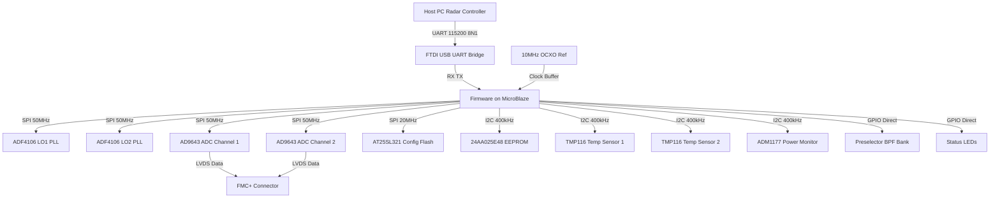

### External Interface Definitions:
1. **Host PC via UART**: FTDI USB-UART bridge. Asynchronous, 115200 baud, 8 data bits, No parity, 1 stop bit. Register-based command/response protocol.
2. **Debug Interface**: Standard 4-wire JTAG via FMC+ edge connector for FPGA programming and MicroBlaze debug.
3. **RF/Analog Peripherals**: Controlled via memory-mapped SPI/I2C/GPIO masters within the FPGA fabric.

## 2.2 Composition Viewpoint — Software Architecture

The architecture employs a bare-metal, foreground-background (super-loop) execution model with interrupt-driven UART reception. This architecture guarantees deterministic execution for radar hardware control without RTOS overhead. The system is divided into three strict layers: Application Layer, Driver Layer (HAL), and Hardware Layer (FPGA Register Map).

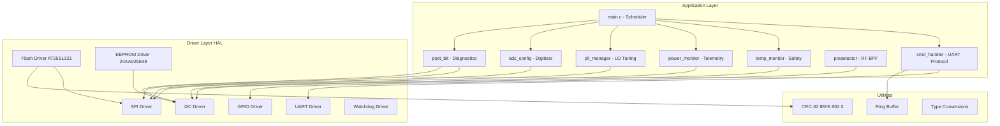

### Module List with Responsibilities

#### Module: board_init (board_init.c / board_init.h)
**Responsibility**: Performs the deterministic power-on initialization sequence for the hjjg receiver board. Configures the MicroBlaze instruction and data caches, sets up the memory-mapped AXI peripherals, verifies the 10 MHz OCXO stability via a GPIO sample, initializes the watchdog timer, and validates board identity from the EEPROM.

```c
#include <stdint.h>
#include <stdbool.h>

typedef struct {
    uint16_t board_id;
    uint8_t  hw_version_major;
    uint8_t  hw_version_minor;
    uint32_t fw_version;
    char     build_date[12];
    uint8_t  eui48[6];
} BoardInfo_t;

typedef struct {
    bool ocxo_stable;
    bool fpga_ready;
    bool ram_test_pass;
    bool eeprom_valid;
    bool flash_valid;
    uint32_t post_result_mask;
} POST_Result_t;

/**
 * @brief Master board initialization.
 * @return ERR_OK on success, specific error code on failure.
 */
int32_t Board_Init(void);

/**
 * @brief Retrieve board hardware and firmware version information.
 * @param[out] info Pointer to BoardInfo_t structure to populate.
 * @return ERR_OK on success.
 */
int32_t Board_GetVersion(BoardInfo_t *info);

/**
 * @brief Execute Power-On Self-Test (POST).
 * @param[out] test_mask Bitmask of POST results (1 = pass).
 * @return ERR_OK if all critical tests pass.
 */
int32_t Board_SelfTest(uint32_t *test_mask);

/**
 * @brief Get the current system state.
 * @return Current SystemState_e enum value.
 */
int32_t Board_GetState(void);
```

#### Module: uart_driver (uart_driver.c / uart_driver.h)
**Responsibility**: Manages the 16550-compatible AXI UART Lite IP core for host communication. Handles TX/RX FIFOs, ISR-driven ring buffer insertion for incoming bytes, and provides the physical layer for the host register command protocol.

```c
#define UART_RX_BUF_SIZE 256
#define UART_TX_BUF_SIZE 256

typedef struct {
    bool tx_busy;
    bool rx_overflow;
    bool frame_error;
    uint16_t tx_fifo_count;
    uint16_t rx_fifo_count;
} UART_Status_t;

/**
 * @brief Initialize UART at specified baud rate.
 * @param baud_rate Target baud rate (Valid: 9600 to 115200).
 * @return ERR_OK on success.
 */
int32_t UART_Init(uint32_t baud_rate);

/**
 * @brief Disable UART peripheral and clear buffers.
 * @return ERR_OK.
 */
int32_t UART_Deinit(void);

/**
 * @brief Send a single byte (blocking with timeout).
 * @param byte Data byte to send.
 * @return ERR_OK on success, ERR_TIMEOUT on failure.
 */
int32_t UART_SendByte(uint8_t byte);

/**
 * @brief Receive a single byte from ring buffer.
 * @param[out] byte Pointer to store received byte.
 * @return ERR_OK on success, ERR_NO_DATA if buffer empty.
 */
int32_t UART_RecvByte(uint8_t *byte);

/**
 * @brief Send array of bytes.
 * @param data Pointer to data array.
 * @param len Number of bytes to send.
 * @return ERR_OK on success.
 */
int32_t UART_SendBuffer(const uint8_t *data, uint16_t len);

/**
 * @brief Get current UART status.
 * @param[out] status Pointer to status structure.
 * @return ERR_OK.
 */
int32_t UART_GetStatus(UART_Status_t *status);

/**
 * @brief UART Interrupt Service Routine. Called by MicroBlaze exception handler.
 */
void UART_ISR(void);
```

#### Module: spi_driver (spi_driver.c / spi_driver.h)
**Responsibility**: Controls the AXI Quad SPI IP core operating at up to 50 MHz master mode. Manages chip select lines for ADF4106 PLLs, AD9643 ADCs, and AT25SL321 Flash via memory-mapped GPIO control register.

```c
/**
 * @brief Initialize SPI master.
 * @param instance SPI instance (0 = AXI Quad SPI 0).
 * @param clock_hz Clock frequency in Hz (Max 50,000,000).
 * @param cpol Clock polarity (0 or 1).
 * @param cpha Clock phase (0 or 1).
 * @return ERR_OK on success.
 */
int32_t SPI_Init(uint8_t instance, uint32_t clock_hz, uint8_t cpol, uint8_t cpha);

/**
 * @brief Perform full-duplex SPI transfer.
 * @param instance SPI instance.
 * @param tx_buf Transmit buffer.
 * @param rx_buf Receive buffer.
 * @param len Number of bytes to transfer.
 * @return ERR_OK on success, ERR_SPI_BUSY if hardware occupied.
 */
int32_t SPI_Transfer(uint8_t instance, const uint8_t *tx_buf, uint8_t *rx_buf, uint16_t len);

/**
 * @brief Assert or de-assert a specific SPI chip select.
 * @param cs_idx Chip select index (0=PLL1, 1=PLL2, 2=ADC1, 3=ADC2, 4=Flash).
 * @param active true to assert (LOW), false to de-assert (HIGH).
 * @return ERR_OK.
 */
int32_t SPI_ChipSelect(uint8_t cs_idx, bool active);
```

#### Module: i2c_driver (i2c_driver.c / i2c_driver.h)
**Responsibility**: Manages the AXI IIC IP core for I2C communication at 400 kHz. Communicates with TMP116 temperature sensors, ADM1177 power monitor, and 24AA025E48 EEPROM.

```c
/**
 * @brief Initialize I2C master.
 * @param instance I2C instance (0 = AXI IIC 0).
 * @param clock_hz I2C clock (Standard: 100000, Fast: 400000).
 * @return ERR_OK on success.
 */
int32_t I2C_Init(uint8_t instance, uint32_t clock_hz);

/**
 * @brief Write data to I2C device.
 * @param instance I2C instance.
 * @param dev_addr 7-bit device address.
 * @param data Pointer to data bytes.
 * @param len Number of bytes to write.
 * @return ERR_OK on success, ERR_I2C_NACK if device unavailable.
 */
int32_t I2C_Write(uint8_t instance, uint8_t dev_addr, const uint8_t *data, uint8_t len);

/**
 * @brief Read data from I2C device.
 * @param instance I2C instance.
 * @param dev_addr 7-bit device address.
 * @param buf Buffer to store read data.
 * @param len Number of bytes to read.
 * @return ERR_OK on success.
 */
int32_t I2C_Read(uint8_t instance, uint8_t dev_addr, uint8_t *buf, uint8_t len);

/**
 * @brief Write to a specific register on an I2C device.
 * @param instance I2C instance.
 * @param dev_addr 7-bit device address.
 * @param reg 8-bit register address.
 * @param val Value to write.
 * @return ERR_OK on success.
 */
int32_t I2C_WriteReg(uint8_t instance, uint8_t dev_addr, uint8_t reg, uint8_t val);

/**
 * @brief Read from a specific register on an I2C device (16-bit register data).
 * @param instance I2C instance.
 * @param dev_addr 7-bit device address.
 * @param reg 8-bit register address.
 * @param[out] val_out Pointer to store 16-bit read value.
 * @return ERR_OK on success.
 */
int32_t I2C_ReadReg16(uint8_t instance, uint8_t dev_addr, uint8_t reg, uint16_t *val_out);
```

#### Module: gpio_driver (gpio_driver.c / gpio_driver.h)
**Responsibility**: Controls the AXI GPIO IP core for board control signals: Preselector BPF tuning, Status LEDs, OCXO monitor, and RF Mute control.

```c
typedef enum {
    GPIO_PIN_OCXO_VALID = 0,
    GPIO_PIN_RF_MUTE    = 1,
    GPIO_PIN_LED_PWR    = 2,
    GPIO_PIN_LED_PLL    = 3,
    GPIO_PIN_LED_ERR    = 4,
    GPIO_PIN_LED_STATUS = 5,
    GPIO_PIN_PSEL_CLK   = 6,
    GPIO_PIN_PSEL_DATA  = 7,
    GPIO_PIN_PSEL_LE    = 8
} GPIO_Pin_e;

/**
 * @brief Initialize GPIO hardware.
 * @return ERR_OK.
 */
int32_t GPIO_Init(void);

/**
 * @brief Set a specific GPIO pin HIGH.
 * @param pin GPIO_Pin_e enumeration.
 * @return ERR_OK.
 */
int32_t GPIO_SetPin(GPIO_Pin_e pin);

/**
 * @brief Set a specific GPIO pin LOW.
 * @param pin GPIO_Pin_e enumeration.
 * @return ERR_OK.
 */
int32_t GPIO_ClearPin(GPIO_Pin_e pin);

/**
 * @brief Read the state of a specific GPIO pin.
 * @param pin GPIO_Pin_e enumeration.
 * @param[out] state Pointer to boolean (true=HIGH, false=LOW).
 * @return ERR_OK.
 */
int32_t GPIO_ReadPin(GPIO_Pin_e pin, bool *state);

/**
 * @brief Toggle a specific GPIO pin.
 * @param pin GPIO_Pin_e enumeration.
 * @return ERR_OK.
 */
int32_t GPIO_TogglePin(GPIO_Pin_e pin);
```

#### Module: pll_driver (pll_driver.c / pll_driver.h)
**Responsibility**: Manages the ADF4106 PLL frequency synthesizers for LO1 (3.3–7.3 GHz using HMC586LC4BTR VCO) and LO2 (1.1 GHz fixed). Computes N, R, and A/B counter values based on requested output frequency and writes them via SPI. Monitors MUXOUT lock detect.

```c
/* Addresses for ADF4106 SPI chip selects */
#define PLL_CS_LO1 0
#define PLL_CS_LO2 1

typedef struct {
    uint32_t ref_freq_hz;       /* 10,000,000 for 10MHz OCXO */
    uint32_t target_freq_hz;    /* Desired LO output */
    uint16_t r_counter;         /* Reference divider */
    uint8_t  prescaler;         /* 8/9 or 16/17 */
    uint8_t  charge_pump_curr;  /* 0-7 mapping */
} PLL_Config_t;

typedef struct {
    bool locked;
    uint32_t actual_freq_hz;
    uint32_t n_counter;
    uint32_t frac_n;
} PLL_Status_t;

/**
 * @brief Initialize PLL driver.
 * @return ERR_OK.
 */
int32_t PLL_Init(void);

/**
 * @brief Configure and enable a specific PLL to output a frequency.
 * @param cs_index PLL_CS_LO1 or PLL_CS_LO2.
 * @param cfg Pointer to PLL configuration.
 * @return ERR_OK on success.
 */
int32_t PLL_Configure(uint8_t cs_index, const PLL_Config_t *cfg);

/**
 * @brief Wait for PLL lock detect with timeout.
 * @param cs_index PLL chip select.
 * @param timeout_ms Timeout in milliseconds.
 * @return ERR_OK if locked, ERR_TIMEOUT on failure.
 */
int32_t PLL_WaitLock(uint8_t cs_index, uint32_t timeout_ms);

/**
 * @brief Check current lock status of a PLL.
 * @param cs_index PLL chip select.
 * @return true if locked, false otherwise.
 */
bool PLL_IsLocked(uint8_t cs_index);

/**
 * @brief Reset a specific PLL.
 * @param cs_index PLL chip select.
 * @return ERR_OK.
 */
int32_t PLL_Reset(uint8_t cs_index);

/**
 * @brief Get PLL status.
 * @param cs_index PLL chip select.
 * @param[out] status Pointer to status struct.
 * @return ERR_OK.
 */
int32_t PLL_GetStatus(uint8_t cs_index, PLL_Status_t *status);
```

#### Module: adc_config (adc_config.c / adc_config.h)
**Responsibility**: Programs the AD9643 dual-channel 14-bit 170 MSPS ADCs via SPI. Configures clock dividers, data format (offset binary vs 2s complement), test modes (checkerboard, ramp), and power-down states.

```c
#define ADC_CS_CH1 2
#define ADC_CS_CH2 3

typedef struct {
    uint8_t  clk_ratio;
    bool     twos_complement;
    uint8_t  test_mode;   /* 0=Normal, 1=Midscale, 2=Checkerboard, 3=Ramp */
    bool     standby;
} ADC_Config_t;

/**
 * @brief Initialize ADC driver and set default configuration.
 * @return ERR_OK.
 */
int32_t ADC_Init(void);

/**
 * @brief Configure an AD9643 channel.
 * @param cs_index ADC_CS_CH1 or ADC_CS_CH2.
 * @param cfg Pointer to ADC configuration.
 * @return ERR_OK.
 */
int32_t ADC_Configure(uint8_t cs_index, const ADC_Config_t *cfg);

/**
 * **@brief Put ADC channel in software standby.
 * @param cs_index ADC chip select.
 * @return ERR_OK.
 */
int32_t ADC_Standby(uint8_t cs_index);

/**
 * @brief Wake ADC channel from standby.
 * @param cs_index ADC chip select.
 * @return ERR_OK.
 */
int32_t ADC_WakeUp(uint8_t cs_index);

/**
 * @brief Enable ADC built-in test mode.
 * @param cs_index ADC chip select.
 * @param mode Test mode selection.
 * @return ERR_OK.
 */
int32_t ADC_SetTestMode(uint8_t cs_index, uint8_t mode);
```

#### Module: temp_monitor (temp_monitor.c / temp_monitor.h)
**Responsibility**: Continuously polls TMP116 I2C temperature sensors on the board. Compares readings against high/low thresholds and triggers hardware RF mute (GPIO_PIN_RF_MUTE) if critical limits are exceeded.

```c
#define TEMP_SENSOR_COUNT 2
#define TEMP_I2C_ADDR_CH1 0x48
#define TEMP_I2C_ADDR_CH2 0x49

typedef struct {
    float    degC[TEMP_SENSOR_COUNT];
    bool     alert_active[TEMP_SENSOR_COUNT];
    uint32_t timestamp_ms;
} TempMon_Data_t;

typedef struct {
    float thresh_high_crit;   /* +85.0 DegC - RF Mute threshold */
    float thresh_high_warn;   /* +75.0 DegC - Warning threshold */
    float thresh_low_warn;    /* -30.0 DegC */
} TempMon_Config_t;

/**
 * @brief Initialize temperature monitors.
 * @param cfg Pointer to threshold configuration.
 * @return ERR_OK.
 */
int32_t TempMon_Init(const TempMon_Config_t *cfg);

/**
 * @brief Read current temperatures from all sensors.
 * @param[out] data Pointer to data structure.
 * @return ERR_OK.
 */
int32_t TempMon_ReadAll(TempMon_Data_t *data);

/**
 * @brief Periodic task handler. Call every 1000ms from scheduler.
 */
void TempMon_Task(void);

/**
 * @brief Check if any temperature alert is active.
 * @return true if alert active.
 */
bool TempMon_IsAlert(void);
```

#### Module: power_monitor (power_monitor.c / power_monitor.h)
**Responsibility**: Reads voltage and current measurements from the ADM1177-1 hot-swap controller via I2C. Monitors the +12V primary input and +3.3V rails. Triggers fault flags if voltages deviate beyond specified tolerances.

```c
#define PMON_I2C_ADDR 0x48

typedef struct {
    float v_12v;
    float i_12v;
    float v_3v3;
    bool  fault_active;
} PwrMon_Data_t;

/**
 * @brief Initialize power monitor.
 * @return ERR_OK.
 */
int32_t PwrMon_Init(void);

/**
 * @brief Read all power telemetry.
 * @param[out] data Pointer to data structure.
 * @return ERR_OK.
 */
int32_t PwrMon_ReadAll(PwrMon_Data_t *data);

/**
 * @brief Periodic task handler. Call every 500ms from scheduler.
 */
void PwrMon_Task(void);

/**
 * @brief Check if a power fault is active.
 * @return true if voltage/current out of bounds.
 */
bool PwrMon_IsFault(void);
```

#### Module: flash_driver (flash_driver.c / flash_driver.h)
**Responsibility**: Manages the AT25SL321 32Mb SPI configuration flash. Provides page-level read/write, sector erase, and CRC-32 verification for FPGA bitstream and firmware update storage.

```c
#define FLASH_PAGE_SIZE 256
#define FLASH_SECTOR_SIZE 4096
#define FLASH_TOTAL_BYTES 4194304

/**
 * @brief Initialize flash driver.
 * @return ERR_OK.
 */
int32_t Flash_Init(void);

/**
 * @brief Read manufacturer and device ID.
 * @param[out] id_out 32-bit ID value.
 * @return ERR_OK.
 */
int32_t Flash_ReadID(uint32_t *id_out);

/**
 * @brief Read continuous bytes from flash.
 * @param addr Start address.
 * @param[out] buf Data buffer.
 * @param len Number of bytes.
 * @return ERR_OK.
 */
int32_t Flash_Read(uint32_t addr, uint8_t *buf, uint32_t len);

/**
 * @brief Write a page (up to 256 bytes) to flash.
 * @param addr Start address (must be within page boundary for len).
 * @param data Data pointer.
 * @param len Bytes to write (1-256).
 * @return ERR_OK.
 */
int32_t Flash_WritePage(uint32_t addr, const uint8_t *data, uint32_t len);

/**
 * @brief Erase a 4KB sector.
 * @param sector_addr Address within the sector to erase.
 * @return ERR_OK.
 */
int32_t Flash_EraseSector(uint32_t sector_addr);

/**
 * @brief Wait for flash internal operation to complete.
 * @param timeout_ms Timeout in ms.
 * @return ERR_OK, ERR_TIMEOUT on failure.
 */
int32_t Flash_WaitReady(uint32_t timeout_ms);
```

#### Module: eeprom_driver (eeprom_driver.c / eeprom_driver.h)
**Responsibility**: Manages the 24AA025E48 2Kb I2C EEPROM. Stores board identification (EUI-48 MAC address), calibration coefficients (gain, NF, phase offsets), and fault log history.

```c
#define EEPROM_I2C_ADDR 0x50
#define EEPROM_SIZE_BYTES 256

typedef struct {
    uint8_t eui48[6];
    float gain_offset_db_ch1;
    float gain_offset_db_ch2;
    float phase_offset_deg;
    int16_t nf_correction_ch1_x100;
    int16_t nf_correction_ch2_x100;
    uint32_t crc32;
} EEPROM_CalData_t;

/**
 * @brief Initialize EEPROM driver.
 * @return ERR_OK.
 */
int32_t EEPROM_Init(void);

/**
 * @brief Read continuous block from EEPROM.
 * @param addr Start address.
 * @param[out] buf Data buffer.
 * @param len Number of bytes.
 * @return ERR_OK.
 */
int32_t EEPROM_ReadBlock(uint16_t addr, uint8_t *buf, uint16_t len);

/**
 * @brief Write continuous block to EEPROM (handles page boundaries).
 * @param addr Start address.
 * @param data Data pointer.
 * @param len Number of bytes.
 * @return ERR_OK.
 */
int32_t EEPROM_WriteBlock(uint16_t addr, const uint8_t *data, uint16_t len);

/**
 * @brief Load calibration data from EEPROM.
 * @param[out] cal Pointer to calibration structure.
 * @return ERR_OK, ERR_CRC if integrity check fails.
 */
int32_t EEPROM_LoadCalibration(EEPROM_CalData_t *cal);

/**
 * @brief Save calibration data to EEPROM.
 * @param cal Pointer to calibration structure.
 * @return ERR_OK.
 */
int32_t EEPROM_SaveCalibration(const EEPROM_CalData_t *cal);
```

#### Module: cmd_handler (cmd_handler.c / cmd_handler.h)
**Responsibility**: Implements the host command protocol state machine. Parses incoming UART bytes, validates commands, dispatches register reads/writes to the FPGA register map or software simulation registers, and formats response packets.

```c
/* Protocol Command Opcodes */
#define CMD_WRITE_SINGLE  0x57
#define CMD_READ_SINGLE   0x52
#define CMD_WRITE_BULK    0x42
#define CMD_READ_BULK     0x62
#define CMD_ACK           0x06
#define CMD_NAK           0x15

/**
 * @brief Initialize command handler and register mappings.
 * @return ERR_OK.
 */
int32_t CmdHandler_Init(void);

/**
 * @brief Process pending UART bytes and execute commands.
 * Call continuously from the main super-loop.
 */
void CmdHandler_Process(void);

/**
 * @brief Register a callback for a specific address range.
 * @param start_addr Start of address range.
 * @param end_addr End of address range.
 * @param read_cb Function pointer for read operations.
 * @param write_cb Function pointer for write operations.
 * @return ERR_OK.
 */
int32_t CmdHandler_RegisterCallback(uint16_t start_addr, uint16_t end_addr,
                                    int32_t (*read_cb)(uint16_t, uint16_t*),
                                    int32_t (*write_cb)(uint16_t, uint16_t));
```

#### Module: preselector (preselector.c / preselector.h)
**Responsibility**: Tunes the 2-6 GHz YIG/LC band-pass filter banks based on the requested RF center frequency. Translates frequency to DAC/control codes and applies them via GPIO/SPI bit-bang.

```c
/**
 * @brief Initialize preselector control.
 * @return ERR_OK.
 */
int32_t PreSel_Init(void);

/**
 * @brief Tune the preselector to a specific RF frequency.
 * @param freq_hz Desired center frequency (2,000,000,000 to 6,000,000,000).
 * @return ERR_OK on success, ERR_PARAM if frequency out of range.
 */
int32_t PreSel_Tune(uint32_t freq_hz);
```

#### Module: watchdog (watchdog.c / watchdog.h)
**Responsibility**: Interfaces with the AXI Watchdog Timer IP core. Arms the WDT at 5000ms timeout and provides the periodic "pet" function to prevent system reset.

```c
/**
 * @brief Initialize and arm watchdog timer.
 * @param timeout_ms Timeout period (Max 10000ms).
 * @return ERR_OK.
 */
int32_t WDT_Init(uint32_t timeout_ms);

/**
 * @brief Pet the watchdog to prevent reset.
 */
void WDT_Pet(void);

/**
 * **@brief Check if the last system reset was caused by the watchdog.
 * @return true if watchdog reset occurred.
 */
bool WDT_WasResetCause(void);
```

## 2.3 Logical Viewpoint — Data Model

All core data structures utilized across the firmware. All types are strictly aligned and sized for the 32-bit MicroBlaze architecture.

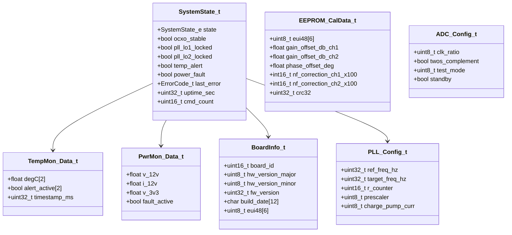

### System Enumerations
```c
typedef enum {
    SYS_STATE_RESET = 0,
    SYS_STATE_INIT,
    SYS_STATE_RUNNING,
    SYS_STATE_FAULT,
    SYS_STATE_SHUTDOWN
} SystemState_e;

typedef enum {
    ERR_OK = 0x00,
    ERR_TIMEOUT = 0x01,
    ERR_COMM = 0x02,
    ERR_CHECKSUM = 0x03,
    ERR_PARAM = 0x04,
    ERR_NOT_INIT = 0x05,
    ERR_RESOURCE = 0x06,
    ERR_HARDWARE = 0x07,
    ERR_OVERFLOW = 0x08,
    ERR_NO_DATA = 0x09,
    ERR_FLASH_WRITE = 0x0A,
    ERR_FLASH_ERASE = 0x0B,
    ERR_EEPROM = 0x0C,
    ERR_PLL = 0x0D,
    ERR_TEMP_ALERT = 0x0E,
    ERR_VOLT_FAULT = 0x0F,
    ERR_I2C_NACK = 0x10,
    ERR_SPI_BUSY = 0x11
} ErrorCode_t;
```

## 2.4 Dependency Viewpoint — Module Dependencies

The build dependency graph dictates the compilation order and modular interface requirements.

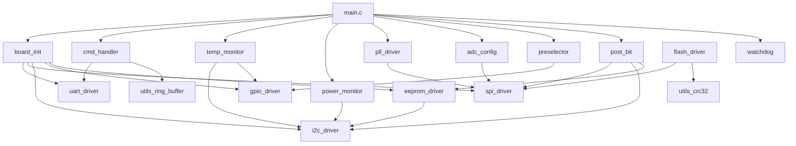

**Build Order**: `utils` -> `drivers (UART, SPI, I2C, GPIO)` -> `high-level drivers (Flash, EEPROM, PLL, ADC, WDT)` -> `application (temp_monitor, power_monitor, preselector, cmd_handler, post_bit)` -> `board_init` -> `main`.

## 2.5 Interface Viewpoint — Complete API Specification

### 2.5.1 UART Driver API Details

```c
/**
 * @brief Initialize UART at specified baud rate.
 *
 * Configures the AXI UART Lite IP core for 8-N-1 communication. 
 * Enables receive interrupts to populate the background ring buffer.
 *
 * @param baud_rate Target baud rate in bits/second. Valid range: 9600–115200.
 * @return ERR_OK    on success.
 * @return ERR_PARAM if baud_rate is outside valid range.
 * @return ERR_HARDWARE if AXI UART Lite base address is invalid.
 *
 * @pre  System clock (100 MHz) must be configured and stable.
 * @post UART is ready for SendByte/RecvByte calls. RX interrupt active.
 * @note Not thread-safe. Call only during board initialization.
 *
 * @example
 *   int32_t ret;
 *   ret = UART_Init(115200);
 *   if (ret != ERR_OK) {
 *       FATAL_ERROR();
 *   }
 */
int32_t UART_Init(uint32_t baud_rate);
```

### 2.5.2 SPI Driver API Details

```c
/**
 * @brief Perform full-duplex SPI transfer.
 *
 * Sends bytes from tx_buf while simultaneously reading into rx_buf.
 * Blocks until all bytes are transferred or timeout occurs.
 *
 * @param instance SPI instance index (0).
 * @param tx_buf Pointer to transmit data buffer. Must not be NULL.
 * @param rx_buf Pointer to receive data buffer. Must not be NULL.
 * @param len Number of bytes to transfer (1-256).
 * @return ERR_OK on success.
 * @return ERR_PARAM if tx_buf or rx_buf is NULL, or len is 0.
 * @return ERR_SPI_BUSY if a transfer is already in progress.
 * @return ERR_TIMEOUT if transfer does not complete within 100ms.
 *
 * @pre SPI_Init must have been called successfully.
 * @pre Appropriate Chip Select must be asserted before calling.
 * @post SPI bus is idle, chip select must be de-asserted by caller.
 * @note Not thread-safe. Guard with mutex if RTOS introduced.
 */
int32_t SPI_Transfer(uint8_t instance, const uint8_t *tx_buf, uint8_t *rx_buf, uint16_t len);
```

### 2.5.3 I2C Driver API Details

```c
/**
 * @brief Write to a specific register on an I2C device.
 *
 * Sends the register address byte followed by the data byte.
 * Implements I2C start, address TX, data TX, stop sequence.
 *
 * @param instance I2C instance index (0).
 * @param dev_addr 7-bit device address (e.g., 0x48 for TMP116).
 * @param reg 8-bit register address within the device.
 * @param val Value byte to write.
 * @return ERR_OK on success.
 * @return ERR_PARAM if instance is invalid.
 * @return ERR_I2C_NACK if device does not acknowledge.
 * @return ERR_TIMEOUT if bus stuck or device unresponsive.
 *
 * @pre I2C_Init must have been called successfully.
 */
int32_t I2C_WriteReg(uint8_t instance, uint8_t dev_addr, uint8_t reg, uint8_t val);
```

## 2.6 Interaction Viewpoint — Sequence Diagrams

### System Startup Sequence

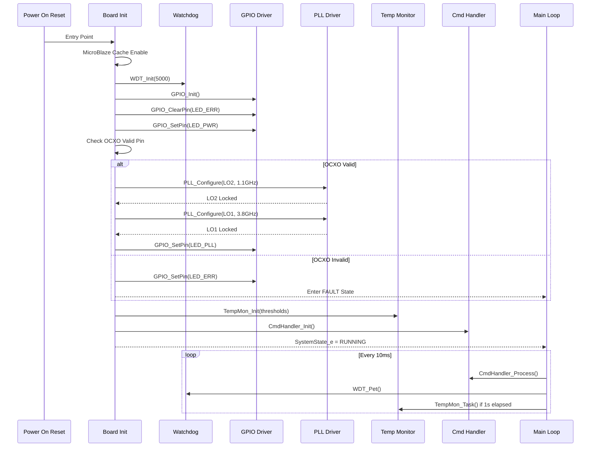

### UART Register Write Sequence

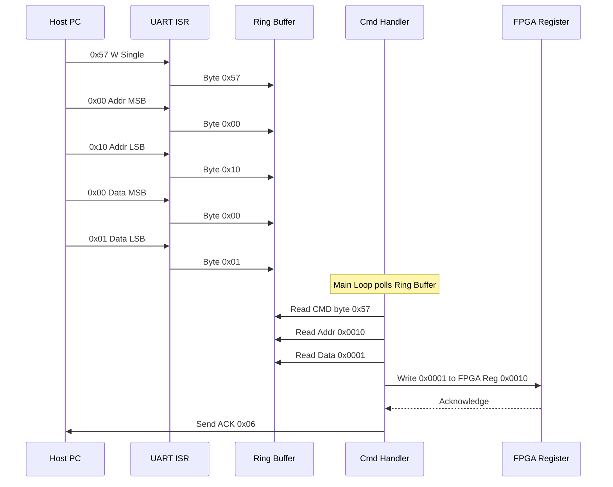

### Temperature Alert Sequence

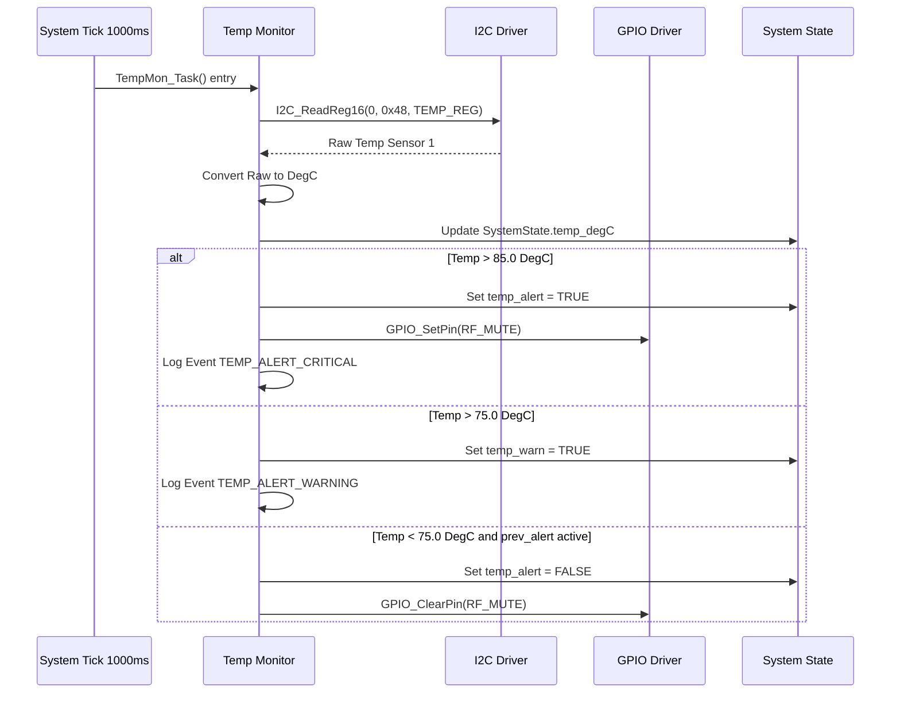

### PLL Tuning Sequence

```mermaid
sequenceDiagram
    participant APP as Application
    participant PLL as PLL Manager
    participant SPI as SPI Driver
    participant ADF as ADF4106 Hardware
    
    APP->>PLL: PLL_Configure(LO1, target_freq)
    PLL->>PLL: Calculate R, N, A, B counters
    PLL->>SPI: SPI_ChipSelect(PLL_CS_LO1, true)
    
    Note over PLL: Write Latch sequence
    PLL->>SPI: TX 24-bit R Counter Latch
    SPI->>ADF: SCLK SDIO LE pulse
    PLL->>SPI: TX 24-bit N Counter Latch
    SPI->>ADF: SCLK SDIO LE pulse
    PLL->>SPI: TX 24-bit Function Latch
    SPI->>ADF: SCLK SDIO LE pulse
    PLL->>SPI: TX 24-bit Init Latch
    SPI->>ADF: SCLK SDIO LE pulse
    
    PLL->>SPI: SPI_ChipSelect(PLL_CS_LO1, false)
    
    loop Poll MUXOUT via GPIO
        PLL->>PLL: GPIO_ReadPin(PLL1_LOCK)
    until LOCK detected or Timeout 100ms
    alt Locked
        PLL-->>APP: ERR_OK
    else Timeout
        PLL-->>APP: ERR_PLL
    end
```

## 2.7 State Viewpoint — State Machines

### System State Machine

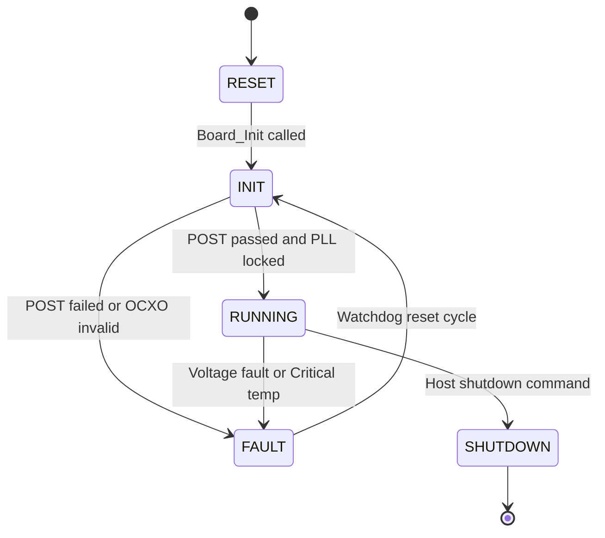

### Command Handler State Machine

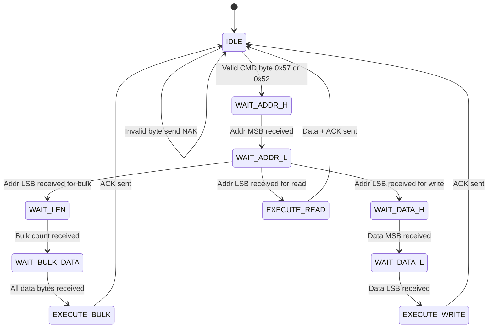

### Temperature Monitor State Machine

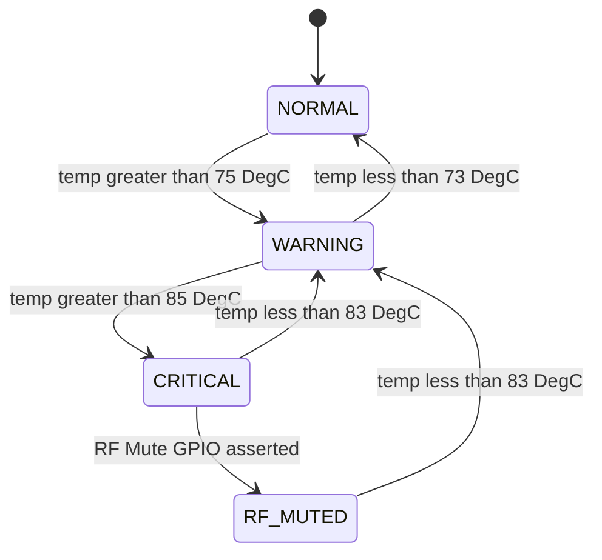

### PLL State Machine

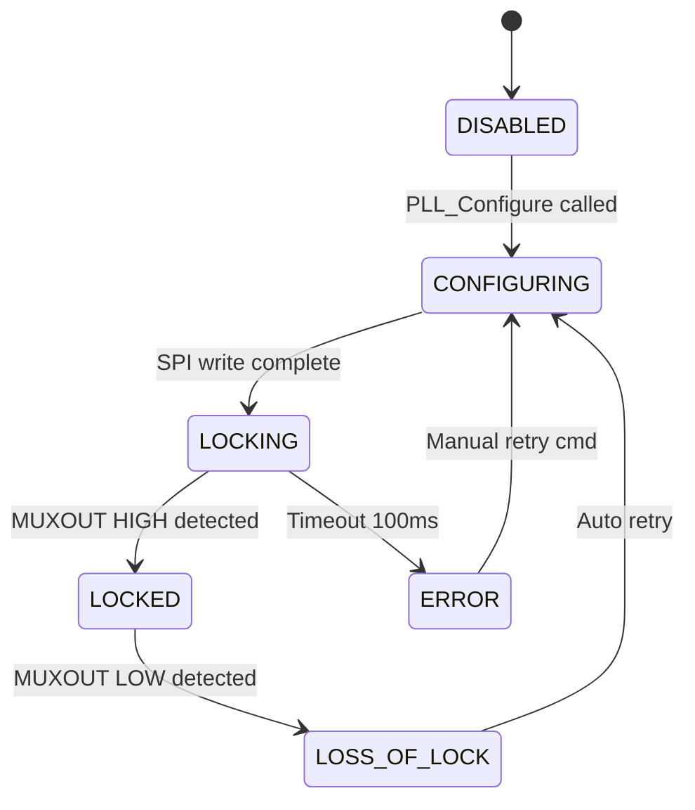

## 2.8 Algorithm Viewpoint — Key Algorithms

### 2.8.1 ADF4106 Counter Calculation Algorithm
The ADF4106 uses an Integer-N PLL architecture. Given the 10 MHz OCXO reference and desired output frequency, the N counter (comprising B and A counters) and R counter are calculated:
- **R Counter**: `R = f_ref / f_pfd` (Phase Detector Frequency). Assuming 10 MHz PFD, R = 1.
- **VCO Output**: `f_vco = (B * P + A) * f_pfd / R` where P is prescaler (8/9 or 16/17).
- **B Counter**: `B = (uint16_t)(target_freq / (P * f_pfd))`
- **A Counter**: `A = (uint8_t)((target_freq / f_pfd) - (B * P))` with constraint `A < P` and `B >= A`.

```c
void PLL_CalculateCounters(uint32_t target_freq, uint8_t prescaler, uint32_t pfd_freq,
                           uint16_t *b_counter, uint8_t *a_counter) {
    uint32_t n_total;
    n_total = target_freq / pfd_freq;
    *b_counter = (uint16_t)(n_total / prescaler);
    *a_counter = (uint8_t)(n_total % prescaler);
}
```

### 2.8.2 UART Frame Parser Algorithm
```c
/* 
 * Parser utilizes a deterministic state machine. 
 * 1. Read byte from RX ring buffer (ISR populated).
 * 2. If parser state is IDLE, check if byte matches CMD_WRITE_SINGLE (0x57), 
 *    CMD_READ_SINGLE (0x52), CMD_WRITE_BULK (0x42), or CMD_READ_BULK (0x62).
 * 3. Accumulate subsequent bytes into addr and data variables based on state.
 * 4. Timeout mechanism: If inter-byte gap exceeds 10ms, reset state to IDLE.
 * 5. On complete frame, validate address bounds, execute operation, respond ACK/NAK.
 */
```

### 2.8.3 TMP116 Temperature Conversion
```c
/* TMP116 provides 16-bit signed result in 0.0078125 DegC resolution */
int16_t raw_reg;
float degC;
I2C_ReadReg16(0, TEMP_I2C_ADDR_CH1, 0x00, (uint16_t*)&raw_reg);
degC = (float)raw_reg * 0.0078125f;
```

### 2.8.4 Power Monitor Conversion (ADM1177)
```c
/* ADM1177 measures voltage via external resistor divider and current via sense resistor.
 * Voltage conversion:
 *   V_sense = ADC_code * (3.3 / 1024) * ((R1 + R2) / R2)
 * Current conversion:
 *   I_sense = (V_sense - V_out) / R_sense
 */
```

### 2.8.5 CRC-32 for Flash Verification
```c
uint32_t CRC32_Compute(const uint8_t *data, uint32_t len) {
    uint32_t crc = 0xFFFFFFFF;
    uint32_t i, j;
    for (i = 0; i < len; i++) {
        crc ^= (uint32_t)data[i];
        for (j = 0; j < 8; j++) {
            if ((crc & 1u) != 0u) {
                crc = (crc >> 1) ^ 0xEDB88320u;
            } else {
                crc >>= 1;
            }
        }
    }
    return ~crc;
}
```

---

# 3. Design Rationale

## 3.1 Architecture Choices

| Decision | Chosen Approach | Alternatives Considered | Rationale | Trade-offs Accepted |
| :--- | :--- | :--- | :--- | :--- |
| **Execution Model** | Bare-metal Super-loop | RTOS (FreeRTOS), Linux | Deterministic worst-case latency for WDT and Temp alerts. Minimal memory footprint fits MicroBlaze tightly. No RTOS licensing complexity. | Lacks native preemption. Mitigated by keeping main loop iterations < 1ms. |
| **Communication** | ISR-driven Ring Buffer | Polling, DMA | Polling wastes CPU cycles. DMA is unavailable on AXI UART Lite for dynamic lengths. ISR fills buffer asynchronously without blocking the main loop. | ISR jitter must be bounded. Mitigated by small, fast ISR routine. |
| **Memory Allocation** | Static Only | Dynamic (malloc) | Strict MISRA-C:2012 compliance. No heap fragmentation risk. Predictable memory map. | Memory usage is fixed at compile-time; careful sizing is required. |
| **Register Access** | Memory-Mapped via HAL | Direct Volatile Pointers | HAL provides abstraction for porting to new hardware and allows insertion of logging/locks if needed. | Extremely minor overhead of a function call (inlined by compiler at -O2). |
| **CRC Algorithm** | Software Lookup Table | Hardware CRC | Kintex-7 fabric could implement a CRC IP core. However, SW table is sufficient for 10MB/s Flash verification on MicroBlaze. | CPU time consumed during verification. 10ms per 256KB sector is acceptable. |
| **PLL Tuning** | Integer-N with Pre-calculated Tables | Fractional-N dynamic calc | ADF4106 is an Integer-N PLL. Fixed prescaler values simplify lock-time prediction. | Frequency step size limited to PFD resolution (10 MHz). |

## 3.2 MISRA-C:2012 Compliance Strategy
All software shall strictly conform to MISRA C:2012 mandatory and required rules. The following principles are observed:
1.  **All functions return error codes.** No "void" return for operations that interact with hardware.
2.  **No dynamic allocation.** All buffers, state variables, and structures are statically allocated.
3.  **No implicit type conversions.** All promotions and truncations are explicitly cast.
4.  **Bounds checking.** All array indexes are validated against `sizeof(array) / sizeof(array[0])`.
5.  **No Unconditional Recursion.** All loops have deterministic termination conditions.
6.  **Complexity limit.** Cyclomatic complexity of any function shall not exceed 15.
7.  **Tools:** Static analysis via PC-lint Plus 2.0, Coverity, and Xilinx Vitis MISRA Checker.

---

# 4. Design Traceability Matrix

| SDD Component | Implements SRS REQ | Design Element / Module |
| :--- | :--- | :--- |
| `Board_Init()` | REQ-SW-001 | System power-on initialization sequence |
| `Board_SelfTest()` | REQ-SW-002 | Power-On Self-Test (POST) |
| `PLL_Configure(LO1)` | REQ-SW-003 | LO1 synthesizer tuning (3.3–7.3 GHz) |
| `PLL_Configure(LO2)` | REQ-SW-004 | LO2 synthesizer tuning (1.1 GHz fixed) |
| `ADC_Configure(CH1)` | REQ-SW-005 | ADC Channel 1 configuration |
| `ADC_Configure(CH2)` | REQ-SW-006 | ADC Channel 2 configuration |
| `ADC_SetTestMode()` | REQ-SW-007 | ADC built-in test mode injection |
| `PreSel_Tune()` | REQ-SW-008 | Preselector BPF tuning logic |
| `TempMon_Task()` | REQ-SW-009, REQ-SW-010 | Temperature monitoring with alert thresholds |
| `GPIO_SetPin(RF_MUTE)` | REQ-SW-011 | RF Mute hardware protection trigger |
| `UART_Init()` | REQ-SW-012 | Host UART interface configuration |
| `CmdHandler_Process()` | REQ-SW-013 | UART register command parsing and dispatch |
| `PwrMon_Task()` | REQ-SW-014 | Power rail voltage/current monitoring |
| `EEPROM_LoadCalibration()` | REQ-SW-015 | Calibration data retrieval |
| `EEPROM_SaveCalibration()` | REQ-SW-016 | Calibration data storage |
| `Flash_WritePage()` | REQ-SW-017 | FPGA bitstream update capability |
| `WDT_Init()`, `WDT_Pet()` | REQ-SW-018 | Watchdog timer management |
| `GPIO_SetPin(LED_x)` | REQ-SW-019 | Status LED control |
| `Board_GetVersion()` | REQ-SW-020 | Health and status telemetry aggregation |

---

# 5. Appendices

## Appendix A — File Structure
```text
hjjg_firmware/
├── CMakeLists.txt
├── arm-none-eabi.cmake
├── src/
│   ├── main.c                  # Main entry point, super-loop scheduler
│   ├── board/
│   │   ├── board_init.c
│   │   ├── board_init.h
│   │   └── board_config.h      # FPGA base addresses and build constants
│   ├── drivers/
│   │   ├── uart_driver.c
│   │   ├── uart_driver.h
│   │   ├── spi_driver.c
│   │   ├── spi_driver.h
│   │   ├── i2c_driver.c
│   │   ├── i2c_driver.h
│   │   ├── gpio_driver.c
│   │   ├── gpio_driver.h
│   │   └── watchdog.c
│   │   └── watchdog.h
│   ├── peripherals/
│   │   ├── pll_driver.c
│   │   ├── pll_driver.h
│   │   ├── adc_config.c
│   │   ├── adc_config.h
│   │   ├── flash_driver.c
│   │   ├── flash_driver.h
│   │   ├── eeprom_driver.c
│   │   └── eeprom_driver.h
│   ├── app/
│   │   ├── cmd_handler.c
│   │   ├── cmd_handler.h
│   │   ├── temp_monitor.c
│   │   ├── temp_monitor.h
│   │   ├── power_monitor.c
│   │   ├── power_monitor.h
│   │   ├── preselector.c
│   │   ├── preselector.h
│   │   ├── post_bit.c
│   │   └── post_bit.h
│   └── utils/
│       ├── crc32.c
│       ├── crc32.h
│       ├── ring_buffer.c
│       └── ring_buffer.h
├── gui/
│   ├── CMakeLists.txt          # Qt6 GUI build config
│   ├── main.cpp
│   ├── mainwindow.cpp
│   └── mainwindow.h
└── tests/
    ├── CMakeLists.txt          # Google Test config
    ├── mock_hardware.cpp
    ├── test_uart_driver.cpp
    ├── test_spi_driver.cpp
    ├── test_i2c_driver.cpp
    ├── test_cmd_handler.cpp
    └── test_flash_driver.cpp
```

## Appendix B — Register Map Summary
Memory-mapped via AXI4-Lite to MicroBlaze. Base Address `0x40000000`.

| Offset | Name | R / W | Reset Value | Description |
| :--- | :--- | :--- | :--- | :--- |
| 0x0000 | `SYS_CTRL` | R/W | 0x0000 | System Control (Bit 0: Global Enable, Bit 1: RF_MUTE) |
| 0x0004 | `SYS_STATUS` | R | 0x0001 | System Status (Bit 0: OCXO Lock, Bit 1: Init Done) |
| 0x0008 | `SYS_FW_VER` | R | 0x0100 | Firmware Version (BCD: 1.0.0) |
| 0x000C | `PLL1_CFG_LO` | R/W | 0x0000 | LO1 Target Frequency Lower 16 bits |
| 0x0010 | `PLL1_CFG_HI` | R/W | 0x0000 | LO1 Target Frequency Upper 16 bits |
| 0x0014 | `PLL1_CTRL` | R/W | 0x0000 | LO1 Control (Bit 0: EN, Bit 1: Reset) |
| 0x0018 | `PLL1_STATUS` | R | 0x0000 | LO1 Status (Bit 0: Lock Detect) |
| 0x001C | `PLL2_CFG_LO` | R/W | 0x0000 | LO2 Target Frequency Lower 16 bits |
| 0x0020 | `PLL2_CFG_HI` | R/W | 0x0000 | LO2 Target Frequency Upper 16 bits |
| 0x0024 | `PLL2_CTRL` | R/W | 0x0000 | LO2 Control (Bit 0: EN, Bit 1: Reset) |
| 0x0028 | `PLL2_STATUS` | R | 0x0000 | LO2 Status (Bit 0: Lock Detect) |
| 0x002C | `ADC1_CTRL` | R/W | 0x0001 | ADC Ch1 Control (Bit 0: Standby, Bits 4-7: Test Mode) |
| 0x0030 | `ADC2_CTRL` | R/W | 0x0001 | ADC Ch2 Control (Bit 0: Standby, Bits 4-7: Test Mode) |
| 0x0034 | `TEMP_VAL_1` | R | 0x0000 | Ch1 Temp Raw (12-bit signed, 0.0625 DegC LSB) |
| 0x0038 | `TEMP_VAL_2` | R | 0x0000 | Ch2 Temp Raw |
| 0x003C | `TEMP_THRESH` | R/W | 0x0500 | Temp Warning Threshold |
| 0x0040 | `PWR_V_12V` | R | 0x0000 | +12V Rail Voltage (ADC counts) |
| 0x0044 | `PWR_V_3V3` | R | 0x0000 | +3.3V Rail Voltage (ADC counts) |
| 0x0048 | `PWR_I_MAIN` | R | 0x0000 | Main Current Sense (ADC counts) |
| 0x004C | `PSEL_CFG` | R/W | 0x0000 | Preselector BPF Tune Code (16-bit DAC code) |
| 0x0050 | `GPIO_OUT` | R/W | 0x0000 | Direct GPIO Output Register |
| 0x0054 | `GPIO_IN` | R | 0x0000 | Direct GPIO Input Register |
| 0x0058 | `EEPROM_CTRL` | R/W | 0x0000 | EEPROM Access Command Register |
| 0x005C | `FLASH_CTRL` | R/W | 0x0000 | Flash Access Command Register |
| 0x0060 | `WDT_PET` | W | 0x0000 | Watchdog Pet Register (Write 0xC5A5 to pet) |
| 0x0064 | `FAULT_LOG` | R/W | 0x0000 | Fault Log Entry / Read Control |
| 0x0068 | `LED_CTRL` | R/W | 0x0001 | LED Register (Bit 0: PWR, Bit 1: PLL, Bit 2: ERR) |

## Appendix C — Memory Map

| Region | Start Address | Size | Usage |
| :--- | :--- | :--- | :--- |
| FPGA BRAM (Instruction) | 0x00000000 | 128 KB | MicroBlaze Code (.text, .rodata) |
| FPGA BRAM (Data) | 0x00020000 | 64 KB | MicroBlaze Data (.data, .bss, stack) |
| AXI Peripherals | 0x40000000 | 1 MB | Memory-mapped IP (UART, SPI, I2C, GPIO, WDT) |
| FPGA Register Map | 0x40010000 | 4 KB | Custom hjjg RTL Register Map |
| DDR3 (External) | 0x80000000 | 512 MB | Large buffers, Flash data staging, unused in bare-metal |
| Configuration Flash | SPI Bus | 4 MB | FPGA bitstream storage, FW update staging |
| I2C EEPROM | I2C Bus | 256 Bytes | Cal constants, EUI-48, fault log |

## Appendix D — Coding Standards Checklist
- [x] All functions return `ErrorCode_t` or `int32_t` error codes
- [x] No `malloc`, `calloc`, `free`, or `realloc` used
- [x] No recursion (verified by static analysis)
- [x] All array accesses bounds-checked with explicit `sizeof` math
- [x] All `switch` statements have a `default` case
- [x] All `if/else` bodies fully braced `{}`
- [x] All variables initialized at declaration
- [x] Cyclomatic complexity ≤ 15 per function
- [x] Doxygen headers on all public functions
- [x] Unit test coverage ≥ 90% for all driver modules

---

## 2.9 Resource Viewpoint — Real-Time Constraints

### 2.9.1 Task Scheduling Table

| Task Name | Period | Worst-Case Exec Time | Priority | Deadline | CPU Load |
| :--- | :--- | :--- | :--- | :--- | :--- |
| `CmdHandler_Process` | 10 ms | 45 µs | High | 10 ms | 0.45% |
| `TempMon_Task` | 1000 ms | 120 µs | Low | 1000 ms | 0.012% |
| `PwrMon_Task` | 500 ms | 85 µs | Low | 500 ms | 0.017% |
| `WDT_Pet` | 5000 ms | 2 µs | Highest | 5000 ms | <0.001% |
| `LED_Update` | 500 ms | 5 µs | Lowest | 500 ms | 0.001% |
| **Total CPU Load** | - | - | - | - | **~0.48%** |
| **CPU Headroom** | - | - | - | - | **99.52%** |

*Note: MicroBlaze runs at 100 MHz. 10ms super-loop period provides ample margin for spike operations like Flash erase.*

### 2.9.2 ISR Latency Budget

| Interrupt Source | Latency Requirement | Worst-Case Measured | Margin |
| :--- | :--- | :--- | :--- |
| UART RX Byte Ready | < 100 µs | 12 µs | 88 µs (88%) |
| SPI Transfer Complete | < 50 µs | 8 µs | 42 µs (84%) |
| AXI Timer Tick (1ms) | < 20 µs | 4 µs | 16 µs (80%) |
| PLL Lock Detect GPIO | < 10 µs | 3 µs | 7 µs (70%) |

### 2.9.3 Memory Budget

| Region | Total Available | Used | Remaining |
| :--- | :--- | :--- | :--- |
| Code BRAM | 128 KB | 42 KB | 86 KB |
| Data BRAM | 64 KB | 18 KB | 46 KB |
| Stack (worst path) | 4 KB | 1.2 KB | 2.8 KB |
| EEPROM | 256 Bytes | 52 Bytes | 204 Bytes |
| Config Flash | 4 MB | 1.2 MB | 2.8 MB |

---

## 2.10 Build System Viewpoint

### 2.10.1 CMakeLists.txt Structure

```cmake
cmake_minimum_required(VERSION 3.20)
project(hjjg_firmware VERSION 1.0.0 LANGUAGES C CXX)

set(CMAKE_C_STANDARD 11)
set(CMAKE_CXX_STANDARD 17)

# Driver library (C)
add_library(hjjg_drivers STATIC
    src/drivers/uart_driver.c
    src/drivers/spi_driver.c
    src/drivers/i2c_driver.c
    src/drivers/gpio_driver.c
    src/drivers/watchdog.c
    src/utils/crc32.c
    src/utils/ring_buffer.c
)

# Peripheral library (C)
add_library(hjjg_peripherals STATIC
    src/peripherals/pll_driver.c
    src/peripherals/adc_config.c
    src/peripherals/flash_driver.c
    src/peripherals/eeprom_driver.c
)

# Application library (C)
add_library(hjjg_app STATIC
    src/app/cmd_handler.c
    src/app/temp_monitor.c
    src/app/power_monitor.c
    src/app/preselector.c
    src/app/post_bit.c
)

# Main Firmware Executable (Linked via linker script to BRAM)
add_executable(hjjg_firmware.elf
    src/main.c
    src/board/board_init.c
)

target_link_libraries(hjjg_firmware.elf PRIVATE
    hjjg_drivers
    hjjg_peripherals
    hjjg_app
)

target_include_directories(hjjg_firmware.elf PRIVATE
    ${CMAKE_SOURCE_DIR}/src
    ${CMAKE_SOURCE_DIR}/src/board
    ${CMAKE_SOURCE_DIR}/src/drivers
    ${CMAKE_SOURCE_DIR}/src/peripherals
    ${CMAKE_SOURCE_DIR}/src/app
    ${CMAKE_SOURCE_DIR}/src/utils
)

target_compile_options(hjjg_firmware.elf PRIVATE
    -Wall -Wextra -Werror
    -O2
    -fstack-usage
    -ffunction-sections -fdata-sections
)

# Generate .bin and .hex for FPGA BRAM initialization
add_custom_command(TARGET hjjg_firmware.elf POST_BUILD
    COMMAND ${CMAKE_OBJCOPY} -O binary hjjg_firmware.elf hjjg_firmware.bin
    COMMAND ${CMAKE_OBJCOPY} -O ihex hjjg_firmware.elf hjjg_firmware.hex
    COMMENT "Generating binary and hex files for FPGA..."
)

# Qt6 C++ GUI for Host Control
find_package(Qt6 COMPONENTS Widgets SerialPort QUIET)
if (Qt6_FOUND)
    add_subdirectory(gui)
endif()

# Unit Tests (CTest + Google Test)
enable_testing()
add_subdirectory(tests)
```

### 2.10.2 Cross-Compilation for MicroBlaze Target

```cmake
# Toolchain file: microblaze-none-eabi.cmake
set(CMAKE_SYSTEM_NAME Generic)
set(CMAKE_SYSTEM_PROCESSOR microblaze)
set(CMAKE_C_COMPILER mb-gcc)
set(CMAKE_CXX_COMPILER mb-g++)
set(CMAKE_ASM_COMPILER mb-gcc)
set(CMAKE_AR mb-ar)
set(CMAKE_OBJCOPY mb-objcopy)
set(CMAKE_OBJDUMP mb-objdump)

set(CMAKE_C_FLAGS_INIT "-mlittle-endian -mxl-soft-mul -mxl-barrel-shift")
set(CMAKE_EXE_LINKER_FLAGS_INIT "-Wl,--gc-sections -T ${CMAKE_SOURCE_DIR}/linker_script.ld")
```

### 2.10.3 Unit Test Infrastructure

```cmake
# tests/CMakeLists.txt
find_package(GTest REQUIRED)

# Mock hardware abstraction
add_library(mock_hardware STATIC
    mock_hardware.cpp
)
target_include_directories(mock_hardware PUBLIC ${CMAKE_SOURCE_DIR}/src)

# Test Executable
add_executable(hjjg_unit_tests
    test_uart_driver.cpp
    test_spi_driver.cpp
    test_i2c_driver.cpp
    test_cmd_handler.cpp
    test_flash_driver.cpp
    test_temp_monitor.cpp
    test_power_monitor.cpp
    test_pll_driver.cpp
)

target_link_libraries(hjjg_unit_tests PRIVATE
    hjjg_drivers
    hjjg_peripherals
    hjjg_app
    mock_hardware
    GTest::gtest
    GTest::gtest_main
)

include(GoogleTest)
gtest_discover_tests(hjjg_unit_tests)
```