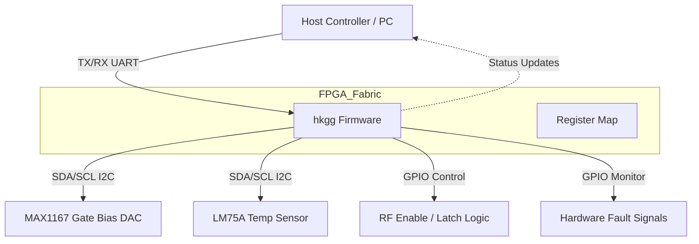
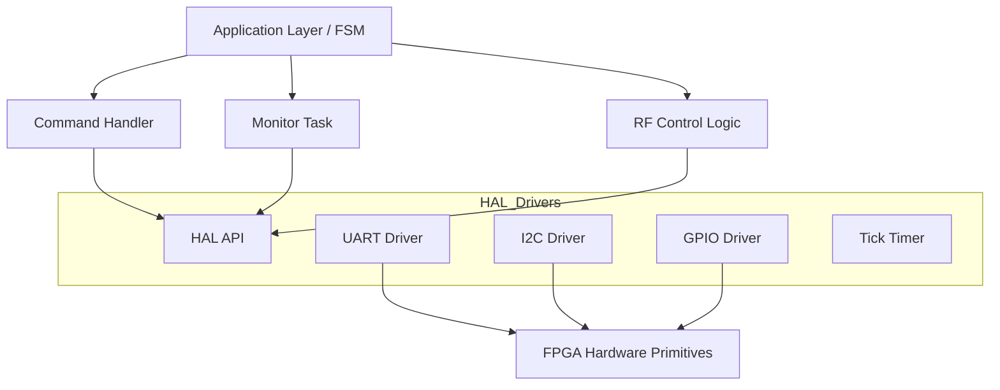
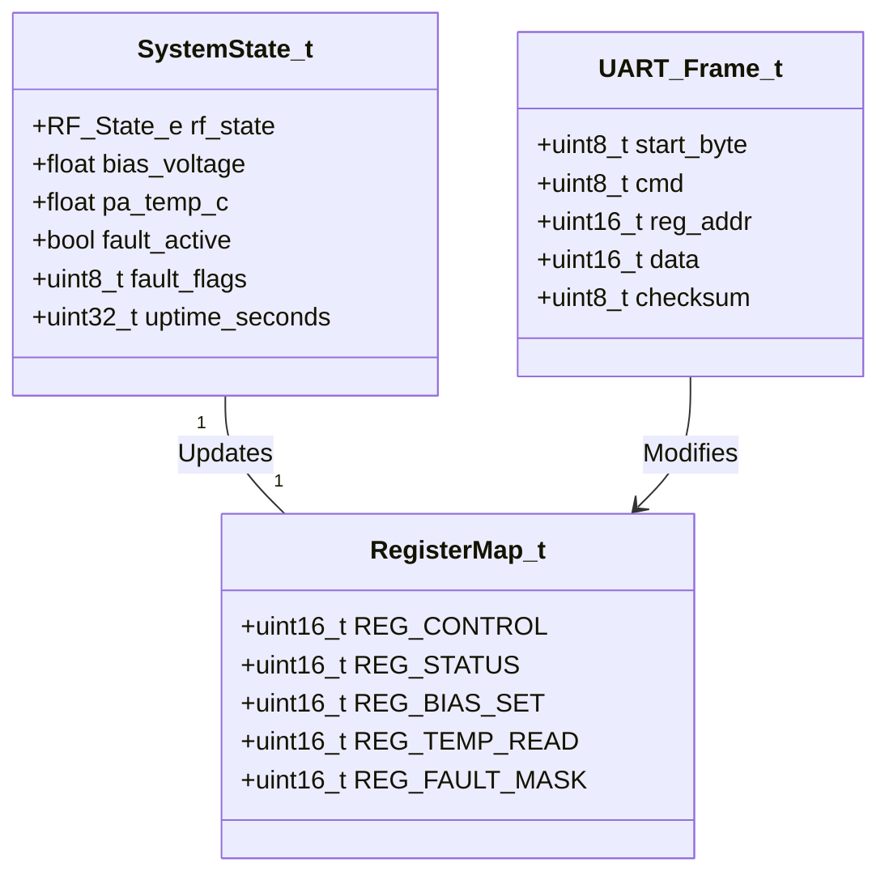
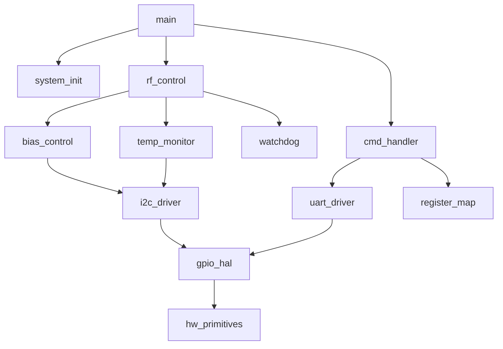
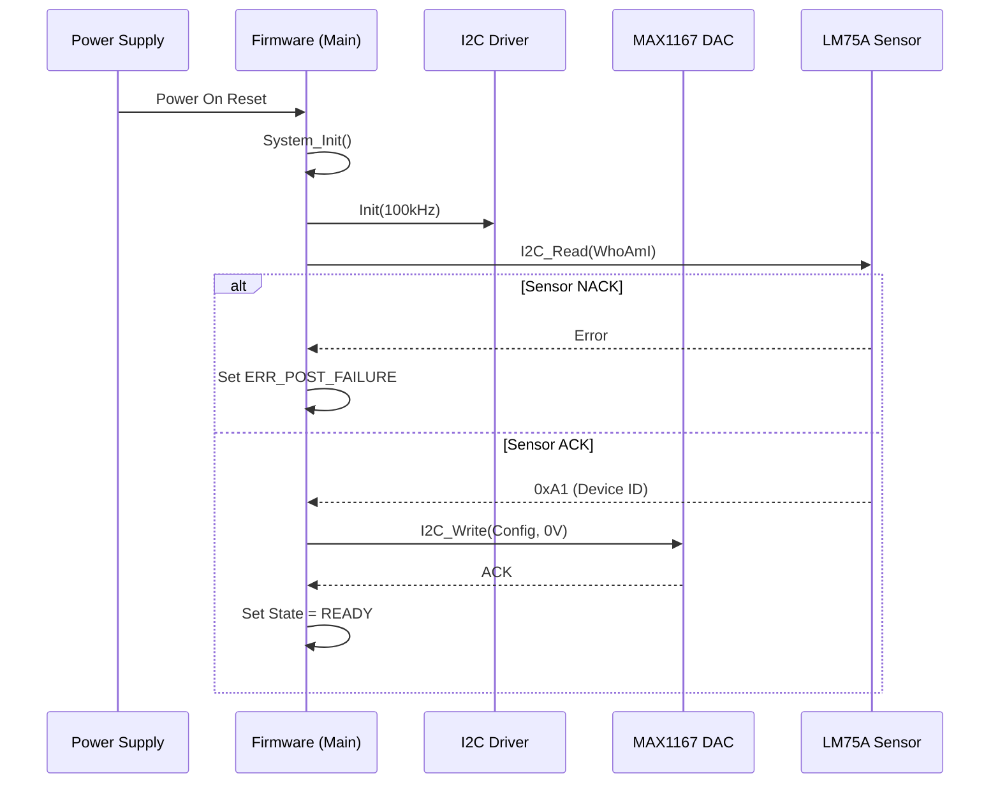
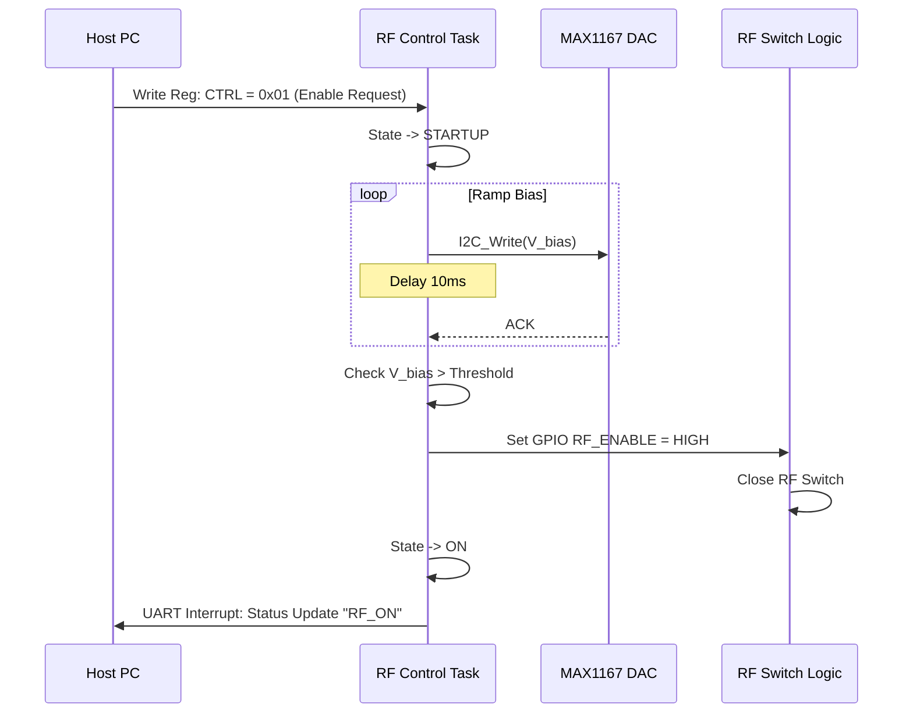
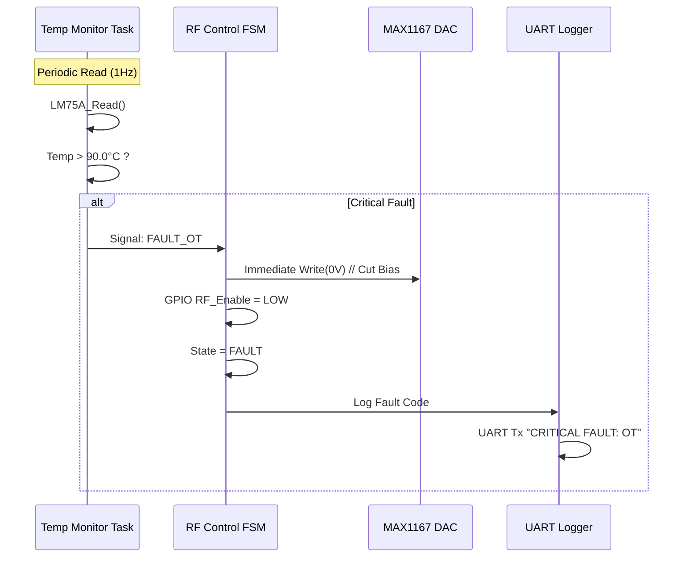
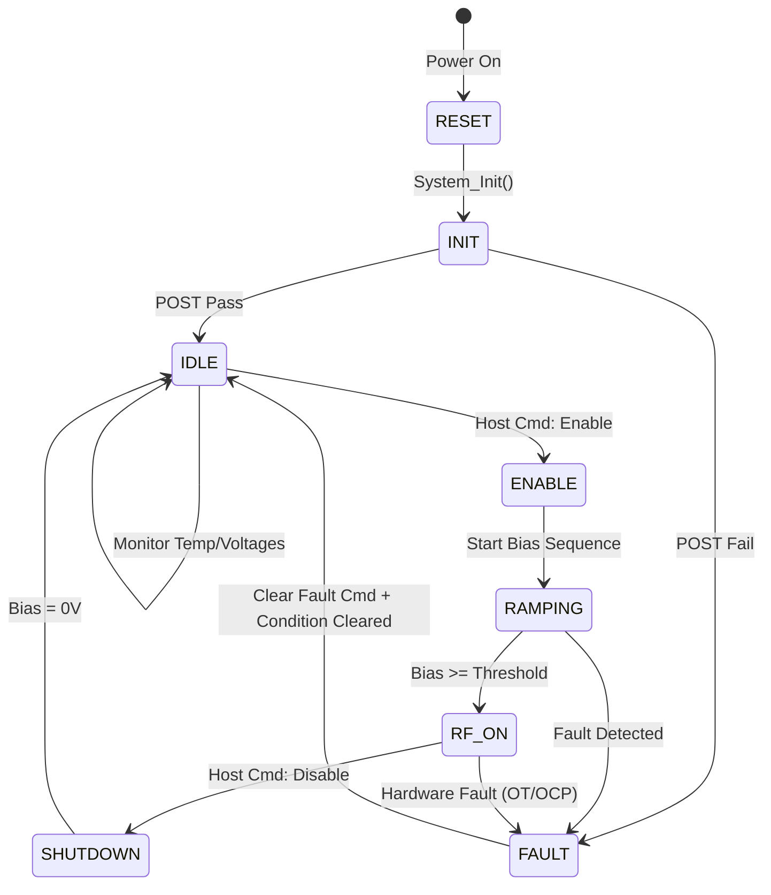
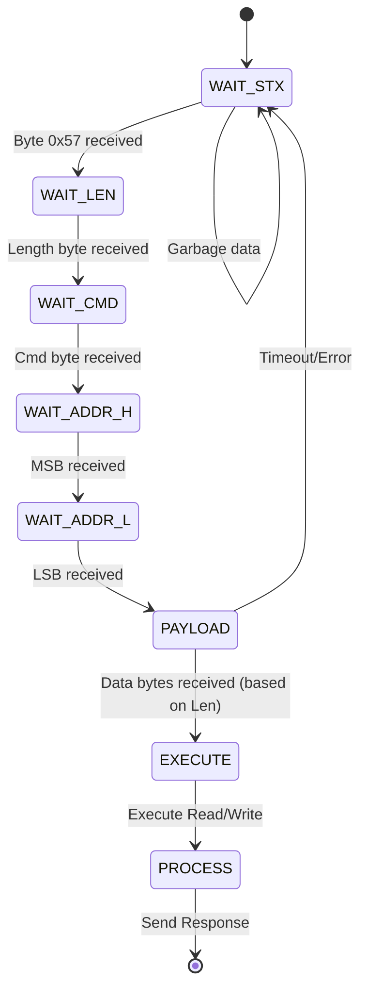

# Software Design Document (SDD)
**Project:** hkgg RF Power Amplifier Control System
**Version:** 1.0
**Date:** 05 April 2026
**Author:** Senior Embedded Software Architect

---

## Document Control
| Version | Date | Author | Description |
|---------|------|--------|-------------|
| 1.0 | 05 April 2026 | Senior Architect | Initial design release for hkgg FPGA/MCU Firmware |

---

# 1. Introduction

## 1.1 Purpose
This Software Design Document (SDD) provides the comprehensive architectural and detailed design for the **hkgg RF Power Amplifier Control Firmware**. It defines the software structure, component interactions, data structures, and algorithms necessary to implement the requirements specified in the **hkgg Software Requirements Specification (SRS)** (Rev 1.0).

This document serves as the blueprint for firmware engineers implementing the logic on the target FPGA/SoC (Xilinx Spartan-6 XC6SLX16 equivalent) and acts as a reference for verification and validation activities.

## 1.2 Scope
The design encompasses the embedded control software responsible for:
1.  **Hardware Abstraction:** Low-level drivers for UART, I2C, GPIO, and Timers implemented within the FPGA fabric or associated soft-core processor.
2.  **RF Control Logic:** State machine management for RF Enable/Disable sequencing, including Gate Bias control via the MAX1167 DAC.
3.  **Monitoring:** Real-time polling of the LM75A temperature sensor and fault status inputs.
4.  **Communication:** Asynchronous command/response protocol over UART for register access and status reporting.
5.  **Safety:** Interlock logic for Over-Temperature (OT) and Reverse Polarity/Under-Voltage protection monitoring.

**Exclusions:** High-level modulation schemes, Ethernet networking stacks, and host PC GUI logic are explicitly out of scope.

### Target Platform
*   **Primary Controller:** Xilinx Spartan-6 FPGA (XC6SLX16) utilizing a soft-core microcontroller (e.g., MicroBlaze) or pure RTL state machine implementation.
*   **Language:** MISRA-C:2012 compliant C for software modules; VHDL/Verilog for hardware primitives.
*   **Toolchain:** Xilinx Vitis/Vivado 202x.x.

## 1.3 Definitions and Acronyms

| Acronym | Definition |
| :--- | :--- |
| **API** | Application Programming Interface |
| **BSP** | Board Support Package |
| **DAC** | Digital-to-Analog Converter (Specifically MAX1167) |
| **FIFO** | First-In, First-Out buffer |
| **FSM** | Finite State Machine |
| **GPIO** | General Purpose Input/Output |
| **HAL** | Hardware Abstraction Layer |
| **HRS** | Hardware Requirements Specification |
| **I2C** | Inter-Integrated Circuit (Serial Interface) |
| **ISR** | Interrupt Service Routine |
| **LDMOS** | Laterally Diffused Metal Oxide Semiconductor |
| **MISRA** | Motor Industry Software Reliability Association |
| **NVM** | Non-Volatile Memory |
| **PA** | Power Amplifier |
| **POST** | Power-On Self Test |
| **RTL** | Register Transfer Level |
| **SRS** | Software Requirements Specification |
| **UART** | Universal Asynchronous Receiver/Transmitter |
| **VSWR** | Voltage Standing Wave Ratio |

## 1.4 References
1.  **IEEE 1016-2009:** Standard for Information Technology — Systems Design — Software Design Descriptions.
2.  **MISRA C:2012:** Guidelines for the use of the C language in critical systems.
3.  **hkgg SRS (Rev 1.0):** Software Requirements Specification.
4.  **hkgg HRS (Rev 1.0):** Hardware Requirements Specification.
5.  **hkgg GLR (Rev 0V01):** Glue Logic Requirements.
6.  **MAX1167 Datasheet:** Maxim Integrated Products.
7.  **LM75A Datasheet:** NXP Semiconductors.

---

# 2. Design Viewpoints

## 2.1 Context Viewpoint — System Boundaries

The hkgg firmware operates as the central controller between the Host System (External Controller) and the analog RF Hardware.



**External Interfaces:**
1.  **UART Interface:** 3.3V CMOS level. Configured for 115200 baud, 8N1. Connects to Host system for command processing.
2.  **I2C Interface (Master):** Controls MAX1167 (DAC) and LM75A (Temp Sensor). Operates at Standard Mode (100kHz) or Fast Mode (400kHz).
3.  **RF Control Interface:** Discrete GPIO signals controlling the RF Enable path and Gate Bias sequencing.
4.  **Fault Interface:** Discrete GPIO inputs monitoring UVLO, OCP, and Thermal Shutdown flags from analog circuitry.

## 2.2 Composition Viewpoint — Software Architecture

The software architecture follows a layered approach, separating hardware-specific drivers from application logic.



### Module List with Responsibilities:

#### Module: `system_init` (system_init.c / system_init.h)
**Responsibility:** Manages the Power-On Reset (POR) sequence, initializes clock domains (PLL), configures the default GPIO states to safe values (RF OFF), and triggers the Power-On Self-Test (POST).

```c
#include " ErrorCode_t "

/**
 * @brief Initialize the complete system hardware and software state.
 * 
 * @return ERR_OK Initialization successful
 * @return ERR_CLK_PLL Failure to lock PLL
 * @return ERR_POST_FAILURE Self-test failed
 */
ErrorCode_t System_Init(void);

/**
 * @brief Run Power-On Self-Test (POST).
 * Checks I2C connectivity to DAC and Temp Sensor.
 * 
 * @return ERR_OK All tests passed
 */
ErrorCode_t System_RunPOST(void);
```

#### Module: `uart_driver` (uart_driver.c / uart_driver.h)
**Responsibility:** Manages the UART peripheral. Handles byte-wise transmission and reception interrupt-driven logic. Implements the "hkgg Protocol" frame parsing (Read/Write Register commands).

```c
#define UART_BAUD_RATE       (115200)
#define UART_RX_TIMEOUT_MS   (10)

/**
 * @brief Initialize UART hardware.
 * 
 * @return ERR_OK
 */
ErrorCode_t UART_Init(void);

/**
 * @brief Send a data buffer via UART.
 * 
 * @param data Pointer to data buffer.
 * @param len Length of data.
 * @return ERR_OK Transmission started.
 */
ErrorCode_t UART_Send(const uint8_t *data, uint16_t len);

/**
 * @brief UART Receive Interrupt Service Routine.
 * Processes incoming bytes and builds frames.
 */
void UART_ISR_Handler(void);
```

#### Module: `i2c_driver` (i2c_driver.c / i2c_driver.h)
**Responsibility:** Implements a bit-banged or hardware-assisted I2C master driver. Provides blocking read/write APIs for the MAX1167 and LM75A.

```c
typedef struct {
    uint8_t address; // 7-bit address
    uint8_t *buffer;
    uint16_t length;
    bool stop;
} I2C_Transaction_t;

/**
 * @brief Initialize I2C pins and speed.
 * 
 * @param clk_hz Clock frequency in Hz (e.g., 100000 or 400000).
 * @return ERR_OK
 */
ErrorCode_t I2C_Init(uint32_t clk_hz);

/**
 * @brief Perform a blocking write to an I2C device.
 * 
 * @param dev_addr 7-bit I2C address.
 * @param data Pointer to data buffer.
 * @param len Number of bytes to write.
 * @return ERR_OK if ACK received, ERR_COMM if NACK.
 */
ErrorCode_t I2C_Write(uint8_t dev_addr, const uint8_t *data, uint16_t len);

/**
 * @brief Perform a blocking read from an I2C device.
 * 
 * @param dev_addr 7-bit I2C address.
 * @param data Pointer to store received data.
 * @param len Number of bytes to read.
 * @return ERR_OK
 */
ErrorCode_t I2C_Read(uint8_t dev_addr, uint8_t *data, uint16_t len);
```

#### Module: `bias_control` (bias_control.c / bias_control.h)
**Responsibility:** Manages the Gate Bias DAC (MAX1167). Converts desired Gate Voltage (0V to 5V) into 12-bit DAC values.

```c
#define BIAS_DAC_ADDR (0x60) // Example address per GLR
#define BIAS_VOLTAGE_MAX_V (5.0f)
#define BIAS_DAC_RESOLUTION (4096.0f)

/**
 * @brief Initialize the Bias DAC to a safe default (0V).
 * 
 * @return ERR_OK
 */
ErrorCode_t Bias_Init(void);

/**
 * @brief Set the PA Gate Bias Voltage.
 * 
 * @param voltage Target voltage in Volts (0.0 to 5.0).
 * @return ERR_OK
 * @return ERR_PARAM Voltage out of range.
 * @return ERR_COMM I2C failure.
 */
ErrorCode_t Bias_SetVoltage(float voltage);

/**
 * @brief Ramp the bias voltage from current to target.
 * Used for soft-start to prevent current surge.
 * 
 * @param target_voltage Target in Volts.
 * @param step_mv Step size in mV.
 * @param delay_ms Delay between steps.
 * @return ERR_OK
 */
ErrorCode_t Bias_Ramp(float target_voltage, uint16_t step_mv, uint16_t delay_ms);
```

#### Module: `temp_monitor` (temp_monitor.c / temp_monitor.h)
**Responsibility:** Interface with LM75A temperature sensor. Provides alarms for Over-Temperature (OT) conditions.

```c
#define TEMP_SENSOR_ADDR (0x48) // Default LM75A address
#define TEMP_THRESHOLD_HIGH_C (85.0f)

/**
 * @brief Initialize Temperature Sensor.
 * 
 * @return ERR_OK
 */
ErrorCode_t Temp_Init(void);

/**
 * @brief Read current temperature.
 * 
 * @param temp_c Pointer to store Celsius value.
 * @return ERR_OK
 */
ErrorCode_t Temp_Read(float *temp_c);

/**
 * @brief Check if temperature threshold exceeded.
 * 
 * @return true If temp > threshold
 * @return false Otherwise
 */
bool Temp_IsOverThreshold(void);
```

#### Module: `rf_control` (rf_control.c / rf_control.h)
**Responsibility:** Controls the RF Enable path (GPIOs). Implements the sequencing logic: Bias Up -> RF Enable. Handles RF Shutdown requests.

```c
typedef enum {
    RF_STATE_OFF = 0,
    RF_STATE_STARTUP,
    RF_STATE_ON,
    RF_STATE_SHUTDOWN,
    RF_STATE_FAULT
} RF_State_e;

/**
 * @brief Initialize RF Control GPIOs.
 * 
 * @return ERR_OK
 */
ErrorCode_t RF_Init(void);

/**
 * @brief Main processing function for RF State Machine.
 * Must be called periodically in main loop.
 */
void RF_Task(void);

/**
 * @brief Request RF to turn ON.
 * 
 * @return ERR_OK Request accepted.
 */
ErrorCode_t RF_Enable(void);

/**
 * @brief Request RF to turn OFF.
 * 
 * @return ERR_OK
 */
ErrorCode_t RF_Disable(void);

/**
 * @brief Immediate RF Shutdown (Fault path).
 */
void RF_ShutdownImmediate(void);
```

## 2.3 Logical Viewpoint — Data Model



**Key Data Structures:**

```c
/* Global System State */
typedef struct {
    RF_State_e rf_state;
    float current_bias_v;
    float current_temp_c;
    uint16_t fault_status_raw;  // GPIO read
    bool rf_enable_req;
    bool rf_disable_req;
} SystemState_t;

extern SystemState_t g_sys_state;

/* Register Map Definition (Aligned with SRS) */
typedef enum {
    REG_CTRL     = 0x0000, // Control Register (R/W)
    REG_STATUS   = 0x0001, // Status Register (RO)
    REG_BIAS_H  = 0x0002, // Bias Voltage DAC High Byte
    REG_BIAS_L  = 0x0003, // Bias Voltage DAC Low Byte
    REG_TEMP     = 0x0004, // Temperature Reading (RO)
    REG_FAULT    = 0x0005, // Fault Flags (RO)
    REG_UPTIME   = 0x0006  // System Uptime (RO)
} RegisterAddr_e;

/* Status / Fault Flags */
typedef enum {
    FAULT_NONE      = 0x0000,
    FAULT_OT        = 0x0001, // Over Temperature
    FAULT_OCP       = 0x0002, // Over Current Protection
    FAULT_VSWR      = 0x0004, // VSWR High (Forward/Reflected power mismatch)
    FAULT_PLL_LOSS  = 0x0008  // PLL Unlock (if applicable)
} FaultFlags_e;
```

## 2.4 Dependency Viewpoint



**Build Dependencies:**
1.  **hw_primitives:** The lowest level (VHDL/Verilog).
2.  **gpio_hal:** Direct manipulation of FPGA IO buffers.
3.  **Drivers:** uart_driver, i2c_driver (depend on gpio_hal).
4.  **Middleware:** bias_control, temp_monitor (depend on i2c_driver).
5.  **Application:** rf_control, cmd_handler (depend on middleware and drivers).

## 2.5 Interface Viewpoint — API Specification

### System_Init API
```c
/**
 * @brief Initialize the hkgg firmware.
 * 
 * This function sets up the clock tree, initializes the UART to 115200 baud,
 * configures I2C pins, and sets initial GPIO levels to SAFE (RF OFF).
 * 
 * @return ErrorCode_t
 *   - ERR_OK (0): System ready.
 *   - ERR_CLK_PLL: PLL failed to lock within timeout.
 *   - ERR_HARDWARE: Fatal hardware initialization failure.
 * 
 * @pre  None. Must be the first function called in main().
 * @post System enters IDLE state. RF path is disabled.
 */
ErrorCode_t System_Init(void);
```

### RF_Task API
```c
/**
 * @brief State machine executor for RF Control.
 * 
 * Non-blocking function that checks internal state flags and physical 
 * fault inputs to transition the RF amplifier between ON, OFF, and FAULT states.
 * Must be called cyclically (e.g., every 1ms).
 * 
 * @return void
 * 
 * @pre  System_Init() must have returned ERR_OK.
 * @post Side effects include changing GPIO states and writing to DAC.
 */
void RF_Task(void);
```

### UART_RegisterProtocol API
```c
/**
 * @brief Process a received frame buffer.
 * 
 * Parses the [CMD][ADDR][DATA][CRC] format. Validates CRC.
 * Executes Read/Write actions against the virtual Register Map.
 * Generates response frame.
 * 
 * @param rx_buf Pointer to received buffer.
 * @param tx_buf Pointer to transmission buffer (output).
 * @return int16_t Number of bytes to transmit, or -1 on error.
 * 
 * @pre  rx_buf contains a complete frame.
 * @post tx_buf contains response or error code.
 */
int16_t UART_ProcessFrame(const uint8_t *rx_buf, uint8_t *tx_buf);
```

## 2.6 Interaction Viewpoint — Sequence Diagrams

### System Startup (POST Sequence)


### RF Enable Sequence (Soft Start)


### Over-Temperature Fault Reaction


## 2.7 State Viewpoint — State Machines

### Main RF Control State Machine


### Command Parser State Machine


## 2.8 Algorithm Viewpoint

### Algorithm 1: Bias DAC Voltage Calculation
**Purpose:** Convert a floating-point voltage (0.0 - 5.0V) to the 12-bit integer value required by the MAX1167 DAC.

**Formula:**
$$ DAC\_Code = \frac{V_{desired}}{V_{ref}} \times 2^{N} $$
Where $N = 12$, $V_{ref} = 5.0V$.

**MISRA-C Implementation:**
```c
uint16_t Bias_CalcDacCode(float voltage_v)
{
    uint16_t code;
    
    /* Clamp input to valid range */
    if (voltage_v > 5.0f) { voltage_v = 5.0f; }
    if (voltage_v < 0.0f) { voltage_v = 0.0f; }
    
    /* Convert: (V / 5.0) * 4096 */
    /* Use double for intermediate precision to avoid float precision errors */
    double temp = (double)voltage_v * 4096.0 / 5.0;
    
    /* Range check for 12-bit limit */
    if (temp > 4095.0) { temp = 4095.0; }
    
    code = (uint16_t)temp; /* Explicit cast */
    
    return code;
}
```

### Algorithm 2: CRC-8 Calculation for UART Frames
**Purpose:** Verify integrity of UART packets.
**Polynomial:** 0x07 (Standard CRC-8).
**Implementation:** Bitwise shift register.

```c
uint8_t UTIL_CalcCRC8(const uint8_t *data, uint16_t len)
{
    uint8_t crc = 0x00;
    uint16_t i;
    uint8_t j;
    
    if (data == NULL) { return 0xFF; }
    
    for (i = 0; i < len; i++)
    {
        crc ^= data[i];
        for (j = 0; j < 8; j++)
        {
            if ((crc & 0x80) != 0U)
            {
                crc = (uint8_t)((crc << 1) ^ 0x07);
            }
            else
            {
                crc = (uint8_t)(crc << 1);
            }
        }
    }
    return crc;
}
```

---

# 3. Design Rationale

## 3.1 Architecture Choices

### 3.1.1 Selection of I2C Standard Mode (100kHz)
**Decision:** The I2C driver will be configured for 100kHz operation by default, with configuration support for 400kHz.
**Rationale:** The MAX1167 and LM75A support Standard and Fast Mode. Given the cable length between FPGA and the PA analog board (potentially > 10cm), lower speed provides higher noise immunity against RF coupling.
**Trade-off:** Slightly slower polling rate for temperature (acceptable as thermal time constant of heatsink is > 1s).

### 3.1.2 Bare-Metal vs RTOS
**Decision:** The system will use a **Super-Loop (Bare-Metal)** architecture rather than an RTOS.
**Rationale:** 
1.  **Determinism:** The RF control requirements are simple sequential logic (Enable -> Ramp -> On).
2.  **Resource Usage:** The Spartan-6 LX16 has limited block RAM. An RTOS kernel consumes valuable memory resources.
3.  **Complexity:** The number of concurrent tasks is low (< 5). Managing task priorities via a real-time kernel introduces unnecessary complexity for a single-purpose controller.
**Trade-off:** The main loop must be carefully architected to ensure low latency (blocking I2C calls must timeout quickly).

### 3.1.3 State Machine Implementation
**Decision:** RF Control logic implemented as a function-pointer based or switch-case State Machine (FSM) rather than procedural code.
**Rationale:** An FSM clearly defines the Safe States (OFF, FAULT) and prevents undefined behavior (e.g., turning RF Enable high before Bias is applied). This maps directly to the HRS safety requirements.

## 3.2 MISRA-C:2012 Compliance Strategy
To ensure reliability and safety, all C code shall comply with MISRA C:2012.
*   **Static Analysis:** PC-Lint Plus or Coverity will be integrated into the build process.
*   **Runtime Checking:** Assertions will be used in debug builds.
*   **Coding Rules:**
    *   All variables initialized at declaration.
    *   No implicit type conversions (Rule 10.x).
    *   No dynamic memory (malloc) is permitted.
    *   Function complexity (Cyclomatic Complexity) < 15.

---

# 4. Design Traceability Matrix

| SDD Component | Design Element | Implements Requirement (REQ-SW) |
| :--- | :--- | :--- |
| **Initialization** | `System_Init()` | REQ-SW-001 (Initialization), REQ-SW-008 (POST) |
| **Communication** | `UART_Init()` | REQ-SW-009 (UART Interface) |
| **Communication** | `UART_ProcessFrame()` | REQ-SW-010 (Register Protocol) |
| **RF Control** | `RF_Task()` FSM | REQ-SW-002 (RF Enable Logic) |
| **RF Control** | `RF_Enable()` / `RF_Disable()` | REQ-SW-003 (Disable Command) |
| **Biasing** | `Bias_SetVoltage()` | REQ-SW-004 (Bias Control) |
| **Biasing** | `Bias_Ramp()` | REQ-SW-005 (Sequencing) |
| **Monitoring** | `Temp_Read()` | REQ-SW-006 (Temp Monitoring) |
| **Fault Mgmt** | `RF_ShutdownImmediate()` | REQ-SW-007 (Interlock) |
| **Driver** | `I2C_Write()` | GLR I2C Master Requirement |

---

# 5. Appendices

## Appendix A — File Structure (Project Directory)

```text
hkgg_firmware/
├── src/
│   ├── main.c                 # Entry point, Main loop
│   ├── system_init.c/h        # System init, POST
│   ├── rf_control.c/h         # RF State Machine
│   ├── bias_control.c/h       # MAX1167 DAC Logic
│   ├── temp_monitor.c/h       # LM75A Logic
│   ├── cmd_handler.c/h        # Protocol Parser
│   └── utils/
│       ├── crc.c/h            # Checksums
│       └── ring_buffer.c/h    # UART Buffering
├── drivers/
│   ├── uart_driver.c/h        # Low-level UART driver
│   ├── i2c_bitbang.c/h        # I2C Implementation
│   └── gpio.c/h               # GPIO Abstraction
├── rtl/
│   └── glue_logic.vhd         # FPGA Wrapper (VHDL)
└── tests/
    ├── test_rf_fsm.c          # Unit tests
    └── test_protocol.c
```

## Appendix B — Register Map (Memory Mapped)

| Address | Name | Access | Description |
| :--- | :--- | :--- | :--- |
| 0x0000 | `REG_CTRL` | R/W | **Control Register**<br>Bit 0: RF_ENABLE_REQUEST<br>Bit 1: RESET_FAULT |
| 0x0001 | `REG_STATUS` | R/O | **Status Register**<br>Bit 0: RF_IS_ON<br>Bit 1: BIAS_ACTIVE |
| 0x0002 | `REG_BIAS_MSB` | R/W | Bias DAC Value High Byte |
| 0x0003 | `REG_BIAS_LSB` | R/W | Bias DAC Value Low Byte |
| 0x0004 | `REG_TEMP` | R/O | Temperature Reading (Signed Int8) |
| 0x0005 | `REG_FAULT` | R/O | **Fault Flags**<br>Bit 0: OT<br>Bit 1: OCP<br>Bit 2: VSWR |
| 0x0006 | `REG_FW_VER` | R/O | Firmware Version (BCD) |

## Appendix C — Memory Map (FPGA Memory)

| Region | Start | End | Usage |
| :--- | :--- | :--- | :--- |
| **Code** | 0x0000_0000 | 0x0000_FFFF | Program Flash / Instruction Memory |
| **Data** | 0x2000_0000 | 0x2000_0FFF | Stack & Heap (16KB Total) |
| **Peripherals** | 0x4000_0000 | 0x4000_FFFF | Memory Mapped GPIO/UART |

## Appendix D — Error Code List

```c
typedef enum {
    ERR_OK              = 0x00, // No Error
    ERR_COMM_NACK       = 0x01, // I2C NACK received
    ERR_COMM_TIMEOUT    = 0x02, // I2C Timeout
    ERR_PARAM_RANGE     = 0x03, // Function Parameter out of range
    ERR_HW_FAULT        = 0x04, // Generic hardware fault
    ERR_CRC             = 0x05, // UART CRC Mismatch
    ERR_INVALID_REG     = 0x06, // Register address invalid
    ERR_STATE           = 0x07  // Illegal state transition
} ErrorCode_t;
```

---
**Document Status:** RELEASED
**Distribution:** FW Team, HW Team, QA