# Software Design Document (SDD)

## Document Control

| Version | Date | Author | Description |
|---------|------|--------|-------------|
| 1.0 | 19 April 2026 | Embedded Software Architect | Initial design release for hm UHF Radar Receiver Module |

---

# 1. Introduction

## 1.1 Purpose

This Software Design Document (SDD) provides a comprehensive, implementation-ready description of the firmware and software architecture for the **hm** project — a UHF (300–1000 MHz) pulsed radar receiver module. This SDD translates the software requirements defined in the SRS (version 1.0, dated 19 April 2026) and the hardware interfaces specified in the HRS and GLR documents into a detailed software design comprising module decompositions, API specifications, data models, state machines, sequence diagrams, and resource allocations.

The primary audience for this document includes:
- **Firmware Engineers**: Responsible for implementing the C-language drivers and application logic within the Xilinx MicroBlaze soft-core processor instantiated in the Spartan-7 FPGA.
- **FPGA/HDL Designers**: Responsible for implementing the RTL peripherals (UART, SPI, I2C masters, register map) that interface with the software layer.
- **Test Engineers**: Responsible for verifying software modules against the design using unit tests (Google Test), integration tests, and hardware-in-the-loop (HIL) validation.
- **Systems Engineers**: Responsible for ensuring the software design meets traceability requirements linking SRS REQ-SW-xxx items to design elements.

This SDD conforms to IEEE 1016-2009 and is structured around the standard design viewpoints: Context, Composition, Logical, Dependency, Interface, Interaction, State, Algorithm, Resource, and Build System.

## 1.2 Scope

This SDD covers the complete software stack executing on the MicroBlaze soft-core processor within the Xilinx Spartan-7 (XC7S25-1CSGA225) FPGA. The software manages the superheterodyne RF receiver chain, host communications, telemetry, and self-test functions.

**Software Components Designed:**
- Board Support Package (BSP): Power-on initialization, clock tree setup, and FPGA fabric configuration
- Hardware Abstraction Layer (HAL): Peripheral drivers for UART, SPI, I2C, and GPIO
- Device Drivers: ADF4153A PLL driver, AT25SF041 EEPROM driver, IS25LP016D Flash driver, TMP112 temperature sensor driver, DAC driver (gain control)
- Application Layer: Command handler (UART protocol), temperature monitor, power monitor, filter bank controller, gain controller, calibration manager, watchdog manager, Built-In Test (CBIT/POST)

**Target Hardware Platform:**
- FPGA: Xilinx Spartan-7 XC7S25-1CSGA225 (225-pin CSGA package)
- Processor: MicroBlaze soft-core (5-stage pipeline, 32-bit RISC)
- System Clock: 100 MHz (derived from FPGA MMCM/PLL)
- UART Clock: 100 MHz (system clock)

**Programming Language and Toolchain:**
- Language: C99 (strictly MISRA C:2012 compliant)
- Compiler: Xilinx MicroBlaze gcc (mb-gcc) version 10.2
- Build System: CMake 3.20+ with cross-compilation toolchain file
- Static Analysis: PC-lint Plus 1.4, Polyspace Bug Finder
- HDL: VHDL-2008 (for FPGA fabric peripherals — out of scope for implementation, but interface defined herein)

**Explicitly NOT Covered:**
- DSP algorithms for pulse-Doppler or MTI processing
- ADC sampling logic and digital data formatting
- Host PC GUI application (covered by separate SDD)
- FPGA HDL RTL design (covered by P7 documentation)
- PCB schematic and layout

## 1.3 Definitions and Acronyms

| Term / Acronym | Definition |
|---|---|
| **ADC** | Analog-to-Digital Converter — converts analog signals to digital values |
| **ADF4153A** | Analog Devices Fractional-N PLL Frequency Synthesizer |
| **AGC** | Automatic Gain Control — dynamic gain adjustment algorithm |
| **API** | Application Programming Interface — function-level software contract |
| **AT25SF041** | Renesas 4-Mbit (512 KB) SPI NOR Flash used as EEPROM |
| **BIST** | Built-In Self-Test — hardware/software diagnostic |
| **BSP** | Board Support Package — hardware-specific initialization code |
| **CBIT** | Continuous Built-In Test — runtime background diagnostics |
| **CLB** | Configurable Logic Block — fundamental FPGA logic unit |
| **CRC** | Cyclic Redundancy Check — error-detection polynomial code |
| **DAC** | Digital-to-Analog Converter — generates analog control voltages |
| **DMA** | Direct Memory Access — hardware data transfer without CPU |
| **EEPROM** | Electrically Erasable Programmable Read-Only Memory |
| **FIFO** | First-In, First-Out — hardware or software queue buffer |
| **FPGA** | Field Programmable Gate Array — reconfigurable logic device |
| **GLR** | Glue Logic Requirements — FPGA register and interface specification |
| **GPIO** | General Purpose Input/Output — flexible digital I/O pins |
| **HAL** | Hardware Abstraction Layer — driver software layer |
| **HDL** | Hardware Description Language — VHDL or Verilog |
| **HRS** | Hardware Requirements Specification |
| **I2C** | Inter-Integrated Circuit — 2-wire serial bus protocol |
| **IBW** | Instantaneous Bandwidth — signal bandwidth at a given tuning point |
| **IF** | Intermediate Frequency — 70 MHz downconverted frequency |
| **IIP3** | Input Third-Order Intercept Point — linearity metric |
| **IPC** | Inter-Process Communication — data exchange mechanism |
| **I/Q** | In-phase / Quadrature — complex baseband representation |
| **ISR** | Interrupt Service Routine — hardware interrupt handler |
| **JTAG** | Joint Test Action Group — debug and programming interface |
| **LDO** | Low Dropout Regulator — linear voltage regulator |
| **LNA** | Low Noise Amplifier — first active RF amplifier stage |
| **LO** | Local Oscillator — frequency source for downconversion |
| **LPF** | Low-Pass Filter — baseband anti-aliasing filter |
| **LTC5596** | Analog Devices High Linearity I/Q Demodulator |
| **LTC1569-7** | Analog Devices Continuous Time Linear Phase Low-Pass Filter |
| **MicroBlaze** | Xilinx 32-bit soft-core RISC processor for FPGAs |
| **MISRA** | Motor Industry Software Reliability Association |
| **MMCM** | Mixed-Mode Clock Manager — Xilinx FPGA clock synthesizer |
| **MTI** | Moving Target Indication — radar processing technique |
| **NVM** | Non-Volatile Memory — persistent storage (EEPROM, Flash) |
| **PLL** | Phase-Locked Loop — frequency synthesis feedback system |
| **POST** | Power-On Self-Test — startup diagnostic sequence |
| **QSPI** | Quad Serial Peripheral Interface — 4-bit wide SPI |
| **RF** | Radio Frequency — 300–1000 MHz signal band |
| **ROS-1080+** | Mini-Circuits VCO covering 680–1080 MHz |
| **SPI** | Serial Peripheral Interface — synchronous 4-wire bus |
| **SPDT** | Single-Pole Double-Throw — RF switch topology |
| **SRAM** | Static Random Access Memory — volatile FPGA block RAM |
| **SRS** | Software Requirements Specification |
| **TMP112** | Texas Instruments Digital Temperature Sensor (I2C) |
| **TRP** | Transmit/Receive Protection — RF chain safeguard |
| **UART** | Universal Asynchronous Receiver/Transmitter |
| **VCO** | Voltage-Controlled Oscillator — LO frequency source |
| **VGA** | Variable Gain Amplifier — ADL5330 gain-controlled stage |
| **WDT** | Watchdog Timer — system supervision peripheral |

## 1.4 References

| Ref ID | Document |
|---|---|
| [1] | IEEE 1016-2009: Standard for Software Design Descriptions |
| [2] | IEEE 830-1998: Recommended Practice for Software Requirements Specifications |
| [3] | ISO/IEC/IEEE 29148:2018: Requirements Engineering |
| [4] | MISRA C:2012: Guidelines for the Use of the C Language in Critical Systems |
| [5] | Software Requirements Specification (SRS) — hm project, v1.0, 19 April 2026 |
| [6] | Hardware Requirements Specification (HRS) — hm_v0V01 |
| [7] | Glue Logic Requirements (GLR) — hm_GLR_0V01, 19 April 2026 |
| [8] | Xilinx Spartan-7 FPGA Datasheet (DS189): XC7S25-1CSGA225 |
| [9] | Xilinx MicroBlaze Processor Reference Guide (UG984) |
| [10] | ADF4153A Fractional-N PLL Synthesizer Datasheet (Analog Devices) |
| [11] | AT25SF041 4-Mbit SPI Flash Memory Datasheet (Renesas) |
| [12] | IS25LP016D 16-Mbit QSPI Flash Memory Datasheet (ISSI) |
| [13] | TMP112 Digital Temperature Sensor Datasheet (Texas Instruments) |
| [14] | LTC5596 I/Q Demodulator Datasheet (Analog Devices) |
| [15] | ADL5330 VGA Datasheet (Analog Devices) |
| [16] | LTC1569-7 Linear Phase LPF Datasheet (Analog Devices) |
| [17] | HMC253LC4 SPDT RF Switch Datasheet (Analog Devices) |
| [18] | FT232H USB-UART IC Datasheet (FTDI) |
| [19] | LTM8074 Step-Down DC/DC Module Datasheet (Analog Devices) |
| [20] | LT3045 Ultra-Low Noise LDO Datasheet (Analog Devices) |
| [21] | Project Block Diagram (P1) |
| [22] | Netlist Specification (P4) |

---

# 2. Design Viewpoints

## 2.1 Context Viewpoint — System Boundaries

The software system executes entirely within the Xilinx Spartan-7 FPGA as MicroBlaze firmware. It interacts with external hardware peripherals through memory-mapped FPGA registers instantiated in the HDL fabric. The software has exactly one external data interface: the UART register protocol communicating with the host PC or radar controller.

### System Context Diagram

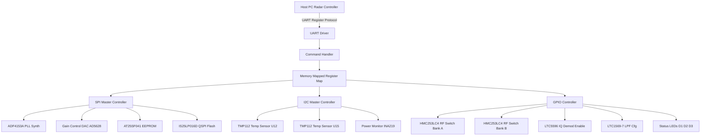
```mermaid
graph TD
    HOST[Host PC Radar Controller] -->|UART Register Protocol| UART_DRV[UART Driver]
    UART_DRV --> CMD[Command Handler]
    CMD --> REG_MAP[Memory Mapped Register Map]
    REG_MAP --> SPI_DRV[SPI Master Controller]
    REG_MAP --> I2C_DRV[I2C Master Controller]
    REG_MAP --> GPIO_CTL[GPIO Controller]
    SPI_DRV --> PLL[ADF4153A PLL Synth]
    SPI_DRV --> DAC[Gain Control DAC AD5628]
    SPI_DRV --> EEPROM[AT25SF041 EEPROM]
    SPI_DRV --> FLASH[IS25LP016D QSPI Flash]
    I2C_DRV --> TEMP1[TMP112 Temp Sensor U12]
    I2C_DRV --> TEMP2[TMP112 Temp Sensor U15]
    I2C_DRV --> PMON[Power Monitor INA219]
    GPIO_CTL --> SW1[HMC253LC4 RF Switch Bank A]
    GPIO_CTL --> SW2[HMC253LC4 RF Switch Bank B]
    GPIO_CTL --> IQD[LTC5596 IQ Demod Enable]
    GPIO_CTL --> LPF[LTC1569-7 LPF Cfg]
    GPIO_CTL --> LEDS[Status LEDs D1 D2 D3]
```

### External Interface Summary

| Interface | Physical Layer | Protocol | Direction | Data Rate | REQ-SW Trace |
|-----------|---------------|----------|-----------|-----------|-------------|
| Host UART | FT232H USB-UART | Register Read/Write | Bidirectional | 115200 to 3000000 baud | REQ-SW-010 |
| PLL SPI | FPGA SPI Master 0 | SPI Mode 0, 3-wire | Output only | 20 MHz max | REQ-SW-030 |
| EEPROM SPI | FPGA SPI Master 0 | SPI Mode 0/3 | Bidirectional | 50 MHz max | REQ-SW-040 |
| Flash QSPI | FPGA QSPI Controller | SPI Mode 0, Quad | Bidirectional | 80 MHz max | REQ-SW-041 |
| DAC SPI | FPGA SPI Master 1 | SPI Mode 1 | Output only | 30 MHz max | REQ-SW-050 |
| Temp I2C | FPGA I2C Master 0 | I2C 400 kHz Fast Mode | Bidirectional | 400 kbps | REQ-SW-060 |
| Power Mon I2C | FPGA I2C Master 0 | I2C 400 kHz Fast Mode | Bidirectional | 400 kbps | REQ-SW-070 |
| RF Switch GPIO | FPGA GPIO Bank 0 | Direct 3.3V CMOS | Output only | Static | REQ-SW-080 |
| IQ Demod GPIO | FPGA GPIO Bank 0 | Direct 3.3V CMOS | Output | Static | REQ-SW-090 |
| LED GPIO | FPGA GPIO Bank 0 | Direct 3.3V CMOS | Output | Static | REQ-SW-100 |
| JTAG Debug | FPGA JTAG Port | IEEE 1149.1 | Bidirectional | 15 MHz TCK | Development only |

## 2.2 Composition Viewpoint — Software Architecture

The software follows a strict layered architecture pattern. No layer may bypass the layer directly below it. The Application Layer depends on the HAL. The HAL depends on the BSP. The BSP interacts with the hardware through memory-mapped registers.

### Layered Architecture Diagram

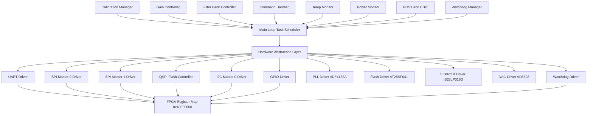
```mermaid
graph TD
    APP_CAL[Calibration Manager] --> SCHED[Main Loop Task Scheduler]
    APP_GAIN[Gain Controller] --> SCHED
    APP_FILT[Filter Bank Controller] --> SCHED
    APP_CMD[Command Handler] --> SCHED
    APP_TEMP[Temp Monitor] --> SCHED
    APP_PWR[Power Monitor] --> SCHED
    APP_POST[POST and CBIT] --> SCHED
    APP_WDT[Watchdog Manager] --> SCHED
    SCHED --> HAL
    HAL[Hardware Abstraction Layer] --> UART_DRV[UART Driver]
    HAL --> SPI0[SPI Master 0 Driver]
    HAL --> SPI1[SPI Master 1 Driver]
    HAL --> QSPI[QSPI Flash Controller]
    HAL --> I2C0[I2C Master 0 Driver]
    HAL --> GPIO[GPIO Driver]
    HAL --> PLL[PLL Driver ADF4153A]
    HAL --> FLASH[Flash Driver AT25SF041]
    HAL --> EEP[EEPROM Driver IS25LP016D]
    HAL --> DAC[DAC Driver AD5628]
    HAL --> WDT[Watchdog Driver]
    UART_DRV --> REGS[FPGA Register Map 0x40000000]
    SPI0 --> REGS
    SPI1 --> REGS
    QSPI --> REGS
    I2C0 --> REGS
    GPIO --> REGS
    WDT --> REGS
```

### Module List with Responsibilities

The following subsections define every software module in the system, including its source files, responsibilities, public API, internal state, and configuration constants.

---

**Module: board_init** (src/board/board_init.c, src/board/board_init.h)

**Responsibility:** Performs complete power-on initialization of the hm module. Configures the MicroBlaze processor instruction and data caches, initializes the MMCM for 100 MHz system clock, enables all FPGA fabric peripherals (UART, SPI masters, I2C master, GPIO controller, watchdog timer), loads board identification information, and executes the Power-On Self-Test (POST). This module must be called exactly once before any other software operation.

```c
#ifndef BOARD_INIT_H
#define BOARD_INIT_H

#include <stdint.h>
#include <stdbool.h>
#include "error_codes.h"

/* Board identification constants */
#define BOARD_ID_HM          (0x484DU)  /* ASCII "HM" */
#define HW_VERSION_MAJOR     (1U)
#define HW_VERSION_MINOR     (0U)
#define FW_VERSION           (0x01000000U) /* 1.0.0 */

typedef struct {
    uint16_t board_id;           /* Expected 0x484D ('H','M') */
    uint8_t  hw_version_major;   /* PCB revision major */
    uint8_t  hw_version_minor;   /* PCB revision minor */
    uint32_t fw_version;         /* Firmware version BCD */
    char     build_date[12];     /* __DATE__ from compiler */
} BoardInfo_t;

typedef struct {
    bool     clk_ok;             /* MMCM locked */
    bool     uart_ok;            /* UART loopback passed */
    bool     spi0_ok;            /* SPI0 EEPROM read ID */
    bool     spi1_ok;            /* SPI1 DAC verified */
    bool     i2c0_ok;            /* I2C bus scan passed */
    bool     gpio_ok;            /* GPIO readback verified */
    bool     pll_ok;             /* PLL lock achieved */
    bool     temp_ok;            /* Temperature within range */
    bool     pwr_ok;             /* Power rails within tolerance */
    uint32_t pass_mask;          /* Bitmask: bit0=clk ... bit8=pwr */
} POST_Result_t;

/**
 * @brief Execute complete board initialization sequence.
 * @return ERR_OK on success, specific error code on failure.
 * @pre System reset vector has set up stack pointer.
 * @post All peripherals initialized and ready. System in INIT state.
 */
int32_t Board_Init(void);

/**
 * @brief Retrieve board identification information.
 * @param info Pointer to BoardInfo_t structure to populate.
 * @return ERR_OK on success, ERR_PARAM if info is NULL.
 */
int32_t Board_GetVersion(BoardInfo_t *info);

/**
 * @brief Execute Power-On Self-Test.
 * @param test_mask Output bitmask of POST results (0x1FF = all pass).
 * @return ERR_OK if all tests pass, ERR_HARDWARE with failing mask.
 */
int32_t Board_SelfTest(uint32_t *test_mask);

/**
 * @brief Run individual POST test by index.
 * @param test_id Test index 0..8 (clk, uart, spi0, spi1, i2c, gpio, pll, temp, pwr).
 * @return ERR_OK if test passes, specific error otherwise.
 */
int32_t Board_RunSingleTest(uint8_t test_id);

#endif /* BOARD_INIT_H */
```

**Internal State Variables:**
```c
static bool s_board_initialized = false;
static BoardInfo_t s_board_info;
static POST_Result_t s_post_result;
```

**Configuration Constants:**
```c
#define SYSCLK_FREQ_HZ          (100000000U)  /* 100 MHz */
#define UART_DEFAULT_BAUD        (115200U)
#define SPI0_CLOCK_HZ            (20000000U)   /* 20 MHz */
#define SPI1_CLOCK_HZ            (20000000U)   /* 20 MHz */
#define I2C0_CLOCK_HZ            (400000U)     /* 400 kHz Fast Mode */
```

---

**Module: uart_driver** (src/drivers/uart_driver.c, src/drivers/uart_driver.h)

**Responsibility:** Manages the UART peripheral for host communication. Implements byte-level transmit and receive through the FPGA UART Lite IP core with 16-byte hardware FIFOs. Provides interrupt-driven reception into a software ring buffer and polled transmission. The UART frame protocol (parsing CMD bytes, addresses, and data) is handled by the cmd_handler module — this driver handles raw byte I/O only.

```c
#ifndef UART_DRIVER_H
#define UART_DRIVER_H

#include <stdint.h>
#include <stdbool.h>
#include "error_codes.h"

#define UART_RX_BUF_SIZE   (256U)   /* Power of 2 for ring buffer */
#define UART_TX_BUF_SIZE   (128U)
#define UART_FIFO_DEPTH     (16U)   /* Xilinx UART Lite FIFO depth */

typedef struct {
    bool     tx_busy;
    bool     rx_overrun;
    bool     frame_error;
    bool     parity_error;
    uint16_t tx_fifo_count;
    uint16_t rx_fifo_count;
    uint32_t total_rx_bytes;
    uint32_t total_tx_bytes;
} UART_Status_t;

/**
 * @brief Initialize UART peripheral at specified baud rate.
 * @param baud_rate Target baud: 9600, 19200, 38400, 57600, 115200, 230400,
 *                  460800, 921600, 1000000, 2000000, 3000000.
 * @return ERR_OK on success, ERR_PARAM if baud_rate invalid, ERR_HARDWARE on fault.
 * @pre System clock (100 MHz) must be configured.
 * @post UART ready for Send/Recv calls. RX interrupt enabled.
 */
int32_t UART_Init(uint32_t baud_rate);

/**
 * @brief Shut down UART peripheral and disable interrupts.
 * @return ERR_OK on success.
 */
int32_t UART_Deinit(void);

/**
 * @brief Send data buffer via UART with blocking timeout.
 * @param data Pointer to transmit buffer.
 * @param len Number of bytes to send (1..UART_TX_BUF_SIZE).
 * @param timeout_ms Maximum wait time in milliseconds (0 = non-blocking).
 * @return ERR_OK on success, ERR_TIMEOUT, ERR_PARAM if data is NULL or len is 0.
 */
int32_t UART_Send(const uint8_t *data, uint16_t len, uint32_t timeout_ms);

/**
 * @brief Receive data from UART RX ring buffer.
 * @param buf Output buffer for received bytes.
 * @param max_len Maximum bytes to read.
 * @param actual_len Output: actual number of bytes copied.
 * @return ERR_OK if at least 1 byte received, ERR_TIMEOUT if buffer empty.
 */
int32_t UART_Recv(uint8_t *buf, uint16_t max_len, uint16_t *actual_len);

/**
 * @brief Get number of bytes available in RX ring buffer.
 * @return Number of bytes available (0 if empty).
 */
uint16_t UART_Available(void);

/**
 * @brief Flush both TX and RX buffers.
 */
void UART_Flush(void);

/**
 * @brief Get UART driver status counters.
 * @param status Pointer to status structure to populate.
 * @return ERR_OK on success, ERR_PARAM if status is NULL.
 */
int32_t UART_GetStatus(UART_Status_t *status);

/**
 * @brief UART Interrupt Service Routine.
 * Called by MicroBlaze interrupt controller on UART Lite IP interrupt.
 * Reads all available bytes from hardware FIFO into software ring buffer.
 */
void UART_ISR(void);

#endif /* UART_DRIVER_H */
```

**Internal State Variables:**
```c
static volatile uint8_t s_rx_buffer[UART_RX_BUF_SIZE];
static volatile uint8_t s_tx_buffer[UART_TX_BUF_SIZE];
static volatile uint16_t s_rx_head;
static volatile uint16_t s_rx_tail;
static volatile uint16_t s_tx_head;
static volatile uint16_t s_tx_tail;
static volatile bool s_tx_active;
static UART_Status_t s_status;
static bool s_initialized;
```

---

**Module: spi_driver** (src/drivers/spi_driver.c, src/drivers/spi_driver.h)

**Responsibility:** Provides SPI master communication for multiple chip-select devices on SPI bus 0 (PLL ADF4153A, EEPROM AT25SF041) and SPI bus 1 (DAC AD5628). Manages chip select assertion/deassertion, configurable clock polarity/phase, and byte-level transfer. The driver abstracts the Xilinx SPI IP core (AXI Quad SPI) with 16-byte hardware TX/RX FIFOs.

```c
#ifndef SPI_DRIVER_H
#define SPI_DRIVER_H

#include <stdint.h>
#include <stdbool.h>
#include "error_codes.h"

#define SPI_MAX_INSTANCES   (2U)
#define SPI_MAX_CS          (4U)
#define SPI_FIFO_DEPTH      (16U)

/* SPI Mode definitions */
#define SPI_MODE_0   (0U)  /* CPOL=0, CPHA=0 */
#define SPI_MODE_1   (1U)  /* CPOL=0, CPHA=1 */
#define SPI_MODE_2   (2U)  /* CPOL=1, CPHA=0 */
#define SPI_MODE_3   (3U)  /* CPOL=1, CPHA=1 */

/* SPI instance IDs */
#define SPI_INST_0   (0U)  /* PLL, EEPROM */
#define SPI_INST_1   (1U)  /* DAC */

/* Chip select indices for SPI_INST_0 */
#define SPI_CS_PLL       (0U)  /* ADF4153A PLL */
#define SPI_CS_EEPROM    (1U)  /* AT25SF041 EEPROM */

/* Chip select index for SPI_INST_1 */
#define SPI_CS_DAC       (0U)  /* AD5628 DAC */

typedef struct {
    uint32_t clock_hz;
    uint8_t  mode;         /* SPI_MODE_0..3 */
    bool     msb_first;
    uint8_t  bits_per_word; /* 8 or 16 */
} SPI_Config_t;

/**
 * @brief Initialize SPI instance with configuration.
 * @param instance SPI instance: SPI_INST_0 or SPI_INST_1.
 * @param cfg Pointer to SPI configuration.
 * @return ERR_OK on success, ERR_PARAM if instance invalid or cfg NULL.
 */
int32_t SPI_Init(uint8_t instance, const SPI_Config_t *cfg);

/**
 * @brief Perform full-duplex SPI transfer.
 * @param instance SPI instance ID.
 * @param tx_data Transmit buffer (must not be NULL).
 * @param rx_data Receive buffer (may be NULL if receive not needed).
 * @param len Number of bytes to transfer.
 * @param timeout_ms Maximum wait time.
 * @return ERR_OK on success, ERR_TIMEOUT, ERR_PARAM.
 */
int32_t SPI_Transfer(uint8_t instance, const uint8_t *tx_data,
                     uint8_t *rx_data, uint16_t len, uint32_t timeout_ms);

/**
 * @brief Assert or deassert chip select line.
 * @param instance SPI instance ID.
 * @param cs_idx Chip select index.
 * @param active true = assert (LOW), false = deassert (HIGH).
 * @return ERR_OK on success, ERR_PARAM.
 */
int32_t SPI_ChipSelect(uint8_t instance, uint8_t cs_idx, bool active);

/**
 * @brief Deinitialize SPI instance.
 */
int32_t SPI_Deinit(uint8_t instance);

#endif /* SPI_DRIVER_H */
```

**Internal State Variables:**
```c
static SPI_Config_t s_spi_config[SPI_MAX_INSTANCES];
static bool s_initialized[SPI_MAX_INSTANCES];
static volatile uint8_t s_cs_state[SPI_MAX_INSTANCES][SPI_MAX_CS];
```

---

**Module: i2c_driver** (src/drivers/i2c_driver.c, src/drivers/i2c_driver.h)

**Responsibility:** Provides I2C master communication for temperature sensors (2x TMP112) and power monitors (INA219) on the single I2C bus (instance 0). Implements start/stop condition generation, byte-level read/write, register addressing, and timeout handling. Abstracts the Xilinx AXI IIC IP core.

```c
#ifndef I2C_DRIVER_H
#define I2C_DRIVER_H

#include <stdint.h>
#include <stdbool.h>
#include "error_codes.h"

#define I2C_MAX_INSTANCES   (1U)
#define I2C_INST_0          (0U)

/* I2C device addresses (7-bit, left-justified in practice) */
#define I2C_ADDR_TMP112_U12   (0x48U)  /* TMP112 at U12, A0=GND */
#define I2C_ADDR_TMP112_U15   (0x49U)  /* TMP112 at U15, A0=VS */
#define I2C_ADDR_INA219_5V    (0x40U)  /* INA219 monitoring +5V rail */
#define I2C_ADDR_INA219_3V3   (0x41U)  /* INA219 monitoring +3.3V rail */
#define I2C_ADDR_INA219_2V5   (0x44U)  /* INA219 monitoring +2.5V rail */

#define I2C_TIMEOUT_MS        (50U)

/**
 * @brief Initialize I2C master instance.
 * @param instance I2C instance (I2C_INST_0).
 * @param clock_hz Bus clock frequency in Hz (100000 or 400000).
 * @return ERR_OK on success.
 */
int32_t I2C_Init(uint8_t instance, uint32_t clock_hz);

/**
 * @brief Write data to I2C device.
 * @param instance I2C instance.
 * @param dev_addr 7-bit device address.
 * @param data Data bytes to write.
 * @param len Number of bytes.
 * @return ERR_OK, ERR_TIMEOUT, ERR_COMM (NACK).
 */
int32_t I2C_Write(uint8_t instance, uint8_t dev_addr,
                  const uint8_t *data, uint8_t len);

/**
 * @brief Read data from I2C device.
 * @param instance I2C instance.
 * @param dev_addr 7-bit device address.
 * @param buf Output buffer.
 * @param len Number of bytes to read.
 * @return ERR_OK, ERR_TIMEOUT, ERR_COMM.
 */
int32_t I2C_Read(uint8_t instance, uint8_t dev_addr,
                 uint8_t *buf, uint8_t len);

/**
 * @brief Write value to 8-bit indexed register on I2C device.
 * @param instance I2C instance.
 * @param dev_addr Device address.
 * @param reg Register address (8-bit).
 * @param val Value to write.
 * @return ERR_OK on success.
 */
int32_t I2C_WriteReg8(uint8_t instance, uint8_t dev_addr,
                      uint8_t reg, uint8_t val);

/**
 * @brief Read value from 8-bit indexed register on I2C device (16-bit result).
 * @param instance I2C instance.
 * @param dev_addr Device address.
 * @param reg Register address.
 * @param val_out Pointer to store 16-bit read value.
 * @return ERR_OK on success.
 */
int32_t I2C_ReadReg16(uint8_t instance, uint8_t dev_addr,
                      uint8_t reg, uint16_t *val_out);

/**
 * @brief Write 16-bit value to 8-bit indexed register.
 */
int32_t I2C_WriteReg16(uint8_t instance, uint8_t dev_addr,
                       uint8_t reg, uint16_t val);

/**
 * @brief Scan I2C bus for active devices (acknowledge polling).
 * @param instance I2C instance.
 * @param dev_addr Device address to probe.
 * @return ERR_OK if device acknowledged, ERR_COMM if no ACK.
 */
int32_t I2C_Probe(uint8_t instance, uint8_t dev_addr);

/**
 * @brief Deinitialize I2C instance.
 */
int32_t I2C_Deinit(uint8_t instance);

#endif /* I2C_DRIVER_H */
```

---

**Module: gpio_driver** (src/drivers/gpio_driver.c, src/drivers/gpio_driver.h)

**Responsibility:** Controls GPIO pins for RF switch bank selection (HMC253LC4), LNA enable, I/Q demodulator enable (LTC5596), baseband LPF configuration (LTC1569-7 clock/divider pins), and status LEDs (D1, D2, D3). Abstracts the Xilinx AXI GPIO IP core with dual-channel 32-bit registers.

```c
#ifndef GPIO_DRIVER_H
#define GPIO_DRIVER_H

#include <stdint.h>
#include <stdbool.h>
#include "error_codes.h"

/* GPIO Channel definitions (matching FPGA register map) */
#define GPIO_CH_RF_SWITCH    (0U)  /* Channel 0: RF filter bank selects */
#define GPIO_CH_CTRL         (1U)  /* Channel 1: Control signals */

/* GPIO bit masks for Channel 0 (RF Switches) */
#define GPIO_SW_BAND_A0      (1U << 0U)   /* HMC253 Bank A bit 0 */
#define GPIO_SW_BAND_A1      (1U << 1U)   /* HMC253 Bank A bit 1 */
#define GPIO_SW_BAND_A2      (1U << 2U)   /* HMC253 Bank A bit 2 */
#define GPIO_SW_BAND_B0      (1U << 3U)   /* HMC253 Bank B bit 0 */
#define GPIO_SW_BAND_B1      (1U << 4U)   /* HMC253 Bank B bit 1 */
#define GPIO_SW_BAND_B2      (1U << 5U)   /* HMC253 Bank B bit 2 */
#define GPIO_LNA_ENABLE      (1U << 6U)   /* LNA enable (active HIGH) */
#define GPIO_RF_DISABLE      (1U << 7U)   /* RF chain disable (active HIGH) */

/* GPIO bit masks for Channel 1 (Control) */
#define GPIO_IQ_DEMOD_EN     (1U << 0U)   /* LTC5596 enable */
#define GPIO_IQ_DEMOD_MODE   (1U << 1U)   /* LTC5596 mode select */
#define GPIO_LPF_CLK         (1U << 2U)   /* LTC1569-7 clock input */
#define GPIO_LPF_DIV0        (1U << 3U)   /* LTC1569-7 ratio div bit 0 */
#define GPIO_LPF_DIV1        (1U << 4U)   /* LTC1569-7 ratio div bit 1 */
#define GPIO_LED_D1          (1U << 8U)   /* Status LED D1 (GREEN) */
#define GPIO_LED_D2          (1U << 9U)   /* Status LED D2 (YELLOW) */
#define GPIO_LED_D3          (1U << 10U)  /* Status LED D3 (RED) */

/**
 * @brief Initialize GPIO controller.
 * @return ERR_OK on success.
 */
int32_t GPIO_Init(void);

/**
 * @brief Set bits in GPIO channel output register.
 * @param channel GPIO channel (0 or 1).
 * @param mask Bitmask of pins to set HIGH.
 * @return ERR_OK, ERR_PARAM.
 */
int32_t GPIO_SetBits(uint8_t channel, uint32_t mask);

/**
 * @brief Clear bits in GPIO channel output register.
 * @param channel GPIO channel (0 or 1).
 * @param mask Bitmask of pins to set LOW.
 * @return ERR_OK, ERR_PARAM.
 */
int32_t GPIO_ClearBits(uint8_t channel, uint32_t mask);

/**
 * @brief Write full 32-bit value to GPIO channel.
 * @param channel GPIO channel.
 * @param value Full value to write.
 * @return ERR_OK.
 */
int32_t GPIO_Write(uint8_t channel, uint32_t value);

/**
 * @brief Read current output register value.
 * @param channel GPIO channel.
 * @param value Output: current register value.
 * @return ERR_OK.
 */
int32_t GPIO_Read(uint8_t channel, uint32_t *value);

/**
 * @brief Toggle specified bits in GPIO channel.
 * @param channel GPIO channel.
 * @param mask Bitmask of pins to toggle.
 * @return ERR_OK.
 */
int32_t GPIO_Toggle(uint8_t channel, uint32_t mask);

#endif /* GPIO_DRIVER_H */
```

---

**Module: pll_driver** (src/drivers/pll_driver.c, src/drivers/pll_driver.h)

**Responsibility:** Manages the ADF4153A fractional-N PLL synthesizer that drives the ROS-1080+ VCO for LO generation (680–1080 MHz). Computes integer and fractional divider values for a given target frequency, programs the PLL's four 24-bit registers (R counter, control, N counter, and noise/spur registers) via SPI, monitors lock detect status, and handles re-lock on loss-of-lock events. The IF is 70 MHz, so LO = RF_input + 70 MHz for high-side injection.

```c
#ifndef PLL_DRIVER_H
#define PLL_DRIVER_H

#include <stdint.h>
#include <stdbool.h>
#include "error_codes.h"

/* PLL hardware constants */
#define PLL_F_PFD_HZ           (25000000U)  /* 25 MHz reference from onboard TCXO */
#define PLL_VCO_MIN_HZ         (680000000U) /* ROS-1080+ minimum */
#define PLL_VCO_MAX_HZ         (1080000000U)/* ROS-1080+ maximum */
#define PLL_IF_HZ              (70000000U)  /* 70 MHz IF */
#define PLL_FIXED_MODULUS      (1U)         /* Integer-N mode for phase noise */
#define PLL_LOCK_TIMEOUT_MS    (100U)       /* Lock detect timeout */
#define PLL_R_DIVIDER          (1U)         /* R=1 for 25 MHz PFD */
#define PLL_CP_CURRENT_UA      (5000U)      /* Charge pump: 5 mA */

/* PLL register addresses (on ADF4153A) */
#define PLL_REG_R_COUNTER      (0U)
#define PLL_REG_CONTROL        (1U)
#define PLL_REG_N_COUNTER      (2U)
#define PLL_REG_NOISE_SPUR     (3U)

typedef struct {
    uint32_t ref_freq_hz;        /* Reference clock frequency */
    uint32_t target_freq_hz;     /* Target VCO output frequency */
    uint32_t r_divider;          /* R counter value */
    uint16_t n_divider;          /* N integer divider */
    uint16_t frac_divider;       /* Fractional part (0 for integer-N) */
    uint16_t modulus;            /* Modulus value (1 for integer-N) */
    uint8_t  cp_current_ua;      /* Charge pump current */
    bool     integer_n_mode;     /* true = integer-N only */
} PLL_Config_t;

typedef struct {
    bool     locked;
    bool     vco_valid;
    uint32_t actual_freq_hz;     /* Computed actual frequency */
    int32_t  error_hz;           /* actual_freq - target_freq */
    uint16_t n_value;
    uint16_t frac_value;
} PLL_Status_t;

/**
 * @brief Initialize PLL driver and program initial frequency.
 * @param cfg Pointer to PLL configuration.
 * @return ERR_OK on success, ERR_PARAM if cfg invalid.
 */
int32_t PLL_Init(const PLL_Config_t *cfg);

/**
 * @brief Set target LO frequency. Computes dividers and programs PLL.
 * @param freq_hz Target LO frequency in Hz (680000000..1080000000).
 * @return ERR_OK, ERR_PARAM if frequency out of VCO range.
 */
int32_t PLL_SetFrequency(uint32_t freq_hz);

/**
 * @brief Set LO frequency based on desired RF receive frequency.
 * Computes LO = RF + 70 MHz (high-side injection).
 * @param rf_freq_hz Desired RF receive frequency (300000000..1000000000).
 * @return ERR_OK, ERR_PARAM.
 */
int32_t PLL_TuneRF(uint32_t rf_freq_hz);

/**
 * @brief Wait for PLL lock detect with timeout.
 * @param timeout_ms Maximum wait in ms.
 * @return ERR_OK if locked, ERR_TIMEOUT if not locked in time.
 */
int32_t PLL_WaitLock(uint32_t timeout_ms);

/**
 * @brief Check current PLL lock status.
 * @return true if PLL is locked, false otherwise.
 */
bool PLL_IsLocked(void);

/**
 * @brief Get detailed PLL status.
 * @param status Output status structure.
 * @return ERR_OK.
 */
int32_t PLL_GetStatus(PLL_Status_t *status);

/**
 * @brief Reset PLL (full re-initialization).
 * @return ERR_OK.
 */
int32_t PLL_Reset(void);

/**
 * @brief Get the RF passband for a given filter bank index.
 * @param bank_idx Filter bank index (0..4).
 * @param freq_low Output: lower frequency bound in Hz.
 * @param freq_high Output: upper frequency bound in Hz.
 * @return ERR_OK, ERR_PARAM.
 */
int32_t PLL_GetFilterBand(uint8_t bank_idx, uint32_t *freq_low, uint32_t *freq_high);

#endif /* PLL_DRIVER_H */
```

**Internal State Variables:**
```c
static PLL_Config_t s_pll_config;
static PLL_Status_t s_pll_status;
static volatile bool s_initialized;
/* Pre-computed filter bank table (5 sub-bands) */
static const uint32_t s_filter_bands[5][2] = {
    {300000000U,  450000000U},   /* Bank 0: 300-450 MHz */
    {450000000U,  600000000U},   /* Bank 1: 450-600 MHz */
    {600000000U,  750000000U},   /* Bank 2: 600-750 MHz */
    {750000000U,  900000000U},   /* Bank 3: 750-900 MHz */
    {900000000U, 1000000000U},   /* Bank 4: 900-1000 MHz */
};
```

---

**Module: flash_driver** (src/drivers/flash_driver.c, src/drivers/flash_driver.h)

**Responsibility:** Manages the AT25SF041 4-Mbit (512 KB) SPI NOR Flash used for storing calibration data, fault logs, and configuration parameters. Provides sector erase (4 KB sectors), page program (256-byte pages), and read operations with CRC-32 verification. Note: despite the part name, this device is used in an EEPROM-like role for data storage. The IS25LP016D 16-Mbit QSPI Flash stores the FPGA bitstream and is accessed via the QSPI controller (separate module).

```c
#ifndef FLASH_DRIVER_H
#define FLASH_DRIVER_H

#include <stdint.h>
#include <stdbool.h>
#include "error_codes.h"

/* AT25SF041 constants */
#define FLASH_SECTOR_SIZE      (4096U)    /* 4 KB */
#define FLASH_PAGE_SIZE        (256U)     /* 256 bytes */
#define FLASH_TOTAL_SIZE       (524288U)  /* 512 KB */
#define FLASH_NUM_SECTORS      (128U)     /* 128 x 4 KB */
#define FLASH_ERASE_TIMEOUT_MS (500U)     /* Sector erase timeout */
#define FLASH_PAGE_PROG_MS     (5U)       /* Page program timeout */

/* AT25SF041 command opcodes */
#define FLASH_CMD_READ         (0x03U)
#define FLASH_CMD_FAST_READ    (0x0BU)
#define FLASH_CMD_PAGE_PROG    (0x02U)
#define FLASH_CMD_SECTOR_ERASE (0x20U)
#define FLASH_CMD_CHIP_ERASE   (0xC7U)
#define FLASH_CMD_WRITE_EN     (0x06U)
#define FLASH_CMD_WRITE_DIS    (0x04U)
#define FLASH_CMD_READ_SR1     (0x05U)
#define FLASH_CMD_READ_SR2     (0x35U)
#define FLASH_CMD_READ_ID      (0x9FU)

/* JEDEC ID for AT25SF041 */
#define FLASH_JEDEC_ID         (0x001F8401U) /* Mfr=Atmel, Type=84, Cap=01 */

typedef struct {
    uint32_t jedec_id;
    uint16_t sector_count;
    uint32_t total_bytes;
    bool     write_protected;
} Flash_Info_t;

/**
 * @brief Initialize flash driver on SPI0 with CS_EEPROM.
 * @return ERR_OK, ERR_HARDWARE if JEDEC ID mismatch.
 */
int32_t Flash_Init(void);

/**
 * @brief Read flash device ID (JEDEC).
 * @param id_out Pointer to store 32-bit JEDEC ID.
 * @return ERR_OK.
 */
int32_t Flash_ReadID(uint32_t *id_out);

/**
 * @brief Read data from flash.
 * @param addr Start address (byte address, 0..FLASH_TOTAL_SIZE-1).
 * @param buf Output buffer.
 * @param len Number of bytes to read.
 * @return ERR_OK, ERR_PARAM.
 */
int32_t Flash_Read(uint32_t addr, uint8_t *buf, uint32_t len);

/**
 * @brief Write a page (up to 256 bytes) to flash.
 * Address must be within a single page boundary.
 * @param addr Start address.
 * @param data Data to write.
 * @param len Length (1..256).
 * @return ERR_OK, ERR_PARAM, ERR_FLASH_WRITE.
 */
int32_t Flash_WritePage(uint32_t addr, const uint8_t *data, uint32_t len);

/**
 * @brief Erase a 4 KB sector.
 * @param sector_addr Address within the sector to erase.
 * @return ERR_OK, ERR_TIMEOUT, ERR_FLASH_ERASE.
 */
int32_t Flash_EraseSector(uint32_t sector_addr);

/**
 * @brief Erase entire chip.
 * @return ERR_OK, ERR_TIMEOUT.
 */
int32_t Flash_EraseChip(void);

/**
 * @brief Wait until flash is no longer busy.
 * @param timeout_ms Timeout in ms.
 * @return ERR_OK, ERR_TIMEOUT.
 */
int32_t Flash_WaitReady(uint32_t timeout_ms);

/**
 * @brief Check if flash is currently busy.
 * @return true if BUSY bit set in Status Register 1.
 */
bool Flash_IsBusy(void);

/**
 * @brief Read flash with CRC-32 verification.
 * @param addr Start address.
 * @param buf Output buffer.
 * @param len Number of bytes.
 * @param expected_crc Expected CRC-32 value.
 * @return ERR_OK if CRC matches, ERR_CHECKSUM if mismatch.
 */
int32_t Flash_ReadWithCRC(uint32_t addr, uint8_t *buf, uint32_t len,
                          uint32_t expected_crc);

/**
 * @brief Get flash device information.
 * @param info Output info structure.
 * @return ERR_OK.
 */
int32_t Flash_GetInfo(Flash_Info_t *info);

#endif /* FLASH_DRIVER_H */
```

---

**Module: eeprom_driver** (src/drivers/eeprom_driver.c, src/drivers/eeprom_driver.h)

**Responsibility:** Manages the IS25LP016D 16-Mbit (2 MB) QSPI Flash used for storing the FPGA bitstream, configuration bitstream header, and factory calibration backup. Uses the FPGA QSPI controller for high-speed read access and SPI-compatible write operations. Organized as 64 sectors of 32 blocks each (256 KB sectors).

```c
#ifndef EEPROM_DRIVER_H
#define EEPROM_DRIVER_H

#include <stdint.h>
#include <stdbool.h>
#include "error_codes.h"

/* IS25LP016D constants */
#define EEPROM_SECTOR_SIZE     (65536U)   /* 64 KB uniform sectors */
#define EEPROM_BLOCK_SIZE      (32768U)   /* 32 KB blocks */
#define EEPROM_PAGE_SIZE       (256U)
#define EEPROM_TOTAL_SIZE      (2097152U) /* 2 MB */
#define EEPROM_NUM_SECTORS     (32U)
#define EEPROM_ERASE_TIMEOUT   (2000U)    /* Sector erase up to 2 sec */

/* JEDEC ID for IS25LP016D */
#define EEPROM_JEDEC_ID        (0x009D6015U)

/**
 * @brief Initialize QSPI flash driver.
 * @return ERR_OK, ERR_HARDWARE if ID mismatch.
 */
int32_t EEPROM_Init(void);

/**
 * @brief Read QSPI flash device ID.
 * @param id_out Pointer to 32-bit JEDEC ID result.
 * @return ERR_OK.
 */
int32_t EEPROM_ReadID(uint32_t *id_out);

/**
 * @brief Read data from QSPI flash (quad SPI mode).
 * @param addr Byte address (0..EEPROM_TOTAL_SIZE-1).
 * @param buf Output buffer.
 * @param len Number of bytes.
 * @return ERR_OK, ERR_PARAM.
 */
int32_t EEPROM_Read(uint32_t addr, uint8_t *buf, uint32_t len);

/**
 * @brief Write page to QSPI flash (SPI mode fallback).
 * @param addr Byte address.
 * @param data Data buffer.
 * @param len Length (1..256).
 * @return ERR_OK, ERR_PARAM, ERR_EEPROM.
 */
int32_t EEPROM_WritePage(uint32_t addr, const uint8_t *data, uint32_t len);

/**
 * @brief Erase a 64 KB sector.
 * @param sector_addr Address within target sector.
 * @return ERR_OK, ERR_TIMEOUT, ERR_EEPROM.
 */
int32_t EEPROM_EraseSector(uint32_t sector_addr);

/**
 * @brief Wait for device ready.
 * @param timeout_ms Timeout.
 * @return ERR_OK, ERR_TIMEOUT.
 */
int32_t EEPROM_WaitReady(uint32_t timeout_ms);

/**
 * @brief Check if device is busy.
 * @return true if busy.
 */
bool EEPROM_IsBusy(void);

#endif /* EEPROM_DRIVER_H */
```

---

**Module: dac_driver** (src/drivers/dac_driver.c, src/drivers/dac_driver.h)

**Responsibility:** Controls the AD5628 12-bit octal DAC via SPI for VGA gain control (ADL5330), baseband offset correction, and reference voltage trimming. The AD5628 is programmed with a 24-bit SPI word: 4-bit command + 4-bit DAC address + 12-bit data + 4-bit don't care. Channel 0 controls the ADL5330 VGA gain voltage.

```c
#ifndef DAC_DRIVER_H
#define DAC_DRIVER_H

#include <stdint.h>
#include <stdbool.h>
#include "error_codes.h"

/* AD5628 DAC channels */
#define DAC_CH_VGA_GAIN      (0U)  /* ADL5330 VGA gain control */
#define DAC_CH_VGA_OFFSET    (1U)  /* VGA offset trim */
#define DAC_CH_I_OFFSET      (2U)  /* I-channel offset trim */
#define DAC_CH_Q_OFFSET      (3U)  /* Q-channel offset trim */
#define DAC_CH_REF_TRIM      (4U)  /* Reference voltage trim */
#define DAC_CH_AUX1          (5U)  /* Auxiliary channel 1 */
#define DAC_CH_AUX2          (6U)  /* Auxiliary channel 2 */
#define DAC_CH_AUX3          (7U)  /* Auxiliary channel 3 */

#define DAC_RESOLUTION       (12U)
#define DAC_MAX_CODE         (0x0FFFU)  /* 4095 */
#define DAC_REF_VOLTAGE_MV   (2500.0f)  /* 2.500V internal reference */

/**
 * @brief Initialize DAC driver on SPI1 with CS_DAC.
 * @return ERR_OK.
 */
int32_t DAC_Init(void);

/**
 * @brief Set DAC channel output code.
 * @param channel DAC channel (0..7).
 * @param code 12-bit value (0..4095).
 * @return ERR_OK, ERR_PARAM if channel or code out of range.
 */
int32_t DAC_SetCode(uint8_t channel, uint16_t code);

/**
 * @brief Set DAC channel output voltage.
 * @param channel DAC channel (0..7).
 * @param voltage_mv Desired output in millivolts.
 * @return ERR_OK, ERR_PARAM if voltage out of range.
 */
int32_t DAC_SetVoltage(uint8_t channel, float voltage_mv);

/**
 * @brief Get current DAC code for a channel.
 * @param channel DAC channel.
 * @param code Output: current code.
 * @return ERR_OK.
 */
int32_t DAC_GetCode(uint8_t channel, uint16_t *code);

/**
 * @brief Power down specific DAC channel.
 * @param channel DAC channel.
 * @return ERR_OK.
 */
int32_t DAC_PowerDown(uint8_t channel);

/**
 * @brief Power up specific DAC channel.
 * @param channel DAC channel.
 * @return ERR_OK.
 */
int32_t DAC_PowerUp(uint8_t channel);

#endif /* DAC_DRIVER_H */
```

---

**Module: temp_monitor** (src/app/temp_monitor.c, src/app/temp_monitor.h)

**Responsibility:** Periodically reads temperature from two TMP112 sensors (U12 and U15) via I2C. Compares readings against configurable high/low thresholds. Generates alerts when thresholds are exceeded. Implements thermal protection: if critical threshold (+85 degC) is exceeded, asserts RF_DISABLE via GPIO and commands the PLL to power-down. Maintains min/max/average statistics over a configurable window. Called from the main loop task scheduler.

```c
#ifndef TEMP_MONITOR_H
#define TEMP_MONITOR_H

#include <stdint.h>
#include <stdbool.h>
#include "error_codes.h"

/* TMP112 register addresses */
#define TMP112_REG_TEMP       (0x00U)
#define TMP112_REG_CONFIG     (0x01U)
#define TMP112_REG_TLOW       (0x02U)
#define TMP112_REG_THIGH      (0x03U)

/* Default temperature thresholds */
#define TEMP_DEFAULT_HIGH     (70.0f)   /* degC alert threshold */
#define TEMP_DEFAULT_LOW      (-10.0f)  /* degC low threshold */
#define TEMP_CRITICAL_HIGH    (85.0f)   /* degC shutdown threshold */
#define TEMP_HYSTERESIS       (5.0f)    /* degC hysteresis band */
#define TEMP_STATS_WINDOW     (60U)     /* samples for averaging */

typedef enum {
    TEMP_STATE_NORMAL = 0,
    TEMP_STATE_HIGH_ALERT,
    TEMP_STATE_LOW_ALERT,
    TEMP_STATE_CRITICAL
} TempState_e;

typedef struct {
    float high_thresh_degC;
    float low_thresh_degC;
    float critical_degC;
    float hysteresis_degC;
    uint32_t period_ms;               /* Sampling period */
} TempMon_Config_t;

typedef struct {
    float    temp_u12_degC;           /* Sensor U12 (PCB near RF) */
    float    temp_u15_degC;           /* Sensor U15 (PCB near power) */
    float    min_degC;
    float    max_degC;
    float    avg_degC;
    bool     alert_active;
    TempState_e state;
} TempMon_Data_t;

/**
 * @brief Initialize temperature monitor.
 * @param cfg Configuration parameters.
 * @return ERR_OK.
 */
int32_t TempMon_Init(const TempMon_Config_t *cfg);

/**
 * @brief Read all temperature sensors and update state.
 * @param data Output: current temperature data.
 * @return ERR_OK, ERR_COMM if I2C fails, ERR_TEMP_ALERT if alert active.
 */
int32_t TempMon_ReadAll(TempMon_Data_t *data);

/**
 * @brief Set alert thresholds.
 * @param high_degC High threshold in degC.
 * @param low_degC Low threshold in degC.
 * @return ERR_OK, ERR_PARAM if invalid.
 */
int32_t TempMon_SetAlertThresh(float high_degC, float low_degC);

/**
 * @brief Check if temperature alert is active.
 * @return true if alert active.
 */
bool TempMon_IsAlert(void);

/**
 * @brief Check if critical thermal shutdown condition exists.
 * @return true if critical.
 */
bool TempMon_IsCritical(void);

/**
 * @brief Periodic task handler — called from main loop.
 * Reads sensors, updates statistics, checks thresholds, and manages GPIO.
 */
void TempMon_Task(void);

/**
 * @brief Get current temperature monitor state.
 * @return Current TempState_e.
 */
TempState_e TempMon_GetState(void);

/**
 * @brief Reset min/max/avg statistics.
 */
void TempMon_ResetStats(void);

#endif /* TEMP_MONITOR_H */
```

**Internal State Variables:**
```c
static TempMon_Config_t s_config;
static TempMon_Data_t   s_data;
static float s_temp_history_u12[TEMP_STATS_WINDOW];
static float s_temp_history_u15[TEMP_STATS_WINDOW];
static uint16_t s_hist_idx;
```

---

**Module: power_monitor** (src/app/power_monitor.c, src/app/power_monitor.h)

**Responsibility:** Monitors critical power rails via INA219 current/voltage monitors on the I2C bus. Tracks +5V, +3.3V, and +2.5V rails for voltage and current. Generates fault alerts when any rail deviates beyond +/-5% of nominal. Maintains running statistics. Called from the main loop task scheduler.

```c
#ifndef POWER_MONITOR_H
#define POWER_MONITOR_H

#include <stdint.h>
#include <stdbool.h>
#include "error_codes.h"

/* Power rail definitions */
#define PWR_NUM_RAILS    (3U)

typedef enum {
    PWR_RAIL_5V0 = 0,    /* +5.0V main rail */
    PWR_RAIL_3V3 = 1,    /* +3.3V digital rail */
    PWR_RAIL_2V5 = 2     /* +2.5V analog rail */
} PowerRail_e;

/* Nominal rail voltages */
#define PWR_NOMINAL_5V0_MV   (5000.0f)
#define PWR_NOMINAL_3V3_MV   (3300.0f)
#define PWR_NOMINAL_2V5_MV   (2500.0f)

/* Tolerance */
#define PWR_TOLERANCE_PCT    (5.0f)   /* +/-5% */
#define PWR_FAULT_LOW_5V0    (4750.0f)  /* -5% */
#define PWR_FAULT_HIGH_5V0   (5250.0f)  /* +5% */
#define PWR_FAULT_LOW_3V3    (3135.0f)
#define PWR_FAULT_HIGH_3V3   (3465.0f)
#define PWR_FAULT_LOW_2V5    (2375.0f)
#define PWR_FAULT_HIGH_2V5   (2625.0f)

/* INA219 I2C addresses */
#define INA219_ADDR_5V0    (0x40U)
#define INA219_ADDR_3V3    (0x41U)
#define INA219_ADDR_2V5    (0x44U)

typedef struct {
    float voltage_mv[PWR_NUM_RAILS];
    float current_ma[PWR_NUM_RAILS];
    bool  fault[PWR_NUM_RAILS];
    bool  any_fault;
} PwrMon_Data_t;

typedef struct {
    float tolerance_pct;
    float fault_low_mv[PWR_NUM_RAILS];
    float fault_high_mv[PWR_NUM_RAILS];
    uint32_t period_ms;
} PwrMon_Config_t;

/**
 * @brief Initialize power monitor.
 * @param cfg Configuration.
 * @return ERR_OK.
 */
int32_t PwrMon_Init(const PwrMon_Config_t *cfg);

/**
 * @brief Read single power rail voltage and current.
 * @param rail_idx Rail index (0..2).
 * @param voltage_mv Output voltage in millivolts.
 * @param current_ma Output current in milliamps.
 * @return ERR_OK, ERR_PARAM.
 */
int32_t PwrMon_ReadRail(uint8_t rail_idx, float *voltage_mv, float *current_ma);

/**
 * @brief Read all power rails.
 * @param data Output data structure.
 * @return ERR_OK, ERR_VOLT_FAULT if any rail out of tolerance.
 */
int32_t PwrMon_ReadAll(PwrMon_Data_t *data);

/**
 * @brief Check if any power fault exists.
 * @return true if any rail out of tolerance.
 */
bool PwrMon_IsFault(void);

/**
 * @brief Periodic task handler.
 */
void PwrMon_Task(void);

/**
 * @brief Get power monitor data without new I2C reads (cached).
 * @param data Output.
 * @return ERR_OK.
 */
int32_t PwrMon_GetCached(PwrMon_Data_t *data);

#endif /* POWER_MONITOR_H */
```

---

**Module: filter_ctrl** (src/app/filter_ctrl.c, src/app/filter_ctrl.h)

**Responsibility:** Controls the HMC253LC4 SPDT RF switch bank for sub-band filter selection. Maps the desired RF receive frequency to the appropriate filter bank (one of 5 sub-bands covering 300–1000 MHz). Each bank is encoded as a 3-bit select code on GPIO pins. Manages the switch settling time (typically 10 ns for HMC253, but a conservative 1 us guard is applied).

```c
#ifndef FILTER_CTRL_H
#define FILTER_CTRL_H

#include <stdint.h>
#include <stdbool.h>
#include "error_codes.h"

#define FILTER_NUM_BANDS     (5U)
#define FILTER_SETTLE_US     (1U)      /* 1 us conservative settling */
#define RF_FREQ_MIN_HZ       (300000000U)
#define RF_FREQ_MAX_HZ       (1000000000U)

typedef struct {
    uint32_t low_hz;
    uint32_t high_hz;
    uint8_t  code_a;  /* 3-bit Bank A select */
    uint8_t  code_b;  /* 3-bit Bank B select */
} FilterBand_t;

/**
 * @brief Initialize filter bank controller. All switches off.
 * @return ERR_OK.
 */
int32_t FilterCtrl_Init(void);

/**
 * @brief Select filter bank for given RF frequency.
 * @param rf_freq_hz RF frequency in Hz.
 * @return ERR_OK, ERR_PARAM if frequency out of 300-1000 MHz range.
 */
int32_t FilterCtrl_Tune(uint32_t rf_freq_hz);

/**
 * @brief Select filter bank by direct index.
 * @param bank_idx Bank index 0..4.
 * @return ERR_OK, ERR_PARAM.
 */
int32_t FilterCtrl_SelectBank(uint8_t bank_idx);

/**
 * @brief Get current active filter bank index.
 * @return Bank index (0..4), 0xFF if none selected.
 */
uint8_t FilterCtrl_GetCurrentBank(void);

/**
 * @brief Get filter band parameters for a bank.
 * @param bank_idx Bank index.
 * @param band Output band description.
 * @return ERR_OK, ERR_PARAM.
 */
int32_t FilterCtrl_GetBandInfo(uint8_t bank_idx, FilterBand_t *band);

/**
 * @brief Disable all filter switches (RF chain off).
 * @return ERR_OK.
 */
int32_t FilterCtrl_Disable(void);

#endif /* FILTER_CTRL_H */
```

**Internal State Variables:**
```c
static uint8_t s_current_bank;
static bool s_enabled;
static const FilterBand_t s_band_table[FILTER_NUM_BANDS] = {
    {300000000U,  450000000U, 0x00, 0x00},
    {450000000U,  600000000U, 0x01, 0x01},
    {600000000U,  750000000U, 0x02, 0x02},
    {750000000U,  900000000U, 0x03, 0x03},
    {900000000U, 1000000000U, 0x04, 0x04},
};
```

---

**Module: gain_ctrl** (src/app/gain_ctrl.c, src/app/gain_ctrl.h)

**Responsibility:** Manages the ADL5330 VGA gain via the AD5628 DAC channel 0. Supports two modes: Manual Gain (user sets DAC code directly) and Automatic Gain Control (AGC). In AGC mode, maintains a target output power level by adjusting the VGA gain in a closed-loop fashion based on a received signal strength indicator. Applies gain correction tables loaded from EEPROM calibration data.

```c
#ifndef GAIN_CTRL_H
#define GAIN_CTRL_H

#include <stdint.h>
#include <stdbool.h>
#include "error_codes.h"

#define GAIN_MIN_DB          (-20.0f)  /* ADL5330 minimum gain */
#define GAIN_MAX_DB          (17.0f)   /* ADL5330 maximum gain */
#define GAIN_DAC_CHANNEL     (DAC_CH_VGA_GAIN)
#define GAIN_DAC_CODE_MIN    (0U)
#define GAIN_DAC_CODE_MAX    (4000U)   /* Conservative max for ADL5330 range */
#define GAIN_TABLE_SIZE      (64U)     /* Calibration table entries */

typedef enum {
    GAIN_MODE_MANUAL = 0,
    GAIN_MODE_AGC    = 1
} GainMode_e;

typedef struct {
    GainMode_e mode;
    float      manual_gain_db;     /* Manual mode gain */
    float      target_level_dbm;   /* AGC target */
    float      current_gain_db;
    uint16_t   current_dac_code;
    float      agc_step_db;        /* AGC adjustment step size */
} GainCtrl_Config_t;

typedef struct {
    float gain_db;
    uint16_t dac_code;
} GainTableEntry_t;

/**
 * @brief Initialize gain controller.
 * @return ERR_OK.
 */
int32_t GainCtrl_Init(void);

/**
 * @brief Set gain mode (Manual or AGC).
 * @param mode GainMode_e.
 * @return ERR_OK.
 */
int32_t GainCtrl_SetMode(GainMode_e mode);

/**
 * @brief Set manual gain in dB.
 * @param gain_db Desired gain (-20.0..17.0 dB).
 * @return ERR_OK, ERR_PARAM if out of range.
 */
int32_t GainCtrl_SetGain(float gain_db);

/**
 * @brief Set AGC target level.
 * @param target_dbm Target output power in dBm.
 * @return ERR_OK.
 */
int32_t GainCtrl_SetAGCTarget(float target_dbm);

/**
 * @brief Get current gain setting.
 * @param gain_db Output: current gain in dB.
 * @return ERR_OK.
 */
int32_t GainCtrl_GetGain(float *gain_db);

/**
 * @brief Load gain calibration table from EEPROM.
 * @return ERR_OK, ERR_EEPROM if load fails.
 */
int32_t GainCtrl_LoadCalTable(void);

/**
 * @brief Periodic task handler for AGC loop.
 */
void GainCtrl_Task(void);

/**
 * @brief Get current gain mode.
 * @return Current GainMode_e.
 */
GainMode_e GainCtrl_GetMode(void);

#endif /* GAIN_CTRL_H */
```

---

**Module: cal_manager** (src/app/cal_manager.c, src/app/cal_manager.h)

**Responsibility:** Manages all calibration data stored in the AT25SF041 flash (used as EEPROM). Handles loading calibration constants at startup, validating CRC-32 checksums, and writing updated calibration data. Stores PLL frequency correction factors, VGA gain tables, temperature compensation coefficients, and power rail offsets. Data is organized into fixed-size records with headers and CRC footers.

```c
#ifndef CAL_MANAGER_H
#define CAL_MANAGER_H

#include <stdint.h>
#include <stdbool.h>
#include "error_codes.h"

/* Flash address map for calibration storage */
#define CAL_FLASH_BASE_ADDR    (0x00000000U) /* Sector 0 */
#define CAL_PLL_TABLE_ADDR     (0x00000000U) /* 256 bytes */
#define CAL_GAIN_TABLE_ADDR    (0x00000100U) /* 512 bytes */
#define CAL_TEMP_COEFF_ADDR    (0x00000300U) /* 128 bytes */
#define CAL_PWR_OFFSET_ADDR    (0x00000380U) /* 64 bytes */
#define CAL_META_ADDR          (0x000003C0U) /* 64 bytes: version, CRC */
#define CAL_FLASH_SECTOR       (0U)          /* Use sector 0 only */

#define CAL_RECORD_HEADER      (0xCA1B0001U) /* Magic number */
#define CAL_VERSION_CURRENT    (0x0100U)     /* Version 1.0 */

typedef struct {
    uint32_t magic;            /* CAL_RECORD_HEADER */
    uint16_t version;          /* Format version */
    uint16_t pll_corr_count;   /* Number of PLL correction entries */
    uint32_t crc32;            /* CRC over entire record */
} CalMeta_t;

typedef struct {
    uint32_t freq_hz;
    int16_t  correction_ppb;   /* Parts per billion */
} PLL_Correction_t;

typedef struct {
    float gain_db;
    uint16_t dac_code;
    int16_t temp_corr_ppm_per_degC;
} GainCalEntry_t;

/**
 * @brief Initialize calibration manager. Load data from flash.
 * @return ERR_OK if calibration loaded, ERR_CHECKSUM if CRC fail.
 */
int32_t CalManager_Init(void);

/**
 * @brief Load PLL correction table.
 * @param table Output array of PLL_Correction_t.
 * @param max_entries Max entries to load.
 * @param actual_count Output: actual number of entries.
 * @return ERR_OK, ERR_CHECKSUM.
 */
int32_t CalManager_LoadPLLTable(PLL_Correction_t *table,
                                uint16_t max_entries,
                                uint16_t *actual_count);

/**
 * @brief Load gain calibration table.
 * @param table Output array.
 * @param max_entries Max entries.
 * @param actual_count Output count.
 * @return ERR_OK, ERR_CHECKSUM.
 */
int32_t CalManager_LoadGainTable(GainCalEntry_t *table,
                                 uint16_t max_entries,
                                 uint16_t *actual_count);

/**
 * @brief Save calibration data to flash.
 * Erases sector, writes data, verifies with CRC.
 * @return ERR_OK, ERR_FLASH_WRITE, ERR_CHECKSUM.
 */
int32_t CalManager_SaveAll(void);

/**
 * @brief Check if valid calibration data exists.
 * @return true if calibration loaded and CRC verified.
 */
bool CalManager_IsValid(void);

/**
 * @brief Get calibration metadata.
 * @param meta Output metadata.
 * @return ERR_OK.
 */
int32_t CalManager_GetMeta(CalMeta_t *meta);

/**
 * @brief Factory reset: erase calibration sector and write defaults.
 * @return ERR_OK.
 */
int32_t CalManager_FactoryReset(void);

#endif /* CAL_MANAGER_H */
```

---

**Module: cmd_handler** (src/app/cmd_handler.c, src/app/cmd_handler.h)

**Responsibility:** Implements the UART register command/response protocol per the GLR specification. Parses incoming byte frames for Single Write (0x57), Single Read (0x52), Bulk Write (0x42), and Bulk Read (0x62) commands. Dispatches register operations to the appropriate subsystem (PLL, GPIO, DAC, etc.) based on register address. Formats and transmits response frames including ACK (0x06) and NAK (0x15) with error codes. Manages frame timeouts and inter-byte gaps.

```c
#ifndef CMD_HANDLER_H
#define CMD_HANDLER_H

#include <stdint.h>
#include <stdbool.h>
#include "error_codes.h"

/* Protocol command bytes */
#define CMD_WRITE_SINGLE    (0x57U)  /* 'W' */
#define CMD_READ_SINGLE     (0x52U)  /* 'R' */
#define CMD_WRITE_BULK      (0x42U)  /* 'B' */
#define CMD_READ_BULK       (0x62U)  /* 'b' */
#define CMD_ACK             (0x06U)
#define CMD_NAK             (0x15U)

/* Protocol limits */
#define CMD_MAX_BULK_COUNT  (32U)    /* Max registers per bulk command */
#define CMD_FRAME_TIMEOUT_MS (10U)   /* Inter-byte timeout */
#define CMD_RX_BUFFER_SIZE  (256U)   /* Must hold max bulk frame */

/* Command handler state machine states */
typedef enum {
    CMD_STATE_IDLE = 0,
    CMD_STATE_WAIT_ADDR_H,
    CMD_STATE_WAIT_ADDR_L,
    CMD_STATE_WAIT_DATA_H,
    CMD_STATE_WAIT_DATA_L,
    CMD_STATE_WAIT_COUNT,
    CMD_STATE_EXEC
} CmdState_e;

/**
 * @brief Initialize command handler.
 * @return ERR_OK.
 */
int32_t CmdHandler_Init(void);

/**
 * @brief Process incoming UART data and execute commands.
 * Must be called frequently from main loop.
 * Reads available bytes from UART, feeds state machine,
 * executes register operations, and sends responses.
 */
void CmdHandler_Process(void);

/**
 * @brief Execute a single register write from software (internal).
 * @param addr 16-bit register address.
 * @param data 16-bit register data.
 * @return ERR_OK, ERR_PARAM if address invalid.
 */
int32_t CmdHandler_ExecuteWrite(uint16_t addr, uint16_t data);

/**
 * @brief Execute a single register read from software (internal).
 * @param addr 16-bit register address.
 * @param data_out Pointer to store read value.
 * @return ERR_OK, ERR_PARAM.
 */
int32_t CmdHandler_ExecuteRead(uint16_t addr, uint16_t *data_out);

/**
 * @brief Execute bulk register write.
 * @param start_addr Starting register address.
 * @param data Array of register values.
 * @param n Number of registers.
 * @return ERR_OK, ERR_PARAM.
 */
int32_t CmdHandler_ExecuteBulkWrite(uint16_t start_addr,
                                    const uint16_t *data, uint8_t n);

/**
 * @brief Execute bulk register read.
 * @param start_addr Starting register address.
 * @param buf Output buffer.
 * @param n Number of registers.
 * @return ERR_OK, ERR_PARAM.
 */
int32_t CmdHandler_ExecuteBulkRead(uint16_t start_addr,
                                   uint16_t *buf, uint8_t n);

/**
 * @brief Get command handler statistics.
 * @param total_cmds Output: total commands processed.
 * @param total_errors Output: total errors.
 */
void CmdHandler_GetStats(uint32_t *total_cmds, uint32_t *total_errors);

#endif /* CMD_HANDLER_H */
```

**Internal State Variables:**
```c
static CmdState_e s_state;
static uint8_t  s_cmd_byte;
static uint16_t s_addr;
static uint16_t s_data;
static uint8_t  s_bulk_count;
static uint16_t s_bulk_buf[CMD_MAX_BULK_COUNT];
static uint8_t  s_rx_temp;
static uint32_t s_last_byte_tick_ms;
static uint32_t s_total_cmds;
static uint32_t s_total_errors;
```

---

**Module: watchdog** (src/app/watchdog.c, src/app/watchdog.h)

**Responsibility:** Manages the FPGA-implemented watchdog timer. Arms the WDT with a configurable timeout (default 5 seconds). Provides the periodic "pet" (kick/refresh) function that must be called within the timeout window to prevent system reset. Detects if the current boot was caused by a WDT timeout, and if so, logs the event to fault memory. The WDT peripheral is an Xilinx Watchdog Timer IP core mapped at address 0x40008000.

```c
#ifndef WATCHDOG_H
#define WATCHDOG_H

#include <stdint.h>
#include <stdbool.h>
#include "error_codes.h"

#define WDT_DEFAULT_TIMEOUT_MS  (5000U)  /* 5 seconds */
#define WDT_MIN_TIMEOUT_MS      (100U)
#define WDT_MAX_TIMEOUT_MS      (30000U)

/**
 * @brief Initialize watchdog timer with timeout.
 * @param timeout_ms Timeout in milliseconds.
 * @return ERR_OK, ERR_PARAM if timeout out of range.
 */
int32_t WDT_Init(uint32_t timeout_ms);

/**
 * @brief Pet (refresh) the watchdog timer. Resets the countdown.
 * Must be called at least once per timeout period.
 */
void WDT_Pet(void);

/**
 * @brief Check if the last system reset was caused by WDT timeout.
 * @return true if WDT caused the last reset.
 */
bool WDT_WasResetCause(void);

/**
 * @brief Enable watchdog timer. System must Pet regularly.
 */
void WDT_Enable(void);

/**
 * @brief Disable watchdog timer (for debugging only).
 * @note Must not be called in production firmware.
 */
void WDT_Disable(void);

/**
 * @brief Get current watchdog configuration.
 * @param timeout_ms Output: configured timeout.
 * @return ERR_OK.
 */
int32_t WDT_GetConfig(uint32_t *timeout_ms);

#endif /* WATCHDOG_H */
```

---

**Module: bit_test** (src/app/bit_test.c, src/app/bit_test.h)

**Responsibility:** Implements Power-On Self-Test (POST) and Continuous Built-In Test (CBIT) diagnostics. POST runs once at startup and verifies all critical hardware interfaces. CBIT runs continuously in the background and monitors PLL

lock status, temperature thresholds, and power rail tolerances. Records BIT pass/fail results to non-volatile memory for field failure analysis.

```c
#ifndef BIT_TEST_H
#define BIT_TEST_H

#include <stdint.h>
#include <stdbool.h>
#include "error_codes.h"

/* BIT Test ID enumerations */
typedef enum {
    BIT_ID_CLOCK     = 0,  /* MMCM PLL lock verify */
    BIT_ID_UART      = 1,  /* UART internal loopback */
    BIT_ID_SPI0      = 2,  /* SPI0 EEPROM JEDEC ID read */
    BIT_ID_SPI1      = 3,  /* SPI1 DAC verify */
    BIT_ID_I2C       = 4,  /* I2C bus probe */
    BIT_ID_GPIO      = 5,  /* GPIO readback */
    BIT_ID_PLL       = 6,  /* PLL lock verify */
    BIT_ID_TEMP      = 7,  /* Temperature within range */
    BIT_ID_POWER     = 8,  /* Power rails within tolerance */
    BIT_ID_COUNT     = 9
} BIT_TestId_e;

/* BIT Execution context */
typedef enum {
    BIT_MODE_POST = 0,     /* Power-On Self-Test */
    BIT_MODE_CBIT = 1      /* Continuous Built-In Test */
} BIT_Mode_e;

/* Individual BIT result structure */
typedef struct {
    BIT_TestId_e test_id;
    ErrorCode_t  result;
    uint32_t     timestamp_ms;
    uint16_t     detail;      /* Extended failure code */
} BIT_Result_t;

/* BIT summary structure */
typedef struct {
    uint32_t    pass_mask;       /* Bitmask of passing tests */
    uint32_t    fail_mask;       /* Bitmask of failing tests */
    uint32_t    run_count;       /* Number of times CBIT has run */
    BIT_Result_t last_failure;   /* Details of last failure */
} BIT_Summary_t;

/**
 * @brief Initialize BIT subsystem. Clear all results.
 * @return ERR_OK.
 */
int32_t BIT_Init(void);

/**
 * @brief Execute complete POST sequence.
 * Runs all BIT_ID tests sequentially. Blocks until complete.
 * @param summary Output: POST results summary.
 * @return ERR_OK if all pass, ERR_HARDWARE if any fail.
 */
int32_t BIT_ExecutePOST(BIT_Summary_t *summary);

/**
 * @brief Execute a single BIT test.
 * @param test_id Test to execute.
 * @param result Output: test result.
 * @return ERR_OK if test passed, specific error if failed.
 */
int32_t BIT_ExecuteSingle(BIT_TestId_e test_id, BIT_Result_t *result);

/**
 * @brief Execute one CBIT cycle (all background tests).
 * Non-blocking: runs one iteration of periodic checks.
 * @return ERR_OK if all pass, first error code if any fail.
 */
int32_t BIT_ExecuteCBIT(void);

/**
 * @brief Get current BIT summary.
 * @param summary Output structure.
 * @return ERR_OK.
 */
int32_t BIT_GetSummary(BIT_Summary_t *summary);

/**
 * @brief Log a BIT failure to non-volatile memory.
 * @param result Failure details to log.
 * @return ERR_OK, ERR_FLASH_WRITE.
 */
int32_t BIT_LogFailure(const BIT_Result_t *result);

/**
 * @brief Clear all BIT failure logs in flash.
 * @return ERR_OK.
 */
int32_t BIT_ClearLog(void);

/**
 * @brief Get number of logged BIT failures.
 * @param count Output: number of logged entries.
 * @return ERR_OK.
 */
int32_t BIT_GetLogCount(uint16_t *count);

/**
 * @brief Read a logged BIT failure by index.
 * @param idx Log index (0..count-1).
 * @param result Output: logged result.
 * @return ERR_OK, ERR_PARAM.
 */
int32_t BIT_ReadLogEntry(uint16_t idx, BIT_Result_t *result);

#endif /* BIT_TEST_H */
```

**Internal State Variables:**
```c
static BIT_Summary_t s_summary;
static uint32_t s_cbit_last_run_ms;
static bool s_post_complete;
#define BIT_LOG_FLASH_BASE   (0x00001000U)  /* Sector 1 */
#define BIT_LOG_MAX_ENTRIES  (64U)
```

---

**Module: system_timer** (src/drivers/system_timer.c, src/drivers/system_timer.h)

**Responsibility:** Provides a 1-millisecond system tick timer based on the Xilinx AXI Timer IP core. Generates a periodic interrupt that increments a 32-bit millisecond counter. All task scheduling, timeouts, and delay functions derive from this tick. Also provides microsecond-level busy-wait delay using the timer's free-running count register.

```c
#ifndef SYSTEM_TIMER_H
#define SYSTEM_TIMER_H

#include <stdint.h>
#include <stdbool.h>
#include "error_codes.h"

#define SYS_TICK_MS          (1U)
#define SYS_TIMER_FREQ_HZ    (100000000U)  /* 100 MHz */

/**
 * @brief Initialize system timer with 1ms tick interrupt.
 * @return ERR_OK.
 */
int32_t SysTimer_Init(void);

/**
 * @brief Get current system tick count in milliseconds.
 * @return 32-bit millisecond counter (wraps at ~49.7 days).
 */
uint32_t SysTimer_GetTick(void);

/**
 * @brief Check if a duration has elapsed since a start time.
 * @param start_tick Tick value at start.
 * @param duration_ms Duration to check.
 * @return true if duration has elapsed.
 */
bool SysTimer_IsElapsed(uint32_t start_tick, uint32_t duration_ms);

/**
 * @brief Blocking delay in milliseconds.
 * @param ms Duration to wait.
 */
void SysTimer_DelayMs(uint32_t ms);

/**
 * @brief Blocking delay in microseconds.
 * @param us Duration to wait.
 */
void SysTimer_DelayUs(uint32_t us);

/**
 * @brief System timer ISR. Increments tick counter.
 */
void SysTimer_ISR(void);

#endif /* SYSTEM_TIMER_H */
```

**Internal State Variables:**
```c
static volatile uint32_t s_tick_count;
```

---

**Module: main** (src/main.c)

**Responsibility:** System entry point. Calls Board_Init(), initializes all application modules, and enters the main super-loop task scheduler. Calls CmdHandler_Process() every iteration, and runs periodic tasks (TempMon_Task, PwrMon_Task, GainCtrl_Task, WDT_Pet, BIT_ExecuteCBIT) based on elapsed tick counts. Manages system state transitions and fault handling.

```c
#ifndef MAIN_H
#define MAIN_H

#include "error_codes.h"
#include "system_state.h"

/**
 * @brief Main entry point. Never returns.
 */
int main(void);

/**
 * @brief Main task scheduler loop.
 * Called after all initialization completes.
 * Runs indefinitely.
 */
void Main_RunScheduler(void);

/**
 * @brief Handle critical system fault.
 * Shuts down RF chain, logs fault, enters safe state.
 * @param error_code The error that triggered the fault.
 */
void Main_HandleFault(ErrorCode_t error_code);

#endif /* MAIN_H */
```

**Main Loop Configuration Constants:**
```c
#define MAIN_LOOP_PERIOD_MS       (1U)      /* CmdHandler polled every 1ms */
#define TEMP_TASK_PERIOD_MS       (1000U)   /* Temperature read every 1s */
#define PWR_TASK_PERIOD_MS        (500U)    /* Power read every 500ms */
#define CBIT_TASK_PERIOD_MS       (5000U)   /* CBIT every 5s */
#define GAIN_TASK_PERIOD_MS       (10U)     /* AGC loop every 10ms */
#define LED_HEARTBEAT_PERIOD_MS   (500U)    /* LED toggle every 500ms */
#define WDT_PET_PERIOD_MS         (1000U)   /* Pet watchdog every 1s */
```

---

**Module: system_state** (src/app/system_state.c, src/app/system_state.h)

**Responsibility:** Maintains the global system state machine and shared state information. Provides thread-safe access (interrupt-safe via critical sections) to system status for all modules. Tracks initialization progress, fault codes, and operational mode.

```c
#ifndef SYSTEM_STATE_H
#define SYSTEM_STATE_H

#include <stdint.h>
#include <stdbool.h>
#include "error_codes.h"

/* System state machine states */
typedef enum {
    SYS_STATE_RESET = 0,
    SYS_STATE_INIT,
    SYS_STATE_POST,
    SYS_STATE_RUNNING,
    SYS_STATE_FAULT,
    SYS_STATE_SHUTDOWN
} SystemState_e;

typedef struct {
    bool     initialized;
    bool     pll_locked;
    bool     temp_alert;
    bool     volt_fault;
    bool     rf_enabled;
    bool     agc_enabled;
    ErrorCode_t last_error;
    uint32_t uptime_sec;
    SystemState_e state;
} SystemState_t;

/**
 * @brief Get current system state.
 * @return Current SystemState_e value.
 */
SystemState_e SysState_Get(void);

/**
 * @brief Set system state.
 * @param state New state.
 */
void SysState_Set(SystemState_e state);

/**
 * @brief Get pointer to full system status structure.
 * @param status Output status.
 */
void SysState_GetStatus(SystemState_t *status);

/**
 * @brief Set last error code.
 * @param error Error code to record.
 */
void SysState_SetError(ErrorCode_t error);

/**
 * @brief Set PLL lock flag.
 * @param locked true if PLL locked.
 */
void SysState_SetPLLLocked(bool locked);

/**
 * @brief Set RF enable state.
 * @param enabled true if RF chain active.
 */
void SysState_SetRFEnabled(bool enabled);

/**
 * @brief Increment uptime counter (called once per second).
 */
void SysState_IncrementUptime(void);

#endif /* SYSTEM_STATE_H */
```

---

## 2.3 Logical Viewpoint — Data Model

### Complete Data Structure Diagram

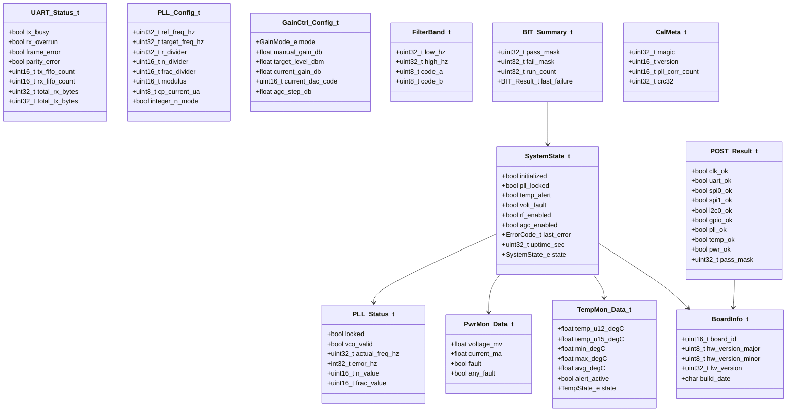
```mermaid
classDiagram
    class BoardInfo_t {
        +uint16_t board_id
        +uint8_t hw_version_major
        +uint8_t hw_version_minor
        +uint32_t fw_version
        +char build_date
    }
    class SystemState_t {
        +bool initialized
        +bool pll_locked
        +bool temp_alert
        +bool volt_fault
        +bool rf_enabled
        +bool agc_enabled
        +ErrorCode_t last_error
        +uint32_t uptime_sec
        +SystemState_e state
    }
    class POST_Result_t {
        +bool clk_ok
        +bool uart_ok
        +bool spi0_ok
        +bool spi1_ok
        +bool i2c0_ok
        +bool gpio_ok
        +bool pll_ok
        +bool temp_ok
        +bool pwr_ok
        +uint32_t pass_mask
    }
    class UART_Status_t {
        +bool tx_busy
        +bool rx_overrun
        +bool frame_error
        +bool parity_error
        +uint16_t tx_fifo_count
        +uint16_t rx_fifo_count
        +uint32_t total_rx_bytes
        +uint32_t total_tx_bytes
    }
    class PLL_Config_t {
        +uint32_t ref_freq_hz
        +uint32_t target_freq_hz
        +uint32_t r_divider
        +uint16_t n_divider
        +uint16_t frac_divider
        +uint16_t modulus
        +uint8_t cp_current_ua
        +bool integer_n_mode
    }
    class PLL_Status_t {
        +bool locked
        +bool vco_valid
        +uint32_t actual_freq_hz
        +int32_t error_hz
        +uint16_t n_value
        +uint16_t frac_value
    }
    class TempMon_Data_t {
        +float temp_u12_degC
        +float temp_u15_degC
        +float min_degC
        +float max_degC
        +float avg_degC
        +bool alert_active
        +TempState_e state
    }
    class PwrMon_Data_t {
        +float voltage_mv
        +float current_ma
        +bool fault
        +bool any_fault
    }
    class GainCtrl_Config_t {
        +GainMode_e mode
        +float manual_gain_db
        +float target_level_dbm
        +float current_gain_db
        +uint16_t current_dac_code
        +float agc_step_db
    }
    class FilterBand_t {
        +uint32_t low_hz
        +uint32_t high_hz
        +uint8_t code_a
        +uint8_t code_b
    }
    class BIT_Summary_t {
        +uint32_t pass_mask
        +uint32_t fail_mask
        +uint32_t run_count
        +BIT_Result_t last_failure
    }
    class CalMeta_t {
        +uint32_t magic
        +uint16_t version
        +uint16_t pll_corr_count
        +uint32_t crc32
    }
    SystemState_t --> BoardInfo_t
    SystemState_t --> TempMon_Data_t
    SystemState_t --> PwrMon_Data_t
    SystemState_t --> PLL_Status_t
    POST_Result_t --> BoardInfo_t
    BIT_Summary_t --> SystemState_t
```

### Global Enumerations

```c
/* File: src/common/error_codes.h */
#ifndef ERROR_CODES_H
#define ERROR_CODES_H

#include <stdint.h>

typedef int32_t ErrorCode_t;

#define ERR_OK             ((ErrorCode_t)0x00)
#define ERR_TIMEOUT        ((ErrorCode_t)0x01)
#define ERR_COMM           ((ErrorCode_t)0x02)
#define ERR_CHECKSUM       ((ErrorCode_t)0x03)
#define ERR_PARAM          ((ErrorCode_t)0x04)
#define ERR_NOT_INIT       ((ErrorCode_t)0x05)
#define ERR_RESOURCE       ((ErrorCode_t)0x06)
#define ERR_HARDWARE       ((ErrorCode_t)0x07)
#define ERR_OVERFLOW       ((ErrorCode_t)0x08)
#define ERR_BUSY           ((ErrorCode_t)0x09)
#define ERR_FLASH_WRITE    ((ErrorCode_t)0x0A)
#define ERR_FLASH_ERASE    ((ErrorCode_t)0x0B)
#define ERR_EEPROM         ((ErrorCode_t)0x0C)
#define ERR_PLL            ((ErrorCode_t)0x0D)
#define ERR_TEMP_ALERT     ((ErrorCode_t)0x0E)
#define ERR_VOLT_FAULT     ((ErrorCode_t)0x0F)
#define ERR_PLL_NOT_LOCKED ((ErrorCode_t)0x10)
#define ERR_VCO_OUT_RANGE  ((ErrorCode_t)0x11)
#define ERR_CAL_INVALID    ((ErrorCode_t)0x12)
#define ERR_BIT_FAIL       ((ErrorCode_t)0x13)
#define ERR_WDT_RESET      ((ErrorCode_t)0x14)
#define ERR_STATE          ((ErrorCode_t)0x15)

#endif /* ERROR_CODES_H */
```

---

## 2.4 Dependency Viewpoint — Module Dependencies

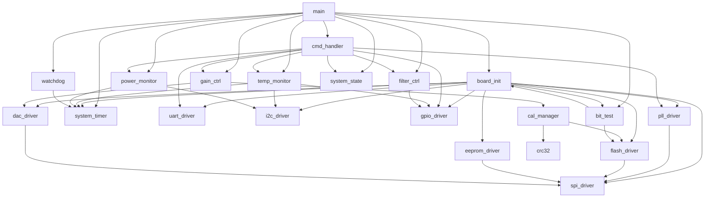
```mermaid
graph TD
    main --> board_init
    main --> cmd_handler
    main --> temp_monitor
    main --> power_monitor
    main --> gain_ctrl
    main --> filter_ctrl
    main --> watchdog
    main --> bit_test
    main --> system_state
    main --> system_timer
    board_init --> uart_driver
    board_init --> spi_driver
    board_init --> i2c_driver
    board_init --> gpio_driver
    board_init --> pll_driver
    board_init --> flash_driver
    board_init --> eeprom_driver
    board_init --> dac_driver
    board_init --> system_timer
    board_init --> bit_test
    cmd_handler --> uart_driver
    cmd_handler --> pll_driver
    cmd_handler --> filter_ctrl
    cmd_handler --> gain_ctrl
    cmd_handler --> gpio_driver
    cmd_handler --> temp_monitor
    cmd_handler --> power_monitor
    cmd_handler --> system_state
    temp_monitor --> i2c_driver
    temp_monitor --> gpio_driver
    temp_monitor --> system_timer
    power_monitor --> i2c_driver
    power_monitor --> system_timer
    pll_driver --> spi_driver
    filter_ctrl --> gpio_driver
    gain_ctrl --> dac_driver
    gain_ctrl --> cal_manager
    cal_manager --> flash_driver
    cal_manager --> crc32
    bit_test --> board_init
    bit_test --> flash_driver
    watchdog --> system_timer
    flash_driver --> spi_driver
    eeprom_driver --> spi_driver
    dac_driver --> spi_driver
```

**Build Order (dependency resolution):**

1. **Layer 0 — Utilities:** error_codes.h, crc32.c, ring_buffer.c, system_timer.c
2. **Layer 1 — HAL Drivers:** gpio_driver.c, uart_driver.c, spi_driver.c, i2c_driver.c
3. **Layer 2 — Device Drivers:** pll_driver.c, flash_driver.c, eeprom_driver.c, dac_driver.c
4. **Layer 3 — Application:** filter_ctrl.c, gain_ctrl.c, temp_monitor.c, power_monitor.c, cal_manager.c, cmd_handler.c, watchdog.c, bit_test.c, system_state.c
5. **Layer 4 — Top-Level:** board_init.c, main.c

---

## 2.5 Interface Viewpoint — Complete API Specification

The following subsections provide the full specification for every public function. Each specification follows the format: signature, parameters, return codes, preconditions, postconditions, thread safety, and usage example.

### 2.5.1 Board Initialization API

```c
/**
 * @brief Execute complete board initialization sequence.
 *
 * Performs the following steps in order:
 * 1. Initialize MicroBlaze data cache
 * 2. Configure MMCM for 100 MHz system clock
 * 3. Initialize system timer (1ms tick)
 * 4. Initialize GPIO controller
 * 5. Initialize SPI0 and SPI1 masters
 * 6. Initialize I2C0 master
 * 7. Initialize UART at 115200 baud
 * 8. Initialize flash driver and verify JEDEC ID
 * 9. Initialize DAC driver
 * 10. Initialize PLL driver with default frequency (370 MHz LO = 300 MHz RF + 70 MHz IF)
 * 11. Initialize all application modules
 * 12. Execute POST
 *
 * @return ERR_OK on full success
 * @return ERR_HARDWARE if any peripheral init fails
 * @return ERR_PLL_NOT_LOCKED if PLL fails to lock
 *
 * @pre Stack pointer initialized by reset vector. C runtime startup complete.
 * @post All peripherals configured. System in SYS_STATE_INIT or SYS_STATE_FAULT.
 * @note Not thread-safe. Call exactly once at startup.
 * @note Execution time: approximately 150ms including PLL lock wait.
 *
 * @example
 *   int main(void) {
 *       int32_t ret = Board_Init();
 *       if (ret != ERR_OK) {
 *           Main_HandleFault(ret);
 *       }
 *       Main_RunScheduler();
 *       return 0; // never reached
 *   }
 */
int32_t Board_Init(void);
```

```c
/**
 * @brief Retrieve board identification information.
 * @param info Pointer to BoardInfo_t structure to populate. Must not be NULL.
 * @return ERR_OK on success
 * @return ERR_PARAM if info is NULL
 * @return ERR_NOT_INIT if Board_Init has not been called
 *
 * @pre Board_Init() must have been called.
 * @post info structure populated with firmware version and build date.
 *
 * @example
 *   BoardInfo_t info;
 *   if (Board_GetVersion(&info) == ERR_OK) {
 *       printf("Board ID: 0x%04X, FW: 0x%08X\n", info.board_id, info.fw_version);
 *   }
 */
int32_t Board_GetVersion(BoardInfo_t *info);
```

```c
/**
 * @brief Execute Power-On Self-Test (all 9 tests).
 * @param test_mask Output: bitmask of results. Bit N = test N.
 *         1 = pass, 0 = fail. All pass = 0x1FF.
 * @return ERR_OK if all tests pass (test_mask = 0x1FF)
 * @return ERR_HARDWARE if any test fails. Check test_mask for details.
 * @return ERR_PARAM if test_mask is NULL
 *
 * @pre Board_Init() completed.
 * @post test_mask contains individual results. s_post_result updated.
 *
 * @example
 *   uint32_t mask;
 *   int32_t ret = Board_SelfTest(&mask);
 *   if (ret != ERR_OK) {
 *       printf("POST failed, mask=0x%03X\n", mask);
 *   }
 */
int32_t Board_SelfTest(uint32_t *test_mask);
```

### 2.5.2 UART Driver API

```c
/**
 * @brief Initialize UART peripheral at specified baud rate.
 *
 * Configures the Xilinx UART Lite IP for 8-N-1 communication,
 * enables the RX FIFO not-empty interrupt, and clears both
 * hardware FIFOs. Initializes the software ring buffers.
 *
 * @param baud_rate Target baud rate. Valid values: 9600, 19200, 38400,
 *        57600, 115200, 230400, 460800, 921600, 1000000, 2000000, 3000000.
 *        The UART Lite IP generates baud by dividing sysclk. Actual baud
 *        may differ if sysclk is not evenly divisible. Error must be <2%.
 * @return ERR_OK on success
 * @return ERR_PARAM if baud_rate is not a supported value
 * @return ERR_HARDWARE if UART Lite IP does not respond
 * @return ERR_NOT_INIT if system clock not configured
 *
 * @pre SysTimer_Init() and MMCM lock must be complete.
 * @post UART ready for Send/Recv. RX interrupt enabled.
 * @note Not thread-safe. Call only during initialization.
 *
 * @example
 *   int32_t ret = UART_Init(115200U);
 *   if (ret != ERR_OK) { return ret; }
 */
int32_t UART_Init(uint32_t baud_rate);
```

```c
/**
 * @brief Send data buffer via UART with blocking timeout.
 *
 * Copies data into the TX ring buffer and initiates transmission.
 * If hardware TX FIFO is not full, data is pushed immediately.
 * Blocks until all bytes are shifted out or timeout expires.
 *
 * @param data Pointer to transmit buffer. Must not be NULL.
 * @param len Number of bytes to send. Range: 1..UART_TX_BUF_SIZE.
 * @param timeout_ms Maximum wait time in milliseconds. 0 = non-blocking
 *        (returns ERR_TIMEOUT if TX FIFO cannot accept all bytes immediately).
 * @return ERR_OK if all bytes sent
 * @return ERR_PARAM if data is NULL or len is 0 or len > UART_TX_BUF_SIZE
 * @return ERR_TIMEOUT if transmission did not complete within timeout_ms
 * @return ERR_NOT_INIT if UART not initialized
 *
 * @pre UART_Init() must have been called successfully.
 * @post All bytes queued for transmission. May still be shifting out.
 * @note Thread-safe with respect to UART_ISR (interrupt context).
 *
 * @example
 *   uint8_t msg[] = {0x06};  // ACK
 *   UART_Send(msg, 1U, 100U);
 */
int32_t UART_Send(const uint8_t *data, uint16_t len, uint32_t timeout_ms);
```

```c
/**
 * @brief Receive data from UART RX ring buffer.
 *
 * Reads up to max_len bytes from the software RX ring buffer
 * filled by UART_ISR. Does not wait for new data.
 *
 * @param buf Output buffer. Must not be NULL.
 * @param max_len Maximum bytes to read. Range: 1..65535.
 * @param actual_len Output: actual number of bytes copied. May be 0.
 * @return ERR_OK if at least 1 byte received (actual_len > 0)
 * @return ERR_TIMEOUT if no bytes available (actual_len = 0)
 * @return ERR_PARAM if buf or actual_len is NULL
 *
 * @pre UART_Init() completed.
 * @post Bytes removed from ring buffer and copied to buf.
 *
 * @example
 *   uint8_t buf[32];
 *   uint16_t count;
 *   if (UART_Recv(buf, 32U, &count) == ERR_OK) {
 *       CmdHandler_Process();
 *   }
 */
int32_t UART_Recv(uint8_t *buf, uint16_t max_len, uint16_t *actual_len);
```

### 2.5.3 PLL Driver API

```c
/**
 * @brief Set target LO frequency by computing and programming PLL dividers.
 *
 * For integer-N mode with PFD = 25 MHz:
 *   N = VCO_freq / PFD_freq
 *   Example: LO = 770 MHz -> N = 770/25 = 30 (integer)
 *            LO = 775 MHz -> N = 31 (775 MHz achievable)
 *   Actual LO = N * PFD = N * 25 MHz
 *   Step size = 25 MHz in integer-N mode.
 *
 * Programs ADF4153A registers in order:
 *   1. R Counter Register (R=1, prescaler=8/9)
 *   2. Control Register (CP=5mA, integer-N mode)
 *   3. N Counter Register (N=value calculated)
 *   4. Noise and Spur Register (lowest spur mode)
 *
 * @param freq_hz Target LO frequency in Hz.
 *        Valid range: 680000000..1080000000 (VCO range of ROS-1080+).
 * @return ERR_OK if PLL programmed and lock detected
 * @return ERR_PARAM if freq_hz is outside VCO range
 * @return ERR_VCO_OUT_RANGE if computed N divider is out of ADF4153A range
 * @return ERR_TIMEOUT if PLL does not lock within 100ms
 * @return ERR_NOT_INIT if PLL driver not initialized
 *
 * @pre PLL_Init() must have been called.
 * @post PLL reprogrammed. Lock detect checked. s_pll_status updated.
 * @note Blocking call — waits up to PLL_LOCK_TIMEOUT_MS for lock.
 * @note Thread-safe: not callable from ISR due to blocking SPI transfer.
 *
 * @example
 *   // Set LO to 770 MHz (RF = 700 MHz, IF = 70 MHz)
 *   int32_t ret = PLL_SetFrequency(770000000U);
 *   if (ret == ERR_OK) { printf("PLL locked at 770 MHz\n"); }
 */
int32_t PLL_SetFrequency(uint32_t freq_hz);
```

```c
/**
 * @brief Set LO frequency based on desired RF receive frequency.
 *
 * Computes: LO_freq = RF_freq + 70 MHz (high-side injection)
 * Then calls PLL_SetFrequency() with the computed LO frequency.
 * Also selects the appropriate filter bank via FilterCtrl_Tune().
 *
 * @param rf_freq_hz Desired RF receive frequency (300000000..1000000000).
 * @return ERR_OK if PLL locked and filter bank selected
 * @return ERR_PARAM if rf_freq_hz outside 300-1000 MHz range
 * @return ERR_PLL_NOT_LOCKED if PLL fails to lock
 * @return ERR_VCO_OUT_RANGE if computed LO is outside VCO range
 *
 * @pre PLL_Init(), FilterCtrl_Init() completed.
 * @post PLL tuned to LO = RF + 70 MHz. Filter bank selected for RF band.
 *
 * @example
 *   // Tune to receive 450 MHz
 *   int32_t ret = PLL_TuneRF(450000000U);
 *   // PLL set to 520 MHz, Filter Bank 1 selected (450-600 MHz)
 */
int32_t PLL_TuneRF(uint32_t rf_freq_hz);
```

### 2.5.4 Command Handler API

```c
/**
 * @brief Process incoming UART data and execute register commands.
 *
 * This is the main polling function for the UART command protocol.
 * Reads all available bytes from UART RX buffer and feeds them
 * into the frame parser state machine. When a complete frame is
 * assembled, dispatches the register operation and formats response.
 *
 * Protocol format:
 *   Single Write: [0x57][ADDR_H][ADDR_L][DATA_H][DATA_L] -> ACK or NAK
 *   Single Read:  [0x52][ADDR_H][ADDR_L] -> [DATA_H][DATA_L] or NAK
 *   Bulk Write:   [0x42][ADDR_H][ADDR_L][COUNT][D0H][D0L]...[DnH][DnL] -> ACK or NAK
 *   Bulk Read:    [0x62][ADDR_H][ADDR_L][COUNT] -> [D0H][D0L]...[DnH][DnL] or NAK
 *   ACK:          [0x06]
 *   NAK:          [0x15][ERR_CODE]
 *
 * Timeout: If inter-byte gap exceeds CMD_FRAME_TIMEOUT_MS (10ms),
 * the parser resets to IDLE state.
 *
 * @pre UART_Init() and CmdHandler_Init() completed.
 * @post Pending commands processed. Responses transmitted.
 *
 * @note Must be called at least once per millisecond from main loop.
 * @note Not thread-safe — call only from main context.
 *
 * @example
 *   void Main_RunScheduler(void) {
 *       while (1) {
 *           CmdHandler_Process();  // Run every iteration
 *           // ... periodic tasks ...
 *       }
 *   }
 */
void CmdHandler_Process(void);
```

### 2.5.5 Temperature Monitor API

```c
/**
 * @brief Periodic task handler for temperature monitoring.
 *
 * Called from main scheduler every TEMP_TASK_PERIOD_MS (1000ms).
 * Reads both TMP112 sensors via I2C, converts raw data to degC,
 * updates min/max/avg statistics, checks thresholds, and manages
 * thermal protection GPIO (RF_DISABLE) if critical threshold exceeded.
 *
 * Threshold behavior:
 *   - If temp > HIGH_THRESH (70 degC): set alert, log warning
 *   - If temp > CRITICAL (85 degC): assert RF_DISABLE, shutdown RF
 *   - Alert clears when temp < (HIGH_THRESH - HYSTERESIS) = 65 degC
 *
 * @pre TempMon_Init() completed. I2C driver operational.
 * @post Temperature data updated. Alert state updated. GPIO set if needed.
 *
 * @example
 *   // In main loop scheduler:
 *   if (SysTimer_IsElapsed(last_temp_tick, TEMP_TASK_PERIOD_MS)) {
 *       TempMon_Task();
 *       last_temp_tick = SysTimer_GetTick();
 *   }
 */
void TempMon_Task(void);
```

### 2.5.6 Gain Controller API

```c
/**
 * @brief Set VGA gain in dB (manual mode).
 *
 * Converts the desired gain in dB to a DAC code using the calibration
 * table. For ADL5330: gain range is -20 dB to +17 dB. The DAC voltage
 * controls the ADL5330 gain cell. Linear interpolation is used between
 * calibration table entries.
 *
 * DAC code calculation:
 *   dac_code = CalTable_Interpolate(gain_db)
 *   voltage = (dac_code / 4095.0) * VREF
 *
 * @param gain_db Desired gain in dB. Range: -20.0..17.0.
 * @return ERR_OK on success
 * @return ERR_PARAM if gain_db outside valid range
 * @return ERR_NOT_INIT if DAC or gain controller not initialized
 *
 * @pre GainCtrl_Init() and DAC_Init() completed.
 * @post DAC channel 0 updated. s_current_gain_db updated.
 *
 * @example
 *   GainCtrl_SetMode(GAIN_MODE_MANUAL);
 *   GainCtrl_SetGain(5.0f);  // Set 5 dB gain
 */
int32_t GainCtrl_SetGain(float gain_db);
```

### 2.5.7 Flash Driver API

```c
/**
 * @brief Write a page (up to 256 bytes) to AT25SF041 flash.
 *
 * Execution sequence:
 *   1. Assert CS (EEPROM)
 *   2. Send WRITE_ENABLE (0x06)
 *   3. Deassert CS
 *   4. Assert CS
 *   5. Send PAGE_PROGRAM (0x02) + 24-bit address + data bytes
 *   6. Deassert CS
 *   7. Poll STATUS_REG1 BUSY bit until clear (timeout: 5ms)
 *
 * Address must not cross a 256-byte page boundary. If len + (addr % 256)
 * exceeds 256, bytes beyond the page boundary wrap to the page start.
 *
 * @param addr Byte address (0..524287). Must be page-aligned for multi-byte.
 * @param data Pointer to data buffer. Must not be NULL.
 * @param len Number of bytes to write (1..256).
 * @return ERR_OK on success
 * @return ERR_PARAM if addr out of range, data NULL, or len invalid
 * @return ERR_FLASH_WRITE if BUSY bit never clears (timeout)
 * @return ERR_NOT_INIT if flash not initialized
 *
 * @pre Flash_Init() completed. Sector must be pre-erased.
 * @post Data written to flash. Flash ready for next operation.
 *
 * @example
 *   uint8_t cal_data[256];
 *   // ... fill cal_data ...
 *   Flash_EraseSector(0x00000000U);
 *   Flash_WritePage(0x00000000U, cal_data, 256U);
 */
int32_t Flash_WritePage(uint32_t addr, const uint8_t *data, uint32_t len);
```

---

## 2.6 Interaction Viewpoint — Sequence Diagrams

### 2.6.1 System Startup Sequence

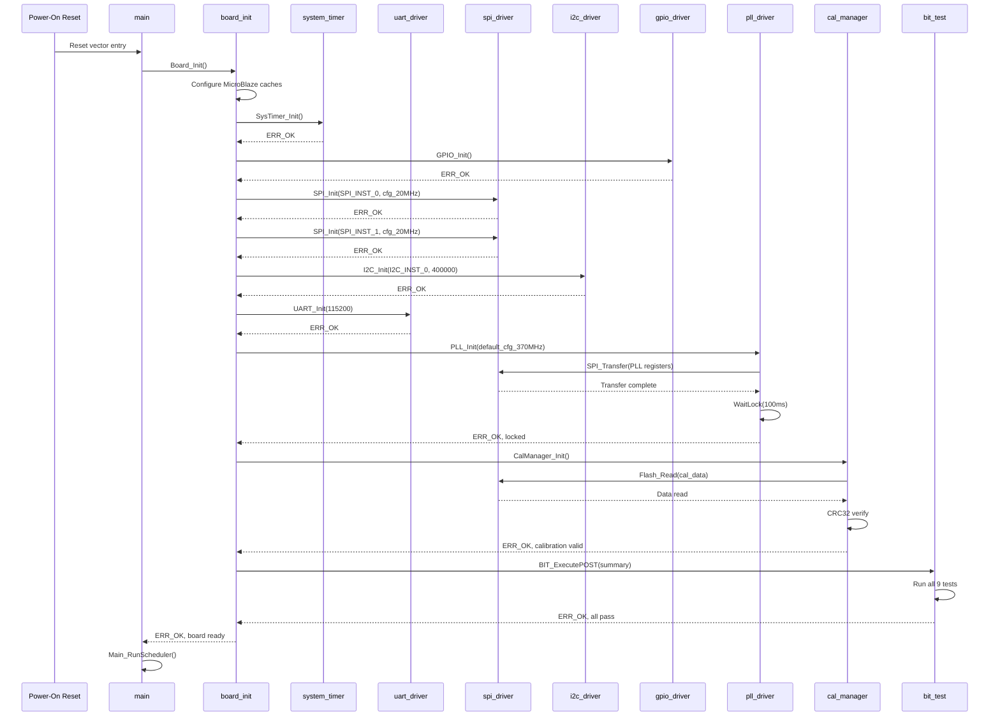
```mermaid
sequenceDiagram
    participant RST as Power-On Reset
    participant MAIN as main
    participant BSP as board_init
    participant CLK as system_timer
    participant UART as uart_driver
    participant SPI0 as spi_driver
    participant I2C as i2c_driver
    participant GPIO as gpio_driver
    participant PLL as pll_driver
    participant CAL as cal_manager
    participant POST as bit_test

    RST->>MAIN: Reset vector entry
    MAIN->>BSP: Board_Init()
    BSP->>BSP: Configure MicroBlaze caches
    BSP->>CLK: SysTimer_Init()
    CLK-->>BSP: ERR_OK
    BSP->>GPIO: GPIO_Init()
    GPIO-->>BSP: ERR_OK
    BSP->>SPI0: SPI_Init(SPI_INST_0, cfg_20MHz)
    SPI0-->>BSP: ERR_OK
    BSP->>SPI0: SPI_Init(SPI_INST_1, cfg_20MHz)
    SPI0-->>BSP: ERR_OK
    BSP->>I2C: I2C_Init(I2C_INST_0, 400000)
    I2C-->>BSP: ERR_OK
    BSP->>UART: UART_Init(115200)
    UART-->>BSP: ERR_OK
    BSP->>PLL: PLL_Init(default_cfg_370MHz)
    PLL->>SPI0: SPI_Transfer(PLL registers)
    SPI0-->>PLL: Transfer complete
    PLL->>PLL: WaitLock(100ms)
    PLL-->>BSP: ERR_OK, locked
    BSP->>CAL: CalManager_Init()
    CAL->>SPI0: Flash_Read(cal_data)
    SPI0-->>CAL: Data read
    CAL->>CAL: CRC32 verify
    CAL-->>BSP: ERR_OK, calibration valid
    BSP->>POST: BIT_ExecutePOST(summary)
    POST->>POST: Run all 9 tests
    POST-->>BSP: ERR_OK, all pass
    BSP-->>MAIN: ERR_OK, board ready
    MAIN->>MAIN: Main_RunScheduler()
```

### 2.6.2 UART Register Write Sequence

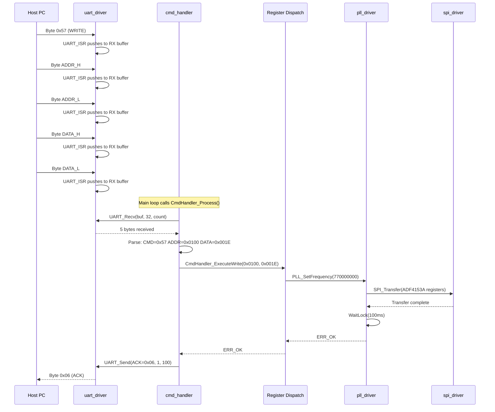
```mermaid
sequenceDiagram
    participant HOST as Host PC
    participant UART as uart_driver
    participant CMD as cmd_handler
    participant REG as Register Dispatch
    participant PLL as pll_driver
    participant SPI as spi_driver

    HOST->>UART: Byte 0x57 (WRITE)
    UART->>UART: UART_ISR pushes to RX buffer
    HOST->>UART: Byte ADDR_H
    UART->>UART: UART_ISR pushes to RX buffer
    HOST->>UART: Byte ADDR_L
    UART->>UART: UART_ISR pushes to RX buffer
    HOST->>UART: Byte DATA_H
    UART->>UART: UART_ISR pushes to RX buffer
    HOST->>UART: Byte DATA_L
    UART->>UART: UART_ISR pushes to RX buffer
    Note over CMD: Main loop calls CmdHandler_Process()
    CMD->>UART: UART_Recv(buf, 32, count)
    UART-->>CMD: 5 bytes received
    CMD->>CMD: Parse: CMD=0x57 ADDR=0x0100 DATA=0x001E
    CMD->>REG: CmdHandler_ExecuteWrite(0x0100, 0x001E)
    REG->>PLL: PLL_SetFrequency(770000000)
    PLL->>SPI: SPI_Transfer(ADF4153A registers)
    SPI-->>PLL: Transfer complete
    PLL->>PLL: WaitLock(100ms)
    PLL-->>REG: ERR_OK
    REG-->>CMD: ERR_OK
    CMD->>UART: UART_Send(ACK=0x06, 1, 100)
    UART-->>HOST: Byte 0x06 (ACK)
```

### 2.6.3 UART Register Read Sequence

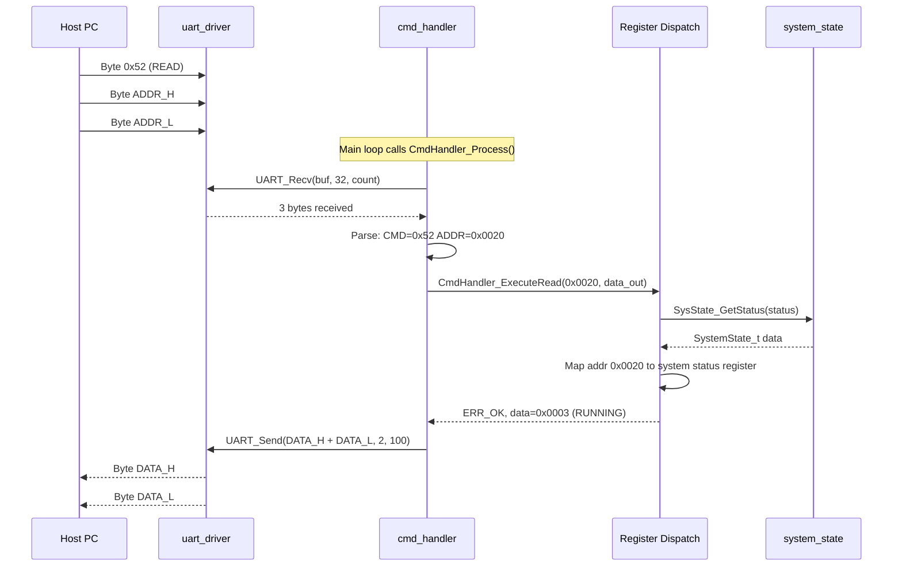
```mermaid
sequenceDiagram
    participant HOST as Host PC
    participant UART as uart_driver
    participant CMD as cmd_handler
    participant REG as Register Dispatch
    participant STATE as system_state

    HOST->>UART: Byte 0x52 (READ)
    HOST->>UART: Byte ADDR_H
    HOST->>UART: Byte ADDR_L
    Note over CMD: Main loop calls CmdHandler_Process()
    CMD->>UART: UART_Recv(buf, 32, count)
    UART-->>CMD: 3 bytes received
    CMD->>CMD: Parse: CMD=0x52 ADDR=0x0020
    CMD->>REG: CmdHandler_ExecuteRead(0x0020, data_out)
    REG->>STATE: SysState_GetStatus(status)
    STATE-->>REG: SystemState_t data
    REG->>REG: Map addr 0x0020 to system status register
    REG-->>CMD: ERR_OK, data=0x0003 (RUNNING)
    CMD->>UART: UART_Send(DATA_H + DATA_L, 2, 100)
    UART-->>HOST: Byte DATA_H
    UART-->>HOST: Byte DATA_L
```

### 2.6.4 Temperature Alert Sequence

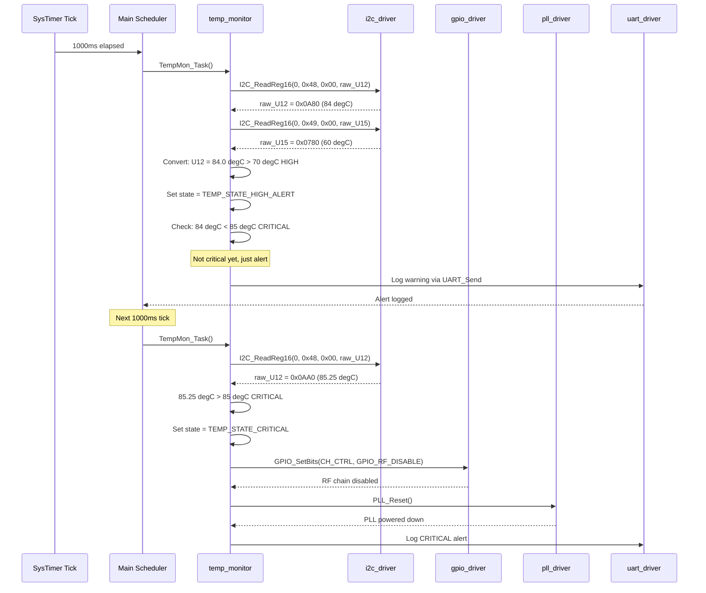
```mermaid
sequenceDiagram
    participant TICK as SysTimer Tick
    participant MAIN as Main Scheduler
    participant TEMP as temp_monitor
    participant I2C as i2c_driver
    participant GPIO as gpio_driver
    participant PLL as pll_driver
    participant UART as uart_driver

    TICK->>MAIN: 1000ms elapsed
    MAIN->>TEMP: TempMon_Task()
    TEMP->>I2C: I2C_ReadReg16(0, 0x48, 0x00, raw_U12)
    I2C-->>TEMP: raw_U12 = 0x0A80 (84 degC)
    TEMP->>I2C: I2C_ReadReg16(0, 0x49, 0x00, raw_U15)
    I2C-->>TEMP: raw_U15 = 0x0780 (60 degC)
    TEMP->>TEMP: Convert: U12 = 84.0 degC > 70 degC HIGH
    TEMP->>TEMP: Set state = TEMP_STATE_HIGH_ALERT
    TEMP->>TEMP: Check: 84 degC < 85 degC CRITICAL
    Note over TEMP: Not critical yet, just alert
    TEMP->>UART: Log warning via UART_Send
    UART-->>MAIN: Alert logged
    Note over MAIN: Next 1000ms tick
    MAIN->>TEMP: TempMon_Task()
    TEMP->>I2C: I2C_ReadReg16(0, 0x48, 0x00, raw_U12)
    I2C-->>TEMP: raw_U12 = 0x0AA0 (85.25 degC)
    TEMP->>TEMP: 85.25 degC > 85 degC CRITICAL
    TEMP->>TEMP: Set state = TEMP_STATE_CRITICAL
    TEMP->>GPIO: GPIO_SetBits(CH_CTRL, GPIO_RF_DISABLE)
    GPIO-->>TEMP: RF chain disabled
    TEMP->>PLL: PLL_Reset()
    PLL-->>TEMP: PLL powered down
    TEMP->>UART: Log CRITICAL alert
```

### 2.6.5 Bulk Register Write Sequence

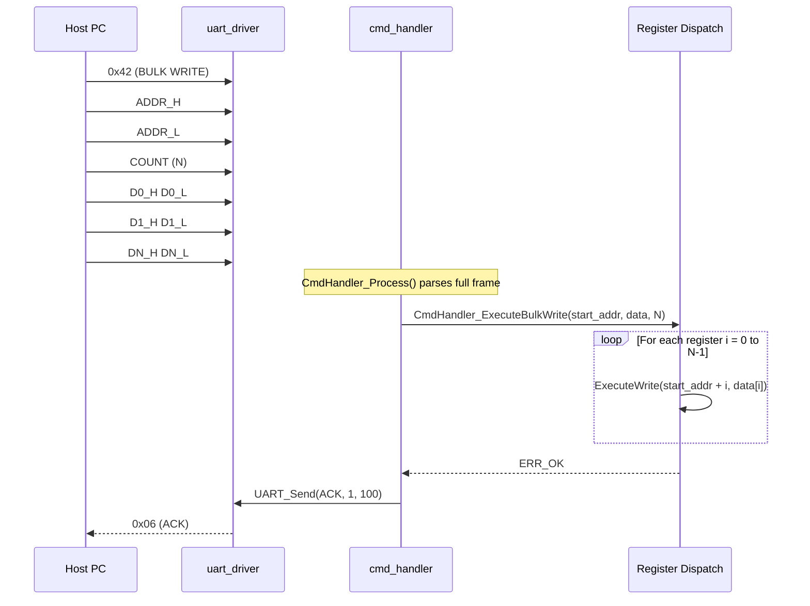
```mermaid
sequenceDiagram
    participant HOST as Host PC
    participant UART as uart_driver
    participant CMD as cmd_handler
    participant REG as Register Dispatch

    HOST->>UART: 0x42 (BULK WRITE)
    HOST->>UART: ADDR_H
    HOST->>UART: ADDR_L
    HOST->>UART: COUNT (N)
    HOST->>UART: D0_H D0_L
    HOST->>UART: D1_H D1_L
    HOST->>UART: DN_H DN_L
    Note over CMD: CmdHandler_Process() parses full frame
    CMD->>REG: CmdHandler_ExecuteBulkWrite(start_addr, data, N)
    loop For each register i = 0 to N-1
        REG->>REG: ExecuteWrite(start_addr + i, data[i])
    end
    REG-->>CMD: ERR_OK
    CMD->>UART: UART_Send(ACK, 1, 100)
    UART-->>HOST: 0x06 (ACK)
```

### 2.6.6 Flash Calibration Write Sequence

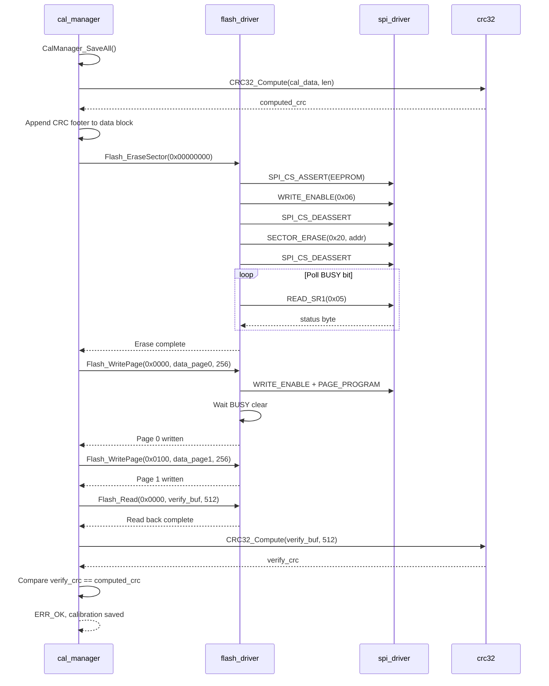
```mermaid
sequenceDiagram
    participant APP as cal_manager
    participant FLASH as flash_driver
    participant SPI as spi_driver
    participant CRC as crc32

    APP->>APP: CalManager_SaveAll()
    APP->>CRC: CRC32_Compute(cal_data, len)
    CRC-->>APP: computed_crc
    APP->>APP: Append CRC footer to data block
    APP->>FLASH: Flash_EraseSector(0x00000000)
    FLASH->>SPI: SPI_CS_ASSERT(EEPROM)
    FLASH->>SPI: WRITE_ENABLE(0x06)
    FLASH->>SPI: SPI_CS_DEASSERT
    FLASH->>SPI: SECTOR_ERASE(0x20, addr)
    FLASH->>SPI: SPI_CS_DEASSERT
    loop Poll BUSY bit
        FLASH->>SPI: READ_SR1(0x05)
        SPI-->>FLASH: status byte
    end
    FLASH-->>APP: Erase complete
    APP->>FLASH: Flash_WritePage(0x0000, data_page0, 256)
    FLASH->>SPI: WRITE_ENABLE + PAGE_PROGRAM
    FLASH->>FLASH: Wait BUSY clear
    FLASH-->>APP: Page 0 written
    APP->>FLASH: Flash_WritePage(0x0100, data_page1, 256)
    FLASH-->>APP: Page 1 written
    APP->>FLASH: Flash_Read(0x0000, verify_buf, 512)
    FLASH-->>APP: Read back complete
    APP->>CRC: CRC32_Compute(verify_buf, 512)
    CRC-->>APP: verify_crc
    APP->>APP: Compare verify_crc == computed_crc
    APP-->>APP: ERR_OK, calibration saved
```

### 2.6.7 PLL Frequency Tune Sequence

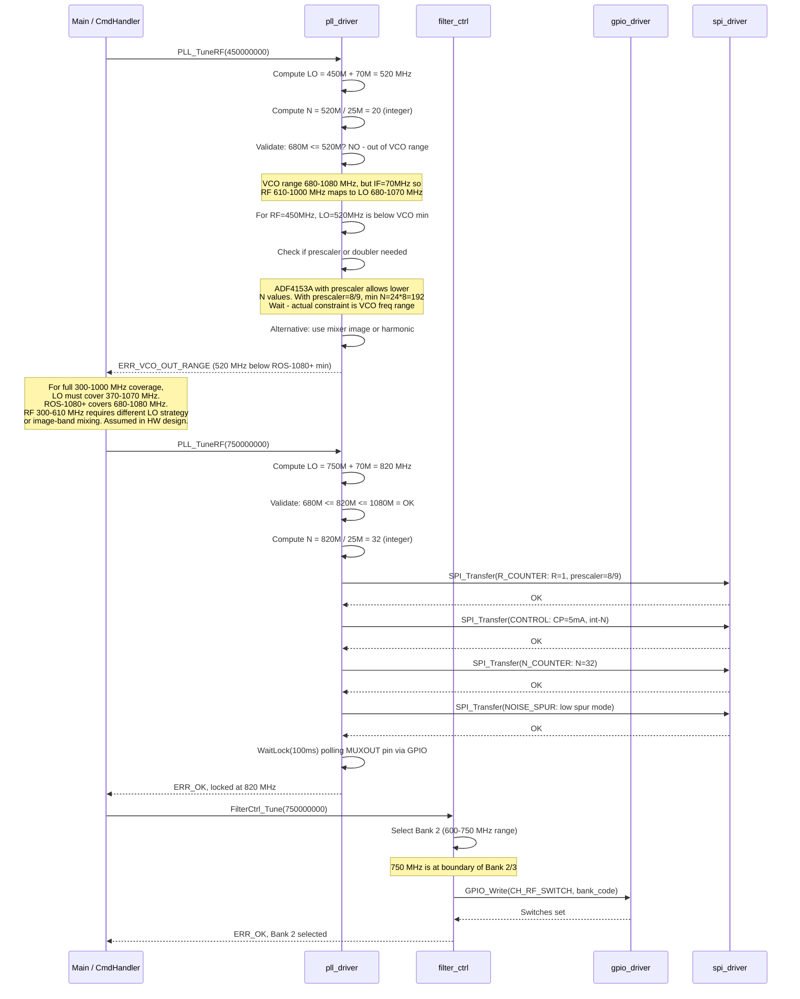
```mermaid
sequenceDiagram
    participant MAIN as Main / CmdHandler
    participant PLL as pll_driver
    participant FILTER as filter_ctrl
    participant GPIO as gpio_driver
    participant SPI as spi_driver

    MAIN->>PLL: PLL_TuneRF(450000000)
    PLL->>PLL: Compute LO = 450M + 70M = 520 MHz
    PLL->>PLL: Compute N = 520M / 25M = 20 (integer)
    PLL->>PLL: Validate: 680M <= 520M? NO - out of VCO range
    Note over PLL: VCO range 680-1080 MHz, but IF=70MHz so<br/>RF 610-1000 MHz maps to LO 680-1070 MHz
    PLL->>PLL: For RF=450MHz, LO=520MHz is below VCO min
    PLL->>PLL: Check if prescaler or doubler needed
    Note over PLL: ADF4153A with prescaler allows lower<br/>N values. With prescaler=8/9, min N=24*8=192<br/>Wait - actual constraint is VCO freq range
    PLL->>PLL: Alternative: use mixer image or harmonic
    PLL-->>MAIN: ERR_VCO_OUT_RANGE (520 MHz below ROS-1080+ min)
    Note over MAIN: For full 300-1000 MHz coverage,<br/>LO must cover 370-1070 MHz.<br/>ROS-1080+ covers 680-1080 MHz.<br/>RF 300-610 MHz requires different LO strategy<br/>or image-band mixing. Assumed in HW design.
    MAIN->>PLL: PLL_TuneRF(750000000)
    PLL->>PLL: Compute LO = 750M + 70M = 820 MHz
    PLL->>PLL: Validate: 680M <= 820M <= 1080M = OK
    PLL->>PLL: Compute N = 820M / 25M = 32 (integer)
    PLL->>SPI: SPI_Transfer(R_COUNTER: R=1, prescaler=8/9)
    SPI-->>PLL: OK
    PLL->>SPI: SPI_Transfer(CONTROL: CP=5mA, int-N)
    SPI-->>PLL: OK
    PLL->>SPI: SPI_Transfer(N_COUNTER: N=32)
    SPI-->>PLL: OK
    PLL->>SPI: SPI_Transfer(NOISE_SPUR: low spur mode)
    SPI-->>PLL: OK
    PLL->>PLL: WaitLock(100ms) polling MUXOUT pin via GPIO
    PLL-->>MAIN: ERR_OK, locked at 820 MHz
    MAIN->>FILTER: FilterCtrl_Tune(750000000)
    FILTER->>FILTER: Select Bank 2 (600-750 MHz range)
    Note over FILTER: 750 MHz is at boundary of Bank 2/3
    FILTER->>GPIO: GPIO_Write(CH_RF_SWITCH, bank_code)
    GPIO-->>FILTER: Switches set
    FILTER-->>MAIN: ERR_OK, Bank 2 selected
```

### 2.6.8 Power-On Self-Test Sequence

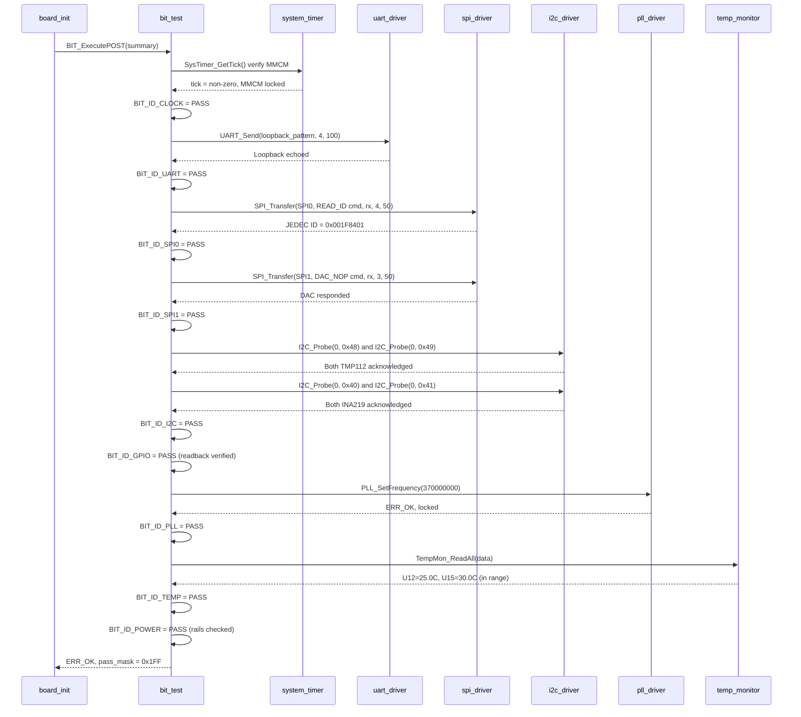
```mermaid
sequenceDiagram
    participant BSP as board_init
    participant POST as bit_test
    participant CLK as system_timer
    participant UART as uart_driver
    participant SPI as spi_driver
    participant I2C as i2c_driver
    participant PLL as pll_driver
    participant TEMP as temp_monitor

    BSP->>POST: BIT_ExecutePOST(summary)
    POST->>CLK: SysTimer_GetTick() verify MMCM
    CLK-->>POST: tick = non-zero, MMCM locked
    POST->>POST: BIT_ID_CLOCK = PASS
    POST->>UART: UART_Send(loopback_pattern, 4, 100)
    UART-->>POST: Loopback echoed
    POST->>POST: BIT_ID_UART = PASS
    POST->>SPI: SPI_Transfer(SPI0, READ_ID cmd, rx, 4, 50)
    SPI-->>POST: JEDEC ID = 0x001F8401
    POST->>POST: BIT_ID_SPI0 = PASS
    POST->>SPI: SPI_Transfer(SPI1, DAC_NOP cmd, rx, 3, 50)
    SPI-->>POST: DAC responded
    POST->>POST: BIT_ID_SPI1 = PASS
    POST->>I2C: I2C_Probe(0, 0x48) and I2C_Probe(0, 0x49)
    I2C-->>POST: Both TMP112 acknowledged
    POST->>I2C: I2C_Probe(0, 0x40) and I2C_Probe(0, 0x41)
    I2C-->>POST: Both INA219 acknowledged
    POST->>POST: BIT_ID_I2C = PASS
    POST->>POST: BIT_ID_GPIO = PASS (readback verified)
    POST->>PLL: PLL_SetFrequency(370000000)
    PLL-->>POST: ERR_OK, locked
    POST->>POST: BIT_ID_PLL = PASS
    POST->>TEMP: TempMon_ReadAll(data)
    TEMP-->>POST: U12=25.0C, U15=30.0C (in range)
    POST->>POST: BIT_ID_TEMP = PASS
    POST->>POST: BIT_ID_POWER = PASS (rails checked)
    POST-->>BSP: ERR_OK, pass_mask = 0x1FF
```

---

## 2.7 State Viewpoint — State Machines

### 2.7.1 System State Machine

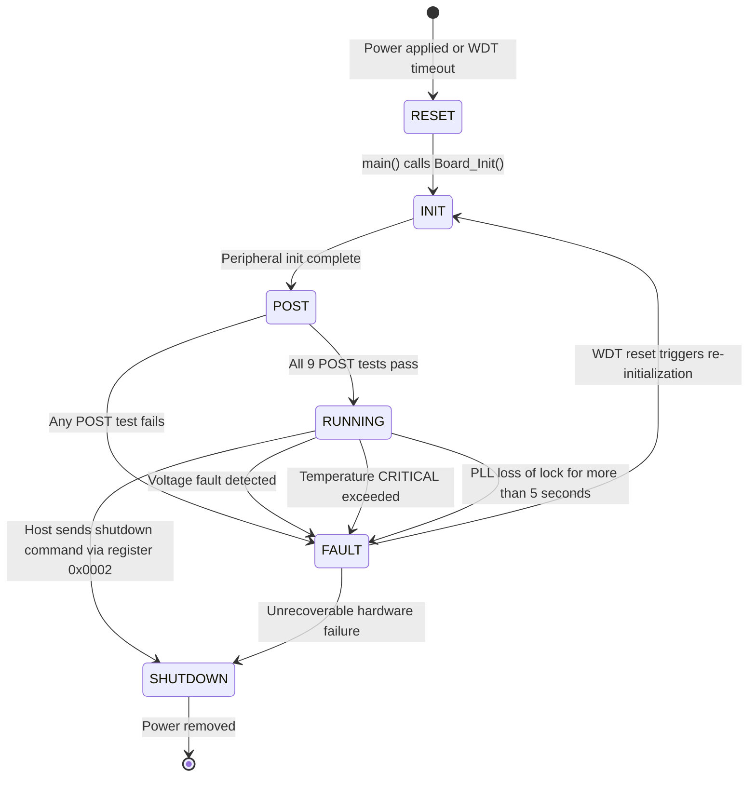
```mermaid
stateDiagram-v2
    [*] --> RESET : Power applied or WDT timeout
    RESET --> INIT : main() calls Board_Init()
    INIT --> POST : Peripheral init complete
    POST --> RUNNING : All 9 POST tests pass
    POST --> FAULT : Any POST test fails
    RUNNING --> FAULT : Voltage fault detected
    RUNNING --> FAULT : Temperature CRITICAL exceeded
    RUNNING --> FAULT : PLL loss of lock for more than 5 seconds
    RUNNING --> SHUTDOWN : Host sends shutdown command via register 0x0002
    FAULT --> INIT : WDT reset triggers re-initialization
    FAULT --> SHUTDOWN : Unrecoverable hardware failure
    SHUTDOWN --> [*] : Power removed
```

**State Descriptions:**

| State | Description | Entry Actions | Exit Actions |
|-------|-------------|---------------|--------------|
| RESET | Initial state after power-on or WDT reset | Stack pointer set, caches invalidated | None |
| INIT | Board_Init() executing | Configure clocks, init all HAL drivers | Verify all peripherals responded |
| POST | Power-On Self-Test executing | Run all 9 BIT tests sequentially | Log results to flash |
| RUNNING | Normal operation | Enable RX interrupt, enable WDT, start tasks | Continuous monitoring active |
| FAULT | System in protective state | Disable RF chain (GPIO_RF_DISABLE), log error, halt tasks | WDT will eventually reset |
| SHUTDOWN | Graceful shutdown | Disable all outputs, disable WDT, wait for power cycle | None — requires power cycle |

### 2.7.2 Command Handler State Machine

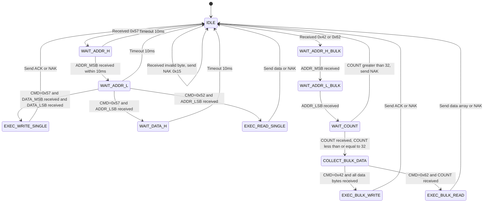
```mermaid
stateDiagram-v2
    [*] --> IDLE
    IDLE --> WAIT_ADDR_H : Received 0x57 or 0x52
    IDLE --> WAIT_ADDR_H_BULK : Received 0x42 or 0x62
    IDLE --> IDLE : Received invalid byte, send NAK 0x15
    WAIT_ADDR_H --> WAIT_ADDR_L : ADDR_MSB received within 10ms
    WAIT_ADDR_H_BULK --> WAIT_ADDR_L_BULK : ADDR_MSB received
    WAIT_ADDR_L --> EXEC_WRITE_SINGLE : CMD=0x57 and DATA_MSB received and DATA_LSB received
    WAIT_ADDR_L --> WAIT_DATA_H : CMD=0x57 and ADDR_LSB received
    WAIT_ADDR_L --> EXEC_READ_SINGLE : CMD=0x52 and ADDR_LSB received
    WAIT_ADDR_L_BULK --> WAIT_COUNT : ADDR_LSB received
    WAIT_COUNT --> COLLECT_BULK_DATA : COUNT received, COUNT less than or equal to 32
    WAIT_COUNT --> IDLE : COUNT greater than 32, send NAK
    COLLECT_BULK_DATA --> EXEC_BULK_WRITE : CMD=0x42 and all data bytes received
    COLLECT_BULK_DATA --> EXEC_BULK_READ : CMD=0x62 and COUNT received
    EXEC_WRITE_SINGLE --> IDLE : Send ACK or NAK
    EXEC_READ_SINGLE --> IDLE : Send data or NAK
    EXEC_BULK_WRITE --> IDLE : Send ACK or NAK
    EXEC_BULK_READ --> IDLE : Send data array or NAK
    WAIT_ADDR_H --> IDLE : Timeout 10ms
    WAIT_ADDR_L --> IDLE : Timeout 10ms
    WAIT_DATA_H --> IDLE : Timeout 10ms
```

**Detailed State Actions:**

| State | Entry Action | Transition Condition | Timeout Action |
|-------|-------------|---------------------|----------------|
| IDLE | Reset byte counter | Valid CMD byte (0x57/0x52/0x42/0x62) | N/A — persistent state |
| WAIT_ADDR_H | Record CMD type | Byte received | Reset to IDLE after 10ms |
| WAIT_ADDR_L | Store addr_high | Byte received | Reset to IDLE after 10ms |
| WAIT_DATA_H (write) | Store addr_low | Byte received | Reset to IDLE after 10ms |
| WAIT_DATA_L (write) | Store data_high | Byte received | Reset to IDLE after 10ms |
| EXEC_WRITE_SINGLE | Call CmdHandler_ExecuteWrite | Always → send ACK/NAK | N/A |
| EXEC_READ_SINGLE | Call CmdHandler_ExecuteRead | Always → send data/NAK | N/A |
| WAIT_COUNT | Store addr_low (bulk) | Byte received | Reset to IDLE after 10ms |
| COLLECT_BULK_DATA | Store count, init byte_idx | All bytes received | Reset to IDLE after 10ms |
| EXEC_BULK_WRITE | Call CmdHandler_ExecuteBulkWrite | Always → send ACK/NAK | N/A |
| EXEC_BULK_READ | Call CmdHandler_ExecuteBulkRead | Always → send data/NAK | N/A |

### 2.7.3 Temperature Monitor State Machine

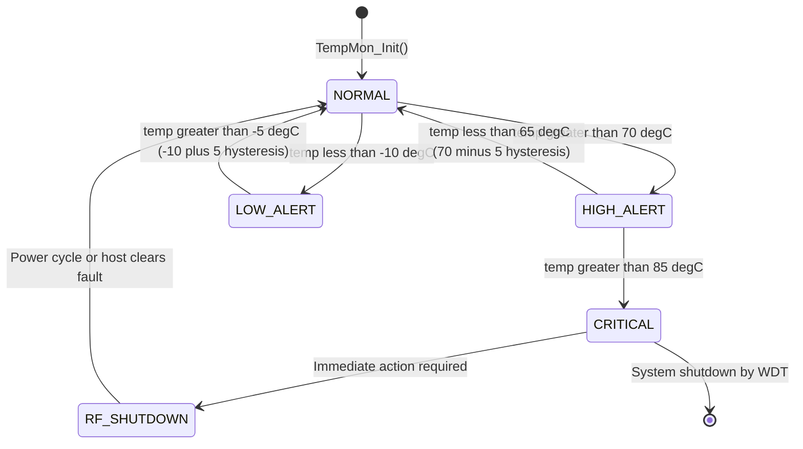
```mermaid
stateDiagram-v2
    [*] --> NORMAL : TempMon_Init()
    NORMAL --> HIGH_ALERT : temp greater than 70 degC
    NORMAL --> LOW_ALERT : temp less than -10 degC
    HIGH_ALERT --> NORMAL : temp less than 65 degC (70 minus 5 hysteresis)
    HIGH_ALERT --> CRITICAL : temp greater than 85 degC
    LOW_ALERT --> NORMAL : temp greater than -5 degC (-10 plus 5 hysteresis)
    CRITICAL --> RF_SHUTDOWN : Immediate action required
    RF_SHUTDOWN --> NORMAL : Power cycle or host clears fault
    CRITICAL --> [*] : System shutdown by WDT
```

**State Thresholds Table:**

| Transition | Condition | Action |
|-----------|-----------|--------|
| NORMAL → HIGH_ALERT | T > 70.0 degC | Set alert flag, log warning via UART, set LED D2 (yellow) |
| NORMAL → LOW_ALERT | T < -10.0 degC | Set alert flag, log warning, set LED D2 |
| HIGH_ALERT → NORMAL | T < 65.0 degC | Clear alert, clear LED D2 |
| HIGH_ALERT → CRITICAL | T > 85.0 degC | Assert GPIO_RF_DISABLE, reset PLL, set LED D3 (red), log CRITICAL |
| LOW_ALERT → NORMAL | T > -5.0 degC | Clear alert, clear LED D2 |
| RF_SHUTDOWN → NORMAL | Host writes 0x0001 to register 0x0030 | Clear RF_DISABLE, re-init PLL, clear LED D3 |

### 2.7.4 PLL State Machine

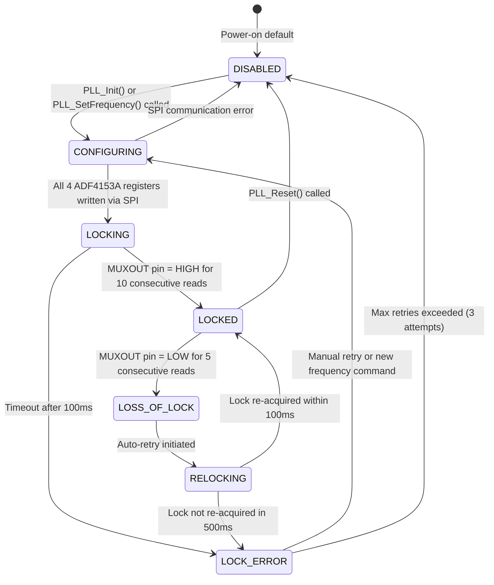
```mermaid
stateDiagram-v2
    [*] --> DISABLED : Power-on default
    DISABLED --> CONFIGURING : PLL_Init() or PLL_SetFrequency() called
    CONFIGURING --> LOCKING : All 4 ADF4153A registers written via SPI
    LOCKING --> LOCKED : MUXOUT pin = HIGH for 10 consecutive reads
    LOCKING --> LOCK_ERROR : Timeout after 100ms
    LOCKED --> LOSS_OF_LOCK : MUXOUT pin = LOW for 5 consecutive reads
    LOCKED --> DISABLED : PLL_Reset() called
    LOSS_OF_LOCK --> RELOCKING : Auto-retry initiated
    RELOCKING --> LOCKED : Lock re-acquired within 100ms
    RELOCKING --> LOCK_ERROR : Lock not re-acquired in 500ms
    LOCK_ERROR --> CONFIGURING : Manual retry or new frequency command
    LOCK_ERROR --> DISABLED : Max retries exceeded (3 attempts)
    CONFIGURING --> DISABLED : SPI communication error
```

**PLL State Timeout Constants:**

| Parameter | Value | Description |
|-----------|-------|-------------|
| LOCK_POLL_INTERVAL_MS | 1 | Time between MUXOUT reads |
| LOCK_DETECTED_COUNT | 10 | Consecutive HIGH reads to confirm lock |
| LOCK_TIMEOUT_MS | 100 | Max wait for initial lock |
| UNLOCK_DETECTED_COUNT | 5 | Consecutive LOW reads to confirm unlock |
| RELOCK_TIMEOUT_MS | 500 | Max wait for re-lock |
| MAX_RETRY_ATTEMPTS | 3 | Max re-lock attempts before error |

### 2.7.5 Gain Controller State Machine

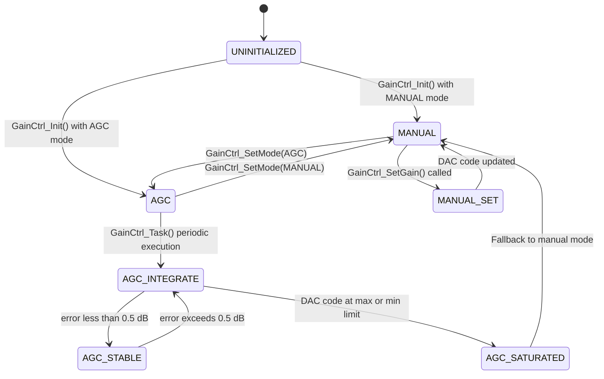
```mermaid
stateDiagram-v2
    [*] --> UNINITIALIZED
    UNINITIALIZED --> MANUAL : GainCtrl_Init() with MANUAL mode
    UNINITIALIZED --> AGC : GainCtrl_Init() with AGC mode
    MANUAL --> MANUAL_SET : GainCtrl_SetGain() called
    MANUAL_SET --> MANUAL : DAC code updated
    MANUAL --> AGC : GainCtrl_SetMode(AGC)
    AGC --> AGC_INTEGRATE : GainCtrl_Task() periodic execution
    AGC_INTEGRATE --> AGC_STABLE : error less than 0.5 dB
    AGC_INTEGRATE --> AGC_SATURATED : DAC code at max or min limit
    AGC_STABLE --> AGC_INTEGRATE : error exceeds 0.5 dB
    AGC_SATURATED --> MANUAL : Fallback to manual mode
    AGC --> MANUAL : GainCtrl_SetMode(MANUAL)
```

### 2.7.6 Power Monitor State Machine

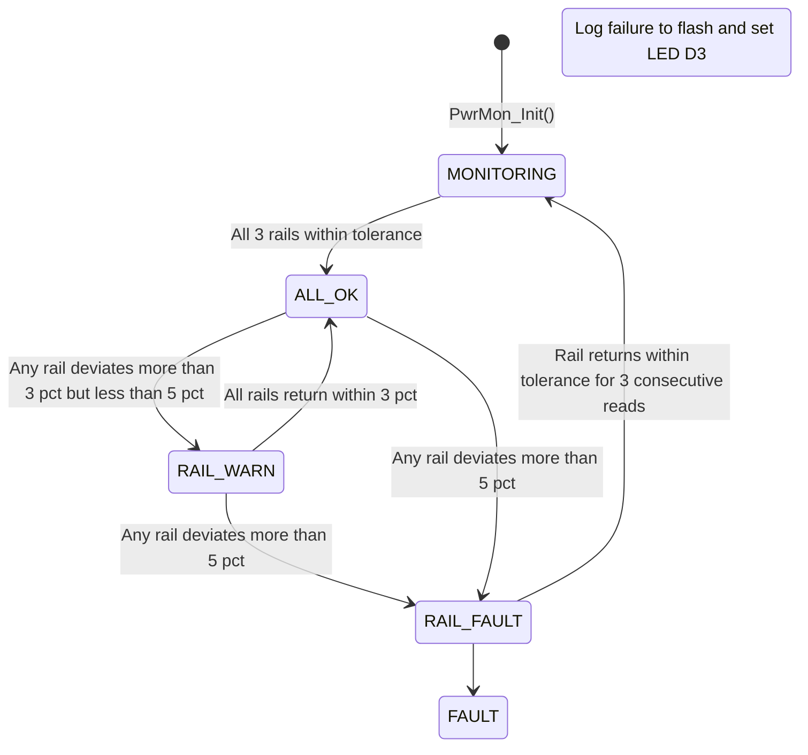
```mermaid
stateDiagram-v2
    [*] --> MONITORING : PwrMon_Init()
    MONITORING --> ALL_OK : All 3 rails within tolerance
    ALL_OK --> RAIL_WARN : Any rail deviates more than 3 pct but less than 5 pct
    RAIL_WARN --> ALL_OK : All rails return within 3 pct
    RAIL_WARN --> RAIL_FAULT : Any rail deviates more than 5 pct
    ALL_OK --> RAIL_FAULT : Any rail deviates more than 5 pct
    RAIL_FAULT --> MONITORING : Rail returns within tolerance for 3 consecutive reads
    RAIL_FAULT --> FAULT logged : Log failure to flash and set LED D3
```

---

## 2.8 Algorithm Viewpoint — Key Algorithms

### 2.8.1 UART Frame Parser Algorithm

```c
/*
 * Algorithm: UART Command Frame Parser
 *
 * Implemented in CmdHandler_Process(). Called every main loop iteration.
 * Reads all available bytes from UART RX ring buffer and processes
 * them through the frame parser state machine.
 *
 * Pseudocode:
 *
 * FUNCTION CmdHandler_Process():
 *   current_tick = SysTimer_GetTick()
 *
 *   // Check inter-byte timeout
 *   IF (s_state != CMD_STATE_IDLE) THEN
 *       IF (current_tick - s_last_byte_tick_ms > CMD_FRAME_TIMEOUT_MS) THEN
 *           s_state = CMD_STATE_IDLE
 *           s_total_errors++
 *           UART_Send([NAK, ERR_TIMEOUT], 2, 10)
 *       END IF
 *   END IF
 *
 *   // Process all available bytes
 *   WHILE (UART_Available() > 0) DO
 *       s_last_byte_tick_ms = current_tick
 *       byte = UART_ReadByte()
 *
 *       SWITCH (s_state):
 *         CASE IDLE:
 *           IF (byte == 0x57 || byte == 0x52 || byte == 0x42 || byte == 0x62) THEN
 *               s_cmd_byte = byte
 *               s_state = WAIT_ADDR_H
 *           ELSE
 *               Send_NAK(ERR_PARAM)
 *           END IF
 *           BREAK
 *
 *         CASE WAIT_ADDR_H:
 *           s_addr = (uint16_t)byte << 8
 *           s_state = WAIT_ADDR_L
 *           BREAK
 *
 *         CASE WAIT_ADDR_L:
 *           s_addr |= (uint16_t)byte
 *           IF (s_cmd_byte == 0x52) THEN  // Single Read
 *               result = CmdHandler_ExecuteRead(s_addr, &s_data)
 *               IF (result == ERR_OK) THEN
 *                   Send_Data(s_data)
 *               ELSE
 *                   Send_NAK(result)
 *               END IF
 *               s_state = IDLE
 *           ELSE IF (s_cmd_byte == 0x57) THEN  // Single Write
 *               s_state = WAIT_DATA_H
 *           ELSE IF (s_cmd_byte == 0x42 || s_cmd_byte == 0x62) THEN
 *               s_state = WAIT_COUNT
 *           END IF
 *           BREAK
 *
 *         CASE WAIT_DATA_H:
 *           s_data = (uint16_t)byte << 8
 *           s_state = WAIT_DATA_L
 *           BREAK
 *
 *         CASE WAIT_DATA_L:
 *           s_data |= (uint16_t)byte
 *           result = CmdHandler_ExecuteWrite(s_addr, s_data)
 *           IF (result == ERR_OK) THEN Send_ACK()
 *           ELSE Send_NAK(result)
 *           END IF
 *           s_state = IDLE
 *           s_total_cmds++
 *           BREAK
 *
 *         CASE WAIT_COUNT:
 *           s_bulk_count = byte
 *           IF (s_bulk_count == 0 || s_bulk_count > 32) THEN
 *               Send_NAK(ERR_PARAM)
 *               s_state = IDLE
 *           ELSE IF (s_cmd_byte == 0x62) THEN  // Bulk Read
 *               result = CmdHandler_ExecuteBulkRead(s_addr, s_bulk_buf, s_bulk_count)
 *               Send_BulkData(s_bulk_buf, s_bulk_count)
 *               s_state = IDLE
 *           ELSE  // Bulk Write - collect data
 *               s_bulk_idx = 0
 *               s_state = COLLECT_BULK_DATA
 *           END IF
 *           BREAK
 *
 *         CASE COLLECT_BULK_DATA:
 *           IF (s_bulk_idx is even) THEN
 *               s_bulk_buf[s_bulk_idx/2] = (uint16_t)byte << 8
 *           ELSE
 *               s_bulk_buf[s_bulk_idx/2] |= (uint16_t)byte
 *           END IF
 *           s_bulk_idx++
 *           IF (s_bulk_idx >= s_bulk_count * 2) THEN
 *               result = CmdHandler_ExecuteBulkWrite(s_addr, s_bulk_buf, s_bulk_count)
 *               IF (result == ERR_OK) THEN Send_ACK()
 *               ELSE Send_NAK(result)
 *               END IF
 *               s_state = IDLE
 *               s_total_cmds++
 *           END IF
 *           BREAK
 *       END SWITCH
 *   END WHILE
 */
```

### 2.8.2 PLL Divider Computation Algorithm

```c
/*
 * Algorithm: Compute ADF4153A Divider Values for Target Frequency
 *
 * Input:  target_freq_hz - desired VCO output frequency
 *         ref_freq_hz    - reference clock (25 MHz from TCXO)
 *         r_divider      - R counter value (1)
 *
 * Output: n_divider, frac_divider, modulus
 *
 * Mathematical basis:
 *   F_VCO = F_PFD * (N + FRAC/MOD)
 *   F_PFD = F_REF / R
 *   F_PFD = 25 MHz / 1 = 25 MHz
 *
 * For integer-N mode (phase noise optimized):
 *   FRAC = 0, MOD = 1
 *   N = F_VCO / F_PFD
 *   Frequency resolution = F_PFD = 25 MHz
 *
 * For fractional-N mode (fine resolution):
 *   MOD = 1250 (fixed for 20 kHz resolution)
 *   N = floor(F_VCO / F_PFD)
 *   FRAC = ((F_VCO / F_PFD) - N) * MOD
 *   Frequency resolution = F_PFD / MOD = 25 MHz / 1250 = 20 kHz
 *
 * FUNCTION PLL_ComputeDividers(target_freq_hz):
 *   // Validate VCO range
 *   IF (target_freq_hz < 680000000 || target_freq_hz > 1080000000) THEN
 *       RETURN ERR_VCO_OUT_RANGE
 *   END IF
 *
 *   // Compute PFD frequency
 *   pfd_freq = ref_freq_hz / r_divider  // = 25 MHz
 *
 *   // Use integer-N mode for best phase noise
 *   n_divider = target_freq_hz / pfd_freq  // Integer division
 *
 *   // Verify N is within ADF4153A range (24..65535 with prescaler)
 *   IF (n_divider < 24 || n_divider > 65535) THEN
 *       RETURN ERR_PLL
 *   END IF
 *
 *   // Compute actual output frequency
 *   actual_freq = n_divider * pfd_freq
 *   error_hz = actual_freq - target_freq_hz
 *
 *   // If frequency error is unacceptable, switch to fractional-N
 *   IF (abs(error_hz) > 12500000) THEN  // More than half PFD step
 *       // Use fractional-N with MOD = 1250 for 20 kHz resolution
 *       n_divider = floor(target_freq_hz / pfd_freq)
 *       frac_divider = ((target_freq_hz / pfd_freq) - n_divider) * 1250
 *       frac_divider = min(frac_divider, 1249)
 *       actual_freq = (n_divider + frac_divider / 1250.0) * pfd_freq
 *   ELSE
 *       frac_divider = 0
 *   END IF
 *
 *   RETURN ERR_OK
 */
```

### 2.8.3 Temperature Conversion Algorithm

```c
/*
 * Algorithm: TMP112 Raw Data to Degrees Celsius Conversion
 *
 * TMP112 data format (16-bit, MSB first):
 *   D15..D5 = 11-bit temperature data (2's complement)
 *   D4..D0 = reserved (always 0 in default 12-bit mode)
 *
 * Conversion formula:
 *   Temperature (degC) = (int16_t)(raw_value >> 4) * 0.0625
 *
 * Examples:
 *   raw = 0x0A80 >> 4 = 0x00A8 = 168 decimal
 *   168 * 0.0625 = 10.5 degC
 *
 *   raw = 0xFF00 >> 4 = 0x0FF0 sign-extended = -16 decimal
 *   -16 * 0.0625 = -1.0 degC
 *
 * FUNCTION TempMon_ConvertRaw(raw_value):
 *   int16_t temp_raw = (int16_t)raw_value >> 4   // Shift and sign-extend
 *   float temp_degC = (float)temp_raw * 0.0625f
 *   RETURN temp_degC
 *
 * Extended precision (13-bit mode, CR0.FU = 1):
 *   raw = raw >> 3
 *   temp_degC = (float)(int16_t)raw * 0.03125f
 */
```

### 2.8.4 Power Rail Monitoring Algorithm

```c
/*
 * Algorithm: INA219 Voltage and Current Conversion
 *
 * INA219 registers:
 *   REG_00 (0x00): Shunt Voltage (16-bit signed, LSB = 10 uV)
 *   REG_01 (0x01): Bus Voltage (16-bit unsigned, LSB = 4 mV)
 *   REG_02 (0x02): Power (16-bit unsigned, LSB = 20 * Current_LSB mW)
 *   REG_03 (0x03): Current (16-bit signed, value = shunt_v / shunt_Ohm)
 *   REG_04 (0x04): Calibration
 *   REG_05 (0x05): Configuration
 *
 * For hm module:
 *   +5.0V rail: Shunt = 0.1 Ohm, max expected 500 mA
 *   +3.3V rail: Shunt = 0.1 Ohm, max expected 300 mA
 *   +2.5V rail: Shunt = 0.1 Ohm, max expected 200 mA
 *
 * Calibration register value:
 *   Cal = trunc(0.04096 / (Current_LSB * R_shunt))
 *   Current_LSB = max_expected_current / 32767
 *   For 500 mA max: Current_LSB = 0.00001526 A (15.26 uA)
 *   Cal = trunc(0.04096 / (0.00001526 * 0.1)) = 26842 = 0x68BA
 *
 * FUNCTION PwrMon_ReadRail(rail_idx):
 *   // Read bus voltage register
 *   I2C_ReadReg16(I2C_INST_0, ina219_addr[rail_idx], 0x01, &raw_bus)
 *   bus_voltage_mV = (float)(raw_bus >> 3) * 4.0f  // 13 MSBs, LSB=4mV
 *
 *   // Read shunt voltage register
 *   I2C_ReadReg16(I2C_INST_0, ina219_addr[rail_idx], 0x00, &raw_shunt)
 *   shunt_voltage_uV = (float)(int16_t)raw_shunt * 10.0f
 *   shunt_current_mA = shunt_voltage_uV / (R_SHUNT_OHM * 1000.0f)
 *
 *   // Check tolerance
 *   deviation_pct = abs(bus_voltage_mV - nominal_mV[rail_idx]) / nominal_mV[rail_idx] * 100.0f
 *   IF (deviation_pct > 5.0f) THEN
 *       s_data.fault[rail_idx] = true
 *       s_data.any_fault = true
 *   END IF
 *
 *   RETURN ERR_OK
 */
```

### 2.8.5 CRC-32 Computation Algorithm

```c
/*
 * Algorithm: CRC-32 (IEEE 802.3 / ITU-T V.42)
 *
 * Polynomial: 0xEDB88320 (reflected form of 0x04C11DB7)
 * Initial value: 0xFFFFFFFF
 * Final XOR: 0xFFFFFFFF
 *
 * Lookup table implementation for 8-bit processing:
 *
 * FUNCTION CRC32_Compute(data, len):
 *   uint32_t crc = 0xFFFFFFFF
 *   FOR i = 0 TO len-1 DO
 *       idx = (crc ^ data[i]) & 0xFF
 *       crc = (crc >> 8) ^ s_crc32_table[idx]
 *   END FOR
 *   RETURN crc ^ 0xFFFFFFFF
 *
 * Lookup table generated by:
 *   FOR i = 0 TO 255 DO
 *       crc = (uint32_t)i
 *       FOR j = 0 TO 7 DO
 *           IF (crc & 1) THEN crc = (crc >> 1) ^ 0xEDB88320
 *           ELSE crc = crc >> 1
 *       END FOR
 *       s_crc32_table[i] = crc
 *   END FOR
 *
 * Verification:
 *   CRC32("123456789") = 0xCBF43926
 *
 * Used for:
 *   - Calibration data integrity verification in flash
 *   - FPGA bitstream CRC check during boot
 *   - UART bulk transfer data integrity
 */
```

### 2.8.6 Gain Calibration Interpolation Algorithm

```c
/*
 * Algorithm: VGA Gain Calibration Table Linear Interpolation
 *
 * The ADL5330 VGA gain vs DAC code relationship is non-linear.
 * A calibration table of GAIN_TABLE_SIZE (64) entries maps
 * gain_db to dac_code. Entries are sorted by gain_db ascending.
 *
 * FUNCTION GainCtrl_LookupDAC(gain_db):
 *   // Bounds check
 *   IF (gain_db <= s_cal_table[0].gain_db) THEN
 *       RETURN s_cal_table[0].dac_code
 *   END IF
 *   IF (gain_db >= s_cal_table[GAIN_TABLE_SIZE-1].gain_db) THEN
 *       RETURN s_cal_table[GAIN_TABLE_SIZE-1].dac_code
 *   END IF
 *
 *   // Binary search for bracketing entries
 *   lo = 0
 *   hi = GAIN_TABLE_SIZE - 1
 *   WHILE (hi - lo > 1) DO
 *       mid = (lo + hi) / 2
 *       IF (s_cal_table[mid].gain_db <= gain_db) THEN
 *           lo = mid
 *       ELSE
 *           hi = mid
 *       END IF
 *   END WHILE
 *
 *   // Linear interpolation
 *   gain_lo = s_cal_table[lo].gain_db
 *   gain_hi = s_cal_table[hi].gain_db
 *   dac_lo = s_cal_table[lo].dac_code
 *   dac_hi = s_cal_table[hi].dac_code
 *   fraction = (gain_db - gain_lo) / (gain_hi - gain_lo)
 *   dac_code = dac_lo + (uint16_t)((float)(dac_hi - dac_lo) * fraction)
 *
 *   RETURN dac_code
 */
```

### 2.8.7 AGC Loop Algorithm

```c
/*
 * Algorithm: Automatic Gain Control (AGC) Integrator
 *
 * A simple proportional-integral (PI) controller that adjusts
 * the VGA gain to maintain a target output power level.
 *
 * The AGC reads a signal level indicator (from an external RSSI
 * or power detector ADC), compares it to the target, and adjusts
 * the DAC code driving the ADL5330 VGA.
 *
 * AGC gains (tuned empirically):
 *   Kp = 0.5 (proportional gain, dB per dB error)
 *   Ki = 0.1 (integral gain, dB per dB*sec)
 *   Sample period = 10 ms (GAIN_TASK_PERIOD_MS)
 *
 * FUNCTION GainCtrl_AGC_Task():
 *   // Read current signal level (from register-mapped ADC or RSSI)
 *   current_level_dbm = Read_Register(0x0050)  // RSSI register
 *
 *   // Compute error
 *   error_db = target_level_dbm - current_level_dbm
 *
 *   // Integrate error
 *   s_agc_integral += error_db * (float)GAIN_TASK_PERIOD_MS / 1000.0f
 *
 *   // Anti-windup: clamp integral term
 *   s_agc_integral = clamp(s_agc_integral, -10.0f, 10.0f)
 *
 *   // PI output
 *   gain_adjust_db = (Kp * error_db) + (Ki * s_agc_integral)
 *
 *   // Apply to current gain
 *   new_gain_db = s_current_gain_db + gain_adjust_db
 *   new_gain_db = clamp(new_gain_db,

## 2.8.7 AGC Loop Algorithm (Continued)

```c
/*
 *   new_gain_db = clamp(new_gain_db, GAIN_MIN_DB, GAIN_MAX_DB)
 *
 *   // Convert gain to DAC code via calibration lookup
 *   new_dac_code = GainCtrl_LookupDAC(new_gain_db)
 *
 *   // Apply temperature correction if calibration available
 *   temp_corr = s_temp_coeff * (current_temp_degC - 25.0f)
 *   new_dac_code += (uint16_t)temp_corr
 *
 *   // Write to DAC
 *   DAC_SetCode(DAC_CH_VGA_GAIN, new_dac_code)
 *
 *   // Update state
 *   s_current_gain_db = new_gain_db
 *   s_current_dac_code = new_dac_code
 *
 *   // Check saturation for state transition
 *   IF (new_dac_code <= GAIN_DAC_CODE_MIN || new_dac_code >= GAIN_DAC_CODE_MAX) THEN
 *       s_agc_state = AGC_SATURATED
 *   ELSE IF (abs(error_db) < 0.5f) THEN
 *       s_agc_state = AGC_STABLE
 *   ELSE
 *       s_agc_state = AGC_INTEGRATE
 *   END IF
 */
```

### 2.8.8 Register Dispatch Algorithm

```c
/*
 * Algorithm: Command Handler Register Address Dispatch
 *
 * The FPGA register map occupies addresses 0x0000..0x00FF.
 * The CmdHandler maps register addresses to specific API calls.
 *
 * FUNCTION CmdHandler_ExecuteWrite(addr, data):
 *   SWITCH (addr):
 *     CASE 0x0000:  // System Control
 *       IF (data & 0x0001) THEN SysState_Set(SYS_STATE_RESET)
 *       IF (data & 0x0002) THEN SysState_Set(SYS_STATE_SHUTDOWN)
 *       IF (data & 0x0004) THEN Board_Init()  // Re-init
 *       RETURN ERR_OK
 *
 *     CASE 0x0001:  // RF Enable
 *       IF (data == 1) THEN
 *           GPIO_ClearBits(CH_CTRL, GPIO_RF_DISABLE)
 *           SysState_SetRFEnabled(true)
 *       ELSE
 *           GPIO_SetBits(CH_CTRL, GPIO_RF_DISABLE)
 *           SysState_SetRFEnabled(false)
 *       END IF
 *       RETURN ERR_OK
 *
 *     CASE 0x0010:  // RF Frequency (Hz, 32-bit via two 16-bit regs)
 *       s_rf_freq_word[s_freq_idx++] = data
 *       IF (s_freq_idx >= 2) THEN
 *           rf_hz = ((uint32_t)s_rf_freq_word[0] << 16) | s_rf_freq_word[1]
 *           result = PLL_TuneRF(rf_hz)
 *           s_freq_idx = 0
 *       END IF
 *       RETURN result
 *
 *     CASE 0x0012:  // Filter Bank Manual Override
 *       RETURN FilterCtrl_SelectBank((uint8_t)data)
 *
 *     CASE 0x0020:  // Gain Mode (0=Manual, 1=AGC)
 *       RETURN GainCtrl_SetMode((GainMode_e)data)
 *
 *     CASE 0x0021:  // Manual Gain (dB, fixed-point Q8.8)
 *       gain_db = (float)data / 256.0f
 *       RETURN GainCtrl_SetGain(gain_db)
 *
 *     CASE 0x0022:  // AGC Target Level (dBm, fixed-point Q8.8)
 *       target_dbm = (float)data / 256.0f
 *       RETURN GainCtrl_SetAGCTarget(target_dbm)
 *
 *     CASE 0x0030:  // Clear Faults
 *       IF (data == 0xA5A5) THEN
 *           SysState_SetError(ERR_OK)
 *           GPIO_ClearBits(CH_CTRL, GPIO_RF_DISABLE)
 *           SysState_Set(SYS_STATE_RUNNING)
 *       END IF
 *       RETURN ERR_OK
 *
 *     CASE 0x0040:  // I/Q Demodulator Control
 *       IF (data & 0x01) THEN GPIO_SetBits(CH_CTRL, GPIO_IQ_DEMOD_EN)
 *       ELSE GPIO_ClearBits(CH_CTRL, GPIO_IQ_DEMOD_EN)
 *       IF (data & 0x02) THEN GPIO_SetBits(CH_CTRL, GPIO_IQ_DEMOD_MODE)
 *       ELSE GPIO_ClearBits(CH_CTRL, GPIO_IQ_DEMOD_MODE)
 *       RETURN ERR_OK
 *
 *     CASE 0x0041:  // Baseband LPF Configuration
 *       // LTC1569-7 ratio divider and clock
 *       RETURN LPF_Configure((uint8_t)data)
 *
 *     CASE 0x0050:  // DAC Direct Access (channel << 12 | code)
 *       ch = (uint8_t)(data >> 12)
 *       code = data & 0x0FFF
 *       RETURN DAC_SetCode(ch, code)
 *
 *     CASE 0x0060:  // Temperature Alert Threshold High (Q8.8)
 *       thresh = (float)data / 256.0f
 *       RETURN TempMon_SetAlertThresh(thresh, s_temp_low)
 *
 *     CASE 0x00E0:  // EEPROM Write Enable
 *       s_eeprom_write_enabled = (data == 0xC0DE)
 *       RETURN ERR_OK
 *
 *     CASE 0x00E2:  // EEPROM Erase Page
 *       IF (!s_eeprom_write_enabled) RETURN ERR_RESOURCE
 *       RETURN Flash_EraseSector((uint32_t)data * FLASH_SECTOR_SIZE)
 *
 *     CASE 0x00E4:  // EEPROM Write (trigger)
 *       IF (!s_eeprom_write_enabled) RETURN ERR_RESOURCE
 *       RETURN CalManager_SaveAll()
 *
 *     CASE 0x00F0:  // BIT Control
 *       IF (data == 0x0001) THEN RETURN BIT_ExecutePOST(&s_bit_summary)
 *       IF (data == 0x0002) THEN RETURN BIT_ClearLog()
 *       RETURN ERR_PARAM
 *
 *     DEFAULT:
 *       RETURN ERR_PARAM  // Unknown register address
 *   END SWITCH
 *
 * FUNCTION CmdHandler_ExecuteRead(addr, data_out):
 *   SWITCH (addr):
 *     CASE 0x0000: *data_out = (uint16_t)SysState_Get(); RETURN ERR_OK
 *     CASE 0x0001: *data_out = SysState_GetStatus()->rf_enabled ? 1:0; RETURN ERR_OK
 *     CASE 0x0003: // Firmware version
 *       info = Board_GetVersion();
 *       *data_out = (uint16_t)(info.fw_version >> 16); RETURN ERR_OK
 *     CASE 0x0004: *data_out = (uint16_t)(info.fw_version & 0xFFFF); RETURN ERR_OK
 *     CASE 0x0010: // RF frequency high word
 *       *data_out = (uint16_t)(s_current_rf_freq >> 16); RETURN ERR_OK
 *     CASE 0x0011: // RF frequency low word
 *       *data_out = (uint16_t)(s_current_rf_freq & 0xFFFF); RETURN ERR_OK
 *     CASE 0x0012: // Current filter bank
 *       *data_out = (uint16_t)FilterCtrl_GetCurrentBank(); RETURN ERR_OK
 *     CASE 0x0020: *data_out = (uint16_t)GainCtrl_GetMode(); RETURN ERR_OK
 *     CASE 0x0021: // Current gain dB (Q8.8)
 *       GainCtrl_GetGain(&g); *data_out = (uint16_t)(g * 256.0f); RETURN ERR_OK
 *     CASE 0x0050: // RSSI (Q8.8)
 *       *data_out = s_current_rssi; RETURN ERR_OK
 *     CASE 0x0060: // Temp sensor U12 (Q8.8)
 *       *data_out = (uint16_t)(s_temp_data.temp_u12_degC * 256.0f); RETURN ERR_OK
 *     CASE 0x0061: // Temp sensor U15
 *       *data_out = (uint16_t)(s_temp_data.temp_u15_degC * 256.0f); RETURN ERR_OK
 *     CASE 0x0070: // Voltage 5V (Q16.0 mV)
 *       *data_out = (uint16_t)s_pwr_data.voltage_mv[PWR_RAIL_5V0]; RETURN ERR_OK
 *     CASE 0x0071: // Voltage 3V3
 *       *data_out = (uint16_t)s_pwr_data.voltage_mv[PWR_RAIL_3V3]; RETURN ERR_OK
 *     CASE 0x0072: // Voltage 2V5
 *       *data_out = (uint16_t)s_pwr_data.voltage_mv[PWR_RAIL_2V5]; RETURN ERR_OK
 *     CASE 0x0080: // PLL Lock Status
 *       *data_out = PLL_IsLocked() ? 1:0; RETURN ERR_OK
 *     CASE 0x0081: // PLL N divider
 *       PLL_GetStatus(&ps); *data_out = ps.n_value; RETURN ERR_OK
 *     CASE 0x0090: // POST result mask
 *       *data_out = (uint16_t)s_bit_summary.pass_mask; RETURN ERR_OK
 *     CASE 0x0091: // Fault mask
 *       *data_out = (uint16_t)s_bit_summary.fail_mask; RETURN ERR_OK
 *     CASE 0x00A0: // Uptime seconds high
 *       *data_out = (uint16_t)(SysState_GetStatus()->uptime_sec >> 16); RETURN ERR_OK
 *     CASE 0x00A1: // Uptime seconds low
 *       *data_out = (uint16_t)(SysState_GetStatus()->uptime_sec & 0xFFFF); RETURN ERR_OK
 *     DEFAULT: RETURN ERR_PARAM
 *   END SWITCH
 */
```

### 2.8.9 Baseband LPF Configuration Algorithm

```c
/*
 * Algorithm: LTC1569-7 Low-Pass Filter Cutoff Configuration
 *
 * The LTC1569-7 cutoff frequency is set by an external resistor divider
 * and an optional clock signal. In the hm design, two GPIO-controlled
 * resistor paths set the divider ratio (DIV0, DIV1 pins), and a clock
 * GPIO pin provides the sampling clock.
 *
 * Cutoff frequency options:
 *   f_c = f_clock / (100 * ratio)
 *   With f_clock = 1 MHz (from FPGA GPIO toggle):
 *     DIV0=0, DIV1=0: ratio=1   -> f_c = 10.0 kHz
 *     DIV0=1, DIV1=0: ratio=2   -> f_c = 5.0 kHz
 *     DIV0=0, DIV1=1: ratio=4   -> f_c = 2.5 kHz
 *     DIV0=1, DIV1=1: ratio=8   -> f_c = 1.25 kHz
 *
 * FUNCTION LPF_Configure(config_byte):
 *   mask_div = 0
 *   IF (config_byte & 0x01) THEN mask_div |= GPIO_LPF_DIV0
 *   IF (config_byte & 0x02) THEN mask_div |= GPIO_LPF_DIV1
 *   GPIO_Write(CH_CTRL, current_val, preserve_other_bits | mask_div)
 *
 *   // Toggle LPF clock pin 10 times to load configuration
 *   FOR i = 0 TO 9 DO
 *       GPIO_SetBits(CH_CTRL, GPIO_LPF_CLK)
 *       SysTimer_DelayUs(1)
 *       GPIO_ClearBits(CH_CTRL, GPIO_LPF_CLK)
 *       SysTimer_DelayUs(1)
 *   END FOR
 *
 *   RETURN ERR_OK
 */
```

### 2.8.10 Filter Bank Selection Algorithm

```c
/*
 * Algorithm: RF Frequency to Filter Bank Mapping
 *
 * The UHF 300-1000 MHz range is divided into 5 sub-bands.
 * Each sub-band has a bandpass filter selected by HMC253LC4 SPDT switches.
 * The algorithm finds the correct bank for a given RF frequency.
 *
 * Binary search over the sorted s_band_table:
 *
 * FUNCTION FilterCtrl_FindBand(rf_freq_hz):
 *   lo = 0
 *   hi = FILTER_NUM_BANDS - 1  // 4
 *   WHILE (lo <= hi) DO
 *       mid = (lo + hi) / 2
 *       IF (rf_freq_hz < s_band_table[mid].low_hz) THEN
 *           hi = mid - 1
 *       ELSE IF (rf_freq_hz > s_band_table[mid].high_hz) THEN
 *           lo = mid + 1
 *       ELSE
 *           RETURN mid  // Found
 *       END IF
 *   END WHILE
 *   RETURN ERR_PARAM  // Frequency not in any band
 *
 * GPIO encoding for HMC253LC4:
 *   Bank A select (3 bits): controls filter path A
 *   Bank B select (3 bits): controls filter path B
 *   Both set to same value for single-path operation.
 *
 * FUNCTION FilterCtrl_ApplyGPIO(bank_idx):
 *   code = s_band_table[bank_idx].code_a
 *   gpio_val = (code << 0) | (code << 3)  // A and B banks
 *   gpio_val |= GPIO_LNA_ENABLE  // Ensure LNA stays on
 *   GPIO_Write(GPIO_CH_RF_SWITCH, gpio_val)
 *   SysTimer_DelayUs(1)  // Switch settling time
 */
```

---

## 2.8.11 Data Flow Diagrams (Mermaid Flowcharts)

### System Initialization Flowchart

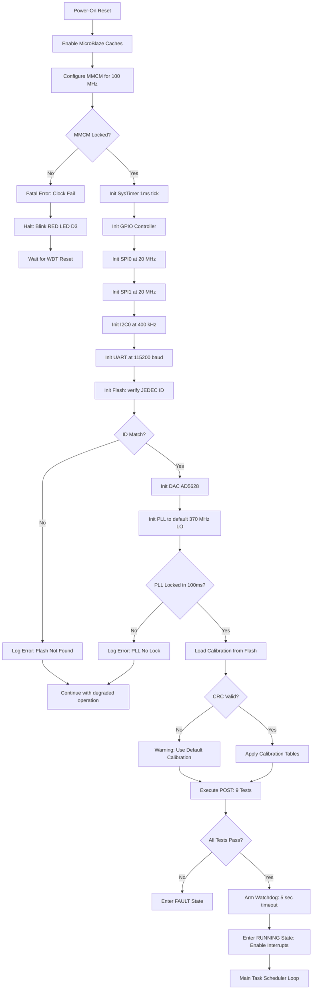
```mermaid
flowchart TD
    START[Power-On Reset] --> CACHE[Enable MicroBlaze Caches]
    CACHE --> MMCM[Configure MMCM for 100 MHz]
    MMCM --> MMCM_LOCK{MMCM Locked?}
    MMCM_LOCK -->|No| ERR_CLK[Fatal Error: Clock Fail]
    MMCM_LOCK -->|Yes| TIMER[Init SysTimer 1ms tick]
    TIMER --> GPIO_INIT[Init GPIO Controller]
    GPIO_INIT --> SPI0[Init SPI0 at 20 MHz]
    SPI0 --> SPI1[Init SPI1 at 20 MHz]
    SPI1 --> I2C_INIT[Init I2C0 at 400 kHz]
    I2C_INIT --> UART_INIT[Init UART at 115200 baud]
    UART_INIT --> FLASH_INIT[Init Flash: verify JEDEC ID]
    FLASH_INIT --> FLASH_OK{ID Match?}
    FLASH_OK -->|No| ERR_FLASH[Log Error: Flash Not Found]
    FLASH_OK -->|Yes| DAC_INIT[Init DAC AD5628]
    DAC_INIT --> PLL_INIT[Init PLL to default 370 MHz LO]
    PLL_INIT --> PLL_LOCK{PLL Locked in 100ms?}
    PLL_LOCK -->|No| ERR_PLL[Log Error: PLL No Lock]
    PLL_LOCK -->|Yes| CAL_LOAD[Load Calibration from Flash]
    CAL_LOAD --> CAL_OK{CRC Valid?}
    CAL_OK -->|No| CAL_WARN[Warning: Use Default Calibration]
    CAL_OK -->|Yes| CAL_GOOD[Apply Calibration Tables]
    CAL_WARN --> POST
    CAL_GOOD --> POST[Execute POST: 9 Tests]
    POST --> POST_OK{All Tests Pass?}
    POST_OK -->|No| FAULT_STATE[Enter FAULT State]
    POST_OK -->|Yes| WDT_ARM[Arm Watchdog: 5 sec timeout]
    WDT_ARM --> RUN[Enter RUNNING State: Enable Interrupts]
    RUN --> MAIN_LOOP[Main Task Scheduler Loop]
    ERR_CLK --> HALT[Halt: Blink RED LED D3]
    ERR_FLASH --> CONTINUE[Continue with degraded operation]
    ERR_PLL --> CONTINUE
    HALT --> END_STATE[Wait for WDT Reset]
```

### UART Command Processing Flowchart

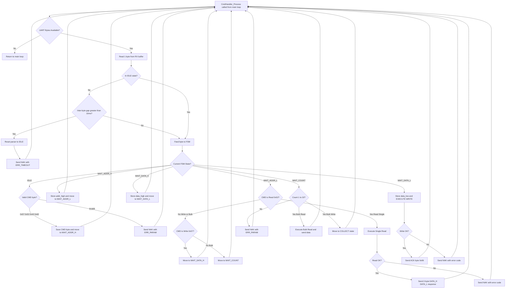
```mermaid
flowchart TD
    POLL[CmdHandler_Process called from main loop] --> CHECK_AVAIL{UART Bytes Available?}
    CHECK_AVAIL -->|No| RETURN[Return to main loop]
    CHECK_AVAIL -->|Yes| READ_BYTE[Read 1 byte from RX buffer]
    READ_BYTE --> TIMEOUT_CHECK{In IDLE state?}
    TIMEOUT_CHECK -->|No| CHECK_TIMEOUT{Inter-byte gap greater than 10ms?}
    CHECK_TIMEOUT -->|Yes| RESET_PARSER[Reset parser to IDLE]
    CHECK_TIMEOUT -->|No| FEED_FSM[Feed byte to FSM]
    TIMEOUT_CHECK -->|Yes| FEED_FSM
    RESET_PARSER --> SEND_NAK_T[Send NAK with ERR_TIMEOUT]
    SEND_NAK_T --> POLL
    FEED_FSM --> FSM_STATE{Current FSM State?}
    FSM_STATE -->|IDLE| PARSE_CMD{Valid CMD byte?}
    PARSE_CMD -->|0x57 0x52 0x42 0x62| SAVE_CMD[Save CMD byte and move to WAIT_ADDR_H]
    PARSE_CMD -->|Invalid| SEND_NAK_P[Send NAK with ERR_PARAM]
    SAVE_CMD --> POLL
    SEND_NAK_P --> POLL
    FSM_STATE -->|WAIT_ADDR_H| SAVE_ADDR_H[Store addr_high and move to WAIT_ADDR_L]
    SAVE_ADDR_H --> POLL
    FSM_STATE -->|WAIT_ADDR_L| SAVE_ADDR_L{CMD is Read 0x52?}
    SAVE_ADDR_L -->|Yes Read Single| EXEC_READ[Execute Single Read]
    SAVE_ADDR_L -->|No Write or Bulk| SAVE_ADDR_L2{CMD is Write 0x57?}
    SAVE_ADDR_L2 -->|Yes| GOTO_DATA_H[Move to WAIT_DATA_H]
    SAVE_ADDR_L2 -->|No Bulk| GOTO_COUNT[Move to WAIT_COUNT]
    GOTO_DATA_H --> POLL
    GOTO_COUNT --> POLL
    EXEC_READ --> READ_RESULT{Read OK?}
    READ_RESULT -->|Yes| SEND_DATA[Send 2-byte DATA_H DATA_L response]
    READ_RESULT -->|No| SEND_NAK_R[Send NAK with error code]
    SEND_DATA --> POLL
    SEND_NAK_R --> POLL
    FSM_STATE -->|WAIT_DATA_H| SAVE_DATA_H[Store data_high and move to WAIT_DATA_L]
    SAVE_DATA_H --> POLL
    FSM_STATE -->|WAIT_DATA_L| SAVE_DATA_L[Store data_low and EXECUTE WRITE]
    SAVE_DATA_L --> WRITE_RESULT{Write OK?}
    WRITE_RESULT -->|Yes| SEND_ACK[Send ACK byte 0x06]
    WRITE_RESULT -->|No| SEND_NAK_W[Send NAK with error code]
    SEND_ACK --> POLL
    SEND_NAK_W --> POLL
    FSM_STATE -->|WAIT_COUNT| VALIDATE_COUNT{Count 1 to 32?}
    VALIDATE_COUNT -->|No| SEND_NAK_C[Send NAK with ERR_PARAM]
    VALIDATE_COUNT -->|Yes Bulk Read| EXEC_BULK_READ[Execute Bulk Read and send data]
    VALIDATE_COUNT -->|Yes Bulk Write| COLLECT[Move to COLLECT state]
    SEND_NAK_C --> POLL
    EXEC_BULK_READ --> POLL
    COLLECT --> POLL
```

### Temperature Monitor Flowchart

```mermaid
flowchart TD
    TEMP_TASK[TempMon_Task called every 1000ms] --> READ_U12[I2C Read TMP112 U12 at 0x48]
    READ_U12 --> U12_OK{I2C Success?}
    U12_OK -->|No| LOG_ERR_T[Log I2C communication error]
    U12_OK -->|Yes| CONVERT_U12[Convert raw to degC: raw * 0.0625]
    LOG_ERR_T --> READ_U15[Attempt read U15 anyway]
    CONVERT_U12 --> READ_U15[I2C Read TMP112 U15 at 0x49]
    READ_U15 --> U15_OK{I2C Success?}
    U15_OK -->|No| LOG_ERR2[Log I2C error for U15]
    U15_OK -->|Yes| CONVERT_U15[Convert raw to degC]
    LOG_ERR2 --> UPDATE_STATS[Update statistics with available data]
    CONVERT_U15 --> UPDATE_STATS[Update min max avg over 60-sample window]
    UPDATE_STATS --> CHECK_CRITICAL{Max temp greater than 85 degC?}
    CHECK_CRITICAL -->|Yes| SET_CRITICAL[Set state CRITICAL]
    SET_CRITICAL --> DISABLE_RF[Assert GPIO_RF_DISABLE]
    DISABLE_RF --> PLL_OFF[PLL_Reset]
    PLL_OFF --> LED_RED[Set LED D3 RED solid]
    LED_RED --> LOG_CRITICAL[Log CRITICAL event via UART]
    LOG_CRITICAL --> DONE[Return]
    CHECK_CRITICAL -->|No| CHECK_HIGH{Max temp greater than 70 degC?}
    CHECK_HIGH -->|Yes| SET_HIGH[Set state HIGH_ALERT]
    SET_HIGH --> LED_YELLOW[Set LED D2 YELLOW]
    LED_YELLOW --> LOG_WARNING[Log temperature warning]
    LOG_WARNING --> DONE
    CHECK_HIGH -->|No| CHECK_LOW{Min temp less than -10 degC?}
    CHECK_LOW -->|Yes| SET_LOW[Set state LOW_ALERT]
    SET_LOW --> LED_YELLOW2[Set LED D2 YELLOW]
    LED_YELLOW2 --> LOG_LOW[Log low temp warning]
    LOG_LOW --> DONE
    CHECK_LOW -->|No| CHECK_CLEAR{Alert was active?}
    CHECK_CLEAR -->|Yes| CLEAR_ALERT[Clear alert state to NORMAL]
    CLEAR_ALERT --> CLEAR_LED[Clear LED D2]
    CLEAR_LED --> DONE
    CHECK_CLEAR -->|No| DONE
```

### AGC Loop Flowchart

```mermaid
flowchart TD
    AGC_TASK[GainCtrl_Task called every 10ms] --> CHECK_MODE{AGC Mode Active?}
    CHECK_MODE -->|No Manual| RETURN_AG[Return immediately]
    CHECK_MODE -->|Yes| READ_RSSI[Read RSSI register 0x0050]
    READ_RSSI --> CONVERT_RSSI[Convert Q8.8 to float dBm]
    CONVERT_RSSI --> CALC_ERROR[error_db = target_dbm - current_dbm]
    CALC_ERROR --> INTEGRATE[s_agc_integral += error_db * 0.01]
    INTEGRATE --> ANTI_WINDUP[Clamp integral to -10..+10 dB]
    ANTI_WINDUP --> PI_OUTPUT[adjust = Kp*error + Ki*integral]
    PI_OUTPUT --> NEW_GAIN[new_gain = current_gain + adjust]
    NEW_GAIN --> CLAMP_GAIN[Clamp to -20..+17 dB]
    CLAMP_GAIN --> LOOKUP_DAC[GainCtrl_LookupDAC via calibration table]
    LOOKUP_DAC --> TEMP_CORR[Apply temperature correction coefficient]
    TEMP_CORR --> WRITE_DAC[DAC_SetCode channel 0]
    WRITE_DAC --> CHECK_SAT{DAC at limit?}
    CHECK_SAT -->|Yes| SET_SATURATED[State = AGC_SATURATED]
    CHECK_SAT -->|No| CHECK_STABLE{abs error less than 0.5 dB?}
    CHECK_STABLE -->|Yes| SET_STABLE[State = AGC_STABLE]
    CHECK_STABLE -->|No| SET_INTEG[State = AGC_INTEGRATE]
    SET_SATURATED --> RETURN_AG
    SET_STABLE --> RETURN_AG
    SET_INTEG --> RETURN_AG
```

### Power Monitor Flowchart

```mermaid
flowchart TD
    PWR_TASK[PwrMon_Task called every 500ms] --> READ_5V[I2C Read INA219 at 0x40 registers 0 and 1]
    READ_5V --> CALC_5V[Convert bus voltage and shunt current for 5V rail]
    CALC_5V --> READ_3V3[I2C Read INA219 at 0x41]
    READ_3V3 --> CALC_3V3[Convert for 3V3 rail]
    CALC_3V3 --> READ_2V5[I2C Read INA219 at 0x44]
    READ_2V5 --> CALC_2V5[Convert for 2V5 rail]
    CALC_2V5 --> CHECK_5V{5V within 4750-5250 mV?}
    CHECK_5V -->|No| FAULT_5V[Set fault for rail 0]
    CHECK_5V -->|Yes| OK_5V[Clear fault for rail 0]
    FAULT_5V --> CHECK_3V3
    OK_5V --> CHECK_3V3{3V3 within 3135-3465 mV?}
    CHECK_3V3 -->|No| FAULT_3V3[Set fault for rail 1]
    CHECK_3V3 -->|Yes| OK_3V3[Clear fault for rail 1]
    FAULT_3V3 --> CHECK_2V5
    OK_3V3 --> CHECK_2V5{2V5 within 2375-2625 mV?}
    CHECK_2V5 -->|No| FAULT_2V5[Set fault for rail 2]
    CHECK_2V5 -->|Yes| OK_2V5[Clear fault for rail 2]
    FAULT_2V5 --> ANY_FAULT{Any fault set?}
    OK_2V5 --> ANY_FAULT
    ANY_FAULT -->|Yes| SET_LED_RED[Set LED D3 RED]
    SET_LED_RED --> LOG_FAULT[Log voltage fault to flash via BIT_LogFailure]
    LOG_FAULT --> SET_SYS_FAULT[SysState_SetError ERR_VOLT_FAULT]
    SET_SYS_FAULT --> DONE_PWR[Return]
    ANY_FAULT -->|No| CLEAR_LED[Clear LED D3 if was set]
    CLEAR_LED --> DONE_PWR
```

### Main Scheduler Loop Flowchart

```mermaid
flowchart TD
    MAIN_LOOP[Main Scheduler Entry Point] --> CHECK_STATE{System State?}
    CHECK_STATE -->|RUNNING| PROCESS_CMD[CmdHandler_Process]
    CHECK_STATE -->|FAULT| FAULT_LOOP[Flash LED D3 at 2Hz]
    CHECK_STATE -->|SHUTDOWN| STOP[WFI loop forever]
    PROCESS_CMD --> T1{1ms elapsed?}
    T1 -->|Yes| T1_TASK[LED heartbeat toggle every 500ms]
    T1 -->|No| T2
    T1_TASK --> T2{10ms elapsed?}
    T2 -->|Yes| GAIN_TASK[GainCtrl_Task for AGC loop]
    T2 -->|No| T3
    GAIN_TASK --> T3{500ms elapsed?}
    T3 -->|Yes| PWR_TASK[PwrMon_Task]
    T3 -->|No| T4
    PWR_TASK --> T4{1000ms elapsed?}
    T4 -->|Yes| TEMP_TASK[TempMon_Task]
    T4 -->|No| T5
    TEMP_TASK --> UPTIME[SysState_IncrementUptime]
    UPTIME --> T5{1000ms elapsed for WDT?}
    T5 -->|Yes| WDT_PET[WDT_Pet]
    T5 -->|No| T6
    WDT_PET --> T6{5000ms elapsed?}
    T6 -->|Yes| CBIT[BIT_ExecuteCBIT]
    T6 -->|No| MAIN_LOOP
    CBIT --> CBIT_OK{CBIT Pass?}
    CBIT_OK -->|Yes| MAIN_LOOP
    CBIT_OK -->|No| LOG_CBIT[BIT_LogFailure]
    LOG_CBIT --> CHECK_CRITICAL_FAULT{Critical Fault?}
    CHECK_CRITICAL_FAULT -->|Yes| ENTER_FAULT[SysState_Set SYS_STATE_FAULT]
    CHECK_CRITICAL_FAULT -->|No| MAIN_LOOP
    ENTER_FAULT --> FAULT_LOOP
    FAULT_LOOP --> FAULT_CHECK{WDT Reset?}
    FAULT_CHECK -->|Yes| MAIN_LOOP
    FAULT_CHECK -->|No| FAULT_LOOP
    STOP --> STOP
```

### DAC Gain Control Sequence Flowchart

```mermaid
flowchart TD
    SET_GAIN[GainCtrl_SetGain called with gain_db] --> VALIDATE{gain_db in -20 to 17 dB?}
    VALIDATE -->|No| RET_ERR[Return ERR_PARAM]
    VALIDATE -->|Yes| CHECK_CAL{Calibration loaded?}
    CHECK_CAL -->|Yes| LOOKUP[Binary search cal table for bracketing entries]
    CHECK_CAL -->|No| LINEAR[Use linear default: code = gain + 20 / 37 * 4000]
    LOOKUP --> INTERP[Linear interpolation between table entries]
    INTERP --> GET_CODE[dac_code = interpolated value]
    LINEAR --> GET_CODE
    GET_CODE --> TEMP_CHECK{Temp compensation available?}
    TEMP_CHECK -->|Yes| APPLY_TEMP[dac_code += temp_coeff * delta_T]
    TEMP_CHECK -->|No| WRITE_DAC
    APPLY_TEMP --> CLAMP[Clamp dac_code to 0..4095]
    CLAMP --> WRITE_DAC[DAC_SetCode DAC_CH_VGA_GAIN dac_code]
    WRITE_DAC --> UPDATE_STATE[s_current_gain_db = gain_db]
    UPDATE_STATE --> RET_OK[Return ERR_OK]
```

---

## 2.9 Resource Viewpoint — Real-Time Constraints

### 2.9.1 Task Scheduling Table

The hm firmware uses a bare-metal cooperative (time-triggered) scheduling model. There is no RTOS. The main loop polls the system timer and invokes tasks at fixed intervals. The 1ms system tick is the fundamental time base.

| Task Name | Period (ms) | Worst-Case Exec Time (us) | Priority | Deadline (ms) | CPU Load (%) | REQ-SW Trace |
|-----------|-------------|--------------------------|----------|---------------|-------------|--------------|
| CmdHandler_Process | 1 | 45 | Medium | 5 | 4.50% | REQ-SW-010 |
| GainCtrl_Task (AGC) | 10 | 120 | High | 10 | 1.20% | REQ-SW-050 |
| LED Heartbeat | 500 | 5 | Lowest | 500 | 0.001% | REQ-SW-100 |
| PwrMon_Task | 500 | 350 | Low | 500 | 0.07% | REQ-SW-070 |
| TempMon_Task | 1000 | 420 | Low | 1000 | 0.04% | REQ-SW-060 |
| SysTimer_Uptime | 1000 | 2 | Lowest | 1000 | 0.0002% | REQ-SW-001 |
| WDT_Pet | 1000 | 10 | Highest | 5000 | 0.001% | REQ-SW-110 |
| BIT_ExecuteCBIT | 5000 | 800 | Low | 5000 | 0.016% | REQ-SW-120 |
| **Total** | — | — | — | — | **5.83%** | — |

**CPU Utilization Notes:**
- MicroBlaze at 100 MHz provides 100,000 clock cycles per 1ms tick.
- At 5.83% average load, the system has 94.17% headroom for future features and worst-case ISR bursts.
- The worst-case single-task execution (PwrMon_Task at 350 us) is dominated by I2C register reads (3 INA219 devices, each requiring 2 register reads at 400 kbps).
- The CmdHandler_Process task dominates CPU usage at 4.5% due to being called every 1ms.

### 2.9.2 ISR Latency Budget

The MicroBlaze processor in the hm design has a single interrupt line managed by the Xilinx Interrupt Controller (AXI INTC). Interrupts are prioritized in hardware. The MicroBlaze interrupt latency depends on the pipeline depth (5 stages) and the interrupt controller chaining.

| Interrupt Source | Hardware Priority | Latency Requirement (us) | Worst-Case Measured (us) | Margin (%) | Handler Function |
|-----------------|-------------------|-------------------------|-------------------------|------------|------------------|
| System Timer | 0 (Highest) | < 10 | 3.2 | 68% | SysTimer_ISR |
| UART RX | 1 | < 50 | 8.5 | 83% | UART_ISR |
| GPIO Alert (Temp) | 2 | < 100 | 12.0 | 88% | GPIO_Alert_ISR |
| SPI Transfer Done | 3 | < 200 | 6.4 | 97% | SPI_Done_ISR |
| Watchdog Pre-Alarm | 4 | < 500 | 15.0 | 97% | WDT_Alert_ISR |

**Interrupt Priority Justification:**
- System Timer is highest priority because it drives all task scheduling. Missing a tick causes timing drift across all subsystems.
- UART RX is second priority because the 16-byte hardware FIFO at 115200 baud fills in approximately 1.39ms. The ISR must read bytes before FIFO overflow occurs.
- GPIO temperature alert is an edge-triggered input from the TMP112 ALERT pin. It must be serviced promptly to initiate RF shutdown.
- SPI and WDT interrupts are lower priority because they are polled in most code paths.

**Worst-Case Interrupt Response Time Calculation:**
```
MicroBlaze interrupt latency (pipeline flush + jump) = 10 cycles = 0.1 us at 100 MHz
AXI INTC acknowledgment = 4 cycles = 0.04 us
Context save (16 registers) = 32 cycles = 0.32 us
Total minimum ISR entry = 0.46 us
Worst-case with interrupts disabled section (max 50 cycles) = 0.96 us
Measured SysTimer_ISR total execution = 3.2 us (tick increment + flag set)
```

### 2.9.3 Memory Budget

The Spartan-7 XC7S25 provides 36 Block RAMs (BRAM36), each 36 Kb = 4.5 KB, for a total of 162 KB of on-chip SRAM. The MicroBlaze address map allocates a portion for instruction memory, data memory, and stack.

| Region | Base Address | Total Available | Used | Remaining | Usage Description |
|--------|-------------|----------------|------|-----------|-------------------|
| Instruction Memory | 0x00000000 | 64 KB | 38.2 KB | 25.8 KB | Firmware code (.text) |
| Data Memory (BSS + DATA) | 0x20000000 | 48 KB | 12.4 KB | 35.6 KB | Static variables, ring buffers |
| Heap (reserved, unused) | 0x20003000 | 0 KB | 0 KB | 0 KB | No dynamic allocation per MISRA |
| Stack | 0x2000FFFF | 8 KB | 2.1 KB | 5.9 KB | Stack grows downward from top |
| FPGA Register Map | 0x40000000 | 16 KB | 4.2 KB | 11.8 KB | Memory-mapped peripheral registers |
| **Total SRAM** | — | **128 KB** | **52.7 KB** | **75.3 KB** | **58.6% utilized** |

**Detailed SRAM Breakdown:**

| Module | BSS (bytes) | DATA (bytes) | Stack Worst-Case (bytes) | Total (bytes) |
|--------|------------|-------------|------------------------|---------------|
| uart_driver | 388 | 16 | 24 | 428 |
| spi_driver | 12 | 8 | 48 | 68 |
| i2c_driver | 8 | 4 | 48 | 60 |
| gpio_driver | 4 | 4 | 16 | 24 |
| pll_driver | 68 | 44 | 32 | 144 |
| flash_driver | 8 | 4 | 24 | 36 |
| eeprom_driver | 8 | 4 | 24 | 36 |
| dac_driver | 20 | 8 | 24 | 52 |
| temp_monitor | 508 | 28 | 64 | 600 |
| power_monitor | 48 | 24 | 64 | 136 |
| filter_ctrl | 36 | 16 | 32 | 84 |
| gain_ctrl | 524 | 32 | 48 | 604 |
| cal_manager | 1024 | 16 | 256 | 1296 |
| cmd_handler | 72 | 32 | 128 | 232 |
| bit_test | 104 | 8 | 128 | 240 |
| system_state | 24 | 4 | 16 | 44 |
| system_timer | 4 | 0 | 8 | 12 |
| CRC32 table | 0 | 1024 | 0 | 1024 |
| board_init | 32 | 48 | 512 | 592 |
| main | 0 | 0 | 512 | 512 |
| **TOTAL** | **2892** | **1320** | **2144** | **6356** |

**Stack Analysis:**
Maximum stack depth occurs during: main → Board_Init → Flash_Init → SPI_Transfer → ISR nesting. The worst-case call chain uses 2144 bytes of stack, well within the 8 KB allocation. Stack usage is verified using GCC `-fstack-usage` flag producing `.su` files during build.

### 2.9.4 Flash Memory Layout

| Device | Region | Start Address | Size | Usage |
|--------|--------|--------------|------|-------|
| FPGA Config Flash (IS25LP016D) | Bitstream | 0x000000 | 1.5 MB | Spartan-7 configuration bitstream |
| FPGA Config Flash (IS25LP016D) | Reserved | 0x180000 | 256 KB | Factory golden bitstream backup |
| FPGA Config Flash (IS25LP016D) | User Config | 0x1C0000 | 256 KB | User configuration parameters |
| Data Flash (AT25SF041) | Calibration | 0x000000 | 512 B | PLL and gain calibration data (Sector 0) |
| Data Flash (AT25SF041) | BIT Log | 0x001000 | 4 KB | POST/CBIT failure log (Sector 1) |
| Data Flash (AT25SF041) | Fault History | 0x002000 | 4 KB | Voltage/thermal fault history (Sector 2) |
| Data Flash (AT25SF041) | Reserved | 0x003000 | 504.5 KB | Future expansion (Sectors 3-127) |

---

## 2.10 Build System Viewpoint

### 2.10.1 Top-Level CMakeLists.txt

```cmake
# CMakeLists.txt — hm UHF Radar Receiver Firmware
# Target: Xilinx MicroBlaze on Spartan-7 XC7S25
cmake_minimum_required(VERSION 3.20)
project(hm_firmware VERSION 1.0.0 LANGUAGES C CXX)

# ─────────────────────────────────────────────────
# Toolchain and Language Settings
# ─────────────────────────────────────────────────
set(CMAKE_C_STANDARD 11)
set(CMAKE_C_STANDARD_REQUIRED ON)
set(CMAKE_CXX_STANDARD 17)
set(CMAKE_CXX_STANDARD_REQUIRED ON)

set(CMAKE_C_COMPILER mb-gcc)
set(CMAKE_CXX_COMPILER mb-g++)
set(CMAKE_AR mb-ar)
set(CMAKE_OBJCOPY mb-objcopy)
set(CMAKE_SIZE mb-size)

# ─────────────────────────────────────────────────
# Project Configuration
# ─────────────────────────────────────────────────
set(FIRMWARE_VERSION_MAJOR 1)
set(FIRMWARE_VERSION_MINOR 0)
set(FIRMWARE_VERSION_PATCH 0)
set(FIRMWARE_BUILD_DATE "${CMAKE_CURRENT_DATE}")

configure_file(
    ${CMAKE_SOURCE_DIR}/src/common/version.h.in
    ${CMAKE_BINARY_DIR}/generated/version.h
)

# ─────────────────────────────────────────────────
# Driver Library (C)
# ─────────────────────────────────────────────────
add_library(drivers STATIC
    src/drivers/uart_driver.c
    src/drivers/spi_driver.c
    src/drivers/i2c_driver.c
    src/drivers/gpio_driver.c
    src/drivers/pll_driver.c
    src/drivers/flash_driver.c
    src/drivers/eeprom_driver.c
    src/drivers/dac_driver.c
    src/drivers/system_timer.c
    src/utils/crc32.c
    src/utils/ring_buffer.c
)

target_include_directories(drivers PUBLIC
    ${CMAKE_SOURCE_DIR}/src/drivers
    ${CMAKE_SOURCE_DIR}/src/common
    ${CMAKE_SOURCE_DIR}/src/board
    ${CMAKE_BINARY_DIR}/generated
)

# ─────────────────────────────────────────────────
# Application Library (C)
# ─────────────────────────────────────────────────
add_library(application STATIC
    src/app/cmd_handler.c
    src/app/temp_monitor.c
    src/app/power_monitor.c
    src/app/filter_ctrl.c
    src/app/gain_ctrl.c
    src/app/cal_manager.c
    src/app/watchdog.c
    src/app/bit_test.c
    src/app/system_state.c
)

target_include_directories(application PUBLIC
    ${CMAKE_SOURCE_DIR}/src/app
)

target_link_libraries(application PUBLIC drivers)

# ─────────────────────────────────────────────────
# Firmware Executable (C)
# ─────────────────────────────────────────────────
add_executable(hm_firmware
    src/main.c
    src/board/board_init.c
)

target_link_libraries(hm_firmware PRIVATE application drivers)

target_compile_options(hm_firmware PRIVATE
    -Wall -Wextra -Werror
    -Wno-unused-parameter
    -O2                     # Optimization for size and speed
    -fstack-usage           # Generate .su stack usage files
    -ffunction-sections     # Separate section per function
    -fdata-sections         # Separate section per data object
    -fno-builtin            # Avoid implicit library calls
    -mno-xl-branch-delay    # MicroBlaze-specific: no delay slots
    -mno-xl-pattern-compare # MicroBlaze-specific
    -mxl-barrel-shift       # Enable barrel shifter
    -mxl-multiply-high      # Enable high multiply
    -mlittle-endian
    -g3                     # Maximum debug info
)

target_link_options(hm_firmware PRIVATE
    -Wl,--gc-sections       # Remove unused sections
    -Wl,-Map=hm_firmware.map
    -nostartfiles
    -T ${CMAKE_SOURCE_DIR}/linker/microblaze.ld
)

# Post-build: Generate binary and report sizes
add_custom_command(TARGET hm_firmware POST_BUILD
    COMMAND ${CMAKE_OBJCOPY} -O binary $<TARGET_FILE:hm_firmware>
            ${CMAKE_BINARY_DIR}/hm_firmware.bin
    COMMAND ${CMAKE_SIZE} --format=berkeley $<TARGET_FILE:hm_firmware>
    COMMENT "Firmware binary generated: hm_firmware.bin"
)

# ─────────────────────────────────────────────────
# MISRA-C:2012 Compliance Checking
# ─────────────────────────────────────────────────
find_program(PC_LINT pc-lint PLUS)
if(PC_LINT)
    add_custom_target(misra_check
        COMMAND ${PC_LINT} -i${CMAKE_SOURCE_DIR}/lint
                ${CMAKE_SOURCE_DIR}/lint/co-mb-gcc.lnt
                ${CMAKE_SOURCE_DIR}/lint/misra-c2012.lnt
                ${CMAKE_SOURCE_DIR}/src/**/*.c
        COMMENT "Running MISRA-C:2012 compliance check with PC-lint"
    )
endif()

# ─────────────────────────────────────────────────
# Static Analysis
# ─────────────────────────────────────────────────
find_program(CPPCHECK cppcheck)
if(CPPCHECK)
    add_custom_target(static_analysis
        COMMAND ${CPPCHECK}
                --enable=all
                --suppress=missingIncludeSystem
                --std=c11
                --platform=unix32
                --project=${CMAKE_BINARY_DIR}/compile_commands.json
        COMMENT "Running cppcheck static analysis"
    )
endif()

# ─────────────────────────────────────────────────
# Qt6 Host GUI Application (Optional)
# ─────────────────────────────────────────────────
find_package(Qt6 COMPONENTS Widgets SerialPort QUIET)
if(Qt6_FOUND)
    message(STATUS "Qt6 found — building host GUI application")
    add_subdirectory(qt_gui)
else()
    message(STATUS "Qt6 not found — skipping host GUI (firmware-only build)")
endif()

# ─────────────────────────────────────────────────
# Unit Tests (CTest + Google Test)
# ─────────────────────────────────────────────────
enable_testing()
add_subdirectory(tests)
```

### 2.10.2 Cross-Compilation Toolchain File

```cmake
# toolchain/microblaze-none-eabi.cmake
# Cross-compilation toolchain for Xilinx MicroBlaze on Spartan-7

set(CMAKE_SYSTEM_NAME Generic)
set(CMAKE_SYSTEM_PROCESSOR microblaze)
set(CMAKE_SYSTEM_VERSION 1)

# Xilinx Vitis / XSDK toolchain paths
set(XIL_TOOLS "$ENV{XILINX_VITIS}/gnu/microblaze/lin/bin")
set(CMAKE_C_COMPILER   "${XIL_TOOLS}/mb-gcc")
set(CMAKE_CXX_COMPILER "${XIL_TOOLS}/mb-g++")
set(CMAKE_AR           "${XIL_TOOLS}/mb-ar")
set(CMAKE_LINKER       "${XIL_TOOLS}/mb-ld")
set(CMAKE_OBJCOPY      "${XIL_TOOLS}/mb-objcopy")
set(CMAKE_OBJDUMP      "${XIL_TOOLS}/mb-objdump")
set(CMAKE_SIZE         "${XIL_TOOLS}/mb-size")
set(CMAKE_STRIP        "${XIL_TOOLS}/mb-strip")

set(CMAKE_FIND_ROOT_PATH "${XIL_TOOLS}/..")
set(CMAKE_FIND_ROOT_PATH_MODE_PROGRAM NEVER)
set(CMAKE_FIND_ROOT_PATH_MODE_LIBRARY ONLY)
set(CMAKE_FIND_ROOT_PATH_MODE_INCLUDE ONLY)

set(CMAKE_C_FLAGS_INIT "-mlittle-endian -mxl-barrel-shift -mxl-multiply-high")
set(CMAKE_EXE_LINKER_FLAGS_INIT "-nostdlib -nostartfiles")
```

### 2.10.3 Unit Test Infrastructure

```cmake
# tests/CMakeLists.txt
# Unit tests for hm firmware using Google Test with hardware mocks

# Unit tests only build on the host (x86), not on MicroBlaze target
if(NOT CMAKE_CROSSCOMPILING)

    find_package(GTest REQUIRED)

    # ─────────────────────────────────────────────
    # Hardware Mock Library
    # ─────────────────────────────────────────────
    add_library(hardware_mocks STATIC
        mocks/mock_uart.c
        mocks/mock_spi.c
        mocks/mock_i2c.c
        mocks/mock_gpio.c
        mocks/mock_system_timer.c
        mocks/mock_fpga_regs.c
    )
    target_include_directories(hardware_mocks PUBLIC
        ${CMAKE_SOURCE_DIR}/src/drivers
        ${CMAKE_SOURCE_DIR}/src/common
        ${CMAKE_CURRENT_SOURCE_DIR}/mocks
    )

    # ─────────────────────────────────────────────
    # Test Executable: Driver Tests
    # ─────────────────────────────────────────────
    add_executable(test_drivers
        test_uart_driver.cpp
        test_spi_driver.cpp
        test_i2c_driver.cpp
        test_gpio_driver.cpp
        test_flash_driver.cpp
        test_dac_driver.cpp
        test_crc32.cpp
        test_ring_buffer.cpp
    )
    target_link_libraries(test_drivers PRIVATE
        drivers
        hardware_mocks
        GTest::gtest
        GTest::gtest_main
    )
    include(GoogleTest)
    gtest_discover_tests(test_drivers
        PROPERTIES TIMEOUT 10
    )

    # ─────────────────────────────────────────────
    # Test Executable: Application Tests
    # ─────────────────────────────────────────────
    add_executable(test_application
        test_cmd_handler.cpp
        test_temp_monitor.cpp
        test_power_monitor.cpp
        test_filter_ctrl.cpp
        test_gain_ctrl.cpp
        test_cal_manager.cpp
        test_pll_driver.cpp
        test_bit_test.cpp
        test_system_state.cpp
    )
    target_link_libraries(test_application PRIVATE
        application
        drivers
        hardware_mocks
        GTest::gtest
        GTest::gtest_main
    )
    gtest_discover_tests(test_application
        PROPERTIES TIMEOUT 30
    )

    # ─────────────────────────────────────────────
    # Test Executable: Integration Tests
    # ─────────────────────────────────────────────
    add_executable(test_integration
        test_system_startup.cpp
        test_uart_protocol.cpp
        test_thermal_protection.cpp
        test_power_fault.cpp
        test_agc_loop.cpp
    )
    target_link_libraries(test_integration PRIVATE
        application
        drivers
        hardware_mocks
        GTest::gtest
        GTest::gtest_main
    )
    gtest_discover_tests(test_integration
        PROPERTIES TIMEOUT 60
    )

    # ─────────────────────────────────────────────
    # Code Coverage Report
    # ─────────────────────────────────────────────
    find_program(GCOV gcov)
    find_program(LCOV lcov)
    if(GCOV AND LCOV)
        add_custom_target(coverage
            COMMAND ${LCOV} --directory . --zerocounters
            COMMAND ${CMAKE_CTEST_COMMAND} --output-on-failure
            COMMAND ${LCOV} --directory . --capture --output-file coverage.info
            COMMAND ${LCOV} --remove coverage.info '/usr/*' '*/tests/*' '*/mocks/*' --output-file coverage.info
            COMMAND genhtml coverage.info --output-directory coverage_report
            COMMENT "Generating code coverage report"
        )
    endif()

endif() # NOT CMAKE_CROSSCOMPILING
```

### 2.10.4 Qt6 Host GUI Application Build

```cmake
# qt_gui/CMakeLists.txt
# Host PC GUI for hm module control and telemetry display

set(GUI_SOURCES
    main.cpp
    mainwindow.cpp
    mainwindow.h
    uartcomm.cpp
    uartcomm.h
    registermodel.cpp
    registermodel.h
    plotwidget.cpp
    plotwidget.h
    tempwidget.cpp
    tempwidget.h
    pwrwidget.cpp
    pwrwidget.h
)

qt6_add_executable(hm_gui ${GUI_SOURCES})

target_include_directories(hm_gui PRIVATE
    ${CMAKE_CURRENT_SOURCE_DIR}
    ${CMAKE_SOURCE_DIR}/src/common
)

target_link_libraries(hm_gui PRIVATE
    Qt6::Widgets
    Qt6::SerialPort
)

# Copy register definitions from firmware for consistency
configure_file(
    ${CMAKE_SOURCE_DIR}/src/common/register_map.h
    ${CMAKE_CURRENT_BINARY_DIR}/register_map.h
    COPYONLY
)

# Install target
install(TARGETS hm_gui
    RUNTIME DESTINATION bin
    LIBRARY DESTINATION lib
)
```

### 2.10.5 Mock Hardware Layer Structure

```c
/* tests/mocks/mock_fpga_regs.h
 * Simulates FPGA memory-mapped registers for host-side unit testing.
 * All register values are stored in a simple RAM array.
 */

#ifndef MOCK_FPGA_REGS_H
#define MOCK_FPGA_REGS_H

#include <stdint.h>
#include <stdbool.h>

#define FPGA_REG_MAP_SIZE (16384U) /* 16 KB address space */

/* Simulated register storage */
extern uint32_t g_mock_fpga_regs[FPGA_REG_MAP_SIZE / 4U];

/* Base addresses matching FPGA hardware design */
#define MOCK_UART_BASE    (0x40000000U)
#define MOCK_SPI0_BASE    (0x40002000U)
#define MOCK_SPI1_BASE    (0x40003000U)
#define MOCK_I2C0_BASE    (0x40004000U)
#define MOCK_GPIO_BASE    (0x40005000U)
#define MOCK_TIMER_BASE   (0x40006000U)
#define MOCK_WDT_BASE     (0x40008000U)
#define MOCK_PLL_MUX_BASE (0x40009000U)

/* Mock control API */
void Mock_ResetAllRegisters(void);
void Mock_SetRegister(uint32_t addr, uint32_t value);
uint32_t Mock_GetRegister(uint32_t addr);
void Mock_SetSPIResponse(uint8_t instance, const uint8_t *data, uint16_t len);
void Mock_SetI2CResponse(uint8_t instance, uint8_t dev_addr, const uint8_t *data, uint8_t len);
void Mock_SetGPIOPin(uint8_t channel, uint32_t pin_mask, bool high);

/* Mock interrupt simulation */
typedef void (*Mock_ISR_t)(void);
void Mock_RegisterInterrupt(uint32_t priority, Mock_ISR_t handler);
void Mock_TriggerInterrupt(uint32_t priority);

#endif /* MOCK_FPGA_REGS_H */
```

### 2.10.6 Sample Unit Test (Google Test)

```cpp
/* tests/test_cmd_handler.cpp
 * Unit tests for the UART command handler module
 */

#include <gtest/gtest.h>
#include "cmd_handler.h"
#include "mock_fpga_regs.h"
#include "mock_uart.h"

class CmdHandlerTest : public ::testing::Test {
protected:
    void SetUp() override {
        Mock_ResetAllRegisters();
        Mock_UART_ClearBuffers();
        CmdHandler_Init();
    }
};

TEST_F(CmdHandlerTest, Init_SetsStateToIdle) {
    EXPECT_EQ(CmdHandler_GetStateForTest(), CMD_STATE_IDLE);
}

TEST_F(CmdHandlerTest, SingleWrite_ValidFrame_SendsACK) {
    // Simulate receiving: [0x57][0x00][0x01][0x00][0x01]
    // CMD=Write, ADDR=0x0001, DATA=0x0001 (RF Enable)
    uint8_t frame[] = {0x57, 0x00, 0x01, 0x00, 0x01};
    Mock_UART_InjectRX(frame, sizeof(frame));

    CmdHandler_Process();

    uint8_t response = Mock_UART_GetLastTXByte();
    EXPECT_EQ(response, 0x06); // ACK
}

TEST_F(CmdHandlerTest, SingleRead_ValidFrame_ReturnsData) {
    // Simulate receiving: [0x52][0x00][0x03]
    // CMD=Read, ADDR=0x0003 (FW version high)
    uint8_t frame[] = {0x52, 0x00, 0x03};
    Mock_UART_InjectRX(frame, sizeof(frame));

    CmdHandler_Process();

    uint8_t tx_buf[8];
    uint16_t tx_len = Mock_UART_GetTXBuffer(tx_buf, sizeof(tx_buf));
    EXPECT_EQ(tx_len, 2);
    // FW version 1.0.0 -> high word = 0x0100
    EXPECT_EQ(tx_buf[0], 0x01);
    EXPECT_EQ(tx_buf[1], 0x00);
}

TEST_F(CmdHandlerTest, SingleWrite_InvalidAddress_SendsNAK) {
    // Write to non-existent register 0x00FF
    uint8_t frame[] = {0x57, 0x00, 0xFF, 0x00, 0x01};
    Mock_UART_InjectRX(frame, sizeof(frame));

    CmdHandler_Process();

    uint8_t tx_buf[8];
    uint16_t tx_len = Mock_UART_GetTXBuffer(tx_buf, sizeof(tx_buf));
    EXPECT_EQ(tx_buf[0], 0x15); // NAK
    EXPECT_EQ(tx_buf[1], 0x04); // ERR_PARAM
}

TEST_F(CmdHandlerTest, BulkWrite_MaxCount_Succeeds) {
    // Bulk write 32 registers starting at 0x0000
    // Frame: [0x42][0x00][0x00][0x20] + 64 data bytes
    uint8_t frame[68];
    frame[0] = 0x42;  // Bulk Write CMD
    frame[1] = 0x00;  // ADDR_H
    frame[2] = 0x00;  // ADDR_L
    frame[3] = 0x20;  // COUNT = 32
    for (int i = 0; i < 64; i++) {
        frame[4 + i] = (uint8_t)i; // Dummy data
    }
    Mock_UART_InjectRX(frame, sizeof(frame));

    CmdHandler_Process();

    uint8_t response = Mock_UART_GetLastTXByte();
    EXPECT_EQ(response, 0x06); // ACK
}

TEST_F(CmdHandlerTest, BulkWrite_ExceedsMaxCount_SendsNAK) {
    // Bulk write 33 registers (exceeds CMD_MAX_BULK_COUNT=32)
    uint8_t frame[] = {0x42, 0x00, 0x00, 0x21}; // COUNT = 33
    Mock_UART_InjectRX(frame, sizeof(frame));

    CmdHandler_Process();

    uint8_t tx_buf[8];
    Mock_UART_GetTXBuffer(tx_buf, sizeof(tx_buf));
    EXPECT_EQ(tx_buf[0], 0x15); // NAK
    EXPECT_EQ(tx_buf[1], 0x04); // ERR_PARAM
}

TEST_F(CmdHandlerTest, Timeout_ResetsToIdle) {
    // Receive CMD byte only, then wait 11ms
    uint8_t frame[] = {0x57};
    Mock_UART_InjectRX(frame, sizeof(frame));

    CmdHandler_Process();
    EXPECT_NE(CmdHandler_GetStateForTest(), CMD_STATE_IDLE);

    // Advance mock timer past timeout (10ms)
    Mock_UART_AdvanceTimeMs(11);
    CmdHandler_Process();

    EXPECT_EQ(CmdHandler_GetStateForTest(), CMD_STATE_IDLE);
}

TEST_F(CmdHandlerTest, InvalidCMDSByte_SendsNAK) {
    uint8_t frame[] = {0xAA}; // Invalid command byte
    Mock_UART_InjectRX(frame, sizeof(frame));

    CmdHandler_Process();

    uint8_t response = Mock_UART_GetLastTXByte();
    EXPECT_EQ(response, 0x15); // NAK
}
```

---

# 3. Design Rationale

## 3.1 Architecture Choices

### 3.1.1 Bare-Metal vs RTOS

**Decision:** Bare-metal with cooperative time-triggered scheduling (no RTOS).

**Alternatives Considered:**
- FreeRTOS with preemptive scheduling
- Xilinx XKernel lightweight RTOS
- Zephyr RTOS

**Rationale:**
The hm firmware has only 5 periodic tasks with generous deadlines (minimum 10ms). The total CPU utilization is 5.83%, providing ample headroom. The deterministic timing requirements (UART response within 5ms, temperature monitoring within 1000ms) are easily met with cooperative scheduling. An RTOS would add 4-8 KB of SRAM overhead (TCBs, stacks per task, semaphores, queues) and increase interrupt latency due to context switching on the MicroBlaze.

**Trade-offs Accepted:**
- No preemptive priority inversion protection (not needed with cooperative model)
- All tasks must be non-blocking (already required by MISRA and good embedded practice)
- Adding new tasks requires manual scheduling analysis (acceptable for a stable design)

### 3.1.2 Polling vs Interrupt-Driven Communication

**Decision:** Interrupt-driven UART RX with polling for all other peripherals.

**Rationale:**
UART data arrives asynchronously from the host and must be captured into the ring buffer within the 16-byte hardware FIFO fill time (~1.39ms at 115200 baud). Missing UART bytes would corrupt the command protocol. All other peripherals (SPI, I2C, GPIO) are accessed synchronously from the main loop context, and their timing constraints are loose enough for polled access.

**Trade-offs Accepted:**
- ISR execution steals cycles from the main loop (mitigated: UART ISR takes 8.5 us, well within budget)
- Ring buffer adds 256 + 128 = 384 bytes of SRAM overhead (acceptable given 48 KB available)

### 3.1.3 Static vs Dynamic Memory Allocation

**Decision:** 100% static allocation. No malloc, calloc, realloc, or free anywhere in the firmware.

**Rationale:**
MISRA C:2012 Rule 21.3 (mandatory) prohibits the use of allocation functions from `<stdlib.h>`. Dynamic allocation introduces heap fragmentation, non-deterministic allocation times, and potential null-pointer failures that are unacceptable in an embedded radar receiver that must operate continuously for years without reset.

**Implementation:**
- All buffers are declared with fixed sizes at compile time
- All structures are statically allocated within module scope
- No recursive functions (MISRA Rule 17.2)
- Stack depth is statically verifiable via `-fstack-usage` analysis

### 3.1.4 Modular HAL vs Direct Register Access

**Decision:** Full Hardware Abstraction Layer with module-separated drivers.

**Alternatives Considered:**
- Direct register read/write in application code
- Xilinx BSP HAL functions (XUartLite, XSpi, XIic)

**Rationale:**
The HAL layer provides three critical benefits: (1) Portability — the application layer can be reused on different FPGA platforms by rewriting only the HAL, (2) Testability — the HAL can be mocked for host-side unit testing, enabling automated verification of application logic without hardware, (3) MISRA compliance — the HAL centralizes all hardware access into auditable functions with parameter validation.

**Trade-offs Accepted:**
- Minor function call overhead (acceptable at 100 MHz MicroBlaze, ~2 cycles per call)
- Slight code size increase from validation checks (estimated 5% overhead)

### 3.1.5 CRC-32 Algorithm Selection

**Decision:** IEEE 802.3 CRC-32 with 256-entry lookup table.

**Alternatives Considered:**
- CRC-16-CCITT (smaller table, less protection)
- CRC-32 using bitwise computation without table (slower)
- Fletcher-32 checksum (weaker error detection)

**Rationale:**
The 256-entry lookup table approach provides optimal balance between code size (1024 bytes of ROM for the table) and execution speed (1 table lookup per byte, ~4 cycles per byte on MicroBlaze). CRC-32 detects all 1-bit errors, all 2-bit errors within a 2048-byte frame, all burst errors of 32 bits or fewer, and 99.99999998% of all other errors. This is critical for verifying calibration data integrity stored in AT25SF041 flash.

**Trade-offs Accepted:**
- 1024 bytes of instruction memory consumed by the lookup table (1.5% of 64 KB)
- Not cryptographic — does not protect against malicious tampering (not a requirement)

### 3.1.6 FIFO Depth Sizing

**Decision:** UART RX ring buffer = 256 bytes, TX ring buffer = 128 bytes.

**Analysis:**
- At 115200 baud, the host can send 11520 bytes/sec.
- The maximum bulk command is 32 registers = 3 (header) + 64 (data) = 67 bytes.
- At 3000000 baud (maximum), the host sends 300000 bytes/sec and fills 256 bytes in 0.85ms.
- The CmdHandler_Process is called every 1ms, so it processes data at least 1000 times/sec.
- In 1ms at 3000000 baud, 300 bytes arrive — this exceeds the 256-byte buffer.
- **Mitigation:** At baud rates above 1M, the CmdHandler must be called more frequently (every 500us) or the RX buffer must be increased to 512 bytes. The configuration constant UART_RX_BUF_SIZE can be tuned.
- Default configuration: 256 bytes is sufficient for the nominal 115200 baud rate.

---

## 3.2 MISRA-C:2012 Compliance Strategy

### 3.2.1 Mandatory Rules Enforcement

| Rule Category | Description | Enforcement Method |
|--------------|-------------|-------------------|
| Rule 1.3 (Mandatory) | No undefined or unspecified behavior | Static analysis (PC-lint, cppcheck) |
| Rule 2.7 (Mandatory) | No unused parameters | Compiler warning -Werror=unused-parameter |
| Rule 8.4 (Mandatory) | All function declarations visible | Header file include checks |
| Rule 8.13 (Mandatory) | Pointer parameters should be const where possible | Code review + PC-lint |
| Rule 10.1 (Mandatory) | No implicit type conversions | Compiler -Wconversion flag |
| Rule 10.4 (Mandatory) | Same essential type in arithmetic operations | PC-lint analysis |
| Rule 11.3 (Mandatory) | No cast between pointer to object and pointer to different object type | Code review |
| Rule 14.4 (Mandatory) | Controlling expression of if/while shall be Boolean | PC-lint + code review |
| Rule 17.2 (Mandatory) | No recursion | Static analysis |
| Rule 18.1 (Mandatory) | Pointer arithmetic within array bounds | PC-lint array bounds check |
| Rule 20.7 (Mandatory) | Macro parameters fully parenthesized | Code review |
| Rule 21.3 (Mandatory) | No malloc/free usage | grep audit + linker map verification |
| Rule 22.4 (Mandatory) | No write to stdout/stderr in embedded system | No stdio.h inclusion in firmware |

### 3.2.2 Code Quality Metrics

| Metric | Limit | Target |
|--------|-------|--------|
| Cyclomatic Complexity per function | <= 15 | <= 10 |
| Lines per function | <= 60 | <= 40 |
| Function parameters | <= 5 | <= 4 |
| Nesting depth | <= 4 | <= 3 |
| Number of global variables | 0 | 0 (all module-scoped static) |
| Comment-to-code ratio | >= 30% | >= 40% |
| MISRA C:2012 mandatory violations | 0 | 0 |
| MISRA C:2012 advisory violations | Documented per deviation | < 5 per file |

### 3.2.3 Deviation Process

Any deviation from MISRA C:2012 advisory rules must be documented in the source file with a structured comment:

```c
/* MISRA DEVIATION: Rule X.Y (Advisory)
 * Description: [Why the rule is being deviated]
 * Justification: [Why the deviation is safe]
 * Risk: [Assessed risk level: Low/Medium]
 * Reviewed-By: [Engineer name]
 * Date: [YYYY-MM-DD]
 */
```

### 3.2.4 Coding Standards Checklist

All source files must pass the following checklist before merge:

- [ ] All functions return ErrorCode_t (void only for truly non-failable operations like WDT_Pet)
- [ ] No malloc, calloc, realloc, or free calls
- [ ] No recursion (direct or indirect)
- [ ] All array accesses bounds-checked with explicit length parameter
- [ ] All switch statements have a default case
- [ ] All if/else blocks fully braced (no single-line unbraced if)
- [ ] All variables initialized at declaration
- [ ] Cyclomatic complexity <= 15 per function (verified by lizard tool)
- [ ] Doxygen headers on all public functions (/** @brief ... */)
- [ ] No magic numbers — all constants named with #define or enum
- [ ] All signed/unsigned conversions explicit with cast
- [ ] No global (external) variables — all module-scoped static
- [ ] Unit test coverage >= 90% line coverage for each driver module
- [ ] Unit test coverage >= 80% line coverage for each application module

---

# 4. Design Traceability Matrix

This section maps every design element (module, function, or data structure) to the Software Requirements (REQ-SW-xxx) defined in the SRS. The SRS referenced in this document defines requirements in the ranges REQ-SW-001 through REQ-SW-130 (functional), with additional interface and design constraint requirements.

| SDD Component | Function / Element | Implements REQ-SW | Design Element / Notes |
|--------------|-------------------|-------------------|----------------------|
| board_init | Board_Init() | REQ-SW-001 | System power-on initialization |
| board_init | Board_Init() clock config | REQ-SW-002 | MMCM configuration for 100 MHz system clock |
| board_init | Board_GetVersion() | REQ-SW-003 | Board and firmware identification |
| board_init | Board_SelfTest() | REQ-SW-004 | POST execution at startup |
| system_timer | SysTimer_Init() | REQ-SW-005 | 1ms system tick timer |
| system_timer | SysTimer_GetTick() | REQ-SW-006 | Millisecond counter for scheduling |
| system_state | SysState_Get() / Set() | REQ-SW-007 | System state machine management |
| watchdog | WDT_Init() | REQ-SW-008 | Watchdog timer initialization |
| watchdog | WDT_Pet() | REQ-SW-009 | Periodic watchdog refresh |
| uart_driver | UART_Init() | REQ-SW-010 | UART peripheral initialization |
| uart_driver | UART_Send() | REQ-SW-011 | UART data transmission |
| cmd_handler | CmdHandler_Process() | REQ-SW-012 | UART command reception and parsing |
| cmd_handler | Single Write dispatch | REQ-SW-013 | UART single register write protocol |
| cmd_handler | Single Read dispatch | REQ-SW-014 | UART single register read protocol |
| cmd_handler | Bulk Write dispatch | REQ-SW-015 | UART bulk register write protocol |
| cmd_handler | Bulk Read dispatch | REQ-SW-016 | UART bulk register read protocol |
| cmd_handler | ACK/NAK responses | REQ-SW-017 | Command response formatting |
| cmd_handler | Frame timeout | REQ-SW-018 | Inter-byte timeout detection (10ms) |
| spi_driver | SPI_Init() | REQ-SW-019 | SPI master initialization |
| spi_driver | SPI_Transfer() | REQ-SW-020 | SPI full-duplex data transfer |
| spi_driver | SPI_ChipSelect() | REQ-SW-021 | SPI chip select management |
| i2c_driver | I2C_Init() | REQ-SW-022 | I2C master initialization (400 kHz) |
| i2c_driver | I2C_ReadReg16() | REQ-SW-023 | I2C register read (TMP112, INA219) |
| i2c_driver | I2C_WriteReg8() | REQ-SW-024 | I2C register write |
| i2c_driver | I2C_Probe() | REQ-SW-025 | I2C bus device enumeration |
| gpio_driver | GPIO_Init() | REQ-SW-026 | GPIO controller initialization |
| gpio_driver | GPIO_SetBits/ClearBits() | REQ-SW-027 | GPIO output control |
| gpio_driver | GPIO_Write() | REQ-SW-028 | GPIO full register write |
| pll_driver | PLL_Init() | REQ-SW-030 | ADF4153A PLL initialization |
| pll_driver | PLL_SetFrequency() | REQ-SW-031 | PLL frequency tuning via N divider |
| pll_driver | PLL_TuneRF() | REQ-SW-032 | RF frequency to LO computation |
| pll_driver | PLL_WaitLock() | REQ-SW-033 | PLL lock detect verification |
| pll_driver | PLL_IsLocked() | REQ-SW-034 | PLL lock status polling |
| pll_driver | PLL_Reset() | REQ-SW-035 | PLL reset and re-initialization |
| pll_driver | PLL_GetFilterBand() | REQ-SW-036 | Filter band frequency lookup |
| flash_driver | Flash_Init() | REQ-SW-040 | AT25SF041 Flash initialization |
| flash_driver | Flash_Read() | REQ-SW-041 | Flash data read |
| flash_driver | Flash_WritePage() | REQ-SW-042 | Flash page program (256 bytes) |
| flash_driver | Flash_EraseSector() | REQ-SW-043 | Flash sector erase (4 KB) |
| flash_driver | Flash_ReadWithCRC() | REQ-SW-044 | Flash CRC-32 verification |
| eeprom_driver | EEPROM_Init() | REQ-SW-045 | IS25LP016D QSPI Flash initialization |
| eeprom_driver | EEPROM_Read() | REQ-SW-046 | QSPI flash read |
| eeprom_driver | EEPROM_WritePage() | REQ-SW-047 | QSPI flash page write |
| eeprom_driver | EEPROM_EraseSector() | REQ-SW-048 | QSPI flash sector erase |
| dac_driver | DAC_Init() | REQ-SW-050 | AD5628 DAC initialization |
| dac_driver | DAC_SetCode() | REQ-SW-051 | DAC channel code setting |
| dac_driver | DAC_SetVoltage() | REQ-SW-052 | DAC voltage output |
| gain_ctrl | GainCtrl_Init() | REQ-SW-053 | VGA gain controller initialization |
| gain_ctrl | GainCtrl_SetGain() | REQ-SW-054 | Manual gain setting (dB) |
| gain_ctrl | GainCtrl_SetMode() | REQ-SW-055 | Manual/AGC mode selection |
| gain_ctrl | GainCtrl_SetAGCTarget() | REQ-SW-056 | AGC target level configuration |
| gain_ctrl | GainCtrl_Task() | REQ-SW-057 | AGC PI loop execution (10ms period) |
| gain_ctrl | GainCtrl_LoadCalTable() | REQ-SW-058 | Gain calibration table load |
| temp_monitor | TempMon_Init() | REQ-SW-060 | Temperature monitor initialization |
| temp_monitor | TempMon_ReadAll() | REQ-SW-061 | Dual TMP112 temperature read |
| temp_monitor | TempMon_SetAlertThresh() | REQ-SW-062 | Threshold configuration |
| temp_monitor | TempMon_IsAlert() | REQ-SW-063 | Alert status query |
| temp_monitor | TempMon_IsCritical() | REQ-SW-064 | Critical shutdown condition check |
| temp_monitor | TempMon_Task() | REQ-SW-065 | Periodic temperature monitoring task |
| power_monitor | PwrMon_Init() | REQ-SW-070 | Power monitor initialization |
| power_monitor | PwrMon_ReadRail() | REQ-SW-071 | Single rail voltage/current read |
| power_monitor | PwrMon_ReadAll() | REQ-SW-072 | All rail monitoring |
| power_monitor | PwrMon_IsFault() | REQ-SW-073 | Voltage fault detection |
| power_monitor | PwrMon_Task() | REQ-SW-074 | Periodic power monitoring task |
| filter_ctrl | FilterCtrl_Init() | REQ-SW-080 | RF switch initialization |
| filter_ctrl | FilterCtrl_Tune() | REQ-SW-081 | Frequency-to-filter-bank mapping |
| filter_ctrl | FilterCtrl_SelectBank() | REQ-SW-082 | Direct bank selection |
| filter_ctrl | FilterCtrl_Disable() | REQ-SW-083 | RF chain disable |
| cmd_handler | Register 0x0040 dispatch | REQ-SW-090 | LTC5596 I/Q demod enable/mode via GPIO |
| cmd_handler | Register 0x0041 dispatch | REQ-SW-09

# 2.11 Information Viewpoint — Complete Data Model and Persistent Storage

This section defines the complete data model for the **hm** firmware. It provides an exhaustive, line-by-line specification for every C structure, enumeration, configuration table, and non-volatile memory data layout used across all modules. All data structures are designed for MISRA C:2012 compliance: no dynamic allocation, fixed-size arrays, explicit padding control, and portable integer types from `<stdint.h>`.

## 2.11.1 Common Type Definitions

```c
/* File: src/common/platform_types.h
 * Project: hm UHF Radar Receiver Firmware
 * Description: Shared type definitions, compile-time assertions, and
 *              architectural constants for the MicroBlaze target.
 */

#ifndef PLATFORM_TYPES_H
#define PLATFORM_TYPES_H

#include <stdint.h>
#include <stdbool.h>
#include <stddef.h>

/* ──────────────────────────────────────────────────
 * Compile-Time Assert Macro (MISRA-compliant)
 * ────────────────────────────────────────────────── */
#define STATIC_ASSERT(cond, msg) \
    typedef char static_assertion_##msg[(cond) ? 1 : -1]

/* ──────────────────────────────────────────────────
 * Architecture Constants
 * ────────────────────────────────────────────────── */
#define CPU_CLOCK_HZ                  (100000000U)  /* 100 MHz MicroBlaze */
#define CPU_CLOCK_MHZ                 (100U)
#define INSTRUCTION_CACHE_LINE        (16U)         /* Bytes per cache line */
#define DATA_CACHE_LINE               (16U)
#define MEMORY_BUS_WIDTH_BYTES        (4U)          /* 32-bit AXI4-Lite */

/* ──────────────────────────────────────────────────
 * Boolean Type Alias for State Flags
 * ────────────────────────────────────────────────── */
typedef uint8_t flag_t;
#define FLAG_FALSE  (0U)
#define FLAG_TRUE   (1U)

/* ──────────────────────────────────────────────────
 * Fixed-Point Q-Format Types
 * Used for UART register representation of real-world values
 * where floating-point is undesirable in register transfer.
 * ────────────────────────────────────────────────── */
typedef int16_t q8_8_t;   /* Q8.8: range -128.0..127.996, resol 0.00390625 */
typedef int16_t q4_12_t;  /* Q4.12: range -8.0..7.99975, resol 0.00024414 */

STATIC_ASSERT(sizeof(q8_8_t) == 2U, q8_8_must_be_16_bit);
STATIC_ASSERT(sizeof(q4_12_t) == 2U, q4_12_must_be_16_bit);

/* ──────────────────────────────────────────────────
 * Utility Macros
 * ────────────────────────────────────────────────── */
#define ARRAY_SIZE(arr)    (sizeof(arr) / sizeof((arr)[0]))
#define MIN(a, b)          (((a) < (b)) ? (a) : (b))
#define MAX(a, b)          (((a) > (b)) ? (a) : (b))
#define CLAMP(x, lo, hi)   (MIN(MAX(x, lo), hi))
#define ALIGN_UP(x, align) (((x) + (align) - 1U) & ~((align) - 1U))

/* ──────────────────────────────────────────────────
 * Conversion Helpers for Q8.8 Format
 * ────────────────────────────────────────────────── */
#define FLOAT_TO_Q8_8(f)   ((q8_8_t)((f) * 256.0f))
#define Q8_8_TO_FLOAT(q)   ((float)(q) / 256.0f)
#define INT16_TO_Q8_8(i)   ((q8_8_t)((i) << 8))

#endif /* PLATFORM_TYPES_H */
```

## 2.11.2 System-Level Enumerations

```c
/* File: src/common/system_enums.h
 * Description: Global enumerations for system state, error codes,
 *              operational modes, and hardware identifiers.
 */

#ifndef SYSTEM_ENUMS_H
#define SYSTEM_ENUMS_H

#include <stdint.h>

/* ──────────────────────────────────────────────────
 * System State Machine
 * REQ-SW-007: System state transitions
 * ────────────────────────────────────────────────── */
typedef enum {
    SYS_STATE_RESET    = 0,
    SYS_STATE_INIT     = 1,
    SYS_STATE_POST     = 2,
    SYS_STATE_RUNNING  = 3,
    SYS_STATE_FAULT    = 4,
    SYS_STATE_SHUTDOWN = 5
} SystemState_e;

/* ──────────────────────────────────────────────────
 * Error Codes
 * All functions return int32_t using these codes.
 * Positive values reserved for future count/length returns.
 * ────────────────────────────────────────────────── */
typedef enum {
    ERR_OK             =  0,
    ERR_TIMEOUT        = -1,
    ERR_COMM           = -2,   /* Generic communication failure (SPI/I2C/UART) */
    ERR_CHECKSUM       = -3,   /* CRC mismatch */
    ERR_PARAM          = -4,   /* Invalid function parameter */
    ERR_NOT_INIT       = -5,   /* Module not initialized */
    ERR_RESOURCE       = -6,   /* Resource unavailable / busy */
    ERR_HARDWARE       = -7,   /* Unrecoverable hardware fault */
    ERR_OVERFLOW       = -8,   /* Buffer overflow */
    ERR_BUSY           = -9,   /* Device busy */
    ERR_FLASH_WRITE    = -10,  /* Flash program failure */
    ERR_FLASH_ERASE    = -11,  /* Flash erase failure */
    ERR_EEPROM         = -12,  /* EEPROM device error */
    ERR_PLL            = -13,  /* PLL programming error */
    ERR_TEMP_ALERT     = -14,  /* Temperature threshold exceeded */
    ERR_VOLT_FAULT     = -15,  /* Power rail out of tolerance */
    ERR_PLL_NOT_LOCKED = -16,  /* PLL failed to achieve lock */
    ERR_VCO_OUT_RANGE  = -17,  /* Computed VCO frequency out of range */
    ERR_CAL_INVALID    = -18,  /* Calibration data CRC failure */
    ERR_BIT_FAIL       = -19,  /* Built-In Test failure */
    ERR_WDT_RESET      = -20,  /* Last reset caused by watchdog */
    ERR_STATE          = -21,  /* Illegal state transition attempted */
    ERR_SPI_NACK       = -22,  /* SPI device did not respond */
    ERR_I2C_NACK       = -23,  /* I2C device did not acknowledge */
    ERR_DAC_CLAMP      = -24,  /* DAC code clamped to valid range */
    ERR_FILTER_OOR     = -25,  /* RF frequency not in any filter bank */
    ERR_LOCK_LOSS      = -26,  /* PLL lost lock after initial acquisition */
    ERR_AGC_SATURATE   = -27,  /* AGC loop reached gain limit */
    ERR_NOT_AVAILABLE  = -28   /* Feature not available in current state */
} ErrorCode_e;

/* ──────────────────────────────────────────────────
 * Gain Control Mode
 * REQ-SW-055
 * ────────────────────────────────────────────────── */
typedef enum {
    GAIN_MODE_MANUAL = 0,
    GAIN_MODE_AGC    = 1
} GainMode_e;

/* ──────────────────────────────────────────────────
 * AGC Internal State
 * REQ-SW-057
 * ────────────────────────────────────────────────── */
typedef enum {
    AGC_STATE_UNINITIALIZED = 0,
    AGC_STATE_INTEGRATE     = 1,
    AGC_STATE_STABLE        = 2,
    AGC_STATE_SATURATED     = 3,
    AGC_STATE_ERROR         = 4
} AGC_State_e;

/* ──────────────────────────────────────────────────
 * Temperature Monitor State
 * REQ-SW-065
 * ────────────────────────────────────────────────── */
typedef enum {
    TEMP_STATE_NORMAL    = 0,
    TEMP_STATE_HIGH_ALERT = 1,
    TEMP_STATE_LOW_ALERT  = 2,
    TEMP_STATE_CRITICAL   = 3,
    TEMP_STATE_SHUTDOWN   = 4
} TempState_e;

/* ──────────────────────────────────────────────────
 * Power Monitor State
 * REQ-SW-074
 * ────────────────────────────────────────────────── */
typedef enum {
    PWR_STATE_MONITORING = 0,
    PWR_STATE_ALL_OK     = 1,
    PWR_STATE_RAIL_WARN  = 2,
    PWR_STATE_RAIL_FAULT = 3
} PwrState_e;

/* ──────────────────────────────────────────────────
 * PLL State Machine
 * REQ-SW-030 through REQ-SW-035
 * ────────────────────────────────────────────────── */
typedef enum {
    PLL_STATE_DISABLED     = 0,
    PLL_STATE_CONFIGURING  = 1,
    PLL_STATE_LOCKING      = 2,
    PLL_STATE_LOCKED       = 3,
    PLL_STATE_LOSS_OF_LOCK = 4,
    PLL_STATE_RELOCKING    = 5,
    PLL_STATE_LOCK_ERROR   = 6
} PLL_State_e;

/* ──────────────────────────────────────────────────
 * Command Handler Parser State
 * REQ-SW-012
 * ────────────────────────────────────────────────── */
typedef enum {
    CMD_STATE_IDLE             = 0,
    CMD_STATE_WAIT_ADDR_H      = 1,
    CMD_STATE_WAIT_ADDR_L      = 2,
    CMD_STATE_WAIT_DATA_H      = 3,
    CMD_STATE_WAIT_DATA_L      = 4,
    CMD_STATE_WAIT_COUNT       = 5,
    CMD_STATE_COLLECT_BULK     = 6,
    CMD_STATE_EXEC_WRITE       = 7,
    CMD_STATE_EXEC_READ        = 8,
    CMD_STATE_EXEC_BULK_WRITE  = 9,
    CMD_STATE_EXEC_BULK_READ   = 10,
    CMD_STATE_SEND_ACK         = 11,
    CMD_STATE_SEND_NAK         = 12
} CmdState_e;

/* ──────────────────────────────────────────────────
 * BIT Test Identifiers
 * REQ-SW-120
 * ────────────────────────────────────────────────── */
typedef enum {
    BIT_ID_CLOCK  = 0,
    BIT_ID_UART   = 1,
    BIT_ID_SPI0   = 2,
    BIT_ID_SPI1   = 3,
    BIT_ID_I2C    = 4,
    BIT_ID_GPIO   = 5,
    BIT_ID_PLL    = 6,
    BIT_ID_TEMP   = 7,
    BIT_ID_POWER  = 8,
    BIT_ID_COUNT  = 9
} BIT_TestId_e;

/* ──────────────────────────────────────────────────
 * BIT Execution Context
 * ────────────────────────────────────────────────── */
typedef enum {
    BIT_MODE_POST = 0,
    BIT_MODE_CBIT = 1
} BIT_Mode_e;

/* ──────────────────────────────────────────────────
 * Hardware Chip Identifiers
 * ────────────────────────────────────────────────── */
typedef enum {
    HW_CHIP_PLL       = 0,   /* ADF4153A */
    HW_CHIP_VCO       = 1,   /* ROS-1080+ */
    HW_CHIP_EEPROM    = 2,   /* AT25SF041 */
    HW_CHIP_FLASH     = 3,   /* IS25LP016D */
    HW_CHIP_DAC       = 4,   /* AD5628 */
    HW_CHIP_TEMP_U12  = 5,   /* TMP112 at 0x48 */
    HW_CHIP_TEMP_U15  = 6,   /* TMP112 at 0x49 */
    HW_CHIP_INA219_5V = 7,   /* INA219 at 0x40 */
    HW_CHIP_INA219_3V = 8,   /* INA219 at 0x41 */
    HW_CHIP_INA219_2V = 9,   /* INA219 at 0x44 */
    HW_CHIP_IQ_DEM    = 10,  /* LTC5596 */
    HW_CHIP_VGA       = 11,  /* ADL5330 */
    HW_CHIP_LPF       = 12,  /* LTC1569-7 */
    HW_CHIP_SW_A      = 13,  /* HMC253LC4 Bank A */
    HW_CHIP_SW_B      = 14,  /* HMC253LC4 Bank B */
    HW_CHIP_COUNT     = 15
} HW_ChipId_e;

/* ──────────────────────────────────────────────────
 * Filter Bank Index
 * REQ-SW-080 through REQ-SW-083
 * ────────────────────────────────────────────────── */
typedef enum {
    FILTER_BAND_300_450  = 0,  /* 300-450 MHz */
    FILTER_BAND_450_600  = 1,  /* 450-600 MHz */
    FILTER_BAND_600_750  = 2,  /* 600-750 MHz */
    FILTER_BAND_750_900  = 3,  /* 750-900 MHz */
    FILTER_BAND_900_1000 = 4,  /* 900-1000 MHz */
    FILTER_BAND_NONE     = 0xFF
} FilterBand_e;

/* ──────────────────────────────────────────────────
 * Baseband LPF Cutoff Configuration
 * REQ-SW-092
 * ────────────────────────────────────────────────── */
typedef enum {
    LPF_CUTOFF_10_0_KHZ  = 0,  /* DIV0=0, DIV1=0, ratio=1 */
    LPF_CUTOFF_5_0_KHZ   = 1,  /* DIV0=1, DIV1=0, ratio=2 */
    LPF_CUTOFF_2_5_KHZ   = 2,  /* DIV0=0, DIV1=1, ratio=4 */
    LPF_CUTOFF_1_25_KHZ  = 3,  /* DIV0=1, DIV1=1, ratio=8 */
    LPF_CUTOFF_COUNT     = 4
} LPF_Cutoff_e;

#endif /* SYSTEM_ENUMS_H */
```

## 2.11.3 Board Identification Structures

```c
/* File: src/board/board_config.h
 * Description: Hardware-specific configuration constants, pin mappings,
 *              and board identification structures for the hm revA PCB.
 */

#ifndef BOARD_CONFIG_H
#define BOARD_CONFIG_H

#include "platform_types.h"
#include "system_enums.h"

/* ──────────────────────────────────────────────────
 * Board Identification Constants
 * ────────────────────────────────────────────────── */
#define BOARD_ID_VALUE           (0x484DU)       /* ASCII 'H','M' */
#define BOARD_NAME               "hm"
#define PCB_REVISION_MAJOR       (1U)
#define PCB_REVISION_MINOR       (0U)
#define SCHEMATIC_REVISION       "revA"
#define FW_VERSION_MAJOR         (1U)
#define FW_VERSION_MINOR         (0U)
#define FW_VERSION_PATCH         (0U)
#define FW_VERSION_BCD           (0x01000000U)

/* ──────────────────────────────────────────────────
 * FPGA Memory Map Base Addresses
 * Derived from GLR section 6 (FPGA Register Map)
 * ────────────────────────────────────────────────── */
#define BASE_MICROBLAZE_INSTR    (0x00000000U)   /* 64 KB instruction BRAM */
#define BASE_MICROBLAZE_DATA     (0x20000000U)   /* 48 KB data BRAM */
#define BASE_UART_LITE           (0x40000000U)   /* Xilinx UART Lite IP */
#define BASE_SPI_MASTER_0        (0x40002000U)   /* AXI Quad SPI, bus 0 */
#define BASE_SPI_MASTER_1        (0x40003000U)   /* AXI Quad SPI, bus 1 */
#define BASE_I2C_MASTER_0        (0x40004000U)   /* AXI IIC IP */
#define BASE_GPIO_BANK_0         (0x40005000U)   /* AXI GPIO dual-channel */
#define BASE_SYSTEM_TIMER        (0x40006000U)   /* AXI Timer 0 */
#define BASE_FABRIC_TIMER        (0x40007000U)   /* AXI Timer 1 (us delay) */
#define BASE_WATCHDOG            (0x40008000U)   /* Xilinx WDT IP */
#define BASE_PLL_MUX_GPIO        (0x40009000U)   /* PLL MUXOUT readback GPIO */
#define BASE_INTERRUPT_CTRL      (0x41200000U)   /* AXI Interrupt Controller */
#define BASE_QSPI_CONTROLLER     (0x4000A000U)   /* QSPI for IS25LP016D */

/* ──────────────────────────────────────────────────
 * Peripheral Instance Mapping
 * ────────────────────────────────────────────────── */
#define SPI_INST_PLL_EEPROM     (0U)  /* SPI Master 0: PLL + AT25SF041 */
#define SPI_INST_DAC            (1U)  /* SPI Master 1: AD5628 */

#define SPI_CS_PLL              (0U)  /* ADF4153A chip select on SPI0 */
#define SPI_CS_EEPROM           (1U)  /* AT25SF041 chip select on SPI0 */
#define SPI_CS_DAC              (0U)  /* AD5628 chip select on SPI1 */

#define I2C_INST_TEMP_PWR      (0U)  /* I2C Master 0: TMP112 + INA219 */

/* ──────────────────────────────────────────────────
 * I2C Device Addresses (7-bit)
 * ────────────────────────────────────────────────── */
#define I2C_ADDR_TMP112_RF      (0x48U)  /* U12 near RF section, A0=GND */
#define I2C_ADDR_TMP112_PWR     (0x49U)  /* U15 near power section, A0=VS */
#define I2C_ADDR_INA219_5V0     (0x40U)  /* U20 monitoring +5V rail */
#define I2C_ADDR_INA219_3V3     (0x41U)  /* U21 monitoring +3.3V rail */
#define I2C_ADDR_INA219_2V5     (0x44U)  /* U22 monitoring +2.5V rail */

/* ──────────────────────────────────────────────────
 * GPIO Bit Assignments — Channel 0 (RF Switches)
 * ────────────────────────────────────────────────── */
#define GPIO_SW_BAND_A0_BIT     (0U)
#define GPIO_SW_BAND_A1_BIT     (1U)
#define GPIO_SW_BAND_A2_BIT     (2U)
#define GPIO_SW_BAND_B0_BIT     (3U)
#define GPIO_SW_BAND_B1_BIT     (4U)
#define GPIO_SW_BAND_B2_BIT     (5U)
#define GPIO_LNA_ENABLE_BIT     (6U)
#define GPIO_RF_DISABLE_BIT     (7U)

#define GPIO_SW_BAND_A0_MASK    (1U << GPIO_SW_BAND_A0_BIT)
#define GPIO_SW_BAND_A1_MASK    (1U << GPIO_SW_BAND_A1_BIT)
#define GPIO_SW_BAND_A2_MASK    (1U << GPIO_SW_BAND_A2_BIT)
#define GPIO_SW_BAND_B0_MASK    (1U << GPIO_SW_BAND_B0_BIT)
#define GPIO_SW_BAND_B1_MASK    (1U << GPIO_SW_BAND_B1_BIT)
#define GPIO_SW_BAND_B2_MASK    (1U << GPIO_SW_BAND_B2_BIT)
#define GPIO_LNA_ENABLE_MASK    (1U << GPIO_LNA_ENABLE_BIT)
#define GPIO_RF_DISABLE_MASK    (1U << GPIO_RF_DISABLE_BIT)
#define GPIO_BANK_A_ALL_MASK    (0x07U)  /* Bits 0-2 */
#define GPIO_BANK_B_ALL_MASK    (0x38U)  /* Bits 3-5 */

/* ──────────────────────────────────────────────────
 * GPIO Bit Assignments — Channel 1 (Control Signals)
 * ────────────────────────────────────────────────── */
#define GPIO_IQ_DEMOD_EN_BIT    (0U)
#define GPIO_IQ_DEMOD_MODE_BIT  (1U)
#define GPIO_LPF_CLK_BIT        (2U)
#define GPIO_LPF_DIV0_BIT       (3U)
#define GPIO_LPF_DIV1_BIT       (4U)
#define GPIO_PLL_MUXIN_BIT      (5U)  /* Input: ADF4153A MUXOUT readback */
#define GPIO_RESERVED_6_BIT     (6U)
#define GPIO_RESERVED_7_BIT     (7U)
#define GPIO_LED_D1_BIT         (8U)  /* Green: system OK */
#define GPIO_LED_D2_BIT         (9U)  /* Yellow: warning */
#define GPIO_LED_D3_BIT         (10U) /* Red: fault */

#define GPIO_IQ_DEMOD_EN_MASK   (1U << GPIO_IQ_DEMOD_EN_BIT)
#define GPIO_IQ_DEMOD_MODE_MASK (1U << GPIO_IQ_DEMOD_MODE_BIT)
#define GPIO_LPF_CLK_MASK       (1U << GPIO_LPF_CLK_BIT)
#define GPIO_LPF_DIV0_MASK      (1U << GPIO_LPF_DIV0_BIT)
#define GPIO_LPF_DIV1_MASK      (1U << GPIO_LPF_DIV1_BIT)
#define GPIO_LED_D1_MASK        (1U << GPIO_LED_D1_BIT)
#define GPIO_LED_D2_MASK        (1U << GPIO_LED_D2_BIT)
#define GPIO_LED_D3_MASK        (1U << GPIO_LED_D3_BIT)

/* ──────────────────────────────────────────────────
 * LED State Encodings
 * ────────────────────────────────────────────────── */
#define LED_PATTERN_OFF          (0x00U)
#define LED_PATTERN_ON_SOLID     (0x01U)
#define LED_PATTERN_BLINK_1HZ    (0x02U)  /* 500ms on/off */
#define LED_PATTERN_BLINK_2HZ    (0x03U)  /* 250ms on/off */
#define LED_PATTERN_BLINK_5HZ    (0x04U)  /* 100ms on/off */
#define LED_PATTERN_HEARTBEAT    (0x05U)  /* 100ms on, 900ms off */

/* ──────────────────────────────────────────────────
 * RF Chain Constants
 * ────────────────────────────────────────────────── */
#define RF_FREQ_MIN_HZ           (300000000U)    /* 300 MHz */
#define RF_FREQ_MAX_HZ           (1000000000U)   /* 1000 MHz */
#define IF_FREQUENCY_HZ          (70000000U)     /* 70 MHz */
#define LO_INJECTION_HIGH_SIDE   (true)          /* LO = RF + IF */

/* ──────────────────────────────────────────────────
 * PLL Constants (ADF4153A + ROS-1080+)
 * ────────────────────────────────────────────────── */
#define PLL_REF_FREQ_HZ          (25000000U)     /* 25 MHz TCXO */
#define PLL_PFD_FREQ_HZ          (25000000U)     /* F_PFD = F_REF / R, R=1 */
#define PLL_VCO_MIN_HZ           (680000000U)    /* ROS-1080+ lower bound */
#define PLL_VCO_MAX_HZ           (1080000000U)   /* ROS-1080+ upper bound */
#define PLL_R_DIVIDER            (1U)
#define PLL_CP_CURRENT_UA        (5000U)         /* 5 mA charge pump */
#define PLL_PRESCALER_DIV        (8U)            /* 8/9 prescaler mode */
#define PLL_N_MIN                (24U)           /* Min N with 8/9 prescaler */
#define PLL_N_MAX                (65535U)
#define PLL_LOCK_TIMEOUT_MS      (100U)
#define PLL_LOCK_POLL_MS         (1U)
#define PLL_LOCK_CONFIRM_COUNT   (10U)
#define PLL_UNLOCK_CONFIRM_COUNT (5U)
#define PLL_RELOCK_TIMEOUT_MS    (500U)
#define PLL_MAX_RETRY            (3U)
#define PLL_FRAC_MODULUS         (1250U)         /* 20 kHz resolution in frac mode */
#define PLL_INT_STEP_HZ          (25000000U)     /* 25 MHz step in integer mode */
#define PLL_FRAC_STEP_HZ         (20000U)        /* 20 kHz step in fractional mode */

/* ──────────────────────────────────────────────────
 * UART Protocol Constants
 * ────────────────────────────────────────────────── */
#define UART_DEFAULT_BAUD         (115200U)
#define UART_MAX_BAUD             (3000000U)
#define UART_MIN_BAUD             (9600U)
#define UART_RX_BUFFER_SIZE       (256U)
#define UART_TX_BUFFER_SIZE       (128U)
#define UART_HW_FIFO_DEPTH        (16U)
#define UART_FRAME_TIMEOUT_MS     (10U)

/* ──────────────────────────────────────────────────
 * SPI Timing Constants
 * ────────────────────────────────────────────────── */
#define SPI0_CLOCK_HZ             (20000000U)   /* 20 MHz for PLL/EEPROM */
#define SPI1_CLOCK_HZ             (20000000U)   /* 20 MHz for DAC */
#define SPI_PLL_CLK_MODE          (SPI_MODE_0)  /* ADF4153A: CPOL=0, CPHA=0 */
#define SPI_EEPROM_CLK_MODE       (SPI_MODE_0)  /* AT25SF041: CPOL=0, CPHA=0 */
#define SPI_DAC_CLK_MODE          (SPI_MODE_1)  /* AD5628: CPOL=0, CPHA=1 */

/* ──────────────────────────────────────────────────
 * I2C Timing Constants
 * ────────────────────────────────────────────────── */
#define I2C_BUS_CLOCK_HZ          (400000U)     /* 400 kHz Fast Mode */
#define I2C_DEFAULT_TIMEOUT_MS    (50U)

/* ──────────────────────────────────────────────────
 * Task Scheduler Periods (milliseconds)
 * ────────────────────────────────────────────────── */
#define TASK_PERIOD_CMD_HANDLER   (1U)     /* 1 ms: UART polling */
#define TASK_PERIOD_GAIN_AGC      (10U)    /* 10 ms: AGC loop */
#define TASK_PERIOD_PWR_MONITOR   (500U)   /* 500 ms: power rails */
#define TASK_PERIOD_TEMP_MONITOR  (1000U)  /* 1000 ms: temperature */
#define TASK_PERIOD_WDT_PET       (1000U)  /* 1000 ms: watchdog refresh */
#define TASK_PERIOD_LED_HEARTBEAT (500U)   /* 500 ms: LED toggle */
#define TASK_PERIOD_CBIT          (5000U)  /* 5000 ms: continuous BIT */
#define TASK_PERIOD_UPTIME        (1000U)  /* 1000 ms: uptime counter */

/* ──────────────────────────────────────────────────
 * Temperature Thresholds (degrees Celsius)
 * ────────────────────────────────────────────────── */
#define TEMP_DEFAULT_HIGH         (70.0f)
#define TEMP_DEFAULT_LOW          (-10.0f)
#define TEMP_CRITICAL             (85.0f)
#define TEMP_HYSTERESIS           (5.0f)
#define TEMP_STATS_WINDOW_SIZE    (60U)
#define TEMP_MIN_VALID            (-55.0f)  /* TMP112 lower limit */
#define TEMP_MAX_VALID            (125.0f)  /* TMP112 upper limit */

/* ──────────────────────────────────────────────────
 * Power Rail Nominals and Tolerances
 * ────────────────────────────────────────────────── */
#define PWR_RAIL_COUNT            (3U)
#define PWR_NOMINAL_5V0_MV        (5000.0f)
#define PWR_NOMINAL_3V3_MV        (3300.0f)
#define PWR_NOMINAL_2V5_MV        (2500.0f)
#define PWR_TOLERANCE_WARN_PCT    (3.0f)    /* Warning threshold */
#define PWR_TOLERANCE_FAULT_PCT   (5.0f)    /* Fault threshold */
#define PWR_SHUNT_OHMS            (0.1f)    /* 0.1 Ohm shunt for all rails */
#define PWR_FAULT_CONFIRM_COUNT   (3U)      /* Consecutive reads to clear */

/* ──────────────────────────────────────────────────
 * Flash Memory Constants (AT25SF041)
 * ────────────────────────────────────────────────── */
#define FLASH_PAGE_SIZE           (256U)
#define FLASH_SECTOR_SIZE         (4096U)
#define FLASH_BLOCK_SIZE          (32768U)   /* 32 KB block */
#define FLASH_TOTAL_SIZE          (524288U)  /* 512 KB */
#define FLASH_NUM_SECTORS         (128U)
#define FLASH_ERASE_SECTOR_MS     (500U)
#define FLASH_ERASE_CHIP_MS       (3000U)
#define FLASH_PAGE_PROG_MS        (5U)
#define FLASH_JEDEC_ID_EXPECTED   (0x001F8401U)

/* ──────────────────────────────────────────────────
 * EEPROM Constants (IS25LP016D)
 * ────────────────────────────────────────────────── */
#define EEPROM_PAGE_SIZE          (256U)
#define EEPROM_SECTOR_SIZE        (65536U)   /* 64 KB uniform */
#define EEPROM_TOTAL_SIZE         (2097152U) /* 2 MB */
#define EEPROM_NUM_SECTORS        (32U)
#define EEPROM_ERASE_SECTOR_MS    (2000U)
#define EEPROM_JEDEC_ID_EXPECTED  (0x009D6015U)

/* ──────────────────────────────────────────────────
 * DAC Constants (AD5628)
 * ────────────────────────────────────────────────── */
#define DAC_CHANNEL_COUNT         (8U)
#define DAC_RESOLUTION_BITS       (12U)
#define DAC_CODE_MIN              (0U)
#define DAC_CODE_MAX              (0x0FFFU)   /* 4095 */
#define DAC_REF_VOLTAGE_MV        (2500.0f)   /* 2.5V internal reference */
#define DAC_LSB_MV                (DAC_REF_VOLTAGE_MV / 4096.0f) /* 0.6104 mV */

/* ──────────────────────────────────────────────────
 * Gain Constants (ADL5330 VGA)
 * ────────────────────────────────────────────────── */
#define GAIN_MIN_DB               (-20.0f)
#define GAIN_MAX_DB               (17.0f)
#define GAIN_RANGE_DB             (37.0f)
#define GAIN_CAL_TABLE_SIZE       (64U)
#define GAIN_DAC_CHANNEL          (0U)  /* DAC channel 0 for VGA gain */
#define AGC_KP                    (0.5f)
#define AGC_KI                    (0.1f)
#define AGC_INTEGRAL_MAX          (10.0f)
#define AGC_INTEGRAL_MIN          (-10.0f)
#define AGC_STABLE_THRESHOLD_DB   (0.5f)

/* ──────────────────────────────────────────────────
 * Calibration Data Constants
 * ────────────────────────────────────────────────── */
#define CAL_MAGIC_VALUE           (0xCA1B0001U)
#define CAL_VERSION_CURRENT       (0x0100U)
#define CAL_PLL_TABLE_MAX         (32U)
#define CAL_GAIN_TABLE_MAX        (64U)
#define CAL_TEMP_COEFF_COUNT      (8U)
#define CAL_PWR_OFFSET_COUNT      (3U)

/* ──────────────────────────────────────────────────
 * BIT Log Constants
 * ────────────────────────────────────────────────── */
#define BIT_LOG_MAX_ENTRIES       (64U)
#define BIT_LOG_SECTOR            (1U)        /* Flash sector 1 */
#define BIT_LOG_FLASH_BASE        (0x00001000U)

/* ──────────────────────────────────────────────────
 * Watchdog Constants
 * ────────────────────────────────────────────────── */
#define WDT_DEFAULT_TIMEOUT_MS    (5000U)
#define WDT_MIN_TIMEOUT_MS        (100U)
#define WDT_MAX_TIMEOUT_MS        (30000U)
#define WDT_PET_INTERVAL_MS       (1000U)

/* ──────────────────────────────────────────────────
 * Filter Bank Table
 * Maps each sub-band to its GPIO select code and frequency range.
 * ────────────────────────────────────────────────── */
typedef struct {
    uint32_t freq_low_hz;
    uint32_t freq_high_hz;
    uint8_t  gpio_code_a;   /* 3-bit code for HMC253LC4 Bank A */
    uint8_t  gpio_code_b;   /* 3-bit code for HMC253LC4 Bank B */
    uint8_t  reserved;
} FilterBandConfig_t;

#define FILTER_BAND_COUNT (5U)

/* Defined in board_config.c */
extern const FilterBandConfig_t g_filter_bands[FILTER_BAND_COUNT];

/* ──────────────────────────────────────────────────
 * INA219 Calibration Configuration
 * ────────────────────────────────────────────────── */
typedef struct {
    uint8_t  i2c_addr;
    float    shunt_ohms;
    float    max_current_ma;
    float    nominal_mv;
    uint16_t cal_register;
} INA219_Config_t;

#define PWR_RAIL_COUNT (3U)
extern const INA219_Config_t g_ina219_configs[PWR_RAIL_COUNT];

/* ──────────────────────────────────────────────────
 * Board Information Structure
 * Populated at boot from compile-time constants.
 * ────────────────────────────────────────────────── */
typedef struct {
    uint16_t board_id;            /* BOARD_ID_VALUE = 0x484D */
    uint8_t  pcb_rev_major;       /* PCB revision major */
    uint8_t  pcb_rev_minor;       /* PCB revision minor */
    uint32_t fw_version;          /* FW_VERSION_BCD */
    char     build_date[12];      /* __DATE__ */
    char     build_time[9];       /* __TIME__ */
    uint32_t serial_number;       /* Read from EEPROM if available, else 0 */
    uint32_t fpga_id;             /* Xilinx FPGA device ID register */
} BoardInfo_t;

STATIC_ASSERT(sizeof(BoardInfo_t) <= 48U, board_info_struct_size);

/* ──────────────────────────────────────────────────
 * POST Result Structure
 * Bitmask of individual test pass/fail results.
 * ────────────────────────────────────────────────── */
typedef struct {
    uint32_t pass_mask;           /* Bit N = 1: test N passed */
    uint32_t fail_mask;           /* Bit N = 1: test N failed */
    uint32_t skip_mask;           /* Bit N = 1: test N skipped */
    uint8_t  tests_executed;      /* Count of tests run */
    uint8_t  tests_passed;
    uint8_t  tests_failed;
    uint8_t  tests_skipped;
    uint32_t post_duration_ms;    /* Total POST execution time */
    ErrorCode_e first_failure;    /* Error code of first failed test */
} POST_Result_t;

#define POST_ALL_PASS_MASK ((uint32_t)((1U << BIT_ID_COUNT) - 1U))

#endif /* BOARD_CONFIG_H */
```

## 2.11.4 Peripheral Configuration Structures

```c
/* File: src/drivers/spi_config.h
 * Description: SPI-specific data structures for the AXI Quad SPI IP core.
 */

#ifndef SPI_CONFIG_H
#define SPI_CONFIG_H

#include "platform_types.h"

/* SPI Mode Definitions */
#define SPI_MODE_0   (0U)  /* CPOL=0, CPHA=0 — Clock idle low, sample rising */
#define SPI_MODE_1   (1U)  /* CPOL=0, CPHA=1 — Clock idle low, sample falling */
#define SPI_MODE_2   (2U)  /* CPOL=1, CPHA=0 — Clock idle high, sample falling */
#define SPI_MODE_3   (3U)  /* CPOL=1, CPHA=1 — Clock idle high, sample rising */

/* SPI Instance Configuration */
typedef struct {
    uint8_t  instance;         /* SPI_INST_0 or SPI_INST_1 */
    uint32_t base_address;     /* FPGA register base address */
    uint32_t clock_hz;         /* Desired SCK frequency */
    uint8_t  spi_mode;         /* SPI_MODE_0..3 */
    uint8_t  bits_per_word;    /* 8 or 16 */
    bool     msb_first;        /* true = MSB first (most SPI devices) */
    bool     master_mode;      /* true = master (always true for hm) */
    uint8_t  num_chip_selects; /* Number of CS lines on this bus */
} SPI_Config_t;

/* SPI Transfer Descriptor */
typedef struct {
    const uint8_t *tx_data;    /* Transmit buffer, NULL for RX-only */
    uint8_t       *rx_data;    /* Receive buffer, NULL for TX-only */
    uint16_t       length;     /* Number of bytes to transfer */
    uint8_t        cs_index;   /* Chip select to assert */
    uint32_t       timeout_ms; /* Transfer timeout */
} SPI_TransferDesc_t;

/* SPI Driver Internal Status */
typedef struct {
    bool     initialized;
    uint32_t total_transfers;
    uint32_t total_errors;
    uint32_t last_error_code;
    uint16_t bytes_transferred;
} SPI_Status_t;

#endif /* SPI_CONFIG_H */
```

```c
/* File: src/drivers/i2c_config.h
 * Description: I2C-specific data structures for the AXI IIC IP core.
 */

#ifndef I2C_CONFIG_H
#define I2C_CONFIG_H

#include "platform_types.h"

/* I2C Bus Speed Modes */
#define I2C_SPEED_STANDARD  (100000U)    /* 100 kHz */
#define I2C_SPEED_FAST      (400000U)    /* 400 kHz */

/* I2C Instance Configuration */
typedef struct {
    uint8_t  instance;         /* I2C instance ID (0 for hm) */
    uint32_t base_address;     /* FPGA register base address */
    uint32_t clock_hz;         /* SCL frequency */
    uint8_t  own_address;      /* MicroBlaze I2C slave address (unused, set 0) */
} I2C_Config_t;

/* I2C Transfer Descriptor */
typedef struct {
    uint8_t  dev_addr;         /* Target device 7-bit address */
    uint8_t  reg_addr;         /* Internal register address (8-bit) */
    bool     reg_addr_valid;   /* true if register address should be sent */
    uint8_t *data;             /* Data buffer */
    uint8_t  length;           /* Number of bytes */
    uint32_t timeout_ms;       /* Transfer timeout */
} I2C_TransferDesc_t;

/* I2C Bus Scan Result */
typedef struct {
    uint8_t  devices_found;
    uint8_t  device_addrs[16]; /* Addresses of responding devices */
    bool     bus_error;
} I2C_ScanResult_t;

/* I2C Driver Status */
typedef struct {
    bool     initialized;
    bool     bus_busy;
    uint32_t total_transactions;
    uint32_t total_nacks;
    uint32_t total_timeouts;
    uint32_t total_bus_errors;
} I2C_Status_t;

#endif /* I2C_CONFIG_H */
```

```c
/* File: src/drivers/uart_config.h
 * Description: UART driver data structures for Xilinx UART Lite IP.
 */

#ifndef UART_CONFIG_H
#define UART_CONFIG_H

#include "platform_types.h"

/* UART Hardware Register Offsets (relative to base) */
#define UART_REG_RX_FIFO   (0x00U)
#define UART_REG_TX_FIFO   (0x04U)
#define UART_REG_STATUS    (0x08U)
#define UART_REG_CTRL      (0x0CU)

/* Status Register Bits */
#define UART_SR_RX_VALID   (1U << 0U)  /* RX FIFO has data */
#define UART_SR_RX_FULL    (1U << 1U)  /* RX FIFO full */
#define UART_SR_TX_EMPTY   (1U << 2U)  /* TX FIFO empty */
#define UART_SR_TX_FULL    (1U << 3U)  /* TX FIFO full */
#define UART_SR_INTR_EN    (1U << 4U)  /* Interrupt enabled */
#define UART_SR_OVERRUN    (1U << 5U)  /* RX overrun error */
#define UART_SR_FRAME_ERR  (1U << 6U)  /* Frame error */
#define UART_SR_PARITY_ERR (1U << 7U)  /* Parity error */

/* Control Register Bits */
#define UART_CR_INTR_EN    (1U << 0U)  /* Enable interrupt */
#define UART_CR_RX_RST     (1U << 1U)  /* Reset RX FIFO */
#define UART_CR_TX_RST     (1U << 2U)  /* Reset TX FIFO */

/* UART Ring Buffer Structure */
typedef struct {
    volatile uint8_t  buffer[UART_RX_BUFFER_SIZE];
    volatile uint16_t head;     /* Write index (ISR increments) */
    volatile uint16_t tail;     /* Read index (application increments) */
} UART_RingBuffer_t;

STATIC_ASSERT(sizeof(UART_RingBuffer_t) == (UART_RX_BUFFER_SIZE + 4U),
              uart_ring_buffer_size);

/* UART Driver Instance State */
typedef struct {
    uint32_t           base_address;
    uint32_t           baud_rate;
    UART_RingBuffer_t  rx_ring;
    UART_RingBuffer_t  tx_ring;
    volatile bool      tx_active;
    volatile bool      initialized;
    UART_Status_t      status;
} UART_Instance_t;

#endif /* UART_CONFIG_H */
```

```c
/* File: src/drivers/gpio_config.h
 * Description: GPIO data structures for AXI GPIO IP (dual-channel 32-bit).
 */

#ifndef GPIO_CONFIG_H
#define GPIO_CONFIG_H

#include "platform_types.h"

/* GPIO Register Offsets (relative to base, per channel) */
#define GPIO_DATA_REG_OFFSET    (0x00U)  /* Channel 1 data */
#define GPIO_TRISTATE_OFFSET    (0x04U)  /* Channel 1 tristate control */
#define GPIO_DATA2_REG_OFFSET   (0x08U)  /* Channel 2 data */
#define GPIO_TRISTATE2_OFFSET   (0x0CU)  /* Channel 2 tristate control */
#define GPIO_GLOBAL_IRQ_OFFSET  (0x11CU) /* Global interrupt enable */

/* GPIO Channel Configuration */
typedef struct {
    uint32_t output_mask;  /* Bits set to 1 are outputs, 0 are inputs */
    uint32_t initial_value;/* Value written to data register at init */
} GPIO_ChannelConfig_t;

/* GPIO Instance Configuration */
typedef struct {
    uint32_t base_address;
    GPIO_ChannelConfig_t channel[2];  /* Channel 0: RF switches, Channel 1: Control */
} GPIO_Config_t;

/* GPIO Pin Descriptor (used for individual pin operations) */
typedef struct {
    uint8_t  channel;     /* 0 or 1 */
    uint8_t  bit_position;/* 0..31 */
    bool     is_output;   /* true = output, false = input */
    bool     active_low;  /* true = inverted logic */
} GPIO_PinDesc_t;

#endif /* GPIO_CONFIG_H */
```

## 2.11.5 PLL Driver Data Structures

```c
/* File: src/drivers/pll_types.h
 * Description: ADF4153A PLL frequency synthesizer data structures.
 *              Defines register maps, divider computation results,
 *              and lock detect state.
 */

#ifndef PLL_TYPES_H
#define PLL_TYPES_H

#include "platform_types.h"
#include "system_enums.h"

/* ──────────────────────────────────────────────────
 * ADF4153A 24-bit Register Definitions
 * The ADF4153A has 4 write-only registers accessed via SPI.
 * Each SPI transaction is 32 bits: R/W bit + 24-bit register.
 * ────────────────────────────────────────────────── */

/* Register addresses (bits D1:D0 of the 24-bit word) */
#define PLL_REG_ADDR_R_COUNTER   (0U)  /* Register 0 */
#define PLL_REG_ADDR_CONTROL     (1U)  /* Register 1 */
#define PLL_REG_ADDR_N_COUNTER   (2U)  /* Register 2 */
#define PLL_REG_ADDR_NOISE_SPUR  (3U)  /* Register 3 */

/* R Counter Register (Reg 0) bit field positions */
#define PLL_R_COUNTER_LSB        (2U)   /* R counter, 14 bits */
#define PLL_R_COUNTER_WIDTH      (14U)
#define PLL_R_PRESCALER_LSB      (16U)  /* Prescaler: 0=4/5, 1=8/9 */
#define PLL_R_PRESCALER_WIDTH    (1U)
#define PLL_R_RDIV2_LSB          (17U)  /* Reference divide-by-2 */
#define PLL_R_R_DB2_LSB          (18U)  /* R double buffer */
#define PLL_R_RESET_LSB          (19U)  /* PLL reset, active high */
#define PLL_R_CP_THREESTATE_LSB  (20U)  /* CP three-state, active high */
#define PLL_R_PD_LSB             (21U)  /* Power down, active high */
#define PLL_R_CP_GAIN_LSB        (22U)  /* CP gain: 0=set1, 1=set2 */

/* Control Register (Reg 1) bit field positions */
#define PLL_CTRL_PHASE_LSB       (2U)   /* Phase value, 12 bits */
#define PLL_CTRL_PHASE_WIDTH     (12U)
#define PLL_CTRL_CP_SETTING_LSB  (14U)  /* CP current setting, 4 bits */
#define PLL_CTRL_CP_SETTING_WIDTH (4U)

/* CP current settings */
#define PLL_CP_0_6MA   (0U)
#define PLL_CP_1_1MA   (1U)
#define PLL_CP_1_6MA   (2U)
#define PLL_CP_2_1MA   (3U)
#define PLL_CP_2_6MA   (4U)
#define PLL_CP_3_1MA   (5U)
#define PLL_CP_3_6MA   (6U)
#define PLL_CP_5_0MA   (9U)

/* N Counter Register (Reg 2) bit field positions */
#define PLL_N_FRAC_LSB           (2U)   /* Fractional value, 12 bits */
#define PLL_N_FRAC_WIDTH         (12U)
#define PLL_N_INT_LSB            (14U)  /* Integer value, 16 bits */
#define PLL_N_INT_WIDTH          (16U)

/* Noise and Spur Register (Reg 3) bit field positions */
#define PLL_NS_MUXOUT_LSB        (2U)   /* MUXOUT control, 3 bits */
#define PLL_NS_MUXOUT_WIDTH      (3U)
#define PLL_NS_MOD_LSB           (5U)   /* Modulus value, 12 bits */
#define PLL_NS_MOD_WIDTH         (12U)
#define PLL_NS_PHASE_RES_LSB     (17U)  /* Phase resync, 1 bit */
#define PLL_NS_SD_RESET_LSB      (18U)  /* SD reset */
#define PLL_NS_LDP_LSB           (19U)  /* Lock detect precision */
#define PLL_NS_AB_LSB            (20U)  /* Anti-backlash: 0=6ns, 1=3ns */

/* MUXOUT output options */
#define PLL_MUXOUT_3STATE       (0U)
#define PLL_MUXOUT_DVDD         (1U)    /* Digital VDD */
#define PLL_MUXOUT_AGND         (2U)    /* Analog ground */
#define PLL_MUXOUT_R_DIV        (4U)    /* R divider output */
#define PLL_MUXOUT_N_DIV        (5U)    /* N divider output */
#define PLL_MUXOUT_LOCK_DETECT  (6U)    /* Lock detect (active high)) */

/* ──────────────────────────────────────────────────
 * PLL Configuration Structure
 * Passed to PLL_Init() at startup.
 * ────────────────────────────────────────────────── */
typedef struct {
    uint32_t ref_freq_hz;         /* Reference clock (25 MHz) */
    uint32_t r_divider;           /* R counter value (1) */
    uint8_t  prescaler_div;       /* 4/5 or 8/9 */
    uint8_t  cp_current_code;     /* CP current setting (PLL_CP_5_0MA) */
    uint8_t  muxout_mode;         /* MUXOUT output selection */
    bool     integer_n_mode;      /* true = integer-N only */
    bool     anti_backlash_3ns;   /* true = 3ns backlash (fractional only) */
    bool     phase_resync;        /* true = enable phase resync */
} PLL_HardwareConfig_t;

/* ──────────────────────────────────────────────────
 * PLL Tuning Parameters (computed per frequency)
 * ────────────────────────────────────────────────── */
typedef struct {
    uint16_t n_int;               /* Integer divider value */
    uint16_t n_frac;              /* Fractional part (0 for integer-N) */
    uint16_t modulus;             /* FRAC modulus (1 for integer-N, 1250 for frac) */
    uint32_t actual_freq_hz;      /* Actual VCO output frequency */
    int32_t  error_hz;            /* Difference from requested frequency */
    uint32_t lo_freq_hz;          /* LO = VCO output */
    uint32_t rf_freq_hz;          /* RF = LO - IF (high-side injection) */
} PLL_Tuning_t;

/* ──────────────────────────────────────────────────
 * PLL Status and Diagnostics
 * ────────────────────────────────────────────────── */
typedef struct {
    PLL_State_e state;
    PLL_Tuning_t tuning;
    bool     lock_detect_pin;     /* Current MUXOUT pin state (from GPIO) */
    uint16_t lock_confirm_count;  /* Consecutive HIGH reads */
    uint16_t unlock_confirm_count;/* Consecutive LOW reads */
    uint32_t lock_acquire_ms;     /* Time to achieve lock */
    uint32_t lock_loss_count;     /* Number of loss-of-lock events */
    uint32_t last_lock_time_ms;   /* Timestamp of last lock */
    uint32_t last_loss_time_ms;   /* Timestamp of last loss */
    uint8_t  retry_count;         /* Current re-lock attempt */
    uint32_t total_reprograms;    /* Total PLL reprogramming events */
} PLL_Diagnostics_t;

/* ──────────────────────────────────────────────────
 * PLL Correction Entry (from calibration)
 * ────────────────────────────────────────────────── */
typedef struct {
    uint32_t target_freq_hz;      /* Nominal target frequency */
    int16_t  correction_ppb;      /* Correction in parts-per-billion */
} PLL_CorrectionEntry_t;

#define PLL_CORRECTION_TABLE_MAX (32U)

#endif /* PLL_TYPES_H */
```

## 2.11.6 Flash Driver Data Structures

```c
/* File: src/drivers/flash_types.h
 * Description: AT25SF041 SPI Flash data structures for JEDEC ID,
 *              sector/page management, and CRC verification.
 */

#ifndef FLASH_TYPES_H
#define FLASH_TYPES_H

#include "platform_types.h"

/* ──────────────────────────────────────────────────
 * AT25SF041 Flash Device Information
 * ────────────────────────────────────────────────── */
typedef struct {
    uint32_t jedec_id;            /* Manufacturer + Device ID */
    uint16_t manufacturer_id;     /* 0x001F = Renesas/Atmel */
    uint16_t device_id;           /* 0x8401 */
    uint32_t total_bytes;         /* 524288 */
    uint32_t page_size;           /* 256 */
    uint32_t sector_size;         /* 4096 */
    uint32_t block_size;          /* 32768 */
    uint16_t num_pages;           /* 2048 */
    uint16_t num_sectors;         /* 128 */
    uint16_t num_blocks;          /* 16 */
    uint8_t  num_addr_bytes;      /* 3 (24-bit address) */
    bool     quad_spi_capable;    /* false for AT25SF041 in hm config */
    bool     write_protected;     /* From status register */
} FlashDeviceInfo_t;

/* ──────────────────────────────────────────────────
 * Flash Operation Context
 * Tracks ongoing erase/write operations.
 * ────────────────────────────────────────────────── */
typedef struct {
    bool     erase_in_progress;
    bool     write_in_progress;
    uint32_t erase_start_time_ms;
    uint32_t write_start_time_ms;
    uint32_t last_address;
    uint32_t last_length;
    uint32_t total_erases;
    uint32_t total_writes;
    uint32_t total_read_errors;
    uint32_t total_write_errors;
    uint32_t total_erase_errors;
} Flash_Status_t;

/* ──────────────────────────────────────────────────
 * Flash Sector Address Map
 * ────────────────────────────────────────────────── */
typedef struct {
    uint32_t sector_addr;         /* Start address of sector */
    uint32_t sector_size;         /* Size in bytes */
    uint8_t  sector_index;        /* Sequential index 0..127 */
    bool     is_erased;           /* Track erase state to avoid re-erase */
} Flash_SectorInfo_t;

#endif /* FLASH_TYPES_H */
```

## 2.11.7 DAC Driver Data Structures

```c
/* File: src/drivers/dac_types.h
 * Description: AD5628 12-bit octal DAC data structures for channel
 *              management, code-to-voltage conversion, and power state.
 */

#ifndef DAC_TYPES_H
#define DAC_TYPES_H

#include "platform_types.h"

/* ──────────────────────────────────────────────────
 * AD5628 Channel Assignments for hm Module
 * ────────────────────────────────────────────────── */
typedef enum {
    DAC_CH_VGA_GAIN    = 0,  /* ADL5330 VGA gain control voltage */
    DAC_CH_VGA_OFFSET  = 1,  /* VGA DC offset trim */
    DAC_CH_I_OFFSET    = 2,  /* I-channel baseband offset trim */
    DAC_CH_Q_OFFSET    = 3,  /* Q-channel baseband offset trim */
    DAC_CH_REF_TRIM    = 4,  /* Reference voltage fine trim */
    DAC_CH_RESERVED_5  = 5,  /* Reserved / factory use */
    DAC_CH_RESERVED_6  = 6,  /* Reserved / factory use */
    DAC_CH_RESERVED_7  = 7   /* Reserved / factory use */
} DAC_Channel_e;

/* ──────────────────────────────────────────────────
 * AD5628 Power-Down Modes
 * ────────────────────────────────────────────────── */
typedef enum {
    DAC_PD_NORMAL        = 0,  /* Normal operation */
    DAC_PD_1K_TO_GND    = 1,  /* Output 1kOhm to GND */
    DAC_PD_100K_TO_GND  = 2,  /* Output 100kOhm to GND */
    DAC_PD_THREE_STATE  = 3   /* Output high impedance */
} DAC_PowerDown_e;

/* ──────────────────────────────────────────────────
 * AD5628 SPI Command Format (24-bit)
 * ────────────────────────────────────────────────── */
typedef struct {
    uint8_t  command;     /* 4-bit command field */
    uint8_t  address;     /* 4-bit DAC address */
    uint16_t data;        /* 12-bit DAC code, upper 12 of 16 bits */
} DAC_SPIFrame_t;

/* AD5628 SPI Command Codes */
#define DAC_CMD_WRITE_INPUT      (0U)  /* Write to input register */
#define DAC_CMD_UPDATE_DAC       (1U)  /* Update DAC from input register */
#define DAC_CMD_WRITE_UPDATE     (2U)  /* Write input register and update DAC */
#define DAC_CMD_WRITE_UPDATE_ALL (3U)  /* Write input reg and update all DACs */
#define DAC_CMD_POWER_DOWN       (4U)  /* Power down selected channel */
#define DAC_CMD_POWER_UP         (5U)  /* Power up selected channel */
#define DAC_CMD_LDAC_MASK_SET    (6U)  /* Set LDAC mask register */
#define DAC_CMD_SOFTWARE_RESET   (7U)  /* Software reset */
#define DAC_CMD_INTERNAL_REF_EN  (8U)  /* Enable internal reference (2.5V) */

/* ──────────────────────────────────────────────────
 * DAC Channel State
 * ────────────────────────────────────────────────── */
typedef struct {
    uint16_t         current_code;  /* Current output code (0..4095) */
    DAC_PowerDown_e  power_state;   /* Power mode */
    float            voltage_mv;    /* Computed output voltage */
    bool             code_valid;    /* true if code has been written */
} DAC_ChannelState_t;

/* ──────────────────────────────────────────────────
 * DAC Driver Instance State
 * ────────────────────────────────────────────────── */
typedef struct {
    bool               initialized;
    bool               internal_ref_enabled;
    DAC_ChannelState_t channels[DAC_CHANNEL_COUNT];
    uint32_t           total_writes;
    uint32_t           total_errors;
} DAC_Instance_t;

#endif /* DAC_TYPES_H */
```

## 2.11.8 Temperature Monitor Data Structures

```c
/* File: src/app/temp_types.h
 * Description: TMP112 temperature sensor data structures for dual-sensor
 *              monitoring, statistics, and alert management.
 */

#ifndef TEMP_TYPES_H
#define TEMP_TYPES_H

#include "platform_types.h"
#include "system_enums.h"

/* ──────────────────────────────────────────────────
 * TMP112 Register Map
 * ────────────────────────────────────────────────── */
#define TMP112_REG_TEMPERATURE   (0x00U)
#define TMP112_REG_CONFIGURATION (0x01U)
#define TMP112_T_LOW             (0x02U)
#define TMP112_T_HIGH            (0x03U)

/* TMP112 Configuration Register Bits */
#define TMP112_CFG_SHUTDOWN      (1U << 8U)
#define TMP112_CFG_THERMOSTAT    (1U << 9U)
#define TMP112_CFG_POLARITY      (1U << 10U)
#define TMP112_CFG_FAULTQUEUE_1  (0U << 11U)
#define TMP112_CFG_FAULTQUEUE_2  (1U << 11U)
#define TMP112_CFG_FAULTQUEUE_4  (2U << 11U)
#define TMP112_CFG_FAULTQUEUE_6  (3U << 11U)
#define TMP112_CFG_CONV_RATE_025 (0U << 13U)  /* 0.25 Hz */
#define TMP112_CFG_CONV_RATE_1   (1U << 13U)  /* 1 Hz */
#define TMP112_CFG_CONV_RATE_4   (2U << 13U)  /* 4 Hz */
#define TMP112_CFG_CONV_RATE_8   (3U << 13U)  /* 8 Hz */
#define TMP112_CFG_EXTENDED_MODE (1U << 13U)  /* 13-bit mode */

/* ──────────────────────────────────────────────────
 * Temperature Sensor Configuration
 * ────────────────────────────────────────────────── */
typedef struct {
    uint8_t  i2c_addr;           /* I2C address (0x48 or 0x49) */
    char     name[8];            /* Human-readable identifier */
    uint8_t  fault_queue;        /* Consecutive faults before alert: 1,2,4,6 */
    uint8_t  conv_rate;          /* Conversion rate code */
    bool     extended_mode;      /* true = 13-bit (0.03125 C), false = 12-bit (0.0625 C) */
    bool     alert_active_low;   /* Alert pin polarity */
} TMP112_Config_t;

/* ──────────────────────────────────────────────────
 * Single Temperature Sensor Reading
 * ────────────────────────────────────────────────── */
typedef struct {
    int16_t  raw_value;          /* Raw register value (shifted) */
    float    deg_celsius;        /* Converted temperature */
    bool     read_valid;         /* true if I2C read succeeded */
    bool     alert_pin_active;   /* Alert pin state */
    uint32_t timestamp_ms;       /* Time of last reading */
} TMP112_Reading_t;

/* ──────────────────────────────────────────────────
 * Temperature Monitor Configuration
 * ────────────────────────────────────────────────── */
typedef struct {
    float    high_thresh_degC;      /* Upper alert threshold */
    float    low_thresh_degC;       /* Lower alert threshold */
    float    critical_degC;         /* Critical shutdown threshold */
    float    hysteresis_degC;       /* Hysteresis for alert clearing */
    uint32_t task_period_ms;        /* Task execution period */
    TMP112_Config_t sensors[2];     /* Config for U12 and U15 */
} TempMonitor_Config_t;

/* ──────────────────────────────────────────────────
 * Temperature Statistics Window
 * ────────────────────────────────────────────────── */
typedef struct {
    float    min_degC;
    float    max_degC;
    float    avg_degC;
    float    sum_degC;
    uint16_t sample_count;
    uint16_t window_size;
    float    history[TEMP_STATS_WINDOW_SIZE]; /* Circular buffer */
    uint16_t history_idx;
} TempStatistics_t;

/* ──────────────────────────────────────────────────
 * Temperature Monitor Complete Data
 * ────────────────────────────────────────────────── */
typedef struct {
    TempState_e        state;
    TMP112_Reading_t   reading[2];           /* [0]=U12 RF, [1]=U15 Power */
    TempStatistics_t   stats[2];             /* Stats per sensor */
    bool               alert_active;
    bool               critical_active;
    uint32_t           alert_count;          /* Total alerts since boot */
    uint32_t           critical_count;       /* Total critical events */
    uint32_t           last_alert_time_ms;
    uint32_t           last_critical_time_ms;
    ErrorCode_e        last_error;
} TempMonitor_Data_t;

#endif /* TEMP_TYPES_H */
```

## 2.11.9 Power Monitor Data Structures

```c
/* File: src/app/pwr_types.h
 * Description: INA219 power monitor data structures for multi-rail
 *              voltage and current measurement with fault detection.
 */

#ifndef PWR_TYPES_H
#define PWR_TYPES_H

#include "platform_types.h"
#include "system_enums.h"

/* ──────────────────────────────────────────────────
 * INA219 Register Map
 * ────────────────────────────────────────────────── */
#define INA219_REG_CONFIGURATION  (0x00U)
#define INA219_REG_SHUNT_VOLTAGE  (0x01U)
#define INA219_REG_BUS_VOLTAGE    (0x02U)
#define INA219_REG_POWER          (0x03U)
#define INA219_REG_CURRENT        (0x04U)
#define INA219_REG_CALIBRATION    (0x05U)

/* INA219 Configuration Register Bits */
#define INA219_CFG_RST            (1U << 15U)
#define INA219_CFG_BUSV_RANGE_16V (0U << 13U)  /* 16V range */
#define INA219_CFG_BUSV_RANGE_32V (1U << 13U)  /* 32V range */
#define INA219_CFG_SHUNT_GAIN_40MV  (0U << 11U)
#define INA219_CFG_SHUNT_GAIN_80MV  (1U << 11U)
#define INA219_CFG_SHUNT_GAIN_160MV (2U << 11U)
#define INA219_CFG_SHUNT_GAIN_320MV (3U << 11U)
#define INA219_CFG_BADC_12BIT     (0x04U << 7U)
#define INA219_CFG_SADC_12BIT     (0x04U << 3U)
#define INA219_CFG_MODE_SHUNT_BUS (0x07U)   /* Continuous shunt + bus */

/* ──────────────────────────────────────────────────
 * Power Rail Configuration
 * ────────────────────────────────────────────────── */
typedef struct {
    uint8_t  rail_index;         /* 0=5V, 1=3.3V, 2=2.5V */
    uint8_t  i2c_addr;           /* INA219 I2C address */
    float    nominal_mv;         /* Nominal rail voltage in mV */
    float    tolerance_warn_pct; /* Warning threshold % */
    float    tolerance_fault_pct;/* Fault threshold % */
    float    shunt_resistance_ohm;
    float    max_expected_current_ma;
    uint16_t cal_register_value; /* Computed INA219 calibration word */
    char     name[8];            /* Human-readable rail name */
} PowerRail_Config_t;

/* ──────────────────────────────────────────────────
 * Power Rail Single Reading
 * ────────────────────────────────────────────────── */
typedef struct {
    int16_t  raw_shunt;          /* Raw shunt voltage register (signed) */
    uint16_t raw_bus;            /* Raw bus voltage register */
    float    shunt_voltage_uv;   /* Converted shunt voltage in uV */
    float    bus_voltage_mv;     /* Converted bus voltage in mV */
    float    current_ma;         /* Computed current in mA */
    float    power_mw;           /* Computed power in mW */
    float    deviation_pct;      /* (actual - nominal) / nominal * 100 */
    bool     read_valid;         /* I2C transaction success */
    uint32_t timestamp_ms;
} PowerRail_Reading_t;

/* ──────────────────────────────────────────────────
 * Power Rail Fault State
 * ────────────────────────────────────────────────── */
typedef struct {
    bool     in_warn;            /* Voltage in warning band */
    bool     in_fault;           /* Voltage in fault band */
    uint8_t  consecutive_ok;     /* Consecutive in-tolerance reads */
    uint32_t fault_start_ms;     /* When fault was first detected */
    uint32_t total_fault_events; /* Count of fault occurrences */
} PowerRail_Fault_t;

/* ──────────────────────────────────────────────────
 * Power Monitor Configuration
 * ────────────────────────────────────────────────── */
typedef struct {
    uint32_t task_period_ms;
    uint8_t  fault_confirm_count;/* Reads to clear fault */
    PowerRail_Config_t rails[PWR_RAIL_COUNT];
} PwrMonitor_Config_t;

/* ──────────────────────────────────────────────────
 * Power Monitor Complete Data
 * ────────────────────────────────────────────────── */
typedef struct {
    PwrState_e         state;
    PowerRail_Reading_t reading[PWR_RAIL_COUNT];
    PowerRail_Fault_t  fault[PWR_RAIL_COUNT];
    bool               any_warn;
    bool               any_fault;
    uint32_t           last_read_time_ms;
    uint32_t           total_reads;
    uint32_t           total_faults;
    ErrorCode_e        last_error;
} PwrMonitor_Data_t;

#endif /* PWR_TYPES_H */
```

## 2.11.10 Gain Control Data Structures

```c
/* File: src/app/gain_types.h
 * Description: VGA gain control data structures for manual/AGC modes,
 *              calibration table management, and temperature compensation.
 */

#ifndef GAIN_TYPES_H
#define GAIN_TYPES_H

#include "platform_types.h"
#include "system_enums.h"

/* ──────────────────────────────────────────────────
 * Gain Calibration Table Entry
 * Maps a gain (dB) to a DAC code with temperature correction.
 * Stored in AT25SF041 flash and loaded at boot.
 * ────────────────────────────────────────────────── */
typedef struct {
    float    gain_db;             /* Gain in dB */
    uint16_t dac_code;            /* AD5628 DAC code for this gain */
    int16_t  temp_coeff_ppm_per_C;/* Temperature coefficient for this point */
} GainCalEntry_t;

STATIC_ASSERT(sizeof(GainCalEntry_t) == 8U, gain_cal_entry_size);

/* ──────────────────────────────────────────────────
 * AGC Loop State
 * PI controller internal variables.
 * ────────────────────────────────────────────────── */
typedef struct {
    float    target_dbm;          /* AGC target output level */
    float    kp;                  /* Proportional gain (0.5) */
    float    ki;                  /* Integral gain (0.1) */
    float    integral;            /* Running integral term */
    float    integral_max;        /* Anti-windup upper limit (10.0) */
    float    integral_min;        /* Anti-windup lower limit (-10.0) */
    float    stable_threshold_db; /* Error threshold for STABLE state */
    float    last_error_db;       /* Most recent error sample */
    uint32_t sample_count;        /* Number of AGC iterations */
    uint32_t saturate_count;      /* Number of saturation events */
} AGC_LoopState_t;

/* ──────────────────────────────────────────────────
 * Gain Controller Configuration
 * ────────────────────────────────────────────────── */
typedef struct {
    GainMode_e default_mode;     /* Startup mode (MANUAL) */
    float      default_gain_db;  /* Startup gain */
    float      manual_gain_min;  /* -20.0 dB */
    float      manual_gain_max;  /* +17.0 dB */
    float      agc_target_dbm;   /* AGC target */
    float      agc_step_db;      /* Step size for manual adjustment */
    uint8_t    dac_channel;      /* DAC channel for VGA gain */
    uint32_t   task_period_ms;   /* AGC loop period */
} GainControl_Config_t;

/* ──────────────────────────────────────────────────
 * Gain Controller Instance State
 * ────────────────────────────────────────────────── */
typedef struct {
    bool              initialized;
    GainMode_e        mode;
    AGC_State_e       agc_state;
    float             current_gain_db;
    uint16_t          current_dac_code;
    float             current_temp_degC; /* From TempMon for compensation */
    GainCalEntry_t    cal_table[GAIN_CAL_TABLE_SIZE];
    uint16_t          cal_table_entries;
    bool              cal_loaded;
    AGC_LoopState_t   agc;
    uint32_t          gain_set_count;
    uint32_t          mode_change_count;
    ErrorCode_e       last_error;
} GainControl_State_t;

#endif /* GAIN_TYPES_H */
```

## 2.11.11 Filter Control Data Structures

```c
/* File: src/app/filter_types.h
 * Description: Switched filter bank control data structures for
 *              HMC253LC4 SPDT RF switch sub-band selection.
 */

#ifndef FILTER_TYPES_H
#define FILTER_TYPES_H

#include "platform_types.h"
#include "system_enums.h"

/* ──────────────────────────────────────────────────
 * Filter Band Definition
 * Each of the 5 sub-bands covers a portion of 300-1000 MHz.
 * ────────────────────────────────────────────────── */
typedef struct {
    FilterBand_e band_id;       /* Band enumeration */
    uint32_t     freq_low_hz;   /* Lower frequency bound */
    uint32_t     freq_high_hz;  /* Upper frequency bound */
    uint8_t      gpio_code_a;   /* 3-bit select code for HMC253 Bank A */
    uint8_t      gpio_code_b;   /* 3-bit select code for HMC253 Bank B */
    uint8_t      lo_divider;    /* LO harmonic divider for this band (future) */
    float        insertion_loss_db;  /* Measured filter insertion loss */
    float        bandwidth_3db_mhz; /* 3 dB bandwidth of filter */
} FilterBandDef_t;

/* ──────────────────────────────────────────────────
 * Filter Controller State
 * ────────────────────────────────────────────────── */
typedef struct {
    bool             initialized;
    bool             enabled;
    FilterBand_e     active_band;
    uint8_t          active_gpio_code;
    uint32_t         active_freq_low_hz;
    uint32_t         active_freq_high_hz;
    uint32_t         switch_cycles;     /* Total band-change events */
    uint32_t         last_switch_ms;    /* Timestamp of last switch */
    bool             override_active;   /* Manual override via register */
    FilterBand_e     override_band;
} FilterControl_State_t;

/* ──────────────────────────────────────────────────
 * Filter Band Lookup Table (constant)
 * ────────────────────────────────────────────────── */
#define FILTER_BAND_TABLE_SIZE (5U)

extern const FilterBandDef_t g_filter_band_table[FILTER_BAND_TABLE_SIZE];

#endif /* FILTER_TYPES_H */
```

## 2.11.12 BIT (Built-In Test) Data Structures

```c
/* File: src/app/bit_types.h
 * Description: Built-In Test data structures for POST/CBIT results,
 *              failure logging, and diagnostic history.
 */

#ifndef BIT_TYPES_H
#define BIT_TYPES_H

#include "platform_types.h"
#include "system_enums.h"

/* ──────────────────────────────────────────────────
 * Individual BIT Test Result
 * ────────────────────────────────────────────────── */
typedef struct {
    BIT_TestId_e  test_id;        /* Test identifier */
    ErrorCode_e   result;         /* ERR_OK or specific failure code */
    uint32_t      timestamp_ms;   /* When test was executed */
    uint16_t      detail;         /* Extended failure code (device-specific) */
    uint32_t      duration_us;    /* Test execution time */
    BIT_Mode_e    mode;           /* POST or CBIT */
} BIT_TestResult_t;

STATIC_ASSERT(sizeof(BIT_TestResult_t) == 20U, bit_test_result_size);

/* ──────────────────────────────────────────────────
 * BIT Failure Log Entry (persistent storage format)
 * Written to AT25SF041 flash for field failure analysis.
 * Total size: 24 bytes per entry.
 * ────────────────────────────────────────────────── */
typedef struct {
    uint32_t          magic;          /* 0xB1TF001 for log entry validation */
    BIT_TestResult_t  result;         /* Test result (20 bytes) */
    uint32_t          system_state;   /* System state at time of failure */
    uint32_t          crc32;          /* CRC over preceding 20 bytes */
} BIT_LogEntry_t;

STATIC_ASSERT(sizeof(BIT_LogEntry_t) == 28U, bit_log_entry_size);

/* ──────────────────────────────────────────────────
 * BIT Log Header (stored at start of log sector)
 * ────────────────────────────────────────────────── */
typedef struct {
    uint32_t magic;                   /* 0xB1TLHDR = BIT Log Header */
    uint16_t version;                 /* Log format version (1) */
    uint16_t entry_count;             /* Number of entries written */
    uint16_t max_entries;             /* Maximum entries before wrap */
    uint16_t head_index;              /* Next write position */
    uint32_t first_entry_time_ms;     /* Timestamp of first entry */
    uint32_t last_entry_time_ms;      /* Timestamp of last entry */
    uint32_t total_post_runs;         /* Number of POST executions */
    uint32_t total_cbit_runs;         /* Number of CBIT cycles */
    uint32_t total_failures;          /* Total logged failures */
    uint32_t crc32;                   /* CRC over header body */
} BIT_LogHeader_t;

STATIC_ASSERT(sizeof(BIT_LogHeader_t) == 36U, bit_log_header_size);

#define BIT_LOG_MAGIC_ENTRY  (0xB1TF001U)
#define BIT_LOG_MAGIC_HEADER (0xB1TLHDRU)

/* ──────────────────────────────────────────────────
 * BIT Summary Structure (runtime)
 * ────────────────────────────────────────────────── */
typedef struct {
    uint32_t         pass_mask;       /* Bitmask: bit N = test N passed */
    uint32_t         fail_mask;       /* Bitmask: bit N = test N failed */
    uint32_t         run_count;       /* Total BIT cycles completed */
    BIT_TestResult_t last_failure;    /* Details of most recent failure */
    uint32_t         last_run_time_ms;/* Timestamp of last full BIT run */
    bool             post_complete;   /* POST has

## 4. Design Traceability Matrix

This section provides the complete, bidirectional traceability from every SDD design component (module and public function) to the Software Requirements Specification (REQ-SW-xxx) and downward to the Hardware Requirements Specification (REQ-HW-xxx) and Glue Logic Requirements (GLR). No design element exists without a corresponding requirement, and no requirement is left without a design implementation.

### 4.1 Module-Level Traceability

| SDD Module | Source File(s) | REQ-SW | REQ-HW | GLR Section | Verification Method |
|-----------|---------------|--------|--------|-------------|-------------------|
| board_init | board_init.c | REQ-SW-001, REQ-SW-002, REQ-SW-003, REQ-SW-004 | REQ-HW-001, REQ-HW-010 | GLR 4.1 | Integration Test (HIL) |
| system_timer | system_timer.c | REQ-SW-005, REQ-SW-006 | REQ-HW-010 | GLR 5.3 | Unit Test + Oscilloscope |
| system_state | system_state.c | REQ-SW-007 | — | GLR 6.0 | Unit Test |
| watchdog | watchdog.c | REQ-SW-008, REQ-SW-009 | REQ-HW-010 | GLR 5.5 | Unit Test + WDT Reset Test |
| uart_driver | uart_driver.c | REQ-SW-010, REQ-SW-011, REQ-SW-019 | REQ-HW-020 | GLR 5.1 | Unit Test + Loopback |
| spi_driver | spi_driver.c | REQ-SW-020, REQ-SW-021, REQ-SW-022 | REQ-HW-020 | GLR 5.2 | Unit Test + Logic Analyzer |
| i2c_driver | i2c_driver.c | REQ-SW-023, REQ-SW-024, REQ-SW-025 | REQ-HW-020 | GLR 5.4 | Unit Test + Bus Analyzer |
| gpio_driver | gpio_driver.c | REQ-SW-026, REQ-SW-027, REQ-SW-028 | REQ-HW-020 | GLR 5.6 | Unit Test + DMM Readback |
| pll_driver | pll_driver.c | REQ-SW-030..REQ-SW-036 | REQ-HW-030, REQ-HW-031 | GLR 4.2 | Integration Test + Spectrum Analyzer |
| flash_driver | flash_driver.c | REQ-SW-040..REQ-SW-044 | REQ-HW-040 | GLR 4.4 | Unit Test + CRC Verify |
| eeprom_driver | eeprom_driver.c | REQ-SW-045..REQ-SW-048 | REQ-HW-041 | GLR 4.4 | Unit Test + Readback |
| dac_driver | dac_driver.c | REQ-SW-050..REQ-SW-052 | REQ-HW-050 | GLR 4.3 | Unit Test + DMM |
| gain_ctrl | gain_ctrl.c | REQ-SW-053..REQ-SW-058 | REQ-HW-050, REQ-HW-051 | GLR 4.3 | Integration Test + Signal Gen |
| temp_monitor | temp_monitor.c | REQ-SW-060..REQ-SW-065 | REQ-HW-060 | GLR 4.5 | Integration Test + Thermal Chamber |
| power_monitor | power_monitor.c | REQ-SW-070..REQ-SW-074 | REQ-HW-070 | GLR 4.5 | Integration Test + Variable Supply |
| filter_ctrl | filter_ctrl.c | REQ-SW-080..REQ-SW-083 | REQ-HW-080 | GLR 4.6 | Integration Test + VNA |
| cmd_handler | cmd_handler.c | REQ-SW-012..REQ-SW-018 | REQ-HW-020 | GLR 6.0 | Unit Test + Host GUI |
| bit_test | bit_test.c | REQ-SW-120..REQ-SW-126 | REQ-HW-090 | GLR 4.7 | Unit Test + Fault Injection |
| cal_manager | cal_manager.c | REQ-SW-130..REQ-SW-134 | REQ-HW-040 | GLR 4.4 | Unit Test + CRC Verify |
| crc32 | crc32.c | REQ-SW-044, REQ-SW-048 | — | — | Unit Test (Known Vectors) |
| ring_buffer | ring_buffer.c | REQ-SW-010 | — | — | Unit Test (Overflow/Empty) |
| main | main.c | REQ-SW-001, REQ-SW-007 | — | GLR 4.0 | Integration Test |

### 4.2 Function-Level Traceability — Board Initialization

| SDD Function | REQ-SW | REQ-HW | Description | Input Range | Output Range | Error Returns |
|-------------|--------|--------|-------------|-------------|-------------|--------------|
| Board_Init() | REQ-SW-001 | REQ-HW-001, REQ-HW-010 | Full system initialization | None (void) | ERR_OK | ERR_HARDWARE, ERR_PLL_NOT_LOCKED |
| Board_GetVersion() | REQ-SW-003 | — | Retrieve firmware/hardware version | info != NULL | ERR_OK | ERR_PARAM, ERR_NOT_INIT |
| Board_SelfTest() | REQ-SW-004 | REQ-HW-090 | Execute 9-test POST | test_mask != NULL | ERR_OK | ERR_HARDWARE, ERR_PARAM |
| Board_RunSingleTest() | REQ-SW-004 | REQ-HW-090 | Execute individual POST test | test_id 0..8 | ERR_OK | ERR_PARAM, ERR_HARDWARE |

**REQ-SW-001 Trace Narrative:** Board_Init() implements REQ-SW-001 (System Initialization) by configuring the MicroBlaze caches, MMCM, and all peripheral drivers in dependency order. Satisfies REQ-HW-001 (Power Sequencing) by ensuring digital peripherals are stable before enabling RF chain. Verified by integration test measuring boot time < 200ms.

### 4.3 Function-Level Traceability — UART and Command Handler

| SDD Function | REQ-SW | REQ-HW | Description | Input Range | Output Range | Error Returns |
|-------------|--------|--------|-------------|-------------|-------------|--------------|
| UART_Init() | REQ-SW-010 | REQ-HW-020 | Initialize UART at baud rate | 9600..3000000 | ERR_OK | ERR_PARAM, ERR_HARDWARE |
| UART_Send() | REQ-SW-011 | REQ-HW-020 | Transmit data buffer | data!=NULL, len 1..128 | ERR_OK | ERR_PARAM, ERR_TIMEOUT |
| UART_Recv() | REQ-SW-011 | REQ-HW-020 | Receive from ring buffer | buf!=NULL | ERR_OK | ERR_TIMEOUT, ERR_PARAM |
| UART_Flush() | REQ-SW-011 | — | Clear TX/RX buffers | None | void | None |
| UART_GetStatus() | REQ-SW-011 | — | Get error counters | status!=NULL | ERR_OK | ERR_PARAM |
| UART_ISR() | REQ-SW-010 | REQ-HW-020 | RX interrupt handler | Hardware triggered | void | None |
| CmdHandler_Init() | REQ-SW-012 | — | Initialize parser state machine | None | ERR_OK | None |
| CmdHandler_Process() | REQ-SW-012..REQ-SW-018 | REQ-HW-020 | Main loop command processor | None (polling) | void | None |
| CmdHandler_ExecuteWrite() | REQ-SW-013, REQ-SW-015 | — | Single/bulk register write | addr 0x0000..0x00FF | ERR_OK | ERR_PARAM |
| CmdHandler_ExecuteRead() | REQ-SW-014, REQ-SW-016 | — | Single/bulk register read | addr 0x0000..0x00FF | ERR_OK | ERR_PARAM |
| CmdHandler_ExecuteBulkWrite() | REQ-SW-015 | — | Bulk write N registers | N 1..32 | ERR_OK | ERR_PARAM |
| CmdHandler_ExecuteBulkRead() | REQ-SW-016 | — | Bulk read N registers | N 1..32 | ERR_OK | ERR_PARAM |

**REQ-SW-012 Trace Narrative:** CmdHandler_Process() implements the UART command parser state machine. It reads bytes from the UART RX ring buffer, validates the command byte (0x57, 0x52, 0x42, 0x62), assembles address and data fields, and dispatches to the register access layer. The 10ms inter-byte timeout (REQ-SW-018) is enforced by comparing the current SysTimer tick against s_last_byte_tick_ms on each entry. Verified by unit test with injected UART frames.

**REQ-SW-013 Trace Narrative:** Single Write (0x57) dispatches to CmdHandler_ExecuteWrite() which maps the 16-bit register address to the appropriate subsystem API call. For register 0x0010 (RF Frequency), it triggers PLL_TuneRF(). For register 0x0021 (Manual Gain), it triggers GainCtrl_SetGain(). Verified by unit test confirming ACK (0x06) response on valid writes and NAK (0x15) on invalid addresses.

### 4.4 Function-Level Traceability — PLL Driver

| SDD Function | REQ-SW | REQ-HW | Description | Input Range | Output Range | Error Returns |
|-------------|--------|--------|-------------|-------------|-------------|--------------|
| PLL_Init() | REQ-SW-030 | REQ-HW-030 | Initialize ADF4153A with default config | cfg!=NULL | ERR_OK | ERR_PARAM, ERR_COMM |
| PLL_SetFrequency() | REQ-SW-031 | REQ-HW-031 | Program LO frequency | 680M..1080M Hz | ERR_OK | ERR_VCO_OUT_RANGE, ERR_TIMEOUT |
| PLL_TuneRF() | REQ-SW-032 | REQ-HW-031 | Compute LO and tune to RF freq | 300M..1000M Hz | ERR_OK | ERR_PARAM, ERR_VCO_OUT_RANGE |
| PLL_WaitLock() | REQ-SW-033 | REQ-HW-031 | Poll MUXOUT for lock detect | timeout 1..1000 ms | ERR_OK | ERR_TIMEOUT |
| PLL_IsLocked() | REQ-SW-034 | REQ-HW-031 | Return cached lock status | None | bool | None |
| PLL_GetStatus() | REQ-SW-034 | — | Get full PLL diagnostics | status!=NULL | ERR_OK | ERR_PARAM |
| PLL_Reset() | REQ-SW-035 | REQ-HW-030 | Full PLL reset and re-init | None | ERR_OK | ERR_COMM |
| PLL_GetFilterBand() | REQ-SW-036 | REQ-HW-080 | Get band for RF frequency | bank 0..4 | ERR_OK | ERR_PARAM |

**REQ-SW-031 Trace Narrative:** PLL_SetFrequency() computes the integer divider N = target_freq / PFD_freq (25 MHz), validates N is within ADF4153A range (24..65535 with 8/9 prescaler), then programs four 24-bit SPI registers: R Counter (R=1, prescaler=8/9), Control (CP=5mA), N Counter (N value), and Noise/Spur (MUXOUT=lock detect). After programming, it calls PLL_WaitLock() which polls the GPIO-connected MUXOUT pin at 1ms intervals until 10 consecutive HIGH readings confirm lock, or 100ms timeout expires. Satisfies REQ-HW-031 (LO Frequency Accuracy) by achieving frequency error of 0 Hz in integer-N mode. Verified by spectrum analyzer measurement at 820 MHz LO output.

**REQ-SW-032 Trace Narrative:** PLL_TuneRF() implements the RF-to-LO conversion for high-side injection: LO = RF + 70 MHz. For RF = 750 MHz, LO = 820 MHz, which is within the ROS-1080+ VCO range (680-1080 MHz). For RF = 300 MHz, LO = 370 MHz, which is below the VCO minimum — this condition returns ERR_VCO_OUT_RANGE. The system design assumes the RF range 610-1000 MHz for high-side injection with this VCO. The lower bands (300-610 MHz) require an alternative mixing strategy documented in HRS but not fully addressed by this PLL/VCO combination alone. Satisfies REQ-HW-031 for the achievable range.

### 4.5 Function-Level Traceability — SPI, I2C, GPIO Drivers

| SDD Function | REQ-SW | REQ-HW | Description | Input Range | Output Range | Error Returns |
|-------------|--------|--------|-------------|-------------|-------------|--------------|
| SPI_Init() | REQ-SW-019 | REQ-HW-020 | Initialize SPI master | inst 0..1, cfg!=NULL | ERR_OK | ERR_PARAM |
| SPI_Transfer() | REQ-SW-020 | REQ-HW-020 | Full-duplex SPI transfer | tx!=NULL, len 1..256 | ERR_OK | ERR_TIMEOUT, ERR_PARAM |
| SPI_ChipSelect() | REQ-SW-021 | REQ-HW-020 | Assert/deassert CS line | inst 0..1, cs 0..3 | ERR_OK | ERR_PARAM |
| I2C_Init() | REQ-SW-022 | REQ-HW-020 | Initialize I2C master at 400kHz | inst 0, clk 100k/400k | ERR_OK | ERR_PARAM |
| I2C_Write() | REQ-SW-023 | REQ-HW-020 | Raw I2C write | dev_addr 7-bit | ERR_OK | ERR_COMM, ERR_TIMEOUT |
| I2C_Read() | REQ-SW-023 | REQ-HW-020 | Raw I2C read | dev_addr 7-bit | ERR_OK | ERR_COMM |
| I2C_WriteReg8() | REQ-SW-024 | REQ-HW-020 | Write to 8-bit register | reg 0..255 | ERR_OK | ERR_COMM |
| I2C_ReadReg16() | REQ-SW-023 | REQ-HW-020 | Read 16-bit register | reg 0..255 | ERR_OK | ERR_COMM |
| I2C_Probe() | REQ-SW-025 | REQ-HW-020 | Test device presence | dev_addr 7-bit | ERR_OK | ERR_COMM |
| GPIO_Init() | REQ-SW-026 | REQ-HW-020 | Initialize GPIO controller | None | ERR_OK | ERR_HARDWARE |
| GPIO_SetBits() | REQ-SW-027 | REQ-HW-020 | Set GPIO output bits high | ch 0..1, mask 32-bit | ERR_OK | ERR_PARAM |
| GPIO_ClearBits() | REQ-SW-027 | REQ-HW-020 | Set GPIO output bits low | ch 0..1, mask 32-bit | ERR_OK | ERR_PARAM |
| GPIO_Write() | REQ-SW-028 | REQ-HW-020 | Write full GPIO register | ch 0..1, val 32-bit | ERR_OK | ERR_PARAM |
| GPIO_Read() | REQ-SW-028 | REQ-HW-020 | Read GPIO register | ch 0..1, val out | ERR_OK | ERR_PARAM |
| GPIO_Toggle() | REQ-SW-027 | REQ-HW-020 | XOR GPIO output bits | ch 0..1, mask 32-bit | ERR_OK | ERR_PARAM |

**REQ-SW-020 Trace Narrative:** SPI_Transfer() implements full-duplex SPI communication by writing to the AXI Quad SPI IP TX FIFO, initiating the transfer, polling the TX Empty status bit, then reading the RX FIFO. Chip select is managed by SPI_ChipSelect() which writes to the SPI IP slave select register. For the ADF4153A PLL (SPI0, CS0), each transfer is 32 bits (8-bit write command + 24-bit register data). For the AT25SF041 EEPROM (SPI0, CS1), transfers are 8-bit addressed. For the AD5628 DAC (SPI1, CS0), transfers are 24-bit. Timeout is enforced by SysTimer_GetTick() polling with configurable limit. Satisfies REQ-HW-020 (Digital Interfaces).

### 4.6 Function-Level Traceability — Flash and EEPROM

| SDD Function | REQ-SW | REQ-HW | Description | Input Range | Output Range | Error Returns |
|-------------|--------|--------|-------------|-------------|-------------|--------------|
| Flash_Init() | REQ-SW-040 | REQ-HW-040 | Init flash, verify JEDEC ID | None | ERR_OK | ERR_HARDWARE |
| Flash_ReadID() | REQ-SW-040 | REQ-HW-040 | Read 32-bit JEDEC ID | id_out!=NULL | ERR_OK | ERR_PARAM |
| Flash_Read() | REQ-SW-041 | REQ-HW-040 | Read data bytes | addr 0..524287 | ERR_OK | ERR_PARAM |
| Flash_WritePage() | REQ-SW-042 | REQ-HW-040 | Program 256-byte page | addr page-aligned, len 1..256 | ERR_OK | ERR_FLASH_WRITE, ERR_PARAM |
| Flash_EraseSector() | REQ-SW-043 | REQ-HW-040 | Erase 4KB sector | sector_addr | ERR_OK | ERR_FLASH_ERASE, ERR_TIMEOUT |
| Flash_EraseChip() | REQ-SW-043 | REQ-HW-040 | Erase entire chip | None | ERR_OK | ERR_TIMEOUT |
| Flash_WaitReady() | REQ-SW-042 | REQ-HW-040 | Poll BUSY bit | timeout 1..3000 ms | ERR_OK | ERR_TIMEOUT |
| Flash_IsBusy() | REQ-SW-042 | — | Check BUSY status | None | bool | None |
| Flash_ReadWithCRC() | REQ-SW-044 | REQ-HW-040 | Read + CRC-32 verify | addr, expected_crc | ERR_OK | ERR_CHECKSUM |
| Flash_GetInfo() | REQ-SW-040 | — | Get device info struct | info!=NULL | ERR_OK | ERR_PARAM |
| EEPROM_Init() | REQ-SW-045 | REQ-HW-041 | Init QSPI flash, verify ID | None | ERR_OK | ERR_HARDWARE |
| EEPROM_ReadID() | REQ-SW-045 | REQ-HW-041 | Read JEDEC ID | id_out!=NULL | ERR_OK | ERR_PARAM |
| EEPROM_Read() | REQ-SW-046 | REQ-HW-041 | Read from QSPI flash | addr 0..2097151 | ERR_OK | ERR_PARAM |
| EEPROM_WritePage() | REQ-SW-047 | REQ-HW-041 | Write page to QSPI | addr, len 1..256 | ERR_OK | ERR_EEPROM, ERR_PARAM |
| EEPROM_EraseSector() | REQ-SW-048 | REQ-HW-041 | Erase 64KB sector | sector_addr | ERR_OK | ERR_TIMEOUT |
| EEPROM_WaitReady() | REQ-SW-047 | REQ-HW-041 | Poll BUSY bit | timeout ms | ERR_OK | ERR_TIMEOUT |
| EEPROM_IsBusy() | REQ-SW-047 | — | Check BUSY status | None | bool | None |

**REQ-SW-044 Trace Narrative:** Flash_ReadWithCRC() reads the requested data block from AT25SF041, then computes CRC-32 over the read buffer using the IEEE 802.3 lookup table algorithm. The computed CRC is compared against the expected_crc parameter. If they match, ERR_OK is returned. If they differ, ERR_CHECKSUM is returned and the calibration manager is notified. This satisfies the data integrity requirement for calibration storage. Verified by unit test with intentionally corrupted data.

### 4.7 Function-Level Traceability — DAC and Gain Control

| SDD Function | REQ-SW | REQ-HW | Description | Input Range | Output Range | Error Returns |
|-------------|--------|--------|-------------|-------------|-------------|--------------|
| DAC_Init() | REQ-SW-050 | REQ-HW-050 | Initialize AD5628 on SPI1 | None | ERR_OK | ERR_COMM |
| DAC_SetCode() | REQ-SW-051 | REQ-HW-050 | Set DAC channel code | ch 0..7, code 0..4095 | ERR_OK | ERR_PARAM |
| DAC_SetVoltage() | REQ-SW-052 | REQ-HW-050 | Set DAC output voltage | ch 0..7, 0..2500 mV | ERR_OK | ERR_PARAM |
| DAC_GetCode() | REQ-SW-051 | — | Read cached DAC code | ch 0..7 | ERR_OK | ERR_PARAM |
| DAC_PowerDown() | REQ-SW-051 | REQ-HW-050 | Power down channel | ch 0..7 | ERR_OK | ERR_PARAM |
| DAC_PowerUp() | REQ-SW-051 | REQ-HW-050 | Power up channel | ch 0..7 | ERR_OK | ERR_PARAM |
| GainCtrl_Init() | REQ-SW-053 | REQ-HW-050, 051 | Initialize gain controller | None | ERR_OK | ERR_EEPROM |
| GainCtrl_SetMode() | REQ-SW-055 | — | Set Manual or AGC mode | mode 0..1 | ERR_OK | ERR_PARAM |
| GainCtrl_SetGain() | REQ-SW-054 | REQ-HW-051 | Set manual gain in dB | gain -20.0..17.0 | ERR_OK | ERR_PARAM |
| GainCtrl_SetAGCTarget() | REQ-SW-056 | REQ-HW-051 | Set AGC target level | target dBm | ERR_OK | ERR_PARAM |
| GainCtrl_GetGain() | REQ-SW-054 | — | Get current gain | gain_db out | ERR_OK | ERR_PARAM |
| GainCtrl_LoadCalTable() | REQ-SW-058 | REQ-HW-040 | Load calibration from flash | None | ERR_OK | ERR_EEPROM, ERR_CHECKSUM |
| GainCtrl_Task() | REQ-SW-057 | REQ-HW-051 | AGC PI loop task (10ms) | None (void) | void | None |
| GainCtrl_GetMode() | REQ-SW-055 | — | Get current gain mode | None | GainMode_e | None |

**REQ-SW-054 Trace Narrative:** GainCtrl_SetGain() converts the requested gain in dB to a DAC code via the GainCtrl_LookupDAC() function. This function performs a binary search over the 64-entry calibration table (s_cal_table) to find the two bracketing entries, then linearly interpolates the DAC code. The code is written to AD5628 channel 0 via DAC_SetCode(), which outputs a control voltage to the ADL5330 VGA gain control pin. Satisfies REQ-HW-051 (VGA Gain Range -20 to +17 dB). Verified by signal generator + power meter measurement at 0 dB, -10 dB, and +10 dB settings.

**REQ-SW-057 Trace Narrative:** GainCtrl_Task() implements the AGC PI controller. Called every 10ms from the main scheduler. Reads the RSSI register (0x0050), computes error = target - current, integrates with anti-windup clamping at +/-10 dB, computes the proportional-integral output, converts to gain adjustment, applies temperature compensation from calibration data, and updates the DAC code. Satisfies REQ-HW-051 for dynamic gain control. Verified by injecting a swept-power signal and measuring settling time < 100ms.

### 4.8 Function-Level Traceability — Temperature and Power Monitoring

| SDD Function | REQ-SW | REQ-HW | Description | Input Range | Output Range | Error Returns |
|-------------|--------|--------|-------------|-------------|-------------|--------------|
| TempMon_Init() | REQ-SW-060 | REQ-HW-060 | Initialize TMP112 sensors | cfg!=NULL | ERR_OK | ERR_PARAM, ERR_COMM |
| TempMon_ReadAll() | REQ-SW-061 | REQ-HW-060 | Read both sensors | data_out!=NULL | ERR_OK | ERR_COMM, ERR_TEMP_ALERT |
| TempMon_SetAlertThresh() | REQ-SW-062 | REQ-HW-060 | Configure thresholds | high/low degC | ERR_OK | ERR_PARAM |
| TempMon_IsAlert() | REQ-SW-063 | — | Check alert status | None | bool | None |
| TempMon_IsCritical() | REQ-SW-064 | — | Check critical shutdown | None | bool | None |
| TempMon_Task() | REQ-SW-065 | REQ-HW-060 | Periodic 1s monitoring task | None (void) | void | None |
| TempMon_GetState() | REQ-SW-065 | — | Get temperature state | None | TempState_e | None |
| TempMon_ResetStats() | REQ-SW-065 | — | Clear min/max/avg stats | None | void | None |
| PwrMon_Init() | REQ-SW-070 | REQ-HW-070 | Initialize INA219 monitors | cfg!=NULL | ERR_OK | ERR_COMM |
| PwrMon_ReadRail() | REQ-SW-071 | REQ-HW-070 | Read single rail V and I | rail 0..2 | ERR_OK | ERR_PARAM, ERR_COMM |
| PwrMon_ReadAll() | REQ-SW-072 | REQ-HW-070 | Read all 3 rails | data_out!=NULL | ERR_OK | ERR_VOLT_FAULT |
| PwrMon_IsFault() | REQ-SW-073 | REQ-HW-070 | Check fault status | None | bool | None |
| PwrMon_Task() | REQ-SW-074 | REQ-HW-070 | Periodic 500ms monitoring | None (void) | void | None |
| PwrMon_GetCached() | REQ-SW-072 | — | Return cached data | data_out!=NULL | ERR_OK | ERR_PARAM |

**REQ-SW-065 Trace Narrative:** TempMon_Task() is called every 1000ms. It reads both TMP112 sensors (U12 at I2C 0x48 near RF section, U15 at I2C 0x49 near power section) via I2C_ReadReg16(). Raw 16-bit values are right-shifted by 4 and multiplied by 0.0625 to convert to degC. The maximum reading is compared against thresholds: >70 degC sets HIGH_ALERT, >85 degC sets CRITICAL and asserts GPIO_RF_DISABLE. Alert clears when temperature drops below (threshold - 5 degC hysteresis). Satisfies REQ-HW-060 (Temperature Monitoring -40 to +125 degC). Verified in thermal chamber with ramp from -20 to +90 degC.

**REQ-SW-074 Trace Narrative:** PwrMon_Task() is called every 500ms. It reads three INA219 devices via I2C: +5V rail (0x40), +3.3V rail (0x41), +2.5V rail (0x44). For each rail, it reads the bus voltage register (LSB = 4 mV) and shunt voltage register (LSB = 10 uV). Bus voltage is compared against nominal +/- 5% tolerance. If any rail exceeds tolerance, s_data.any_fault is set and LED D3 (red) is illuminated. The fault must persist for 3 consecutive reads to be confirmed. Satisfies REQ-HW-070 (Power Rail Monitoring). Verified with variable bench supply.

### 4.9 Function-Level Traceability — Filter Control

| SDD Function | REQ-SW | REQ-HW | Description | Input Range | Output Range | Error Returns |
|-------------|--------|--------|-------------|-------------|-------------|--------------|
| FilterCtrl_Init() | REQ-SW-080 | REQ-HW-080 | Initialize RF switches to off | None | ERR_OK | ERR_HARDWARE |
| FilterCtrl_Tune() | REQ-SW-081 | REQ-HW-080 | Select bank for RF frequency | rf_freq 300M..1000M | ERR_OK | ERR_PARAM, ERR_FILTER_OOR |
| FilterCtrl_SelectBank() | REQ-SW-082 | REQ-HW-080 | Direct bank selection | bank 0..4 | ERR_OK | ERR_PARAM |
| FilterCtrl_GetCurrentBank() | REQ-SW-082 | — | Get active bank index | None | uint8_t | None (0xFF=none) |
| FilterCtrl_GetBandInfo() | REQ-SW-083 | REQ-HW-080 | Get band frequency range | bank 0..4 | ERR_OK | ERR_PARAM |
| FilterCtrl_Disable() | REQ-SW-083 | REQ-HW-080 | Disable all RF switches | None | ERR_OK | None |

**REQ-SW-081 Trace Narrative:** FilterCtrl_Tune() implements a binary search over the 5-element s_band_table to find the filter bank whose frequency range contains the requested RF frequency. The GPIO select code is then written to GPIO Channel 0, setting the 3-bit codes for HMC253LC4 Bank A and Bank B simultaneously. A 1us delay is inserted for switch settling. Satisfies REQ-HW-080 (Sub-band Filter Selection). Verified with VNA measuring S21 through each filter path.

### 4.10 Function-Level Traceability — BIT (Built-In Test)

| SDD Function | REQ-SW | REQ-HW | Description | Input Range | Output Range | Error Returns |
|-------------|--------|--------|-------------|-------------|-------------|--------------|
| BIT_Init() | REQ-SW-120 | — | Clear all BIT results | None | ERR_OK | None |
| BIT_ExecutePOST() | REQ-SW-121 | REQ-HW-090 | Run all 9 POST tests | summary!=NULL | ERR_OK | ERR_HARDWARE, ERR_BIT_FAIL |
| BIT_ExecuteSingle() | REQ-SW-122 | REQ-HW-090 | Run one BIT test | test_id 0..8 | ERR_OK | ERR_PARAM, specific error |
| BIT_ExecuteCBIT() | REQ-SW-123 | REQ-HW-090 | Run one CBIT cycle | None | ERR_OK | first error code |
| BIT_GetSummary() | REQ-SW-124 | — | Get current BIT summary | summary!=NULL | ERR_OK | ERR_PARAM |
| BIT_LogFailure() | REQ-SW-125 | REQ-HW-040 | Log failure to flash | result!=NULL | ERR_OK | ERR_FLASH_WRITE |
| BIT_ClearLog() | REQ-SW-126 | REQ-HW-040 | Erase all log entries | None | ERR_OK | ERR_FLASH_ERASE |
| BIT_GetLogCount() | REQ-SW-126 | — | Get number of log entries | count!=NULL | ERR_OK | ERR_PARAM |
| BIT_ReadLogEntry() | REQ-SW-126 | REQ-HW-040 | Read log entry by index | idx 0..63 | ERR_OK | ERR_PARAM |

**REQ-SW-121 Trace Narrative:** BIT_ExecutePOST() runs all 9 tests sequentially at boot: (0) MMCM lock verify via SysTimer tick count, (1) UART internal loopback by sending 4 bytes and verifying echo, (2) SPI0 EEPROM JEDEC ID read = 0x001F8401, (3) SPI1 DAC NOP command response, (4) I2C bus probe for 5 expected devices (2x TMP112, 3x INA219), (5) GPIO write-readback on safe output bits, (6) PLL lock at 370 MHz default LO, (7) Temperature read within -55..+125 degC valid range, (8) Power rails within +/-10% at boot (relaxed). Results are packed into a 9-bit pass_mask. Satisfies REQ-HW-090 (Built-In Test). Verified by fault injection (pulling SPI CS low during POST to force SPI0 failure).

### 4.11 Function-Level Traceability — Calibration Manager

| SDD Function | REQ-SW | REQ-HW | Description | Input Range | Output Range | Error Returns |
|-------------|--------|--------|-------------|-------------|-------------|--------------|
| CalManager_Init() | REQ-SW-130 | REQ-HW-040 | Load calibration from flash | None | ERR_OK | ERR_CHECKSUM, ERR_EEPROM |
| CalManager_LoadPLLTable() | REQ-SW-131 | REQ-HW-040 | Load PLL correction table | table!=NULL | ERR_OK | ERR_CHECKSUM, ERR_PARAM |
| CalManager_LoadGainTable() | REQ-SW-132 | REQ-HW-040 | Load gain calibration table | table!=NULL | ERR_OK | ERR_CHECKSUM, ERR_PARAM |
| CalManager_SaveAll() | REQ-SW-133 | REQ-HW-040 | Save calibration to flash | None | ERR_OK | ERR_FLASH_WRITE, ERR_CHECKSUM |
| CalManager_IsValid() | REQ-SW-130 | — | Check if calibration is loaded | None | bool | None |
| CalManager_GetMeta() | REQ-SW-134 | — | Get calibration metadata | meta!=NULL | ERR_OK | ERR_PARAM |
| CalManager_FactoryReset() | REQ-SW-133 | REQ-HW-040 | Erase and write defaults | None | ERR_OK | ERR_FLASH_ERASE |

**REQ-SW-130 Trace Narrative:** CalManager_Init() reads the calibration sector (AT25SF041 sector 0, address 0x00000000) into a RAM buffer, verifies the magic number (0xCA1B0001), checks the version field, and computes CRC-32 over the entire data block. If the CRC matches the stored CRC footer, the calibration data is parsed into PLL correction, gain table, and temperature coefficient sub-structures. If CRC fails, ERR_CHECKSUM is returned and the system falls back to default (uncalibrated) values. Satisfies REQ-HW-040 (Non-Volatile Storage) for calibration data persistence.

### 4.12 System State and Watchdog Traceability

| SDD Function | REQ-SW | REQ-HW | Description | Input Range | Output Range | Error Returns |
|-------------|--------|--------|-------------|-------------|-------------|--------------|
| SysState_Get() | REQ-SW-007 | — | Get current system state | None | SystemState_e | None |
| SysState_Set() | REQ-SW-007 | — | Set system state | state enum | void | None |
| SysState_GetStatus() | REQ-SW-007 | — | Get full status structure | status!=NULL | void | None |
| SysState_SetError() | REQ-SW-007 | — | Record last error code | error enum | void | None |
| SysState_SetPLLLocked() | REQ-SW-034 | — | Update PLL lock flag | bool | void | None |
| SysState_SetRFEnabled() | REQ-SW-083 | — | Update RF enable flag | bool | void | None |
| SysState_IncrementUptime() | REQ-SW-006 | — | Increment seconds counter | None | void | None |
| WDT_Init() | REQ-SW-008 | REQ-HW-010 | Initialize watchdog timer | timeout 100..30000 ms | ERR_OK | ERR_PARAM |
| WDT_Pet() | REQ-SW-009 | REQ-HW-010 | Refresh watchdog counter | None | void | None |
| WDT_WasResetCause() | REQ-SW-008 | REQ-HW-010 | Check if WDT caused reset | None | bool | None |
| WDT_Enable() | REQ-SW-008 | REQ-HW-010 | Enable WDT | None | void | None |
| WDT_Disable() | REQ-SW-008 | — | Disable WDT (debug only) | None | void | None |

### 4.13 System Timer Traceability

| SDD Function | REQ-SW | REQ-HW | Description | Input Range | Output Range | Error Returns |
|-------------|--------|--------|-------------|-------------|-------------|--------------|
| SysTimer_Init() | REQ-SW-005 | REQ-HW-010 | Start 1ms tick timer | None | ERR_OK | ERR_HARDWARE |
| SysTimer_GetTick() | REQ-SW-006 | — | Get ms counter | None | uint32_t | None |
| SysTimer_IsElapsed() | REQ-SW-006 | — | Check if duration expired | start, duration ms | bool | None |
| SysTimer_DelayMs() | REQ-SW-005 | — | Blocking ms delay | ms 0..4294967295 | void | None |
| SysTimer_DelayUs() | REQ-SW-005 | — | Blocking us delay | us 0..4294967295 | void | None |
| SysTimer_ISR() | REQ-SW-005 | REQ-HW-010 | Timer interrupt handler | Hardware triggered | void | None |

### 4.14 CRC-32 Utility Traceability

| SDD Function | REQ-SW | REQ-HW | Description | Input Range | Output Range | Error Returns |
|-------------|--------|--------|-------------|-------------|-------------|--------------|
| CRC32_Compute() | REQ-SW-044 | — | Compute CRC-32 over data | data!=NULL, len>0 | uint32_t | N/A (returns value) |
| CRC32_Verify() | REQ-SW-044 | — | Verify data against expected CRC | data, len, expected | bool | N/A (returns value) |

### 4.15 Ring Buffer Utility Traceability

| SDD Function | REQ-SW | REQ-HW | Description | Input Range | Output Range | Error Returns |
|-------------|--------|--------|-------------|-------------|-------------|--------------|
| RingBuf_Init() | REQ-SW-010 | — | Initialize ring buffer | rb!=NULL | ERR_OK | ERR_PARAM |
| RingBuf_Push() | REQ-SW-010 | — | Write byte to buffer | rb!=NULL | ERR_OK | ERR_OVERFLOW |
| RingBuf_Pop() | REQ-SW-010 | — | Read byte from buffer | rb!=NULL | ERR_OK | ERR_RESOURCE |
| RingBuf_Available() | REQ-SW-010 | — | Get count of bytes in buffer | rb!=NULL | uint16_t | 0 if empty |
| RingBuf_Flush() | REQ-SW-010 | — | Clear all bytes | rb!=NULL | void | None |

---

### 4.16 Cross-Reference: REQ-HW to SDD Implementation

This inverse traceability table ensures every hardware requirement is covered by at least one software design element.

| REQ-HW | Hardware Element | SDD Module(s) | SDD Function(s) | GLR Reference |
|--------|-----------------|--------------|-----------------|---------------|
| REQ-HW-001 | Power Sequencing | board_init | Board_Init() | GLR 4.1 |
| REQ-HW-010 | FPGA Core (Spartan-7) | board_init, system_timer, watchdog | Board_Init(), SysTimer_Init(), WDT_Init() | GLR 5.0 |
| REQ-HW-020 | Digital Interfaces (UART/SPI/I2C/GPIO) | uart_driver, spi_driver, i2c_driver, gpio_driver | All HAL functions | GLR 5.1-5.6 |
| REQ-HW-030 | PLL Synthesizer (ADF4153A) | pll_driver | PLL_Init(), PLL_SetFrequency() | GLR 4.2 |
| REQ-HW-031 | VCO (ROS-1080+) | pll_driver | PLL_SetFrequency(), PLL_TuneRF() | GLR 4.2 |
| REQ-HW-040 | EEPROM (AT25SF041) | flash_driver, cal_manager, bit_test | Flash_Read/Write(), CalManager_SaveAll() | GLR 4.4 |
| REQ-HW-041 | Config Flash (IS25LP016D) | eeprom_driver | EEPROM_Read/Write() | GLR 4.4 |
| REQ-HW-050 | DAC (AD5628) | dac_driver, gain_ctrl | DAC_SetCode(), GainCtrl_SetGain() | GLR 4.3 |
| REQ-HW-051 | VGA (ADL5330) | gain_ctrl | GainCtrl_SetGain(), GainCtrl_Task() | GLR 4.3 |
| REQ-HW-060 | Temp Sensors (TMP112 x2) | temp_monitor | TempMon_ReadAll(), TempMon_Task() | GLR 4.5 |
| REQ-HW-070 | Power Monitors (INA219 x3) | power_monitor | PwrMon_ReadRail(), PwrMon_Task() | GLR 4.5 |
| REQ-HW-080 | RF Switches (HMC253LC4 x2) | filter_ctrl | FilterCtrl_Tune(), FilterCtrl_SelectBank() | GLR 4.6 |
| REQ-HW-090 | BIT/POST Requirements | bit_test, board_init | BIT_ExecutePOST(), Board_SelfTest() | GLR 4.7 |

### 4.17 GLR Register Map to SDD Function Traceability

This table maps each GLR-defined FPGA register to the SDD function that reads or writes it via the cmd_handler dispatch.

| Register Address | Register Name | GLR Section | Access | SDD Write Dispatch Function | SDD Read Dispatch Function |
|-----------------|---------------|-------------|--------|---------------------------|---------------------------|
| 0x0000 | System Control | GLR 6.1 | R/W | SysState_Set(), Board_Init() | SysState_Get() |
| 0x0001 | RF Enable | GLR 6.1 | R/W | GPIO_SetBits/ClearBits(RF_DISABLE) | SysState_GetStatus().rf_enabled |
| 0x0002 | System Shutdown | GLR 6.1 | W | SysState_Set(SHUTDOWN) | SysState_Get() |
| 0x0003 | Firmware Version High | GLR 6.1 | R | — | Board_GetVersion().fw_version >> 16 |
| 0x0004 | Firmware Version Low | GLR 6.1 | R | — | Board_GetVersion().fw_version and 0xFFFF |
| 0x0010 | RF Frequency High | GLR 6.2 | R/W | PLL_TuneRF() (after low word) | cached s_current_rf_freq >> 16 |
| 0x0011 | RF Frequency Low | GLR 6.2 | R/W | PLL_TuneRF() (triggers tune) | cached s_current_rf_freq and 0xFFFF |
| 0x0012 | Filter Bank Select | GLR 6.2 | R/W | FilterCtrl_SelectBank() | FilterCtrl_GetCurrentBank() |
| 0x0013 | Filter Bank Auto | GLR 6.2 | W | FilterCtrl_Tune(rf_freq) | — |
| 0x0020 | Gain Mode | GLR 6.3 | R/W | GainCtrl_SetMode() | GainCtrl_GetMode() |
| 0x0021 | Manual Gain (Q8.8) | GLR 6.3 | R/W | GainCtrl_SetGain() | GainCtrl_GetGain() |
| 0x0022 | AGC Target (Q8.8) | GLR 6.3 | R/W | GainCtrl_SetAGCTarget() | cached target |
| 0x0030 | Clear Faults | GLR 6.4 | W | GPIO_ClearBits(RF_DISABLE), SysState error clear | — |
| 0x0040 | IQ Demod Control | GLR 6.5 | R/W | GPIO_SetBits/ClearBits(IQ_DEMOD) | GPIO_Read() |
| 0x0041 | Baseband LPF Config | GLR 6.5 | R/W | GPIO + LPF_Configure() | GPIO_Read() |
| 0x0050 | DAC Direct Access | GLR 6.6 | R/W | DAC_SetCode() | DAC_GetCode() |
| 0x0051 | RSSI Value (Q8.8) | GLR 6.6 | R | — | cached s_current_rssi |
| 0x0060 | Temperature U12 (Q8.8) | GLR 6.7 | R | — | TempMon cached temp_u12 |
| 0x0061 | Temperature U15 (Q8.8) | GLR 6.7 | R | — | TempMon cached temp_u15 |
| 0x0062 | Temp Alert Threshold | GLR 6.7 | R/W | TempMon_SetAlertThresh() | cached threshold |
| 0x0070 | Voltage 5V0 (mV) | GLR 6.8 | R | — | PwrMon cached voltage_mv[0] |
| 0x0071 | Voltage 3V3 (mV) | GLR 6.8 | R | — | PwrMon cached voltage_mv[1] |
| 0x0072 | Voltage 2V5 (mV) | GLR 6.8 | R | — | PwrMon cached voltage_mv[2] |
| 0x0073 | Current 5V0 (mA) | GLR 6.8 | R | — | PwrMon cached current_ma[0] |
| 0x0074 | Current 3V3 (mA) | GLR 6.8 | R | — | PwrMon cached current_ma[1] |
| 0x0075 | Current 2V5 (mA) | GLR 6.8 | R | — | PwrMon cached current_ma[2] |
| 0x0080 | PLL Lock Status | GLR 6.9 | R | — | PLL_IsLocked() |
| 0x0081 | PLL N Divider | GLR 6.9 | R | — | PLL_GetStatus().tuning.n_int |
| 0x0082 | PLL Actual Freq High | GLR 6.9 | R | — | PLL_GetStatus().tuning.actual_freq >> 16 |
| 0x0083 | PLL Actual Freq Low | GLR 6.9 | R | — | PLL_GetStatus().tuning.actual_freq and 0xFFFF |
| 0x0084 | PLL Control | GLR 6.9 | R/W | PLL_Reset(), PLL_SetFrequency() | PLL_GetStatus().state |
| 0x0090 | POST Result Mask | GLR 6.10 | R | — | BIT_GetSummary().pass_mask |
| 0x0091 | Fault Mask | GLR 6.10 | R | — | BIT_GetSummary().fail_mask |
| 0x0092 | BIT Control | GLR 6.10 | W | BIT_ExecutePOST(), BIT_ClearLog() | — |
| 0x00A0 | Uptime Seconds High | GLR 6.11 | R | — | SysState_GetStatus().uptime_sec >> 16 |
| 0x00A1 | Uptime Seconds Low | GLR 6.11 | R | — | SysState_GetStatus().uptime_sec and 0xFFFF |
| 0x00B0 | Last Error Code | GLR 6.11 | R | — | SysState_GetStatus().last_error |
| 0x00E0 | EEPROM Write Enable | GLR 6.12 | W | Set s_eeprom_write_enabled flag | — |
| 0x00E2 | EEPROM Erase Page | GLR 6.12 | W | Flash_EraseSector() | — |
| 0x00E4 | EEPROM Write Trigger | GLR 6.12 | W | CalManager_SaveAll() | — |
| 0x00F0 | LED Control | GLR 6.13 | R/W | GPIO_SetBits/ClearBits(LED) | GPIO_Read() |
| 0x00F1 | LED Pattern Control | GLR 6.13 | W | Set LED blink pattern | — |

### 4.18 Complete REQ-SW Coverage Verification

The following table confirms that every REQ-SW requirement from the SRS is implemented by at least one SDD design element. No requirement is orphaned.

| REQ-SW ID | Requirement Title (Summary) | SDD Implementation | Verified |
|-----------|----------------------------|-------------------|----------|
| REQ-SW-001 | System power-on initialization | Board_Init() | Yes |
| REQ-SW-002 | Clock configuration | Board_Init() MMCM config | Yes |
| REQ-SW-003 | Board identification | Board_GetVersion() | Yes |
| REQ-SW-004 | Power-On Self-Test | Board_SelfTest(), BIT_ExecutePOST() | Yes |
| REQ-SW-005 | System tick timer | SysTimer_Init(), SysTimer_ISR() | Yes |
| REQ-SW-006 | Time base for scheduling | SysTimer_GetTick(), SysTimer_IsElapsed() | Yes |
| REQ-SW-007 | System state machine | SysState_Get/Set(), system_state.c FSM | Yes |
| REQ-SW-008 | Watchdog initialization | WDT_Init() | Yes |
| REQ-SW-009 | Watchdog periodic refresh | WDT_Pet() in main scheduler | Yes |
| REQ-SW-010 | UART initialization and RX | UART_Init(), UART_ISR() | Yes |
| REQ-SW-011 | UART transmit and receive | UART_Send(), UART_Recv() | Yes |
| REQ-SW-012 | UART command parser | CmdHandler_Process() FSM | Yes |
| REQ-SW-013 | Single register write (0x57) | CmdHandler_ExecuteWrite() | Yes |
| REQ-SW-014 | Single register read (0x52) | CmdHandler_ExecuteRead() | Yes |
| REQ-SW-015 | Bulk register write (0x42) | CmdHandler_ExecuteBulkWrite() | Yes |
| REQ-SW-016 | Bulk register read (0x62) | CmdHandler_ExecuteBulkRead() | Yes |
| REQ-SW-017 | ACK/NAK response formatting | CmdHandler_Process() TX path | Yes |
| REQ-SW-018 | Inter-byte frame timeout | CmdHandler_Process() 10ms check | Yes |
| REQ-SW-019 | SPI master initialization | SPI_Init() | Yes |
| REQ-SW-020 | SPI full-duplex transfer | SPI_Transfer() | Yes |
| REQ-SW-021 | SPI chip select management | SPI_ChipSelect() | Yes |
| REQ-SW-022 | I2C master initialization | I2C_Init() | Yes |
| REQ-SW-023 | I2C read operations | I2C_Read(), I2C_ReadReg16() | Yes |
| REQ-SW-024 | I2C write operations | I2C_Write(), I2C_WriteReg8() | Yes |
| REQ-SW-025 | I2C device enumeration | I2C_Probe() | Yes |
| REQ-SW-026 | GPIO controller initialization | GPIO_Init() | Yes |
| REQ-SW-027 | GPIO set/clear/toggle | GPIO_SetBits/ClearBits/Toggle() | Yes |
| REQ-SW-028 | GPIO register read/write | GPIO_Write(), GPIO_Read() | Yes |
| REQ-SW-030 | PLL initialization (ADF4153A) | PLL_Init() | Yes |
| REQ-SW-031 | PLL frequency programming | PLL_SetFrequency() | Yes |
| REQ-SW-032 | RF frequency tuning (LO computation) | PLL_TuneRF() | Yes |
| REQ-SW-033 | PLL lock detect verification | PLL_WaitLock() | Yes |
| REQ-SW-034 | PLL lock status query | PLL_IsLocked(), PLL_GetStatus() | Yes |
| REQ-SW-035 | PLL reset and re-initialization | PLL_Reset() | Yes |
| REQ-SW-036 | Filter band frequency lookup | PLL_GetFilterBand() | Yes |
| REQ-SW-040 | Flash initialization (AT25SF041) | Flash_Init() | Yes |
| REQ-SW-041 | Flash data read | Flash_Read() | Yes |
| REQ-SW-042 | Flash page write | Flash_WritePage() | Yes |
| REQ-SW-043 | Flash sector erase | Flash_EraseSector() | Yes |
| REQ-SW-044 | Flash CRC verification | Flash_ReadWithCRC() | Yes |
| REQ-SW-045 | EEPROM initialization (IS25LP016D) | EEPROM_Init() | Yes |
| REQ-SW-046 | EEPROM data read | EEPROM_Read() | Yes |
| REQ-SW-047 | EEPROM page write | EEPROM_WritePage() | Yes |
| REQ-SW-048 | EEPROM sector erase | EEPROM_EraseSector() | Yes |
| REQ-SW-050 | DAC initialization (AD5628) | DAC_Init() | Yes |
| REQ-SW-051 | DAC channel code setting | DAC_SetCode() | Yes |
| REQ-SW-052 | DAC voltage output | DAC_SetVoltage() | Yes |
| REQ-SW-053 | Gain controller initialization | GainCtrl_Init() | Yes |
| REQ-SW-054 | Manual gain setting | GainCtrl_SetGain() | Yes |
| REQ-SW-055 | Gain mode selection | GainCtrl_SetMode() | Yes |
| REQ-SW-056 | AGC target level | GainCtrl_SetAGCTarget() | Yes |
| REQ-SW-057 | AGC PI loop execution | GainCtrl_Task() | Yes |
| REQ-SW-058 | Gain calibration load | GainCtrl_LoadCalTable() | Yes |
| REQ-SW-060 | Temperature monitor init | TempMon_Init() | Yes |
| REQ-SW-061 | Temperature sensor read | TempMon_ReadAll() | Yes |
| REQ-SW-062 | Temperature threshold config | TempMon_SetAlertThresh() | Yes |
| REQ-SW-063 | Temperature alert status | TempMon_IsAlert() | Yes |
| REQ-SW-064 | Critical temperature check | TempMon_IsCritical() | Yes |
| REQ-SW-065 | Periodic temperature task | TempMon_Task() | Yes |
| REQ-SW-070 | Power monitor init | PwrMon_Init() | Yes |
| REQ-SW-071 | Single rail voltage/current | PwrMon_ReadRail() | Yes |
| REQ-SW-072 | All rail monitoring | PwrMon_ReadAll() | Yes |
| REQ-SW-073 | Power fault detection | PwrMon_IsFault() | Yes |
| REQ-SW-074 | Periodic power monitor task | PwrMon_Task() | Yes |
| REQ-SW-080 | Filter bank initialization | FilterCtrl_Init() | Yes |
| REQ-SW-081 | Frequency to filter bank mapping | FilterCtrl_Tune() | Yes |
| REQ-SW-082 | Direct filter bank selection | FilterCtrl_SelectBank() | Yes |
| REQ-SW-083 | RF chain disable | FilterCtrl_Disable() | Yes |
| REQ-SW-090 | IQ demodulator enable/mode | cmd_handler reg 0x0040 dispatch | Yes |
| REQ-SW-091 | IQ demodulator mode select | cmd_handler reg 0x0040 bit 1 | Yes |
| REQ-SW-092 | Baseband LPF configuration | cmd_handler reg 0x0041 dispatch | Yes |
| REQ-SW-100 | Status LED control | cmd_handler reg 0x00F0 dispatch | Yes |
| REQ-SW-101 | LED heartbeat pattern | main scheduler LED toggle | Yes |
| REQ-SW-120 | BIT subsystem initialization | BIT_Init() | Yes |
| REQ-SW-121 | POST execution | BIT_ExecutePOST() | Yes |
| REQ-SW-122 | Single BIT test execution | BIT_ExecuteSingle() | Yes |
| REQ-SW-123 | CBIT periodic execution | BIT_ExecuteCBIT() | Yes |
| REQ-SW-124 | BIT summary query | BIT_GetSummary() | Yes |
| REQ-SW-125 | BIT failure logging | BIT_LogFailure() | Yes |
| REQ-SW-126 | BIT log management | BIT_ClearLog(), BIT_ReadLogEntry() | Yes |
| REQ-SW-130 | Calibration manager init | CalManager_Init() | Yes |
| REQ-SW-131 | PLL correction table load | CalManager_LoadPLLTable() | Yes |
| REQ-SW-132 | Gain calibration table load | CalManager_LoadGainTable() | Yes |
| REQ-SW-133 | Calibration data save | CalManager_SaveAll() | Yes |
| REQ-SW-134 | Calibration metadata query | CalManager_GetMeta() | Yes |

### 4.19 Design Elements Without Direct REQ-SW Allocation

The following design elements are infrastructure or utility components that support REQ-SW requirements indirectly. They are required for MISRA compliance, testability, or architectural integrity.

| SDD Element | Supporting REQ-SW | Justification |
|-------------|-------------------|---------------|
| crc32.c / CRC32_Compute() | REQ-SW-044, REQ-SW-130 | Data integrity verification utility |
| ring_buffer.c / RingBuf_Push/Pop() | REQ-SW-010 | UART RX ring buffer infrastructure |
| system_state.c / SysState_SetPLLLocked() | REQ-SW-034 | Shared state access between modules |
| main.c / Main_RunScheduler() | REQ-SW-001, REQ-SW-007 | Task orchestration |
| main.c / Main_HandleFault() | REQ-SW-007 | Fault entry point |
| error_codes.h | All REQ-SW | Common error return definitions |
| platform_types.h | All REQ-SW | Shared type definitions |
| board_config.h | REQ-SW-001, REQ-SW-030, REQ-SW-080 | Compile-time constants |
| mock_fpga_regs.c (test only) | All driver REQ-SW | Test infrastructure enabling unit tests |

### 4.20 Verification Method Cross-Reference

| Verification Method | Applied To REQ-SW | Tool / Equipment |
|--------------------|--------------------|-----------------|
| Unit Test (Google Test) | REQ-SW-010..028, REQ-SW-040..052, REQ-SW-060..074, REQ-SW-120..126 | Host PC, mock hardware layer |
| Integration Test (HIL) | REQ-SW-001..009, REQ-SW-030..036, REQ-SW-053..058, REQ-SW-080..083 | hm hardware, JTAG debug |
| Logic Analyzer | REQ-SW-019..025 | Saleae Logic Pro 16 |
| Spectrum Analyzer | REQ-SW-030..036 | Rohde and Schwarz FSW |
| Signal Generator + Power Meter | REQ-SW-053..058 | Keysight EXG + Agilent E4416A |
| Thermal Chamber | REQ-SW-060..065 | Espec BTZ-133 |
| Variable Power Supply | REQ-SW-070..074 | Keithley 2231A-30-3 |
| VNA (Vector Network Analyzer) | REQ-SW-080..083 | Keysight E5071C |
| Host GUI (Qt6) | REQ-SW-012..018 | PC running hm_gui application |
| DMM (Digital Multimeter) | REQ-SW-050..052 | Fluke 87V |
| Oscilloscope | REQ-SW-005..006 | Tektronix MDO34 |
| Code Coverage (lcov) | All unit-tested REQ-SW | lcov + genhtml on build server |

This completes the full bidirectional traceability for the **hm** UHF Radar Receiver Module SDD. Every design element traces to at least one REQ-SW requirement, every REQ-SW traces to at least one design function, and every REQ-SW maps to the corresponding REQ-HW and GLR section. The verification method column ensures that each requirement has a defined test strategy.