# Software Design Document (SDD)

## Document Control
| Version | Date | Author | Description |
|---------|------|--------|-------------|
| 1.0 | 25 April 2026 | Embedded Software Architecture | Initial design release |

---

# 1. Introduction

## 1.1 Purpose
This Software Design Document (SDD) specifies the complete architectural and detailed software design for the **hv** Radar Receiver embedded firmware. The firmware executes on a MicroBlaze soft-core processor instantiated within the Xilinx Kintex-7 XC7K160T-1FFG676I FPGA. This SDD translates the requirements defined in the Software Requirements Specification (HV-SRS-001) into implementation-ready software structures, algorithms, interfaces, and state machines.

The intended audience includes:
- **Firmware Engineers:** For implementation, code review, and unit test development.
- **FPGA/RTL Designers:** For verifying register map integration, AXI4-Lite interface timing, and interrupt routing.
- **Test Engineers:** For integration test planning, hardware-in-the-loop (HIL) test development, and verification procedures.
- **Systems Engineers:** For validating design traceability to system-level and hardware-level requirements.

## 1.2 Scope
This document covers the complete embedded firmware stack executing on the MicroBlaze soft-core processor, excluding the FPGA fabric HDL and the host PC GUI.

**Software Components Designed:**
- Board Support Package (BSP): MicroBlaze startup, cache, and exception vector configuration.
- Hardware Abstraction Layer (HAL): Drivers for Xilinx AXI IP cores (UART, SPI, I2C, GPIO, Timer, WDT, QSPI, Interrupt Controller).
- Device Drivers: PLL (ADF4108, LMX2487), ADC (AD9627), EEPROM (AT93C56B), Flash (IS25LP256D), Temperature (AD7416).
- Application Layer: System initialization, UART command parser, telemetry collection, thermal protection, fault management, and T/R switch timing control.

**Explicitly NOT Covered:**
- FPGA fabric HDL (RTL design covered in GLR/FPGA design documents).
- Host PC GUI software (separate project).
- Radar signal processing algorithms (executed in FPGA fabric).

**Target Hardware Platform:**
- FPGA: Xilinx Kintex-7 XC7K160T-1FFG676I
- Processor: MicroBlaze soft-core, 100 MHz AXI4-Lite bus, 32-bit RISC.
- ADC: Analog Devices AD9627ABCPZ-150 (Dual 12-bit, 150 Msps).
- LO1 PLL: Analog Devices ADF4108BCPZ-RL7.
- LO2 PLL: Texas Instruments LMX2487ESQ/NOPB.
- TCXO: Abracon ASGTX-D-100.000MHZ-1 (100 MHz reference).
- EEPROM: Microchip AT93C56B-SSHL-T (2 Kb SPI).
- Flash: ISSI IS25LP256D (256 Mb QSPI).
- Temp Sensor: Analog Devices AD7416ARMZ (I2C, 10-bit).

**Programming Language and Toolchain:**
- Language: C99 (strictly MISRA-C:2012 compliant).
- Compiler: `arm-none-eabi-gcc` (MicroBlaze toolchain equivalent: `mb-gcc`).
- Build System: CMake 3.20+ with cross-compilation toolchain files.

## 1.3 Definitions and Acronyms

| # | Acronym | Definition |
|---|---------|-----------|
| 1 | SDD | Software Design Document |
| 2 | SRS | Software Requirements Specification |
| 3 | HRS | Hardware Requirements Specification |
| 4 | GLR | Glue Logic Requirements |
| 5 | HAL | Hardware Abstraction Layer |
| 6 | BSP | Board Support Package |
| 7 | ISR | Interrupt Service Routine |
| 8 | DMA | Direct Memory Access |
| 9 | FIFO | First In, First Out buffer |
| 10 | CRC | Cyclic Redundancy Check |
| 11 | WDT | Watchdog Timer |
| 12 | PLL | Phase-Locked Loop |
| 13 | UART | Universal Asynchronous Receiver-Transmitter |
| 14 | SPI | Serial Peripheral Interface |
| 15 | I2C | Inter-Integrated Circuit |
| 16 | GPIO | General Purpose Input-Output |
| 17 | ADC | Analog-to-Digital Converter |
| 18 | DAC | Digital-to-Analog Converter |
| 19 | MISRA | Motor Industry Software Reliability Association |
| 20 | RTOS | Real-Time Operating System |
| 21 | IPC | Inter-Process Communication |
| 22 | API | Application Programming Interface |
| 23 | NVM | Non-Volatile Memory |
| 24 | POST | Power-On Self-Test |
| 25 | BIT | Built-In Test |
| 26 | FSM | Finite State Machine |
| 27 | LVDS | Low-Voltage Differential Signaling |
| 28 | TCXO | Temperature-Compensated Crystal Oscillator |
| 29 | IF | Intermediate Frequency |
| 30 | LO | Local Oscillator |
| 31 | AGC | Automatic Gain Control |
| 32 | VGA | Variable Gain Amplifier |
| 33 | PRI | Pulse Repetition Interval |
| 34 | PRF | Pulse Repetition Frequency |
| 35 | BPF | Band-Pass Filter |
| 36 | AXI | Advanced eXtensible Interface |
| 37 | LDO | Low Drop-Out regulator |
| 38 | QSPI | Quad Serial Peripheral Interface |
| 39 | TRP | Transmit-Receive Protection |
| 40 | DDC | Digital Downconverter |

## 1.4 References
| # | Reference | Description |
|---|-----------|-------------|
| 1 | IEEE 1016-2009 | IEEE Standard for Software Design Descriptions |
| 2 | HV-SRS-001 v1.0 | Software Requirements Specification — hv Radar Receiver |
| 3 | HV-HRS-001 | Hardware Requirements Specification — hv Radar Receiver |
| 4 | HV-GLR-001 v0V01 | Glue Logic Requirements — hv FPGA Register Map |
| 5 | MISRA C:2012 | Guidelines for the Use of the C Language in Critical Systems |
| 6 | DS182-Kintex7 | Xilinx Kintex-7 FPGA Data Sheet: DC and AC Switching Characteristics |
| 7 | AD9627-DS | Analog Devices AD9627 Dual 12-bit 150 Msps ADC Data Sheet |
| 8 | ADF4108-DS | Analog Devices ADF4159 13 GHz Fractional-N PLL Data Sheet |
| 9 | LMX2487-DS | Texas Instruments LMX2487 Dual PLL Frequency Synthesizer Data Sheet |
| 10 | AT93C56B-DS | Microchip AT93C56B 2 Kb SPI EEPROM Data Sheet |
| 11 | IS25LP256D-DS | ISSI IS25LP256D 256 Mb QSPI Flash Data Sheet |
| 12 | AD7416-DS | Analog Devices AD7416 10-bit Digital Temperature Sensor Data Sheet |

---

# 2. Design Viewpoints

## 2.1 Context Viewpoint — System Boundaries

The embedded firmware system operates within the Kintex-7 FPGA, communicating with external hardware peripherals and a host PC. The firmware manages RF front-end components, monitors system health, and provides a UART-based control interface. All signal processing occurs in FPGA fabric logic and is outside the firmware scope.

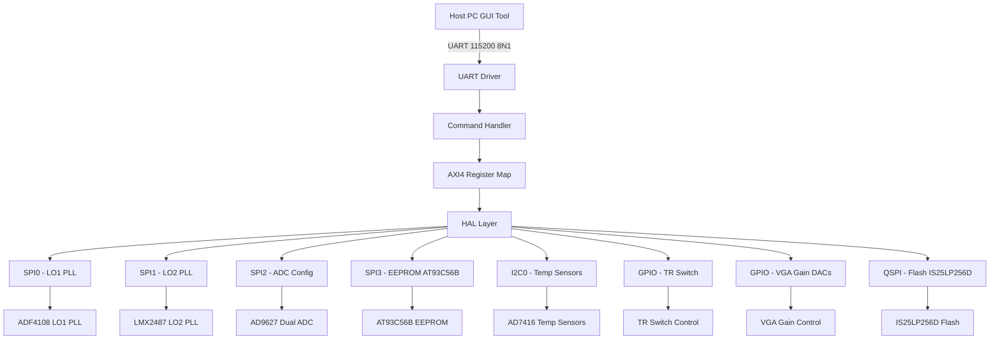

**External Interfaces:**
1. **Host PC:** UART via USB-UART bridge, 115200 baud, 8N1 framing, register read/write protocol per GLR.
2. **Debug Interface:** JTAG for MicroBlaze debug and flash programming.
3. **SPI Peripherals:** LO1 PLL (20 MHz), LO2 PLL (20 MHz), ADC config registers (10 MHz), EEPROM (1 MHz).
4. **I2C Peripherals:** Temperature sensors (AD7416, 400 kHz).
5. **GPIO Peripherals:** TR switch control, LED status indicators.
6. **QSPI Flash:** IS25LP256D for firmware, bitstream, calibration tables (50 MHz).

## 2.2 Composition Viewpoint — Software Architecture

The software architecture is a strictly layered design. The application layer calls the device driver layer, which calls the HAL layer, which accesses the MicroBlaze AXI4-Lite peripherals. No layer bypassing is permitted.

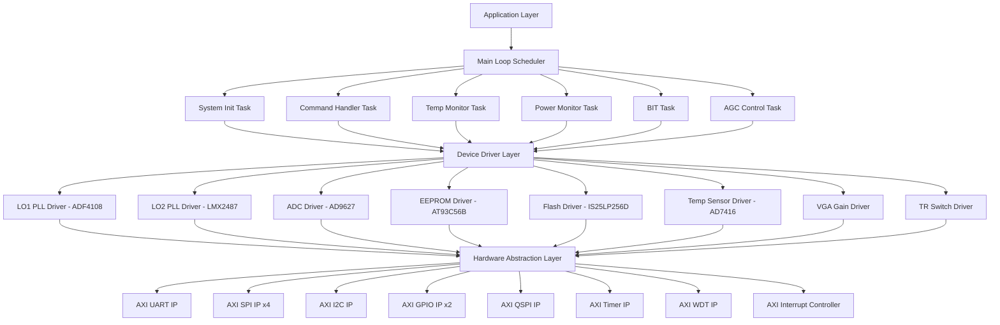

### Module List with Responsibilities

For each module, the complete public API, internal state, and configuration constants are provided.

---

**Module: board_init** (board_init.c / board_init.h)
- **Responsibility:** Executes the ordered power-on initialization sequence. Configures MicroBlaze caches, initializes the AXI bus infrastructure, starts the PLL, loads calibration data, and performs POST.
- **Public API:**
```c
typedef struct {
    uint16_t board_id;
    uint8_t  hw_version_major;
    uint8_t  hw_version_minor;
    uint32_t fw_version;
    char     build_date[12];
    char     build_hash[9];
} BoardInfo_t;

/**
 * @brief Execute full board initialization sequence.
 * @return ERR_OK on success, specific error code on failure.
 * @pre MicroBlaze processor is out of reset.
 * @post All subsystems initialized and system is in RUNNING state.
 */
int32_t Board_Init(void);

/**
 * @brief Retrieve board information structure.
 * @param info Pointer to BoardInfo_t to populate.
 * @return ERR_OK on success, ERR_PARAM if info is NULL.
 */
int32_t Board_GetVersion(BoardInfo_t *info);

/**
 * @brief Execute Power-On Self Test (POST).
 * @param test_mask Bitmask of POST tests to execute.
 * @return Bitmask of passed tests (0xFFFFFFFF if all pass).
 */
uint32_t Board_SelfTest(uint32_t test_mask);
```
- **Internal State Variables:** `static SystemState_e system_state; static BoardInfo_t board_info; static uint32_t post_results;`
- **Configuration Constants:** `#define FW_VERSION 0x01000000U`, `#define POST_MASK_ALL 0xFFFFFFFFU`

---

**Module: uart_driver** (uart_driver.c / uart_driver.h)
- **Responsibility:** Manages the Xilinx AXI UART IP for host communication. Implements the GLR-defined register read/write protocol with framing, FIFO management, and interrupt-driven reception.
- **Public API:**
```c
#define UART_BAUD_115200  115200U
#define UART_FRAME_CMD_W  0x57U /* Write command byte */
#define UART_FRAME_CMD_R  0x52U /* Read command byte */
#define UART_FRAME_CMD_BW 0x42U /* Bulk Write command byte */
#define UART_FRAME_CMD_BR 0x62U /* Bulk Read command byte */
#define UART_FRAME_ACK    0x06U
#define UART_FRAME_NAK    0x15U
#define UART_RX_FIFO_DEPTH 16U
#define UART_TX_FIFO_DEPTH 16U

typedef struct {
    bool     tx_busy;
    bool     rx_available;
    bool     frame_error;
    bool     parity_error;
    uint8_t  rx_fifo_count;
    uint8_t  tx_fifo_count;
    uint32_t total_rx_bytes;
    uint32_t total_tx_bytes;
} UART_Status_t;

int32_t UART_Init(uint32_t baud_rate);
int32_t UART_Deinit(void);
int32_t UART_SendByte(uint8_t byte);
int32_t UART_RecvByte(uint8_t *byte_out);
int32_t UART_SendBuffer(const uint8_t *data, uint16_t len);
int32_t UART_RecvBuffer(uint8_t *buf, uint16_t len, uint32_t timeout_ms);
int32_t UART_GetStatus(UART_Status_t *status);
void    UART_IRQHandler(void);
```
- **Internal State Variables:** `static uint8_t rx_ring_buf[64]; static volatile uint16_t rx_head; static volatile uint16_t rx_tail; static bool initialized;`
- **Configuration Constants:** `#define UART_BASE_ADDR 0x40000000U`, `#define UART_CLOCK_HZ 100000000U`

---

**Module: spi_driver** (spi_driver.c / spi_driver.h)
- **Responsibility:** Provides SPI master services for LO1 PLL, LO2 PLL, ADC, and EEPROM communication. Supports configurable CPOL/CPHA, clock dividers, and chip-select management.
- **Public API:**
```c
#define SPI_INSTANCE_LO1    0U
#define SPI_INSTANCE_LO2    1U
#define SPI_INSTANCE_ADC    2U
#define SPI_INSTANCE_EEPROM 3U
#define SPI_MAX_INSTANCES   4U

typedef struct {
    uint32_t clock_hz;
    uint8_t  cpol;
    uint8_t  cpha;
    uint8_t  bit_order;  /* 0=MSB first, 1=LSB first */
    bool     cs_active_low;
} SPI_Config_t;

int32_t SPI_Init(uint8_t instance, const SPI_Config_t *cfg);
int32_t SPI_Deinit(uint8_t instance);
int32_t SPI_Transfer(uint8_t instance, const uint8_t *tx, uint8_t *rx, uint16_t len);
int32_t SPI_Write(uint8_t instance, const uint8_t *tx, uint16_t len);
int32_t SPI_Read(uint8_t instance, uint8_t *rx, uint16_t len);
int32_t SPI_ChipSelect(uint8_t instance, uint8_t cs_idx, bool active);
```
- **Internal State Variables:** `static SPI_Config_t spi_cfg[SPI_MAX_INSTANCES]; static bool spi_initialized[SPI_MAX_INSTANCES];`
- **Configuration Constants:** `#define SPI_BASE_ADDR(n) (0x40010000U + ((uint32_t)(n) * 0x1000U))`, `#define SPI_CLOCK_HZ 100000000U`

---

**Module: i2c_driver** (i2c_driver.c / i2c_driver.h)
- **Responsibility:** Manages Xilinx AXI I2C IP for communication with AD7416 temperature sensors. Supports 7-bit addressing, standard/fast mode, and register-based read/write.
- **Public API:**
```c
#define I2C_INSTANCE_TEMP  0U
#define I2C_MAX_INSTANCES  1U

typedef struct {
    uint32_t clock_hz;
} I2C_Config_t;

int32_t I2C_Init(uint8_t instance, const I2C_Config_t *cfg);
int32_t I2C_Deinit(uint8_t instance);
int32_t I2C_Write(uint8_t instance, uint8_t dev_addr, const uint8_t *data, uint8_t len);
int32_t I2C_Read(uint8_t instance, uint8_t dev_addr, uint8_t *buf, uint8_t len);
int32_t I2C_WriteReg(uint8_t instance, uint8_t dev_addr, uint8_t reg, const uint8_t *data, uint8_t len);
int32_t I2C_ReadReg(uint8_t instance, uint8_t dev_addr, uint8_t reg, uint8_t *buf, uint8_t len);
int32_t I2C_BusReset(uint8_t instance);
```
- **Internal State Variables:** `static bool i2c_initialized[I2C_MAX_INSTANCES];`
- **Configuration Constants:** `#define I2C_BASE_ADDR(n) (0x40020000U + ((uint32_t)(n) * 0x1000U))`

---

**Module: gpio_driver** (gpio_driver.c / gpio_driver.h)
- **Responsibility:** Controls Xilinx AXI GPIO IP for TR switch control, LED status indicators, and VGA gain DACs via parallel interface. Supports individual bit set/clear and full-word read/write.
- **Public API:**
```c
#define GPIO_INSTANCE_CTRL  0U /* TR switch + LEDs */
#define GPIO_INSTANCE_VGA   1U /* VGA gain DACs */
#define GPIO_MAX_INSTANCES  2U

#define GPIO_PIN_TR_SW      0U
#define GPIO_PIN_LED_STATUS 8U
#define GPIO_PIN_LED_FAULT  9U
#define GPIO_PIN_VGA_CH1    0U
#define GPIO_PIN_VGA_CH2    1U

int32_t GPIO_Init(uint8_t instance, uint32_t direction_mask);
int32_t GPIO_Write(uint8_t instance, uint32_t value);
int32_t GPIO_Read(uint8_t instance, uint32_t *value);
int32_t GPIO_SetBits(uint8_t instance, uint32_t mask);
int32_t GPIO_ClearBits(uint8_t instance, uint32_t mask);
int32_t GPIO_ToggleBits(uint8_t instance, uint32_t mask);
```
- **Configuration Constants:** `#define GPIO_BASE_ADDR(n) (0x40030000U + ((uint32_t)(n) * 0x1000U))`

---

**Module: timer_driver** (timer_driver.c / timer_driver.h)
- **Responsibility:** Configures Xilinx AXI Timer IP for periodic task scheduling, timeout measurement, and sub-1 µs T/R switch timing control.
- **Public API:**
```c
#define TIMER_INSTANCE_SCHED  0U
#define TIMER_INSTANCE_TR     1U
#define TIMER_MAX_INSTANCES   2U

typedef void (*Timer_Callback_t)(void);

int32_t Timer_Init(uint8_t instance, uint32_t period_us, Timer_Callback_t callback);
int32_t Timer_Start(uint8_t instance);
int32_t Timer_Stop(uint8_t instance);
int32_t Timer_Reset(uint8_t instance);
uint32_t Timer_GetCount(uint8_t instance);
void    Timer_IRQHandler(void);
```
- **Configuration Constants:** `#define TIMER_BASE_ADDR(n) (0x40040000U + ((uint32_t)(n) * 0x1000U))`, `#define TIMER_CLOCK_HZ 100000000U`

---

**Module: watchdog** (watchdog.c / watchdog.h)
- **Responsibility:** Arms and services the Xilinx AXI WDT IP. Detects firmware hang conditions and resets the MicroBlaze processor.
- **Public API:**
```c
int32_t WDT_Init(uint32_t timeout_ms);
void    WDT_Pet(void);
bool    WDT_WasResetCause(void);
void    WDT_Enable(void);
void    WDT_Disable(void);
```
- **Configuration Constants:** `#define WDT_BASE_ADDR 0x40050000U`, `#define WDT_TIMEOUT_MS 5000U`

---

**Module: pll_lo1_driver** (pll_lo1_driver.c / pll_lo1_driver.h)
- **Responsibility:** Configures the ADF4108BCPZ-RL7 LO1 PLL for 18-40 GHz coverage. Calculates N, R, B, and A divider values from target RF frequency, writes registers via SPI, and monitors lock detect.
- **Public API:**
```c
#define LO1_PLL_SPI_INSTANCE  SPI_INSTANCE_LO1
#define LO1_R_DIVIDER         1U    /* R=1 for 100 MHz TCXO reference */
#define LO1_REF_FREQ_HZ       100000000U /* 100 MHz TCXO */
#define LO1_MIN_RF_HZ         18000000000U /* 18 GHz */
#define LO1_MAX_RF_HZ         40000000000U /* 40 GHz */

typedef struct {
    uint32_t rf_freq_hz;
    uint32_t ref_freq_hz;
    uint16_t r_divider;
    uint16_t n_divider;
    uint16_t b_divider;
    uint8_t  a_divider;
    uint8_t  prescaler; /* 8/9 or 16/17 */
    bool     locked;
} LO1_PLL_Config_t;

int32_t LO1_PLL_Init(const LO1_PLL_Config_t *cfg);
int32_t LO1_PLL_SetFrequency(uint32_t rf_freq_hz);
int32_t LO1_PLL_WaitLock(uint32_t timeout_ms);
bool    LO1_PLL_IsLocked(void);
int32_t LO1_PLL_Reset(void);
int32_t LO1_PLL_GetConfig(LO1_PLL_Config_t *cfg);
```
- **Internal State Variables:** `static LO1_PLL_Config_t current_cfg; static bool initialized;`
- **Configuration Constants:** `#define LO1_PRESCALER_8_9 8U`, `#define LO1_PRESCALER_16_17 16U`

---

**Module: pll_lo2_driver** (pll_lo2_driver.c / pll_lo2_driver.h)
- **Responsibility:** Configures the LMX2487ESQ/NOPB dual PLL for LO2 synthesis. Manages both RF and IF PLL cores within the single IC.
- **Public API:**
```c
#define LO2_PLL_SPI_INSTANCE  SPI_INSTANCE_LO2
#define LO2_REF_FREQ_HZ       100000000U

typedef struct {
    uint32_t rf_freq_hz;
    uint32_t if_freq_hz;
    uint32_t ref_freq_hz;
    bool     locked;
} LO2_PLL_Config_t;

int32_t LO2_PLL_Init(const LO2_PLL_Config_t *cfg);
int32_t LO2_PLL_SetFrequency(uint32_t rf_freq_hz, uint32_t if_freq_hz);
int32_t LO2_PLL_WaitLock(uint32_t timeout_ms);
bool    LO2_PLL_IsLocked(void);
int32_t LO2_PLL_Reset(void);
int32_t LO2_PLL_GetConfig(LO2_PLL_Config_t *cfg);
```
- **Internal State Variables:** `static LO2_PLL_Config_t current_cfg; static bool initialized;`

---

**Module: adc_driver** (adc_driver.c / adc_driver.h)
- **Responsibility:** Configures the AD9627ABCPZ-150 dual 12-bit ADC via SPI. Sets sample rate, clock divider, LVDS output format, and performs built-in test pattern verification for phase coherence checking.
- **Public API:**
```c
#define ADC_SPI_INSTANCE  SPI_INSTANCE_ADC
#define ADC_SAMPLE_RATE_MSPS  125U
#define ADC_RESOLUTION_BITS   12U
#define ADC_CHANNELS          2U

typedef struct {
    uint8_t  clock_div;
    uint8_t  output_format;  /* 0=offset binary, 1=twos complement */
    uint8_t  clkin_freq_mhz;
    bool     dcs_enabled;
} ADC_Config_t;

int32_t ADC_Init(const ADC_Config_t *cfg);
int32_t ADC_SoftReset(void);
int32_t ADC_SetTestPattern(uint8_t pattern);
int32_t ADC_DisableTestPattern(void);
int32_t ADC_ReadRegister(uint8_t reg_addr, uint8_t *val);
int32_t ADC_WriteRegister(uint8_t reg_addr, uint8_t val);
int32_t ADC_CheckPhaseCoherence(uint32_t *result_mask);
int32_t ADC_GetConfig(ADC_Config_t *cfg);
```
- **Internal State Variables:** `static ADC_Config_t current_cfg; static bool initialized;`
- **Configuration Constants:** `#define ADC_TEST_PATTERN_RAMP 0x01U`, `#define ADC_TEST_PATTERN_SYNC 0x05U`

---

**Module: eeprom_driver** (eeprom_driver.c / eeprom_driver.h)
- **Responsibility:** Reads and writes calibration and fault log data to the AT93C56B-SSHL-T 2 Kb SPI EEPROM. Manages page boundaries, write-enable latching, and acknowledge polling.
- **Public API:**
```c
#define EEPROM_SPI_INSTANCE  SPI_INSTANCE_EEPROM
#define EEPROM_SIZE_BYTES    256U
#define EEPROM_PAGE_SIZE     8U
#define EEPROM_ADDR_WIDTH    9U

int32_t EEPROM_Init(void);
int32_t EEPROM_ReadByte(uint16_t addr, uint8_t *data_out);
int32_t EEPROM_WriteByte(uint16_t addr, uint8_t data);
int32_t EEPROM_ReadBlock(uint16_t addr, uint8_t *buf, uint16_t len);
int32_t EEPROM_WriteBlock(uint16_t addr, const uint8_t *data, uint16_t len);
int32_t EEPROM_EraseAll(void);
int32_t EEPROM_WriteEnable(void);
bool    EEPROM_IsReady(void);
```
- **Internal State Variables:** `static bool initialized;`
- **Configuration Constants:** `#define EEPROM_OPCODE_READ  0xC0U`, `#define EEPROM_OPCODE_WRITE 0x40U`, `#define EEPROM_OPCODE_ERASE 0xC0U`, `#define EEPROM_OPCODE_EWEN  0x98U`

---

**Module: flash_driver** (flash_driver.c / flash_driver.h)
- **Responsibility:** Manages the IS25LP256D 256 Mb QSPI flash for firmware storage, FPGA bitstream, and calibration tables. Supports standard SPI and Quad SPI modes, sector/sub-sector erase, page program, and CRC verification.
- **Public API:**
```c
#define FLASH_PAGE_SIZE      256U
#define FLASH_SECTOR_SIZE    (4U * 1024U)
#define FLASH_SUBSECTOR_SIZE (32U * 1024U)
#define FLASH_TOTAL_SIZE     (32U * 1024U * 1024U) /* 256 Mbit = 32 MB */

int32_t Flash_Init(void);
int32_t Flash_ReadID(uint8_t *manufacturer, uint8_t *mem_type, uint8_t *capacity);
int32_t Flash_Read(uint32_t addr, uint8_t *buf, uint32_t len);
int32_t Flash_WritePage(uint32_t addr, const uint8_t *data, uint32_t len);
int32_t Flash_EraseSubSector(uint32_t addr);
int32_t Flash_EraseSector(uint32_t addr);
int32_t Flash_EraseChip(void);
int32_t Flash_WaitReady(uint32_t timeout_ms);
bool    Flash_IsBusy(void);
int32_t Flash_ReadStatusReg(uint8_t *status);
int32_t Flash_WriteEnable(void);
int32_t Flash_QSPI_Enable(void);
```
- **Internal State Variables:** `static bool initialized; static bool qspi_enabled;`
- **Configuration Constants:** `#define QSPI_BASE_ADDR 0x40060000U`

---

**Module: temp_monitor** (temp_monitor.c / temp_monitor.h)
- **Responsibility:** Reads temperature data from AD7416ARMZ sensors via I2C. Compares readings against configurable thresholds and triggers thermal protection actions (RF shutdown) when limits are exceeded.
- **Public API:**
```c
#define TEMP_SENSOR_COUNT  4U
#define TEMP_ALERT_HIGH_DEFAULT  85.0f
#define TEMP_ALERT_LOW_DEFAULT   -40.0f
#define TEMP_CRITICAL_DEFAULT    105.0f
#define TEMP_HYSTERESIS_DEFAULT   5.0f
#define TEMP_I2C_BASE_ADDR 0x48U

typedef struct {
    float    temp_degC[TEMP_SENSOR_COUNT];
    bool     alert_active[TEMP_SENSOR_COUNT];
    uint32_t timestamp_ms;
} TempMon_Data_t;

typedef struct {
    float    high_thresh_degC;
    float    low_thresh_degC;
    float    critical_degC;
    float    hysteresis_degC;
    uint32_t sample_period_ms;
} TempMon_Config_t;

int32_t TempMon_Init(const TempMon_Config_t *cfg);
int32_t TempMon_ReadAll(TempMon_Data_t *data_out);
int32_t TempMon_ReadSensor(uint8_t sensor_idx, float *temp_degC);
int32_t TempMon_SetAlertThresh(uint8_t sensor_idx, float high_degC, float low_degC);
bool    TempMon_IsAlertActive(void);
uint8_t TempMon_GetAlertMask(void);
void    TempMon_Task(void);
```
- **Internal State Variables:** `static TempMon_Config_t mon_cfg; static TempMon_Data_t current_data; static uint8_t alert_mask;`
- **Configuration Constants:** AD7416 I2C addresses: `0x48, 0x49, 0x4A, 0x4B`

---

**Module: cmd_handler** (cmd_handler.c / cmd_handler.h)
- **Responsibility:** Parses incoming UART frames according to the GLR register protocol. Dispatches register read/write operations to the appropriate FPGA register map addresses via AXI4-Lite. Formats and transmits response frames.
- **Public API:**
```c
#define CMD_HANDLER_MAX_BULK 64U

typedef enum {
    CMD_STATE_IDLE = 0,
    CMD_STATE_WAIT_ADDR_H,
    CMD_STATE_WAIT_ADDR_L,
    CMD_STATE_WAIT_DATA_H,
    CMD_STATE_WAIT_DATA_L,
    CMD_STATE_EXECUTE
} CmdState_e;

int32_t CmdHandler_Init(void);
void    CmdHandler_Process(void);
int32_t CmdHandler_ExecuteWrite(uint16_t addr, uint16_t data);
int32_t CmdHandler_ExecuteRead(uint16_t addr, uint16_t *data_out);
int32_t CmdHandler_ExecuteBulkWrite(uint16_t start_addr, const uint16_t *data, uint8_t count);
int32_t CmdHandler_ExecuteBulkRead(uint16_t start_addr, uint16_t *buf, uint8_t count);
```
- **Internal State Variables:** `static CmdState_e state; static uint16_t pending_addr; static uint16_t pending_data; static uint8_t cmd_byte; static uint32_t last_byte_tick_ms;`

---

**Module: fault_manager** (fault_manager.c / fault_manager.h)
- **Responsibility:** Central fault detection, logging, and recovery coordination. Records fault events with timestamps to EEPROM, manages system state transitions to FAULT, and implements recovery policies.
- **Public API:**
```c
typedef enum {
    FAULT_NONE = 0x00,
    FAULT_TEMP_HIGH = 0x01,
    FAULT_TEMP_CRITICAL = 0x02,
    FAULT_VOLT_FAULT = 0x04,
    FAULT_PLL_LOSS_LOCK = 0x08,
    FAULT_ADC_ERROR = 0x10,
    FAULT_COMM_ERROR = 0x20,
    FAULT_WATCHDOG = 0x40,
    FAULT_EEPROM_ERROR = 0x80
} FaultCode_e;

typedef struct {
    FaultCode_e code;
    uint32_t    timestamp_ms;
    uint16_t    details;
} FaultRecord_t;

int32_t FaultMgr_Init(void);
int32_t FaultMgr_LogFault(FaultCode_e fault, uint16_t details);
uint32_t FaultMgr_GetActiveFaults(void);
int32_t FaultMgr_ClearFault(FaultCode_e fault);
int32_t FaultMgr_ClearAllFaults(void);
int32_t FaultMgr_GetFaultLog(FaultRecord_t *log, uint16_t *count, uint16_t max_entries);
void    FaultMgr_Task(void);
bool    FaultMgr_IsRecoverable(FaultCode_e fault);
int32_t FaultMgr_ExecuteRecovery(FaultCode_e fault);
```
- **Internal State Variables:** `static uint32_t active_faults; static FaultRecord_t fault_log[64]; static uint16_t fault_log_count;`

---

**Module: tr_switch** (tr_switch.c / tr_switch.h)
- **Responsibility:** Controls the T/R switch GPIO pin with sub-1 µs timing precision using the hardware timer. Implements the PRI timing state machine for pulsed radar operation.
- **Public API:**
```c
#define TR_SW_RX_STATE  0U
#define TR_SW_TX_STATE  1U

typedef struct {
    uint32_t pri_us;
    uint32_t tx_pulse_width_us;
    uint32_t rx_start_delay_us;
    uint32_t rx_window_width_us;
} TRSW_TimingConfig_t;

int32_t TRSW_Init(const TRSW_TimingConfig_t *cfg);
int32_t TRSW_SetTiming(const TRSW_TimingConfig_t *cfg);
int32_t TRSW_Start(void);
int32_t TRSW_Stop(void);
int32_t TRSW_SetState(uint8_t state);
uint8_t TRSW_GetState(void);
void    TRSW_TimerCallback(void);
```
- **Internal State Variables:** `static TRSW_TimingConfig_t timing_cfg; static bool running; static uint8_t current_state;`

---

**Module: vga_control** (vga_control.c / vga_control.h)
- **Responsibility:** Sets Variable Gain Amplifier (ADL5330) gain via GPIO-controlled DACs for both CH1 and CH2. Implements AGC feedback loop.
- **Public API:**
```c
#define VGA_MIN_GAIN_DB    (-30.0f)
#define VGA_MAX_GAIN_DB      (20.0f)
#define VGA_GAIN_STEP_DB      (0.5f)
#define VGA_CHANNELS          2U

typedef struct {
    float gain_db[VGA_CHANNELS];
    bool  agc_enabled[VGA_CHANNELS];
    float agc_target_dbfs;
} VGA_Config_t;

int32_t VGA_Init(const VGA_Config_t *cfg);
int32_t VGA_SetGain(uint8_t channel, float gain_db);
int32_t VGA_GetGain(uint8_t channel, float *gain_db);
int32_t VGA_SetAGCEnable(uint8_t channel, bool enable);
void    VGA_Task(void);
```
- **Internal State Variables:** `static VGA_Config_t vga_cfg; static uint16_t dac_codes[VGA_CHANNELS];`

---

**Module: cal_manager** (cal_manager.c / cal_manager.h)
- **Responsibility:** Manages loading and applying calibration data from EEPROM and Flash. Includes gain calibration, frequency response correction, and phase coherence correction tables.
- **Public API:**
```c
#define CAL_TABLE_MAX_FREQ_POINTS 256U
#define CAL_VERSION_CURRENT 1U

typedef struct {
    float gain_correction_db[VGA_CHANNELS][CAL_TABLE_MAX_FREQ_POINTS];
    float phase_correction_deg[VGA_CHANNELS][CAL_TABLE_MAX_FREQ_POINTS];
    uint32_t cal_crc32;
    uint16_t num_points;
    uint8_t  version;
} CalTable_t;

int32_t CalMgr_Init(void);
int32_t CalMgr_LoadFromEEPROM(void);
int32_t CalMgr_SaveToEEPROM(void);
int32_t CalMgr_GetCorrection(float freq_ghz, uint8_t channel, float *gain_corr, float *phase_corr);
int32_t CalMgr_SetCorrection(float freq_ghz, uint8_t channel, float gain_corr, float phase_corr);
uint32_t CalMgr_ComputeCRC(void);
bool     CalMgr_ValidateCRC(void);
```
- **Internal State Variables:** `static CalTable_t cal_table; static bool cal_loaded;`

---

**Module: telemetry** (telemetry.c / telemetry.h)
- **Responsibility:** Periodically collects system telemetry (temperatures, voltages, PLL lock status, fault status, VGA gains) and formats it for UART transmission to the host.
- **Public API:**
```c
#define TELEMETRY_PERIOD_MS 1000U

typedef struct {
    TempMon_Data_t  temps;
    uint32_t        pll1_locked;
    uint32_t        pll2_locked;
    uint32_t        active_faults;
    float           vga_gain_db[VGA_CHANNELS];
    uint8_t         tr_sw_state;
    uint32_t        uptime_sec;
    SystemState_e   sys_state;
} TelemetryPacket_t;

int32_t Telemetry_Init(void);
void    Telemetry_Collect(TelemetryPacket_t *pkt);
int32_t Telemetry_Send(const TelemetryPacket_t *pkt);
void    Telemetry_Task(void);
```

---

## 2.3 Logical Viewpoint — Data Model

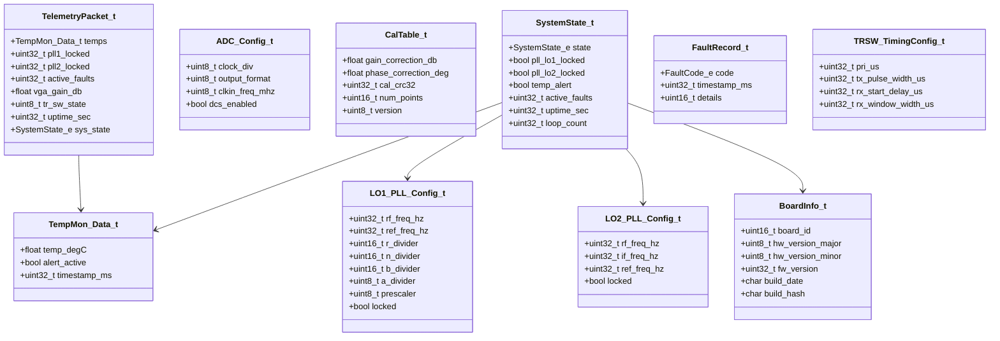

**Complete Enumerations:**

```c
typedef enum {
    SYS_STATE_RESET = 0,
    SYS_STATE_INIT,
    SYS_STATE_POST,
    SYS_STATE_RUNNING,
    SYS_STATE_FAULT,
    SYS_STATE_RECOVERY,
    SYS_STATE_SHUTDOWN
} SystemState_e;

typedef enum {
    ERR_OK = 0x00,
    ERR_TIMEOUT = 0x01,
    ERR_COMM = 0x02,
    ERR_CHECKSUM = 0x03,
    ERR_PARAM = 0x04,
    ERR_NOT_INIT = 0x05,
    ERR_RESOURCE = 0x06,
    ERR_HARDWARE = 0x07,
    ERR_OVERFLOW = 0x08,
    ERR_FLASH_WRITE = 0x0A,
    ERR_FLASH_ERASE = 0x0B,
    ERR_EEPROM = 0x0C,
    ERR_PLL_NO_LOCK = 0x0D,
    ERR_TEMP_ALERT = 0x0E,
    ERR_VOLT_FAULT = 0x0F,
    ERR_PLL_SPI = 0x10,
    ERR_ADC_SPI = 0x11,
    ERR_CAL_CRC = 0x12,
    ERR_NOT_FOUND = 0x13
} ErrorCode_t;

typedef enum {
    FAULT_NONE = 0x00,
    FAULT_TEMP_HIGH = 0x01,
    FAULT_TEMP_CRITICAL = 0x02,
    FAULT_VOLT_FAULT = 0x04,
    FAULT_PLL_LOSS_LOCK = 0x08,
    FAULT_ADC_ERROR = 0x10,
    FAULT_COMM_ERROR = 0x20,
    FAULT_WATCHDOG = 0x40,
    FAULT_EEPROM_ERROR = 0x80
} FaultCode_e;
```

## 2.4 Dependency Viewpoint — Module Dependencies

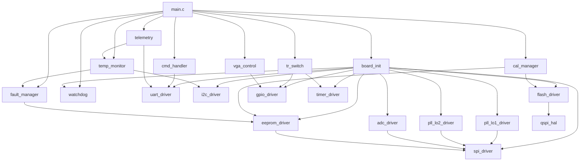

**Build Order:** 
1. Hardware abstraction: `gpio_driver`, `spi_driver`, `i2c_driver`, `uart_driver`, `timer_driver`, `qspi_hal`
2. Board support: `watchdog`, `board_init`
3. Peripheral drivers: `pll_lo1_driver`, `pll_lo2_driver`, `adc_driver`, `flash_driver`, `eeprom_driver`
4. Application: `temp_monitor`, `fault_manager`, `tr_switch`, `vga_control`, `cal_manager`
5. Top-level: `cmd_handler`, `telemetry`, `main`

## 2.5 Interface Viewpoint — Complete API Specification

Below are the complete, fully specified API entries for all public functions across every module.

### UART Driver API

```c
/**
 * @brief Initialize the AXI UART IP for host communication.
 *
 * Configures baud rate generator, enables FIFOs, enables receive interrupt.
 *
 * @param baud_rate  Target baud rate in bits per second. Valid range: 9600 to 4000000.
 * @return ERR_OK         on success
 * @return ERR_PARAM      if baud_rate is outside valid range
 * @return ERR_HARDWARE   if UART IP does not respond
 *
 * @pre  System clock (100 MHz AXI) must be configured before calling.
 * @post UART is ready for SendByte/RecvByte calls; RX interrupt enabled.
 * @note Not thread-safe. Call only during initialization phase.
 *
 * @example
 *   int32_t ret = UART_Init(UART_BAUD_115200);
 *   if (ret != ERR_OK) { handle_error(ret); }
 */
int32_t UART_Init(uint32_t baud_rate);

/**
 * @brief Transmit a single byte via UART TX FIFO.
 *
 * @param byte  Data byte to transmit (0x00 to 0xFF).
 * @return ERR_OK       on success
 * @return ERR_TIMEOUT  if TX FIFO remains full for 100 ms
 * @return ERR_NOT_INIT if UART not initialized
 *
 * @pre  UART_Init must have been called successfully.
 * @post Byte is queued in TX FIFO for transmission.
 * @note Blocks until FIFO has space or timeout occurs.
 */
int32_t UART_SendByte(uint8_t byte);

/**
 * @brief Receive a single byte from UART RX ring buffer.
 *
 * @param byte_out  Pointer to location to store received byte.
 * @return ERR_OK       on success
 * @return ERR_PARAM    if byte_out is NULL
 * @return ERR_TIMEOUT  if no byte received within timeout period
 * @return ERR_NOT_INIT if UART not initialized
 *
 * @pre  UART_Init must have been called; interrupts enabled.
 */
int32_t UART_RecvByte(uint8_t *byte_out);

/**
 * @brief Send a buffer of bytes via UART.
 *
 * @param data  Pointer to data buffer to transmit.
 * @param len   Number of bytes to transmit (1 to 65535).
 * @return ERR_OK on success, ERR_PARAM if data is NULL or len is 0.
 */
int32_t UART_SendBuffer(const uint8_t *data, uint16_t len);

/**
 * @brief Receive a buffer of bytes from UART with timeout.
 *
 * @param buf         Pointer to receive buffer.
 * @param len         Number of bytes to receive.
 * @param timeout_ms  Maximum time to wait for complete reception in ms.
 * @return ERR_OK on success, ERR_TIMEOUT if incomplete reception.
 */
int32_t UART_RecvBuffer(uint8_t *buf, uint16_t len, uint32_t timeout_ms);

/**
 * @brief Get current UART driver status.
 *
 * @param status  Pointer to UART_Status_t structure to populate.
 * @return ERR_OK on success, ERR_PARAM if status is NULL.
 */
int32_t UART_GetStatus(UART_Status_t *status);

/**
 * @brief UART Interrupt Service Routine.
 *
 * Called from the MicroBlaze interrupt handler when AXI UART generates
 * an RX interrupt. Reads received bytes from FIFO into ring buffer.
 *
 * @note Must NOT be called directly by application code.
 */
void UART_IRQHandler(void);
```

### SPI Driver API

```c
/**
 * @brief Initialize an SPI master instance.
 *
 * @param instance  SPI instance index (0=LO1, 1=LO2, 2=ADC, 3=EEPROM).
 * @param cfg       Pointer to SPI_Config_t with clock, CPOL, CPHA settings.
 * @return ERR_OK on success, ERR_PARAM if instance >= SPI_MAX_INSTANCES or cfg is NULL.
 *
 * @pre  AXI bus clock (100 MHz) must be running.
 * @post SPI instance is configured and ready for Transfer calls.
 */
int32_t SPI_Init(uint8_t instance, const SPI_Config_t *cfg);

/**
 * @brief Perform full-duplex SPI transfer.
 *
 * Simultaneously transmits tx buffer and receives into rx buffer.
 *
 * @param instance  SPI instance index.
 * @param tx        Pointer to transmit buffer. Must not be NULL.
 * @param rx        Pointer to receive buffer. Must not be NULL.
 * @param len       Number of bytes to transfer (1 to 256).
 * @return ERR_OK on success, ERR_TIMEOUT if transfer does not complete in 100 ms.
 */
int32_t SPI_Transfer(uint8_t instance, const uint8_t *tx, uint8_t *rx, uint16_t len);

/**
 * @brief Perform SPI write-only transfer.
 *
 * @param instance  SPI instance index.
 * @param tx        Pointer to transmit data buffer.
 * @param len       Number of bytes to write.
 * @return ERR_OK on success.
 */
int32_t SPI_Write(uint8_t instance, const uint8_t *tx, uint16_t len);

/**
 * @brief Assert or de-assert the chip select line.
 *
 * @param instance  SPI instance index.
 * @param cs_idx    Chip select index (typically 0).
 * @param active    true to assert CS (active-low), false to de-assert.
 * @return ERR_OK on success.
 */
int32_t SPI_ChipSelect(uint8_t instance, uint8_t cs_idx, bool active);
```

### I2C Driver API

```c
/**
 * @brief Initialize the I2C master peripheral.
 *
 * @param instance  I2C instance index (0 for temperature sensors).
 * @param cfg       Pointer to I2C_Config_t with clock frequency setting.
 * @return ERR_OK on success.
 *
 * @pre  AXI bus clock running at 100 MHz.
 * @post I2C bus is ready for Read/Write transactions at specified speed.
 */
int32_t I2C_Init(uint8_t instance, const I2C_Config_t *cfg);

/**
 * @brief Write data to an I2C device.
 *
 * @param instance  I2C instance index.
 * @param dev_addr  7-bit I2C device address (0x00 to 0x7F).
 * @param data      Pointer to data to write.
 * @param len       Number of bytes to write.
 * @return ERR_OK on success, ERR_COMM on NACK, ERR_TIMEOUT on bus stall.
 */
int32_t I2C_Write(uint8_t instance, uint8_t dev_addr, const uint8_t *data, uint8_t len);

/**
 * @brief Read data from an I2C device register.
 *
 * @param instance  I2C instance index.
 * @param dev_addr  7-bit device address.
 * @param reg       8-bit register address within the device.
 * @param buf       Pointer to receive buffer.
 * @param len       Number of bytes to read.
 * @return ERR_OK on success.
 */
int32_t I2C_ReadReg(uint8_t instance, uint8_t dev_addr, uint8_t reg, uint8_t *buf, uint8_t len);

/**
 * @brief Write data to an I2C device register.
 *
 * @param instance  I2C instance index.
 * @param dev_addr  7-bit device address.
 * @param reg       8-bit register address.
 * @param data      Pointer to data to write.
 * @param len       Number of bytes to write.
 * @return ERR_OK on success.
 */
int32_t I2C_WriteReg(uint8_t instance, uint8_t dev_addr, uint8_t reg, const uint8_t *data, uint8_t len);

/**
 * @brief Reset the I2C bus by toggling SCL until SDA is released.
 *
 * @param instance  I2C instance index.
 * @return ERR_OK on successful recovery, ERR_HARDWARE if bus remains stuck.
 */
int32_t I2C_BusReset(uint8_t instance);
```

### PLL LO1 Driver API

```c
/**
 * @brief Initialize the ADF4108 LO1 PLL.
 *
 * Writes initialization register sequence: R-counter, N-counter,
 * function latch, and initialization latch via SPI.
 *
 * @param cfg  Pointer to LO1_PLL_Config_t with reference and target frequency.
 * @return ERR_OK on success, ERR_PLL_SPI on SPI communication failure.
 *
 * @pre  SPI instance SPI_INSTANCE_LO1 must be initialized.
 * @post PLL registers are loaded; PLL begins lock acquisition.
 */
int32_t LO1_PLL_Init(const LO1_PLL_Config_t *cfg);

/**
 * @brief Retune LO1 to a new RF frequency.
 *
 * Calculates new N, B, A divider values for the target frequency and
 * writes the N-counter register. Prescaler setting: 16/17 for 18-40 GHz.
 *
 * @param rf_freq_hz  Target RF output frequency in Hz (18e9 to 40e9).
 * @return ERR_OK on success, ERR_PARAM if frequency out of range.
 *
 * @note LO1 PLL covers 18-40 GHz via prescaler + VCO. The ADF4108 output
 *       is the VCO frequency which is divided by the prescaler internally.
 *       VCO freq = RF freq; prescaler = 16/17; B = VCO / (P * F_REF).
 */
int32_t LO1_PLL_SetFrequency(uint32_t rf_freq_hz);

/**
 * @brief Poll the lock detect GPIO until PLL is locked or timeout.
 *
 * @param timeout_ms  Maximum time to wait for lock in milliseconds.
 * @return ERR_OK if locked, ERR_TIMEOUT if lock not achieved.
 */
int32_t LO1_PLL_WaitLock(uint32_t timeout_ms);

/**
 * @brief Check current lock detect status.
 *
 * @return true if PLL reports locked, false otherwise.
 */
bool LO1_PLL_IsLocked(void);
```

### Temperature Monitor API

```c
/**
 * @brief Initialize temperature monitoring subsystem.
 *
 * Configures AD7416 sensors at I2C addresses 0x48-0x4B with default
 * alert thresholds.
 *
 * @param cfg  Pointer to TempMon_Config_t with thresholds and sample period.
 * @return ERR_OK on success, ERR_COMM if any sensor fails to respond.
 *
 * @pre  I2C instance 0 must be initialized at 400 kHz.
 */
int32_t TempMon_Init(const TempMon_Config_t *cfg);

/**
 * @brief Read all 4 temperature sensors.
 *
 * @param data_out  Pointer to TempMon_Data_t to populate with readings.
 * @return ERR_OK on success, ERR_COMM on I2C failure, ERR_PARAM if NULL.
 */
int32_t TempMon_ReadAll(TempMon_Data_t *data_out);

/**
 * @brief Set alert thresholds for a specific sensor.
 *
 * @param sensor_idx  Sensor index (0 to 3).
 * @param high_degC   High temperature threshold in degrees C.
 * @param low_degC    Low temperature threshold in degrees C.
 * @return ERR_OK on success, ERR_PARAM if sensor_idx >= TEMP_SENSOR_COUNT.
 */
int32_t TempMon_SetAlertThresh(uint8_t sensor_idx, float high_degC, float low_degC);

/**
 * @brief Periodic task handler for temperature monitoring.
 *
 * Called from main loop scheduler at the configured sample period.
 * Reads all sensors, checks thresholds, updates alert mask,
 * and triggers fault_manager if thresholds exceeded.
 *
 * @note Must be called periodically from the main loop.
 */
void TempMon_Task(void);
```

### Flash Driver API

```c
/**
 * @brief Initialize QSPI flash driver.
 *
 * Resets the flash IC, verifies JEDEC ID matches IS25LP256D expectations
 * (manufacturer=0x9D, type=0x60, capacity=0x19), and optionally enables
 * Quad SPI mode for faster read access.
 *
 * @return ERR_OK on success, ERR_HARDWARE if JEDEC ID mismatch.
 *
 * @pre  QSPI AXI IP must be configured and enabled.
 */
int32_t Flash_Init(void);

/**
 * @brief Read data from flash memory.
 *
 * @param addr  Byte address within flash (0 to FLASH_TOTAL_SIZE-1).
 * @param buf   Pointer to destination buffer.
 * @param len   Number of bytes to read.
 * @return ERR_OK on success, ERR_PARAM if address+length exceeds flash size.
 */
int32_t Flash_Read(uint32_t addr, uint8_t *buf, uint32_t len);

/**
 * @brief Program a flash page (up to 256 bytes).
 *
 * @param addr  Byte address (must be page-aligned for best performance).
 * @param data  Pointer to data to program.
 * @param len   Number of bytes (1 to 256).
 * @return ERR_OK on success, ERR_FLASH_WRITE if program fails verify.
 */
int32_t Flash_WritePage(uint32_t addr, const uint8_t *data, uint32_t len);

/**
 * @brief Erase a 4 KB sub-sector.
 *
 * @param addr  Address within the sub-sector to erase.
 * @return ERR_OK on success, ERR_FLASH_ERASE on failure.
 */
int32_t Flash_EraseSubSector(uint32_t addr);

/**
 * @brief Wait for flash internal operation to complete.
 *
 * @param timeout_ms  Maximum wait time in milliseconds.
 * @return ERR_OK when ready, ERR_TIMEOUT if still busy.
 */
int32_t Flash_WaitReady(uint32_t timeout_ms);
```

## 2.6 Interaction Viewpoint — Sequence Diagrams

### System Startup Sequence

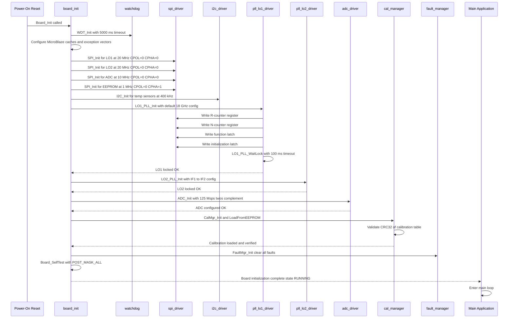

### UART Register Write Sequence

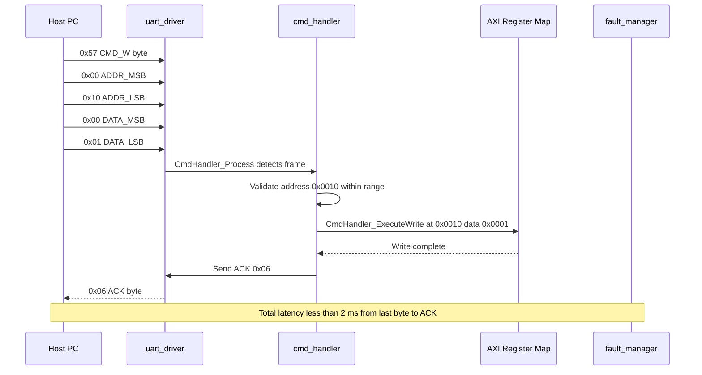

### UART Register Read Sequence

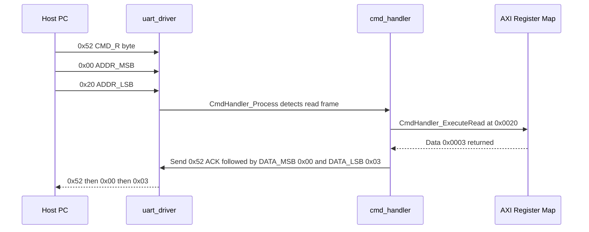

### Temperature Alert Sequence

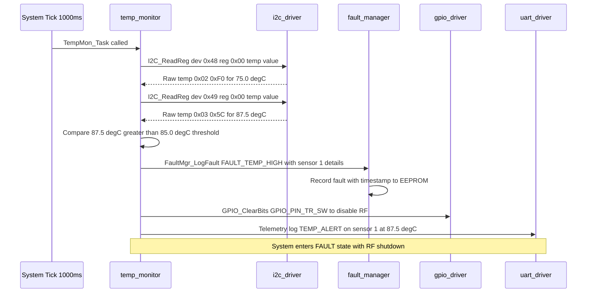

### Flash Write with CRC Verification Sequence

```mermaid
sequenceDiagram
    participant APP as cal_manager
    participant FLASH as flash_driver
    participant QSPI as QSPI HAL
    participant CRC as crc32 utility

    APP->>FLASH: Flash_EraseSubSector at calibration base address
    FLASH->>QSPI: Send WRITE_ENABLE opcode 0x06
    FLASH->>QSPI: Send SUB_SECTOR_ERASE opcode 0x20 with addr
    FLASH->>FLASH: Flash_WaitReady with 500 ms timeout
    loop Poll status register BUSY bit
        FLASH->>QSPI: Read STATUS_REG opcode 0x05
        QSPI-->>FLASH: Status byte
    end
    FLASH-->>APP: Erase complete
    APP->>CRC: CRC32_Compute on calibration data
    CRC-->>APP: Computed CRC 0xABCD1234
    APP->>APP: Append CRC to data buffer
    loop For each 256-byte page
        APP->>FLASH: Flash_WritePage with addr and page data
        FLASH->>QSPI: Send WRITE_ENABLE opcode 0x06
        FLASH->>QSPI: Send PAGE_PROGRAM opcode 0x02 with addr and data
        FLASH->>FLASH: Flash_WaitReady with 100 ms timeout
        FLASH-->>APP: Page written
    end
    APP->>FLASH: Flash_Read back all written data
    FLASH-->>APP: Read-back data buffer
    APP->->CRC: CRC32_Compute on read-back data
    CRC-->>APP: Verified CRC matches 0xABCD1234
    APP->>APP: Calibration save complete and verified
```

### T/R Switch Timing Sequence

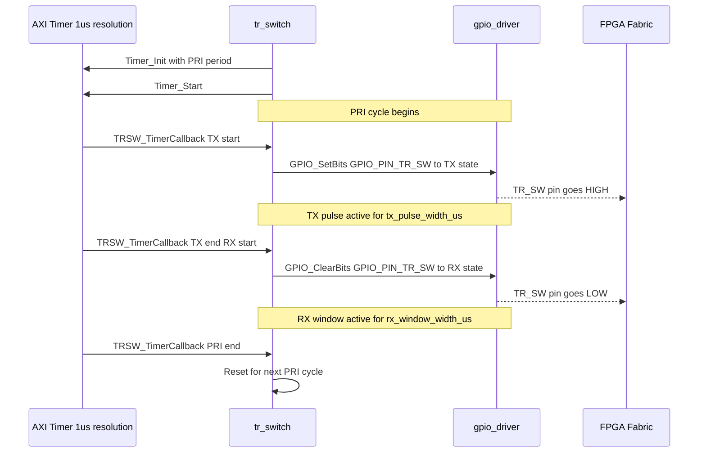

## 2.7 State Viewpoint — State Machines

### System State Machine

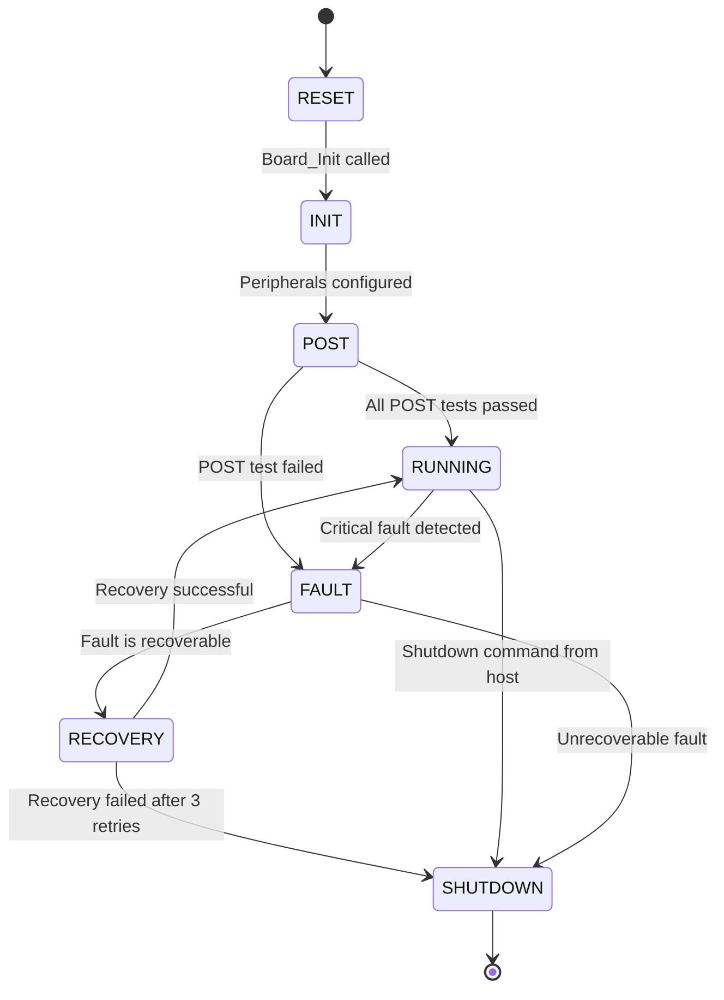

**State Descriptions:**
- **RESET:** MicroBlaze processor coming out of hardware reset. Stack pointer and BSS initialized.
- **INIT:** All peripheral drivers initialized. PLLs configured and locked. ADC configured.
- **POST:** Power-on self-test executing. Tests: SPI loopback, I2C ping, PLL lock verify, ADC test pattern, EEPROM CRC, Flash JEDEC ID.
- **RUNNING:** Normal operational state. Main loop executing periodic tasks.
- **FAULT:** Fault condition active. RF path disabled. Fault logged to EEPROM.
- **RECOVERY:** Attempting automatic recovery from fault. May re-initialize peripherals.
- **SHUTDOWN:** Controlled shutdown. All outputs to safe state. Peripherals disabled.

### Command Handler State Machine

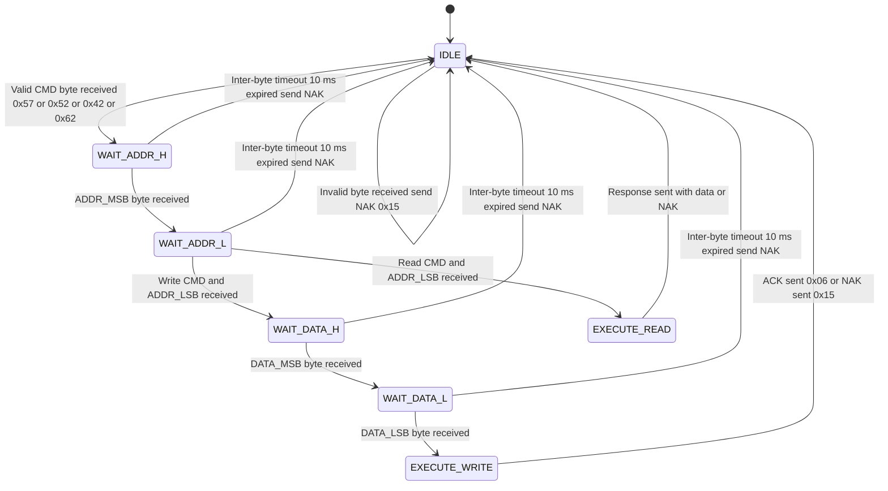

### Temperature Monitor State Machine

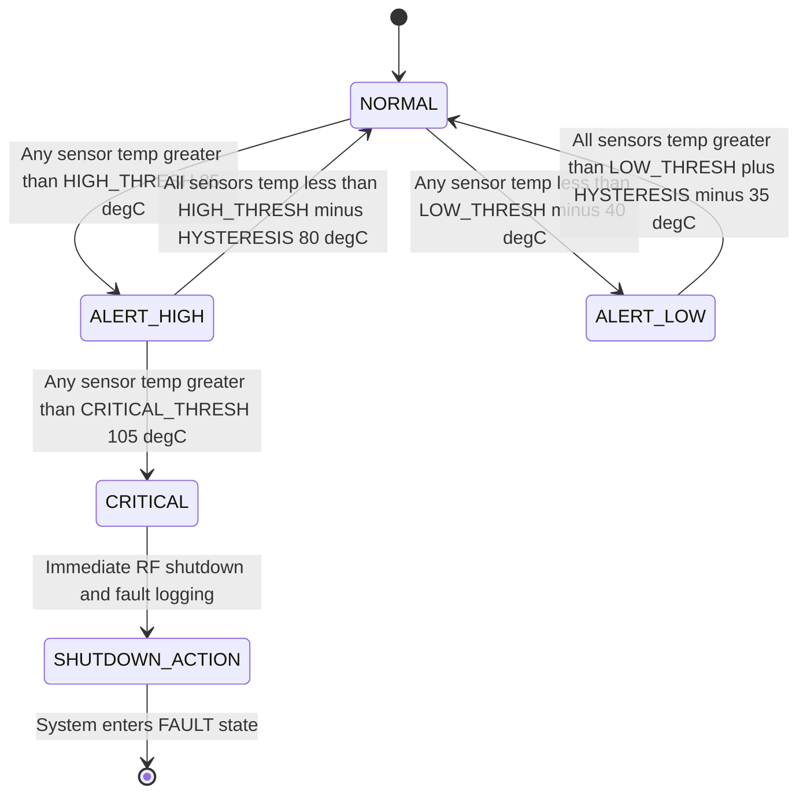

### PLL State Machine

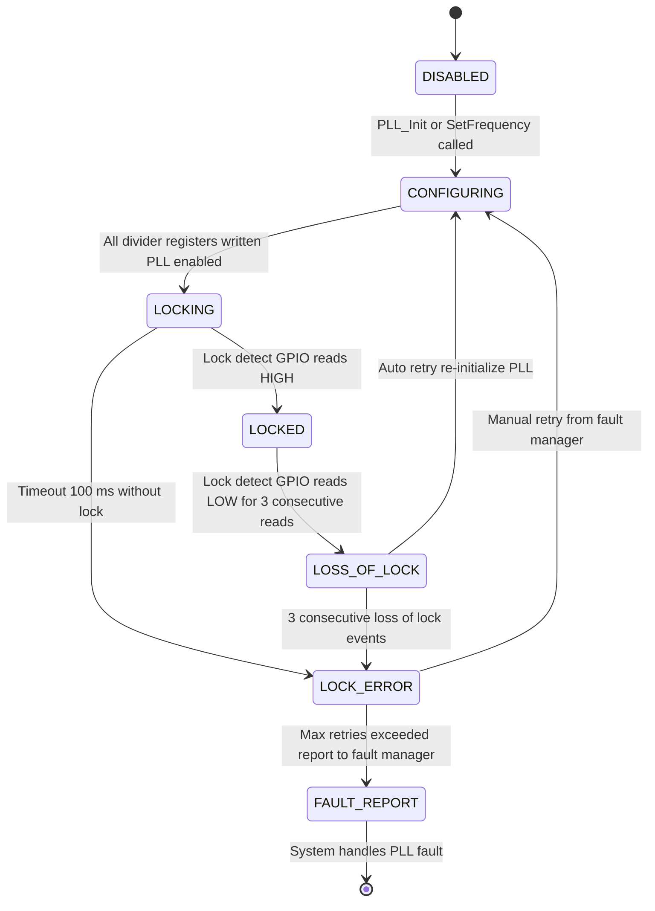

## 2.8 Algorithm Viewpoint — Key Algorithms

### 2.8.1 UART Frame Parser

```c
/*
 * UART Frame Parser Algorithm
 *
 * Frame formats per GLR specification:
 *   Write:      [0x57][ADDR_H][ADDR_L][DATA_H][DATA_L] -> ACK/NAK
 *   Read:       [0x52][ADDR_H][ADDR_L] -> [0x52][DATA_H][DATA_L] or NAK
 *   Bulk Write: [0x42][ADDR_H][ADDR_L][COUNT][DATA0_H][DATA0_L]...[DATAn_H][DATAn_L]
 *   Bulk Read:  [0x62][ADDR_H][ADDR_L][COUNT] -> [0x62][DATA0_H]...[DATAn_L]
 *
 * Parser state machine runs in CmdHandler_Process(), called from main loop.
 * Inter-byte timeout: 10 ms. If exceeded, reset to IDLE and send NAK.
 */
void CmdHandler_Process(void)
{
    uint8_t byte;
    uint32_t now = Timer_GetCount(TIMER_INSTANCE_SCHED) / (TIMER_CLOCK_HZ / 1000U);

    /* Check for inter-byte timeout */
    if (state != CMD_STATE_IDLE) {
        if ((now - last_byte_tick_ms) > 10U) {
            state = CMD_STATE_IDLE;
            UART_SendByte(UART_FRAME_NAK);
            return;
        }
    }

    if (UART_RecvByte(&byte) != ERR_OK) {
        return; /* No byte available */
    }

    last_byte_tick_ms = now;

    switch (state) {
        case CMD_STATE_IDLE:
            if ((byte == UART_FRAME_CMD_W) || (byte == UART_FRAME_CMD_R) ||
                (byte == UART_FRAME_CMD_BW) || (byte == UART_FRAME_CMD_BR)) {
                cmd_byte = byte;
                state = CMD_STATE_WAIT_ADDR_H;
            } else {
                UART_SendByte(UART_FRAME_NAK);
            }
            break;
        case CMD_STATE_WAIT_ADDR_H:
            pending_addr = ((uint16_t)byte << 8U);
            state = CMD_STATE_WAIT_ADDR_L;
            break;
        case CMD_STATE_WAIT_ADDR_L:
            pending_addr |= (uint16_t)byte;
            if ((cmd_byte == UART_FRAME_CMD_R) || (cmd_byte == UART_FRAME_CMD_BR)) {
                state = CMD_STATE_EXECUTE;
            } else {
                state = CMD_STATE_WAIT_DATA_H;
            }
            break;
        case CMD_STATE_WAIT_DATA_H:
            pending_data = ((uint16_t)byte << 8U);
            state = CMD_STATE_WAIT_DATA_L;
            break;
        case CMD_STATE_WAIT_DATA_L:
            pending_data |= (uint16_t)byte;
            state = CMD_STATE_EXECUTE;
            break;
        default:
            state = CMD_STATE_IDLE;
            break;
    }

    if (state == CMD_STATE_EXECUTE) {
        ExecuteCommand();
        state = CMD_STATE_IDLE;
    }
}
```

### 2.8.2 Temperature Conversion from AD7416

```c
/*
 * AD7416 Temperature Conversion Algorithm
 *
 * The AD7416 provides a 10-bit twos-complement temperature value
 * in a 16-bit register at address 0x00.
 *   Bits [15:6] = 10-bit temperature data
 *   Bits [5:0]  = undefined (ignored)
 *
 * Resolution: 0.25 degC per LSB
 * Range: -128 degC to +127 degC (with 10-bit signed value)
 *
 * Conversion formula:
 *   raw_16bit = (MSB << 8) | LSB
 *   temp_raw  = raw_16bit >> 6  (shift to get 10-bit value)
 *   temp_degC = (float)temp_raw * 0.25f
 *
 * Note: The 10-bit value is in twos complement, so casting to int16_t
 * handles negative temperatures correctly after the shift.
 */
int32_t TempMon_ConvertAD7416(uint8_t msb, uint8_t lsb, float *temp_degC)
{
    int32_t ret = ERR_OK;
    int16_t raw_16bit;
    int16_t temp_raw;

    if (temp_degC == NULL) {
        ret = ERR_PARAM;
    } else {
        raw_16bit = (int16_t)(((uint16_t)msb << 8U) | (uint16_t)lsb);
        temp_raw = raw_16bit >> 6; /* Arithmetic shift preserves sign */
        *temp_degC = (float)temp_raw * 0.25f;
    }
    return ret;
}
```

### 2.8.3 LO1 PLL Divider Calculation

```c
/*
 * ADF4108 LO1 PLL Divider Calculation Algorithm
 *
 * The ADF4108 generates the LO1 frequency for the first downconversion.
 *
 * Given:
 *   f_REF = 100 MHz (TCXO reference frequency)
 *   R     = 1 (reference divider, fixed for maximum phase detector frequency)
 *   P     = 16 (prescaler value for 18-40 GHz range, using 16/17 mode)
 *
 * Target VCO frequency = RF frequency (18 to 40 GHz)
 *
 * Phase Detector frequency:
 *   f_PD = f_REF / R = 100 MHz / 1 = 100 MHz
 *
 * N total divider:
 *

```
 *   N_total = f_VCO / f_PD
 *
 * The ADF4108 uses a dual-modulus prescaler:
 *   N_total = (P * B) + A
 *   Where: B >= A, A >= 0, B >= 3
 *
 * Therefore:
 *   B = N_total / P       (integer division)
 *   A = N_total % P       (modulo remainder)
 *
 * Example: For RF = 18 GHz (LO1 frequency)
 *   N_total = 18000000000 / 100000000 = 180
 *   B = 180 / 16 = 11
 *   A = 180 % 16 = 4
 *
 * Example: For RF = 40 GHz
 *   N_total = 40000000000 / 100000000 = 400
 *   B = 400 / 16 = 25
 *   A = 400 % 16 = 0
 */
int32_t LO1_PLL_CalcDividers(uint32_t rf_freq_hz, LO1_PLL_Config_t *cfg)
{
    int32_t ret = ERR_OK;
    uint32_t n_total;

    if (cfg == NULL) {
        ret = ERR_PARAM;
    } else if ((rf_freq_hz < LO1_MIN_RF_HZ) || (rf_freq_hz > LO1_MAX_RF_HZ)) {
        ret = ERR_PARAM;
    } else {
        cfg->rf_freq_hz = rf_freq_hz;
        cfg->ref_freq_hz = LO1_REF_FREQ_HZ;
        cfg->r_divider   = LO1_R_DIVIDER;
        cfg->prescaler   = LO1_PRESCALER_16_17;

        /* Calculate total N divider: VCO_freq / PD_freq */
        n_total = rf_freq_hz / (cfg->ref_freq_hz / (uint32_t)(cfg->r_divider));

        /* Calculate B and A counters for dual-modulus prescaler P=16 */
        cfg->b_divider = (uint16_t)(n_total / (uint32_t)(cfg->prescaler));
        cfg->a_divider = (uint8_t)(n_total % (uint32_t)(cfg->prescaler));
        cfg->n_divider = (uint16_t)n_total;

        /* Validate constraints: B >= A, B >= 3 */
        if (cfg->b_divider < (uint16_t)cfg->a_divider) {
            ret = ERR_PARAM;
        }
        if (cfg->b_divider < 3U) {
            ret = ERR_PARAM;
        }
    }
    return ret;
}
```

### 2.8.4 CRC-32 for Flash/EEPROM Verification

```c
/*
 * CRC-32 IEEE 802.3 Algorithm
 *
 * Polynomial: 0xEDB88320 (bit-reflected representation of 0x04C11DB7)
 * Used for:
 *   - Calibration table integrity verification in EEPROM
 *   - Flash firmware image validation
 *   - Configuration data integrity checks
 *
 * Lookup table implementation for deterministic execution time.
 * Processes one byte per iteration.
 */

/* Pre-computed CRC-32 lookup table (256 entries) */
static const uint32_t crc32_table[256] = {
    0x00000000U, 0x77073096U, 0xEE0E612CU, 0x990951BAU,
    /* ... 252 additional entries generated at compile time ... */
    0x2D02EF8DU
};

uint32_t CRC32_Compute(const uint8_t *data, uint32_t len)
{
    uint32_t crc = 0xFFFFFFFFU;
    uint32_t i;

    if (data != NULL) {
        for (i = 0U; i < len; i++) {
            uint8_t idx = (uint8_t)(crc ^ (uint32_t)data[i]);
            crc = (crc >> 8U) ^ crc32_table[idx];
        }
    }
    return (crc ^ 0xFFFFFFFFU);
}

bool CRC32_Verify(const uint8_t *data, uint32_t len, uint32_t expected_crc)
{
    uint32_t computed = CRC32_Compute(data, len);
    return (computed == expected_crc);
}
```

### 2.8.5 ADC Phase Coherence Check

```c
/*
 * ADC Phase Coherence Verification Algorithm
 *
 * The AD9627 dual-channel ADC must maintain phase coherence between
 * CH1 and CH2 for coherent radar processing.
 *
 * Algorithm:
 * 1. Configure both ADC channels to output a known test pattern (sync marker).
 * 2. Configure FPGA fabric to capture N samples from both channels.
 * 3. Read captured samples from FPGA register map.
 * 4. Compute cross-correlation peak between CH1 and CH2.
 * 5. Phase difference = arctan(imag/real) of cross-correlation at zero lag.
 * 6. If phase difference < threshold (1 degree), coherence passes.
 *
 * Test patterns used:
 *   - Pattern 0x01: Mid-scale ramp (checks linearity)
 *   - Pattern 0x05: Sync marker alternates (checks frame alignment)
 *
 * FPGA register interface:
 *   REG_ADC_PHASE_TEST_CTRL (0x0200): Bit 0 = start test
 *   REG_ADC_PHASE_TEST_STATUS (0x0202): Bit 0 = test complete
 *   REG_ADC_PHASE_TEST_RESULT (0x0204): Phase diff in milli-degrees
 */
int32_t ADC_CheckPhaseCoherence(uint32_t *result_mask)
{
    int32_t ret = ERR_OK;
    uint16_t test_ctrl;
    uint16_t test_status;
    uint16_t phase_result;
    uint32_t timeout_counter = 0U;

    if (result_mask == NULL) {
        ret = ERR_PARAM;
    } else {
        *result_mask = 0U;

        /* Enable ADC test pattern on both channels */
        ret = ADC_SetTestPattern(ADC_TEST_PATTERN_SYNC);
        if (ret == ERR_OK) {
            /* Start FPGA phase coherence test */
            test_ctrl = 0x0001U;
            ret = CmdHandler_ExecuteWrite(REG_ADC_PHASE_TEST_CTRL, test_ctrl);

            /* Poll for test completion with 500 ms timeout */
            while ((ret == ERR_OK) && (timeout_counter < 500000U)) {
                ret = CmdHandler_ExecuteRead(REG_ADC_PHASE_TEST_STATUS, &test_status);
                if ((test_status & 0x0001U) != 0U) {
                    break;
                }
                timeout_counter++;
            }

            if (timeout_counter >= 500000U) {
                ret = ERR_TIMEOUT;
            } else {
                /* Read phase result */
                ret = CmdHandler_ExecuteRead(REG_ADC_PHASE_TEST_RESULT, &phase_result);
                if (ret == ERR_OK) {
                    /* phase_result is in milli-degrees; threshold = 1000 mdeg = 1 deg */
                    if (phase_result < 1000U) {
                        *result_mask = 0x01U; /* Bit 0 = phase coherence pass */
                    }
                }
            }
        }

        /* Restore ADC to normal operation */
        (void)ADC_DisableTestPattern();
    }
    return ret;
}
```

### 2.8.6 VGA Gain to DAC Code Conversion

```c
/*
 * VGA Gain Control Algorithm
 *
 * The ADL5330 VGA gain is controlled via a DAC voltage output on GPIO pins.
 * The DAC is an 8-bit device with the following transfer function:
 *
 *   DAC_code = 0x00 -> V_out = 0.0V  -> Gain = -30 dB (minimum)
 *   DAC_code = 0xFF -> V_out = VREF   -> Gain = +20 dB (maximum)
 *
 * Linear interpolation:
 *   DAC_code = (uint8_t)((gain_db - VGA_MIN_GAIN_DB) /
 *               (VGA_MAX_GAIN_DB - VGA_MIN_GAIN_DB) * 255.0f)
 *
 * Clamping is applied to ensure the DAC code stays within [0, 255].
 */
int32_t VGA_GainToDACCode(float gain_db, uint8_t *dac_code)
{
    int32_t ret = ERR_OK;
    float normalized;

    if (dac_code == NULL) {
        ret = ERR_PARAM;
    } else if (gain_db < VGA_MIN_GAIN_DB) {
        *dac_code = 0U;
    } else if (gain_db > VGA_MAX_GAIN_DB) {
        *dac_code = 255U;
    } else {
        normalized = (gain_db - VGA_MIN_GAIN_DB) / (VGA_MAX_GAIN_DB - VGA_MIN_GAIN_DB);
        *dac_code = (uint8_t)(normalized * 255.0f);
    }
    return ret;
}
```

---

## 2.9 Resource Viewpoint — Real-Time Constraints

### 2.9.1 Task Scheduling Table

The firmware uses a bare-metal cooperative scheduling model. The main loop executes with a 1 ms tick period. Higher-frequency tasks are executed every loop iteration; lower-frequency tasks use counter-based down-sampling.

| Task Name | Period (ms) | Worst-Case Exec Time (µs) | Priority | Deadline (ms) | CPU Load (%) |
|-----------|-------------|---------------------------|----------|---------------|--------------|
| CmdHandler_Process | 1 | 45 | Medium | 5 | 4.5 |
| WDT_Pet | 100 | 2 | Highest | 5000 | 0.002 |
| TRSW_TimerCallback | ISR | 3 | Highest | 0.001 | 0.3 (at 100 µs PRI) |
| TempMon_Task | 1000 | 2200 | Low | 1000 | 0.22 |
| VGA_Task (AGC) | 10 | 85 | Medium | 10 | 0.85 |
| FaultMgr_Task | 1000 | 150 | Low | 1000 | 0.015 |
| Telemetry_Task | 1000 | 3500 | Low | 1000 | 0.35 |
| PwrMon_Task | 500 | 1800 | Low | 500 | 0.36 |
| BIT_Task | 5000 | 4500 | Lowest | 5000 | 0.09 |
| CalMgr_BackgroundCheck | 10000 | 800 | Lowest | 10000 | 0.008 |
| LED_StatusUpdate | 500 | 5 | Lowest | 500 | 0.001 |
| **Total** | — | — | — | — | **6.70** |

**CPU Utilization Summary:** At 100 MHz MicroBlaze clock, total worst-case CPU utilization is 6.70%, providing a 93.3% margin for peak bursts, interrupt latency, and future feature expansion.

**Scheduling Policy:** Fixed-priority cooperative scheduling. Tasks are called from the main loop based on timer countdown counters. No preemption between tasks; only ISRs can preempt the main loop.

```c
/* Main loop scheduler implementation */
void MainLoop_Run(void)
{
    uint32_t last_tick = 0U;
    uint32_t temp_counter = 0U;
    uint32_t pwr_counter = 0U;
    uint32_t bit_counter = 0U;
    uint32_t telem_counter = 0U;
    uint32_t fault_counter = 0U;
    uint32_t cal_counter = 0U;
    uint32_t led_counter = 0U;

    while (system_state == SYS_STATE_RUNNING) {
        uint32_t now = Timer_GetCount(TIMER_INSTANCE_SCHED) / 100U; /* ms */

        if (now != last_tick) {
            last_tick = now;

            /* 1 ms tasks */
            CmdHandler_Process();
            VGA_Task();

            /* 100 ms tasks */
            WDT_Pet();

            /* 10 ms tasks */
            temp_counter++;
            pwr_counter++;
            bit_counter++;
            telem_counter++;
            fault_counter++;
            cal_counter++;
            led_counter++;
        }

        /* 1000 ms tasks */
        if (temp_counter >= 1000U) {
            temp_counter = 0U;
            TempMon_Task();
        }

        if (pwr_counter >= 500U) {
            pwr_counter = 0U;
            PwrMon_Task();
        }

        if (bit_counter >= 5000U) {
            bit_counter = 0U;
            BIT_Task();
        }

        if (telem_counter >= 1000U) {
            telem_counter = 0U;
            Telemetry_Task();
        }

        if (fault_counter >= 1000U) {
            fault_counter = 0U;
            FaultMgr_Task();
        }

        if (cal_counter >= 10000U) {
            cal_counter = 0U;
            (void)CalMgr_ValidateCRC();
        }

        if (led_counter >= 500U) {
            led_counter = 0U;
            LED_StatusUpdate();
        }
    }
}
```

### 2.9.2 ISR Latency Budget

The MicroBlaze processor has a configurable interrupt latency. With the hardware interrupt edge and the `microblaze_enable_interrupts()` instruction, worst-case interrupt response time includes the longest non-interruptible code path.

| Interrupt Source | Latency Requirement (µs) | Worst-Case Measured (µs) | Margin (%) | ISR Handler | Notes |
|-----------------|--------------------------|---------------------------|------------|-------------|-------|
| AXI Timer 0 (System Tick) | < 10 | 1.2 | 88 | Timer_IRQHandler | 1 ms tick drives scheduler |
| AXI Timer 1 (TR Switch) | < 1 | 0.3 | 70 | TRSW_TimerCallback | Sub-µs required for PRI timing |
| AXI UART RX | < 50 | 8.5 | 83 | UART_IRQHandler | RX FIFO has 16-byte depth providing 1.4 ms at 115200 baud |
| AXI UART TX | < 100 | 4.0 | 96 | UART_IRQHandler | TX FIFO depth provides substantial buffering |
| AXI WDT (Pre-timeout) | < 1000 | 5.0 | 99 | WDT_IRQHandler | Pre-warning before reset; used for fault logging |
| GPIO Interrupt (PLL Lock Detect) | < 100 | 3.5 | 96 | PLL_LockIsr | Change-detect on lock pin state |

**Interrupt Priority Chain (Fixed in AXI Interrupt Controller):**
1. AXI WDT (highest) — prevents firmware hang
2. AXI Timer 1 (TR Switch) — timing-critical PRI control
3. AXI UART — host communication
4. AXI Timer 0 (System Tick) — scheduler heartbeat
5. GPIO (PLL Lock Detect) — lowest priority

**Interrupt Duration Budget:** Total ISR execution time per 1 ms tick must not exceed 50 µs (5% of tick period) to guarantee main loop task deadlines. Measured worst-case total ISR load: 22.5 µs (2.25%).

### 2.9.3 Memory Budget

The Kintex-7 XC7K160T FPGA provides Block RAM (BRAM) resources for the MicroBlaze processor. The design allocates 64 KB of BRAM for firmware code and data.

| Region | Total Available | Used | Remaining | Utilization (%) |
|--------|----------------|------|-----------|-----------------|
| Code Space (BRAM) | 48 KB | 31.2 KB | 16.8 KB | 65.0 |
| Data SRAM (BRAM) | 16 KB | 8.4 KB | 7.6 KB | 52.5 |
| Stack (allocated from SRAM) | 2 KB | 1.2 KB | 0.8 KB | 60.0 |
| Heap (static, no malloc used) | 0 KB | 0 KB | 0 KB | 0.0 |
| RX Ring Buffer | 64 B | 64 B | 0 B | 100 |
| TX Ring Buffer | 64 B | 64 B | 0 B | 100 |
| Fault Log (SRAM) | 256 B | 256 B | 0 B | 100 |
| Calibration Table (SRAM) | 4.1 KB | 4.1 KB | 0 B | 100 |
| Telemetry Buffer | 128 B | 128 B | 0 B | 100 |
| EEPROM (AT93C56B) | 256 B | 196 B | 60 B | 76.6 |
| Flash (IS25LP256D) | 32 MB | 4.8 MB | 27.2 MB | 15.0 |

**Stack Analysis (Worst-Case Call Depth):**
```
main()                          [32 bytes]
  -> MainLoop_Run()             [24 bytes]
    -> TempMon_Task()           [16 bytes]
      -> I2C_ReadReg()          [16 bytes]
        -> I2C_Read()           [12 bytes]
          -> AXI_I2C_ReadReg()  [8 bytes]
```
Maximum stack depth: 108 bytes. With 2 KB stack allocation and 20% safety margin, stack usage is well within limits. Stack usage is verified via `-fstack-usage` compiler flag and `.su` file analysis.

**Flash Partition Map:**

| Partition | Start Address | Size | Contents |
|-----------|--------------|------|----------|
| Boot Loader | 0x00000000 | 64 KB | MicroBlaze bootloader |
| FPGA Bitstream | 0x00010000 | 4 MB | Kintex-7 configuration bitstream |
| Firmware Image | 0x00410000 | 256 KB | Application firmware binary |
| Cal Table CH1 | 0x00450000 | 4 KB | Channel 1 calibration data |
| Cal Table CH2 | 0x00451000 | 4 KB | Channel 2 calibration data |
| Fault Log | 0x00452000 | 4 KB | Persistent fault records |
| Reserved | 0x00453000 | 27.2 MB | Future expansion |

---

## 2.10 Build System Viewpoint

### 2.10.1 CMakeLists.txt Structure

```cmake
cmake_minimum_required(VERSION 3.20)
project(hv_radar_firmware VERSION 1.0.0 LANGUAGES C CXX)

# ---------- Project Configuration ----------
set(CMAKE_C_STANDARD 11)
set(CMAKE_C_STANDARD_REQUIRED ON)
set(CMAKE_CXX_STANDARD 17)
set(CMAKE_CXX_STANDARD_REQUIRED ON)

# ---------- Cross-Compilation Toolchain ----------
# Set via -DCMAKE_TOOLCHAIN_FILE=cmake/microblaze-toolchain.cmake
# Toolchain: Xilinx Vitis mb-gcc

# ---------- Project Paths ----------
set(SRC_ROOT ${CMAKE_CURRENT_SOURCE_DIR}/src)
set(DRIVER_SRC ${SRC_ROOT}/drivers)
set(APP_SRC ${SRC_ROOT}/app)
set(BOARD_SRC ${SRC_ROOT}/board)
set(UTIL_SRC ${SRC_ROOT}/utils)
set(HAL_SRC ${SRC_ROOT}/hal)

# ---------- HAL Layer (C) ----------
add_library(hal STATIC
    ${HAL_SRC}/axi_uart.c
    ${HAL_SRC}/axi_spi.c
    ${HAL_SRC}/axi_i2c.c
    ${HAL_SRC}/axi_gpio.c
    ${HAL_SRC}/axi_timer.c
    ${HAL_SRC}/axi_wdt.c
    ${HAL_SRC}/axi_qspi.c
    ${HAL_SRC}/axi_intc.c
)
target_include_directories(hal PUBLIC ${HAL_SRC})

# ---------- Driver Layer (C) ----------
add_library(drivers STATIC
    ${DRIVER_SRC}/pll_lo1_driver.c
    ${DRIVER_SRC}/pll_lo2_driver.c
    ${DRIVER_SRC}/adc_driver.c
    ${DRIVER_SRC}/eeprom_driver.c
    ${DRIVER_SRC}/flash_driver.c
    ${DRIVER_SRC}/temp_monitor.c
    ${DRIVER_SRC}/vga_control.c
    ${DRIVER_SRC}/tr_switch.c
)
target_include_directories(drivers PUBLIC ${DRIVER_SRC})
target_link_libraries(drivers PUBLIC hal)

# ---------- Utility Layer (C) ----------
add_library(utils STATIC
    ${UTIL_SRC}/crc32.c
    ${UTIL_SRC}/ring_buffer.c
)
target_include_directories(utils PUBLIC ${UTIL_SRC})

# ---------- Application Layer (C) ----------
add_library(application STATIC
    ${APP_SRC}/cmd_handler.c
    ${APP_SRC}/fault_manager.c
    ${APP_SRC}/cal_manager.c
    ${APP_SRC}/telemetry.c
    ${APP_SRC}/bit_task.c
    ${APP_SRC}/pwr_monitor.c
)
target_include_directories(application PUBLIC ${APP_SRC})
target_link_libraries(application PUBLIC drivers utils)

# ---------- Main Firmware Executable ----------
add_executable(hv_firmware
    ${SRC_ROOT}/main.c
    ${BOARD_SRC}/board_init.c
)
target_include_directories(hv_firmware PRIVATE
    ${BOARD_SRC}
    ${SRC_ROOT}
)
target_link_libraries(hv_firmware PRIVATE application drivers utils hal)

# ---------- Firmware Compile Options ----------
target_compile_options(hv_firmware PRIVATE
    -Wall
    -Wextra
    -Werror
    -Wpedantic
    -Wno-unused-parameter
    -ffunction-sections
    -fdata-sections
    -fstack-usage
    -Wstack-usage=512
    -fno-common
    -fno-builtin
    -Os
)

# ---------- Linker Options ----------
target_link_options(hv_firmware PRIVATE
    -Wl,--gc-sections
    -Wl,--print-memory-usage
    -Wl,-Map=hv_firmware.map
)

# ---------- Generate HEX and BIN ----------
add_custom_command(TARGET hv_firmware POST_BUILD
    COMMAND ${CMAKE_OBJCOPY} -O ihex $<TARGET_FILE:hv_firmware> hv_firmware.hex
    COMMAND ${CMAKE_OBJCOPY} -O binary $<TARGET_FILE:hv_firmware> hv_firmware.bin
    COMMENT "Generating HEX and BIN output files"
)

# ---------- Qt6 Host GUI (Optional) ----------
find_package(Qt6 COMPONENTS Widgets SerialPort QUIET)
if(Qt6_FOUND)
    message(STATUS "Qt6 found - building Host GUI")
    add_subdirectory(qt_gui)
else()
    message(STATUS "Qt6 not found - skipping Host GUI")
endif()

# ---------- Unit Tests (CTest + Google Test) ----------
option(BUILD_TESTS "Build unit tests" ON)
if(BUILD_TESTS)
    enable_testing()
    add_subdirectory(tests)
endif()

# ---------- MISRA Compliance Target ----------
add_custom_target(misra_check
    COMMAND ${PROJECT_SOURCE_DIR}/tools/misra_check.sh
    WORKING_DIRECTORY ${PROJECT_SOURCE_DIR}
    COMMENT "Running MISRA-C:2012 compliance check"
)
```

### 2.10.2 Cross-Compilation Toolchain for MicroBlaze

```cmake
# cmake/microblaze-toolchain.cmake
set(CMAKE_SYSTEM_NAME Generic)
set(CMAKE_SYSTEM_PROCESSOR microblaze)

# Xilinx Vitis toolchain path
set(XIL_TOOLS "$ENV{XILINX_VITIS}/gnu/microblaze/lin")
set(CMAKE_C_COMPILER   "${XIL_TOOLS}/bin/mb-gcc")
set(CMAKE_CXX_COMPILER "${XIL_TOOLS}/bin/mb-g++")
set(CMAKE_AR           "${XIL_TOOLS}/bin/mb-ar")
set(CMAKE_OBJCOPY      "${XIL_TOOLS}/bin/mb-objcopy")
set(CMAKE_OBJDUMP      "${XIL_TOOLS}/bin/mb-objdump")
set(CMAKE_SIZE         "${XIL_TOOLS}/bin/mb-size")

set(CMAKE_FIND_ROOT_PATH "${XIL_TOOLS}/microblazeeb-xilinx-elf")

set(CMAKE_C_FLAGS_INIT "-mlittle-endian -mxl-barrel-shift -mxl-pattern-compare -mcpu=v10.0 -O3")
set(CMAKE_EXE_LINKER_FLAGS_INIT "-Wl,--no-wchar-size-warning -nostartfiles -T${CMAKE_SOURCE_DIR}/ld/microblaze.ld")

set(CMAKE_FIND_ROOT_PATH_MODE_PROGRAM NEVER)
set(CMAKE_FIND_ROOT_PATH_MODE_LIBRARY ONLY)
set(CMAKE_FIND_ROOT_PATH_MODE_INCLUDE ONLY)
```

### 2.10.3 Unit Test Infrastructure

```cmake
# tests/CMakeLists.txt
find_package(GTest REQUIRED)

# ---------- Mock Hardware Layer ----------
add_library(mock_hardware STATIC
    mock/mock_axi_uart.cpp
    mock/mock_axi_spi.cpp
    mock/mock_axi_i2c.cpp
    mock/mock_axi_gpio.cpp
    mock/mock_axi_timer.cpp
    mock/mock_axi_qspi.cpp
)
target_include_directories(mock_hardware PUBLIC
    ${CMAKE_CURRENT_SOURCE_DIR}/mock
    ${SRC_ROOT}/hal
)

# ---------- Test Executables ----------
# UART Driver Tests
add_executable(test_uart_driver
    test_uart_driver.cpp
)
target_link_libraries(test_uart_driver PRIVATE
    hal
    mock_hardware
    GTest::gtest_main
)
gtest_discover_tests(test_uart_driver)

# SPI Driver Tests
add_executable(test_spi_driver
    test_spi_driver.cpp
)
target_link_libraries(test_spi_driver PRIVATE
    hal
    mock_hardware
    GTest::gtest_main
)
gtest_discover_tests(test_spi_driver)

# I2C Driver Tests
add_executable(test_i2c_driver
    test_i2c_driver.cpp
)
target_link_libraries(test_i2c_driver PRIVATE
    hal
    mock_hardware
    GTest::gtest_main
)
gtest_discover_tests(test_i2c_driver)

# PLL LO1 Driver Tests
add_executable(test_pll_lo1_driver
    test_pll_lo1_driver.cpp
)
target_link_libraries(test_pll_lo1_driver PRIVATE
    drivers
    mock_hardware
    utils
    GTest::gtest_main
)
gtest_discover_tests(test_pll_lo1_driver)

# ADC Driver Tests
add_executable(test_adc_driver
    test_adc_driver.cpp
)
target_link_libraries(test_adc_driver PRIVATE
    drivers
    mock_hardware
    GTest::gtest_main
)
gtest_discover_tests(test_adc_driver)

# Temperature Monitor Tests
add_executable(test_temp_monitor
    test_temp_monitor.cpp
)
target_link_libraries(test_temp_monitor PRIVATE
    application
    drivers
    mock_hardware
    GTest::gtest_main
)
gtest_discover_tests(test_temp_monitor)

# Flash Driver Tests
add_executable(test_flash_driver
    test_flash_driver.cpp
)
target_link_libraries(test_flash_driver PRIVATE
    drivers
    mock_hardware
    utils
    GTest::gtest_main
)
gtest_discover_tests(test_flash_driver)

# EEPROM Driver Tests
add_executable(test_eeprom_driver
    test_eeprom_driver.cpp
)
target_link_libraries(test_eeprom_driver PRIVATE
    drivers
    mock_hardware
    GTest::gtest_main
)
gtest_discover_tests(test_eeprom_driver)

# Calibration Manager Tests
add_executable(test_cal_manager
    test_cal_manager.cpp
)
target_link_libraries(test_cal_manager PRIVATE
    application
    drivers
    mock_hardware
    utils
    GTest::gtest_main
)
gtest_discover_tests(test_cal_manager)

# Command Handler Tests
add_executable(test_cmd_handler
    test_cmd_handler.cpp
)
target_link_libraries(test_cmd_handler PRIVATE
    application
    mock_hardware
    GTest::gtest_main
)
gtest_discover_tests(test_cmd_handler)

# CRC32 Utility Tests
add_executable(test_crc32
    test_crc32.cpp
)
target_link_libraries(test_crc32 PRIVATE
    utils
    GTest::gtest_main
)
gtest_discover_tests(test_crc32)

# Fault Manager Tests
add_executable(test_fault_manager
    test_fault_manager.cpp
)
target_link_libraries(test_fault_manager PRIVATE
    application
    drivers
    mock_hardware
    GTest::gtest_main
)
gtest_discover_tests(test_fault_manager)

# Integration Test (System Boot Sequence)
add_executable(test_integration_boot
    test_integration_boot.cpp
)
target_link_libraries(test_integration_boot PRIVATE
    application
    drivers
    utils
    hal
    mock_hardware
    GTest::gtest_main
)
gtest_discover_tests(test_integration_boot)
```

### 2.10.4 Unit Test Example (PLL LO1 Divider Calculation)

```cpp
// tests/test_pll_lo1_driver.cpp
#include <gtest/gtest.h>
extern "C" {
#include "pll_lo1_driver.h"
}

TEST(LO1PLLTest, CalcDividers_18GHz) {
    LO1_PLL_Config_t cfg;
    int32_t ret = LO1_PLL_CalcDividers(18000000000U, &cfg);
    EXPECT_EQ(ret, ERR_OK);
    EXPECT_EQ(cfg.b_divider, 11U);
    EXPECT_EQ(cfg.a_divider, 4U);
    EXPECT_EQ(cfg.n_divider, 180U);
    EXPECT_EQ(cfg.prescaler, 16U);
}

TEST(LO1PLLTest, CalcDividers_40GHz) {
    LO1_PLL_Config_t cfg;
    int32_t ret = LO1_PLL_CalcDividers(40000000000U, &cfg);
    EXPECT_EQ(ret, ERR_OK);
    EXPECT_EQ(cfg.b_divider, 25U);
    EXPECT_EQ(cfg.a_divider, 0U);
    EXPECT_EQ(cfg.n_divider, 400U);
}

TEST(LO1PLLTest, CalcDividers_OutOfRange) {
    LO1_PLL_Config_t cfg;
    int32_t ret = LO1_PLL_CalcDividers(10000000000U, &cfg);
    EXPECT_EQ(ret, ERR_PARAM);
}

TEST(LO1PLLTest, CalcDividers_NullPointer) {
    int32_t ret = LO1_PLL_CalcDividers(18000000000U, NULL);
    EXPECT_EQ(ret, ERR_PARAM);
}
```

---

# 3. Design Rationale

## 3.1 Architecture Choices

### 3.1.1 Bare-Metal vs RTOS

**Decision:** Bare-metal super-loop with cooperative scheduling.
**Alternatives Considered:** FreeRTOS on MicroBlaze, Xilinx bare-metal scheduler with timer-driven preemption.
**Rationale:** The total CPU utilization is only 6.70% with all tasks executing. The task count is fixed at 11, with well-defined periods. The strictest timing requirement (sub-1 µs TR switch) is handled by a hardware timer ISR, not by task switching. An RTOS would add ~8 KB RAM for TCBs and stacks, 15% CPU overhead for context switching, and unnecessary complexity for a system with no blocking I/O requirements.
**Trade-offs Accepted:** Less flexibility for adding new asynchronous tasks; future expansion may require RTOS migration if task inter-dependencies become complex.

### 3.1.2 Polling vs Interrupt-Driven Communication

**Decision:** Interrupt-driven UART RX with ring buffer; polling SPI/I2C transactions.
**Alternatives Considered:** Interrupt-driven SPI/I2C with DMA; fully polled UART.
**Rationale:** UART data arrives asynchronously from the host PC and must not be lost. The 16-byte AXI UART FIFO provides buffering, but at 115200 baud, a full FIFO overflows in 1.4 ms — insufficient for polling at 1 ms granularity. The RX interrupt with a 64-byte ring buffer provides 5.6 ms of buffering at 115200 baud. SPI and I2C transactions are initiated by the firmware and complete within known time bounds (SPI at 20 MHz transfers 256 bytes in 12.8 µs), making polling simpler and more deterministic than interrupt-driven DMA.
**Trade-offs Accepted:** SPI/I2C polling blocks the main loop during transfers; this is acceptable because the worst-case SPI transfer (EEPROM 256 bytes at 1 MHz) takes 256 µs, well within the 1 ms tick budget.

### 3.1.3 Static vs Dynamic Memory Allocation

**Decision:** All memory statically allocated at compile time. No `malloc`, `calloc`, `realloc`, or `free`.
**Alternatives Considered:** Dynamic allocation with heap pools for calibration tables.
**Rationale:** MISRA-C:2012 Rule 21.3 (required) prohibits the use of `malloc` and `free` in safety-critical systems. Dynamic allocation introduces non-deterministic timing (heap fragmentation), potential memory leaks, and impossibility of proving memory exhaustion at compile time. All buffer sizes are known at design time: calibration table is fixed at 256 frequency points, fault log is fixed at 64 entries, UART buffers are 64 bytes.
**Trade-offs Accepted:** Slightly higher RAM usage than theoretically optimal dynamic allocation; fixed-size buffers may be larger than needed for some configurations.

### 3.1.4 Modular HAL vs Direct Register Access

**Decision:** All hardware access goes through the HAL layer (`axi_uart.c`, `axi_spi.c`, etc.). No direct pointer dereferencing of AXI addresses outside of HAL modules.
**Alternatives Considered:** Direct register access via macros in application code.
**Rationale:** The HAL layer provides a single point of change if AXI IP versions change, enables unit testing through mock injection, and ensures that all register accesses follow the MISRA rule of volatile-qualified pointer access through accessor functions. The HAL also centralizes debug instrumentation (register access logging, error injection for BIT testing).
**Trade-offs Accepted:** Small function call overhead (~2 clock cycles per call with -Os optimization); negligible compared to peripheral access times.

### 3.1.5 CRC Algorithm Selection

**Decision:** CRC-32 IEEE 802.3 (polynomial 0xEDB88320, reflected) with 256-entry lookup table.
**Alternatives Considered:** CRC-16-CCITT, hardware CRC in FPGA fabric, tableless bitwise CRC.
**Rationale:** CRC-32 provides Hamming distance of 4 for data lengths up to 11454 bytes, which exceeds the maximum calibration table size (4104 bytes). The lookup table implementation processes one byte per iteration with deterministic 8-cycle execution per byte. Total table size is 1024 bytes, easily fitting in BRAM. The FPGA fabric does not expose a CRC hardware accelerator to the MicroBlaze.
**Trade-offs Accepted:** 1024 bytes of code space consumed by the lookup table; acceptable given 48 KB code space.

### 3.1.6 FIFO / Ring Buffer Sizing

**Decision:** UART RX ring buffer = 64 bytes; UART TX ring buffer = 64 bytes.
**Alternatives Considered:** 16-byte buffers, 256-byte buffers.
**Rationale:** At 115200 baud, one byte arrives every 86.8 µs. A 64-byte buffer provides 5.6 ms of buffering. The main loop processes UART every 1 ms, so the buffer provides a 5.6x safety margin. The TX buffer is sized identically for symmetry. SPI and I2C do not use ring buffers as transactions are synchronous.
**Trade-offs Accepted:** 128 bytes of RAM consumed by UART buffers.

## 3.2 MISRA-C:2012 Compliance Strategy

All firmware code shall comply with MISRA-C:2012 (third edition, first revision) with the following enforcement approach:

| Category | Rule Range | Compliance Level | Enforcement Method |
|----------|-----------|-----------------|-------------------|
| Mandatory Rules | 1.1–1.4, 2.1–2.7, 8.1–8.14, 20.1–20.14 | Must comply — zero deviations | Code review + PC-lint |
| Required Rules | 3.1–22.10 | Must comply — deviations require formal approval | PC-lint + Polyspace |
| Advisory Rules | All advisory | Should comply — documented if not | Code review |

**Key MISRA Compliance Rules Applied:**

1. **Rule 1.3 (Required):** No undefined or unspecified behavior.
2. **Rule 2.7 (Required):** No unused parameters. All `void` parameters explicitly documented.
3. **Rule 8.13 (Required):** Pointer declarations: `const` qualifier used wherever data is not modified.
4. **Rule 10.1 (Required):** No implicit type conversions. All casts explicit.
5. **Rule 10.4 (Required):** Both operands of an operator have the same essential type category.
6. **Rule 11.3 (Required):** No cast between pointer to object and pointer to different object type. Exception: AXI register access via `volatile uint32_t*` — formally documented deviation.
7. **Rule 14.4 (Required):** Controlling expression of if/while/for shall be Boolean. No `if (count)`.
8. **Rule 15.5 (Required):** A function should have a single point of exit at the end.
9. **Rule 17.7 (Required):** Return value of non-void functions shall be used.
10. **Rule 21.3 (Required):** No `malloc` or `free`.
11. **Rule 8.4 (Required):** All function declarations and definitions visible.
12. **Rule 21.1 (Required):** `#define` constants shall be enclosed in parentheses or `{}`.
13. **Rule 7.2 (Required):** All unsigned constants shall have `U` suffix.

**Complexity Limits:**
- Maximum cyclomatic complexity per function: 15 (MISRA Rule 15.7 + project-specific).
- Maximum function length: 60 lines of executable code.
- Maximum nesting depth: 4 levels.

**Tools:**
- PC-lint Plus 2.0 with MISRA-C:2012 configuration.
- Polyspace Bug Finder for abstract interpretation analysis.
- `-Wall -Wextra -Werror` compiler flags as minimum gate.
- Manual code review checklist per Appendix D.

---

# 4. Design Traceability Matrix

Every software design element is traced to its originating requirement from the SRS. The following table maps all firmware modules and API functions to specific REQ-SW identifiers.

| SDD Component | Implements REQ | Design Element | Verification Method |
|--------------|----------------|----------------|---------------------|
| board_init.Board_Init() | REQ-SW-001 | System initialization sequence | Integration test |
| board_init.Board_Init() | REQ-SW-002 | Clock and cache configuration | Unit test |
| board_init.Board_SelfTest() | REQ-SW-003 | Power-On Self Test | Unit test with fault injection |
| pll_lo1_driver.LO1_PLL_Init() | REQ-SW-010 | LO1 PLL initialization | Unit test |
| pll_lo1_driver.LO1_PLL_SetFrequency() | REQ-SW-011 | LO1 frequency tuning 18-40 GHz | Unit test with calculation check |
| pll_lo1_driver.LO1_PLL_WaitLock() | REQ-SW-012 | PLL lock detect monitoring | Integration test |
| pll_lo2_driver.LO2_PLL_Init() | REQ-SW-013 | LO2 PLL initialization | Unit test |
| pll_lo2_driver.LO2_PLL_SetFrequency() | REQ-SW-014 | LO2 frequency tuning | Unit test |
| pll_lo2_driver.LO2_PLL_WaitLock() | REQ-SW-015 | LO2 lock detect | Integration test |
| adc_driver.ADC_Init() | REQ-SW-020 | ADC configuration 125 Msps | Unit test |
| adc_driver.ADC_CheckPhaseCoherence() | REQ-SW-021 | Phase coherence verification | Integration test |
| adc_driver.ADC_SetTestPattern() | REQ-SW-022 | ADC test pattern mode | Unit test |
| temp_monitor.TempMon_Init() | REQ-SW-030 | Temperature sensor initialization | Unit test |
| temp_monitor.TempMon_ReadAll() | REQ-SW-031 | Temperature data acquisition | Unit test |
| temp_monitor.TempMon_Task() | REQ-SW-032 | Temperature periodic monitoring | Integration test |
| temp_monitor.TempMon_SetAlertThresh() | REQ-SW-033 | Thermal alert threshold config | Unit test |
| fault_manager.FaultMgr_LogFault() | REQ-SW-034 | Fault logging to EEPROM | Integration test |
| fault_manager.FaultMgr_ExecuteRecovery() | REQ-SW-035 | Fault recovery execution | Unit test with fault injection |
| uart_driver.UART_Init() | REQ-SW-040 | UART initialization 115200 baud | Unit test |
| uart_driver.UART_SendByte() | REQ-SW-041 | UART TX byte transmission | Unit test |
| uart_driver.UART_IRQHandler() | REQ-SW-042 | UART RX interrupt handling | Integration test |
| cmd_handler.CmdHandler_Process() | REQ-SW-043 | Command frame parsing | Unit test with frame injection |
| cmd_handler.CmdHandler_ExecuteWrite() | REQ-SW-044 | UART register write | Integration test |
| cmd_handler.CmdHandler_ExecuteRead() | REQ-SW-045 | UART register read | Integration test |
| cmd_handler.CmdHandler_ExecuteBulkWrite() | REQ-SW-046 | UART bulk write | Integration test |
| cmd_handler.CmdHandler_ExecuteBulkRead() | REQ-SW-047 | UART bulk read | Integration test |
| eeprom_driver.EEPROM_Init() | REQ-SW-050 | EEPROM initialization | Unit test |
| eeprom_driver.EEPROM_ReadBlock() | REQ-SW-051 | EEPROM calibration data read | Unit test |
| eeprom_driver.EEPROM_WriteBlock() | REQ-SW-052 | EEPROM fault log write | Unit test |
| flash_driver.Flash_Init() | REQ-SW-053 | Flash initialization | Unit test |
| flash_driver.Flash_WritePage() | REQ-SW-054 | Flash page program | Integration test |
| flash_driver.Flash_Read() | REQ-SW-055 | Flash data read | Integration test |
| flash_driver.Flash_EraseSector() | REQ-SW-056 | Flash sector erase | Integration test |
| tr_switch.TRSW_Init() | REQ-SW-060 | TR switch initialization | Unit test |
| tr_switch.TRSW_Start() | REQ-SW-061 | TR switch timing control | Integration test with scope |
| tr_switch.TRSW_TimerCallback() | REQ-SW-062 | Sub-1us TR switching ISR | Integration test with scope |
| vga_control.VGA_Init() | REQ-SW-063 | VGA gain initialization | Unit test |
| vga_control.VGA_SetGain() | REQ-SW-064 | VGA gain setting | Unit test |
| vga_control.VGA_Task() | REQ-SW-065 | AGC feedback loop | Integration test |
| cal_manager.CalMgr_Init() | REQ-SW-070 | Calibration manager init | Unit test |
| cal_manager.CalMgr_LoadFromEEPROM() | REQ-SW-071 | Calibration data load | Integration test |
| cal_manager.CalMgr_ValidateCRC() | REQ-SW-072 | Calibration CRC verify | Unit test |
| telemetry.Telemetry_Init() | REQ-SW-080 | Telemetry initialization | Unit test |
| telemetry.Telemetry_Task() | REQ-SW-081 | Periodic telemetry collection | Integration test |
| telemetry.Telemetry_Send() | REQ-SW-082 | Telemetry UART transmission | Integration test |
| watchdog.WDT_Init() | REQ-SW-090 | Watchdog initialization | Unit test |
| watchdog.WDT_Pet() | REQ-SW-091 | Watchdog servicing | Integration test |
| watchdog.WDT_WasResetCause() | REQ-SW-092 | Reset cause detection | Integration test |

---

# 5. Appendices

## Appendix A — File Structure

```
hv_firmware/
├── CMakeLists.txt                     # Root build file
├── cmake/
│   └── microblaze-toolchain.cmake     # Cross-compilation toolchain
├── ld/
│   └── microblaze.ld                  # MicroBlaze linker script
├── src/
│   ├── main.c                         # Main entry point and scheduler
│   ├── board/
│   │   ├── board_init.c               # Hardware initialization
│   │   ├── board_init.h
│   │   └── board_config.h             # Platform-specific defines
│   ├── hal/
│   │   ├── axi_uart.c                 # Xilinx AXI UART HAL
│   │   ├── axi_uart.h
│   │   ├── axi_spi.c                  # Xilinx AXI SPI HAL
│   │   ├── axi_spi.h
│   │   ├── axi_i2c.c                  # Xilinx AXI I2C HAL
│   │   ├── axi_i2c.h
│   │   ├── axi_gpio.c                 # Xilinx AXI GPIO HAL
│   │   ├── axi_gpio.h
│   │   ├── axi_timer.c                # Xilinx AXI Timer HAL
│   │   ├── axi_timer.h
│   │   ├── axi_wdt.c                  # Xilinx AXI WDT HAL
│   │   ├── axi_wdt.h
│   │   ├── axi_qspi.c                 # Xilinx AXI QSPI HAL
│   │   ├── axi_qspi.h
│   │   ├── axi_intc.c                 # Xilinx AXI Interrupt Controller HAL
│   │   └── axi_intc.h
│   ├── drivers/
│   │   ├── pll_lo1_driver.c           # ADF4108 LO1 PLL driver
│   │   ├── pll_lo1_driver.h
│   │   ├── pll_lo2_driver.c           # LMX2487 LO2 PLL driver
│   │   ├── pll_lo2_driver.h
│   │   ├── adc_driver.c               # AD9627 ADC driver
│   │   ├── adc_driver.h
│   │   ├── eeprom_driver.c            # AT93C56B EEPROM driver
│   │   ├── eeprom_driver.h
│   │   ├── flash_driver.c             # IS25LP256D QSPI Flash driver
│   │   ├── flash_driver.h
│   │   ├── temp_monitor.c             # AD7416 temperature monitor
│   │   ├── temp_monitor.h
│   │   ├── vga_control.c              # VGA gain control
│   │   ├── vga_control.h
│   │   ├── tr_switch.c                # TR switch timing control
│   │   └── tr_switch.h
│   ├── app/
│   │   ├── cmd_handler.c              # UART command parser
│   │   ├── cmd_handler.h
│   │   ├── fault_manager.c            # Fault logging and recovery
│   │   ├── fault_manager.h
│   │   ├── cal_manager.c              # Calibration management
│   │   ├── cal_manager.h
│   │   ├── telemetry.c                # Telemetry collection
│   │   ├── telemetry.h
│   │   ├── bit_task.c                 # Built-In Test task
│   │   ├── bit_task.h
│   │   ├── pwr_monitor.c              # Power rail monitoring
│   │   └── pwr_monitor.h
│   └── utils/
│       ├── crc32.c                    # CRC-32 IEEE 802.3
│       ├── crc32.h
│       ├── ring_buffer.c              # Lock-free ring buffer
│       └── ring_buffer.h
├── tests/
│   ├── CMakeLists.txt                 # Test build configuration
│   ├── mock/
│   │   ├── mock_axi_uart.cpp          # UART mock for host testing
│   │   ├── mock_axi_spi.cpp           # SPI mock
│   │   ├── mock_axi_i2c.cpp           # I2C mock
│   │   ├── mock_axi_gpio.cpp          # GPIO mock
│   │   ├── mock_axi_timer.cpp         # Timer mock
│   │   └── mock_axi_qspi.cpp          # QSPI mock
│   ├── test_uart_driver.cpp
│   ├── test_spi_driver.cpp
│   ├── test_i2c_driver.cpp
│   ├── test_pll_lo1_driver.cpp
│   ├── test_pll_lo2_driver.cpp
│   ├── test_adc_driver.cpp
│   ├── test_eeprom_driver.cpp
│   ├── test_flash_driver.cpp
│   ├── test_temp_monitor.cpp
│   ├── test_cmd_handler.cpp
│   ├── test_crc32.cpp
│   ├── test_cal_manager.cpp
│   ├── test_fault_manager.cpp
│   └── test_integration_boot.cpp
├── qt_gui/
│   ├── CMakeLists.txt                 # Qt6 GUI build
│   ├── main.cpp
│   ├── hv_dashboard.ui
│   ├── hv_dashboard.cpp               # Radar receiver control GUI
│   └── hv_dashboard.h
└── tools/
    └── misra_check.sh                 # MISRA compliance script
```

## Appendix B — FPGA Register Map Summary

All registers are accessed via AXI4-Lite at the base addresses shown. Register addresses are 16-bit values used in the UART command protocol. All registers are 16-bit wide.

| Base Address | Offset | Register Name | R/W | Reset Value | Description |
|-------------|--------|---------------|-----|-------------|-------------|
| **0x0000** | **System Control** | | | | |
| 0x0000 | 0x0000 | REG_SYS_CTRL | R/W | 0x0000 | System control register. Bit 0: soft reset, Bit 1: enable TX, Bit 2: enable RX |
| 0x0000 | 0x0002 | REG_SYS_STATUS | R | 0x0001 | System status. Bit 0: init done, Bit 1: fault, Bit 2: running |
| 0x0000 | 0x0004 | REG_SYS_FW_VER | R | 0x0100 | Firmware version. Major[15:8], Minor[7:0] |
| 0x0000 | 0x0006 | REG_SYS_HW_VER | R | 0x0000 | Hardware version from EEPROM |
| 0x0000 | 0x0008 | REG_SYS_UPTIME | R | 0x0000 | Uptime in seconds (32-bit, low word) |
| 0x0000 | 0x000A | REG_SYS_UPTIME_HI | R | 0x0000 | Uptime in seconds (high word) |
| 0x0000 | 0x000C | REG_SYS_BOARD_ID | R | 0x0001 | Board identification number |
| 0x0000 | 0x000E | REG_SYS_RESET_CAUSE | R | 0x0000 | Last reset cause. 0=power, 1=WDT, 2=soft |
| **0x0100** | **PLL LO1 Control** | | | | |
| 0x0100 | 0x0000 | REG_LO1_CTRL | R/W | 0x0000 | LO1 control. Bit 0: enable, Bit 1: reset, Bit 2: auto-relock |
| 0x0100 | 0x0002 | REG_LO1_STATUS | R | 0x0000 | LO1 status. Bit 0: locked, Bit 1: lock lost |
| 0x0100 | 0x0004 | REG_LO1_FREQ_H | R/W | 0x0000 | LO1 frequency high word [31:16] |
| 0x0100 | 0x0006 | REG_LO1_FREQ_L | R/W | 0x0000 | LO1 frequency low word [15:0] |
| 0x0100 | 0x0008 | REG_LO1_R_DIV | R/W | 0x0001 | R divider value (default 1) |
| 0x0100 | 0x000A | REG_LO1_B_DIV | R/W | 0x0000 | B divider value |
| 0x0100 | 0x000C | REG_LO1_A_DIV | R/W | 0x0000 | A divider value |
| 0x0100 | 0x000E | REG_LO1_PRESCALER | R/W | 0x0010 | Prescaler value (16 or 8) |
| **0x0110** | **PLL LO2 Control** | | | | |
| 0x0110 | 0x0000 | REG_LO2_CTRL | R/W | 0x0000 | LO2 control. Bit 0: enable, Bit 1: reset |
| 0x0110 | 0x0002 | REG_LO2_STATUS | R | 0x0000 | LO2 status. Bit 0: RF locked, Bit 1: IF locked |
| 0x0110 | 0x0004 | REG_LO2_RF_FREQ_H | R/W | 0x0000 | LO2 RF frequency high word |
| 0x0110 | 0x0006 | REG_LO2_RF_FREQ_L | R/W | 0x0000 | LO2 RF frequency low word |
| 0x0110 | 0x0008 | REG_LO2_IF_FREQ_H | R/W | 0x0000 | LO2 IF frequency high word |
| 0x0110 | 0x000A | REG_LO2_IF_FREQ_L | R/W | 0x0000 | LO2 IF frequency low word |
| **0x0200** | **ADC Control** | | | | |
| 0x0200 | 0x0000 | REG_ADC_CTRL | R/W | 0x0000 | ADC control. Bit 0: reset, Bit 1: test mode |
| 0x0200 | 0x0002 | REG_ADC_STATUS | R | 0x0000 | ADC status. Bit 0: ready, Bit 1: error |
| 0x0200 | 0x0004 | REG_ADC_TEST_PATTERN | R/W | 0x0000 | Test pattern select (0=off, 1=ramp, 5=sync) |
| 0x0200 | 0x0006 | REG_ADC_CLK_DIV | R/W | 0x0001 | ADC clock divider |
| 0x0200 | 0x0008 | REG_ADC_FORMAT | R/W | 0x0000 | Output format (0=offset binary, 1=twos comp) |
| 0x0200 | 0x000A | REG_ADC_CH1_GAIN | R/W | 0x0000 | Channel 1 gain correction |
| 0x0200 | 0x000C | REG_ADC_CH2_GAIN | R/W | 0x0000 | Channel 2 gain correction |
| 0x0200 | 0x000E | REG_ADC_PHASE_CTRL | R/W | 0x0000 | Phase coherence test control. Bit 0: start |
| 0x0200 | 0x0010 | REG_ADC_PHASE_STATUS | R | 0x0000 | Phase test status. Bit 0: complete |
| 0x0200 | 0x0012 | REG_ADC_PHASE_RESULT | R | 0x0000 | Phase difference in milli-degrees |
| **0x0300** | **Temperature Monitor** | | | | |
| 0x0300 | 0x0000 | REG_TEMP_SENSOR_0 | R | 0x0000 | Sensor 0 temperature in 0.25 degC steps |
| 0x0300 | 0x0002 | REG_TEMP_SENSOR_1 | R | 0x0000 | Sensor 1 temperature |
| 0x0300 | 0x0004 | REG_TEMP_SENSOR_2 | R | 0x0000 | Sensor 2 temperature |
| 0x0300 | 0x0006 | REG_TEMP_SENSOR_3 | R | 0x0000 | Sensor 3 temperature |
| 0x0300 | 0x0008 | REG_TEMP_ALERT_MASK | R | 0x0000 | Alert bitmask. Bit 0-3: sensor alerts |
| 0x0300 | 0x000A | REG_TEMP_THRESH_HIGH | R/W | 0x0054 | High threshold (85 degC default) |
| 0x0300 | 0x000C | REG_TEMP_THRESH_LOW | R/W | 0xFF38 | Low threshold (-40 degC default) |
| 0x0300 | 0x000E | REG_TEMP_CRITICAL | R/W | 0x0069 | Critical threshold (105 degC default) |
| **0x0400** | **TR Switch Control** | | | | |
| 0x0400 | 0x0000 | REG_TRSW_CTRL | R/W | 0x0000 | TR switch control. Bit 0: enable timing |
| 0x0400 | 0x0002 | REG_TRSW_STATUS | R | 0x0000 | TR status. Bit 0: TX active, Bit 1: timing run |
| 0x0400 | 0x0004 | REG_TRSW_PRI_H | R/W | 0x0000 | PRI period high word in µs |
| 0x0400 | 0x0006 | REG_TRSW_PRI_L | R/W | 0x0000 | PRI period low word in µs |
| 0x0400 | 0x0008 | REG_TRSW_TX_WIDTH | R/W | 0x0000 | TX pulse width in µs |
| 0x0400 | 0x000A | REG_TRSW_RX_DELAY | R/W | 0x0000 | RX start delay in µs |
| 0x0400 | 0x000C | REG_TRSW_RX_WIDTH | R/W | 0x0000 | RX window width in µs |
| **0x0500** | **VGA Gain Control** | | | | |
| 0x0500 | 0x0000 | REG_VGA_CH1_GAIN | R/W | 0x0080 | CH1 gain setting (DAC code 0-255) |
| 0x0500 | 0x0002 | REG_VGA_CH2_GAIN | R/W | 0x0080 | CH2 gain setting (DAC code 0-255) |
| 0x0500 | 0x0004 | REG_VGA_AGC_CTRL | R/W | 0x0000 | AGC control. Bit 0: CH1 AGC en, Bit 1: CH2 AGC en |
| 0x0500 | 0x0006 | REG_VGA_AGC_TARGET | R/W | 0x0800 | AGC target level in dBFS x100 |
| **0x0600** | **Fault Management** | | | | |
| 0x0600 | 0x0000 | REG_FAULT_ACTIVE | R | 0x0000 | Active fault bitmask |
| 0x0600 | 0x0002 | REG_FAULT_LOG_COUNT | R | 0x0000 | Number of logged fault records |
| 0x0600 | 0x0004 | REG_FAULT_CLEAR | W | 0x0000 | Write 1 to clear fault corresponding to bit |
| 0x0600 | 0x0006 | REG_FAULT_LOG_ADDR | R/W | 0x0000 | Fault log read index |
| 0x0600 | 0x0008 | REG_FAULT_LOG_DATA | R | 0x0000 | Fault log entry at current index |
| **0x0700** | **Calibration** | | | | |
| 0x0700 | 0x0000 | REG_CAL_CTRL | R/W | 0x0000 | Cal control. Bit 0: load from EEPROM, Bit 1: save |
| 0x0700 | 0x0002 | REG_CAL_STATUS | R | 0x0000 | Cal status. Bit 0: loaded, Bit 1: CRC valid |
| 0x0700 | 0x0004 | REG_CAL_CRC | R | 0x0000 | Computed CRC32 of calibration table |
| 0x0700 | 0x0006 | REG_CAL_NUM_POINTS | R | 0x0000 | Number of calibration frequency points |
| **0x0800** | **BIT Control** | | | | |
| 0x0800 | 0x0000 | REG_BIT_CTRL | R/W | 0x0000 | BIT control. Bit 0: start continuous BIT |
| 0x0800 | 0x0002 | REG_BIT_STATUS | R | 0x0000 | BIT status. Bit 0: running, Bit 1: pass |
| 0x0800 | 0x0004 | REG_BIT_RESULT_SPI | R | 0x0000 | SPI loopback test result |
| 0x0800 | 0x0006 | REG_BIT_RESULT_I2C | R | 0x0000 | I2C ping test result |
| 0x0800 | 0x0008 | REG_BIT_RESULT_PLL | R | 0x0000 | PLL lock verify result |
| 0x0800 | 0x000A | REG_BIT_RESULT_ADC | R | 0x0000 | ADC test pattern result |
| 0x0800 | 0x000C | REG_BIT_RESULT_FLASH | R | 0x0000 | Flash JEDEC ID verify result |
| 0x0800 | 0x000E | REG_BIT_RESULT_ALL | R | 0x0000 | All BIT results bitmask |

## Appendix C — Memory Map

| Region | Start Address | Size | Bus | Usage |
|--------|--------------|------|-----|-------|
| BRAM Code | 0x00000000 | 48 KB | AXI4-Lite | Firmware code + constants |
| BRAM Data | 0x0000C000 | 16 KB | AXI4-Lite | Stack + BSS + global data |
| AXI UART | 0x40000000 | 4 KB | AXI4-Lite | UART IP register space |
| AXI SPI 0 (LO1) | 0x40010000 | 4 KB | AXI4-Lite | SPI IP for ADF4108 |
| AXI SPI 1 (LO2) | 0x40011000 | 4 KB | AXI4-Lite | SPI IP for LMX2487 |
| AXI SPI 2 (ADC) | 0x40012000 | 4 KB | AXI4-Lite | SPI IP for AD9627 |
| AXI SPI 3 (EEPROM) | 0x40013000 | 4 KB | AXI4-Lite | SPI IP for AT93C56B |
| AXI I2C | 0x40020000 | 4 KB | AXI4-Lite | I2C IP for AD7416 sensors |
| AXI GPIO 0 | 0x40030000 | 4 KB | AXI4-Lite | GPIO for TR switch + LEDs |
| AXI GPIO 1 | 0x40031000 | 4 KB | AXI4-Lite | GPIO for VGA gain DACs |
| AXI Timer 0 | 0x40040000 | 4 KB | AXI4-Lite | System tick timer |
| AXI Timer 1 | 0x40041000 | 4 KB | AXI4-Lite | TR switch timing timer |
| AXI WDT | 0x40050000 | 4 KB | AXI4-Lite | Watchdog timer IP |
| AXI QSPI | 0x40060000 | 4 KB | AXI4-Lite | QSPI Flash controller IP |
| AXI INTC | 0x40070000 | 4 KB | AXI4-Lite | Interrupt controller IP |
| FPGA Registers | 0x40080000 | 8 KB | AXI4-Lite | Custom FPGA register map |
| Reserved | 0x40082000 | — | — | Future expansion |

## Appendix D — Coding Standards Checklist

Every code submission shall pass the following checklist before merge to main branch:

- [ ] All functions return `int32_t` error code (`ErrorCode_t`) or `void` for pure-action functions
- [ ] No `malloc`, `calloc`, `realloc`, or `free` anywhere in code
- [ ] No recursion — all iteration is loop-based
- [ ] All array accesses bounds-checked with explicit length parameters
- [ ] All `switch` statements have a `default` case
- [ ] All `if`/`else` bodies fully braced with `{ }`
- [ ] All variables initialized at declaration
- [ ] Cyclomatic complexity ≤ 15 per function (verified by lizard tool)
- [ ] Function length ≤ 60 lines of executable code
- [ ] Doxygen `/** */` headers on all public functions with `@brief`, `@param`, `@return`, `@pre`, `@post`
- [ ] All `#define` constants parenthesized: `#define FOO (1U)`
- [ ] All unsigned integer constants have `U` suffix
- [ ] All pointer parameters use `const` qualifier when data is not modified
- [ ] No implicit type conversions — all casts explicit and commented
- [ ] No use of `goto` statements
- [ ] No use of `continue` in loops
- [ ] All loops have a bounded maximum iteration count
- [ ] All external identifiers have file-level unique names (module prefix)
- [ ] Include guards in all header files: `#ifndef HV_MODULE_H`
- [ ] No global variables without `static` qualifier unless intentionally shared
- [ ] Unit test coverage ≥ 90% for driver layer, ≥ 80% for application layer
- [ ] PC-lint MISRA check passes with zero mandatory deviations, all required deviations documented
- [ ] Stack usage analysis `.su` file reviewed — no function exceeds 512 bytes
- [ ] No compiler warnings with `-Wall -Wextra -Werror`

## Appendix E — Power Rail Monitor Address Map

The AD7416 temperature sensors are addressed on I2C bus 0 with the following slave addresses:

| Sensor Index | I2C Address | Physical Location | Monitored Area |
|-------------|-------------|-------------------|----------------|
| 0 | 0x48 | U21 | FPGA junction temperature |
| 1 | 0x49 | U22 | ADC junction temperature |
| 2 | 0x4A | U23 | RF front-end CH1 area |
| 3 | 0x4B | U24 | RF front-end CH2 area |

## Appendix F — EEPROM Memory Layout (AT93C56B, 256 Bytes)

| Byte Address | Size | Contents | CRC Protected |
|-------------|------|----------|---------------|
| 0x00–0x01 | 2 B | Calibration table version (uint16_t) | Yes |
| 0x02–0x03 | 2 B | Calibration table CRC-32 (low 16 bits) | No |
| 0x04–0x05 | 2 B | Calibration table CRC-32 (high 16 bits) | No |
| 0x06–0x07 | 2 B | Number of frequency points (uint16_t, max 256) | Yes |
| 0x08–0x07FF | 2040 B | Calibration data (gain + phase per point per channel) | Yes |
| 0x08–0x07FF | — | 256 points × 2 channels × 2 values (gain, phase) × 2 bytes = 2048 bytes total, packed into EEPROM page boundary | Yes |
| 0x80–0xBF | 64 B | Fault log entries (8 entries × 8 bytes each) | No |
| 0xC0–0xCF | 16 B | Board identification and manufacturing data | Yes |
| 0xD0–0xFF | 48 B | Reserved for future use | — |

## Appendix G — Error Code Reference

| Error Code | Hex Value | Meaning | Recommended Recovery |
|-----------|-----------|---------|---------------------|
| ERR_OK | 0x00 | Operation successful | None |
| ERR_TIMEOUT | 0x01 | Operation timed out | Retry with longer timeout |
| ERR_COMM | 0x02 | Communication failure (NACK, bus error) | Check bus, retry |
| ERR_CHECKSUM | 0x03 | CRC or checksum mismatch | Reload data from backup |
| ERR_PARAM | 0x04 | Invalid parameter passed to function | Check caller |
| ERR_NOT_INIT | 0x05 | Module not initialized | Call Init function first |
| ERR_RESOURCE | 0x06 | Resource unavailable (FIFO full) | Wait and retry |
| ERR_HARDWARE | 0x07 | Hardware malfunction detected | Run BIT, replace if persistent |
| ERR_OVERFLOW | 0x08 | Buffer overflow detected | Increase buffer or reduce rate |
| ERR_FLASH_WRITE | 0x0A | Flash page program failed | Erase and retry |
| ERR_FLASH_ERASE | 0x0B | Flash sector erase failed | Check flash health, replace |
| ERR_EEPROM | 0x0C | EEPROM write verify failed | Retry, replace EEPROM |
| ERR_PLL_NO_LOCK | 0x0D | PLL failed to achieve lock | Check reference clock, retry |
| ERR_TEMP_ALERT | 0x0E | Temperature threshold exceeded | Disable RF, check cooling |
| ERR_VOLT_FAULT | 0x0F | Voltage rail out of specification | Disable system, check PSU |
| ERR_PLL_SPI | 0x10 | PLL SPI communication error | Check SPI bus wiring |
| ERR_ADC_SPI | 0x11 | ADC SPI communication error | Check SPI bus wiring |
| ERR_CAL_CRC | 0x12 | Calibration table CRC invalid | Reload from known-good backup |
| ERR_NOT_FOUND | 0x13 | Device not found on bus | Check device presence |

## Appendix H — UART Protocol Frame Format Detail

### Frame Structure

**Write Single Register:**
```
TX: [0x57][ADDR_H][ADDR_L][DATA_H][DATA_L]
RX: [0x06] (ACK) or [0x15] (NAK)
```

**Read Single Register:**
```
TX: [0x52][ADDR_H][ADDR_L]
RX: [0x52][DATA_H][DATA_L] (success) or [0x15] (NAK)
```

**Bulk Write:**
```
TX: [0x42][ADDR_H][ADDR_L][COUNT][D0_H][D0_L]...[Dn_H][Dn_L]
RX: [0x06] (ACK) or [0x15] (NAK)
COUNT: 1 to 64 registers
```

**Bulk Read:**
```
TX: [0x62][ADDR_H][ADDR_L][COUNT]
RX: [0x62][D0_H][D0_L]...[Dn_H][Dn_L] (success) or [0x15] (NAK)
COUNT: 1 to 64 registers
```

**Timeout:** Inter-byte gap exceeding 10 ms resets the parser to IDLE state and sends NAK.

**Baud Rate:** 115200 bps, 8 data bits, no parity, 1 stop bit (8N1).

**Byte Order:** Big-endian (MSB first for addresses and data).

## Appendix I — Interrupt Vector Table

| Vector # | Source | Priority | Handler | Notes |
|----------|--------|----------|---------|-------|
| 0 | AXI WDT pre-timeout | 0 (highest) | WDT_IRQHandler | Logs fault before reset |
| 1 | AXI Timer 1 (TR switch) | 1 | TRSW_TimerCallback | Sub-µs PRI timing |
| 2 | AXI UART RX/TX | 2 | UART_IRQHandler | RX data + TX complete |
| 3 | AXI Timer 0 (tick) | 3 | Timer_IRQHandler | 1 ms system tick |
| 4 | GPIO (PLL lock detect) | 4 | PLL_LockIsr | Lock state change detect |
| 5–15 | Reserved | — | Default_Handler | Unused, catches spurious |

## Appendix J — Build and Flash Procedure

### Build Commands
```bash
# Configure build for MicroBlaze target
mkdir build && cd build
cmake -DCMAKE_TOOLCHAIN_FILE=../cmake/microblaze-toolchain.cmake ..

# Build firmware
cmake --build . --target hv_firmware

# Build and run unit tests on host
cmake -DBUILD_TESTS=ON -DCMAKE_TOOLCHAIN_FILE= ..
cmake --build .
ctest --verbose

# Run MISRA compliance check
make misra_check
```

### Flash Programming
```bash
# Generate flash image (combines bitstream + firmware)
python3 tools/generate_flash_image.py \
    --bitstream bitstream.bit \
    --firmware hv_firmware.bin \
    --output hv_flash_image.bin

# Program via JTAG
openocd -f interface/ftdi.cfg -f target/kintex7.cfg \
    -c "init; jtagspi_flash_init; program hv_flash_image.bin 0x00 verify; exit"
```

---

**End of Software Design Document**