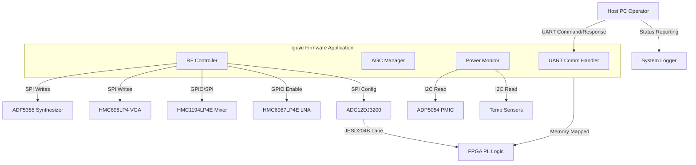
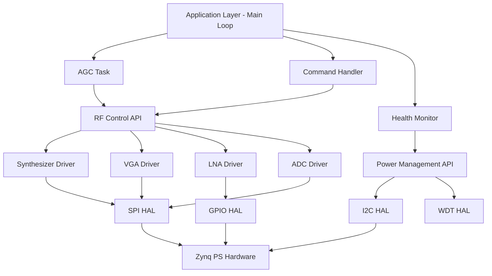
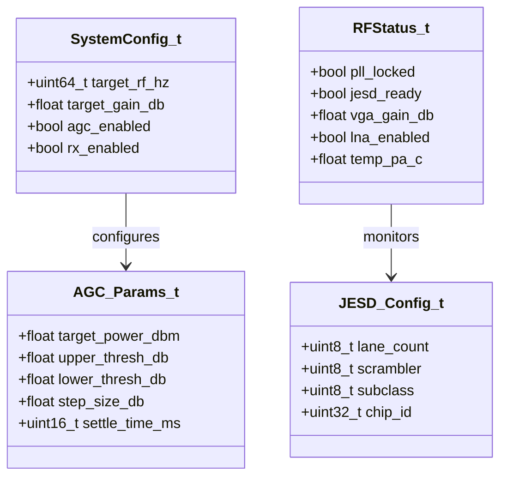
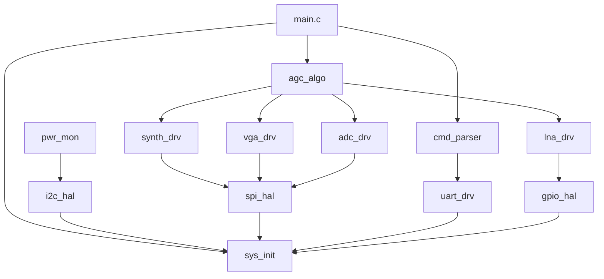
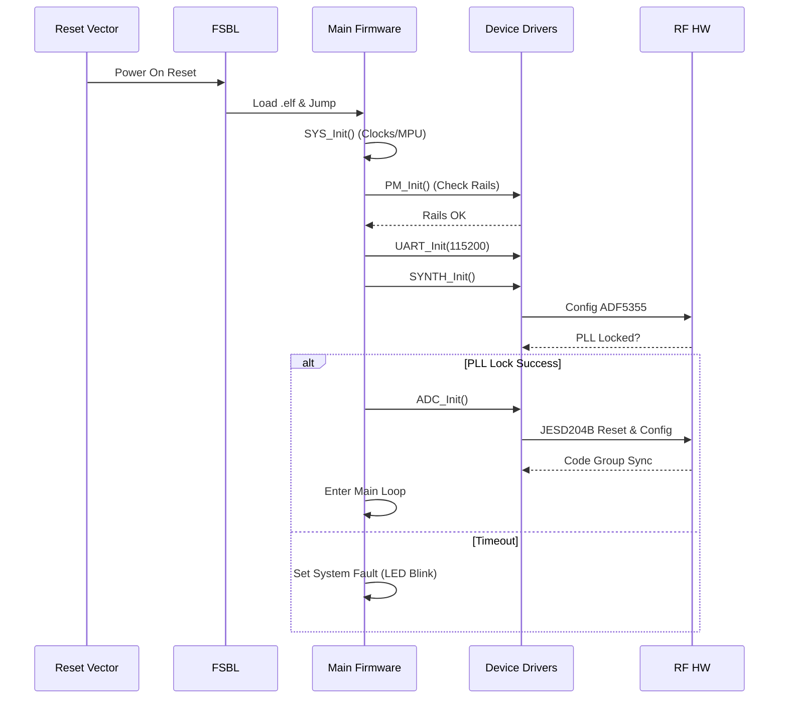
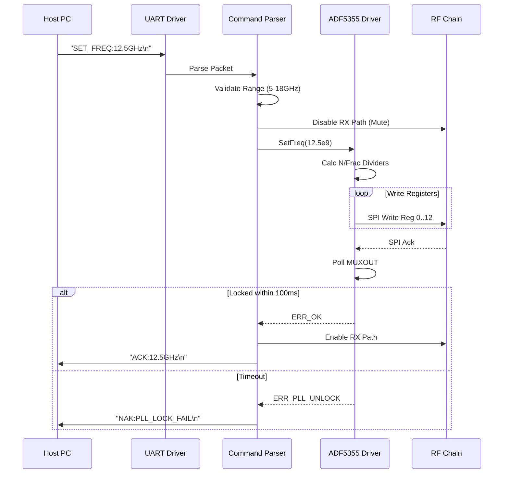
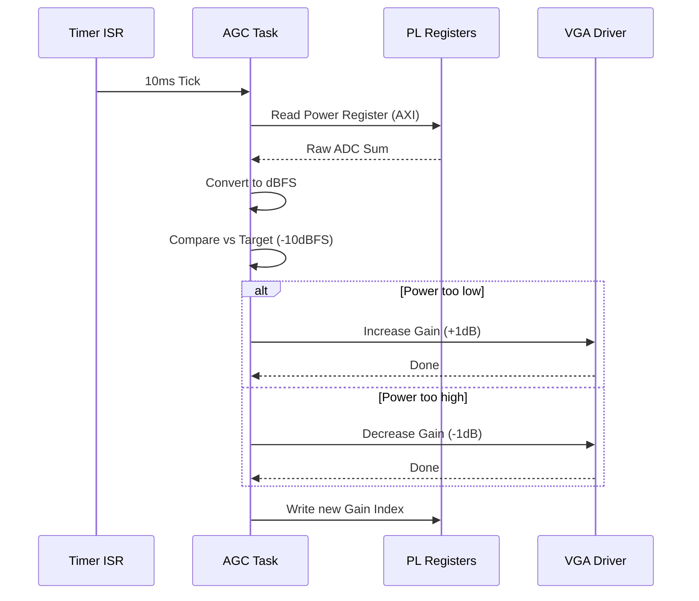
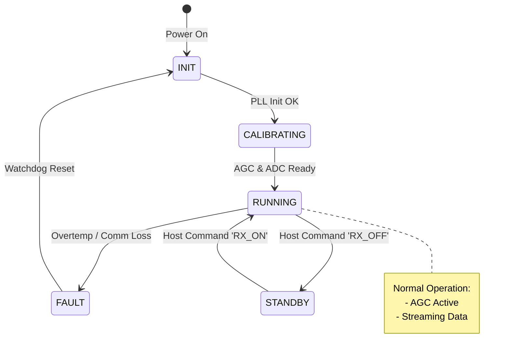
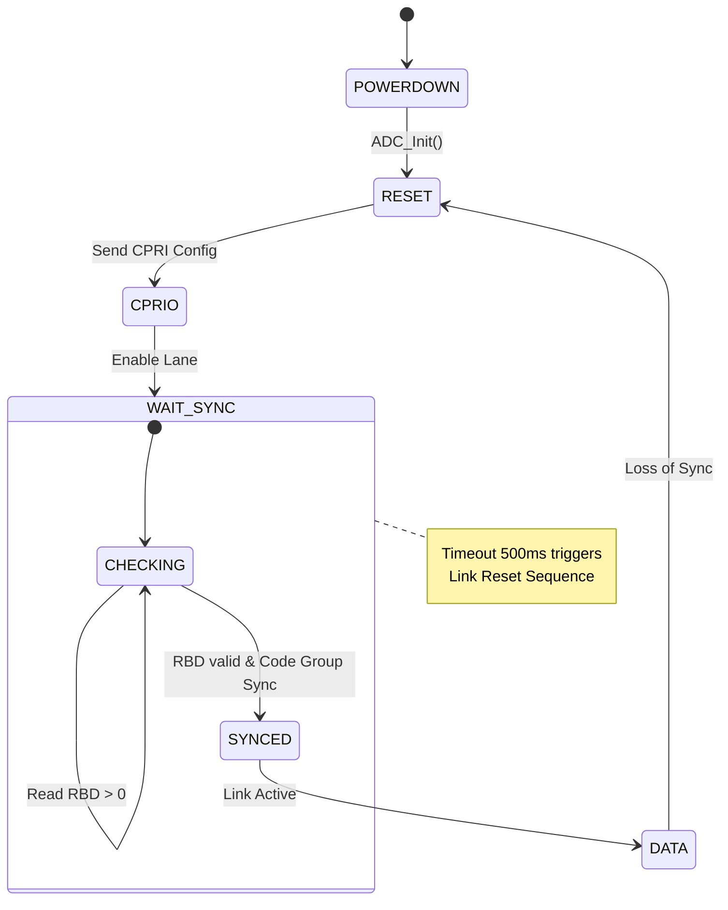
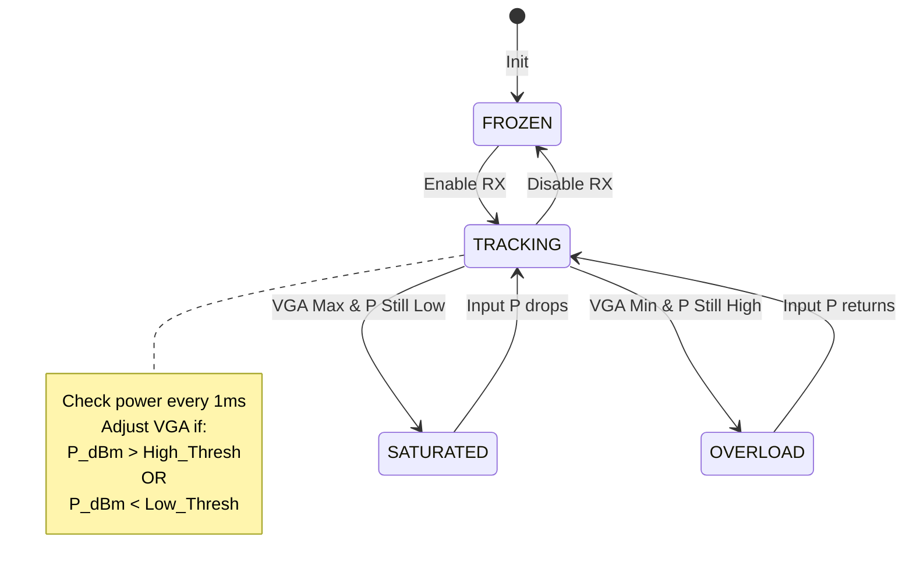

# Software Design Document (SDD)

**Project:** iguyc Wideband RF Receiver  
**Version:** 1.0  
**Date:** 15 April 2026  
**Author:** Lead Firmware Architect  
**Standard:** IEEE 1016-2009

---

## Document Control
| Version | Date | Author | Description |
|---------|------|--------|-------------|
| 1.0 | 15 April 2026 | System Architect | Initial baseline release for iguyc firmware |

---

# 1. Introduction

## 1.1 Purpose
This Software Design Document (SDD) details the structural and behavioral design of the embedded firmware for the **iguyc Wideband RF Receiver**. It serves as the blueprint for the implementation of the control software running on the Xilinx Zynq UltraScale+ Processing System (PS) and the associated logic in the Programmable Logic (PL).

The primary audience includes embedded firmware engineers, FPGA developers, and validation engineers. This document bridges the gap between the **iguyc Software Requirements Specification (SRS)** and the source code, defining the architecture, data structures, algorithms, and interfaces required to manage the RF chain (LNA, Mixer, VGA), Synthesizer (LO), and JESD204B ADC interface.

## 1.2 Scope
The design encompasses the following software layers:
1.  **Hardware Abstraction Layer (HAL):** Low-level drivers for SPI, I2C, UART, GPIO, and Timers specific to the XCZU9EG MPSOC.
2.  **Board Support Package (BSP):** Initialization of clocks, PLLs, and interrupt controllers.
3.  **Device Drivers:** Specific control logic for the ADF5355 (Synth), HMC698LP4 (VGA), HMC1194LP4E (Mixer), HMC6987LP4E (LNA), and ADC12DJ3200.
4.  **Application Layer:** Automatic Gain Control (AGC) algorithms, power state management, and fault handling.
5.  **Communication Layer:** UART command protocol and JESD204B link configuration.

**Exclusions:** High-level DSP algorithms (e.g., pulse compression, demodulation) are performed downstream and are not covered by this firmware design.

## 1.3 Definitions and Acronyms
| Term | Definition |
| :--- | :--- |
| **AGC** | Automatic Gain Control |
| **BIST** | Built-In Self Test |
| **CBUFF** | Capture Buffer (AXI-DMA) |
| **CPRI** | Common Public Radio Interface (Not used, referenced for compatibility) |
| **DAC** | Digital-to-Analog Converter |
| **DDL** | Device Design Layer |
| **EMIO** | Extended Multiplexed I/O |
| **FSBL** | First Stage Boot Loader |
| **FIFO** | First-In-First-Out Buffer |
| **FRU** | Field Replaceable Unit |
| **GTH** | High-speed transceiver bank in Zynq UltraScale+ |
| **HAL** | Hardware Abstraction Layer |
| **I2C** | Inter-Integrated Circuit |
| **IPC** | Inter-Process Communication |
| **IRQ** | Interrupt Request |
| **JESD** | JESD204B SerDes Standard |
| **LUT** | Look-Up Table |
| **MIO** | Multiplexed I/O |
| **NV** | Non-Volatile |
| **OB** | Octal Burst |
| **PCB** | Printed Circuit Board |
| **PL** | Programmable Logic (FPGA fabric) |
| **PS** | Processing System (ARM cores) |
| **RBF** | Raw Binary File |
| **RF** | Radio Frequency |
| **RTOS** | Real-Time Operating System (Bare-metal selected) |
| **Rx** | Receive |
| **SCLK** | Serial Clock |
| **SDR** | Software Defined Radio |
| **SFDR** | Spurious-Free Dynamic Range |
| **SPI** | Serial Peripheral Interface |
| **TCXO** | Temperature Compensated Crystal Oscillator |
| **TT** | Transaction Tracking |
| **UART** | Universal Asynchronous Receiver/Transmitter |
| **WDT** | Watchdog Timer |

## 1.4 References
1.  **IEEE 1016-2009:** Standard for Information Technology — Systems Design — Software Design Descriptions.
2.  **iguyc SRS Rev 1.0:** Software Requirements Specification, 15 April 2026.
3.  **iguyc GLR Rev 0V01:** Glue Logic Requirements, 15 April 2026.
4.  **iguyc HRS Rev 1.0:** Hardware Requirements Specification, 15 April 2026.
5.  **MISRA C:2012:** Guidelines for the use of the C language in critical systems.
6.  **Xilinx UG1087 (v2025.1):** Zynq UltraScale+ MPSoC Register Reference.
7.  **Analog Devices UG-586:** ADP5054 ACPI Register Map Reference.

---

# 2. Design Viewpoints

## 2.1 Context Viewpoint — System Boundaries

The iguyc firmware acts as the control agent between a Host PC (operator) and the analog RF hardware. The firmware interprets high-level commands (e.g., "Set Frequency," "Set Gain") and translates them into low-level register writes via SPI and GPIO.



**External Interfaces:**
*   **Host PC:** RS-232 UART Interface (115200 baud, 8N1).
*   **FPGA PL:** Memory-Mapped AXI-Lite Interface for control registers and HP (High Performance) ports for data capture.

## 2.2 Composition Viewpoint — Software Architecture

The firmware follows a layered architecture. The Application Layer is hardware-agnostic, communicating only through the defined HAL and Device Driver APIs.



### Module List with Responsibilities

#### 1. Module: `sys_init` (sys_init.c / sys_init.h)
*   **Responsibilities:** System startup, PS clock configuration (PLLs), MPU setup, and global exception vector initialization.
*   **Public API:**
    ```c
    int32_t SYS_Init(void);
    int32_t SYS_GetVersion(SysInfo_t* info);
    void SYS_ResetToBootloader(void);
    ```
*   **Internal State:** `SysState_t state`, `uint32_t error_code`.

#### 2. Module: `uart_driver` (uart_driver.c / uart_driver.h)
*   **Responsibilities:** Configuration of the UART controller, interrupt-driven TX/RX ring buffers, and framing of command packets.
*   **Public API:**
    ```c
    int32_t UART_Init(uint32_t baud_rate);
    int32_t UART_Transmit(const uint8_t* data, uint16_t len);
    int32_t UART_Receive(uint8_t* byte);
    bool UART_RxAvailable(void);
    void UART_ISR_Handler(void);
    ```
*   **Configuration:** Buffer size 256 bytes.

#### 3. Module: `spi_driver` (spi_driver.c / spi_driver.h)
*   **Responsibilities:** Generic SPI master driver supporting multiple chip selects (CS0-CS3) for controlling Synth, VGA, Mixer, and ADC.
*   **Public API:**
    ```c
    int32_t SPI_Init(uint32_t clock_hz);
    int32_t SPI_Transfer(SPI_Device_e dev, const uint8_t* tx, uint8_t* rx, uint16_t len);
    int32_t SPI_WriteReg(SPI_Device_e dev, uint8_t reg_addr, uint8_t data);
    ```

#### 4. Module: `adf5355_driver` (adf5355_driver.c / adf5355_driver.h)
*   **Responsibilities:** Configuration of the ADF5355 wideband synthesizer. Handles integer-N and fractional-N programming, VCO band selection, and muxout lock detection.
*   **Public API:**
    ```c
    int32_t SYNTH_Init(void);
    int32_t SYNTH_SetFreq(uint64_t freq_hz);
    bool SYNTH_IsLocked(void);
    void SYNTH_Enable(bool enable);
    ```

#### 5. Module: `hmc698_vga_driver` (hmc698_vga_driver.c / hmc698_vga_driver.h)
*   **Responsibilities:** Control of the HMC698LP4 VGA. Sets gain index based on lookup table.
*   **Public API:**
    ```c
    int32_t VGA_Init(void);
    int32_t VGA_SetGain(float gain_db);
    int32_t VGA_GetGain(float* current_gain_db);
    ```

#### 6. Module: `adc12dj3200_driver` (adc12dj3200_driver.c / adc12dj3200_driver.h)
*   **Responsibilities:** Initialization of the JESD204B PHY (subclass 1). Configures decimation, test patterns, and offset tuning.
*   **Public API:**
    ```c
    int32_t ADC_Init(void);
    int32_t ADC_Reset(void);
    int32_t ADC_SetJESDMode(JESD_Mode_e mode);
    int32_t ADC_StartLink(void);
    bool SYNTH_IsLocked(void);
    ```

#### 7. Module: `agc_algorithm` (agc_algorithm.c / agc_algorithm.h)
*   **Responsibilities:** Implements the closed-loop AGC state machine. Reads power estimates from the FPGA (via AXI register), calculates error, and adjusts VGA/LNA.
*   **Public API:**
    ```c
    void AGC_Init(AGC_Config_t* cfg);
    void AGC_Update(float power_mW); // Called periodically
    AGC_State_e AGC_GetState(void);
    ```

#### 8. Module: `pwr_monitor` (pwr_monitor.c / pwr_monitor.h)
*   **Responsibilities:** Monitors board currents and voltages via I2C PMIC (ADP5054) and temperature sensors. Triggers shutdown if thresholds exceeded.
*   **Public API:**
    ```c
    int32_t PM_Init(void);
    int32_t PM_ReadRail(uint8_t rail_id, float* voltage, float* current);
    bool PM_IsFaultActive(void);
    ```

## 2.3 Logical Viewpoint — Data Model

This section defines the key data structures exchanged between the RF Control Logic and the Hardware Abstraction Layer.



**Data Structure Definitions (C99):**

```c
/* RF Configuration Structure */
typedef struct {
    uint64_t rf_freq_hz;        /* Target Frequency: 5e9 - 18e9 */
    float    gain_db;           /* Target System Gain: 0.0 - 60.0 dB */
    bool     agc_enable;        /* AGC Loop Enable Flag */
    uint8_t  decimation_factor; /* ADC Decimation (1, 2, 4, 8) */
} SystemConfig_t;

/* Status Reporting Structure */
typedef struct {
    bool     pll_lock;          /* ADF5355 Lock Detect Status */
    bool     jesd_lane_sync;    /* ADC Code Group Sync Status */
    float    meas_gain_db;      /* Currently Measured Gain */
    float    supply_1v8;        /* 1.8V Rail Voltage */
    float    supply_5v0;        /* 5.0V Rail Voltage */
    float    fpga_temp;         /* FPGA Junction Temp (C) */
    uint32_t uptime_ms;         /* System Uptime in ms */
} RFStatus_t;

/* Error Code Enumeration */
typedef enum {
    ERR_OK = 0,
    ERR_TIMEOUT,
    ERR_SPI_COMM,
    ERR_I2C_COMM,
    ERR_PARAM_RANGE,
    ERR_PLL_UNLOCK,
    ERR_JESD_SYNC,
    ERR_HW_FAULT
} ErrorCode_t;
```

## 2.4 Dependency Viewpoint

The build dependency graph enforces the layered architecture. Application code cannot link directly against HAL low-level drivers, only Device Drivers.



## 2.5 Interface Viewpoint — Complete API Specification

### 2.5.1 SPI Driver API
*   **Function:** `SPI_Transfer`
*   **Purpose:** Perform full-duplex SPI transaction.
*   **Parameters:**
    *   `dev`: Enum of device (SYNTH, VGA, ADC, FLASH).
    *   `tx`: Pointer to transmit buffer.
    *   `rx`: Pointer to receive buffer (can be NULL).
    *   `len`: Number of bytes.
*   **Returns:** `int32_t` (ERR_OK or ERR_SPI_COMM).
*   **Thread Safety:** Not thread-safe. Must be guarded by mutex if used in RTOS (not applicable in bare-metal design).

### 2.5.2 Synthesizer Driver API
*   **Function:** `SYNTH_SetFreq`
*   **Purpose:** Calculates and loads the ADF5355 registers to generate the requested RF frequency.
*   **Algorithm:**
    1.  Calculate `RFout = (PD * VCO_freq) / (RF Divider)`.
    2.  Calculate `INT_FRAC` modulus for Fractional-N PLL.
    3.  Write Registers 0 through 12 (Sequence: 12, 11... 0).
    4.  Poll `MUXOUT` pin for Lock High.
*   **Error Handling:** Returns `ERR_PLL_UNLOCK` if timeout exceeds 100ms.

### 2.5.3 AGC Algorithm API
*   **Function:** `AGC_Update`
*   **Purpose:** Periodic callback to adjust gain.
*   **Input:** `float power_mW` (Derived from FPGA AXI register reading RMS power).
*   **Logic:**
    1.  Convert power to dBm.
    2.  `error = Target - Current`.
    3.  If `error > Threshold`: Increase VGA gain by `step_size`.
    4.  If `error < -Threshold`: Decrease VGA gain by `step_size`.
    5.  If VGA maxed out and still low: Enable LNA.
    6.  If VGA min and still high: Disable LNA.

## 2.6 Interaction Viewpoint — Sequence Diagrams

### System Startup Sequence


### Frequency Tuning Sequence


### AGC Adjustment Sequence


## 2.7 State Viewpoint — State Machines

### System State Machine


### JESD204B Link State Machine


### AGC State Machine


## 2.8 Algorithm Viewpoint

### 2.8.1 ADF5355 Frequency Calculation
The ADF5355 requires calculating the integer (INT) and fractional (FRAC) values for the PLL Feedback Divider.
$$ RF_{OUT} = f_{PFD} \times (INT + \frac{FRAC}{MOD}) $$

**Algorithm Steps:**
1.  Identify the VCO band for target `RF_OUT`.
2.  Set RF Divider (`RFdiv`) such that VCO freq is in range.
3.  Calculate `PFD` frequency based on reference clock (10 MHz) and R-Divider.
4.  Calculate `MOD` (typically $2^{25}$).
5.  Calculate `FRAC = (RF_{OUT} \times MOD / PFD) - (INT \times MOD)$.
6.  Convert `INT`, `FRAC`, `MOD` to register values.

### 2.8.2 Power RMS Calculation
The FPGA provides a sum of squares of 1024 samples.
$$ Power_{RMS} = \frac{1}{N} \sum_{n=0}^{N-1} x[n]^2 $$
**Firmware Implementation:**
```c
uint32_t sum_squares = AXI_REG_READ(POWER_SUM_ADDR);
// Convert raw sum to dBFS (Full Scale = 2048 for 12-bit ADC)
// Avoid log(0) by clamping minimum value
float sum_f = (float)sum_squares / 1024.0f;
float power_dbfs = 10.0f * log10f(sum_f + 1e-9f); // Approximation
```

---

# 3. Design Rationale

## 3.1 Architecture Choices

### Decision: Bare-Metal vs RTOS
*   **Choice:** Bare-metal (Super Loop) architecture.
*   **Rationale:** The iguyc system has deterministic timing requirements (AGC loop at 1kHz) but relatively low functional complexity (3-4 concurrent tasks). An RTOS adds overhead in context switching and certification (MISRA compliance). The chosen architecture utilizes the Zynq's two Cortex-R5 processors effectively; R5 #0 handles control/communications, R5 #1 (optional) or PL handles data flow.

### Decision: SPI Polling vs Interrupt driven for RF ICs
*   **Choice:** Interrupt-driven for UART (Host), Polling for RF ICs (Synth/VGA/ADC).
*   **Rationale:** RF tuning events are infrequent (ms to seconds scale) compared to the CPU speed. The overhead of setting up SPI DMA interrupts for every register write (during tuning sequences) outweighs the benefit. Interrupt-driven UART is critical to avoid dropping commands from the Host PC during high-throughput data logging.

### Decision: Fixed-Point vs Floating-Point Math
*   **Choice:** Floating-point (IEEE 754 single precision).
*   **Rationale:** The Zynq UltraScale+ R5 processor includes a hardware FPU. The AGC loop and frequency calculations involve dB conversions and logarithms which are significantly easier to implement and maintain in floating-point than fixed-point (Q-format), with negligible performance penalty on this hardware.

## 3.2 MISRA-C:2012 Compliance Strategy
All firmware source code will adhere to MISRA-C:2012 standards.
*   **Static Analysis:** PC-lint Plus or Coverity configured for MISRA enforcement.
*   **Coding Standard:**
    *   All macro definitions protected by parentheses.
    *   No implicit type conversions (use explicit casts).
    *   `char` type explicitly defined as `uint8_t`.
    *   Functions restricted to one entry/exit point (single `return`).
*   **Justification:** Deviations will be documented if required for hardware register access (e.g., type-punning for address mapping).

---

# 4. Design Traceability Matrix

| SDD Component / Function | Maps to SRS Requirement | Traceability ID |
| :--- | :--- | :--- |
| `SPI_Transfer()` | REQ-SW-005: SPI Interface Control | SPI-001 |
| `ADF5355_SetFreq()` | REQ-SW-010: LO Frequency Programming | LO-001 |
| `AGC_Update()` | REQ-SW-020: Automatic Gain Control Loop | AGC-001 |
| `ADC12DJ3200_Init()` | REQ-SW-015: JESD204B Initialization | ADC-001 |
| `PM_IsFaultActive()` | REQ-SW-025: Power Monitoring | PWR-001 |
| `UART_Receive()` | REQ-SW-030: Host Command Interface | UART-001 |
| `SYS_Init()` | REQ-SW-001: System Startup | SYS-001 |
| `VGA_SetGain()` | REQ-SW-012: VGA Gain Control | VGA-001 |
| JESD State Machine | REQ-SW-016: Link Stability | JESD-002 |

---

# 5. Appendices

## Appendix A — File Structure
```
/project_iguyc_sw
├── inc/
│   ├── sys_init.h
│   ├── uart_driver.h
│   ├── spi_driver.h
│   ├── i2c_driver.h
│   ├── gpio_driver.h
│   ├── adf5355_driver.h
│   ├── hmc698_vga_driver.h
│   ├── adc12dj3200_driver.h
│   ├── agc_algorithm.h
│   └── pwr_monitor.h
├── src/
│   ├── main.c
│   ├── sys_init.c
│   ├── uart_driver.c
│   ├── spi_driver.c
│   ├── i2c_driver.c
│   ├── gpio_driver.c
│   ├── adf5355_driver.c
│   ├── hmc698_vga_driver.c
│   ├── adc12dj3200_driver.c
│   ├── agc_algorithm.c
│   └── pwr_monitor.c
├── test/
│   ├── unit_test_runner.c
│   └── mocks/
└── docs/
    ├── SDD
    └── SRS
```

## Appendix B — Register Map (Partial)

| Module | Reg Address | Name | Bit Fields | Description |
| :--- | :--- | :--- | :--- | :--- |
| **SPI_CTRL** | 0xFF0F0000 | CR | [31] RESET, [16] START | SPI Master Control |
| **UART0** | 0xFF010000 | SR | [0] TX_EMPTY | UART Status Register |
| **GTH_RX** | 0xA0000000 | STAT | [0] ALIGNED | JESD GTH Align Status |
| **ADC_PWR** | 0xA0010000 | CTRL | [0] ADC_EN | ADC Power Down (1=On) |
| **PMIC_I2C** | 0xFF020000 | DATA | [7:0] BYTE | I2C Data Register |

## Appendix C — Memory Map

| Region | Start | End | Size | Attribute |
| :--- | :--- | :--- | :--- | :--- |
| **Code (Flash)** | 0x00000000 | 0x0007FFFF | 512 KB | Read-Only |
| **Data (DDR)** | 0x00000000 | 0x3FFFFFFF | 1 GB | R/W (Non-Cacheable) |
| **PL AXI-Lite** | 0xA0000000 | 0xAFFFFFFF | 256 MB | PL Control Regs |
| **PS Periphs** | 0xFF000000 | 0xFFFFFFFF | 16 MB | PS MIO/EMIO |

## Appendix D — Coding Standards Checklist
*   [ ] Indentation: Spaces (4), no Tabs.
*   [ ] Braces: K&R style (`if (...) {\n`).
*   [ ] Comments: Doxygen style (`/**`, `///`).
*   [ ] Variables: `snake_case`.
*   [ ] Defines: `UPPER_CASE`.
*   [ ] Functions: `PascalCase`.
*   [ ] Max Line Length: 120 chars.

## Appendix E — Verification Strategy
1.  **Unit Testing:** Use CMocka/Unity framework to test driver logic (e.g., `SPI_Transfer` mocked, `VGA_SetGain` logic verified).
2.  **Integration Testing:** Target hardware tests using a loopback dongle on the SPI bus to verify read/write integrity.
3.  **System Testing:** Real-time spectrum analysis of RF output while executing Host commands to verify gain steps and frequency accuracy.

---