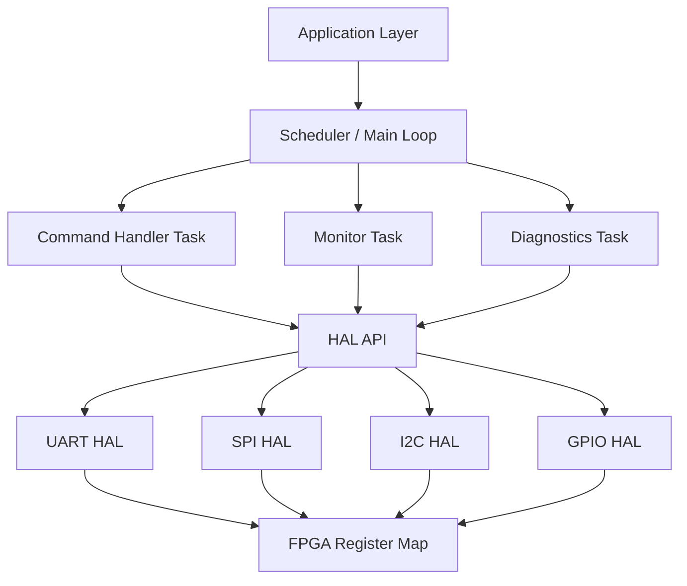
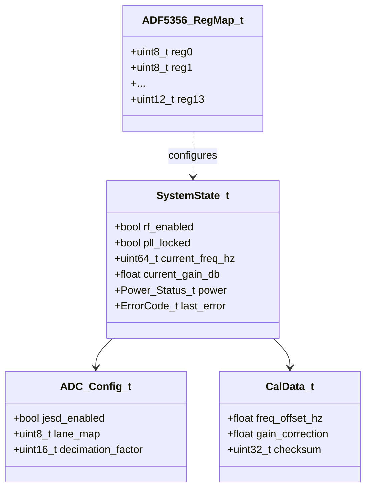
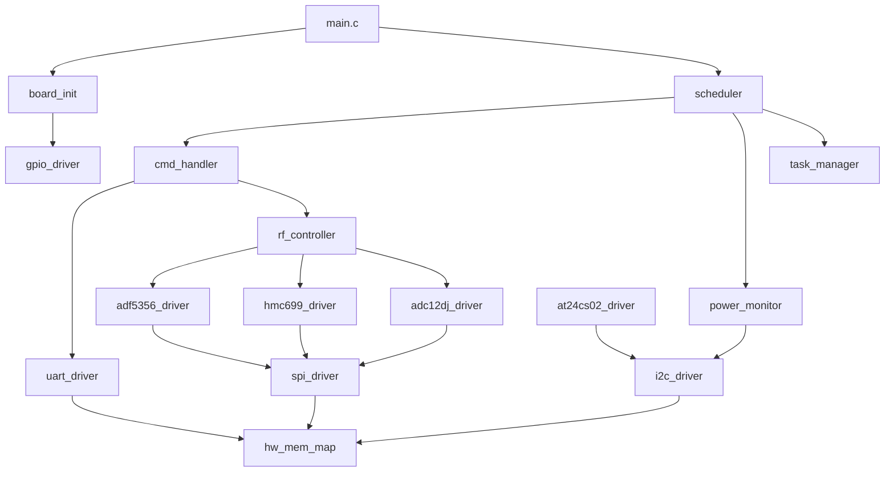
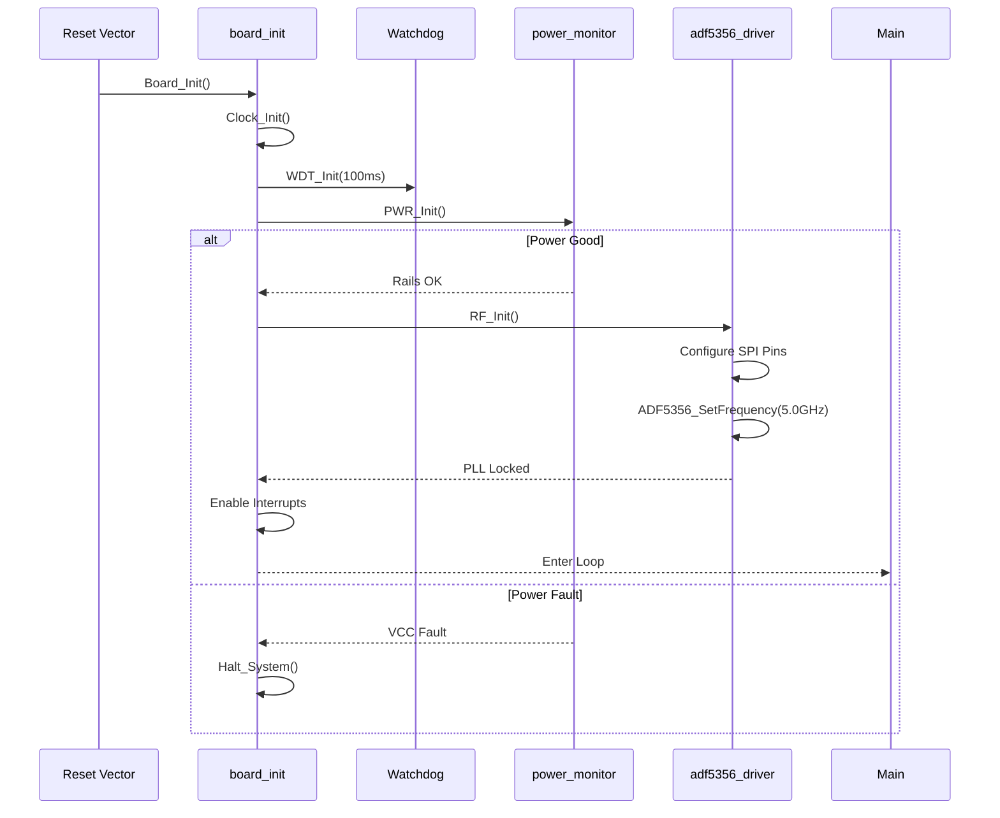
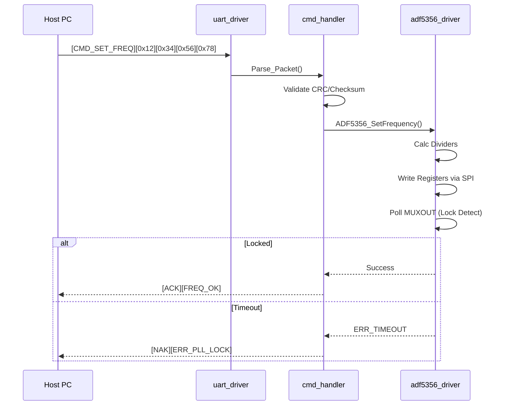
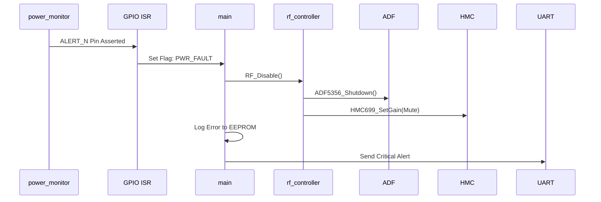
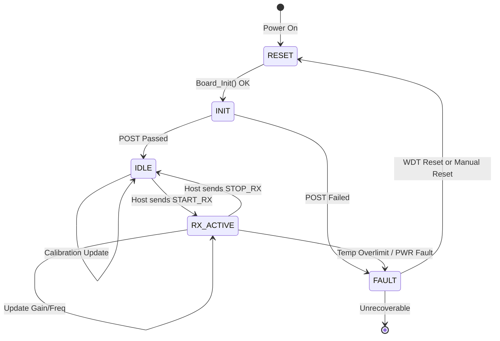
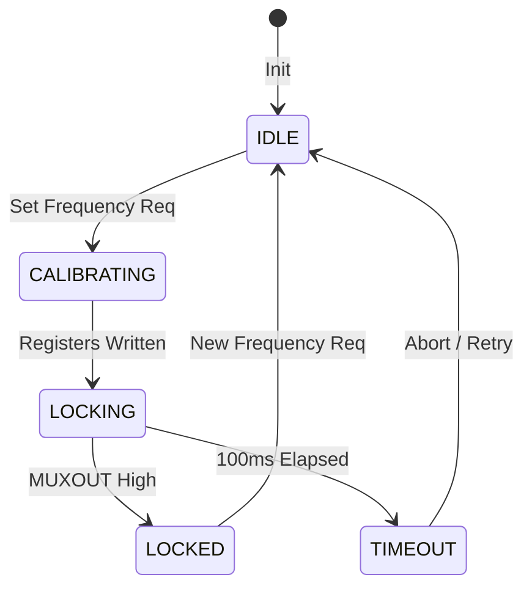

# Software Design Document (SDD)

## Document Control
| Version | Date | Author | Description |
|---------|------|--------|-------------|
| 1.0 | 16 April 2026 | Lead Firmware Architect | Initial design for j,fj Wideband RF Receiver |

---

# 1. Introduction

## 1.1 Purpose
This Software Design Document (SDD) provides the comprehensive structural design for the **j,fj Wideband RF Receiver Firmware**. It translates the requirements specified in the *j,fj SRS (v1.0)* and the hardware interfaces defined in the *j,fj HRS* and *GLR (v0V01)* into a concrete, implementation-ready software architecture.

The intended audience includes:
*   **Firmware Engineers:** Implementing the embedded C software.
*   **RTL Engineers:** Designing the FPGA glue logic (testbench interaction).
*   **Test Engineers:** Developing verification scripts and automated test equipment (ATE) routines.
*   **System Integrators:** Integrating the firmware onto the final hardware assembly.

## 1.2 Scope
The software design covers the complete control firmware operating on the embedded controller (Soft-Core/Hard-Core MCU within the FPGA fabric).
*   **Included:** BSP layer, Hardware Abstraction Layer (HAL) for SPI/UART/I2C, RF component drivers (ADF5356, HMC699LP4, ADC12DJ3200), Power Management, and the Command/Response Protocol handler.
*   **Excluded:** High-throughput signal processing DSP chains (handled by dedicated FPGA logic), Host PC GUI application source code (only protocol definition is included).

**Target Hardware:** Xilinx Zynq UltraScale+ (or equivalent soft-core) embedded within the j,fj RF Module.
**Toolchain:** ARM GCC / Xilinx Vitis with MISRA C:2012 compliance enabled.

## 1.3 Definitions and Acronyms
| Term | Definition |
| :--- | :--- |
| **ADC** | Analog-to-Digital Converter (ADC12DJ3200) |
| **API** | Application Programming Interface |
| **BOM** | Bill of Materials |
| **BRAM** | Block RAM |
| **BSP** | Board Support Package |
| **CPLD** | Complex Programmable Logic Device |
| **CRC** | Cyclic Redundancy Check |
| **CS** | Chip Select (SPI) |
| **DAC** | Digital-to-Analog Converter |
| **DBG** | Debug |
| **DMA** | Direct Memory Access |
| **EEPROM** | Electrically Erasable Programmable Read-Only Memory |
| **EMC** | Electromagnetic Compatibility |
| **ESD** | Electrostatic Discharge |
| **FIFO** | First-In-First-Out |
| **FPGA** | Field-Programmable Gate Array |
| **FSM** | Finite State Machine |
| **GLR** | Glue Logic Requirements |
| **GPIO** | General Purpose Input/Output |
| **HAL** | Hardware Abstraction Layer |
| **HRS** | Hardware Requirements Specification |
| **I2C** | Inter-Integrated Circuit |
| **ICD** | Interface Control Document |
| **IF** | Intermediate Frequency |
| **ISR** | Interrupt Service Routine |
| **JTAG** | Joint Test Action Group |
| **LNA** | Low Noise Amplifier (HMC1113) |
| **LO** | Local Oscillator (ADF5356) |
| **LVDS** | Low-Voltage Differential Signaling |
| **MCU** | Microcontroller Unit |
| **MISRA** | Motor Industry Software Reliability Association |
| **NCO** | Numerically Controlled Oscillator |
| **NVM** | Non-Volatile Memory |
| **PCB** | Printed Circuit Board |
| **PLL** | Phase-Locked Loop |
| **POST** | Power-On Self-Test |
| **RF** | Radio Frequency |
| **Rx** | Receive |
| **SPI** | Serial Peripheral Interface |
| **SRS** | Software Requirements Specification |
| **TRP** | Transmit/Receive Point (RF Control) |
| **UART** | Universal Asynchronous Receiver-Transmitter |
| **VCC** | Voltage Common Collector |
| **VGA** | Variable Gain Amplifier (HMC699LP4) |
| **WDT** | Watchdog Timer |

## 1.4 References
1.  **IEEE 1016-2009:** Standard for Information Technology — Systems Design — Software Design Descriptions.
2.  **SRS (j,fj):** Software Requirements Specification, Rev 1.0, 16 April 2026.
3.  **HRS (j,fj):** Hardware Requirements Specification, Rev 1.0.
4.  **GLR (j,fj):** Glue Logic Requirements, Rev 0V01.
5.  **MISRA C:2012:** Guidelines for the Use of the C Language in Critical Systems.
6.  **Datasheets:** ADF5356, HMC699LP4, HMC1113, ADC12DJ3200, AT24CS02.
7.  **JEDEC Standard:** JESD204B (Transport Layer).

---

# 2. Design Viewpoints

## 2.1 Context Viewpoint — System Boundaries

The software serves as the control plane for the RF hardware. The primary external actor is the Host PC (or Operator) sending commands via UART. The controlled entities include the RF Chain (Synthesizer, VGA, LNA) and the Data Path (ADC).

```mermaid
graph TD
    HOST[Host Control PC] -->|UART 115200 8N1| UART_IF[UART Interface Driver]
    
    subgraph j,fj Firmware
        CTRL[Controller Core] --> CMD[Cmd Parser]
        CMD --> RF_DRV[RF Driver Manager]
        CMD --> PM_PWR[Power Manager]
        CMD --> NVM[NVM Manager]
        
        RF_DRV --> SPI_DRV[SPI Driver]
        PM_PWR --> I2C_DRV[I2C Driver]
        CTRL --> WDT[Watchdog Manager]
    end
    
    SPI_DRV --> ADF5356[ADF5356 Synthesizer]
    SPI_DRV --> HMC699[HMC699LP4 VGA]
    SPI_DRV --> ADC_INT[ADC12DJ3200 Interface]
    
    I2C_DRV --> EEPROM[AT24CS02 EEPROM]
    I2C_DRV --> PWR[Power Monitor IC]
    
    CTRL --> GPIO_DRV[GPIO Driver]
    GPIO_DRV --> LNA[HMC1113 LNA Enable]
```

**External Interfaces:**
*   **Host Interface:** UART (Request/Response protocol). Commands include frequency tuning, gain setting, and status queries.
*   **Debug Interface:** JTAG (Standard ARM debug port).
*   **RF Hardware:** SPI (Master), GPIO (LNA Enable/TRP Control).
*   **Storage:** I2C (Master) for EEPROM.

## 2.2 Composition Viewpoint — Software Architecture

The software adopts a layered architecture: Application Layer (Logic), Driver Layer (HAL), and Hardware Layer (Register Access).



### 2.2.1 Module List with Responsibilities

**Module: board_init** (board_init.c / board_init.h)
*   **Responsibilities:** System startup, clock tree verification, MPU configuration, and peripheral enablement.
*   **Public API:**
```c
/**
 * @brief Initialize the board hardware and peripherals.
 * @return ERR_OK on success, error code on failure.
 */
int32_t Board_Init(void);

/**
 * @brief Perform Power-On Self-Test (POST).
 * @param results Pointer to store test result mask.
 * @return ERR_OK if all non-critical tests pass.
 */
int32_t Board_RunPOST(uint32_t *results);
```

**Module: uart_driver** (uart_driver.c / uart_driver.h)
*   **Responsibilities:** Manage the FPGA-based UART core. Handle interrupts, RX/TX FIFOs, and baud rate generation.
*   **Internal State:** 
```c
typedef struct {
    volatile uint32_t base_addr;
    uint32_t baud_rate_divisor;
    uint8_t rx_buffer[256];
    uint16_t rx_head;
    uint16_t rx_tail;
} UART_Context_t;
```
*   **Public API:**
```c
int32_t UART_Init(uint32_t base_addr, uint32_t baud_rate);
int32_t UART_ReadByte(uint8_t *data);
int32_t UART_WriteByte(uint8_t data);
void    UART_RxISR(void); // Interrupt Handler
```

**Module: spi_driver** (spi_driver.c / spi_driver.h)
*   **Responsibilities:** Multi-master SPI controller for configuring RFICs. Handles CS assertion and clock polarity (CPOL/CPHA).
*   **Public API:**
```c
int32_t SPI_Init(uint32_t base_addr);
int32_t SPI_Transfer(uint8_t chip_select, const uint8_t *tx_buf, uint8_t *rx_buf, uint16_t len);
// Helper for 24-bit write (common for ADF5356)
int32_t SPI_WriteReg24(uint8_t cs, uint8_t reg_addr, uint32_t data);
```

**Module: adf5356_driver** (adf5356.c / adf5356.h)
*   **Responsibilities:** Control the ADF5356 Microwave Wideband Synthesizer. Calculates Integer-N/Fractional-N dividers and programs registers.
*   **Public API:**
```c
typedef struct {
    uint64_t freq_hz; // Output Frequency
    uint32_t pfd_freq; // Phase Detector Frequency
    uint8_t  muxout;
} ADF5356_Config_t;

int32_t ADF5356_Init(uint32_t spi_cs_id);
int32_t ADF5356_SetFrequency(uint64_t target_freq_hz);
bool    ADF5356_IsLocked(void);
```

**Module: hmc699_driver** (hmc699.c / hmc699.h)
*   **Responsibilities:** Control the HMC699LP4 VGA. Sets gain index and enables/disables the device.
*   **Public API:**
```c
int32_t HMC699_Init(uint32_t spi_cs_id);
int32_t HMC699_SetGain(int8_t gain_index); // Range -31.5dB to +0dB in 0.5dB steps
int32_t HMC699_Enable(bool enable);
```

**Module: adc12dj_driver** (adc12dj_driver.c / adc12dj_driver.h)
*   **Responsibilities:** Configuration of the ADC12DJ3200 (JESD204B subclass, test patterns, gain).
*   **Public API:**
```c
int32_t ADC12DJ_Init(void);
int32_t ADC12DJ_SoftReset(void);
int32_t ADC12DJ_SetTestPattern(ADC12DJ_Pattern_e pattern);
int32_t ADC12DJ_ReadTemp(float *temp_c);
```

**Module: eeprom_driver** (at24cs02.c / at24cs02.h)
*   **Responsibilities:** Read/Write access to calibration data and MAC addresses over I2C.
*   **Public API:**
```c
int32_t EEPROM_Init(void);
int32_t EEPROM_WriteByte(uint16_t addr, uint8_t data);
int32_t EEPROM_ReadByte(uint16_t addr, uint8_t *data);
int32_t EEPROM_ReadCalibration(Calibration_t *cal);
```

**Module: power_monitor** (power_monitor.c / power_monitor.h)
*   **Responsibilities:** Monitor 5V, 3.3V, 1.8V, and 1.0V rails.
*   **Internal State:**
```c
typedef struct {
    float rail_5v;
    float rail_3v3;
    float rail_1v8;
    float rail_1v0;
    bool over_voltage_fault;
    bool under_voltage_fault;
} Power_Status_t;
```

## 2.3 Logical Viewpoint — Data Model

This section defines the key data structures exchanged between modules.



**Key Data Structures:**
```c
typedef enum {
    SYS_STATE_RESET = 0,
    SYS_STATE_INIT,
    SYS_STATE_IDLE,
    SYS_STATE_RX_ACTIVE,
    SYS_STATE_FAULT
} SystemState_e;

typedef struct {
    SystemState_e state;
    uint64_t rf_freq_hz;
    float if_gain_db;
    uint16_t adc_sample_rate_mhz;
    uint8_t device_id[4];
} SystemContext_t;
```

## 2.4 Dependency Viewpoint — Module Dependencies



## 2.5 Interface Viewpoint — Complete API Specification

**Specification: SPI_WriteReg24**

```c
/**
 * @brief Write a 24-bit register to an SPI device.
 * 
 * This function performs a standard 3-byte SPI write transaction. It manages
 * the Chip Select (CS) line to ensure isolated bus transactions. It utilizes
 * the HAL defined in the GLR (0V01) for SPI access.
 *
 * @param cs_id    Target Chip Select ID (0=ADC, 1=ADF5356, 2=HMC699).
 * @param reg_addr 8-bit Register Address.
 * @param data     24-bit Data to be written.
 * 
 * @return int32_t ERR_OK (0) on success.
 * @return ERR_INVALID_PARAM if cs_id is invalid.
 * @return ERR_HARDWARE if SPI timeout occurs.
 * 
 * @pre SPI_Init() must have been called successfully.
 * @post Register 'reg_addr' on the target device contains 'data'.
 *
 * @thread_safety Not thread-safe. Caller must use mutex if sharing SPI bus between tasks.
 */
int32_t SPI_WriteReg24(uint8_t cs_id, uint8_t reg_addr, uint32_t data);
```

**Specification: UART_CmdProcess**

```c
/**
 * @brief Process a single command frame from the UART RX buffer.
 * 
 * Implements the state machine for the protocol defined in SRS 3.1.1.
 * 
 * @return int32_t Number of bytes processed, or error code.
 */
int32_t UART_CmdProcess(void);
```

## 2.6 Interaction Viewpoint — Sequence Diagrams

**System Initialization Sequence:**



**Host Command: Set Frequency (SRS 3.1.2):**



**Fault Detection Sequence:**



## 2.7 State Viewpoint — State Machines

**Main System Controller State Machine:**



**ADF5356 Frequency Synthesizer State:**



## 2.8 Algorithm Viewpoint — Key Algorithms

### 2.8.1 ADF5356 Frequency Calculation
*Goal:* Calculate Integer-N (INT) and Fractional (FRAC) values for a given $F_{out}$ and $PFD_{freq}$.
*Inputs:* $F_{out} = 5500$ MHz, $PFD = 25$ MHz.
*Constraints:* $N = INT + \frac{FRAC}{MOD}$.
*Algorithm (Simplified):*
1.  Set prescaler (8/9) based on frequency bands (defined in ADF5356 Datasheet Table).
2.  Calculate $N_{frac} = \frac{F_{out}}{PFD}$.
3.  $INT = \lfloor N_{frac} \rfloor$.
4.  $FRAC = (N_{frac} - INT) \times MOD$ (where MOD is fixed, e.g., $2^{25}$ or $16777216$).
5.  Apply $\Sigma-\Delta$ modulation order (typically 3rd or 4th order).

### 2.8.2 CRC-16 Calculation for EEPROM
Polynomial: $0x8005$ (Standard CRC-16).
Used to verify integrity of calibration blocks in AT24CS02.

## 2.9 Resource Viewpoint — Real-Time Constraints

### 2.9.1 Task Scheduling Table
*Target MCU: 200 MHz RISC-V/ARM.*

| Task Name | Period | Worst-Case Exec Time | Priority | Deadline | CPU Load |
|-----------|--------|---------------------|----------|----------|---------|
| Main Loop | 1ms | 50 us | Med | 1ms | 5% |
| UART Rx Service | Event | 10 us | High | < 1 byte time | 2% |
| SPI Transaction | Event | 200 us (per reg) | High | < 10ms | 10% |
| Power Monitor | 100 ms | 30 us | Low | 100 ms | 0.03% |
| Watchdog Pet | 10 ms | 5 us | High | 100 ms | 0.5% |
| Temp Monitor | 1000 ms | 100 us | Low | 1000 ms | 0.01% |

### 2.9.2 ISR Latency Budget
| Interrupt Source | Latency Requirement | Worst-Case Measured | Margin |
|-----------------|--------------------|--------------------|--------|
| UART RX (115200) | < 870 us (1 byte) | 50 us | 94% |
| SPI Tx Complete | < 100 us | 60 us | 40% |
| Power Fail Alert | < 1 ms | 20 us | 98% |

### 2.9.3 Memory Budget
*Total SRAM: 64 KB (Zynq OCM)*

| Region | Total Available | Used | Remaining |
|--------|----------------|------|-----------|
| Code (Flash) | 512 KB | 128 KB | 384 KB |
| Data (SRAM) | 64 KB | 12 KB | 52 KB |
| Stacks (4 tasks) | 8 KB | 4 KB | 4 KB |
| Buffers | 4 KB | 2 KB | 2 KB |

## 2.10 Build System Viewpoint

### 2.10.1 CMakeLists.txt Structure

```cmake
cmake_minimum_required(VERSION 3.20)
project(jfj_firmware VERSION 1.0.0 LANGUAGES C ASM)

set(CMAKE_C_STANDARD 11)
set(CMAKE_C_FLAGS "${CMAKE_C_FLAGS} -Wall -Wextra -Wpedantic")

# MISRA Compliance Settings (Example)
set(CMAKE_C_FLAGS "${CMAKE_C_FLAGS} --strict")

# Hardware Definitions
target_compile_definitions(jfj_firmware PRIVATE
    FPGA_CLK_FREQ_HZ=125000000
    UART_BAUD=115200
)

# Sources
set(SOURCES
    src/main.c
    src/board/board_init.c
    src/drivers/uart_driver.c
    src/drivers/spi_driver.c
    src/drivers/i2c_driver.c
    src/drivers/gpio_driver.c
    src/rf/adf5356.c
    src/rf/hmc699.c
    src/rf/adc12dj.c
    src/app/cmd_handler.c
    src/app/power_monitor.c
    src/utils/crc16.c
)

add_executable(firmware.elf ${SOURCES})

# Linker Script
target_link_options(firmware.elf PRIVATE -T ${CMAKE_SOURCE_DIR}/lds/linker.ld)

# Qt6 GUI (Host Side - Optional Build)
find_package(Qt6 QUIET)
if(Qt6_FOUND)
    add_subdirectory(gui/qt_host_tool)
endif()

# Unit Tests
enable_testing()
add_subdirectory(tests)
```

### 2.10.2 Unit Test Infrastructure (tests/CMakeLists.txt)
```cmake
find_package(GTest REQUIRED)

add_executable(test_drivers
    test/test_uart.cpp
    test/test_adf5356.cpp
    mock/mock_spi.cpp
)

target_link_libraries(test_drivers PRIVATE GTest::gtest_main)
gtest_discover_tests(test_drivers)
```

---

# 3. Design Rationale

## 3.1 Architecture Choices

1.  **Bare-Metal vs RTOS:**
    *   **Decision:** Bare-metal with a simple cooperative scheduler.
    *   **Rationale:** The j,fj application is primarily reactive (interrupt-driven) and deterministic. The complexity of an RTOS is not justified given the single-threaded nature of SPI command sequences (must not be preempted during transaction). Using a bare-metal loop ensures predictable timing for SPI transactions critical to ADF5356 lock times.

2.  **Polled vs Interrupt SPI:**
    *   **Decision:** Interrupt-driven SPI with a completion queue.
    *   **Rationale:** While SPI is fast, the system must handle high-priority UART Rx and Power Fail interrupts. Polled SPI blocks the CPU, risking WDT misses or UART Rx overflows.

3.  **Register Access:**
    *   **Decision:** Memory-mapped struct pointers (C99 volatile).
    *   **Rationale:** Standard practice for embedded systems. Provides compile-time type checking (vs. raw integer offsets) and allows direct mapping to the GLR definitions.

## 3.2 MISRA-C:2012 Compliance
*   **Static Analysis:** Integration of PC-lint Plus into the CI pipeline.
*   **Runtime Checking:** Assertions (`assert.h`) are disabled in production builds but active in debug builds.
*   **Memory:** All dynamic allocation (`malloc`/`free`) is forbidden. All large buffers are static or allocated on the stack.
*   **Safe Math:** Use of `stdint.h` types. Bitwise operators used only on unsigned integers.

---

# 4. Design Traceability Matrix

| SDD Component | Implements REQ-SW-xxx | Design Element |
|--------------|----------------------|----------------|
| `board_init.c` | REQ-SW-001 | System Initialization |
| `uart_driver.c` | REQ-SW-012, REQ-SW-013 | UART Read/Write |
| `cmd_handler.c` | REQ-SW-011 | Command Parsing |
| `spi_driver.c` | REQ-SW-020 | SPI Bus Master |
| `adf5356.c` | REQ-SW-030, REQ-SW-031 | PLL Frequency Tuning |
| `hmc699.c` | REQ-SW-040 | VGA Gain Control |
| `adc12dj_driver.c` | REQ-SW-050 | ADC Config/Test Mode |
| `power_monitor.c` | REQ-SW-060 | Rail Monitoring |
| `eeprom_driver.c` | REQ-SW-070 | Calibration Storage |
| `watchdog.c` | REQ-SW-090 | Fault Recovery |

---

# 5. Appendices

## Appendix A — File Structure
```
firmware/
├── CMakeLists.txt
├── lds/
│   └── linker.ld
├── src/
│   ├── main.c
│   ├── board/
│   │   ├── board_init.c
│   │   └── board_config.h
│   ├── drivers/
│   │   ├── uart_driver.c
│   │   ├── spi_driver.c
│   │   ├── i2c_driver.c
│   │   └── gpio_driver.c
│   ├── rf/
│   │   ├── adf5356.c
│   │   ├── hmc699.c
│   │   └── adc12dj.c
│   ├── app/
│   │   ├── cmd_handler.c
│   │   └── power_monitor.c
│   └── utils/
│       ├── crc16.c
│       └── ring_buffer.c
└── tests/
    └── test_rf_drivers.cpp
```

## Appendix B — Register Map Summary (Derived from GLR)
| Base Address | Offset | Name | Access | Reset |
|--------------|--------|------|--------|-------|
| 0x8000_0000 | 0x00 | UART_BAUD_DIV | RW | 0x0045 |
| 0x8000_0000 | 0x02 | UART_CTRL | RW | 0x0000 |
| 0x8000_0000 | 0x08 | UART_RX_DATA | RO | 0x0000 |
| 0x8000_1000 | 0x00 | SPI_CTRL | RW | 0x0000 |
| 0x8000_1000 | 0x04 | SPI_TX_DATA | WO | - |
| 0x8000_1000 | 0x08 | SPI_RX_DATA | RO | 0x0000 |
| 0x8000_2000 | 0x00 | GPIO_DIR | RW | 0xFFFF |
| 0x8000_2000 | 0x04 | GPIO_DATA | RW | 0x0000 |
| 0x8000_3000 | 0x00 | I2C_CTRL | RW | 0x0000 |
| 0x8000_3000 | 0x04 | I2C_DATA | RW | 0x0000 |
| 0xA000_0000 | - | BRAM_RF_CONFIG | RW | - |

## Appendix C — Memory Map
| Region | Start Address | Size | Usage |
|--------|--------------|------|-------|
| Code Flash | 0x0000_0000 | 512 KB | Firmware Code |
| SRAM (OCM) | 0x0001_0000 | 64 KB | Stack/Data/BSS |
| FPGA Registers | 0x8000_0000 | 4 KB | Peripherals |
| EEPROM (I2C) | 0x50 | 2 Kb | Cal Data |

## Appendix D — Coding Standards Checklist
*   [ ] All public functions documented in header with Doxygen.
*   [ ] No dynamic memory allocation.
*   [ ] Cyclomatic complexity < 15.
*   [ ] All returns checked (ERR_OK vs Error).
*   [ ] No magic numbers (use #defines or enums).
*   [ ] Types from `<stdint.h>` used exclusively.