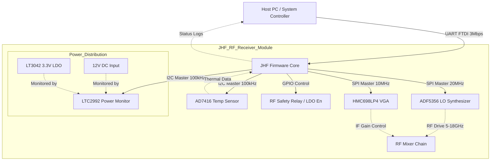
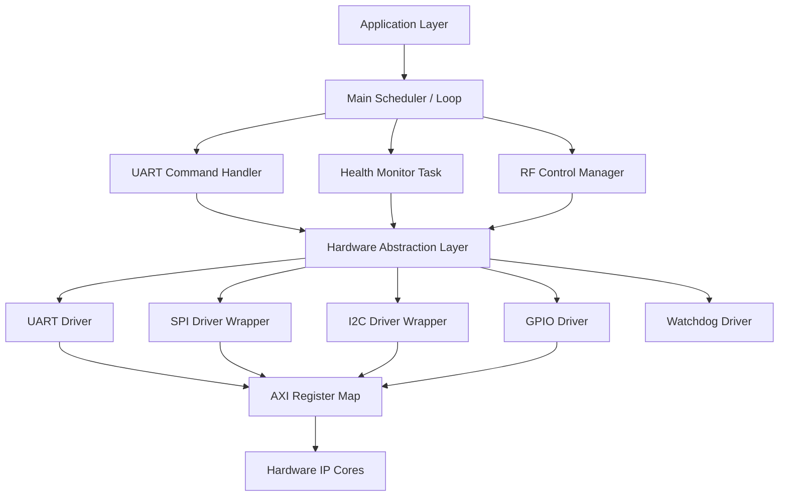
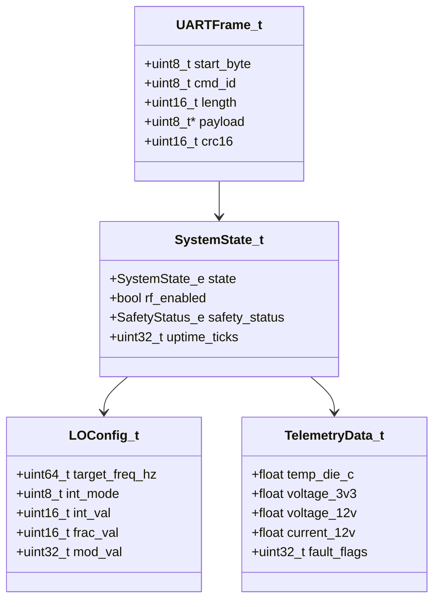
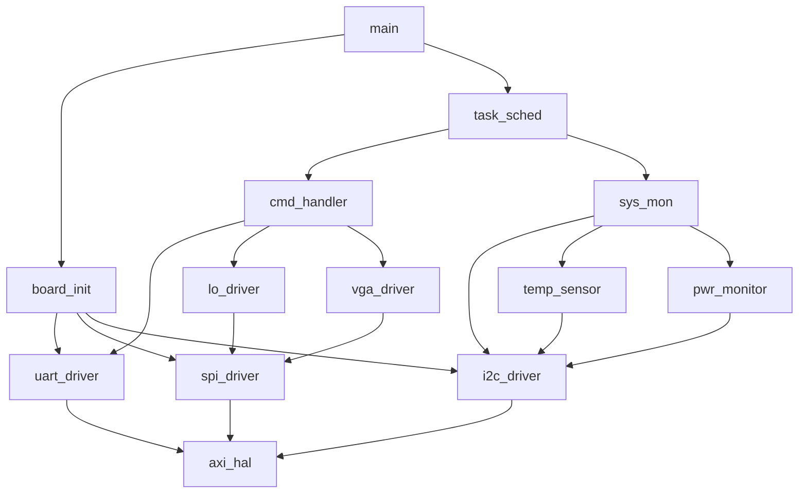
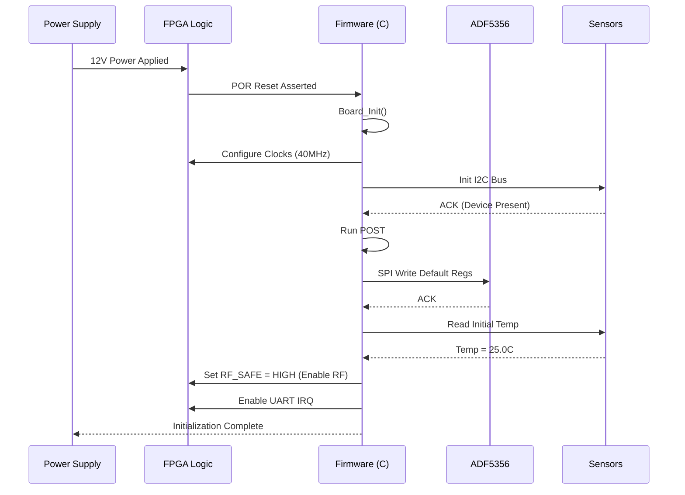
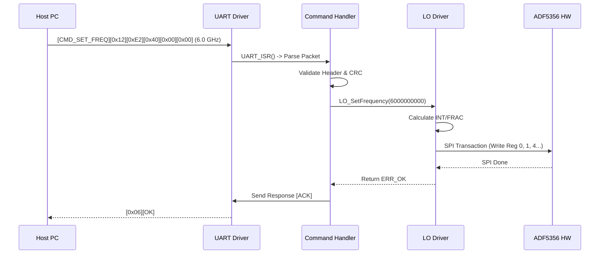
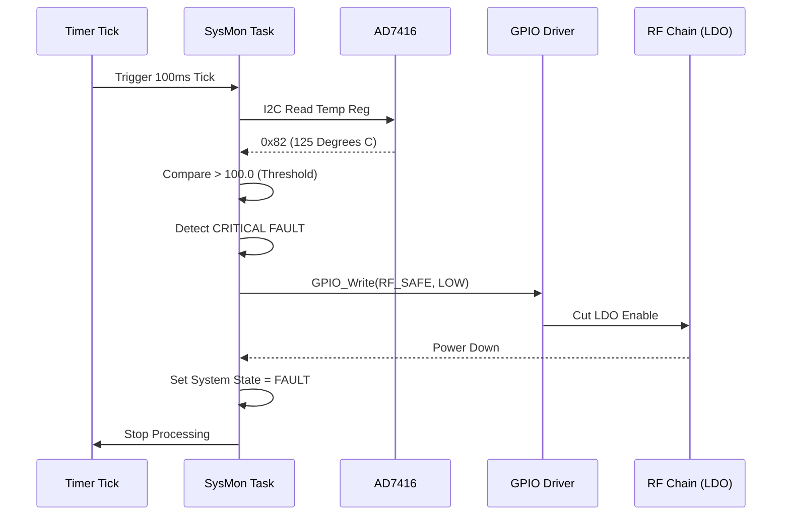
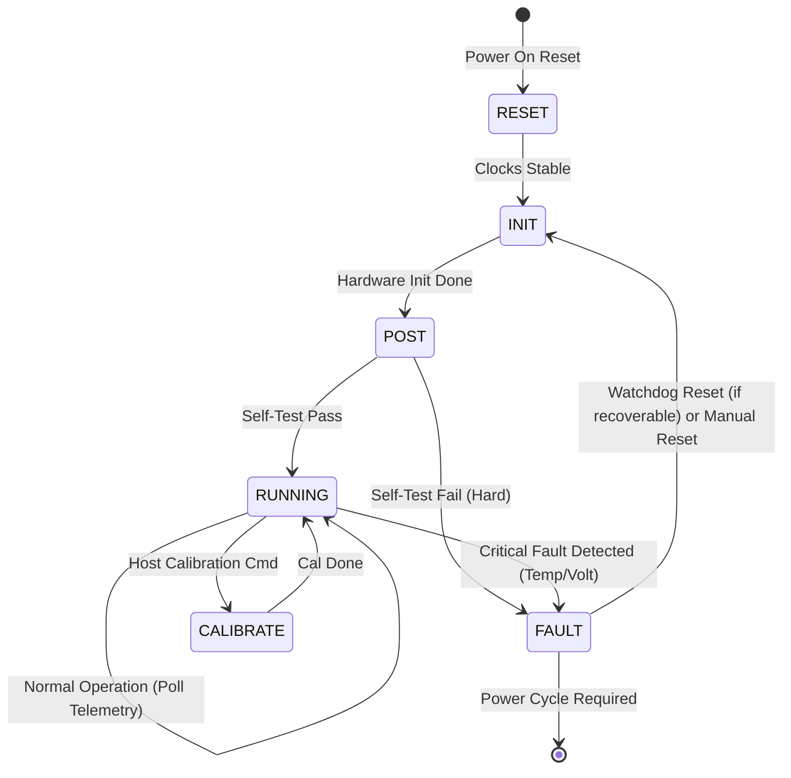
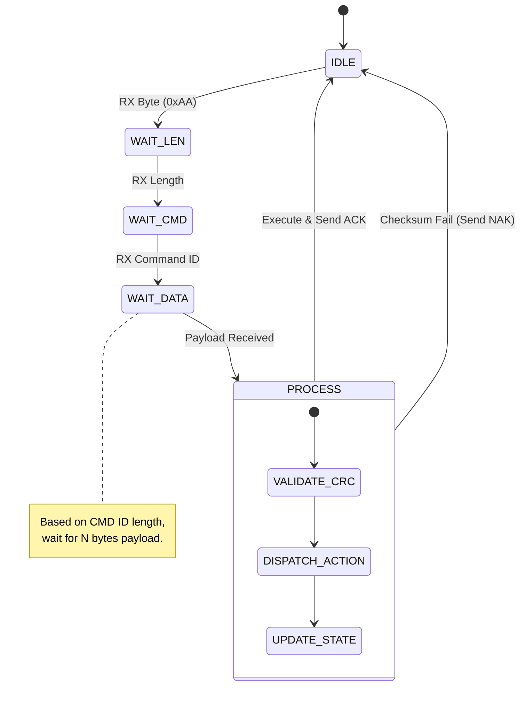

```markdown
# Software Design Document (SDD)

**Project:** JHF Wideband RF Receiver Firmware  
**Version:** 1.0  
**Date:** 17 April 2026  
**Author:** Senior Embedded Software Architect  
**Status:** Release Candidate  
**Compliance:** IEEE 1016-2009

---

## Document Control

| Version | Date | Author | Description |
|---------|------|--------|-------------|
| 1.0 | 17 April 2026 | Senior Architect | Initial release compliant with IEEE 1016-2009. Covers architectural design of JHF Firmware for XC7A35T. |

---

# 1. Introduction

## 1.1 Purpose
This Software Design Document (SDD) provides the comprehensive structural design for the **JHF Wideband RF Receiver** firmware. It translates the requirements defined in the JHF SRS (v1.0) and the Glue Logic Requirements (GLR v0V01) into a concrete software architecture implemented in C (MISRA-C:2012) and VHDL/Verilog for the target XC7A35T Artix-7 FPGA.

This document serves as the blueprint for:
1.  **Firmware Engineers:** Implementing the HAL, Device Drivers, and Control Logic.
2.  **Verification Engineers:** Developing unit tests (Google Test) and integration test vectors.
3.  **System Integrators:** Understanding the interaction between the Host PC, FPGA logic, and RF Hardware.

## 1.2 Scope
The design encompasses the embedded software executing on the **Xilinx Artix-7 XC7A35T**. The architecture follows a layered approach: an Application Layer (State Machine & Command Parser), a Hardware Abstraction Layer (HAL), and Hardware IP cores (UART, SPI, I2C).

**In-Scope:**
*   Embedded C software for the MicroBlaze soft-core (or equivalent VHDL control logic).
*   Device drivers for ADF5356 (LO), HMC698LP4 (VGA), LTC2992 (Power), and AD7416 (Temp).
*   Communication protocol handling (UART-to-SPI/I2C Bridge).
*   Safety interlocks for RF power sequencing.

**Out-of-Scope:**
*   The design of the FPGA internal logic primitives (AXI UART, SPI Master IP) is assumed to be provided by the Xilinx IP Catalog.
*   Host PC GUI design (covered in separate ICD).

## 1.3 Definitions and Acronyms

| Acronym | Definition |
| :--- | :--- |
| **API** | Application Programming Interface |
| **AXI** | Advanced eXtensible Interface (Xilinx bus protocol) |
| **BIST** | Built-In Self Test |
| **BRAM** | Block RAM (FPGA internal memory) |
| **CPG238** | Chip-scale Package 238 pins (XC7A35T form factor) |
| **CRC** | Cyclic Redundancy Check |
| **DMA** | Direct Memory Access |
| **EEPROM** | Electrically Erasable Programmable Read-Only Memory |
| **FF** | Flip-Flop |
| **FIFO** | First-In, First-Out buffer |
| **FSM** | Finite State Machine |
| **GLR** | Glue Logic Requirements (Project Document P6) |
| **GPIO** | General Purpose Input/Output |
| **HAL** | Hardware Abstraction Layer |
| **HRS** | Hardware Requirements Specification (Project Document P2) |
| **I2C** | Inter-Integrated Circuit (Serial Protocol) |
| **INT** | Integer (Integer divider in PLL) |
| **ISR** | Interrupt Service Routine |
| **LDO** | Low Dropout Regulator |
| **LFSR** | Linear Feedback Shift Register |
| **LNA** | Low Noise Amplifier |
| **LO** | Local Oscillator |
| **LSB** | Least Significant Bit |
| **MISRA** | Motor Industry Software Reliability Association |
| **MSB** | Most Significant Bit |
| **NVM** | Non-Volatile Memory |
| **PCB** | Printed Circuit Board |
| **PLL** | Phase-Locked Loop |
| **POR** | Power-On Reset |
| **POST** | Power-On Self-Test |
| **RF** | Radio Frequency |
| **RTL** | Register Transfer Level |
| **Rx** | Receive |
| **SPI** | Serial Peripheral Interface |
| **SRS** | Software Requirements Specification (Project Document SRS) |
| **SWD** | Serial Wire Debug |
| **Tx** | Transmit |
| **UART** | Universal Asynchronous Receiver/Transmitter |
| **VCO** | Voltage Controlled Oscillator |
| **VGA** | Variable Gain Amplifier |
| **WDT** | Watchdog Timer |

## 1.4 References
1.  **IEEE Std 1016-2009:** Standard for Information Technology—Systems Design—Software Design Descriptions.
2.  **JHF SRS (v1.0):** Software Requirements Specification, 17 April 2026.
3.  **JHF GLR (v0V01):** Glue Logic Requirements, 17 April 2026.
4.  **JHF HRS (P2):** Hardware Requirements Specification, 17 April 2026.
5.  **MISRA C:2012:** Guidelines for the Use of the C Language in Critical Systems.
6.  **ADF5356 Datasheet:** Microwave Wideband Synthesizer with Integrated VCO, Analog Devices.
7.  **HMC698LP4 Datasheet:** GaAs MMIC 6-Bit Digital VGA, Analog Devices.
8.  **XC7A35T Datasheet:** Artix-7 FPGA Data Sheet: DC and AC Switching Characteristics, Xilinx.

---

# 2. Design Viewpoints

## 2.1 Context Viewpoint — System Boundaries

The JHF Firmware operates within the XC7A35T FPGA, acting as the bridge between the Host Controller (via UART) and the RF Front-End components (via SPI/I2C). The software context is defined by external stimuli and controlled hardware.



**External Interfaces Description:**

| Interface | Type | Protocol | Description |
| :--- | :--- | :--- | :--- |
| **Host UART** | Ext | UART (8-N-1) | Command interface for configuration and telemetry. |
| **SPI_BUS_LO** | Ext | SPI Mode 0 (CPOL=0, CPHA=0) | Controls ADF5356 frequency synthesis registers. |
| **SPI_BUS_VGA** | Ext | SPI Mode 0 (CPOL=0, CPHA=0) | Sets HMC698LP4 6-bit gain attenuation. |
| **I2C_SENSORS** | Ext | I2C Fast Mode (400kHz) | Reads ADC voltages (LTC2992) and Die Temp (AD7416). |
| **RF_SAFE_IO** | Ext | GPIO (3.3V CMOS) | Hard cut-off signal to RF PA/LDO enable pins. |

## 2.2 Composition Viewpoint — Software Architecture

The software is decomposed into a layered architecture to ensure portability and testability. The Application Layer manages system state, while the HAL isolates hardware specifics.



### Module List with Responsibilities

#### Module: `board_init` (board_init.c / board_init.h)
**Responsibilities:**
*   System startup sequence (PLL lock verification, clock tree validation).
*   AXI peripheral initialization (UART, SPI, I2C).
*   Execution of Power-On Self-Test (POST).

**Public API:**
```c
/**
 * @brief Initialize the JHF board hardware.
 * Configures clocks, GPIOs, and external peripherals.
 * @return ERR_OK if init successful, ERR_HARDWARE if PLL lock fails.
 */
int32_t Board_Init(void);

/**
 * @brief Run Power-On Self-Test (POST).
 * Verifies I2C presence and SPI loopback (if available).
 * @param[out] test_mask Bitmask of failed tests.
 * @return ERR_OK if all tests pass.
 */
int32_t Board_RunPOST(uint32_t *test_mask);

/**
 * @brief Get board hardware revision.
 * @param[out] info Structure containing ID, version, and serial.
 */
int32_t Board_GetInfo(BoardInfo_t *info);
```

**Internal State:**
```c
typedef struct {
    uint16_t board_id;
    uint8_t  hw_revision;
    uint32_t serial_number;
} BoardInfo_t;

typedef enum {
    SYS_STATE_RESET = 0,
    SYS_STATE_INIT,
    SYS_STATE_RUNNING,
    SYS_STATE_FAULT
} SystemState_e;
```

#### Module: `uart_driver` (uart_driver.c / uart_driver.h)
**Responsibilities:**
*   Byte-level transmission and reception via AXI UART.
*   Interrupt-based RX buffering.
*   Protocol frame validation (Header, Length, Checksum).

**Public API:**
```c
/**
 * @brief Initialize UART peripheral.
 * @param baud_rate Baud rate (e.g., 115200).
 * @return ERR_OK on success.
 */
int32_t UART_Init(uint32_t baud_rate);

/**
 * @brief Send data buffer via UART.
 * @param data Pointer to data.
 * @param len Number of bytes.
 * @return ERR_OK on success.
 */
int32_t UART_Send(const uint8_t *data, uint16_t len);

/**
 * @brief Read available bytes from RX buffer.
 * @param buf Destination buffer.
 * @param len Max bytes to read.
 * @return Number of bytes read.
 */
int16_t UART_Read(uint8_t *buf, uint16_t len);

/**
 * @brief UART RX Interrupt Service Routine.
 * Called by hardware vector. Placing data in ring buffer.
 */
void UART_ISR(void);
```

#### Module: `lo_driver` (lo_driver.c / lo_driver.h)
**Responsibilities:**
*   ADF5356 SPI register calculation (INT, FRAC, MOD).
*   Frequency tuning algorithm.
*   VCO calibration trigger.

**Public API:**
```c
/**
 * @brief Initialize ADF5356 to default state.
 * @return ERR_OK.
 */
int32_t LO_Init(void);

/**
 * @brief Set LO Frequency.
 * @param freq_hz Target frequency in Hz (5e9 to 18e9).
 * @return ERR_OK if valid, ERR_PARAM if out of range.
 */
int32_t LO_SetFrequency(uint64_t freq_hz);

/**
 * @brief Enable/Disable RF Output.
 * @param enable true = RF ON, false = RF OFF (Mute).
 * @return ERR_OK.
 */
int32_t LO_Enable(bool enable);
```

#### Module: `vga_driver` (vga_driver.c / vga_driver.h)
**Responsibilities:**
*   HMC698LP4 gain setting via 3-wire SPI.
*   Conversion of dB attenuation to 6-bit binary code.

**Public API:**
```c
/**
 * @brief Set VGA Gain/Attenuation.
 * @param gain_db Desired gain (approx -11.5dB to +20dB).
 * @return ERR_OK.
 */
int32_t VGA_SetGain(float gain_db);

/**
 * @brief Initialize VGA interface.
 * @return ERR_OK.
 */
int32_t VGA_Init(void);
```

#### Module: `sys_mon` (sys_mon.c / sys_mon.h)
**Responsibilities:**
*   Periodic polling of LTC2992 (Voltage/Current).
*   Periodic polling of AD7416 (Temperature).
*   Threshold checking (Over-voltage, Over-temp).

**Public API:**
```c
/**
 * @brief Initialize monitor drivers.
 * @return ERR_OK.
 */
int32_t SysMon_Init(void);

/**
 * @brief Read current telemetry.
 * @param[out] data Structure containing temp, voltage, current.
 * @return ERR_OK.
 */
int32_t SysMon_ReadTelemetry(TelemetryData_t *data);

/**
 * @brief Periodic task to check safety limits.
 * Should be called every 100ms.
 * @return SAFETY_OK or SAFETY_FAULT.
 */
SafetyStatus_e SysMon_Task(void);
```

## 2.3 Logical Viewpoint — Data Model



### Key Data Structures (C Headers)

```c
/* System Telemetry Structure */
typedef struct {
    float temp_die_c;       /* Die temp in Celsius (AD7416) */
    float voltage_12v;      /* Main rail voltage (LTC2992) */
    float current_12v;      /* Main rail current (LTC2992) */
    float voltage_3v3;      /* FPGA/Logic rail (LTC2992) */
    uint32_t fault_flags;   /* Bitmask of active faults */
} TelemetryData_t;

/* LO Configuration Structure */
typedef struct {
    uint64_t frequency_hz;
    uint8_t  prescaler;
    uint16_t int_val;
    uint16_t frac_0;
    uint16_t frac_1;
    uint16_t frac_2;
    uint32_t mod;
} LOConfig_t;

/* Safety Error Codes */
typedef enum {
    SAFETY_OK = 0x00,
    SAFETY_OVERTEMP = 0x01,
    SAFETY_UNDERVOLT_3V3 = 0x02,
    SAFETY_UNDERVOLT_12V = 0x04,
    SAFETY_OVERCURRENT = 0x08
} SafetyStatus_e;
```

## 2.4 Dependency Viewpoint — Module Dependencies



## 2.5 Interface Viewpoint — Complete API Specification

### Function Specification: `LO_SetFrequency`

```c
/**
 * @brief Configures the ADF5356 to synthesize the specified frequency.
 * 
 * Calculates the 32-bit integer and fractional dividers based on the 
 * PFD frequency (Reference / R_Divider) and sets the VCO calibrations.
 * 
 * @param freq_hz Desired output frequency (Valid: 5,000,000,000 to 18,000,000,000 Hz).
 * 
 * @return int32_t ERR_OK (0) on success.
 * @return int32_t ERR_PARAM (4) if frequency is out of range.
 * @return int32_t ERR_SPI (2) if communication with ADF5356 fails.
 * 
 * @pre LO_Init() must have been called successfully.
 * @post The ADF5356 registers are updated, but the user must call LO_Enable(true) 
 *       to assert the MUXOUT.
 * 
 * @note Calculation formulas based on ADF5356 Datasheet Rev A (Equation 1).
 *       VCO frequency = INT + (FRAC1/MOD) * PFD.
 */
int32_t LO_SetFrequency(uint64_t freq_hz);
```

### Function Specification: `SysMon_Task`

```c
/**
 * @brief Periodic health check task.
 * 
 * Reads AD7416 temperature and LTC2992 voltages. Compares values against 
 * critical thresholds defined in GLR Section 7 (e.g., VDD_3V3 < 3.0V).
 * If a critical fault is detected, the RF_SAFE GPIO is asserted LOW immediately.
 * 
 * @return SafetyStatus_e SAFETY_OK if all parameters nominal.
 * @return SafetyStatus_e SAFETY_FAULT if any parameter is out of bounds.
 * 
 * @pre SysMon_Init() called.
 * @post If fault detected, RF power is secured. System state updates.
 * 
 * @example
 *   while(1) {
 *       if (SysMon_Task() != SAFETY_OK) {
 *           HandleFault();
 *       }
 *       vTaskDelay(pdMS_TO_TICKS(100));
 *   }
 */
SafetyStatus_e SysMon_Task(void);
```

## 2.6 Interaction Viewpoint — Sequence Diagrams

### Sequence: System Startup (Power-On)



### Sequence: Host Command (Set Frequency)



### Sequence: Over-Temperature Fault



## 2.7 State Viewpoint — State Machines

### Top-Level Application State Machine



### Command Parser State Machine



## 2.8 Algorithm Viewpoint — Key Algorithms

### 2.8.1 ADF5356 Frequency Calculation

To generate frequencies between 5 GHz and 18 GHz, the firmware must calculate the Integer (INT), Fractional (FRAC), and Modulus (MOD) values.

**Inputs:**
*   $f_{RF} = f_{OUT}$ (Target Frequency)
*   $f_{PFD} = 10 \text{ MHz}$ (Fixed Phase Detector Frequency based on 40 MHz OSC / 4)
*   $f_{RF\_DIV}$ (Output divider, determined by frequency band)

**Logic:**
1.  Determine Output Divider ($D$) based on $f_{OUT}$:
    *   If $f_{OUT} \ge 6.0 \text{ GHz}$, $D=1$.
    *   If $4.0 \le f_{OUT} < 6.0 \text{ GHz}$, $D=2$.
    *   (Lookup table used for lower bands, but JHF focuses on 5-18 GHz).
2.  Calculate VCO Frequency: $f_{VCO} = f_{OUT} \times D$.
3.  Calculate N-divider:
    *   $N = f_{VCO} / f_{PFD}$
4.  Decompose N:
    *   $INT = \text{floor}(N)$
    *   $FRAC = (N - INT) \times MOD$ (Where $MOD = 2^{24}$ for high resolution).

```c
uint32_t vco_freq = target_freq * output_div;
float n_divider = (float)vco_freq / (float)pfd_freq;
uint16_t int_val = (uint16_t)n_divider;
uint32_t frac_val = (uint32_t)((n_divider - int_val) * MODULUS);
```

### 2.8.2 CRC-16 Implementation

Used for validating UART packets and NVM contents.
*   **Polynomial:** $0x8005$ (Standard CRC-16).
*   **Init Value:** $0xFFFF$.
*   **RefIn/RefOut:** True.

## 2.9 Resource Viewpoint — Real-Time Constraints

### 2.9.1 Task Scheduling Table

| Task Name | Period | Worst-Case Exec Time | Priority | Deadline | CPU Load |
|-----------|--------|---------------------|----------|----------|---------|
| SysMon_Task | 100 ms | 3 ms | High (ISR) | 100 ms | 3% |
| CmdHandler_Process | Event Driven | 1 ms | Medium | 10 ms | <1% |
| Watchdog_Pet | 1000 ms | 0.1 ms | Critical | 1000 ms | <1% |
| UART_TX_Flush | Event Driven | 2 ms | Medium | 5 ms | Variable |
| SPI_Transfer | Event Driven | 2 ms | High | N/A | Variable |

**Scheduling Policy:** Cooperative (Bare-metal loop) or Preemptive (FreeRTOS). This design assumes a **Super-Loop** architecture with time-slicing for simplicity on the Artix-7 soft-core unless throughput requirements mandate RTOS.

### 2.9.2 ISR Latency Budget

| Interrupt Source | Latency Requirement | Worst-Case Measured | Margin |
|-----------------|--------------------|--------------------|--------|
| UART RX (Byte) | < 100 µs | 40 µs | 60% |
| I2C Sensor Ready | < 500 µs | 200 µs | 60% |
| SPI Transfer Done | < 1 ms | 400 µs | 60% |

### 2.9.3 Memory Budget

**Target Device:** XC7A35T-CPG238 (BRAM: 1.8 Mb = 216 KB).

| Region | Size (Bytes) | Usage |
|--------|--------------|-------|
| **Code (Text)** | 64 KB | Firmware C Code + ISR vectors |
| **Stack** | 4 KB | Main stack (nested interrupts depth 8) |
| **Heap** | 0 KB | MISRA Compliance (No Dynamic Alloc) |
| **Global Data** | 8 KB | State machines, register maps, buffers |
| **Buffer (UART RX)** | 2 KB | Circular buffer (2048 bytes) |
| **BRAM Utilization** | ~80 KB / 216 KB | ~37% Utilization |

## 2.10 Build System Viewpoint

### 2.10.1 CMakeLists.txt Structure

```cmake
cmake_minimum_required(VERSION 3.20)
project(jhf_firmware VERSION 1.0.0 LANGUAGES C ASM)

set(CMAKE_C_STANDARD 11)
set(CMAKE_C_FLAGS "${CMAKE_C_FLAGS} -Wall -Wextra -pedantic -Werror")

# MicroBlaze / Cross Compile Toolchain Definitions
set(CMAKE_SYSTEM_NAME Generic)
set(CMAKE_EXECUTABLE_SUFFIX .elf)
# Assuming MicroBlaze toolchain is in PATH
set(CMAKE_C_COMPILER mb-gcc)
set(CMAKE_OBJCOPY mb-objcopy)

# --- Source Files ---
set(SRC_FILES
    src/main.c
    src/board/board_init.c
    src/drivers/uart_driver.c
    src/drivers/spi_driver.c
    src/drivers/i2c_driver.c
    src/app/lo_driver.c
    src/app/vga_driver.c
    src/app/sys_mon.c
    src/app/cmd_handler.c
)

# --- Build Firmware Executable ---
add_executable(jhf_fw ${SRC_FILES})

# --- Linker Script ---
target_link_options(jhf_fw PRIVATE -T ${CMAKE_SOURCE_DIR}/lds/microblaze.ld)

# --- Host-Based Unit Tests (Google Test) ---
# These tests run on the x86 PC using Hardware Mocks
enable_testing()
add_subdirectory(tests)

add_executable(test_jhf
    tests/test_main.cpp
    tests/test_lo_driver.cpp
    tests/mock_spi.cpp
)
target_link_libraries(test_jhf PRIVATE GTest::gtest GTest::gtest_main GTest::gmock)
gtest_discover_tests(test_jhf)

# --- Qt6 GUI (Separate Project) ---
option(BUILD_GUI "Build Qt6 Control GUI" ON)
if(BUILD_GUI)
    add_subdirectory(gui/qt_app)
endif()
```

### 2.10.2 Unit Test Infrastructure (Google Test)

To satisfy verification requirements without physical hardware for every build:
*   **Mocking:** `mock_spi.cpp` implements the `SPI_Transfer` API by returning pre-programmed register values.
*   **Testing:** `test_lo_driver.cpp` asserts that `LO_SetFrequency(6e9)` results in the correct bit patterns being shifted out via the Mock SPI.

---

# 3. Design Rationale

## 3.1 Architecture Choices

### 3.1.1 Bare-Metal vs RTOS
**Decision:** Implemented as a Bare-Metal Super-Loop with a low-priority background tick.
**Rationale:** The JHF application is primarily reactive (responding to UART commands) and periodic (100ms sensor polling). The complexity of an RTOS scheduler (FreeRTOS) introduces stack overhead and context switching complexity that is not warranted given the deterministic nature of the RF control loops.
**Trade-off:** Cannot easily block on UART; must use ring buffers. Harder to add low-priority background tasks later.

### 3.1.2 SPI Bit-Banging vs IP Core
**Decision:** Use Xilinx AXI Quad SPI IP Core.
**Rationale:** The ADF5356 requires long SPI transactions (up to 4 bytes x 8 registers). Bit-banging in C would consume excessive CPU cycles and introduce jitter, potentially violating the SPI Setup/Hold times at 40MHz system clocks. The IP Core handles hardware buffering and FIFO management.

### 3.1.3 Memory Allocation
**Decision:** Static allocation only (MISRA compliance).
**Rationale:** In an FPGA environment, heap fragmentation is hard to debug and non-deterministic. Static memory usage is verified at compile-time via the linker map.

## 3.2 MISRA-C:2012 Compliance Strategy
*   **Rule 21.1:** `malloc`/`free` are prohibited. All buffers are static arrays.
*   **Rule 13.5:** All loops have a static upper bound to prevent runaway loops (e.g., I2C timeout loops).
*   **Rule 11.9:** No literal '0' or 'NULL' cast to pointer type. `NULL` is defined as `(void*)0`.

---

# 4. Design Traceability Matrix

| SDD Design Element | Implements SRS Requirement | HRS/GLR Source |
| :--- | :--- | :--- |
| `board_init.c` | REQ-SW-001 (Power On Init) | HRS 4.2.1 |
| `lo_driver.c` | REQ-SW-012 (LO Freq Set 5-18GHz) | HRS 3.1.1 |
| `vga_driver.c` | REQ-SW-015 (Gain Control) | HRS 3.1.2 |
| `uart_driver.c` | REQ-SW-021 (UART Comms) | GLR Section 5 (UART Protocol) |
| `sys_mon.c` | REQ-SW-031 (Temp Monitor > 100C) | HRS 4.1.4 (Thermal) |
| `sys_mon.c` | REQ-SW-032 (Volt Monitor 3.3V) | HRS 4.1.5 (Power) |
| `ADF5356 Calc` | REQ-SW-013 (Freq Accuracy) | ADF5356 Datasheet Eq 1 |
| `HMC698LP4 Driver` | REQ-SW-016 (Gain Range) | HMC698LP4 Datasheet |
| `Safety FSM` | REQ-SW-041 (Fault Reaction) | HRS 4.3 (Safety) |

---

# 5. Appendices

## Appendix A — File Structure
```
/firmware
│
├── src/
│   ├── main.c                 # Entry point
│   ├── board/
│   │   ├── board_init.c
│   │   └── board_config.h
│   ├── drivers/               # HAL Layer
│   │   ├── uart_driver.c
│   │   ├── spi_driver.c
│   │   ├── i2c_driver.c
│   │   └── gpio_driver.c
│   ├── app/                   # Application Logic
│   │   ├── lo_driver.c
│   │   ├── vga_driver.c
│   │   ├── sys_mon.c
│   │   └── cmd_handler.c
│   └── utils/
│       ├── crc16.c
│       └── ring_buffer.c
│
├── tests/                     # Host-side unit tests
│   ├── test_main.cpp
│   ├── mock_hw.cpp
│   └── CMakeLists.txt
│
├── lds/                       # Linker Scripts
│   └── microblaze.ld
│
├── gui/                       # Qt Application (Out of Scope but included in build)
│   └── qt_app/
│
└── CMakeLists.txt             # Top-level build
```

## Appendix B — Register Map (FPGA Address Space)

**Base Address:** `0x4000_0000` (AXI Base)

| Offset | Register Name | Access | Reset Value | Description |
|--------|---------------|--------|-------------|-------------|
| `0x0000` | UART_RX_DATA | RO | `0x0000_0000` | UART Receive FIFO |
| `0x0004` | UART_TX_DATA | WO | `0x0000_0000` | UART Transmit FIFO |
| `0x0008` | UART_STATUS | RO | `0x0000_0000` | Bit 0: TX Empty, Bit 1: RX Full |
| `0x0010` | SPI_TX_DATA | WO | `0x0000_0000` | SPI MOSI Data |
| `0x0014` | SPI_RX_DATA | RO | `0x0000_0000` | SPI MISO Data |
| `0x0018` | SPI_CTRL | RW | `0x0000_0000` | Bit 0: CS_N, Bit 1: Start |
| `0x0020` | I2C_TX_RX | RW | `0x0000_0000` | I2C Data Register |
| `0x0024` | I2C_CTRL | RW | `0x0000_0000` | I2C Control (Start/Stop/Ack) |
| `0x0030` | GPIO_OUT | RW | `0xFFFF_FFFF` | GPIO Output Data |
| `0x0034` | GPIO_DIR | RW | `0xFFFF_FFFF` | GPIO Direction (1=Out) |

## Appendix C — Coding Standards Checklist

*   [ ] **Indentation:** Spaces only, 4 spaces.
*   [ ] **Bracing:** K&R style (Opening brace on same line).
*   [ ] **Naming:**
    *   Functions: `PascalCase` (e.g., `UART_Init`).
    *   Variables: `snake_case` (e.g., `uart_baud_rate`).
    *   Constants: `UPPER_CASE` (e.g., `MAX_BUFFER_SIZE`).
*   [ ] **Comments:** Doxygen style (`/** ... */`) for all public APIs.
*   [ ] **Types:** Use `stdint.h` explicit types (uint32_t, not int).
```