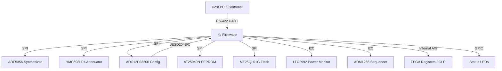
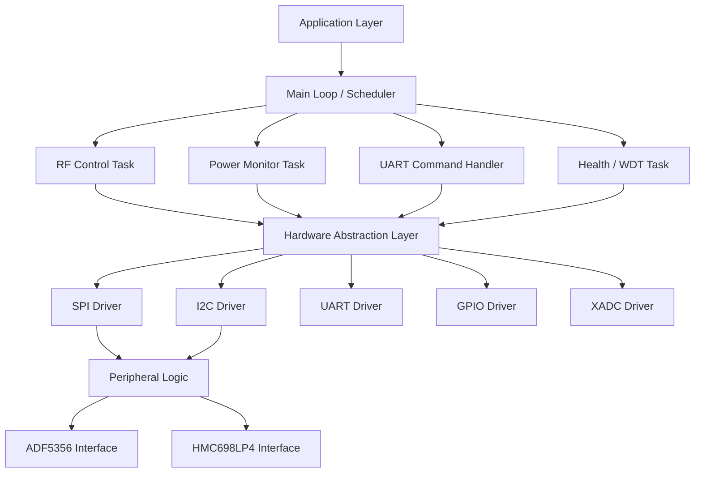
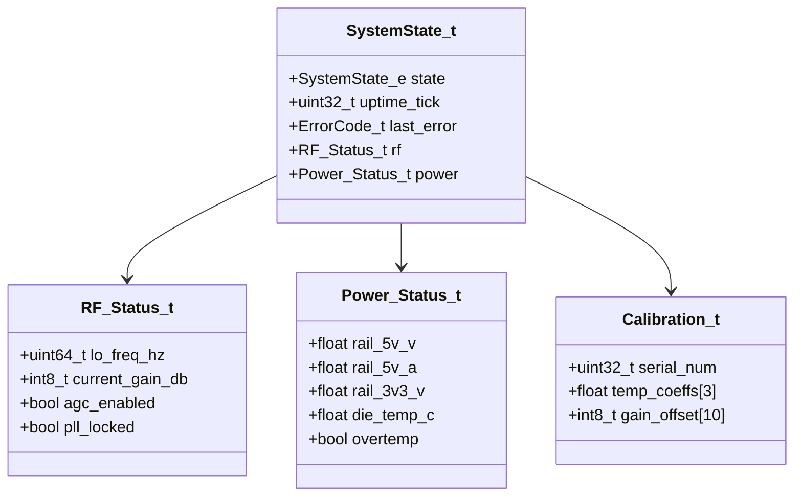
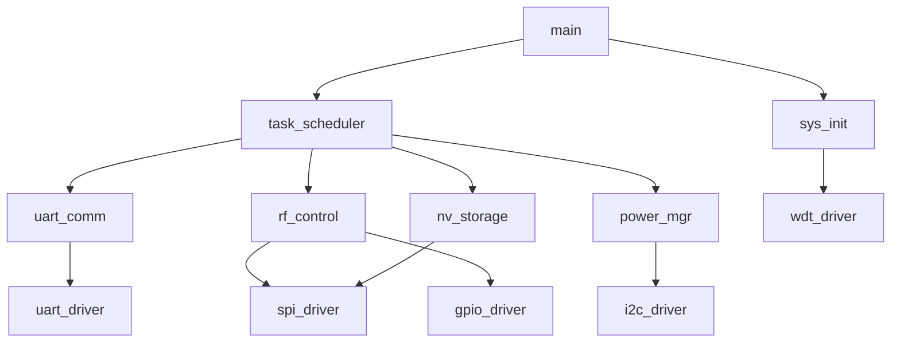
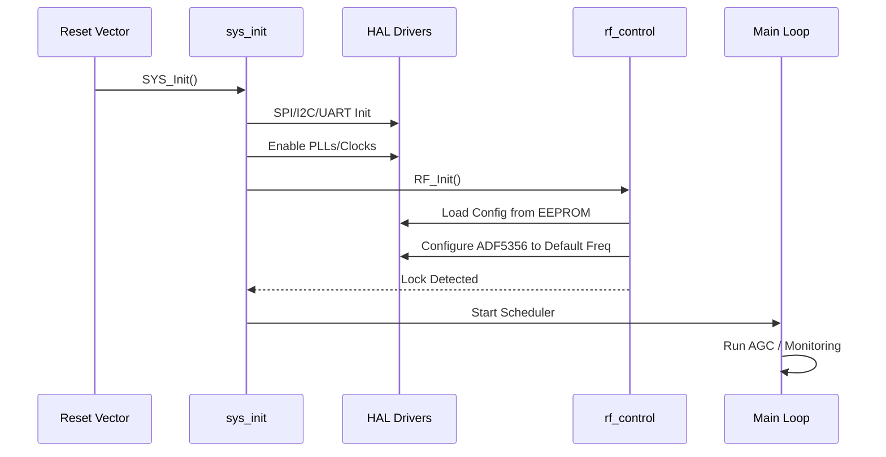
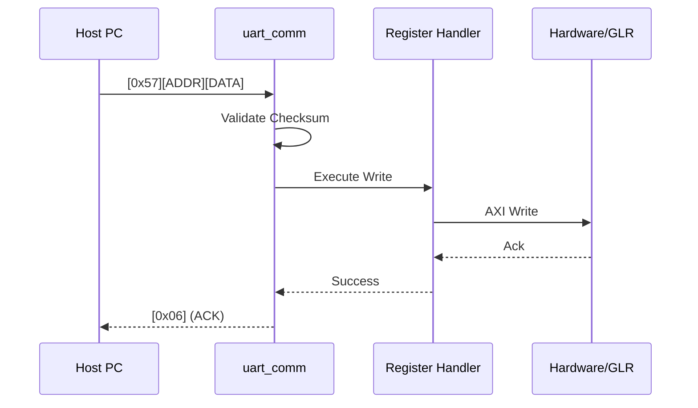
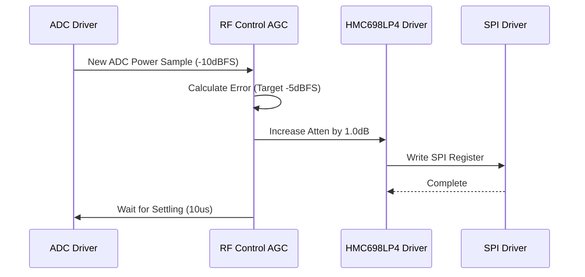
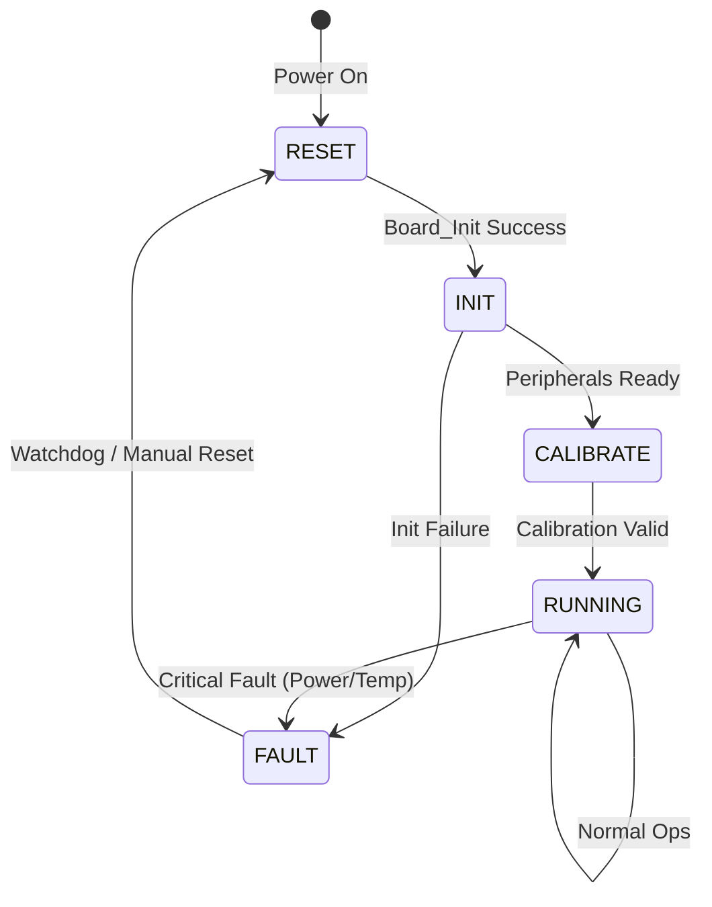
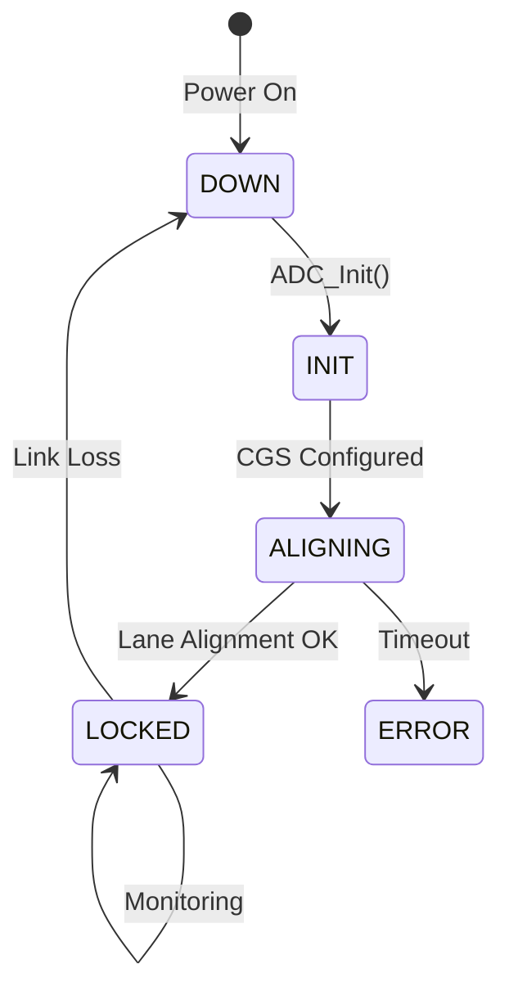

```markdown
# Software Design Document (SDD)

**Project:** kb Wideband RF Receiver  
**Version:** 1.0  
**Date:** 17 April 2026  
**Status:** Release  
**Author:** Senior Embedded Software Architect  

---

## Document Control
| Version | Date | Author | Description |
|---------|------|--------|-------------|
| 1.0 | 17 April 2026 | Senior Architect | Initial architecture and design release |

---

# 1. Introduction

## 1.1 Purpose
This Software Design Document (SDD) details the software architecture, data structures, algorithms, and interface definitions for the **kb** Wideband RF Receiver firmware. The firmware executes on the embedded processor within the Xilinx XQRKU060 FPGA. This document serves as the blueprint for firmware engineers implementing the HAL, BSP, and Application layers, ensuring compliance with IEEE 1016-2009 and MISRA-C:2012 standards.

## 1.2 Scope
The design encompasses:
1.  **Hardware Abstraction Layer (HAL):** Drivers for UART (RS-422), SPI (LO, DSA, ADC, Flash, EEPROM), and I2C (Power Monitor).
2.  **Board Support Package (BSP):** System initialization, clock tree setup (PLLs), and interrupt handling.
3.  **Application Layer:** RF Control (AGC), JESD204B link monitoring, Power Management, and Watchdog.
4.  **Target Hardware:** Xilinx XQRKU060 (MicroBlaze/PS), ADC12DJ3200, ADF5356, HMC698LP4, LTC2992, ADM1266.

Explicitly excluded: Host PC GUI software and post-digitization DSP algorithms.

## 1.3 Definitions and Acronyms
| Term | Definition |
| :--- | :--- |
| **ADC** | Analog-to-Digital Converter (ADC12DJ3200). |
| **AGC** | Automatic Gain Control. |
| **API** | Application Programming Interface. |
| **BSP** | Board Support Package. |
| **CSR** | Control and Status Register. |
| **DSA** | Digital Step Attenuator. |
| **EOF** | End Of File. |
| **FIFO** | First In, First Out buffer. |
| **FPGA** | Field Programmable Gate Array. |
| **FSM** | Finite State Machine. |
| **GPIO** | General Purpose Input/Output. |
| **HAL** | Hardware Abstraction Layer. |
| **HRS** | Hardware Requirements Specification. |
| **I2C** | Inter-Integrated Circuit. |
| **ISR** | Interrupt Service Routine. |
| **JESD** | JESD204B/C High-Speed Data Interface Standard. |
| **KB** | Kilobyte. |
| **LO** | Local Oscillator (ADF5356). |
| **LUT** | Look-Up Table. |
| **LNA** | Low Noise Amplifier. |
| **MISO** | Master In Slave Out. |
| **MISRA** | Motor Industry Software Reliability Association. |
| **MOSI** | Master Out Slave In. |
| **NVM** | Non-Volatile Memory. |
| **PCB** | Printed Circuit Board. |
| **PLL** | Phase Locked Loop. |
| **POST** | Power-On Self-Test. |
| **RTL** | Register Transfer Level. |
| **RX** | Receiver. |
| **SPI** | Serial Peripheral Interface. |
| **SRS** | Software Requirements Specification. |
| **UART** | Universal Asynchronous Receiver-Transmitter. |
| **WDT** | Watchdog Timer. |
| **XADC** | Xilinx Analog-to-Digital Converter (hard IP). |

## 1.4 References
1.  **IEEE 1016-2009:** Standard for Information Technology — Systems Design — Software Design Descriptions.
2.  **kb SRS:** Software Requirements Specification, Rev 1.0, 17 April 2026.
3.  **kb GLR:** Glue Logic Requirements, Rev 0V01, 17 April 2026.
4.  **kb HRS:** Hardware Requirements Specification, Rev 1.0, 17 April 2026.
5.  **MISRA-C:2012:** Guidelines for the Use of the C Language in Critical Systems.
6.  **Xilinx UG984:** Zynq UltraScale+ MPSoC and Zynq UltraScale+ RFSoC Software Developers Guide.
7.  **Analog Devices ADF5356 Datasheet.**
8.  **Texas Instruments ADC12DJ3200 Datasheet.**

---

# 2. Design Viewpoints

## 2.1 Context Viewpoint — System Boundaries

The software system resides within the FPGA and interfaces with external entities via defined protocols.



**External Interfaces:**
*   **Host PC:** Commands firmware via 115200 baud RS-422.
*   **RF Chain:** Configured via SPI (LO frequency, DSA gain).
*   **Power System:** Monitored via I2C.
*   **Data Link:** High-speed JESD204B/C status monitored via status registers.

## 2.2 Composition Viewpoint — Software Architecture

The firmware is structured in a layered architecture promoting portability and modularity.



### Module List with Responsibilities

**Module: sys_init (sys_init.c)**
*   **Responsibilities:** System startup, clock configuration, cache configuration, BSP initialization.
*   **API:**
    ```c
    int32_t SYS_Init(void);
    int32_t SYS_Post(void);
    ```

**Module: uart_comm (uart_comm.c)**
*   **Responsibilities:** RS-422 driver, frame parsing (CMD/ADDR/DATA), response transmission.
*   **API:**
    ```c
    int32_t UART_Init(uint32_t baud_rate);
    void UART_ProcessIRQ(void);
    int32_t UART_WriteReg(uint16_t addr, uint32_t data);
    int32_t UART_ReadReg(uint16_t addr, uint32_t *data);
    ```

**Module: rf_control (rf_control.c)**
*   **Responsibilities:** AGC algorithm, LO tuning, DSA attenuation calculation.
*   **API:**
    ```c
    int32_t RF_Init(void);
    int32_t RF_SetFrequency(uint64_t freq_hz);
    int32_t RF_SetGain(int8_t gain_db);
    void RF_AGC_Task(void);
    ```

**Module: adc_interface (adc_interface.c)**
*   **Responsibilities:** ADC12DJ3200 SPI configuration, JESD204B link status monitoring.
*   **API:**
    ```c
    int32_t ADC_Init(ADC_Mode_e mode);
    bool ADC_IsLinkLocked(void);
    int32_t ADC_SoftSync(void);
    ```

**Module: power_mgr (power_mgr.c)**
*   **Responsibilities:** LTC2992 polling, voltage/current validation, fault recording.
*   **API:**
    ```c
    int32_t PWR_Init(void);
    void PWR_MonitorTask(void);
    bool PWR_IsFaultActive(void);
    ```

**Module: nv_storage (nv_storage.c)**
*   **Responsibilities:** EEPROM (AT25040N) and Flash (MT25QL01G) read/write, calibration table management.
*   **API:**
    ```c
    int32_t NV_Init(void);
    int32_t NV_ReadCalData(Calibration_t *cal);
    int32_t NV_WriteCalData(const Calibration_t *cal);
    ```

## 2.3 Logical Viewpoint — Data Model



**Key Data Structures:**

```c
typedef enum {
    SYS_STATE_RESET = 0,
    SYS_STATE_INIT,
    SYS_STATE_CALIBRATING,
    SYS_STATE_RUNNING,
    SYS_STATE_FAULT,
    SYS_STATE_SHUTDOWN
} SystemState_e;

typedef enum {
    ERR_OK = 0x00,
    ERR_TIMEOUT = 0x01,
    ERR_COMM_SPI = 0x02,
    ERR_COMM_I2C = 0x03,
    ERR_PARAM_RANGE = 0x04,
    ERR_PLL_UNLOCK = 0x05,
    ERR_ADC_UNLOCK = 0x06,
    ERR_POWER_FAULT = 0x07,
    ERR_TEMP_CRITICAL = 0x08
} ErrorCode_t;

typedef struct {
    uint64_t lo_frequency_hz;
    int8_t   dsa_attenuation_db; // 0 to -31.5dB
    bool     pll_lock_detect;
    bool     adc_lock_detect;
} RF_Status_t;
```

## 2.4 Dependency Viewpoint — Module Dependencies



## 2.5 Interface Viewpoint — Complete API Specification

### 2.5.1 SPI Driver (spi_driver.c)

```c
/**
 * @brief Initialize the SPI Master controller.
 * @param id  Identifier for SPI instance (0=LO, 1=ADC/Flash).
 * @param clk_hz Frequency in Hz (Max 20MHz for EEPROM, 40MHz for others).
 * @return ERR_OK on success.
 */
int32_t SPI_Init(uint8_t id, uint32_t clk_hz);

/**
 * @brief Perform a generic SPI transfer.
 * @param id SPI Instance ID.
 * @param tx_buf Buffer to transmit. NULL for dummy write.
 * @param rx_buf Buffer to fill with received data. NULL for dummy read.
 * @param len Length of transfer in bytes.
 * @return ERR_OK on success.
 */
int32_t SPI_Transfer(uint8_t id, const uint8_t *tx_buf, uint8_t *rx_buf, uint16_t len);
```

### 2.5.2 RF Control (rf_control.c)

```c
/**
 * @brief Set the Local Oscillator frequency.
 * @param freq_hz Target frequency (5e9 to 18e9 Hz).
 * @return ERR_OK if ADF5356 locks successfully.
 * @return ERR_TIMEOUT if PLL fails to lock within 100ms.
 */
int32_t RF_SetFrequency(uint64_t freq_hz);

/**
 * @brief Adjust DSA attenuation.
 * @param attenuation_db Attenuation in 0.5dB steps (0 to 31.5).
 * @return ERR_OK.
 */
int32_t RF_SetGain(uint8_t attenuation_db);
```

## 2.6 Interaction Viewpoint — Sequence Diagrams

### System Startup Sequence



### Host Command Execution (Write Register)



### AGC Correction Loop



## 2.7 State Viewpoint — State Machines

### System State Machine



### JESD204B Link State Machine



## 2.8 Algorithm Viewpoint — Key Algorithms

### 2.8.1 ADF5356 Frequency Calculation (Integer-N)
Algorithm to derive register values from target frequency (F_RF).
1.  Determine PFD Frequency (F_PFD) based on reference clock (125 MHz) and R divider.
2.  Calculate INT division ratio: `N_INT = floor(F_RF / F_PFD)`.
3.  Calculate Fractional value: `FRAC = floor((F_RF % F_PFD) * MOD / F_PFD)`.
4.  Write registers to ADF5356.
5.  Poll MUXOUT pin for Lock Detect logic high.

### 2.8.2 AGC Hysteresis Loop
To prevent gain hunting:
1.  If `ADC_Power > Target_High` (e.g., -2 dBFS), `Attenuation += Step`.
2.  If `ADC_Power < Target_Low` (e.g., -8 dBFS), `Attenuation -= Step`.
3.  Hysteresis window: 6 dB. Step size: 0.5 dB.

---

## 2.9 Resource Viewpoint — Real-Time Constraints

### 2.9.1 Task Scheduling Table
| Task Name | Period | Exec Time | Priority | Deadline | CPU Load |
|-----------|--------|-----------|----------|----------|----------|
| Main Scheduler | 1 ms | 50 µs | High | 1 ms | 5% |
| RF_AGC_Task | 100 µs | 20 µs | High | 100 µs | 20% |
| UART_Handler | Event (ISR) | 30 µs | Medium | 1 ms | 5% |
| Power_Monitor | 500 ms | 2 ms | Low | 500 ms | <1% |
| WDT_Pet | 10 ms | 5 µs | High | 10 ms | <1% |

### 2.9.2 ISR Latency Budget
| Interrupt Source | Max Latency | Response Action |
|-----------------|-------------|-----------------|
| UART RX (Byte) | 20 µs | Load into RX FIFO |
| JESD204B Alarm | 5 µs | Latch Error Code |
| Timer Tick | 100 µs | Trigger Scheduler |
| SPI Complete | 50 µs | Wake Task |

### 2.9.3 Memory Budget
| Region | Size | Usage | Availability |
|--------|------|-------|---------------|
| BRAM (Code) | 64 KB | Firmware Text | Limited |
| OCM (Data) | 128 KB | Stacks/Heaps | OK |
| DDR (Buffer) | 512 MB | ADC Samples | Abundant |
| EEPROM | 512 B | Cal Data | Minimal |

---

## 2.10 Build System Viewpoint

### CMakeLists.txt Structure

```cmake
cmake_minimum_required(VERSION 3.20)
project(kb_firmware C CXX)

set(CMAKE_C_STANDARD 11)
set(CMAKE_CXX_STANDARD 17)

# Hardware Definitions
add_definitions(-DXILKERNEL_ENABLED)

# Driver Library
add_library(kb_drivers STATIC
    src/drivers/uart/uart.c
    src/drivers/spi/spi.c
    src/drivers/i2c/i2c.c
    src/hal/nv_storage.c
)

# Main Firmware Executable (MicroBlaze/ARM)
add_executable(kb_firmware.elf
    src/app/main.c
    src/app/sys_init.c
    src/app/rf_control.c
    src/app/power_mgr.c
)

target_link_libraries(kb_firmware.elf PRIVATE kb_drivers)

# Qt6 GUI (Host Side)
find_package(Qt6 REQUIRED COMPONENTS Core Gui Widgets)
add_subdirectory(src/gui/qt_app)

# Unit Tests (Host Side Simulation)
enable_testing()
add_subdirectory(tests)
```

### Cross-Compilation Toolchain
```cmake
# arm-none-eabi or microblaze toolchain setup
set(CMAKE_SYSTEM_NAME Generic)
set(CMAKE_C_COMPILER arm-none-eabi-gcc)
set(CMAKE_OBJCOPY arm-none-eabi-objcopy)
```

### Unit Test Integration (CMake + Google Test)
```cmake
# tests/CMakeLists.txt
find_package(GTest REQUIRED)
add_executable(kb_unit_tests
    test/test_rf_agc.cpp
    test/test_spi_parser.cpp
    mock/hardware_mock.cpp
)
target_link_libraries(kb_unit_tests PRIVATE GTest::gtest GTest::gtest_main)
gtest_discover_tests(kb_unit_tests)
```

---

# 3. Design Rationale

## 3.1 Architecture Choices
1.  **Bare-Metal vs RTOS:**
    *   *Decision:* Bare-Metal with cooperative scheduler.
    *   *Rationale:* The system is control-loop heavy with tight timing (AGC @ 100µs). An RTOS overhead for context switching is unnecessary for this single-threaded logic flow. Simplifies MISRA compliance.
2.  **SPI Poling vs Interrupt:**
    *   *Decision:* Interrupt for transfers, Polling for status.
    *   *Rationale:* Ensures the CPU is not blocked during slow EEPROM/Flash writes, but allows immediate status checks for PLL lock.
3.  **Static vs Dynamic Memory:**
    *   *Decision:* Static only.
    *   *Rationale:* MISRA-C:2012 requirement (Dir 4.5). No heap fragmentation risks in safety-critical applications.

## 3.2 MISRA-C Compliance
*   All pointers are declared where possible (near/far qualifiers handled by compiler).
*   Implicit conversions are flagged.
*   Run-time time-sharing is explicit in the scheduler loop.

---

# 4. Design Traceability Matrix

| SDD Element | Implements SRS REQ | Description |
|-------------|-------------------|-------------|
| uart_comm.c | REQ-SW-012, REQ-SW-013 | UART Single/Bulk Read Write |
| rf_control.c | REQ-SW-003, REQ-SW-004 | LO Tuning and AGC |
| adc_interface.c | REQ-SW-005, REQ-SW-006 | JESD204B Link Config |
| power_mgr.c | REQ-SW-021 | Voltage/Current Monitoring |
| nv_storage.c | REQ-SW-031, REQ-SW-032 | Calibration Data Persistence |
| sys_init.c | REQ-SW-001, REQ-SW-002 | Startup and POST |

---

# 5. Appendices

## Appendix A — File Structure
```
firmware/
├── src/
│   ├── app/         (Application logic)
│   ├── drivers/     (HAL)
│   └── utils/       (CRC, math)
├── inc/             (Public headers)
├── tests/           (Unit tests)
└── cmake/
```

## Appendix B — Register Map Summary

| Base Address | Offset | Name | Access | Reset Value | Description |
|--------------|--------|------|--------|-------------|-------------|
| 0x40000000 | 0x0000 | REG_CONTROL | R/W | 0x00000000 | System Control (Enable, Reset) |
| 0x40000000 | 0x0004 | REG_STATUS | R | 0x00000000 | Status Flags (Locked, Alarm) |
| 0x40000000 | 0x0010 | REG_LO_FREQ_L | W | 0x00000000 | LO Freq LSB (Data Bus) |
| 0x40000000 | 0x0014 | REG_LO_FREQ_H | W | 0x00000000 | LO Freq MSB |
| 0x40000000 | 0x0020 | REG_DSA_GAIN | W | 0x00000000 | Attenuation Setting (0-127) |
| 0x40000000 | 0x0100 | REG_UART_DATA | R/W | 0x00000000 | UART Data Register |
| 0x40000000 | 0x0104 | REG_UART_STAT | R | 0x00000000 | UART Status (RX_EMPTY, TX_FULL) |

## Appendix C — Coding Standards Checklist
*   [x] No dynamic memory allocation.
*   [x] All functions have static scope unless part of public API.
*   [x] `stdint.h` types used for all data widths.
*   [x] `const` keyword used on all read-only data.
*   [x] Doxygen headers on all files.
*   [x] Cyclomatic complexity < 15.

## Appendix D — Key Constants
```c
#define XTAL_FREQ_HZ         125000000
#define ADC_MAX_SAMPLE_RATE  6400000000
#define JESD_LANES           8
#define RS422_BAUD_RATE      115200
#define I2C_POW_MON_ADDR     0x96
#define SPI_LO_FREQ_MAX      40000000
```
```