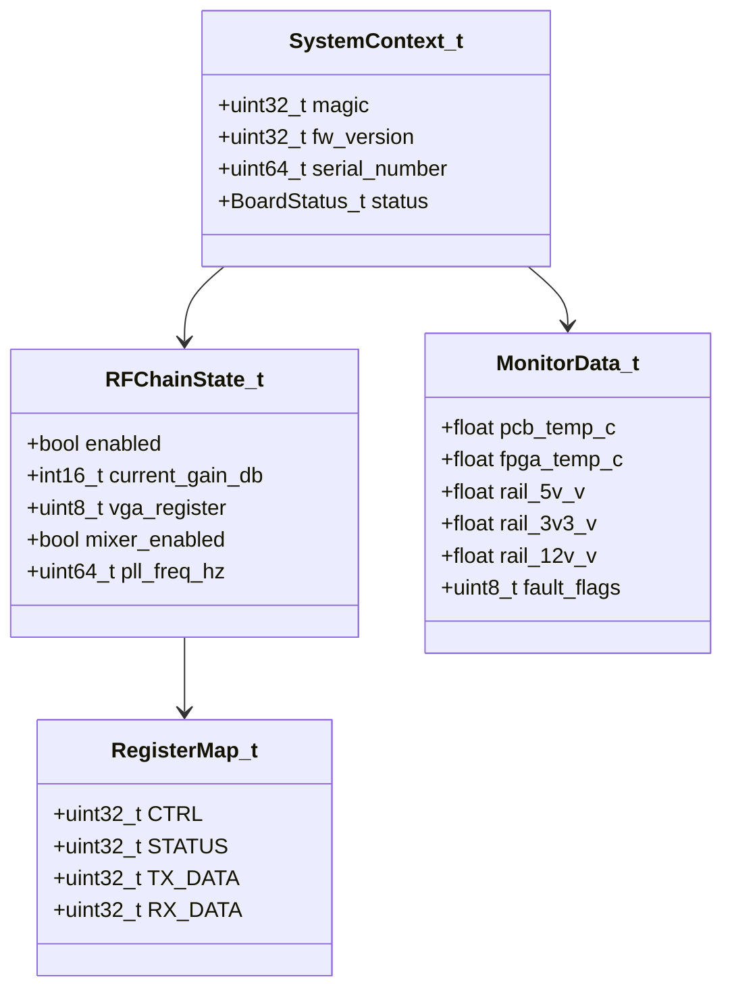
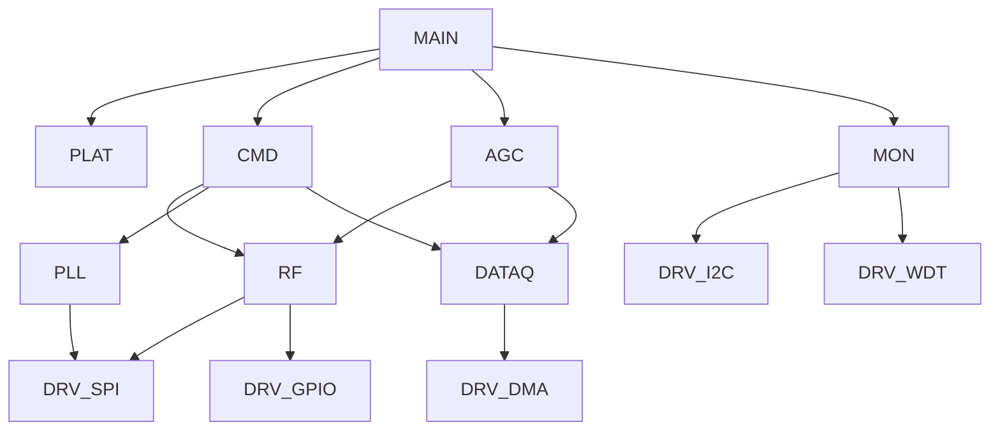
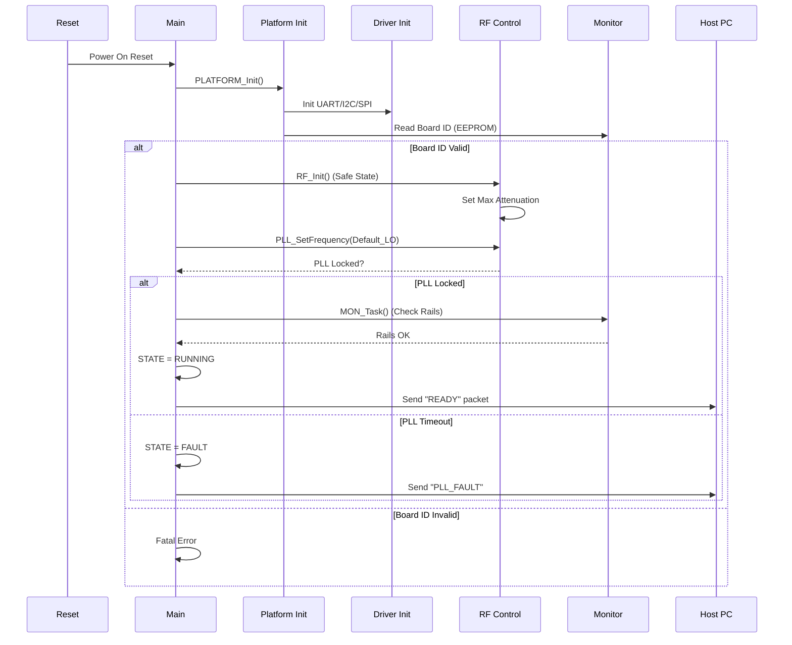
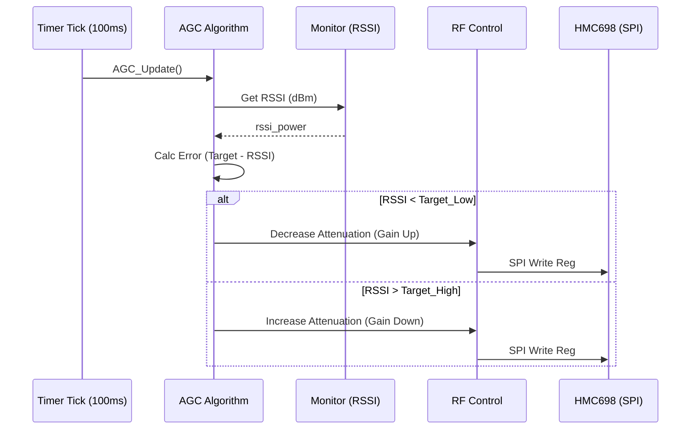
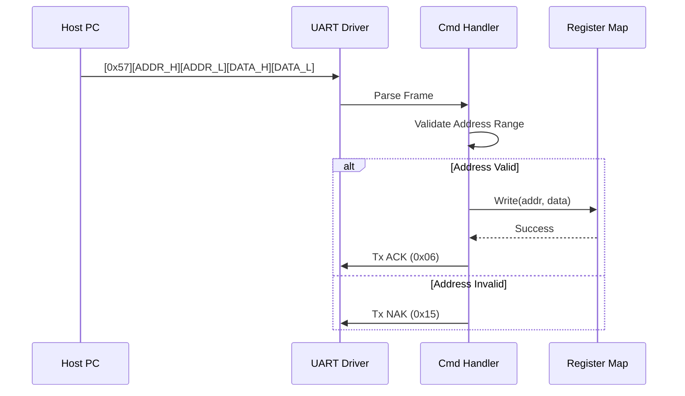
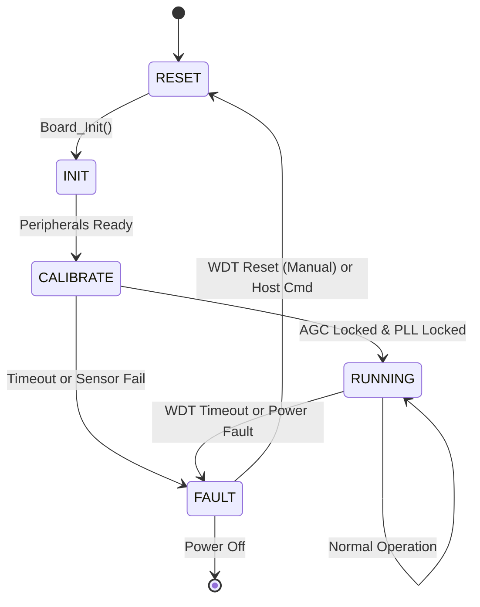
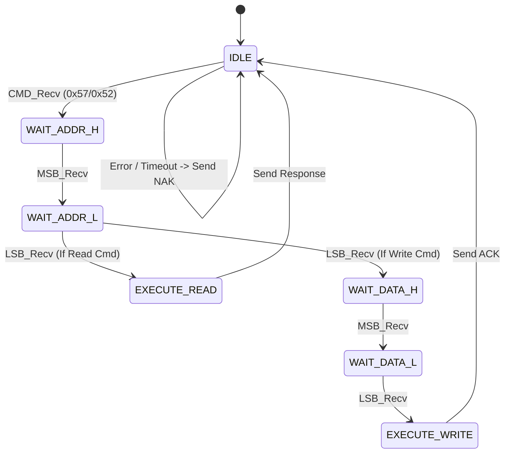
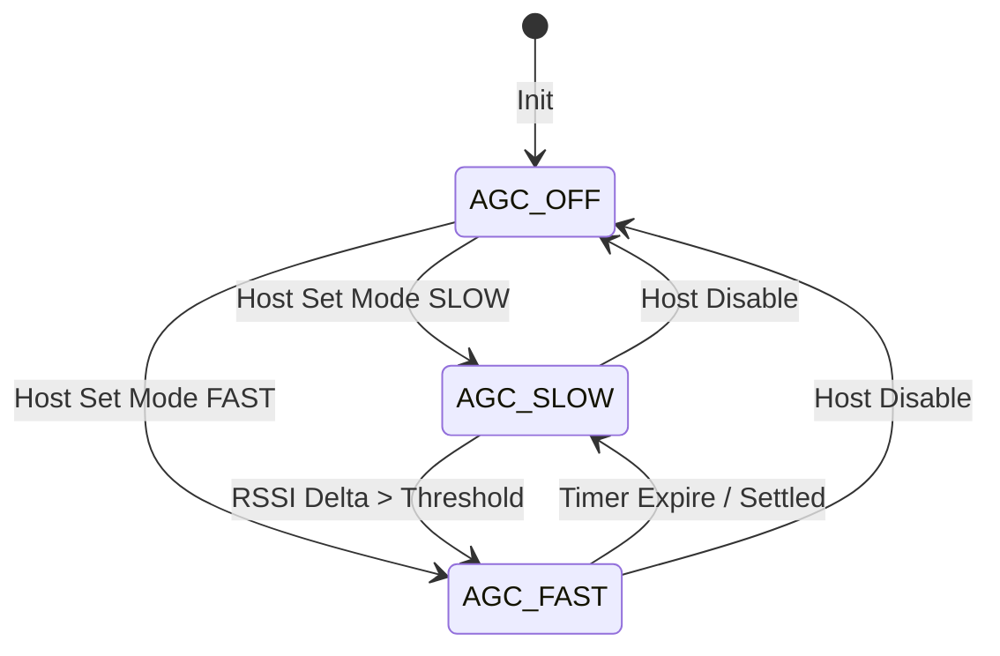

# Software Design Document (SDD)

**Project:** kgo RF Receiver Firmware
**Version:** 1.0
**Date:** 16 April 2026
**Author:** Senior Embedded Software Architect

---

## Document Control
| Version | Date | Author | Description |
|---------|------|--------|-------------|
| 1.0 | 16 April 2026 | System Architecture | Initial design release for kgo RF Receiver |

---

# 1. Introduction

## 1.1 Purpose
This Software Design Document (SDD) provides the comprehensive structural architecture, behavioral description, and interface specifications for the **kgo** RF Receiver Firmware. This document is intended for firmware engineers, FPGA designers, validation engineers, and system integrators. It translates the requirements defined in the **kgo SRS (v1.0)** into a concrete implementation plan using IEEE 1016-2009 recommended practices.

## 1.2 Scope
The design encompasses the embedded software executing on the Xilinx Kintex-7 FPGA fabric (MicroBlaze soft-core) and associated hard IP blocks.
*   **In Scope:** Board Support Package (BSP), Hardware Abstraction Layer (HAL) for SPI/I2C/UART, RF Front-End control logic (HMC1099, HMC698, HMC1052), PLL Synthesis (ADF5356), AGC algorithms, Data Acquisition buffering, and Power-On Self-Test (POST).
*   **Out of Scope:** Host PC GUI implementation (Qt6 structure provided for build integration only), downstream DSP algorithms (FFT/demodulation), and FPGA RTL logic for the ADC LVDS interface (assumed black-box IP).

**Target Hardware:** Xilinx XC7K325T-FFG900 (Kintex-7), 125 MHz System Clock.
**Toolchain:** Xilinx Vitis 2023.1, C99 Standard, MISRA-C:2012 compliant.

## 1.3 Definitions and Acronyms
| Acronym | Definition |
| :--- | :--- |
| **AGC** | Automatic Gain Control |
| **BIST** | Built-In Self-Test |
| **BSP** | Board Support Package |
| **CM** | Configuration Manager |
| **DMA** | Direct Memory Access |
| **EOF** | End of File |
| **FIFO** | First-In, First-Out |
| **FSM** | Finite State Machine |
| **GPIO** | General Purpose Input/Output |
| **HAL** | Hardware Abstraction Layer |
| **HMC** | Hittite Microwave Corporation (now Analog Devices) |
| **I2C** | Inter-Integrated Circuit (Serial Interface) |
| **ISR** | Interrupt Service Routine |
| **LVDS** | Low-Voltage Differential Signaling |
| **MISRA** | Motor Industry Software Reliability Association |
| **NVM** | Non-Volatile Memory |
| **PLL** | Phase-Locked Loop |
| **POST** | Power-On Self-Test |
| **RS-422** | Recommended Standard 422 (Differential UART) |
| **SFR** | Special Function Register |
| **SPI** | Serial Peripheral Interface |
| **UART** | Universal Asynchronous Receiver-Transmitter |
| **WDT** | Watchdog Timer |

## 1.4 References
1.  **SRS-kgo-1.0:** Software Requirements Specification.
2.  **GLR-kgo-0V01:** Glue Logic Requirements (FPGA Register Map).
3.  **HRS-kgo-1.0:** Hardware Requirements Specification.
4.  **IEEE 1016-2009:** Standard for Information Technology — Systems Design — Software Design Descriptions.
5.  **MISRA-C:2012:** Guidelines for the Use of the C Language in Critical Systems.
6.  **ADF5356 Datasheet:** Microwave Wideband Synthesizer with Integrated VCO.
7.  **HMC698LP4 Datasheet:** 0.25 dB LSB, 7-Bit Digital Step Attenuator.
8.  **LTC2992 Datasheet:** Dual/Quad Current/Voltage Monitor.

---

# 2. Design Viewpoints

## 2.1 Context Viewpoint — System Boundaries

The kgo firmware operates as the control brain for the analog RF chain and the data bridge for the digitized output. It acts as the slave device to the Host Computer via RS-422.

```mermaid
graph TD
    HOST[Host PC / cPCI System Controller] -->|RS-422 UART Cmd/Resp| UART[kgo UART Driver]
    HOST <-->|LVDS Data Stream (cPCI P2)| FPGA_DMA[LVDS DMA Controller]
    
    UART --> CMD[Command Handler]
    CMD --> REG[kgo FPGA Register Map]
    
    REG --> SPI[SPI Master Driver]
    REG --> I2C[I2C Master Driver]
    REG --> GPIO[GPIO Driver]
    
    SPI --> LNA[HMC1099 LNA Bias]
    SPI --> VGA[HMC698 VGA]
    SPI --> MIXER[HMC1052 Mixer]
    SPI --> PLL[ADF5356 PLL Synth]
    
    I2C --> TEMP[AD7416 Temp Sensor]
    I2C --> PWR[LTC2992 Power Monitor]
    I2C --> EEPROM[AT25640 EEPROM]
    
    GPIO --> ADC_CTRL[RFADC-12X1000 Control]
```

**External Interfaces:**
1.  **RS-422 UART:** Control interface (115200 baud, 8N1). Commands for config, status queries.
2.  **cPCI Backplane:** Power input (+3.3V, +5V, +12V) and high-speed LVDS data output.
3.  **JTAG:** Debug/Programming interface (initialization only).
4.  **RF Input:** 5-18 GHz analog signal (not a digital interface, but system context).

## 2.2 Composition Viewpoint — Software Architecture

The software is layered to ensure portability and MISRA compliance. The Application Layer manages system state, while the HAL abstracts the Xilinx IP cores.

```mermaid
graph TD
    APP[Application Layer]
    APP --> SCHED[Scheduler / Main Loop]
    
    subgraph Application Modules
        SCHED --> MON[System Monitor Task]
        SCHED --> CMD[Command Handler]
        SCHED --> AGC[AGC Controller]
        SCHED --> DIAG[Diagnostics Manager]
    end
    
    subgraph Hardware Abstraction Layer (HAL)
        CMD --> PLAT[Platform Manager]
        MON --> PLAT
        AGC --> RF_API[RF Control API]
        DIAG --> PLAT
    end
    
    subgraph Drivers
        PLAT --> DRV_UART[UART Driver]
        PLAT --> DRV_SPI[SPI Driver]
        PLAT --> DRV_I2C[I2C Driver]
        PLAT --> DRV_WDT[WDT Driver]
        RF_API --> DRV_SPI
        RF_API --> DRV_GPIO[GPIO Driver]
    end
    
    subgraph Hardware Peripherals
        DRV_UART --> IP_UART[AXI UARTLite 16550]
        DRV_SPI --> IP_SPI[AXI Quad SPI]
        DRV_I2C --> IP_I2C[AXI I2C Controller]
        DRV_GPIO --> IP_GPIO[AXI GPIO]
    end
```

### Detailed Module Composition

#### 1. Module: `kgo_plat_init` (Platform Initialization)
*   **Responsibility:** Configures the MicroBlaze interrupts, caches, and system clocks. Initializes the WDT. Verifies the FPGA Register Map version against the GLR.
*   **API:**
    ```c
    int32_t PLATFORM_Init(void);
    int32_t PLATFORM_GetInfo(PlatformInfo_t *info);
    void    PLATFORM_ResetSystem(void);
    ```
*   **Internal State:** `SystemState_t state`, `uint32_t uptime_ticks`.

#### 2. Module: `rf_control` (RF Front-End Driver)
*   **Responsibility:** Direct control over the RF chain components. Calculates register values for the HMC698 (VGA) and HMC1052 (Mixer) based on requested gain and mixer enable state.
*   **API:**
    ```c
    int32_t RF_Init(void);
    int32_t RF_SetAttenuation(uint8_t atten_0_63dB); // HMC698: 0.5dB steps
    int32_t RF_SetMixerState(bool enable);           // HMC1052 bias control
    int32_t RF_SetGain(int16_t gain_db);             // Composite API
    int32_t RF_GetCurrentGain(int16_t *gain_db);
    ```
*   **Config:** `#define RF_MAX_ATTENUATION_DB 315` (31.5 dB * 10).

#### 3. Module: `pll_driver` (ADF5356 Synthesizer)
*   **Responsibility:** Implements the register map calculation for the ADF5356 wideband synthesizer. Handles the locking sequence.
*   **API:**
    ```c
    int32_t PLL_Init(PLL_Cfg_t *cfg);
    int32_t PLL_SetFrequency(uint64_t freq_hz);
    bool    PLL_IsLocked(void);
    int32_t PLL_EnableRF(bool enable);
    ```
*   **Data Structures:**
    ```c
    typedef struct {
        uint64_t pfd_freq;
        uint32_t ref_divider;
        uint16_t int_value;
        uint16_t frac_value;
        uint8_t  mod_value;
        uint8_t  clock_divider;
    } PLL_Calc_t;
    ```

#### 4. Module: `agc_algorithm` (Automatic Gain Control)
*   **Responsibility:** Implements the closed-loop control to maintain optimal ADC input power. Monitors RSSI (from LTC2992 or ADC flags) and adjusts HMC698 attenuation.
*   **API:**
    ```c
    void    AGC_Init(int16_t target_level_mdb);
    void    AGC_Update(int16_t current_power_mdb); // Called periodically
    void    AGC_SetMode(AGC_Mode_e mode); // OFF, SLOW, FAST
    ```

#### 5. Module: `data_acq` (Data Acquisition Transport)
*   **Responsibility:** Manages the AXI DMA transfer configuration for streaming ADC samples. Sets up buffer descriptors.
*   **API:**
    ```c
    int32_t DATAQ_StartStream(uint32_t dest_addr_high, uint32_t dest_addr_low);
    int32_t DATAQ_StopStream(void);
    bool    DATAQ_IsOverflow(void);
    ```

#### 6. Module: `board_monitor` (Health & Safety)
*   **Responsibility:** Reads AD7416 (Temp) and LTC2992 (Power). Implements hysteretic shutdown logic.
*   **API:**
    ```c
    int32_t MON_GetTemperature(float *temp_c);
    int32_t MON_GetRailPower(Rail_e rail, float *volts, float *amps);
    bool    MON_IsFaultActive(void);
    void    MON_Task(void); // 1Hz polling
    ```

## 2.3 Logical Viewpoint — Data Model

Key data structures facilitating communication between the HAL and Application layers.



**Critical Enumerations:**
```c
// Error Codes
typedef enum {
    ERR_OK = 0x00,
    ERR_COMM_UART = 0x01,
    ERR_COMM_SPI = 0x02,
    ERR_COMM_I2C = 0x03,
    ERR_PARAM_RANGE = 0x04,
    ERR_PLL_UNLOCK = 0x05,
    ERR_TEMP_CRIT = 0x06,
    ERR_POWER_FAIL = 0x07,
    ERR_DMA_FAIL = 0x08
} ErrorCode_t;

// System States
typedef enum {
    STATE_RESET = 0,
    STATE_INIT,
    STATE_CALIBRATING,
    STATE_RUNNING,
    STATE_FAULT,
   _STATE_SHUTDOWN
} SystemState_e;
```

## 2.4 Dependency Viewpoint — Module Coupling



**Build Order:**
1.  **Drivers:** `drv_uart`, `drv_spi`, `drv_i2c`, `drv_gpio`, `drv_dma` (No dependencies).
2.  **HAL:** `rf_control`, `pll_driver`, `board_monitor` (Depend on Drivers).
3.  **Services:** `data_acq`, `agc_algorithm` (Depend on HAL).
4.  **Application:** `kgo_plat_init`, `cmd_handler` (Top level).

## 2.5 Interface Viewpoint — Complete API Specification

### 2.5.1 RF Control API (HMC698LP4 VGA)
```c
/**
 * @brief Sets the attenuation of the HMC698LP4 VGA.
 * 
 * @param atten_step Attenuation in 0.5dB steps. Range 0-63 (0 to 31.5dB).
 * @return int32_t ERR_OK on success, ERR_PARAM_RANGE if atten_step > 63.
 * 
 * @pre SPI Driver must be initialized.
 * @post Updates the shadow register and writes to SPI.
 * @note Uses SPI instance 0, Chip Select 2.
 */
int32_t RF_SetAttenuation(uint8_t atten_step);
```

### 2.5.2 PLL Driver API (ADF5356)
```c
/**
 * @brief Programs the ADF5356 to a specific frequency.
 * 
 * Calculates the INT, FRAC, and MOD registers based on the PFD frequency
 * and writes the 12-register map to the device via SPI.
 * 
 * @param freq_hz Target output frequency (53.125 MHz to 13.6 GHz).
 * @return int32_t ERR_OK on success, ERR_PLL_UNLOCK if lock fails.
 * 
 * @pre PLL_Init() must have been called.
 * @post Enters CALIBRATE state, waits for LOCK pin to go high.
 */
int32_t PLL_SetFrequency(uint64_t freq_hz);
```

### 2.5.3 I2C Sensor API (LTC2992)
```c
/**
 * @brief Reads voltage and current for a specific rail.
 * 
 * Reads the internal sense registers of the LTC2992. Performs
 * scaling to Volts and Amps based on sense resistor values.
 * 
 * @param rail 0=12V, 1=5V, 2=3.3V, 3=1.0V.
 * @param volts Pointer to store voltage in Volts.
 * @param amps Pointer to store current in Amps.
 * @return int32_t ERR_OK or ERR_COMM_I2C.
 */
int32_t MON_GetRailPower(uint8_t rail, float *volts, float *amps);
```

## 2.6 Interaction Viewpoint — Sequence Diagrams

### System Startup (POST)


### AGC Adjustment Cycle


### UART Register Write


## 2.7 State Viewpoint — State Machines

### Main System State Machine


### Command Handler State Machine (UART Parser)


### AGC Mode State Machine


## 2.8 Algorithm Viewpoint — Key Algorithms

### 2.8.1 ADF5356 Frequency Calculation
*   **Inputs:** `RFout_Hz` (Target), `RefClk_Hz` (125 MHz).
*   **Constants:** `PHASE_DETECT_PFD` = 25 MHz (Fixed in design).
*   **Logic:**
    1.  Calculate `N_DIV = floor(RFout_Hz / PHASE_DETECT_PFD)`.
    2.  Calculate `FRAC = RFout_Hz % PHASE_DETECT_PFD`.
    3.  Apply modulo arithmetic to fit `FRAC` and `MOD` into 24-bit registers.
    4.  Write to `Reg 0` (INT), `Reg 1` (FRAC), `Reg 2` (MOD).
    5.  Execute `Soft_Sync` via `Reg 4`.

### 2.8.2 AGC Hysteresis
*   **Logic:**
    If `RSSI_dBm < Target - 2dB`: Decrease Atten by 0.5 dB.
    If `RSSI_dBm > Target + 0.5dB`: Increase Atten by 0.5 dB.
    Else: Hold.
*   **Safety:** Clamp Atten between 0 and 31.5 dB.

### 2.8.3 CRC-16 (ModBus) for EEPROM
*   **Poly:** `0x8005`.
*   **Usage:** Verify configuration data read from AT25640.

---

## 2.9 Resource Viewpoint — Real-Time Constraints

### 2.9.1 Task Scheduling Table

| Task Name | Period | Worst-Case Exec Time | Priority | Deadline | Type |
|-----------|--------|---------------------|----------|----------|------|
| Main Loop | 1 ms | 200 us | Medium | 1 ms | Poll |
| AGC_Update | 100 ms | 50 us | Medium | 100 ms | Poll |
| MON_Task (Sensors) | 1000 ms | 15 ms | Low | 1000 ms | Poll |
| WDT_Pet | 10 ms | 5 us | High | 10 ms | Poll |
| UART_ISR | Event | 20 us | High | < 1 byte time | ISR |

### 2.9.2 Memory Budget (XC7K325T BRAM Utilization)

| Region | Size (KB) | Usage |
|--------|-----------|-------|
| .text (Code) | 128 | Firmware Logic |
| .rodata (Const) | 12 | PLL LUTs, Config Strings |
| .bss (Global/Static) | 32 | Buffers, State Structs |
| Stack (Main) | 8 | 2KB per task (4 tasks) |
| Heap | 0 | **Not Allowed (MISRA)** |
| **Total** | **180 KB** | Utilizes ~36 Block RAMs (36Kb) |

---

## 2.10 Build System Viewpoint

### 2.10.1 CMakeLists.txt Structure
```cmake
cmake_minimum_required(VERSION 3.20)
project(kgo_firmware VERSION 1.0.0 LANGUAGES C ASM)

set(CMAKE_C_STANDARD 99)
set(CMAKE_C_FLAGS "${CMAKE_C_FLAGS} -Wall -Wextra -Werror -misra-c=2012")

# 1. HAL Drivers Library
add_library(kgo_hal STATIC
    drivers/uart_k.c
    drivers/spi_k.c
    drivers/i2c_k.c
    drivers/gpio_k.c
    utils/crc16.c
)

# 2. Business Logic Library
add_library(kgo_logic STATIC
    modules/rf_control.c
    modules/pll_driver.c
    modules/agc_algo.c
    modules/board_monitor.c
)

# 3. Main Executable (MicroBlaze ELF)
add_executable(kgo_fw.elf
    src/main.c
    src/platform_init.c
    src/cmd_handler.c
    src/linker_script.ld
)

target_link_libraries(kgo_fw.elf PRIVATE kgo_hal kgo_logic)

# 4. Qt6 GUI (Host Side)
find_package(Qt6 REQUIRED COMPONENTS Core Widgets SerialPort)
add_executable(kgo_gui
    gui/main.cpp
    gui/main_window.cpp
    gui/register_map_model.cpp
)
target_link_libraries(kgo_gui PRIVATE Qt6::Core Qt6::Widgets Qt6::SerialPort)

# 5. Unit Tests (Host Side)
enable_testing()
find_package(GTest REQUIRED)
add_executable(kgo_tests
    tests/test_pll_calc.cpp
    tests/test_agc_logic.cpp
    tests/mock_spi.cpp
)
target_link_libraries(kgo_tests PRIVATE kgo_logic GTest::gtest_main)
include(GoogleTest)
gtest_discover_tests(kgo_tests)
```

---

# 3. Design Rationale

## 3.1 Architecture Choices
1.  **Selection of MicroBlaze vs. Bare-metal VHDL/Verilog:**
    *   *Decision:* Implement control logic in C on MicroBlaze.
    *   *Rationale:* The complexity of the UART protocol, AGC math (floating point), and I2C state machines is higher than typical RTL comfort levels. C allows for rapid iteration and easier maintenance of the command parsing logic.
    *   *Trade-off:* Slightly higher latency than pure RTL (~1us vs 10ns), but acceptable for 10ms AGC requirements.

2.  **Static Allocation:**
    *   *Decision:* Ban `malloc`/`free`.
    *   *Rationale:* Embedded systems determinism. Heap fragmentation causes hard-to-debug crashes in long-running RF systems. BRAM is scarce; static sizing forces accurate budgeting.

3.  **SPI Polarity/Mode:**
    *   *Decision:* Configurable via defines, default to CPOL=0, CPHA=0.
    *   *Rationale:* ADF5356 supports SPI Modes 0/1, HMC698 supports Mode 0. We standardize on Mode 0 to minimize silicon switching overhead between devices.

## 3.2 MISRA-C:2012 Compliance
*   All variables defined at the smallest scope necessary.
*   No implicit type conversions (explicit casts used).
*   Run-time checking of array indices for ring buffers.
*   Verified using Coverity or QAC static analysis tools during CI build.

---

# 4. Design Traceability Matrix

| SDD Module / Function | Implements SRS REQ | Description |
|-----------------------|-------------------|-------------|
| `PLATFORM_Init` | REQ-SW-001 | System initialization |
| `RF_SetAttenuation` | REQ-SW-002 | RF Gain Control |
| `PLL_SetFrequency` | REQ-SW-003 | LO Frequency Programming |
| `MON_GetTemperature` | REQ-SW-004 | Health Monitoring |
| `UART_ISR` / `CMD_Parse` | REQ-SW-005 | RS-422 Command Processing |
| `AGC_Update` | REQ-SW-006 | Automatic Gain Control Loop |
| `DATAQ_StartStream` | REQ-SW-007 | Data Transport to Host |
| `PLATFORM_ResetSystem` | REQ-SW-008 | Fault Handling / Reset |
| `MON_GetRailPower` | REQ-SW-009 | Power Consumption Monitoring |

---

# 5. Appendices

## Appendix A — File Structure
```
kgo_firmware/
├── src/
│   ├── main.c
│   ├── platform_init.c
│   └── cmd_handler.c
├── drivers/
│   ├── uart_k.c/h
│   ├── spi_k.c/h
│   └── i2c_k.c/h
├── modules/
│   ├── rf_control.c/h
│   ├── pll_driver.c/h
│   ├── agc_algo.c/h
│   └── board_monitor.c/h
├── tests/
│   └── test_pll_algo.cpp
└── gui/
    └── main_window.cpp
```

## Appendix B — FPGA Register Map (Derived from GLR)
*Base Address: 0x44A0_0000 (AXI Lite)*

| Offset | Name | R/W | Reset | Description |
|--------|------|-----|-------|-------------|
| 0x00 | CTRL | W | 0x0000_0000 | Global Control (Bit 0: Soft Reset) |
| 0x04 | STATUS | R | 0x0000_0000 | Status Flags (Bit 0: PLL_LOCK) |
| 0x08 | TX_DATA | W | 0x0000_0000 | SPI TX Data FIFO (MOSI) |
| 0x0C | RX_DATA | R | 0x0000_0000 | SPI RX Data FIFO (MISO) |
| 0x10 | SPI_CTRL | W | 0x0000_0000 | SPI Config (CS_Select, Start_Bit) |
| 0x14 | GPIO_OUT | W | 0xFFFF_FFFF | GPIO Outputs (Mixer En, LNA En) |
| 0x18 | GPIO_IN | R | 0x0000_0000 | GPIO Inputs (Prescale, Faults) |

## Appendix C — Memory Map
*   **FPGA Bitstream:** QSPI Flash @ 0x00000000 (Bootloader loads this).
*   **App Code:** DDR @ 0x8000_0000 (Loaded by bootloader).
*   **EEPROM (I2C):** 0x50 (Data Storage).

## Appendix D — Coding Standards Checklist
*   [x] All functions return `int32_t` (except strictly void getters).
*   [x] Check for NULL pointers in all public APIs.
*   [x] `const` keyword applied to all data passed by pointer that is not modified.
*   [x] Magic numbers replaced by `#define` or `enum`.
*   [x] No recursion.
*   [x] Bitwise operations on unsigned integers only.