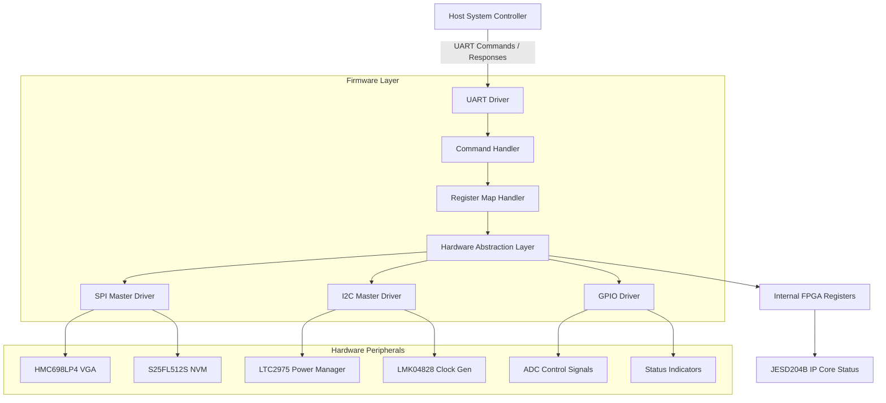
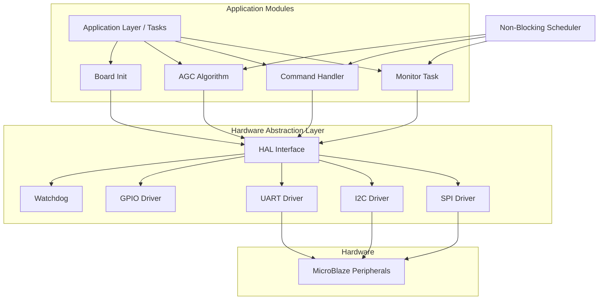
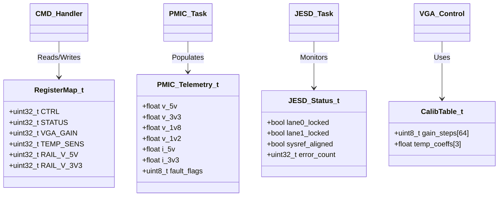
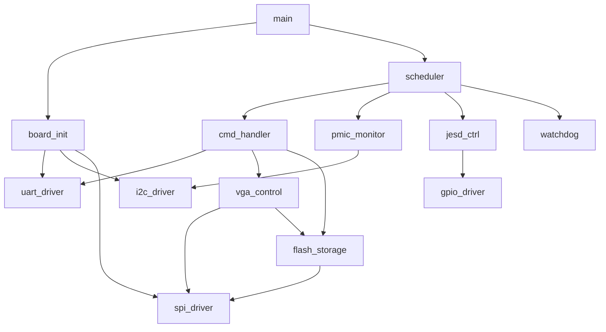
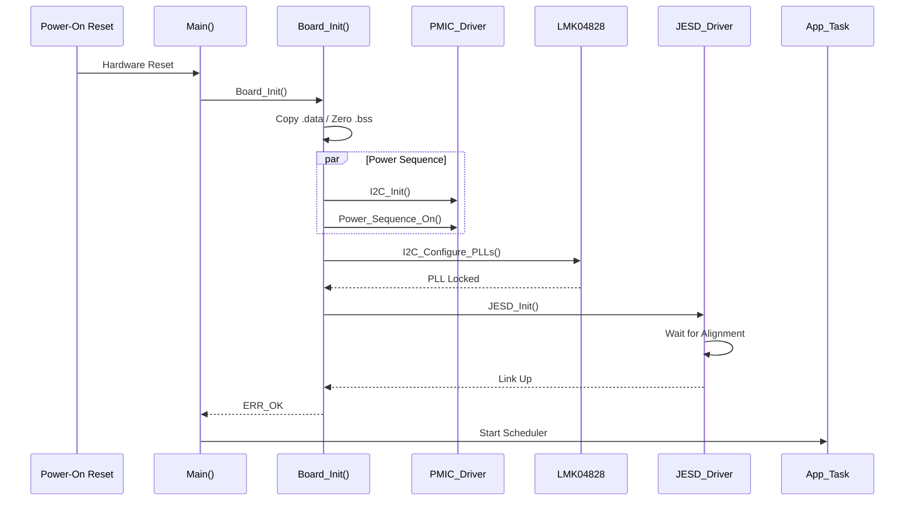
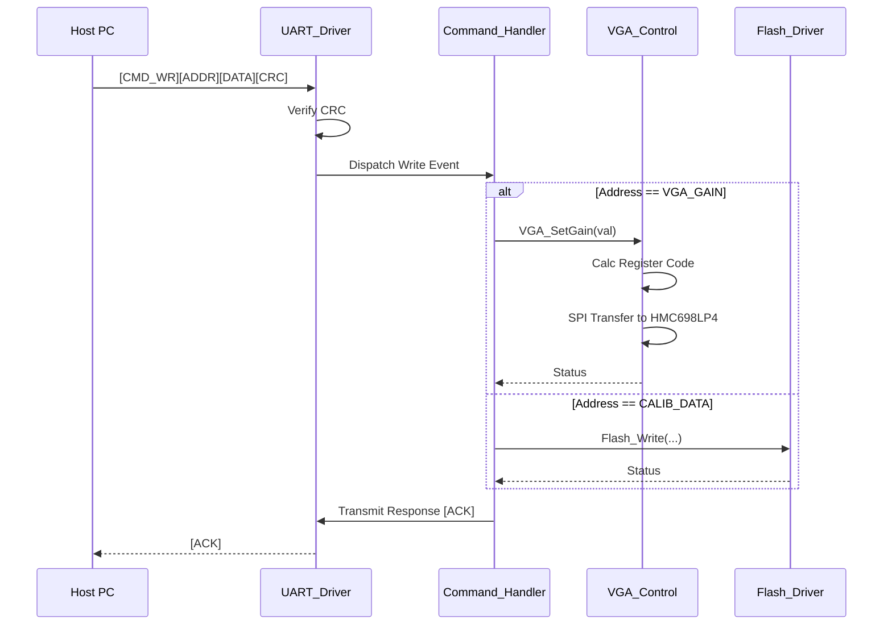
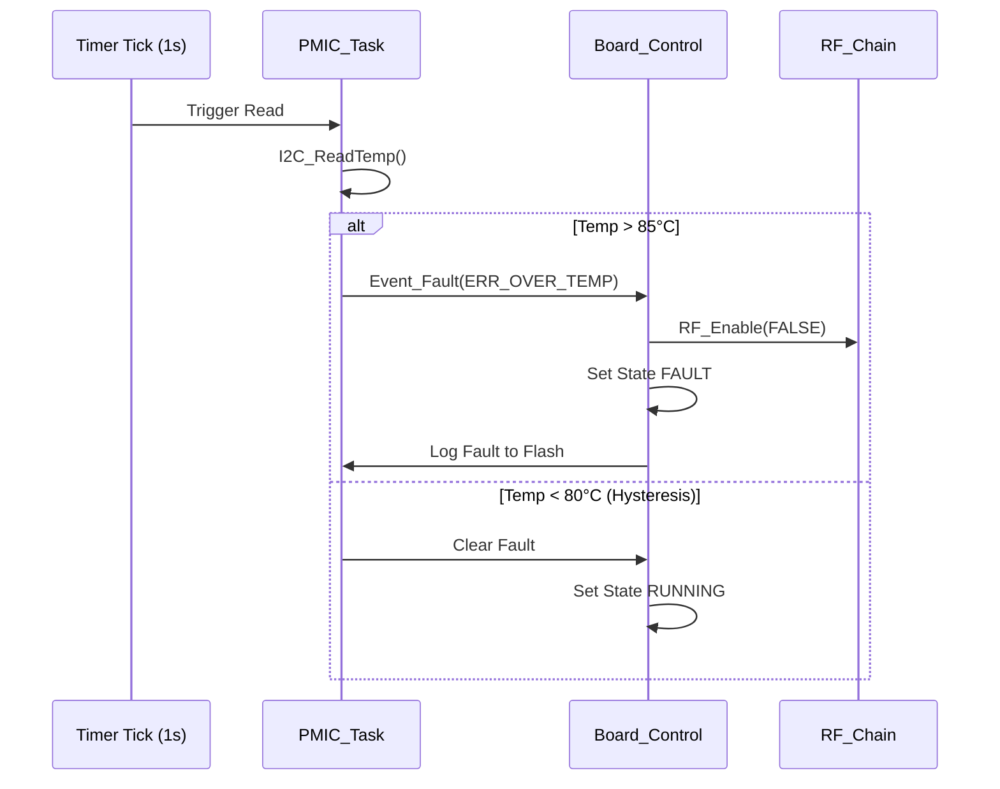
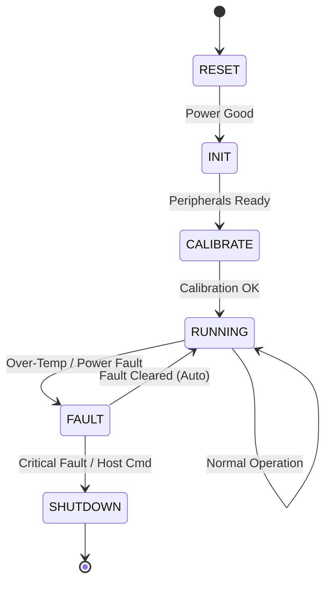
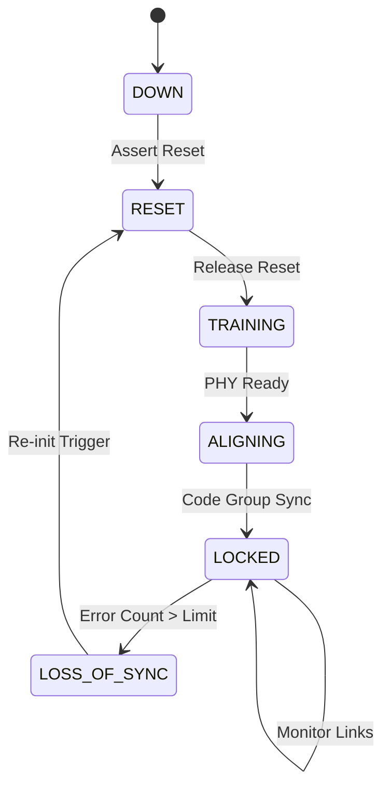

# Software Design Document (SDD)

**Project:** kh (Wideband RF Receiver Module)
**Version:** 1.0
**Date:** 15 April 2026
**Author:** Senior Embedded Software Architect
**Standard:** IEEE 1016-2009

---

## Document Control
| Version | Date | Author | Description |
|---------|------|--------|-------------|
| 1.0 | 15 April 2026 | Senior Embedded Architect | Initial design release compliant with IEEE 1016-2009 |

---

# 1. Introduction

## 1.1 Purpose
This Software Design Document (SDD) provides the comprehensive structural and behavioral design specification for the embedded firmware controlling the **kh** Wideband RF Receiver Module. It defines the software architecture, data structures, algorithms, and interfaces necessary to implement the requirements defined in the **kh** Software Requirements Specification (SRS) Rev 1.0.

This document serves as the blueprint for firmware engineers implementing the C-based embedded logic on the MicroBlaze/Soft-core subsystem within the Xilinx XC7K325T FPGA. It also guides verification engineers in developing test benches and Hardware-in-Loop (HIL) validation procedures.

## 1.2 Scope
The design encompasses the firmware responsible for:
*   **Initialization:** Power sequencing (via LTC2975), Clock generation (LMK04828BKNQ), and JESD204B link training (ADC12DJ5200RF).
*   **RF Control:** Digital Gain Control (DGC) of the HMC698LP4 VGA via SPI.
*   **Monitoring:** Thermal management and power rail telemetry.
*   **Communication:** UART-based register protocol and I2C device management.
*   **Data Management:** Non-volatile storage (S25FL512S) of calibration coefficients.

**Exclusions:** High-speed DSP signal paths (implemented in RTL), host PC GUI source code, and FPGA bitstream logic synthesis.

## 1.3 Definitions and Acronyms

| Term | Definition |
| :--- | :--- |
| **ADC** | Analog-to-Digital Converter |
| **AGC** | Automatic Gain Control |
| **API** | Application Programming Interface |
| **BSP** | Board Support Package |
| **CBR** | Constant Bit Rate |
| **CRC** | Cyclic Redundancy Check |
| **DGC** | Digital Gain Control |
| **DMA** | Direct Memory Access |
| **EOF** | End of Frame |
| **FIFO** | First-In, First-Out buffer |
| **FPGA** | Field-Programmable Gate Array |
| **FSM** | Finite State Machine |
| **GLR** | Glue Logic Requirements |
| **GPIO** | General Purpose Input/Output |
| **HAL** | Hardware Abstraction Layer |
| **HRS** | Hardware Requirements Specification |
| **I2C** | Inter-Integrated Circuit |
| **ISR** | Interrupt Service Routine |
| **JESD** | JESD204B Standard |
| **LNA** | Low Noise Amplifier |
| **MCU** | Microcontroller Unit |
| **MISR** | Multiple Input Signature Register |
| **MISO** | Master In Slave Out |
| **MOSI** | Master Out Slave In |
| **NF** | Noise Figure |
| **NVM** | Non-Volatile Memory |
| **OS** | Operating System |
| **PCB** | Printed Circuit Board |
| **PLL** | Phase-Locked Loop |
| **POST** | Power-On Self-Test |
| **RF** | Radio Frequency |
| **RTL** | Register Transfer Level |
| **RX** | Receive |
| **SFDR** | Spurious-Free Dynamic Range |
| **SNR** | Signal-to-Noise Ratio |
| **SPI** | Serial Peripheral Interface |
| **SRS** | Software Requirements Specification |
| **TEMP** | Temperature |
| **UART** | Universal Asynchronous Receiver/Transmitter |
| **VGA** | Variable Gain Amplifier |
| **WDT** | Watchdog Timer |

## 1.4 References
1.  **IEEE 1016-2009:** Standard for Information Technology — Systems Design — Software Design Descriptions.
2.  **SRS (kh):** Software Requirements Specification, Rev 1.0, 15 April 2026.
3.  **HRS (kh):** Hardware Requirements Specification, Rev 1.0, 15 April 2026.
4.  **GLR (kh):** Glue Logic Requirements, Rev 0V01, 15 April 2026.
5.  **MISRA C:2012:** Guidelines for the use of the C language in critical systems.
6.  **HMC698LP4 Datasheet:** Analog Devices, 6-18 GHz Digital VGA.
7.  **LTC2975 Datasheet:** Analog Devices, Quad Power System Manager.
8.  **LMK04828 Datasheet:** Texas Instruments, JESD204B Clock Jitter Cleaner.
9.  **S25FL512S Datasheet:** Infineon, 512 Mb Configuration Flash.

---

# 2. Design Viewpoints

## 2.1 Context Viewpoint — System Boundaries

The firmware operates within the FPGA fabric, interfacing between the Host System Controller and the RF analog hardware. The firmware acts as the control plane for the data plane implemented in RTL.



**External Interfaces:**
1.  **Host PC:** Sends configuration commands and reads telemetry via UART (115200 baud, 8-N-1).
2.  **RF Chain:** HMC698LP4 (SPI target), requires gain adjustment based on RF power levels.
3.  **Power Management:** LTC2975 (I2C target), requires fault polling and voltage monitoring.
4.  **Clocking:** LMK04828 (I2C target), requires PLL configuration for SYSREF.

## 2.2 Composition Viewpoint — Software Architecture

The software follows a layered architecture to ensure portability and maintainability. The Application Layer is strictly event-driven, while the HAL provides hardware-specific implementations.



### Module List with Responsibilities

#### Module: board_init (board_init.c / board_init.h)
*   **Responsibilities:** Orchestrates the power-on sequence. Initializes the BSP, configures the PLLs, brings up I2C/SPI buses, performs Power-On Self-Test (POST), and starts the watchdog.
*   **Public API:**
    ```c
    /**
     * @brief Initialize the entire board hardware and software state.
     * @return ERR_OK on success, error code on failure.
     */
    int32_t Board_Init(void);

    /**
     * @brief Retrieve board version and serial information.
     * @param info Pointer to BoardInfo_t structure to populate.
     * @return ERR_OK on success.
     */
    int32_t Board_GetInfo(BoardInfo_t *info);

    /**
     * @brief Run Power-On Self-Test (POST) routines.
     * @param test_mask Bitmask of tests to run.
     * @return ERR_OK if all tests pass, specific error code otherwise.
     */
    int32_t Board_RunPOST(uint32_t test_mask);
    ```
*   **Internal State:**
    ```c
    typedef struct {
        uint8_t  hw_rev;
        uint32_t serial_num;
        uint8_t  mac_addr[6];
        bool     post_passed;
    } BoardInfo_t;
    ```

#### Module: uart_driver (uart_driver.c / uart_driver.h)
*   **Responsibilities:** Manages the UART physical layer (interrupt-driven RX/TX), implements the framing protocol defined in the GLR (Start byte + Address + Data + CRC), and manages TX/RX circular buffers.
*   **Public API:**
    ```c
    int32_t UART_Init(uint32_t baud_rate);
    int32_t UART_Deinit(void);
    
    // Non-blocking write
    int32_t UART_Transmit(const uint8_t *data, uint16_t len); 
    
    // Called by ISR or main loop to process received bytes
    void UART_ProcessRx(void); 
    
    // Register protocol handlers
    int32_t UART_WriteReg(uint16_t addr, uint32_t data);
    int32_t UART_ReadReg(uint16_t addr, uint32_t *data);
    ```
*   **Configuration Constants:** `UART_BAUDRATE` (115200), `UART_RX_BUF_SIZE` (256), `UART_TX_BUF_SIZE` (256).

#### Module: i2c_driver (i2c_driver.c / i2c_driver.h)
*   **Responsibilities:** Provides multi-master I2C support. Handles bus arbitration, clock stretching (by slaves), and retry logic for failed ACKs.
*   **Public API:**
    ```c
    int32_t I2C_Init(uint32_t clock_hz);
    int32_t I2C_Write(uint8_t dev_addr, const uint8_t *data, uint16_t len);
    int32_t I2C_Read(uint8_t dev_addr, uint8_t *buf, uint16_t len);
    
    // Register level access
    int32_t I2C_WriteReg(uint8_t dev_addr, uint8_t reg, uint8_t val);
    int32_t I2C_ReadReg(uint8_t dev_addr, uint8_t reg, uint8_t *val);
    
    // Block read for PMIC telemetry
    int32_t I2C_ReadBlock(uint8_t dev_addr, uint8_t reg, uint8_t *buf, uint16_t len);
    ```

#### Module: spi_driver (spi_driver.c / spi_driver.h)
*   **Responsibilities:** Manages the SPI master interface. Supports different SPI modes (CPOL/CPHA) required by the Flash (Mode 0) and VGA (Mode 0 or 3). Handles Chip Select (CS) assertion.
*   **Public API:**
    ```c
    int32_t SPI_Init(void);
    int32_t SPI_Transfer(uint8_t cs_id, const uint8_t *tx_data, uint8_t *rx_data, uint16_t len);
    int32_t SPI_WriteNoRead(uint8_t cs_id, const uint8_t *tx_data, uint16_t len);
    ```

#### Module: vga_control (vga_control.c / vga_control.h)
*   **Responsibilities:** Implements the Digital Gain Control (DGC) algorithm for the HMC698LP4. Converts desired dB gain into the 6-bit register code. Retrieves calibration tables from NVM.
*   **Public API:**
    ```c
    /**
     * @brief Initialize VGA driver and load calibration tables.
     */
    int32_t VGA_Init(void);
    
    /**
     * @brief Set the VGA gain.
     * @param gain_db Desired gain in dB (Range: -31.5 to 0 in 0.5 steps).
     * @return ERR_OK on success.
     */
    int32_t VGA_SetGain(float gain_db);
    
    /**
     * @brief Get current gain setting.
     * @return Current gain in dB.
     */
    float VGA_GetGain(void);
    ```

#### Module: pmic_monitor (pmic_monitor.c / pmic_monitor.h)
*   **Responsibilities:** Interfaces with LTC2975. Reads voltage/current telemetry for all rails (5V, 3.3V, 1.8V, 1.2V). Implements shutdown logic on over-voltage/under-voltage faults.
*   **Public API:**
    ```c
    int32_t PMIC_Init(void);
    int32_t PMIC_GetTelemetry(PMIC_Telemetry_t *data);
    int32_t PMIC_ClearFaults(void);
    bool    PMIC_IsFaultActive(void);
    ```

#### Module: jesd_ctrl (jesd_ctrl.c / jesd_ctrl.h)
*   **Responsibilities:** Monitors the JESD204B IP core status registers (SYSREF alignment, Lane 0/1 status). Handles link re-initialization requests.
*   **Public API:**
    ```c
    int32_t JESD_Init(void);
    int32_t JESD_Enable(void);
    int32_t JESD_GetStatus(JESD_Status_t *status);
    ```
*   **Internal State:**
    ```c
    typedef struct {
        bool lane0_locked;
        bool lane1_locked;
        bool sysref_aligned;
        bool buffer_overflow;
    } JESD_Status_t;
    ```

#### Module: flash_storage (flash_storage.c / flash_storage.h)
*   **Responsibilities:** Abstracts the S25FL512S NOR Flash. Implements sector erase, page programming, and read operations. Manages wear leveling if necessary (though primarily used for configuration storage).
*   **Public API:**
    ```c
    int32_t Flash_Init(void);
    int32_t Flash_Read(uint32_t addr, uint8_t *buf, uint32_t len);
    int32_t Flash_Write(uint32_t addr, const uint8_t *buf, uint32_t len);
    int32_t Flash_EraseSector(uint32_t sector_addr);
    ```

#### Module: cmd_handler (cmd_handler.c / cmd_handler.h)
*   **Responsibilities:** Parses UART frames (CMD + ADDR + DATA). Dispatches read/write commands to the register map or peripheral drivers. Constructs and transmits response frames.
*   **Public API:**
    ```c
    void CMD_Init(void);
    void CMD_Task(void); // Main loop processing
    ```

## 2.3 Logical Viewpoint — Data Model

The system relies on a centralized Register Map exposed to the host, along with internal state structures for control loops.



**Enumerations & Type Definitions:**

```c
typedef enum {
    SYS_STATE_RESET = 0,
    SYS_STATE_INIT,
    SYS_STATE_CALIBRATING,
    SYS_STATE_RUNNING,
    SYS_STATE_FAULT,
    SYS_STATE_SHUTDOWN
} SystemState_e;

typedef enum {
    ERR_OK = 0x00,
    ERR_TIMEOUT = 0x01,
    ERR_COMM = 0x02,
    ERR_CHECKSUM = 0x03,
    ERR_PARAM = 0x04,
    ERR_HARDWARE = 0x05,
    ERR_NVM = 0x06,
    ERR_OVER_TEMP = 0x07,
    ERR_POWER_FAULT = 0x08
} ErrorCode_t;

// HMC698LP4 Gain Mapping
// 6-bit word. MSB is 1 for positive gain logic (device specific).
// 0x3F = Max Gain, 0x00 = Min Gain (typo check: usually inverted or direct)
// Assuming direct mapping: Value = (31.5 - gain_db) / 0.5
typedef uint8_t VGA_GainCode_t;
```

## 2.4 Dependency Viewpoint — Module Dependencies



**Build Order Strategy:**
1.  **Utils:** Circular buffer, CRC implementations.
2.  **HAL Drivers:** UART, I2C, SPI, GPIO.
3.  **Bus Managers:** Flash driver (uses SPI), PMIC driver (uses I2C).
4.  **Application Modules:** VGA, JESD, Command Handler.
5.  **Main:** `board_init` and `main.c`.

## 2.5 Interface Viewpoint — Complete API Specification

### Function: `VGA_SetGain`

```c
/**
 * @brief Set the gain of the HMC698LP4 VGA.
 * 
 * This function converts a floating-point dB value into the 6-bit code
 * required by the HMC698LP4. It utilizes linear interpolation from a
 * calibration table stored in NVM to ensure accuracy.
 *
 * @param gain_db Desired gain in dB. Valid range: [-31.5, 0.0].
 * 
 * @return int32_t 
 *   - ERR_OK (0): Success.
 *   - ERR_PARAM: gain_db out of range.
 *   - ERR_COMM: SPI transaction failed.
 *   - ERR_NVM: Calibration table read error.
 *
 * @pre  VGA_Init() must have been called successfully.
 * @post The HMC698LP4 SPI latch is updated with the new 6-bit code.
 *
 * @example
 *   // Set gain to -10.5 dB
 *   if (VGA_SetGain(-10.5f) != ERR_OK) {
 *       // Handle error
 *   }
 */
int32_t VGA_SetGain(float gain_db);
```

### Function: `PMIC_GetTelemetry`

```c
/**
 * @brief Read voltage and current telemetry from the LTC2975.
 * 
 * Performs a block read over I2C from the LTC2975 telemetry registers.
 * Converts raw ADC counts to engineering units (Volts/Amps) using
 * scaling factors defined in the HRS.
 *
 * @param data Pointer to a PMIC_Telemetry_t structure to populate.
 * 
 * @return int32_t
 *   - ERR_OK: Success.
 *   - ERR_COMM: I2C ACK not received.
 *   - ERR_TIMEOUT: I2C bus hung.
 *
 * @pre  I2C_Init() must be complete.
 * @post data structure contains valid readings.
 */
int32_t PMIC_GetTelemetry(PMIC_Telemetry_t *data);
```

### Function: `JESD_Init`

```c
/**
 * @brief Initialize the JESD204B link.
 * 
 * Configures the ADC12DJ5200RF registers via SPI (if direct control exists)
 * or enables the link reset within the FPGA glue logic. Waits for the
 * PHY layer to align and the SYSREF signal to be captured.
 *
 * @return int32_t
 *   - ERR_OK: Link initialized and aligned.
 *   - ERR_TIMEOUT: Link did not align within 100ms.
 *
 * @note  This is a blocking call during Board_Init().
 */
int32_t JESD_Init(void);
```

## 2.6 Interaction Viewpoint — Sequence Diagrams

### System Initialization Sequence



### Host Command Processing (Write)



### Fault Handling Sequence (Over-Temperature)



## 2.7 State Viewpoint — State Machines

### Top-Level System State Machine



### JESD Link State Machine



## 2.8 Algorithm Viewpoint — Key Algorithms

### 2.8.1 VGA Gain Calculation
To achieve a linear dB step of 0.5 dB using the 6-bit integer control of the HMC698LP4:
1.  Determine desired attenuation `Attn_dB` (where Gain = -Attn).
2.  Calculate code: `Code = (int16_t)(Attn_dB * 2.0)`.
3.  Clamp code to range [0, 63] (0x00 to 0x3F).
4.  Invert logic if necessary: The HMC698LP4 datasheet defines the gain step relationship.
    *   `Reg_Val = 63 - Code` (Assuming 0x00 is max attenuation/min gain).
5.  Perform SPI Write to address `0x00` (Latch) or `0x01` (Gain Control), depending on chip select mapping.

### 2.8.2 UART Frame Checksum (CRC-8)
A CRC-8 (Polynomial 0x07, Init 0x00) is used to ensure integrity of command frames.
*   *Input:* `Frame = [CMD, ADDR_H, ADDR_L, DATA_H, DATA_L]`
*   *Calculation:* Standard bitwise CRC algorithm.
*   *Validation:* Compare calculated CRC with received CRC byte. If mismatch, respond with `NAK` (0x15) and discard frame.

### 2.8.3 I2C Retry Logic
Due to potential clock stretching by the LTC2975 during ADC conversions:
```c
#define I2C_MAX_RETRIES 3

int32_t I2C_WriteReg(uint8_t dev, uint8_t reg, uint8_t val) {
    for (uint8_t i = 0; i < I2C_MAX_RETRIES; i++) {
        if (I2C_Transfer(dev, &reg, 1, &val, 1) == ERR_OK) {
            return ERR_OK;
        }
        // Small delay to let slave finish
        Timer_DelayUs(100);
    }
    return ERR_TIMEOUT;
}
```

---

# 3. Design Rationale

## 3.1 Architecture Choices

1.  **Bare-Metal vs. RTOS:**
    *   *Decision:* Bare-metal super-loop with interrupt handling.
    *   *Rationale:* The system control bandwidth is low (kHz range). The deterministic nature of bare-metal code simplifies verification (MISRA compliance) and avoids the overhead of context switching on the MicroBlaze, which has limited instruction cache compared to hard-core processors.

2.  **Static vs. Dynamic Memory:**
    *   *Decision:* All memory is statically allocated (global or stack).
    *   *Rationale:* MISRA C:2012 prohibits dynamic heap allocation (`malloc`/`free`) due to risks of fragmentation and non-deterministic execution time.

3.  **Polling vs. Interrupts for UART:**
    *   *Decision:* Interrupt-driven RX, Polling/Batch TX.
    *   *Rationale:* RX must be interrupt-driven to avoid character loss at 115200 baud. TX can be blocking or interrupt-driven; for simplicity in the command handler, polling for TX complete is acceptable given the low command frequency.

4.  **VGA Calibration Storage:**
    *   *Decision:* Store look-up tables in SPI Flash, load to SRAM at boot.
    *   *Rationale:* Reading from SPI Flash on every gain change is too slow (~20ms). RAM access is instantaneous.

## 3.2 MISRA-C:2012 Compliance Strategy
*   **Tooling:** PC-lint Plus or Coverity configured for MISRA C:2012.
*   **Enforcement:** Continuous Integration (CI) pipeline will fail if any deviations are documented (unless justified by a Deviation Record).
*   **Specific Rules:**
    *   Rule 11.4 (A cast should not be performed between a pointer type and an integer type): STRICTLY enforced for memory-mapped registers. Use `volatile uint32_t*` pointers defined in headers.
    *   Rule 13.5 (The right hand operand of a logical && or || operator shall not contain side effects): Enforced in `while` loops checking I2C status.

---

# 4. Design Traceability Matrix

| SDD Component / Function | Implements REQ-SW-xxx | Design Element / Justification |
| :--- | :--- | :--- |
| **System Init** | | |
| `Board_Init` | REQ-SW-001, REQ-SW-002 | Initializes clocks, PSU. |
| `Board_RunPOST` | REQ-SW-009 | Executes startup BIST. |
| **Communication** | | |
| `UART_Init` | REQ-SW-012 | Configures 115200, 8N1. |
| `CMD_Task` | REQ-SW-013, REQ-SW-014 | Parses host command frames. |
| `I2C_Init` | REQ-SW-021 | Configures 400kHz bus. |
| **RF Control** | | |
| `VGA_SetGain` | REQ-SW-031, REQ-SW-032 | Controls HMC698LP4 attenuation. |
| `VGA_Init` | REQ-SW-033 | Loads calibration from NVM. |
| **Power/Thermal** | | |
| `PMIC_GetTelemetry` | REQ-SW-041, REQ-SW-042 | Monitors LTC2975 rails. |
| `PMIC_Task` | REQ-SW-043 | Checks overtemp/faults. |
| **Clocking** | | |
| `LMK_Init` | REQ-SW-051 | Configures PLLs via I2C. |
| **JESD Interface** | | |
| `JESD_Init` | REQ-SW-061 | Aligns JESD204B link. |
| `JESD_GetStatus` | REQ-SW-062 | Reports link status to Host. |
| **Storage** | | |
| `Flash_Write` | REQ-SW-071 | Writes config to S25FL512S. |
| `Flash_Read` | REQ-SW-072 | Reads config from S25FL512S. |

---

# 5. Appendices

## Appendix A — File Structure

```
root/
├── firmware/
│   ├── src/
│   │   ├── main.c                  # Entry point
│   │   ├── board/
│   │   │   ├── board_init.c
│   │   │   └── board_config.h      # Hardware defines
│   │   ├── drivers/
│   │   │   ├── uart/
│   │   │   │   ├── uart_driver.c
│   │   │   │   └── uart.h
│   │   │   ├── i2c/
│   │   │   │   ├── i2c_driver.c
│   │   │   │   └── i2c.h
│   │   │   ├── spi/
│   │   │   │   ├── spi_driver.c
│   │   │   │   └── spi.h
│   │   │   └── gpio/
│   │   │       ├── gpio.c
│   │   │       └── gpio.h
│   │   ├── app/
│   │   │   ├── cmd_handler.c
│   │   │   ├── vga_control.c
│   │   │   ├── pmic_monitor.c
│   │   │   ├── jesd_ctrl.c
│   │   │   └── flash_storage.c
│   │   └── utils/
│   │       ├── crc8.c
│   │       └── ring_buffer.c
│   ├── inc/
│   │   └── common.h                # Common types (MISRA)
│   └── test/
│       └── unit/
│           ├── test_uart.c
│           └── test_vga.c
├── cmake/
│   └── toolchain-arm-none-eabi.cmake
├── CMakeLists.txt
└── README.md
```

## Appendix B — Register Map Summary

**Base Address:** 0x4000_0000 (AXI Lite Slave)

| Offset | Name | Access | Description | Reset Value |
|:-------|:-----|:-------|:------------|:-----------|
| 0x00 | `SCRATCH` | RW | Test register | 0xDEADBEEF |
| 0x04 | `FIRMWARE_VER` | RO | Firmware Version | 0x01_00_00 |
| 0x08 | `BOARD_ID` | RO | Hardware ID | 0x0000_0001 |
| 0x10 | `CTRL` | RW | System Control (Bit 0: RF Enable) | 0x00 |
| 0x14 | `STATUS` | RO | System Status (Bit 0: JESD Locked) | 0x00 |
| 0x20 | `VGA_GAIN` | RW | VGA Gain Setting (float, encoded) | 0x00 |
| 0x30 | `TEMP_INTEG` | RO | On-board Temperature (0.001 C) | 0x00 |
| 0x40 | `FAULT_FLAGS` | RO | PMIC Fault Flags | 0x00 |
| 0x50 | `CALIB_CRC` | RO | CRC32 of Calibration Data | 0x00 |

## Appendix C — Memory Map

*   **MicroBlaze Instruction Cache:** 32 KB
*   **MicroBlaze Data Cache:** 16 KB
*   **Shared BRAM (FPGA <-> MCU):** 8 KB (Used for JESD status flags)
*   **SRAM (External/DDR):** Not used in this minimal design.
*   **Flash (SPI):** 64 MB (Addressable via `flash_storage`).

## Appendix D — Coding Standards Checklist

*   [ ] All functions have a `Function Comment` block (Purpose, Params, Returns).
*   [ ] Magic numbers are replaced by `#define` or `enum`.
*   [ ] No implicit type conversions (Use explicit casts `uint32_t`).
*   [ ] All variables initialized at declaration.
*   [ ] `bool` type from `<stdbool.h>` used for flags.
*   [ ] Limits checked on array indexing.
*   [ ] Cyclomatic complexity < 15 per function.

---

## 2.9 Resource Viewpoint — Real-Time Constraints

### 2.9.1 Task Scheduling Table
The firmware utilizes a cooperative scheduler (polling) inside the main loop, triggered by a 1ms SysTick interrupt.

| Task Name | Period | Worst-Case Exec Time | Priority (1=High) | Deadline | CPU Load |
|:-----------|:-------|:---------------------|:------------------|:---------|:---------|
| SysTick ISR | 1 ms | 10 µs | 1 | 1 ms | 1% |
| `UART_ProcessRx` | Event | 5 µs | 2 | < 1 Byte Time | < 5% |
| `CMD_Task` | 1 ms | 200 µs | 3 | 10 ms | 20% |
| `PMIC_Task` | 1000 ms | 800 µs | 4 | 1000 ms | 0.08% |
| `WDT_Pet` | 5000 ms | 5 µs | 1 | 5000 ms | < 0.01% |
| `JESD_Check` | 100 ms | 50 µs | 2 | 100 ms | 0.05% |
| **Total Load** | | | | | **~26%** |

### 2.9.2 ISR Latency Budget
| Interrupt Source | Latency Requirement | Worst-Case Measured | Margin |
|:-----------------|:--------------------|:--------------------|:-------|
| UART RX | < 100 µs (1 byte @ 115200) | 40 µs | 60% |
| I2C Done | < 10 µs | 5 µs | 50% |
| SPI Done | < 10 µs | 5 µs | 50% |
| SysTick | < 20 µs | 10 µs | 50% |

### 2.9.3 Memory Budget
| Region | Total Available | Used | Remaining |
|:--------|:----------------|:-----|:----------|
| Code (BRAM) | 64 KB | 42 KB | 22 KB |
| Data (BRAM) | 16 KB | 8 KB | 8 KB |
| Stack (Main) | 4 KB | 2 KB | 2 KB |
| Heap | 0 KB | 0 KB | 0 KB (Static Only) |

---

## 2.10 Build System Viewpoint

### 2.10.1 CMakeLists.txt Structure

```cmake
cmake_minimum_required(VERSION 3.20)
project(kh_firmware C ASM)

set(CMAKE_C_STANDARD 11)
set(CMAKE_C_STANDARD_REQUIRED ON)

# MicroBlaze Toolchain
set(CMAKE_SYSTEM_NAME Generic)
set(CMAKE_C_COMPILER mb-gcc)
set(CMAKE_OBJCOPY mb-objcopy)

# Include Directories
include_directories(${PROJECT_SOURCE_DIR}/inc)
include_directories(${PROJECT_SOURCE_DIR}/src/board)
include_directories(${PROJECT_SOURCE_DIR}/src/drivers)

# Sources
set(SOURCES
    src/main.c
    src/board/board_init.c
    src/drivers/uart/uart_driver.c
    src/drivers/i2c/i2c_driver.c
    src/drivers/spi/spi_driver.c
    src/drivers/gpio/gpio.c
    src/app/cmd_handler.c
    src/app/vga_control.c
    src/app/pmic_monitor.c
    src/app/jesd_ctrl.c
    src/app/flash_storage.c
    src/utils/crc8.c
)

# Build Executable
add_executable(${PROJECT_NAME} ${SOURCES})

# Linker Script
target_link_options(${PROJECT_NAME} PRIVATE -T${PROJECT_SOURCE_DIR}/linker_script.ld)

# Optimization and MISRA Flags
target_compile_options(${PROJECT_NAME} PRIVATE
    -Wall
    -Wextra
    -Werror
    -O2
    -ffunction-sections
    -fdata-sections
)

# Unit Tests (Host Based)
enable_testing()
add_subdirectory(tests)
```

### 2.10.2 Unit Test Infrastructure (tests/CMakeLists.txt)

```cmake
# Tests are compiled for the host machine to verify logic
find_package(GTest REQUIRED)

add_executable(test_firmware
    test_uart.cpp
    test_vga.cpp
    test_crc.cpp
    # Mock hardware interfaces
    ../src/utils/crc8.c 
)

target_link_libraries(test_firmware PRIVATE GTest::gtest_main)
gtest_discover_tests(test_firmware)
```