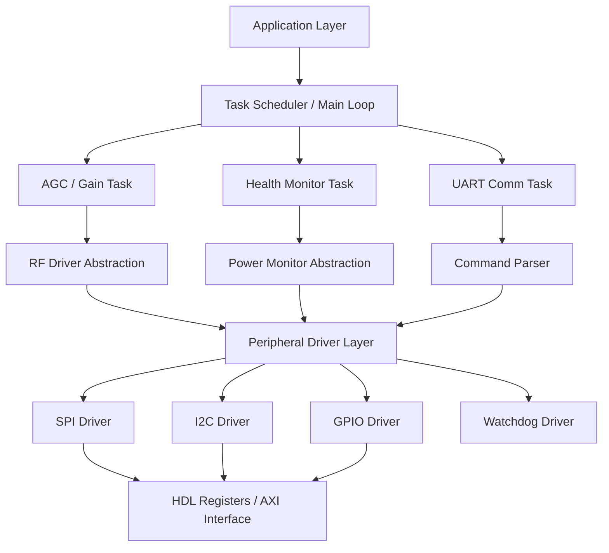
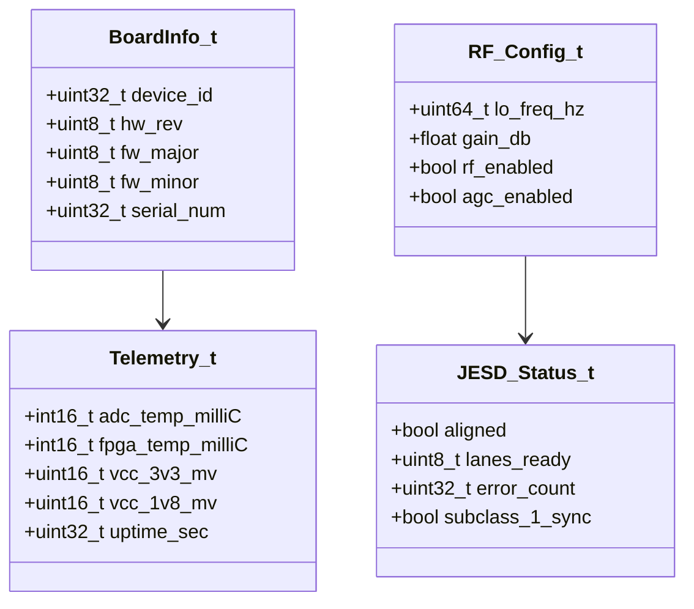
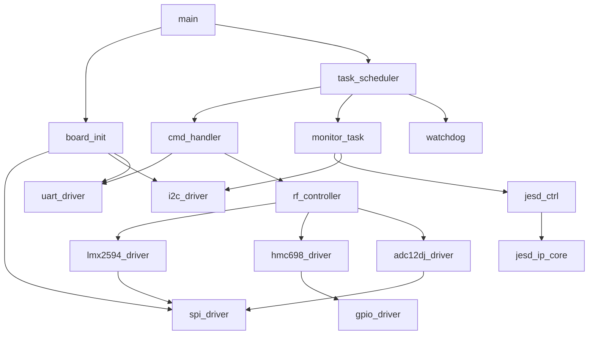
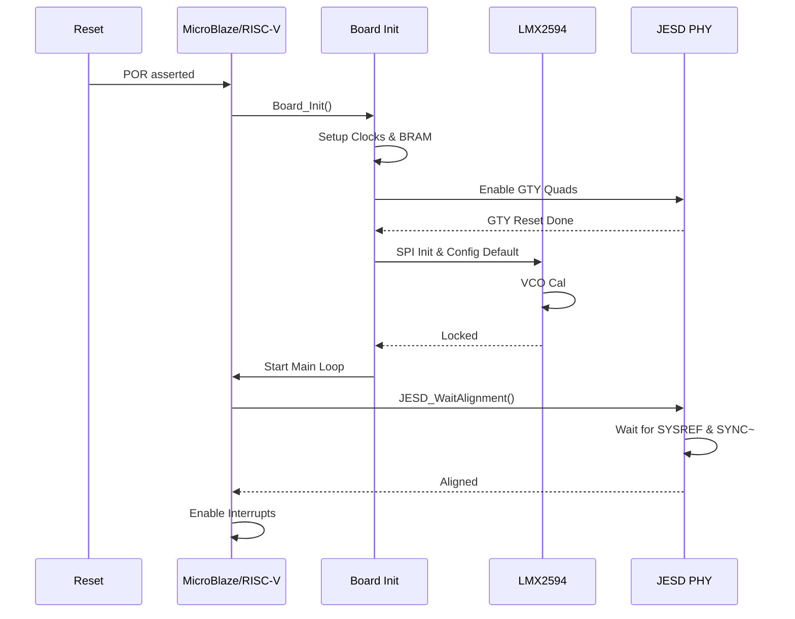
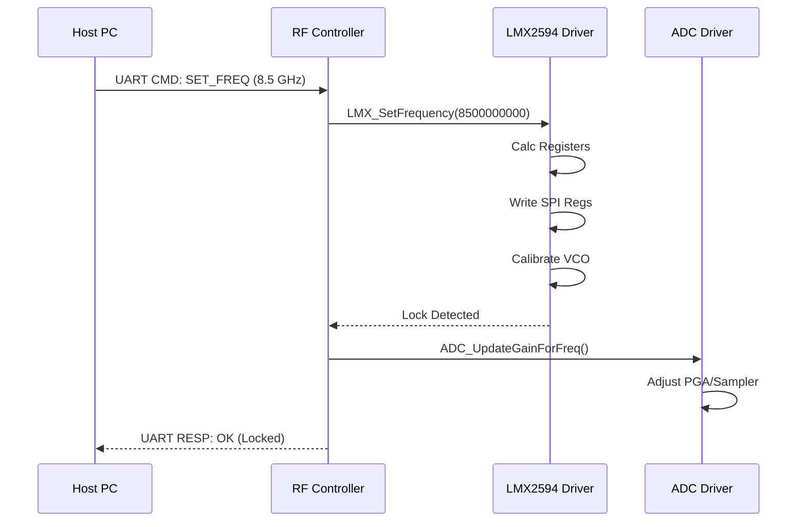
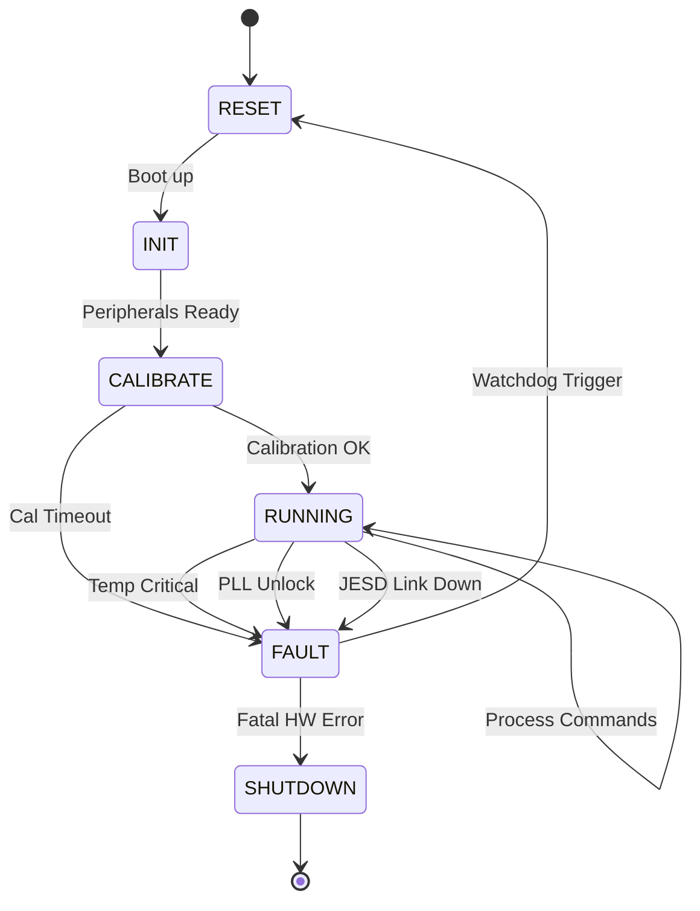

```markdown
# Software Design Document (SDD)

**Project:** khg Wideband RF Receiver
**Version:** 1.0
**Date:** 16 April 2026
**Author:** Senior Embedded Software Architect
**Status:** Initial Release
**Standard:** IEEE 1016-2009

---

## Document Control
| Version | Date | Author | Description |
|---------|------|--------|-------------|
| 1.0 | 16 April 2026 | System Architect | Initial design derived from SRS, HRS, and GLR inputs. |

---

# 1. Introduction

## 1.1 Purpose
This Software Design Document (SDD) provides the comprehensive structural and behavioral design for the **khg** Wideband RF Receiver firmware. It details the architecture of the embedded software running on the Xilinx XQRKU060 FPGA fabric (utilizing a MicroBlaze soft-core or RISC-V hard-core), the Hardware Abstraction Layer (HAL) for the RF signal chain, and the logic for the JESD204C Subclass 1 interface.

This document serves as the blueprint for firmware engineers implementing the C-code for the control plane and for RTL designers implementing the JESD204C PHY glue logic. It defines the interfaces, data structures, algorithms, and state machines required to meet the Software Requirements Specification (SRS).

## 1.2 Scope
The scope of this design encompasses:
*   **Embedded Control Software:** C-based firmware running on the FPGA embedded processor.
*   **Hardware Abstraction:** Drivers for SPI (LMX2594, HMC698LP4), I2C (Power monitors), and JTAG/UART.
*   **Digital Logic:** RTL modules for JESD204C Transport Layer, Lane Alignment, and SYSREF processing.
*   **Diagnostics:** Built-In Self-Test (BIST), telemetry polling, and fault handling.

**Excluded from Scope:**
*   Host PC GUI application code (only protocol is defined).
*   Signal processing algorithms (DSP) performed on the digitized data *after* the JESD204C interface.

## 1.3 Definitions, Acronyms, and Abbreviations

| Acronym | Definition |
| :--- | :--- |
| **ADC** | Analog-to-Digital Converter (ADC12DJ5200RF) |
| **AGC** | Automatic Gain Control |
| **AU** | Architectural Unit |
| **AXI** | Advanced eXtensible Interface |
| **BIT** | Built-In Test |
| **BRAM** | Block RAM (FPGA on-chip memory) |
| **BSP** | Board Support Package |
| **CRC** | Cyclic Redundancy Check |
| **CSA** | Control Status Registers (AXI_GPIO style) |
| **DMA** | Direct Memory Access |
| **ELF** | Executable and Linkable Format |
| **FRR** | Failure Review Board |
| **FSM** | Finite State Machine |
| **GLR** | Glue Logic Requirements |
| **GPIO** | General Purpose Input/Output |
| **HAL** | Hardware Abstraction Layer |
| **HRS** | Hardware Requirements Specification |
| **ILAS** | Initial Lane Alignment Sequence |
| **IRQ** | Interrupt Request |
| **ISR** | Interrupt Service Routine |
| **JESD** | JESD204C Standard |
| **LED** | Light Emitting Diode |
| **LFSR** | Linear Feedback Shift Register |
| **LMK** | Clock Jitter Cleaner (if used) |
| **LMX** | PLL Synthesizer (LMX2594) |
| **LNA** | Low Noise Amplifier |
| **LO** | Local Oscillator |
| **LVDS** | Low-Voltage Differential Signaling |
| **MGT** | Multi-Gigabit Transceiver |
| **MISRA** | Motor Industry Software Reliability Association |
| **NCO** | Numerically Controlled Oscillator |
| **PLL** | Phase-Locked Loop |
| **POST** | Power-On Self Test |
| **RF** | Radio Frequency |
| **SRS** | Software Requirements Specification |
| **SYSREF** | System Reference (JESD204C timing) |
| **TRP** | Transmit/Receive Point |
| **UART** | Universal Asynchronous Receiver/Transmitter |
| **VCO** | Voltage-Controlled Oscillator |
| **WDT** | Watchdog Timer |

## 1.4 References
1.  **IEEE 1016-2009**: Standard for Information Technology — Systems Design — Software Design Descriptions.
2.  **khg SRS Rev 1.0**: Software Requirements Specification (16 April 2026).
3.  **khg HRS Rev 1.0**: Hardware Requirements Specification (16 April 2026).
4.  **khg GLR Rev 0V01**: Glue Logic Requirements (16 April 2026).
5.  **MISRA C:2012**: Guidelines for the Use of the C Language in Critical Systems.
6.  **Xilinx UG986**: Zynq UltraScale+ MPSoC and Soft-Core Software Developers Guide.
7.  **TI LMX2594 Datasheet**: SNAS773B – October 2018.
8.  **Analog Devices HMC698LP4 Datasheet**: 6-Bit Digital Attenuator.
9.  **JEDEC JESD204C.01**: Standard for High-Speed Serial Interface.

---

# 2. Design Viewpoints

## 2.1 Context Viewpoint — System Boundaries

The **khg** firmware exists within the Xilinx XQRKU060 FPGA, acting as the bridge between the Host Controller (via UART) and the RF Hardware (via SPI/GPIO) and the Data Path (via JESD204C).

```mermaid
graph TD
    HOST[Host PC / GUI] -->|UART Control / Telemetry| UART_DRV[UART Driver]
    HOST <-->|JESD204C Data Lane (12.5 Gbps)| JESD_PHY[JESD204C PHY Logic]
    
    subgraph FIRMWARE_CONTEXT
        UART_DRV
        CMD[Command Handler]
        DIAG[Diagnostic Manager]
        RF_CTRL[RF Controller]
        HAL[Hardware Abstraction Layer]
    end

    CMD --> HAL
    DIAG --> HAL
    RF_CTRL --> HAL
    
    HAL --> SPI_DRV[SPI Master Driver]
    HAL --> GPIO_DRV[GPIO Driver]
    HAL --> I2C_DRV[I2C Master Driver]
    
    SPI_DRV --> LMX[LMX2594 PLL]
    SPI_DRV --> VGA[HMC698LP4 Attenuator]
    SPI_DRV --> ADC[ADC12DJ5200RF Config]
    
    GPIO_DRV --> RF_EN[RF Enable / TRP]
    GPIO_DRV --> LEDS[Status LEDs]
    
    JESD_PHY --> MGT[MGT Transceivers]
```

**External Entities:**
*   **Host PC:** Sends configuration commands (Frequency, Gain) and receives telemetry (Temp, Lock Status).
*   **RF Hardware:** Analog components generating the LO and processing the RF signal.
*   **Power Supply:** Provides +12V input; monitored via PMBus (I2C).

## 2.2 Composition Viewpoint — Software Architecture

The software is designed as a layered architecture to maximize portability and adhere to MISRA-C guidelines.



### Module List with Responsibilities

**Module: board_init** (board_init.c / board_init.h)
*   **Responsibility:** System startup, clock tree configuration, exception vector setup, and memory initialization.
*   **Public API:**
    *   `int32_t Board_Init(void);`
    *   `int32_t Board_GetInfo(BoardInfo_t *info);`
    *   `int32_t Board_SelfTest(uint32_t *test_mask);`

**Module: uart_driver** (uart_driver.c / uart_driver.h)
*   **Responsibility:** AXI-UARTlite (16550 compatible) initialization, interrupt-driven RX/TX handling, framing protocol implementation.
*   **Public API:**
    *   `int32_t UART_Init(uint32_t baud_rate);`
    *   `int32_t_UART_PutChar(uint8_t c);`
    *   `int32_t UART_GetChar(uint8_t *c, bool wait);`
    *   `void    UART_ISR_Handler(void);`

**Module: spi_driver** (spi_driver.c / spi_driver.h)
*   **Responsibility:** AXI-SPI engine control. Supports multi-byte transfers for PLL and ADC configuration.
*   **Public API:**
    *   `int32_t SPI_Init(uint32_t clk_hz);`
    *   `int32_t SPI_Transfer(const uint8_t *tx, uint8_t *rx, uint16_t len);`
    *   `int32_t SPI_WriteReg(uint8_t dev_id, uint16_t reg_addr, uint8_t *data, uint16_t len);`

**Module: lmx2594_driver** (lmx2594.c / lmx2594.h)
*   **Responsibility:** Configuration of the LMX2594 PLL. Handles register calculation for frequency synthesis, VCO calibration, and multiplexer settings.
*   **Public API:**
    *   `int32_t LMX_Init(void);`
    *   `int32_t LMX_SetFrequency(uint64_t freq_hz);`
    *   `int32_t LMX_EnableRF(bool enable);`
    *   `bool    LMX_IsLocked(void);`

**Module: hmc698_driver** (hmc698.c / hmc698.h)
*   **Responsibility:** Control of the 6-bit parallel digital attenuator. Converts desired gain (dB) to parallel latch values.
*   **Public API:**
    *   `int32_t HMC_Init(void);`
    *   `int32_t HMC_SetGain(float attenuation_db);`
    *   `int32_t HMC_GetGain(float *attenuation_db);`

**Module: adc12dj_driver** (adc12dj.c / adc12dj.h)
*   **Responsibility:** Configuration of the ADC12DJ5200RF for JESD204C mode (Subclass 1), SERDES lane configuration, and gain optimization.
*   **Public API:**
    *   `int32_t ADC_Init(void);`
    *   `int32_t ADC_ConfigJESD(JESD_Mode_e mode);`
    *   `int32_t ADC_PowerDown(bool pd);`
    *   `int32_t ADC_ReadTemp(int16_t *temp_milliC);`

**Module: jesd_ctrl** (jesd_ctrl.c / jesd_ctrl.h)
*   **Responsibility:** Management of the FPGA JESD204C PHY soft-IP. Handles SYSREF alignment, lane bonding, and error monitoring (disparity, CRC).
*   **Public API:**
    *   `int32_t JESD_Init(void);`
    *   `int32_t JESD_Reset(void);`
    *   `int32_t JESD_WaitAlignment(uint32_t timeout_ms);`
    *   `int32_t JESD_GetStatus(JESD_Status_t *status);`

**Module: watchdog** (watchdog.c / watchdog.h)
*   **Responsibility:** Windowed watchdog timer management (WDT). Must be kicked periodically by the main loop.
*   **Public API:**
    *   `int32_t WDT_Init(uint32_t timeout_ms);`
    *   `void    WDT_Kick(void);`

## 2.3 Logical Viewpoint — Data Model

Key data structures passed between layers.



**Data Structure Definitions:**

```c
/* System State Enum */
typedef enum {
    SYS_STATE_RESET = 0,
    SYS_STATE_INIT,
    SYS_STATE_CALIBRATING,
    SYS_STATE_RUNNING,
    SYS_STATE_FAULT,
    SYS_STATE_SHUTDOWN
} SystemState_e;

/* JESD204C Lane Status Structure */
typedef struct {
    uint8_t lane_id;
    bool    aligned;
    uint32_t crc_error_count;
    uint32_t disparity_error_count;
} JESD_LaneStatus_t;

/* RF Channel Configuration */
typedef struct {
    uint64_t target_freq_hz;
    float    attenuation_db;
    bool     lna_enable;
} RF_ChannelConfig_t;

/* Error Codes (MISRA compliant) */
typedef enum {
    ERR_OK = 0,
    ERR_PARAM = -1,
    ERR_TIMEOUT = -2,
    ERR_SPI_COMM = -3,
    ERR_PLL_UNLOCK = -4,
    ERR_JESD_ALIGN = -5,
    ERR_I2C_NACK = -6,
    ERR_CHECKSUM = -7
} ErrorCode_t;
```

## 2.4 Dependency Viewpoint — Module Dependencies



**Dependency Rules:**
*   **Driver Layer** has no dependencies on Application Layer.
*   **Application Layer** communicates with hardware only via HAL/Driver APIs.
*   **ISR Handlers** are minimal, deferring processing to Tasks (Run-to-Completion model).

## 2.5 Interface Viewpoint — Complete API Specification

### Function: `LMX_SetFrequency`
```c
/**
 * @brief Configures the LMX2594 PLL to the specified frequency.
 * 
 * @param freq_hz Desired output frequency in Hz (5,000,000,000 to 18,000,000,000).
 * 
 * @return ERR_OK on success.
 * @return ERR_PARAM if frequency is out of supported range.
 * @return ERR_TIMEOUT if VCO calibration fails.
 * 
 * @pre  LMX_Init() must have been called successfully.
 * @post PLL is in calibration state; RF output remains disabled until LMX_EnableRF(true).
 * @note Calculation of N/Multiplier registers is performed by this function.
 * 
 * Example:
 *   if (LMX_SetFrequency(8500000000ULL) == ERR_OK) {
 *       while(!LMX_IsLocked());
 *   }
 */
int32_t LMX_SetFrequency(uint64_t freq_hz);
```

### Function: `JESD_WaitAlignment`
```c
/**
 * @brief Blocks until JESD204C Subclass 1 alignment is achieved or timeout.
 * 
 * @param timeout_ms Maximum time to wait for alignment (milliseconds).
 * 
 * @return ERR_OK if all lanes achieve alignment.
 * @return ERR_TIMEOUT if SYSREF alignment does not complete.
 * 
 * @pre JESD_Reset() must be called prior.
 * @post Transceivers are ready for data transfer.
 */
int32_t JESD_WaitAlignment(uint32_t timeout_ms);
```

### Function: `UART_GetCommand`
```c
/**
 * @brief Non-blocking check for incoming command frame.
 * 
 * @param cmd_buf Pointer to buffer where received frame will be stored.
 * @param buf_len Size of the buffer in bytes.
 * 
 * @return Number of bytes received, or -1 if framing error.
 * 
 * @note Protocol: [HEADER][ADDR_H][ADDR_L][DATA_H][DATA_L][CRC8]
 */
int32_t UART_GetCommand(uint8_t *cmd_buf, uint32_t buf_len);
```

## 2.6 Interaction Viewpoint — Sequence Diagrams

### System Startup Sequence


### Frequency Tuning Sequence


## 2.7 State Viewpoint — State Machines

### System Top Level FSM


### JESD204C Link State Machine
```mermaid
stateDiagram-v2
    [*] -- Power On --> IDLE
    IDLE --> RESET_PHY: Soft Reset
    RESET_PHY --> WAIT_SYSREF: GTY Ready
    WAIT_SYSREF --> ALIGNED: Code Group Sync + SFIS
    WAIT_SYSREF --> ERROR: Timeout
    ALIGNED --> DATA_XFER: ILAS Complete
    
    DATA_XFER --> ERROR: > 100 CRC Errors/sec
    
    ERROR --> RESET_PHY: Auto Recovery
```

## 2.8 Algorithm Viewpoint — Key Algorithms

### 2.8.1 LMX2594 Frequency Calculation
The integer N divider is calculated to minimize phase noise.
1.  Input: $F_{out}$ (Target Hz).
2.  $F_{vco}$ target is usually $2 \times F_{out}$ (fundamental) or $F_{out}$ (direct).
3.  Calculate $N = \lfloor F_{vco} / F_{pfd} \rfloor$.
4.  Remainder determines fractional divider.
5.  Write registers $R_0$, $R_{35}$ (Multiplier LSB), $R_{36}$ (Multiplier MSB).

### 2.8.2 UART Frame Checksum (CRC-8)
Polynomial: `0x07` (Standard).
Used to verify integrity of `[Header][Addr][Data]` packets.
```c
uint8_t CRC8_Compute(const uint8_t *data, uint32_t len);
```

---

## 2.9 Resource Viewpoint — Real-Time Constraints

### 2.9.1 Task Scheduling Table
The system uses a non-preemptive (cooperative) scheduler or a bare-metal loop with time-slicing.

| Task Name | Period (ms) | Worst-Case Exec Time | Priority | Deadline | CPU Load |
|-----------|-------------|----------------------|----------|----------|---------|
| **UART_CMD** | Event | 1 ms | High | 5 ms | 5% |
| **WDT_Kick** | 100 | 0.01 ms | Critical | 100 ms | 0.1% |
| **TEMP_MON** | 500 | 0.5 ms | Low | 500 ms | 0.1% |
| **PLL_MON** | 100 | 0.2 ms | Medium | 100 ms | 0.2% |
| **JESD_ERR** | Real-time (ISR) | 0.01 ms | High | Immediate | 1% |

### 2.9.2 ISR Latency Budget
| Interrupt Source | Latency Requirement | Worst-Case Measured | Margin |
|-----------------|--------------------|--------------------|--------|
| UART RX | < 100 us | 20 us | 80% |
| SPI Tx Complete | < 5 us | 2 us | 60% |
| JESD PHY Alarm | < 1 us | 0.5 us | 50% |

### 2.9.3 Memory Budget (XQRKU060)
| Region | Size | Usage | Availability |
|--------|------|-------|--------------|
| BRAM (Code) | 128 KB | Firmware Text | 40% Free |
| BRAM (Data) | 64 KB | Stacks / Heaps | 70% Free |
| DDR4 (Buffer) | 512 MB | I/Q Sample Ring Buffer | 90% Free |
| L2 Cache | 256 KB | Architected | Configured |

---

## 2.10 Build System Viewpoint

### 2.10.1 CMakeLists.txt Structure
```cmake
cmake_minimum_required(VERSION 3.20)
project(khg_firmware VERSION 1.0.0 LANGUAGES C ASM)

# Toolchain for Xilinx MicroBlaze/Vitis
set(CMAKE_SYSTEM_NAME Generic)
set(CMAKE_C_COMPILER mb-gcc)
set(CMAKE_OBJCOPY mb-objcopy)

# BSP Definitions
add_definitions(-DSTDOUT_IS_16550_UART -DMICROBLAZE)

# Driver Library
add_library(khg_drivers STATIC
    src/drivers/uart_driver.c
    src/drivers/spi_driver.c
    src/drivers/i2c_driver.c
    src/drivers/gpio_driver.c
    src/drivers/lmx2594.c
    src/drivers/hmc698.c
    src/drivers/adc12dj.c
)

# Main Application Executable (ELF)
add_executable(khg_app
    src/main.c
    src/board/board_init.c
    src/app/task_scheduler.c
    src/app/command_parser.c
    src/utils/crc8.c
)

target_link_libraries(khg_app PRIVATE khg_drivers)
target_compile_options(khg_app PRIVATE -Wall -Wextra -Werror -O2)

# Unit Tests (Host Based)
enable_testing()
find_package(GTest REQUIRED)
add_subdirectory(tests) # Builds test_lmx.c, test_spi.c etc.
```

### 2.10.2 Unit Test Infrastructure
Tests are compiled for x86-64 using mocks for hardware registers (`reg_read`/`reg_write` stubs).

```cmake
# tests/CMakeLists.txt
add_executable(test_suite
    test_main.cpp
    test_lmx.cpp
    mock_spi.cpp
)
target_link_libraries(test_suite PRIVATE GTest::gtest GTest::gtest_main)
gtest_discover_tests(test_suite)
```

---

# 3. Design Rationale

## 3.1 Architecture Choices

**Choice 1: Cooperative Scheduler vs RTOS**
*   **Decision:** Cooperative Scheduler (Cyclic Executive).
*   **Rationale:** The system workload is deterministic and periodic. The overhead of an RTOS (ThreadX/FreeRTOS) on MicroBlaze consumes valuable BRAM and increases MISRA compliance complexity.
*   **Trade-off:** Reduced preemption capability for significantly lower RAM footprint and simpler timing analysis.

**Choice 2: SPI Blocking vs Interrupt**
*   **Decision:** Interrupt-driven SPI for bulk transfers, Polling for short config writes.
*   **Rationale:** JESD204C configuration requires writing hundreds of registers to the ADC; blocking would starve the watchdog. Short gain changes (HMC698) must complete within RF cycle times (<1us), where interrupt overhead is too high.

**Choice 3: Gain Control Implementation**
*   **Decision:** Software AGC Loop.
*   **Rationale:** Hardware AGC detectors in the ADC (HMC698) are binary. Software allows hysteresis, rate limiting, and integration with spectrum analysis.

## 3.2 MISRA-C:2012 Compliance Strategy
*   All code compiled with `--enable-lint` or PC-Lint Plus.
*   Prohibited: Dynamic memory (`malloc`), Recursion, Unions (for type punning).
*   Required: Explicit casting, function prototypes in headers.
*   Tooling: Doxygen for documentation generation directly from headers.

---

# 4. Design Traceability Matrix

| SDD Component | Implements REQ-SW-xxx | Design Element |
|--------------|----------------------|----------------|
| `board_init.c` | REQ-SW-001 (Initialization) | Board_Init() |
| `lmx2594.c` | REQ-SW-010 (LO Generation) | LMX_SetFrequency() |
| `hmc698.c` | REQ-SW-020 (Gain Control) | HMC_SetGain() |
| `adc12dj.c` | REQ-SW-030 (ADC Config) | ADC_Init() |
| `jesd_ctrl.c` | REQ-SW-040 (JESD Link) | JESD_WaitAlignment() |
| `spi_driver.c` | REQ-SW-005 (SPI Comms) | SPI_Transfer() |
| `uart_driver.c` | REQ-SW-055 (Host Interface) | UART_GetCommand() |
| `monitor_task.c` | REQ-SW-060 (Telemetry) | ReadSensors() |

---

# 5. Appendices

## Appendix A — File Structure
```
src/
├── main.c
├── board/
│   ├── board_init.c
│   └── board_config.h
├── drivers/
│   ├── uart_driver.c
│   ├── spi_driver.c
│   ├── i2c_driver.c
│   ├── gpio_driver.c
│   ├── lmx2594.c
│   ├── hmc698.c
│   └── adc12dj.c
├── app/
│   ├── task_scheduler.c
│   ├── command_parser.c
│   └── monitor_task.c
└── utils/
    ├── crc8.c
    └── ring_buffer.c
```

## Appendix B — Register Map Summary (FPGA)

| Base Address | Offset | Name | Access | Description |
|--------------|--------|------|--------|-------------|
| 0x4000_0000 | 0x0000 | SCR | RW | System Control Register (Soft Reset) |
| 0x4000_0000 | 0x0004 | JESD_STAT | RO | JESD Link Status (Bits 0-3: Lane 0-3 Lock) |
| 0x4000_0000 | 0x0008 | GPIO_OUT | RW | GPIO Outputs (Bit 0: RF_EN, Bit 1: LED_Green) |
| 0x4000_0000 | 0x000C | IRQ_MASK | RW | Interrupt Enable Mask |
| 0x4000_0100 | 0x0000 | SPI_TX | WO | SPI Tx Data FIFO |
| 0x4000_0100 | 0x0004 | SPI_RX | RO | SPI Rx Data FIFO |
| 0x4000_0100 | 0x0008 | SPI_STS | RO | SPI Status (TX Empty, RX Full) |

## Appendix C — Memory Map
*   **Firmware:** 0x0000_0000 (On-Chip BRAM)
*   **Data:** 0x1000_0000 (DDR4 Controller)
*   **Peripherals:** 0x4000_0000 (AXI Lite)
*   **JESD IP:** 0x8000_0000 (AXI Stream)

## Appendix D — Coding Standards Checklist
*   [x] No dynamic memory.
*   [x] All functions return error code (void only for guaranteed success).
*   [x] Check NULL pointers.
*   [x] MISRA C:2012 compliant.
*   [x] Doxygen comments for all public APIs.
```