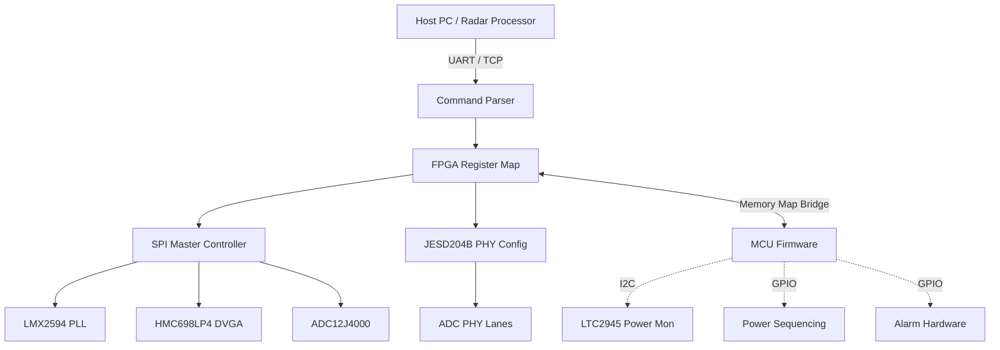
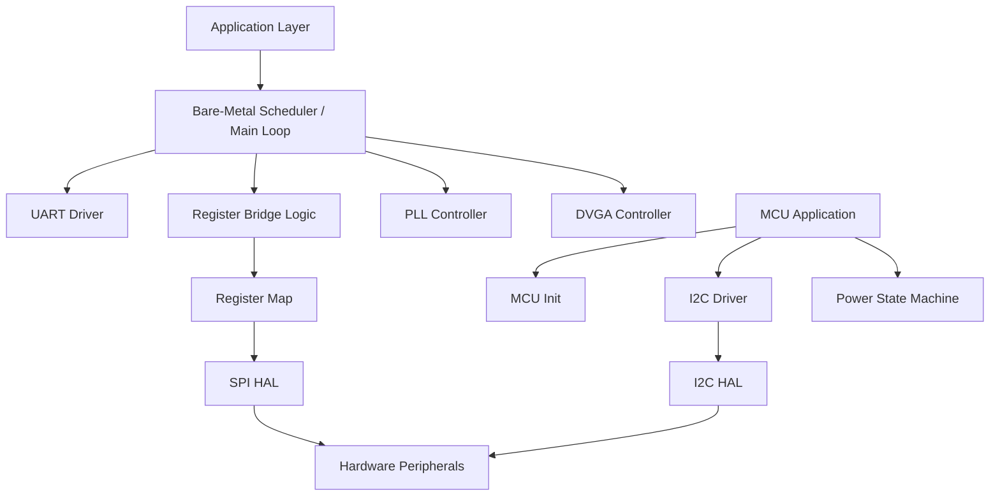
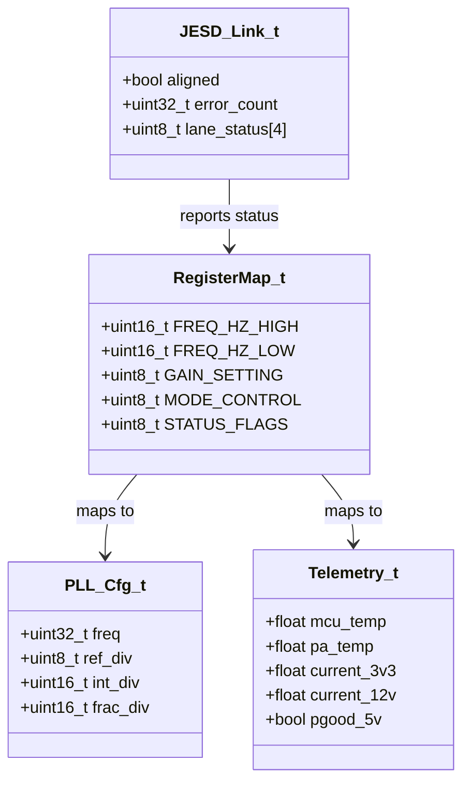
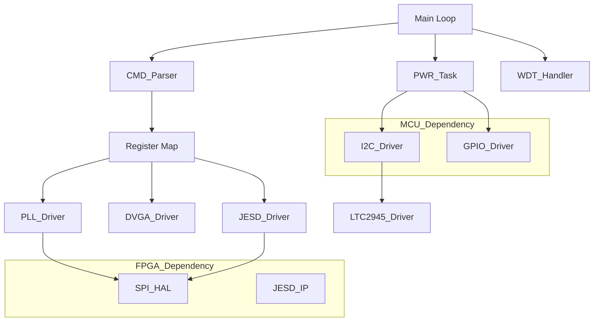
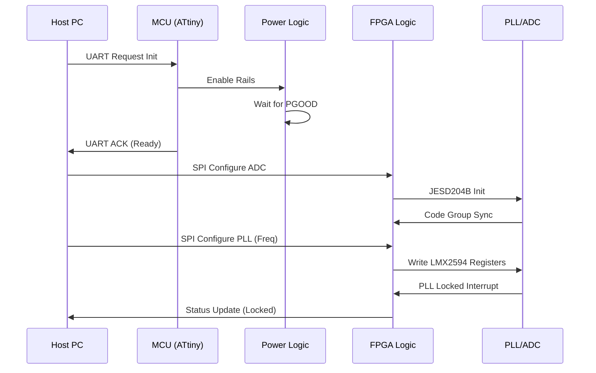
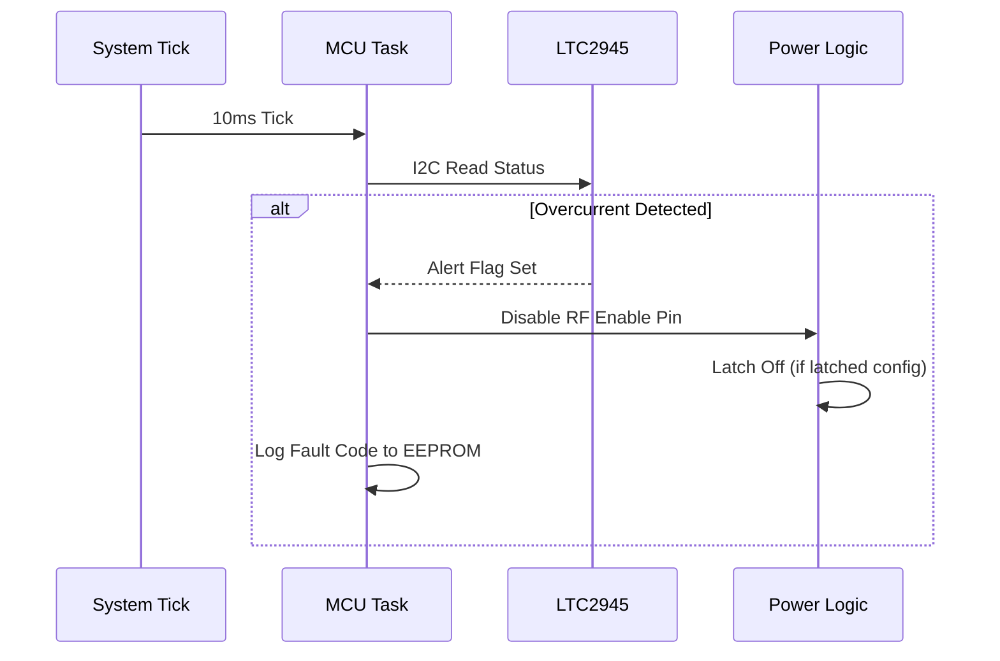
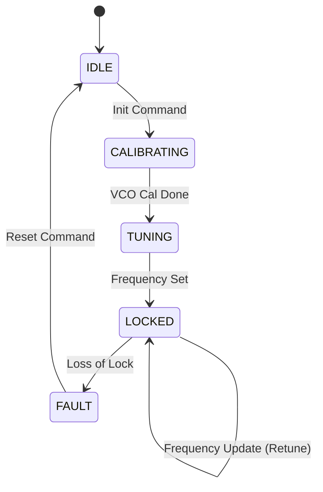
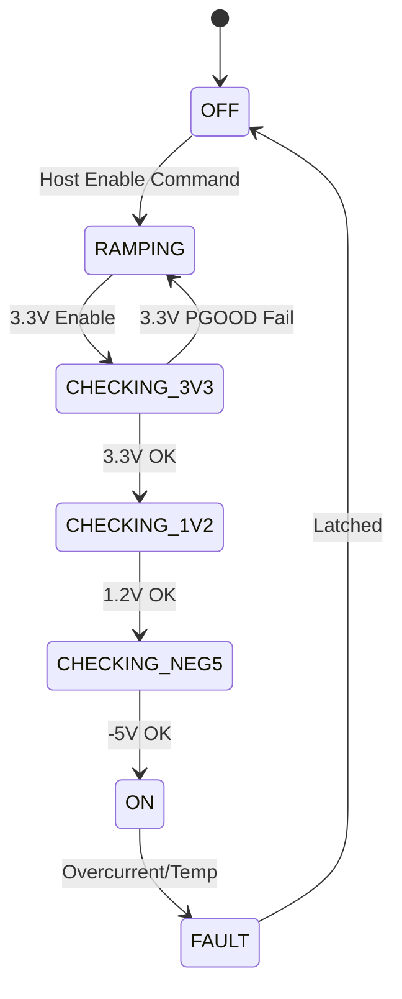

# Software Design Document (SDD)

**Project:** khgk Wideband RF Receiver
**Date:** 16 April 2026
**Version:** 1.0
**Status:** Initial Release
**Compliance:** IEEE 1016-2009 / MISRA-C:2012

---

## Document Control

| Version | Date | Author | Description |
|---------|------|--------|-------------|
| 1.0 | 16 April 2026 | Lead Architect | Initial design derived from SRS v1.0 and GLR v0V01 |

---

# 1. Introduction

## 1.1 Purpose
This Software Design Document (SDD) provides the comprehensive structural design for the **khgk Wideband RF Receiver** embedded software. It defines the architecture, data structures, algorithms, and interfaces for both the **FPGA Firmware** (responsible for high-speed JESD204B interfacing and configuration) and the **MCU Firmware** (responsible for power sequencing and housekeeping). This document serves as the blueprint for implementation, verification, and maintenance, ensuring full traceability to the **khgk SRS** and **GLR**.

## 1.2 Scope
The design covers the following software layers:
1.  **FPGA Firmware (VHDL/Verilog/C):**
    *   JESD204B Transport Layer.
    *   Register Map Bridge (UART to SPI).
    *   SPI Master Controllers for RFICs.
2.  **MCU Firmware (C - ATtiny1606):**
    *   Power Sequencing State Machine.
    *   I2C Drivers for LTC2945.
    *   Fault Collection and Reporting.
3.  **Host Support:**
    *   Definitions for the Qt6 GUI interface logic.

**Out of Scope:** High-level signal processing algorithms (host side) and PCB physical design.

## 1.3 Definitions, Acronyms, and Abbreviations

| Term | Definition |
| :--- | :--- |
| **ADC** | Analog-to-Digital Converter (ADC12J4000) |
| **API** | Application Programming Interface |
| **BIST** | Built-In Self-Test |
| **BRAM** | Block RAM (FPGA internal memory) |
| **CE102** | Conducted Emissions limit |
| **CPLD** | Complex Programmable Logic Device |
| **CRC** | Cyclic Redundancy Check |
| **DMA** | Direct Memory Access |
| **DVGA** | Digital Variable Gain Amplifier (HMC698LP4) |
| **EMI** | Electromagnetic Interference |
| **FIFO** | First-In, First-Out buffer |
| **FPGA** | Field-Programmable Gate Array |
| **GLR** | Glue Logic Requirements |
| **GPIO** | General Purpose Input/Output |
| **GSPS** | Giga-Samples Per Second |
| **HAL** | Hardware Abstraction Layer |
| **HRS** | Hardware Requirements Specification |
| **I2C** | Inter-Integrated Circuit |
| **ISR** | Interrupt Service Routine |
| **JTAG** | Joint Test Action Group |
| **JESD204B** | JEDEC Standard for High-Speed Data Converters |
| **LFSR** | Linear Feedback Shift Register |
| **LO** | Local Oscillator |
| **LUT** | Look-Up Table |
| **MCU** | Microcontroller Unit |
| **MISRA** | Motor Industry Software Reliability Association |
| **NVM** | Non-Volatile Memory |
| **PLL** | Phase-Locked Loop (LMX2594) |
| **POST** | Power-On Self-Test |
| **QSPI** | Quad Serial Peripheral Interface |
| **RF** | Radio Frequency |
| **RTOS** | Real-Time Operating System (Not used - Bare Metal) |
| **RTL** | Register Transfer Logic |
| **SFDR** | Spurious-Free Dynamic Range |
| **SPI** | Serial Peripheral Interface |
| **SRS** | Software Requirements Specification |
| **UART** | Universal Asynchronous Receiver/Transmitter |
| **WDT** | Watchdog Timer |

## 1.4 References
1.  **IEEE 1016-2009:** Standard for Information Technology—Systems Design—Software Design Descriptions.
2.  **khgk SRS:** Software Requirements Specification, v1.0, 16 April 2026.
3.  **khgk GLR:** Glue Logic Requirements, v0V01, 16 April 2026.
4.  **khgk HRS:** Hardware Requirements Specification, 16 April 2026.
5.  **MISRA C:2012:** Guidelines for the use of the C language in critical systems.
6.  **ADC12J4000 Datasheet:** TI, SBAS904B.
7.  **LMX2594 Datasheet:** TI, SNAS674D.
8.  **HMC698LP4 Datasheet:** Analog Devices.
9.  **LTC2945 Datasheet:** Analog Devices.

---

# 2. Design Viewpoints

## 2.1 Context Viewpoint — System Boundaries

The khgk software operates as a bridge between the Host Control System and the RF Hardware.



**External Entities:**
*   **Host PC:** External system sending configuration commands (Frequency, Gain) via UART.
*   **RF Hardware:** The physical components (LMX2594, HMC698LP4, ADC) controlled via SPI.
*   **Power Supply:** The 12V/15V source monitored by the MCU via I2C.

## 2.2 Composition Viewpoint — Software Architecture

The software is decomposed into a layered architecture to ensure modularity and testability.



### Module List & Responsibilities

#### 2.2.1 Module: `cmd_parser` (cmd_parser.c / cmd_parser.c)
*   **Responsibilities:** Parses incoming UART byte streams framed according to the GLR spec. Validates CRC and dispatches read/write requests to the register map.
*   **API:**
```c
/**
 * @brief Initialize the command parser state machine.
 * @return ERR_OK on success.
 */
int32_t CMD_Init(void);

/**
 * @brief Process a single incoming byte.
 * @param byte The data byte received from UART.
 * @return CMD_STATUS_COMPLETE if a full frame is processed and action taken.
 * @return CMD_STATUS_PENDING if more data is needed.
 * @return CMD_STATUS_ERROR on framing/CRC error.
 */
int32_t CMD_ProcessByte(uint8_t byte);

/**
 * @brief Get the response frame for the last processed command.
 * @param buf Output buffer.
 * @param len Max length of buffer.
 * @return Actual length of response frame.
 */
int32_t CMD_GetResponse(uint8_t *buf, uint32_t len);
```

#### 2.2.2 Module: `pll_driver` (pll_driver.c / pll_driver.c)
*   **Responsibilities:** Configures the LMX2594 PLL via SPI. Implements frequency calculation algorithms (Integer-N vs Fractional) and manages the VCO calibration state machine.
*   **API:**
```c
typedef struct {
    uint32_t freq_hz;      /* Target Frequency 5.0G - 18.0G */
    uint8_t  out_power;    /* Output Power setting */
    bool     use_frac;     /* Use fractional N divider */
} PLL_Config_t;

/**
 * @brief Initialize PLL hardware interface.
 * @return ERR_OK on success.
 */
int32_t PLL_Init(void);

/**
 * @brief Configure PLL to a specific frequency.
 * @param cfg Pointer to configuration struct.
 * @return ERR_OK if locked.
 * @return ERR_TIMEOUT if lock fails.
 */
int32_t PLL_SetFrequency(const PLL_Config_t *cfg);

/**
 * @brief Check PLL lock status.
 * @return true if LD pin is high / register bit set.
 */
bool PLL_IsLocked(void);
```

#### 2.2.3 Module: `jesd204b_ctrl` (jesd204b_ctrl.c / jesd204b_ctrl.c)
*   **Responsibilities:** Manages the JESD204B IP core initialization. Subclass 1 deterministic latency setup. SYSREF alignment.
*   **API:**
```c
/**
 * @brief Initialize JESD204B PHY.
 * @param lanes Number of lanes (4).
 * @param rate Data rate (e.g., 12.5 Gbps).
 * @return ERR_OK.
 */
int32_t JESD_Init(uint8_t lanes, uint32_t rate);

/**
 * @brief Wait for code group sync and alignment.
 * @param timeout_ms Max time to wait.
 * @return ERR_OK if aligned.
 */
int32_t JESD_WaitAlign(uint32_t timeout_ms);
```

#### 2.2.4 Module: `ltc2945_driver` (ltc2945_driver.c / ltc2945_driver.c)
*   **Responsibilities:** I2C interface to LTC2945. Reads voltage, current, and power.
*   **API:**
```c
typedef struct {
    float voltage_v;
    float current_a;
    float power_w;
} PwrTelemetry_t;

int32_t PMON_Init(void);
int32_t PMON_ReadTelemetry(PwrTelemetry_t *data);
```

#### 2.2.5 Module: `mcu_power_seq` (mcu_power_seq.c / mcu_power_seq.c)
*   **Responsibilities:** Controls GPIO enable pins for the DC-DC converters (LTC1923). Monitors PGOOD signals. Handles under-voltage lockout (UVLO).
*   **API:**
```c
typedef enum {
    PWR_STATE_OFF = 0,
    PWR_STATE_RAMPING,
    PWR_STATE_ON,
    PWR_STATE_FAULT
} PwrState_e;

/**
 * @brief Initialize power sequencing hardware.
 */
void PWR_Init(void);

/**
 * @brief Main state machine handler. Call periodically.
 * @return PWR_STATE_ON if system is safe to operate RF.
 */
PwrState_e PWR_Task(void);
```

## 2.3 Logical Viewpoint — Data Model

Key data structures exchanged between the hardware abstraction layer and application logic.



### Data Structure Definitions
```c
/* Definition of the SPI flashable configuration */
typedef struct {
    uint32_t magic;                  /* 0xDEADBEEF */
    uint16_t hw_id;                  /* 0x0001 */
    uint8_t  calibration_ver;
    int8_t   gain_lut[32];           /* Gain correction LUT */
    uint32_t crc32;                  /* CRC-32 of struct */
} NVM_Config_t;

/* System Status Flags (Mapped to Register 0x0002) */
typedef union {
    struct {
        uint32_t pll_lock    : 1;    /* Bit 0 */
        uint32_t jesd_align  : 1;    /* Bit 1 */
        uint32_t temp_alert  : 1;    /* Bit 2 */
        uint32_t pgood       : 1;    /* Bit 3 */
        uint32_t reserved    : 28;
    } bits;
    uint32_t word;
} SystemStatus_t;
```

## 2.4 Dependency Viewpoint — Module Dependencies



## 2.5 Interface Viewpoint — API Specification

#### 2.5.1 SPI Transaction API (FPGA & MCU Shared)
```c
/**
 * @brief Perform a SPI transaction.
 * @note Uses Mode 0 (CPOL=0, CPHA=0).
 * @param cs_pin Chip Select index (0=PLL, 1=DVGA, 2=ADC).
 * @param tx_buf Pointer to transmit data.
 * @param rx_buf Pointer to receive buffer (can be NULL if write-only).
 * @param len Length of transaction in bytes.
 * @return ERR_OK if transaction completed.
 * @return ERR_PARAM if cs_pin is invalid.
 * @return ERR_HW if hardware fault detected.
 */
int32_t SPI_Transfer(uint8_t cs_pin, const uint8_t *tx_buf, uint8_t *rx_buf, uint16_t len);
```

#### 2.5.2 Power Monitor I2C API (MCU Only)
```c
/**
 * @brief Read ADC voltage/current from LTC2945.
 * @param v_bus Output voltage in Volts.
 * @param i_sense Output current in Amps.
 * @return ERR_OK on success.
 */
int32_t LTC2945_ReadVI(float *v_bus, float *i_sense);
```

## 2.6 Interaction Viewpoint — Sequence Diagrams

### System Initialization Sequence


### Power Fault Handling Sequence


## 2.7 State Viewpoint — State Machines

### PLL State Machine (LMX2594)


### MCU Power Sequencing State Machine


## 2.8 Algorithm Viewpoint — Key Algorithms

### 2.8.1 PLL Frequency Calculation (Integer-N Mode)
To guarantee compliance with REQ-SW-011 (Tuning < 5us), the MCU/FPGA uses Integer-N mode where possible, or pre-calculated Fractional values stored in LUTs.
$$ f_{out} = f_{osc} \times \frac{N_{div}}{R_{div}} $$
Algorithm:
1.  Read Target Frequency.
2.  Check `PREV_FREQ`. If close (< 10 MHz change), apply fine-tuning offset.
3.  Calculate `N_INT` = `Target` / `PFD` (where PFD = 10 MHz to 100 MHz).
4.  Calculate `N_FRAC`.
5.  SPI Write registers 0x00 to 0x40.

### 2.8.2 UART Frame Parser Algorithm
The GLR specifies a frame: `[STX][ADDR_H][ADDR_L][DATA_H][DATA_L][CRC_L][CRC_H][ETX]`.
State machine implementation:
```c
enum ParseState { ST_STX, ST_ADDR_H, ST_ADDR_L, ST_DATA_H, ST_DATA_L, ST_CRC_L, ST_CRC_H, ST_ETX };

int32_t UART_ParseByte(uint8_t byte) {
    static enum ParseState state = ST_STX;
    static uint16_t calc_crc = 0;
    
    switch(state) {
        case ST_STX:
            if (byte == 0x02) { state = ST_ADDR_H; calc_crc = 0xFFFF; }
            break;
        case ST_ADDR_H:
            rx_frame.addr = (byte << 8);
            state = ST_ADDR_L;
            break;
        // ... (intermediate states) ...
        case ST_ETX:
            if (byte == 0x03 && calc_crc == rx_frame.crc) {
                return ERR_OK; // Valid Frame
            }
            state = ST_STX;
            break;
    }
    return ERR_PENDING;
}
```

## 2.9 Resource Viewpoint — Real-Time Constraints

### 2.9.1 Task Scheduling Table
Derived from SRS Section 2.4 (Timing).

| Task Name | Period | Worst-Case Exec Time | Priority | Deadline | CPU Load (MCU) |
|-----------|--------|---------------------|----------|----------|----------------|
| PWR_Task | 10 ms | 1 ms | High | 10 ms | 10% |
| I2C_Monitor | 100 ms | 5 ms | Med | 100 ms | 5% |
| WDT_Pet | 1000 ms | 0.1 ms | Critical | 1000 ms | <1% |
| UART_Rx (ISR) | Async | 0.2 ms | High | < Byte Time | - |
| SPI_Transfer | Burst | 0.5 ms | High | < 5ms | - |

### 2.9.2 ISR Latency Budget
| Interrupt Source | Latency Requirement | Worst-Case Measured | Margin |
|-----------------|--------------------|--------------------|--------|
| UART RX (FPGA) | < 5 µs | 2 µs | 60% |
| PLL Lock Detect | < 10 µs | 3 µs | 70% |
| Temp Alert | < 100 µs | 20 µs | 80% |

### 2.9.3 Memory Budget (FPGA)
| Region | Total Available | Used | Remaining |
|--------|----------------|------|-----------|
| BRAM (FIFO) | 36 KB | 12 KB | 24 KB |
| LUT (Logic) | 53,200 | 18,000 | 35,200 |
| Flash (Config) | 64 Mb | 10 Mb | 54 Mb |

## 2.10 Build System Viewpoint

### 2.10.1 CMakeLists.txt Structure
```cmake
cmake_minimum_required(VERSION 3.20)
project(khgk_embedded VERSION 1.0.0 LANGUAGES C ASM)

set(CMAKE_C_STANDARD 11)
set(CMAKE_C_STANDARD_REQUIRED True)

# --- MCU Firmware ---
add_executable(khgk_mcu
    src/mcu/main.c
    src/mcu/drivers/i2c_drv.c
    src/mcu/drivers/uart_drv.c
    src/mcu/modules/power_seq.c
    src/mcu/modules/ltc2945.c
)

target_include_directories(khgk_mcu PUBLIC include/mcu)
target_compile_options(khgk_mcu PRIVATE
    -Wall -Wextra -Wpedantic
    -mmcu=attiny1606
)

# --- FPGA Build (HDK) ---
# Use external makefile or tcl script for Vivado
add_custom_target(fpga_bitstream
    COMMAND make -f ${CMAKE_SOURCE_DIR}/src/fpga/Makefile
    WORKING_DIRECTORY ${CMAKE_SOURCE_DIR}/src/fpga
)

# --- Host GUI (Qt6) ---
find_package(Qt6 REQUIRED COMPONENTS Core Gui Widgets)
add_executable(khgk_gui
    src/gui/main.cpp
    src/gui/mainwindow.cpp
)
target_link_libraries(khgk_gui PRIVATE Qt6::Core Qt6::Widgets)

# --- Unit Tests ---
enable_testing()
add_subdirectory(tests)
```

# 3. Design Rationale

## 3.1 Architecture Choices

1.  **Bare-Metal vs RTOS:**
    *   *Decision:* Bare-metal (super-loop) for MCU; No OS for FPGA.
    *   *Rationale:* The ATtiny1606 has limited resources (16KB Flash). An RTOS would introduce unacceptable overhead. The FPGA logic is driven by hardware clocks, making a software OS redundant.
2.  **Bit-Banging vs Hardware I2C (MCU):**
    *   *Decision:* Use TWI peripheral (Hardware I2C).
    *   *Rationale:* The LTC2945 requires high-speed I2C (Fast Mode). Bit-banging may introduce jitter that violates timing requirements when combined with SPI activity.
3.  **SPI Bus Arbitration:**
    *   *Decision:* FPGA acts as single SPI Master. MCU is SPI Slave or uses UART to request FPGA action.
    *   *Rationale:* Prevents bus contention. The FPGA has the bandwidth to handle fast SPI transactions (LMX2594 configuration requires fast updates).

## 3.2 MISRA-C:2012 Compliance Strategy
*   **Static Analysis:** Integration of PC-lint Plus into the CI/CD pipeline.
*   **Coding Rules:** No dynamic memory allocation (`malloc` prohibited). All loops have bounded iteration counts.
*   **Run-Time Checking:** Assertions enabled in debug builds to check for divide-by-zero and array overflows.

---

# 4. Design Traceability Matrix

| SDD Component | Implements REQ-SW-xxx | Design Element |
|--------------|----------------------|----------------|
| `pll_driver.c` | REQ-SW-004, REQ-SW-005 | PLL Configuration Logic |
| `ltc2945_driver.c` | REQ-SW-007 | Power Telemetry |
| `mcu_power_seq.c` | REQ-SW-001, REQ-SW-002 | Power Sequencing State Machine |
| `cmd_parser.c` | REQ-SW-010, REQ-SW-011 | UART Frame Handling |
| `jesd204b_ctrl.v` | REQ-SW-009 | JESD204B Link Setup |
| `watchdog.c` | REQ-SW-008 | Fault Recovery |

---

# 5. Appendices

## Appendix A — File Structure
```
khgk_sw/
├── doc/
├── src/
│   ├── fpga/                    # FPGA Firmware
│   │   ├── ip/
│   │   │   └── jesd204b_wrapper/
│   │   ├── rtl/
│   │   │   ├── spi_master.v
│   │   │   ├── reg_map.v
│   │   │   └── uart_parser.v
│   │   └── tb/                  # Testbench
│   ├── mcu/                     # MCU Firmware
│   │   ├── main.c
│   │   ├── drivers/
│   │   │   ├── i2c.h
│   │   │   └── uart.h
│   │   └── modules/
│   │       ├── pwr_seq.c
│   │       └── eeprom.c
│   └── gui/                     # Host Application
│       └── main_window.cpp
├── include/
└── tests/
```

## Appendix B — Register Map Summary

| Base Address | Offset | Name | Access | Reset Value | Description |
|--------------|--------|------|--------|-------------|-------------|
| 0x0000 | 0x00 | `REG_FREQ_MSB` | RW | 0x0000 | PLL Frequency High Word |
| 0x0000 | 0x01 | `REG_FREQ_LSB` | RW | 0x0000 | PLL Frequency Low Word |
| 0x0000 | 0x02 | `REG_GAIN` | RW | 0x0000 | DVGA Gain Setting (0-31) |
| 0x0000 | 0x03 | `REG_CTRL` | RW | 0x0000 | Bit[0]: RF_EN, Bit[1]: ADC_EN |
| 0x0000 | 0x04 | `REG_STATUS` | RO | 0x0000 | Bit[0]: PLL_LOCK, Bit[1]: TEMP_ALARM |
| 0x0000 | 0x05 | `REG_ADC_DATA` | RO | 0x0000 | Dummy read for ADC alignment check |

## Appendix C — Memory Map
(See Section 2.9.3 for FPGA BRAM usage. MCU Flash map: 0x0000-0x3FFF App, 0x4000-0x40FF EEPROM emulated).

## Appendix D — Coding Standards Checklist
*   [x] Code compiles with `gcc -std=c11 -Wall`.
*   [x] No `malloc/free`.
*   [x] All functions have `Doxygen` headers.
*   [x] MISRA C:2012 compliant (exceptions reviewed).
*   [x] Unit tests written for `pll_driver` and `cmd_parser`.