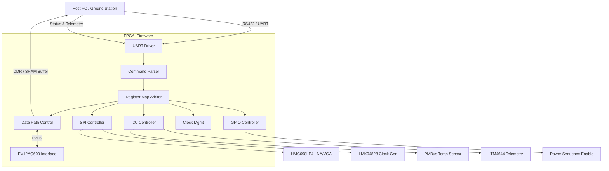
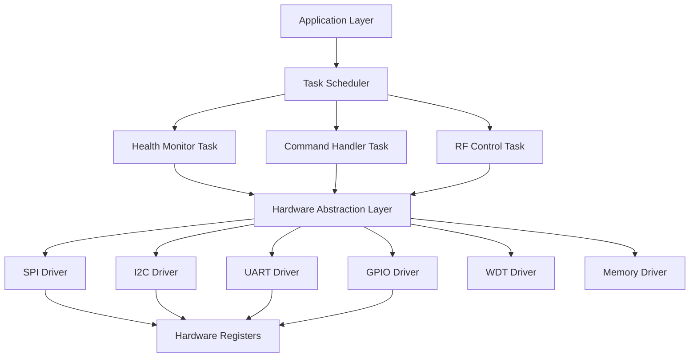
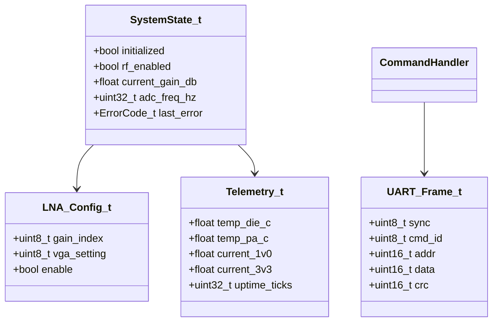
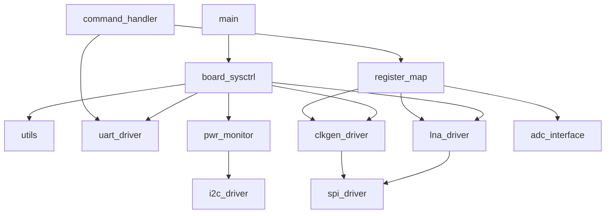
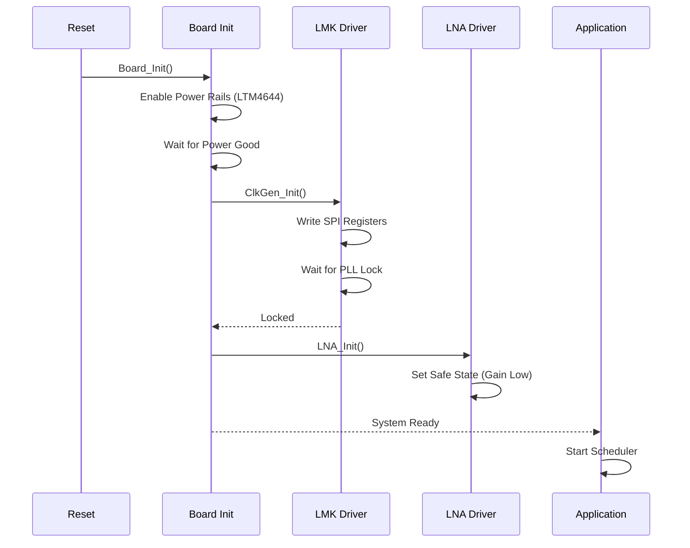
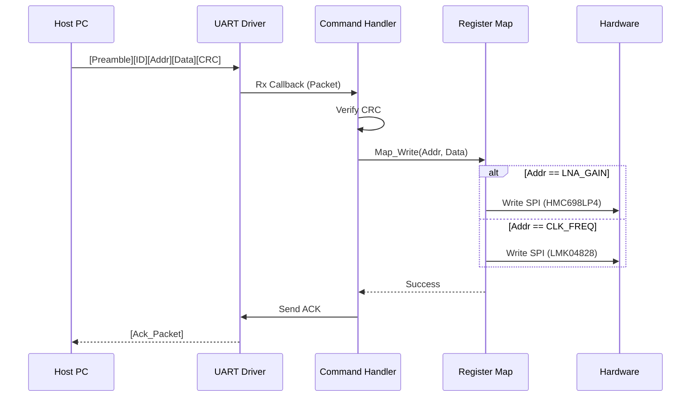
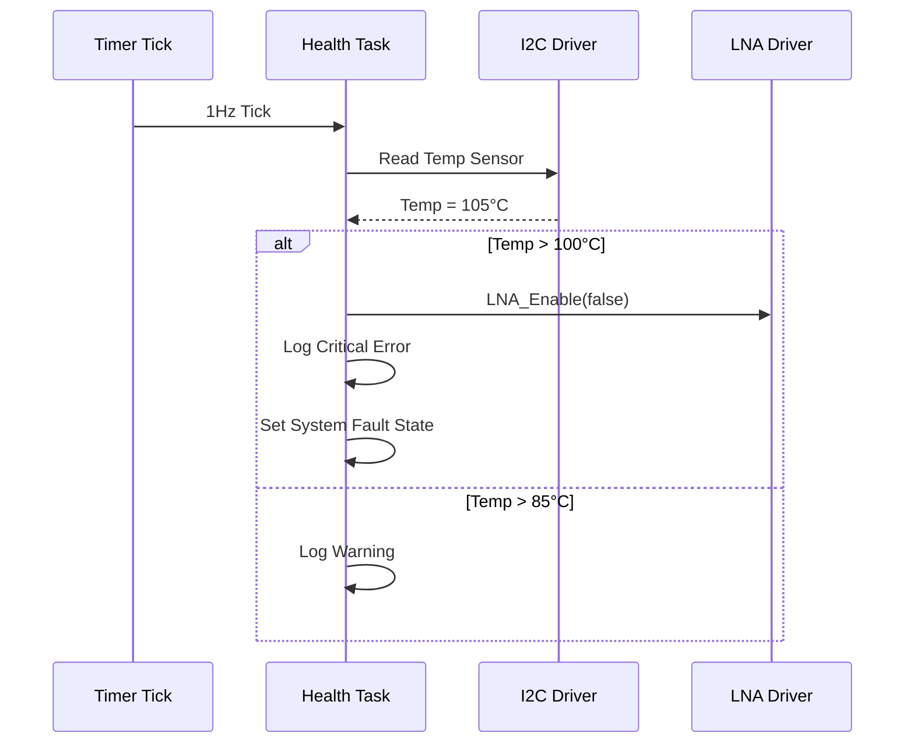
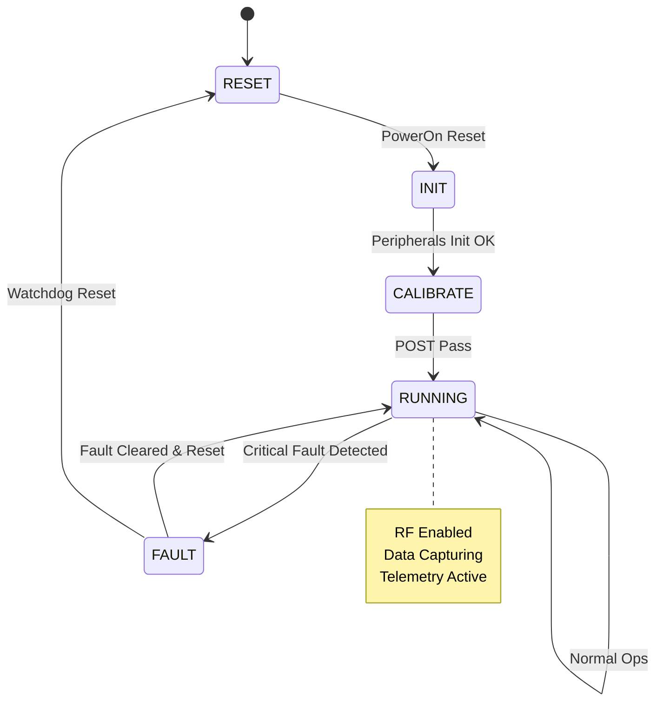
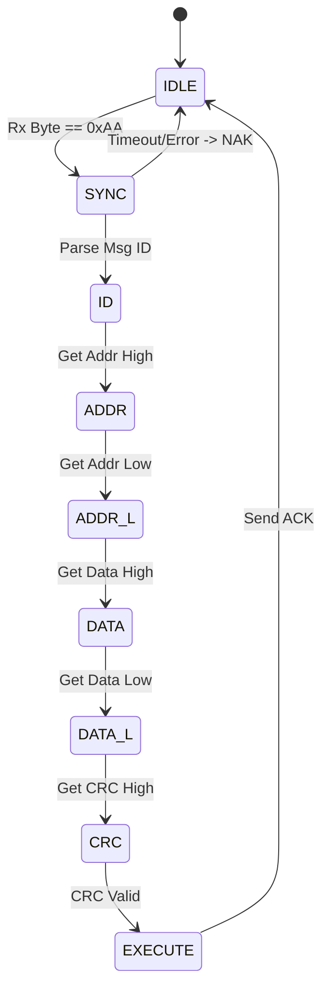

```markdown
# Software Design Document (SDD)

**Project:** khv Wideband RF Receiver Firmware  
**Version:** 1.0  
**Date:** 16 April 2026  
**Author:** Lead Firmware Architect  

---

## Document Control
| Version | Date | Author | Description |
|---------|------|--------|-------------|
| 1.0 | 16 April 2026 | Lead Firmware Architect | Initial design compliant with IEEE 1016-2009 |

---

# 1. Introduction

## 1.1 Purpose
This Software Design Document (SDD) provides a comprehensive technical description of the firmware architecture for the **khv** Wideband RF Receiver. It details the structural decomposition, data flow, algorithms, and interfaces required to implement the functionality defined in the **khv Software Requirements Specification (SRS)** v1.0. This document serves as the blueprint for firmware engineers implementing C-based control logic on the Xilinx MicroBlaze soft-core and RTL designers developing the data path fabric within the XQKU5P FPGA.

## 1.2 Scope
The design covers the complete firmware stack including the Hardware Abstraction Layer (HAL), peripheral drivers (SPI, I2C, UART), application logic (gain control, health monitoring), and the host communication protocol. It explicitly defines the software's interaction with the EV12AQ600 ADC, HMC698LP4 RF Front End, LMK04828 Clock Generator, and LTM4644 Power Supply.

**Out of Scope:** This document does not cover the detailed RTL design of the JESD204B deserializer (covered in separate FPGA logic specs) or the host PC GUI application.

## 1.3 Definitions and Acronyms
| Term | Definition |
| :--- | :--- |
| **ADC** | Analog-to-Digital Converter (EV12AQ600). |
| **AGC** | Automatic Gain Control. |
| **API** | Application Programming Interface. |
| **BIST** | Built-In Self-Test. |
| **BRAM** | Block RAM (FPGA on-chip memory). |
| **CLB** | Configurable Logic Block. |
| **CRC** | Cyclic Redundancy Check. |
| **DMA** | Direct Memory Access. |
| **DSP** | Digital Signal Processing. |
| **EEPROM** | Electrically Erasable Programmable Read-Only Memory. |
| **FIFO** | First-In, First-Out buffer. |
| **FPGA** | Field-Programmable Gate Array (XQKU5P). |
| **FSM** | Finite State Machine. |
| **GLR** | Glue Logic Requirements. |
| **GPIO** | General Purpose Input/Output. |
| **GSPS** | Giga-Samples Per Second. |
| **HAL** | Hardware Abstraction Layer. |
| **HRS** | Hardware Requirements Specification. |
| **I2C** | Inter-Integrated Circuit (Serial Protocol). |
| **INT** | Interrupt. |
| **IPC** | Inter-Process Communication. |
| **ISR** | Interrupt Service Routine. |
| **JESD204B** | High-speed data interface standard. |
| **JTAG** | Joint Test Action Group (Debug interface). |
| **LNA** | Low Noise Amplifier (HMC698LP4). |
| **LVDS** | Low-Voltage Differential Signaling. |
| **MISRA** | Motor Industry Software Reliability Association (Coding Standard). |
| **MMCM** | Mixed-Mode Clock Manager. |
| **NVM** | Non-Volatile Memory. |
| **PCB** | Printed Circuit Board. |
| **PLL** | Phase-Locked Loop (LMK04828). |
| **POST** | Power-On Self-Test. |
| **QSPI** | Quad Serial Peripheral Interface. |
| **RAM** | Random Access Memory. |
| **RF** | Radio Frequency. |
| **RTOS** | Real-Time Operating System. |
| **Rx** | Receive. |
| **SFR** | Special Function Register. |
| **SPI** | Serial Peripheral Interface. |
| **SRS** | Software Requirements Specification. |
| **SDD** | Software Design Description. |
| **TRP** | Transmit/Receive Power. |
| **UART** | Universal Asynchronous Receiver-Transmitter. |
| **VGA** | Variable Gain Amplifier. |
| **WDT** | Watchdog Timer. |
| **XADC** | Xilinx Analog-to-Digital Converter (Hard IP). |

## 1.4 References
1.  **IEEE 1016-2009**: Standard for Information Technology — Systems Design — Software Design Descriptions.
2.  **khv SRS**: Software Requirements Specification, Doc ID SRS-KHV-1.0, 16 Apr 2026.
3.  **khv GLR**: Glue Logic Requirements, Doc ID GLR-KHV-0V01, 16 Apr 2026.
4.  **khv HRS**: Hardware Requirements Specification, Doc ID HRS-KHV-1.0, 27 Oct 2023.
5.  **MISRA-C:2012**: Guidelines for the Use of the C Language in Critical Systems.
6.  **EV12AQ600 Datasheet**: Teledyne e2v, Quad-channel, 12-bit, 5-10 GSPS ADC.
7.  **LMK04828 Datasheet**: Texas Instruments, Jitter Cleaner / Clock Generator.
8.  **HMC698LP4 Datasheet**: Analog Devices, 5-20 GHz GaAs MMIC LNA/VGA.
9.  **MicroBlaze Reference Guide**: Xilinx UG984.

---

# 2. Design Viewpoints

## 2.1 Context Viewpoint — System Boundaries

The khv firmware operates as the control plane for the RF digitization subsystem. It interfaces with a Host PC via UART for control commands and monitors the hardware health via SPI, I2C, and internal FPGA sensors.



**External Entities:**
*   **Host PC:** Sends configuration commands (Set Frequency, Set Gain) and receives status.
*   **HMC698LP4 (LNA/VGA):** SPI slave device controlling analog gain.
*   **LMK04828 (Clock Gen):** SPI slave device generating ADC sampling clocks.
*   **LTM4644 (Power):** I2C/PMBus device providing voltage/current telemetry.

## 2.2 Composition Viewpoint — Software Architecture

The software is architected in a layered approach to ensure portability and adherence to MISRA-C:2012.



### Module List and Responsibilities

#### Module: board_sysctrl
**Source:** `board_sysctrl.c`, `board_sysctrl.h`
**Responsibilities:** Power-on sequencing, clock tree initialization, MMCM/PLL locking, global interrupt enable.
**Public API:**
```c
/**
 * @brief Initialize the board hardware.
 * @return ERR_OK on success, error code otherwise.
 * @pre None
 * @post System clocks stable, peripherals enabled.
 */
int32_t Board_Init(void);

/**
 * @brief Retrieve hardware revision information.
 * @param info Pointer to store board info.
 * @return ERR_OK
 */
int32_t Board_GetInfo(BoardInfo_t *info);

/**
 * @brief Trigger a hard reset via the FPGA WDT.
 * @note Does not return.
 */
void Board_Reset(void);
```

#### Module: uart_driver
**Source:** `uart_driver.c`, `uart_driver.h`
**Responsibilities:** RS422 serial communication, interrupt-driven RX/TX, frame parsing for the khv protocol.
**Public API:**
```c
int32_t UART_Init(uint32_t baud_rate);
int32_t UART_WriteReg(uint16_t addr, uint16_t data);
int32_t UART_ReadReg(uint16_t addr, uint16_t *data_out);
void    UART_ISR_Handler(void);
```

#### Module: lna_driver
**Source:** `lna_driver.c`, `lna_driver.h`
**Responsibilities:** Interface to HMC698LP4 via SPI. Converts dB gain values to register words.
**Public API:**
```c
int32_t LNA_Init(void);
int32_t LNA_SetGain(float gain_db);
int32_t LNA_GetGain(float *gain_db);
int32_t LNA_Enable(bool enable);
```

#### Module: clkgen_driver
**Source:** `clkgen_driver.c`, `clkgen_driver.h`
**Responsibilities:** Configuration of LMK04828. Sets VCO dividers and output rates.
**Public API:**
```c
int32_t ClkGen_Init(void);
int32_t ClkGen_SetFreq(uint32_t freq_hz);
int32_t ClkGen_EnableOutputs(bool enable);
bool    ClkGen_IsLocked(void);
```

#### Module: adc_interface
**Source:** `adc_interface.c`, `adc_interface.h`
**Responsibilities:** Monitoring EV12AQ600 status (OR flags), resetting the data path.
**Public API:**
```c
int32_t ADC_Init(void);
int32_t ADC_ResetDatapath(void);
bool    ADC_IsLocked(void);
bool    ADC_IsOverRange(void);
```

#### Module: pwr_monitor
**Source:** `pwr_monitor.c`, `pwr_monitor.h`
**Responsibilities:** Read telemetry from LTM4644 via I2C/PMBus.
**Public API:**
```c
int32_t PwrMon_Init(void);
int32_t PwrMon_ReadRail(uint8_t rail_idx, float *volts, float *amps);
bool    PwrMon_IsFault(void);
```

#### Module: command_handler
**Source:** `command_handler.c`, `command_handler.h`
**Responsibilities:** Parse incoming UART frames, execute actions, format responses.
**Public API:**
```c
void CmdHandler_Task(void);
int32_t CmdHandler_Dispatch(uint16_t addr, uint16_t data);
```

## 2.3 Logical Viewpoint — Data Model

Key structures passing data between the Hardware Layer and Application Layer.



### Data Structure Definitions

```c
/**
 * @brief System global state structure.
 */
typedef struct {
    volatile bool initialized;     /**< System ready flag */
    volatile bool pll_locked;       /**< LMK04828 lock status */
    volatile bool adc_locked;       /**< EV12AQ600 link status */
    float target_gain_db;           /**< Desired RF gain */
    float actual_gain_db;           /**< Actual RF gain (readback) */
    uint32_t sample_rate_hz;        /**< Current ADC sample rate */
    uint32_t uptime_seconds;        /**< System uptime counter */
} SystemState_t;

/**
 * @brief LNA/VGA Register Map representation.
 */
typedef struct {
    uint8_t reg_ctrl;    /**< Control register (Enable/Shutdown) */
    uint8_t reg_gain_1;  /**< Coarse Gain (MSB) */
    uint8_t reg_gain_2;  /**< Fine Gain (LSB) */
    uint8_t reg_temp;    /**< Temperature sensor readback */
} LNA_RegMap_t;

/**
 * @brief UART Packet Protocol Definition (GLR Compliant).
 */
typedef struct __attribute__((packed)) {
    uint8_t  preamble;       /**< 0xAA magic byte */
    uint8_t  msg_id;         /**< Message ID */
    uint16_t addr;           /**< Register Address */
    uint16_t data;           /**< Payload Data */
    uint16_t checksum;       /**< CRC-16 CCITT */
} UART_Packet_t;
```

## 2.4 Dependency Viewpoint

The build order and module dependencies are strictly defined to ensure initialization and access safety.



**Dependencies:**
1.  **Utils:** Circular buffer, CRC16, Debug logging (no platform dependencies).
2.  **Drivers:** SPI, I2C, GPIO (depend only on Utils and specific HW registers).
3.  **HAL:** LNA, ClkGen, PwrMon (depend on Drivers).
4.  **App:** Board, CmdHandler (depend on HAL).

## 2.5 Interface Viewpoint — Complete API Specification

### UART Driver API

```c
/**
 * @brief Initialize UART hardware for RS422 operation.
 * @param baud_rate Baud rate (e.g., 115200).
 * @return int32_t ERR_OK on success.
 * @pre System clocks configured.
 * @post UART RX/TX enabled.
 */
int32_t UART_Init(uint32_t baud_rate);

/**
 * @brief Send data packet via UART.
 * @param pkt Pointer to packet structure.
 * @return ERR_OK if transmission started.
 * @note Blocking on FIFO full.
 */
int32_t UART_SendPacket(const UART_Packet_t *pkt);

/**
 * @brief Register callback for received packets.
 * @param cb Function pointer to callback.
 * @return ERR_OK.
 */
void UART_SetRxCallback(void (*cb)(const UART_Packet_t *pkt));
```

### SPI Driver API

```c
/**
 * @brief Initialize SPI master controller.
 * @param spi_id Instance ID (0 for LNA/CLK).
 * @return ERR_OK.
 */
int32_t SPI_Init(uint8_t spi_id);

/**
 * @brief Perform SPI transaction.
 * @param cs Chip select index.
 * @param tx_buf Transmit buffer.
 * @param rx_buf Receive buffer.
 * @param len Length in bytes.
 * @return ERR_OK.
 */
int32_t SPI_Transfer(uint8_t cs, const uint8_t *tx_buf, uint8_t *rx_buf, uint16_t len);
```

### I2C Driver API

```c
/**
 * @brief Initialize I2C master controller.
 * @param clk_hz Frequency (100kHz or 400kHz).
 * @return ERR_OK.
 */
int32_t I2C_Init(uint32_t clk_hz);

/**
 * @brief Read register from I2C slave.
 * @param dev_addr 7-bit device address.
 * @param reg Register address.
 * @param val Pointer to store data.
 * @return ERR_OK.
 */
int32_t I2C_ReadReg(uint8_t dev_addr, uint8_t reg, uint8_t *val);
```

## 2.6 Interaction Viewpoint — Sequence Diagrams

### System Startup Sequence



### UART Register Write Sequence



### Temperature Alert Handling



## 2.7 State Viewpoint — State Machines

### Main System FSM



### Command Parser FSM



## 2.8 Algorithm Viewpoint

### CRC-16 Calculation
Used for verifying UART packets. Polynomial: 0x1021 (CCITT).

```c
/**
 * @brief Calculate CRC-16 CCITT.
 * @param data Input buffer.
 * @param len Length of buffer.
 * @return Calculated CRC.
 */
uint16_t UTIL_CalcCRC16(const uint8_t *data, uint16_t len) {
    uint16_t crc = 0xFFFF;
    for (uint16_t i = 0; i < len; i++) {
        crc ^= (uint16_t)data[i] << 8;
        for (uint8_t j = 0; j < 8; j++) {
            if (crc & 0x8000) {
                crc = (crc << 1) ^ 0x1021;
            } else {
                crc <<= 1;
            }
        }
    }
    return crc;
}
```

### Gain Linearization (HMC698LP4)
The HMC698LP4 gain response vs. register value is non-linear. A 256-point LUT (Look-Up Table) is used in Flash to convert requested dB to nearest register index.

```c
/**
 * @brief Convert dB gain to Register Index using LUT.
 * @param db Target gain in dB.
 * @return uint8_t Register index.
 */
uint8_t LNA_ConvertGain(float db) {
    // Clamp input
    if (db < LNA_MIN_DB) db = LNA_MIN_DB;
    if (db > LNA_MAX_DB) db = LNA_MAX_DB;
    
    // Find closest match in LUT
    uint8_t idx = 0;
    float min_diff = 100.0f;
    
    for (uint8_t i = 0; i < 256; i++) {
        float diff = abs_f(gain_lut[i] - db);
        if (diff < min_diff) {
            min_diff = diff;
            idx = i;
        }
    }
    return idx;
}
```

### JESD204B Lane Monitoring
The ADC interface module monitors the `~SYNC` signal from the ADC.

```c
/**
 * @brief Task to verify ADC link stability.
 * @return bool true if link is stable for 100ms.
 */
bool ADC_VerifyLink(void) {
    uint32_t stable_count = 0;
    const uint32_t threshold = 10000; // ~100ms at 100us poll
    
    while (stable_count < threshold) {
        if (GPIO_Read(ADC_SYNC_PIN) == 0) { // Active low check
             stable_count++;
        } else {
             stable_count = 0;
        }
        usleep(100);
    }
    return true;
}
```

## 2.9 Resource Viewpoint — Real-Time Constraints

### 2.9.1 Task Scheduling Table
Based on a 1 kHz System Tick (1 ms period).

| Task Name | Period (ms) | Exec Time (us) | Priority | Deadline | CPU Load |
|-----------|-------------|----------------|----------|----------|----------|
| CmdHandler_Task | 1 | 150 | High | 1 ms | 15% |
| RF_Control_Task | 10 | 50 | Med | 10 ms | 0.5% |
| HealthMon_Task | 1000 | 800 | Low | 1000 ms | 0.08% |
| WDT_Kick | 100 | 20 | High | 100 ms | 0.02% |

**Total CPU Load:** ~16% (Headroom available for future DSP tasks).

### 2.9.2 ISR Latency Budget

| Interrupt Source | Freq / Period | Max Latency | Action |
|-----------------|---------------|-------------|---------|
| UART Rx FIFO | 115200 bd | 10 us | Load byte to buffer |
| Timer Tick | 1000 Hz | 5 us | Update kernel ticks |
| PLL Lock (GPIO) | Event | 1 us | Clear interrupt flag |

### 2.9.3 Memory Budget
Based on Xilinx MicroBlaze with 64KB Local BRAM and external 32MB DDR.

| Region | Size | Usage |
|--------|------|-------|
| Code (Text) | 45 KB | Firmware, Drivers |
| Data (BSS) | 8 KB | Global state, stacks |
| Heap | 8 KB | Dynamic allocations (Buffer pools) |
| Stack (Main) | 4 KB | Main loop stack |
| Stack (ISR) | 2 KB | Interrupt stack |
| **Total BRAM** | 64 KB | XQKU5P On-Chip |

## 2.10 Build System Viewpoint

### CMakeLists.txt Structure

```cmake
cmake_minimum_required(VERSION 3.20)
project(khv_firmware VERSION 1.0.0 LANGUAGES C ASM)

set(CMAKE_C_STANDARD 11)
set(CMAKE_C_FLAGS "${CMAKE_C_FLAGS} -Wall -Wextra -Wpedantic -O2")

# --- Toolchain Setup for MicroBlaze ---
set(CMAKE_SYSTEM_NAME Generic)
set(CMAKE_C_COMPILER mb-gcc)
set(CMAKE_OBJCOPY mb-objcopy)

# --- Source Files ---
set(SOURCES
    src/main.c
    src/board/board_sysctrl.c
    src/drivers/uart_driver.c
    src/drivers/spi_driver.c
    src/drivers/i2c_driver.c
    src/drivers/gpio_driver.c
    src/hal/lna_driver.c
    src/hal/clkgen_driver.c
    src/hal/pwr_monitor.c
    src/app/command_handler.c
    src/utils/crc16.c
)

add_executable(khv_firmware.elf ${SOURCES})

# --- Linker Script ---
target_link_options(khv_firmware.elf PRIVATE -T ${CMAKE_SOURCE_DIR}/ld/microblaze.ld)

# --- Unit Tests (Host Based) ---
enable_testing()
add_subdirectory(tests)
```

### Test Infrastructure (tests/CMakeLists.txt)

```cmake
# GoogleTest setup
find_package(GTest REQUIRED)

add_executable(test_hal
    test/test_lna_driver.cpp
    test/test_clkgen_driver.cpp
    test/mock_spi.cpp # Mock hardware layer
)

target_link_libraries(test_hal PRIVATE GTest::gtest_main)
gtest_discover_tests(test_hal)
```

---

# 3. Design Rationale

## 3.1 Architecture Choices
1.  **Bare-Metal vs RTOS:** A bare-metal, event-driven loop was chosen over a full RTOS. The system workload is deterministic and single-threaded in nature (control plane only). This reduces context-switch overhead and simplifies MISRA certification.
2.  **Polled SPI vs DMA:** SPI transactions to the LNA and Clock Gen are infrequent and short (<16 bytes). Polled mode minimizes code complexity and RAM usage compared to setting up DMA descriptors for small packets.
3.  **State Machines:** Command parsing and system state management are implemented as explicit Finite State Machines (FSM) rather than spaghetti `if-else` chains. This ensures every state transition is testable and verifiable.

## 3.2 MISRA-C:2012 Compliance
*   All static analysis will be performed using `PC-lint Plus` with the MISRA-C:2012 configuration.
*   Dynamic memory allocation (`malloc`, `free`) is prohibited in the final firmware binary. Fixed-size pools are used for buffering.
*   All functions are documented with Doxygen comments specifying input ranges and return values.

---

# 4. Design Traceability Matrix

| SDD Element | Source Requirement | Description |
|-------------|--------------------|-------------|
| `Board_Init()` | SRS-3.1 | System initialization sequence |
| `LNA_SetGain()` | SRS-3.4.1 | RF Gain Control |
| `ClkGen_SetFreq()` | SRS-3.4.2 | Sampling Frequency Config |
| `UART_Init()` | SRS-3.5.1 | Host Comms Init |
| `PwrMon_ReadRail()` | SRS-3.6 | Power Telemetry |
| `ADC_IsLocked()` | SRS-3.4.3 | Link Status Monitor |
| `WDT_Kick()` | SRS-3.7 | Watchdog Maintenance |
| FSM: Command Handler | SRS-3.5.2 | Protocol Parsing |
| FSM: Main System | SRS-3.2 | Operational States |

---

# 5. Appendices

## Appendix A — File Structure
```
firmware/
├── src/
│   ├── main.c                 # Entry point
│   ├── board/
│   │   └── board_sysctrl.c
│   ├── drivers/
│   │   ├── uart_driver.c
│   │   ├── spi_driver.c
│   │   ├── i2c_driver.c
│   │   └── gpio_driver.c
│   ├── hal/
│   │   ├── lna_driver.c
│   │   ├── clkgen_driver.c
│   │   └── pwr_monitor.c
│   ├── app/
│   │   └── command_handler.c
│   └── utils/
│       └── crc16.c
├── ld/
│   └── microblaze.ld
├── tests/
│   └── test_hal.cpp
└── CMakeLists.txt
```

## Appendix B — Register Map (FPGA & Peripherals)

### FPGA Register Map (Address Offset from Base `0x40000000`)
| Offset | Name | Access | Reset | Description |
|--------|------|--------|-------|-------------|
| 0x00 | `REG_CTRL` | R/W | 0x0000 | System Control Register (Bit 0: Reset, Bit 1: Enable) |
| 0x04 | `REG_STATUS` | R | 0x0000 | Status Register (Bit 0: PLL Lock, Bit 1: ADC Ready) |
| 0x08 | `REG_GAIN` | W | 0x0000 | LNA Gain Setting (Direct mapped to SPI driver) |
| 0x0C | `REG_FREQ_HI` | W | 0x0000 | Clock Frequency High Word |
| 0x10 | `REG_FREQ_LO` | W | 0x0000 | Clock Frequency Low Word |
| 0x14 | `REG_TEST` | R/W | 0x0000 | Scratchpad / BIST register |

### LMK04828 SPI Register Map (Selected)
| Device Addr | Reg Addr | Function |
|-------------|----------|----------|
| 0x50 | 0x0000 | DEVICE_ID |
| 0x50 | 0x0102 | INPUT_MUX_EN |
| 0x50 | 0x0145 | PLL1_R_DIV |
| 0x50 | 0x0146 | PLL1_N_DIV |
| 0x50 | 0x01A0 | SYNC_MODE |

### HMC698LP4 SPI Register Map
| Device Addr | Reg Addr | Function |
|-------------|----------|----------|
| 0x51 | 0x00 | CHIP_ID |
| 0x51 | 0x01 | GAIN_CTRL_1 (Coarse) |
| 0x51 | 0x02 | GAIN_CTRL_2 (Fine) |
| 0x51 | 0x03 | VGACON (Enable) |

## Appendix C — Memory Map
| Region | Start Address | End Address | Size | Attributes |
|--------|---------------|-------------|------|------------|
| Code | 0x00000000 | 0x0000BFFF | 48 KB | Executable (Flash/BRAM) |
| Data | 0x00010000 | 0x00017FFF | 32 KB | R/W (BRAM) |
| FPGA MMIO | 0x40000000 | 0x4000FFFF | 64 KB | Peripheral Registers |
| DDR Buffer | 0x80000000 | 0x81FFFFFF | 32 MB | ADC Data Storage |

## Appendix D — Coding Standards Checklist
- [x] Doxygen headers on all public functions.
- [x] `MISRA_C_2012` rule set enabled in compiler.
- [x] Static analysis passes with 0 errors.
- [x] No recursion used.
- [x] Cyclomatic complexity < 15 for all functions.
- [x] All magic numbers replaced by `#define` or `enum`.
- [x] Unit test coverage > 90% for HAL layer.
```