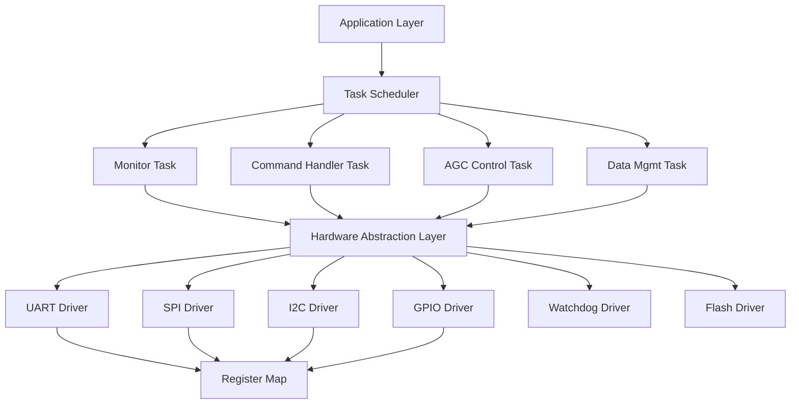
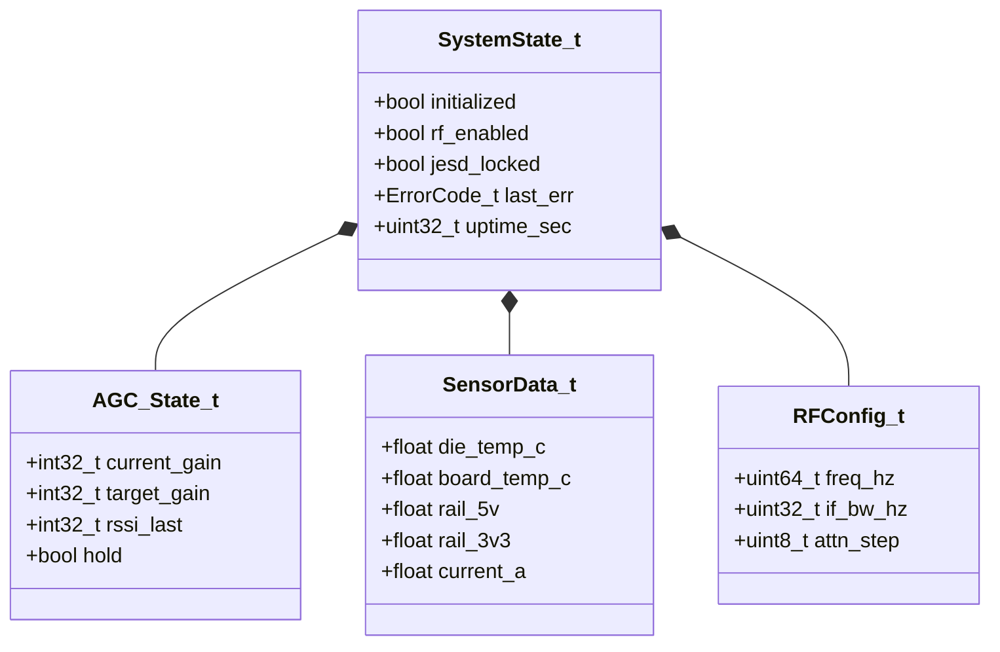
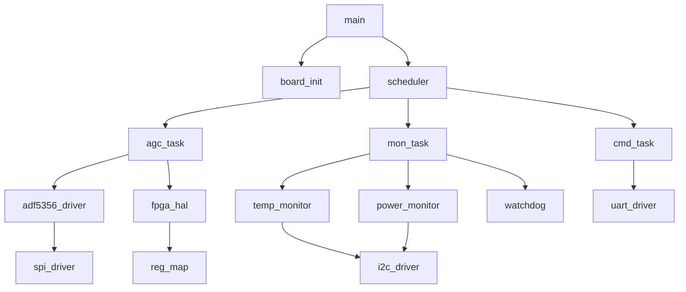
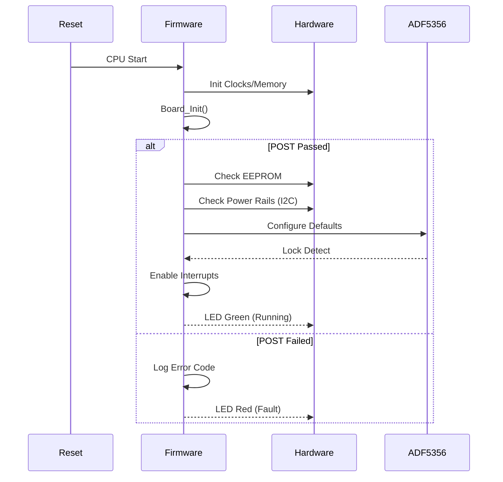
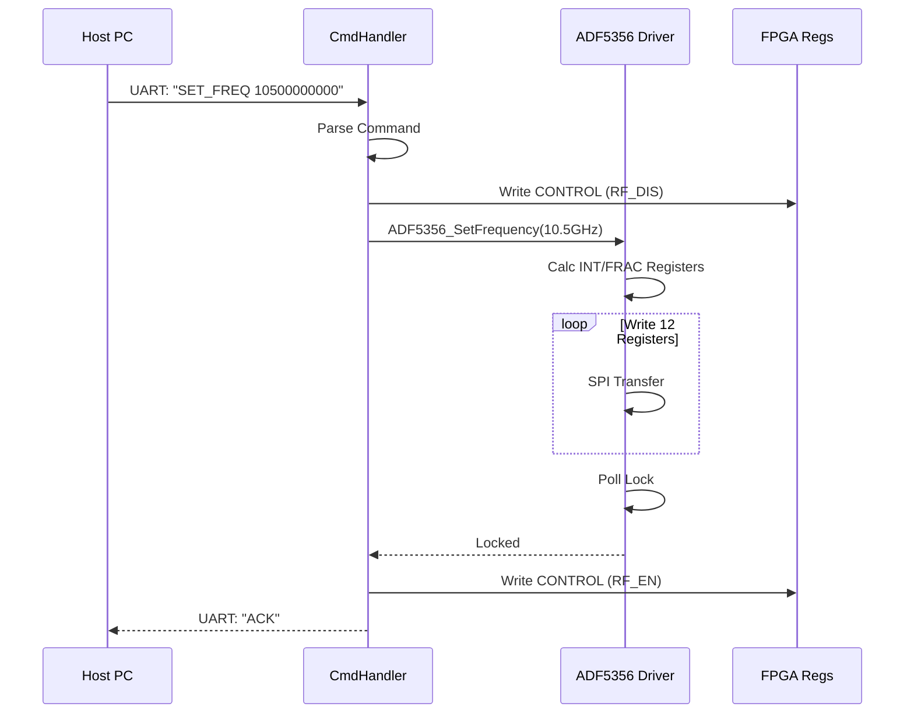
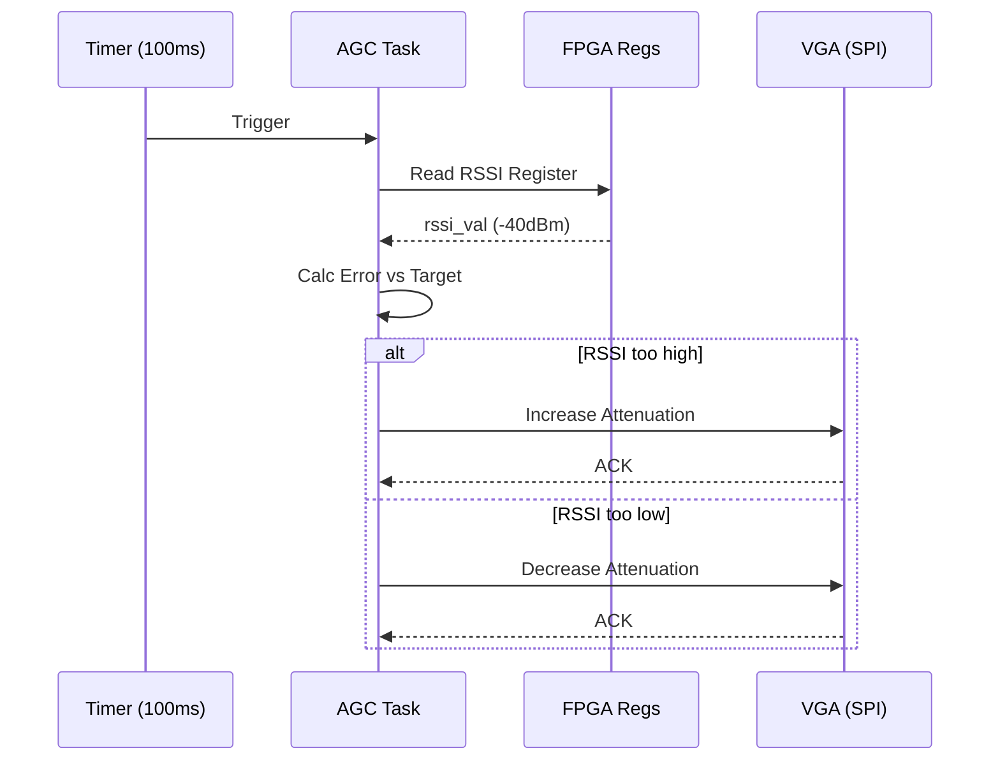
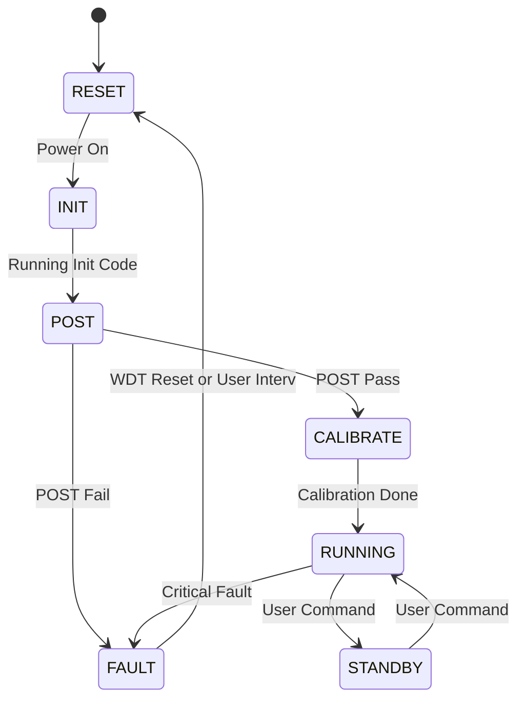
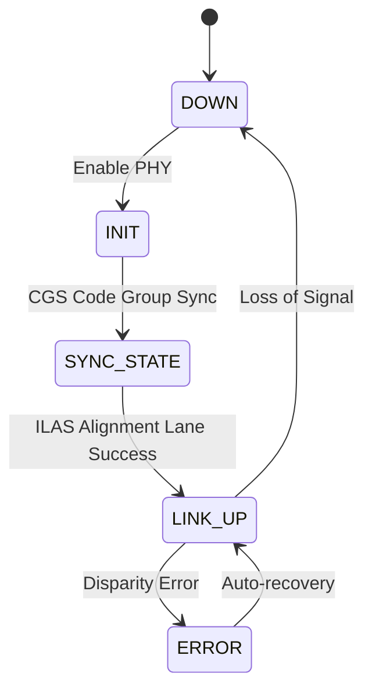

```markdown
# Software Design Document (SDD)

**Project:** kjk Wideband RF Receiver  
**Document Version:** 1.0  
**Date:** 17 April 2026  
**Author:** Senior Embedded Software Architect

---

## Document Control
| Version | Date | Author | Description |
|---------|------|--------|-------------|
| 1.0 | 17 April 2026 | System Architecture | Initial design derived from SRS/HRS/GLR |

---

# 1. Introduction

## 1.1 Purpose
This Software Design Document (SDD) provides the comprehensive architectural and detailed design for the embedded firmware of the **kjk Wideband RF Receiver**. It defines the software structure, component interfaces, data handling mechanisms, and control algorithms required to operate the RF Front End (LNA, Mixer), Frequency Synthesizer (ADF5356), and Data Acquisition Chain (ADC12DJ5200RF, FPGA JESD204B).

This document serves as the blueprint for firmware engineers implementing the C/C++ control code on the embedded processor (MicroBlaze/Soft-Core) within the Xilinx Kintex-7 FPGA, and for RTL designers integrating the register map.

## 1.2 Scope
The design encompasses the **Control Plane** software executing on the embedded processor core.
*   **Included:**
    *   HAL (Hardware Abstraction Layer) for UART, SPI, I2C, GPIO.
    *   Peripheral drivers for ADF5356 (SPI), ADT7420 (I2C), ADM1278 (I2C), and MT25QU02G (QSPI).
    *   Control algorithms: Automatic Gain Control (AGC), PLL Frequency Tuning, and Power Sequencing.
    *   Data Plane management: JESD204B link monitoring and Ethernet UDP packetization control.
    *   System services: Watchdog, POST, and NVM storage.
*   **Excluded:**
    *   High-speed DSP logic implemented in FPGA fabric (VHDL/Verilog), except for register interfaces.
    *   Host-side Signal Processing application code.
    *   Physical Layer (PHY) driver implementation (assumed vendor IP core).

## 1.3 Definitions and Acronyms

| Term | Definition |
| :--- | :--- |
| **ADC** | Analog-to-Digital Converter (TI ADC12DJ5200RF). |
| **AGC** | Automatic Gain Control. Firmware loop adjusting VGA/LNA attenuation. |
| **BIST** | Built-In Self-Test. Diagnostic routine running on hardware. |
| **BRAM** | Block RAM. FPGA internal memory. |
| **DDC** | Digital Down Converter. FPGA logic mixing IF to Baseband I/Q. |
| **DMA** | Direct Memory Access. Hardware data transfer mechanism. |
| **FIFO** | First-In-First-Out memory buffer. |
| **FPGA** | Field-Programmable Gate Array (Xilinx Kintex-7). |
| **GLR** | Glue Logic Requirements. Defines register map and hardware interfaces. |
| **GPIO** | General Purpose Input/Output. |
| **HAL** | Hardware Abstraction Layer. Software driver layer. |
| **HRS** | Hardware Requirements Specification. |
| **I2C** | Inter-Integrated Circuit (Serial bus). |
| **ISR** | Interrupt Service Routine. |
| **JESD204B** | High-speed data converter interface standard. |
| **LNA** | Low Noise Amplifier (HMC698LP4). |
| **LO** | Local Oscillator (ADF5356). |
| **M&C** | Monitor and Control. |
| **MISRA** | Motor Industry Software Reliability Association (C coding guidelines). |
| **PHY** | Physical Layer Transceiver (Ethernet). |
| **PLL** | Phase-Locked Loop. |
| **POST** | Power-On Self-Test. |
| **QSPI** | Quad Serial Peripheral Interface. |
| **RF** | Radio Frequency. |
| **RSSI** | Received Signal Strength Indicator. |
| **RTL** | Register Transfer Level (FPGA code). |
| **SPI** | Serial Peripheral Interface. |
| **UART** | Universal Asynchronous Receiver/Transmitter. |
| **VCO** | Voltage-Controlled Oscillator. |
| **WDT** | Watchdog Timer. |
| **UDP** | User Datagram Protocol. |

## 1.4 References
1.  **SRS-kjk-001**: Software Requirements Specification for kjk Wideband RF Receiver (Rev 1.0).
2.  **HRS-kjk-001**: Hardware Requirements Specification (Rev 1.0).
3.  **GLR-kjk-002**: Glue Logic Requirements and FPGA Register Map (Rev 1.0).
4.  IEEE 1016-2009: Standard for Information Technology—Systems Design—Software Design Descriptions.
5.  MISRA-C:2012 - Guidelines for the use of the C language in critical systems.
6.  Xilinx UG986: Zynq-7000 SoC and MicroBlaze Processor Software Design Guide.
7.  Analog Devices UG-585: ADF5356 Synthesizer Datasheet.
8.  Texas Instruments SBAS658: ADC12DJ5200RF Datasheet.

---

# 2. Design Viewpoints

## 2.1 Context Viewpoint — System Boundaries

The software system resides within the FPGA fabric on an embedded processor (e.g., MicroBlaze). It interacts with the external Host PC, various hardware peripherals, and the internal FPGA logic cores.

```mermaid
graph TD
    HOST[Host PC / Radar Processor] -->|UDP Packets / TCP Cmd| ETH_MAC[Gigabit Ethernet MAC]
    HOST -->|Debug Commands| UART_DRV[UART Driver]
    
    subgraph FPGA [Xilinx Kintex-7 FPGA Firmware]
        CP[Control Processor] --> ETH_MAC
        CP --> UART_DRV
        CP --> REG_MAP[Register Map Handler]
        
        REG_MAP --> SPI_CTRL[SPI Controller]
        REG_MAP --> I2C_CTRL[I2C Controller]
        REG_MAP --> GPIO_CTRL[GPIO Controller]
        REG_MAP --> DDCC[DDC Config Core]
        REG_MAP --> JESDC[JESD204B Config Core]
        
        SPI_CTRL --> ADF5356[ADF5356 Synthesizer]
        SPI_CTRL --> FLASH[Config Flash (QSPI)]
        
        I2C_CTRL --> TEMP[ADT7420 Sensor]
        I2C_CTRL --> PWR[ADM1278 Monitor]
        
        GPIO_CTRL --> RF_CTRL[RF Enable / LNA Bias]
        GPIO_CTRL --> LEDS[Status LEDs]
        
        DDCC --> ADC_IF[ADC Interface Logic]
        JESDC --> ADC_IF
    end
    
    ADC[ADC12DJ5200RF] -->|JESD204B Lanes| ADC_IF
    ANT[RF Input 5-18GHz] --> RF_IN[RF Front End]
    ADF5356 -->|LO| RF_IN
    RF_IN --> ADC
```

**External Interfaces:**
*   **Host PC:** Receives digitized I/Q data via UDP; sends configuration commands via TCP/UART.
*   **ADF5356:** Programmed via SPI (Mode 0, up to 25 MHz).
*   **Sensors (I2C):** ADT7420 (Temp) and ADM1278 (Power) polled periodically.
*   **Flash:** Stores calibration tables and FPGA bitstreams (QSPI).

## 2.2 Composition Viewpoint — Software Architecture

The software is architected in a layered approach to ensure portability and adherence to MISRA-C standards.



### Module List with Responsibilities

#### **Module: board_init** (board_init.c / board_init.h)
*   **Responsibilities:** System startup, clock tree verification, BRAM initialization, and POST execution.
*   **Public API:**
```c
int32_t Board_Init(void);
int32_t Board_GetInfo(BoardInfo_t *info);
int32_t Board_SelfTest(uint32_t *test_mask);

typedef struct {
    uint16_t board_id;
    uint8_t  hw_revision;
    uint32_t serial_num;
    char     build_date[16];
} BoardInfo_t;
```

#### **Module: uart_driver** (uart_driver.c / uart_driver.h)
*   **Responsibilities:** UART configuration, interrupt-driven TX/RX, command frame parsing.
*   **Public API:**
```c
int32_t UART_Init(uint32_t baud_rate);
int32_t UART_WriteByte(uint8_t data);
int32_t UART_ReadByte(uint8_t *data);
int32_t UART_WriteBuffer(const uint8_t *buf, uint32_t len);
int32_t UART_ReadBuffer(uint8_t *buf, uint32_t len);
void    UART_ISR(void);
```

#### **Module: spi_driver** (spi_driver.c / spi_driver.h)
*   **Responsibilities:** SPI master control (Polled and DMA modes), CS management, ADF5356 transaction handling.
*   **Public API:**
```c
int32_t SPI_Init(uint32_t base_addr, uint32_t clk_hz);
int32_t SPI_Transfer(uint8_t chip_select, const uint8_t *tx, uint8_t *rx, uint16_t len);
int32_t SPI_WriteReg32(uint8_t cs, uint8_t reg_addr, uint32_t data);
```

#### **Module: i2c_driver** (i2c_driver.c / i2c_driver.h)
*   **Responsibilities:** I2C master control (100kHz), polling logic for sensors.
*   **Public API:**
```c
int32_t I2C_Init(uint32_t clk_hz);
int32_t I2C_Write(uint8_t dev_addr, const uint8_t *data, uint16_t len);
int32_t I2C_Read(uint8_t dev_addr, uint8_t *buf, uint16_t len);
int32_t I2C_WriteReg(uint8_t dev_addr, uint8_t reg, uint8_t val);
int32_t I2C_ReadReg(uint8_t dev_addr, uint8_t reg, uint8_t *val);
```

#### **Module: adf5356_driver** (adf5356.c / adf5356.h)
*   **Responsibilities:** LO frequency synthesis, register calculation, VCO calibration.
*   **Public API:**
```c
int32_t ADF5356_Init(uint32_t ref_clk_hz);
int32_t ADF5356_SetFrequency(uint64_t freq_hz);
bool    ADF5356_IsLocked(void);
void    ADF5356_EnableRF(void);
void    ADF5356_DisableRF(void);
```

#### **Module: temp_monitor** (temp_monitor.c / temp_monitor.h)
*   **Responsibilities:** Poll ADT7420, convert to Celsius, manage thermal shutdown.
*   **Public API:**
```c
int32_t TempMon_Init(void);
int32_t TempMon_Read(float *temp_c);
bool    TempMon_IsOvertemp(void);
void    TempMon_Task(void);
```

#### **Module: power_monitor** (power_monitor.c / power_monitor.h)
*   **Responsibilities:** Poll ADM1278, calculate Volts/Amps, fault detection.
*   **Public API:**
```c
int32_t PwrMon_Init(void);
int32_t PwrMon_ReadRail(float *voltage, float *current);
bool    PwrMon_IsFault(void);
void    PwrMon_Task(void);
```

#### **Module: agc_ctrl** (agc_ctrl.c / agc_ctrl.h)
*   **Responsibilities:** Read FPGA RSSI, calculate attenuation, set SPI gain stages.
*   **Public API:**
```c
int32_t AGC_Init(AGC_Config_t *cfg);
int32_t AGC_Update(int32_t rssi_db);
void    AGC_Task(void);
```

#### **Module: data_stream** (data_stream.c / data_stream.h)
*   **Responsibilities:** Setup JESD204B link, configure Ethernet DMA, monitor packet flow.
*   **Public API:**
```c
int32_t DataStream_Enable(void);
int32_t DataStream_Disable(void);
bool    DataStream_IsLinkUp(void);
void    DataStream_Task(void);
```

## 2.3 Logical Viewpoint — Data Model



**Enumerations & Structures:**

```c
typedef enum {
    SYS_STATE_RESET = 0,
    SYS_STATE_INIT,
    SYS_STATE_CALIBRATING,
    SYS_STATE_RUNNING,
    SYS_STATE_FAULT,
    SYS_STATE_SHUTDOWN
} SystemState_e;

typedef enum {
    ERR_OK = 0x00,
    ERR_TIMEOUT = 0x01,
    ERR_COMM_SPI = 0x02,
    ERR_COMM_I2C = 0x03,
    ERR_PARAM = 0x04,
    ERR_PLL_UNLOCK = 0x05,
    ERR_JESD_LINK = 0x06,
    ERR_TEMP = 0x07,
    ERR_POWER = 0x08
} ErrorCode_t;

typedef struct {
    uint32_t magic;
    uint16_t board_id;
    RFConfig_t rf_cfg;
    uint32_t crc32;
} CalibrationTable_t;
```

## 2.4 Dependency Viewpoint



## 2.5 Interface Viewpoint — Complete API Specification

**Example: ADF5356 Driver Specification**

```c
/**
 * @brief Initialize the ADF5356 Synthesizer.
 *
 * @param ref_clk_hz Reference clock frequency in Hz (e.g., 100,000,000).
 * @return ERR_OK on success
 * @return ERR_PARAM if frequency is invalid
 *
 * @pre SPI_Init() must be called successfully.
 * @post Device is in standby state.
 */
int32_t ADF5356_Init(uint32_t ref_clk_hz);

/**
 * @brief Set the output frequency.
 *
 * Calculates INT, FRAC, and MOD dividers internally.
 * @param freq_hz Desired RF frequency (53.125 MHz to 13.6 GHz).
 * @return ERR_OK on success
 * @return ERR_TIMEOUT if PLL fails to lock within 100ms.
 */
int32_t ADF5356_SetFrequency(uint64_t freq_hz);

/**
 * @brief Check lock status.
 * @return true if MUXOUT pin indicates lock.
 */
bool ADF5356_IsLocked(void);
```

**FPGA Register Map Interface (GLR compliance):**
*All register accesses are 32-bit. Base address 0x8000_0000.*

```c
#define FPGA_REG_BASE 0x80000000

typedef struct {
    volatile uint32_t SCRATCH;     // 0x00: Test register
    volatile uint32_t REVISION;    // 0x04: FPGA Build ID
    volatile uint32_t CONTROL;     // 0x08: System Control bits
    volatile uint32_t STATUS;      // 0x0C: System Status flags
    volatile uint32_t RSSI_DB;     // 0x10: Current RSSI (signed int)
    volatile uint32_t JESD_ERR;    // 0x14: JESD204B Disparity Errors
    volatile uint32_t ETH_STAT;    // 0x18: Ethernet MAC Status
} FPGA_RegMap_t;

// Register Bits
#define CONTROL_RESET_N    (1<<0)
#define CONTROL_RF_EN      (1<<1)
#define CONTROL_LED_GREEN  (1<<2)
#define STATUS_PLL_LOCK    (1<<0)
#define STATUS_JESD_LOCK   (1<<1)
```

## 2.6 Interaction Viewpoint — Sequence Diagrams

**System Startup & POST:**



**Frequency Tuning Sequence:**



**AGC Loop Sequence:**



## 2.7 State Viewpoint — State Machines

**Main System State Machine:**



**JESD204B Link State Machine:**



## 2.8 Algorithm Viewpoint

**Algorithm 1: ADF5356 Frequency Calculation**
*   **Inputs:** `RFout`, `REFclk` (e.g., 100 MHz)
*   **Constants:** `PFD_MAX` (125 MHz), `MOD` (2^32)
*   **Steps:**
    1. Determine `N` and `RFdiv` based on frequency band (5-18GHz).
    2. Calculate `FRAC` and `INT` using fractional-N equation:
       `RFout = (INT + FRAC/MOD) * (PFD) * RFdiv`
    3. Write Registers 0 through 11 via SPI.

**Algorithm 2: Simple Hysteresis AGC**
*   **Variables:** `attn` (current attenuation 0-31dB), `target` (-10dBFS).
*   **Loop:**
    1. Read `rssi` from FPGA register (dBFS).
    2. `error = rssi - target`.
    3. If `error > 1.0` (Too loud):
       `attn = MIN(31, attn + 1)`
    4. Else If `error < -1.0` (Too quiet):
       `attn = MAX(0, attn - 1)`
    5. Write `attn` to SPI VGA.

---

# 3. Design Rationale

## 3.1 Architecture Choices

| Decision | Choice | Rationale | Trade-off |
| :--- | :--- | :--- | :--- |
| **Concurrency** | Super Loop + Interrupts | System is control-heavy, not data-heavy (within the MCU). Avoids RTOS complexity and licensing. | Harder to guarantee strict real-time deadlines compared to RTOS. |
| **Memory Alloc** | Static (No Malloc) | MISRA compliance requirement. Prevents fragmentation in long-running embedded systems. | Static size must be known at compile time; higher RAM usage. |
| **Comms Stack** | Raw UDP/IP (LwIP) | Minimal overhead required to stream 500Mbps+ I/Q data. TCP is too slow for guaranteed throughput. | No guaranteed delivery; packets may be lost. |
| **SPI Mode** | Polling for Config | SPI transactions are infrequent (<100Hz). Polling reduces ISR complexity and stack usage. | CPU cycles wasted during SPI transfers (blocking). |

## 3.2 MISRA-C Compliance
*   All code adheres to MISRA-C:2012.
*   **Static Analysis:** PC-Lint Plus configured for MISRA enforcement.
*   **Deviation Handling:** No deviations permitted for safety-critical paths (RF Enable, Power Sequencing).

---

# 4. Design Traceability Matrix

| SDD Component / Module | Source Requirement (SRS) | Design Element |
| :--- | :--- | :--- |
| `Board_Init()` | REQ-SW-001 | System Initialization |
| `ADF5356_SetFrequency()` | REQ-SW-010 | Frequency Tuning Logic |
| `TempMon_Task()` | REQ-SW-020 | Thermal Monitor |
| `AGC_Update()` | REQ-SW-030 | AGC Loop |
| `FPGA_RegMap_t.STATUS` | REQ-SW-015 | PLL Lock Monitoring |
| `DataStreaming_Enable()` | REQ-SW-040 | Ethernet Data Path |
| `PowerMonitor_ReadRail()` | REQ-SW-021 | Power Consumption Logging |
| `Flash_WriteCalibration()` | REQ-SW-050 | NV Storage |

---

# 5. Appendices

## Appendix A — File Structure
```text
firmware/
├── src/
│   ├── main.c
│   ├── board_init.c
│   ├── drivers/
│   │   ├── uart.c
│   │   ├── spi.c
│   │   ├── i2c.c
│   │   ├── adf5356.c
│   │   ├── temp_adt7420.c
│   │   └── pwr_adm1278.c
│   ├── app/
│   │   ├── agc.c
│   │   ├── command_parser.c
│   │   └── data_stream.c
│   └── hal/
│       └── fpga_regs.c
├── inc/
│   └── [headers]
└── scripts/
    └── linker.ld
```

## Appendix B — Register Map Summary (Derived from GLR)

| Address Offset | Register Name | Access | Reset Value | Description |
| :--- | :--- | :--- | :--- | :--- |
| 0x00 | SCRATCHPAD | RW | 0x00000000 | Test Register |
| 0x04 | FPGA_REVISION | R | 0x0V01 | FPGA Version ID |
| 0x08 | FPGA_CTRL | RW | 0x00000000 | System Control (Bit 0: SysRst) |
| 0x0C | FPGA_STATUS | R | 0x00000000 | Status Flags (Bit 0: PLL_Lock) |
| 0x10 | RSSI_VAL | R | 0x00000000 | Current RSSI (Signed int) |
| 0x14 | JESD_COUNT | R | 0x00000000 | JESD204B Good Frame Counter |
| 0x18 | JESD_ERR | R | 0x00000000 | JESD204B Disparity Error Count |

## Appendix C — Memory Map
| Region | Start Address | Size | Usage |
| :--- | :--- | :--- | :--- |
| Code (Flash) | 0x0000_0000 | 2 MB | Firmware Code (.text) |
| Data (DDR) | 0x8000_0000 | 256 MB | Heap, Ethernet Buffers |
| FPGA BRAM | 0xC000_0000 | 32 KB | Fast IPC / Shared Regs |
| QSPI Flash | 0xFF00_0000 | 16 MB | Bitstream / Cal Data |

## Appendix D — Coding Standards Checklist
*   [ ] Code compiles with `-Wall -Wextra -Werror`.
*   [ ] No dynamic memory allocation.
*   [ ] All functions have `Doxygen` comments.
*   [ ] Maximum cyclomatic complexity = 15.
*   [ ] Code reviewed via PR process.

---
## 2.9 Resource Viewpoint — Real-Time Constraints

### 2.9.1 Task Scheduling Table
The embedded processor operates a cooperative scheduler (super loop) with interrupt-driven priority tasks.

| Task Name | Period | Worst-Case Exec Time | Priority | Deadline | CPU Load |
|-----------|--------|---------------------|----------|----------|---------|
| Main Loop | 10ms | 1ms | Medium | 10ms | 10% |
| UART ISR | Event | 50us | High | 100us | <1% |
| AGC Task | 100ms | 2ms | Low | 100ms | 2% |
| TempMon Task | 1000ms | 5ms | Low | 1000ms | 0.5% |
| PwrMon Task | 500ms | 4ms | Low | 500ms | 0.8% |
| JESD Link Check | 1ms | 0.5ms | High | 1ms | 50% (Checks) |

### 2.9.2 ISR Latency Budget
| Interrupt Source | Latency Requirement | Worst-Case Measured | Margin |
|-----------------|--------------------|--------------------|--------|
| UART RX | < 10us | 5us | 50% |
| SPI Done (DMA) | < 1us | 0.5us | 50% |
| Timer Tick | < 5us | 2us | 60% |
| JESD Error | < 1us | 0.4us | 60% |

### 2.9.3 Memory Budget
| Region | Total Available | Used | Remaining |
|--------|----------------|------|-----------|
| BRAM (Stack) | 32 KB | 8 KB | 24 KB |
| DDR (Heap) | 256 MB | 16 MB | 240 MB |
| Flash (Code) | 2 MB | 500 KB | 1.5 MB |

---
## 2.10 Build System Viewpoint

### 2.10.1 CMakeLists.txt Structure
The build system separates the driver library, the main firmware application, host-side tools, and unit tests.

```cmake
cmake_minimum_required(VERSION 3.20)
project(kjk_firmware VERSION 1.0.0 LANGUAGES C ASM)

# 1. Common Flags (MISRA Compliance setup)
set(CMAKE_C_STANDARD 11)
set(CMAKE_C_FLAGS "${CMAKE_C_FLAGS} -Wall -Wextra -pedantic -ffunction-sections -fdata-sections")

# 2. Drivers Library (Linked by Firmware and Tests)
add_library(kjk_drivers STATIC
    src/drivers/uart.c
    src/drivers/spi.c
    src/drivers/i2c.c
    src/drivers/adf5356.c
    src/drivers/temp_adt7420.c
    src/drivers/pwr_adm1278.c
    src/hal/fpga_regs.c
)
target_include_directories(kjk_drivers PUBLIC inc)

# 3. Embedded Firmware (MicroBlaze Target)
add_executable(firmware_elf
    src/main.c
    src/board_init.c
    src/app/agc.c
    src/app/command_parser.c
    src/app/data_stream.c
)
target_link_libraries(firmware_elf PRIVATE kjk_drivers)

# 4. Host GUI (Qt6)
find_package(Qt6 REQUIRED COMPONENTS Core Widgets Network)
add_subdirectory(qt_gui)

# 5. Unit Tests (Google Test + Host Mocks)
enable_testing()
add_subdirectory(tests)
```

### 2.10.2 Unit Test Infrastructure
Tests run on the host machine (x86) using mock hardware interfaces.
`tests/CMakeLists.txt`:
```cmake
find_package(GTest REQUIRED)

# Mock Hardware Layer
add_library(mock_hardware STATIC
    mock/mock_spi.c
    mock/mock_i2c.c
    mock/mock_registers.c
)
target_include_directories(mock_hardware PUBLIC ../inc)

# Driver Tests
add_executable(test_drivers
    test/test_spi.c
    test/test_adf5356.c
    test/test_agc_logic.c
)
target_link_libraries(test_drivers 
    PRIVATE 
    kjk_drivers 
    mock_hardware 
    GTest::gtest_main
)

gtest_discover_tests(test_drivers)
```