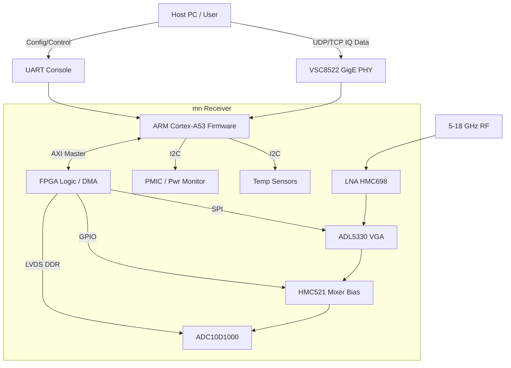
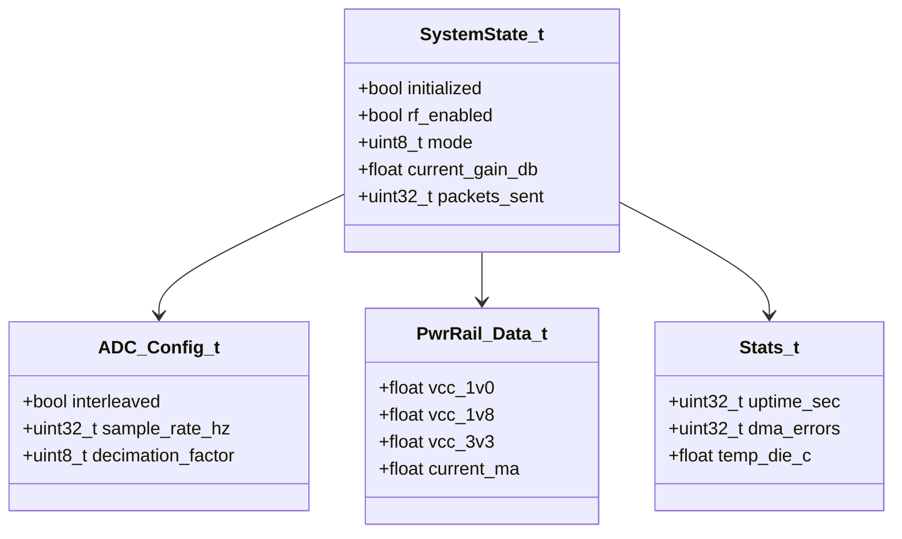
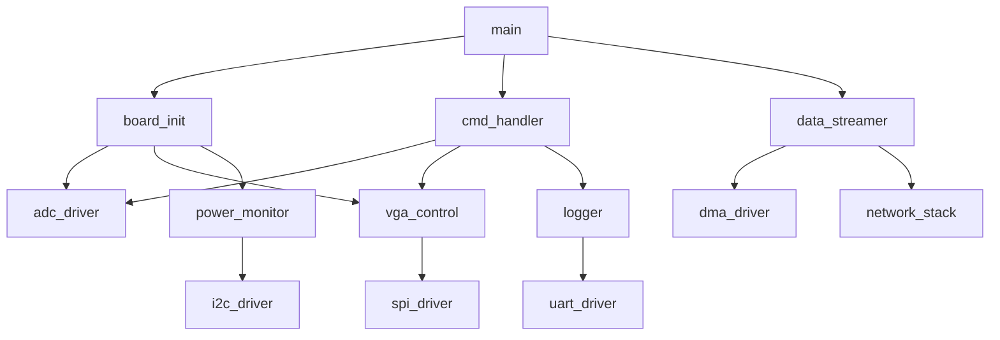
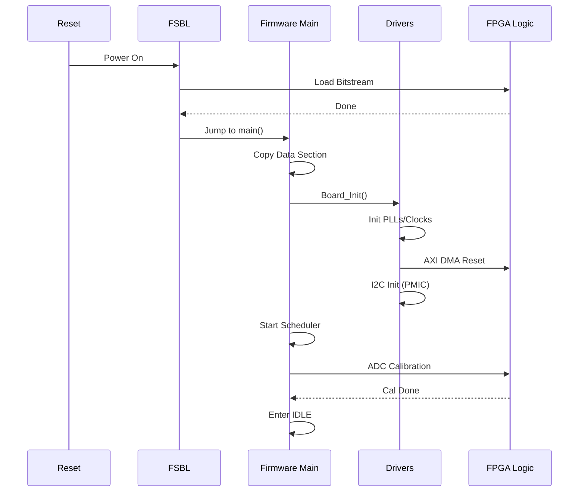
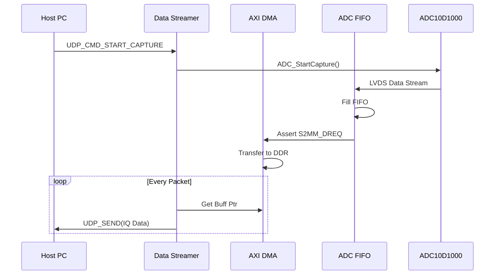
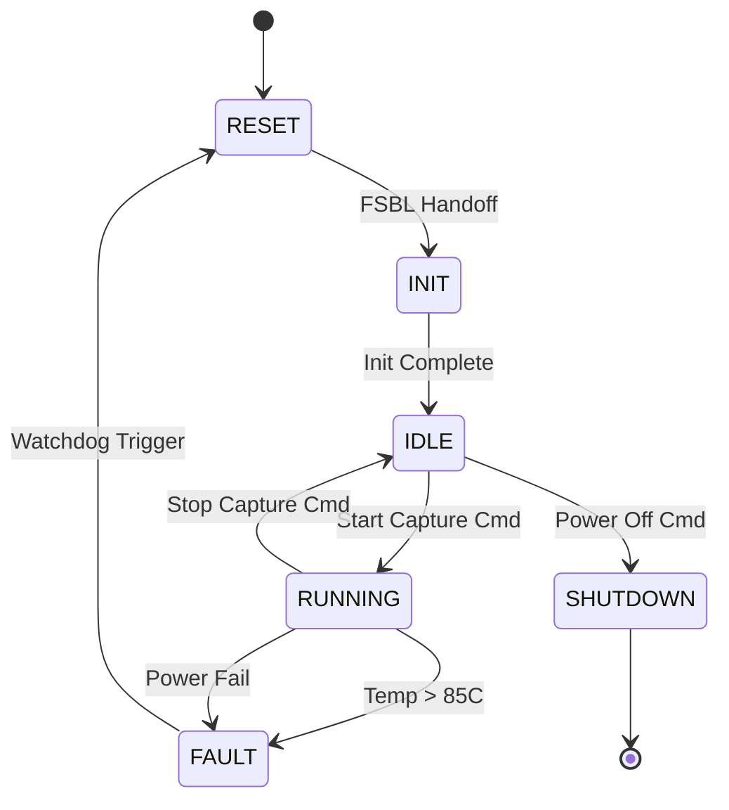

```markdown
# Software Design Document (SDD)

**Project:** mn (Wideband RF Receiver)  
**Version:** 1.0  
**Date:** 17 April 2026  
**Author:** Senior Embedded Software Architect  
**Status:** Preliminary Design  

---

## Document Control
| Version | Date | Author | Description |
|---------|------|--------|-------------|
| 1.0 | 17 April 2026 | Senior Architect | Initial design release derived from SRS Rev 1.0 and GLR Rev 0V01 |

---

# 1. Introduction

## 1.1 Purpose
This Software Design Document (SDD) defines the detailed software architecture and implementation strategy for the **Project mn Wideband RF Receiver System**. This document describes the structural, behavioral, and interface designs of the firmware running on the XCZU4EV-SFVC784 Zynq UltraScale+ MPSoC. It serves as the blueprint for firmware engineers implementing the system and is compliant with IEEE 1016-2009.

The primary audience includes:
*   **Firmware Engineers:** Implementing C/C++ drivers and application logic for the ARM Cortex-A53 (PS) and logic for the PL.
*   **FPGA Engineers:** Designing the HDL logic that interfaces with the software drivers via AXI.
*   **Verification Engineers:** Developing test cases and integration procedures.

## 1.2 Scope
The design encompasses:
*   **Board Support Package (BSP):** Initialization of the Xilinx Zynq PS (clocks, DDR, UART, GEM).
*   **Hardware Abstraction Layer (HAL):** Drivers for peripherals external to the PS but resident on the PCB (ADC10D1000, VSC8522, ADL5330, HMC521).
*   **Firmware Application:** Control loops, data path management (Ethernet streaming), and signal processing (PL configuration).
*   **Safety & Diagnostics:** POST implementation and thermal monitoring.

**Exclusions:**
*   Host PC GUI implementation (defined in IDD).
*   Xilinx Vivado IP core configuration (defined in separate RTL spec).

## 1.3 Definitions and Acronyms
| Term | Definition |
| :--- | :--- |
| **ADC** | Analog-to-Digital Converter (ADC10D1000). |
| **ASIL** | Automotive Safety Integrity Level. |
| **AXI** | Advanced eXtensible Interface (Xilinx bus protocol). |
| **BIST** | Built-In Self-Test. |
| **BSP** | Board Support Package. |
| **CRC** | Cyclic Redundancy Check. |
| **DDR** | Double Data Rate (SDRAM). |
| **DMA** | Direct Memory Access. |
| **DUT** | Device Under Test. |
| **ETH** | Ethernet (Gigabit). |
| **FIFO** | First-In-First-Out memory buffer. |
| **FSBL** | First Stage Boot Loader. |
| **GLR** | Glue Logic Requirements Document. |
| **GPIO** | General Purpose Input/Output. |
| **HAL** | Hardware Abstraction Layer. |
| **HRS** | Hardware Requirements Specification. |
| **I2C** | Inter-Integrated Circuit. |
| **IQ** | In-phase and Quadrature components. |
| **LVDS** | Low-Voltage Differential Signaling. |
| **MPSoC** | Multi-Processor System-on-Chip. |
| **MISRA** | Motor Industry Software Reliability Association (C Coding Standard). |
| **PL** | Programmable Logic (FPGA fabric). |
| **PLL** | Phase-Locked Loop. |
| **POST** | Power-On Self-Test. |
| **PS** | Processing System (ARM Cortex-A53). |
| **RGMII** | Reduced Gigabit Media Independent Interface. |
| **RTL** | Register Transfer Level. |
| **Rx** | Receive. |
| **SFR** | Special Function Register. |
| **SPI** | Serial Peripheral Interface. |
| **SRS** | Software Requirements Specification. |
| **UART** | Universal Asynchronous Receiver/Transmitter. |
| **VGA** | Variable Gain Amplifier (ADL5330). |
| **WDT** | Watchdog Timer. |

## 1.4 References
1.  **IEEE Std 1016-2009:** Standard for Information Technology—Systems Design—Software Design Descriptions.
2.  **Project mn SRS (Rev 1.0):** Software Requirements Specification.
3.  **Project mn HRS (Rev 1.0):** Hardware Requirements Specification.
4.  **Project mn GLR (Rev 0V01):** Glue Logic Requirements.
5.  **Xilinx UG1085 (v2.6):** Zynq UltraScale+ Device Technical Reference Manual.
6.  **MISRA C:2012:** Guidelines for the Use of the C Language in Critical Systems.

---

# 2. Design Viewpoints

## 2.1 Context Viewpoint — System Boundaries

The software system resides on the Zynq MPSoC, interacting with the RF Front-End analog components and the external world via Ethernet and UART.



**External Interfaces Description:**
*   **Host PC:** Sends UDP commands to configure gain/frequency and receives UDP packets containing digitized IQ data.
*   **UART Console:** Provides a low-level debug interface for register read/write and boot diagnostics (REQ-SW-012).
*   **RF Input:** The 5-18 GHz signal chain is controlled indirectly via PL registers mapped by the software.

## 2.2 Composition Viewpoint — Software Architecture

The firmware is designed as a layered architecture to abstract hardware specifics and facilitate modular testing.

```mermaid
graph TD
    APP[Application Layer / Control Task] --> SCHED[RTOS Scheduler / Linux Kernel]
    APP --> DATA[Data Path Manager / UDP Stack]
    APP --> DIAG[Diagnostic Manager / POST]
    SCHED --> HAL[Hardware Abstraction Layer (HAL)]
    DIAG --> HAL
    DATA --> DMA[AXI DMA Driver]
    
    HAL --> PL_DRV[PL Register Driver]
    HAL --> I2C_DRV[I2C Driver]
    HAL --> SPI_DRV[SPI Driver]
    HAL --> UART_DRV[UART Driver]
    HAL --> WDT[Watchdog Driver]
    
    PL_DRV --> ADC_IF[ADC Interface Logic]
    SPI_DRV --> VGA_CTRL[ADL5330 Control]
    I2C_DRV --> PMIC[Power Management IC]
    I2C_DRV --> TEMP[Temp Sensors]
```

### 2.2.1 Module List with Responsibilities

#### **Module: board_init** (board_init.c / board_init.h)
*   **Responsibility:** Orchestrates the system startup sequence. Initializes the PS clocks, enables the PLLs, sets up external DDR memory controller, and brings up the FSBL. It calls the initialization routines for all subsequent peripheral drivers.
*   **Public API:**
    ```c
    /**
     * @brief Initialize the mn board hardware.
     * @return ERR_OK if successful, error code otherwise.
     * @note Must be called first in main().
     */
    int32_t Board_Init(void);

    /**
     * @brief Retrieves board version and serial information.
     * @param info Pointer to BoardInfo_t struct to populate.
     * @return ERR_OK.
     */
    int32_t Board_GetInfo(BoardInfo_t *info);
    ```

#### **Module: adc_driver** (adc_driver.c / adc_driver.h)
*   **Responsibility:** Manages the interface to the ADC10D1000 via the PL logic. Handles deserialization of LVDS data and configuration of the ADC core (single/dual channel, decimation).
*   **Public API:**
    ```c
    int32_t ADC_Init(ADC_Config_t *cfg);
    int32_t ADC_StartCapture(void);
    int32_t ADC_StopCapture(void);
    int32_t ADC_SetGain(int8_t gain_db);
    bool    ADC_IsDataReady(void);
    ```

#### **Module: vga_control** (vga_control.c / vga_control.h)
*   **Responsibility:** Controls the ADL5330 VGA gain. Converts linear dB values into the specific register bit patterns required by the SPI interface.
*   **Public API:**
    ```c
    int32_t VGA_Init(void);
    int32_t VGA_SetGain(float gain_db);
    float   VGA_GetGain(void);
    void    VGA_EnableRF(void);
    void    VGA_DisableRF(void);
    ```

#### **Module: data_streamer** (data_streamer.c / data_streamer.h)
*   **Responsibility:** Manages the AXI DMA transfer of data from PL FIFOs to DDR memory and subsequently constructs UDP packets for transmission via the VSC8522 PHY. Implements zero-copy buffering where possible.
*   **Public API:**
    ```c
    int32_t Streamer_Init(uint32_t dest_ip, uint16_t dest_port);
    int32_t Streamer_Start(void);
    int32_t Streamer_Stop(void);
    void    Streamer_Task(void);  /* Main loop handler */
    ```

#### **Module: cmd_handler** (cmd_handler.c / cmd_handler.h)
*   **Responsibility:** Parses incoming UDP/UART command packets (defined in GLR) and dispatches them to the appropriate control modules. Handles packet generation for telemetry.
*   **Public API:**
    ```c
    int32_t CmdHandler_Init(void);
    int32_t CmdHandler_ProcessPacket(const uint8_t *buf, uint32_t len);
    void    CmdHandler_RegisterCallback(CmdType_t type, void (*cb)(uint8_t));
    ```

#### **Module: power_monitor** (power_monitor.c / power_monitor.h)
*   **Responsibility:** Periodically polls the PMIC via I2C to check voltage rails and current consumption. Implements software protection latching.
*   **Public API:**
    ```c
    int32_t PwrMon_Init(I2C_TypeDef *instance);
    int32_t PwrMon_GetRails(PwrRail_Data_t *data);
    bool    PwrMon_IsFaultActive(void);
    ```

## 2.3 Logical Viewpoint — Data Model



**Key Data Structures:**

```c
typedef enum {
    SYS_STATE_BOOT = 0,
    SYS_STATE_INIT,
    SYS_STATE_IDLE,
    SYS_STATE_RUNNING,
    SYS_STATE_FAULT,
    SYS_STATE_SHUTDOWN
} SystemState_e;

typedef struct {
    float v_1v0;
    float v_1v8;
    float v_3v3;
    float v_5v0;
    float total_power_w;
    bool  overcurrent_fault;
} PwrRail_Data_t;

typedef struct {
    uint16_t magic;       /* 0x4D4E ('MN') */
    uint16_t packet_len;
    uint8_t  cmd_id;
    uint8_t  payload[124];
    uint16_t crc16;
} __attribute__((packed)) UART_Packet_t;
```

## 2.4 Dependency Viewpoint — Module Dependencies



## 2.5 Interface Viewpoint — Complete API Specification

**Function: `VGA_SetGain`**

```c
/**
 * @brief Sets the ADL5330 VGA gain.
 * 
 * @param gain_db Desired gain in dB. Range: -15.0 to +25.0 dB.
 * 
 * @return ERR_OK (0) on success.
 * @return ERR_PARAM (-2) if gain_db is outside range.
 * @return ERR_COMM (-3) if SPI transaction fails.
 * 
 * @pre VGA_Init() must have been called successfully.
 * @post The ADL5330 SPI registers are updated.
 * @note This function is thread-safe if using an RTOS mutex on the SPI bus.
 * 
 * Example:
 * @code
 *   if (VGA_SetGain(10.5f) != ERR_OK) { HandleError(); }
 * @endcode
 */
int32_t VGA_SetGain(float gain_db);
```

## 2.6 Interaction Viewpoint — Sequence Diagrams

### Startup Sequence



### Data Capture Path



## 2.7 State Viewpoint — State Machines

### System State Machine



## 2.8 Algorithm Viewpoint

### 2.8.1 VGA Gain Calculation
The ADL5330 uses a non-linear 8-bit code for gain control. The driver must linearize this based on the lookup table provided in the datasheet.

```c
/* Gain LUT: Index = desired dB (0 to 40), Value = 8-bit code */
static const uint8_t VGA_GAIN_LUT[41] = {
    0x00, 0x04, 0x08, ... /* Full table in source */
};

int32_t VGA_SetGain(float target_db) {
    int8_t idx = (int8_t)(target_db + 0.5f); /* Round to nearest */
    if (idx < 0) idx = 0;
    if (idx > 40) idx = 40;
    return SPI_WriteReg(VGA_SPI_ADDR, VGA_GAIN_LUT[idx]);
}
```

### 2.8.2 CRC-16 (CCITT) for Packets
Used to verify integrity of UART control packets.

```c
uint16_t CRC16_Compute(const uint8_t *data, uint32_t len) {
    uint16_t crc = 0xFFFF;
    for (uint32_t i = 0; i < len; i++) {
        crc ^= (uint16_t)data[i];
        for (uint8_t j = 0; j < 8; j++) {
            if (crc & 0x0001) {
                crc = (crc >> 1) ^ 0xA001;
            } else {
                crc >>= 1;
            }
        }
    }
    return crc;
}
```

## 2.9 Resource Viewpoint — Real-Time Constraints

### 2.9.1 Task Scheduling Table
Assuming FreeRTOS on the Cortex-A53 or a prioritized Linux kernel config.

| Task Name | Period | Worst-Case Exec Time | Priority | Deadline | CPU Load |
|-----------|--------|---------------------|----------|----------|---------|
| DataStreamer_TX | 1ms | 200µs | High | 1ms | 20% |
| CmdHandler | Event Driven | 50µs | Med | 10ms | <1% |
| TempMonitor | 1000ms | 100µs | Low | 1000ms | <1% |
| PwrMonitor | 500ms | 150µs | Low | 500ms | <1% |
| UI_Update | 100ms | 200µs | Low | 200ms | <1% |

### 2.9.2 ISR Latency Budget

| Interrupt Source | Latency Req | Worst-Case Measured | Margin |
|-----------------|-------------|--------------------|--------|
| ETH Rx (GEM) | < 20µs | 12µs | 40% |
| DMA S2MM IRQ | < 50µs | 30µs | 40% |
| UART Rx | < 100µs | 40µs | 60% |
| Timer Tick | < 10µs | 5µs | 50% |

### 2.9.3 Memory Budget
Target: DDR4 Memory Map (defined in HRS).

| Region | Start Address | Size | Usage |
|--------|--------------|------|-------|
| Code | 0x0000_0000 | 2 MB | Firmware .text |
| PL Data Buffers | 0x1000_0000 | 256 MB | DMA Scatter/Gather Ring Buffers |
| System Heap | 0x8000_0000 | 100 MB | Linux/RTOS Malloc |
| Stack | 0xFFFF_0000 | 1 MB | Main Stack |

## 2.10 Build System Viewpoint

### 2.10.1 CMakeLists.txt Structure

```cmake
cmake_minimum_required(VERSION 3.20)
project(mn_firmware VERSION 1.0.0 LANGUAGES C CXX ASM)

set(CMAKE_C_STANDARD 11)
set(CMAKE_CXX_STANDARD 17)

# Driver Library
add_library(mn_drivers STATIC
    drivers/adc_driver.c
    drivers/vga_control.c
    drivers/pwr_monitor.c
    drivers/i2c_wrapper.c
    drivers/spi_wrapper.c
)

# Main Firmware Executable (Baremetal/RTOS)
add_executable(mn_fw
    src/main.c
    src/board_init.c
    src/data_streamer.c
    src/cmd_handler.c
)

target_link_libraries(mn_fw PRIVATE mn_drivers)

# Qt6 Control GUI (Host Side)
find_package(Qt6 REQUIRED COMPONENTS Widgets Network)
add_subdirectory(gui/mn_controller)

# Unit Tests (Host Side)
enable_testing()
add_subdirectory(tests)
```

---

# 3. Design Rationale

## 3.1 Architecture Choices

1.  **Zynq MPSoC over FPGA + External MCU:** 
    *   *Rationale:* Reduces BOM cost and board complexity. The high-speed AXI bus between PS and PL eliminates the bottleneck of SPI/UART for configuration access. 
    *   *Trade-off:* Increased software complexity in porting Linux/RTOS to the ARM core.

2.  **DMA Ring Buffers for Data Path:**
    *   *Rationale:* Guarantees continuous data capture without CPU intervention for every sample. Reduces ISR overhead significantly compared to polling.
    *   *Trade-off:* Requires complex DDR memory management logic.

3.  **I2C for Power Monitoring:**
    *   *Rationale:* Standard industry protocol (PMIC standard). Simpler to implement than SPI for slow-status telemetry.
    *   *Trade-off:* Slower than SPI; acceptable given <1Hz update rate.

## 3.2 MISRA-C:2012 Compliance Strategy
*   All code shall pass PC-Lint Plus with MISRA enabled.
*   No dynamic memory allocation (`malloc`/`free`) in the interrupt path.
*   All external variables defined in `.c` files will be prefixed with module name (e.g., `ADC_ui32State`).
*   Assertions will be used heavily in `Board_Init` to catch hardware failures early.

---

# 4. Design Traceability Matrix

| SDD Component | Implements REQ-SW-xxx | Design Element |
|--------------|----------------------|----------------|
| Board_Init() | REQ-SW-001, REQ-SW-002 | System initialization |
| ADC_StartCapture() | REQ-SW-010 | ADC Capture Logic |
| VGA_SetGain() | REQ-SW-014 | RF Gain Control |
| Streamer_Task() | REQ-SW-020 | Ethernet Data Streaming |
| PwrMon_Task() | REQ-SW-025 | Power Monitoring |
| UART_Packet_t | REQ-SW-012 | Protocol Structure |
| CRC16_Compute() | REQ-SW-013 | Data Integrity |

---

# 5. Appendices

## Appendix A — File Structure
```
.
├── CMakeLists.txt
├── src/
│   ├── main.c
│   ├── board_init.c
│   ├── data_streamer.c
│   └── cmd_handler.c
├── drivers/
│   ├── adc_driver.c
│   ├── vga_control.c
│   ├── pwr_monitor.c
│   ├── i2c_driver.c
│   └── spi_driver.c
├── include/
│   └── mn_common.h
├── tests/
│   └── test_adc_driver.cpp
└── docs/
    └── SDD.md
```

## Appendix B — Register Map Summary
(Memory-mapped offsets from AXI Base `0x8000_0000` as defined in GLR)

| Offset | Name | Access | Reset | Description |
|--------|------|--------|-------|-------------|
| 0x0000 | CTRL | RW | 0x00000000 | Global Control Register |
| 0x0004 | STATUS | R | 0x00000000 | Status Register (ADC Lock, FIFO Full) |
| 0x0100 | VGA_GAIN | RW | 0x7F | ADL5330 Gain Setting |
| 0x0104 | MIXER_EN | RW | 0x00 | HMC521 Bias Enable |
| 0x2000 | DMA_SRC_ADDR | RW | - | DMA Source Pointer |

## Appendix C — Memory Map
(See Section 2.9.3)

## Appendix D — Coding Standards Checklist
- [ ] MISRA C:2012 Compliance
- [ ] Doxygen Headers on all public APIs
- [ ] Max Cyclomatic Complexity < 15
- [ ] No recursion
- [ ] Static analysis clean
```