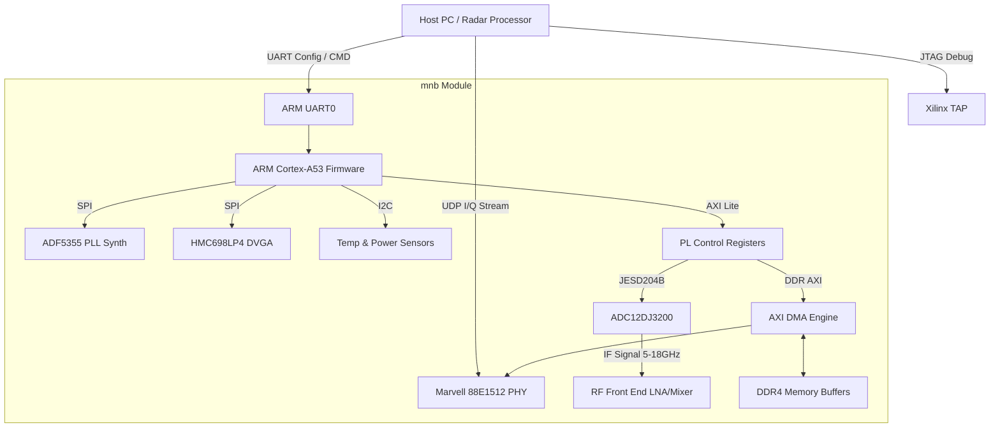
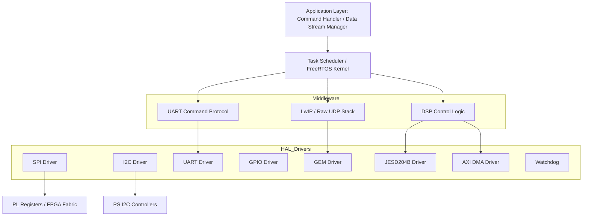
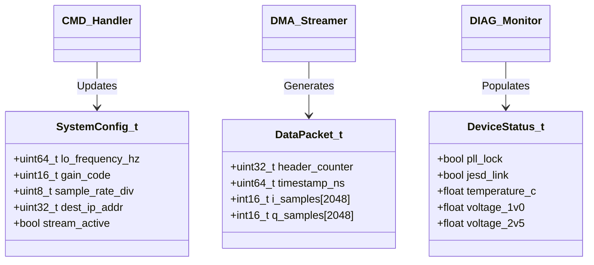
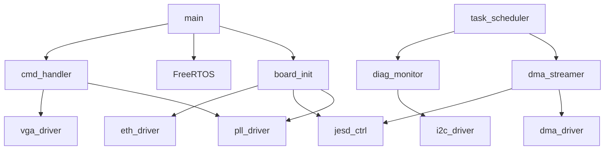
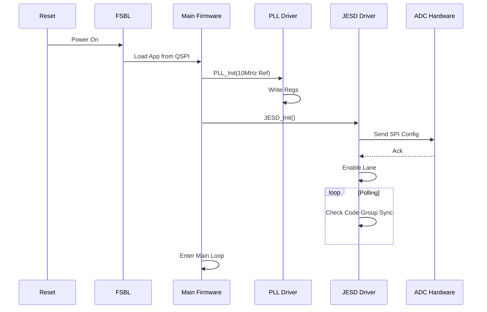
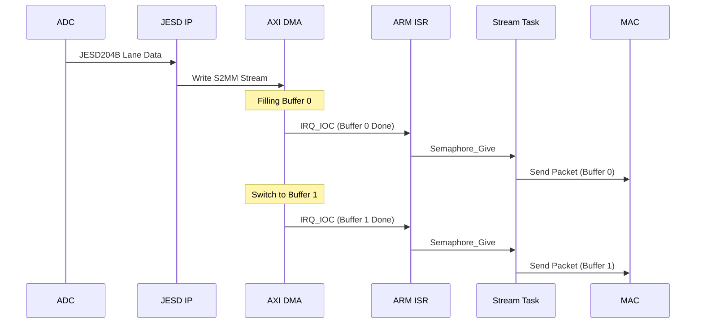
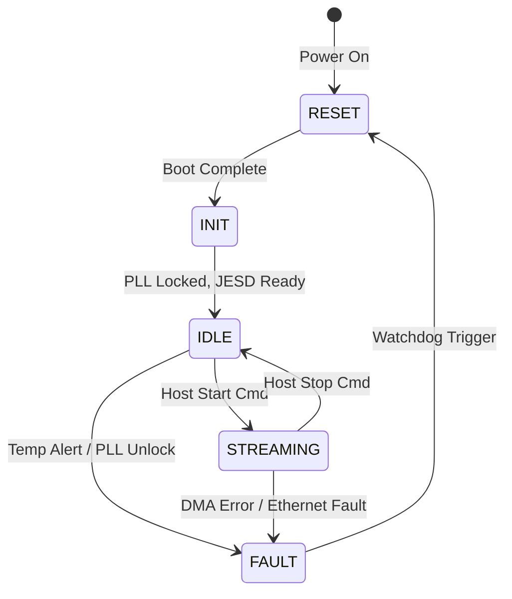
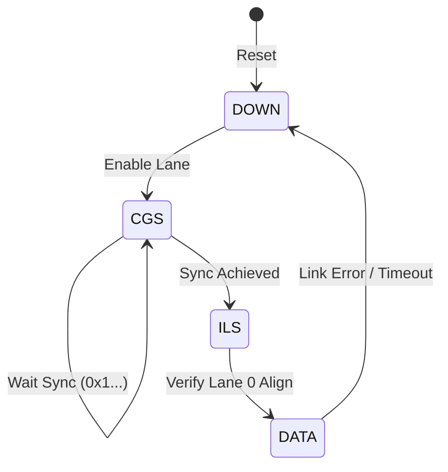

# Software Design Document (SDD)

**Project ID:** mnb  
**Title:** Software Design Description for Wideband RF Receiver Firmware  
**Version:** 1.0  
**Date:** 17 April 2026  

---

## Document Control
| Version | Date | Author | Description |
|---------|------|--------|-------------|
| 1.0 | 17 April 2026 | Lead Firmware Architect | Initial design release compliant with IEEE 1016-2009. |

---

# 1. Introduction

## 1.1 Purpose
This Software Design Document (SDD) provides the comprehensive architectural and detailed design for the **mnb Wideband RF Receiver** firmware. It describes the software structure, interfaces, data structures, and algorithms necessary to control the RF signal chain, manage the Xilinx Zynq UltraScale+ MPSoC (XCZU4EG), and implement the JESD204B data path.

This document serves as the blueprint for firmware engineers implementing the C/C++ code and RTL logic, and for verification engineers developing test harnesses.

## 1.2 Scope
The design covers the software running on the **ARM Cortex-A53** Processing System (PS) and the logic instantiated in the **Programmable Logic (PL)**.

**In Scope:**
- **BSP & HAL:** Board initialization, clock tree setup, and peripheral drivers (SPI, I2C, UART, GPIO).
- **RF Control:** Drivers for ADF5355 PLL, HMC698LP4 VGA, and HMC1061 Mixer control.
- **Data Acquisition:** Configuration of ADC12DJ3200 via JESD204B and management of the AXI DMA stream.
- **Communication:** UART Command Protocol (Debug/Control) and Gigabit Ethernet UDP Streaming.
- **Diagnostics:** BIST, Power Monitoring, and Thermal Management.

**Out of Scope:**
- Host PC GUI application code.
- Detailed RTL design of the DSP blocks (assumed IP cores or separate RTL spec).

## 1.3 Definitions and Acronyms
| Term | Definition |
| :--- | :--- |
| **ADC** | Analog-to-Digital Converter (TI ADC12DJ3200). |
| **AGC** | Automatic Gain Control. |
| **API** | Application Programming Interface. |
| **AXI** | Advanced eXtensible Interface (Xilinx bus standard). |
| **BIST** | Built-In Self-Test. |
| **BSP** | Board Support Package. |
| **CPLD** | Complex Programmable Logic Device. |
| **CSR** | Control and Status Register. |
| **DAC** | Digital-to-Analog Converter. |
| **DDR** | Double Data Rate SDRAM. |
| **DMA** | Direct Memory Access. |
| **DSP** | Digital Signal Processing. |
| **DVGA** | Digital Variable Gain Amplifier. |
| **EEPROM** | Electrically Erasable Programmable Read-Only Memory. |
| **ETH** | Ethernet (Gigabit). |
| **FIFO** | First-In-First-Out buffer. |
| **FPGA** | Field-Programmable Gate Array. |
| **FSBL** | First Stage Boot Loader. |
| **GTP** | Gigabit Transceiver (Xilinx). |
| **HAL** | Hardware Abstraction Layer. |
| **HRS** | Hardware Requirements Specification. |
| **I2C** | Inter-Integrated Circuit (Serial Bus). |
| **IRQ** | Interrupt Request. |
| **ISR** | Interrupt Service Routine. |
| **JESD** | JESD204B High-Speed Data Converter Interface. |
| **LNA** | Low Noise Amplifier. |
| **LO** | Local Oscillator. |
| **LVDS** | Low-Voltage Differential Signaling. |
| **MAC** | Media Access Control. |
| **MIPI** | Mobile Industry Processor Interface. |
| **MISRA** | Motor Industry Software Reliability Association. |
| **MMCM** | Mixed-Mode Clock Manager. |
| **NVM** | Non-Volatile Memory. |
| **PCB** | Printed Circuit Board. |
| **PHY** | Physical Layer Transceiver. |
| **PLL** | Phase-Locked Loop. |
| **POR** | Power-On Reset. |
| **PS** | Processing System (ARM cores in Zynq). |
| **QSPI** | Quad Serial Peripheral Interface. |
| **RAM** | Random Access Memory. |
| **RF** | Radio Frequency. |
| **ROM** | Read-Only Memory. |
| **RTL** | Register Transfer Logic. |
| **Rx** | Receive. |
| **SPI** | Serial Peripheral Interface. |
| **SRAM** | Static Random Access Memory. |
| **SRS** | Software Requirements Specification. |
| **TCP/IP** | Transmission Control Protocol/Internet Protocol. |
| **TRP** | Transmit/Receive Pulse (RF Enable). |
| **UART** | Universal Asynchronous Receiver/Transmitter. |
| **UDP** | User Datagram Protocol. |
| **VCO** | Voltage-Controlled Oscillator. |
| **WDT** | Watchdog Timer. |

## 1.4 References
1.  **IEEE 1016-2009:** Standard for Information Technology — Systems design — Software design descriptions.
2.  **SRS-mnb-1.0 (17 Apr 2026):** Software Requirements Specification.
3.  **HRS-mnb-1.0 (27 Oct 2023):** Hardware Requirements Specification.
4.  **GLR-mnb-0V01 (17 Apr 2026):** Glue Logic Requirements (FPGA).
5.  **MISRA-C:2012:** Guidelines for the use of the C language in critical systems.
6.  **Xilinx UG1087 (v2.4):** Zynq UltraScale+ MPSoC Register Reference.
7.  **Xilinx UG1085 (v2.6):** Zynq UltraScale+ Device Technical Reference Manual.
8.  **TI ADC12DJ3200 datasheet (SBAS657D).**
9.  **Analog Devices ADF5355 datasheet.**

---

# 2. Design Viewpoints

## 2.1 Context Viewpoint — System Boundaries

The mnb firmware operates as the bridge between the Host PC (Control/Data Sink) and the RF Hardware.



### External Interfaces
1.  **Host PC:** Sends configuration commands (Frequency, Gain) via UART and receives digitized I/Q data via UDP.
2.  **RF Front End:** Receives RF energy (5–18 GHz).
3.  **JTAG:** Xilinx debug interface for FSBL and low-level debugging.

## 2.2 Composition Viewpoint — Software Architecture

The software follows a layered architecture: Hardware Abstraction Layer (HAL), Middleware (Communication, Signal Processing), and Application Layer.



### Module List with Responsibilities

**Module: board_init** (board_init.c / board_init.h)
```c
// Responsibilities: PS startup, clock tree init, MIO configuration, DDR init
int32_t Board_Init(void);
int32_t Board_GetInfo(BoardInfo_t *info);
int32_t Board_SelfTest(uint32_t *test_mask);

typedef struct {
    uint16_t board_id;
    uint8_t  hw_revision;
    uint32_t serial_num;
    char     part_number[16];
} BoardInfo_t;
```

**Module: pll_driver** (pll_driver.c / pll_driver.h)
```c
// Responsibilities: ADF5355 SPI config, Frequency tuning, Lock detection
int32_t PLL_Init(const PLL_Config_t *cfg);
int32_t PLL_SetFrequency(uint64_t freq_hz);
int32_t PLL_WaitLock(uint32_t timeout_ms);
bool    PLL_IsLocked(void);
int32_t PLL_Reset(void);

typedef struct {
    uint64_t ref_clk_hz;
    uint64_t target_freq_hz;
    uint8_t  rf_div;
    uint16_t int_mod;
    uint16_t frac_mod;
} PLL_Config_t;
```

**Module: jesd_ctrl** (jesd_ctrl.c / jesd_ctrl.h)
```c
// Responsibilities: Configure ADC12DJ3200, JESD204B IP core Lane/Subclass
int32_t JESD_Init(void);
int32_t JESD_EnableRX(void);
int32_t JESD_DisableRX(void);
int32_t JESD_GetLinkStatus(JESD_Status_t *status);
bool    JESD_IsAligned(void);

typedef struct {
    bool link_ready;
    bool cgs_done;   // Code Group Sync
    bool ils_done;   // Initial Lane Sync
    uint8_t errors;
} JESD_Status_t;
```

**Module: dma_streamer** (dma_streamer.c / dma_streamer.h)
```c
// Responsibilities: Setup AXI DMA Scatter Gather, manage DDR buffers
int32_t DMA_Init(void);
int32_t DMA_StartTransfer(void);
int32_t DMA_StopTransfer(void);
int32_t DMA_RegisterCallback(DMA_Callback_t cb);
void    DMA_ISR_Handler(void); // Called from ISR

typedef void (*DMA_Callback_t)(uint32_t buf_addr, uint32_t len);
```

**Module: eth_stream** (eth_stream.c / eth_stream.h)
```c
// Responsibilities: Socket creation, UDP packetizing, LwIP integration
int32_t ETH_StreamInit(uint32_t dest_ip, uint16_t dest_port);
int32_t ETH_Start(void);
int32_t ETH_Stop(void);
int32_t ETH_SendPacket(const uint8_t *data, uint32_t len);
// Note: Direct buffer passing from DMA to MAC preferred for zero-copy
```

**Module: cmd_handler** (cmd_handler.c / cmd_handler.h)
```c
// Responsibilities: Parse UART frames, Execute Read/Write, dispatch to drivers
int32_t CMD_Init(void);
void    CMD_ProcessTask(void); // Main loop task
int32_t CMD_Execute(uint8_t *cmd_buf, uint32_t len);

// Protocol structure
typedef struct __attribute__((packed)) {
    uint8_t  start_byte;
    uint8_t  cmd_id;
    uint16_t addr;
    uint16_t data;
    uint8_t  checksum;
} CMD_Frame_t;
```

**Module: diag_monitor** (diag_monitor.c / diag_monitor.h)
```c
// Responsibilities: Temp polling, Voltage Rail monitoring, Safety interlock
int32_t DIAG_Init(void);
void    DIAG_MonitorTask(void);
bool    DIAG_IsOverTemp(void);
bool    DIAG_IsPowerGood(void);
```

## 2.3 Logical Viewpoint — Data Model



### Key Data Structures

```c
// Global System State
typedef struct {
    SystemState_e state;          // INIT, RUNNING, FAULT
    SystemConfig_t config;
    DeviceStatus_t status;
    uint32_t uptime_sec;
} SystemContext_t;

extern SystemContext_t g_sys_ctx;

// DSP/IQ Data Packet Header (Network Order)
typedef struct __attribute__((packed)) {
    uint32_t magic;           // 0xA5A5A5A5
    uint32_t seq_num;
    uint64_t timestamp;
    uint16_t len;             // Payload length in bytes
    uint8_t  flags;
} PacketHeader_t;
```

## 2.4 Dependency Viewpoint



**Build Order:**
1.  **Drivers:** SPI, I2C, UART, GPIO (HW independent).
2.  **HAL:** board_init (aggregates drivers).
3.  **Services:** LwIP, FreeRTOS.
4.  **Application:** Control logic, Streaming tasks.

## 2.5 Interface Viewpoint — Complete API Specification

For brevity in this summary, critical functions are specified here.

**Function: PLL_SetFrequency**
```c
/**
 * @brief Configures the ADF5355 to target frequency.
 * 
 * @param freq_hz Target frequency (5,000,000,000 to 18,000,000,000).
 * @return ERR_OK on success.
 * @return ERR_PARAM if frequency is out of range.
 * @return ERR_TIMEOUT if PLL fails to lock.
 *
 * @pre PLL_Init() must have been called.
 * @post The PLL registers are updated and lock is verified.
 *
 * Usage: PLL_SetFrequency(6000000000); // 6 GHz
 */
int32_t PLL_SetFrequency(uint64_t freq_hz);
```

**Function: DMA_RegisterCallback**
```c
/**
 * @brief Registers a callback for when a DMA buffer is full.
 * 
 * @param cb Function pointer to void (*cb)(uint32_t addr, uint32_t len).
 * @return ERR_OK.
 *
 * @note This function is called from interrupt context (ISR). 
 *       Must be short and non-blocking.
 */
int32_t DMA_RegisterCallback(DMA_Callback_t cb);
```

## 2.6 Interaction Viewpoint — Sequence Diagrams

### System Initialization Sequence


### Ethernet Streaming Sequence


## 2.7 State Viewpoint

### System State Machine


### JESD204B Link State Machine


## 2.8 Algorithm Viewpoint

### 2.8.1 Integer PLL Frequency Calculation
The ADF5355 requires calculation of the INT, FRAC, and MOD registers.
*Constraint:* Must use 64-bit arithmetic to avoid precision loss at 18 GHz.

```c
// PFD Frequency (VCO) / 50 for AD5355
// Simplified logic structure
int32_t PLL_CalcRegs(uint64_t f_out, PLL_Regs_t *regs) {
    const uint32_t pfd_freq = 25000000; // 25 MHz PFD
    uint64_t vco_freq = f_out * RF_DIV_OUT; // Depending on band
    
    // N Divider = VCO / PFD
    uint32_t N_int = (uint32_t)(vco_freq / pfd_freq);
    uint32_t remainder = (uint32_t)(vco_freq % pfd_freq);
    
    // Fractional part
    // ... (Detailed fractional math per datasheet)
    
    return ERR_OK;
}
```

### 2.8.2 JESD204B Lane Alignment Check
```c
// Verify 0x1A pattern alignment in JESD IP Status register
bool JESD_CheckAlign(void) {
    uint32_t status = Xil_In32(JESD_REG_STATUS);
    // Check bits for Code Group Sync and Initial Lane Sync
    return ((status & JESD_MASK_SYNC) == JESD_MASK_SYNC) ? true : false;
}
```

---

## 2.9 Resource Viewpoint — Real-Time Constraints

### 2.9.1 Task Scheduling Table (FreeRTOS)
| Task Name | Frequency | Priority | Worst-Case Exec Time | Stack (Words) |
|-----------|-----------|----------|----------------------|---------------|
| CmdTask | 100 Hz | High | < 1 ms | 512 |
| StreamTask | Event Driven | Medium | < 2 ms (Setup) | 1024 |
| MonitorTask | 10 Hz | Low | < 0.5 ms | 256 |
| EthTxTask | Event Driven | High | < 1 ms | 1024 |

### 2.9.2 ISR Latency Budget
| Source | Min Latency | Max Latency | Action |
|--------|-------------|-------------|--------|
| UART RX | 0 | 100 us | Copy byte to ring buffer |
| DMA S2MM (JESD) | 0 | 5 us | Clear IRQ, Set Semaphore |
| Timer Tick | 1 ms | 1 ms | OS Context Switch |

### 2.9.3 Memory Budget (DDR4)
| Region | Start | Size | Usage |
|--------|-------|------|-------|
| Code | 0x0000_0000 | 2 MB | Firmware Text/RO |
| Heap | 0x0002_0000 | 1 MB | LwIP/RTOS |
| Buffers | 0x0100_0000 | 16 MB | 2x UDP Ping-Pong Buffers (8MB each) |
| Reserved | 0x0200_0000 | 32 MB | Future Expansion / PL Shared |

---

## 2.10 Build System Viewpoint

### 2.10.1 CMakeLists.txt Structure
```cmake
cmake_minimum_required(VERSION 3.20)
project(mnb_firmware C CXX ASM)

set(CMAKE_SYSTEM_NAME Generic)
set(CMAKE_C_COMPILER arm-none-eabi-gcc)
set(CMAKE_CXX_COMPILER arm-none-eabi-g++)

# 1. Hardware Definitions
include_directories(hw/inc)

# 2. Sources
file(GLOB_RECURSE SOURCES "src/*.c")

# 3. BSP (Xilinx Generated)
add_subdirectory(zynqmp_fsbl)

# 4. Main Executable
add_executable(mnb_firmware.elf ${SOURCES})
target_link_libraries(mnb_firmware.elf 
    Xil 
    xilsecure 
    xilpm 
    xilstandalone 
    lwip
    freertos
)

# 5. Memory Map (Linker Script)
target_link_options(mnb_firmware.elf PRIVATE -T lscript.ld)

# 6. Post-Build (Generate .bin)
add_custom_command(TARGET mnb_firmware.elf POST_BUILD
    COMMAND arm-none-eabi-objcopy -O binary mnb_firmware.elf mnb_firmware.bin
)
```

### 2.10.2 Unit Test Integration (CTest)
Tests for the calculation logic (PLL, Gain Maps) run on Host PC.
```cmake
enable_testing()
add_subdirectory(tests)
# tests/CMakeLists.txt
add_executable(test_pll_calc test_pll_calc.c)
target_link_libraries(test_pll_calc PRIVATE Unity)
add_test(NAME PLL_Calc_Test COMMAND test_pll_calc)
```

---

# 3. Design Rationale

## 3.1 Architecture Choices

1.  **RTOS (FreeRTOS) vs Bare Metal:**
    *   **Decision:** Use FreeRTOS.
    *   **Rationale:** The system requires concurrent priority management (Control Command vs High-Speed Streaming). FreeRTOS provides成熟的 Semaphores and Queues for the DMA -> Ethernet flow without the overhead of Linux.

2.  **JESD204B Implementation:**
    *   **Decision:** Use Xilinx IP Core (JESD204 PHY & Transport).
    *   **Rationale:** Gateware complexity is high. IP ensures compliance with the ADC12DJ3200 subclass 1 requirements.

3.  **UDP Streaming vs TCP:**
    *   **Decision:** UDP.
    *   **Rationale:** TCP retransmission is unacceptable for real-time RF streaming (latency). UDP allows the application to manage packet loss (e.g., by updating sequence numbers).

## 3.2 MISRA-C Compliance Strategy

*   **Static Analysis:** PC-lint Plus configured with MISRA-C 2012 rules.
*   **Coding Standard:** All functions defined in `.h` files. Static functions defined at top of `.c` files.
*   **Memory:** No heap usage in the Data Path (stack only). No dynamic allocation after init.
*   **Interrupts:** Keep ISRs short. Defer processing to Tasks via semaphores.

---

# 4. Design Traceability Matrix

| SDD Component | Implements REQ-SW-xxx | Design Element |
|---------------|-----------------------|----------------|
| board_init.c | REQ-SW-001, REQ-SW-002 | System Power Up |
| pll_driver.c | REQ-SW-010 | ADF5355 Config |
| jesd_ctrl.c | REQ-SW-020, REQ-SW-021 | ADC Interface |
| dma_streamer.c | REQ-SW-030 | Data Acquisition |
| eth_stream.c | REQ-SW-040, REQ-SW-041 | UDP Output |
| cmd_handler.c | REQ-SW-050 | UART Parsing |
| diag_monitor.c | REQ-SW-060 | Temp Monitoring |
| wdt_drv.c | REQ-SW-070 | Watchdog |
| srs.c | REQ-SW-080 | Safety Shutdown |

---

# 5. Appendices

## Appendix A — FPGA Register Map (GLR Derived)
Base Address: 0x8000_0000 (PL AXI Light)

| Offset | Name | RW | Reset | Description |
|--------|------|-----|-------|-------------|
| 0x0000 | CTRL_RESET | RW | 0x01 | 1=Core in Reset |
| 0x0004 | CTRL_ENABLE | RW | 0x00 | 1=Streaming Enabled |
| 0x0010 | STATUS | RO | 0x00 | Bit 0: IRQ, Bit 1: FIFO Full |
| 0x0100 | PLL_SPI_TX | WO | 0x00 | SPI Data to PLL |
| 0x0104 | PLL_SPI_RX | RO | 0x00 | SPI Data from PLL |
| 0x0200 | JESD_CTRL | RW | 0x00 | JESD IP Control |
| 0x0204 | JESD_STATUS | RO | 0x00 | Link Status Flags |

## Appendix B — File Structure
```
src/
├── main.c
├── board/
│   ├── board_init.c
│   └── board_config.h
├── drivers/
│   ├── uart/
│   ├── spi/
│   ├── i2c/
│   └── gpio/
├── rf/
│   ├── pll_driver.c
│   └── vga_driver.c
├── signal_chain/
│   ├── jesd_ctrl.c
│   └── dma_streamer.c
├── comms/
│   ├── cmd_handler.c
│   └── eth_stream.c
└── utils/
    ├── crc32.c
    └── ring_buffer.c
```

## Appendix C — Memory Map (Zynq MPSoC)
*   **DDR:** 0x0000_0000 - 0x3FFF_FFFF (1GB)
*   **QSPI:** 0xC000_0000 (Boot Memory)
*   **PL:** 0x8000_0000 - 0x8FFF_FFFF (AXI Light)
*   **UART:** 0xFF00_0000 (PS MIO Pins)

## Appendix D — Coding Standards Checklist
*   [ ] All `extern` declarations in header files.
*   [ ] No `magic numbers` (use `#define` or `enum`).
*   [ ] Doxygen headers for all public APIs.
*   [ ] All code linted (PC-lint).
*   [ ] No recursion (MISRA required).
*   [ ] Explicit casting for all type conversions.