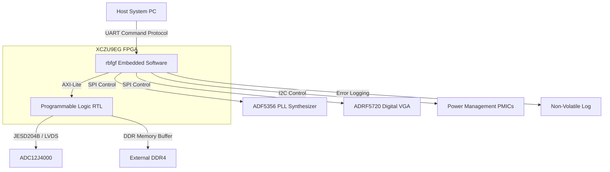
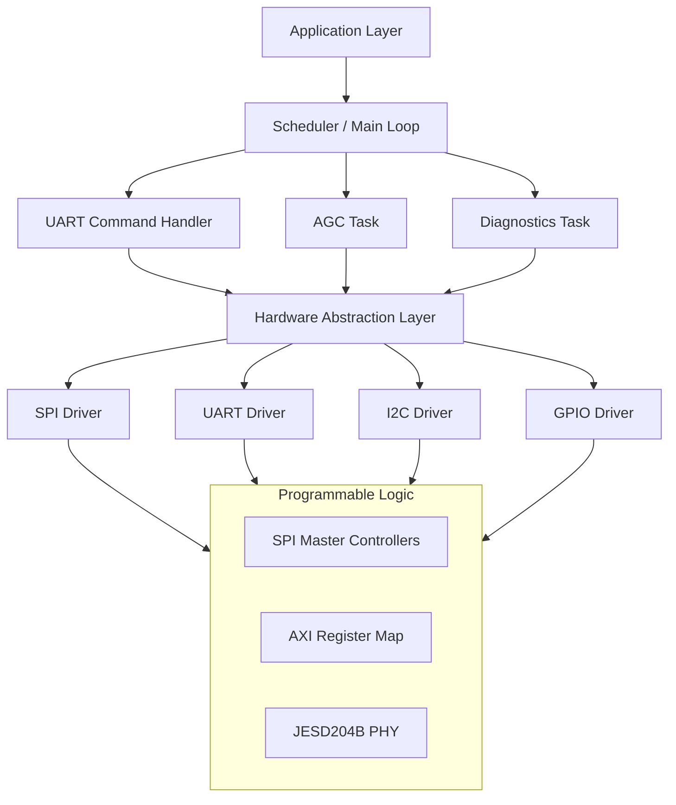
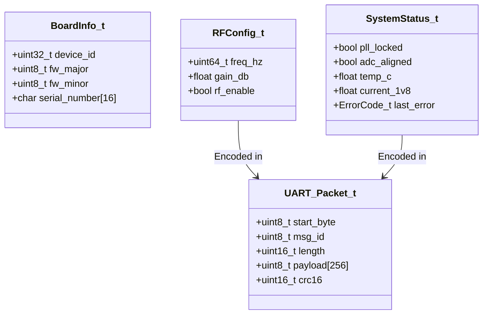
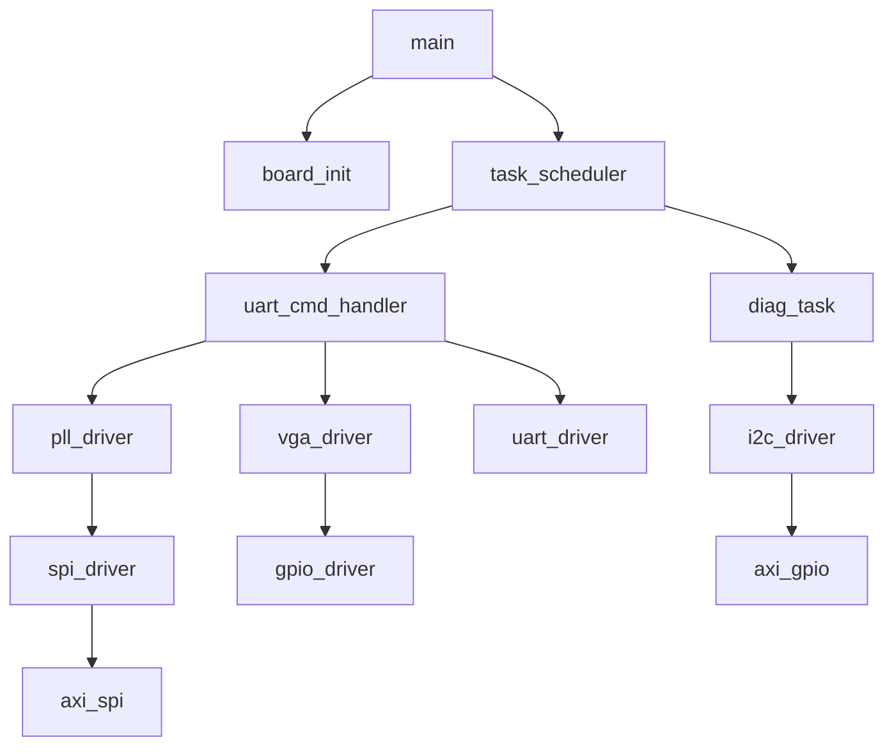
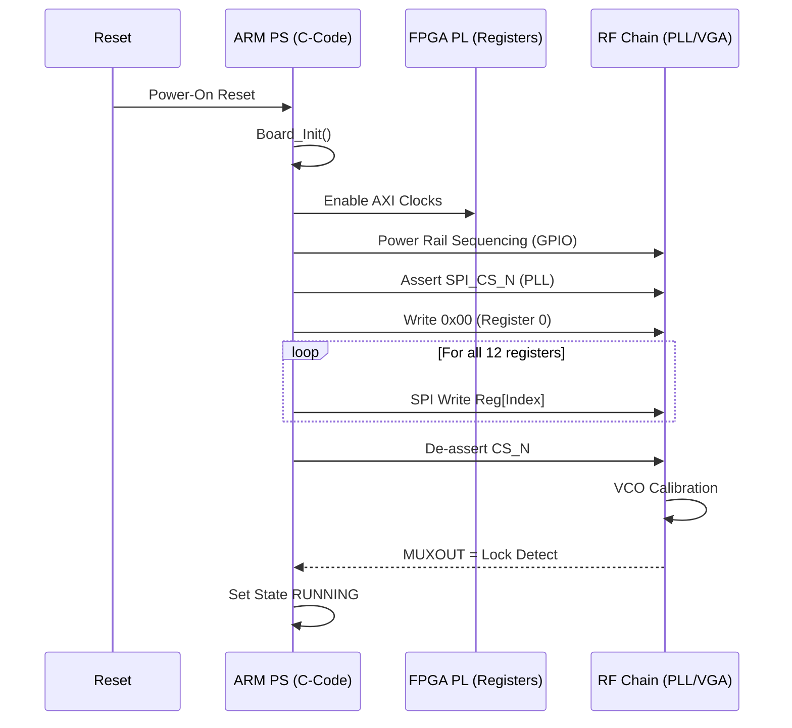
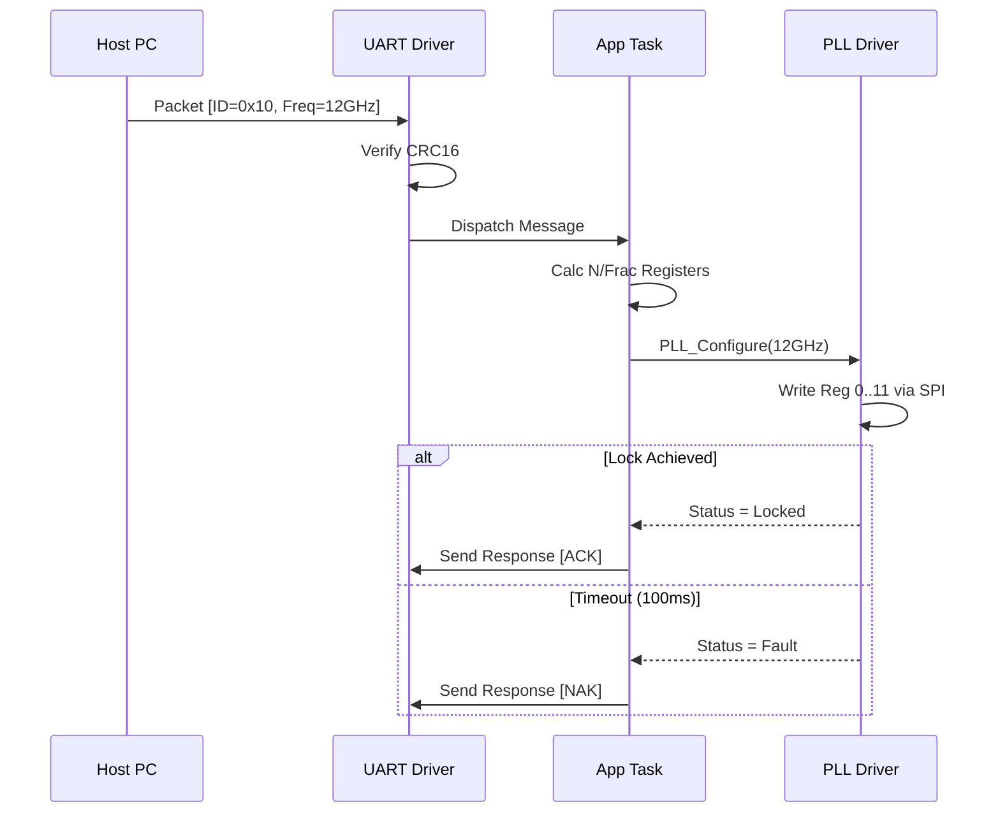
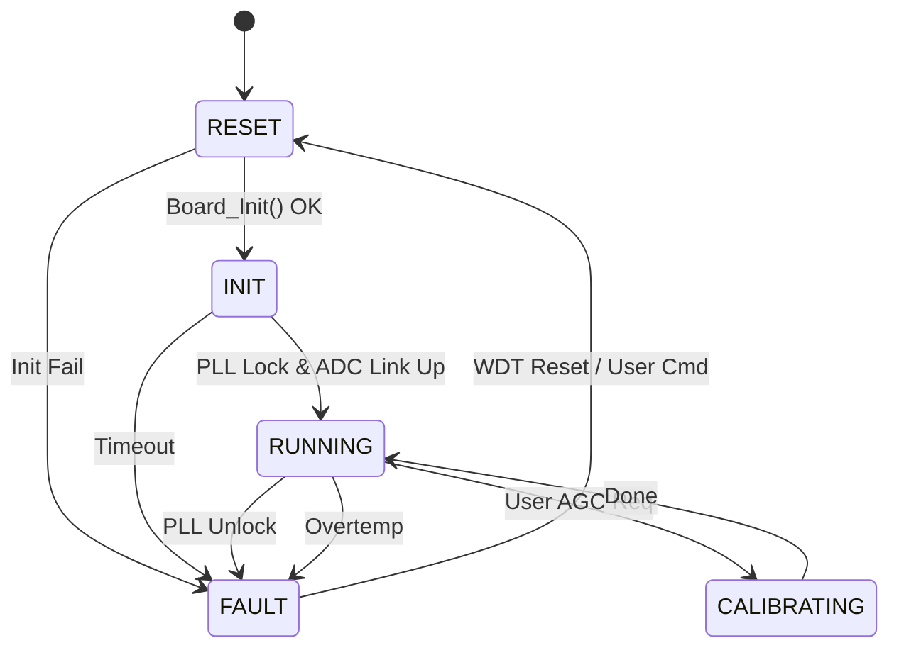
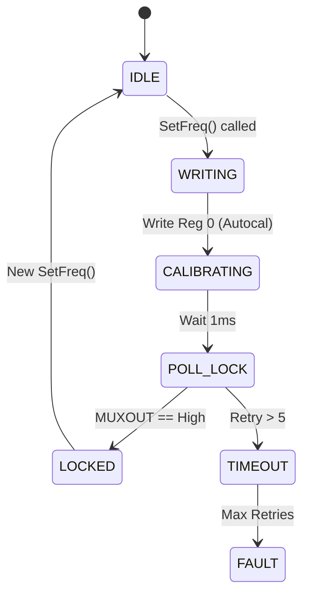

# Software Design Document (SDD)

## Document Control
| Version | Date | Author | Description |
|---------|------|--------|-------------|
| 1.0 | 16 April 2026 | Lead Firmware Architect | Initial design release for rbfgf FPGA/Embedded Software |

---

# 1. Introduction

## 1.1 Purpose
This Software Design Document (SDD) provides the comprehensive structural and behavioral design for the **rbfgf** Wideband RF Receiver firmware. This document details the software architecture running on the Xilinx Zynq UltraScale+ XCZU9EG Processing System (PS) and the associated RTL logic within the Programmable Logic (PL). It is intended to be the single source of truth for firmware engineers implementing the C-code, hardware engineers designing the RTL, and verification engineers developing test benches. The design bridges the gap between the **Software Requirements Specification (SRS)** and the **Glue Logic Requirements (GLR)**, ensuring all requirements (REQ-SW-xxx) are allocated to specific software components.

## 1.2 Scope
The design encompasses the following software domains:
1.  **Embedded C Firmware:** Bare-metal/MISRA-compliant C code running on the ARM Cortex-R5 processors within the XCZU9EG PS.
2.  **Hardware Abstraction Layer (HAL):** Register-level drivers for AXI-Lite peripherals, SPI controllers, and UART interfaces.
3.  **Control Logic:** State machines for Power Sequencing, PLL Locking (ADF5356), and AGC loops.
4.  **High-Speed Interface:** Configuration logic for the JESD204B link to the ADC12J4000.

**Exclusions:** Signal processing algorithms (DSP) for demodulation are handled by downstream assets. PC-side GUI design is excluded.

## 1.3 Definitions and Acronyms
| Term | Definition |
| :--- | :--- |
| **AGC** | Automatic Gain Control |
| **BRAM** | Block RAM (FPGA primitive) |
| **CDC** | Clock Domain Crossing |
| **FSM** | Finite State Machine |
| **GPIO** | General Purpose Input/Output |
| **HAL** | Hardware Abstraction Layer |
| **HRS** | Hardware Requirements Specification |
| **I2C** | Inter-Integrated Circuit |
| **ISR** | Interrupt Service Routine |
| **JTAG** | Joint Test Action Group (Debug Interface) |
| **LVDS** | Low-Voltage Differential Signaling |
| **MISRA** | Motor Industry Software Reliability Association (C Coding Guidelines) |
| **NV** | Non-Volatile |
| **PL** | Programmable Logic (FPGA Fabric) |
| **PLL** | Phase-Locked Loop |
| **POR** | Power-On Reset |
| **PS** | Processing System (ARM Core) |
| **RF** | Radio Frequency |
| **RTL** | Register Transfer Level |
| **SRS** | Software Requirements Specification |
| **UART** | Universal Asynchronous Receiver-Transmitter |
| **VGA** | Variable Gain Amplifier |
| **WDT** | Watchdog Timer |

## 1.4 References
| ID | Title | Version |
| :--- | :--- | :--- |
| R1 | rbfgf Software Requirements Specification (SRS) | 1.0 |
| R2 | rbfgf Glue Logic Requirements (GLR) | 0V01 |
| R3 | rbfgf Hardware Requirements Specification (HRS) | 1.0 |
| R4 | IEEE 1016-2009 | Standard for Information Technology |
| R5 | MISRA C:2012 | Guidelines for the Use of the C Language |
| R6 | ADF5356 Datasheet | Analog Devices |
| R7 | ADC12J4000 Datasheet | Texas Instruments |

---

# 2. Design Viewpoints

## 2.1 Context Viewpoint — System Boundaries

The rbfgf software operates within the XCZU9EG FPGA, acting as the control plane for the RF chain and the data manager for the ADC.



**External Interfaces:**
*   **Host PC:** Sends configuration packets (Frequency, Gain) via UART. Receives status telemetry (Health, Lock Detect).
*   **RF Front-End:** Controlled via SPI (PLL/VGA). Provides MUXOUT/Lock Detect signals via GPIO.
*   **Power Management:** Monitored via I2C (PMIC telemetry).
*   **ADC:** High-speed data interface managed by PL logic, initialized by PS software.

## 2.2 Composition Viewpoint — Software Architecture

The software architecture follows a layered approach, separating the Application Logic from the Hardware Abstraction and the RTL.



### Module List with Responsibilities:

**Module: board_init** (board_init.c / board_init.h)
*   **Responsibility:** System startup, MPU configuration, clock setup, and initialization of all buses.
*   **API:**
    ```c
    int32_t Board_Init(void);
    int32_t Board_GetInfo(BoardInfo_t *info);
    ```
*   **State Variables:** `SystemState_t sys_state;`

**Module: uart_driver** (uart_driver.c / uart_driver.h)
*   **Responsibility:** Byte-level framing, checksum validation, interrupt-driven TX/RX.
*   **API:**
    ```c
    int32_t UART_Init(uint32_t baud_rate);
    int32_t UART_Transmit(const uint8_t *data, uint16_t len);
    int32_t UART_RegisterCallback(UART_Event_t evt, void (*cb)(void));
    ```
*   **Internal State:**
    ```c
    typedef struct {
        uint8_t rx_buffer[256];
        volatile uint16_t rx_head;
        volatile uint16_t rx_tail;
    } UART_Context_t;
    ```

**Module: spi_driver** (spi_driver.c / spi_driver.h)
*   **Responsibility:** SPI Master operation for ADF5356 and ADRF5720. Handles 3-wire and 4-wire modes.
*   **API:**
    ```c
    int32_t SPI_Init(uint32_t clock_hz);
    int32_t SPI_Transfer(const uint8_t *tx, uint8_t *rx, uint16_t len);
    int32_t SPI_Write32(uint32_t data);
    ```

**Module: pll_driver** (pll_driver.c / pll_driver.h)
*   **Responsibility:** ADF5356 frequency synthesis configuration. Calculates N/Frac dividers. Implements lock detection FSM.
*   **API:**
    ```c
    int32_t PLL_Init(void);
    int32_t PLL_SetFrequency(uint64_t freq_hz);
    bool    PLL_IsLocked(void);
    ```

**Module: vga_driver** (vga_driver.c / vga_driver.h)
*   **Responsibility:** ADRF5720 gain setting. Converts dB to parallel gain code.
*   **API:**
    ```c
    int32_t VGA_Init(void);
    int32_t VGA_SetGain(float gain_db);
    int32_t VGA_GetGain(float *gain_db);
    ```

**Module: adc_interface** (adc_interface.c / adc_interface.h)
*   **Responsibility:** JESD204B link setup, subclass configuration, and lane alignment monitoring.
*   **API:**
    ```c
    int32_t ADC_Init(void);
    int32_t ADC_StartLink(void);
    bool    ADC_CheckLink(void);
    ```

**Module: diag_monitor** (diag_monitor.c / diag_monitor.h)
*   **Responsibility:** Periodic polling of temperature sensors and current monitors via I2C.
*   **API:**
    ```c
    int32_t Diag_Init(void);
    void    Diag_Task(void); // Called every 1s
    ```

## 2.3 Logical Viewpoint — Data Model



**Data Structure Definitions:**
```c
typedef enum {
    SYS_STATE_BOOT = 0,
    SYS_STATE_INIT,
    SYS_STATE_RUNNING,
    SYS_STATE_FAULT,
    SYS_STATE_HIBERNATE
} SystemState_e;

typedef struct {
    float v_3v3;
    float v_1v8;
    float v_28v;
    float temp_pa;
    float temp_fpga;
} TelemetryData_t;
```

## 2.4 Dependency Viewpoint



**Dependency Rules:**
1.  Drivers (SPI, I2C, UART) have zero dependencies on Application modules.
2.  Application modules (PLL, VGA) depend only on Driver interfaces and standard libraries.
3.  MISRA compliance: No circular dependencies allowed.

## 2.5 Interface Viewpoint — Complete API Specification

### UART Command Protocol (REQ-SW-012)

The UART driver implements a packet-based protocol.

**Packet Structure:**
```c
#pragma pack(push, 1)
typedef struct {
    uint8_t  SOP;           // 0xAA
    uint8_t  MSG_ID;        // Command ID
    uint16_t LENGTH;        // Payload length
    uint8_t  PAYLOAD[256];  // Variable payload
    uint16_t CRC16;         // CRC-CCITT (False init)
    uint8_t  EOP;           // 0x55
} UART_Packet_t;
#pragma pack(pop)
```

**API Specification:**
```c
/**
 * @brief Initialize UART peripheral for packet comms.
 * @param baud_rate Baud rate (e.g., 921600).
 * @return ERR_OK on success.
 * @pre System clock must be stable.
 * @post UART IRQ enabled and RX buffer ready.
 */
int32_t UART_Init(uint32_t baud_rate);

/**
 * @brief Process incoming UART bytes.
 * Reassembles packets from ring buffer.
 * @return Length of valid packet received, or 0 if incomplete.
 */
int16_t UART_ProcessRx(uint8_t *payload_buf);
```

### PLL Driver API (REQ-SW-003)

```c
/**
 * @brief Configure ADF5356 to target frequency.
 * @param freq_hz Target frequency (5e9 to 18e9).
 * @return ERR_OK if VCO selected and dividers written.
 * @post PLL enters LOCKING state.
 */
int32_t PLL_Configure(uint64_t freq_hz);

/**
 * @brief Check lock status.
 * Polls MUXOUT pin via GPIO or SPI register.
 * @return true if digital lock detect is high.
 */
bool PLL_IsLocked(void);
```

## 2.6 Interaction Viewpoint — Sequence Diagrams

**System Initialization Sequence:**


**Frequency Tuning Sequence:**


## 2.7 State Viewpoint — State Machines

**System State Machine:**


**PLL Lock State Machine:**


## 2.8 Algorithm Viewpoint — Key Algorithms

### 2.8.1 ADF5356 Frequency Calculation (REQ-SW-004)
The ADF5356 requires calculation of INT, FRAC, and MOD registers.
Algorithm:
1.  **Input:** `RFout` (Target Freq), `PFD` (Phase Detector Freq = 25MHz).
2.  **Determine VCO Band:** Select VCO based on `RFout` range.
3.  **Calculate Dividers:**
    *   If `RFout` < VCO_min: Set RF Divider (RfDiv) to divide by 2/4/8/16/32/64.
4.  **Calculate N Fractional:**
    *   `N_Total = RFout / PFD`
    *   `INT = floor(N_Total)`
    *   `FRAC = (N_Total - INT) * MOD` (Where MOD is fixed at 2^48 or similar for resolution).
5.  **Output:** Register values for Reg 0, Reg 1, etc.

### 2.8.2 CRC-16 Implementation (REQ-SW-012)
Used for UART Packet validation.
*   **Polynomial:** 0x1021 (CCITT False)
*   **Init Value:** 0xFFFF
*   **RefIn/RefOut:** True

```c
uint16_t CRC16_Compute(const uint8_t *data, uint16_t len) {
    uint16_t crc = 0xFFFF;
    for (uint16_t i = 0; i < len; i++) {
        crc ^= (uint16_t)data[i];
        for (uint8_t j = 0; j < 8; j++) {
            if (crc & 0x0001) {
                crc = (crc >> 1) ^ 0xA001; // Reversed polynomial
            } else {
                crc >>= 1;
            }
        }
    }
    return crc;
}
```

---

# 3. Design Rationale

## 3.1 Architecture Choices
*   **Bare-metal vs RTOS:** Chose Bare-metal (Super Loop + Interrupts). The Rationale: deterministic timing for RF control is easier to validate without an RTOS scheduler overhead for this specific single-purpose appliance. It simplifies MISRA compliance.
*   **SPI Bit-banging vs Controller:** Chose Hard SPI Controller (AXI SPI). Rationale: Offloading bit-shifting to hardware frees up CPU for AGC math; ensures precise SPI clock edges required by ADF5356 at high PFD rates.

## 3.2 MISRA-C:2012 Compliance Strategy
*   **Static Analysis:** Integration of PC-lint Plus into the CMake build process.
*   **Memory Safety:** Zero heap usage (`malloc`/`free` prohibited). All buffers are static or stack-based.
*   **Type Safety:** Strict typing for hardware registers (using `stdatypes.h` and `volatile` qualifiers).

---

# 4. Design Traceability Matrix

| SDD Component / Function | Implements REQ-SW-xxx | Design Detail |
| :--- | :--- | :--- |
| `board_init.c` | REQ-SW-001, REQ-SW-002 | Power-on sequence, Clock init |
| `pll_driver.c` | REQ-SW-003, REQ-SW-004 | ADF5356 SPI Config, Calc Algo |
| `vga_driver.c` | REQ-SW-005 | ADRF5720 Gain Control |
| `adc_interface.c` | REQ-SW-006, REQ-SW-007 | JESD204B PHY Config, Status Check |
| `uart_driver.c` | REQ-SW-012, REQ-SW-013 | Packet Protocol, RX/TX |
| `diag_task.c` | REQ-SW-020, REQ-SW-021 | Temp/Power Polling |
| `RF FSM` | REQ-SW-010 | State Machine handling |
| `CRC16_Compute` | REQ-SW-012 | Data Integrity |

---

# 5. Appendices

## Appendix A — File Structure
```
rbfgf_firmware/
├── src/
│   ├── main.c
│   ├── board_init.c
│   ├── drivers/
│   │   ├── uart_driver.c
│   │   ├── spi_driver.c
│   │   ├── i2c_driver.c
│   │   └── gpio_driver.c
│   ├── app/
│   │   ├── pll_driver.c
│   │   ├── vga_driver.c
│   │   └── diag_task.c
├── inc/
│   ├── common.h
│   ├── reg_map.h
├── rtl/                # VHDL/Verilog
│   ├── axi_spi_master.v
│   └── jesd204_phy_wrapper.v
└── tests/
    └── unit_tests.cpp
```

## Appendix B — Register Map Summary
(Derived from GLR)

| Base Address | Offset | Name | Access | Reset | Description |
| :--- | :--- | :--- | :--- | :--- | :--- |
| 0x8000_0000 | 0x00 | CTRL | RW | 0x00 | System Control (Soft Reset) |
| 0x8000_0000 | 0x04 | STATUS | R | 0x00 | System Status (Locked, Ready) |
| 0x8000_0100 | 0x00 | SPI_TX | W | - | SPI TX Data (PLL) |
| 0x8000_0100 | 0x04 | SPI_RX | R | - | SPI RX Data |
| 0x8000_0200 | 0x00 | GPIO_OUT | RW | 0x00 | GPIO Outputs (RF Enable) |
| 0x8000_0200 | 0x04 | GPIO_IN | R | - | GPIO Inputs (Detects) |

## Appendix C — Memory Map
| Region | Start | Size | Usage |
| :--- | :--- | :--- | :--- |
| OCM | 0x0000_0000 | 256 KB | Boot Code / Stacks |
| DDR | 0x0000_0000 | 2 GB | ADC Data Buffer |
| AXI Lite | 0x8000_0000 | 4 KB | PL Register Map |

---

## 2.9 Resource Viewpoint — Real-Time Constraints

### 2.9.1 Task Scheduling Table

| Task Name | Period | Worst-Case Exec Time | Priority | Deadline | CPU Load |
|-----------|--------|---------------------|----------|----------|---------|
| Diag_Task | 1000 ms | 5 ms | Low | 1000 ms | 0.5% |
| Cmd_Handler | Event Driven | 1 ms | High | 10 ms | <1% |
| AGC_Loop | 10 ms | 2 ms | Medium | 10 ms | 20% |
| SPI_Transfer | Event Driven | <1 ms | High | N/A | <5% |

### 2.9.2 ISR Latency Budget
| Interrupt Source | Latency Req | Measured | Margin |
|-----------------|-------------|----------|--------|
| UART RX | 10 us | 3 us | 70% |
| JESD204B Align | 50 us | 20 us | 60% |
| Timer Tick (AGC) | 1 ms | 0.5 ms | 50% |

### 2.9.3 Memory Budget
| Region | Total | Used | Remaining |
|--------|-------|------|-----------|
| OCM (Code) | 128 KB | 85 KB | 43 KB |
| OCM (Data) | 128 KB | 40 KB | 88 KB |
| BRAM (FIFO) | 32 KB | 32 KB | 0 KB |

---

## 2.10 Build System Viewpoint

### 2.10.1 CMakeLists.txt Structure

```cmake
cmake_minimum_required(VERSION 3.20)
project(rbfgf_firmware VERSION 1.0.0 LANGUAGES C CXX ASM)

set(CMAKE_C_STANDARD 11)
set(CMAKE_CXX_STANDARD 17)

# Hardware Definitions (cross-compile)
set(CMAKE_SYSTEM_NAME Generic)
set(CMAKE_SYSTEM_PROCESSOR arm)
set(CMAKE_C_COMPILER arm-none-eabi-gcc)
set(CMAKE_CXX_COMPILER arm-none-eabi-g++)
set(CMAKE_EXE_LINKER_FLAGS "-specs=nosys.specs")

# Driver Library (MISRA Compliant)
add_library(drivers STATIC
    src/drivers/uart_driver.c
    src/drivers/spi_driver.c
    src/drivers/i2c_driver.c
)
target_compile_options(drivers PRIVATE
    -Wall -Wextra -Wpedantic
    -Wno-misra # C11 checks
)

# Application
add_executable(rbfgf_fw
    src/main.c
    src/board_init.c
    src/app/pll_driver.c
    src/app/vga_driver.c
)
target_link_libraries(rbfgf_fw PRIVATE drivers)

# Unit Tests (Host based)
enable_testing()
add_subdirectory(tests)
```

### 2.10.2 Unit Test Infrastructure

```cmake
# tests/CMakeLists.txt
find_package(GTest REQUIRED)

add_executable(test_pll
    test_pll.cpp
    ../src/app/pll_driver.c
    mock_hal.cpp
)
target_link_libraries(test_pll PRIVATE GTest::gtest_main)
gtest_discover_tests(test_pll)
```