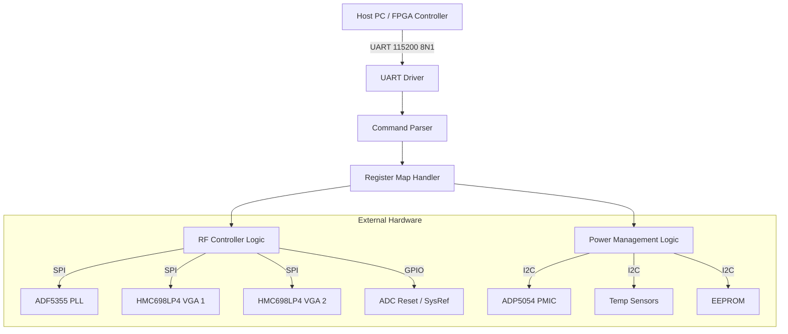
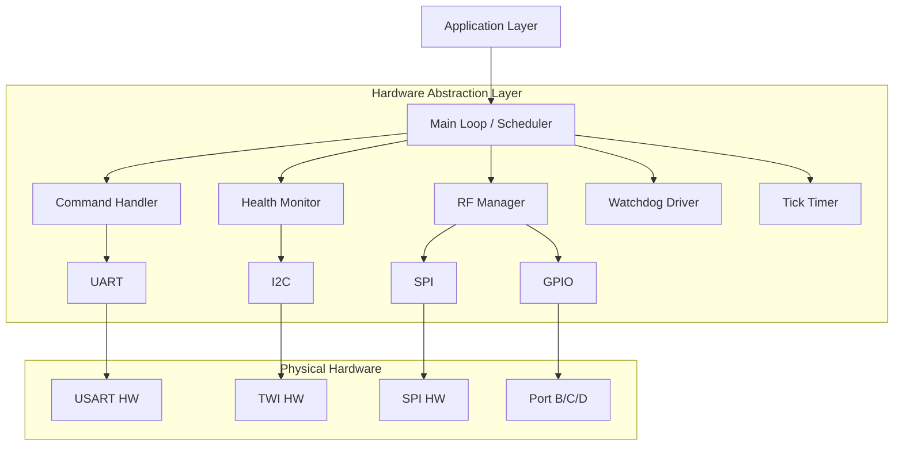
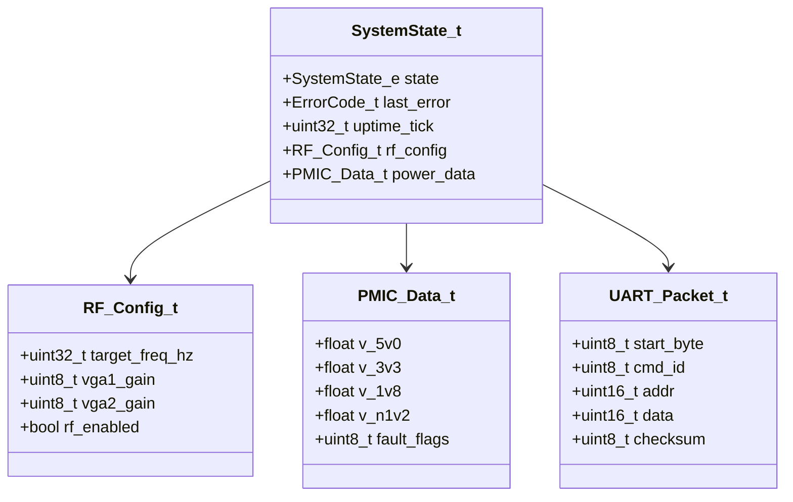
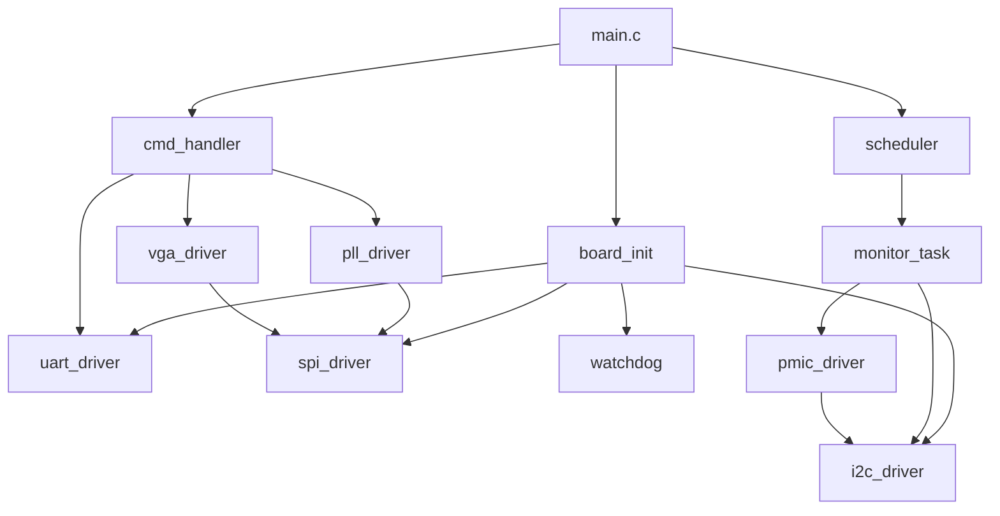
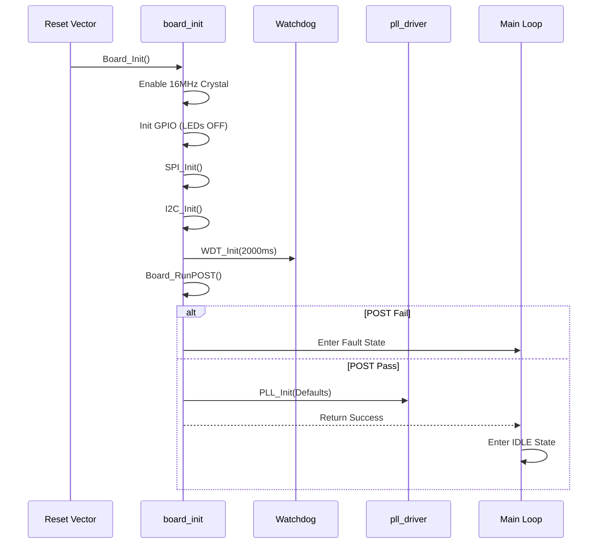
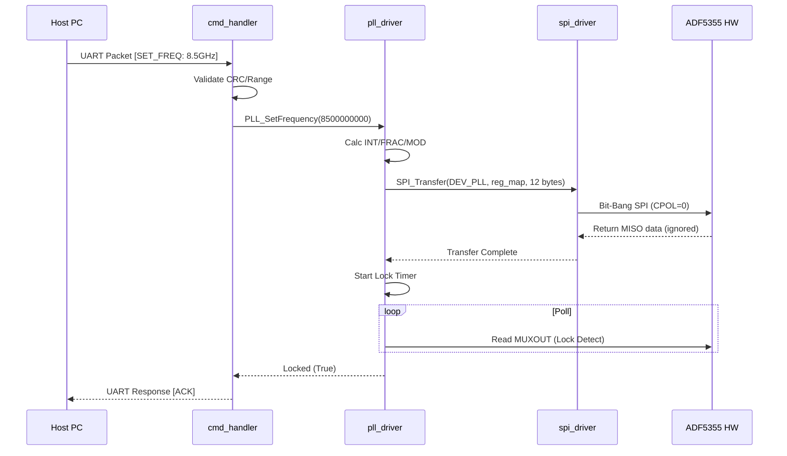
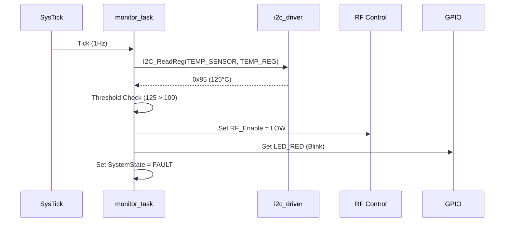
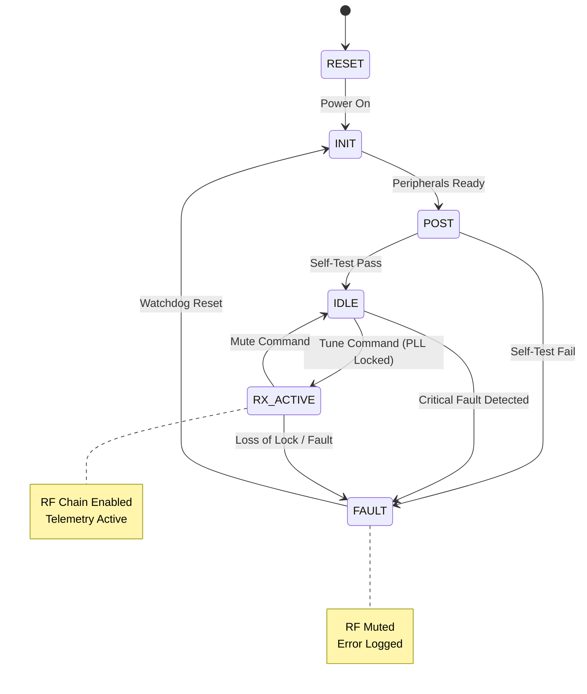
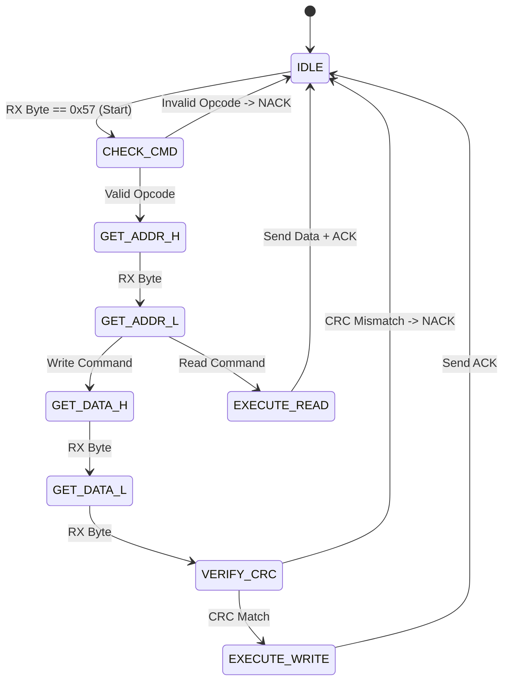

# Software Design Document (SDD)

**Project:** rbhjdaz Wideband RF Receiver
**Title:** Embedded Control & Interface Software Design
**Version:** 1.0
**Date:** 14 April 2026
**Author:** Senior Embedded Software Architect

---

## Document Control
| Version | Date | Author | Description |
|---------|------|--------|-------------|
| 1.0 | 14 Apr 2026 | Sr. Architect | Initial design release compliant with IEEE 1016-2009 |

---

# 1. Introduction

## 1.1 Purpose
This Software Design Document (SDD) provides the comprehensive architectural and detailed design for the **rbhjdaz** embedded firmware. It defines the software architecture, data structures, algorithms, and interfaces required to implement the requirements specified in the **rbhjdaz Software Requirements Specification (SRS)**.

This document is intended for:
- **Firmware Engineers** implementing the C code.
- **Test Engineers** developing integration and verification test plans.
- **System Architects** validating hardware-software co-design.

## 1.2 Scope
The design covers the complete firmware image running on the **ATMEGA328P-AU** microcontroller.
**Included Components:**
- **Board Support Package (BSP):** Clock initialization, GPIO setup, Watchdog control.
- **Hardware Abstraction Layer (HAL):** UART, SPI, I2C, and Timer drivers.
- **Application Layer:** Command parser, state machine, frequency synthesis, gain control, and monitoring tasks.
- **Data Models:** Register maps for ADF5355, HMC698LP4, and ADP5054.

**Excluded Components:**
- Host PC GUI software.
- FPGA logic design.
- DSP algorithms for demodulation.

## 1.3 Definitions and Acronyms
| Acronym | Definition |
| :--- | :--- |
| **API** | Application Programming Interface |
| **BIST** | Built-In Self-Test |
| **CRC** | Cyclic Redundancy Check |
| **DAC** | Digital-to-Analog Converter |
| **DMA** | Direct Memory Access |
| **DUT** | Device Under Test |
| **EEPROM** | Electrically Erasable Programmable Read-Only Memory |
| **EW** | Electronic Warfare |
| **FIFO** | First-In, First-Out Buffer |
| **FSM** | Finite State Machine |
| **GPIO** | General Purpose Input/Output |
| **HAL** | Hardware Abstraction Layer |
| **I2C** | Inter-Integrated Circuit |
| **IRQ** | Interrupt Request |
| **ISR** | Interrupt Service Routine |
| **JESD** | JESD204B High-Speed Data Interface Standard |
| **LNA** | Low Noise Amplifier |
| **LVDS** | Low-Voltage Differential Signaling |
| **MCU** | Microcontroller Unit (ATMEGA328P) |
| **MISRA** | Motor Industry Software Reliability Association |
| **NVM** | Non-Volatile Memory |
| **PLL** | Phase-Locked Loop |
| **POST** | Power-On Self-Test |
| **RF** | Radio Frequency |
| **RX** | Receive |
| **SPI** | Serial Peripheral Interface |
| **TRP** | Transmit/Receive Protect (RF Enable) |
| **UART** | Universal Asynchronous Receiver-Transmitter |
| **VGA** | Variable Gain Amplifier |
| **WDT** | Watchdog Timer |

## 1.4 References
1. **IEEE Std 1016-2009:** Standard for Information Technology—Systems Design—Software Design Descriptions.
2. **rbhjdaz SRS v1.0** (14 Apr 2026): Software Requirements Specification.
3. **rbhjdaz HRS v1.0** (2023): Hardware Requirements Specification.
4. **rbhjdaz GLR v0V01** (14 Apr 2026): Glue Logic Requirements.
5. **ATMEGA328P Datasheet** (Atmel 8271D-AVR-08/2013).
6. **ADF5355 Datasheet** (Analog Devices).
7. **HMC698LP4 Datasheet** (Hittite/Analog Devices).
8. **MISRA C:2012** Guidelines.

---

# 2. Design Viewpoints

## 2.1 Context Viewpoint — System Boundaries

The software resides on the ATMEGA328P, acting as the system controller. It accepts high-level commands via UART and configures the RF chain via SPI/I2C.



**External Interfaces:**
- **UART (Host Interface):** 115200 baud, 8-bit data, no parity, 1 stop bit. Commands for register read/write.
- **SPI (RF Control):** Master mode, up to 10 MHz (Clock divisor), Mode 0 (CPOL=0, CPHA=0).
- **I2C (Monitoring/Storage):** Master mode, 100 kHz standard speed.
- **GPIO (System Control):** LED status outputs, Reset signals, Interrupt inputs.

## 2.2 Composition Viewpoint — Software Architecture

The firmware follows a layered architecture. The Application Layer manages system state, while the HAL abstracts hardware registers.



### Module List with Responsibilities

#### **Module: board_init** (board_init.c / board_init.h)
**Responsibilities:** Power-on initialization, clock setup to 16MHz external crystal, peripheral enable, and POST execution.
```c
#include <stdint.h>
#include <stdbool.h>

#define F_CPU 16000000UL

/**
 * @brief Initializes the MCU hardware, clocks, and peripherals.
 * @return ERR_OK on success, error code on failure.
 */
int32_t Board_Init(void);

/**
 * @brief Retrieves hardware and firmware version information.
 * @param info Pointer to BoardInfo_t structure to be populated.
 * @return ERR_OK if info is valid.
 */
int32_t Board_GetInfo(BoardInfo_t *info);

/**
 * @brief Executes Power-On Self-Test (POST).
 * @param test_mask Bitmap of tests to run.
 * @return ERR_OK if all passed, error code indicating failure source.
 */
int32_t Board_RunPOST(uint32_t test_mask);

typedef struct {
    uint16_t board_id;
    uint8_t  hw_version_major;
    uint8_t  hw_version_minor;
    uint32_t fw_version;
    char     build_date[12];
} BoardInfo_t;
```

#### **Module: uart_driver** (uart_driver.c / uart_driver.h)
**Responsibilities:** UART configuration, interrupt-driven RX/TX, packet framing for the host protocol.
```c
#define UART_BAUD_RATE 115200
#define UART_TIMEOUT_MS 100

int32_t UART_Init(void);
int32_t UART_Deinit(void);
int32_t UART_TransmitByte(uint8_t data);
int32_t UART_ReceiveByte(uint8_t *data);
void    UART_FlushRX(void);
void    UART_ISR_Handler(void); // Called by USART_RX vector
```

#### **Module: spi_driver** (spi_driver.c / spi_driver.h)
**Responsibilities:** SPI master initialization, chip select control, and synchronized data transfers for PLL/VGA.
```c
typedef enum {
    SPI_DEV_PLL = 0,
    SPI_DEV_VGA1,
    SPI_DEV_VGA2
} SpiDevice_e;

int32_t SPI_Init(void);
int32_t SPI_Transfer(SpiDevice_e dev, const uint8_t *tx_data, uint8_t *rx_data, uint16_t len);
int32_t SPI_WriteReg(SpiDevice_e dev, uint8_t reg, uint8_t val);
```

#### **Module: i2c_driver** (i2c_driver.c / i2c_driver.h)
**Responsibilities:** I2C master initialization, error handling for NACK, and read/write operations for PMIC/EEPROM.
```c
int32_t I2C_Init(void);
int32_t I2C_Write(uint8_t dev_addr, const uint8_t *data, uint16_t len);
int32_t I2C_Read(uint8_t dev_addr, uint8_t *buf, uint16_t len);
int32_t I2C_WriteReg(uint8_t dev_addr, uint8_t reg, uint8_t val);
int32_t I2C_ReadReg(uint8_t dev_addr, uint8_t reg, uint8_t *val);
```

#### **Module: pll_driver** (pll_driver.c / pll_driver.h)
**Responsibilities:** ADF5355 frequency synthesis, N/Fractional divider calculation, register map generation.
```c
typedef struct {
    uint32_t freq_hz;      // Target Frequency 5GHz - 18GHz
    uint8_t  rf_out_en;    // RF Output Enable
    uint8_t  muxout_mode;  // Muxout setting for lock detect
} PLL_Config_t;

int32_t PLL_Init(const PLL_Config_t *cfg);
int32_t PLL_SetFrequency(uint32_t freq_hz);
int32_t PLL_Enable(bool enable);
bool    PLL_IsLocked(void);
void    PLL_Task(void); // Non-blocking check
```

#### **Module: vga_driver** (vga_driver.c / vga_driver.h)
**Responsibilities:** HMC698LP4 gain setting calculation, SPI writes.
```c
#define VGA_GAIN_MIN 0
#define VGA_GAIN_MAX 31 // 5-bit attenuation

int32_t VGA_Init(uint8_t vga_id);
int32_t VGA_SetGain(uint8_t vga_id, uint8_t gain_val);
int32_t VGA_GetGain(uint8_t vga_id, uint8_t *gain_val);
```

#### **Module: pmic_driver** (pmic_driver.c / pmic_driver.h)
**Responsibilities:** ADP5054 rail monitoring, fault flag reading.
```c
typedef struct {
    float v_5v0;
    float v_3v3;
    float v_1v8;
    float v_n1v2;
    uint8_t fault_flags;
} PMIC_Data_t;

int32_t PMIC_Init(void);
int32_t PMIC_ReadAllRails(PMIC_Data_t *data);
bool    PMIC_IsFaultActive(void);
```

#### **Module: cmd_handler** (cmd_handler.c / cmd_handler.h)
**Responsibilities:** Parses incoming UART packets, validates addresses, dispatches read/write.
```c
void CMD_Init(void);
void CMD_Process(void); // Call in main loop
```

#### **Module: nvm_manager** (nvm_manager.c / nvm_manager.h)
**Responsibilities:** EEPROM read/write, calibration table storage.
```c
int32_t NVM_Init(void);
int32_t NVM_WriteCalibration(uint32_t freq, int16_t offset);
int32_t NVM_ReadCalibration(uint32_t freq, int16_t *offset);
```

## 2.3 Logical Viewpoint — Data Model



### Enumerations
```c
typedef enum {
    SYS_STATE_RESET = 0,
    SYS_STATE_INIT,
    SYS_STATE_IDLE,
    SYS_STATE_RX_ACTIVE,      // RF Enabled and Locked
    SYS_STATE_FAULT,
    SYS_STATE_SHUTDOWN
} SystemState_e;

typedef enum {
    ERR_OK = 0x00,
    ERR_TIMEOUT = 0x01,
    ERR_COMM = 0x02,
    ERR_CHECKSUM = 0x03,
    ERR_PARAM = 0x04,
    ERR_HARDWARE = 0x07,
    ERR_PLL_UNLOCK = 0x0D,
    ERR_TEMP_ALERT = 0x0E,
    ERR_VOLT_FAULT = 0x0F,
    ERR_NVM_FAIL = 0x10
} ErrorCode_t;
```

## 2.4 Dependency Viewpoint



## 2.5 Interface Viewpoint — Complete API Specification

### 2.5.1 `PLL_SetFrequency`
```c
/**
 * @brief Configures the ADF5355 to the target frequency.
 * 
 * This function calculates the INT, FRAC, and MOD dividers required for
 * the ADF5355 PLL to generate the specified RF frequency. It formats
 * the register map and transmits it via SPI.
 *
 * @param freq_hz Target frequency in Hz (Valid: 5.0e9 to 18.0e9).
 * 
 * @return ERR_OK if command accepted and SPI write initiated.
 * @return ERR_PARAM if frequency is out of bounds.
 * 
 * @pre SPI Driver must be initialized.
 * @post PLL registers updated; lock status is pending (poll PLL_IsLocked).
 *
 * @example
 *   if (PLL_SetFrequency(8500000000) == ERR_OK) {
 *       while(!PLL_IsLocked());
 *   }
 */
int32_t PLL_SetFrequency(uint32_t freq_hz);
```

### 2.5.2 `I2C_ReadReg`
```c
/**
 * @brief Reads a single register from an I2C device.
 * 
 * @param dev_addr 7-bit I2C slave address (e.g., 0x58 for PMIC).
 * @param reg Internal register address to read.
 * @param val_out Pointer to store the read byte.
 * 
 * @return ERR_OK on success.
 * @return ERR_COMM if NACK received from device.
 * @return ERR_TIMEOUT if bus busy.
 * 
 * @pre I2C_Init() must be called.
 */
int32_t I2C_ReadReg(uint8_t dev_addr, uint8_t reg, uint8_t *val_out);
```

### 2.5.3 `CMD_Process`
```c
/**
 * @brief Parses incoming UART data and executes commands.
 * 
 * Checks for a complete packet in the RX buffer (Start Byte + Cmd + Addr + Data + Checksum).
 * If valid, dispatches to Read/Write handlers.
 * 
 * @pre UART_Init() must be called.
 * @note Non-blocking. Should be called repeatedly in main loop.
 */
void CMD_Process(void);
```

## 2.6 Interaction Viewpoint — Sequence Diagrams

### System Startup Sequence


### RF Configuration Sequence


### Fault Response Sequence (Over-Temperature)


## 2.7 State Viewpoint — State Machines

### Main System State Machine


### UART Packet Parser State Machine


## 2.8 Algorithm Viewpoint — Key Algorithms

### 2.8.1 ADF5355 Frequency Calculation
The ADF5355 uses a fractional-N PLL architecture.
```c
// Algorithm to calculate PLL Dividers
// Inputs: f_RF (Target RF Frequency)
// Outputs: INT, FRAC, MOD, PDPD (Phase Detector Pulse)

// Constants
#define PDF_FREQ 25000000 // 25 MHz PFD Frequency
#define REF_DOUBLER 0

// Logic flow
// 1. Calculate N_divider = f_RF / f_PFD
// 2. INT = floor(N_divider)
// 3. FRAC = (N_divider - INT) * MOD (where MOD is typically 2^24 or 2^25)
// 4. Apply Prescaler logic (if f_RF > 6GHz, use 8/9 prescaler)
```

### 2.8.2 UART Checksum Calculation
```c
/**
 * @brief Calculates LRC (Longitudinal Redundancy Check) for packet.
 * Algorithm: XOR of all bytes in the payload.
 */
uint8_t UART_CalcChecksum(const uint8_t *data, uint16_t len) {
    uint8_t checksum = 0;
    for (uint16_t i = 0; i < len; i++) {
        checksum ^= data[i];
    }
    return checksum;
}
```

---

# 3. Design Rationale

## 3.1 Architecture Choices

| Decision | Choice | Rationale | Trade-off |
| :--- | :--- | :--- | :--- |
| **Concurrency** | Bare-metal Super Loop | ATMEGA328P has limited RAM (2KB). RTOS overhead is too costly. | Must ensure ISRs and tasks are short to prevent latency. |
| **UART Buffering** | Ring Buffer (FIFO) | Prevents data loss if main loop is busy during interrupt. | Adds complexity to pointer management (MISRA compliance). |
| **SPI Mode** | Polling (for config) | Register configurations are infrequent. Simpler code. | Blocking during write (acceptable for <10ms writes). |
| **PLL Comm** | SPI Mode 0 (CPOL=0, CPHA=0) | Required by ADF5355 and HMC698LP4 datasheets. | Fixed constraint, no alternative. |
| **Error Handling** | Return Code (int32_t) | MISRA C prohibits exception throwing. | Caller must check return values. |

## 3.2 MISRA-C:2012 Compliance Strategy
- **Static Analysis:** PC-Lint Plus configured for MISRA C:2012.
- **Coding Rules:**
    - No dynamic memory allocation (`malloc` prohibited).
    - All functions have a single exit point.
    - Explicit `u` suffix on unsigned literals (e.g., `0u`).
    - No implicit type conversions (use explicit casts).
- **Data Sizes:** Use `<stdint.h>` types (e.g., `uint32_t`) exclusively.
- **Verification:** Unit tests must achieve 100% statement coverage for HAL layer.

---

# 4. Design Traceability Matrix

| SDD Module / Function | Implements REQ-SW-xxx | Verification Method |
| :--- | :--- | :--- |
| `Board_Init()` | REQ-SW-001 (System Initialization) | Startup Test |
| `UART_Init()`, `UART_ReceiveByte()` | REQ-SW-002 (UART Interface) | Protocol Analyzer |
| `SPI_Transfer()` | REQ-SW-003 (SPI Driver) | Logic Analyzer |
| `I2C_WriteReg()` | REQ-SW-004 (I2C Interface) | I2C Sniffer |
| `PLL_SetFrequency()` | REQ-SW-005 (Frequency Synthesis) | Frequency Counter |
| `VGA_SetGain()` | REQ-SW-006 (Gain Control) | RF Spectrum Analyzer |
| `PMIC_ReadAllRails()` | REQ-SW-007 (Power Monitor) | DVM Measurement |
| `Board_RunPOST()` | REQ-SW-008 (POST) | Built-In Test |
| `WDT_Init()` | REQ-SW-009 (Watchdog) | Fault Injection |
| `CMD_Process()` | REQ-SW-010 (Host Protocol) | Host GUI Test |
| `NVM_WriteCalibration()` | REQ-SW-011 (Calib Storage) | EEPROM Readback |

---

# 5. Appendices

## Appendix A — File Structure
```text
rbhjdaz_firmware/
├── src/
│   ├── main.c
│   ├── board/
│   │   ├── board_init.c
│   │   └── board_init.h
│   ├── drivers/
│   │   ├── uart_drv.c
│   │   ├── uart_drv.h
│   │   ├── spi_drv.c
│   │   ├── spi_drv.h
│   │   ├── i2c_drv.c
│   │   └── i2c_drv.h
│   ├── app/
│   │   ├── pll_ctrl.c
│   │   ├── pll_ctrl.h
│   │   ├── vga_ctrl.c
│   │   ├── vga_ctrl.h
│   │   ├── pmic_mon.c
│   │   ├── pmic_mon.h
│   │   └── cmd_handler.c
│   └── utils/
│       ├── crc.c
│       └── ringbuf.c
├── lib/       # HAL libraries
└── Makefile
```

## Appendix B — ADF5355 Register Map (Subset)
| Reg Address | Bit(s) | Name | Description |
| :--- | :--- | :--- | :--- |
| 0x00 | [2:0] | INT_VALUE | Integer divider value |
| 0x01 | [15:0] | FRAC_VALUE | Fractional value |
| 0x02 | [14:0] | MOD_VALUE | Modulus value |
| 0x04 | [12] | MUXOUT | Muxout control (010=Lock Detect) |

## Appendix C — I2C Address Map
| Device | Type | Address (7-bit) |
| :--- | :--- | :--- |
| ADP5054 (PMIC) | Controller | 0x58 |
| Temp Sensor (TMP102) | Sensor | 0x48 |
| EEPROM (24AA256) | Memory | 0x50 |

## Appendix D — Memory Map (ATMEGA328P)
| Region | Start | End | Size | Usage |
| :--- | :--- | :--- | :--- | :--- |
| Flash | 0x0000 | 0x7FFF | 32KB | Firmware Code |
| SRAM | 0x0100 | 0x08FF | 2KB | Stack, Heap, Globals |
| EEPROM | 0x0000 | 0x07FF | 1KB | Calibration Data |