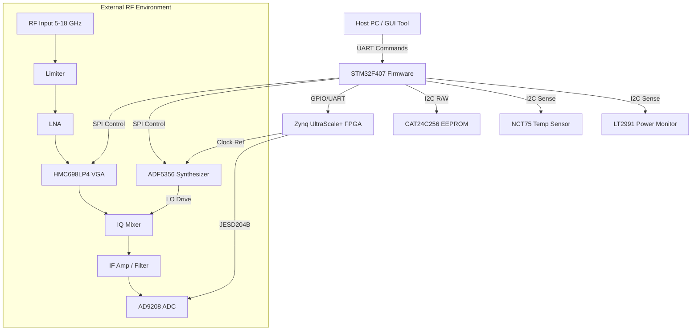
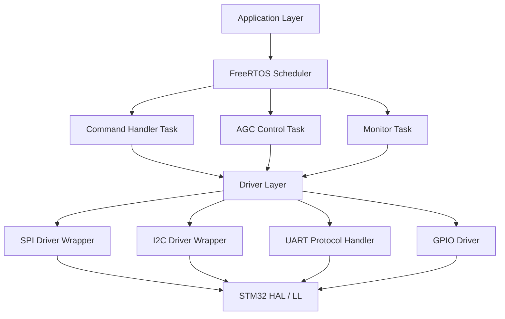
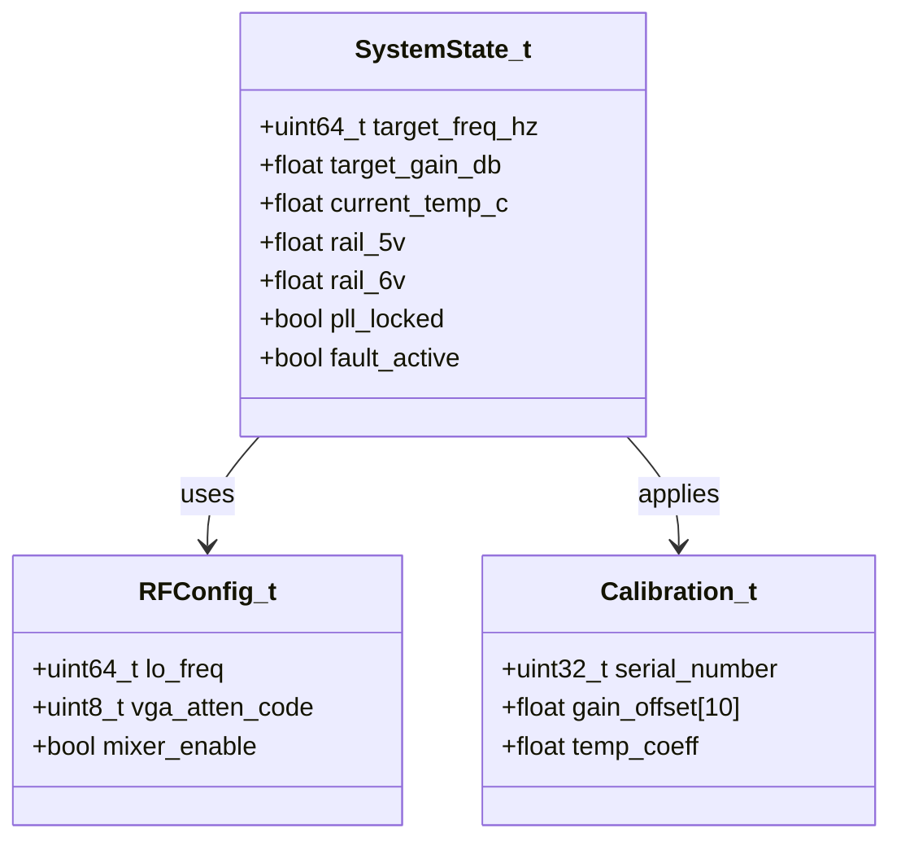
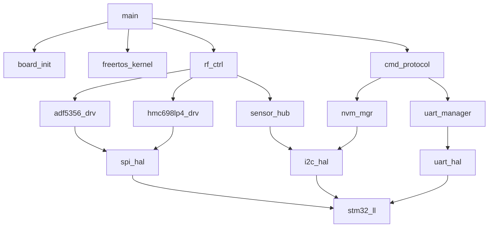
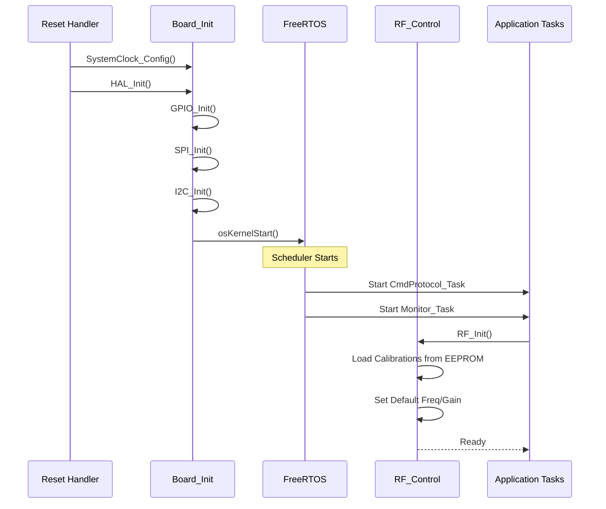
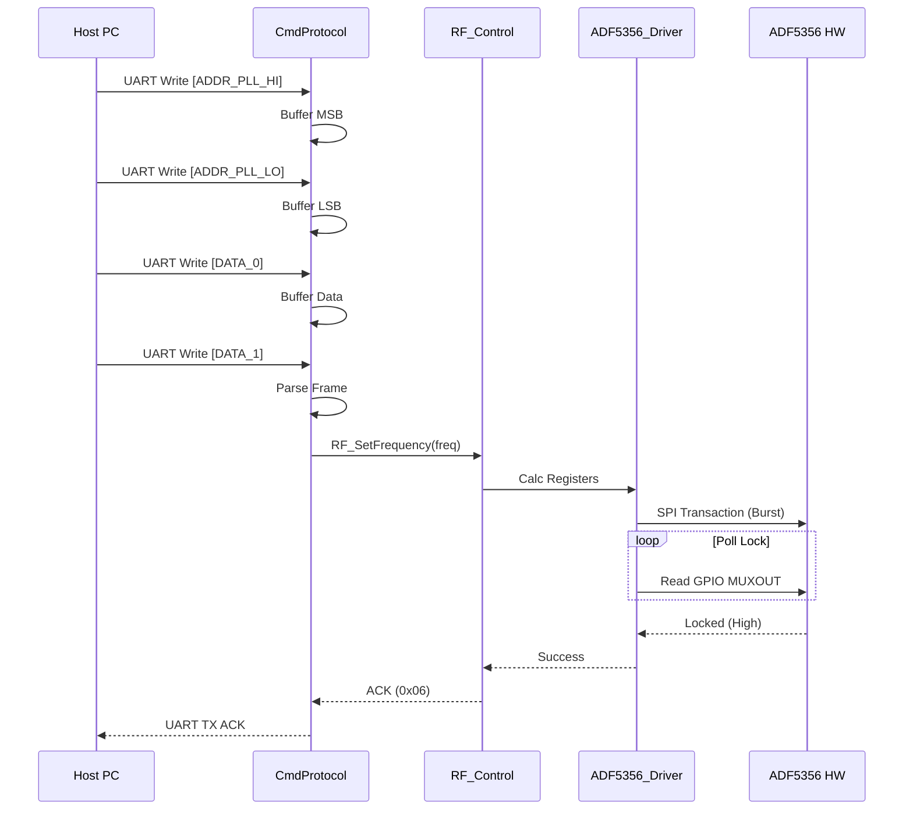
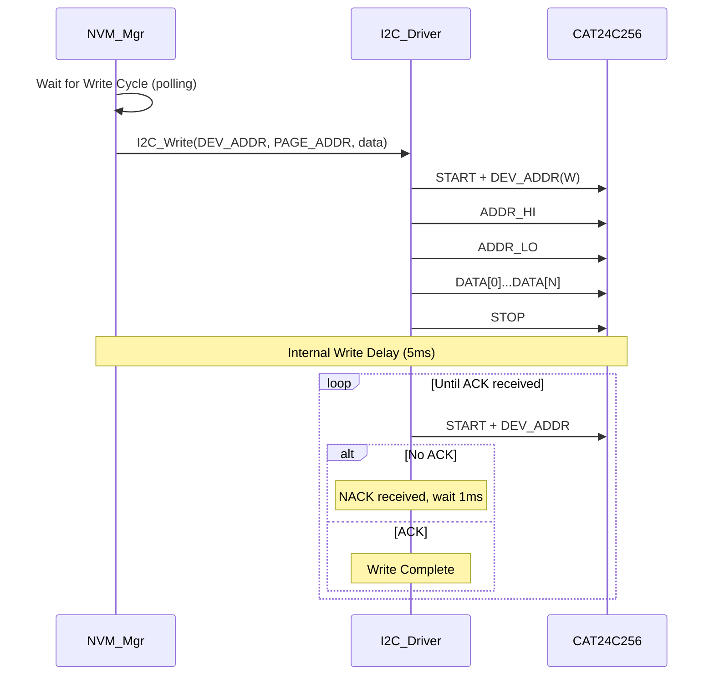
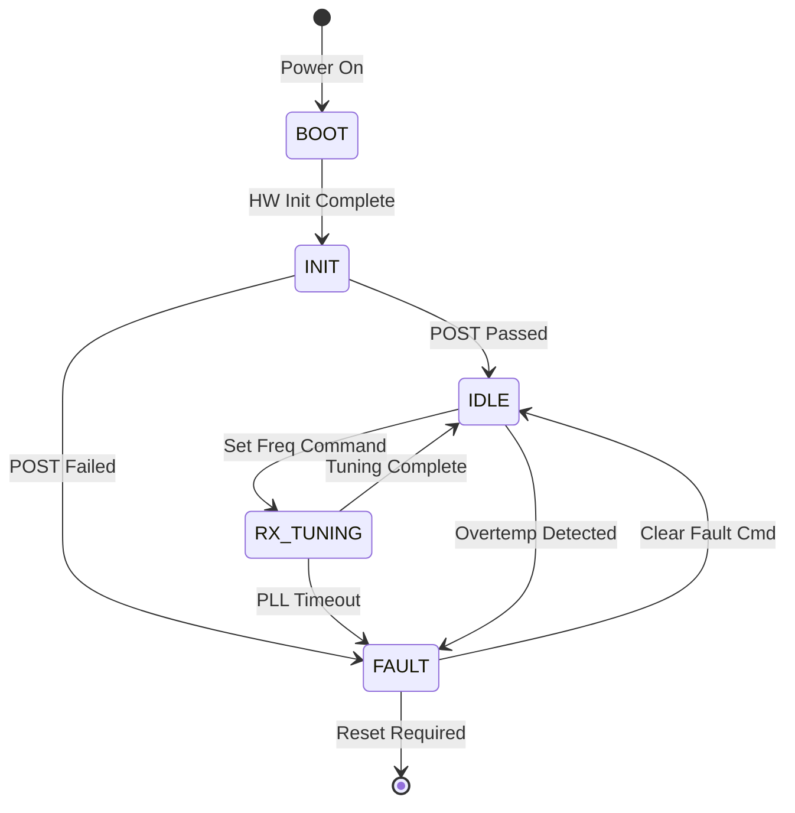

```markdown
# Software Design Document (SDD)

## Document Control
| Version | Date | Author | Description |
|---------|------|--------|-------------|
| 1.0 | 17 April 2026 | Lead Firmware Architect | Initial design for Receiver Firmware v1.0 |

---

# 1. Introduction

## 1.1 Purpose
This Software Design Document (SDD) provides the comprehensive architectural and detailed design for the **Receiver Firmware v1.0**, intended for deployment on the STM32F407VGT6 Microcontroller Unit (MCU) and coordination logic within the Xilinx Zynq UltraScale+ FPGA (XCZU15EG). 

The primary audience for this document includes:
*   **Embedded Firmware Engineers:** Responsible for implementing the MCU control loops, driver layers, and communication protocols.
*   **FPGA Design Engineers:** Integrating the software-visible register map and control signals into the RTL logic.
*   **Test Engineers:** Developing test cases based on module interfaces and state machine behaviors.
*   **System Integrators:** Managing the interface between the Host PC, FPGA, and RF hardware.

This SDD defines the software strategy to meet the functional requirements specified in the **Software Requirements Specification (SRS)**, ensuring strict adherence to **MISRA-C:2012** guidelines and real-time performance constraints.

## 1.2 Scope
The design encompasses the following software domains:
1.  **MCU Firmware (STM32F407):**
    *   Hardware Abstraction Layer (HAL) configuration for SPI, I2C, UART, and GPIO.
    *   Device drivers for RF components: ADF5356 (PLL Synthesizer), HMC698LP4 (VGA).
    *   Sensor drivers: NCT75 (Temperature), LT2991 (Power Monitor).
    *   Non-Volatile Memory (EEPROM) management for calibration data.
    *   Command protocol handler for UART communication with the Host PC.
2.  **FPGA Interface Logic:**
    *   Memory-mapped register definitions for control and status exchange.
    *   Interrupt handling logic for external events (e.g., FPGA_DONE, ADC Lock).
3.  **Exclusions:**
    *   High-level Signal Processing algorithms (implemented in FPGA RTL or Host Software).
    *   Graphical User Interface (GUI) code.
    *   RTOS kernel source code (FreeRTOS), though application usage is defined.

## 1.3 Definitions and Acronyms

| Term | Definition |
| :--- | :--- |
| **ADC** | Analog-to-Digital Converter (AD9208). |
| **AFC** | Automatic Frequency Control. |
| **AGC** | Automatic Gain Control. |
| **API** | Application Programming Interface. |
| **BRAM** | Block RAM (FPGA internal memory). |
| **CRC** | Cyclic Redundancy Check (Error detection code). |
| **DMA** | Direct Memory Access (Hardware peripheral for data transfer). |
| **EOF** | End of File. |
| **FIFO** | First In, First Out buffer. |
| **FPGA** | Field-Programmable Gate Array. |
| **FSM** | Finite State Machine. |
| **GPIO** | General Purpose Input/Output. |
| **HAL** | Hardware Abstraction Layer. |
| **HRS** | Hardware Requirements Specification. |
| **I2C** | Inter-Integrated Circuit (Serial bus). |
| **IRQ** | Interrupt Request. |
| **ISR** | Interrupt Service Routine. |
| **JESD** | JESD204B High-speed data interface standard. |
| **LO** | Local Oscillator. |
| **LNA** | Low Noise Amplifier. |
| **MISRA** | Motor Industry Software Reliability Association. |
| **MCU** | Microcontroller Unit (STM32F407). |
| **NVIC** | Nested Vectored Interrupt Controller (ARM Cortex-M4). |
| **PLL** | Phase-Locked Loop. |
| **POST** | Power-On Self Test. |
| **RX** | Receive. |
| **SPI** | Serial Peripheral Interface. |
| **SRS** | Software Requirements Specification. |
| **UART** | Universal Asynchronous Receiver-Transmitter. |
| **VGA** | Variable Gain Amplifier (HMC698LP4). |
| **WDT** | Watchdog Timer. |

## 1.4 References
1.  **IEEE 1016-2009:** Standard for Information Technology — Systems Design — Software Design Descriptions.
2.  **SRS (Receiver Project):** Software Requirements Specification, Rev 1.0, 17 April 2026.
3.  **HRS (Receiver Project):** Hardware Requirements Specification, Rev 1.0.
4.  **GLR (Receiver Project):** Glue Logic Requirements, Rev 0V01.
5.  **MISRA-C:2012:** Guidelines for the Use of the C Language in Critical Systems.
6.  **STMicroelectronics:** UM1052 - STM32F407xx Reference Manual.
7.  **Analog Devices:** ADF5356 Datasheet & Programming Guide.
8.  **Hittite/Qorvo:** HMC698LP4 Datasheet.

---

# 2. Design Viewpoints

## 2.1 Context Viewpoint — System Boundaries

The software system acts as the control layer between the Host PC (operator), the Digital Processing platform (FPGA), and the Analog/RF Front-end. The software is responsible for configuring the RF chain based on Host commands and monitoring system health.



**External Interfaces:**
*   **Host PC:** Connects via UART (DB9 or USB-Virtual COM). Issues register read/write commands.
*   **RF Front End:** Controlled via SPI (Mode 0). No direct data return, only configuration.
*   **FPGA:** Memory-mapped interface (via SPI or parallel bus if implemented, defined here as SPI-controlled registers for simplicity in GLR) and GPIO for status flags (FPGA_DONE, ALARM).

## 2.2 Composition Viewpoint — Software Architecture

The software is structured as a layered architecture to ensure portability and separation of concerns.



### Module List with Responsibilities

#### Module: board_init (board_init.c / board_init.h)
**Responsibilities:** System clock configuration (168MHz), peripheral clock enabling, FreeRTOS initialization, and Power-On Self Test (POST) execution.
**Public API:**
```c
/**
 * @brief Initializes the MCU hardware and RTOS kernel.
 * @return ERR_OK on success, ERR_HARDWARE if clock config fails.
 */
int32_t Board_Init(void);

/**
 * @brief Executes power-on self tests.
 * @param test_mask Bitmask of tests to run (I2C, SPI, EEPROM).
 * @return ERR_OK if all masked tests pass.
 */
int32_t Board_RunPOST(uint32_t test_mask);
```

#### Module: uart_manager (uart_manager.c / uart_manager.h)
**Responsibilities:** Management of the UART physical interface, RX FIFO buffering, and TX transmission. Handles framing defined in GLR.
**Public API:**
```c
int32_t UART_Init(uint32_t baud_rate);
int32_t UART_WriteBytes(const uint8_t *data, uint16_t len);
int16_t UART_ReadByte(uint8_t *byte); // Non-blocking, returns -1 if empty
bool    UART_IsTxBusy(void);
```

#### Module: cmd_protocol (cmd_protocol.c / cmd_protocol.h)
**Responsibilities:** Parsing incoming frames, validating checksums, dispatching read/write commands to the Register Map, and formatting responses.
**Public API:**
```c
/**
 * @brief Processes a single received byte via state machine.
 * @param byte The byte received from UART ISR.
 */
void CmdProtocol_ProcessByte(uint8_t byte);

/**
 * @brief Dispatches a write command to the appropriate driver.
 * @param addr 16-bit register address.
 * @param data 16-bit data value.
 * @return Status code.
 */
int32_t CmdProtocol_ExecuteWrite(uint16_t addr, uint16_t data);
```

#### Module: rf_ctrl (rf_ctrl.c / rf_ctrl.h)
**Responsibilities:** High-level control of the RF chain. Abstraction layer hiding the specifics of ADF5356 and HMC698LP4 drivers.
**Public API:**
```c
/**
 * @brief Sets the RF LO frequency.
 * @param freq_hz Desired frequency in Hz (5e9 to 18e9).
 * @return ERR_OK, ERR_PARAM, or ERR_SPI.
 */
int32_t RF_SetFrequency(uint64_t freq_hz);

/**
 * @brief Sets the overall gain.
 * @param gain_db Desired gain in dB.
 */
int32_t RF_SetGain(float gain_db);
```

#### Module: adf5356_drv (adf5356_drv.c / adf5356_drv.h)
**Responsibilities:** Low-level SPI transaction generation for the ADF5356 synthesizer. Calculates register values (INT, FRAC, MOD) based on frequency.
**Public API:**
```c
int32_t ADF5356_Init(void);
int32_t ADF5356_SetFreq(uint64_t freq_hz);
int32_t ADF5356_WriteReg(uint8_t reg_addr, uint32_t data);
bool    ADF5356_IsLocked(void);
```

#### Module: hmc698lp4_drv (hmc698lp4_drv.c / hmc698lp4_drv.h)
**Responsibilities:** Low-level SPI control for the HMC698LP4 VGA. Converts dB attenuation to 8-bit register code.
**Public API:**
```c
int32_t HMC698_Init(void);
int32_t HMC698_SetGain(float gain_db);
int32_t HMC698_WriteReg(uint8_t reg, uint8_t data);
```

#### Module: sensor_hub (sensor_hub.c / sensor_hub.h)
**Responsibilities:** Periodic polling of I2C sensors (Temp, Power) and storing data in the system state structure.
**Public API:**
```c
int32_t SensorHub_Init(void);
void    SensorHub_Task(void); // Called periodically
float   SensorHub_GetTemp(void);
float   SensorHub_GetVoltage(uint8_t rail_idx);
```

#### Module: nvm_mgr (nvm_mgr.c / nvm_mgr.h)
**Responsibilities:** Read/Write operations to EEPROM (CAT24C256) over I2C. Handles write delays and page boundaries.
**Public API:**
```c
int32_t NVM_Init(void);
int32_t NVM_ReadCalibration(Calibration_t *cal);
int32_t NVM_WriteCalibration(const Calibration_t *cal);
```

#### Module: watchdog (watchdog.c / watchdog.h)
**Responsibilities:** Independent Watchdog (IWDG) management.
**Public API:**
```c
int32_t WDT_Init(uint32_t timeout_ms);
void    WDT_Refresh(void); // "Pet the dog"
```

## 2.3 Logical Viewpoint — Data Model

This section defines the key data structures exchanged between modules.



**Data Structure Definitions:**

```c
/* System State Structure (Global Context) */
typedef struct {
    uint64_t target_lo_hz;       /* Target LO Frequency */
    float    target_gain_db;     /* Target Gain */
    float    mcu_temp_c;         /* MCU Internal Temp */
    float    pcb_temp_c;         /* NCT75 Sensor Reading */
    float    supply_5v;          /* 5V Rail Monitor */
    float    supply_6v;          /* 6V Rail Monitor */
    bool     pll_locked;         /* Lock Detect Status */
    uint8_t  fault_flags;        /* Fault bitmap */
} SystemState_t;

/* Calibration Data Structure */
typedef struct {
    uint32_t header;             /* Magic number 0xAABBCCDD */
    uint16_t hw_revision;
    float    temp_correction_offset;
    float    freq_correction_ppb;
    uint8_t  crc32;              /* Checksum */
} Calibration_t;
```

## 2.4 Dependency Viewpoint — Module Dependencies

The build order and compile-time dependencies are illustrated below. The Application layer depends on Drivers, which depend on the HAL.



## 2.5 Interface Viewpoint — Complete API Specification

For every public function defined in the modules, the following design constraints apply:
*   **MISRA Compliance:** All parameters are checked for validity (range checks) where possible.
*   **Return Codes:** All functions return `int32_t`. `0` indicates success. Negative values indicate specific error codes defined in `error_codes.h`.

**Example Specification: `RF_SetFrequency`**

```c
/**
 * @brief Configures the RF chain to a specific frequency.
 * 
 * This function performs the following actions:
 * 1. Checks if the frequency is within the 5-18 GHz range.
 * 2. Calculates ADF5356 register values (Integer, Fractional, Modulus).
 * 3. Asserts the MUXOUT to lock detect.
 * 4. Writes the configuration via SPI.
 * 5. Polls the LOCK detect GPIO for up to 100ms.
 *
 * @param freq_hz Desired frequency in Hz (e.g., 10,000,000,000 for 10GHz).
 * 
 * @return ERR_OK (0) on success.
 * @return ERR_PARAM (-1) if frequency < 5GHz or > 18GHz.
 * @return ERR_SPI_COMM (-2) if SPI transaction fails.
 * @return ERR_TIMEOUT (-3) if PLL fails to lock within 100ms.
 *
 * @pre The SPI peripheral must be initialized (Board_Init called).
 * @post The PLL is locked and the RF chain is stabilized at the new frequency.
 * 
 * @note This function is blocking for approximately 10-20ms.
 */
int32_t RF_SetFrequency(uint64_t freq_hz);
```

**Example Specification: `CmdProtocol_ExecuteWrite`**

```c
/**
 * @brief Executes a write command received from the Host.
 * 
 * Decodes the 16-bit address and routes the data to the appropriate hardware
 * register handler (VGA, PLL, FPGA, or EEPROM).
 *
 * @param addr 16-bit Register Map Address (See GLR).
 * @param data 16-bit Data value to write.
 * 
 * @return ERR_OK (0) on success.
 * @return ERR_WRITE_PROTECTED (-5) if address is read-only.
 * 
 * @threadsafe This function is called only from the UART Handler Task context.
 */
int32_t CmdProtocol_ExecuteWrite(uint16_t addr, uint16_t data);
```

## 2.6 Interaction Viewpoint — Sequence Diagrams

### System Initialization Sequence


### Frequency Tuning Sequence


### I2C EEPROM Write Sequence


## 2.7 State Viewpoint — State Machines

### System FSM


### Command Parser FSM (UART)
The UART protocol implements a simple state machine to frame variable-length commands.
States: `IDLE`, `ADDR_MSB`, `ADDR_LSB`, `DATA_MSB`, `DATA_LSB`.

## 2.8 Algorithm Viewpoint — Key Algorithms

### 2.8.1 ADF5356 Frequency Calculation
The ADF5356 uses a fractional-N PLL architecture. The firmware must calculate the INT, FRAC, and MOD registers based on the desired RF output frequency ($f_{RF}$) and the Phase Detector Frequency ($f_{PFD}$).

1.  **Calculate $f_{PFD}$:**
    $$f_{PFD} = \frac{f_{OSC} \times (1 + DBL)}{R \times (1 + T)}$$
    Where $f_{OSC}$ is the reference oscillator (default 125 MHz), $R$ is the reference divider, $DBL$ is the reference doubler, and $T$ is the reference divider of 2.

2.  **Calculate N Divider:**
    $$N_{frac} = \frac{f_{RF}}{f_{PFD}}$$

3.  **Determine INT and FRAC:**
    $$INT = \lfloor N_{frac} \rfloor$$
    $$FRAC = (N_{frac} - INT) \times MOD$$
    Where $MOD$ is the fractional modulus (fixed to 4095 for best noise performance).

### 2.8.2 HMC698LP4 Gain Mapping
The HMC698LP4 gain is controlled via an 8-bit word.
*   **Range:** -11.75 dB to +19.25 dB.
*   **Step Size:** 0.25 dB.
*   **Algorithm:**
    $$Code = \frac{Gain_{dB} - (-11.75)}{0.25} = \frac{Gain_{dB} + 11.75}{0.25}$$
    The firmware must clamp the result to the range [0, 255] before sending via SPI.

### 2.8.3 CRC-16 Calculation
To ensure integrity of calibration data in EEPROM, a CRC-16 (CCITT) is used.
```c
uint16_t CRC16_Compute(const uint8_t *data, uint16_t len) {
    uint16_t crc = 0xFFFF;
    for (uint16_t i = 0; i < len; i++) {
        crc ^= (uint16_t)data[i] << 8;
        for (uint8_t j = 0; j < 8; j++) {
            if (crc & 0x8000) crc = (crc << 1) ^ 0x1021;
            else crc <<= 1;
        }
    }
    return crc;
}
```

---

# 3. Design Rationale

## 3.1 Architecture Choices

| Decision | Alternatives | Rationale | Trade-offs |
| :--- | :--- | :--- | :--- |
| **FreeRTOS** | Bare-metal Super Loop, ThreadX | Provides prioritized preemption for UART handling vs. AGC loops. Industry standard for STM32. | Slight increase in RAM usage for stack space. |
| **SPI Mode 0** | Mode 3 | ADF5356 and HMC698LP4 datasheets specify CPOL=0, CPHA=0. | N/A (Hardware dictated). |
| **Static Memory Allocation** | Dynamic Malloc | Guarantees no heap fragmentation errors. Required for MISRA compliance in safety-critical sections. | Less flexible; buffer sizes must be known at compile time. |
| ** polled IRQ for PLL Lock** | Pure polling | Interrupt-based lock detection is non-deterministic during frequency ramping due to glitching. Polling in a task provides stable status. | Minor CPU overhead. |

## 3.2 MISRA-C:2012 Compliance Strategy
*   **Rule 13.5 (Loop counters):** All loop counters will be declared in the innermost block scope.
*   **Rule 21.1 (Malloc):** `malloc`, `free`, `realloc` are prohibited. All buffers are static arrays.
*   **Rule 11.4 (Casts):** A cast shall not be performed between a pointer type and an integer type.
*   **Tooling:** PC-Lint Plus integrated into the build process to flag violations.

---

# 4. Design Traceability Matrix

| SDD Component / Module | Implements REQ-SW-xxx | Description |
| :--- | :--- | :--- |
| `board_init.c` | **REQ-SW-001** | System Initialization |
| `adf5356_drv.c` | **REQ-SW-010** | Frequency Tuning (5-18GHz) |
| `hmc698lp4_drv.c` | **REQ-SW-011** | Gain Control (-11.75 to +19.25dB) |
| `sensor_hub.c` | **REQ-SW-020** | Temperature Monitoring |
| `sensor_hub.c` | **REQ-SW-021** | Voltage Monitoring (LT2991) |
| `cmd_protocol.c` | **REQ-SW-030** | UART Command Parsing |
| `nvm_mgr.c` | **REQ-SW-040** | EEPROM Calibration Storage |
| `watchdog.c` | **REQ-SW-050** | Watchdog Fault Recovery |
| `rf_ctrl.c` | **REQ-SW-012** | AGC Algorithm Logic |

---

# 5. Appendices

## Appendix A — File Structure
```
project_receiver_firmware/
├── src/
│   ├── main.c
│   ├── board/
│   │   ├── board_init.c
│   │   └── board_config.h
│   ├── drivers/
│   │   ├── stm32_hal/ (Vendor HAL)
│   │   ├── spi_driver.c
│   │   ├── i2c_driver.c
│   │   ├── uart_driver.c
│   │   ├── adf5356_drv.c
│   │   └── hmc698lp4_drv.c
│   ├── middleware/
│   │   ├── cmd_protocol.c
│   │   ├── nvm_mgr.c
│   │   └── sensor_hub.c
│   └── tasks/
│       ├── agc_task.c
│       └── monitor_task.c
├── tests/
│   ├── test_adf5356.c
│   └── test_protocol.c
└── CMakeLists.txt
```

## Appendix B — Register Map Summary (GLR Derived)
**Base Address:** 0x4000 (SPI Memory Map)

| Offset | Register Name | Bit Width | Access | Description |
|:-------|:--------------|:----------|:-------|:------------|
| 0x00 | `REG_LO_FREQ_HI` | 16 | RW | LO Frequency High Word (Integer part) |
| 0x01 | `REG_LO_FREQ_LO` | 16 | RW | LO Frequency Low Word (Fractional) |
| 0x02 | `REG_VGA_GAIN` | 16 | RW | VGA Gain Setting (dB x 4) |
| 0x03 | `REG_SYS_CTRL` | 16 | RW | System Control (Bit 0: RF Enable, Bit 1: Calib Mode) |
| 0x04 | `REG_STATUS` | 16 | R | System Status (Bit 0: PLL Lock, Bit 1: Overtemp) |
| 0x05 | `REG_ADC_I_MSB` | 16 | R | ADC I-Channel MSB (FIFO Read) |
| 0x06 | `REG_ADC_Q_MSB` | 16 | R | ADC Q-Channel MSB (FIFO Read) |

## Appendix C — Memory Map
STM32F407VGT6 Memory Layout:
*   **FLASH:** 1MB Total. Firmware uses ~400KB. Reserved: 0x08000000 - 0x08060000.
*   **SRAM:** 192KB Total.
    *   Stack: 8KB (End of SRAM).
    *   Heap: None (Static).
    *   Global Data: ~20KB.
    *   Buffer Pool: 50KB (For I/Q data if processed locally, otherwise unused).

## Appendix D — Build System Viewpoint

### CMakeLists.txt Structure
```cmake
cmake_minimum_required(VERSION 3.20)
project(ReceiverFirmware C ASM)

set(CMAKE_C_STANDARD 11)
set(CMAKE_C_STANDARD_REQUIRED ON)

# Define MCU Flags
set(CPU_FLAGS "-mthumb -mcpu=cortex-m4 -mfloat-abi=hard -mfpu=fpv4-sp-d16")
set(CMAKE_C_FLAGS "${CPU_FLAGS} -Wall -Wextra -pedantic -O2")

# Include HAL
set(STM32_HAL "path/to/stm32f4_hal_driver")

# Executable
add_executable(${PROJECT_NAME}.elf
    src/main.c
    src/board/board_init.c
    src/drivers/uart_driver.c
    src/drivers/spi_driver.c
    src/drivers/adf5356_drv.c
    src/middleware/cmd_protocol.c
)

target_include_directories(${PROJECT_NAME}.elf PRIVATE
    src/
    ${STM32_HAL}/Inc
)

target_link_options(${PROJECT_NAME}.elf PRIVATE
    -T ${CMAKE_CURRENT_SOURCE_DIR}/STM32F407VGTx_FLASH.ld
)

# Unit Tests (Host based)
enable_testing()
add_subdirectory(tests)
```

### Unit Test Infrastructure (tests/CMakeLists.txt)
```cmake
find_package(GTest REQUIRED)

add_executable(unit_tests
    test_adf5356.cpp
    test_protocol.cpp
    mock_hal.cpp
)
target_link_libraries(unit_tests PRIVATE GTest::gtest_main)
gtest_discover_tests(unit_tests)
```

---

## 2.9 Resource Viewpoint — Real-Time Constraints

### 2.9.1 Task Scheduling Table
Based on FreeRTOS tick rate of 1ms (1000Hz).

| Task Name | Priority (FreeRTOS) | Frequency | Worst-Case Exec Time | Max Jitter |
|:---|:---:|:---:|:---:|:---:|
| **Monitor_Task** | 2 (Low) | 100 ms | 500 us | < 1 ms |
| **CmdProtocol_Task** | 3 (Mid) | Event Driven | 200 us | N/A |
| **AGC_Task** | 4 (High) | 10 ms (during RX) | 2 ms | < 5 ms |
| **Idle_Task** | 0 | - | - | - |

### 2.9.2 ISR Latency Budget
| Interrupt Source | Min Latency | Avg Latency | Max Latency | Action |
|:---|:---:|:---:|:---:|:---|
| UART RX | 10 us | 30 us | 100 us | Copy byte to RX FIFO |
| I2C Event | 20 us | 50 us | 200 us | Sensor data ready |
| SysTick | 1 ms | 1 ms | 1 ms | OS Tick |

### 2.9.3 Memory Budget
| Region | Size | Usage | Used |
|:---|:---:|:---|:---:|
| **Flash** | 1024 KB | Code | 350 KB |
| **SRAM** | 128 KB (Main) | Data | 45 KB |
| **CCM** | 64 KB (Core-Coupled) | Stack/RTOS | 30 KB |

**Assumptions:**
*   STM32F407VGT6 used.
*   Compiler optimization set to `-Os` (Size).
*   No external SDRAM used for firmware logic.
*   FPGA handles I/Q data buffering; MCU only handles control metadata.
```