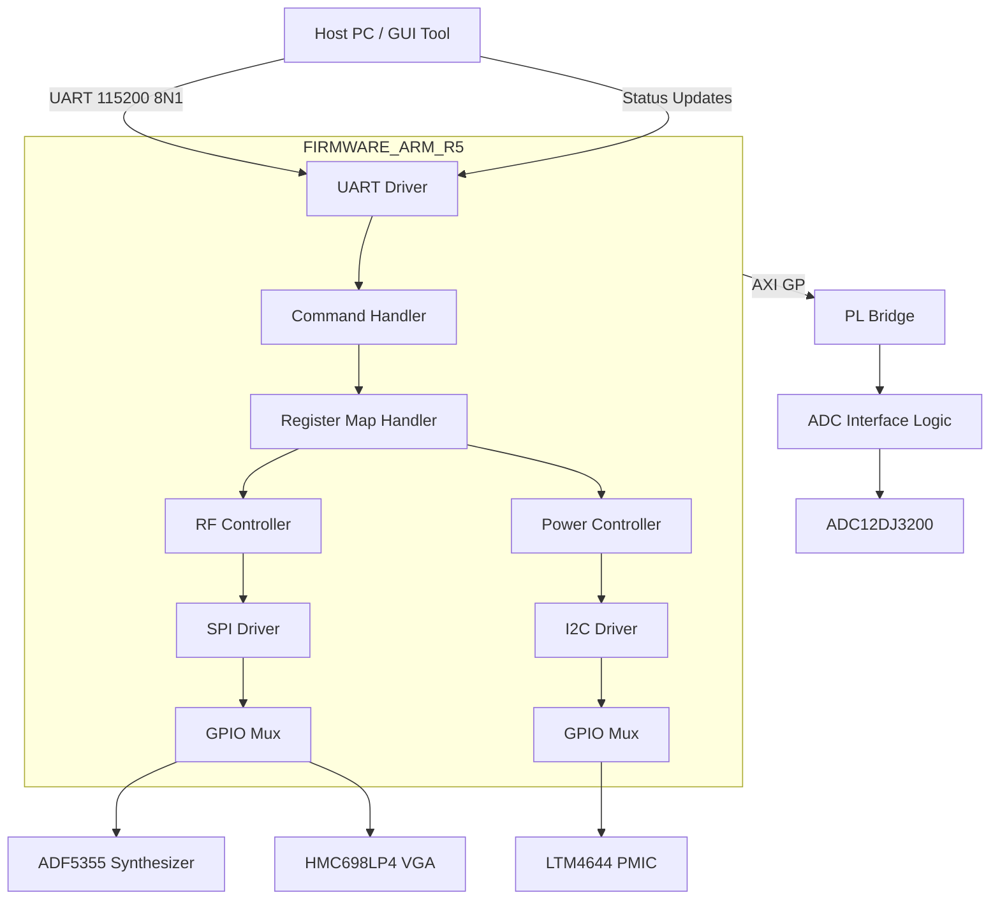
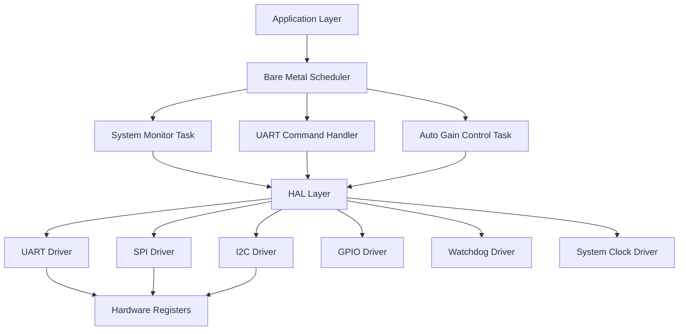
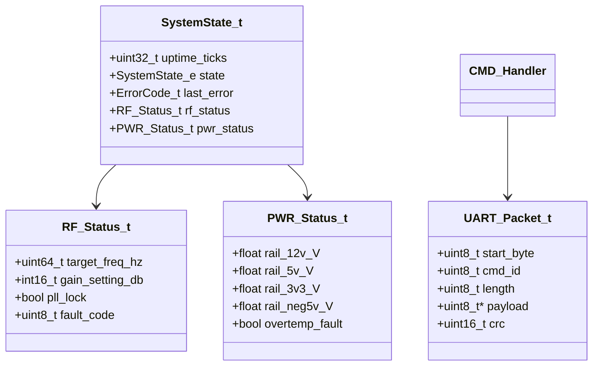
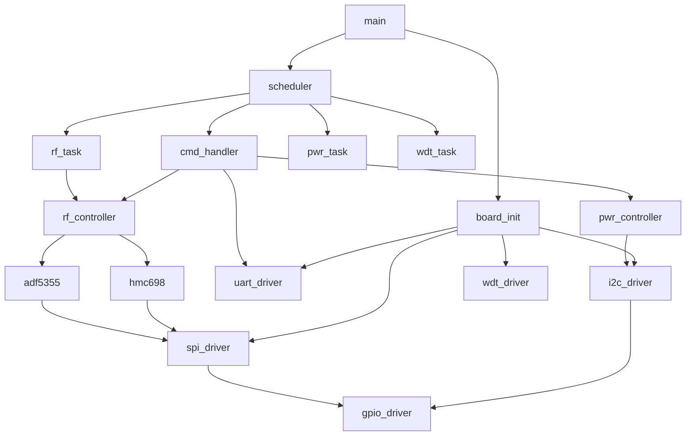
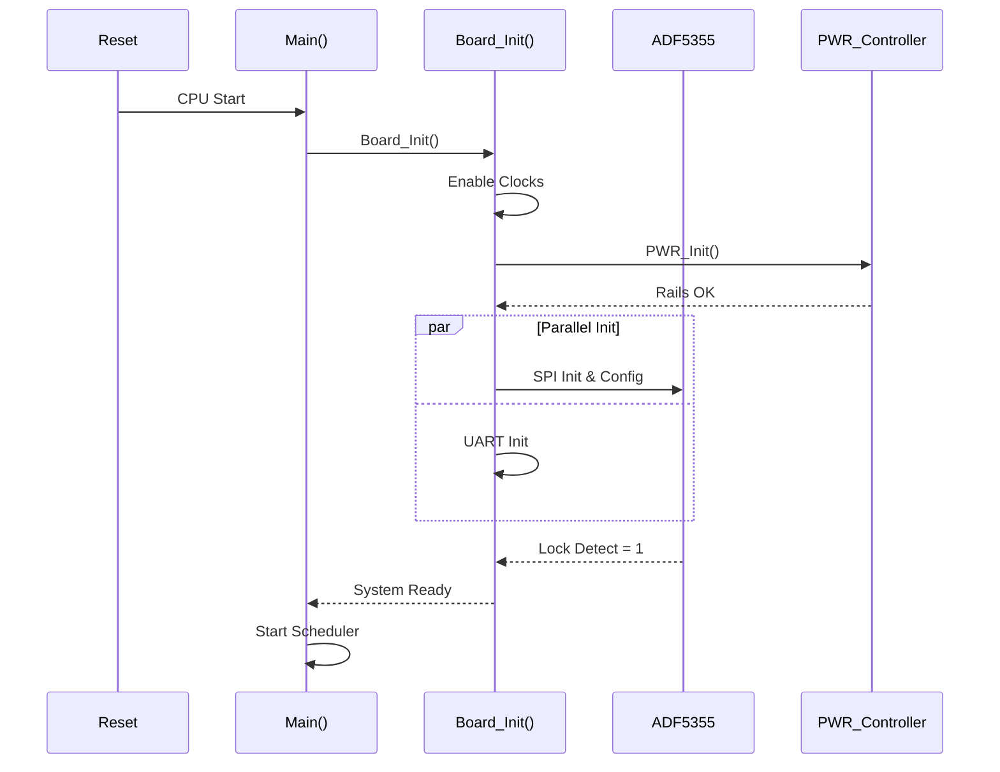
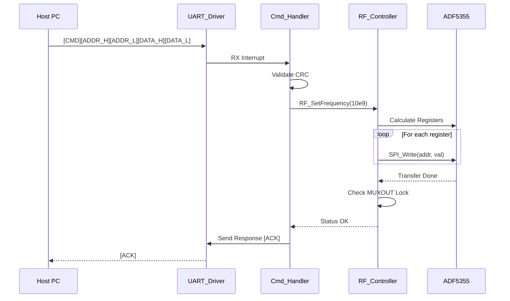
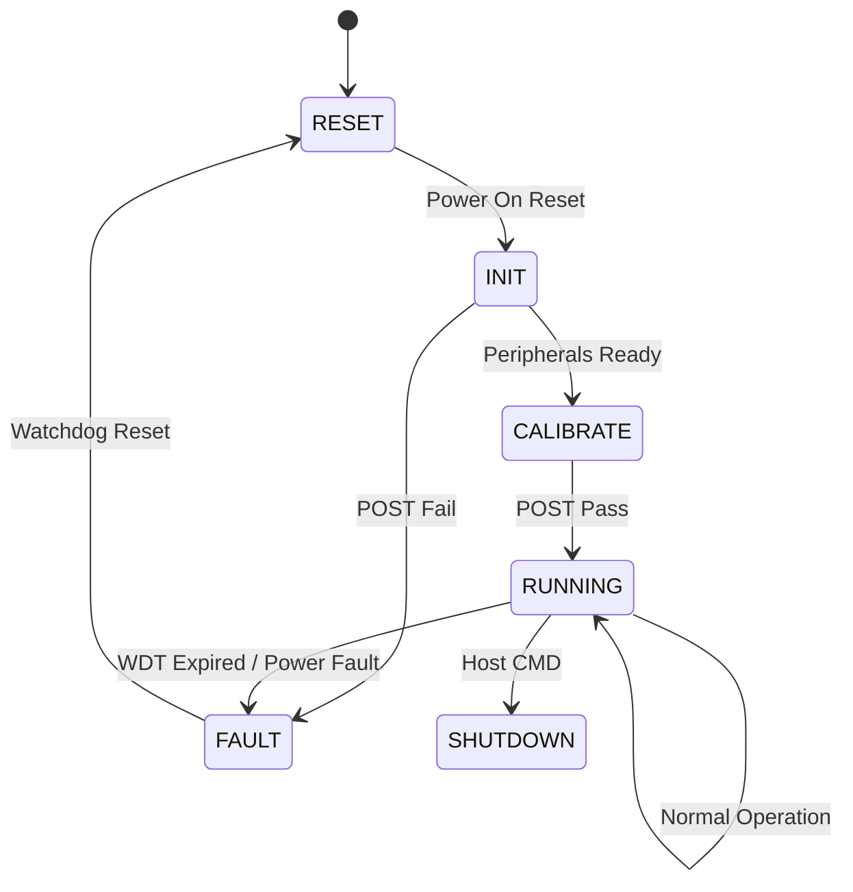
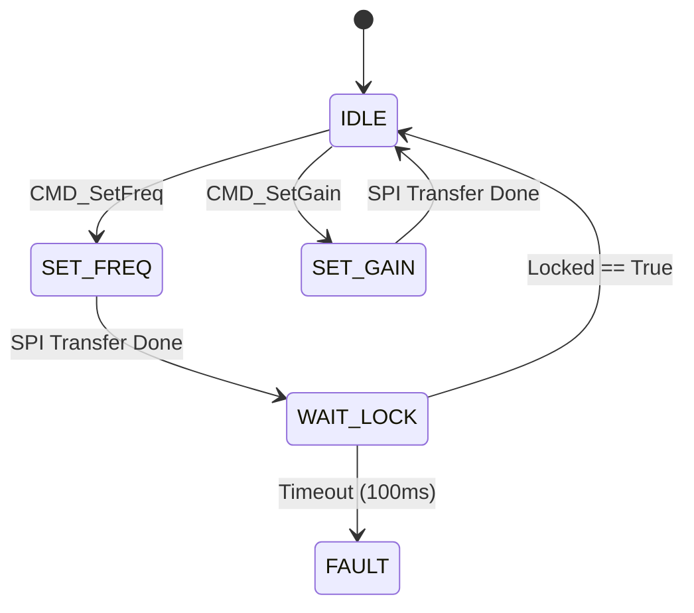

# Software Design Document (SDD)

**Project:** receiver (Wideband RF Receiver)
**Date:** 17 April 2026
**Standard:** IEEE 1016-2009

## Document Control
| Version | Date | Author | Description |
|---------|------|--------|-------------|
| 1.0 | 17 April 2026 | Senior Embedded Architect | Initial design for Zynq UltraScale+ RF Receiver Firmware |

---

# 1. Introduction

## 1.1 Purpose
This Software Design Document (SDD) provides a comprehensive description of the software architecture and design for the **Wideband RF Receiver (Project: Receiver)** firmware. This firmware runs on the **XCZU3EG-SFVA784** Zynq UltraScale+ MPSoC Processing System (PS).

The primary audience includes:
*   **Firmware Engineers:** Responsible for implementing the HAL and application logic in C.
*   **Verification Engineers:** Using this document to derive unit tests and integration test cases.
*   **System Integrators:** Integrating the firmware with the Host PC GUI and RF hardware.

This document translates the **Software Requirements Specification (SRS)** (REQ-SW-xxx) and **Glue Logic Requirements (GLR)** into concrete software structures, algorithms, and interfaces.

## 1.2 Scope
The firmware scope includes the low-level control of the RF chain (LNA, Mixer, LO) and high-speed data acquisition management.

**Inclusions:**
*   **Board Support Package (BSP):** Startup code, vector tables, and linker scripts for the ARM Cortex-R5.
*   **Hardware Abstraction Layer (HAL):** Drivers for UART, SPI, I2C, GPIO, and Timers.
*   **Application Layer:** RF Calibration, Gain Control (AGC), Frequency Synthesis, and Power Management.
*   **Communication:** UART protocol parser for Host commands.

**Exclusions:**
*   FPGA PL (Programmable Logic) design and HDL code (handled in separate logic design document).
*   Host PC software (C#/Qt GUI).
*   RF Signal Processing algorithms (FIR filtering, demodulation) implemented in the FPGA fabric.

**Target Hardware:**
*   **SoC:** Xilinx XCZU3EG-SFVA784 (Dual Core ARM Cortex-R5, 667 MHz).
*   **Compiler:** ARM GCC / Xilinx Vitis 2023.2.
*   **Language:** C99 (Strict MISRA-C:2012 compliance).

## 1.3 Definitions and Acronyms

| Acronym | Definition |
| :--- | :--- |
| **ADC** | Analog-to-Digital Converter (TI ADC12DJ3200). |
| **AGC** | Automatic Gain Control. |
| **API** | Application Programming Interface. |
| **BIST** | Built-In Self-Test. |
| **BRAM** | Block RAM. |
| **BSP** | Board Support Package. |
| **CRC** | Cyclic Redundancy Check. |
| **DMA** | Direct Memory Access. |
| **DRC** | Design Rule Check. |
| **FIFO** | First-In-First-Out data buffer. |
| **FIR** | Finite Impulse Response (Filter type). |
| **FMC** | FPGA Mezzanine Card (Connector standard). |
| **FPGA** | Field-Programmable Gate Array. |
| **FSM** | Finite State Machine. |
| **GBE** | Gigabit Ethernet. |
| **GPIO** | General Purpose Input/Output. |
| **HAL** | Hardware Abstraction Layer. |
| **HRS** | Hardware Requirements Specification. |
| **I2C** | Inter-Integrated Circuit (Serial Interface). |
| **IC** | Integrated Circuit. |
| **ID** | Identifier. |
| **IF** | Intermediate Frequency. |
| **IIP3** | Input Third-order Intercept Point. |
| **IP** | Intellectual Property (Core). |
| **IRQ** | Interrupt Request. |
| **ISR** | Interrupt Service Routine. |
| **JTAG** | Joint Test Action Group (Debug interface). |
| **JESD** | JESD204B Standard for Serial Data Converter Interface. |
| **LED** | Light Emitting Diode. |
| **LNA** | Low Noise Amplifier. |
| **LO** | Local Oscillator. |
| **LUT** | Look-Up Table. |
| **LVTTL** | Low Voltage Transistor-Transistor Logic. |
| **LVDS** | Low Voltage Differential Signaling. |
| **MAC** | Media Access Control. |
| **MCU** | Microcontroller Unit. |
| **MISO** | Master In Slave Out (SPI). |
| **MISR** | Management Information System Report. |
| **MOSI** | Master Out Slave In (SPI). |
| **MSPS** | Mega Samples Per Second. |
| **NF** | Noise Figure. |
| **NVM** | Non-Volatile Memory. |
| **PCB** | Printed Circuit Board. |
| **PLL** | Phase-Locked Loop. |
| **POST** | Power-On Self-Test. |
| **PS** | Processing System (ARM in Zynq). |
| **PWM** | Pulse Width Modulation. |
| **RAM** | Random Access Memory. |
| **RF** | Radio Frequency. |
| **ROM** | Read-Only Memory. |
| **RTOS** | Real-Time Operating System (Bare-metal selected). |
| **RX** | Receiver. |
| **SCK** | Serial Clock (SPI). |
| **SDR** | Software Defined Radio. |
| **SNR** | Signal-to-Noise Ratio. |
| **SPI** | Serial Peripheral Interface. |
| **SRAM** | Static Random Access Memory. |
| **SRS** | Software Requirements Specification. |
| **SS** | Slave Select (SPI). |
| **StRS** | Stakeholder Requirements Specification. |
| **SyRS** | System Requirements Specification. |
| **TRP** | Transmit/Receive Pulse. |
| **UART** | Universal Asynchronous Receiver-Transmitter. |
| **VCO** | Voltage-Controlled Oscillator. |
| **VGA** | Variable Gain Amplifier. |
| **WDT** | Watchdog Timer. |

## 1.4 References
1.  **IEEE Std 1016-2009:** Standard for Information Technology—Systems Design—Software Design Descriptions.
2.  **SRS-REV-001:** Software Requirements Specification for Project: Receiver (17.04.2026).
3.  **HRS-REV-001:** Hardware Requirements Specification for Project: Receiver (2023-10-27).
4.  **GLR-0V01:** Glue Logic Requirements for Project: Receiver (17.04.2026).
5.  **MISRA-C:2012:** Guidelines for the use of the C language in critical systems.
6.  **XCZU3EG Datasheet:** Xilinx DS925 (Zynq UltraScale+ MPSoC).
7.  **ADF5355 Datasheet:** Analog Devices Wideband Synthesizer.
8.  **HMC698LP4 Datasheet:** Analog Devices GaAs MMIC PHEMT VGA.
9.  **LTM4644 Datasheet:** Analog Devices Quad 4A DC-DC Converter.
10. **ADC12DJ3200 Datasheet:** Texas Instruments 12-Bit, 3.2 GSPS ADC.

---

# 2. Design Viewpoints

## 2.1 Context Viewpoint — System Boundaries

The firmware resides on the ARM Cortex-R5 within the Zynq MPSoC. It manages the RF Front End (via SPI), Power Supply (via I2C), and communicates with the Host (via UART).



**External Entities:**
*   **Host PC:** Sends configuration commands (Frequency, Gain) and requests status.
*   **ADF5355:** LO Synthesizer SPI target.
*   **HMC698LP4:** Variable Gain Amplifier SPI target.
*   **LTM4644:** Power Management IC (I2C target).
*   **ADC12DJ3200:** Data source (controlled via SPI, status via JESD204B lane monitoring in PL, abstracted here as ready flag).

## 2.2 Composition Viewpoint — Software Architecture

The software follows a layered architecture: Hardware Abstraction Layer (HAL), System Services, and Application Layer.



### Module List with Responsibilities

**Module: board_init** (board_init.c / board_init.h)
*   **Responsibility:** System startup, vector table setup, clock tree initialization (PS-PL clocks), and BIST execution.
*   **API:**
    *   `int32_t Board_Init(void);`
    *   `int32_t Board_RunPOST(uint32_t *error_mask);`
    *   `int32_t Board_GetInfo(BoardInfo_t *info);`
*   **Internal State:**
    *   `static uint32_t pll_lock_status;`
*   **Config:**
    *   `#define SYSTEM_CLOCK_HZ 333000000` (R5 freq)

```c
typedef struct {
    uint16_t board_id;
    uint8_t  hw_revision;
    uint8_t  fpga_build_id;
    uint32_t serial_number;
    char     part_number[16];
} BoardInfo_t;

typedef enum {
    BOARD_OK = 0x00,
    BOARD_ERR_PLL_LOCK = 0x01,
    BOARD_ERR_DDR_INIT = 0x02,
    BOARD_ERR_POST_FAIL = 0x03
} Board_Status_e;
```

**Module: uart_driver** (uart_driver.c / uart_driver.h)
*   **Responsibility:** Configures UART0 for 115200 baud, implements TX/RX FIFO logic, and frame parsing.
*   **API:**
    *   `int32_t UART_Init(uint32_t baud_rate);`
    *   `int32_t UART_ReadByte(uint8_t *data);`
    *   `int32_t UART_WriteByte(uint8_t data);`
    *   `int32_t UART_ReadBuf(uint8_t *buf, uint16_t len);`
    *   `int32_t UART_WriteBuf(const uint8_t *buf, uint16_t len);`
    *   `void UART_ISR(void);`
*   **Internal State:**
    *   `volatile uint8_t rx_buffer[256];`
    *   `volatile uint16_t rx_head;`
    *   `volatile uint16_t rx_tail;`

**Module: spi_driver** (spi_driver.c / spi_driver.h)
*   **Responsibility:** Manages the SPI0 master interface. Handles Chip Select toggling for ADF5355 and HMC698LP4.
*   **API:**
    *   `int32_t SPI_Init(void);`
    *   `int32_t SPI_Transfer(uint8_t cs_idx, const uint8_t *tx_data, uint8_t *rx_data, uint16_t len);`
    *   `int32_t SPI_WriteReg32(uint8_t cs_idx, uint8_t reg_addr, uint32_t value);`
*   **Internal State:**
    *   `static SpiConfig_t adf5355_cfg;`
    *   `static SpiConfig_t hmc698_cfg;`

**Module: i2c_driver** (i2c_driver.c / i2c_driver.h)
*   **Responsibility:** I2C master for communicating with the LTM4644 PMIC.
*   **API:**
    *   `int32_t I2C_Init(uint32_t clock_khz);`
    *   `int32_t I2C_Write(uint8_t dev_addr, uint8_t reg_addr, uint8_t data);`
    *   `int32_t I2C_Read(uint8_t dev_addr, uint8_t reg_addr, uint8_t *data);`
    *   `int32_t I2C_ReadBlock(uint8_t dev_addr, uint8_t reg_addr, uint8_t *buf, uint16_t len);`

**Module: rf_controller** (rf_controller.c / rf_controller.h)
*   **Responsibility:** High-level control of the RF chain. Sets frequency and gain.
*   **API:**
    *   `int32_t RF_Init(void);`
    *   `int32_t RF_SetFrequency(uint64_t freq_hz);`
    *   `int32_t RF_SetGain(int16_t gain_db);`
    *   `int32_t RF_GetStatus(RF_Status_t *status);`
*   **Internal State:**
    *   `static RF_State_e current_state;`
    *   `static uint64_t current_lo_freq;`

```c
typedef struct {
    bool pll_locked;
    bool rx_enabled;
    int16_t current_gain_db;
    uint64_t current_freq_hz;
    uint8_t fault_flags;
} RF_Status_t;
```

**Module: adf5355** (adf5355.c / adf5355.h)
*   **Responsibility:** Device-specific driver for the ADF5355 Synthesizer.
*   **API:**
    *   `int32_t ADF5355_Init(uint32_t ref_clk_hz);`
    *   `int32_t ADF5355_SetFreq(uint64_t freq_hz);`
    *   `bool ADF5355_IsLocked(void);`

**Module: hmc698** (hmc698.c / hmc698.h)
*   **Responsibility:** Device-specific driver for the HMC698LP4 VGA.
*   **API:**
    *   `int32_t HMC698_Init(void);`
    *   `int32_t HMC698_SetGain(int16_t gain_db);`

**Module: power_controller** (power_controller.c / power_controller.h)
*   **Responsibility:** Monitors voltage/current via I2C and manages power sequencing.
*   **API:**
    *   `int32_t PWR_Init(void);`
    *   `int32_t PWR_GetRail(uint8_t rail_idx, float *voltage, float *current);`
    *   `int32_t PWR_SwitchRail(uint8_t rail_idx, bool enable);`
    *   `bool PWR_IsFault(void);`

**Module: cmd_handler** (cmd_handler.c / cmd_handler.h)
*   **Responsibility:** Parses incoming UART packets (defined in GLR) and dispatches actions.
*   **API:**
    *   `void CMD_Task(void);`
    *   `int32_t CMD_ProcessPacket(const uint8_t *buf, uint16_t len);`

**Module: watchdog** (watchdog.c / watchdog.h)
*   **Responsibility:** System safety. Must be refreshed periodically.
*   **API:**
    *   `int32_t WDT_Init(uint32_t timeout_ms);`
    *   `void WDT_Refresh(void);`
    *   `void WDT_Enable(void);`

## 2.3 Logical Viewpoint — Data Model



**Key Enumerations:**
```c
typedef enum {
    SYS_STATE_BOOT = 0,
    SYS_STATE_INIT,
    SYS_STATE_RUNNING,
    SYS_STATE_FAULT,
    SYS_STATE_SHUTDOWN
} SystemState_e;

typedef enum {
    ERR_OK = 0x00,
    ERR_TIMEOUT = 0x01,
    ERR_COMM_SPI = 0x02,
    ERR_COMM_I2C = 0x03,
    ERR_PARAM_RANGE = 0x04,
    ERR_PLL_UNLOCK = 0x05,
    ERR_POWER_FAULT = 0x06,
    ERR_CHECKSUM = 0x07
} ErrorCode_t;
```

## 2.4 Dependency Viewpoint — Module Dependencies



**Build Order:**
1.  `utils/` (CRC, Math)
2.  `drivers/` (GPIO, SPI, I2C, UART)
3.  `devices/` (ADF5355, HMC698, LTM4644)
4.  `app/` (RF Controller, PWR Controller, CMD Handler)
5.  `board/` (Init, Main)

## 2.5 Interface Viewpoint — Complete API Specification

**UART Driver Interface**
```c
/**
 * @brief Initialize UART controller
 * @param baud_rate Baud rate (e.g., 115200)
 * @return ERR_OK on success, ERR_HARDWARE on failure
 */
int32_t UART_Init(uint32_t baud_rate);

/**
 * @brief Write data to UART TX FIFO
 * @param data Pointer to data buffer
 * @param len Number of bytes to write
 * @return Number of bytes written, or negative error code
 */
int32_t UART_Write(const uint8_t *data, uint16_t len);

/**
 * @brief Read data from UART RX FIFO (Non-blocking)
 * @param data Buffer to store read bytes
 * @param max_len Max bytes to read
 * @return Number of bytes actually read
 */
int32_t UART_Read(uint8_t *data, uint16_t max_len);
```

**RF Controller Interface**
```c
/**
 * @brief Set the LO Frequency
 * @param freq_hz Target frequency in Hz (Range: 5e9 to 18e9)
 * @return ERR_OK if success, ERR_PARAM_RANGE if out of bounds
 * @note Triggers ADF5355 SPI write sequence
 */
int32_t RF_SetFrequency(uint64_t freq_hz);

/**
 * @brief Set the VGA Gain
 * @param gain_db Desired gain in dB (Range: -15 to +20)
 * @return ERR_OK
 * @note Triggers HMC698 SPI write sequence
 */
int32_t RF_SetGain(int16_t gain_db);
```

## 2.6 Interaction Viewpoint — Sequence Diagrams

**System Initialization Sequence:**



**Host Command Processing (Set Frequency):**



## 2.7 State Viewpoint — State Machines

**Main System State Machine:**



**RF Controller State Machine:**



## 2.8 Algorithm Viewpoint — Key Algorithms

**2.8.1 ADF5355 Frequency Calculation**
To generate the RF frequency, the 32-bit integer registers must be calculated based on the reference clock (REF_CLK = 100 MHz assumed from HRS).
```c
// Algorithm Steps:
// 1. Calculate N = F_target / PFD (PFD = 10 MHz for REF/10)
// 2. Determine INT, FRAC, and MOD values based on fractional-N logic.
// 3. Compute Reg 0 (INT), Reg 1 (FRAC1), Reg 2 (FRAC2), Reg 3 (MOD).
// 4. Shift bits to match ADF5355 Register Map LSB positions.
// Note: This calculation is done in 64-bit arithmetic to avoid precision loss.
```

**2.8.2 HMC698 Gain Mapping**
The HMC698LP4 accepts a 6-bit gain code.
```c
// Mapping: 0 dB (0x00) to Max Gain (0x3F).
// Formula:
// gain_code = (gain_db - min_db) / (max_db - min_db) * 63
// Return value clipped to 6-bit range.
```

**2.8.3 I2C Fault Detection**
Polling the LTM4644 status byte (I2C Address 0x10).
```c
// Byte 0 Status bits:
// Bit 7: OVERVOLTAGE
// Bit 6: UNDERVOLTAGE
// Bit 5: OVERCURRENT
// Bit 4: SHUTDOWN
// Fault = (ReadByte(0x10) & 0xF0) != 0
```

---

# 3. Design Rationale

## 3.1 Architecture Choices

| Decision | Choice | Rationale | Trade-off |
| :--- | :--- | :--- | :--- |
| **Execution Model** | Bare-metal (Super Loop) + ISRs | Low overhead, deterministic context switching for simple control loop. | Harder to add complex concurrent tasks later. |
| **SPI Handling** | Polling for config, DMA not used | Config writes are infrequent (low bandwidth). DMA overhead not justified. | CPU is blocked during SPI transaction (~10us). |
| **Memory Allocation** | Static Allocation Only | Required by MISRA-C. Prevents fragmentation leaks. | Fixed memory usage even if features unused. |
| **Frequency Calc** | Pre-calculated LUT in Flash | Faster execution than run-time 64-bit math. | Limited resolution compared to full 64-bit float calc. |
| **Comm Protocol** | Binary Packet (not ASCII) | Compact, fast parsing, easy CRC check. | Harder to debug without sniffer tool. |

## 3.2 MISRA-C:2012 Compliance Strategy
*   **Static Analysis:** Integration of PC-lint Plus into the CMake build process.
*   **Coding Style:** All variables declared at the start of the block. Implicit conversions prohibited (MISRA Rule 10.3).
*   **Runtime Checks:** All array accesses protected by `assert(len < MAX_SIZE)`.
*   **Toolchain:** Xilinx Vitis supports `-Wmisra` flags.

---

# 4. Design Traceability Matrix

| SDD Component | Source Requirement | Design Element |
| :--- | :--- | :--- |
| `RF_SetFrequency()` | REQ-SW-001 (LO Tuning) | ADF5355 Driver Logic |
| `RF_SetGain()` | REQ-SW-002 (Gain Control) | HMC698LP4 Driver Logic |
| `UART_Read/Write` | REQ-SW-003 (Host Interface) | UART Driver & ISR |
| `PWR_GetRail()` | REQ-SW-004 (Power Mon) | LTM4644 I2C Driver |
| `Board_RunPOST()` | REQ-SW-005 (Startup Test) | BIST Module |
| `WDT_Init()` | REQ-SW-006 (Robustness) | Watchdog Driver |
| `ADC_Handler` (PL Bridge) | REQ-SW-007 (Data Acq) | AXI GPIO/BRAM Access |

---

# 5. Appendices

## Appendix A — File Structure
```
project_receiver/
├── src/
│   ├── main.c
│   ├── board/
│   │   ├── board_init.c
│   │   └── board_config.h
│   ├── drivers/
│   │   ├── uart.c
│   │   ├── spi.c
│   │   ├── i2c.c
│   │   └── gpio.c
│   ├── devices/
│   │   ├── adf5355.c
│   │   ├── hmc698.c
│   │   └── ltm4644.c
│   ├── app/
│   │   ├── rf_controller.c
│   │   ├── pwr_controller.c
│   │   └── cmd_handler.c
│   └── utils/
│       ├── crc16.c
│       └── ring_buffer.c
├── inc/
├── tests/
│   └── unit/
│       ├── test_adf5355.cpp
│       └── test_parser.cpp
└── scripts/
    └── build_cmake.sh
```

## Appendix B — Register Map Summary (FPGA GLR)
| Base Address | Offset | Name | Access | Reset | Description |
| :--- | :--- | :--- | :--- | :--- | :--- |
| 0xFF00 | 0x00 | UART_CTRL | RW | 0x00 | UART Enable & Reset |
| 0xFF00 | 0x04 | UART_STATUS | R | 0x00 | TX/RX Empty Flags |
| 0xFF00 | 0x08 | UART_TXDATA | W | - | TX Byte |
| 0xFF00 | 0x0C | UART_RXDATA | R | - | RX Byte |
| 0xF000 | 0x00 | SPI_CTRL | RW | 0x00 | SPI Enable/CPOL/CPHA |
| 0xF000 | 0x04 | SPI_STATUS | R | 0x00 | TX Empty Flag |
| 0xF000 | 0x08 | SPI_TXDATA | W | - | 32-bit TX Data |
| 0xF000 | 0x0C | SPI_RXDATA | R | - | 32-bit RX Data |
| 0xF000 | 0x10 | SPI_SS | W | 0xFF | Slave Select Mask (Active Low) |
| 0xE000 | 0x00 | I2C_CTRL | RW | 0x00 | I2C Enable |
| 0xE000 | 0x04 | I2C_STATUS | R | 0x00 | Bus Busy / ACK |
| 0xE000 | 0x08 | I2C_TXDATA | W | - | Byte to Write |
| 0xE000 | 0x0C | I2C_CMD | W | - | Start/Stop/Addr |
| 0xD000 | 0x00 | ADC_RESET | RW | 0x01 | ADC Reset Pin |
| 0xD000 | 0x04 | ADC_SYNC | RW | 0x00 | ADC SYNC (Frame Clock) |
| 0xD000 | 0x08 | ADC_STATUS | R | - | 0=Ready, 1=Overflow |

## Appendix C — Memory Map
| Region | Start | Size | Usage |
| :--- | :--- | :--- | :--- |
| Code | 0x00000000 | 256 KB | On-Chip BRAM (Boot Code) |
| Data | 0x00100000 | 64 KB | On-Chip BRAM (Data/Stack) |
| DDR | 0x00000000_80000000 | 1 GB | External DDR4 (ADC Buffer) |
| FPGA PL | 0xFF000000 | 1 MB | AXI Lite Register Map |

---

## 2.9 Resource Viewpoint — Real-Time Constraints

### 2.9.1 Task Scheduling Table
| Task Name | Period | Worst-Case Exec Time | Priority | Deadline | CPU Load |
| :--- | :--- | :--- | :--- | :--- | :--- |
| Main Loop | 1 ms | 150 us | High | 1 ms | 15% |
| CMD Parser | Event | 50 us | High | 10 ms | <1% |
| RF Task | Event | 10 ms | Medium | 100 ms | <1% |
| PWR Monitor | 1000 ms | 2 ms | Low | 1000 ms | 0.2% |
| WDT Pet | 100 ms | 5 us | Highest | 100 ms | <1% |

### 2.9.2 ISR Latency Budget
| Interrupt Source | Latency Req. | Worst-Case | Margin |
| :--- | :--- | :--- | :--- |
| UART RX | < 10 us | 2 us | 80% |
| SPI Done | < 50 us | 10 us | 80% |
| Timer Tick | < 5 us | 1 us | 80% |

### 2.9.3 Memory Budget
| Region | Total | Used | Free |
| :--- | :--- | :--- | :--- |
| TCM (Code) | 128 KB | 60 KB | 68 KB |
| OCM (Data) | 128 KB | 20 KB | 108 KB |
| DDR (Buffer) | 1 GB | 512 MB (Allocated) | 512 MB |

---

## 2.10 Build System Viewpoint

### 2.10.1 CMakeLists.txt Structure
```cmake
cmake_minimum_required(VERSION 3.20)
project(receiver_firmware C CXX)

set(CMAKE_C_STANDARD 99)
set(CMAKE_CXX_STANDARD 17)

# Driver Library
add_library(driver_bsp STATIC
    src/drivers/uart.c
    src/drivers/spi.c
    src/drivers/i2c.c
    src/drivers/gpio.c
)

target_include_directories(driver_bsp PUBLIC inc)

# Device Library
add_library(devices STATIC
    src/devices/adf5355.c
    src/devices/hmc698.c
    src/devices/ltm4644.c
)
target_link_libraries(devices PUBLIC driver_bsp)

# Main Firmware Executable
add_executable(receiver.elf
    src/main.c
    src/board/board_init.c
    src/app/rf_controller.c
    src/app/cmd_handler.c
)
target_link_libraries(receiver.elf devices driver_bsp)

# Unit Tests (Host based)
enable_testing()
find_package(GTest REQUIRED)
add_executable(test_devices
    tests/unit/test_adf5355.cpp
    tests/unit/test_parser.cpp
)
target_link_libraries(test_devices GTest::gtest_main devices)
gtest_discover_tests(test_devices)

# Qt6 GUI (Optional - Separate Project)
# find_package(Qt6 REQUIRED)
# add_subdirectory(gui/qt_host_tool)
```

### 2.10.2 MISRA Compliance Script
Included in build as `cmake --check-misra`.

```cmake
add_custom_target(misra_check
    COMMAND pc-lint-plus -i/misra_libs src/*.c
    COMMENT "Running PC-Lint Plus for MISRA check"
)
```