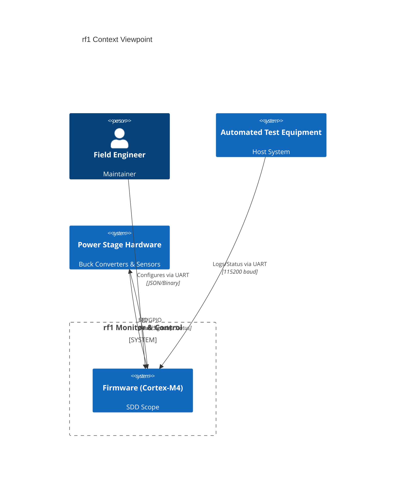
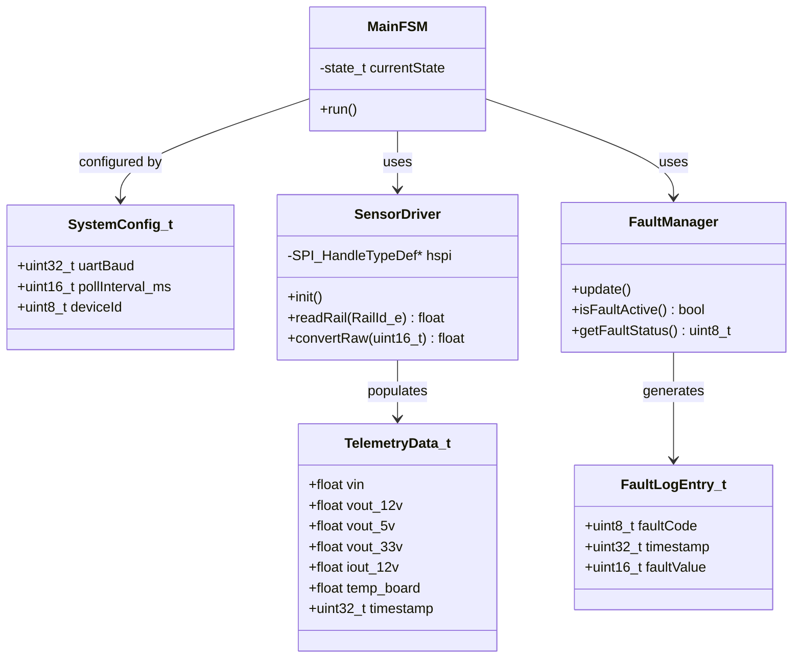
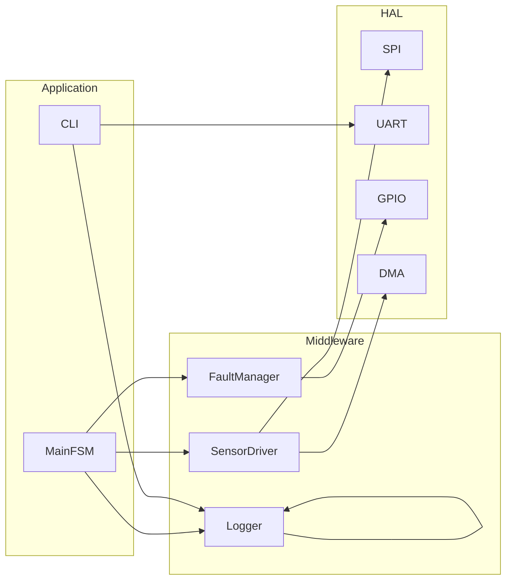
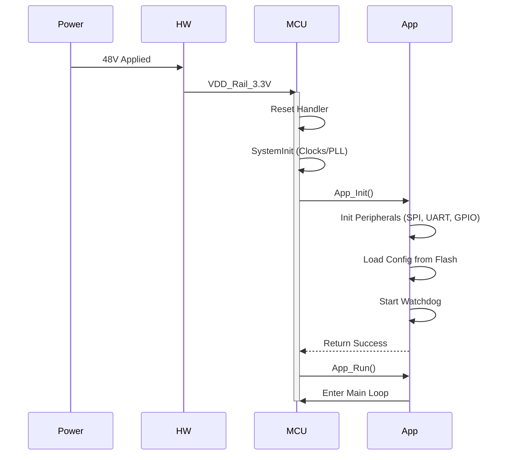
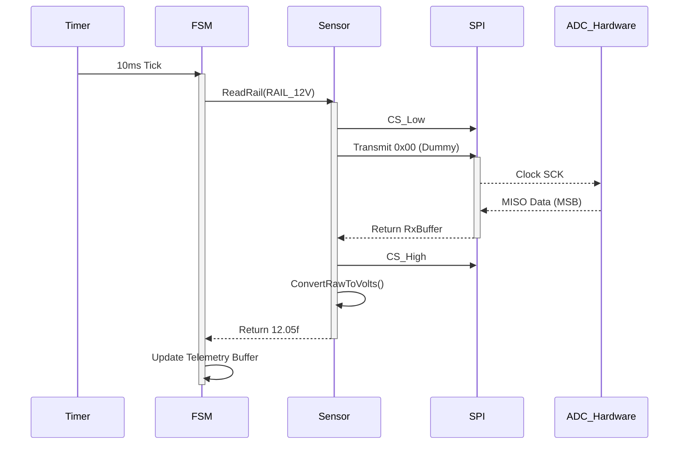
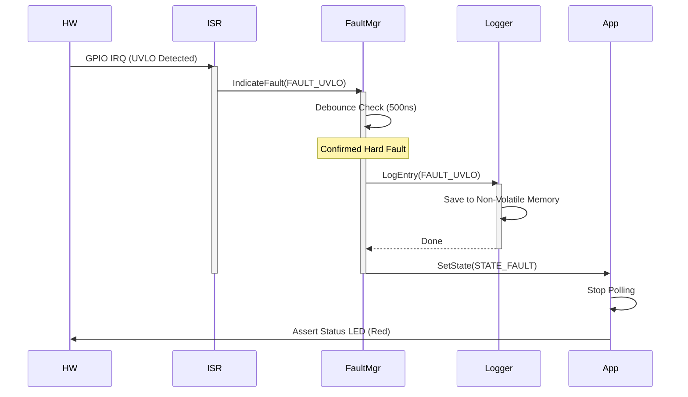

# Software Design Document (SDD) for rf1
**IEEE 1016-2009 Compliant**

**Project:** rf1
**Version:** 1.0
**Date:** 2026-03-23
**Status:** DRAFT
**Author:** Senior Embedded Software Architect

---

# 1. Introduction

## 1.1 Purpose
This Software Design Document (SDD) describes the architectural and detailed design of the firmware for the **rf1 Embedded Monitor and Control System**. It defines the software structure, component interactions, data structures, and algorithms required to implement the requirements specified in the **rf1 SRS (v1.0)**. The design targets a Cortex-M4 microcontroller (e.g., TI TM4C) and emphasizes MISRA-C compliance, determinism, and safety.

## 1.2 Scope
The firmware scope includes the monitoring of a multi-rail DC-DC converter (48V -> 12V/5V/3.3V). The software does **not** perform closed-loop PWM control, which is handled by external analog controllers (LT8645S, LM25145). The software is responsible for:
1.  **Telemetry:** Acquisition of voltage, current, and temperature data via SPI and ADC.
2.  **Fault Management:** Hardware signal debouncing (UVLO, OCP) and non-volatile log storage.
3.  **Communication:** Asynchronous status reporting via UART.
4.  **Supervisory:** Watchdog management and LED status indication.

## 1.3 Definitions
*   **ADC:** Analog-to-Digital Converter.
*   **DMA:** Direct Memory Access.
*   **FSM:** Finite State Machine.
*   **HAL:** Hardware Abstraction Layer.
*   **MISRA-C:** Motor Industry Software Reliability Association C coding guidelines.
*   **OOP:** Over-Current Protection.
*   **PG:** Power Good.
*   **SFR:** Special Function Register.
*   **UVLO:** Under-Voltage Lockout.
*   **WDT:** Watchdog Timer.

## 1.4 References
1.  **rf1 SRS (v1.0):** Software Requirements Specification.
2.  **rf1 HRS (v1.0):** Hardware Requirements Specification.
3.  **rf1 GLR (v1.0):** Glue Logic Requirements (I/O Timing).
4.  **IEEE 1016-2009:** Standard for Information Technology—Systems Design—Software Design Descriptions.
5.  **MISRA-C:2012:** Guidelines for the use of the C language in critical systems.

---

# 2. Design Viewpoints

## 2.1 Context Viewpoint
The firmware (System Under Design) acts as a bridge between the Host System (user/ATE) and the Power Hardware. It queries the hardware and aggregates data for the host.



## 2.2 Composition Viewpoint
The software is decomposed into three primary layers and a shared kernel.

*   **Hardware Abstraction Layer (HAL):** Drivers for SPI, UART, GPIO, DMA.
*   **Middleware:** Sensor driver (SPI ADC), Fault Manager (Debouncing), Circular Buffer.
*   **Application Layer:** Main State Machine (FSM), CLI Parser, Data Logger.

```mermaid
componentDiagram
    title rf1 Composition Viewpoint
    
    component "Application Layer" {
        component MainFSM
        component CLI_Parser
        component DataLogger
    }

    component "Middleware Layer" {
        component SensorDriver
        component FaultManager
        component CircBuffer
    }

    component "HAL Layer" {
        component SPI_Driver
        component UART_Driver
        component GPIO_Driver
        component WDT_Driver
    }

    MainFSM -- SensorDriver : triggers read
    MainFSM -- FaultManager : checks status
    MainFSM -- DataLogger : logs events
    CLI_Parser -- UART_Driver : RX/TX
    
    SensorDriver -- SPI_Driver : read/write
    FaultManager -- GPIO_Driver : read pins
    WDT_Driver -- MainFSM : kick
```

## 2.3 Logical Viewpoint
The static structure defines the core objects used for telemetry and configuration.



## 2.4 Dependency Viewpoint
Modules must be initialized in a specific order. The circular dependencies are avoided to prevent static initialization issues.

*   **Build Order:**
    1.  HAL (Low-level drivers)
    2.  Utilities (CircBuffer)
    3.  Middleware (Sensor, Fault)
    4.  Application (FSM, CLI)



## 2.5 Interface Viewpoint
This section details the C interfaces (APIs), Data Structures, and Hardware Register Macros.

### 2.5.1 Data Structures (MISRA-C Compliant)

```c
#include <stdint.h>
#include <stdbool.h>

/**
 * @brief Analog Rail Enumeration
 */
typedef enum {
    RAIL_VIN      = 0u,
    RAIL_12V      = 1u,
    RAIL_5V       = 2u,
    RAIL_3V3      = 3u,
    RAIL_MAX      = 4u
} RailId_e;

/**
 * @brief System Fault Codes
 */
typedef enum {
    FAULT_NONE       = 0x00u,
    FAULT_UVLO       = 0x01u, /* Input Under Voltage */
    FAULT_OCP_12V    = 0x02u, /* 12V Over Current */
    FAULT_OCP_5V     = 0x04u, /* 5V Over Current */
    FAULT_OCP_3V3    = 0x08u, /* 3.3V Over Current */
    FAULT_OTP        = 0x10u, /* Over Temperature */
    FALT_WDT_EXPIRED = 0x80u  /* Watchdog Trip */
} FaultCode_e;

/**
 * @brief Telemetry Sample Structure
 * @details Aligned to 4-byte boundary for DMA compatibility
 */
typedef struct {
    uint32_t timestamp_ms;       /* Time stamp */
    uint16_t raw_counts[4];      /* Raw ADC values: Vin, 12V, 5V, 3.3V */
    int16_t  temp_counts;        /* Raw Temp Sensor value */
    uint8_t  fault_flags;        /* Current active faults */
    uint8_t  padding;            /* Reserved for alignment */
} TelemetrySample_t;

/**
 * @brief Fault Log Entry
 */
typedef struct {
    uint32_t timestamp;
    FaultCode_e code;
    uint16_t aux_data;           /* e.g. Voltage level at fault time */
} FaultLog_t;
```

### 2.5.2 Function Prototypes

```c
/**
 * @brief Initialize the Main Application
 * @param config Pointer to configuration structure
 * @return 0 on success, -1 on failure
 */
int32_t App_Init(const SystemConfig_t* config);

/**
 * @brief Main Loop Handler
 * @details Must be called continuously in the while(1) loop
 */
void App_Run(void);

/**
 * @brief Sensor Driver API
 */
void Sensor_Init(void);
bool Sensor_ReadRail(RailId_e rail, float* result);
uint16_t Sensor_ReadRaw(RailId_e rail);

/**
 * @brief Fault Manager API
 */
void FaultMgr_Init(void);
void FaultMgr_Update(void); /* Called every 10ms */
void FaultMgr_Clear(void);
bool FaultMgr_IsActive(void);
```

### 2.5.3 Register Access Macros
Based on the GLR/HRS provided (assuming TI TM4C TivaWare or ARM CMSIS style).

```c
/* --- Base Assumptions based on typical ARM Cortex-M4 --- */
#define GPIO_PORTA_BASE       0x40004000U
#define GPIO_O_DATA           0x00000000U
#define SPI0_BASE             0x40008000U

/* Hardware Register Map for SPI Sensor (e.g. ADS7042 mapping) */
#define SPI_SENSOR_CS_BASE    GPIO_PORTA_BASE
#define SPI_SENSOR_CS_PIN     (1U << 3U)

/* Macros for accessing Hardware (MISRA compliant function-like macros) */
#define REG32(addr)           (*(volatile uint32_t *)(addr))
#define SPI_CS_LOW()          do { REG32(SPI_SENSOR_CS_BASE) &= ~(SPI_SENSOR_CS_PIN); } while(0)
#define SPI_CS_HIGH()         do { REG32(SPI_SENSOR_CS_BASE) |= (SPI_SENSOR_CS_PIN); } while(0)

/* Analog Front End Scaling Factors (derived from HRS) */
/* V_in: 0-60V scaled to 0-3.3V via Divider. 12-bit ADC. */
#define ADC_SCALE_VIN         (60.0f / 4095.0f) 
#define ADC_SCALE_12V         (15.0f / 4095.0f)
```

## 2.6 Interaction Viewpoint
Sequence diagrams for the primary use cases: **Startup**, **Telemetry Polling**, and **Fault Handling**.

### 2.6.1 System Startup Sequence



### 2.6.2 Telemetry Acquisition Sequence
Demonstrating the blocking SPI read (as requested by GLR timing constraints).



### 2.6.3 Fault Handling Sequence



## 2.7 State Viewpoint
The Main Application operates as a Finite State Machine (FSM).

```mermaid
stateDiagram-v2
    [*] --> Init: Power On Reset

    state Init {
        [*] --> HAL_Init
        HAL_Init --> Load_Params
        Load_Params --> Idle
    }

    state Idle {
        [*] --> WaitForTick
        WaitForTick --> Idle
    }

    state Run {
        [*] --> Poll_Telemetry
        Poll_Telemetry --> Process_Data
        Process_Data --> Check_WDT
        Check_WDT --> Poll_Telemetry
    }

    state Fault {
        [*] --> Log_Error
        Log_Error --> Safe_Shutdown
        Safe_Shutdown --> Latched: Wait for Reset
    }

    Init --> Run: Config OK
    
    Run --> Fault: Hardware Fault Detected
    Run --> Idle: Host Command "Stop"
    
    Fault --> [*]: Power Cycle
```

## 2.8 Algorithm Viewpoint

### 2.8.1 Sensor Data Acquisition
The firmware uses a synchronous blocking SPI transfer to ensure deterministic timing per the GLR constraints (10ns Setup/Hold). 
**Algorithm:** 
1.  Wait for ADC conversion time (approx 5us).
2.  Pull CS Low.
3.  Transmit 2 bytes (0x00, 0x00) while receiving 16-bit data.
4.  Pull CS High.
5.  Convert raw 16-bit integer to float using engineering constants.

### 2.8.2 Fault Debouncing
To prevent noise from triggering false OCP/UVLO faults:
**Algorithm:**
1.  ISR triggered on falling edge of Fault Pin.
2.  ISR disables interrupts and starts a hardware timer (e.g., 10us).
3.  Timer ISR samples the pin.
4.  If Pin is High -> Noise (ignore).
5.  If Pin is Low -> Valid Fault (Latch FSM).

### 2.8.3 Main Loop Control
```c
while (1)
{
    if (sysTickFlag == true)
    {
        sysTickFlag = false;
        
        /* 1. Kick Watchdog */
        WDT_Kick();
        
        /* 2. Check Faults */
        FaultMgr_Update();
        if (FaultMgr_IsActive())
        {
            FSM_Transition(STATE_FAULT);
            continue;
        }
        
        /* 3. Execute State Machine */
        switch (SystemState)
        {
            case STATE_RUN:
                Sensor_UpdateAll();
                CLI_ProcessInput();
                break;
            case STATE_FAULT:
                /* Latched state, do nothing */
                break;
            default:
                break;
        }
    }
}
```

---

# 3. Design Rationale

**1. Polling vs. Interrupt for Telemetry:**
The SRS requires periodic polling (10ms frequency). Using a timer-based polling approach in the main loop is preferred over DMA-driven Continuous mode for this specific application to simplify synchronization with the CLI and Fault logic. The load (approx 1ms every 10ms) is low enough (<10% CPU) that the complexity of asynchronous DMA buffers is not justified.

**2. SPI Frequency (10 MHz):**
Per the GLR, the max SPI CLK is 10 MHz. The design configures the SPI peripheral for 8 MHz to provide a comfortable timing margin (Setup/Hold times) accounting for trace delays and GPIO slew rates.

**3. MISRA-C Compliance:**
Strict adherence to MISRA-C:2012 is mandated. This dictates the use of fixed-width integer types (`uint32_t`, `uint16_t`), explicit casting where implicit promotions might occur, and the avoidance of recursive function calls.

**4. State Machine Selection:**
A simple switch-case based State Machine is chosen over a function pointer table to enhance readability and code maintainability for future engineers debugging the system.

---

# 4. Traceability

| ID | Requirement (SRS Ref) | Design Element |
|----|-----------------------|----------------|
| **REQ-SW-001** | Monitor Vin, Vout(12V, 5V, 3.3V), Iout | `TelemetrySample_t` struct, `SensorDriver` module |
| **REQ-SW-002** | Detect UVLO (<36V) | `FaultMgr_Update()`, GPIO ISR in HAL |
| **REQ-SW-003** | Log OCP Faults | `FaultLog_t`, `Logger` module |
| **REQ-SW-004** | Host Communication via UART | `CLI_Parser`, `UART_Driver` |
| **REQ-SW-005** | MISRA-C Compliance | Defined in Section 3, Coding Rules |
| **REQ-SW-006** | Watchdog Timer | `WDT_Kick()` in Main Loop |
| **REQ-SW-007** | SPI Timing < 10MHz | `SPI_Init()` configuration limiting PCLK |
| **REQ-SW-008** | Fault Debouncing | `FaultMgr` Debounce Algorithm |