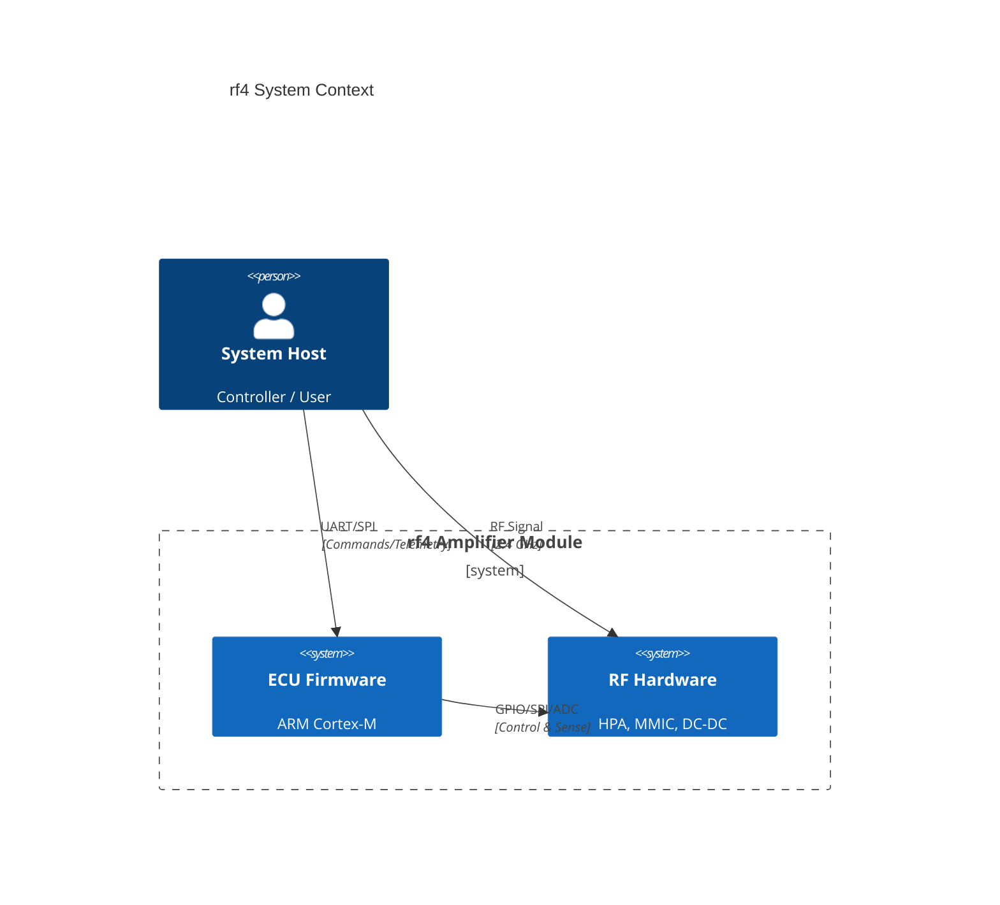
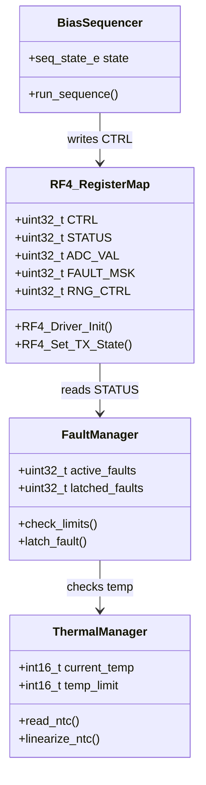
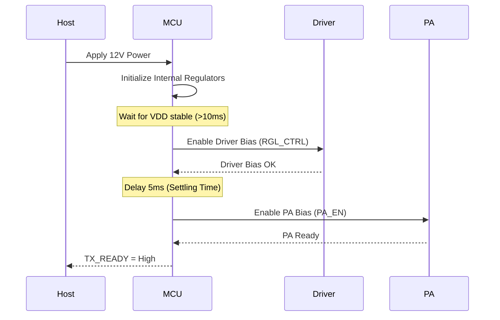
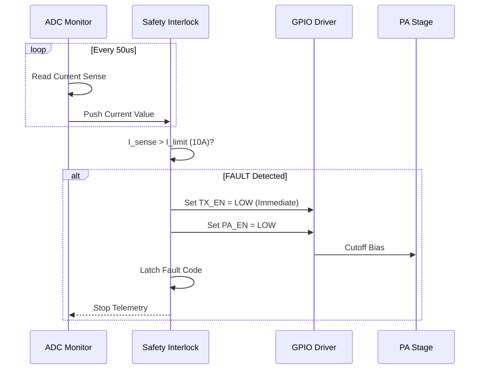
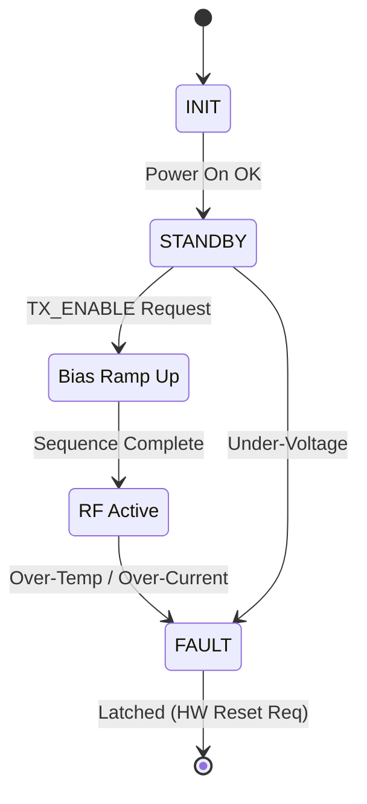

# SOFTWARE DESIGN DOCUMENT (SDD)
**Project:** rf4 High-Power RF Amplifier Firmware
**Version:** 1.0
**Date:** 2026-03-24
**Status:** DRAFT
**Standard:** IEEE 1016-2009

---

# 1. Introduction

## 1.1 Purpose
This document describes the software architecture and detailed design of the **rf4** embedded control firmware. It defines the structural decomposition, data structures, algorithms, and interfaces required to implement the requirements specified in the **rf4 SRS**. This document serves as the blueprint for implementation, unit testing, and maintenance.

## 1.2 Scope
The design covers the firmware executing on the ARM Cortex-M microcontroller (ECU). It includes:
*   Hardware Abstraction Layer (HAL) for GPIO, ADC, and SPI communication.
*   The Safety Interlock Logic (SIL) module for real-time fault detection.
*   Bias Sequencing logic for Driver and PA stages.
*   Telemetry acquisition and protocol handling.
*   Exclusions: Bootloader logic and PC-side host application.

## 1.3 Definitions
*   **BCD:** Bipolar-CMOS-DMOS (Process technology, often implies specific ESD concerns).
*   **GLR:** Glue Logic Requirements (Hardware mapping).
*   **LUT:** Look-Up Table (Used for NTC thermistor linearization).
*   **PFM:** Pulse Frequency Modulation.
*   **PWM:** Pulse Width Modulation.
*   **SOE:** Sequencing of Events (Power-up/Power-down order).

## 1.4 References
1.  **rf4 Software Requirements Specification (SRS)**, Rev 1.0, 2026-03-24.
2.  **rf4 Glue Logic Requirements (GLR - P6)**, Rev 1.0.
3.  **rf4 Hardware Requirements Specification (HRS - P2)**, Rev DRAFT.
4.  **MISRA-C:2012** Guidelines for the use of the C language in critical systems.

---

# 2. Design Viewpoints

## 2.1 Context Viewpoint
The rf4 ECU acts as a safety-critical controller bridging the Host System and the RF Power Hardware. It manages energy flow and ensures operational parameters remain within the Safe Operating Area (SOA).



## 2.2 Composition Viewpoint
The firmware is decomposed into a layered architecture. The Hardware Abstraction Layer (HAL) isolates the application logic from register-level manipulations defined in the GLR.

```mermaid
componentDiagram
    namespace rf4 Firmware {
        component "Main Control Loop" as Main
        component "Safety Interlock" as SIL
        component "Bias Sequencer" as SEQ
        component "Telemetry Manager" as TLM
        component "Driver Layer" as DRV
    }

    namespace "Hardware (Per GLR)" {
        component "GPIO" as GPIO
        component "ADC" as ADC
        component "SPI" as SPI
    }

    Main --> SIL : Monitors
    Main --> SEQ : Commands
    Main --> TLM : Requests Data
    SIL --> DRV : Reacts (100us)
    SEQ --> DRV : Sequences
    TLM --> DRV : Reads
    
    DRV -- GPIO : Control/Status
    DRV -- ADC : Voltage/Temp
    DRV -- SPI : Sensor Config
```

## 2.3 Logical Viewpoint
This section details the static class structure. C structs are used to model the Hardware Register Map and NTC Look-Up Tables (LUT).



### 2.3.1 Data Structure Definitions (C/C++)

#### 2.3.1.1 Hardware Register Map (MISRA-C Compliant)
```c
/**
 * @brief rf4 Hardware Register Map Definition
 * Base Address: 0x40000000 (AHB1 Peripheral)
 * Alignment: 32-bit
 */
typedef struct
{
    volatile uint32_t CTRL;      /**< 0x00: Control Register (R/W) */
    volatile uint32_t STATUS;    /**< 0x04: Status Register (R Only) */
    volatile uint32_t ADC_VAL;   /**< 0x08: ADC Data Register (R/W) */
    volatile uint32_t FAULT_MSK; /**< 0x0C: Fault Mask Register (R/W) */
    volatile uint32_t RNG_CTRL;  /**< 0x10: Regulator Enable GPIOs (R/W) */
    uint32_t RESERVED;           /**< 0x14: Reserved for future use */
} rf4_hw_regs_t;

#define RF4_BASE_PTR ((rf4_hw_regs_t *) 0x40000000U)

/* Control Register Bit Fields */
#define RF4_CTRL_TX_EN_POS    0U
#define RF4_CTRL_TX_EN_MSK    (1UL << RF4_CTRL_TX_EN_POS)
#define RF4_CTRL_RESET_POS    1U
#define RF4_CTRL_RESET_MSK    (1UL << RF4_CTRL_RESET_POS)

/* Status Register Bit Fields (Mapped to REQ-HW-017) */
#define RF4_STAT_OT_FAULT_POS 0U
#define RF4_STAT_OC_FAULT_POS 1U
#define RF4_STAT_UV_FAULT_POS 2U
```

#### 2.3.1.2 NTC Thermistor Lookup Table (LUT)
To optimize CPU cycles, fixed-point math and a lookup table are used for NTC linearization.

```c
/* NTC LUT Structure */
typedef struct {
    uint16_t adc_counts;  /* 12-bit ADC value */
    int16_t  temp_celsius; /* Temperature in 0.1 C */
} ntc_lut_entry_t;

/* Constant LUT stored in Flash */
static const ntc_lut_entry_t NTC_LUT[] = {
    { 4095U, -400 },  /* -40.0 C */
    { 3670U, -200 },  /* -20.0 C */
    { 3200U,   00 },  /*   0.0 C */
    { 2500U,  250 },  /*  25.0 C */
    { 1500U,  600 },  /*  60.0 C (Limit) */
    {  800U,  850 }   /*  85.0 C */
};
#define NTC_LUT_SIZE (sizeof(NTC_LUT) / sizeof(NTC_LUT[0]))
```

## 2.4 Dependency Viewpoint
The build order and module dependencies.

```mermaid
graph TD
    Main["main.c"] --> Fault["fault_manager.c"]
    Main --> Seq["bias_sequencer.c"]
    Main --> Telem["telemetry.c"]
    
    Fault --> Reg["rf4_register.c"]
    Seq --> Reg
    Telem --> Reg
    
    Reg --> HAL["hal_gpio.c", "hal_adc.c"]
    
    subgraph "Compiler / Arch"
        HAL
    end
```

## 2.5 Interface Viewpoint

### 2.5.1 Driver API (Public Interface)
These functions provide the interface layer between the Application Logic and Hardware.

```c
/**
 * @brief Initialize the rf4 control logic and GPIOs.
 * @return int32_t 0 on success, -1 on HAL failure.
 * @req REQ-SW-001
 */
int32_t RF4_Driver_Init(void);

/**
 * @brief Enable or Disable the RF Chain.
 * @param enable uint8_t: 1 to transmit, 0 to shutdown.
 * @req REQ-SW-004
 */
void RF4_Set_TX_State(uint8_t enable);

/**
 * @brief Read current system status.
 * @param status uint32_t*: Pointer to store status register value.
 * @req REQ-SW-010
 */
void RF4_Get_Status(uint32_t* status);

/**
 * @brief Read temperature from NTC sensor.
 * @return int16_t Temperature in Celsius (Scaled by 10).
 * @req REQ-SW-007
 */
int16_t RF4_Get_Temperature(void);

/**
 * @brief Non-blocking check for latched faults.
 * @return uint32_t Bitmask of active faults.
 */
uint32_t RF4_Check_Faults(void);
```

### 2.5.2 SPI Interface Definition
Derived from GLR Section 2 & 4.

| Parameter | Value | Constraint |
| :--- | :--- | :--- |
| **Mode** | CPOL=0, CPHA=0 | Motorola SPI Frame Format |
| **Clock Freq** | 10 MHz | Max frequency per GLR |
| **Frame Size** | 8-bit | |
| **Timeout** | 5 ms | Watchdog trigger |

## 2.6 Interaction Viewpoint
### 2.6.1 Power-Up Sequence
Ensuring the Driver (MMIC) is enabled before the PA (HPA) to prevent instability.



### 2.6.2 Fault Response Sequence
Real-time reaction to Over-Current (OC).



## 2.7 State Viewpoint
The main state machine governing the operational modes.



### 2.7.1 State Definitions (C Enum)
```c
typedef enum {
    RF4_STATE_INIT = 0U,
    RF4_STATE_STANDBY,
    RF4_STATE_WARMUP,
    RF4_STATE_TX_ON,
    RF4_STATE_FAULT
} rf4_system_state_e;
```

## 2.8 Algorithm Viewpoint
### 2.8.1 Temperature Linearization (Interpolation)
Since ADC values are discrete and NTCs are non-linear, linear interpolation is used between LUT points.

**Pseudocode:**
```text
FUNCTION Get_Temperature(adc_reading)
    IF adc_reading <= LUT[0].adc THEN RETURN LUT[0].temp
    IF adc_reading >= LUT[MAX].adc THEN RETURN LUT[MAX].temp

    FOR i = 0 to MAX-1
        IF LUT[i].adc >= adc_reading THEN
            // Perform linear interpolation
            x1 = LUT[i-1].adc
            x2 = LUT[i].adc
            y1 = LUT[i-1].temp
            y2 = LUT[i].temp
            
            slope = (y2 - y1) / (x2 - x1)
            temp = y1 + slope * (adc_reading - x1)
            RETURN temp
        END IF
    END FOR
END FUNCTION
```

### 2.8.2 Moving Average Filter (ADC Smoothing)
To prevent noise from triggering false faults, a rolling average filter is applied to current measurements.

```c
/* Filter Configuration */
#define ADC_WINDOW_SIZE 8U

typedef struct {
    uint16_t buffer[ADC_WINDOW_SIZE];
    uint8_t index;
    uint32_t sum;
    bool filled;
} moving_avg_filter_t;

/**
 * @brief Update moving average filter with new sample.
 * @param filt Pointer to filter struct.
 * @param input New ADC raw sample.
 * @return uint16_t Filtered average.
 */
uint16_t Filter_Update(moving_avg_filter_t* filt, uint16_t input)
{
    /* Subtract oldest sample from sum */
    filt->sum -= filt->buffer[filt->index];
    
    /* Add new sample */
    filt->buffer[filt->index] = input;
    filt->sum += input;
    
    /* Move index */
    filt->index++;
    if (filt->index >= ADC_WINDOW_SIZE)
    {
        filt->index = 0U;
        filt->filled = true;
    }
    
    /* Calculate Average */
    if (filt->filled)
    {
        return (uint16_t)(filt->sum / ADC_WINDOW_SIZE);
    }
    else
    {
        /* Partial fill: divide by current index count */
        return (uint16_t)(filt->sum / (filt->index + 1U));
    }
}
```

---

# 3. Design Rationale

### 3.1 Architecture Choice
**Why a Layered Architecture?**
The rf4 system requires strict separation between safety-critical logic and hardware manipulation. A layered approach allows the Safety Interlock Logic (SIL) to be unit tested independently of the actual hardware registers. This aligns with **REQ-SW-006** (Safety) and facilitates MISRA-C compliance.

### 3.2 Trade-offs
*   **Speed vs. Memory:** Using a lookup table (LUT) for thermistor linearization consumes Flash memory (approx. 64 bytes) but saves significant CPU cycles compared to floating-point `log()` functions. Given the 100 µs fault response requirement, the LUT approach was chosen.
*   **Polled vs. Interrupt ADC:** While interrupts are more efficient for high frequency, the polling approach in the main loop (50 µs period) guarantees that the ADC is read *before* the safety check runs, preventing race conditions without complex mutexes.

### 3.3 Compliance Strategy
*   **MISRA-C:** All pointer arithmetic is encapsulated in the driver layer. Dynamic memory allocation (malloc) is strictly banned.
*   **Timing:** The main loop is designed to execute in < 50 µs on a 170 MHz Cortex-M4, ensuring a 2x safety margin over the 100 µs fault requirement.

---

# 4. Traceability

| Design Element | ID | Mapped Requirement | Rationale |
| :--- | :--- | :--- | :--- |
| `rf4_hw_regs_t::CTRL` | REQ-SW-002 | Control hardware enable pins | Provides direct mapping to GLR 0x00 register. |
| `RF4_Driver_Init` | REQ-SW-001 | Initialize system | Startup procedure. |
| `RF4_Check_Faults` | REQ-SW-006 | Detect Over-Current/Temp | Core safety logic. |
| `Filter_Update` | REQ-SW-007 | Read Temperature (with smoothing) | Reduces noise on telemetry. |
| `WARMUP` State | REQ-SW-004 | Enable/Disable RF Chain | Implements sequencing timing. |
| `RF4_Get_Temperature` | REQ-SW-010 | Telemetry reporting | Data acquisition for host. |