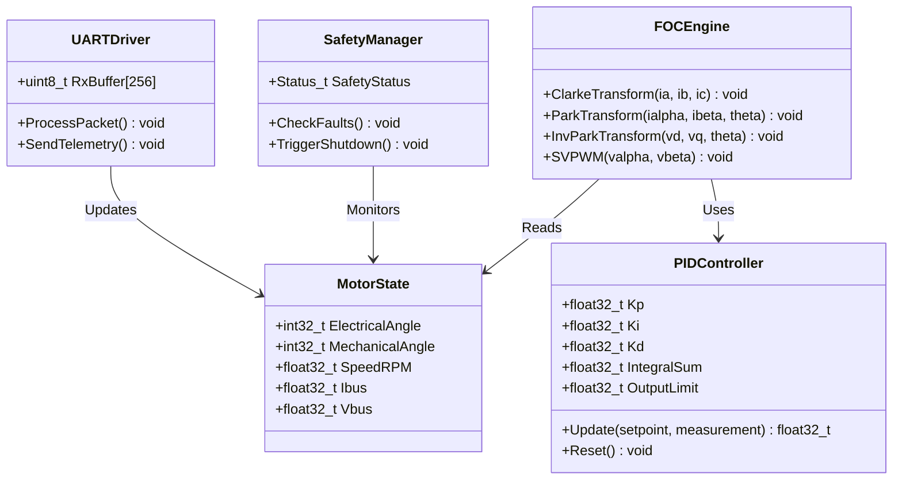
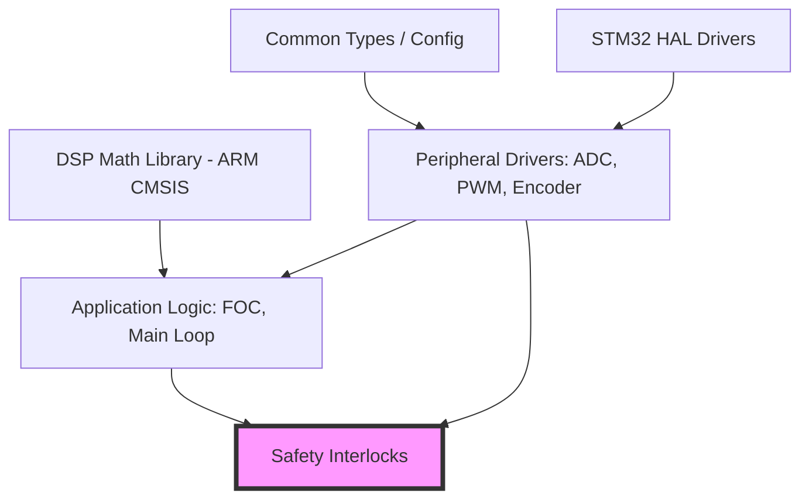
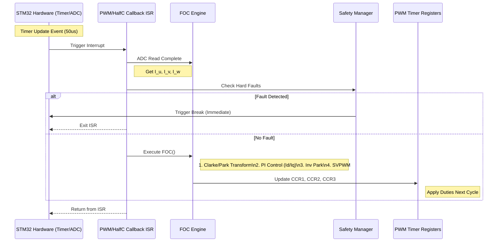
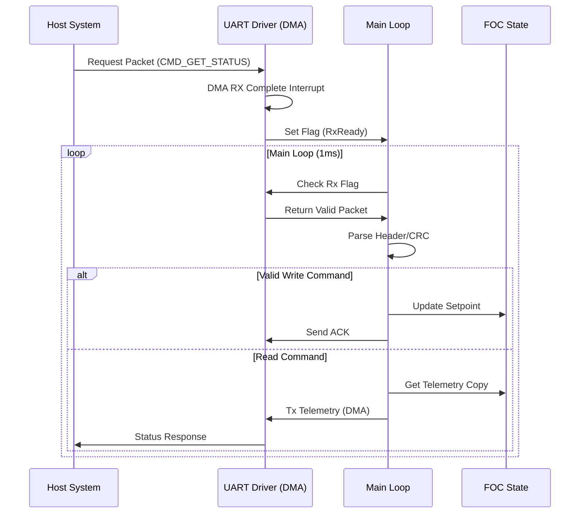
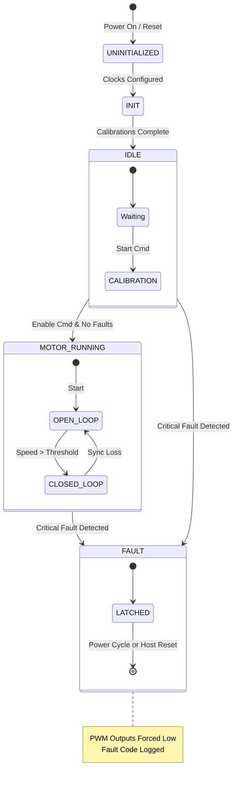

# SOFTWARE DESIGN DOCUMENT (SDD)

**Project:** rf44 10kW BLDC Controller
**Version:** 1.0
**Date:** 2026-03-27
**Status:** Preliminary
**Standard:** IEEE 1016-2009

---

# 1. Introduction

## 1.1 Purpose
This Software Design Document (SDD) describes the architecture and detailed design of the **rf44** embedded firmware. It translates the Software Requirements Specification (SRS) into a structured implementation plan, defining data structures, algorithms, interfaces, and state machines. The goal is to provide a blueprint for the development of safe, MISRA-C compliant firmware capable of 10kW 3-phase motor control.

## 1.2 Scope
The design covers the complete software stack running on the STM32F405RGT6 microcontroller. This includes the Hardware Abstraction Layer (HAL), the Field-Oriented Control (FOC) application logic, the communication protocol handler, and the safety management system.

## 1.3 Definitions
*   **Duty Cycle:** Ratio of pulse duration to the total PWM period ($0.0$ to $1.0$).
*   **Clarke/Park:** Mathematical transforms converting 3-phase stationary quantities ($ABC$) to 2-phase rotating reference frame quantities ($DQ$).
*   **SVPWM:** Space Vector Pulse Width Modulation technique for generating 3-phase voltage.
*   **ISR:** Interrupt Service Routine.

## 1.4 References
1.  **rf44 SRS**, Software Requirements Specification (Rev 1.0).
2.  **rf44 HRS**, Hardware Requirements Specification (Rev 1.0).
3.  **STMicroelectronics**, RM0090 Reference Manual STM32F405/415, RGxxxx.
4.  **MISRA-C:2012**, Guidelines for the use of the C language in critical systems.

---

# 2. Design Viewpoints

## 2.1 Context Viewpoint

The **rf44** software operates as the central control unit within the power electronics ecosystem. It interfaces with an external Host Controller (via RS-485), a 3-Phase Inverter (Power Stage), position sensors (Encoder), and the auxiliary power supply monitoring circuits.

**System Context Entities:**
1.  **Host System:** Sends velocity/torque setpoints and receives telemetry.
2.  **Power Inverter:** 3-phase bridge (DirectFETs) receiving PWM signals.
3.  **Motor:** 10kW BLDC/PMSM load.
4.  **Position Sensor:** Magnetic encoder (ABI or SPI).

```mermaid
C4Context
    title rf44 System Context
    Person(host, "Host System / Operator")
    System_Boundary(rf44_boundary, "rf44 Controller"){
        System(rf44_fw, "STM32F405 Firmware")
    }
    SystemU(power_stage, "3-Phase Inverter\n(48V->3ph AC)")
    SystemU(motor, "10kW BLDC Motor")
    SystemU(sensors, "Position &\nTemp Sensors")

    Rel(host, rf44_fw, "UART/RS-485\n(115200 8N1)", "Setpoint / Telemetry")
    Rel(rf44_fw, power_stage, "PWM Timer (20kHz)", "Gate Signals")
    Rel(power_stage, motor, "300V Phases", "Current/Torque")
    Rel(rf44_fw, sensors, "SPI / GPIO / ADC", "Feedback")
```

## 2.2 Composition Viewpoint

The firmware is decomposed into distinct subsystems to ensure separation of concerns. The **Safety Layer** monitors the **Application Layer** (FOC) and the **Hardware Layer**.

**Modules:**
*   **MCU Core (HAL):** Drivers for STM32 peripherals (Clock, GPIO, NVIC).
*   **Sensing:** ADC acquisition and Encoder decoding.
*   **FOC Engine:** Math transforms and PID control loops.
*   **PWM Driver:** Timer configuration and SVPWM generation.
*   **Safety Manager:** Fault detection and hardware shutdown logic.
*   **Comms:** UART packet parsing and telemetry generation.

```mermaid
componentDiagram
    namespace Hardware {
        component [STM32F405] {
            component [Timer 1] as TIM1
            component [ADC 1-3] as ADCs
            component [UART 3] as UART
            component [SPI 1] as SPI
        }
    }

    component [Main Application] {
        component [Safety Manager] as SAFETY
        component [FOC Engine] as FOC
        component [Comm Handler] as COMMS
    }

    component [Drivers] {
        component [PWM Driver] as PWM
        component [Sensor Fusion] as SENSORS
        component [Protocol] as PROT
    }

    FOC --> SENSORS : Request [I_u, I_v, Theta]
    FOC --> PWM : Demand [Duty A, B, C]
    SAFETY --> FOC : Enable/Disable
    SAFETY --> ADCs : Monitor Overcurrent
    SAFETY --> TIM1 : Trigger Break
    COMMS --> PROT : Parse Packets
    COMMS --> FOC : Update Setpoint
```

## 2.3 Logical Viewpoint

This section defines the key classes and structures. The design utilizes strict data typing for MISRA compliance.

**Design Patterns:**
*   *Singleton:* Global `SystemState` structure.
*   *Strategy:* `ControlMode_t` allows switching between Open Loop, Speed, and Torque control.



## 2.4 Dependency Viewpoint

The build order is structured to minimize circular dependencies. The `Common` module contains type definitions used by all higher layers.



## 2.5 Interface Viewpoint

### 2.5.1 Data Structures

**Requirement Mapping:** `REQ-SW-001`, `REQ-SW-002` (Derived from HRS Voltage/Current definitions).

All physical units are converted to Standard International (SI) units (Volts, Amps, Rad/s) internally.

```c
#include <stdint.h>
#include <stdbool.h>
#include "stm32f4xx.h"

/* MISRA-C Compliant Type Definitions */
typedef float float32_t;
typedef double float64_t;

/**
 * @brief Motor Phase Currents (Amps)
 */
typedef struct {
    float32_t I_u; /* Phase U Current */
    float32_t I_v; /* Phase V Current */
    float32_t I_w; /* Phase W Current (Derived or Measured) */
} PhaseCurrents_t;

/**
 * @brief Bus Voltages and Temperatures
 */
typedef struct {
    float32_t V_bus;      /* DC Bus Voltage (Volts) */
    float32_t Temp_heatsink; /* Degrees Celsius */
    float32_t Temp_motor; /* Degrees Celsius (Estimate) */
} SystemMetrics_t;

/**
 * @brief Control Setpoints
 */
typedef struct {
    float32_t TargetVelocity_rad_s; /* Target Speed in rad/s */
    float32_t TargetTorque_Nm;      /* Target Torque (for Torque control mode) */
    uint8_t  ControlMode;           /* 0=Idle, 1=Speed, 2=Torque */
} Setpoints_t;

/**
 * @brief Main System State Singleton
 */
typedef struct {
    PhaseCurrents_t Currents;
    SystemMetrics_t Metrics;
    Setpoints_t     Setpoints;
    uint32_t        Timestamp_us; /* Microsecond timestamp */
    bool            FaultActive;
    uint16_t        FaultCode;
} SystemState_t;

extern SystemState_t g_sysState; /* Global declaration */
```

### 2.5.2 Function Prototypes

**Module: FOC Engine**
```c
/**
 * @brief Initializes the FOC engine, resets integrators.
 */
void FOC_Init(void);

/**
 * @brief Main FOC loop function. Call at 20kHz (PWM Rate).
 * @param pState Pointer to global system state.
 * @return 0 on success, -1 on Math domain error.
 */
int32_t FOC_Execute(SystemState_t* pState);

/**
 * @brief Sets the PWM duty cycles based on SVPWM calculation.
 * @param duty_a Duty cycle 0.0-1.0
 * @param duty_b Duty cycle 0.0-1.0
 * @param duty_c Duty cycle 0.0-1.0
 */
void FOC_SetDutyCycle(float32_t duty_a, float32_t duty_b, float32_t duty_c);
```

**Module: Safety Manager**
```c
typedef enum {
    SAFETY_OK = 0,
    SAFETY_ERR_OVERVOLTAGE = 1,
    SAFETY_ERR_UNDERVOLTAGE = 2,
    SAFETY_ERR_OVERCURRENT = 3,
    SAFETY_ERR_OVERTEMP = 4
} SafetyStatus_e;

/**
 * @brief Checks all hardware fault conditions.
 * Must be called cyclically.
 * @return SafetyStatus_e
 */
SafetyStatus_e SAFETY_Check(void);

/**
 * @brief Enters Latch state. Disables PWM and flags error.
 */
void SAFETY_TriggerShutdown(uint16_t fault_code);
```

**Module: Interface Communication (UART)**
```c
#define COMMS_BAUDRATE 115200
#define COMMS_TIMEOUT_MS 100

/**
 * @brief Processes incoming bytes from DMA buffer.
 * Parses binary protocol packets.
 */
void COMMS_ProcessRx(void);

/**
 * @brief Sends telemetry packet over UART.
 * Non-blocking implementation.
 */
void COMMS_SendTelemetry(SystemState_t* pState);
```

## 2.6 Interaction Viewpoint

### 2.6.1 High Speed Control Loop (FOC)
The critical timing path is the PWM interrupt. This sequence occurs at 20kHz (50us period).

*Requirements:* `REQ-SW-010` (Compute Budget < 40us), `REQ-SW-011` (Latency).



### 2.6.2 Communication Sequence
Host requests status; firmware responds.



## 2.7 State Viewpoint

The **rf44** firmware utilizes a hierarchical state machine. The top-level system state determines the availability of motor control functions.

*Requirements:* `REQ-SW-005` (Initialization), `REQ-SW-006` (Fault Handling).



## 2.8 Algorithm Viewpoint

### 2.8.1 SVPWM (Space Vector PWM)
The firmware uses the standard SVPWM sector calculation algorithm to synthesize the 3-phase voltage vector.
**Assumptions:** $V_{dc}$ is assumed constant within one cycle.

**Inputs:**
*   $V_\alpha, V_\beta$ (Volts)
*   $V_{bus}$ (Volts)

**Output:**
*   $T_{cm1}, T_{cm2}, T_{cm3}$ (Timer Compare values)

**Pseudocode:**
```text
1. Normalize V_alpha, V_beta against V_bus.
2. Determine Sector (1 to 6) using sign checks and atan2 or linear comparison.
3. Calculate intermediate times X, Y, Z based on sector formulas.
4. Calculate duty cycles T1, T2 (dwell times).
5. Apply Duty Cycle to TIM1 CCR registers:
   Tcm1 = (PWM_Period * (1.0 - T1 - T2 + Tphase1)) / 2
   ... (Apply vector rotation for symmetry)
```

### 2.8.2 PLL Observer for Position
If using an encoder (ABI), a Phase Locked Loop (PLL) filters the raw pulses to generate a smooth speed estimate.

**Inputs:** `RawTheta` (0-4095), `TimerTick`
**Outputs:** `Theta_Est` (float rad), `Speed_Est` (rad/s)

**Algorithm:**
1.  Calculate error between `RawTheta` and estimated theta.
2.  Normalize error to $[-\pi, \pi]$.
3.  PI Controller on Error -> Speed Estimate.
4.  Integrator on Speed Estimate -> Theta Estimate.

---

# 3. Design Rationale

The architecture follows a layered approach to balance safety and performance.

1.  **Layered Architecture:** Separating the Hardware Abstraction Layer (HAL) from the Application Logic (FOC) allows for automated Unit Testing of the math algorithms using native PC simulations (x86) before deploying to the target MCU.
2.  **Interrupt-Driven I/O:** UART and ADC rely on DMA. This ensures the CPU is never blocked waiting for data, guaranteeing the 20kHz control loop remains deterministic.
3.  **MISRA-C Compliance:** Strict adherence to MISRA rules prevents undefined behaviors common in C (e.g., integer promotion, pointer arithmetic) which is critical for a 10kW power system where software crashes can result in hardware destruction.
4.  **Hardware Break Logic:** Overcurrent protection is implemented in hardware (Timer Break input) as a primary defense, with software monitoring as a secondary defense.

---

# 4. Traceability

The following matrix maps SDD elements to the Software Requirements Specification (SRS) and Hardware Requirements Specification (HRS).

| ID | Design Element | Requirement Ref | Description |
| :--- | :--- | :--- | :--- |
| **D-001** | `FOC_Execute()` | `REQ-SW-003` | Real-time 20kHz FOC loop execution. |
| **D-002** | `AFE_Registers_t` | `REQ-HW-004` | Mapping of Phase Current ADC inputs. |
| **D-003** | `SAFETY_Check()` | `REQ-SW-006` | Software fault monitoring (Temp/Volt). |
| **D-004** | `TIM1->BDTR` | `REQ-HW-005` | Hardware PWM Break configuration for Overcurrent. |
| **D-005** | `FOC_SetDutyCycle()` | `REQ-SW-004` | SVPWM Modulation implementation. |
| **D-006** | `COMMS_ProcessRx()` | `REQ-SW-008` | RS-485 Setpoint handling. |
| **D-007** | `State: MOTOR_RUNNING` | `REQ-SW-002` | Operational state management. |
| **D-008** | `PIDController` | `REQ-SW-003` | Closed loop velocity/torque control. |
| **D-009** | `DRV_ADC_Init` | `REQ-SW-009` | ADC Offset calibration at startup. |