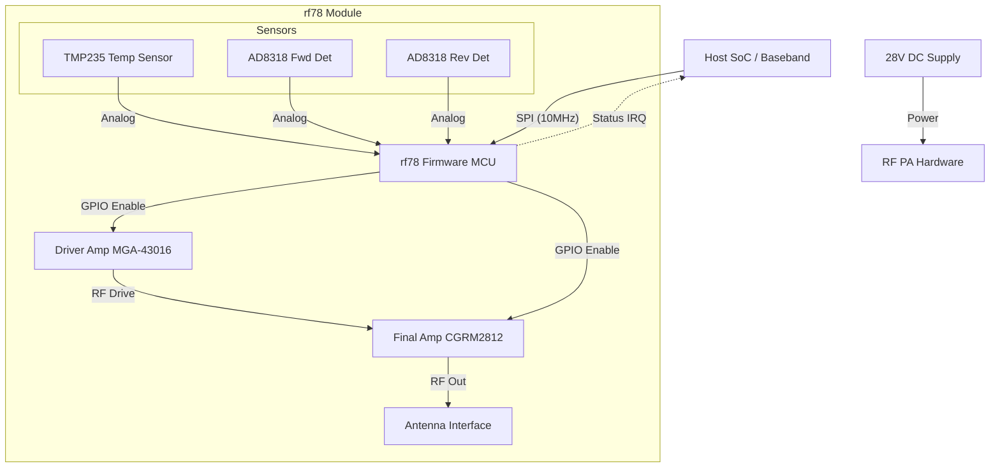
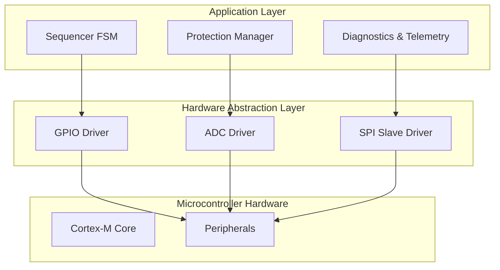
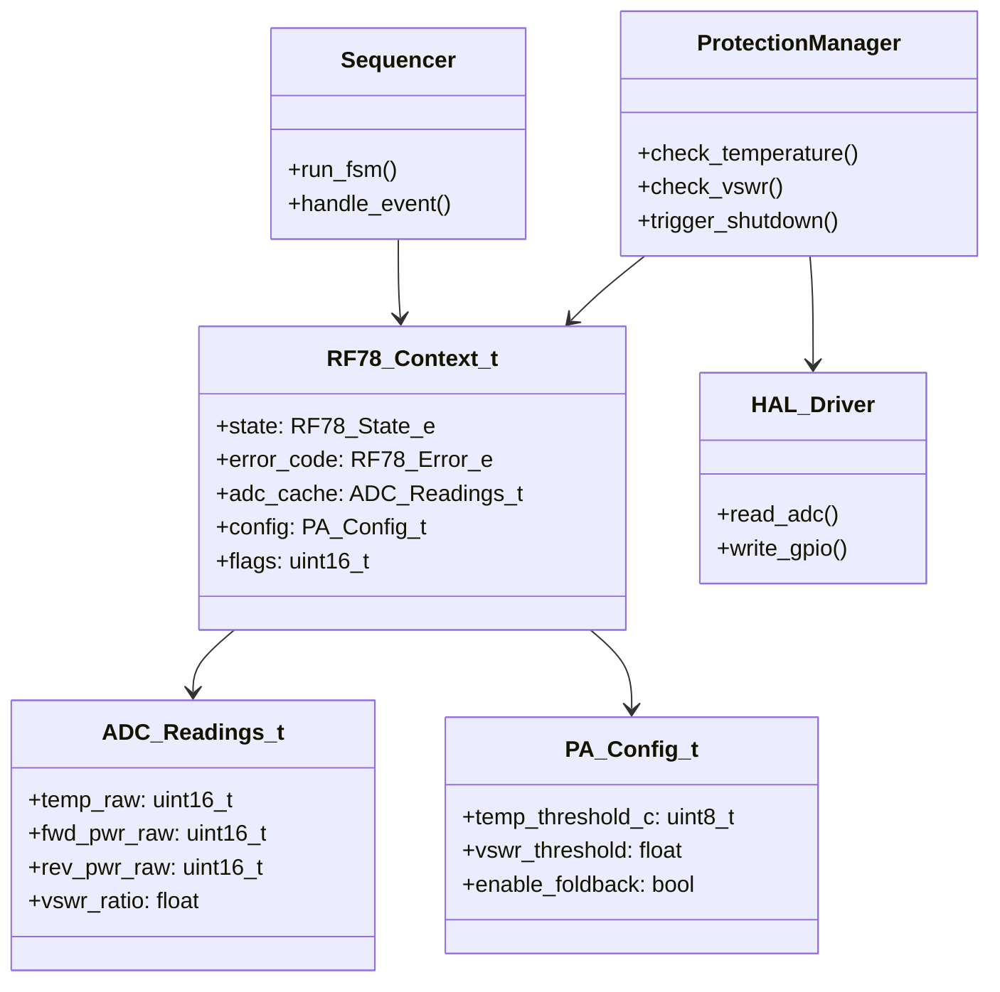
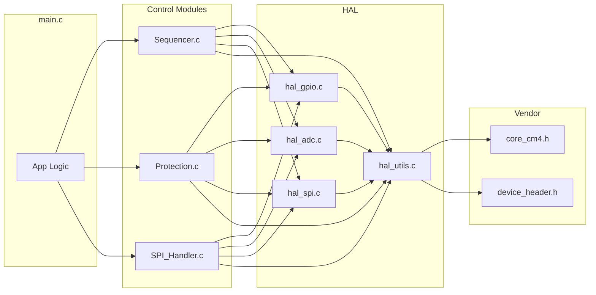
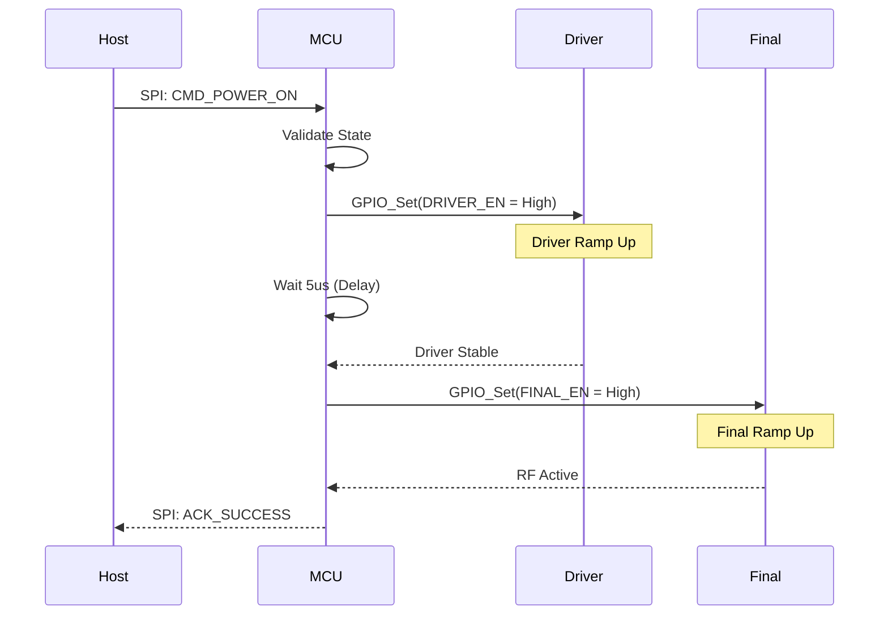
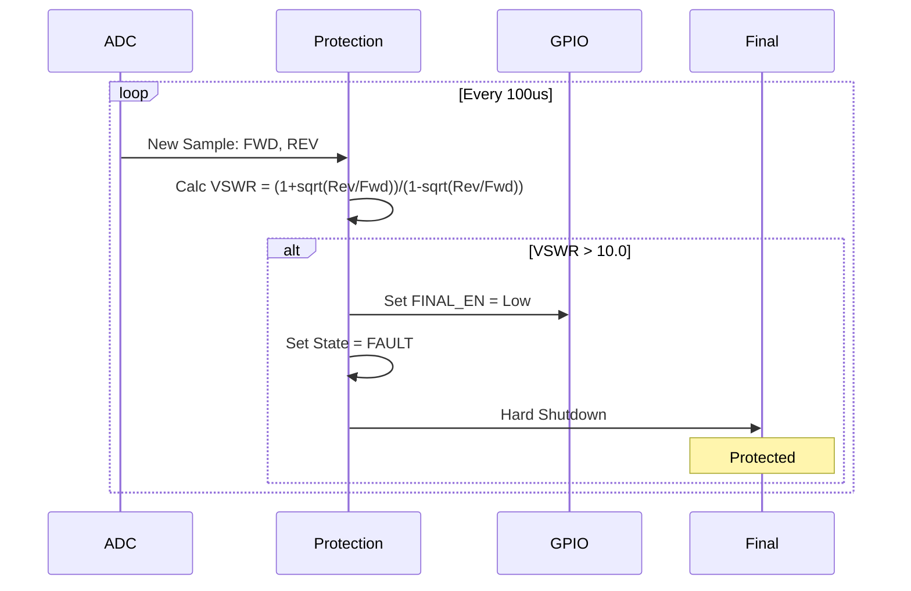
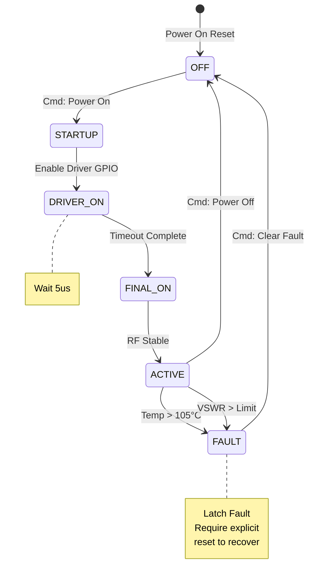

```markdown
# Software Design Document (SDD) for rf78

**Project:** rf78 RF Power Amplifier Controller  
**Document Version:** 1.0  
**Date:** 2026-04-01  
**Status:** AI-GENERATED  
**Standard:** IEEE 1016-2009

---

# 1. Introduction

## 1.1 Purpose
This Software Design Document (SDD) details the software architecture and low-level design of the **rf78** firmware. The firmware is responsible for the safe operation, control sequencing, and telemetry of the rf78 RF Power Amplifier (PA) module. This document serves as the blueprint for implementation, targeting bare-metal embedded C (MISRA-C compliant).

## 1.2 Scope
The design covers the software residing on the rf78 microcontroller (MCU). Key functional areas include:
*   **Hardware Abstraction Layer (HAL):** Direct register access for GPIO, ADC, and SPI.
*   **Sequencing Engine:** Managing the timing relationships between the Driver and Final Amplifier enable signals.
*   **Protection Logic:** Real-time monitoring of Temperature and VSWR to trigger hardware shutdowns.
*   **Communications:** SPI Slave protocol handling for Host configuration and status querying.

## 1.3 Definitions
*   **VSWR:** Voltage Standing Wave Ratio. A measure of impedance mismatch.
*   **Foldback:** A reduction in gain or power to protect the PA during mismatch conditions.
*   **SoC:** System on Chip (Host processor).
*   **ISR:** Interrupt Service Routine.

## 1.4 References
1.  **IEEE 1016-2009:** Standard for Information Technology—Systems Design—Software Design Descriptions.
2.  **rf78 SRS (v1.0):** Software Requirements Specification.
3.  **rf78 HRS (v1.0):** Hardware Requirements Specification.
4.  **CGRM2812 Datasheet:** GaN Power Amplifier Component.
5.  **MISRA-C:2012:** Guidelines for the use of the C language in critical systems.

---

# 2. Design Viewpoints

## 2.1 Context Viewpoint
The rf78 firmware operates as a slave controller within the larger RF transmit system. It accepts power commands from the Host SoC via SPI and controls the physical PA hardware while monitoring environmental sensors.



## 2.2 Composition Viewpoint
The software is decomposed into three distinct layers to ensure portability and testability.



## 2.3 Logical Viewpoint
The static structure defines the data flow and control objects.



## 2.4 Dependency Viewpoint
The build dependencies enforce layering. Application logic depends on the HAL, but the HAL does not depend on the Application. This allows the HAL to be unit tested against hardware mocks.



## 2.5 Interface Viewpoint
This section details the precise C interfaces.

### 2.5.1 Data Structures (Register Maps & Memory)
Memory mapped structures based on the HRS assumption of a Cortex-M0+/M4 implementation.

```c
#include <stdint.h>
#include <stdbool.h>

/* 
 * Requirement: REQ-SW-001 (Memory Map)
 * Assumed Base Addresses for mock Cortex-M
 */
#define PERIPH_BASE       (0x40000000UL)
#define AHB2PERIPH_BASE   (PERIPH_BASE + 0x20000000UL)

#define GPIOA_BASE        (AHB2PERIPH_BASE + 0x0000UL)
#define ADC1_BASE         (PERIPH_BASE + 0x12000UL)
#define SPI1_BASE         (PERIPH_BASE + 0x13000UL)

/* GPIO Register Map (Simplified) */
typedef struct {
    volatile uint32_t MODER;    // Mode Register
    volatile uint32_t OTYPER;   // Output Type Register
    volatile uint32_t OSPEEDR;  // Speed Register
    volatile uint32_t PUPDR;    // Pull-up/down Register
    volatile uint32_t IDR;      // Input Data Register
    volatile uint32_t ODR;      // Output Data Register
    volatile uint32_t BSRR;     // Set/Reset Register
} GPIO_TypeDef;

#define GPIOA ((GPIO_TypeDef *) GPIOA_BASE)

/* Pin Definitions */
#define PIN Driver_Enable  5U
#define PIN Final_Enable   6U
#define PIN Status_LED     7U

/* ADC Register Map (Simplified) */
typedef struct {
    volatile uint32_t ISR;      // Interrupt and Status Register
    volatile uint32_t IER;      // Interrupt Enable Register
    volatile uint32_t CR;       // Control Register
    volatile uint32_t DR;       // Data Register (Channel 0-15 mapped linearly in DR array for simplicity in this mock)
} ADC_TypeDef;

#define ADC1 ((ADC_TypeDef *) ADC1_BASE)
```

### 2.5.2 API Function Prototypes

```c
/**
 * @brief System state enumeration
 * Traceability: REQ-SW-010 (State Machine)
 */
typedef enum {
    RF78_STATE_OFF = 0,
    RF78_STATE_STARTUP,
    RF78_STATE_DRIVER_ON,
    RF78_STATE_FINAL_ON,
    RF78_STATE_FAULT,
    RF78_STATE_MAX
} RF78_State_e;

/**
 * @brief Error codes
 * Traceability: REQ-SW-020 (Error Handling)
 */
typedef enum {
    RF78_OK = 0,
    RF78_ERR_NONE,
    RF78_ERR_OVERTEMP,
    RF78_ERR_HIGH_VSWR,
    RF78_ERR_SEQ_TIMEOUT,
    RF78_ERR_INVALID_PARAM
} RF78_Status_e;

/**
 * @brief Telemetry Data Structure
 * Traceability: REQ-SW-030 (Telemetry Reporting)
 */
typedef struct {
    uint16_t temp_counts;    // Raw ADC
    float    temp_celsius;   // Converted
    uint16_t fwd_power_counts;
    float    fwd_power_dbm;
    uint16_t rev_power_counts;
    float    rev_power_dbm;
    float    vswr;
} RF78_Telemetry_t;

/**
 * @brief Initialize the rf78 firmware, HAL, and peripherals.
 * Traceability: REQ-SW-005 (Initialization)
 * @return RF78_Status_e Status of initialization
 */
RF78_Status_e RF78_Init(void);

/**
 * @brief Main processing loop. Must be called cyclically (e.g., every 1ms).
 * Traceability: REQ-SW-012 (Main Loop)
 * @param none
 * @return none
 */
void RF78_Process(void);

/**
 * @brief Command to turn the PA on.
 * Traceability: REQ-SW-013 (Power Sequencing)
 * @return RF78_Status_e
 */
RF78_Status_e RF78_PowerOn(void);

/**
 * @brief Command to turn the PA off immediately.
 * Traceability: REQ-SW-014 (Shutdown)
 * @return RF78_Status_e
 */
RF78_Status_e RF78_PowerOff(void);

/**
 * @brief SPI Write Command Handler (Host Interface)
 * Traceability: REQ-SW-040 (SPI Interface)
 * @param address Register address
 * @param data    Data to write
 * @return RF78_Status_e
 */
RF78_Status_e RF78_WriteReg(uint8_t address, uint8_t data);

/**
 * @brief SPI Read Command Handler (Host Interface)
 * Traceability: REQ-SW-041 (SPI Interface)
 * @param address Register address
 * @param data    Pointer to store read data
 * @return RF78_Status_e
 */
RF78_Status_e RF78_ReadReg(uint8_t address, uint8_t *data);
```

## 2.6 Interaction Viewpoint
### 2.6.1 Power Up Sequence
This sequence ensures the Driver stage is stable before the Final stage is enabled, preventing mismatch stress.



### 2.6.2 VSWR Fault Detection
Real-time reaction to antenna mismatch.



## 2.7 State Viewpoint
The core state machine managing the PA lifecycle.



## 2.8 Algorithm Viewpoint

### 2.8.1 VSWR Calculation
**Requirement:** REQ-SW-025
**Inputs:** `adc_fwd` (mV), `adc_rev` (mV)
**Outputs:** `vswr` (float)
**Logic:**
The AD8318 provides a linear-in-dB voltage output. We must convert to linear magnitude before calculating ratio.
1.  Convert FWD and REV ADC counts to dBm using lookup table or linear regression.
2.  Convert dBm to Watts (linear).
3.  $\Gamma = \sqrt{\frac{P_{rev}}{P_{fwd}}}$
4.  $VSWR = \frac{1 + \Gamma}{1 - \Gamma}$

```c
/* Pseudocode for C Implementation */
float calculate_vswr(uint16_t adc_fwd, uint16_t adc_rev) {
    /* 1. Voltage conversion (assuming 3.3V ref, 12-bit ADC) */
    float v_fwd = (adc_fwd / 4096.0f) * 3.3f;
    float v_rev = (adc_rev / 4096.0f) * 3.3f;
    
    /* 2. Log-to-linear conversion (Slope: 25mV/dB, Intercept: ~-60dBm) */
    /* P(dBm) = (V / 0.025) - 60 */
    float p_fwd_dbm = (v_fwd / 0.025f) - 60.0f;
    float p_rev_dbm = (v_rev / 0.025f) - 60.0f;
    
    /* 3. dBm to Linear Ratio */
    float ratio_log = p_rev_dbm - p_fwd_dbm; /* Ratio in dB */
    float gamma = powf(10, ratio_log / 20.0f);
    
    /* 4. VSWR Calc */
    if (gamma >= 1.0f) return 99.9f; /* Infinite SWR protection */
    float vswr = (1.0f + gamma) / (1.0f - gamma);
    
    return vswr;
}
```

### 2.8.2 Temperature Monitoring (Hysteresis)
To prevent relay chatter near the threshold:
*   **Fault Threshold:** 105°C
*   **Recovery Threshold:** 95°C (Must drop 10 degrees below fault to re-enable)

---

# 3. Design Rationale

## 3.1 Architecture Choices
*   **Bare-Metal vs RTOS:** A bare-metal approach with a main-loop scheduler was chosen over an RTOS. The application logic (Sequencing and Monitoring) is deterministic and low-complexity. Removing an RTOS saves flash space (< 64KB constraint) and simplifies timing analysis for the protection loop.
*   **State Machine:** The Moore-style state machine (Section 2.7) enforces strict sequencing. This prevents hardware "shoot-through" or illegal states where the Final Amp is enabled without the Driver Amp running.

## 3.2 Trade-offs
*   **Speed vs Accuracy:** A 12-bit ADC is used. While 16-bit offers better dynamic range for the VSWR calculation at low power, the 12-bit ADC is integrated into the selected MCU, reducing BOM cost. Digital averaging (oversampling) in software will compensate for noise.
*   **Interrupt Polling:** Protection logic runs in a high-frequency timer interrupt (100us) rather than relying on the main loop polling frequency. This guarantees the 10us response time required by the HRS, even if the SPI communication blocks the main task.

---

# 4. Traceability

| Design Element | Description | SRS Requirement ID | HRS Reference |
| :--- | :--- | :--- | :--- |
| `GPIO_InitStructure` | GPIO Configuration Struct | REQ-SW-003 (GPIO Init) | HRS 2.1 |
| `RF78_State_e` | State Machine Enum | REQ-SW-010 (Logic Flow) | HRS 3.2 (Sequencing) |
| `ADC_VSWR_Calc()` | VSWR Algorithm | REQ-SW-025 (Monitoring) | HRS 4.1 (Sensors) |
| `ISR_TIM1` | 100us Timer Interrupt | REQ-SW-022 (Response Time) | HRS 3.5 (Timing) |
| `SPI1_Handler` | Slave SPI Handler | REQ-SW-040 (Comms) | HRS 5.1 (Interface) |
| `Temp_Threshold` | Constant `105` | REQ-SW-015 (Protection) | HRS 4.2 (Thermal) |
| `DELAY_DRIVER_US` | Constant `5` | REQ-SW-013 (Sequence) | HRS 3.2 (Timing) |

---

# Appendix A: MISRA-C Compliance Checklist
*   [] All functions have static scope unless part of the public API.
*   [] No use of dynamic memory allocation (`malloc`).
*   [] No use of recursion.
*   [] Explicit casting for all type conversions (e.g., `uint16_t` to `float`).
*   [] Checked return values for all hardware register accesses where applicable.
```