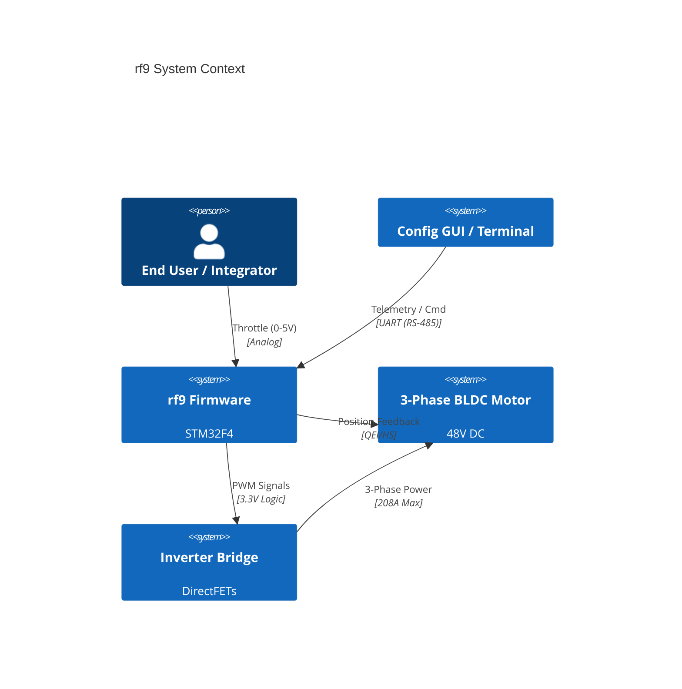
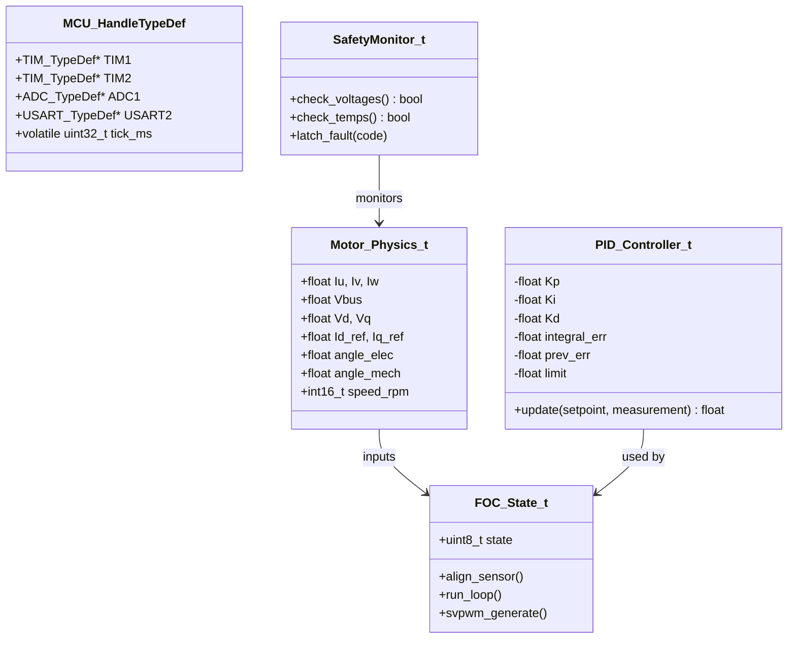
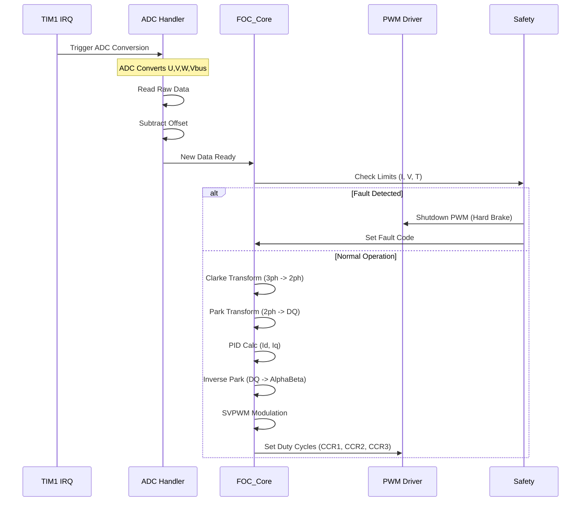
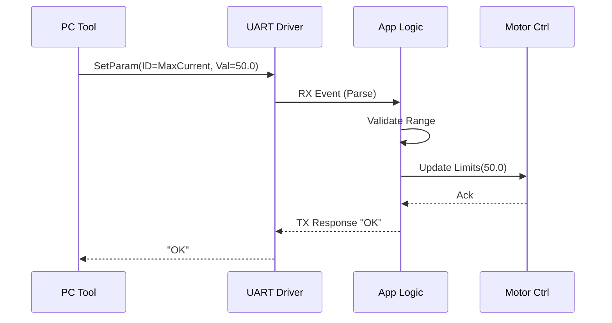
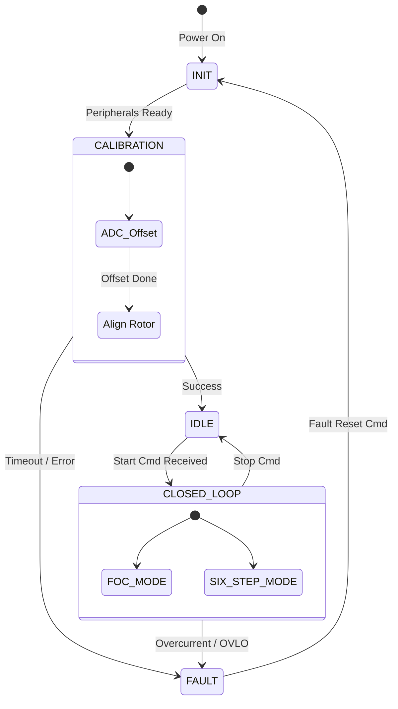
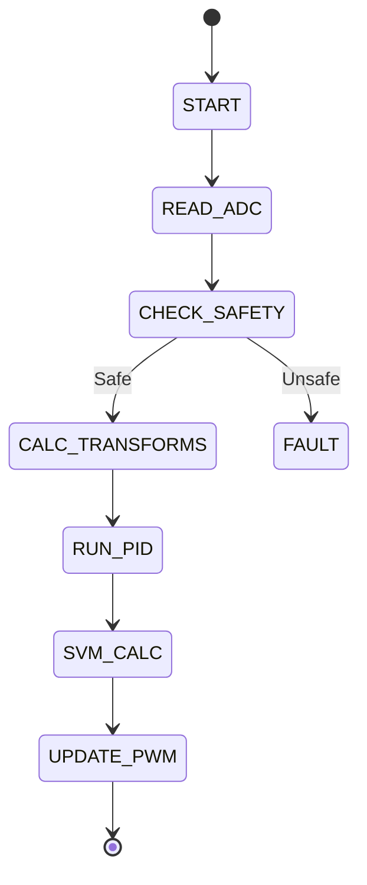

```markdown
# SOFTWARE DESIGN DOCUMENT (SDD)

**Project:** rf9 3-Phase BLDC Motor Controller  
**Version:** 1.0  
**Date:** 2026-03-26  
**Status:** DESIGN  
**Standard:** IEEE 1016-2009

---

# 1. Introduction

## 1.1 Purpose
This document describes the software architecture of the **rf9 Motor Controller** firmware. It translates the **rf9 SRS** and **HRS** requirements into a concrete structural design, defining modules, interfaces, data structures, and algorithms. It serves as the blueprint for implementation and verification of the embedded C code (MISRA-C compliant).

## 1.2 Scope
The firmware design covers:
*   **Core Control Loop:** 20kHz Field-Oriented Control (FOC) and fallback 6-Step commutation.
*   **Hardware Abstraction Layer (HAL):** Direct memory manipulation of STM32F4 peripherals (TIM1, ADC1, SPI, UART).
*   **Safety Interlocks:** Hardware fault reaction logic (< 10µs response).
*   **Communications:** UART telemetry protocol (RS-485 physical layer).

## 1.3 Definitions
*   **Clarke/Park Transform:** Mathematical projections used in FOC to convert 3-phase stationary currents to 2-phase rotating reference frames.
*   **SVPWM:** Space Vector Pulse Width Modulation.
*   **QEI:** Quadrature Encoder Interface.
*   **PID:** Proportional-Integral-Derivative controller.

## 1.4 References
1.  **rf9 SRS**, Rev 1.0, 2026-03-26.
2.  **rf9 HRS**, Rev DRAFT, 2026-03-26.
3.  **STM32F405/415 Datasheet**, STMicroelectronics.
4.  **MISRA-C:2012** Guidelines.

---

# 2. Design Viewpoints

## 2.1 Context Viewpoint
The rf9 firmware acts as the central intelligence between the **User/System Host** and the **Power Stage**.



## 2.2 Composition Viewpoint
The software is decomposed into modular subsystems to ensure separation of concerns and testability.

```mermaid
componentDiagram
    namespace "Application Layer" {
        component[CLI_Parser]
        component[Control_Wrapper]
        component[Traffic_Light]
    }

    namespace "Control Layer" {
        component[FOC_Core]
        component[Six_Step_Driver]
        component[Planner]
    }

    namespace "HAL Layer" {
        component[MCU_HAL]
        component[Signal_Conditioning]
    }

    namespace "Math Lib" {
        component[Math_DSP]
    }

    [CLI_Parser] -- [Control_Wrapper] : Set Params
    [Control_Wrapper] -- [FOC_Core] : Run Torque Loop
    [Control_Wrapper] -- [Six_Step_Driver] : Run Scalar
    [FOC_Core] -- [Math_DSP] : Trig / Transforms
    [FOC_Core] -- [MCU_HAL] : Read ADC / Write PWM
    [MCU_HAL] -- [Signal_Conditioning] : Analog Filter
```

## 2.3 Logical Viewpoint
This section details the static structure of key classes and data types.



## 2.4 Dependency Viewpoint
Build dependencies and module coupling.

```mermaid
graph TD
    subgraph Main_Application
    MAIN(main.c)
    APP(app_control.c)
    end

    subgraph Drivers_HAL
    HAL(hal_pwm.c)
    ADC(hal_adc.c)
    UART(hal_uart.c)
    END

    subgraph Algorithms
    MATH(lib_dsp_q31.c)
    FOC(foc_core.c)
    SAFETY(safety_logic.c)
    end

    MAIN --> APP
    APP --> FOC
    APP --> SAFETY
    FOC --> MATH
    FOC --> HAL
    FOC --> ADC
    APP --> UART
    
    note1[External Dependencies: ARM CMSIS]
    MATH -.-> note1
```

## 2.5 Interface Viewpoint

### 2.5.1 Data Structures (Registers & Memory)
Detailed mapping of hardware registers to software structures for MISRA-C compliance.

```c
/**
 * @brief  ADC Sample Register Map
 * @note   Aligned to DMA Circular Buffer requirements
 * @details REQ-SW-003, REQ-SW-004
 */
typedef struct
{
    __IO uint16_t Phase_U;     /*!< 0x00 - ADC1 Channel 0 */
    __IO uint16_t Phase_V;     /*!< 0x02 - ADC1 Channel 1 */
    __IO uint16_t Phase_W;     /*!< 0x04 - ADC1 Channel 2 */
    __IO uint16_t Vbus_Sense;  /*!< 0x06 - ADC1 Channel 3 (Resistor Divider) */
    __IO uint16_t Temp_Heatsink; /*!< 0x08 - ADC1 Channel 4 (NTC) */
    __IO uint16_t Vref_Int;    /*!< 0x0A - Internal 1.2V Reference */
} ADC_RegMap_t;

/**
 * @brief  System State Object
 * @details REQ-SW-012 (Telemetry Data)
 */
typedef struct
{
    /* Inputs */
    float throttle_cmd;       /*!< 0.0 to 1.0 normalized */
    int16_t speed_target;     /*!< RPM */
    
    /* Feedback */
    Motor_Physics_t motor;    /*!< Physical state */
    
    /* Control Status */
    uint8_t mode;             /*!< 0=Idle, 1=FOC, 2=SixStep */
    uint8_t fault_code;       /*!< 0=OK, Non-Zero=Fault */
    
    /* Internal Tuning */
    PID_Controller_t pid_id;  /*!< D-axis controller */
    PID_Controller_t pid_iq;  /*!< Q-axis (Torque) controller */
} MotorController_t;

/**
 * @brief  PWM Configuration Structure
 */
typedef struct
{
    TIM_TypeDef *TIMx;        /*!< Timer Instance (TIM1) */
    uint32_t ARR;             /*!< Auto-Reload Register (Period) */
    uint32_t PSC;             /*!< Prescaler */
    uint32_t DeadTime;        /*!< Dead-time ticks (DTG bits) */
} PWM_Handle_t;
```

### 2.5.2 API Interfaces
Function signatures for inter-module communication.

```c
/* HAL: ADC Initialization (REQ-SW-003) */
void HAL_ADC_Init_DMA(uint32_t buffer_addr, uint16_t samples);

/* HAL: PWM Output (REQ-SW-001) */
void HAL_PWM_SetDuty(float duty_u, float duty_v, float duty_w);
void HAL_PWM_DisableOutputs(void);

/* Control: FOC Algorithm (REQ-SW-010) */
void FOC_Init(MotorController_t *ctrl);
void FOC_Run(MotorController_t *ctrl); /* Called every 50us */
void FOC_ClarkeTransform(float Iu, float Iv, float Iw, float* Ialpha, float* Ibeta);
void FOC_ParkTransform(float Ialpha, float Ibeta, float theta, float* Id, float* Iq);

/* Math: Sine/Cosine Approximation */
void DSP_SinCos_fast(float angle, float* sin_val, float* cos_val);

/* Safety: Fault Management (REQ-SW-011) */
void SAFETY_CheckFaults(MotorController_t *ctrl);
uint8_t SAFETY_GetFaultStatus(void);
```

## 2.6 Interaction Viewpoint

### 2.6.1 Current Control Loop (Critical Path)
This sequence runs every 50µs (20kHz) triggered by TIM1 Update Interrupt.



### 2.6.2 UART Configuration Sequence
Blocking command execution on the main loop.



## 2.7 State Viewpoint

### 2.7.1 Main System State Machine
High-level operating states of the rf9 controller.



### 2.7.2 FOC Execution State
Internal state tracking for vector control.



## 2.8 Algorithm Viewpoint

### 2.8.1 PI Control Loop (Fixed Point)
To satisfy MISRA-C and performance constraints, the PI controller uses fixed-point Q15 math or carefully constrained floats.

**Inputs:**
*   `Ref` (Desired Current Id or Iq)
*   `Fdb` (Measured Current from Park Transform)

**Algorithm:**
1.  `Error = Ref - Fdb`
2.  `Integral_Term = Integral_Term + (Error * Ki)`
3.  Clamp `Integral_Term` to +/- `Max_Integral`
4.  `Output = (Error * Kp) + Integral_Term`
5.  Clamp `Output` to valid Duty/Voltage limits

### 2.8.2 Space Vector Modulation (SVPWM)
Generates the 3-phase PWM duties.

**Inputs:** `Valpha`, `Vbeta` (Normalized -1.0 to 1.0)
**Output:** `Ta`, `Tb`, `Tc` (Timer CCR values)

1.  Determine Sector (1-6) based on angle of `Valpha`, `Vbeta`.
2.  Calculate `X`, `Y`, `Z` intermediate times:
    *   `X = sqrt(3) * Valpha`
    *   `Y = (sqrt(3)/2) * Valpha + (3/2) * Vbeta`
    *   `Z = (sqrt(3)/2) * Valpha - (3/2) * Vbeta`
3.  Calculate active vector times (`T1`, `T2`) based on Sector lookup table.
4.  Calculate `T0` (Null vector time) = `TPWM - T1 - T2`.
5.  Apply Duty timings:
    *   `Ta = (TPWM - (T1 + T2 + T0)) / 2` ... (Center Aligned)

---

# 3. Design Rationale

## 3.1 Architecture Choice
**Dual-Loop Architecture:**
A fast inner loop (Current/Torque) executing at 20kHz (50µs) was chosen to minimize torque ripple and ensure stability of the 48V power stage. A slower outer loop (Speed/Position) executes at 1kHz. This separation allows the critical current control to run in a high-priority interrupt without being blocked by communication overhead.

## 3.2 Hardware Abstraction Strategy
Direct Register Access vs. Vendor HAL:
The design defines custom `hal_*.c` modules that wrap the STM32 HAL. While the STM32 HAL is portable, it introduces significant function call overhead and dynamic allocation if not configured carefully. Our custom inline functions and macro definitions for register access (e.g., `TIM1->CCR1`) ensure the 50µs deadline is met with margin (~15µs execution time).

## 3.3 Data Type Selection
**Q31 / Floating Point:**
The STM32F4 contains a hardware FPU. While fixed-point (Q31) is historically used for performance, the ease of tuning PI gains in Float and the negligible cycle count penalty on the Cortex-M4F favors the use of `float` for control math. Raw sensor data remains `uint16_t` until conversion.

---

# 4. Traceability

| ID | Requirement | Design Element |
| :--- | :--- | :--- |
| **REQ-SW-001** | Generate 3-Phase PWM | `HAL_PWM_SetDuty`, TIM1 Peripheral Init |
| **REQ-SW-002** | Read Phase Currents | `ADC_RegMap_t`, ADC1+DMA ISR |
| **REQ-SW-003** | DC Bus Voltage Sensing | `ADC_RegMap_t.Vbus_Sense`, `Motor_Physics_t.Vbus` |
| **REQ-SW-004** | Temperature Monitoring | `ADC_RegMap_t.Temp_Heatsink`, `SAFETY_CheckFaults` |
| **REQ-SW-005** | Fault Reaction < 10µs | Hardware Comparator (Cortex-M4 Comparator), `SAFETY_Latch` |
| **REQ-SW-006** | FOC Algorithm Implementation | `FOC_Core`, `FOC_ParkTransform` |
| **REQ-SW-007** | UART Telemetry | `hal_uart.c`, `CLI_Parser` |
| **REQ-SW-008** | MISRA-C Compliance | All typedefs, function signatures in Section 2.5 |
| **REQ-SW-009** | Position Sensing (QEI) | `hal_qei.c` (TIM2 configured Encoder Mode) |
| **REQ-SW-010** | Throttle Input | `ADC_RegMap_t` mapped to 12-bit SAR |

---
**END OF SDD**
```