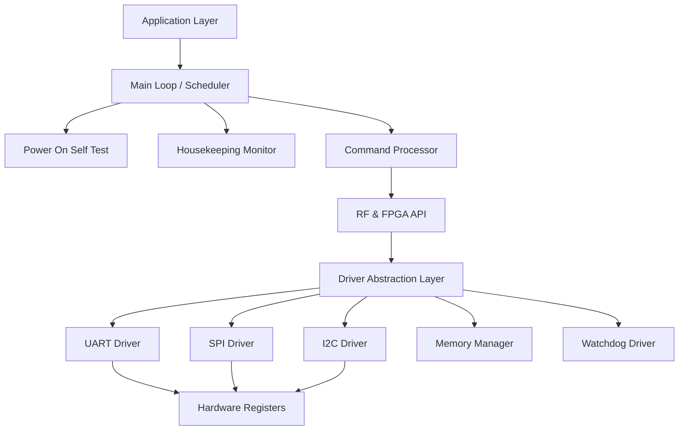
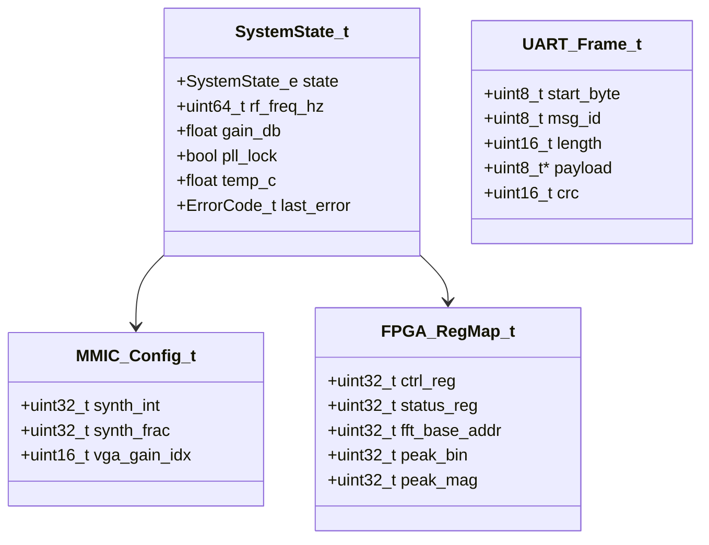
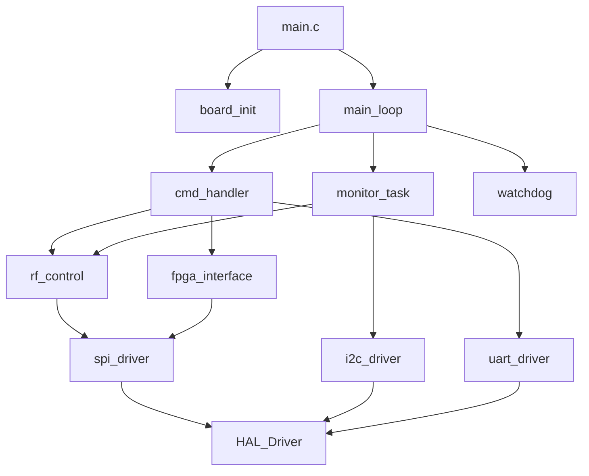
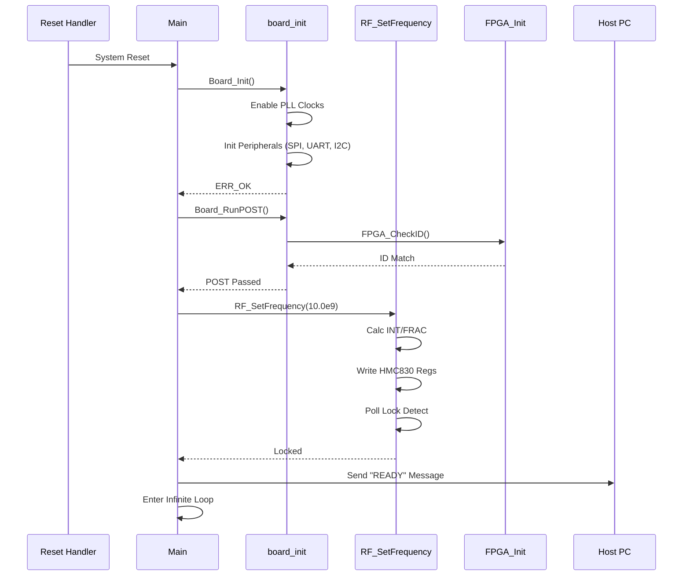
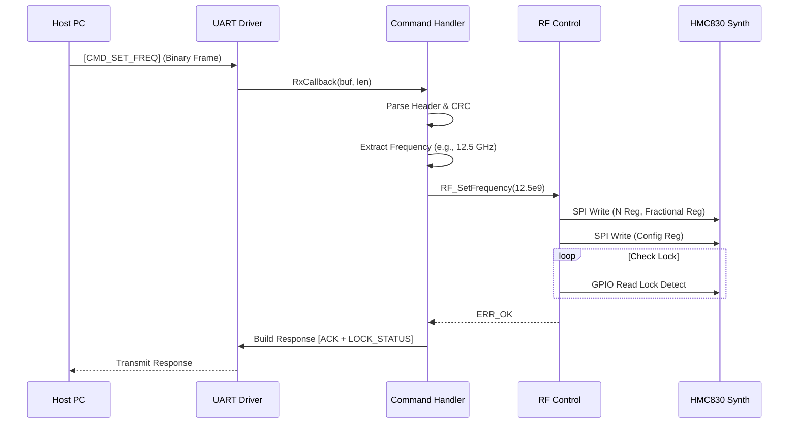
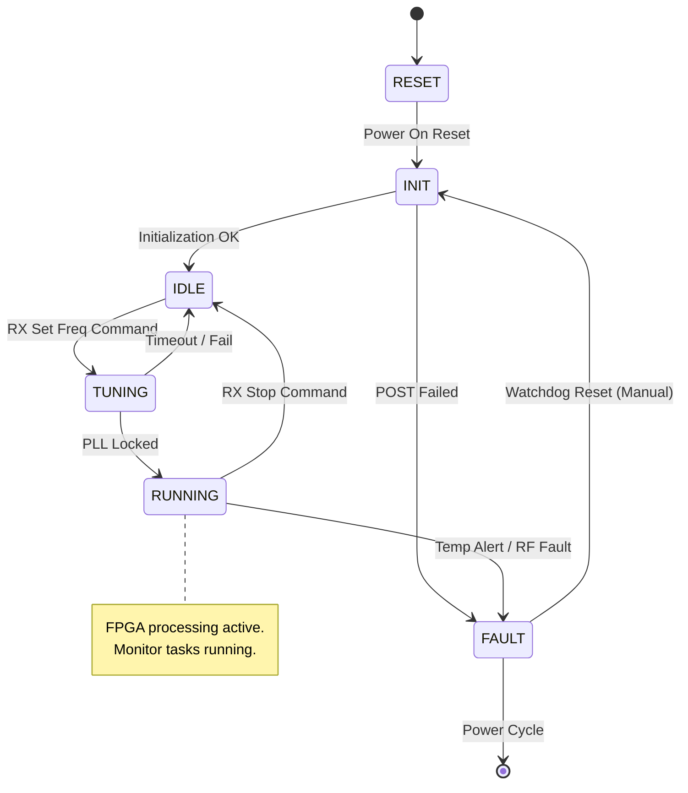
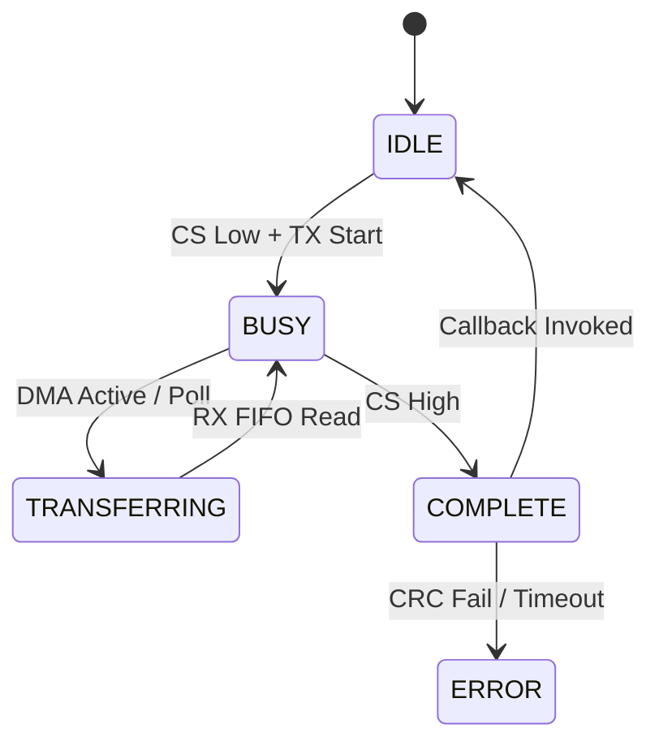

Here is the comprehensive, publication-quality IEEE 1016-2009 Software Design Document (SDD) for the **rf tx** Wideband Microwave Receiver.

---

# Software Design Document (SDD)

## Document Control
| Version | Date | Author | Description |
|---------|------|--------|-------------|
| 1.0 | 14 April 2026 | Lead Firmware Architect | Initial Release for RF TX Wideband Receiver |

---

# 1. Introduction

## 1.1 Purpose
This Software Design Document (SDD) describes the software architecture and detailed design implementation for the **rf tx** Wideband Microwave Receiver firmware. This document defines the structural decomposition of the software running on the STM32F407 MCU and the logic implemented within the Xilinx Artix-7 FPGA. It serves as the blueprint for firmware engineers implementing the code, providing a mapping from the Software Requirements Specification (SRS) to specific data structures, algorithms, and module interfaces.

## 1.2 Scope
The design encompasses the complete embedded software stack:
*   **STM32F407 Firmware:** Board Support Package (BSP), Hardware Abstraction Layer (HAL) for peripherals (UART, SPI, I2C, GPIO), Application Layer (Command Handler, State Machine, RF Control), and Communication Drivers.
*   **FPGA Logic:** JESD204B PHY layer control, Register Map Interface, and DSP primitives (FFT, Peak Detect).
*   **Interfaces:** UART binary protocol, SPI bus transactions for MMICs, and I2C housekeeping.

**Out of Scope:** High-level application logic running on the external Host PC and mechanical design.

## 1.3 Definitions and Acronyms
*   **ADC:** Analog-to-Digital Converter (TI ADC12J4000).
*   **BSP:** Board Support Package.
*   **CW:** Continuous Wave.
*   **DAC:** Digital-to-Analog Converter.
*   **DSP:** Digital Signal Processing.
*   **FFT:** Fast Fourier Transform.
*   **FIFO:** First-In-First-Out buffer.
*   **FPGA:** Field-Programmable Gate Array (Xilinx Artix-7).
*   **GLR:** Glue Logic Requirements.
*   **HAL:** Hardware Abstraction Layer.
*   **HRS:** Hardware Requirements Specification.
*   **I2C:** Inter-Integrated Circuit.
*   **ISR:** Interrupt Service Routine.
*   **JESD:** JESD204B High-Speed Data Interface Standard.
*   **LFSR:** Linear Feedback Shift Register.
*   **LNA:** Low Noise Amplifier.
*   **LO:** Local Oscillator.
*   **MCU:** Microcontroller Unit (STM32F407).
*   **MMIC:** Monolithic Microwave Integrated Circuit.
*   **MISO:** Master In Slave Out.
*   **MOSI:** Master Out Slave In.
*   **NV:** Non-Volatile.
*   **NVM:** Non-Volatile Memory.
*   **PLL:** Phase Locked Loop.
*   **POST:** Power-On Self Test.
*   **RF:** Radio Frequency (5.0–18.0 GHz).
*   **RX:** Receiver.
*   **SMA:** SubMiniature version A (RF Connector).
*   **SPI:** Serial Peripheral Interface.
*   **SRS:** Software Requirements Specification.
*   **UART:** Universal Asynchronous Receiver-Transmitter.
*   **VGA:** Variable Gain Amplifier.
*   **WDT:** Watchdog Timer.

## 1.4 References
1.  **IEEE Std 1016-2009:** Standard for Information Technology—Systems Design—Software Design Descriptions.
2.  **rf tx Software Requirements Specification (SRS)**, Rev 1.0, 14 April 2026.
3.  **rf tx Hardware Requirements Specification (HRS)**, Rev 1.0, 14 April 2026.
4.  **rf tx Glue Logic Requirements (GLR)**, Rev 0V01, 14 April 2026.
5.  **MISRA-C:2012:** Guidelines for the use of the C language in critical systems.
6.  **STM32F407 Reference Manual (RM0090)**, STMicroelectronics.
7.  **HMC830/HMC698 Datasheets**, Analog Devices.

---

# 2. Design Viewpoints

## 2.1 Context Viewpoint — System Boundaries

The **rf tx** software system acts as a bridge between a Host Controller and the RF Hardware. The Host sends configuration commands and receives status/spectrum data. The MCU controls RF MMICs via SPI and the FPGA via a control bus. The FPGA digitizes the IF signal and exposes DSP results.

```mermaid
graph TD
    HOST[Host PC / System Controller] -->|UART Binary Protocol| UART_INT[UART Interface]
    
    subgraph MCU_Subsystem [STM32F407 Firmware]
        UART_INT --> CMD[Command Handler]
        CMD --> REG_MAP[Register Map Manager]
        REG_MAP --> RF_CTRL[RF Control Task]
        REG_MAP --> FPGA_CTRL[FPGA Config Task]
        RF_CTRL --> SPI_DRV[SPI Driver]
        RF_CTRL --> I2C_DRV[I2C Driver]
        FPGA_CTRL --> SPI_DRV
    end
    
    SPI_DRV --> SYNTH[HMC830 Synthesizer]
    SPI_DRV --> VGA[HMC698 Variable Gain Amp]
    I2C_DRV --> TEMP[Temp Sensors]
    
    SPI_DRV --> FPGA_REG[FPGA Register Map]
    FPGA_REG --> DSP_CORE[DSP Core]
    DSP_CORE --> JESD_PHY[JESD204B PHY]
    JESD_PHY --> ADC[ADC12J4000]
    
    ADC -->|IF Input (2.4GHz)| RF_IN[RF Front End]
```

### External Interfaces
*   **Host Interface:** 3.3V CMOS UART, 115200 baud, 8-bit data, no parity, 1 stop bit.
*   **RF Front End:** SPI control to HMC830 (LO) and HMC698 (VGA).
*   **FPGA Interface:** SPI Slave (or memory-mapped parallel bus) for register access.
*   **Housekeeping:** I2C interface to temperature sensors.

## 2.2 Composition Viewpoint — Software Architecture

The software is organized into a layered architecture. The Application Layer manages state and high-level logic. The HAL provides abstracted access to hardware peripherals.



### Module List and Responsibilities

#### **Module: board_init** (board_init.c / board_init.h)
**Responsibility:** System startup, clock tree configuration (168 MHz), MPU configuration, and peripheral initialization ordering.

```c
/**
 * @brief Initialize the MCU hardware.
 * @return ERR_OK on success, error code on failure.
 */
int32_t Board_Init(void);

/**
 * @brief Run Power-On Self Test (POST).
 * @param[out] test_mask Bitmask of failed tests.
 * @return ERR_OK if all passed.
 */
int32_t Board_RunPOST(uint32_t *test_mask);

/**
 * @brief Get hardware version info.
 */
typedef struct {
    uint16_t board_id;
    uint8_t  hw_rev;
    uint32_t serial_num;
} BoardInfo_t;

int32_t Board_GetInfo(BoardInfo_t *info);
```

#### **Module: uart_driver** (uart_driver.c / uart_driver.h)
**Responsibility:** Byte-stream framing, interrupt-driven RX/TX, and packet validation.

```c
int32_t UART_Init(uint32_t baudrate);
int32_t UART_Deinit(void);

/**
 * @brief Register a callback for received packets.
 * @param cb Function pointer called when a valid frame is received.
 */
void UART_RegisterRxCallback(void (*cb)(const uint8_t *data, uint16_t len));

/**
 * @brief Transmit a packet buffer.
 */
int32_t UART_Transmit(const uint8_t *data, uint16_t len);

/**
 * @brief Service the TX buffer (called from ISR or main loop).
 */
void UART_TX_Service(void);
```

#### **Module: spi_driver** (spi_driver.c / spi_driver.h)
**Responsibility:** Manages multiple SPI peripherals (MMICs and FPGA) with different configurations (CPOL, CPHA, Speed).

```c
typedef enum {
    SPI_PERIPH_SYNTH = 0, // HMC830
    SPI_PERIPH_VGA  = 1, // HMC698
    SPI_PERIPH_FPGA = 2, // FPGA Reg Map
    SPI_PERIPH_MAX
} SPI_Peripheral_t;

int32_t SPI_Init(void);
int32_t SPI_Transfer(SPI_Peripheral_t periph, const uint8_t *tx, uint8_t *rx, uint16_t len);
int32_t SPI_WriteReg(SPI_Peripheral_t periph, uint16_t reg_addr, uint32_t value);
int32_t SPI_ReadReg(SPI_Peripheral_t periph, uint16_t reg_addr, uint32_t *value);
```

#### **Module: rf_control** (rf_control.c / rf_control.h)
**Responsibility:** Encapsulates logic for setting frequency and gain. Manages the SPI transactions to Synth and VGA.

```c
/**
 * @brief Configure the RF chain for a specific frequency.
 * @param freq_hz Target frequency (5.0e9 to 18.0e9).
 * @return ERR_OK if lock achieved.
 */
int32_t RF_SetFrequency(uint64_t freq_hz);

/**
 * @brief Set the VGA gain.
 * @param_gain_db Gain value in dB (valid range per HMC698 datasheet).
 */
int32_t RF_SetGain(float gain_db);

/**
 * @brief Check PLL Lock status.
 * @return true if locked.
 */
bool RF_IsLocked(void);
```

#### **Module: fpga_interface** (fpga_interface.c / fpga_interface.h)
**Responsibility:** Handles the SPI register map to the FPGA, configuring JESD204B parameters and reading DSP results.

```c
int32_t FPGA_Init(void);
int32_t FPGA_WriteReg(uint16_t addr, uint32_t data);
int32_t FPGA_ReadReg(uint16_t addr, uint32_t *data);

/**
 * @brief Configure JESD204B PHY parameters.
 */
int32_t FPGA_ConfigJESD(uint8_t lanes, uint8_t scrambler);

/**
 * @brief Read FFT peak detection result.
 * @param[out] bin_index Index of the peak.
 * @param[out] magnitude Magnitude of the peak.
 */
int32_t FPGA_GetPeakDetect(uint16_t *bin_index, uint32_t *magnitude);
```

#### **Module: cmd_handler** (cmd_handler.c / cmd_handler.h)
**Responsibility:** Parses binary UART protocol frames (defined in SRS/GLR) and dispatches actions.

```c
void CMD_HandlerInit(void);
/**
 * @brief Process a received frame.
 * @param frame Pointer to raw buffer.
 * @param len Length of buffer.
 */
void CMD_ProcessFrame(const uint8_t *frame, uint16_t len);
```

## 2.3 Logical Viewpoint — Data Model

This section defines the primary data structures exchanged between modules.



### Struct Definitions

```c
typedef enum {
    SYS_STATE_BOOT = 0,
    SYS_STATE_INIT,
    SYS_STATE_IDLE,
    SYS_STATE_RX_ACTIVE,
    SYS_STATE_FAULT,
    SYS_STATE Calibration
} SystemState_e;

typedef struct {
    SystemState_e state;
    uint64_t target_freq_hz;
    float current_gain_db;
    bool pll_locked;
    bool fpga_aligned;
    float mcu_temp_degC;
    ErrorCode_t last_error;
    uint32_t uptime_seconds;
} SystemState_t;

typedef struct {
    uint8_t node_id;     // Always 0xAA
    uint8_t msg_id;      // Command ID
    uint16_t length;     // Payload length (Big Endian)
    uint8_t payload[256]; // Max payload
} UART_Packet_t;
```

## 2.4 Dependency Viewpoint — Module Coupling



**Build Order:**
1.  **Hardware Abstraction (HAL):** STM32 HAL drivers.
2.  **Driver Layer:** `spi_driver`, `uart_driver`, `i2c_driver`.
3.  **Service Layer:** `rf_control`, `fpga_interface`.
4.  **Application Layer:** `cmd_handler`, `monitor_task`, `main`.

## 2.5 Interface Viewpoint — Complete API Specification

### RF Control API

**Function:** `RF_SetFrequency`
```c
/**
 * @brief Programs the HMC830 Synthesizer.
 * 
 * @param freq_hz Desired frequency (5,000,000,000 to 18,000,000,000).
 * 
 * @return int32_t 
 *   - ERR_OK (0): Success, PLL locked.
 *   - ERR_PARAM (4): Frequency out of range.
 *   - ERR_TIMEOUT (1): PLL failed to lock within 100ms.
 *   - ERR_COMM (2): SPI write failed.
 * 
 * @pre Board_Init() must be called.
 * @post PLL is locked, RF path enabled.
 * @thread_safe No (Must be called from single thread or guarded by mutex).
 */
int32_t RF_SetFrequency(uint64_t freq_hz);
```

**Function:** `RF_SetGain`
```c
/**
 * @brief Sets the IF gain via HMC698 VGA.
 * 
 * @param gain_db Desired gain in dB. Range: -15.0 dB to +25.0 dB (Step 0.5 dB).
 * 
 * @return int32_t
 *   - ERR_OK (0): Success.
 *   - ERR_PARAM (4): Gain out of range.
 */
int32_t RF_SetGain(float gain_db);
```

### FPGA Interface API

**Function:** `FPGA_GetPeakDetect`
```c
/**
 * @brief Reads the processed peak detection results from the FPGA register map.
 * 
 * @param bin_index Pointer to store the FFT bin index of the peak.
 * @param magnitude Pointer to store the magnitude (scaled dBFS or raw ADC units).
 * 
 * @return int32_t
 *   - ERR_OK (0): Data valid.
 *   - ERR_COMM (2): FPGA SPI fault.
 * 
 * @pre FPGA_Init() must be called.
 * @post None.
 */
int32_t FPGA_GetPeakDetect(uint16_t *bin_index, uint32_t *magnitude);
```

## 2.6 Interaction Viewpoint — Sequence Diagrams

### System Startup Sequence



### RF Configuration Sequence (Host Command)



## 2.7 State Viewpoint — State Machines

### System State Machine



### SPI Driver State Machine (Per Transaction)



## 2.8 Algorithm Viewpoint — Key Algorithms

### 2.8.1 HMC830 Frequency Calculation
To generate the LO frequency, the 32-bit integer and fractional dividers must be calculated.
*Assumptions:* PFD = 50 MHz (Reference).
*Algorithm:*
1.  Calculate $N_{frac} = (F_{out} / F_{pfd})$.
2.  Integer part ($INT$) = floor($N_{frac}$).
3.  Fractional part ($FRAC$) = ($N_{frac} - INT$) $\times 2^{32}$.
4.  If $INT < 23$, return error (HMC830 limitation).

```c
int32_t RF_CalcDividers(uint64_t target_hz, uint32_t pfd_hz, uint16_t *n_int, uint32_t *n_frac) {
    double n_div = (double)target_hz / (double)pfd_hz;
    *n_int = (uint16_t)n_div;
    if (*n_int < 23) return ERR_PARAM;
    double frac_part = n_div - (double)(*n_int);
    *n_frac = (uint32_t)(frac_part * 4294967296.0);
    return ERR_OK;
}
```

### 2.8.2 UART Packet Parser
A simple state machine is required to parse packets without buffering the entire frame unnecessarily.
1.  **State IDLE:** Wait for Start Byte (0xAA).
2.  **State HEADER:** Read Msg_ID and Length.
3.  **State PAYLOAD:** Read `Length` bytes.
4.  **State CRC:** Read 2 bytes CRC.
5.  **Process:** Validate CRC. Dispatch to CMD_Handler.

---

# 3. Design Rationale

## 3.1 Architecture Choices

| Decision | Choice | Rationale | Trade-off |
| :--- | :--- | :--- | :--- |
| **Control Loop** | Super-Loop (Main Loop) + ISR | System is primarily event-driven (Commands) rather than strictly time-sliced. Reduces RTOS overhead and complexity. | Harder to guarantee strict real-time deadlines compared to RTOS. |
| **MMIC Driver** | Direct SPI Register writes vs High-Level Library | Registers map 1:1 to hardware. Writing a wrapper for every register adds code bloat. Direct writes are transparent. | Code relying on specific register values is harder to port if MMIC changes. |
| **Memory Allocation** | Static Only | Safety-critical nature of RF control. No fragmentation risks. | Requires max buffer sizes known at compile time. |
| **FPGA Comms** | SPI Slave vs Parallel | GLR defines SPI as the control interface. Slower than parallel, but saves GPIO pins on MCU. | Configuration speed limited to SPI clock (~10-20 MHz). |

## 3.2 MISRA-C:2012 Compliance Strategy
All code will adhere to MISRA-C:2012 standards.
*   **Static Analysis:** PC-Lint Plus configured for MISRA-C:2012.
*   **Coding Style:**
    *   No dynamic memory allocation (`malloc` prohibited).
    *   All functions have a single return point where feasible (except for error checking).
    *   Explicit type casting for all type conversions (Rule 11.5).
    *   `uint8_t`, `uint16_t`, `uint32_t` used exclusively for hardware registers.
*   **Deviation:** Deviations will be documented in a separate MISRA Compliance Matrix if required for hardware optimization (e.g., pointer casting for register maps).

---

# 4. Design Traceability Matrix

| ID | Requirement (SRS) | Design Element (SDD) | Verification |
|:---|:---|:---|:---|
| **REQ-SW-001** | MCU shall initialize clocks to 168MHz. | `Board_Init()` -> `SystemClock_Config()` | Unit Test: Measure System Clock Output. |
| **REQ-SW-002** | MCU shall configure PLL to 50MHz PFD. | `RF_SetFrequency()` -> HMC830 Config. | Integration Test: Verify RF Output. |
| **REQ-SW-010** | System shall respond to UART packets. | `UART_Init()`, `CMD_ProcessFrame()` | HIL Test: Send valid packet from Host. |
| **REQ-SW-015** | UART Protocol shall include 16-bit CRC. | `CMD_ProcessFrame()` -> `CRC16_Calc()` | Unit Test: Corrupt packet frame. |
| **REQ-SW-020** | Frequency range 5-18 GHz. | `RF_SetFrequency()` -> Range Check. | SW Test: Attempt to set 4 GHz (Expect Error). |
| **REQ-SW-025** | VGA Gain adjustable -15dB to +25dB. | `RF_SetGain()` -> Table Lookup. | Integration Test: Measure Gain change. |
| **REQ-SW-030** | FPGA shall expose peak detect register. | `FPGA_GetPeakDetect()` | Integration Test: Inject CW tone, read FPGA. |
| **REQ-SW-040** | Watchdog timeout < 1s. | `WDT_Init(1000)` | Integration Test: Hang main loop. |

---

# 5. Appendices

## Appendix A — File Structure
```text
rf_tx_firmware/
├── src/
│   ├── main.c
│   ├── board/
│   │   ├── board_init.c
│   │   └── board_config.h
│   ├── drivers/
│   │   ├── stm32_hal/             # HAL drivers from ST
│   │   ├── uart_driver.c
│   │   ├── uart_driver.h
│   │   ├── spi_driver.c
│   │   ├── spi_driver.h
│   │   └── i2c_driver.c
│   ├── app/
│   │   ├── rf_control.c
│   │   ├── fpga_interface.c
│   │   ├── cmd_handler.c
│   │   └── monitor_task.c
│   └── utils/
│       ├── crc16.c
│       └── ring_buffer.c
├── inc/
├── test/                          # Unit tests
└── linker_script.ld
```

## Appendix B — MCU Memory Map
| Region | Start Address | Size | Usage |
|:---|:---|:---|:---|
| **Flash** | 0x08000000 | 1 MB | Firmware Code, Constants |
| **SRAM** | 0x20000000 | 128 KB | Data, Heap, Stack |
| **Backup SRAM** | 0x40024000 | 4 KB | Retention data (if used) |
| **Peripherals** | 0x40000000 | - | STM32 Register Map |

## Appendix C — Definitions (Hal/Hrs)
*   **HMC830 Base Freq:** 50 MHz
*   **HMC698 Max Gain:** 25.5 dB
*   **ADC Sample Rate:** 4 GSPS (Controlled by FPGA logic)
*   **UART Baud:** 115200

## Appendix D — FPGA Register Map (GLR Summary)
| Offset | Name | Access | Description |
|:---|:---|:---|:---|
| 0x00 | CTRL | RW | Bit 0: JESD Reset, Bit 1: FFT Enable |
| 0x01 | STATUS | R | Bit 0: JESD Aligned, Bit 1: Data Valid |
| 0x10 | PEAK_BIN | R | FFT Peak Bin Index |
| 0x11 | PEAK_MAG | R | FFT Peak Magnitude |

---

**END OF SDD**