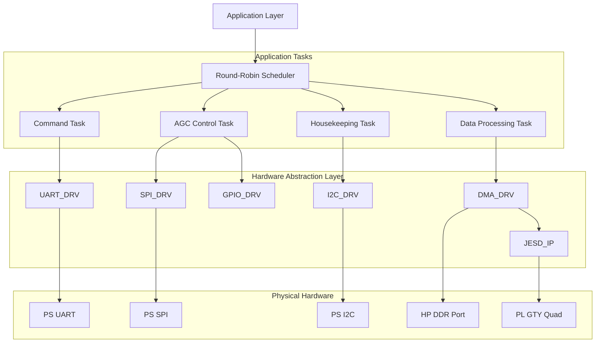
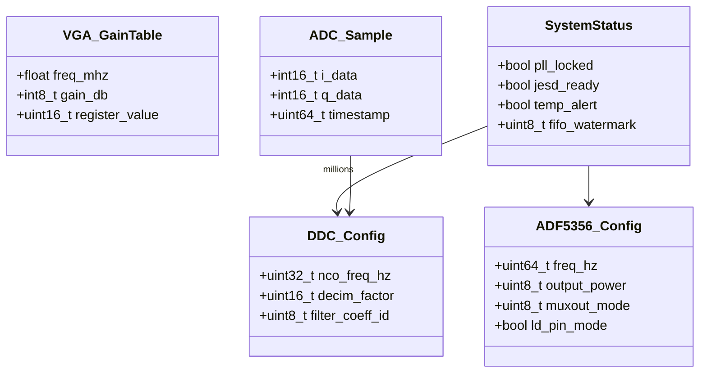
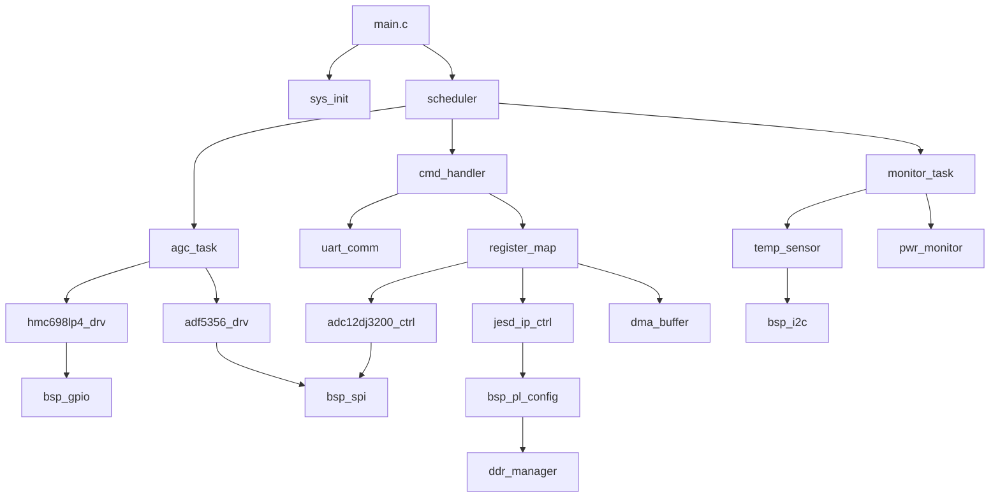
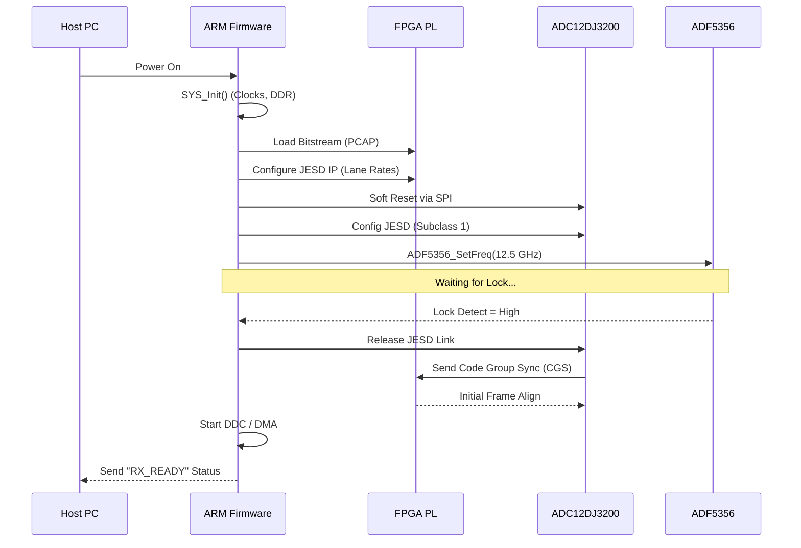
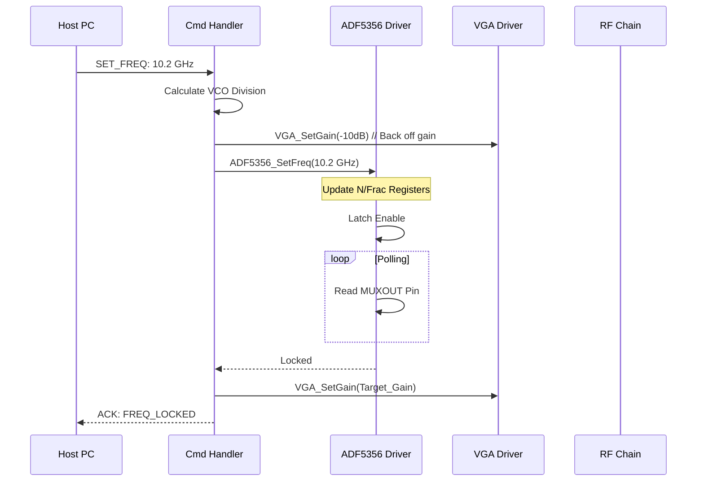
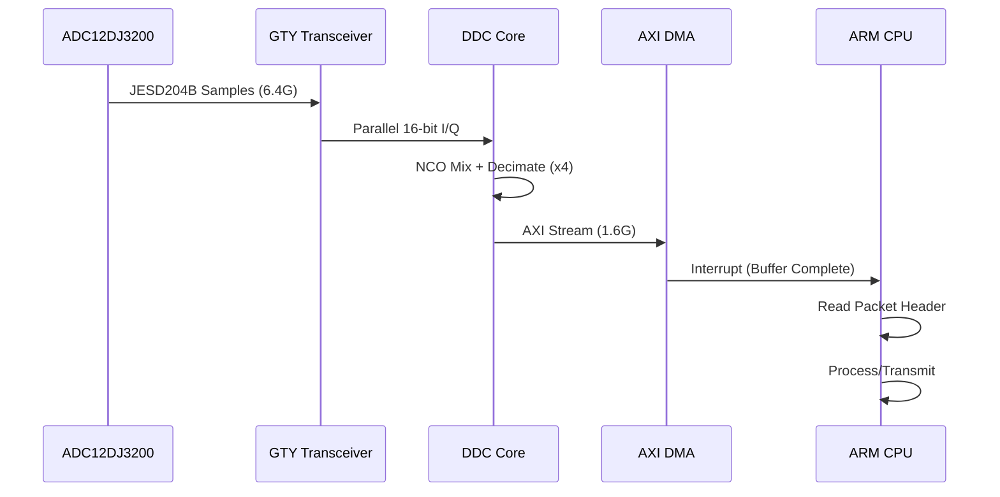
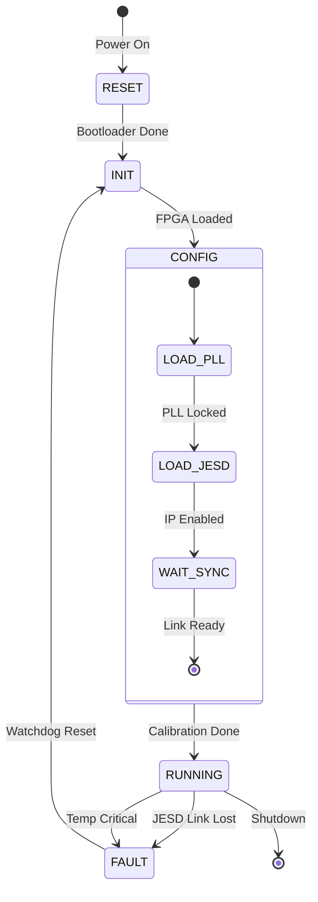
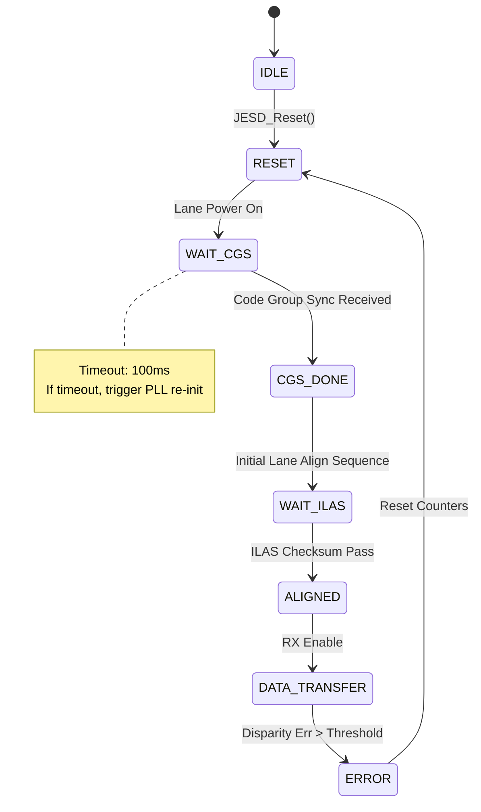

# Software Design Document (SDD)

**Project:** rf txrxxp Wideband Microwave Radar Receiver  
**Version:** 1.0  
**Date:** 14 April 2026  
**Author:** Senior Embedded Software Architect  
**Standard:** IEEE 1016-2009

---

## Document Control
| Version | Date | Author | Description |
|---------|------|--------|-------------|
| 1.0 | 14 April 2026 | Sr. Arch. | Initial baseline design derived from SRS 1.0 and GLR 0V01 |

---

# 1. Introduction

## 1.1 Purpose
This Software Design Document (SDD) provides the comprehensive architectural design, data structures, algorithms, and interface specifications for the **rf txrxxp** embedded firmware. It details the implementation strategy for the Zynq UltraScale+ PS (Processing System) software and PL (Programmable Logic) glue logic required to operate the 5–18 GHz receiver chain.

This document serves as the blueprint for:
1.  **Firmware Engineers:** Implementing C/C++ drivers for the ADC, Synthesizer, and VGA.
2.  **RTL Designers:** Implementing the JESD204B IP integration and Register Map logic in the FPGA fabric.
3.  **Validation Engineers:** Verifying software compliance with the SRS (Software Requirements Specification).

## 1.2 Scope
The design covers the software resident on the XCZU4EV SoC, specifically:
*   **Bootloaders & Configuration:** Loading the FPGA bitstream and ARM boot sequence.
*   **Signal Chain Drivers:** SPI control for ADF5356 (PLL), HMC698LP4 (VGA), and HMC1050 (Mixer).
*   **High-Speed Interface:** Setup and monitoring of the JESD204B link to the TI ADC12DJ3200.
*   **Data Path:** Digital Down Conversion (DDC) control and DMA buffer management via the AXI-Stream interface.
*   **Housekeeping:** I2C thermal management, POST (Power-On Self-Test), and Watchdog.
*   **Communication:** UART command interface for Host PC control.

**Out of Scope:** This document does not cover the hardware schematic, the PCB layout, or the Host PC GUI application source code.

## 1.3 Definitions and Acronyms
*   **AGC:** Automatic Gain Control (Logic managing HMC698LP4).
*   **AXI:** Advanced eXtensible Interface (Xilinx bus standard).
*   **BB:** Baseband (DC to ~500 MHz).
*   **BIST:** Built-In Self-Test (FPGA PRBS pattern generation).
*   **CSR:** Control and Status Register (Memory-mapped register).
*   **DDC:** Digital Down Converter (FIR Filter + NCO inside FPGA).
*   **FSM:** Finite State Machine.
*   **GT:** Gigabit Transceiver (Xilinx high-speed serial I/O).
*   **HAL:** Hardware Abstraction Layer.
*   **IF:** Intermediate Frequency (DC to 1 GHz per HRS).
*   **JESD:** JESD204B SerDes protocol.
*   **LO:** Local Oscillator (Output of ADF5356).
*   **LUT:** Look-Up Table.
*   **MGT:** Multi-Gigabit Transceiver.
*   **NCO:** Numerically Controlled Oscillator.
*   **PLD:** Programmable Logic Device.
*   **PRBS:** Pseudo-Random Binary Sequence.
*   **RF:** Radio Frequency (5-18 GHz).
*   **RTOS:** Real-Time Operating System.
*   **RX:** Receive path.
*   **SYNTH:** Synthesizer (ADF5356).
*   **TRP:** Transmit/Receive Pulse (RF Enable control).
*   **VGA:** Variable Gain Amplifier (HMC698LP4).

## 1.4 References
1.  **IEEE 1016-2009:** Standard for Information Technology—Systems Design—Software Design Descriptions.
2.  **SRS:** rf txrxxp Software Requirements Specification, Rev 1.0, 14 April 2026.
3.  **GLR:** rf txrxxp Glue Logic Requirements, Rev 0V01, 14 April 2026.
4.  **HRS:** rf txrxxp Hardware Requirements Specification, Rev 1.0, 14 April 2026.
5.  **MISRA-C:2012:** Guidelines for the use of the C language in critical systems.
6.  **Xilinx UG1085:** Zynq UltraScale+ Device Technical Reference Manual.
7.  **TI ADC12DJ3200 Datasheet:** Literature Number: SWAS584B.
8.  **Analog Devices ADF5356 Datasheet:** Wideband Synthesizer with Integrated VCO.

---

# 2. Design Viewpoints

## 2.1 Context Viewpoint — System Boundaries

The rf txrxxp firmware operates within the Zynq UltraScale+ SoC, bridging the host control system (via UART) and the analog RF chain (via SPI/JESD204B).

```mermaid
graph TD
    HOST[Host PC / Radar Controller] -->|UART Cmd/Resp| UART[UART Driver]
    HOST -->|1GbE (Optional Status)| ETH[Ethernet Stack]
    
    subgraph FIRMWARE_ARM [ARM Cortex-R5 Firmware]
        UART --> CMD[Command Handler]
        CMD --> REG_MAP[Register Map Manager]
        REG_MAP --> SYNTH_DRV[Synthesizer Driver]
        REG_MAP --> VGA_DRV[VGA Driver]
        REG_MAP --> SYS_MON[System Monitor]
        REG_MAP --> JESD_CTRL[JESD204B Controller]
        
        SYNTH_DRV --> SPI[SPI Controller]
        VGA_DRV --> GPIO[GPIO Controller]
        JESD_CTRL --> GT_CTRL[GTY Transceiver Control]
    end
    
    SPI --> ADF5356[ADF5356 PLL]
    GPIO --> HMC698[HMC698LP4 VGA]
    GT_CTRL --> ADC[ADC12DJ3200]
    
    ADC -.->|JESD204B Lane| GTY[GTY Transceivers]
    GTY --> DDC[DDC / FPGA Processing Core]
    DDC --> DMA[AXI DMA]
    DMA --> DDR[DDR Memory Buffer]
```

**External Interfaces:**
*   **Host PC:** 115200 baud UART (configurable up to 3.0 Mbps), 8N1.
*   **RF Hardware:**
    *   **SPI Bus:** Controls ADF5356 (LO) and HMC698LP4 (Gain).
    *   **JESD204B:** 12-bit ADC data @ 6.4 GSPS.
*   **Debug:** JTAG for ARM debug and FPGA bitstream loading.

## 2.2 Composition Viewpoint — Software Architecture

The software is architected as a layered firmware stack running on the ARM Cortex-R5 processors, utilizing a bare-metal approach with a lightweight scheduler to ensure deterministic real-time performance for RF control.



### Module List with Responsibilities

#### Module: `sys_init` (sys_init.c / sys_init.c)
*   **Responsibility:** System power-on sequencing, clock tree initialization (PLL for PS/PL), and global exception vector setup.
*   **Public API:**
    ```c
    int32_t SYS_Init(void);
    int32_t SYS_ClockConfig(uint32_t cpu_freq_hz);
    int32_t SYS_GetInfo(SystemInfo_t *info);
    void    SYS_Reboot(void);
    ```
*   **Internal State:**
    *   `SystemState_e state`: Current system state (INIT, RUNNING, FAULT).
    *   `uint32_t uptime_seconds`: Uptime counter.

#### Module: `adf5356_drv` (adf5356_drv.c / adf5356_drv.h)
*   **Responsibility:** Configuration of the Wideband Synthesizer (6.8 GHz to 13.6 GHz) to generate the LO for the downconverter.
*   **Public API:**
    ```c
    int32_t ADF5356_Init(uint8_t spi_dev_id);
    int32_t ADF5356_SetFreq(uint64_t freq_hz);
    int32_t ADF5356_EnableOutput(bool enable);
    int32_t ADF5356_GetStatus(ADF5356_Status_t *status);
    ```
*   **Internal State:**
    *   `uint64_t current_freq_hz`: Cached frequency value.
    *   `bool pll_locked`: Mirror of hardware lock detect pin.

#### Module: `hmc698lp4_drv` (hmc698lp4_drv.c / hmc698lp4_drv.h)
*   **Responsibility:** Controls the 6-18 GHz Digital VGA via a 4-bit parallel interface (mapped to GPIO) or SPI (depending on board population).
*   **Public API:**
    ```c
    int32_t VGA_Init(void);
    int32_t VGA_SetGain(int8_t gain_db); // Range: -31.5 to +15 dB in 0.5 steps
    int32_t VGA_GetGain(int8_t *gain_db);
    int32_t VGA_RampStart(uint16_t duration_ms);
    bool    VGA_IsRampComplete(void);
    ```

#### Module: `adc12dj3200_ctrl` (adc_ctrl.c / adc_ctrl.h)
*   **Responsibility:** Initializes the ADC and monitors the JESD204B link status via SPI.
*   **Public API:**
    ```c
    int32_t ADC_Init(ADC_Config_t *cfg);
    int32_t ADC_EnableJESD(bool enable);
    int32_t ADC_ReadRegister(uint8_t reg_addr, uint8_t *val);
    int32_t ADC_SoftReset(void);
    bool    ADC_IsLinkReady(void);
    ```

#### Module: `jesd_ip_ctrl` (jesd_ip_ctrl.c / jesd_ip_ctrl.h)
*   **Responsibility:** Controls the Xilinx JESD204B IP core within the FPGA PL.
*   **Public API:**
    ```c
    int32_t JESD_Reset(void);
    int32_t JESD_EnableLane(uint8_t lane_mask);
    int32_t JESD_GetStatus(JESD_Status_t *status); // Code Group Sync, PLL Lock
    int32_t JESD_SetBuffer(uint32_t base_addr);
    ```

#### Module: `uart_comm` (uart_comm.c / uart_comm.h)
*   **Responsibility:** Packet-based UART communication. Implements framing defined in SRS (Header, Addr, Data, CRC).
*   **Public API:**
    ```c
    int32_t UART_Init(uint32_t baud);
    int32_t UART_SendPacket(const Packet_t *pkt);
    int32_t UART_ReceivePacket(Packet_t *pkt, uint32_t timeout_ms);
    void    UART_RxCallback(uint8_t byte); // ISR callback
    ```

## 2.3 Logical Viewpoint — Data Model

The logical data flow revolves around the configuration registers and the high-throughput sample buffers.



### Key Data Structures

```c
/* Typedef for the 16-bit Register Map Address */
typedef uint16_t RegAddr_t;

/* Typedef for Register Value */
typedef uint16_t RegVal_t;

/* Structure representing a generic register write request */
typedef struct {
    RegAddr_t addr;
    RegVal_t  val;
} RegTransaction_t;

/* Structure for ADC Configuration */
typedef struct {
    uint32_t sample_rate_hz;     // e.g., 6400000000 (6.4 GSPS)
    uint8_t  decimation_factor;  // e.g., 4 (DDC output 1.6 GSPS)
    uint8_t  lane_count;         // JESD204B Lanes (e.g., 2 lanes)
    bool     test_pattern_enable;// PRBS31
} ADC_Config_t;

/* Structure for JESD204B Link Status */
typedef struct {
    bool code_group_sync;  // CGS good?
    bool iframe_aligned;   // Initial Frame Alignment good?
    uint8_t lane_ready_mask; // Bitmask of ready lanes
    uint32_t error_count;     // Disparity errors
} JESD_Status_t;

/* Main System State Container */
typedef struct {
    volatile SystemState_e state;
    uint64_t uptime_ticks;
    float die_temp_c;
    ADF5356_Config_t synth_cfg;
    DDC_Config_t ddc_cfg;
} SystemContext_t;
```

## 2.4 Dependency Viewpoint — Module Dependencies



**Build Order Strategy:**
1.  **BSP Layer:** `bsp_gpio`, `bsp_spi`, `bsp_i2c`, `bsp_uart` (Lowest level).
2.  **HAL Layer:** `adf5356_drv`, `hmc698lp4_drv`, `adc12dj3200_ctrl`.
3.  **System Layer:** `sys_init`, `register_map`, `scheduler`.
4.  **Application Layer:** `cmd_handler`, `agc_task`, `main`.

## 2.5 Interface Viewpoint — Complete API Specification

### 2.5.1 ADF5356 Synthesizer Driver

```c
/**
 * @brief Set the ADF5356 output frequency.
 * 
 * Calculates the Integer-N and Frac-N modulus values based on the
 * reference clock (122.88 MHz per GLR) and target frequency.
 * 
 * @param freq_hz Target frequency (6.8e9 to 13.6e9 Hz).
 * @return ERR_OK on success.
 * @return ERR_PARAM if frequency is out of range.
 * @return ERR_SPI if SPI transaction fails.
 * 
 * @pre ADF5356_Init() must have been called.
 * @post PLL locks to new frequency (polling required).
 */
int32_t ADF5356_SetFreq(uint64_t freq_hz);
```

### 2.5.2 HMC698LP4 VGA Driver

```c
/**
 * @brief Set the analog gain of the HMC698LP4.
 * 
 * Gain is controlled in 0.5 dB steps.
 * 
 * @param gain_db Signed gain. Range: -31.5 to +15.0 dB.
 * @return ERR_OK on success.
 * @return ERR_PARAM if gain_db is outside valid range.
 * 
 * @note This function writes to the GPIO bank controlling the 6-bit parallel interface.
 */
int32_t VGA_SetGain(int8_t gain_db);
```

### 2.5.3 JESD204B FPGA Control

```c
/**
 * @brief Check the status of the JESD204B link.
 * 
 * Reads the status registers of the Xilinx JESD204B IP core.
 * 
 * @param status Pointer to struct to fill with status.
 * @return ERR_OK if link is up and stable.
 * @return_ERR_TIMEOUT if link does not stabilize within timeout.
 * 
 * @pre JESD_Reset() called prior.
 */
int32_t JESD_GetStatus(JESD_Status_t *status);
```

## 2.6 Interaction Viewpoint — Sequence Diagrams

### 2.6.1 Receiver Initialization Sequence



### 2.6.2 Frequency Tuning Sequence (Retune)



### 2.6.3 Data Acquisition Flow



## 2.7 State Viewpoint — State Machines

### 2.7.1 System State Machine



### 2.7.2 JESD204B Link State Machine



## 2.8 Algorithm Viewpoint — Key Algorithms

### 2.8.1 ADF5356 Frequency Calculation
To generate frequencies from 53.125 MHz to 13.6 GHz, the software calculates the INT, FRAC, and MOD registers based on a PFD frequency of 25 MHz (derived from the 122.88 MHz reference).

$$ RF_{OUT} = (INT + \frac{FRAC}{MOD}) \times f_{PFD} $$

The algorithm implements a 48-bit fractional numerator logic to ensure < 1 Hz tuning resolution.

### 2.8.2 Digital Down Conversion (DDC) Control
The DDC within the FPGA fabric implements a Numerically Controlled Oscillator (NCO) and FIR filter.
*   **Tuning Word:** $K = \frac{f_{out} \cdot 2^{N}}{f_{clk}}$, where $N=32$ (phase accumulator width).
*   The driver calculates `K` and writes it to the `NCO_FREQ_LO` and `NCO_FREQ_HI` registers in the PL.

---

# 3. Design Rationale

## 3.1 Architecture Choices

1.  **Zynq UltraScale+ SoC (XCZU4EV):**
    *   *Decision:* Use PS (ARM) for control/slow tasks and PL (FPGA) for high-speed data path.
    *   *Rationale:* The ADC12DJ3200 generates data rates (6.4 GSPS) that exceed the processing capability of a standard MCU and are difficult for standard ARM CPUs to handle directly. The PL provides dedicated DSP slices and GTY transceivers specifically for JESD204B.

2.  **Bare-Metal vs. RTOS:**
    *   *Decision:* Bare-metal with a simple cooperative scheduler.
    *   *Rationale:* The application is primarily a control loop (tuning, gain) and data pump. The complexity of an RTOS (memory management, context switching overhead) is not required for the single-threaded nature of the command protocol. It also simplifies MISRA compliance.

3.  **JESD204B Subclass 1:**
    *   *Decision:* Use Subclass 1 (SYSREF).
    *   *Rationale:* Subclass 1 provides deterministic latency between the ADC and FPGA, which is critical for radar applications where phase coherence and timing alignment are paramount.

4.  **Static Memory Allocation:**
    *   *Decision:* All buffers are statically allocated at compile time.
    *   *Rationale:* Mandated by MISRA-C rules to prevent heap fragmentation and ensure predictable timing.

## 3.2 MISRA-C:2012 Compliance Strategy
*   **Tooling:** Use Coverity or PC-Lint Plus with MISRA configuration enabled.
*   **Deviation Review:** Any deviation requires a formal review document.
*   **Coding Standard:**
    *   All variables declared at the top of the block.
    *   No implicit type conversions (all casts explicit).
    *   Boolean logic (`if (ptr != NULL)` instead of `if (ptr)`).
    *   No VLA (Variable Length Arrays).

---

# 4. Design Traceability Matrix

| SDD Component | Implements SRS Req | Design Element |
|--------------|---------------------|----------------|
| `sys_init.c` | REQ-SW-001 | System initialization < 500ms |
| `adf5356_drv.c` | REQ-SW-011 | LO Tuning range 6.8-13.6 GHz |
| `hmc698lp4_drv.c` | REQ-SW-012 | Gain range -31.5 to +15 dB |
| `adc12dj3200_ctrl.c` | REQ-SW-021 | ADC Sampling config |
| `jesd_ip_ctrl.c` | REQ-SW-022 | JESD204B Link establishment |
| `ddc_config.c` | REQ-SW-031 | NCO Tuning |
| `uart_comm.c` | REQ-SW-041 | UART Protocol 115200 |
| `monitor_task.c` | REQ-SW-051 | Temp monitoring |
| `monitor_task.c` | REQ-SW-052 | Overtemp shutdown > 95C |
| `dma_buffer.c` | REQ-SW-032 | DDR Buffering |

---

# 5. Appendices

## Appendix A — File Structure
```
project_root/
├── src/
│   ├── main.c
│   ├── system/
│   │   ├── startup.c
│   │   ├── sys_init.c
│   │   └── interrupt_handlers.c
│   ├── drivers/
│   │   ├── spi/
│   │   │   ├── xspi.c
│   │   │   └── xspi.h
│   │   ├── uart/
│   │   │   └── xuartps.c
│   │   ├── i2c/
│   │   │   └── xiicps.c
│   │   ├── gpio/
│   │   │   └── xgpiops.c
│   │   ├── adc_ctrl.c
│   │   ├── adf5356_drv.c
│   │   └── hmc698lp4_drv.c
│   ├── hal/
│   │   ├── jesd_ip_ctrl.c
│   │   └── axi_dma_ctrl.c
│   ├── app/
│   │   ├── cmd_handler.c
│   │   ├── agc_task.c
│   │   └── monitor_task.c
│   └── utils/
│       ├── crc32.c
│       └── ring_buffer.c
├── fpga/
│   └── rtl/
│       ├── jesd204b_wrapper.v
│       └── ddc_chain.v
└── Makefile
```

## Appendix B — Register Map Summary
*(Extracted from GLR 0V01)*

| Base Address | Instance | Description |
|--------------|----------|-------------|
| 0x4000_0000 | `JESD_IP_CFG` | JESD204B IP Config Registers |
| 0x4000_1000 | `DDC_NCO_CFG` | NCO Frequency Tuning Word |
| 0x4000_2000 | `DDC_FIR_CFG` | FIR Filter Coefficient Select |
| 0x4000_3000 | `DMA_SRC_ADDR` | Source Address for ADC transfer |
| 0x4000_4000 | `GPIO_RF_CTRL` | RF Enable / TRP Controls |

## Appendix C — Memory Map
| Region | Start Address | Size | Usage |
|--------|--------------|------|-------|
| DDR (PL) | 0x0000_0000 | 512 MB | ADC Sample Buffering |
| OCM (PS) | 0xFFFF_0000 | 256 KB | Firmware Stack/Code |
| AXI Lite | 0x4000_0000 | 64 KB | Register Map Access |

## Appendix D — Coding Standards Checklist
- [ ] All functions return `ErrorCode_t`.
- [ ] No recursion.
- [ ] No dynamic memory (`malloc` is prohibited).
- [ ] Doxygen headers on all file-level and function-level entities.
- [ ] `assert()` used for critical logic verification during debug builds.