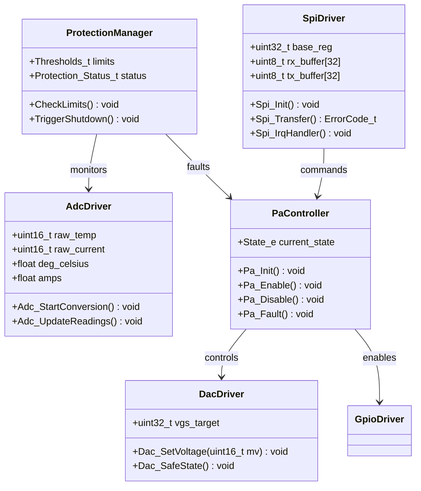
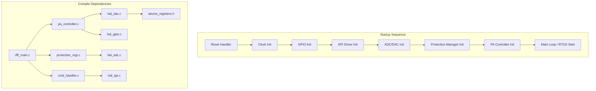
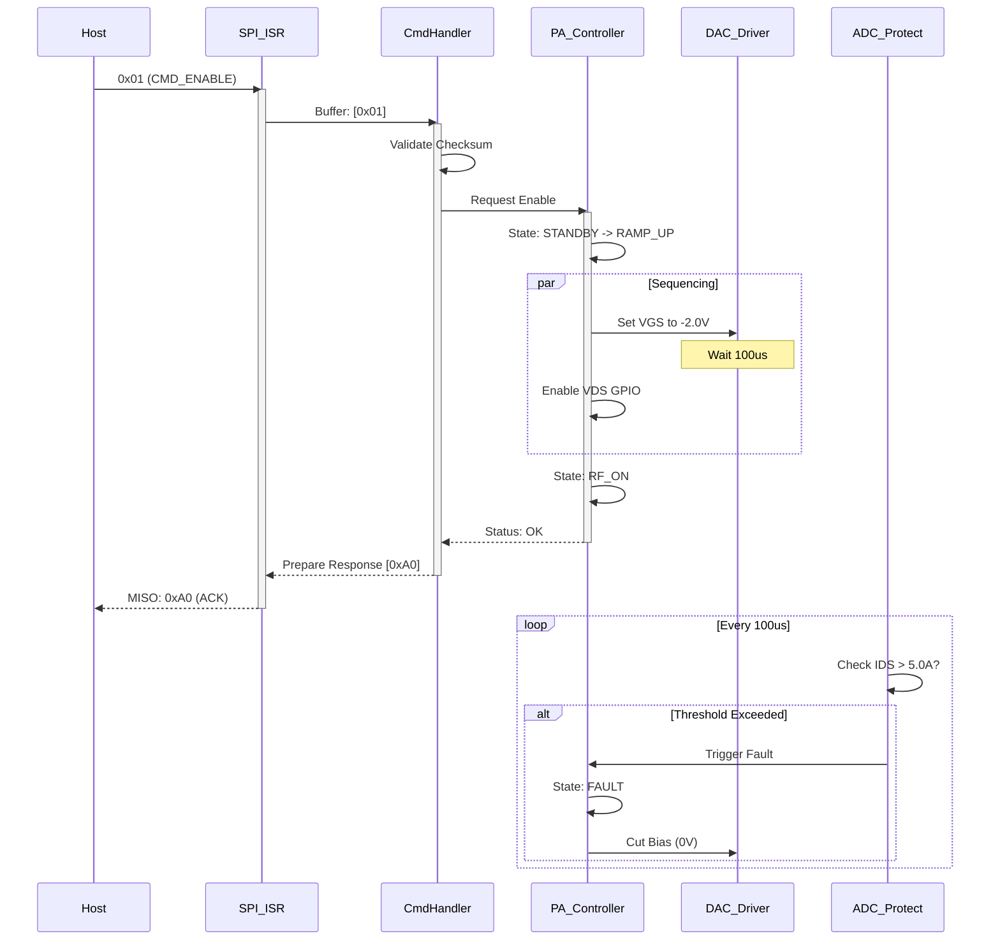
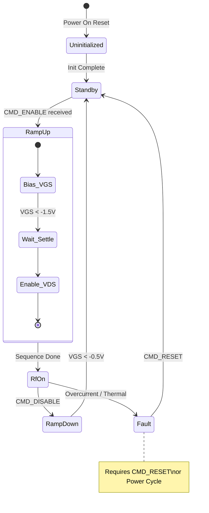

# Software Design Document (SDD)
**Project:** rfff (GaN RF Power Amplifier Control System)
**Version:** 1.0
**Date:** 2026-04-02
**Status:** Preliminary
**Standard:** IEEE 1016-2009

---

# 1. Introduction

## 1.1 Purpose
This Software Design Document (SDD) describes the architecture, data structures, interfaces, and algorithms of the **rfff** firmware. This firmware manages the GaN RF Power Amplifier (PA) biasing, power sequencing, and real-time protection mechanisms. The design prioritizes safety, response latency, and MISRA-C compliance.

## 1.2 Scope
The firmware runs on a Cortex-M4 class Microcontroller (MCU). It handles:
1.  **Power Sequencing:** Controlling the Gate ($V_{GS}$) and Drain ($V_{DS}$) ramp-up/down profiles.
2.  **Protection:** Real-time monitoring of temperature, current, and voltage via ADC to trigger shutdowns.
3.  **Communication:** Acting as an SPI Slave to a Host System for configuration and telemetry.
4.  **Diagnostics:** Managing status LEDs and fault logging.

## 1.3 Definitions
*   **GaN:** Gallium Nitride (PA technology requiring negative bias).
*   ***$V_{GS}$*:** Gate-to-Source Voltage (Controlled via DAC).
*   ***$I_{D}$*:** Drain Current (Monitored via ADC).
*   ***$T_{H}$*:** Heatsink Temperature (Monitored via ADC).
*   **Hysteresis:** Lag logic used for threshold comparisons to prevent chatter.

## 1.4 References
1.  **rfff SRS (Software Requirements Specification):** v1.0, 2026-04-02.
2.  **rfff GLR (Glue Logic Requirements):** v1.0, 2026-04-02.
3.  **rfff HRS (Hardware Requirements Specification):** v1.0, 2026-04-02.
4.  **MISRA-C:2012:** Guidelines for the use of the C language in critical systems.

---

# 2. Design Viewpoints

## 2.1 Context Viewpoint
The rfff software operates as the embedded intelligence within the RF PA Module. It interfaces with a Host Controller (Master) and the RF Power Stage (Analog/Digital Hardware).

```mermaid
C4Context
    title System Context - rfff Firmware
    Person(host, "Host System\n(FPGA/MPU)", "SPI Master")
    System_Boundary(rfff_module, "RF PA Module") {
        System(mcu_fw, "rfff Firmware\n(Cortex-M4)", "MCU Firmware")
        System(rf_stage, "RF Power Stage\n(GaN PA)", "Amplifier Hardware")
        System(sensors, "Sensors & DAC", "ADC, DAC, GPIO")
    }
    
    Rel(host, mcu_fw, "SPI Commands\n(CS, CLK, MOSI, MISO)", "SPI Protocol")
    Rel(mcu_fw, sensors, "Control & Telemetry", "I2C/GPIO/SPI")
    Rel(mcu_fw, rf_stage, "Enable Signals", "TTL Levels")
    Rel(sensors, rf_stage, "Analog Bias\n(V_GS, V_DS)", "Analog Voltage")
    Note(mcu_fw, "Real-time Fault Loop < 5us")
```

## 2.2 Composition Viewpoint
The software is architected as a layered static library. The Hardware Abstraction Layer (HAL) isolates the application logic from register manipulation.

```mermaid
componentDiagram
    namespace Application Layer {
        component AppStateMachine
        component ProtectionManager
        component CommandHandler
    }

    namespace Hardware Abstraction {
        component SpiDriver
        component AdcDriver
        component DacDriver
        component GpioDriver
    }

    namespace Utilities {
        component CircularBuffer
        component MathUtils
    }

    AppStateMachine --> DacDriver : uses
    AppStateMachine --> GpioDriver : uses
    ProtectionManager --> AdcDriver : uses
    ProtectionManager --> GpioDriver : uses
    CommandHandler --> SpiDriver : uses
    CommandHandler --> AppStateMachine : commands
    ProtectionManager --> AppStateMachine : triggers fault
    SpiDriver --> CircularBuffer : uses
```

## 2.3 Logical Viewpoint
Class structures are defined using C `struct`s and function pointers to encapsulate data and behavior, adhering to MISRA-C constraints on C++ features.



## 2.4 Dependency Viewpoint
The build system relies on specific module ordering. Hardware drivers (`HAL`) must be initialized before the Application layer.



## 2.5 Interface Viewpoint
This section defines the concrete C interfaces for the software modules.

### 2.5.1 Data Structures & Registers

```c
#include <stdint.h>
#include <stdbool.h>

/* -------------------------------------------------------------
 * MISRA-C Compliance: 
 * All padding explicitly handled or marked.
 * All types defined with explicit width (stdint.h).
 * ------------------------------------------------------------- */

/**
 * @brief Device Configuration Structure
 * @details Defines limits and calibration data loaded from NVM/Flash.
 */
typedef struct {
    float vgs_nominal;      /**< Nominal Gate Voltage in Volts (e.g., -2.0V) */
    float temp_warning_c;   /**< Warning threshold in Celsius */
    float temp_shutdown_c;  /**< Shutdown threshold in Celsius */
    float current_max_a;    /**< Max Current in Amps */
    uint32_t spi_clk_hz;    /**< SPI Clock frequency */
} DeviceConfig_t;

/**
 * @brief Analog Reading Structure
 */
typedef struct {
    uint16_t vds_raw;       /**< Raw ADC count Drain Voltage */
    uint16_t ids_raw;       /**< Raw ADC count Drain Current */
    uint16_t temp_raw;      /**< Raw ADC count Temp Sensor */
    float vds_volts;        /**< Scaled VDS */
    float ids_amps;         /**< Scaled IDS */
    float temp_c;           /**< Scaled Temp */
} AnalogData_t;

/**
 * @brief PA State Enum
 */
typedef enum {
    PA_STATE_UNINIT = 0,
    PA_STATE_STANDBY,       /**< VDS Off, VGS Off */
    PA_STATE_RAMP_UP,       /**< Sequencing active */
    PA_STATE_RF_ON,         /**< VDS On, VGS Biased */
    PA_STATE_FAULT,         /**< Latched Fault State */
    PA_STATE_RAMP_DOWN      /**< Shutdown sequence */
} PaState_e;

/**
 * @brief Hardware Register Map (Partial for GLR P6 Compliance)
 * @details Memory mapped structure for SPI peripheral.
 *          Base Address: 0x40013000
 */
typedef struct {
    volatile uint32_t CR1;      /**< Control Reg 1, Offset 0x00 */
    volatile uint32_t CR2;      /**< Control Reg 2, Offset 0x04 */
    volatile uint32_t SR;       /**< Status Reg, Offset 0x08 */
    volatile uint32_t DR;       /**< Data Reg, Offset 0x0C */
    volatile uint32_t CRCPR;    /**< CRC Poly, Offset 0x10 */
    volatile uint32_t RXCRCR;   /**< RX CRC, Offset 0x14 */
    volatile uint32_t TXCRCR;   /**< TX CRC, Offset 0x18 */
    uint32_t RESERVED1[2];      /**< Reserved padding */
    volatile uint32_t I2SCFGR;  /**< I2S Config, Offset 0x1C */
    volatile uint32_t I2SPR;    /**< I2S Prescaler, Offset 0x20 */
} SPI_RegMap_t;

#define SPI1_BASE  ((SPI_RegMap_t *) 0x40013000)
```

### 2.5.2 API Function Prototypes

```c
/**
 * @brief Initialize the PA Controller
 * @param config Pointer to configuration structure
 * @return 0 on success, -1 on invalid config
 */
int32_t PA_Init(const DeviceConfig_t *config);

/**
 * @brief Main State Machine Process
 * @details Must be called cyclically (e.g., every 1ms).
 */
void PA_Process(void);

/**
 * @brief Trigger a fault state immediately
 * @param fault_code Code identifying the fault source
 */
void PA_TriggerFault(uint8_t fault_code);

/**
 * @brief SPI Command Handler
 * @param rx_buf Pointer to received bytes
 * @param length Length of command
 * @param tx_buf Pointer to transmit buffer for response
 * @return Length of response
 */
uint16_t CMD_HandleByteStream(const uint8_t *rx_buf, uint16_t length, uint8_t *tx_buf);

/**
 * @brief Read ADC channels and update structure
 * @param data Pointer to store results
 */
void ADC_UpdateReadings(AnalogData_t *data);
```

## 2.6 Interaction Viewpoint
Sequence of a Power-On event triggered by the Host System via SPI.



## 2.7 State Viewpoint
The PA Controller operates a finite state machine (FSM) to handle timing and safety critical transitions.



## 2.8 Algorithm Viewpoint

### 2.8.1 Power Sequencing Algorithm
The GaN PA requires specific sequencing to avoid "Shoot-through" currents. The drain voltage must not be applied until the Gate is negatively biased.

**Pseudocode / Logic:**

```c
/**
 * Logic: PA_RampUpSequence
 * Reference: REQ-HW-011 (Sequencing)
 */
void PA_RampUpSequence(void) {
    // 1. Ensure Drain is OFF
    GPIO_WritePin(PIN_VDS_ENABLE, LOW);
    
    // 2. Apply Gate Bias (Negative Voltage)
    // Target: -2.0V relative to source.
    // DAC Logic: Assuming DAC 0-3.3V maps to -5V to +0V via OpAmp
    DAC_SetChannel(DAC_CHAN_GATE, GATE_BIAS_CODE_NEG_2V);
    
    // 3. Wait for Gate Capacitance to charge
    // Assumption: Time constant = 10us. Waiting 50us for margin.
    Delay_Microseconds(50); 
    
    // 4. Check Gate Feedback (if available) or Timeout
    if (ADC_Read(GATE_SENSE) > GATE_THRESHOLD) {
        // Gate failed to bias
        PA_TriggerFault(FAULT_GATE_BIAS);
        return;
    }
    
    // 5. Enable Drain Voltage (28V Rail)
    GPIO_WritePin(PIN_VDS_ENABLE, HIGH);
    
    // 6. Update State
    pa_state = PA_STATE_RF_ON;
}
```

### 2.8.2 Overcurrent Protection Loop
This runs in a high-priority Interrupt Service Routine (ISR) or the highest priority RTOS task.

```c
/**
 * Logic: ProtectionLoop
 * Trigger: ADC Conversion Complete (Sampling Rate: 200 kHz)
 */
void ProtectionLoop(void) {
    static uint8_t fault_counter = 0;
    
    // 1. Read instantaneous current
    float current_instant = ADC_ToAmps(ADC_ReadRaw(CURRENT_SENSE_CHAN));
    
    // 2. Compare against Dynamic Threshold (e.g. 6.0A)
    // Using Hysteresis to prevent oscillation at the boundary
    if (current_instant > 6.0f) {
        fault_counter++;
    } else if (current_instant < 5.5f) {
        fault_counter = 0; // Reset hysteresis
    }
    
    // 3. Debounce (3 consecutive samples must be high to trip)
    // 3 samples @ 200kHz = 15us reaction time
    if (fault_counter >= 3) {
        GPIO_WritePin(PIN_VDS_ENABLE, LOW); // Hard cut VDS
        DAC_SetChannel(DAC_CHAN_GATE, 0);   // Cut VGS
        pa_state = PA_STATE_FAULT;
        SetAlarmFlag(ALARM_OVERCURRENT);
    }
}
```

---

# 3. Design Rationale

The architecture prioritizes **Safety** and **Real-Time Determinism**.

1.  **MCU as Central Controller:** The chosen architecture places the MCU between the Host and the PA. This satisfies **REQ-SW-002** (Sequencing) by abstracting the complex analog timing requirements from the Host system. The Host simply sends "ON/OFF", and the MCU handles the microsecond-level timing.
2.  **ADC Polling vs. Interrupts:** For the protection loop (Algo 2.8.2), we utilize ADC conversion complete interrupts. This ensures the 5µs response time (**REQ-SW-005**) is met regardless of main loop blocking.
3.  **State Machine:** The use of a strict Finite State Machine (FSM) prevents illegal states. For example, the FSM explicitly forbids transitioning directly from `STANDBY` to `RF_ON` without passing through `RAMP_UP`, ensuring the bias timing is always respected.
4.  **MISRA-C Compliance:** By avoiding dynamic memory allocation (`malloc`) and complex pointer arithmetic, we reduce the risk of memory leaks and crashes in the embedded environment.

---

# 4. Traceability

The following table maps SDD elements to the requirements defined in the SRS.

| ID | SDD Element | Requirement | Description |
| :--- | :--- | :--- | :--- |
| **SDD-2.8.1** | PA_RampUpSequence | **REQ-SW-002** | Power Sequencing Logic |
| **SDD-2.8.2** | ProtectionLoop | **REQ-SW-005** | Overcurrent Protection < 5us |
| **SDD-2.5.1** | AnalogData_t struct | **REQ-SW-004** | Telemetry Formatting |
| **SDD-2.7** | PA State Machine | **REQ-SW-003** | Operational States |
| **SDD-2.5.1** | SPI_RegMap_t | **REQ-SW-001** | SPI Slave Interface |
| **SDD-2.3** | AdcDriver class | **REQ-HW-006** | ADC Monitoring Interface |
| **SDD-2.8.2** | `fault_counter` logic | **REQ-SW-006** | Fault Debouncing |
| **SDD-2.1** | System Context | **REQ-SW-007** | Status Reporting |