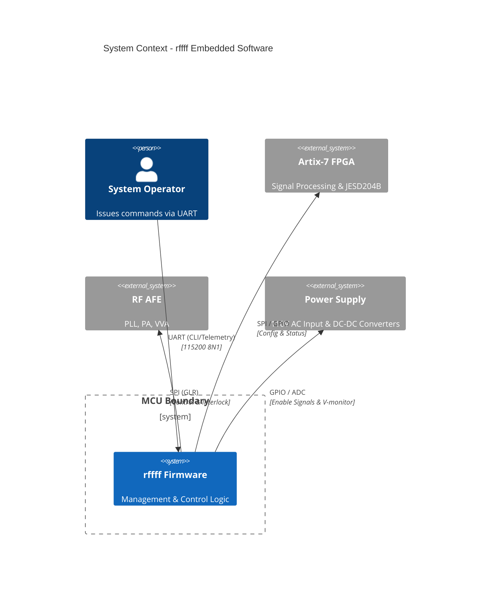
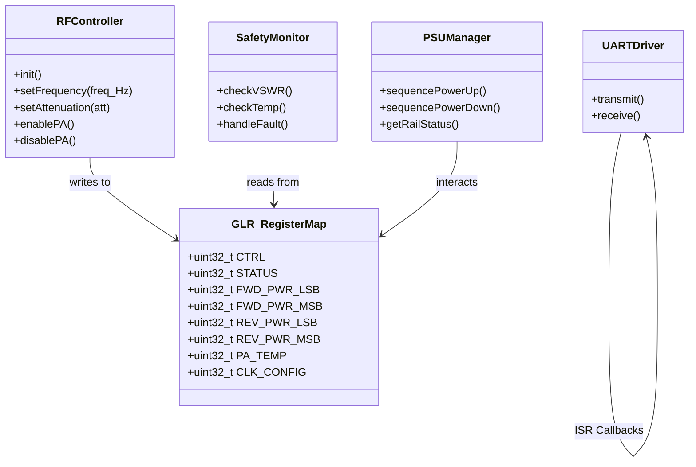
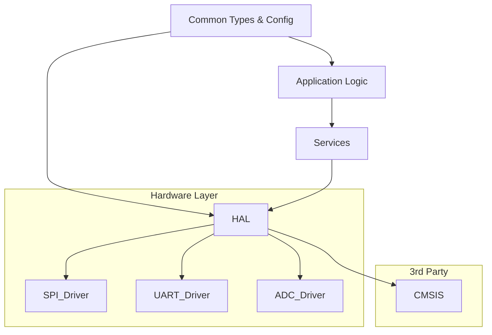
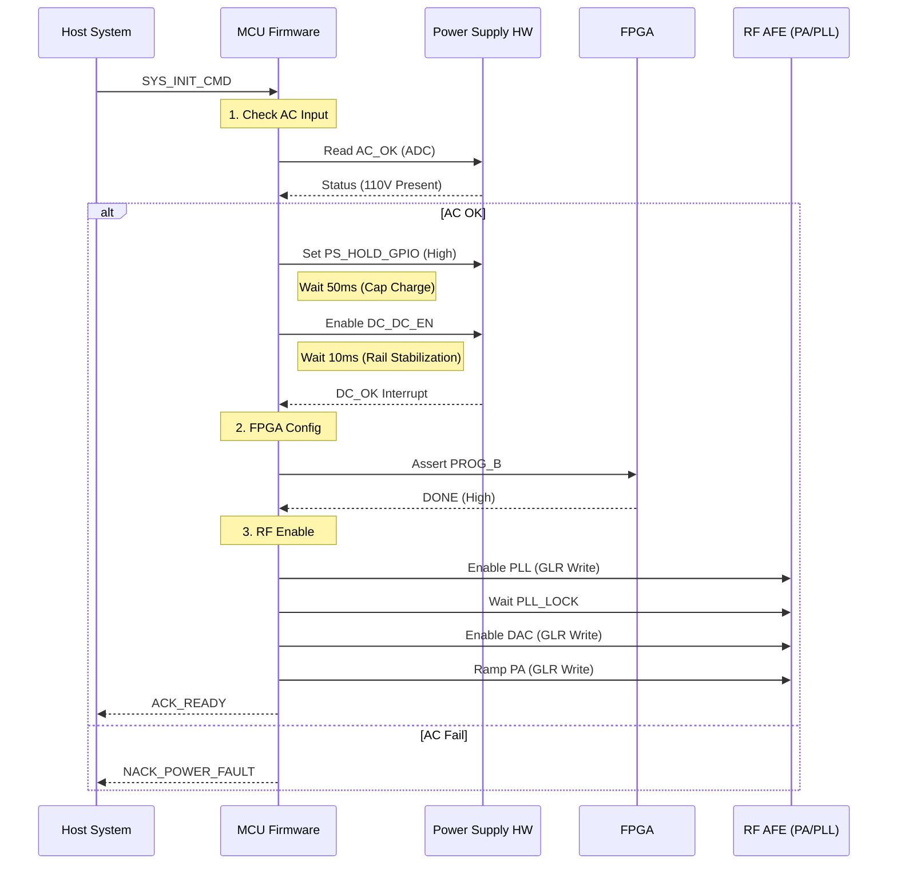
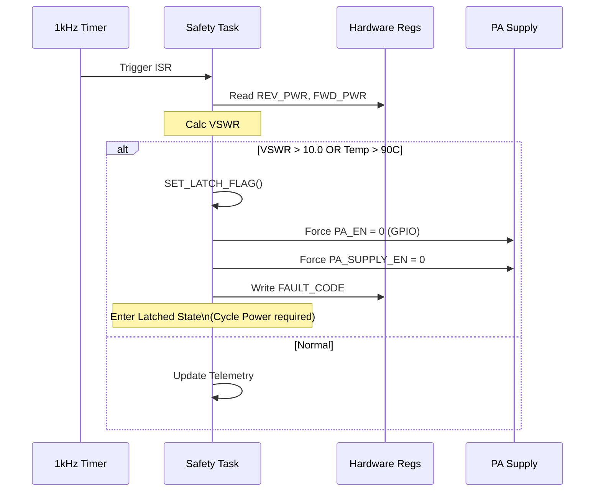
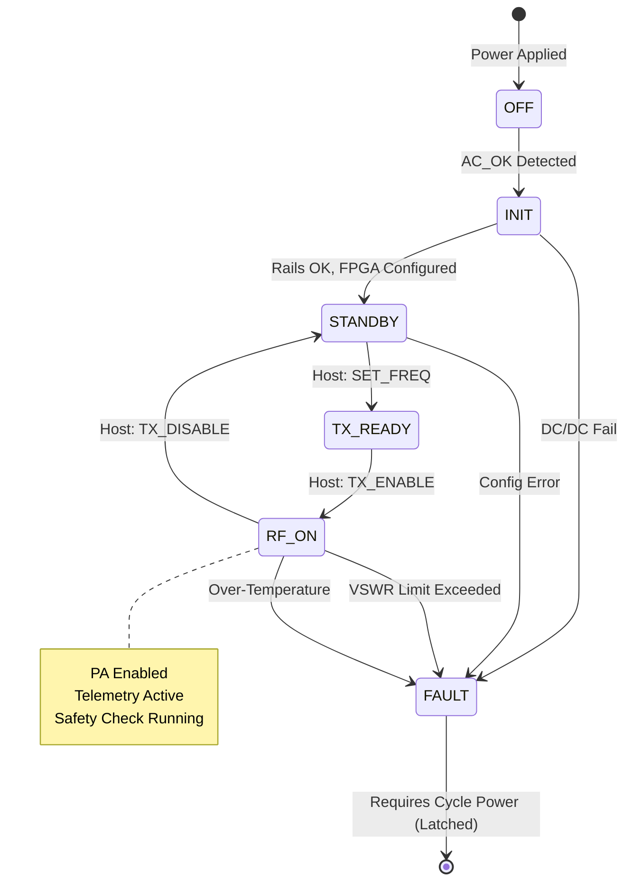

# SOFTWARE DESIGN DOCUMENT (SDD)
**Project:** rffff High-Power RF Transmit System
**Version:** 1.0
**Date:** 2026-04-03
**Status:** Preliminary
**Author:** Senior Software Architect
**Standard:** IEEE 1016-2009

---

# 1. Introduction

## 1.1 Purpose
This Software Design Document (SDD) details the architectural and low-level design of the **rffff** embedded controller software. It defines the software structure, data organization, interfaces, and algorithms necessary to manage the RF Power Amplifier (PA), Local Oscillator (PLL), Power Supply Unit (PSU), and FPGA interfaces.

## 1.2 Scope
The design encompasses the firmware running on the System Management MCU (ARM Cortex-M4). The scope includes:
*   **Control Loop:** Real-time monitoring of VSWR and Temperature for interlock safety.
*   **Connectivity:** SPI drivers for the Glue Logic Registers (GLR) and PLL; UART for the Host CLI.
*   **Power Management:** State machine for AC/DC and DC/DC sequencing.
*   **Data Processing:** Sampling of ADCs (Forward/Reverse Power) and calculation of metrics.

## 1.3 Definitions
*   **GLR:** Glue Logic Register map accessed via SPI.
*   **VSWR:** Voltage Standing Wave Ratio (calculated from FWD/REV power).
*   **INTF:** Interlock Fault (unsafe condition).

## 1.4 References
1.  **rffff SRS v1.0:** Software Requirements Specification.
2.  **rffff HRS v1.0:** Hardware Requirements Specification.
3.  **rffff GLR:** Glue Logic Requirements & Register Map.
4.  **MISRA-C:2012:** Guidelines for the use of the C language in critical systems.

---

# 2. Design Viewpoints

## 2.1 Context Viewpoint
The rffff software acts as the system manager, situated between the Host Controller (User/System) and the Hardware Subsystems (RF Chain, Power, FPGA).



## 2.2 Composition Viewpoint
The software is architected as a layered, modular system using an RTOS kernel (assumed FreeRTOS or similar). Hardware abstraction is strictly enforced to support MISRA compliance and testing.

```mermaid
componentDiagram
    namespace Application Layer {
        component["CLI Task"]
        component["Control Task"]
        component["Monitor Task"]
    }
    
    namespace Services Layer {
        component["Fault Manager"]
        component["Command Parser"]
        component["Safety Algorithm"]
    }

    namespace HAL (Hardware Abstraction) {
        component["SPI Driver"]
        component["UART Driver"]
        component["ADC Driver"]
        component["Timer Driver"]
    }

    Application --> Services : uses
    Services --> HAL : calls
```

## 2.3 Logical Viewpoint
The static structure defines the core data objects. The `GLR_RegisterMap` directly overlays the memory-mapped structure defined in the GLR.



## 2.4 Dependency Viewpoint
Build order and module dependencies. The `Common` module contains definitions used by all other modules.



## 2.5 Interface Viewpoint

### 2.5.1 C Struct: GLR Register Map (Memory Mapped SPI/IO)
This structure maps directly to the GLR defined in the SRS. Address offsets are relative to the base select address.
*Assumption: SPI interface requires 32-bit read/write transactions.*

```c
/**
 * @brief Glue Logic Register Map Definition
 * @details Aligns with rffff GLR Specification.
 *          Access via 32-bit SPI transactions.
 */
typedef struct
{
    volatile uint32_t CTRL;         /**< 0x00: Control Register (R/W) */
    volatile uint32_t STATUS;       /**< 0x04: Status Register (RO) */
    volatile uint32_t FWD_PWR_LSB;  /**< 0x08: Forward Power LSB */
    volatile uint32_t FWD_PWR_MSB;  /**< 0x0C: Forward Power MSB */
    volatile uint32_t REV_PWR_LSB;  /**< 0x10: Reverse Power LSB */
    volatile uint32_t REV_PWR_MSB;  /**< 0x14: Reverse Power MSB */
    volatile uint32_t PA_TEMP;      /**< 0x18: PA Temperature (Raw ADC) */
    volatile uint32_t CLK_CONFIG;   /**< 0x1C: Clock/PLL Config */
    volatile uint32_t RESERVED[8];  /**< 0x20 - 0x3F: Space */
    volatile uint32_t LOCK_STATUS;  /**< 0x40: Interlock Fault Status */
} GLR_RegisterMap_t;

/* Bit Fields for CTRL Register */
#define GLR_CTRL_PA_EN_POS      0U
#define GLR_CTRL_PLL_EN_POS     1U
#define GLR_CTRL_DAC_RST_N_POS  2U
#define GLR_CTRL_FREQ_SEL_POS   3U
#define GLR_CTRL_FREQ_SEL_MSK   0x00000003U

/* Bit Fields for STATUS Register */
#define GLR_STATUS_AC_OK_POS    0U
#define GLR_STATUS_DC_OK_POS    1U
#define GLR_STATUS_PLL_LOCK_POS 2U
```

### 2.5.2 API Function Prototypes
*Requirement Traceability: Maps to SRS REQ-SW-003 (Control), REQ-SW-004 (Safety).*

```c
/**
 * @brief Initialize the RF Subsystem
 * @param base Pointer to register map base address
 * @return int32_t 0 on success, -1 on GPIO init failure
 * @trace REQ-SW-001 (Init)
 */
int32_t RF_Init(const volatile GLR_RegisterMap_t* base);

/**
 * @brief Set the Local Oscillator Frequency
 * @param freq_hz Desired frequency in Hz (5e9 to 10e9)
 * @return int32_t 0 on success, -1 if frequency out of bounds
 * @trace REQ-SW-002 (Frequency Agility)
 */
int32_t RF_SetFrequency(uint64_t freq_hz);

/**
 * @brief Execute the Power-Up Sequence
 * @details Sequences AC/DC enable, DC-DC enable, and PA enable.
 *          Implements timing delays (t1, t2) per HRS.
 * @return int32_t 0 on success, -1 on fault during startup
 * @trace REQ-SW-003 (Power Management)
 */
int32_t PSU_PowerUpSequence(void);

/**
 * @brief Monitor Safety Loop
 * @details Calculates VSWR and checks Temp. Triggers latch-off if unsafe.
 * @return SafetyState_tSAFE or FAULT
 * @trace REQ-SW-004 (Safety & Telemetry)
 */
SafetyState_t SAFETY_MonitorLoop(void);
```

## 2.6 Interaction Viewpoint

### 2.6.1 Power-Up Sequence
Trace: `REQ-SW-003`, `REQ-HW-007`



### 2.6.2 Fault Injection Sequence
Trace: `REQ-SW-004` (VSWR > 10:1 or Temp > 90°C)



## 2.7 State Viewpoint

### 2.7.1 System Manager State Machine
The main controller logic manages states from Power-Off to RF Transmit.



## 2.8 Algorithm Viewpoint

### 2.8.1 VSWR Calculation (Fixed Point)
To avoid heavy floating-point libraries on the MCU (MISRA-C preference), VSWR is calculated using fixed-point arithmetic.
*Inputs:* `fwd` (12-bit ADC), `rev` (12-bit ADC).
*Constants:* `VSWR_LIMIT = 10.0`

```pseudocode
ALGORITHM: CALC_VSWR
INPUT: fwd_adc (uint16), rev_adc (uint16)
OUTPUT: vswr_value (float), fault (bool)

CONSTANTS:
    REF_IMPEDANCE = 50
    ADC_MAX = 4095

// Convert ADC to linear power (approximate) or Voltage squared
// P ~ V^2. 
// Let's assume ADC maps to Voltage magnitude directly for simplicity.

IF fwd_adc < 10 THEN
    RETURN 0.0 // Noise floor
END IF

// Gamma = |(Vref - Vfwd) / (Vref + Vfwd)|
// Simplified for magnitude reflection coeff: Gamma = sqrt(Rev / Fwd)
// Using fixed point scaling (x100)

// Avoid division by zero
numer = (rev_adc * 100) 
denom = fwd_adc 

IF denom == 0 THEN
    RETURN 99.9
END IF

reflection_coeff = SQRT(numer / denom) // Fixed Point Sqrt

IF reflection_coeff >= 100 THEN
    RETURN 99.9
END IF

// VSWR = (1 + Gamma) / (1 - Gamma)
num_vswr = 100 + reflection_coeff
den_vswr = 100 - reflection_coeff

vswr_val = (num_vswr * 100) / den_vswr // Scale to 2 decimal places

IF vswr_val > 1000 THEN // 10.00 * 100
    FAULT = TRUE
ELSE
    FAULT = FALSE
END IF
```

---

# 3. Design Rationale

### 3.1 Architecture Choice
**State Machine Over Super-Loop:** The design employs an explicit State Machine (Section 2.7) rather than a linear `while(1)` loop. This is necessary to handle the asynchronous nature of faults (e.g., VSWR spike) which require immediate transition to a `FAULT` state regardless of the current processing activity.

### 3.2 Memory Layout
The GLR is accessed via SPI. A "Shadow RAM" approach is used. The software maintains a local copy of the `GLR_RegisterMap_t` struct.
*   **Writes:** Update local struct -> Trigger SPI Transfer -> Update Hardware.
*   **Reads:** Trigger SPI Transfer -> Update local struct -> Read value.
*   *Rationale:* SPI transactions are slow (10MHz). Reading multiple registers individually would cause unacceptable latency in the safety loop. Shadowing allows bulk reads or single-access logic.

### 3.3 Safety Implementation
The VSWR calculation uses integer arithmetic where possible. The fault latching is implemented in hardware via the `GLR_LOCK_STATUS` register (Latching logic in FPGA/CPLD), with the software responsible for initiating the latch and preventing reset.

---

# 4. Traceability

| SDD Element | Description | SRS ID | HRS ID |
| :--- | :--- | :--- | :--- |
| `PSU_PowerUpSequence` | Power Sequencing Logic | REQ-SW-003 | REQ-HW-007 |
| `GLR_RegisterMap_t` | Hardware Interface | REQ-SW-001 | GLR P6 |
| `SAFETY_MonitorLoop` | VSWR & Temp Monitor | REQ-SW-004 | REQ-HW-009 |
| `RF_SetFrequency` | PLL Tuning | REQ-SW-002 | Analog Devices Spec |
| `CLI_Task` | UART Interface | REQ-SW-005 | - |

---

**Sign-off:**
________________________ _______________
Architect Date