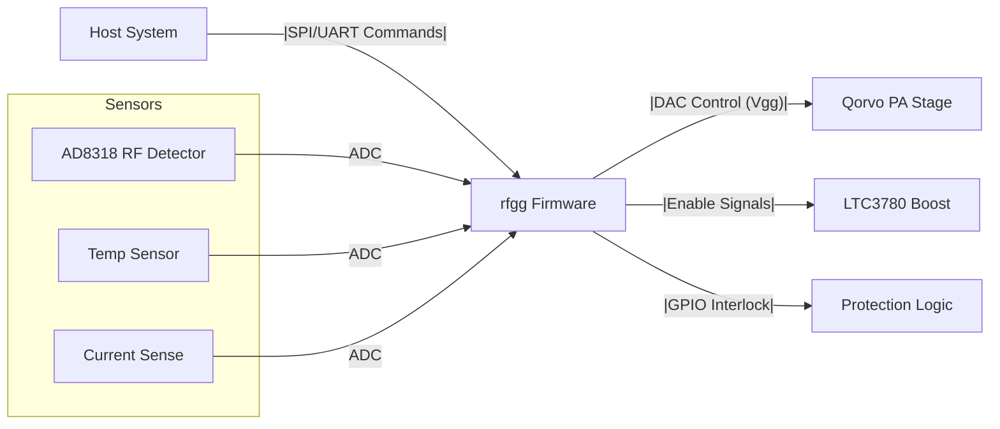
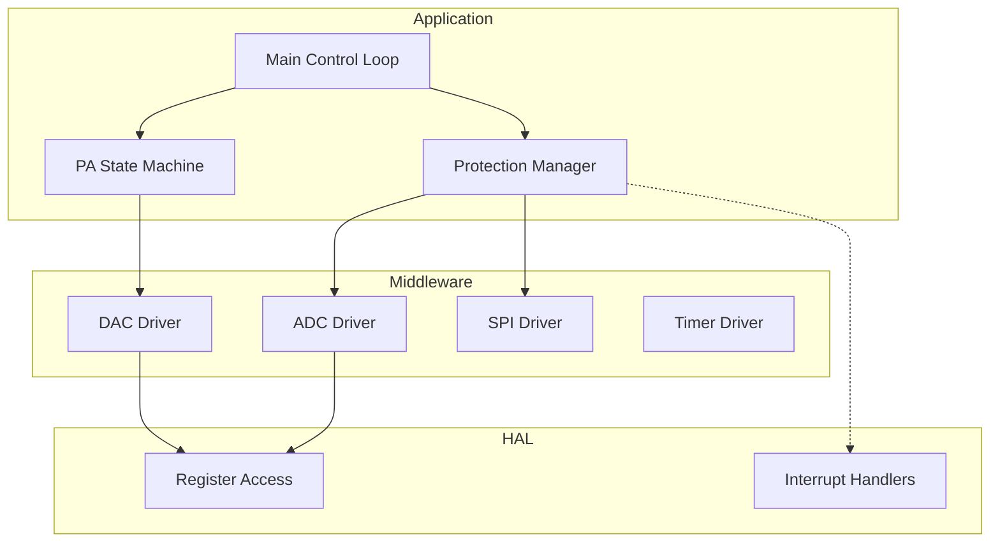
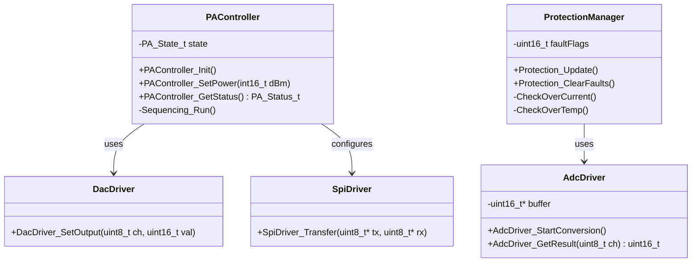
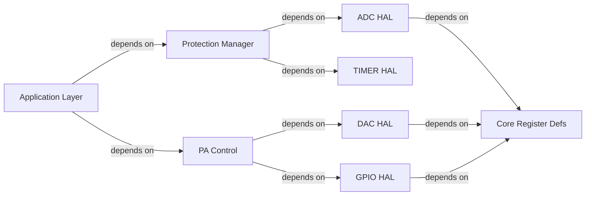
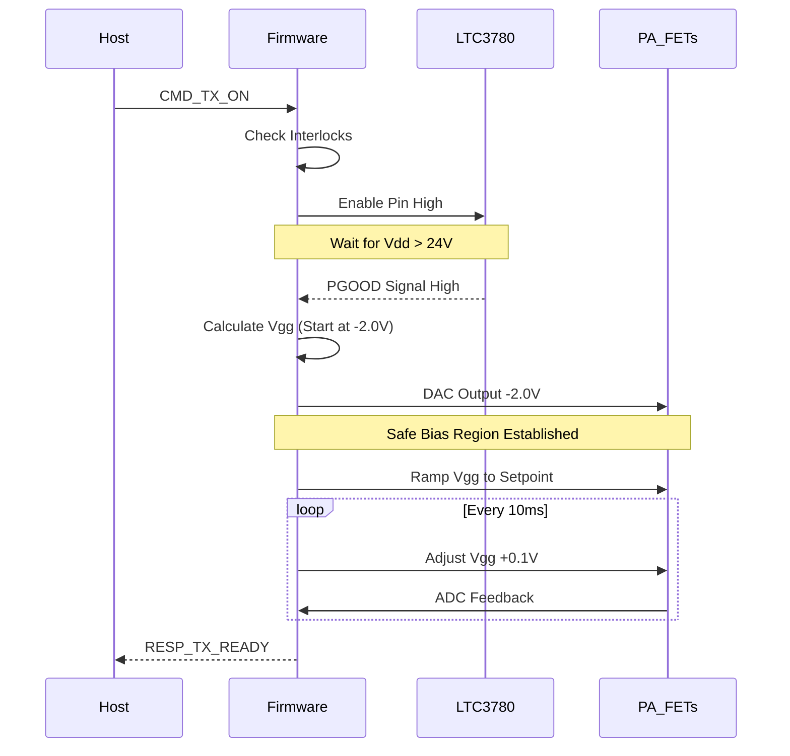
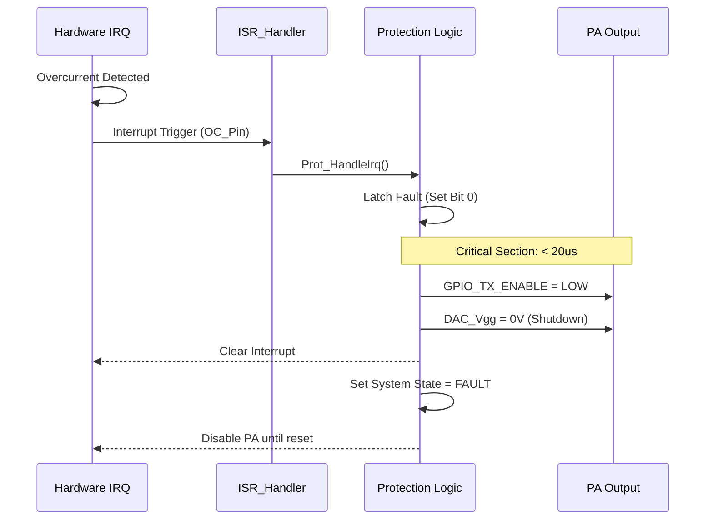
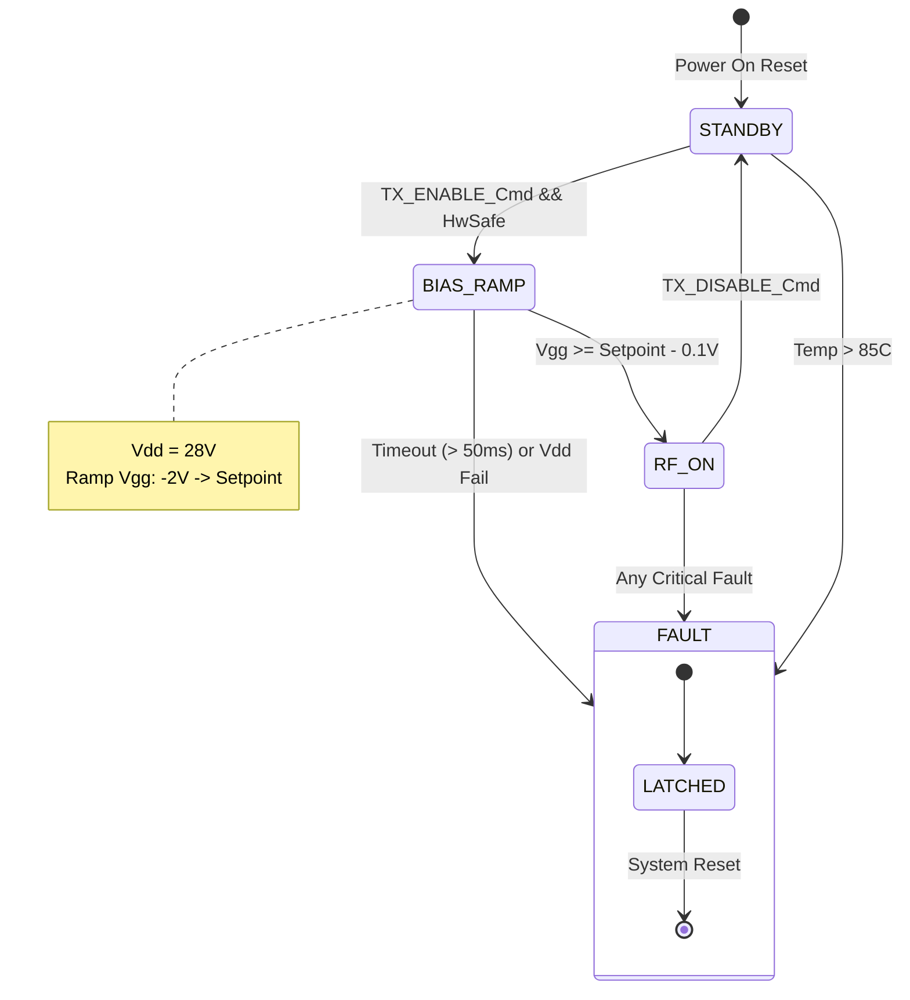

```markdown
# SOFTWARE DESIGN DOCUMENT (SDD)

**Project:** rfgg Embedded Control System
**Version:** 1.0
**Date:** 2026-04-04
**Status:** Preliminary
**Standard:** IEEE 1016-2009

---

# 1. Introduction

## 1.1 Purpose
This Software Design Document (SDD) describes the architectural structure and detailed design of the **rfgg** firmware. It translates the **rfgg Software Requirements Specification (SRS)** into a concrete implementation plan suitable for a 32-bit ARM Cortex-M4 microcontroller. The design prioritizes safety, real-time responsiveness (< 100µs fault response), and MISRA-C compliance.

## 1.2 Scope
The design covers the complete firmware stack including:
*   **Hardware Abstraction Layer (HAL):** Drivers for ADC, DAC, SPI, GPIO, and Timer peripherals.
*   **Control Logic:** State machines for PA bias sequencing and protection.
*   **Communication Protocol:** Packet parsing and handling for the host interface.
*   **Diagnostics:** Sensor data acquisition and filtering.

## 1.3 Definitions
| Term | Definition |
| :--- | :--- |
| **DAC** | Digital-to-Analog Converter: Used to control Gate Bias voltage (Vgg). |
| **FW** | Firmware: The embedded software running on the microcontroller. |
| **LTC3780** | Boost Controller IC: Requires software enable and feedback monitoring. |
| **PA** | Power Amplifier: The Qorvo QPA9226 and QPA9426 cascade. |
| **Vgg** | Gate Bias Voltage: The negative voltage applied to the GaN FET gates. |
| **VSWR** | Voltage Standing Wave Ratio: Derived from Forward/Reverse power readings. |

## 1.4 References
1.  **rfgg SRS**, Rev 1.0 (Software Requirements).
2.  **rfgg HRS**, Rev 1.0 (Hardware Requirements).
3.  **MISRA-C:2012** Guidelines.
4.  **Cortex-M4 Technical Reference Manual**.

---

# 2. Design Viewpoints

## 2.1 Context Viewpoint
The rfgg firmware operates as the central controller between the Host System and the RF Power Chain. It accepts high-level commands and regulates physical hardware while monitoring for electrical faults.



## 2.2 Composition Viewpoint
The software is structured into a layered architecture. The Hardware Abstraction Layer (HAL) isolates the application logic from register-level manipulation. The Middleware layer handles signal processing and protocol management. The Application layer contains the state machines.



## 2.3 Logical Viewpoint
This section details the static class structure of the firmware.



## 2.4 Dependency Viewpoint
The build system must link components based on the following dependency graph. The Application Layer depends on all Middleware layers. The HAL is self-contained but utilized by the drivers.



## 2.5 Interface Viewpoint

### 2.5.1 Data Structures

**Register Map (Peripheral Base Address: `0x40000000` assumed for example)**
```c
/**
 * @brief  Structure representing the ADC Register Map
 * @note   Memory mapped alignment required
 */
typedef struct {
    __IO uint32_t STATUS;      /* 0x00: Status Register */
    __IO uint32_t CTRL;        /* 0x04: Control Register */
    __IO uint32_t DATA[8];     /* 0x08-0x24: Data Channels 0-7 */
    __IO uint32_t INT_EN;      /* 0x28: Interrupt Enable */
} ADC_Regs_t;

/**
 * @brief  Structure representing the DAC Register Map
 */
typedef struct {
    __IO uint32_t CTRL;        /* 0x00: Control Register */
    __IO uint32_t CH0_DATA;    /* 0x04: Channel 0 Value (Vgg) */
    __IO uint32_t CH1_DATA;    /* 0x08: Channel 1 Value (Trim) */
} DAC_Regs_t;

#define ADC_BASE_PTR ((ADC_Regs_t *) 0x40012000U)
#define DAC_BASE_PTR ((DAC_Regs_t *) 0x40013000U)
```

**System State Structures**
```c
/**
 * @brief  PA State Machine Enumeration
 */
typedef enum {
    PA_STATE_OFF = 0U,
    PA_STATE_RAMPING,
    PA_STATE_ON,
    PA_STATE_FAULT,
    PA_STATE_MAX
} PA_State_t;

/**
 * @brief  System Telemetry Data Structure
 * @trace REQ-SW-006, REQ-SW-007
 */
typedef struct {
    int16_t forwardPower_dBm;   /* Scaled Q15 fixed point */
    int16_t reversePower_dBm;
    int16_t temperature_C;      /* Degrees Celsius */
    uint16_t current_mA;        /* Milliamps */
    uint32_t fault_word;        /* Bitmask of active faults */
} TelemetryData_t;
```

### 2.5.2 API Functions

**Application Interface**
```c
/**
 * @brief  Initializes the PA Controller hardware and software state
 * @retval 0 on success, -1 on failure
 * @trace REQ-SW-001
 */
int32_t PA_Init(void);

/**
 * @brief  Enables the PA chain
 * @note   This function blocks for up to 50ms for sequencing
 * @retval 0 on success
 * @trace REQ-SW-002
 */
int32_t PA_Enable(void);

/**
 * @brief  Disables the PA chain immediately
 * @retval None
 * @trace REQ-SW-003
 */
void PA_Disable(void);

/**
 * @brief  Sets the target output power
 * @param target_dBm: Desired output power (-10.0 to +40.0 dBm)
 * @retval 0 on success, -1 if target is out of range
 * @trace REQ-SW-005
 */
int32_t PA_SetPower(float target_dBm);
```

**Hardware Interface (HAL)**
```c
/**
 * @brief  Reads a specific ADC channel
 * @param channel: Channel ID (0-7)
 * @retval 12-bit raw ADC value (0-4095)
 */
uint16_t HAL_ADC_Read(uint8_t channel);

/**
 * @brief  Writes a value to the DAC
 * @param channel: Channel ID
 * @param value: 12-bit value to write
 */
void HAL_DAC_Write(uint8_t channel, uint16_t value);
```

## 2.6 Interaction Viewpoint

### 2.6.1 Power-Up Sequence
The following sequence ensures the PA is powered safely to prevent device destruction.



### 2.6.2 Fault Response
The system reacts to faults within the required 100µs window.



## 2.7 State Viewpoint
The PA Controller operates a hierarchical state machine to manage the high-power RF stages.



## 2.8 Algorithm Viewpoint

### 2.8.1 Closed Loop Power Control (Leaky Integrator)
To maintain +40 dBm output despite thermal drift, the firmware adjusts Vgg. This algorithm runs at 1 kHz.

**Pseudocode:**
```c
/*
 * Target: 40.0 dBm
 * Input: ADC_RF_DET (0-4095) mapped to approx 10-60 dBm
 * Output: DAC_Vgg (0-4095)
 */
const float TARGET_POWER_DBM = 40.0f;
const float Kp = 10.0f;  /* Proportional Gain */
const float Ki = 0.5f;   /* Integral Gain */

float error_integral = 0.0f;

void Control_Loop_Update(void) {
    float current_power = Telemetry.forwardPower_dBm;
    float error = TARGET_POWER_DBM - current_power;
    
    /* Anti-windup: Clamp integral term */
    if (error < 5.0f) { 
        error_integral += error * 0.001f; /* dt = 1ms */
    }
    
    /* Calculate Control Output */
    float correction = (error * Kp) + (error_integral * Ki);
    
    /* Convert dBm correction to DAC step (empirical: 0.1dBm = 3 DAC steps) */
    int16_t dac_adjust = (int16_t)(correction * 3.0f);
    
    /* Apply to current Vgg setpoint */
    uint16_t new_dac = Get_Current_Vgg() + dac_adjust;
    
    /* Safety Limits */
    if (new_dac < 2000U) new_dac = 2000U; /* -2.0V approx */
    if (new_dac > 3500U) new_dac = 3500U; /* Max Bias */
    
    HAL_DAC_Write(CH_VGG, new_dac);
}
```

### 2.8.2 Exponential Moving Average (EMA) Filter
Raw ADC inputs are noisy. The firmware applies an EMA filter for display values.

**C Implementation:**
```c
#define EMA_ALPHA 0.1f /* Smoothing factor */

uint16_t Filter_EMA(uint16_t raw_input, uint16_t *prev_state) {
    /* y[n] = alpha * x[n] + (1-alpha) * y[n-1] */
    float result = (EMA_ALPHA * (float)raw_input) + 
                   ((1.0f - EMA_ALPHA) * (float)*prev_state);
    
    *prev_state = (uint16_t)result;
    return *prev_state;
}
```

---

# 3. Design Rationale

### 3.1 Architecture Selection
*   **Choice:** State Machine + Polling vs. Pure RTOS Task approach.
*   **Rationale:** The timing requirements are extremely tight for fault handling (100µs). While a generic RTOS (like FreeRTOS) is suitable for communication, the Protection Logic is implemented in a high-priority ISR and a fast cyclic executive loop to guarantee worst-case latency. Using a full RTOS task for protection might introduce context-switch overhead that risks violating the 100µs window.

### 3.2 Biasing Strategy
*   **Choice:** DAC control of Vgg instead of fixed resistors.
*   **Rationale:** GaN devices vary widely with temperature. To meet the +40 dBm output requirement (REQ-SW-005) and maintain linearity, a closed-loop control system adjusting the Gate Bias is necessary.

### 3.3 Data Types
*   **Choice:** Fixed-point (Q15) or Floats for Power?
*   **Rationale:** The Cortex-M4 includes a hardware FPU. Using `float` for the PID loop is more readable and the performance cost is negligible compared to the ADC conversion time.

---

# 4. Traceability

| Design Element | ID | Description | Maps to SRS Requirement |
| :--- | :--- | :--- | :--- |
| `PA_Enable()` | D-001 | Sequencing Logic | REQ-SW-002 |
| `ADC_Regs_t` | D-002 | ADC Memory Map | REQ-SW-006 |
| `ProtectionManager` | D-003 | Fault Polling Class | REQ-SW-014 |
| `Control_Loop_Update()`| D-004 | PID Algorithm | REQ-SW-005 |
| `PA_SetPower()` | D-005 | Power Config API | REQ-SW-005 |
| `Prot_HandleIrq()` | D-006 | Interrupt Handler | REQ-SW-014 |
| `Filter_EMA()` | D-007 | Signal Conditioning | REQ-SW-007 |

---

# 5. Appendix: Parameter Tables
*See specific sections 2.5 and 2.8 for actual values.*

**Assumptions for Default Values:**
*   **ADC Vref:** 3.3V
*   **PA Vdd Safe Threshold:** 24.0V
*   **OverTemp Threshold:** 85°C
*   **Bias Start Voltage:** -2.5V (DAC Code 1500)
*   **Bias Max Voltage:** -0.5V (DAC Code 3800)

**Default Timing:**
*   **ADC Sampling Rate:** 100 kSps
*   **Power Loop Update:** 1 ms (1 kHz)
*   **Comms Timeout:** 50 ms
```