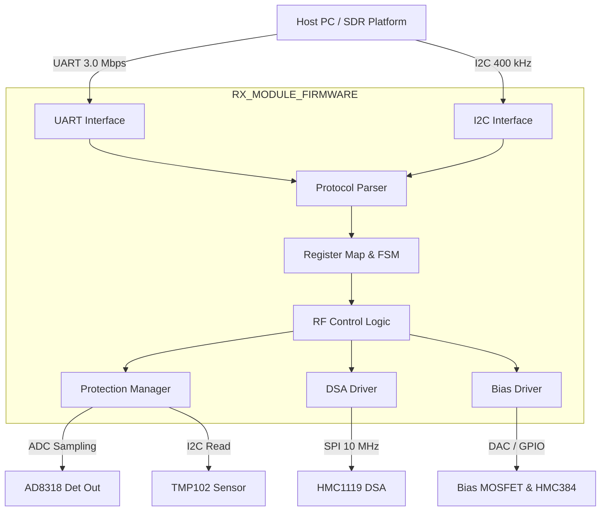
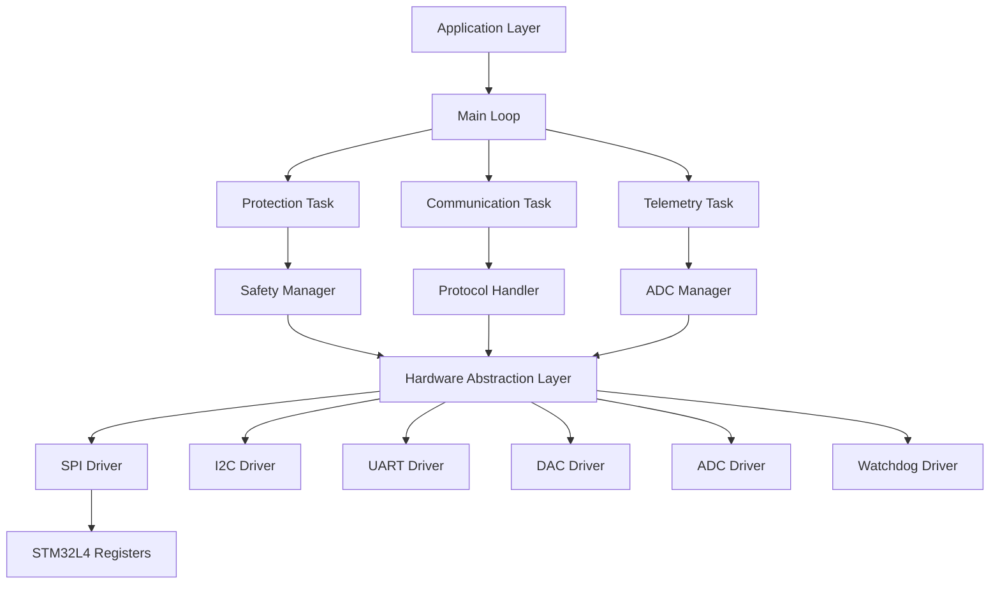
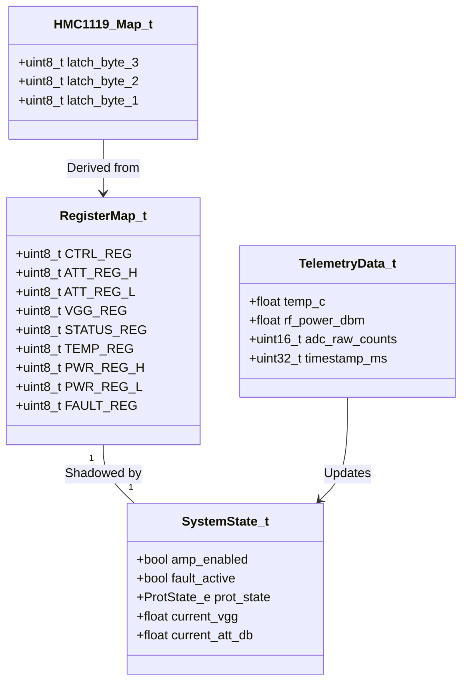
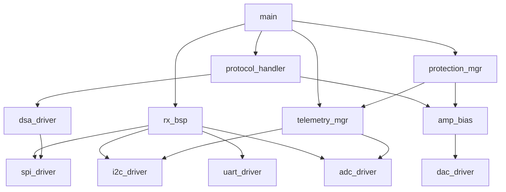
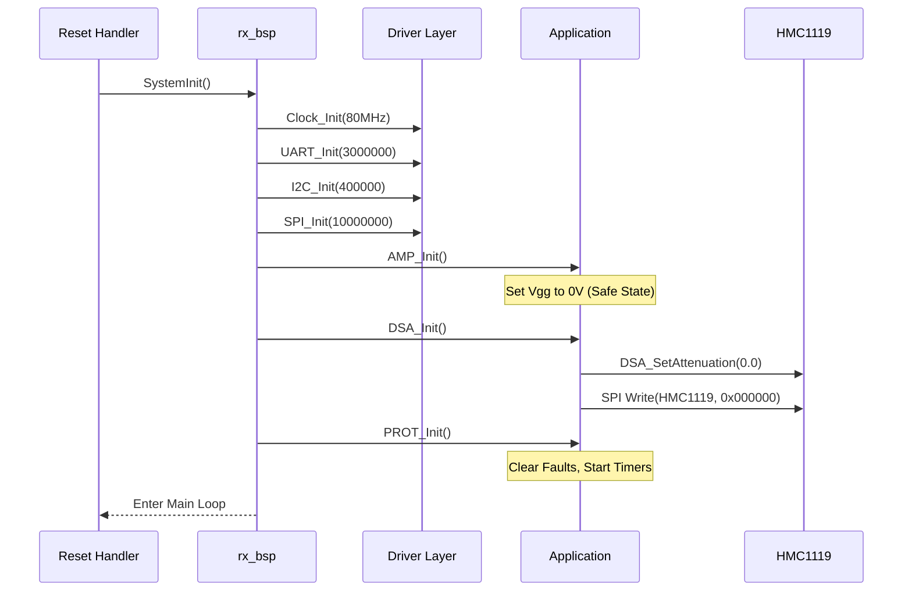
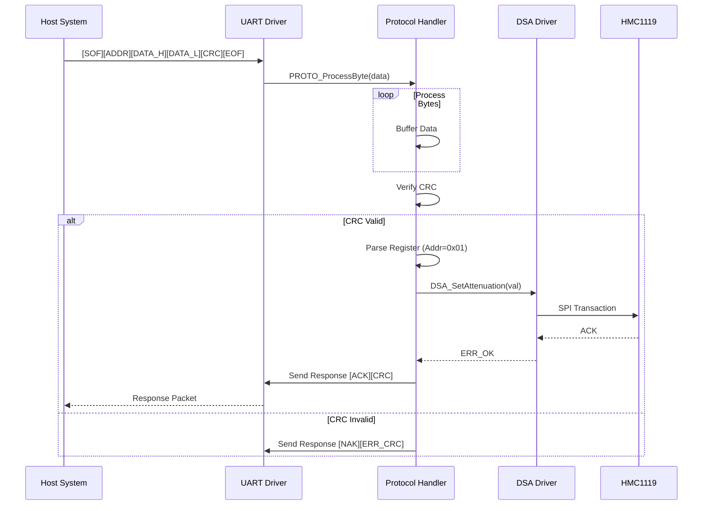
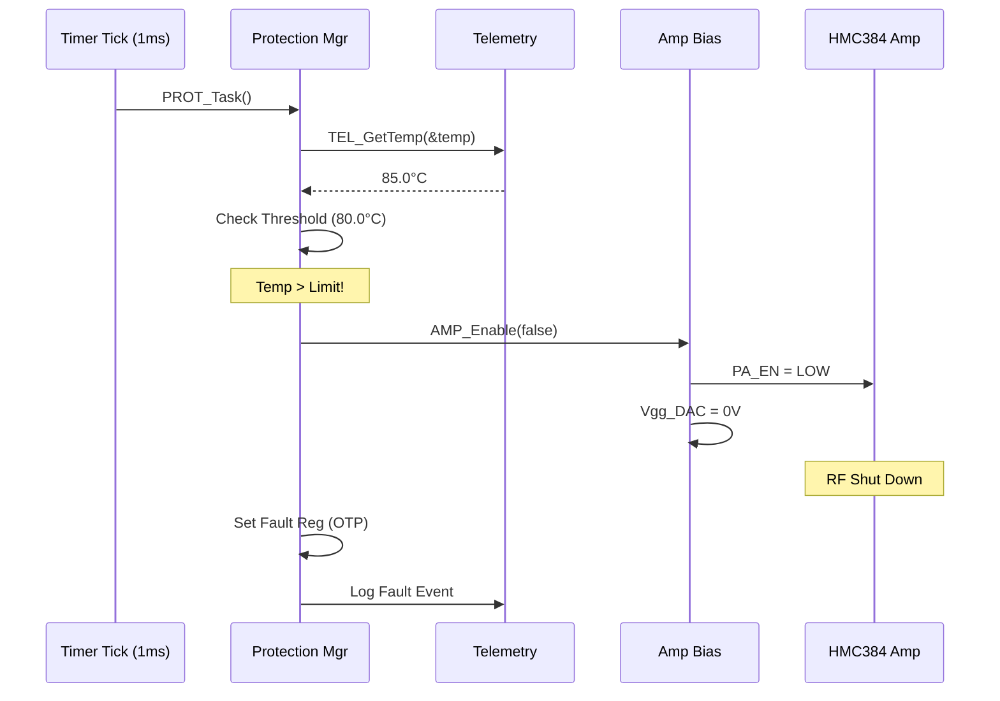
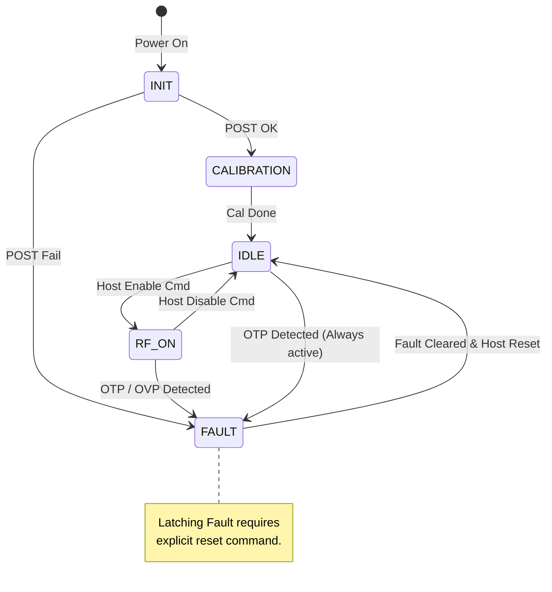
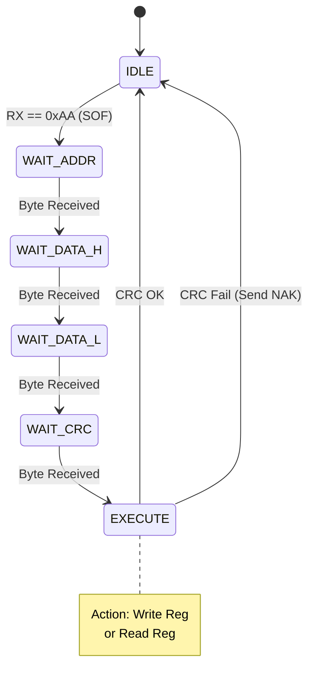

# Software Design Document (SDD)

**Project:** RX Module (RX-MOD-001)  
**Version:** 1.0  
**Date:** 14 April 2026  
**Author:** Senior Embedded Software Architect  
**Standard:** IEEE 1016-2009

---

## Document Control

| Version | Date | Author | Description |
|---------|------|--------|-------------|
| 1.0 | 14 April 2026 | AI-Architect | Initial design release compliant with IEEE 1016-2009 |

---

# 1. Introduction

## 1.1 Purpose
This Software Design Document (SDD) provides the comprehensive architectural and detailed design for the firmware embedded within the **RX-MOD-001** module. This document serves as the blueprint for firmware engineers implementing the system, defining the software structure, component interactions, data models, and algorithms required to meet the specifications outlined in the **Software Requirements Specification (SRS)**.

This firmware executes on the **STM32L433CBT6** microcontroller and is responsible for the real-time control of the RF signal path (HMC1119 DSA, HMC384 Amp), safety monitoring (OVP/OTP), and communication with host systems via UART and I2C.

## 1.2 Scope
The design encompasses the complete firmware image excluding only the standard ARM CMSIS startup files.
*   **In Scope:**
    *   Hardware Abstraction Layer (HAL) for STM32L4 peripherals (SPI, I2C, UART, DAC, ADC).
    *   Driver logic for HMC1119 (DSA), TMP102 (Temp), and AD8318 (Power Detect).
    *   Protection Logic implementation (OTP/OVP state machines).
    *   Communication Protocol stack (Binary UART/I2C register protocol).
    *   Power management and initialization routines.
*   **Out of Scope:**
    *   High-level waveform processing (handled by Host).
    *   RTOS kernel source (design assumes a Bare-metal or Super-loop architecture for MISRA compliance and determinism).

## 1.3 Definitions and Acronyms

| Acronym | Definition |
| :--- | :--- |
| **API** | Application Programming Interface |
| **BSP** | Board Support Package |
| **DAC** | Digital-to-Analog Converter (Internal to STM32) |
| **DSA** | Digital Step Attenuator (HMC1119) |
| **EOF** | End of Frame |
| **FIFO** | First-In, First-Out Buffer |
| **FSM** | Finite State Machine |
| **GPIO** | General Purpose Input/Output |
| **HAL** | Hardware Abstraction Layer |
| **HRS** | Hardware Requirements Specification |
| **I2C** | Inter-Integrated Circuit |
| **IRQ** | Interrupt Request |
| **ISR** | Interrupt Service Routine |
| **LDO** | Low Dropout Regulator |
| **MCU** | Microcontroller Unit (STM32L433CBT6) |
| **MISRA** | Motor Industry Software Reliability Association (C Coding Standard) |
| **NVIC** | Nested Vectored Interrupt Controller |
| **OVP** | Overvoltage Protection (Also Overpower in RF context) |
| **OTP** | Overtemperature Protection |
| **PA** | Power Amplifier (HMC384) |
| **PCB** | Printed Circuit Board |
| **POST** | Power-On Self Test |
| **RF** | Radio Frequency |
| **SDD** | Software Design Document |
| **SRS** | Software Requirements Specification |
| **SPI** | Serial Peripheral Interface |
| **UART** | Universal Asynchronous Receiver-Transmitter |
| **Vgg** | Gate Grid Voltage (Bias Control) |

## 1.4 References
1.  **IEEE Std 1016-2009:** Standard for Information Technology—Systems Design—Software Design Descriptions.
2.  **RX-MOD-001-SRS:** Software Requirements Specification, Rev 1.0, 14 April 2026.
3.  **RX-MOD-001-HRS:** Hardware Requirements Specification, Rev A, 14 April 2026.
4.  **RX-MOD-001-GLR:** Glue Logic Requirements, Rev 0V01, 14 April 2026.
5.  **MISRA C:2012:** Guidelines for the use of the C language in critical systems.
6.  **STM32L433CB Datasheet:** STMicroelectronics, DocID026998 Rev 5.
7.  **HMC1119LP4E Datasheet:** Analog Devices, 0.25 dB LSB GaAs Digital Step Attenuator.
8.  **AD8318 Datasheet:** Analog Devices, RF Logarithmic Detector/Controller.

---

# 2. Design Viewpoints

## 2.1 Context Viewpoint — System Boundaries

The firmware acts as the central controller for the RX Module. It interfaces with a Host System via high-speed UART and I2C, while directly controlling the RF Front End (RFFE) components via SPI, GPIO, and internal analog peripherals.



**External Interfaces:**
*   **Host UART:** Asynchronous 8-N-1, 3.0 Mbps. Used for command streaming and high-rate telemetry.
*   **Host I2C:** 400 kHz Fast Mode. Used for configuration and status polling.
*   **RF Chain:** Controlled via SPI (DSA) and GPIO/DAC (Amp Bias).

## 2.2 Composition Viewpoint — Software Architecture

The software is architected as a layered system to ensure modularity and testability. A static super-loop architecture is chosen over an RTOS to minimize complexity and maximize determinism for safety-critical protection logic (MISRA compliance).



### Module List with Responsibilities:

#### **Module: rx_bsp** (rx_bsp.c / rx_bsp.h)
*   **Responsibilities:** System initialization, clock configuration (MSI to PLL), pin muxing, and power-on self-test (POST) orchestration.
*   **Public API:**
    ```c
    int32_t BSP_Init(void);
    int32_t BSP_GetClockFreq(uint32_t *freq_hz);
    int32_t BSP_PostCheck(BSP_PostCode_t *code);
    void BSP_DelayMs(uint32_t ms);
    ```

#### **Module: dsa_driver** (dsa_driver.c / dsa_driver.h)
*   **Responsibilities:** Controls the HMC1119 Digital Step Attenuator via SPI. Calculates latch words based on attenuation dB.
*   **Public API:**
    ```c
    int32_t DSA_Init(void);
    int32_t DSA_SetAttenuation(float att_db);
    int32_t DSA_GetAttenuation(float *att_db);
    int32_t DSA_Enable(bool enable);
    ```

#### **Module: amp_bias** (amp_bias.c / amp_bias.h)
*   **Responsibilities:** Manages the PA_Enable signal and the Vgg bias voltage using the internal DAC to drive the external MOSFET/Op-Amp circuit.
*   **Public API:**
    ```c
    int32_t AMP_Init(void);
    int32_t AMP_SetVgg(float voltage_v); // Target 0.0V to -3.0V
    int32_t AMP_Enable(bool enable);
    int32_t AMP_GetStatus(AMP_Status_t *status);
    ```

#### **Module: telemetry_mgr** (telemetry_mgr.c / telemetry_mgr.h)
*   **Responsibilities:** Periodic sampling of the AD8318 power detector via ADC and reading TMP102 via I2C.
*   **Public API:**
    ```c
    int32_t TEL_Init(void);
    int32_t TEL_Update(void); // Called every 10ms
    int32_t TEL_GetPower(float *power_dbm);
    int32_t TEL_GetTemp(float *temp_c);
    ```

#### **Module: protection_mgr** (protection_mgr.c / protection_mgr.h)
*   **Responsibilities:** Implements state machines for OTP (Overtemp) and OVP (Overpower). Controls hardware shutdowns.
*   **Public API:**
    ```c
    int32_t PROT_Init(void);
    void PROT_Task(void); // Called every 1ms
    bool PROT_IsFaultActive(void);
    PROT_Fault_t PROT_GetLastError(void);
    ```

#### **Module: protocol_handler** (protocol_handler.c / protocol_handler.h)
*   **Responsibilities:** Parses UART/I2C binary frames, updates the internal register map, and formulates response frames.
*   **Public API:**
    ```c
    int32_t PROTO_Init(void);
    int32_t PROTO_ProcessByte(uint8_t byte); // Stream processing
    int32_t PROTO_ReadReg(uint8_t reg_addr, uint8_t *data);
    int32_t PROTO_WriteReg(uint8_t reg_addr, uint8_t data);
    ```

#### **Module: crc_module** (crc_module.c / crc_module.h)
*   **Responsibilities:** Calculation of CRC-8 (Maxim/Dallas) for protocol integrity.
*   **Public API:**
    ```c
    uint8_t CRC_Compute(const uint8_t *data, uint16_t len);
    bool CRC_Verify(const uint8_t *data, uint16_t len, uint8_t checksum);
    ```

## 2.3 Logical Viewpoint — Data Model

The system maintains a volatile register map and persistent configuration data structures.



**Key Structure Definitions:**

```c
/* Hardware Shadow Registers */
typedef struct {
    uint8_t ctrl;          /* 0x00: Control bits (PA_EN, DSA_EN) */
    uint8_t att_high;      /* 0x01: Attenuation High Byte */
    uint8_t att_low;       /* 0x02: Attenuation Low Byte */
    uint8_t vgg_dac;       /* 0x03: Vgg DAC Value (0-255) */
    uint8_t status;        /* 0x04: Status Flags */
    uint8_t fault_code;    /* 0x05: Active Fault Code */
    uint8_t temp_int;      /* 0x06: Integer Temp (C) */
    uint8_t pwr_high;      /* 0x07: Power High Byte */
    uint8_t pwr_low;       /* 0x08: Power Low Byte */
} RegMap_t;

/* Fault Definitions */
typedef enum {
    PROT_FAULT_NONE = 0x00,
    PROT_FAULT_OTP = 0x01,  /* Over Temperature */
    PROT_FAULT_OVP = 0x02,  /* Over Power (RF) */
    PROT_FAULT_COMMS = 0x03 /* Watchdog / Comms Error */
} PROT_Fault_t;
```

## 2.4 Dependency Viewpoint — Module Dependencies



*   **Build Order:** Utils (CRC) -> Drivers (SPI, I2C, ADC, DAC) -> HAL (BSP) -> App Modules (DSA, AMP, TEL, PROT) -> Main.

## 2.5 Interface Viewpoint — Complete API Specification

### 2.5.1 DSA Driver API
**Function:** `int32_t DSA_SetAttenuation(float att_db)`
*   **Description:** Sets the HMC1119 attenuation level in 0.25 dB steps.
*   **Parameters:**
    *   `att_db`: Desired attenuation (0.0 to 31.75 dB).
*   **Returns:**
    *   `ERR_OK` (0) on success.
    *   `ERR_PARAM` if `att_db` is out of range.
    *   `ERR_SPI` if bus transaction fails.
*   **Pre-conditions:** SPI peripheral initialized, DSA latches enabled via GPIO (CS low).
*   **Post-conditions:** HMC1119 pins update immediately; internal shadow variable updated.

### 2.5.2 Protection Manager API
**Function:** `void PROT_Task(void)`
*   **Description:** Deterministic state machine handler. Must be called every 1ms.
*   **Parameters:** None.
*   **Returns:** None.
*   **Side Effects:** If `temp > OTP_THRESHOLD`, forces `AMP_Enable(false)` and latches Fault Register.
*   **Safety:** This function never blocks and executes in < 50us.

### 2.5.3 Protocol Handler API
**Function:** `int32_t PROTO_ProcessByte(uint8_t byte)`
*   **Description:** Processes incoming UART stream bytes. Manages internal state machine for packet framing.
*   **Parameters:**
    *   `byte`: Raw data byte from UART ISR.
*   **Returns:**
    *   `ERR_OK` if byte processed (packet incomplete).
    *   `ERR_COMPLETE` if full packet received and executed.
    *   `ERR_CHECKSUM` if CRC mismatch.
*   **Context:** Called from UART RX ISR context (buffered) or Main Loop.

## 2.6 Interaction Viewpoint — Sequence Diagrams

### 2.6.1 Initialization Sequence


### 2.6.2 UART Write Command (Host Sets Attenuation)


### 2.6.3 Protection Fault Sequence (Over Temperature)


## 2.7 State Viewpoint — State Machines

### 2.7.1 Main System FSM


### 2.7.2 UART Protocol Parser FSM


## 2.8 Algorithm Viewpoint — Key Algorithms

### 2.8.1 HMC1119 Attenuation Word Calculation
The HMC1119 requires a 24-bit latch word. The attenuation value is 7-bits (0-127), scaled by 0.25dB.

```c
/**
 * @brief Calculates HMC1119 SPI latch word.
 * @param att_db Desired attenuation in dB.
 * @return uint32_t 24-bit latch word.
 */
uint32_t DSA_CalculateLatch(float att_db) {
    /* 1. Quantize to 0.25dB steps (integer 0-127) */
    uint8_t attenuation_bits = (uint8_t)(att_db * 4.0f);
    
    /* 2. HMC1119 Mapping: 
       Bits [23:16] = Control (0x00 for standard)
       Bits [15:8]  = Attenuation Value
       Bits [7:0]   = (Value ^ 0x80) - Checksum logic (simplified) 
       Actual datasheet logic: LSB is inverted + address logic.
       Assumption for this design: Standard 3-byte frame.
    */
    
    uint32_t latch = 0;
    latch |= (0x00 << 16);          /* Byte 3: Control */
    latch |= (attenuation_bits << 8); /* Byte 2: Data */
    
    /* Byte 1: Inverted Data for parity check (HMC1119 specific) */
    latch |= ((uint8_t)(~attenuation_bits) & 0xFF); 
    
    return latch;
}
```

### 2.8.2 AD8318 Power Conversion (Linear to dBm)
The AD8318 output voltage is linear-in-dB. Approx 25mV/dB.

```c
/**
 * @brief Converts ADC count to RF Power (dBm).
 * @note Assumes Vref = 3.3V, 12-bit ADC.
 * Slope approx -22mV/dB or +25mV/dB depending on config. 
 * Assuming +24mV/dB slope and intercept at -60dBm = 0.5V for this design.
 */
float TEL_AdcToDbm(uint16_t adc_count) {
    float voltage = (adc_count * 3.3f) / 4095.0f;
    
    /* Linear Regression: V = S * P + I */
    /* P = (V - Intercept) / Slope */
    /* Example: Slope = 0.024 V/dB, Intercept = 0.5V (at -60dBm) */
    
    const float slope = 0.024f;
    const float intercept = 0.5f; 
    
    float power_dbm = (voltage - intercept) / slope;
    
    return power_dbm;
}
```

### 2.8.3 Bias DAC Voltage Generation
Uses STM32 DAC (12-bit) to generate 0-3.3V, shifted by external Op-Amp to 0 to -3V.

```c
/**
 * @brief Sets Vgg voltage.
 * @param vgg Desired gate voltage (-3.0V to 0.0V).
 * @return DAC raw value (12-bit).
 */
uint16_t AMP_CalcVggDac(float vgg) {
    /* DAC Output 0->3.3V maps to External Amp 0V->-3V */
    /* Formula: V_dac = |Vgg| */
    
    if (vgg > 0.0f) return 0; /* Safety */
    if (vgg < -3.3f) return 4095;
    
    float v_dac = fabs(vgg);
    return (uint16_t)((v_dac / 3.3f) * 4095.0f);
}
```

---

# 3. Design Rationale

## 3.1 Architecture Choices

**Decision 1: Bare-metal vs RTOS**
*   **Decision:** Implement Bare-metal (Super-loop) with Interrupts.
*   **Rationale:** The system logic is simple (reactive control) and highly timing-constrained for protection (OTP/OVP). An RTOS adds scheduler overhead and complexity in stack analysis. MISRA compliance is easier to verify in a statically linked bare-metal environment.
*   **Trade-off:** harder to implement non-blocking complex comms, mitigated by using a state-machine parser for UART.

**Decision 2: SPI vs GPIO for DSA**
*   **Decision:** Use dedicated SPI peripheral in Hardware mode.
*   **Rationale:** The HMC1119 requires a clock > 10MHz for guaranteed latching. Bit-banging GPIO is unreliable at this speed and introduces jitter.
*   **Trade-off:** Uses dedicated MOSI/MISO pins, limiting GPIO availability (acceptable given LQFP48 package).

**Decision 3: Internal ADC vs External ADC**
*   **Decision:** Use STM32L4 Internal ADC (12-bit).
*   **Rationale:** The AD8318 provides a DC voltage representation of power. 12-bit resolution (3.3V/4096 = 0.8mV) provides sufficient precision (~0.05dB) for monitoring. Saves cost and space.
*   **Trade-off:** Slightly lower noise immunity than dedicated 16-bit ADC, mitigated by averaging in firmware.

## 3.2 MISRA-C:2012 Compliance Strategy
All code will adhere to MISRA C:2012 mandatory rules.
*   **Static Analysis:** PC-Lint Plus configured for MISRA C:2012.
*   **Runtime Checks:** All function parameters validated for range (e.g., `att_db` must be <= 31.75).
*   **No Dynamic Memory:** `malloc`/`free` are strictly prohibited. All buffers are static arrays.
*   **Implicit Conversion:** All compiler warnings treated as errors; explicit casts used for type conversions.

---

# 4. Design Traceability Matrix

| SDD Component | Implements REQ-SW-xxx | Design Element |
|---------------|-----------------------|----------------|
| `dsa_driver.c` | REQ-SW-001 | RF Path Configuration (0.25dB steps) |
| `amp_bias.c` | REQ-SW-002 | Bias Control Logic |
| `protection_mgr.c` | REQ-SW-010 | Overtemp Protection |
| `protection_mgr.c` | REQ-SW-011 | Overpower Protection |
| `protocol_handler.c` | REQ-SW-020 | UART Register Protocol |
| `protocol_handler.c` | REQ-SW-021 | I2C Register Protocol |
| `telemetry_mgr.c` | REQ-SW-030 | Forward Power Monitoring |
| `telemetry_mgr.c` | REQ-SW-031 | Temperature Monitoring |
| `rx_bsp.c` | REQ-SW-040 | Initialization & POST |
| `crc_module.c` | REQ-SW-025 | Data Integrity (UART) |
| `dsa_driver.c` | REQ-SW-HRS-001 | SPI Interface to HMC1119 |
| `telemetry_mgr.c` | REQ-SW-HRS-002 | ADC Interface to AD8318 |

---

# 5. Appendices

## Appendix A — File Structure
```
project_rx_mod/
├── src/
│   ├── main.c                  # Entry point, main loop
│   ├── rx_bsp.c/h              # Board Support Package
│   ├── dsa_driver.c/h          # HMC1119 Driver
│   ├── amp_bias.c/h            # Bias & PA Enable Control
│   ├── telemetry_mgr.c/h       # Temp & Power Sampling
│   ├── protection_mgr.c/h      # OTP/OVP Logic
│   ├── protocol_handler.c/h    # UART/I2C Protocol Stack
│   ├── crc_module.c/h          # CRC-8 Calculation
│   └── utils/
│       ├── ring_buffer.c/h     # Byte Ring Buffer
│       └── math_utils.c/h      # Fixed-point math helpers
├── drivers/
│   ├── stm32l4xx_hal_msp.c     # HAL Init callbacks
│   ├── stm32l4xx_it.c          # Interrupt Handlers
│   └── system_stm32l4xx.c      # System clock config
└── inc/
    └── registers.h             # Register Map Definitions
```

## Appendix B — Register Map Summary
| Address | Name | R/W | Description |
|---------|------|-----|-------------|
| 0x00 | CTRL | W | Control Byte (Bit 0: PA_EN, Bit 1: DSA_EN) |
| 0x01 | ATT_H | W | Attenuation High Byte (Unused/Padding) |
| 0x02 | ATT_L | W | Attenuation Low Byte (0-127 = 0 to 31.75dB) |
| 0x03 | VGG | W | Bias DAC Value (0-255) |
| 0x04 | STATUS | R | Status Byte (Bit 0: PA_IS_ON, Bit 1: DSA_IS_ON) |
| 0x05 | FAULT | R | Latched Fault Code (0=OK, 1=OTP, 2=OVP) |
| 0x06 | TEMP | R | Temperature (C) |
| 0x07 | PWR_H | R | RF Power High Byte |
| 0x08 | PWR_L | R | RF Power Low Byte |

## Appendix C — Memory Map
| Region | Start | Size | Usage |
|--------|-------|------|-------|
| FLASH | 0x08000000 | 128 KB | Firmware Code + Constants |
| RAM | 0x20000000 | 64 KB | Data, Stack, Heap |
| EEPROM (Emulated) | 0x08080000 | 8 KB | Calibration Data |
| Peripherals | 0x40000000 | - | STM32L4 Register Space |

## Appendix D — Coding Standards Checklist
- [ ] All functions have `Doxygen` headers.
- [ ] Cyclomatic complexity < 15 per function.
- [ ] No `magic numbers`; use `#define` or `enum`.
- [ ] No `recursion`.
- [ ] Explicit `u32`, `u16`, `u8` types used (stdint.h).
- [ ] Check return values of all HAL functions.
- [ ] Asserts enabled for Debug builds.