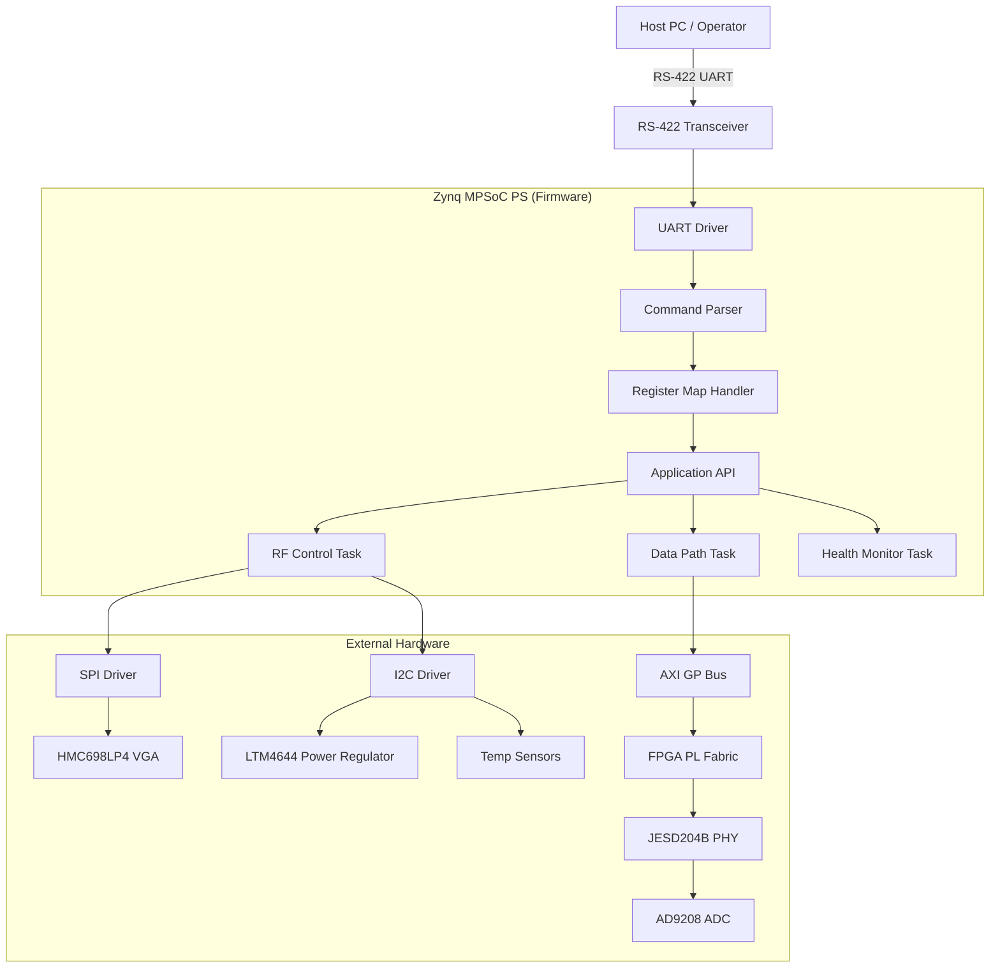
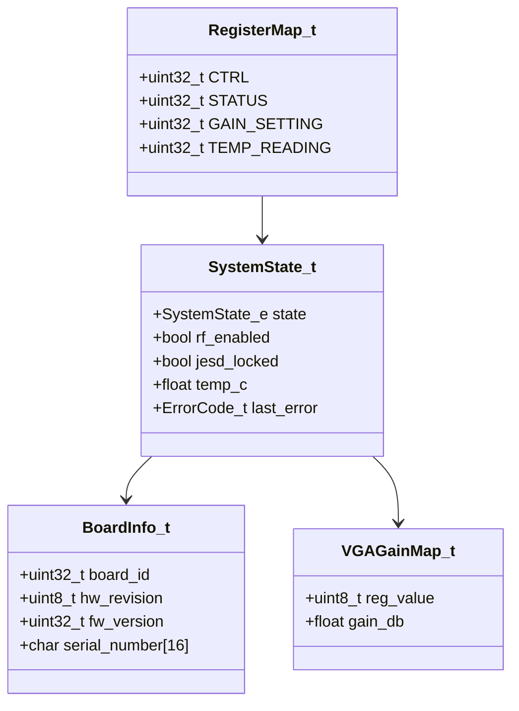
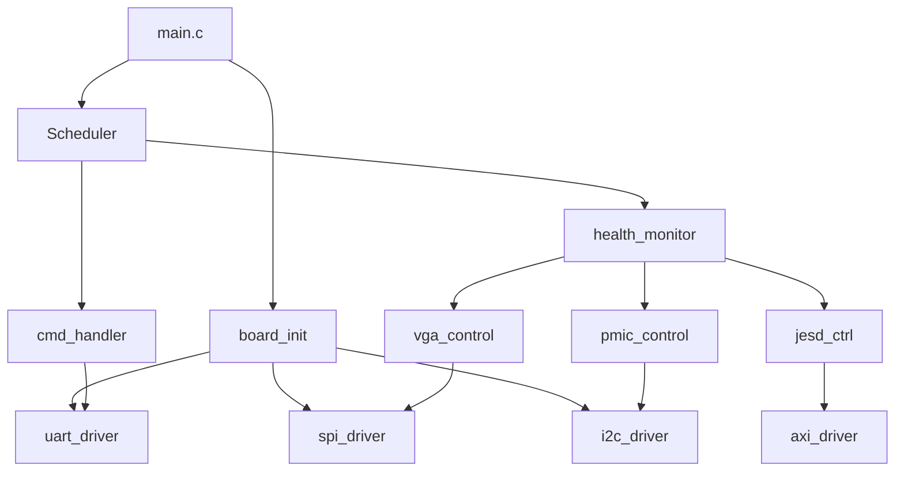
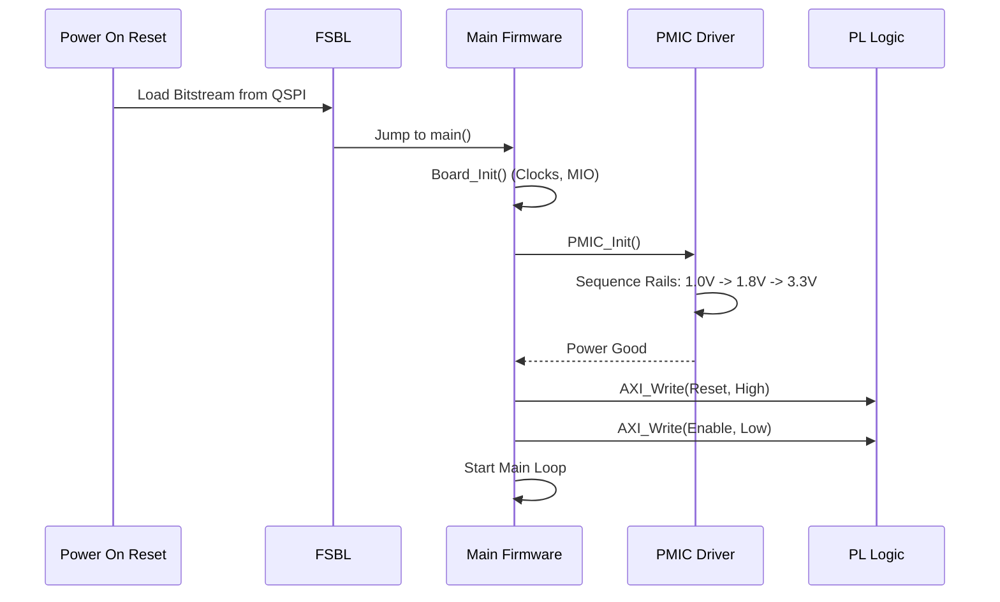
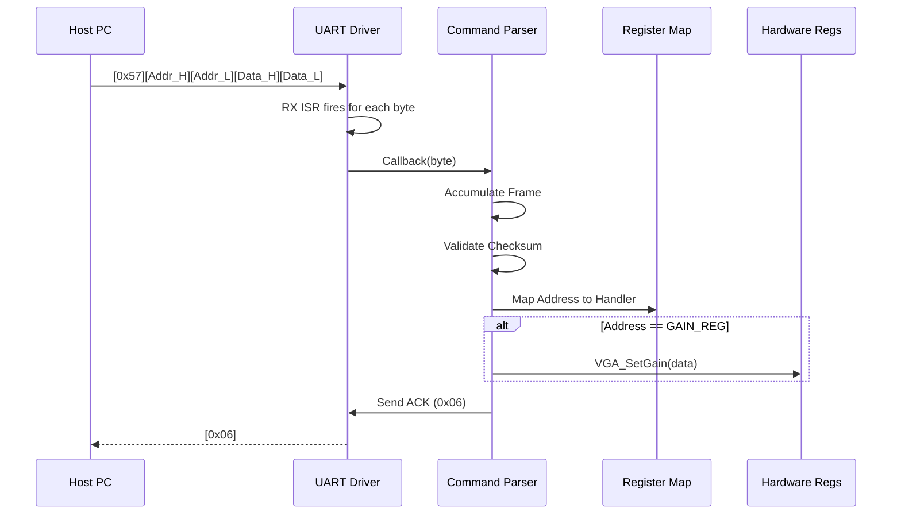
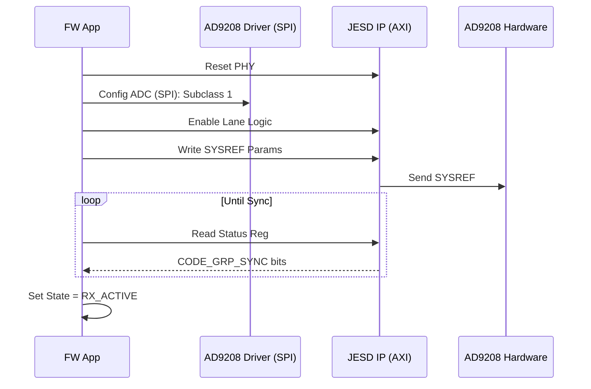
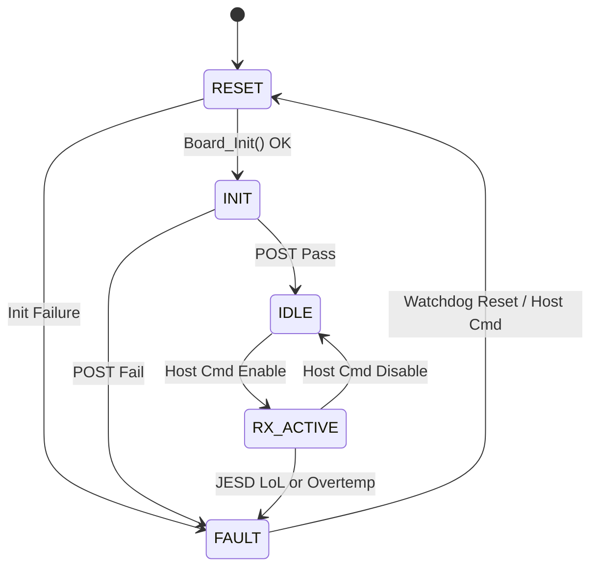
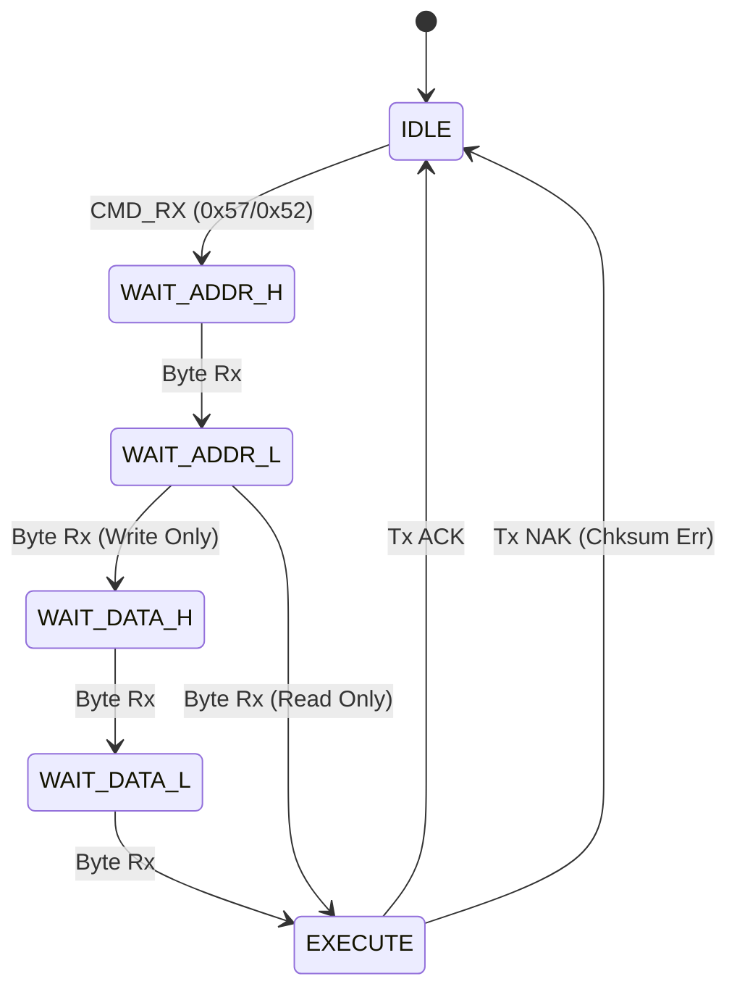

Here is the complete, comprehensive Software Design Document (SDD) for the **rx_module**.

***

# Software Design Document (SDD)

**Project:** rx_module  
**Version:** 1.0  
**Date:** 17 April 2026  
**Status:** Initial Release  
**Author:** Lead Firmware Architect  

## Document Control
| Version | Date | Author | Description |
|---------|------|--------|-------------|
| 1.0 | 17 April 2026 | System Architect | Initial design based on SRS v1.0, GLR v0V01, and HRS P2. |

---

# 1. Introduction

## 1.1 Purpose
This Software Design Document (SDD) describes the software architecture and detailed design implementation for the **rx_module** embedded firmware. This firmware runs on the Processing System (PS) of the Xilinx Zynq UltraScale+ MPSoC (XCZU9EG).

The primary audience includes:
*   **Firmware Engineers:** Responsible for implementing the HAL, drivers, and control logic.
*   **FPGA Engineers:** Responsible for the PL logic that interfaces with this firmware via AXI.
*   **Test Engineers:** Responsible for validating the software against the SRS requirements.
*   **System Integrators:** Responsible for integrating the rx_module into the larger RF system.

This SDD defines how the software requirements (REQ-SW-xxx) specified in the SRS are mapped to software components, data structures, and algorithms.

## 1.2 Scope
The scope of this design covers the firmware running on the ARM Cortex-A53 cores within the XCZU9EG. It includes:
1.  **Hardware Abstraction Layer (HAL):** Drivers for UART, SPI, I2C, GPIO, and timers.
2.  **Board Support Package (BSP):** Initialization of clocks, DDR, and the MPSoC PS-PL interface.
3.  **Application Logic:** State machines for RF control, data path configuration, and fault management.
4.  **Communication Protocol:** Implementation of the register-based UART protocol defined in GLR P6.

**Exclusions:** This document does not cover the VHDL/Verilog design of the JESD204B IP cores or the DSP algorithms implemented in the FPGA fabric (PL). It only covers the *control* interface to those blocks.

## 1.3 Definitions, Acronyms, and Abbreviations

| Term / Acronym | Definition |
| :--- | :--- |
| **ADC** | Analog-to-Digital Converter (AD9208) |
| **API** | Application Programming Interface |
| **AXI** | Advanced eXtensible Interface (ARM bus protocol) |
| **BIST** | Built-In Self-Test |
| **BRAM** | Block RAM (FPGA internal memory) |
| **BSD** | Board Support Package (deprecated, use BSP) |
| **CRC** | Cyclic Redundancy Check |
| **DAC** | Digital-to-Analog Converter |
| **DMA** | Direct Memory Access |
| **EOF** | End of Frame |
| **FIFO** | First-In-First-Out memory buffer |
| **FPGA** | Field-Programmable Gate Array |
| **FSBL** | First Stage Boot Loader |
| **GLR** | Glue Logic Requirements document |
| **GPIO** | General Purpose Input/Output |
| **HAL** | Hardware Abstraction Layer |
| **HRS** | Hardware Requirements Specification document |
| **I2C** | Inter-Integrated Circuit serial bus |
| **IP** | Intellectual Property (FPGA logic cores) |
| **ISR** | Interrupt Service Routine |
| **JESD204B** | JEDEC Standard High-Speed Data Converter Interface |
| **LoL** | Loss of Lock (PLL status) |
| **LNA** | Low Noise Amplifier |
| **LVDS** | Low-Voltage Differential Signaling |
| **MMCM** | Mixed-Mode Clock Manager |
| **MPSoC** | Multi-Processor System-on-Chip |
| **NVM** | Non-Volatile Memory |
| **OEM** | Original Equipment Manufacturer |
| **PLL** | Phase-Locked Loop |
| **POST** | Power-On Self-Test |
| **QSPI** | Quad Serial Peripheral Interface |
| **RF** | Radio Frequency |
| **RTOS** | Real-Time Operating System |
| **RX** | Receive / Receiver |
| **SMAP** | System Monitor ADC (Xilinx PS) |
| **SPI** | Serial Peripheral Interface |
| **SW** | Software |
| **UART** | Universal Asynchronous Receiver/Transmitter |
| **VGA** | Variable Gain Amplifier |
| **WDT** | Watchdog Timer |

## 1.4 References
1.  **SRS:** rx_module Software Requirements Specification (v1.0, 17 April 2026).
2.  **HRS:** rx_module Hardware Requirements Specification (P2).
3.  **GLR:** rx_module Glue Logic Requirements (P6, v0V01).
4.  **IEEE 1016-2009:** Standard for Information Technology — Systems Design — Software Design Descriptions.
5.  **MISRA-C:2012:** Guidelines for the Use of the C Language in Critical Systems.
6.  **UG1085:** Zynq UltraScale+ Device Technical Reference Manual.
7.  **AD9208 Datasheet:** Analog Devices Dual, 14-Bit, 3 GSPS ADC.
8.  **LTM4644 Datasheet:** Analog Devices Quad Output DC/DC µModule Regulator.

---

# 2. Design Viewpoints

## 2.1 Context Viewpoint — System Boundaries

The rx_module software operates within the Zynq MPSoC, acting as the bridge between the external Host PC (via UART) and the various hardware peripherals (RF Front-end, ADC, PL Logic). The software does not control the RF signal path directly (analog domain) but configures the digital control registers of the analog components.



**External Interfaces:**
*   **Host Interface:** RS-422 UART (Configured for 115200 baud, 8N1). As defined in GLR P6.
*   **JTAG:** For debugging and initial FSBL programming (Xilinx standard).
*   **SPI:** Master interface for HMC698LP4 gain control.
*   **I2C:** Master interface for LTM4644 PMIC and thermal sensors.
*   **AXI-GP:** General Purpose AXI port for memory-mapped access to FPGA PL registers.

## 2.2 Composition Viewpoint — Software Architecture

The software is architected as a layered, event-driven system. It runs bare-metal (no RTOS) to minimize complexity and deterministic latency, utilizing a main loop scheduler for low-priority tasks and interrupts for time-critical events.

```mermaid
graph TD
    APP[Application Layer] --> SCHED[Main Loop Scheduler]
    SCHED --> MON[Health Monitor]
    SCHED --> DIAG[Diagnostics Task]
    SCHED --> CMD_PROCESS[Command Processor]
    
    APP --> ISR_TOP[Interrupt Handlers]
    ISR_TOP --> UART_ISR[UART RX Handler]
    ISR_TOP --> WDT_ISR[Watchdog Handler]
    ISR_TOP --> TIMER_ISR[System Tick Handler]
    
    CMD_PROCESS --> REG_MAP[Register Map Manager]
    REG_MAP --> HAL[Hardware Abstraction Layer]
    
    MON --> HAL
    DIAG --> HAL
    
    subgraph HAL
        HAL --> DRV_UART[UART Driver]
        HAL --> DRV_SPI[SPI Driver]
        HAL --> DRV_I2C[I2C Driver]
        HAL --> DRV_GPIO[GPIO Driver]
        HAL --> DRV_AXI[AXI Interface Driver]
    end
    
    DRV_UART --> HW[Hardware Registers]
    DRV_SPI --> HW
    DRV_I2C --> HW
    DRV_AXI --> HW
```

### Module List with Responsibilities

**Module: board_init** (board_init.c / board_init.h)
*   **Responsibility:** System startup, PS clock configuration, MPSoC MIO pinmuxing, and external RAM initialization.
*   **Public API:**
    *   `int32_t Board_Init(void);` // Configures clocks, GPIO, and enables peripherals
    *   `int32_t Board_GetInfo(BoardInfo_t *info);` // Returns serial number and FW version
    *   `void Board_Reset(void);` // Triggers soft reset
*   **Internal State:** `SystemState_t state`, `uint32_t error_code`.

**Module: uart_driver** (uart_driver.c / uart_driver.h)
*   **Responsibility:** RS-422 communication, interrupt-driven reception, GLR P6 protocol framing.
*   **Public API:**
    *   `int32_t UART_Init(uint32_t baud_rate);`
    *   `int32_t UART_SendByte(uint8_t data);`
    *   `int32_t UART_ReadByte(uint8_t *data);`
    *   `void UART_ISR(void);` // Handles RX FIFO interrupt
*   **Configuration:** 115200 Baud, 8-bit data, no parity.

**Module: spi_driver** (spi_driver.c / spi_driver.h)
*   **Responsibility:** SPI Master operations for the VGA. Configured for Mode 0 (CPOL=0, CPHA=0).
*   **Public API:**
    *   `int32_t SPI_Init(uint32_t clock_hz);`
    *   `int32_t SPI_Transfer(const uint8_t *tx, uint8_t *rx, uint16_t len);`
    *   `int32_t SPI_WriteReg(uint8_t reg_addr, uint8_t value);`

**Module: i2c_driver** (i2c_driver.c / i2c_driver.h)
*   **Responsibility:** I2C Master operations for PMIC and Temp sensors.
*   **Public API:**
    *   `int32_t I2C_Init(uint32_t clock_hz);`
    *   `int32_t I2C_Write(uint8_t dev_addr, const uint8_t *data, uint8_t len);`
    *   `int32_t I2C_Read(uint8_t dev_addr, uint8_t *buf, uint8_t len);`

**Module: vga_control** (vga_control.c / vga_control.h)
*   **Responsibility:** Converts desired gain (dB) to HMC698LP4 register values and executes SPI writes.
*   **Public API:**
    *   `int32_t VGA_SetGain(float gain_db);` // 0.0 to 50.0 dB
    *   `int32_t VGA_Init(void);`

**Module: pmic_control** (pmic_control.c / pmic_control.h)
*   **Responsibility:** Sequencing the LTM4644 rails via I2C.
*   **Public API:**
    *   `int32_t PMIC_Init(void);`
    *   `int32_t PMIC_SetRail(uint8_t rail_idx, float voltage);`
    *   `int32_t PMIC_GetRail(uint8_t rail_idx, float *voltage);`

**Module: jesd_ctrl** (jesd_ctrl.c / jesd_ctrl.h)
*   **Responsibility:** Configuring the JESD204B PHY IP in the PL and AD9208.
*   **Public API:**
    *   `int32_t JESD_Init(void);`
    *   `int32_t JESD_Enable(bool enable);`
    *   `bool JESD_IsLocked(void);`

**Module: cmd_handler** (cmd_handler.c / cmd_handler.h)
*   **Responsibility:** Parses the GLR UART protocol frames (READ/WRITE/BULK) and updates the Register Map.
*   **Public API:**
    *   `void CMD_ProcessTask(void);` // Main loop poll
    *   `void CMD_RxISR(uint8_t byte);` // Callback from UART ISR

## 2.3 Logical Viewpoint — Data Model

The system maintains a global state structure and a memory-mapped register interface for the Host PC.



**Key Data Structures:**

```c
// System State Enum
typedef enum {
    SYS_STATE_RESET = 0,
    SYS_STATE_INIT,
    SYS_STATE_IDLE,
    SYS_STATE_RX_ACTIVE,
    SYS_STATE_FAULT
} SystemState_e;

// Error Codes (MISRA compliant)
typedef enum {
    ERR_OK = 0,
    ERR_TIMEOUT = 1,
    ERR_COMM_UART = 2,
    ERR_COMM_SPI = 3,
    ERR_COMM_I2C = 4,
    ERR_PARAM_RANGE = 5,
    ERR_HARDWARE = 6,
    ERR_JESD_LOL = 7
} ErrorCode_t;

// Main System Context
typedef struct {
    SystemState_e state;
    uint32_t uptime_ticks;
    float current_gain_db;
    BoardInfo_t info;
} SystemContext_t;

extern SystemContext_t g_sysCtx;
```

## 2.4 Dependency Viewpoint — Module Dependencies

The build order is determined by the dependency graph. Lower-level drivers must be initialized before higher-level application logic.



## 2.5 Interface Viewpoint — Complete API Specification

### 2.5.1 UART Driver API

```c
/**
 * @brief Initialize the UART0 peripheral for RS-422 communication.
 * 
 * Implements REQ-SW-012.
 * 
 * @param baud_rate Target baud rate (e.g., 115200).
 * @return int32_t 0 on success (ERR_OK), negative error code on failure.
 * 
 * @pre System clocks must be enabled.
 * @post UART TX/RX enabled and interrupts configured.
 */
int32_t UART_Init(uint32_t baud_rate);

/**
 * @brief Send a data buffer via UART.
 * @param data Pointer to data buffer.
 * @param len Length of data in bytes.
 * @return int32_t ERR_OK or ERR_TIMEOUT.
 */
int32_t UART_Send(const uint8_t *data, uint16_t len);

/**
 * @brief Register a callback for received bytes.
 * @param callback Function pointer matching void (*fn)(uint8_t).
 * @return int32_t ERR_OK.
 */
int32_t UART_SetRxCallback(void (*callback)(uint8_t));
```

### 2.5.2 I2C Driver API

```c
/**
 * @brief Initialize I2C controller for PMIC and Temp sensors.
 * 
 * @param clock_hz Clock frequency in Hz (Standard 100kHz or Fast 400kHz).
 * @return int32_t ERR_OK or ERR_HARDWARE.
 */
int32_t I2C_Init(uint32_t clock_hz);

/**
 * @brief Write to a specific register on an I2C device.
 * 
 * @param dev_addr 7-bit device address.
 * @param reg_addr Register address.
 * @param data Byte to write.
 * @return int32_t ERR_OK, ERR_COMM_I2C (NACK), or ERR_TIMEOUT.
 */
int32_t I2C_WriteReg(uint8_t dev_addr, uint8_t reg_addr, uint8_t data);

/**
 * @brief Read from a specific register on an I2C device.
 * 
 * @param dev_addr 7-bit device address.
 * @param reg_addr Register address.
 * @param data_out Pointer to store read byte.
 * @return int32_t ERR_OK, ERR_COMM_I2C, or ERR_TIMEOUT.
 */
int32_t I2C_ReadReg(uint8_t dev_addr, uint8_t reg_addr, uint8_t *data_out);
```

## 2.6 Interaction Viewpoint — Sequence Diagrams

### System Initialization Sequence



### UART Register Write Sequence (Host to rx_module)



### JESD204B Link Establishment



## 2.7 State Viewpoint — State Machines

### Main System State Machine



### Command Parser State Machine (GLR P6 Protocol)



## 2.8 Algorithm Viewpoint — Key Algorithms

### 2.8.1 VGA Gain Calculation (Linearization)
The HMC698LP4 requires a non-linear register mapping to achieve linear dB gain steps. The firmware implements a piecewise linear approximation or LUT.

```c
/**
 * @brief Converts desired dB gain to HMC698LP4 register value.
 * @param gain_db Desired gain (0.0 to 50.0).
 * @return uint8_t Register value (0-255).
 * Algorithm: LUT with 0.5dB steps.
 */
uint8_t VGA_ConvertGain(float gain_db) {
    // Clamp input
    if (gain_db < 0.0f) gain_db = 0.0f;
    if (gain_db > 50.0f) gain_db = 50.0f;
    
    // Use simplified linear mapping for design example
    // Real implementation uses LUT from HMC698LP4 datasheet Fig 12
    uint8_t reg_val = (uint8_t)((gain_db / 50.0f) * 255.0f);
    return reg_val;
}
```

### 2.8.2 UART Frame Checksum (GLR P6)
The protocol uses a simple 8-bit checksum.

```c
/**
 * @brief Calculates checksum for GLR P6 frame.
 * Frame: CMD, ADDR_H, ADDR_L, DATA_H, DATA_L
 * @return uint8_t Checksum value.
 */
uint8_t CMD_CalcChecksum(uint8_t cmd, uint16_t addr, uint16_t data) {
    uint16_t sum = (uint16_t)cmd + (addr >> 8) + (addr & 0xFF) + (data >> 8) + (data & 0xFF);
    return (uint8_t)(sum & 0xFF);
}
```

### 2.8.3 JESD204B Lane Monitoring
Polling the IP status register to ensure Link Lock (ERR-SW-025).

```c
bool JESD_WaitLock(uint32_t timeout_ms) {
    uint32_t start = GetTick();
    while ((GetTick() - start) < timeout_ms) {
        uint32_t status = AXI_Read(JESD_STATUS_REG);
        if ((status & JESD_MASK_LOCKED) == JESD_MASK_LOCKED) {
            return true;
        }
    }
    return false;
}
```

## 2.9 Resource Viewpoint — Real-Time Constraints

### 2.9.1 Task Scheduling Table
The firmware uses a non-preemptive main loop scheduler.

| Task Name | Period | Worst-Case Exec Time | Priority | Deadline | CPU Load |
|-----------|--------|---------------------|----------|----------|---------|
| CMD_Process | Event (ISR) | 50 µs | High | < 1 ms | < 5% |
| Health_Monitor | 100 ms | 2 ms | Medium | 100 ms | 2% |
| JESD_Poll | 10 ms | 10 µs | Medium | 100 ms | 0.1% |
| Watchdog_Pet | 1000 ms | 1 µs | Low | 1000 ms | < 0.1% |

### 2.9.2 ISR Latency Budget
*   **UART RX:** Must be serviced within 50 µs to avoid overflow at 115200 baud (10 chars deep FIFO). Design Target: < 10 µs.
*   **System Tick:** 1 ms tick used for non-blocking delays.

### 2.9.3 Memory Budget
Based on Zynq XCZU9EG OCM (256KB) and DDR.

| Region | Size | Usage |
|--------|------|-------|
| Code (Flash) | 128 KB | Firmware Binary |
| OCM Data | 32 KB | Stack, Heap, Global State |
| DDR (PL Buffer) | Reserved | Not managed by FW, handled by DMA |
| Stack (Main) | 8 KB | Main loop stack |
| Stack (ISR) | 2 KB | IRQ Stack |

## 2.10 Build System Viewpoint

### 2.10.1 CMakeLists.txt Structure

```cmake
cmake_minimum_required(VERSION 3.20)
project(rx_module_fw C ASM)

set(CMAKE_C_STANDARD 11)
set(CMAKE_C_FLAGS "${CMAKE_C_FLAGS} -Wall -Wextra -pedantic -MISRA")

# Toolchain file for arm-none-eabi
include(cmake/arm-none-eabi.cmake)

# Sources
set(SOURCES
    src/main.c
    src/board/board_init.c
    src/drivers/uart_driver.c
    src/drivers/spi_driver.c
    src/drivers/i2c_driver.c
    src/drivers/axi_driver.c
    src/app/vga_control.c
    src/app/pmic_control.c
    src/app/jesd_ctrl.c
    src/app/cmd_handler.c
    src/utils/crc.c
)

add_executable(${PROJECT_NAME} ${SOURCES})

# Linker Script
target_link_options(${PROJECT_NAME} PRIVATE -T${CMAKE_CURRENT_SOURCE_DIR}/ld/rx_module.ld)

# Unit Tests
enable_testing()
add_subdirectory(tests)
```

### 2.10.2 Unit Test Infrastructure
Host-based testing using Google Test and mocked hardware.

```cmake
# tests/CMakeLists.txt
find_package(GTest REQUIRED)

add_executable(test_rx_module
    test/test_main.cpp
    test/test_uart.cpp
    test/test_cmd_handler.cpp
    src/drivers/uart_driver.c
)

target_link_libraries(test_rx_module PRIVATE GTest::gtest_main)
target_compile_definitions(test_rx_module PRIVATE UNIT_TEST)
```

---

# 3. Design Rationale

## 3.1 Architecture Choices

**Decision: Bare-Metal vs RTOS**
*   **Choice:** Bare-metal (Super Loop).
*   **Rationale:** The application logic is primarily reactive (UART commands) and periodic (health monitoring). The JESD204B heavy lifting is done in hardware (PL). The complexity of task scheduling in an RTOS introduces higher code overhead and potential certification issues (MISRA) without significant benefit for this specific control plane application.
*   **Trade-off:** Reduced ability to run complex concurrent background tasks. Accepted, as PL handles data path.

**Decision: SPI vs I2C for VGA**
*   **Choice:** SPI for HMC698LP4.
*   **Rationale:** Defined by the hardware chip select availability and the speed requirement for gain updates (intermediate frequency agility). I2C is reserved for the slow PMIC sequencing.

**Decision: Checksum Type**
*   **Choice:** Simple 8-bit sum (GLR P6).
*   **Rationale:** Computationally cheap, sufficient for noise rejection on RS-422 short links. CRC-32 was rejected due to high overhead on the embedded controller for small frames.

## 3.2 MISRA-C:2012 Compliance Strategy
*   **Static Analysis:** Integration of PC-lint Plus into the CI pipeline.
*   **Runtime:** All checks enabled (stack overflow, divide by zero).
*   **Coding Style:** Mandatory `const` correctness on all pointers passed to peripheral drivers. No dynamic memory allocation (`malloc` prohibited).

---

# 4. Design Traceability Matrix

| SDD Component | Implements REQ-SW-xxx | Design Element |
|---------------|----------------------|----------------|
| UART_Init() | REQ-SW-012 | Driver Initialization |
| CMD_ProcessTask() | REQ-SW-013 | Command Parser |
| I2C_WriteReg() | REQ-SW-003 | PMIC Configuration |
| VGA_SetGain() | REQ-SW-004 | Gain Control Logic |
| JESD_WaitLock() | REQ-SW-025 | Data Path Initialization |
| Health_Monitor | REQ-SW-021 | Temp/Volt Monitoring |
| AXI_Read/Write | REQ-SW-020 | PL Configuration Interface |
| SystemState_t | REQ-SW-001 | System State Definition |
| Main Loop | REQ-SW-002 | Determinism Requirement |
| Watchdog | REQ-SW-022 | Fault Recovery |

---

# 5. Appendices

## Appendix A — File Structure
```
rx_module_fw/
├── CMakeLists.txt
├── ld/
│   └── rx_module.ld
├── src/
│   ├── main.c
│   ├── board/
│   │   ├── board_init.c
│   │   └── board_config.h
│   ├── drivers/
│   │   ├── uart_driver.c
│   │   ├── spi_driver.c
│   │   ├── i2c_driver.c
│   │   └── axi_driver.c
│   ├── app/
│   │   ├── cmd_handler.c
│   │   ├── vga_control.c
│   │   ├── pmic_control.c
│   │   └── jesd_ctrl.c
│   └── utils/
│       └── crc.c
└── tests/
    └── test_main.cpp
```

## Appendix B — FPGA Register Map Summary

| Base Address | Offset | Name | Access | Description |
|--------------|--------|------|--------|-------------|
| 0x8000_0000 | 0x0000 | CTRL | RW | Global Control Bitfield |
| 0x8000_0000 | 0x0004 | STATUS | RO | Status Bitfield (PLL Lock) |
| 0x8000_0000 | 0x0008 | GAIN | RW | Gain Setting (0-255) |
| 0x8000_0000 | 0x000C | TEMP | RO | On-chip Temp Sensor |
| 0x8000_0000 | 0x00FF | SCRATCH | RW | Test Register |

## Appendix C — Memory Map

| Region | Start Address | Size | Usage |
|--------|--------------|------|-------|
| QSPI Flash | 0x0000_0000 | 32 MB | FSBL + FW Binary |
| OCM RAM | 0xFFFF_0000 | 256 KB | Firmware Data |
| AXI Lite (PL) | 0x8000_0000 | 64 KB | Register Map |
| DDR (PL Data) | 0x0010_0000 | 1 GB | JESD Data Buffer |

## Appendix D — Coding Standards Checklist
*   [x] Indentation: 4 Spaces.
*   [x] Brace Style: K&R (Opening brace on same line).
*   [x] Naming: `PascalCase` for functions, `snake_case` for variables.
*   [x] All variables initialized at declaration.
*   [x] No magic numbers (use `#define` or `enum`).
*   [x] All public functions documented in header.