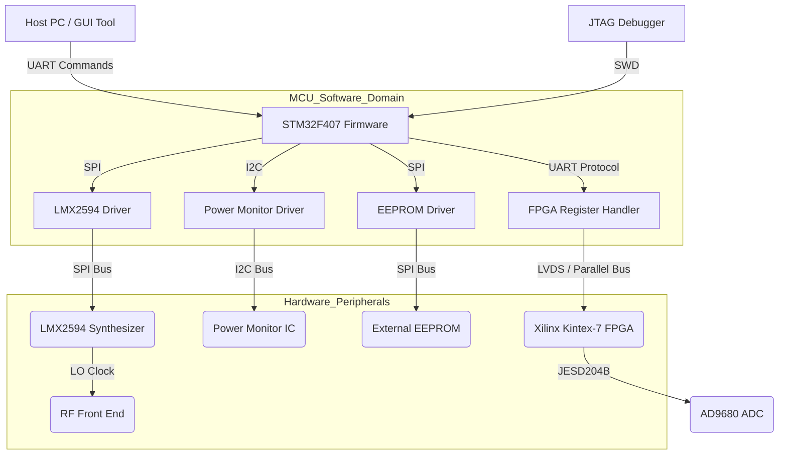
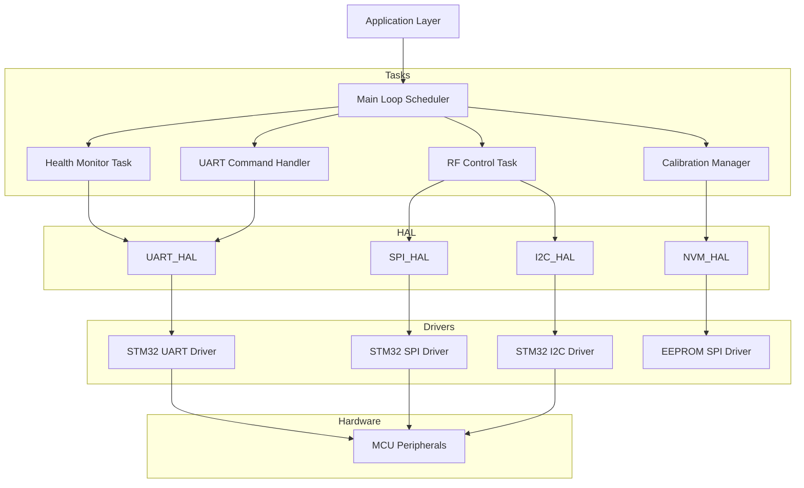
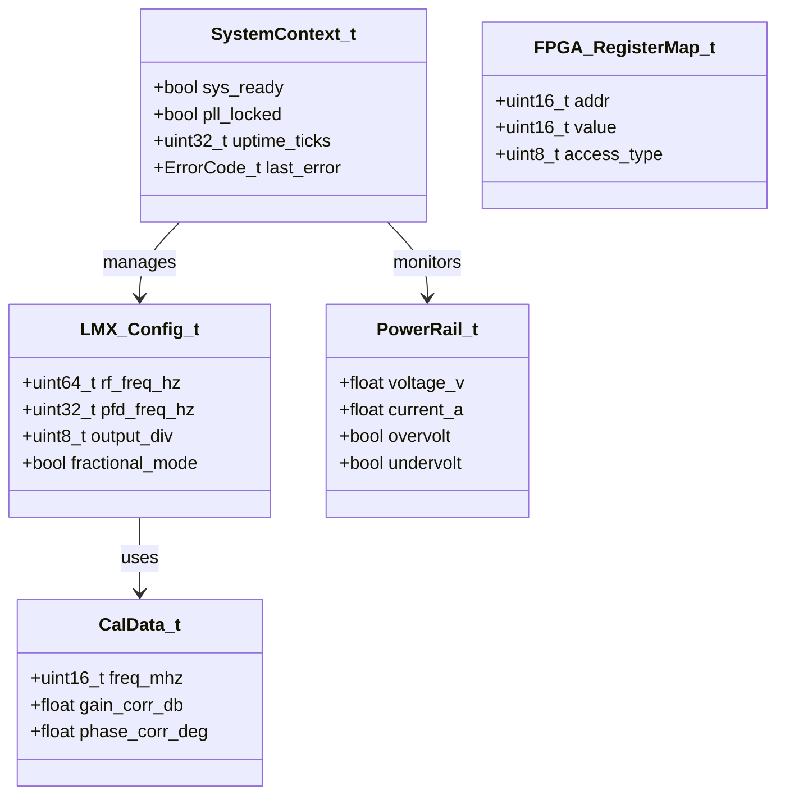
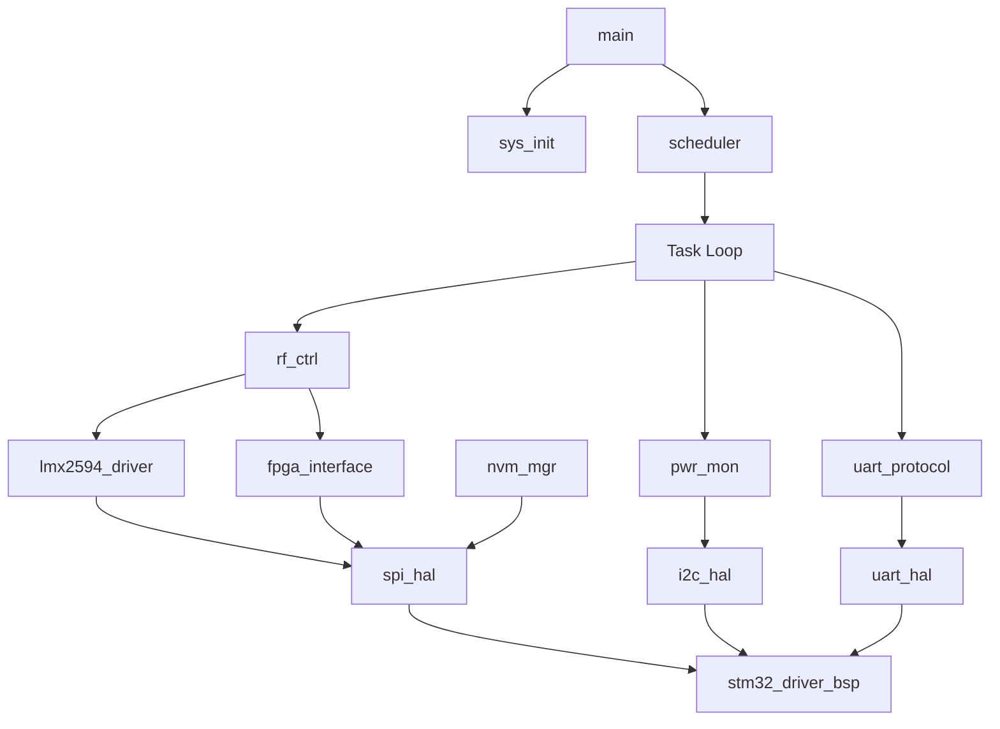
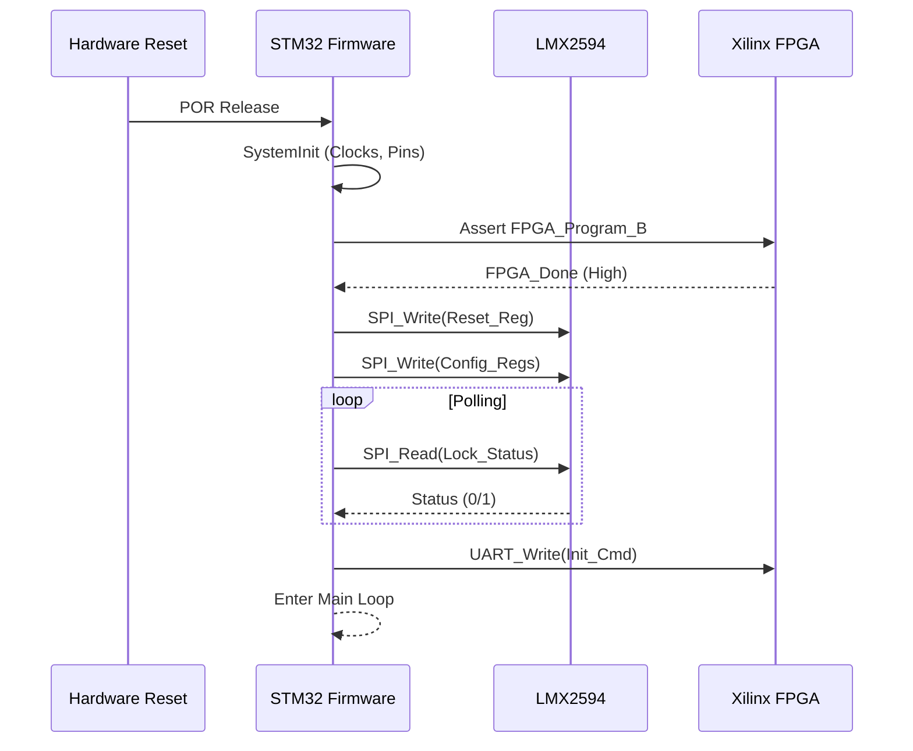
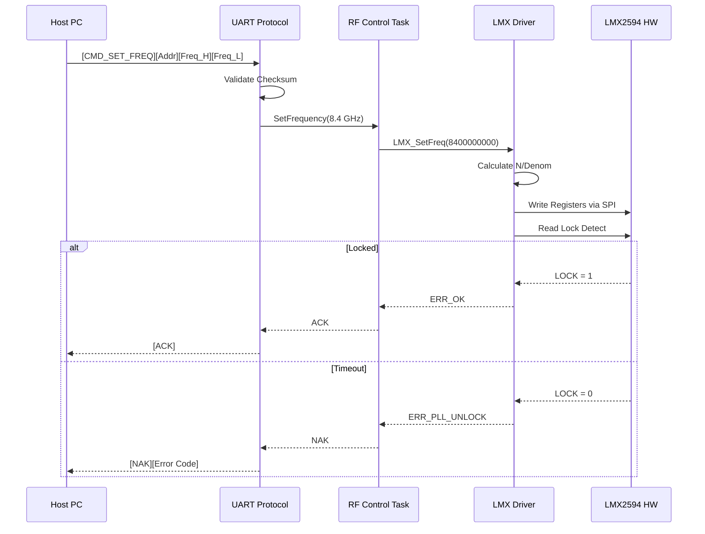
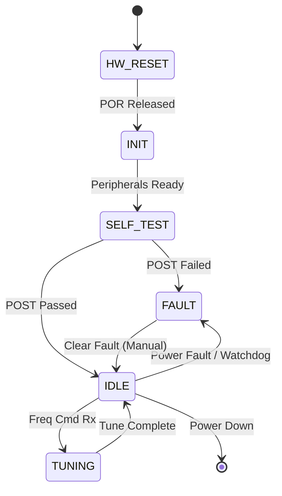
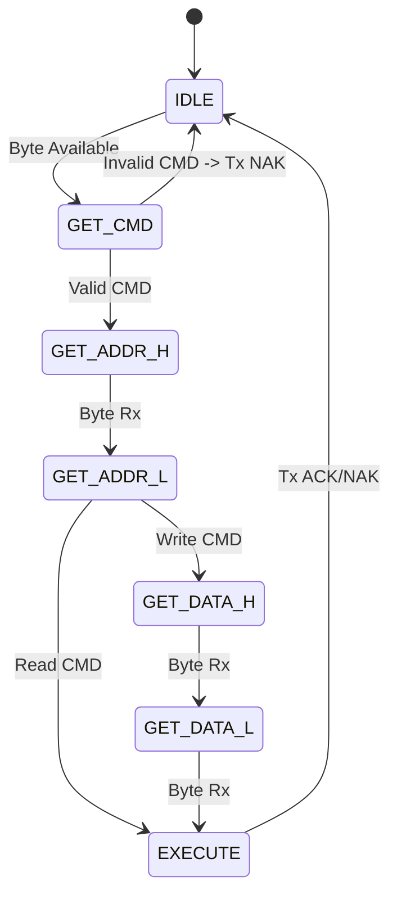

```markdown
# Software Design Document (SDD)

## Document Control
| Version | Date | Author | Description |
|---------|------|--------|-------------|
| 1.0 | 16 April 2026 | Lead Firmware Architect | Initial design for rx receiver (Wideband RF) |

---

# 1. Introduction

## 1.1 Purpose
This Software Design Document (SDD) describes the software architecture and detailed design for the **rx receiver** embedded control system. It provides a comprehensive blueprint for the implementation of firmware running on the STM32F407 Microcontroller Unit (MCU) and the associated logic for the Xilinx Kintex-7 FPGA.

This document is intended for:
- **Embedded Firmware Engineers:** Implementing the C-code for the STM32F407.
- **FPGA Engineers:** Implementing the glue logic and register maps in VHDL/Verilog.
- **Verification Engineers:** Developing hardware-in-the-loop (HIL) test benches.
- **System Integrators:** Understanding the control interfaces and state machines.

This SDD is fully compliant with IEEE 1016-2009.

## 1.2 Scope
The design encompasses the complete control software for the rx receiver subsystem.

### Included:
- **STM32F407 Firmware:** Bare-metal scheduling, peripheral drivers (SPI, I2C, UART), and control logic.
- **Hardware Abstraction Layer (HAL):** Standardized interface for RF components (LMX2594 PLL, HMC6180 LNA).
- **Communication Protocol:** Implementation of the UART packet-based command set defined in the GLR.
- **FPGA Logic:** High-speed data path control, register map interfacing, and housekeeping.
- **Diagnostics:** Power-On Self Test (POST), Built-In Self Test (BIST), and fault management.
- **Calibration:** Storage and retrieval of gain/offset correction factors in EEPROM.

### Excluded:
- Host PC GUI implementation.
- Complex DSP algorithms (e.g., wideband demodulation), which are handled by downstream processing.
- RTL design for the high-speed data path (outside of control registers).

### Target Hardware Platform
- **MCU:** STM32F407VGT6 (Cortex-M4, 168MHz, 1MB Flash, 192KB SRAM).
- **FPGA:** Xilinx Kintex-7 (XC7K70T or equivalent, acting as data handler).
- **Compiler:** Arm GNU Toolchain (gcc-arm-none-eabi), C99 standard.
- **MISRA Compliance:** Strict adherence to MISRA-C:2012 required.

## 1.3 Definitions and Acronyms

| Acronym | Definition |
| :--- | :--- |
| **ADC** | Analog-to-Digital Converter (AD9680) |
| **API** | Application Programming Interface |
| **BIT** | Built-In Test |
| **BSP** | Board Support Package |
| **CRC** | Cyclic Redundancy Check |
| **DAC** | Digital-to-Analog Converter |
| **EOF** | End of Frame |
| **FIFO** | First In, First Out buffer |
| **FPGA** | Field-Programmable Gate Array (Xilinx Kintex-7) |
| **FSM** | Finite State Machine |
| **GLR** | Glue Logic Requirements |
| **GPIO** | General Purpose Input/Output |
| **HAL** | Hardware Abstraction Layer |
| **HRS** | Hardware Requirements Specification |
| **I2C** | Inter-Integrated Circuit |
| **IPC** | Inter-Process Communication |
| **IRQ** | Interrupt Request |
| **ISR** | Interrupt Service Routine |
| **JTAG** | Joint Test Action Group |
| **LFSR** | Linear Feedback Shift Register |
| **LNA** | Low Noise Amplifier |
| **LVDS** | Low-Voltage Differential Signaling |
| **MCU** | Microcontroller Unit |
| **MISR** | Multiple Input Signature Register |
| **MISRA** | Motor Industry Software Reliability Association |
| **NVMEM** | Non-Volatile Memory (EEPROM) |
| **PLL** | Phase-Locked Loop (LMX2594) |
| **POST** | Power-On Self Test |
| **RTOS** | Real-Time Operating System (Considered, but using Bare-Metal Scheduler) |
| **SRS** | Software Requirements Specification |
| **TRP** | Transmit/Receive Pulse |
| **UART** | Universal Asynchronous Receiver-Transmitter |
| **WDT** | Watchdog Timer |

## 1.4 References
1. IEEE 1016-2009: Standard for Information Technology — Systems Design — Software Design Descriptions.
2. **SRS-001:** rx receiver Software Requirements Specification (v1.0, 16 April 2026).
3. **GLR-001:** rx receiver Glue Logic Requirements (v0V01, 16 April 2026).
4. **HRS-001:** rx receiver Hardware Requirements Specification (v1.0, 16 April 2026).
5. **STM32F407:** Reference Manual RM0090 and Datasheet.
6. **LMX2594:** LMX2594 Wideband PLLatinum Frequency Synthesizer Datasheet (SNAS665H).
7. **AD9680:** AD9680 Dual, 14-Bit, 250 MSPS A/D Converter Datasheet.
8. MISRA-C:2012 - Guidelines for the Use of the C Language in Critical Systems.
9. IEC 61508: Functional Safety of Electrical/Electronic/Programmable Electronic Safety-related Systems.

---

# 2. Design Viewpoints

## 2.1 Context Viewpoint — System Boundaries

The software resides on the STM32F407 and manages the peripherals depicted below. The boundary is defined at the physical connectors and the logical FPGA register interface.



### Interface Description

1.  **MCU <-> FPGA (UART Register Interface):**
    -   **MCU Role:** Master.
    -   **Protocol:** Packetized UART (defined in GLR).
    -   **Function:** The MCU acts as a gateway, translating host commands into FPGA register writes/reads. This abstracts the FPGA complexity from the host PC.

2.  **MCU <-> LMX2594 (SPI):**
    -   **MCU Role:** Master.
    -   **Max Speed:** 20 MHz.
    -   **Function:** Configures the PLL frequency for the RF downconversion mixers.

3.  **MCU <-> Power Monitor (I2C):**
    -   **MCU Role:** Master.
    -   **Speed:** 100 kHz (Standard).
    -   **Function:** Polls 12V, 5V, and 3.3V rails for undervoltage/overvoltage faults.

## 2.2 Composition Viewpoint — Software Architecture

The software follows a strict layered architecture to ensure portability and testability.



### Module List and Responsibilities

**1. Module: sys_init** (sys_init.c / sys_init.h)
*   **Responsibility:** System startup, clock configuration (168MHz), peripheral clock enabling, interrupt vector table setup.
*   **API:**
    ```c
    int32_t SYS_Init(void);
    int32_t SYS_GetClockFreq(uint32_t *freq_hz);
    ```
*   **Configuration:** `SYSTEM_CORE_CLOCK` (168MHz).

**2. Module: lmx2594_driver** (lmx2594.c / lmx2594.h)
*   **Responsibility:** Configuration of the LMX2594 PLL via SPI. Handles integer-N and fractional-N calculations, VCO calibration, and lock detection.
*   **API:**
    ```c
    int32_t LMX_Init(uint32_t pfd_freq_hz);
    int32_t LMX_SetFreq(uint64_t rf_freq_hz);
    bool    LMX_IsLocked(void);
    int32_t LMX_WriteReg(uint16_t reg_addr, uint16_t data);
    int32_t LMX_ReadReg(uint16_t reg_addr, uint16_t *data);
    ```
*   **Internal State:**
    ```c
    typedef struct {
        uint64_t target_freq_hz;
        bool     is_locked;
        uint16_t device_id;
    } LMX_State_t;
    ```

**3. Module: uart_protocol** (uart_protocol.c / uart_protocol.h)
*   **Responsibility:** Parses incoming UART packets (Write/Read/Bulk), validates CRC/Checksums, executes commands, and formats responses.
*   **API:**
    ```c
    void    UART_Protocol_Init(void);
    void    UART_Protocol_Process(void); // Non-blocking state machine
    int32_t UART_Protocol_BuildResp(uint8_t *buf, uint16_t len);
    ```

**4. Module: fpga_interface** (fpga_if.c / fpga_if.h)
*   **Responsibility:** Handles the logical address mapping between the protocol commands and the physical FPGA registers. May use SPI or a parallel bus depending on final board routing.
*   **API:**
    ```c
    int32_t FPGA_WriteReg(uint16_t addr, uint16_t data);
    int32_t FPGA_ReadReg(uint16_t addr, uint16_t *data);
    int32_t FPGA_Reset(void);
    ```

**5. Module: power_monitor** (pwr_mon.c / pwr_mon.h)
*   **Responsibility:** Reads current/voltage via I2C. Implements software hysteresis for fault detection.
*   **API:**
    ```c
    int32_t PWR_Init(void);
    int32_t PWR_GetRail(uint8_t rail_idx, float *voltage, float *current);
    bool    PWR_IsFaultActive(void);
    void    PWR_Task(void); // Periodic check
    ```

**6. Module: nvm_manager** (nvm_mgr.c / nvm_mgr.h)
*   **Responsibility:** Abstraction for EEPROM access. Stores calibration tables (Gain vs. Freq) and serial numbers.
*   **API:**
    ```c
    int32_t NVM_WriteCalibration(uint16_t freq_mhz, CalData_t *data);
    int32_t NVM_ReadCalibration(uint16_t freq_mhz, CalData_t *data);
    int32_t NVM_GetSerialNumber(char *sn_str);
    ```

**7. Module: diag_post** (diag.c / diag.h)
*   **Responsibility:** Power-On Self Test routines.
*   **API:**
    ```c
    int32_t DIAG_RunPOST(void);
    int32_t DIAG_RunBIST(void);
    ```

## 2.3 Logical Viewpoint — Data Model

Key data structures exchanged between the HAL and Application layers.



### Data Structure Definitions

```c
/* Standard Error Code Enumeration */
typedef enum {
    ERR_OK = 0x00,
    ERR_TIMEOUT = 0x01,
    ERR_COMM_SPI = 0x02,
    ERR_COMM_I2C = 0x03,
    ERR_PARAM_RANGE = 0x04,
    ERR_PLL_UNLOCK = 0x05,
    ERR_HW_FAULT = 0x06,
    ERR_NVM_FAIL = 0x07,
    ERR_CHECKSUM = 0x08
} ErrorCode_t;

/* System State Structure */
typedef struct {
    volatile uint32_t system_ticks; /* 1ms ticks */
    SystemState_e    state;        /* INIT, RUNNING, FAULT */
    LMX_Config_t     current_pll_config;
    PowerRail_t      rails[3];     /* 12V, 5V, 3.3V */
    uint16_t         fpga_firmware_version;
} SystemContext_t;

/* Calibration Data Entry */
typedef struct {
    uint16_t freq_mhz;
    float    gain_corr_db;
    float    phase_corr_deg;
    uint8_t  reserved[4];
} CalData_t;
```

## 2.4 Dependency Viewpoint — Module Coupling



**Build Order (Dependency Resolution):**
1.  **STM32 Driver BSP** (Lowest layer)
2.  **HAL Modules** (SPI, I2C, UART wrappers)
3.  **Driver Modules** (LMX2594, EEPROM, Power Monitor)
4.  **Service Modules** (NVM Manager, FPGA IF)
5.  **Application Layer** (Protocol, Scheduler, Main)

## 2.5 Interface Viewpoint — Detailed API Specification

### Function: `LMX_SetFreq`

```c
/**
 * @brief Sets the LMX2594 output frequency.
 * 
 * Calculates the divider values (N, NUM, DEN) for the Fractional-N PLL
 * based on the target frequency and the fixed PFD frequency.
 * Programs the registers via SPI and waits for lock.
 *
 * @param freq_hz Desired output frequency (5e9 to 18e9 Hz).
 * 
 * @return ERR_OK (0) on success.
 * @return ERR_PARAM_RANGE if frequency is outside 5-18 GHz.
 * @return ERR_PLL_UNLOCK if the PLL fails to lock within timeout.
 * 
 * @pre SPI must be initialized. LMX_Init() must have been called.
 * @post LMX2594 is generating the target frequency.
 * 
 * @thread_safety Not thread-safe. Must be called from a single task context.
 * 
 * @example
 *   if (LMX_SetFreq(8400000000ULL) == ERR_OK) {
 *       // LED ON
 *   }
 */
int32_t LMX_SetFreq(uint64_t freq_hz);
```

### Function: `FPGA_WriteReg`

```c
/**
 * @brief Writes a value to a control register in the FPGA.
 * 
 * Implements the physical write cycle to the FPGA register map.
 * Handles chip-select toggling and wait states if required by the FPGA logic.
 *
 * @param addr 16-bit register address (See GLR Register Map).
 * @param data 16-bit data to write.
 * 
 * @return ERR_OK on success.
 * @return ERR_COMM_SPI if SPI transaction fails.
 * 
 * @pre FPGA_Register_Enable() must have been called.
 * @post FPGA register is updated. Changes take effect immediately (unless latched).
 */
int32_t FPGA_WriteReg(uint16_t addr, uint16_t data);
```

### Function: `UART_Protocol_Process`

```c
/**
 * @brief Main processing loop for the UART protocol handler.
 * 
 * This function is non-blocking. It must be called periodically (e.g. every 1ms).
 * It checks the UART RX ring buffer for a complete packet.
 * Valid packets are dispatched to the appropriate command handler.
 * Responses are placed into the TX ring buffer.
 *
 * @return void
 * 
 * @pre UART_Init() must be called.
 * @sideffect May write to UART_TX_BUFFER, may update global registers.
 */
void UART_Protocol_Process(void);
```

## 2.6 Interaction Viewpoint — Sequence Diagrams

### Startup Sequence



### Frequency Tune Command Flow



## 2.7 State Viewpoint — State Machines

### System Master State Machine



### UART Protocol Handler State Machine



## 2.8 Algorithm Viewpoint — Key Algorithms

### 2.8.1 LMX2594 Fractional-N Divider Calculation

**Requirement:** Generate RF frequency $F_{out}$ from PFD $F_{pfd}$.
**Variables:**
-   $N_{int}$: Integer divider (16-bit)
-   $NUM$: Fractional numerator (24-bit)
-   $DEN$: Fractional denominator (24-bit)

**Algorithm (C Pseudocode):**
```c
void LMX_CalcDividers(uint64_t f_out, uint32_t f_pfd, uint16_t *n_int, uint32_t *num, uint32_t *den) {
    // Set denominator to max for finest resolution (2^24 approx)
    *den = 1000000; // Example scaling factor, simplified for LMX logic
    
    double div_d = (double)f_out / (double)f_pfd;
    *n_int = (uint16_t)div_d;
    
    double remainder = div_d - (double)(*n_int);
    
    // Calculate fractional part scaled to DEN
    // Note: LMX2594 has specific logic for DEN vs NUM limits
    *num = (uint32_t)(remainder * (double)(*den));
    
    // Simplified: In real implementation, we must simplify NUM/DEN fraction
    // to fit hardware constraints and optimize phase noise.
}
```

### 2.8.2 Power Monitor Fault Detection (Hysteresis)

```c
bool PWR_CheckFault(float current_v) {
    static const float THRESH_HIGH = 5.5f; // 5.5V
    static const float THRESH_LOW = 4.5f;  // 4.5V
    static bool fault_active = false;
    
    if (fault_active) {
        // Clear fault only when voltage returns well within limits
        if (current_v > (THRESH_LOW + 0.2f)) {
            fault_active = false;
        }
    } else {
        // Trigger fault immediately
        if (current_v < THRESH_LOW) {
            fault_active = true;
        }
    }
    return fault_active;
}
```

---

# 3. Design Rationale

## 3.1 Architecture Choices

### 3.1.1 Bare-Metal vs. RTOS
**Decision:** Use a cooperative bare-metal scheduler (Super Loop) instead of a preemptive RTOS (e.g., FreeRTOS).
**Rationale:**
1.  **Determinism:** The rx receiver has hard real-time constraints on the SPI bus interactions with the PLL. Preemption during a sensitive SPI transaction could cause timing glitches.
2.  **Complexity:** The system has a low number of concurrent threads (approx 4-5 tasks). The overhead of an RTOS (stack usage, context switching) is not justified.
3.  **MISRA Compliance:** Writing a custom static scheduler simplifies dynamic memory analysis (no heap usage required).

### 3.1.2 UART Packet Protocol Implementation
**Decision:** Implement a non-blocking state machine in the main loop rather than a callback-driven ISR parser.
**Rationale:**
1.  **Processing Time:** Register calculations (especially for PLL) can take >1ms. Performing this in an ISR blocks the system. The ISR merely buffers bytes; the main loop processes them.
2.  **Portability:** The protocol logic is decoupled from the hardware interrupt specifics.

### 3.1.3 EEPROM Usage for Calibration
**Decision:** Store calibration data as a lookup table (LUT) indexed by frequency, rather than polynomial coefficients.
**Rationale:**
1.  **Speed:** O(1) lookup time during frequency hopping.
2.  **Flexibility:** Allows correction of non-linearities in the LNA/Mixer response that high-order polynomials might not fit well.

---

# 4. Design Traceability Matrix

Maps software elements to the Software Requirements Specification (SRS).

| SDD Component / Function | Implements SRS Requirement | Design Element |
| :--- | :--- | :--- |
| `LMX_SetFreq` | **REQ-SW-010** (Frequency Tuning) | PLL Control Logic |
| `LMX_Init` | **REQ-SW-011** (PLL Lock Time) | Initialization routine |
| `UART_Protocol_Process` | **REQ-SW-020** (Host Command Interface) | Protocol State Machine |
| `PWR_GetRail` | **REQ-SW-030** (Power Monitoring) | I2C Polling Task |
| `DIAG_RunPOST` | **REQ-SW-040** (Built-In Self Test) | Diagnostic Module |
| `NVM_WriteCalibration` | **REQ-SW-050** (Calibration Storage) | EEPROM Driver |
| `FPGA_WriteReg` | **REQ-SW-021** (FPGA Control) | Register Interface |
| `SYS_Init` | **REQ-SW-001** (Initialization) | System Startup |
| `WDT_Handler` | **REQ-SW-099** (Watchdog) | Fault Recovery |

---

# 5. Appendices

## Appendix A — File Structure

```
project_rx_receiver/
├── src/
│   ├── main.c                   # Entry point, main loop
│   ├── sys_init.c               # Clock setup, low level init
│   ├── drivers/
│   │   ├── stm32/
│   │   │   ├── stm32f4xx_it.c   # Interrupt handlers
│   │   │   ├── stm32f4xx_hal_msp.c
│   │   │   └── system_stm32f4xx.c
│   │   ├── lmx2594.c            # PLL driver
│   │   ├── eeprom_25xx.c        # EEPROM SPI driver
│   │   ├── pwr_mon_i2c.c        # Power monitor driver
│   │   └── fpga_interface.c     # FPGA register access
│   ├── app/
│   │   ├── uart_protocol.c      # Host command parser
│   │   ├── rf_control.c         # High level RF state machine
│   │   └── diagnostics.c        # POST and BIST
│   └── hal/
│       ├── uart_hal.c
│       ├── spi_hal.c
│       └── i2c_hal.c
├── inc/
│   ├── common_types.h
│   ├── registers.h             # Shared register definitions
│   └── [module].h
└── tests/
    ├── test_lmx.c              # Unit tests for PLL math
    └── test_protocol.c         # Protocol framing unit tests
```

## Appendix B — FPGA Register Map Summary

Derived from the GLR. Base Address `0x8000`.

| Offset | Name | Bit Width | Access | Description | Default |
| :--- | :--- | :--- | :--- | :--- | :--- |
| 0x00 | `REG_CTRL` | 16 | R/W | Global Control (Bit 0: ADC Enable) | 0x0000 |
| 0x01 | `REG_GAIN` | 16 | R/W | IF VGA Gain Setting (0-1023) | 0x0200 |
| 0x02 | `REG_FREQ_MSB` | 16 | R/W | RF Frequency Indicator MSB | 0x0000 |
| 0x03 | `REG_FREQ_LSB` | 16 | R/W | RF Frequency Indicator LSB | 0x0000 |
| 0x04 | `REG_STATUS` | 16 | R | ADC Status Flags (Overrange, etc) | 0x0000 |
| 0x05 | `REG_SCRATCH` | 16 | R/W | Scratchpad register for testing | 0xCAFE |

## Appendix C — Memory Map (STM32F407)

| Region | Start Address | Size | Usage |
| :--- | :--- | :--- | :--- |
| **CODE** | 0x08000000 | 1 MB | Firmware (FLASH) |
| **SRAM1** | 0x20000000 | 112 KB | Main Data, Heap, Stack |
| **SRAM2** | 0x2001C000 | 16 KB | Backup Registers / Critical Data |
| **PERIPH** | 0x40000000 | - | STM32 Peripheral Registers |
| **FPGA_REG** | 0x60000000 | - | FPGA Memory Mapped Region (FSMC) |

## Appendix D — Coding Standards Checklist

- [ ] **MISRA-C:2012:** All code passes static analysis.
- [ ] **Naming:** `PascalCase` for functions, `camelCase` for variables, `UPPER_CASE` for macros.
- [ ] **Returns:** All functions return an `int32_t` status code (0 = OK, <0 = Error) except simple getters.
- [ ] **Types:** Use `stdint.h` types (uint32_t, etc.) exclusively. No `int` or `long`.
- [ ] **Float:** Avoid floating point in ISR context.
- [ ] **Magic Numbers:** All numeric constants defined as macros or enums.

---

## 2.9 Resource Viewpoint — Real-Time Constraints

### 2.9.1 Task Scheduling Table
The main loop runs at 1ms periodicity.

| Task Name | Period | Exec Time (Max) | Priority | Action |
| :--- | :--- | :--- | :--- | :--- |
| **WDT_Pet** | 10 ms | 10 µs | Highest | Refresh watchdog counter |
| **UART_Rx** | Event (ISR) | 20 µs | High | Load byte into ring buffer |
| **Protocol_Parse** | 1 ms | 150 µs | High | Check for complete packet |
| **RF_Tune** | Event | 5 ms | Medium | Calculate PLL dividers |
| **Power_Check** | 100 ms | 800 µs | Low | Read I2C rails |
| **LED_Toggle** | 500 ms | 50 µs | Low | Status LED blink |

### 2.9.2 ISR Latency Budget
| Interrupt Source | Max Latency | Requirement | Notes |
| :--- | :--- | :--- | :--- |
| **UART RX** | 5 µs | < byte time @ 115200 (87 µs) | Easily met |
| **SPI TX/RX** | 10 µs | < 20 MHz period | DMA recommended |
| **I2C Event** | 50 µs | < 100 kHz period | Stretch clock if slow |

### 2.9.3 Memory Budget
| Module | Code Size (Est) | RAM Usage (Est) |
| :--- | :--- | :--- |
| Kernel / Startup | 2 KB | 1 KB |
| Drivers (LMX, I2C, SPI) | 12 KB | 2 KB |
| Protocol / App | 8 KB | 4 KB |
| Buffers (RX/TX FIFO) | - | 4 KB |
| **Total** | **22 KB** | **11 KB** |
| **Margin** | 978 KB Free | 181 KB Free |

---

## 2.10 Build System Viewpoint

### 2.10.1 CMakeLists.txt Structure

```cmake
cmake_minimum_required(VERSION 3.20)
project(rx_receiver VERSION 1.0.0 LANGUAGES C ASM)

# Toolchain setup for ARM
set(CMAKE_SYSTEM_NAME Generic)
set(CMAKE_SYSTEM_PROCESSOR ARM)
set(CMAKE_C_COMPILER arm-none-eabi-gcc)
set(CMAKE_OBJCOPY arm-none-eabi-objcopy)

# Definitions
add_definitions(-DSTM32F407xx -DMISRA_C_2012)

# Sources
set(SOURCES
    src/main.c
    src/sys_init.c
    src/drivers/lmx2594.c
    src/drivers/eeprom_25xx.c
    src/drivers/pwr_mon_i2c.c
    src/app/uart_protocol.c
    src/app/rf_control.c
)

# Create Executable
add_firmware(firmware.elf ${SOURCES})
target_compile_options(firmware.elf PRIVATE
    -Wall -Wextra -Wpedantic
    -O2
    -ffunction-sections -fdata-sections
)

# Qt6 GUI (Host Side Simulation / Control)
find_package(Qt6 REQUIRED COMPONENTS Core SerialPort)
qt_add_executable(rx_host_gui
    gui/main_window.cpp
    gui/uart_port.cpp
)
target_link_libraries(rx_host_gui PRIVATE Qt6::Core Qt6::SerialPort)

# Unit Tests (Host Side)
enable_testing()
add_subdirectory(tests)
```

### 2.10.2 Testing Strategy
- **Host Unit Tests:** Compile specific modules (e.g., `lmx2594.c`) with a mock HAL to test register math on x86.
- **Hardware Integration:** Flash firmware to STM32, use Host GUI to send `CMD_SET_FREQ` packets and verify SPI traffic via Logic Analyzer.
- **MISRA Check:** Run PC-lint Plus or Coverity on CI server.
```