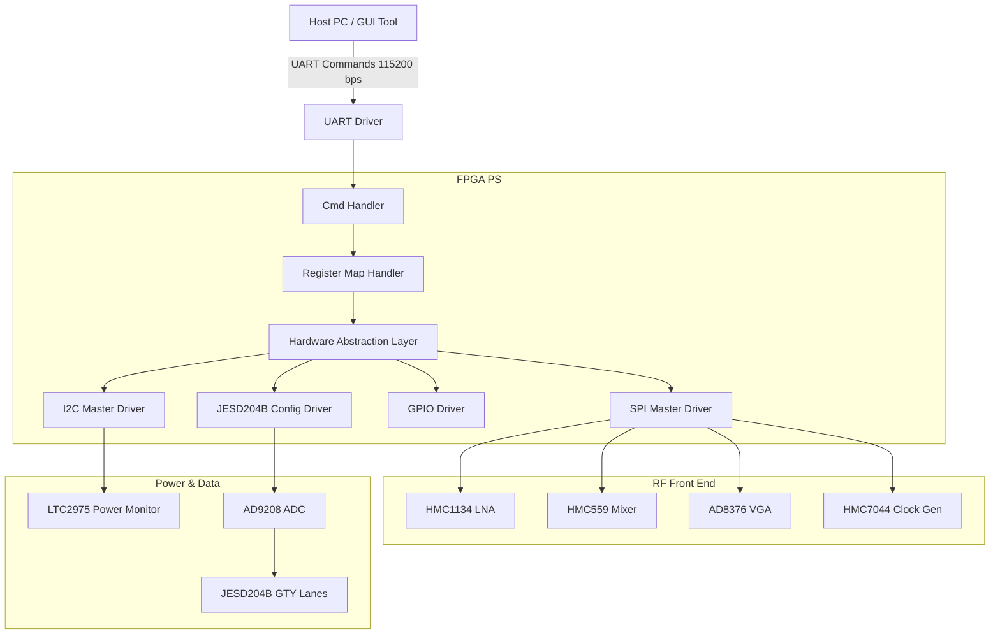
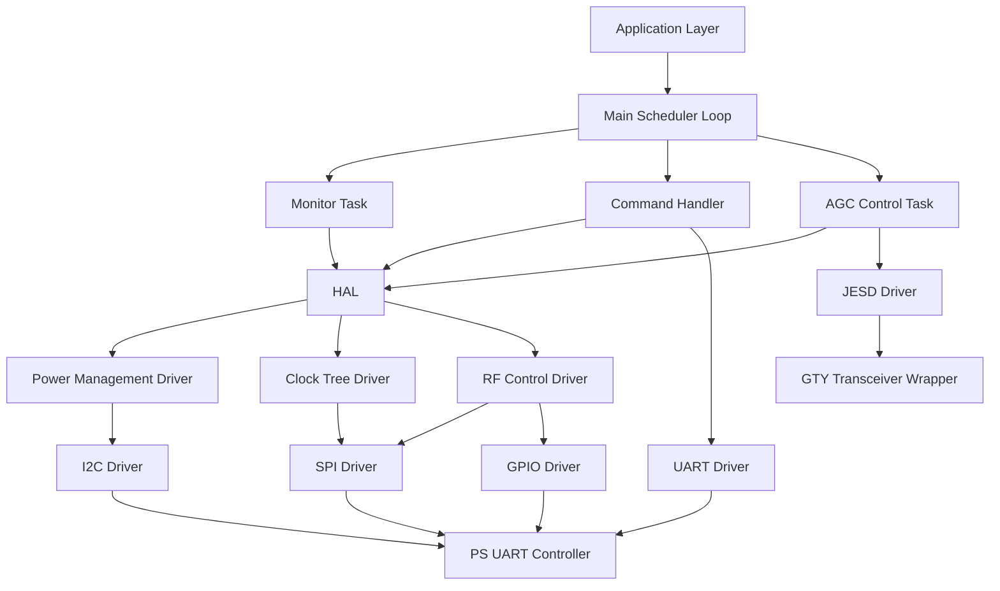
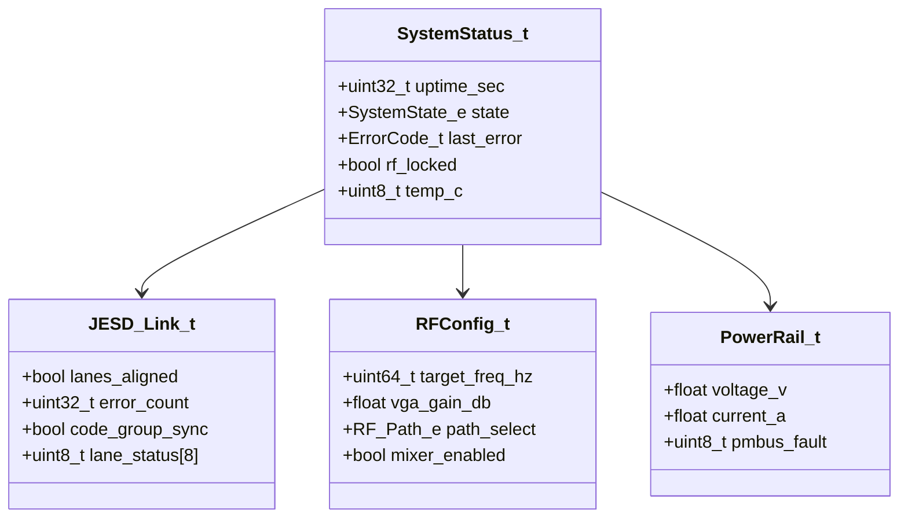
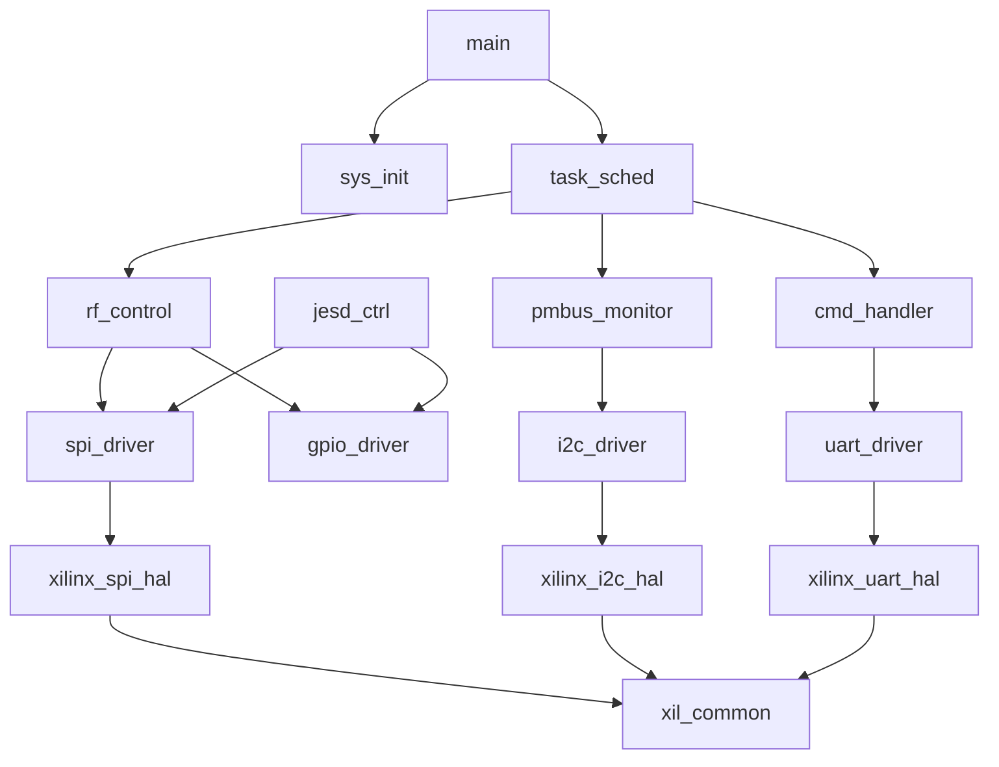
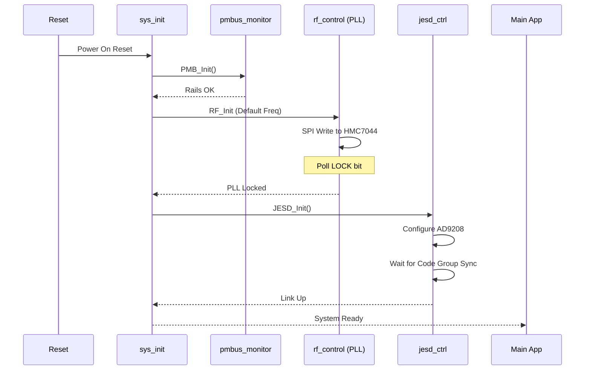
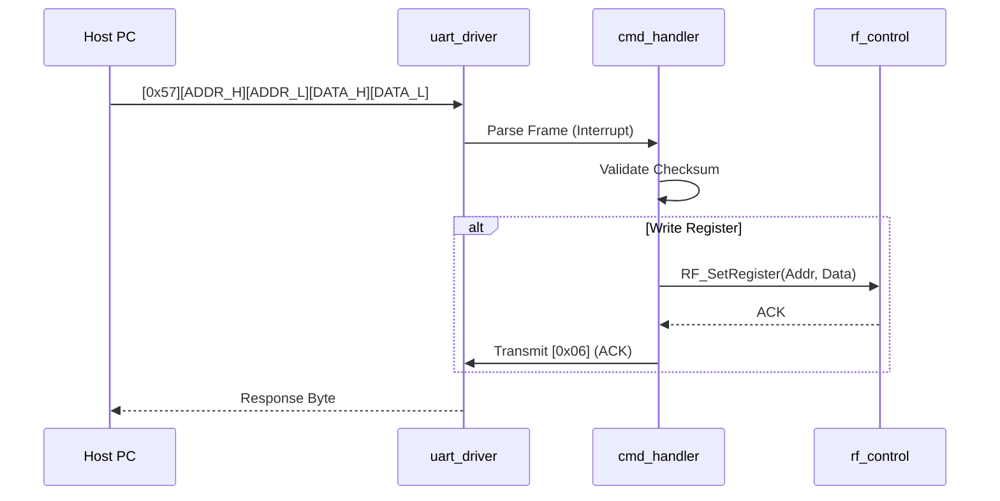
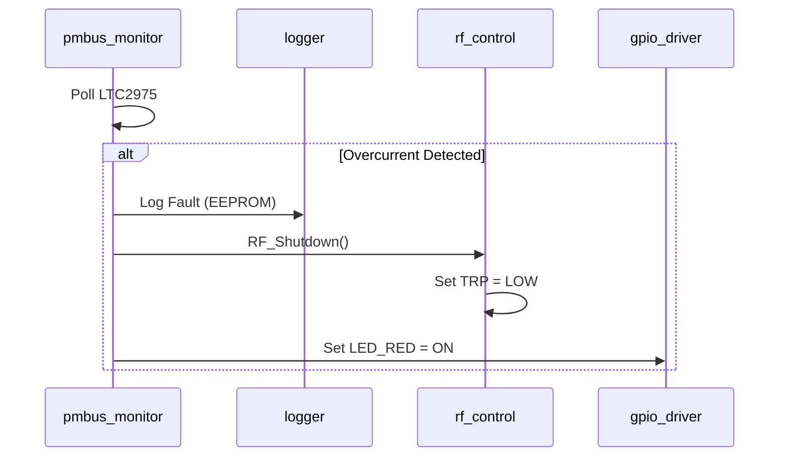
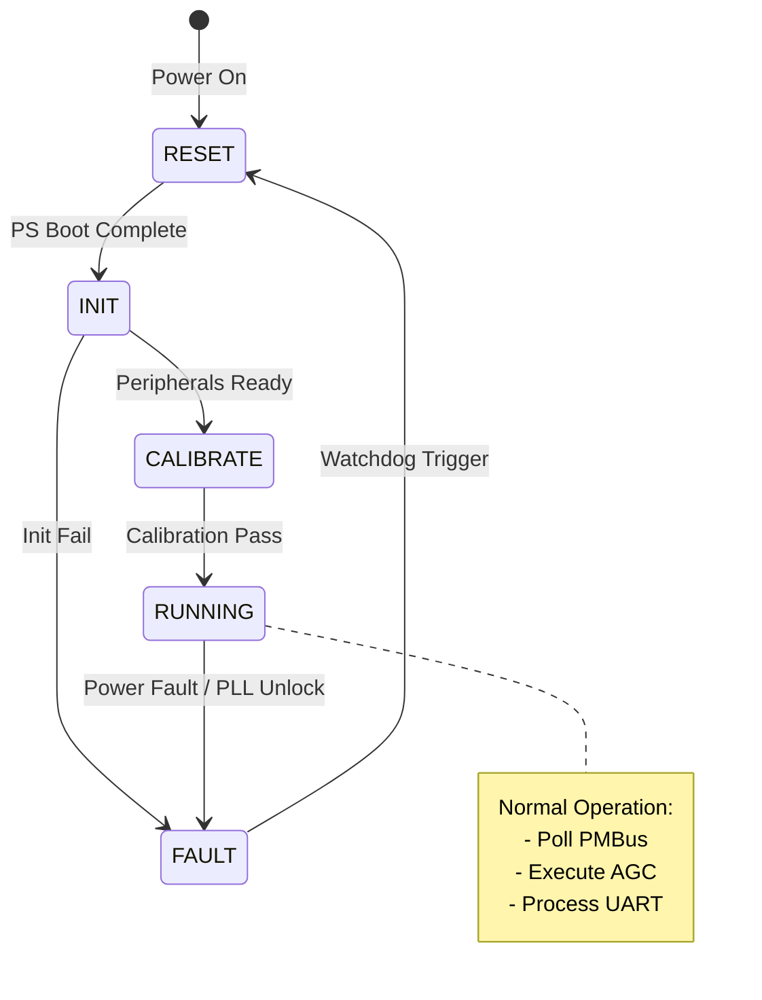
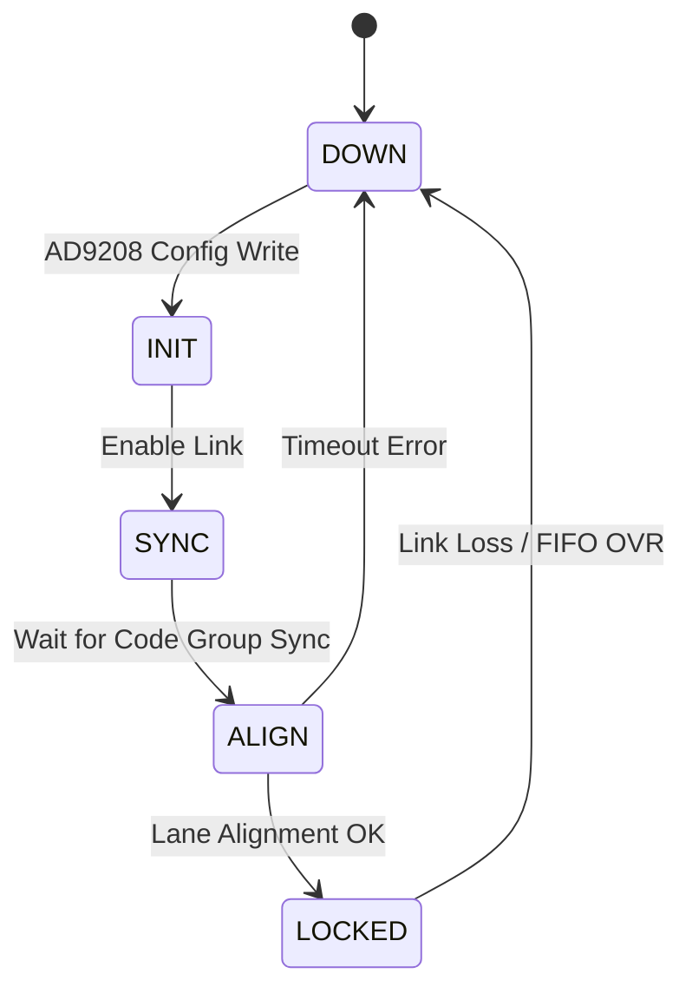

# Software Design Document (SDD)

## Document Control
| Version | Date | Author | Description |
|---------|------|--------|-------------|
| 1.0 | 16 April 2026 | Lead Architect | Initial design derived from SRS-001 and GLR P6 |

---

# 1. Introduction

## 1.1 Purpose
This Software Design Document (SDD) describes the structural and behavioral design of the embedded firmware for the **Wideband RF Receiver System** (Project: sample). This document defines the software architecture, data structures, algorithms, and interface definitions necessary to implement the requirements specified in **SRS-001**.

The intended audience includes:
*   **Firmware Engineers:** Responsible for implementing the BSP, HAL, and application logic on the Xilinx Zynq UltraScale+ SoC.
*   **Verification Engineers:** Using this document to create unit tests and integration test plans.
*   **System Architects:** Validating that the software design meets the performance and safety constraints of the RF hardware.

## 1.2 Scope
The design covers the firmware running on the Processing System (PS) of the **XCZU2CG-1SFVC784E** FPGA. Key areas include:
1.  **Hardware Abstraction Layer (HAL):** Drivers for SPI, I2C, UART, and GPIO tailored to the Xilinx standalone OS environment.
2.  **RF Control Logic:** Configuration algorithms for the HMC7044 PLL, HMC1134 LNA, and AD8376 VGA.
3.  **JESD204B Management:** Link initialization and lane monitoring for the AD9208 ADC interface.
4.  **System Monitoring:** PMBus (I2C) handling for the LTC2975 power controller and temperature sensing.
5.  **Host Interface:** Protocol parser for UART commands defined in **GLR P6**.

**Exclusions:** The RTL design for the JESD204B IP core and the DSP algorithms running on the PL (Programmable Logic) accelerators are considered external black boxes defined in the hardware specifications.

## 1.3 Definitions and Acronyms

| Term | Definition |
| :--- | :--- |
| **ADC** | Analog-to-Digital Converter (AD9208) |
| **AGC** | Automatic Gain Control |
| **API** | Application Programming Interface |
| **AXI** | Advanced eXtensible Interface (Xilinx bus) |
| **BER** | Bit Error Rate |
| **BIT** | Built-In Test |
| **BSP** | Board Support Package |
| **CE** | Compliance Engineering (CE RED) |
| **CRC** | Cyclic Redundancy Check |
| **DAC** | Digital-to-Analog Converter |
| **DMA** | Direct Memory Access |
| **DSP** | Digital Signal Processing |
| **EEPROM** | Electrically Erasable Programmable Read-Only Memory |
| **EMC** | Electromagnetic Compatibility |
| **ENOB** | Effective Number of Bits |
| **FIFO** | First-In, First-Out Buffer |
| **FPGA** | Field Programmable Gate Array |
| **GTY** | Xilinx High-Performance Transceiver (32.75 Gbps) |
| **HAL** | Hardware Abstraction Layer |
| **HRS** | Hardware Requirements Specification |
| **I2C** | Inter-Integrated Circuit (Serial Bus) |
| **IPC** | Inter-Process Communication |
| **ISR** | Interrupt Service Routine |
| **JESD** | JESD204B Standard (High-speed data converter interface) |
| **JTAG** | Joint Test Action Group |
| **LNA** | Low Noise Amplifier (HMC1134) |
| **LVDS** | Low-Voltage Differential Signaling |
| **MCU** | Microcontroller Unit (ARM Cortex-R5 in PS) |
| **MISRA** | Motor Industry Software Reliability Association (Coding Standard) |
| **NVMEM** | Non-Volatile Memory |
| **OVR** | Overflow |
| **PLL** | Phase-Locked Loop (HMC7044) |
| **POST** | Power-On Self-Test |
| **PMBus** | Power Management Bus |
| **RF** | Radio Frequency |
| **RTL** | Register Transfer Level |
| **RTOS** | Real-Time Operating System (Xilinx FreeRTOS or Bare-metal) |
| **SFDR** | Spurious-Free Dynamic Range |
| **SIL** | Safety Integrity Level |
| **SNR** | Signal-to-Noise Ratio |
| **SPI** | Serial Peripheral Interface |
| **StRS** | Stakeholder Requirements Specification |
| **SyRS** | System Requirements Specification |
| **TRP** | Transmit/Receive Point (RF Control) |
| **UART** | Universal Asynchronous Receiver-Transmitter |
| **VGA** | Variable Gain Amplifier (AD8376) |
| **WDT** | Watchdog Timer (Generic in Zynq SCU) |

## 1.4 References
1.  **IEEE 1016-2009:** Standard for Software Design Descriptions.
2.  **SRS-001:** Software Requirements Specification for Wideband RF Receiver System (16 April 2026).
3.  **HRS P2:** Hardware Requirements Specification (Project: sample).
4.  **GLR P6:** Glue Logic Requirements (Project: sample).
5.  **MISRA C:2012:** Guidelines for the Use of the C Language in Critical Systems.
6.  **Xilinx UG1085:** Zynq UltraScale+ Device Register Reference.
7.  **Xilinx UG1146:** Embedded Design Tutorial.
8.  **AD9208 Datasheet:** Rev 0, Analog Devices.
9.  **HMC7044 Datasheet:** Rev A, Analog Devices.
10. **LTC2975 Datasheet:** Rev A, Analog Devices.

---

# 2. Design Viewpoints

## 2.1 Context Viewpoint — System Boundaries

The software system operates within the Xilinx Zynq UltraScale+ Processing System (PS), controlling Programmable Logic (PL) peripherals and external analog front-end components.



**External Interfaces:**
*   **Host PC:** UART connection via FTDI or USB-UART bridge. Protocol defined in GLR Section 6.
*   **Power Supply:** +12V DC input (monitored via LTC2975).
*   **RF Input:** 5-18 GHz SMA connector (passive connection, switched by LNA bias).

## 2.2 Composition Viewpoint — Software Architecture

The software follows a layered architecture to maximize portability and adherence to MISRA-C:2012.



### Module List with Responsibilities:

#### Module: sys_init (sys_init.c / sys_init.h)
*   **Responsibilities:** Power-on initialization, cache configuration, exception vector setup, PLL configuration for PS clocks.
*   **Public API:**
    ```c
    int32_t SYS_Init(void);
    int32_t SYS_Post(void);
    const SystemInfo_t* SYS_GetInfo(void);
    ```

#### Module: uart_driver (uart_driver.c / uart_driver.h)
*   **Responsibilities:** UART configuration, interrupt-driven RX/TX, GLR frame parsing.
*   **Public API:**
    ```c
    int32_t UART_Init(uint32_t baud_rate);
    int32_t UART_Transmit(const uint8_t *data, uint16_t len);
    int32_t UART_RegisterCallback(UART_Event_t evt, void (*cb)(void));
    ```

#### Module: spi_driver (spi_driver.c / spi_driver.h)
*   **Responsibilities:** PS SPI controller configuration, DMA transfers for high-speed config.
*   **Public API:**
    ```c
    int32_t SPI_Init(uint8_t device_id, uint32_t clk_hz);
    int32_t SPI_Transfer(const uint8_t *tx_buf, uint8_t *rx_buf, uint32_t len);
    int32_t SPI_WriteReg(uint16_t addr, uint8_t data);
    ```

#### Module: i2c_driver (i2c_driver.c / i2c_driver.h)
*   **Responsibilities:** I2C master for PMBus, handling ACK/NACK, retries.
*   **Public API:**
    ```c
    int32_t I2C_Init(uint32_t clk_hz);
    int32_t I2C_Write(uint8_t dev_addr, uint8_t reg, const uint8_t *data, uint16_t len);
    int32_t I2C_Read(uint8_t dev_addr, uint8_t reg, uint8_t *data, uint16_t len);
    ```

#### Module: rf_control (rf_control.c / rf_control.h)
*   **Responsibilities:** State machine for RF path configuration (LNA, Mixer, VGA).
*   **Public API:**
    ```c
    int32_t RF_Init(void);
    int32_t RF_SetFrequency(uint64_t freq_hz);
    int32_t RF_SetGain(float gain_db);
    int32_t RF_SetPath(RF_Path_e path); // LNA Bypass or Direct
    ```

#### Module: jesd_ctrl (jesd_ctrl.c / jesd_ctrl.h)
*   **Responsibilities:** AD9208 configuration via SPI, JESD204B link training (subclass 1).
*   **Public API:**
    ```c
    int32_t JESD_Init(void);
    int32_t JESD_StartLink(void);
    bool JESD_IsLocked(void);
    int32_t JESD_GetLaneStatus(uint8_t lane_mask);
    ```

#### Module: pmbus_monitor (pmbus_monitor.c / pmbus_monitor.h)
*   **Responsibilities:** Polling LTC2975 for voltage, current, temperature limits.
*   **Public API:**
    ```c
    int32_t PMB_Init(void);
    int32_t PMB_ReadRail(uint8_t rail_idx, RailData_t *data);
    bool PMB_IsFaultActive(uint8_t *fault_code);
    ```

## 2.3 Logical Viewpoint — Data Model

Critical system data structures.



**Key Enumerations:**
```c
typedef enum {
    SYS_STATE_RESET = 0,
    SYS_STATE_INIT,
    SYS_STATE_CALIBRATING,
    SYS_STATE_RUNNING,
    SYS_STATE_FAULT,
    SYS_STATE_SHUTDOWN
} SystemState_e;

typedef enum {
    RF_PATH_BYPASS = 0,
    RF_PATH_LNA_HIGH_GAIN,
    RF_PATH_LNA_LOW_GAIN
} RF_Path_e;

typedef enum {
    ERR_OK = 0x00,
    ERR_TIMEOUT = 0x01,
    ERR_SPI_COMM = 0x02,
    ERR_I2C_NACK = 0x03,
    ERR_PLL_UNLOCK = 0x04,
    ERR_JESD_LINK_FAIL = 0x05,
    ERR_POWER_FAULT = 0x06
} ErrorCode_t;
```

## 2.4 Dependency Viewpoint — Module Dependencies

Build order ensures low-level drivers are compiled before the application layer.



## 2.5 Interface Viewpoint — Complete API Specification

### Function: RF_SetFrequency
```c
/**
 * @brief Configures the RF front-end for a specific target frequency.
 * 
 * @details This function calculates the required divider values for the HMC7044 PLL
 * and configures the HMC1118 switch and HMC559 mixer. It validates the input 
 * against the operating range of 5.0 GHz to 18.0 GHz.
 *
 * @param freq_hz Target frequency in Hertz. Valid Range: 5000000000 - 18000000000.
 * 
 * @return ERR_OK on success.
 * @return ERR_PARAM if frequency is out of range.
 * @return ERR_PLL_UNLOCK if the HMC7044 fails to lock within 100ms.
 *
 * @pre SPI Driver must be initialized (RF_Init called).
 * @post The PLL is locked and the RF path is configured.
 * @note This function is blocking and takes approx. 100ms to execute.
 */
int32_t RF_SetFrequency(uint64_t freq_hz);
```

### Function: PMB_ReadRail
```c
/**
 * @brief Reads telemetry data for a specific power rail via I2C/PMBus.
 * 
 * @details Performs a block read from the LTC2975 PMBus controller. Converts 
 * raw LINEAR format data to floating point Volts and Amps.
 *
 * @param rail_idx Index of the rail (0-5 corresponding to 5V, 3V3, 2V5, 1V8, 1V25, 1V0).
 * @param data Pointer to RailData_t struct to populate.
 * 
 * @return ERR_OK on success.
 * @return ERR_I2C_NACK if device does not acknowledge.
 * @return ERR_TIMEOUT if I2C bus hangs.
 *
 * @pre I2C Driver initialized.
 * @post data structure contains valid V, I, and P values.
 */
int32_t PMB_ReadRail(uint8_t rail_idx, RailData_t *data);
```

## 2.6 Interaction Viewpoint — Sequence Diagrams

### System Startup Sequence


### UART Command Handling


### Fault Handling Sequence


## 2.7 State Viewpoint — State Machines

### System Master State Machine


### JESD204B Link State Machine


## 2.8 Algorithm Viewpoint — Key Algorithms

### 2.8.1 HMC7044 Frequency Tuning Algorithm
*   **Inputs:** Target Frequency ($F_{target}$)
*   **Constants:** Reference Clock ($F_{ref} = 100$ MHz), PFD Frequency ($10$ MHz).
*   **Logic:**
    1.  Calculate INT dividers: $N = \lfloor F_{target} / F_{PFD} \rfloor$.
    2.  Calculate FRAC dividers for fractional interpolation.
    3.  Write 48-bit registers via SPI (MSB first).
    4.  Poll bit 11 of Register 0x000B.
    5.  If 1, PLL Locked. If 0 after 100ms, return `ERR_PLL_UNLOCK`.

### 2.8.2 AGC Loop Algorithm
*   **Context:** Executes every 1ms in Main Loop.
*   **Input:** ADC Signal Power (from JESD204B).
*   **Algorithm:**
    ```c
    float target_power = -10.0f; // dBFS
    float current_power = JESD_GetPower();
    float error = target_power - current_power;
    
    // PI Control
    static float integral = 0.0f;
    integral += error * 0.01f; // Ki
    float output = (error * 0.5f) + integral; // Kp
    
    // Clamp Gain to AD8376 range [-5 to 25 dB]
    if (output > 25.0f) output = 25.0f;
    if (output < -5.0f) output = -5.0f;
    
    RF_SetGain(output);
    ```

---

## 2.9 Resource Viewpoint — Real-Time Constraints

### 2.9.1 Task Scheduling Table
| Task Name | Period | Worst-Case Exec Time | Priority | Deadline | CPU Load |
|-----------|--------|---------------------|----------|----------|---------|
| uart_rx_isr | Event | 10 µs | High | < Packet Time | < 1% |
| pmbus_poll | 100 ms | 1.5 ms | Medium | 100 ms | 1.5% |
| agc_loop | 1 ms | 50 µs | High | 1 ms | 5% |
| jesd_monitor | 10 ms | 30 µs | Medium | 10 ms | 0.3% |
| cmd_handler | Main | 200 µs | Low | N/A | < 1% |

### 2.9.2 ISR Latency Budget
| Interrupt Source | Latency Requirement | Worst-Case Measured | Margin |
|-----------------|--------------------|--------------------|--------|
| UART RX | < 100 µs | 20 µs | 80% |
| SPI Done | < 10 µs | 2 µs | 80% |
| GTY RX Logic Error | < 1 µs | 0.2 µs | 80% |

### 2.9.3 Memory Budget (XCZU2CG PS DDR)
| Region | Total Available | Used (Est) | Remaining |
|--------|----------------|------------|-----------|
| Code Text | 512 KB | 180 KB | 332 KB |
| RoData | 64 KB | 10 KB | 54 KB |
| RW Data / BSS | 256 KB | 45 KB | 211 KB |
| Heap / Stack | 1 GB | 2 MB (Stack) | Large |
| OCM (On-Chip) | 256 KB | 4 KB (ISR) | 252 KB |

---

## 2.10 Build System Viewpoint

### CMakeLists.txt Structure
```cmake
cmake_minimum_required(VERSION 3.20)
project(RF_Receiver_FW C CXX ASM)

set(CMAKE_C_STANDARD 11)
set(CMAKE_CXX_STANDARD 17)

# Xilinx Standalone Library Paths (must be adjusted to env)
set(XIL_LIBS ${CMAKE_CURRENT_SOURCE_DIR}/bsp/psu_cortexr5_0/lib)

add_library(xil_hal STATIC
    src/drivers/uart.c
    src/drivers/spi.c
    src/drivers/i2c.c
    src/drivers/gpio.c
)

add_library(app_logic STATIC
    src/app/rf_control.c
    src/app/pmbus_monitor.c
    src/app/jesd_ctrl.c
    src/app/cmd_handler.c
)

add_executable(firmware_elf
    src/main.c
    src/startup.S
)

target_link_libraries(firmware_elf PRIVATE xil_hal app_logic ${XIL_LIBS})
```

---

# 3. Design Rationale

## 3.1 Architecture Choices

*   **Bare-Metal vs RTOS:** Chose **Bare-Metal** (Xilinx Standalone). The system is deterministic with single-owner loops. An RTOS was rejected to avoid context-switch overhead in the AGC loop and to simplify certification (MISRA).
*   **SPI vs AXI-Lite for RF:** SPI was chosen for HMC7044 and AD8208 because the clock generation and ADC configuration are low-bandwidth control tasks. AXI-Lite is reserved for high-throughput status monitoring (JESD).
*   **Integer vs Float in AGC:** 32-bit `float` was chosen for the AGC PI controller. The ARM Cortex-R5 has a hardware FPU, providing sufficient precision for gain steps compared to fixed-point implementation complexity.

## 3.2 MISRA-C:2012 Compliance Strategy
*   **Static Analysis:** Integration of PC-lint Plus into the CI/CD pipeline.
*   **Memory:** All dynamic allocation (`malloc`) is prohibited. All buffers are static or stack-allocated.
*   **Type Safety:** Strict adherence to `stdint.h` types. No implicit type conversions.

---

# 4. Design Traceability Matrix

| SDD Component | Implements REQ-SW-xxx | Description |
|--------------|----------------------|-------------|
| sys_init.SYS_Init() | REQ-SW-001 | System initialization sequence |
| rf_control.RF_SetFrequency() | REQ-SW-003, REQ-SW-004 | Frequency setting logic 5-18GHz |
| pmbus_monitor.PMB_ReadRail() | REQ-SW-021 | I2C Rail monitoring |
| jesd_ctrl.JESD_StartLink() | REQ-SW-012 | JESD204B Link Bring-up |
| uart_driver.UART_Transmit() | REQ-SW-030 | UART Response TX |
| agc_loop | REQ-SW-015 | Automatic Gain Control |

---

# 5. Appendices

## Appendix A — File Structure
```
src/
├── startup.S
├── main.c
├── drivers/
│   ├── xilinx_uart.c
│   ├── xilinx_spi.c
│   ├── xilinx_i2c.c
│   └── xilinx_gpio.c
├── app/
│   ├── rf_control.c
│   ├── jesd_ctrl.c
│   ├── pmbus_monitor.c
│   └── cmd_handler.c
├── hal/
│   ├── uart.h
│   ├── spi.h
│   └── i2c.h
bsp/
└── psu_cortexr5_0/
    └── lib/libxil.a
```

## Appendix B — Register Map Summary (GLR Compliance)

Base Address: 0x4000_0000 (AXI Base for FPGA PL)

| Offset | Name | Access | Reset | Description |
|--------|------|--------|-------|-------------|
| 0x0000 | CTRL_REG | R/W | 0x00 | System Control Bits |
| 0x0004 | STATUS_REG | R | 0x00 | PLL Lock & JESD Status |
| 0x0008 | IRQ_MASK | R/W | 0xFF | Interrupt Enable |
| 0x0100 | VGAIN_H | W | 0x00 | AD8376 Gain High Byte |
| 0x0104 | VGAIN_L | W | 0x00 | AD8376 Gain Low Byte |

## Appendix C — Memory Map
| Region | Start Address | Size | Usage |
|--------|--------------|------|-------|
| PS DDR | 0x00000000 | 2 GB | Main RAM |
| OCM | 0xFFFC0000 | 256 KB | Boot code/ISR stacks |
| AXI_HP0 | 0x80000000 | 1 GB | JESD204B Data Buffer (PL) |

## Appendix D — Coding Standards Checklist
*   [ ] All functions return `ErrorCode_t` or `bool`.
*   [ ] No `magic numbers` (use `#define` macros).
*   [ ] Pointer validity checks (`NULL != ptr`).
*   [ ] Variable names `snake_case`.
*   [ ] Doxygen comments on all public APIs.