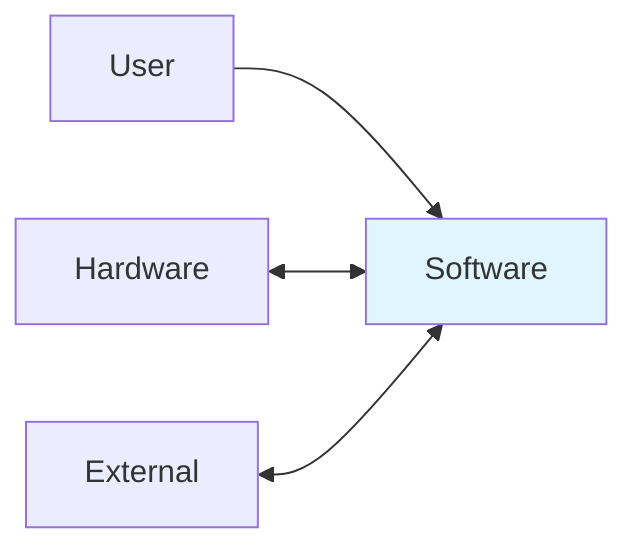
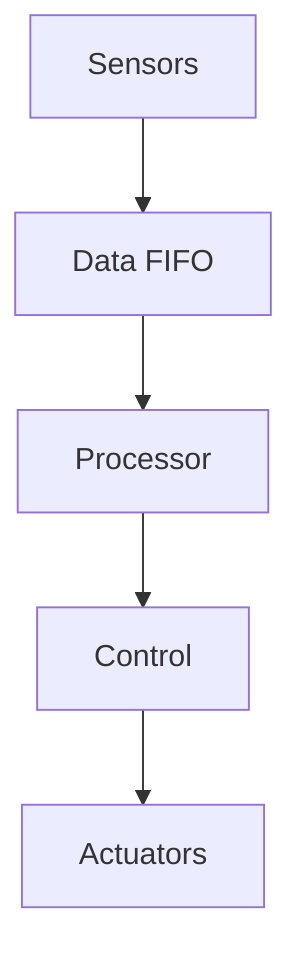
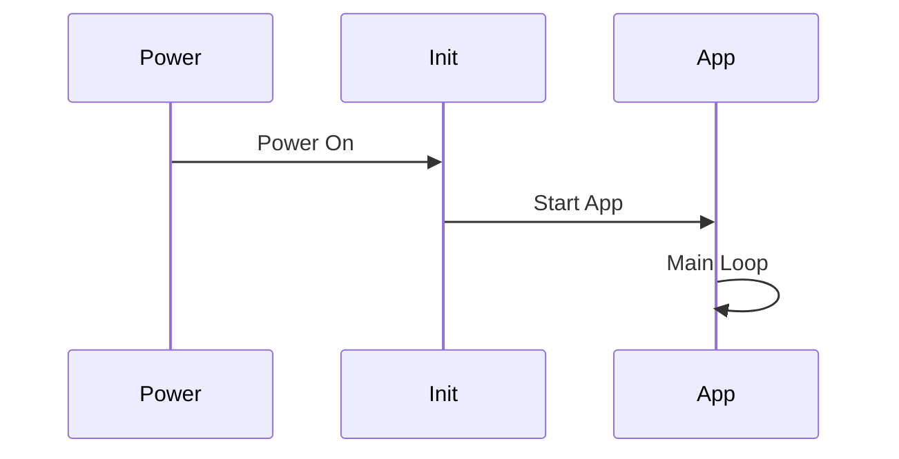
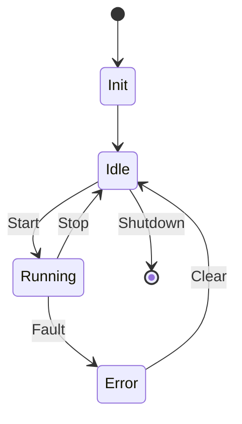

# Software Design Description (SDD)

**Project:** sample rf
**Document:** IEEE 1016-2009 Compliant
**Date:** 2026-04-16

---

## 1. Context Viewpoint

---

## 2. Composition Viewpoint

| Module | Description | File |
|--------|-------------|------|
| Main | Main application loop | main.c |
| HAL | Hardware abstraction | hal.c |
| Drivers | Device drivers | drivers/ |
| Comms | Communication | comms.c |

---

## 3. Logical Viewpoint

---

## 4. Interface Viewpoint

| Interface | Type | Functions |
|-----------|------|-----------|
| HAL | Internal | hal_init(), hal_read(), hal_write() |
| UART | Hardware | uart_init(), uart_send(), uart_recv() |
| SPI | Hardware | spi_transfer() |

---

## 5. Interaction Viewpoint

---

## 6. State Viewpoint

---

## 7. Resource Viewpoint

| Resource | Total | Used | Available |
|----------|-------|------|-----------|
| Flash | 256 KB | 64 KB | 192 KB |
| RAM | 64 KB | 32 KB | 32 KB |
| CPU | 100% | 60% | 40% |

---

## 8. Data Viewpoint

| Structure | Purpose |
|-----------|---------|
| sensor_data_t | Sensor readings |
| config_t | System config |
| error_log_t | Error logging |

---
